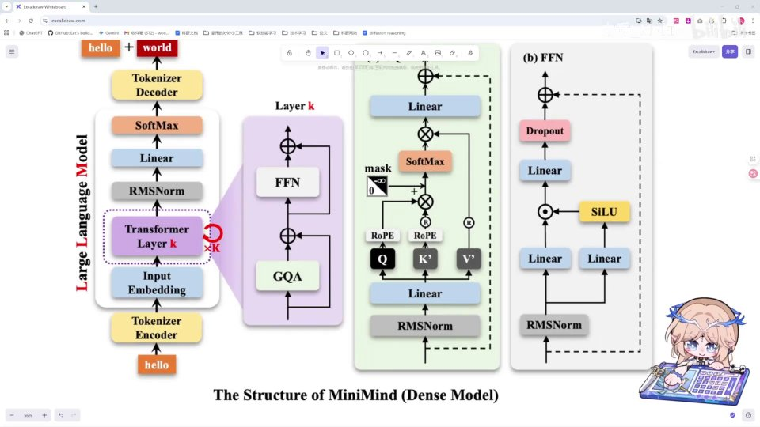
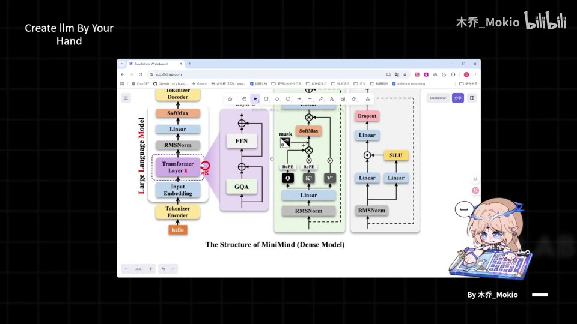
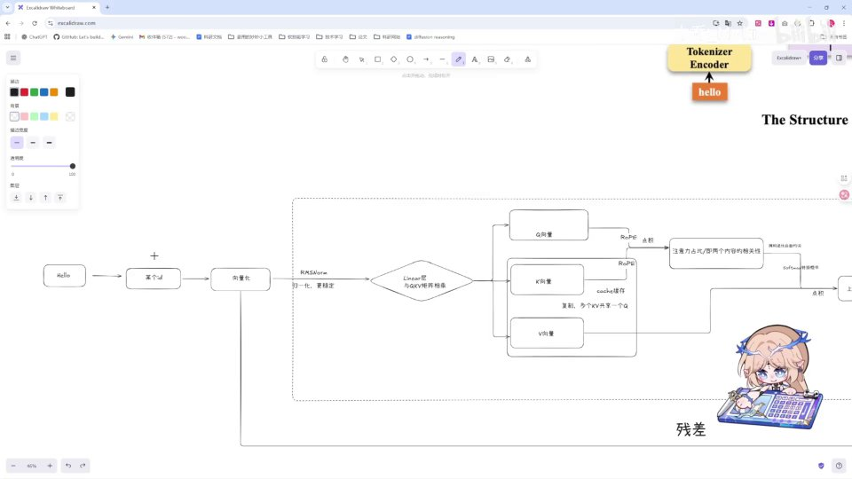
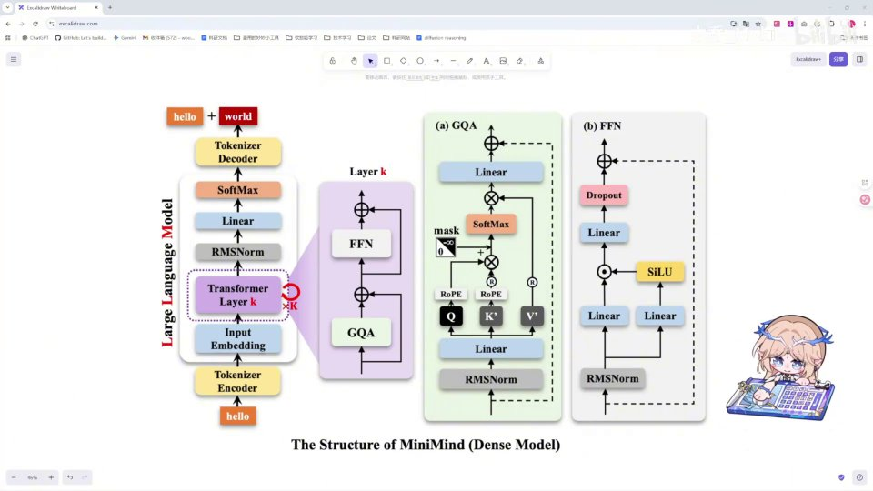
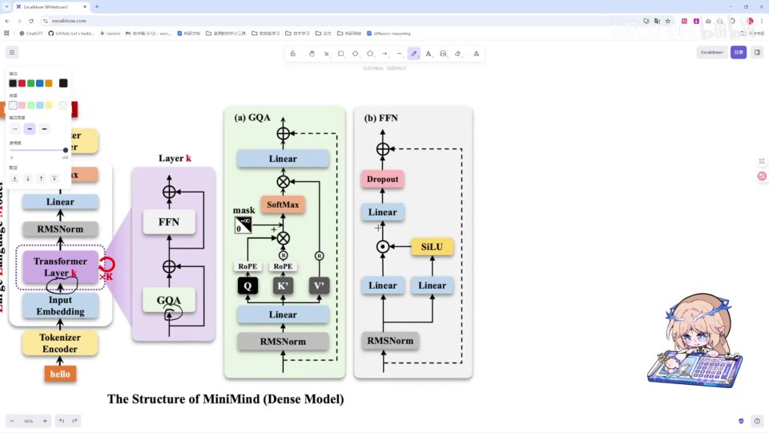
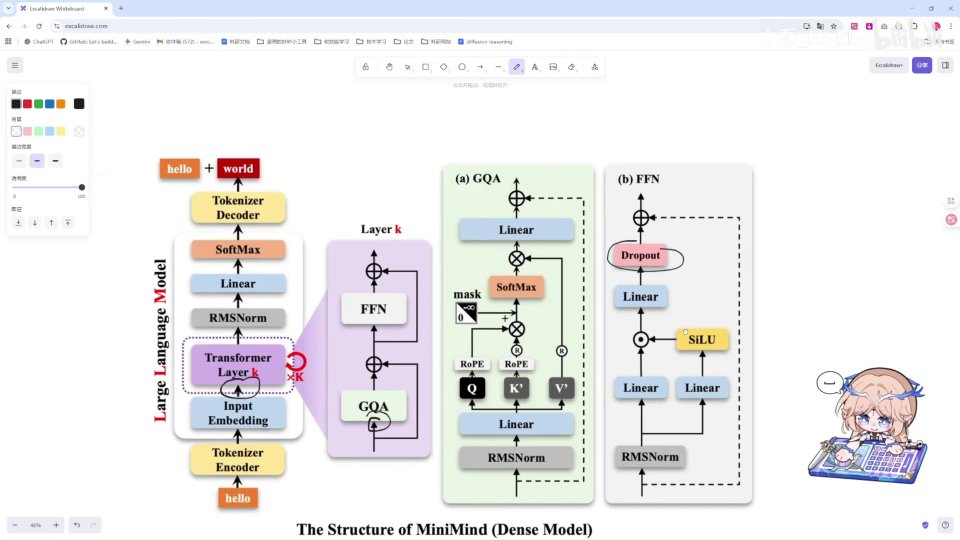
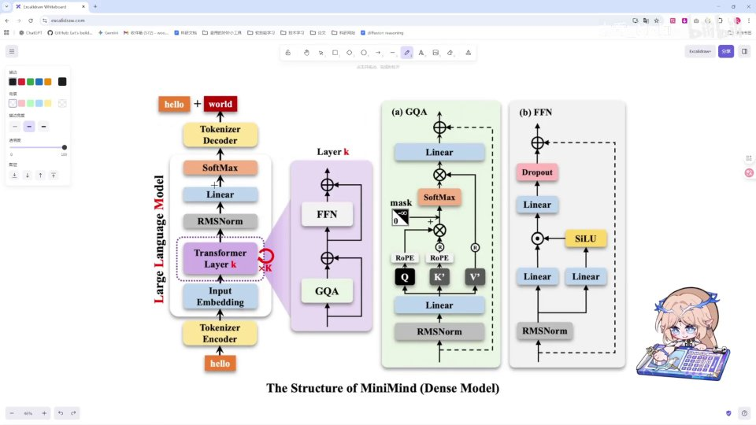

# 第5讲：架构图解读


## 本讲要解决的核心问题（SCQA）

**背景**：我们在学习任何深度学习模型之前，都会先遇到一张密密麻麻的"架构图"。就像著名的 Transformer 架构图一样，它把模型的每个零件、每条数据通路都画在一张图上，当我们读懂了它，后面的代码该写成什么样也就基本清楚了。[【跳转到 00:00】](https://www.bilibili.com/video/BV1T2k6BaEeC/?p=5&t=0)

**冲突**：可是 Minimind 的架构图里塞满了陌生名词——Tokenizer、Input Embedding、RMSNorm、GQA、RoPE、FFN、SiLU、Dropout、残差、Softmax……初学者一眼看过去，往往不知道从哪里读起，也不明白这些方框之间到底在传递什么。

**疑问**：这张图应该按什么顺序读？数据从输入的"hello"开始，一路经过了哪些阶段，最后又是怎样变成一个预测出来的词？每个模块大致负责什么？

**回答（中心思想）**：本讲是一堂**全局导览课**。我们不深挖任何单个模块的实现，只把整张图"串"成一条完整的流水线：**文本 → id → 向量 → 经过 K 层 Transformer（每层由 GQA 注意力 + FFN 两大部分组成，并配有残差与 RMSNorm）→ 映射到词表 → Softmax 得到概率 → 解码成下一个词**。你先对整个流程有一个最基础的印象，等学完后面所有知识再回头看这张图，就会豁然开朗。[【跳转到 00:31】](https://www.bilibili.com/video/BV1T2k6BaEeC/?p=5&t=31)

> 本讲不展开讲解图中 RMSNorm、Linear 等具体模块的实现，它们会被放到后面单独讲。[【跳转到 00:26】](https://www.bilibili.com/video/BV1T2k6BaEeC/?p=5&t=26)

---

## 一、为什么学模型要先学会看架构图

一句话结论：**架构图是模型和代码之间的"设计蓝图"，先看懂图，写代码就是照着蓝图施工。**

这个道理和盖房子一样。如果连图纸都没看明白就开始砌墙，很容易把承重墙拆了、把水电走向搞反。模型代码里那些层的顺序、层与层之间的连接方式、每个张量的形状变化，全都忠实地画在这张架构图上。

课程里展示的这张图，是从 Minimind 项目的 GitHub 仓库里"扒"下来的官方结构图。[【跳转到 00:15】](https://www.bilibili.com/video/BV1T2k6BaEeC/?p=5&t=15) 它的右下角标题写着 **"The Structure of MiniMind (Dense Model)"**，也就是 Minimind 这个小型大语言模型的整体结构。

这里先解释一个小概念：**Dense Model（稠密模型）**，指的是模型每一次前向计算都会把全部参数用上；与之相对的是 **MoE（Mixture of Experts，混合专家）** 这类"稀疏"结构，每次只激活一部分参数。Minimind 这一讲讲解的是稠密版本，所以图上没有专家路由的部分。

所以本讲的学习策略是：**不求甚解，但求贯通**。先像看地铁线路图一样，把"从头到尾经过哪些站"记住；至于每一站内部的细节，留给后续每一讲。

---

## 二、整体流水线：从"hello"到下一个词

先把最宏观的骨架说清楚。整张图可以分成**三段**：

1. **入口段（图的底部）**：文本进来，经过 Tokenizer 编码器变成 id，再经过 Input Embedding 变成向量。
2. **主干段（图的中部，紫色块）**：向量进入 Transformer 层，这个层会**重复 K 次**（图中标注了 `× K`），每一层内部又分为 **GQA** 和 **FFN** 两大部分。
3. **出口段（图的顶部）**：处理完的向量经过一个 Linear 层映射到整个词表，再经过 Softmax 变成概率，最后经 Tokenizer 解码器取出概率最大的词，作为预测结果输出。



我们课程里还画了这张图的一个更完整的版本，把 (a) GQA 和 (b) FFN 两个子模块也单独拆开画了出来。[【跳转到 00:15】](https://www.bilibili.com/video/BV1T2k6BaEeC/?p=5&t=15)



**为什么要有 K 次重复？** 因为一层 Transformer 只能做一次"浅层"的信息交互，重复堆叠 K 层（比如 8 层、16 层），模型才能逐层提取越来越抽象、越来越高级的语言特征。就好比读一句话，第一遍只看懂字面，多读几遍才能理解语气、语境和言外之意。

---

## 三、入口：文本怎么变成向量

结论先行：**模型不认字，只认数字；入口段的任务就是把"hello"这种人类文本，翻译成一串模型能计算的向量。**

### 3.1 Tokenizer 编码：把词变成 id

我们输入一个 `hello`。[【跳转到 00:41】](https://www.bilibili.com/video/BV1T2k6BaEeC/?p=5&t=41)

它首先会经过 **Tokenizer Encoder**（分词器编码器），被编码成一个 **id**。[【跳转到 00:46】](https://www.bilibili.com/video/BV1T2k6BaEeC/?p=5&t=46)

- **是什么**：Tokenizer（分词器）负责把连续的文本切分成一个个"词元"（token），并给每个 token 分配一个整数编号，也就是 id。
- **为什么需要**：神经网络只能处理数字，不能直接处理字符串。
- **举个例子**：`hello` 输入后会被 Tokenizer 编码成某个 id，比如 `1234567` 这样的整数。[【跳转到 00:53】](https://www.bilibili.com/video/BV1T2k6BaEeC/?p=5&t=53)

你可以把 Tokenizer 想象成一本"字典/密码本"：查一下 `hello` 在哪一页，取出对应的页码号，交给模型。

### 3.2 Input Embedding：把 id 变成向量

拿到 id 之后，它还要经过 **Input Embedding**（输入嵌入层）变成向量。[【跳转到 00:58】](https://www.bilibili.com/video/BV1T2k6BaEeC/?p=5&t=58)

- **是什么**：Embedding 层本质上是一张巨大的查找表，把每个 id 映射成一个固定长度的高维向量（例如 512 维）。
- **为什么需要**：一个孤零零的整数无法表达语义；变成向量之后，语义相近的词在向量空间里距离也相近，模型才能进行"加减乘除"式的运算。
- **怎么做**：查表取出该 id 对应的那一行向量。这一步之后，就会把一个**张量**（标量/向量/矩阵的高维推广）转换成送入主干网络的输入张量。

到这一步，我们手里就有了一个代表 `hello` 的向量，接下来它要进入模型的心脏——Transformer 层。

下图是这条入口流水线刚起步时的画面：`Hello → 某个 id → 向量化`，随后进入 RMSNorm 与 Linear 层去做 Q/K/V：



---

## 四、Transformer 层：模型的主干

结论先行：**Transformer 层是 Minimind 的运算核心，它由 GQA 和 FFN 两大部分组成，并被重复 K 次。**

向量经过 Input Embedding 之后，会送入 Transformer 层，并**循环 K 次**——图中明确标了这个 `× K`，也就是要经过 K 次循环之后再输出。[【跳转到 01:03】](https://www.bilibili.com/video/BV1T2k6BaEeC/?p=5&t=63)

我们重点拆开看这个最重要的 Transformer 层。它分为两大部分：**[【跳转到 01:15】](https://www.bilibili.com/video/BV1T2k6BaEeC/?p=5&t=75)**

- **一个 FFN**（Feed-Forward Network，前馈网络）：一个专门用来处理数据、做非线性变换的层；
- **一个 GQA**（Grouped-Query Attention，分组查询注意力）：一种"分组、共享 K 和 V"的注意力机制。

数据先经过 GQA 做注意力（让词与词之间互相交流信息），再进入 FFN 做逐位置的特征加工（对每个词独立做非线性变换）。两大部分中间和两端都用**残差连接**贯穿着（图中的虚线），这套"注意力 + 前馈 + 残差"就是每一层 Transformer 的标准配方。

下图把 (a) GQA 和 (b) FFN 两个子模块单独框了出来，可以对照着看：



---

## 五、GQA：分组共享 K/V 的多头注意力

结论先行：**GQA 是 Transformer 里负责"让词与词互相交换信息"的模块，它通过 Q/K/V 三个向量算出注意力权重，再用多组注意力（多头）从不同角度理解句子。**

我们沿着数据流一步步走。

### 5.1 先做归一化：RMSNorm

进入 GQA 之后，数据**首先经过 RMSNorm**。[【跳转到 01:28】](https://www.bilibili.com/video/BV1T2k6BaEeC/?p=5&t=88)

- **现在不必深究它的公式**，你只需要知道它的作用是：**对数据进行处理，让数据更加规律、稳定**，之后再送入 Linear 层。
- 课程也特别说明，RMSNorm 的细节会放在后面章节单独讲，这里只记"它是进入子模块前的稳定器"。

### 5.2 Q/K/V 三个向量：与三个权重矩阵相乘

在这个 Linear 层里，输入向量会分别和 **W_Q、W_K、W_V 三个矩阵**相乘，得到 **Q、K、V 三个向量**。[【跳转到 01:53】](https://www.bilibili.com/video/BV1T2k6BaEeC/?p=5&t=113)

- **Q（Query，查询）**：当前词"想找什么信息"；
- **K（Key，键）**：每个词"能提供什么信息"的标签；
- **V（Value，值）**：每个词"实际携带的内容"。

打个比方：你在图书馆找书，Q 是你脑子里的检索需求，K 是每本书书脊上的标签，V 是书里的内容。用你的 Q 去和所有 K 比对，找到最相关的书，再把对应的 V 取出来。

### 5.3 RoPE 位置编码：把"顺序"融进去

得到 Q、K、V 之后，**Q 向量和 K 向量会经过 RoPE 旋转位置编码**，融入位置信息。[【跳转到 01:53】](https://www.bilibili.com/video/BV1T2k6BaEeC/?p=5&t=113)

- **为什么需要**：注意力机制本身是"位置无关"的——如果不加位置信息，"我打你"和"你打我"在它眼里可能没区别。RoPE 通过旋转的方式，把每个词的先后顺序编码进向量里。
- 这一块后面也会单独讲。

### 5.4 K/V 共享：GQA 的关键设计

然后 **K 和 V 会自我复制，去让 Q 共享多个 K 和 V**。[【跳转到 01:53】](https://www.bilibili.com/video/BV1T2k6BaEeC/?p=5&t=113)

这正是 **GQA（分组查询注意力）** 名字的来历：**多个 Q 分组共享同一份 K 和 V**。
- 传统的多头注意力（MHA）里，每个头都有自己独立的 Q、K、V，参数多、KV 缓存大；
- 极端省内存的做法是 MQA，所有头共用一份 K、V，但效果会打折；
- **GQA 取了折中**：把 Q 分成若干组，每组共享一份 K、V。既省下大量显存（尤其在推理时），又基本保住效果。这就是 Minimind 选择 GQA 的原因。

### 5.5 点积 → 掩码 → Softmax → 点乘 V

接下来是注意力的核心计算：

1. **Q 和 K 做点积**：得到一张类似表格的东西，会计算出"注意力侧重"。[【跳转到 02:18】](https://www.bilibili.com/video/BV1T2k6BaEeC/?p=5&t=138) 这张表格里的每个数，表示当前词对句中每个词的关注程度。
2. **经过掩码（mask）**：因为这是生成式模型，预测时不能"偷看"未来的词，所以要用掩码把未来位置挡住。[【跳转到 02:43】](https://www.bilibili.com/video/BV1T2k6BaEeC/?p=5&t=163)
3. **经过 Softmax 函数转化成概率**：把一堆分数变成 0~1 之间、总和为 1 的权重。
4. **再和 V 进行点乘**：按注意力权重对各个词的 V 加权求和，得到这一层的注意力输出。
5. **再经过一个 Linear 层**：这个 Linear 层是用来处理多头注意力的，因为**我们并不会用单头注意力**，而是**在 Linear 层这里把多头拼接起来再送出来**。[【跳转到 02:43】](https://www.bilibili.com/video/BV1T2k6BaEeC/?p=5&t=163)


下图是注意力计算进行到 Q/K 点积那一步时的画面，可以对照理解"注意力表格"是怎么产生的：


**什么是多头注意力？** 就是让模型用好几套独立的 Q/K/V 并行地看同一句话，每套（每个"头"）关注不同的关系——有的头盯着语法，有的头盯着指代，有的头盯着远近位置。最后把所有头的输出拼起来，再经 Linear 融合。多一双眼睛，就多一个理解角度。

---

## 六、FFN：升维—激活—门控—降维

结论先行：**FFN 负责对每个词独立地做非线性变换，它先用两层 Linear 升维、经 SiLU 激活，再用门控相乘筛选信息，最后降维回来。**

注意力输出送出来后，进入 FFN。[【跳转到 02:43】](https://www.bilibili.com/video/BV1T2k6BaEeC/?p=5&t=163) 它的处理流程如下：

1. **先做 RMSNorm**：同样地，先对数据做一次归一化，让数据更规范。[【跳转到 02:59】](https://www.bilibili.com/video/BV1T2k6BaEeC/?p=5&t=179)
2. **进入两个 Linear 层升维**：对我们送进来的张量进行升维（把特征维度放大，比如放大到原来的若干倍），给模型更大的"想象空间"。
3. **经过 SiLU 激活函数引入非线性**：如果只有线性变换，多层叠加还是等价于一层，模型表达不出复杂函数。激活函数引入了非线性，让网络具备强大的拟合能力。
4. **逐元素相乘（门控）**：它相当于一个门一样，去筛选哪些信息可以流入。[【跳转到 03:24】](https://www.bilibili.com/video/BV1T2k6BaEeC/?p=5&t=204) 这种"用一部分信号去控制另一部分信号"的结构，就是经典的 **门控机制**（常称为 SwiGLU）。
5. **再经过一个 Linear 层降维**：因为前面升了维，所以这一步的作用就是**降维**，把原来升上去的维度再降回来。
6. **Dropout 防止过拟合**：随机"丢弃"一部分神经元，避免模型死记训练数据，提升泛化能力。[【跳转到 03:24】](https://www.bilibili.com/video/BV1T2k6BaEeC/?p=5&t=204)



**用一句话概括 FFN**：先把信息"翻箱倒柜地摊开"（升维），用非线性激活加工，再用门控挑出有用的，最后收拢回去（降维），并顺手做一次防过拟合。

下图把架构图里的 Dropout 位置高亮了出来，可以清楚看到它位于 FFN 内部、降维之后的位置：



---

## 七、残差与归一化：让深层网络"稳得住"

结论先行：**图中反复出现的虚线是残差连接，它把模块的输入原样加到输出上，配合 RMSNorm，让网络又深又稳。**

### 7.1 残差网络：给信息留一条"高速公路"

无论是 GQA 还是 FFN 里，都有这条**虚线**，它就是**残差网络（residual，残差连接）**。[【跳转到 03:39】](https://www.bilibili.com/video/BV1T2k6BaEeC/?p=5&t=219)

- **是什么**：把模块**最初的状态保留下来**，等内部处理完之后，再和处理后的结果**相加**，然后送出来。[【跳转到 03:50】](https://www.bilibili.com/video/BV1T2k6BaEeC/?p=5&t=230)
- **为什么需要**：网络层数一深，原始信息很容易在层层传递中被"稀释"，梯度也容易消失。残差让原始信号有一条直接的通路，即便某个子模块学得不好，原始信息也不会丢。
- **怎么做**：相当于给每个子模块配一条"快捷通道"，公式上就是 `输出 = 子模块(输入) + 输入`。

这个作用后续也会专门讲，这里先记住它是一种"保底 + 加速训练"的设计。

### 7.2 RMSNorm：处理完再稳定一次

经过 **GQA + 残差、FFN + 残差** 之后，会再送入 RMSNorm 进行数据的稳定处理。[【跳转到 03:50】](https://www.bilibili.com/video/BV1T2k6BaEeC/?p=5&t=230)

也就是说，RMSNorm 不只出现在每个子模块的**入口**，在主干的**出口**还会再做一次规整。这种"入口归一化 + 出口归一化"的安排，让每一层输入输出的数值范围都保持在一个稳定区间，深层堆叠时训练才不容易崩。

---

## 八、出口：从向量到"下一个词"

结论先行：**主干输出的向量要经过一个 Linear 层映射到整个词表，再经 Softmax 变成概率，最后由 Tokenizer 解码器取出概率最大的词。**

处理完的向量再送入一个 **Linear 层**。[【跳转到 04:09】](https://www.bilibili.com/video/BV1T2k6BaEeC/?p=5&t=249)

- **作用**：把得到的 **logits**（注意力分数/未归一化的打分）**映射到整个词表里**。
- **怎么做**：模型有一个很大的词表，这个 Linear 层会为**词表里的每一个词**都算出一个分数，告诉我们"每个词被预测到的概率应该是多少"。
- **Softmax 转概率**：把这些分数经过 Softmax 转化成概率，谁的概率最大，谁就最可能是下一个词。
- **Decoder 解码**：因为前面是 **encoder（编码）**，所以这里一定要 **decode（解码）**。通过 Tokenizer 的**解码器**，把概率最大的词的 id 换回人类可读的 **word（词）**。[【跳转到 04:34】](https://www.bilibili.com/video/BV1T2k6BaEeC/?p=5&t=274)

下图展示了 Softmax、Linear 映射词表与 Tokenizer Decoder 这一段出口流程：



至此，一个完整的"输入 hello → 预测下一个词"的前向过程就结束了。这也是所有自回归语言模型生成文本的基本单位：**预测出下一个词，再把它拼回输入，重复这个过程，就得到一整段话。**

---

## 九、完整流水线复盘：把整张图串成一条线

课程最后画了一张完整的"流水线图"，把前面所有步骤按顺序连了起来。[【跳转到 04:34】](https://www.bilibili.com/video/BV1T2k6BaEeC/?p=5&t=274) 我们照着它走一遍：

**阶段一：入口**
- `hello` 经过 Tokenizer 变成 id；
- 向量化（Input Embedding）之后，**保存下初始的向量，留作后续残差使用**；
- 经过 RMSNorm，送入 GQA 层。

**阶段二：GQA**
- 在层内进行 Q、K、V 的相乘，Q、K、V 分别处理；
- 在 Linear 层进行多头拼接，然后归一化；
- 在这里把**原本的残差加进来**，然后再保留一份，用到后面的残差。


**阶段三：FFN**
- 在 FFN 里先升维、再降维；
- 门控筛选信息；
- 在 Linear 层降维，然后 Dropout 防止过拟合；
- 再在这里把残差加起来，之后 RMSNorm 处理。


**阶段四：出口**
- RMSNorm 之后，Linear 层映射全词表，Softmax 层得到概率；
- 经过 Tokenizer Decoder 解码，得到最终的 word。

以上这一整套动作，会在主干里被 **重复 K 次**（K 层 Transformer）。把它画成一条算式，大致是：

```
hello
  → Tokenizer 编码 → id
  → Input Embedding → 向量（保存初始，供残差复用）
  → [ RMSNorm → GQA（Q/K/V、RoPE、注意力、多头拼接）→ 加残差
      → RMSNorm → FFN（升维、SiLU、门控、降维、Dropout）→ 加残差 ] × K
  → RMSNorm → Linear 映射词表 → Softmax → Tokenizer 解码 → 下一个词
```

课程最后也特别安慰大家：**如果这一 part 听得有些迷惑，不用担心，对整整个流程有一个了解就好。**[【跳转到 05:11】](https://www.bilibili.com/video/BV1T2k6BaEeC/?p=5&t=311) 因为每个模块的公式和代码细节，都会在后面每一讲里逐一拆解。这一讲的目标只有一个——建立全局地图。

---

## 十、本讲是导览，不是终点

到这里，我们已经把 Minimind 的架构图从头到尾走了一遍。回顾本讲的目标：**不是让你立刻会写每一行代码，而是让你脑子里先有一张"地图"。**

这张地图的价值在于：后面无论讲 RMSNorm、RoPE、GQA、FFN，还是讲残差、Dropout、Softmax，你都能立刻反应过来——"哦，它在架构图的哪个位置，它前面接什么、后面送什么"。这就像学一门语言先学语法框架，之后再往里填单词和句型。

下一趴，课程就会正式开始代码的讲解和项目的构建。[【跳转到 05:33】](https://www.bilibili.com/video/BV1T2k6BaEeC/?p=5&t=333)

---

## 小结

- **先看图再写码**：架构图是模型与代码之间的设计蓝图，Minimind 这一讲只做全局导览，具体模块后续单独讲。
- **三段式骨架**：入口段（Tokenizer + Input Embedding）→ 主干段（Transformer 层 × K）→ 出口段（Linear + Softmax + Tokenizer 解码）。
- **Transformer 层 = GQA + FFN**：先注意力（让词与词交流），再前馈（逐词非线性加工），外面套残差与归一化。
- **GQA 的核心**：Q/K/V 三向量、RoPE 融合位置、K/V 自我复制让多个 Q 共享，点积 → mask → Softmax → 与 V 点乘 → 多头拼接。
- **FFN 的核心**：RMSNorm → 两个 Linear 升维 → SiLU 激活 → 门控逐元素相乘 → Linear 降维 → Dropout。
- **残差 + RMSNorm**：虚线残差把输入原样加回输出，配合归一化，让深层网络又稳又好训。
- **出口生成下一个词**：Linear 映射全词表 → Softmax 得概率 → Tokenizer 解码器取概率最大的词。
- **循环 K 次**：整套 Transformer 动作重复 K 层，逐步提取越来越抽象的语言特征。

## 关键术语速查

| 术语 | 一句话解释 |
| --- | --- |
| Transformer | 大语言模型的主干结构，由多层"注意力 + 前馈"堆叠而成。 |
| Tokenizer（分词器） | 把文本切成 token 并映射成整数 id 的"密码本"；编码器做文本→id，解码器做 id→文本。 |
| Token / id | 文本被切分后的最小单元叫 token，它的整数编号叫 id。 |
| Input Embedding（输入嵌入） | 一张查找表，把每个 id 映射成一个固定长度的高维向量。 |
| 张量（Tensor） | 标量、向量、矩阵向更高维的推广，是模型里数据的基本单位。 |
| GQA（分组查询注意力） | 把多个 Q 分成若干组、每组共享同一份 K 和 V 的注意力，兼顾效果与显存。 |
| Q / K / V | 查询、键、值三个向量：Q 想找什么、K 提供标签、V 携带内容。 |
| 点积 | Q 与 K 相乘，得到每个词对其余词的注意力分数。 |
| RoPE（旋转位置编码） | 通过旋转的方式把词的先后顺序融进 Q/K 向量。 |
| mask（掩码） | 生成式模型里挡住"未来词"、防止偷看的机制。 |
| Softmax | 把一组任意分数变成 0~1、总和为 1 的概率分布。 |
| 多头注意力（Multi-Head） | 用多组独立的 Q/K/V 并行看同一句话，再拼接融合，从多个角度理解语义。 |
| FFN（前馈网络） | Transformer 里逐位置做非线性变换的子模块，通常先升维后降维。 |
| SiLU | 一种平滑的激活函数，用来给网络引入非线性。 |
| 门控 / SwiGLU | 用一部分信号去筛选另一部分信号的结构，控制哪些信息可以通过。 |
| Dropout | 训练时随机丢弃一部分神经元，防止过拟合。 |
| 残差连接（Residual） | 把模块输入原样加到输出上（虚线），保住原始信息、缓解梯度消失。 |
| RMSNorm | 一种归一化方法，让数据更规律稳定，分模块入口与出口两处使用。 |
| logits | 模型对词表每个词给出的未归一化分数，经 Softmax 后成为概率。 |
| Dense Model（稠密模型） | 每次前向都使用全部参数的模型，与之相对的是 MoE 稀疏模型。 |
