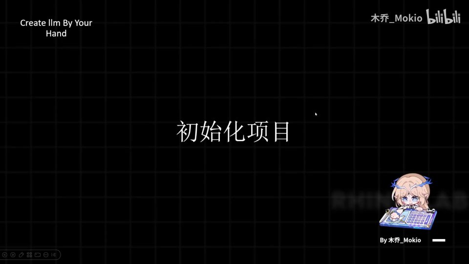
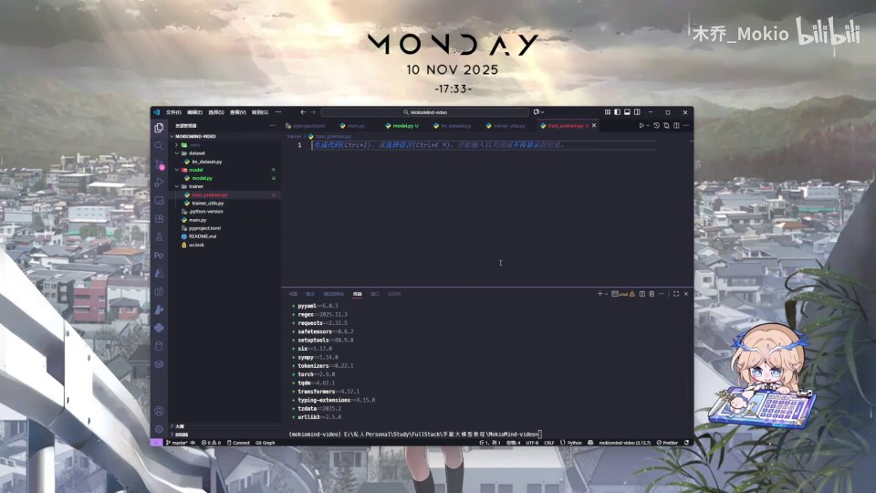
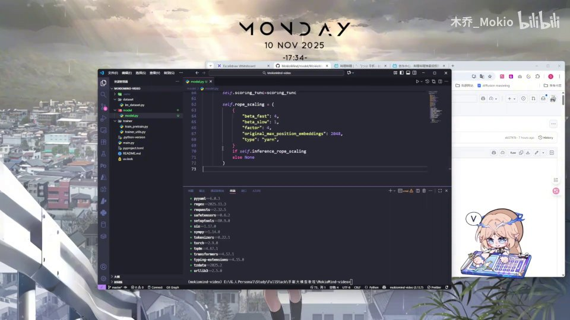

# 第6讲：初始化项目



## 本讲要解决的核心问题（SCQA）

**背景**：前面几讲我们已经梳理清楚了 Minimind 这个从零手写大模型项目的整体思路和学习路线，知道了接下来要一行行敲出模型、数据集和训练脚本。

**冲突**：真正开始写代码之前，面对的可能只是一个空文件夹——没有项目结构、没有依赖库、没有虚拟环境，模型该放在哪个目录、训练脚本该怎么组织，全都还没有着落。如果随手乱建文件，后面代码越写越多就会一团乱麻；如果依赖版本对不上，模型可能根本跑不起来。

**疑问**：那么，一个"从零手写大模型"的项目，第一天到底应该怎么把地基打好？需要哪些工具、哪些文件夹、哪些配置？

**回答（中心思想）**：**初始化项目不是"随便建几个文件"，而是用现代 Python 工具链（uv + pyproject.toml）一次性把环境、依赖和代码骨架搭稳，再用一个统一的配置类（PretrainedConfig）锁定模型参数，最后立刻用 git 提交，把地基固化下来。** 本讲就按这个顺序，把整块地基铺好。

用一句老话说就是"磨刀不误砍柴工"——先把工具和环境准备好，后面写代码才会顺。

[【跳转到 00:00】](https://www.bilibili.com/video/BV1T2k6BaEeC/?p=6&t=0)

---

## 一、工欲善其事：先准备一个空文件夹，再用 uv 初始化

### 1.1 为什么用 uv 而不是传统 pip

**是什么**：uv 是一个用 Rust 写的、速度极快的 Python 包管理与环境管理工具。它把过去需要好几个工具（pip 装包、venv 建虚拟环境、pip-tools 锁版本）才能做的事，合并到了一条命令里。

**为什么需要**：传统方式下，你要先 `python -m venv` 建虚拟环境，再 `pip install` 装依赖，装完还要手动 `pip freeze` 导出清单，步骤零散、速度慢、还容易出现"我这能跑、你那跑不了"的版本地狱。uv 则用一个 `pyproject.toml` 描述依赖、用 `uv.lock` 锁定精确版本，让环境可复现。

**怎么做**：第一步，准备一个空的文件夹作为项目根目录；第二步，用 `uv init` 在这个文件夹里初始化一个 Python 项目。

[【跳转到 00:07】](https://www.bilibili.com/video/BV1T2k6BaEeC/?p=6&t=7)

> 如果你对 uv 完全不了解，UP 主在视频里也强烈推荐了它之前做的《现代化 Python 工具指南》那期视频。那期内容系统地讲了 IDE 配置、uv、pyproject.toml、ruff、pyright 等工具，非常值得先看一遍——基础打牢，后面才不慌。

[【跳转到 00:12】](https://www.bilibili.com/video/BV1T2k6BaEeC/?p=6&t=12)


---

## 二、用 pyproject.toml 声明项目信息与依赖

`uv init` 会生成几个文件（比如 `.python-version`、`main.py`、`pyproject.toml`、`README.md`），其中最关键的是 **`pyproject.toml`**。

**是什么**：`pyproject.toml` 是 Python 项目现在的"官方配置清单"，用 TOML 格式写成。它既能声明项目叫什么、什么版本、需要哪个 Python 版本，也能声明项目依赖了哪些第三方库。

**为什么需要**：把依赖写进一个标准文件，别人拿到你的项目后只要一条命令就能装出一样的环境；你自己换台电脑也能一键复原。它取代了过去零散的 `requirements.txt`、`setup.py` 等。

**怎么做**：UP 主的做法是把自己写好的 `pyproject.toml` 直接复制粘贴过来，其中 `dependencies` 一节就是项目要装的依赖列表。

[【跳转到 00:37】](https://www.bilibili.com/video/BV1T2k6BaEeC/?p=6&t=37)

![VS Code 里的 pyproject.toml，展示了 [project] 元数据与 dependencies 依赖列表，是项目声明的核心文件](assets/第06讲_初始化项目/00049.jpg)

[【跳转到 00:44】](https://www.bilibili.com/video/BV1T2k6BaEeC/?p=6&t=44)

---

## 三、uv sync：一条命令完成依赖安装与虚拟环境搭建

依赖声明好了，接下来就是安装。UP 主直接用：

```bash
uv sync
```

**它做了什么**：`uv sync` 会读取 `pyproject.toml`，自动创建/同步虚拟环境（`.venv`），然后按依赖清单把所有包装好，并生成 `uv.lock` 锁定精确版本。也就是说，**建环境和装依赖这两件事，一条命令就全干完了**。

**为什么有时快有时慢**：UP 主解释说，第一次装这些包会比较慢；因为它之前已经装过、有缓存，所以这次会明显快一些。这是正常现象，不必担心。

[【跳转到 00:49】](https://www.bilibili.com/video/BV1T2k6BaEeC/?p=6&t=49)

装完后，终端里会列出装好的包。对 Minimind 来说，核心依赖包括深度学习框架、以及后面要用到的各类工具库。装好后还要记得**激活虚拟环境**，让后续命令都跑在这个隔离环境里。


[【跳转到 00:54】](https://www.bilibili.com/video/BV1T2k6BaEeC/?p=6&t=54)

---

## 四、趁等待的时间，规划出项目骨架

UP 主很聪明：**在依赖安装的等待过程中，顺手把文件夹结构想清楚**。大模型项目基本可以拆成三块，各司其职：

1. **`model/`**：存放模型本身的代码，也就是我们最初始的 `model.py`，负责定义网络结构。
2. **`trainer/`**：专门用来训练。这里先新建两个文件——一个是 `trainer/trainer.py`，用来放训练时通用的一些工具类函数；另一个是预训练脚本（`train_pretrain.py`）。
3. **`dataset/`**：处理数据集相关的内容，之后再往里加文件，负责后续加载数据集。

**为什么这样分**：模型、训练、数据是三条相对独立的线索，分开目录才能"高内聚、低耦合"。模型只管"网络长什么样"，训练只管"怎么优化"，数据只管"喂什么进去"，互不干扰，后面每一块都能单独讲、单独改。

**怎么做**：激活虚拟环境后，在 `model/` 里写上最初始的 `model.py`；在 `dataset/` 里加一个稍后加载数据集用的文件；在 `trainer/` 里建好上面两个脚本。这样，一个清晰的文件结构就搭好了。

[【跳转到 01:19】](https://www.bilibili.com/video/BV1T2k6BaEeC/?p=6&t=79)


[【跳转到 01:44】](https://www.bilibili.com/video/BV1T2k6BaEeC/?p=6&t=104)

---

## 五、模型配置别自己瞎写，直接复制官方仓库

骨架搭好后，UP 主给了一个非常实用的建议：**模型相关的设置，直接去复制它 GitHub 代码里的内容**，尤其是整个 config 的部分。

[【跳转到 02:09】](https://www.bilibili.com/video/BV1T2k6BaEeC/?p=6&t=129)

为什么要抄而不是自己写？因为大模型的参数配置牵一发动全身，隐藏层维度、层数、注意力头数、词表大小……任何一个数字写错都可能让模型跑不起来或效果崩掉。参考一份经过验证的官方配置，是初学者最稳妥的起步方式。




[【跳转到 02:21】](https://www.bilibili.com/video/BV1T2k6BaEeC/?p=6&t=141)

---

## 六、理解 PretrainedConfig：把"模型参数"定义成一份配置

复制过来的 config 到底是什么？UP 主说得很实在：**你现在不需要完全搞懂它，想知道细节可以去问 AI**。不过为了 blog 读者，这里把它讲清楚。

**是什么**：`PretrainedConfig` 是 HuggingFace 的 `transformers` 库里的一个类。[【跳转到 02:31】](https://www.bilibili.com/video/BV1T2k6BaEeC/?p=6&t=151)

**为什么需要**：它相当于**明确规定了你的整个模型有哪些参数、长什么样子**。比如词表有多大、隐藏层多宽、有多少层、注意力有多少个头。当你用 HuggingFace 去加载一个别人家的模型时，库就会给你这样一份 config，里面写着那个模型定义的架构，包括隐藏层的各项参数。

**怎么做**：**通过继承 `PretrainedConfig` 类，你就可以把自己模型的参数定义下来**，同时让这份配置能被 HuggingFace 生态识别、上传和复用。也就是说，你写一个自己的 `MinimindConfig(PretrainedConfig)`，在 `__init__` 里把参数一项项声明出来，模型就"有据可依"了。


[【跳转到 02:36】](https://www.bilibili.com/video/BV1T2k6BaEeC/?p=6&t=156)

配置类里除了常规参数，还可能包含更进阶的设置，例如针对长文本的位置编码缩放（如 `rope_scaling`）等，这些会在后续模型结构相关章节里展开讲解。



[【跳转到 03:01】](https://www.bilibili.com/video/BV1T2k6BaEeC/?p=6&t=181)

---

## 七、最后一步：commit 一下，防止代码流失

项目初始化完成的标志，不是文件建好了，而是**把它存进版本控制**。

UP 主特意强调：一定要养成好习惯，把 git 仓库提交一下，比如提交一个 `init project`，防止代码意外丢失。

**为什么需要**：大模型项目代码量大、迭代频繁，没有版本控制，改错一行想回退都难。第一个 commit 就像给地基拍了张照片，往后每一步都能追踪、都能回退。

[【跳转到 03:26】](https://www.bilibili.com/video/BV1T2k6BaEeC/?p=6&t=206)

---

## 小结

- **初始化项目 = 搭环境 + 定配置 + 立骨架 + 存版本**，四件事一次做完，地基才算稳。
- **uv 是核心工具**：`uv init` 建项目，`uv sync` 一条命令搞定依赖安装与虚拟环境，比传统 pip + venv 更快更可复现。
- **pyproject.toml 是项目说明书**：项目元数据和依赖都写在里面，是环境可复现的关键。
- **目录分三块**：`model/`（网络结构）、`trainer/`（训练脚本与通用工具）、`dataset/`（数据处理），职责分明。
- **配置优先抄官方**：模型参数牵一发动全身，先复制经过验证的 config，别自己拍脑袋。
- **PretrainedConfig 是配置的模板**：继承它，就能把自己的模型参数规范化地定义并接入 HuggingFace 生态。
- **第一时间 commit**：`init project` 是给你的代码上的第一道保险。
- 下一块，正式进入代码学习。

[【跳转到 03:41】](https://www.bilibili.com/video/BV1T2k6BaEeC/?p=6&t=221)

---

## 关键术语速查

| 术语 | 一句话解释 |
| --- | --- |
| uv | 用 Rust 写的现代 Python 包/环境管理工具，速度快、步骤少 |
| `uv init` | 在一个文件夹里初始化 Python 项目的命令 |
| `uv sync` | 读取 pyproject.toml，自动建虚拟环境并安装依赖 |
| pyproject.toml | Python 项目的标准配置清单，声明元数据与依赖 |
| uv.lock | 锁定所有依赖精确版本的文件，保证环境可复现 |
| 虚拟环境（venv / .venv） | 与系统隔离的 Python 运行环境，避免依赖互相污染 |
| model/ | 存放模型网络结构代码的目录 |
| trainer/ | 存放训练脚本与通用工具函数的目录 |
| dataset/ | 存放数据集加载与处理代码的目录 |
| PretrainedConfig | HuggingFace transformers 库里的配置基类，用于定义模型参数 |
| HuggingFace | 主流的开源模型与工具库生态（transformers 等） |
| git commit | 把当前改动保存进版本库，形成可回退的历史节点 |
