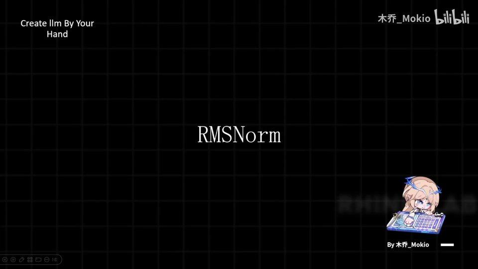
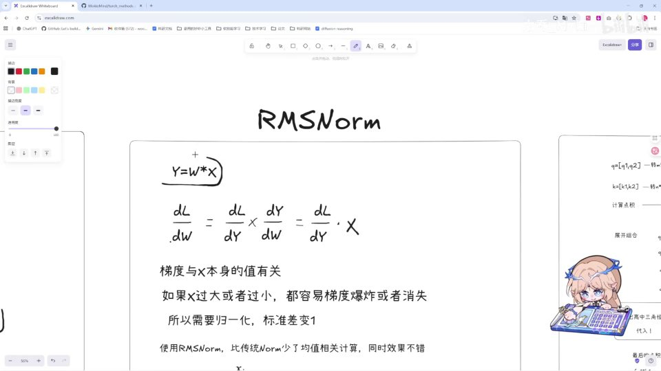
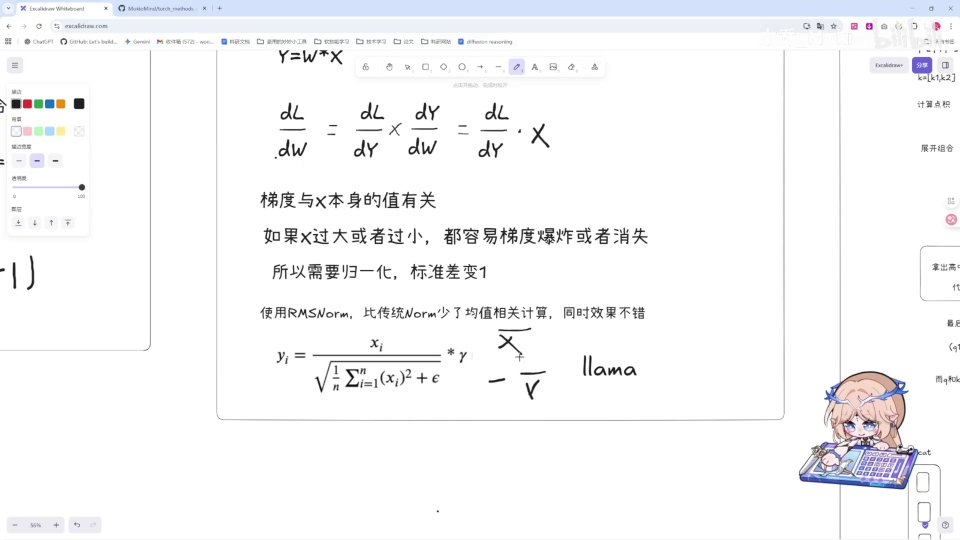

# 第7讲：理论：RMSNorm

> Minimind 系列精读 · 第 7 讲（分 P 07）

## 本讲要解决的核心问题（SCQA）

**背景**：在我们一路看过的 Transformer 架构图里，有一个模块反反复复地出现——它不负责"计算"，却几乎出现在每一个子层的入口处。它的名字叫 **RMSNorm**。前面几讲我们已经认识了 attention、残差、位置编码这些"干活的"组件，而 RMSNorm 更像是每个组件上岗前的一道"体检"。

**冲突**：神经网络训练最怕两件事——**梯度爆炸**和**梯度消失**。数据一层一层往前传、又被一层一层的权重矩阵乘来乘去，数值尺度会越来越失控：要么大得震荡发散，要么小得像一根死线、再也学不动。如果不管这件事，模型根本训不起来。

**疑问**：为什么数据尺度会失控？归一化（norm）为什么能解决它？而 RMSNorm 相比传统的 LayerNorm 又省掉了什么、为什么效果还不错？

**回答（中心思想）**：**归一化就是给每一层数据做一次"尺度复位"，把标准差强行拉回 1，从而稳住梯度；RMSNorm 是这一思想的极简版——它只根据数据的均方根（RMS）来缩放，去掉了"减均值"这一步，计算更省，效果依然在线，因此被 Meta 用在了 LLaMA 里。** 本讲我们只讲理论，下一讲再落地到代码。



---

## 一、归一化在做什么：把每一层的数据拉回"标准身材"

### 1.1 从最朴素的直觉开始

我们先撇开 RMS 不谈，回答一个更根本的问题：**我们为什么需要 norm？**

答案是：**norm 的作用就是"归一化"（Normalization）**。而所谓归一化，用一句话定义就是——

> **让数据的平均值为 0、标准差为 1。**

[【跳转到 00:16】](https://www.bilibili.com/video/BV1T2k6BaEeC/?p=7&t=16)

这听起来很简单，但一定要把这两个数字的含义吃透，因为它是一切的出发点。

**均值（mean）为 0**：把所有数值加起来除以个数，结果为零。意思是数据"重心居中"，不整体偏高或偏低。比如一组数是 `[5, 6, 7]`，均值是 6；把它减去 6 变成 `[-1, 0, 1]`，均值就变成 0 了。

**标准差（standard deviation）为 1**：标准差衡量的是数据"散得有多开"。标准差为 1 意味着数据既不会全部挤在一点、也不会散得漫无边际，而是落在一个稳定的、可预期的尺度里。

### 1.2 为什么这个"目的"值得追求

你可能会问：把数据改成均值 0、标准差 1，不就改变了数据本身吗？这样有意义吗？

这里的直觉其实很好理解：**如果训练时数据的分布乱七八糟、非常散乱，那么要从中学习知识一定非常难。** [【跳转到 00:40】](https://www.bilibili.com/video/BV1T2k6BaEeC/?p=7&t=40)

打个比方。假设你要用一把尺子去量东西，这把尺子的刻度忽而放大一万倍、忽而缩小到几乎为零，那你读出来的数字还能用吗？很难。神经网络也一样：如果它看到的每一层输入尺度都在剧烈变化，它学到的"权重"就必须不断去适配这种漂移，学习效率极低。

归一化做的事情，就是**在每一层里先把这个"尺子"校准到统一规格**，让后续的计算在一个稳定的尺度上进行。这就是 norm 存在的意义。

---

## 二、为什么需要归一化：从梯度爆炸与梯度消失说起

光有直觉还不够，我们用一个**最简单的计算式**把这件事算清楚。

### 2.1 从 Y = W · X 出发

先看一个最基础的全连接形式：

$$
Y = W \cdot X
$$

这里 `X` 是当前层的输入，`W` 是这一层的权重矩阵，`Y` 是输出。整个神经网络，本质上就是这样的式子一层一层套起来。


### 2.2 反向传播时梯度长什么样

训练需要**反向传播**和**梯度下降**：我们要算损失函数 `L` 对权重 `W` 的偏导 `dL/dW`，然后沿着梯度的反方向去更新 W。

用**链式法则**展开：

$$
\frac{dL}{dW} = \frac{dL}{dY} \times \frac{dY}{dW}
$$

而因为 `Y = W·X`，所以 `dY/dW = X`，于是：

$$
\frac{dL}{dW} = \frac{dL}{dY} \times X
$$

[【跳转到 01:05】](https://www.bilibili.com/video/BV1T2k6BaEeC/?p=7&t=65)

请注意这个结果的关键点：**梯度里乘了一个和 X 本身的值有关的因子。** 因此，**梯度的大小与 X 本身值的大小直接相关。**

### 2.3 X 过大或过小会怎样

一旦梯度和输入 `X` 的大小绑定，问题就来了：

- 如果 **X 过大**，梯度就会非常大，更新幅度巨大，训练过程**十分震荡**，甚至发散——这就是**梯度爆炸**；
- 如果 **X 过小**，梯度就会非常小，权重几乎不动，模型像一根"死线"一样，**学不到东西**——这就是**梯度消失**。

[【跳转到 01:55】](https://www.bilibili.com/video/BV1T2k6BaEeC/?p=7&t=115)

更糟的是，这个效应会**层层累积**：因为数据在每一层都会被所谓的 W 权重矩阵乘来乘去，尺度会在几十上百层里不断放大或缩小，最终彻底失控。[【跳转到 01:30】](https://www.bilibili.com/video/BV1T2k6BaEeC/?p=7&t=90)

> **小结这一节**：`dL/dW = (dL/dY) · X` 告诉我们，梯度会被输入 `X` 的尺度"绑架"。要想训练稳定，就必须让每一层的 `X` 保持在一个合理尺度上——这正是归一化要解决的问题。

---

## 三、norm 是每一层神经网络里的"尺度控制器"

理解了病因，药方就清晰了。**norm（Normalization）就是一个尺度控制器。** 它在每一层神经网络里，**强行把数据的尺度拉回到一个范围之内**——具体说，就是让数据的**标准差为 1**。

[【跳转到 01:55】](https://www.bilibili.com/video/BV1T2k6BaEeC/?p=7&t=115)

之所以说它像控制器，是因为它不改变数据的"信息内容"，只调节数据的"规模"：把大尺度压下来，把小尺度提上去，让每一层的输入都落在同一个量级。这样一来：

1. **数据更稳定**：后续的权重不用再去适应漂移的输入分布；
2. **防止梯度爆炸与梯度消失**：因为 `X` 的尺度被控制住了，`dL/dW = (dL/dY)·X` 里的 `X` 不再失控。

前面我们看到的"让均值为 0、标准差为 1"是一种完整的归一化。而本讲的主角 RMSNorm，是这种做法的一个**简化变体**。它的简化点在哪里，就是我们接下来要讲的重点。


---

## 四、RMSNorm 与 LayerNorm：只差一个"减均值"

### 4.1 传统 Transformer 用的是 LayerNorm

在讲 RMSNorm 之前，先明确它的对照物：**传统的 Transformer 使用的是 LayerNorm（层归一化）**。[【跳转到 02:20】](https://www.bilibili.com/video/BV1T2k6BaEeC/?p=7&t=140)

LayerNorm 做的是"完整"归一化：先把数据**减去均值**（让均值变 0），再**除以标准差**（让标准差变 1），最后再乘上可学习的缩放和平移参数。这里的"减均值"就是它比 RMSNorm 多出来的核心动作。

### 4.2 RMSNorm 少了什么

**RMSNorm 相比传统的 norm，少了一个均值的计算。** 它是 **Meta 在 LLaMA 训练里使用**的归一化方法。[【跳转到 02:20】](https://www.bilibili.com/video/BV1T2k6BaEeC/?p=7&t=140)

具体来说，它**去掉了"均值相关"的计算**：也就是在公式上，**少了一个"减去均值"的步骤**。这意味着在计算上我们省了两件事：

1. **不用计算均值**；
2. **不用减去均值**。

别小看这两步。模型规模一大、训练步数一多，每一步都少算一次均值、少做一次减法，**累计下来可以节省不少开销**。[【跳转到 02:45】](https://www.bilibili.com/video/BV1T2k6BaEeC/?p=7&t=165)



### 4.3 为什么敢省掉均值

直觉上讲：**归一化真正最要紧的是"控制尺度"，而均值只影响"位置"。** 只要把数据的尺度（散开程度）稳定住，就已经解决了梯度爆炸/消失的主要矛盾；至于整体是否偏移一点，对深层网络影响相对次要。RMSNorm 干脆放弃了"减均值"，只保留"按尺度缩放"，用更小的计算量换取了几乎相当的效果。这也是它能在 LLaMA 这类大模型里被广泛采用的原因。

---

## 五、RMSNorm 公式逐项拆解

现在来看 RMSNorm 的完整计算公式。[【跳转到 02:45】](https://www.bilibili.com/video/BV1T2k6BaEeC/?p=7&t=165)

$$
y_i = \frac{x_i}{\sqrt{\dfrac{1}{n}\sum_{i=1}^{n} x_i^2 + \epsilon}} \times \gamma
$$

我们把它拆成几个动作，一步一步看。


### 5.1 先算"均方根"：平方 → 求均值 → 开方

分母部分 `√( (1/n) Σ xᵢ² + ε )` 就是 RMSNorm 名字的来源。RMS 是 **Root Mean Square（均方根）** 的缩写，计算顺序正好对应名字：

1. **平方**：对 `X` 的每个分量平方，得到 `xᵢ²`。平方的作用是让正负数都变成正数，衡量"离零多远"；
2. **求均值**：对平方后的结果求均值 `(1/n) Σ xᵢ²`，得到"平均平方值"；
3. **开方**：再开根号，把量纲还原回和数据同一级别，得到均方根。

> 注意：这里用的是**平方的均值再开方**，而不是"先减均值再平方"。这正是它省掉均值计算的地方——**它直接以 0 为中心去衡量数据的规模。**

### 5.2 ε：防止除零的小保险

在开方之前，我们给均方根里**加上一个 ε（epsilon）**。这个 ε 的作用是**防止公式出现除零的情况**。[【跳转到 02:45】](https://www.bilibili.com/video/BV1T2k6BaEeC/?p=7&t=165)

为什么会有除零风险？因为分母是一个均方根，如果输入恰好全是 0（或接近 0），均方根就是 0，除法会直接炸掉。**我们一般给 ε 一个比较小的值就可以**（比如 `1e-5`、`1e-6` 这种量级），既能避免除零，又几乎不影响正常的归一化结果。

### 5.3 取倒数后乘回 X

下一步是**对开方后的结果求倒数**，然后**再乘上 X 本身**。[【跳转到 02:45】](https://www.bilibili.com/video/BV1T2k6BaEeC/?p=7&t=165)

把这两步合起来看，其实就是"**把每个 xᵢ 除以它的均方根**"：

$$
\frac{x_i}{\text{RMS}} \quad\text{其中}\quad \text{RMS}=\sqrt{\frac{1}{n}\sum_{i=1}^{n}x_i^2+\epsilon}
$$

举个例子：假设某一层输入是 `[3, 4]`，那么平方均值是 `(9+16)/2 = 12.5`，忽略 ε 后开方约等于 `3.535`。用 3.535 去除每一个数，得到 `[0.849, 1.131]`——可以看到，原本大小不一的数被压到了同一个稳定的尺度附近。


### 5.4 用一个极简代码把公式串起来

把上面这些动作翻译成伪代码，会更直观（这只是对公式的直译，便于理解，下一讲才是真正的工程实现）：

```python
import torch

def rms_norm(x, gamma, eps=1e-6):
    # 1. 对 x 的平方求均值（注意：没有减均值这一步）
    mean_square = x.pow(2).mean(dim=-1, keepdim=True)
    # 2. 加 eps 防止除零，再开方得到均方根
    rms = torch.sqrt(mean_square + eps)
    # 3. 用 x 除以均方根（等价于"开方后取倒数，再乘 X"）
    x_normed = x / rms
    # 4. 乘上可学习的缩放参数 gamma
    return x_normed * gamma
```

对照公式看：`x.pow(2).mean()` 对应平方均值；`torch.sqrt(... + eps)` 对应加 ε 后开方；`x / rms` 对应取倒数相乘；`* gamma` 就是最后的权重。



---

## 六、最后一步：可学习的缩放参数 γ

公式最右边还有一个乘上去的权重 `γ`（gamma）。**这个权重是做什么的？** [【跳转到 03:10】](https://www.bilibili.com/video/BV1T2k6BaEeC/?p=7&t=190)

### 6.1 为什么归一化之后还要"再缩放"

归一化把所有数据都压到了同一个尺度，但**数据之间其实各有各自不同的作用**。就像前面讲过的 attention 本质上是一个**加权求和**——不同的信息分量重要性不同；同理，我们也不希望把所有分量一视同仁地"压平"，而是希望模型能**对不同的数据做不同的处理**。

这个参数 `γ` 的作用，就是对 **RMSNorm 处理后的数据进行一定程度的、自行决定的放大或缩小**。[【跳转到 03:35】](https://www.bilibili.com/video/BV1T2k6BaEeC/?p=7&t=215)

换句话说：**归一化负责"统一规格"，`γ` 负责"给不同维度重新分配自由"**。如果某个维度对模型更重要，模型可以学出一个更大的 γ 把它放大；不重要就缩小。这样既保住了尺度稳定，又没有把表达能力锁死。

### 6.2 γ 是一个可优化的 parameter

**这个 γ 就是我们之前讲的 parameter**，可以把它放进模型的参数集合里，**当做一个可优化的参数**。[【跳转到 03:35】](https://www.bilibili.com/video/BV1T2k6BaEeC/?p=7&t=215)

在 PyTorch 的训练过程中，它会**经过 optimizer 自动地被优化成一个最优的策略**：反向传播算出 γ 的梯度，optimizer 再据此更新它。也就是说，γ 不需要我们手工设定，而是**由数据自己学出来的**。


### 6.3 γ 带来的好处

有了 γ，RMSNorm 就不再是"死板的归一化"，而是一个**带有自适应缩放能力的归一化层**：该统一的统一，该差异化的差异化。这也是它虽然简单，却能在大模型里稳定工作的原因之一。

---

## 七、把这一讲串起来：RMSNorm 的三层逻辑

回顾整讲，我们其实顺着"**为什么 → 是什么 → 怎么做**"三层逻辑走了一遍：

**第一层——为什么需要它。** 因为 `dL/dW = (dL/dY)·X`，梯度与输入 `X` 的尺度绑定；`X` 过大或过小会导致梯度爆炸或消失，而多层累乘会放大这个问题。

**第二层——它是什么。** norm 是一个尺度控制器，在每一层把数据尺度拉回稳定范围（标准差为 1）。RMSNorm 是它的极简版本：**去掉"减均值"，只按均方根缩放**。

**第三层——它怎么做。** 对 `X` 平方求均值 → 加 ε 防除零 → 开方 → 取倒数乘 `X` → 再乘可学习的 `γ`，`γ` 交给 optimizer 自动优化。

下一讲，我们就进入 **RMSNorm 的代码部分**。[【跳转到 04:00】](https://www.bilibili.com/video/BV1T2k6BaEeC/?p=7&t=240)

---

## 小结

- **归一化的定义**：让数据的均值为 0、标准差为 1；本质是给每层数据做"尺度复位"。
- **为什么要归一化**：数据分布散乱时难以学习；`Y=W·X` 的反向传播中 `dL/dW = (dL/dY)·X`，梯度与 `X` 的大小绑定。
- **不归一化的后果**：`X` 过大 → 梯度爆炸、训练震荡；`X` 过小 → 梯度消失、像死线学不动；且多层累乘会放大问题。
- **norm 的角色**：每一层的"尺度控制器"，强行把数据标准差拉回 1，稳住训练。
- **RMSNorm 的简化**：相比 LayerNorm，**去掉了"减均值"**，不算、不减均值，计算更省。
- **RMSNorm 的出身**：LLaMA 采用的归一化方法；传统 Transformer 则用 LayerNorm。
- **RMSNorm 公式**：`y_i = x_i / sqrt( (1/n)Σxᵢ² + ε ) × γ`；`ε` 防除零，`γ` 是可学习缩放参数。
- **`γ` 的作用**：归一化后允许各维度按重要性自行放大/缩小，作为 parameter 由 optimizer 自动优化。

## 关键术语速查

| 术语 | 一句话解释 |
| --- | --- |
| 归一化（Normalization） | 把数据调整为均值为 0、标准差为 1 的操作，用于稳定数据尺度。 |
| 均值（Mean） | 数据之和除以个数，衡量数据的中心位置。 |
| 标准差（Std） | 衡量数据散开程度的量；为 1 表示尺度稳定。 |
| norm / Normalization 层 | 在神经网络每一层里把数据尺度拉回稳定范围的"尺度控制器"。 |
| 梯度爆炸 | 梯度数值过大，权重更新剧烈、训练震荡甚至发散。 |
| 梯度消失 | 梯度数值过小，权重几乎不更新，模型学不动。 |
| 反向传播 | 用链式法则从损失往回计算各参数梯度的过程。 |
| 链式法则 | 复合函数求导法则，如 `dL/dW = (dL/dY)·(dY/dW)`。 |
| LayerNorm | 传统 Transformer 使用的归一化，会先减均值再除以标准差。 |
| RMSNorm | LLaMA 使用的归一化，去掉"减均值"，只按均方根缩放。 |
| 均方根（RMS） | Root Mean Square，先对数据平方求均值再开方得到。 |
| ε（epsilon） | 一个很小的常数，加到均方根里防止除零。 |
| γ（gamma） | RMSNorm 末尾的可学习缩放参数，由 optimizer 自动优化。 |
| parameter | 模型中可被训练、优化的参数。 |
| optimizer | 优化器，根据梯度自动更新模型参数。 |
| LLaMA | Meta 发布的大语言模型，采用 RMSNorm。 |
