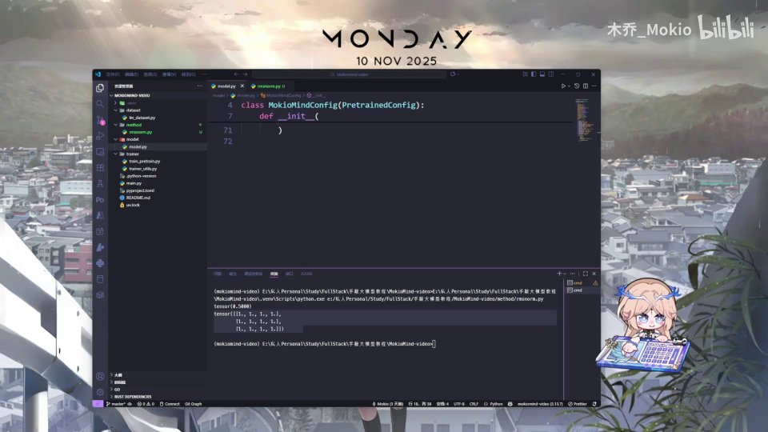
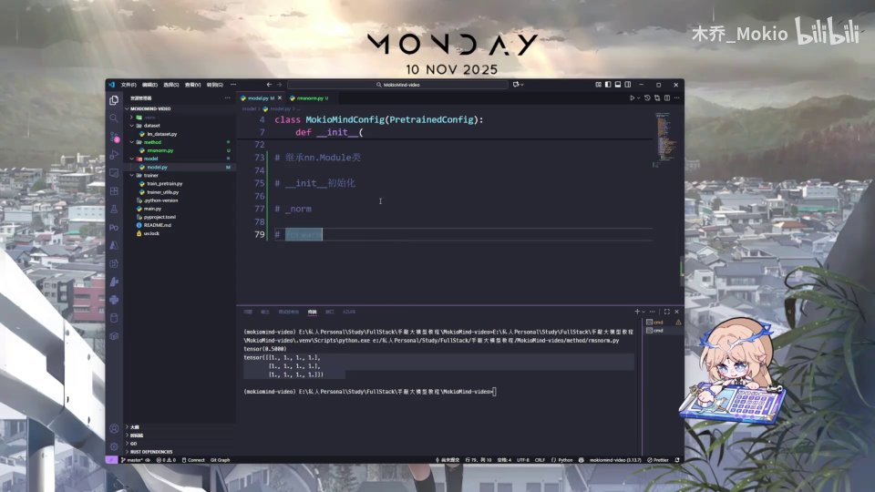
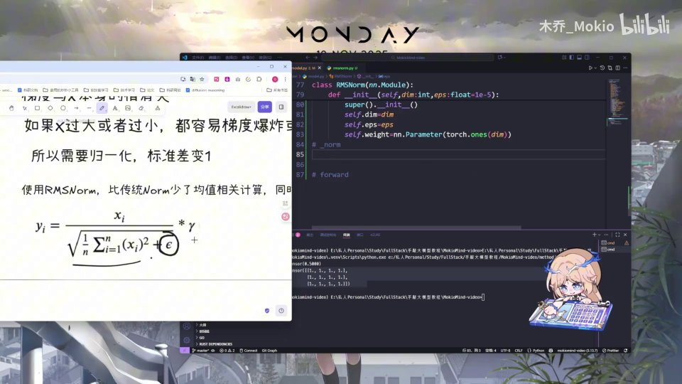
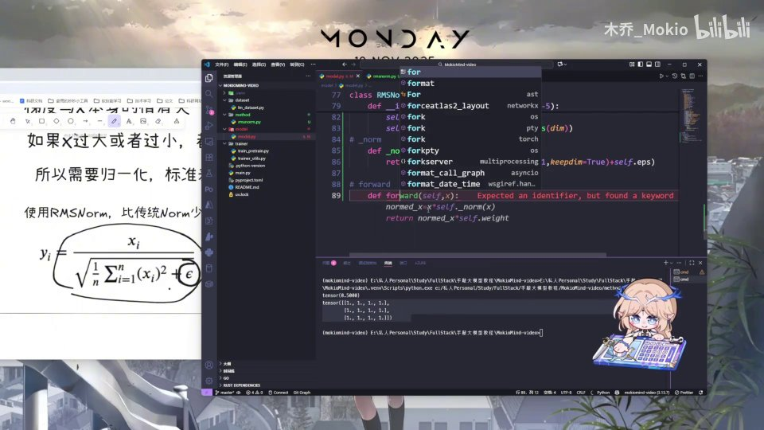
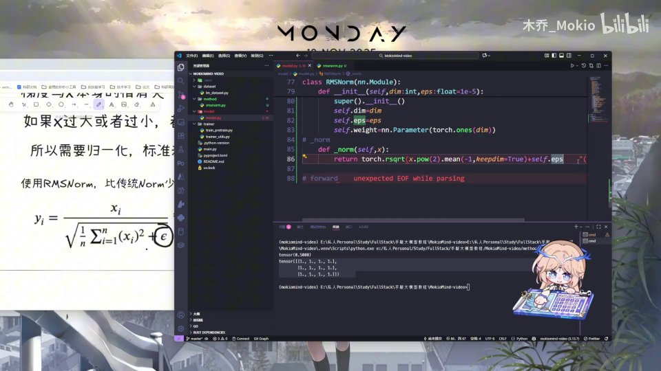
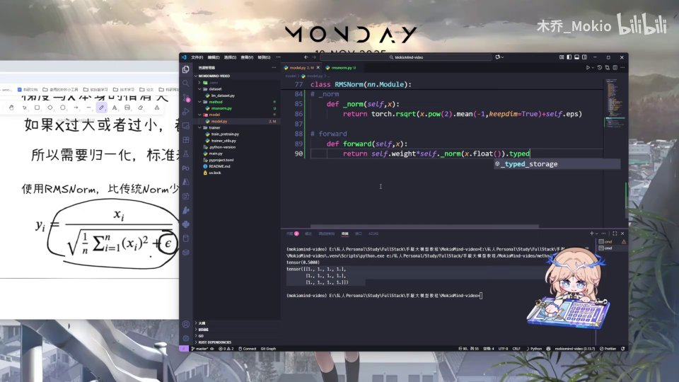

# 第8讲：代码——手写 RMSNorm

## 本讲要解决的核心问题（SCQA）

**背景**：在上一讲里，我们已经弄清楚了 RMSNorm（Root Mean Square Normalization，均方根归一化）的数学公式，也知道了它在大模型里用来把每一层的激活值"拉回"一个稳定的尺度，防止数值过大或过小导致训练不稳定。

**冲突**：公式看懂了，但一落到代码就卡壳——`rsqrt`、`keepdim`、`nn.Parameter`、`type_as` 这些 PyTorch 里的名字让人眼花缭乱；而且 RMSNorm 到底该继承什么、`__init__` 和 `forward` 分别写什么，也没有一个清晰的施工顺序。

**疑问**：如果只用几十行代码，我们能不能从零把这个 RMSNorm 层完整地手写出来？每一行代码究竟在做什么？为什么 `eps`、缩放参数 γ、精度转换这些细节一个都不能少？

**回答（中心思想）**：能。RMSNorm 的代码本质上就是"三个方法 + 一个公式"——继承 `nn.Module`、写好 `__init__` 做初始化、写好 `_norm` 实现核心公式、再写 `forward` 把归一化结果乘上可学习的缩放参数。只要先掌握 `rsqrt` 和 `ones` 两个最基础的 PyTorch 方法，剩下的就是照着公式把每一步翻译成代码即可。[【跳转到 00:00】](https://www.bilibili.com/video/BV1T2k6BaEeC/?p=8&t=0)

---

## 一、先掌握两个最基础的工具：rsqrt 与 ones

在正式动手写 RMSNorm 之前，作者特意先铺垫两个马上要用到的 PyTorch 方法。它们都记录在配套的 Notion 笔记里，想预习的读者可以自己去翻看。理解这两个方法，是理解后面归一化公式的前提。[【跳转到 00:00】](https://www.bilibili.com/video/BV1T2k6BaEeC/?p=8&t=0)

### 1.1 rsqrt：开方再求倒数，归一化的"心脏"

`rsqrt` 这个名字可以拆成两部分来记：**r = reciprocal（倒数）**，**sqrt = square root（平方根）**。所以它的作用就是"先开平方，再取倒数"，也就是计算 1/√x。它是 PyTorch 自带的方法，并且是直接作用在张量（tensor）上的。[【跳转到 00:31】](https://www.bilibili.com/video/BV1T2k6BaEeC/?p=8&t=31)

**为什么需要它？** 回忆 RMSNorm 的公式，归一化的核心是拿每个数去除以"均方根"：

$$
y_i = \frac{x_i}{\sqrt{\frac{1}{n}\sum_{i=1}^{n} x_i^2 + \epsilon}} \cdot \gamma
$$

分母里的"1 / √(…)"正好就是 `rsqrt` 要做的事。所以 `rsqrt` 在 RMSNorm 里不是可有可无的工具，而是公式的"心脏"。

**怎么用？** 作者写了一句最简单的示例：

```python
import torch

# 开方求倒数
t = torch.rsqrt(torch.tensor(4.0))
print(t)
```

对 4 开方求倒数：√4 = 2，再取倒数 1/2 = 0.5。所以打印出来就是一个值为 0.5 的 tensor。这里刻意用了 `torch.tensor(4.0)` 这样的标量张量，方便初学者观察结果。[【跳转到 00:56】](https://www.bilibili.com/video/BV1T2k6BaEeC/?p=8&t=56)

### 1.2 ones：创建一个全 1 张量

`ones` 的作用非常直白——创建一个**所有元素都是 1 的张量**。作者给的示例是：

```python
# 创建一个全1张量
t2 = torch.ones(3, 4)
print(t2)
```

这里传入 `(3, 4)` 表示"行为 3、列为 4"，于是得到一个 3×4、元素全为 1 的矩阵。[【跳转到 00:56】](https://www.bilibili.com/video/BV1T2k6BaEeC/?p=8&t=56)

**它和 RMSNorm 有什么关系？** 后面初始化缩放参数时，我们并不是凭空造一个权重，而是先创建一个"全 1"的张量作为初始值（`torch.ones(dim)`）。用 1 初始化意味着：**训练刚开始时，RMSNorm 只做纯粹的归一化，不额外放大或缩小任何维度**；具体该怎么缩放，交给后续训练去学。这就是为什么偏偏要先讲 `ones`。


---

## 二、先理思路：RMSNorm 是"一个类"，要填三块内容

正式敲代码前，作者先停下来理清结构，而不是一上来就写。这个习惯非常值得初学者学习。[【跳转到 01:56】](https://www.bilibili.com/video/BV1T2k6BaEeC/?p=8&t=116)

RMSNorm 作为一个**网络层**，需要满足两个硬性要求：

1. **它是一层，所以要继承 `nn.Module`**。在 PyTorch 里，凡是可学习的层（包括 Linear、LayerNorm 等），几乎都继承自 `nn.Module`。我们创建一个名为 `RMSNorm` 的类，让它继承 `nn.Module`。[【跳转到 01:56】](https://www.bilibili.com/video/BV1T2k6BaEeC/?p=8&t=116)
2. **它需要写 `__init__` 做初始化**。既然是一个类，就要用 `__init__` 方法去初始化一些东西——比如隐藏维度 `dim`、防止除零的 `eps`、以及可学习的缩放权重。[【跳转到 02:21】](https://www.bilibili.com/video/BV1T2k6BaEeC/?p=8&t=141)

除此之外还有两个"必填项":一是要编写 norm 本身的那个**最简计算公式**，二是要写 `forward`（前向传播）方法。`nn.Module` 这个基类**强制要求**子类必须实现 `forward`——因为 PyTorch 在调用 `model(x)` 时，底层就是去调用 `forward(x)`。[【跳转到 02:21】](https://www.bilibili.com/video/BV1T2k6BaEeC/?p=8&t=141)

所以整个类的骨架可以概括为四块：

```text
class RMSNorm(nn.Module):
    def __init__(self, dim, eps):   # ① 初始化参数
        ...
    def _norm(self, x):             # ② 核心公式：归一化
        ...
    def forward(self, x):           # ③ 前向传播：归一化 + 缩放
        ...
```

理清这个骨架，后面的编码就变成"填空题"了。



---

## 三、搭好类的骨架：导入包、继承 nn.Module

思路理顺后，作者开始动手。首先是导入 PyTorch 包，并把 PyTorch 的神经网络模块 `nn` 导入进来：

```python
import torch
import torch.nn as nn
```

这里的 `import torch.nn as nn` 是 PyTorch 的惯用写法：`torch.nn` 里放着所有神经网络相关的组件（模块、层、损失函数等），我们约定俗成地把它简称成 `nn`，这样后面就能写 `nn.Module`、`nn.Parameter`，简洁明了。[【跳转到 02:46】](https://www.bilibili.com/video/BV1T2k6BaEeC/?p=8&t=166)

然后创建最基础的类，让它继承 `nn.Module`：

```python
class RMSNorm(nn.Module):
    ...
```

这一步对应前面思路里的第一点。值得注意的是，继承 `nn.Module` 不是可选项——只有这样，PyTorch 才能把这一层的参数纳入管理（比如 `.parameters()`、`.to(device)`、保存/加载权重等才会生效）。[【跳转到 02:46】](https://www.bilibili.com/video/BV1T2k6BaEeC/?p=8&t=166)



---

## 四、编写 __init__：把公式里的"可调旋钮"准备好

接下来是 `__init__` 初始化方法。作者坦率地说，`def __init__` 这部分是基础的 Python 语法，如果完全不懂，建议先把最基础的 Python 补一下再回来。[【跳转到 03:11】](https://www.bilibili.com/video/BV1T2k6BaEeC/?p=8&t=191)

### 4.1 参数 dim 与 eps

`__init__` 接收两个关键参数：维度 `dim` 和 `eps`。

- **`dim`**：隐藏维度，也就是要归一化的那个维度的大小。RMSNorm 会在这一维度上计算均方根。
- **`eps`（epsilon）**：这是一个极小的正数，默认取 `1e-5`（也就是 10 的负 5 次方）。它对应公式分母里的 ε。[【跳转到 03:11】](https://www.bilibili.com/video/BV1T2k6BaEeC/?p=8&t=191)

**为什么需要 eps？** 如果某个位置的输入恰好全是 0，那么均方根就是 0，做除法时就会"除以零"，数值会变成 `inf` 或 `nan`，训练直接崩掉。加上一个极小的 `eps`，就能保证分母永远不为零，数值计算更稳定。作者把 `eps` 作为初始化参数放进去，正是为了让这个"安全垫"可以被灵活配置。[【跳转到 03:35】](https://www.bilibili.com/video/BV1T2k6BaEeC/?p=8&t=215)

```python
def __init__(self, dim: int, eps: float = 1e-5):
    super().__init__()
    self.dim = dim
    self.eps = eps
    self.weight = nn.Parameter(torch.ones(dim))
```

### 4.2 super().\__init__() 为什么必须写

代码里第一行是 `super().__init__()`。这是调用父类 `nn.Module` 的初始化。**`nn.Module` 内部需要先把自己初始化好**（建立参数注册表、子模块表等），子类才能安全地往 `self` 上挂参数。如果漏了这行，后面 `self.weight` 的注册就可能失效。这是一个一旦忘记就报错的经典坑。[【跳转到 03:40】](https://www.bilibili.com/video/BV1T2k6BaEeC/?p=8&t=220)

### 4.3 self.weight：可学习的缩放参数 γ

最后是初始化权重：

```python
self.weight = nn.Parameter(torch.ones(dim))
```

这一行信息量很大，拆开看：

- `torch.ones(dim)`：创建一个长度为 `dim`、元素全为 1 的张量。为什么要用 `ones` 初始化？前面已经解释——初始时"不缩放"，让模型从纯粹的归一化开始，缩放强度交给训练去学。这也解释了前面为什么必须先讲 `ones` 方法。[【跳转到 04:15】](https://www.bilibili.com/video/BV1T2k6BaEeC/?p=8&t=255)
- `nn.Parameter(...)`：这是 `nn.Module` 提供的一个特殊包装。**只有用 `nn.Parameter` 包起来的张量，才会被 PyTorch 登记为"可学习参数"**，从而被优化器（如 AdamW）在反向传播时更新。[【跳转到 04:10】](https://www.bilibili.com/video/BV1T2k6BaEeC/?p=8&t=250)

换句话说，公式里的那个 γ（gamma）不只是个数学符号，它在代码里就是 `self.weight`——一个长度为 `dim` 的向量，每个维度配一个缩放系数，训练时会被"优化掉"（这里作者口语说的是"被后续优化"）。这正是 RMSNorm 相比"死板归一化"更灵活的地方：**它在归一化之后，给每个维度保留了独立的缩放自由度**。[【跳转到 04:05】](https://www.bilibili.com/video/BV1T2k6BaEeC/?p=8&t=245)


---

## 五、编写核心公式 _norm：一句话翻译数学公式

骨架和参数就位后，就进入最核心的部分——实现归一化公式。作者把它单独抽成一个方法 `_norm`，让 `forward` 保持整洁。[【跳转到 04:15】](https://www.bilibili.com/video/BV1T2k6BaEeC/?p=8&t=255)

### 5.1 从公式到代码：三步走

回忆公式的分母部分：先平方、再求均值、加 ε、然后开方求倒数。代码几乎是逐字翻译。下图展示了写 `_norm` 时的关键一步——先对 `x` 求平方再求均值：[【跳转到 04:30】](https://www.bilibili.com/video/BV1T2k6BaEeC/?p=8&t=270)



完整实现如下：

```python
def _norm(self, x):
    return torch.rsqrt(x.pow(2).mean(-1, keepdim=True) + self.eps)
```

- `x.pow(2)`：对 `x` 求平方，对应公式里的 $x_i^2$。
- `.mean(-1, keepdim=True)`：在**最后一个维度**上求平均值，对应公式里的 $\frac{1}{n}\sum$。
- `+ self.eps`：加上 epsilon，防止除以零。
- `torch.rsqrt(...)`：对整体开方求倒数，对应 $\frac{1}{\sqrt{\cdots}}$。

**这个方法的返回值是什么？** 它返回的正是公式里那个"1 / 均方根"的因子（分母的倒数）。拿到它之后，只要再乘上原来的 `x`，就完成了归一化。


### 5.2 keepdim=True 到底在干什么

这是全篇最容易讲不清、也最容易被忽略的细节。作者专门花时间解释：[【跳转到 04:40】](https://www.bilibili.com/video/BV1T2k6BaEeC/?p=8&t=280)

- `mean(-1)` 表示"在最后一个维度上求均值"。假设输入 `x` 的形状是 `(batch, seq_len, dim)`，那么 `.mean(-1)` 会把最后一维 `dim` 压掉，形状变成 `(batch, seq_len)`。
- 如果**不加** `keepdim=True`，被压掉的那一维会直接消失，形状从 3 维变成 2 维。
- 加上 `keepdim=True`（keep dimension，保留维度），被求均值的那个维度会**保留为长度 1**，形状变成 `(batch, seq_len, 1)`。这样它在参与后续运算时，才能正确地"广播"回原来的形状。[【跳转到 05:05】](https://www.bilibili.com/video/BV1T2k6BaEeC/?p=8&t=305)

打个比方：一个班有 5 个学生（最后一个维度是 dim=5），我们想算每个学生成绩占总体的比例。`mean(-1)` 得到的是"每个班的平均分"，`keepdim=True` 保证这个平均分仍然以"每个班一个数"的形式存在，方便每个学生的分数都去减/除这个平均值。如果维度直接塌掉了，后面的对齐就会出问题。

### 5.3 再次强调 eps 的作用

`.mean(-1, keepdim=True) + self.eps` 里的加法，正是公式分母中的 `+ ε`。作者再次点明：**这一步是数值稳定的保险丝**——即便某个维度平方均值恰好为 0，加上 `eps` 也能避免 `rsqrt(0)` 造成的无穷大。[【跳转到 05:30】](https://www.bilibili.com/video/BV1T2k6BaEeC/?p=8&t=330)


---

## 六、编写 forward：归一化结果乘上可学习的缩放参数

最后一块是 `forward` 前向传播。当我们调用 `model(x)` 时，真正执行的就是它。[【跳转到 05:36】](https://www.bilibili.com/video/BV1T2k6BaEeC/?p=8&t=336)


```python
def forward(self, x):
    return self.weight * self._norm(x.float()).type_as(x)
```

这一行虽然短，但包含了两个关键设计：

### 6.1 为什么先 x.float() 再 type_as(x)

注意顺序：先 `x.float()`，把输入转成 float32 计算归一化；算完后再 `.type_as(x)`，把结果转回**输入原本的数据类型**。[【跳转到 05:41】](https://www.bilibili.com/video/BV1T2k6BaEeC/?p=8&t=341)

**为什么这么做？** 大模型训练时常用半精度（如 float16 / bfloat16）来省显存、提速度。但半精度数值范围窄，直接做平方、求和、开方倒数这类运算容易**溢出或失去精度**（比如平方后数值变大、累加后更大）。所以惯例做法是：**归一化这种敏感计算用 float32，算完再转回原类型**。`type_as(x)` 就是"对齐到 x 的类型"，保证输出和输入类型一致，不会把后续层的数据类型搞乱。

### 6.2 为什么乘 self.weight

`self.weight` 就是前面初始化为全 1 的可学习缩放参数 γ。归一化让每个维度的尺度统一，但**统一不等于最优**——模型可能希望某些维度放大、某些维度缩小。乘上 `self.weight` 就给了模型这个自由度，而且因为初始值是 1，起步阶段等价于纯归一化，训练过程中再慢慢学出合适的缩放。[【跳转到 05:41】](https://www.bilibili.com/video/BV1T2k6BaEeC/?p=8&t=341)

至此，完整的 RMSNorm 就写完了：

```python
import torch
import torch.nn as nn

class RMSNorm(nn.Module):
    def __init__(self, dim: int, eps: float = 1e-5):
        super().__init__()
        self.dim = dim
        self.eps = eps
        self.weight = nn.Parameter(torch.ones(dim))

    def _norm(self, x):
        return torch.rsqrt(x.pow(2).mean(-1, keepdim=True) + self.eps)

    def forward(self, x):
        return self.weight * self._norm(x.float()).type_as(x)
```

保存文件，RMSNorm 部分就完成了。作者随即预告，下一块将进入**旋转位置编码（RoPE）**的讲解。[【跳转到 06:06】](https://www.bilibili.com/video/BV1T2k6BaEeC/?p=8&t=366)



---

## 七、为什么需要 RMSNorm：从梯度的尺度问题说起

理解代码之后，再回看"为什么要这样设计"会更有味道。作者用一张白板推导给出了直觉。[【跳转到 03:11】](https://www.bilibili.com/video/BV1T2k6BaEeC/?p=8&t=191)

考虑一个最简单的线性层 $Y = W \cdot X$，对权重 $W$ 求梯度时，根据链式法则有：

$$
\frac{dL}{dW} = \frac{dL}{dY} \cdot \frac{dY}{dW} = \frac{dL}{dY} \cdot X
$$

关键结论是：**梯度的大小与输入 $X$ 本身的值直接相关**。如果 $X$ 的数值过大或过小，梯度就会相应地爆炸或消失，训练自然不稳定。解决办法就是**归一化**——把输入的标准差拉回到 1 附近，让每层的数值尺度保持稳定。[【跳转到 03:11】](https://www.bilibili.com/video/BV1T2k6BaEeC/?p=8&t=191)

### 7.1 RMSNorm 与 LayerNorm 的区别

传统 LayerNorm 会同时做两件事：**减均值**（把数据中心化到 0）和**除以标准差**（缩放）。而 RMSNorm **去掉了减均值这一步，只用均方根来缩放**。作者明确指出：使用 RMSNorm，比传统 Norm 少了均值相关的计算。[【跳转到 03:40】](https://www.bilibili.com/video/BV1T2k6BaEeC/?p=8&t=220)

**这么做有什么好处？**

1. **计算更省**。少一次求均值和减法，在层数很多的大模型里累积起来是一笔可观的开销节省。
2. **效果几乎不损失**。大量实践表明，LayerNorm 里"减均值"这一步对最终效果的贡献有限，去掉它依然能稳定训练，甚至在很多大模型（如 LLaMA 系列）中被广泛采用。

所以 RMSNorm 是一个典型的"**做减法**"设计：用更少的计算，换到接近甚至不逊色的训练稳定性。


---

## 八、把整个施工流程串起来

回头看，这一讲的代码其实是一条非常清晰的流水线。我们可以把它归纳成五个步骤：

1. **铺垫工具**：先认识 `rsqrt`（开方求倒数）和 `ones`（全 1 张量）——前者是归一化公式的核心，后者是可学习参数的初始值。[【跳转到 00:31】](https://www.bilibili.com/video/BV1T2k6BaEeC/?p=8&t=31)
2. **理清结构**：RMSNorm 是一个层 → 继承 `nn.Module`；需要 `__init__` 初始化；需要核心公式；必须实现 `forward`。[【跳转到 01:56】](https://www.bilibili.com/video/BV1T2k6BaEeC/?p=8&t=116)
3. **准备参数**：`super().__init__()`、存下 `dim` 和 `eps`、用 `nn.Parameter(torch.ones(dim))` 创建可学习的缩放权重 γ。[【跳转到 03:40】](https://www.bilibili.com/video/BV1T2k6BaEeC/?p=8&t=220)
4. **实现公式**：`_norm` 里把"平方 → 求均值（keepdim=True）→ 加 eps → rsqrt"逐字翻译成代码。[【跳转到 04:15】](https://www.bilibili.com/video/BV1T2k6BaEeC/?p=8&t=255)
5. **前向传播**：`forward` 里先 `x.float()` 保证精度，归一化后再 `.type_as(x)` 转回原类型，最后乘上 `self.weight`。[【跳转到 05:36】](https://www.bilibili.com/video/BV1T2k6BaEeC/?p=8&t=336)

每一步都只解决一个小问题，环环相扣。这正是作者反复强调"先理思路再写代码"的价值——把一个大任务拆成几个可以独立完成的小任务，写代码就不再是难事。



写完整段代码后，作者保存文件，宣布 RMSNorm 部分完成，并预告下一块内容：[【跳转到 06:06】](https://www.bilibili.com/video/BV1T2k6BaEeC/?p=8&t=366)



---

## 小结

- **RMSNorm 的代码结构是"三方法一公式"**：继承 `nn.Module`，写 `__init__`、`_norm`、`forward`，核心公式就是"1 / 均方根"。
- **`rsqrt` 是公式的心脏**：它一步完成"开方 + 求倒数"，直接对应公式分母的 $1/\sqrt{\cdots}$。
- **`ones` 决定初始状态**：用 `torch.ones(dim)` 初始化缩放权重，让训练从"纯归一化"起步，缩放强度交给训练学习。
- **`eps` 是数值保险丝**：一个极小的 `1e-5` 防止除以零，没有它训练可能直接出 `nan`。
- **`nn.Parameter` 让权重可学习**：只有被它包起来的张量才会被优化器更新，它对应的就是公式里的缩放参数 γ。
- **`keepdim=True` 保证广播正确**：求均值时保留长度为 1 的维度，才能和原张量正确对齐。
- **`x.float()` + `type_as(x)` 是精度策略**：敏感计算用 float32 防溢出，算完转回原类型保持类型一致。
- **RMSNorm 做的是"减法"**：相比 LayerNorm 去掉减均值，用更少计算换来相近的稳定性。

## 关键术语速查

| 术语 | 一句话解释 |
| --- | --- |
| RMSNorm | 均方根归一化，只用均方根缩放、不减均值的归一化方法 |
| `rsqrt` | PyTorch 方法，先开平方再取倒数，计算 1/√x |
| `ones` | 创建一个元素全为 1 的张量，用作参数初始值 |
| `nn.Module` | PyTorch 中所有网络层的基类，RMSNorm 必须继承它 |
| `__init__` | 类的初始化方法，用来准备 `dim`、`eps`、`weight` 等参数 |
| `forward` | 前向传播方法，调用 `model(x)` 时执行，`nn.Module` 强制要求实现 |
| `eps`（ε） | 极小的正数（默认 1e-5），防止除零，保证数值稳定 |
| `nn.Parameter` | 把张量登记为可学习参数，使其能被优化器更新 |
| γ（gamma） | 归一化后的可学习缩放参数，代码里就是 `self.weight` |
| `keepdim` | 求均值时保留被压缩的维度为长度 1，保证后续广播正确 |
| `type_as(x)` | 把张量转换成与 x 相同的数据类型 |
| LayerNorm | 传统归一化，同时减均值和除以标准差；RMSNorm 是它的简化版 |
