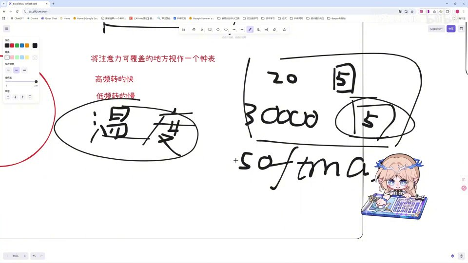
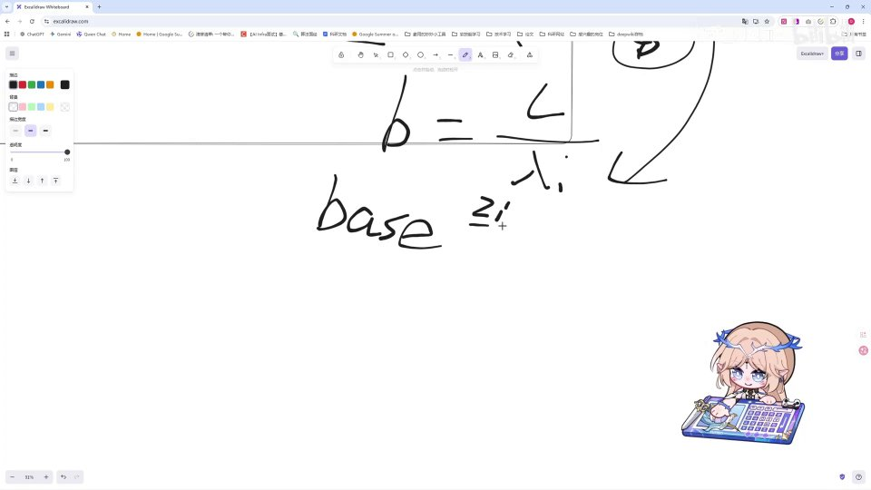

# 第9讲：理论——RoPE 旋转位置编码与 YaRN 长度外推

## 本讲要解决的核心问题（SCQA）

**背景**：Transformer 靠 attention（注意力机制）工作，而 attention 的核心操作是拿查询向量 Q 和键向量 K 做点积（dot product），算出每个词对当前的"相关程度"。你已经知道这一套流程，也知道词要先变成 token、再变成 embedding 向量。

**冲突**：可点积本质上是一种"集合式"的运算——谁和谁相乘、乘多少次，跟它们谁先谁后没有关系。也就是说，**原始 attention 完全不知道词的顺序**。但语言里顺序恰恰承载着关键信息："人咬狗"和"狗咬人"是完全相反的意思。

**疑问**：既然顺序这么重要，模型到底是怎么"知道"词的先后位置的？RoPE 这种"转一下角度"的做法凭什么能塞进位置信息？为什么有了 RoPE，还要再引入 YaRN？

**回答（中心思想）**：位置信息必须由我们显式地注入，而 RoPE（旋转位置编码）通过给每个 token 的向量按位置旋转一定角度，让两个 token 的点积结果**只取决于它们的相对距离 m−n**，从而优雅地编码了相对位置；YaRN 则是对 RoPE 做"长度外推"的改进方案——它按频率把维度分成高、中、低三段分别处理（高频不缩放、中频插值、低频线性缩放），再乘一个温度系数防止注意力被稀释，让原本只训练过 2048 长度的模型也能稳定处理远超训练长度的输入。

本讲全程偏理论、比较硬核，我们按"为什么需要位置编码 → RoPE 的旋转直觉 → RoPE 的推导 → RoPE 的局限 → YaRN 的分频段思路 → YaRN 的具体计算"这条路一步步走。

---

## 一、位置编码为什么必须有：注意力本身是"无序的集合运算"

要理解 RoPE 和 YaRN，得先回到最根上的问题：**为什么我们需要位置编码？**

先快速对齐一下名词。所谓"词"，在模型里其实是被切分并编号的 **token**；每个 token 查表得到一个 **embedding 向量**。到了 attention 这一层，模型会从这个向量投影出三样东西：**Q（Query，查询）**、**K（Key，键）**、**V（Value，值）**。可以粗浅地理解为：Q 是"我现在想找什么"，K 是"我这里有什么"，两者点积出来的分数就表示"这两个位置的词有多相关"。你可以把 Q/K/V 想象成一个搜索引擎——Q 是用户输入的检索词，K 是每篇文章的标题标签，点积就是判断"检索词和标签有多匹配"。

如果你了解 attention 机制就会知道，它做的事情是对 Q 和 K 做点积。点积操作本质上是一种集合操作：我只需要某一个和某一个相乘就行，**不需要在乎它们的先后顺序**。为什么这么说？因为点积的公式是"对应位置相乘再全部加起来"，这个加法是可交换的，谁先谁后对结果毫无影响。换句话说，如果把一句话里的词打乱，原始 attention 算出来的相关性矩阵在"无序"这个意义上是分辨不出差别的。

但当我们阅读文本时，我们很清楚文本的先后顺序本身是包含信息的。课程举了两个很直观的例子：

- 用之前的推理小说打比方：同一个场景，如果它出现在**命案前**和出现在**命案后**，所代表的信息完全不一样。前者可能是铺垫和伏笔，后者可能是解释和揭晓。
- 再比如"**人咬狗**"和"**狗咬人**"：一个是"咬"、一个是"被咬"，同样是这两个词、同样的字，放进不同的语句顺序里，意思截然不同。

所以结论很清楚：**我们需要一个方法去告诉模型"这个词的顺序是怎样的"，这就是位置编码的作用。**

[【跳转到 01:01】](https://www.bilibili.com/video/BV1T2k6BaEeC/?p=9&t=61)

位置编码的做法大致分两种：**绝对位置编码**和**相对位置编码**。下面先看为什么绝对位置编码不够好，从而自然引出 RoPE。

---

## 二、从绝对位置到相对位置：为什么 RoPE 走对了方向

### 2.1 绝对位置编码的"呆板"

如果我们用绝对位置编码，会有一个很现实的问题。设想我有一部小说，写到"犯人事"的情节，中间有一个 A 线索。绝对位置编码能学到的信息是：**当 A 线索处在"第 X 个位置"时，它该给模型传递什么信息。**

可如果我在文章前面再加一段无关痛痒的描写呢？那么 A 线索的位置相对于最开始就变了，绝对位置编码给它的"位置编号"也变了，于是**模型就得重新学习一遍 A 线索在新位置上的含义**——这就太呆板了。

而我们真正需要的其实很简单：我只需要知道 **A 线索距离结局的相对距离**，知道了就可以了。至于它前面被塞入多少段废话，不应该影响 A 与其它关键信息之间的关系。

[【跳转到 01:26】](https://www.bilibili.com/video/BV1T2k6BaEeC/?p=9&t=86)

### 2.2 结论：应该用相对位置编码

正因为绝对位置编码这种"位置一挪就得重学"的缺点，我们**不应该使用绝对位置编码，而应该使用相对位置编码**。

而在相对位置编码里，现在最常用的方法就是 **RoPE（旋转位置编码，Rotary Position Embedding）**。事实上，RoPE 现在几乎是许多模型里最常用的位置编码方案。那么接下来的问题就是：**为什么 RoPE 这个方法，对 token 进行旋转之后就能包含它的位置信息？**

### 2.3 一个容易混淆的点：RoPE 作用在 Q、K 上

初学时很容易误以为位置编码是"加在 embedding 向量上的一段额外编码"。传统的一些绝对位置编码确实是这么做的：给每个位置的 embedding 加上一个固定的位置向量。但 **RoPE 走的是另一条路——它不是加，而是"乘一个旋转"；而且它不是作用在原始 embedding 上，而是作用在 attention 里计算出来的 Q 和 K 上。**

这一点从后面的推导看得最清楚：因为 attention 的相关性分数来自 $Q$ 与 $K$ 的点积，所以只要我们对 Q 和 K 分别按各自位置做旋转，点积结果里就会自然浮现出相对位置信息。这也意味着 RoPE 是一个"纯粹的 attention 内改造"，对模型其余部分几乎零侵入。

---

## 三、RoPE 的旋转直觉：给每个向量一个"角度"

先补最基础的几何直觉。所谓"旋转"，就是在向量上做文章：比如我们在二维空间上有一个向量，让它旋转到某个角度——这就是最基础的旋转，不再赘述。

接下来要理解的核心问题是：**为什么旋转能包含相对位置信息？** 我们拿最基础的情形来看。

顺便说一下"旋转"在数学上到底做了什么。在二维平面里，把一个向量 $(x, y)$ 逆时针旋转角度 $\phi$，等价于让它**左乘一个旋转矩阵** $\begin{pmatrix}\cos\phi & -\sin\phi\\ \sin\phi & \cos\phi\end{pmatrix}$。这个矩阵不改变向量的长度，只改变它的方向，所以它会完整地保留向量原本携带的语义信息，只是把"角度"这个额外的位置信息叠加了上去。记住这一点，后面推导时就不会觉得"旋转"是个神秘操作了。

因为 attention 是计算 Q 和 K 的，我们拿一个小的 Q，写作 $q=[q_1, q_2]$；再拿一个 K，写作 $k=[k_1, k_2]$（这里先看二维，方便推导，真实场景会在下面推广到高维）。我们让 Q 旋转 $m\theta$ 个角度，让 K 旋转 $n\theta$ 个角度：

$$
q = [q_1, q_2] \xrightarrow{\text{转 } m\theta} q_m = [\,q_1\cos(m\theta) - q_2\sin(m\theta),\;\; q_1\sin(m\theta) + q_2\cos(m\theta)\,]
$$

$$
k = [k_1, k_2] \xrightarrow{\text{转 } n\theta} k_n = [\,k_1\cos(n\theta) - k_2\sin(n\theta),\;\; k_1\sin(n\theta) + k_2\cos(n\theta)\,]
$$

这两个旋转公式就是初高中学过的二维旋转：$x' = x\cos\phi - y\sin\phi$，$y' = x\sin\phi + y\cos\phi$。所以"给向量乘一个旋转矩阵"这件事本身并不神秘。

关键为什么是"相对"位置？**因为位置 m 只用来决定 Q 转多少度，位置 n 只用来决定 K 转多少度；当我们最后把 Q 和 K 做点积时，两个旋转角度会相减，得到 $(m-n)\theta$**——只剩下位置差。下面我们把这件事严格算一遍。

---

## 四、RoPE 的数学推导：为什么点积只和位置差 m−n 有关

### 4.1 展开点积

让旋转后的 Q 和 K 做点积：

$$
q_m \cdot k_n = \big(q_1\cos(m\theta) - q_2\sin(m\theta)\big)\big(k_1\cos(n\theta) - k_2\sin(n\theta)\big) + \big(q_1\sin(m\theta) + q_2\cos(m\theta)\big)\big(k_1\sin(n\theta) + k_2\cos(n\theta)\big)
$$

这里一共有四项，我们把它展开、组合一下，把它们按"同一个 $q_i k_j$"归类：

$$
\begin{aligned}
q_1 k_1 &:\quad q_1k_1\cdot[\cos(m\theta)\cos(n\theta) + \sin(m\theta)\sin(n\theta)]\\
q_2 k_2 &:\quad q_2k_2\cdot[\sin(m\theta)\sin(n\theta) + \cos(m\theta)\cos(n\theta)]\\
q_1 k_2 &:\quad q_1k_2\cdot[\sin(m\theta)\cos(n\theta) - \cos(m\theta)\sin(n\theta)]\\
q_2 k_1 &:\quad q_2k_1\cdot[\cos(m\theta)\sin(n\theta) - \sin(m\theta)\cos(n\theta)]
\end{aligned}
$$

写出这几行之后，你会不会觉得右边那几串**非常非常熟悉**？没错，它们正好就是我们高中学过的**三角恒等式**：

$$
\cos(A-B)=\cos A\cos B + \sin A\sin B
$$

$$
\sin(A-B)=\sin A\cos B - \cos A\sin B
$$

### 4.2 代入恒等式，得到"非常美妙"的结果

我们拿高中的三角恒等式直接代入进去，把 $A=m\theta$、$B=n\theta$，最后得到点积的形式是这样一个**非常美妙**的结果：

$$
q_m \cdot k_n = (q_1k_1 + q_2k_2)\cos\big((m-n)\theta\big) + (q_1k_2 - q_2k_1)\sin\big((m-n)\theta\big)
$$

这个式子值得反复看。其中 $q_1k_1$、$q_2k_2$ 都是我们自己给定的值，$\theta$ 值也是我们自己给定的，所以**整个式子里唯一携带位置信息的量，就是 $(m-n)\theta$**。

也就是说，最后的位置信息**只和 $m-n$ 这个差值有关，不和 $m$ 有关，也不和 $n$ 有关**，只由它们的差值决定。这正是前面我们想要的性质——相对位置。

[【跳转到 03:31】](https://www.bilibili.com/video/BV1T2k6BaEeC/?p=9&t=211)

作者也讲到，这是他自己学习时觉得**非常奇妙**的一个地方：一个看似复杂的旋转操作，被三角恒等式一化简，位置信息就自动变成了"位置差"。

这里还有两个隐含的、但非常重要的好处值得点出来。第一，**RoPE 不增加任何可学习参数**——旋转角只由位置和固定的 $\theta$ 决定，不需要额外训练，因此它既轻量又通用。第二，**它天然只关心相对距离**：无论句子整体往前挪多少，只要两个词的间隔不变，$(m-n)$ 就不变，它们的相对关系就稳定，这正好对应我们第二节里"只想相对距离"的诉求。这两点就是 RoPE 能取代各种绝对位置编码、成为当下主流方案的根本原因。

---

## 五、"the cat sat"：RoPE 在真实向量上怎么用

### 5.1 高维向量怎么旋？两两一组

上面推导的是二维。真实模型里一个 token 的 Q、K 是维度很高的向量（可能有几百上千维），难道只能处理二维吗？当然不是。实际做法是：**把这个很长的向量两两分成一组，每一组各自是一个二维子向量，分别做旋转。**

举例，句子里有 "the cat sat" 三个 token。我们把它编码成向量之后，会得到一个很长的向量列。假设其中 cat 的位置是 2，sat 的位置是 3。应用 RoPE 时，我们会把这样一个长向量（比如 8 维，记作一组 1、2、3、4、5、6、7、8 的编号）**两两分组**进行旋转。

### 5.2 每一组用不同的旋转角

具体来说，cat 有自己的 Q 和 K，sat 也有自己的 Q 和 K，我们都让它"一二、一二"地两两分组旋转：

- 第一组旋转 $\theta_1$ 角度；
- 第二组旋转 $\theta_2$ 角度；
- 第三组旋转 $\theta_3$ 角度；
- 以此类推。

然后在我们进行 QK 点积的时候，结果里就会带上：

$$
(2-3)\theta_1,\quad (2-3)\theta_2
$$

因为 cat 的位置是 2、sat 的位置是 3，它们的差值就是 $2-3$（或反过来 $3-2$）。**相对位置信息就此蕴含在"角度相减"里。**

### 5.3 计算流程总结

所以 RoPE 的实际计算过程是：

1. 把每个 token 的 Q、K 向量**两两分组**；
2. 按位置给每组**旋转一个特定的角度**（不同组角度不同）；
3. 旋转之后的 Q 与 K 再做**点积**；
4. 点积结果里自然带上了基于位置差的相对位置信息。

[【跳转到 05:11】](https://www.bilibili.com/video/BV1T2k6BaEeC/?p=9&t=311)

到这里 RoPE 就讲完了。那么问题来了：**为什么我们有了 RoPE 之后，还要引入 YaRN 呢？** 这就要从 RoPE 的一个先天局限说起。

---

## 六、RoPE 的天花板：训练 2048，遇到 4000 就懵了

### 6.1 什么是"外推"

YaRN 这一部分对应一个专门的名字——**外推（extrapolation）**。所谓外推，大概的意思就是**处理超出（训练）长度的输入**。

### 6.2 RoPE 的原始频率公式

要看懂为什么需要外推，先看 RoPE 的原始频率计算公式。RoPE 的每个维度对，都对应一个频率，写作：

$$
\mathrm{freq}_i = \frac{1}{\mathrm{rope\_base}^{\,2i/\mathrm{dim}}}
$$

这里的 $i$ 就是我们之前要处理的第几个维度对——每一对都是一个 $i$；$\mathrm{dim}$ 是向量维度，$\mathrm{rope\_base}$ 是底数（常见取值 10000）。

从这个式子可以很明显地看到：**$i$ 越小，频率越大；$i$ 越大，频率越小。** 也就是说，低编号的维度对旋转得快（高频），高编号的维度对旋转得慢（低频）。

### 6.3 只会"背课文"的模型

问题就出在这里。假如我们训练模型的时候，**始终让模型以 2048 的长度来训练**，那么模型整个权重、里面所有的参数——包括它的 80 亿个参数——**全都是按照 2048 这个长度来理解的**。

那如果我哪一天直接给模型一次性塞入一个 **4000** 的长度，模型就会**懵掉**。因为它只学习过从 0 到 2048 的整个长度里它应该怎么计算，**它完全没有学习过 2048 以外的位置该怎么处理**。它的整个参数和这个 4000 就是**不匹配**的，计算会完全乱掉，最后模型输出也就不是我们想要的了。

这就像一个人只背过 2048 个单词的课文，突然被要求背 4000 个单词的课文，后面的部分他根本没学过，自然接不上。

换个更技术的说法：RoPE 里每个位置 $m$ 都会贡献一个旋转角 $m\theta$。训练时模型只见过 $m \in [0, 2048)$ 这段范围里的角度模式；当 $m$ 突然跳到 3000、4000，对应的旋转角落在了一段**模型从没见过的角度区间**上，于是本该"该转多少度"的先验完全失效，注意力分数随之失准。这就是"外推"必须要解决的问题。

---

## 七、YaRN 的核心思想：把注意力覆盖范围想象成一个钟表

### 7.1 朴素方法一：强行压缩（会损失信息）

YaRN 要解决的就是这个"超长输入"的问题。它其实有两条路，先看朴素的那条。

**方法一：把超长序列压缩到训练长度里。** 比如我模型一直训练的是 4096，某天突然给我一个 8192 的长度，那么我完全可以让它**乘以一个 0.5 的系数**，把 8192 压缩到 4096 的范围内。甚至我们在训练时就可以喂给它这类数据，让它学会自动做系数的处理，学会处理"遇到 8192 时该怎么压缩到 4096 里去训练"，这样当它真正遇到 8192 时参数也能适应。

但是——我们都知道——**你硬生生把 8192 压缩到 4096 里，一定会有一定的信息损失。** 所有位置都被"挤"在一起，近距离的位置可能就分不开了。

### 7.2 方法二：对高低频使用不同的处理方式

YaRN 真正的做法是**方法二：对高频和低频使用不同的处理方法**。

这里我们用一个"表述不是很准确、但是比较形象"的比喻来理解：**把模型能处理的地方视作一个钟表**。我们都知道，钟表的指针有转得快的、也有转得慢的。对应到 RoPE 里：**高频转得快，低频转得慢。**

下面用"处理 2048 个 token"这个具体场景，分别看高频、低频该怎么处理。

---

## 八、分频段处理：高频不缩放、低频线性缩放、中频插值过渡

### 8.1 高频：转得快，不必缩放

还是处理 2048 个 token。由于**高频转得快**，比如说我处理 0 到 6 这么一个长度的对数时，高频它转得快，**已经转满了整个钟表**，那么它就能够理解整个 360 度区域里所有的信息。

既然 0 到 6 之后的所有部分都一定会落在钟表的某个地方，而这样的位置模型都是能处理的，所以我们**高频部分可以不进行缩放，保持原样。**

### 8.2 低频：转得慢，必须线性缩放

再看低频。低频部分转得慢：比如说这样一个钟表，由于频率足够低，可能**只有到 6 万长度的时候**，在低频的那个转速下才能让整个钟表被覆盖到。

那问题来了：我们平时训练的 2048，**只能覆盖到钟表上很小的一小点区域**。这时候低频就会出现前面讲过的"超出它认知范围"的情况——比如 4000 这个位置可能落在钟表的这一段，可模型只会处理那一小部分。于是我们**对低频使用一个线性缩放**（专门的公式后面会讲），**把这个 4000 拉到模型能理解的范围内**。

### 8.3 高频管细节、低频管全局：YaRN 真正的优点

这里顺带揭示了 YaRN 的一个优点：

- **高频**：只用 0 到 6 个 token 就能翻阅完整个钟表，所以它能实现**对近距离信息的精细度把握**；
- **低频**：因为转的范围比较小，在这么小的范围内就覆盖了我们全局要处理的 2048 个 token，所以低频实现的是**对全局信息的把握**。

一个抓细节、一个抓全局，这就是频段分工带来的好处。

这里可以再补一层直觉，帮助记忆"高频为什么对应近距离、低频为什么对应全局"。钟表上的**指针转得越快，你观察它转过的角度就能区分越短的时间间隔**——高频维度对相邻位置特别敏感，所以它擅长刻画"谁紧挨着谁"这种局部细节；反过来，**指针转得越慢，它一整圈对应的时间跨度越长**，所以低频维度能把很长的序列"铺"在一整圈上，从而把握整体结构。这正是频段分工的物理直觉：让快的管近，让慢的管远。

### 8.4 中频：用线性插值平滑过渡

高频和低频中间，还有一个**中频**。如果只对高频不缩放、对低频缩放，中间会有一个"断裂"。所以我们**对中频使用线性插值，保证整个缩放是平滑过渡的**。

### 8.5 小结 YaRN 的思路

到这里 YaRN 的思想可以总结成一句话：

> **对于超出模型处理长度的部分，我们需要把它压缩到模型能处理的范围内；又因为强行压缩会损失信息，所以我们按频率把维度分成三段分别处理。**

具体三步（一组 3 个要点）：

1. **高频**：不缩放，保持原样；
2. **低频**：使用线性缩放，既能落在模型的认知范围内，又能保证对全局信息的把握；
3. **中频**：使用插值，做平滑过渡。

而在此之上，YaRN 还引入了一个**温度系统**，也就是一个**温度系数**。下面单独讲它。

---

## 九、温度系数：防止注意力被"稀释"

### 9.1 一个班级的比喻

温度系数的目的是什么呢？用一个班的学生来比喻：

我一开始有一个班的学生，我比较关注其中的学生——比如一个班有 20 个学生，我一开始**比较关注前 5 个学生**。可如果学校强行给我又塞了 **3 万个学生**，那么我想继续关注那前 5 个学生，**我的注意力就会比较涣散**——因为我还得分很多精力去关注这 3 万个学生。

### 9.2 翻译到计算上就是 softmax 被稀释

这个比喻翻译到实际计算上，就是：**在 softmax 里分配注意力分数的时候，我们这 5 个"关注对象"的注意力会被严重稀释。**

解决方案就是引入一个**温度系数**：在 RoPE 计算之后，把这个系数传进去，保证后面的 softmax 计算里，我们**依然让那 5 个学生保持一个高注意力**，而其他部分进行缩放。总之目的就一个——**保证注意力不涣散**。

为什么叫"温度"？在 softmax 里，分数除以一个"温度" $T$：$T$ 越大分布越平（注意力被摊薄到所有位置上），$T$ 越小分布越尖（注意力集中在少数位置上）。超长序列相当于把大量原本无关的位置"混"进来，使分布变平、关键位置被淹没；YaRN 通过调节温度，把分布重新"拉尖"，让真正重要的位置重新凸显出来。说到底，这也是服务于前面那条主线——让模型在更长的上下文里依然能抓住重点。

---

## 十、落到计算：临界维度 $i$ 怎么求

理论讲完，最后看**实际计算部分应该怎么走**。YaRN 的完整计算可以拆成"先找边界，再分段处理，最后乘温度系数"三步。

### 10.1 第一步：算波长

我们首先需要**找到临界维度**——也就是高、低频的分界点在哪里。为此要先算**波长**。波长 $\lambda$ 就是 $2\pi$ 除以频率，把 RoPE 的频率公式代进去：

$$
\lambda_i = 2\pi \cdot \mathrm{base}^{\,2i/d}
$$

（这里 $\mathrm{base}$ 就是 RoPE 的 $\mathrm{rope\_base}$，$d$ 就是维度。）

### 10.2 第二步：用比例 $\beta$ 划出高低频边界

在 YaRN 的论文里指出，我们应该用一个**训练长度 $L$ 与波长的比例 $\beta$** 来区分高低频的边界。$\beta$ 的计算就是用 $L$ 除以波长 $\lambda_i$：

$$
\beta = \frac{L}{\lambda_i}
$$

把这个关系代入前面的式子，经过推导可以得到：

$$
\mathrm{base}^{\,2i/d} = \frac{L}{\beta \cdot 2\pi}
$$

### 10.3 第三步：解出临界维度 $i$

经过一系列计算，最后求 $i$ 的公式是：

$$
i = \frac{\beta \cdot \ln\!\left(\dfrac{L}{\beta \cdot 2\pi}\right)}{2\ln(\mathrm{base})}
$$

这样我们就求出了"需要找的那个维度在哪"——位于分界点附近的 $i$ 就是临界维度。

### 10.4 最后：分段处理 + 温度系数

找到这个维度之后，我们就能区分出高、低频，再：

1. 对**高频不缩放**；
2. 对**低频进行线性缩放**；
3. 对**中频做插值**；
4. 最后再乘上前面说的**温度系数**。

这就实现了整个 YaRN 的过程。

### 10.5 把 YaRN 的完整流程串起来

如果把前面所有步骤拼在一起，YaRN 处理一条超长输入的计算流程大致是：

1. **算波长**：对每个维度对 $i$，用 $\lambda_i = 2\pi\cdot\mathrm{base}^{2i/d}$ 求出它的波长；
2. **定边界**：用训练长度与波长的比例 $\beta = L/\lambda_i$ 划出高低频分界，并解出临界维度 $i$；
3. **分段缩放**：临界维度以下是低频——线性缩放；临界维度以上是高频——保持原样；夹在中间的中频——线性插值平滑过渡；
4. **调温度**：在 RoPE 之后乘上温度系数，让 softmax 注意力不被超长序列稀释。

回顾整个链条，我们其实完成了一次"从发现问题到解决问题"的完整闭环：attention 无序 → 需要位置编码 → 绝对位置太呆板 → 用 RoPE 的相对位置 → RoPE 在超长输入上失效 → 用 YaRN 做长度外推。这也解释了为什么视频一开始就说"我们为什么需要 RoPE 和 YaRN"这两个问题要放在一起讲——它们本来就是同一根线索上的两环。

[【跳转到 13:31】](https://www.bilibili.com/video/BV1T2k6BaEeC/?p=9&t=811)

---

## 小结

- **位置编码之所以必要**：attention 的点积本质是无序的集合操作，无法区分"人咬狗"和"狗咬人"，顺序信息必须由我们显式注入。
- **绝对位置不行、相对位置才行**：绝对位置一旦前面插入内容，位置编号就变，模型得重学；我们真正需要的是"距离结局的相对距离"。
- **RoPE 的直觉**：给每个 token 的 Q、K 按位置旋转不同角度，把长向量两两分组、每组用不同的 $\theta$ 旋转。
- **RoPE 的数学精髓**：用三角恒等式展开后，点积结果只取决于位置差 $(m-n)\theta$——位置信息自动变成"相对位置"。
- **RoPE 的局限**：模型只在固定长度（如 2048）上训练过，直接喂 4000 会让参数完全不匹配、计算混乱。
- **YaRN 的核心**：把注意力覆盖范围想象成"钟表"，高频转得快、低频转得慢，因此对高低频分别处理。
- **分频段策略**：高频不缩放（保近距离细节）、低频线性缩放（保全局）、中频插值平滑过渡。
- **温度系数**：超长序列会让 softmax 注意力被稀释，乘一个温度系数让关键位置仍保持高注意力。
- **具体计算**：先算波长 $\lambda_i=2\pi\cdot\mathrm{base}^{2i/d}$，再由 $\beta=L/\lambda_i$ 解出临界维度 $i=\dfrac{\beta\ln(L/(\beta 2\pi))}{2\ln(\mathrm{base})}$，最后分段缩放并乘温度系数。

---

## 关键术语速查

| 术语 | 一句话解释 |
| --- | --- |
| 位置编码（Position Embedding） | 把词的顺序信息注入模型的方法，因为 attention 本身无序。 |
| 绝对位置编码 | 给每个位置一个固定编号，前面插入内容后位置全变了，太呆板。 |
| 相对位置编码 | 只关心词与词之间的相对距离，不关心绝对编号。 |
| RoPE（旋转位置编码） | 按位置把 Q、K 向量旋转不同角度，使点积只依赖位置差。 |
| 点积（dot product） | attention 里衡量 Q 和 K 相关程度的运算，本质是集合式、无序的。 |
| 三角恒等式 | $\cos(A-B)=\cos A\cos B+\sin A\sin B$，RoPE 化简的核心工具。 |
| 外推（extrapolation） | 让模型处理超出训练长度的输入。 |
| YaRN | RoPE 的长度外推改进：按频率分高/中/低频分别处理。 |
| 频率 freq | $\mathrm{freq}_i = 1/\mathrm{rope\_base}^{2i/d}$，$i$ 越小频率越大。 |
| 波长 $\lambda_i$ | $2\pi$ 除以频率，$\lambda_i=2\pi\cdot\mathrm{base}^{2i/d}$。 |
| 临界维度 $i$ | 由 $\beta=L/\lambda_i$ 解出的高低频分界维度。 |
| 温度系数 | 加在 RoPE 之后、softmax 之前，防止超长序列下注意力被稀释。 |
| 钟表比喻 | 把注意力覆盖范围视作钟表：高频转得快、低频转得慢。 |
