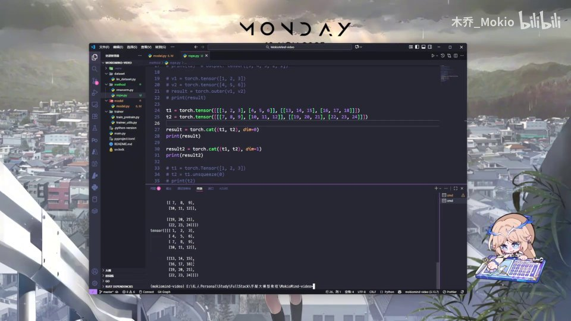
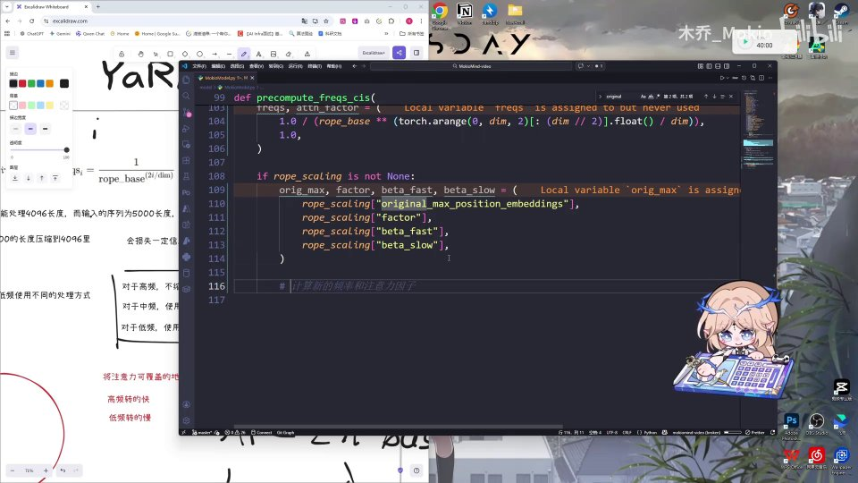
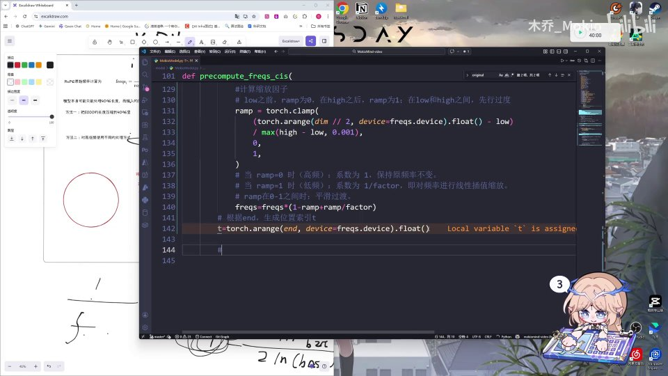
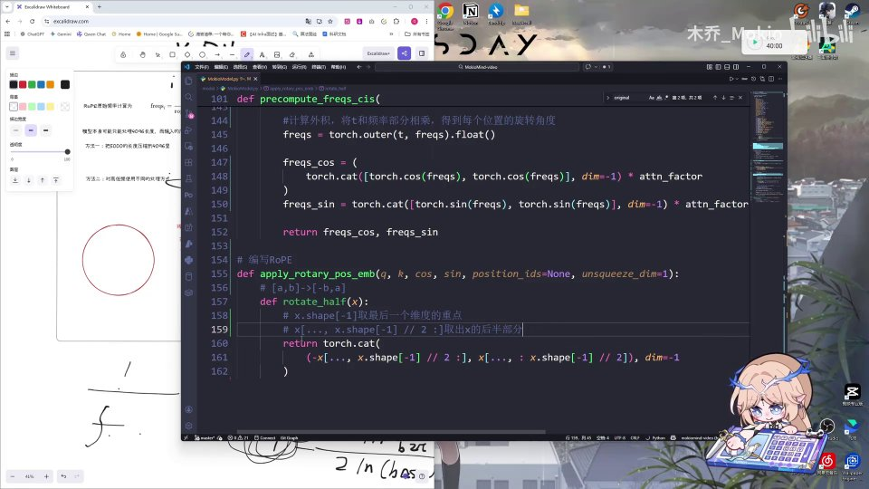

# 第10讲：代码：RoPE&YaRN

## 本讲要解决的核心问题（SCQA）

**背景**：前面几讲，我们分别讲过 RoPE（旋转位置编码，Rotary Position Embedding）和 YaRN（Yet another RoPE extensioN，一种把上下文窗口"拉长"的缩放方法）的理论。理论里的公式长得都挺唬人：波长、圈数、高低频、线性插值……纸面上好像都懂了。

**冲突**：可一旦打开编辑器，发现代码里全是 `torch.where`、`torch.outer`、`torch.cat`、`torch.clamp`、`lambda`、切片负号这些零碎东西。理论公式和代码之间隔着一层"翻译"，稍不留神就不知道哪一行对应哪个公式；尤其 YaRN 那段"把频率切成高频、中频、低频三段分别处理"，逻辑链一长就容易绕晕。

**疑问**：这些 PyTorch 方法各自到底是干什么的？RoPE 的基础频率怎么初始化？YaRN 的三段缩放怎么落到代码上？旋转又是怎么用两行 cos、sin 完成的？

**回答（中心思想）**：本讲就是一次"把公式翻译成代码"的实操。它由三块拼成——**第一步，用 5 个 PyTorch 小工具搭好操作台 → 第二步，写 `precompute_freqs_cis` 把 RoPE 频率和 YaRN 缩放一起算出来 → 第三步，写 `apply_rotary_pos_emb` 完成真正的旋转**。只要把每一步的数学公式翻出来对照，代码其实是理论的直译，并没有额外的魔法。

---

## 一、先掌握 5 个 PyTorch 方法：手写 RoPE 的全部工具

这一 part 用到的 torch 方法比较多，老师一个个演示 ([【跳转到 00:09】](https://www.bilibili.com/video/BV1T2k6BaEeC/?p=10&t=9))。它们其实就是后面写代码时的"扳手和螺丝刀"：先把工具认全、知道每个工具能拧什么螺丝，后面写正式代码时就不会被细节打断。

### 1.1 torch.where：按条件"二选一"

**是什么**：`torch.where` 的作用类似编程里的三目运算符 `条件 ? A : B`。它接收三个参数：第一个是**条件**（一个布尔张量），后面两个是**两个张量**。规则很直白：条件为真的位置取第一个张量的值，条件为假的位置用第二个张量对应位置的值填上。

**为什么需要**：在张量世界里，我们经常要"逐元素地做选择"——比如把某个范围内的值替换掉、把负数截断。`where` 就是最通用的逐元素选择器。

**怎么做**：老师给的例子是 ([【跳转到 00:14】](https://www.bilibili.com/video/BV1T2k6BaEeC/?p=10&t=14))：

```python
import torch
x = torch.tensor([1, 2, 3, 4, 5])
y = torch.tensor([10, 20, 30, 40, 50])
condition = x > 3
result = torch.where(condition, x, y)
print(result)   # tensor([10, 20, 30, 4, 5])
```

`x > 3` 会得到布尔张量 `[False, False, False, True, True]`。所以前三个位置不满足条件，用 `y` 的 `10, 20, 30` 填充；后两个位置满足条件，保留 `x` 的 `4, 5`，最终结果就是 `[10, 20, 30, 4, 5]`。运行结果和讲解完全一致 ([【跳转到 00:39】](https://www.bilibili.com/video/BV1T2k6BaEeC/?p=10&t=39))。


### 1.2 torch.arange：生成等差序列

**是什么**：`torch.arange` 生成一个类似等差序列的一维张量，和 Python 的 `range` 很像。它接收**起始、结束、步长**三个参数，注意"结束"是**取不到的**（左闭右开）。

**为什么需要**：RoPE 里有两处离不开它——一是生成每个"维度对"的编号 `torch.arange(0, dim, 2)`，二是生成每个**位置**的编号 `torch.arange(end)`。没有位置编号，就谈不上"不同位置的旋转角度不同"。

**怎么做**：

- `torch.arange(0, 10, 2)`：从 0 开始、到 10 之前结束、步长 2，结果是 `[0, 2, 4, 6, 8]`。
- `torch.arange(5, 0, -1)`：从 5 开始、到 0 之前结束、步长 −1，结果是 `[5, 4, 3, 2, 1]`。

老师现场运行，验证了这两个结果 ([【跳转到 00:64】](https://www.bilibili.com/video/BV1T2k6BaEeC/?p=10&t=64))。

### 1.3 torch.outer：外积，一行变二维

**是什么**：`torch.outer` 求外积（学过线性代数的会比较熟）。它把两个一维向量相乘，得到一个二维矩阵：结果矩阵第 `i` 行、第 `j` 列的值等于 `a[i] * b[j]`。

**为什么需要**：这是 RoPE 的**灵魂操作**。位置是一个向量、频率是另一个向量，我们想要"每个位置 × 每个维度的频率"这样一张二维表——外积正好一次算完。

**怎么做**：老师用 `a = [1, 2, 3]`、`b = [4, 5, 6]` 演示 ([【跳转到 00:89】](https://www.bilibili.com/video/BV1T2k6BaEeC/?p=10&t=89))：第一行是把 `4, 5, 6` 都乘 1，第二行都乘 2，第三行都乘 3，于是生成一个 3×3 的二维矩阵。对应到 RoPE：`torch.outer(t, freqs)` 就是在算"每个位置、每个维度"的旋转角度。

### 1.4 torch.cat：沿指定维度拼接

**是什么**：`torch.cat` 就是**维度拼接**，把若干形状相同（除目标维度外）的张量在指定维度上"接"起来。一开始学的时候会觉得有点绕。

**为什么需要**：RoPE 里有两处要用：一是理解张量形状时做实验，二是最后把 `cos`、`sin` 各自复制一份拼成完整长度。

**怎么做**：先看张量形状——如果一个张量最外面有三层方括号，那它就是三维张量。比如 `t1` 的 `shape = (2, 2, 3)`，表示"两个 (2, 3) 的矩阵" ([【跳转到 00:114】](https://www.bilibili.com/video/BV1T2k6BaEeC/?p=10&t=114))。

`torch.cat` 的 `dim` 参数指定在**第几个维度**上拼接（程序员的维度从 0 开始数）：

- `dim=0`：在最外层拼接。两个 `(2, 2, 3)` 合起来变成 `(4, 2, 3)`，也就是"四个 (2, 3) 的矩阵" ([【跳转到 00:164】](https://www.bilibili.com/video/BV1T2k6BaEeC/?p=10&t=164))。
- `dim=1`：在第二个维度拼接，形状变成 `(2, 4, 3)`，即"两个 (4, 3) 的矩阵" ([【跳转到 00:189】](https://www.bilibili.com/video/BV1T2k6BaEeC/?p=10&t=189))。
- `dim=2`：在最后一个维度拼接，形状变成 `(2, 2, 6)`，即"两个 (2, 6) 的矩阵" ([【跳转到 00:214】](https://www.bilibili.com/video/BV1T2k6BaEeC/?p=10&t=214))。

记住一条规律：**在哪一维拼接，那一维的大小就变成两者之和，其余维度不变**。


### 1.5 unsqueeze：凭空加一个维度

**是什么**：`unsqueeze` 就是在一个指定位置上**新增一个大小为 1 的维度**，张量里的数据一个没变，只是"多套了一层壳"。

**为什么需要**：做逐元素乘法时，两个张量的形状必须能互相广播。`cos`、`sin` 通常比 `q`、`k` 少一个头维度，所以要在中间插一个维度（`unsqueeze_dim=1`）来对齐。

**怎么做**：原本一维的 `T1`，`shape = (3,)`，执行 `T1.unsqueeze(0)` 后变成 `T2`，`shape = (1, 3)`——在最前面加了一个维度 ([【跳转到 00:239】](https://www.bilibili.com/video/BV1T2k6BaEeC/?p=10&t=239))。如果把 `0` 换成 `1`，就会在倒数第二个位置插入。




### 1.6 五个方法在本讲中的分工

把这 5 个工具串起来看，它们各自负责 RoPE 流水线上的一个环节，缺一不可：

| 方法 | 在本讲中的职责 | 出现在哪里 |
| --- | --- | --- |
| `torch.arange` | 生成维度编号、位置编号 | 初始化频率 `arange(0, dim, 2)`、位置索引 `arange(end)` |
| `torch.where` | 通用的逐元素选择器 | 本讲用于热身演示，理解张量条件运算 |
| `torch.outer` | 位置 × 频率，一次算出二维角度表 | `torch.outer(t, freqs)` |
| `torch.cat` | 复制拼接 cos/sin、实现换位 | `torch.cat([cos, cos], dim=-1)`、`rotate_half` |
| `unsqueeze` | 给 cos/sin 插维度以对齐 q/k | `apply_rotary_pos_emb` 的 `unsqueeze_dim` |

换个角度看，RoPE 的整套流程就是：**用 `arange` 造编号 → 用 `outer` 算角度 → 用 `cat` 拼表 → 用 `unsqueeze` 对齐 → 做逐元素乘加完成旋转**。工具都很小，但组合起来就是完整的旋转位置编码。

老师把这些方法一一运行演示，而不是直接贴完整代码，用意也在这里：**先把"零件"讲透，再组装成品，避免读者被一长段代码吓退**。这也是后面我们读正式代码时可以采用的策略——先认出每行在调用哪个工具，再回头看它对应哪个公式。

---

## 二、从零实现 precompute_freqs_cis：RoPE 的基础频率

工具备齐，正式进入 YaRN 的讲解 ([【跳转到 00:264】](https://www.bilibili.com/video/BV1T2k6BaEeC/?p=10&t=264))。老师的顺序很讲究：**先写 YaRN 的实现，再把 YaRN 用到 RoPE 上**，所以第一步是写这个"预算频率"的函数。

### 2.0 一分钟回顾 RoPE：位置是怎么变成"角度"的

先交代一下 RoPE 到底在做什么，方便后面看代码。

RoPE 的核心想法只有一句话：**把位置信息编码成向量被旋转的角度**。假设 Q、K 里每个向量有 `dim` 个分量，我们把它们**两两一组**看成平面上的点，例如 `(x0, x1)`、`(x2, x3)`……每一组在各自的二维平面里旋转一个角度，位置越靠后，转过的角度越大。这样，两个位置做注意力点积时，点积结果就会自然带上"它们相隔多远"的信息——相隔越远，角度差越大，内积衰减得越厉害。这就是 RoPE 用"相对角度"表达"相对位置"的原理。

这里有三个关键点，会在代码里反复出现：

1. **为什么两两一组**：二维平面才谈得上"旋转"，所以 `dim` 个分量要拆成 `dim/2` 组。这就是代码里到处出现 `dim // 2` 的原因。
2. **为什么不同维度转速不同**：如果所有维度都转一样快，位置一到很远的距离就会"绕圈绕到重叠"，分不清谁前谁后。所以 RoPE 给每一组配一个**不同的频率**：前面几组转得快（高频、波长短，管局部细节），后面几组转得慢（低频、波长长，管远距离）。这正好对应本讲反复强调的"低维=高频、高维=低频"。
3. **为什么要预计算**：每个位置、每组维度的角度是固定的、与输入无关的，所以可以提前算成一张 cos/sin 表，训练时直接查表，既省算力又稳定。

所谓"预算频率"，就是把"每个位置、每个维度该转多少角度"提前算成那张表。理解这三点，`precompute_freqs_cis` 的每一行都会变得顺理成章。

### 2.1 函数签名与参数：dim、end、rope_base、rope_scaling

老师给这个方法取名叫 `precompute_freqs_cis` ([【跳转到 00:295】](https://www.bilibili.com/video/BV1T2k6BaEeC/?p=10&t=295))。它的参数是：

- `dim`：注意力头的维度（`int`），决定频率向量的长度；
- `end`：要计算的一整个序列长度，比如 `1024`，实际可以更长 ([【跳转到 00:320】](https://www.bilibili.com/video/BV1T2k6BaEeC/?p=10&t=320))；
- `rope_base`：RoPE 的**基频**（默认值通常很大，例如 100000 或更大），它决定了各维度转速的整体尺度；
- `rope_scaling`：类型是 `Optional[dict]`，默认 `None` ([【跳转到 00:350】](https://www.bilibili.com/video/BV1T2k6BaEeC/?p=10&t=350))。它就是"要不要启用 YaRN 缩放、以及缩放参数是多少"的配置入口；不传就是纯 RoPE。

写成 Python 签名大致是这样：

```python
def precompute_freqs_cis(dim: int, end: int, rope_base: float,
                         rope_scaling: Optional[dict] = None):
```

### 2.2 初始化频率：1.0 / rope_base 的幂次

第一步是初始化 RoPE 频率，用的就是 RoPE 的基础公式 ([【跳转到 00:375】](https://www.bilibili.com/video/BV1T2k6BaEeC/?p=10&t=375))：

```python
freqs, attn_factor = (
    1.0 / (rope_base ** (torch.arange(0, dim, 2)[: (dim // 2)].float() / dim)),
    1.0,
)
```

拆开看：

1. `torch.arange(0, dim, 2)` 生成 `0, 2, 4, …` 这样的偶数下标；`[: (dim // 2)]` 取前 `dim/2` 个 ([【跳转到 00:404】](https://www.bilibili.com/video/BV1T2k6BaEeC/?p=10&t=404))。之所以只取一半，是因为 RoPE 是"两两一组"成对旋转的，`dim` 个数其实对应 `dim/2` 个旋转平面。
2. 转成 `float` 后**除以 `dim`**，把下标归一化到 0 到 1 之间的比例——这个比例就是"每个维度在总维度里排第几"，越靠后的维度转速越慢。
3. 用 `rope_base ** (...)` 求出每个维度的"波速尺度"，再取倒数 `1.0 / (...)`，就得到每个维度的**频率** `freqs`：数值越大转得越快。

与此同时还定义了 `attn_factor`，默认 `1.0` ([【跳转到 00:429】](https://www.bilibili.com/video/BV1T2k6BaEeC/?p=10&t=429))。它是个"注意力缩放系数"：纯 RoPE 时等于 1，不影响结果；但 YaRN 在放大上下文窗口后，注意力分布会变得更"平"（熵变大），需要给 cos、sin 整体乘一个温度系数来补偿，这个系数就是 `attn_factor`。老师把它和 `freqs` 放在同一个元组里一起赋值，阅读时容易看花眼，实际上 `attn_factor` 就是个单独的 1.0。


---

## 三、YaRN 的核心：把频率分成高频、中频、低频三段

### 3.1 为什么需要 YaRN：光靠"硬拉伸"会丢信息

先回忆一下 YaRN 要解决什么。RoPE 把位置编码成"钟表指针"旋转的角度：**高频维度转得快**（对应局部、相邻位置），**低频维度转得慢**（对应远距离、全局位置）。当推理序列比训练时更长（比如训练只见过 4096 长度，却要处理 5000 长度），如果直接把所有频率整体拉长，某些本来"各转各的"维度会旋转到互相重叠的角度，**信息就会损失**——这是幻灯片上明确写出的痛点 ([【跳转到 00:459】](https://www.bilibili.com/video/BV1T2k6BaEeC/?p=10&t=459))。

YaRN 的做法是**分段处理**，老师幻灯片上写得很清楚 ([【跳转到 00:527】](https://www.bilibili.com/video/BV1T2k6BaEeC/?p=10&t=527))：

- **高频（波长很短）**：不缩放，保持原样——它负责局部位置，拉长反而破坏细粒度信息；
- **中频**：使用线性插值，平滑过渡——介于两者之间，做"渐变"；
- **低频（波长很长）**：使用线性缩放——它负责长距离，拉伸后正好覆盖更远的上下文。

一句话：**不是一刀切地缩放，而是按维度波长"分档"处理**。这就是 YaRN 的核心思想，也是本讲代码最绕的一段。幻灯片旁还有一行笔记总结得非常形象：**高频转得快、低频转得慢**；"把注意力可覆盖的地方当作一个钟表"来理解旋转。

为什么"分档"比"一刀切"好，可以这样类比。假设你要把一个每天只画到 12 点的钟表，改造成能显示 24 小时：

- **高频维度**像"秒针"——它本来就转得飞快，负责精确到秒的局部信息。如果你硬把秒针也放慢一半去配合，秒级的信息立刻糊成一片，所以高频保持不动。
- **低频维度**像"时针"——它转得慢，负责大尺度的时间感。把时针的"刻度间距"整体放大 `factor` 倍，它就能覆盖原本两倍、四倍长的时间范围，这正是线性缩放。
- **中频维度**介于两者之间，直接"非黑即白"地处理会在边界处产生突变，所以用线性插值让缩放系数从 1 平滑地滑到 `1/factor`，避免不连续。

这套"高频不动、低频拉伸、中频渐变"的策略，就是 YaRN 能把上下文窗口放大若干倍、同时尽量不破坏原模型能力的根本原因。


### 3.2 什么时候才启用缩放：先取出 4 个超参数

配置取来后，先判断要不要用 YaRN ([【跳转到 00:459】](https://www.bilibili.com/video/BV1T2k6BaEeC/?p=10&t=459))：

```python
if rope_scaling is not None:
    orig_max, factor, beta_fast, beta_slow = (
        rope_scaling["original_max_position_embeddings"],
        rope_scaling["factor"],
        rope_scaling["beta_fast"],
        rope_scaling["beta_slow"],
    )
```

- `rope_scaling is not None`：只有传了缩放配置时才进入 YaRN 分支；
- `orig_max`（`original_max_position_embeddings`）：原始训练时的最大长度；
- `factor`：缩放倍数，窗口放大的目标比例；
- `beta_fast` / `beta_slow`：两个控制"分档边界"的超参数，`beta_fast` 管高频那一侧，`beta_slow` 管低频那一侧。

启用的条件是**推断长度大于训练长度** ([【跳转到 00:509】](https://www.bilibili.com/video/BV1T2k6BaEeC/?p=10&t=509))：

```python
if end > orig_max:
    ...
```

也就是"要推断的 `end` 超过了原来的 `orig_max`"才需要缩放；否则保持原样即可。这也符合直觉：训练长度以内，模型本来就见过，不需要额外处理。



### 3.3 用 inv_dim 找到波长边界：波长 b 到 i 的映射

接下来求"划分高低位"的分界点。老师用 `lambda` 定义了一个辅助函数 `inv_dim`，注释是"波长 b 到 i 的映射" ([【跳转到 00:534】](https://www.bilibili.com/video/BV1T2k6BaEeC/?p=10&t=534)、[【跳转到 00:578】](https://www.bilibili.com/video/BV1T2k6BaEeC/?p=10&t=578))：

```python
inv_dim = lambda b: (dim * math.log(orig_max / (b * 2 * math.pi))) \
                   / (2 * math.log(rope_base))
```

读法要点：

- 给定一个"旋转圈数 `b`"，它反推出这个圈数对应的**维度下标**；
- 分子 `dim * log(orig_max / (b * 2π))`：`2πb` 是一圈里能容纳的角度，`orig_max / (2πb)` 表示在这段长度里该波长大约转了多少圈，`log` 则把"圈数比例"转成线性刻度；
- 分母 `2 * log(rope_base)` 来自 RoPE 频率本身的定义，负责把"圈数"换算回"维度下标"。

于是我们可以用它算出：从哪一维开始算"中频/低频"。把 `beta_fast` 代进去得到较高维的分界，把 `beta_slow` 代进去得到较低维的分界。这两个 `beta` 越大，实际缩放的范围就越靠后。


### 3.4 划分低维/高维：low 与 high

得到 `inv_dim` 后，就划分高低维 ([【跳转到 00:603】](https://www.bilibili.com/video/BV1T2k6BaEeC/?p=10&t=603)、[【跳转到 00:628】](https://www.bilibili.com/video/BV1T2k6BaEeC/?p=10&t=628))：

```python
low = max(math.floor(inv_dim(beta_fast)), 0)
high = min(math.ceil(inv_dim(beta_slow)), dim // 2 - 1)
```

- **`low`**：不需要缩放的**高频部分**（低维、波长短），`max(..., 0)` 兜底防止越界为负；
- **`high`**：需要缩放的**低频部分**（高维、波长长），`min(..., dim // 2 - 1)` 兜底防止越界。

老师特别提醒一个容易绕晕的点：这里代码里的 `low`、`high` 指的是**低维和高维**（数组下标），而前面说的"高频、低频"是**频率高低**——两者方向相反，千万不要混为一谈。记牢这句口诀：**低维 = 高频，高维 = 低频**。


---

## 四、计算缩放因子：ramp 与线性插值

划分好区间后，要构造一个从 0 平滑升到 1 的**混合因子**，老师叫它 `ramp`（斜坡）([【跳转到 00:678】](https://www.bilibili.com/video/BV1T2k6BaEeC/?p=10&t=678)、[【跳转到 00:703】](https://www.bilibili.com/video/BV1T2k6BaEeC/?p=10&t=703))：

```python
ramp = torch.clamp(
    (torch.arange(dim // 2, device=freqs.device).float() - low)
    / max(high - low, 0.001),
    0,
    1,
)
```

逐句理解：

- `torch.arange(dim // 2)` 给每个"维度对"编号；减去 `low`，就是把区间的左端点平移到 0；
- 除以 `high - low` 做归一化：在 `low` 处得 0，在 `high` 处得 1；`max(..., 0.001)` 防止分母为 0（万一 `low == high`）；
- 外层 `torch.clamp(..., 0, 1)` 把结果裁剪到 `[0, 1]`——`low` 之前是 0，`high` 之后是 1，中间线性过渡。

这三段正对应前面说的"高频/中频/低频"：

- **`ramp = 0`（高频）**：保持原频率不变；
- **`ramp = 1`（低频）**：把频率缩放 `1/factor`；
- **`0 < ramp < 1`（中频）**：平滑插值过渡。

然后把这个因子作用到频率上 ([【跳转到 00:728】](https://www.bilibili.com/video/BV1T2k6BaEeC/?p=10&t=728))：

```python
freqs = freqs * (1 - ramp + ramp / factor)
```

用两个极端验证一下：

- 当 `ramp = 1`：系数变成 `1 - 1 + 1/factor = 1/factor`，频率被缩小为原来的 `1/factor`，也就是对低频做线性缩放；
- 当 `ramp = 0`：系数是 `1 - 0 + 0 = 1`，原频率保持不变；
- 当 `ramp` 在 0 和 1 之间：系数是 `1` 到 `1/factor` 的连续过渡，正是**对中频使用线性插值**的平滑效果 ([【跳转到 00:786】](https://www.bilibili.com/video/BV1T2k6BaEeC/?p=10&t=786)、[【跳转到 00:791】](https://www.bilibili.com/video/BV1T2k6BaEeC/?p=10&t=791))。

代码旁的注释也把三点总结得很清楚：**当 ramp=0 时（高频）系数为 1，保持原频率；当 ramp=1 时（低频）系数为 1/factor，对频率做线性插值缩放；ramp 在 0–1 之间时平滑过渡。**

不妨代一组具体数字感受一下。假设 `factor = 4`：

- `ramp = 0`：系数 `1 − 0 + 0/4 = 1`，频率**原样保留**；
- `ramp = 0.5`：系数 `1 − 0.5 + 0.5/4 = 0.625`，频率被压到 62.5%，处在"不变"和"缩小到 1/4"的正中间偏上；
- `ramp = 1`：系数 `1 − 1 + 1/4 = 0.25`，频率变成原来的 `1/4`，即被缩放得最狠。

可以看到，随着 `ramp` 从 0 平滑升到 1，缩放系数单调地从 1 滑到 `1/factor`，中间没有任何跳变——这就是"平滑过渡"的数学体现，也是 YaRN 相比粗暴插值更稳的原因。


---

## 五、生成 cos/sin：位置索引 t、外积与注意力系数

频率处理完，就要把它变成真正参与运算的 cos 和 sin。

### 5.1 位置索引 t 与外积

先生成"位置索引" `t`，再和频率做外积 ([【跳转到 00:801】](https://www.bilibili.com/video/BV1T2k6BaEeC/?p=10&t=801)、[【跳转到 00:826】](https://www.bilibili.com/video/BV1T2k6BaEeC/?p=10&t=826))：

```python
t = torch.arange(end, device=freqs.device).float()
freqs = torch.outer(t, freqs).float()
```

- `torch.arange(end)`：生成 `0, 1, 2, …, end-1`，代表序列里**每个位置**；`device=freqs.device` 保证和频率在同一个设备上（CPU/GPU）；
- `torch.outer(t, freqs)`：把"每个位置"和"每个维度的频率"相乘，得到**每个位置、每个维度**的旋转角度——这就是前面 1.3 节外积的用武之地。

用一句话概括：**位置索引 × 频率 = 每个位置的旋转角度**。`t` 越大（位置越靠后），同样的频率下转过的角度越大，这正是"位置越远、编码差异越大"的来源。

### 5.2 算 cos、sin，并用 cat 拼成完整维度

最后根据旋转角度算出 cos 和 sin ([【跳转到 00:826】](https://www.bilibili.com/video/BV1T2k6BaEeC/?p=10&t=826)、[【跳转到 00:851】](https://www.bilibili.com/video/BV1T2k6BaEeC/?p=10&t=851))：

```python
freqs_cos = (
    torch.cat([torch.cos(freqs), torch.cos(freqs)], dim=-1) * attn_factor
)
freqs_sin = (
    torch.cat([torch.sin(freqs), torch.sin(freqs)], dim=-1) * attn_factor
)

return freqs_cos, freqs_sin
```

几个要点：

1. 先 `torch.cos(freqs)`、`torch.sin(freqs)` 得到角度对应的三角函数值；
2. 用 `torch.cat(..., dim=-1)` 把同一个 cos/sin **在最后一个维度上复制拼接一份**——因为 RoPE 是"两两一组"旋转，前半部分和后半部分共用同一个角度，拼成完整长度后才能和完整的 Q、K 向量进行逐元素运算；
3. 再乘上 `attn_factor`，完成前面提到的**注意力系数缩放**（YaRN 拉长上下文后校正注意力分布）；
4. 最后把 `freqs_cos, freqs_sin` 返回，供旋转时使用。



---

## 六、真正旋转：apply_rotary_pos_emb 与 rotate_half

频率准备好了，接下来写真正执行旋转的 RoPE 代码 ([【跳转到 00:876】](https://www.bilibili.com/video/BV1T2k6BaEeC/?p=10&t=876))。

### 6.1 函数签名

```python
def apply_rotary_pos_emb(q, k, cos, sin, position_ids=None, unsqueeze_dim=1):
```

它接收 `q`、`k`（查询和键）、以及上一步算好的 `cos`、`sin`，对 `q` 和 `k` 施加同样的旋转。注意这里**只有 q、k，没有 v**——RoPE 只给 Q、K 加位置信息，Value 不参与旋转，这是 Transformer 里的标准做法。

### 6.2 rotate_half：把 [a, b] 变成 [-b, a]

旋转的第一步是"换符号和换位置"，也就是把向量两两一组 `[a, b]` 变成 `[-b, a]` ([【跳转到 00:901】](https://www.bilibili.com/video/BV1T2k6BaEeC/?p=10&t=901)、[【跳转到 00:926】](https://www.bilibili.com/video/BV1T2k6BaEeC/?p=10&t=926))。老师定义了一个内层函数 `rotate_half`：

```python
def rotate_half(x):
    # x.shape[-1] 取最后一个维度的长度
    # x[..., : x.shape[-1] // 2] 取出前半部分
    # x[..., x.shape[-1] // 2 :] 取出后半部分
    return torch.cat(
        (-x[..., x.shape[-1] // 2 :], x[..., : x.shape[-1] // 2]), dim=-1
    )
```

逐点解释 ([【跳转到 00:951】](https://www.bilibili.com/video/BV1T2k6BaEeC/?p=10&t=951))：

- `x.shape[-1]` 取最后一个维度的长度（也就是 `dim`）；
- `x[..., x.shape[-1] // 2 :]` 取**后半部分**，前面加负号变成 `-后半`；
- `x[..., : x.shape[-1] // 2]` 取**前半部分**；
- 用 `torch.cat` 按 `dim=-1` 把 `(-后半, 前半)` 拼起来，就实现了 `[前半, 后半] → [-后半, 前半]`，即 `[a, b] → [-b, a]`。其中 `...` 是省略号索引，表示"前面所有维度都保留"，只动最后一维。

这就是二维旋转公式里那个"交换并变号"的步骤。

![rotate_half 用切片和 cat 实现 [a,b]→[-b,a] 的符号与位置交换](assets/第10讲_代码：RoPE&YaRN/00926.jpg)

### 6.3 应用旋转公式

拿到"旋转后的 X"后，套用旋转位置编码公式 ([【跳转到 00:976】](https://www.bilibili.com/video/BV1T2k6BaEeC/?p=10&t=976)、[【跳转到 01:001】](https://www.bilibili.com/video/BV1T2k6BaEeC/?p=10&t=1001))：

```python
x_rotated = x * cos + rotate_half(x) * sin
```

- `x * cos`：原向量乘 cos；
- `rotate_half(x) * sin`：旋转半圈后的向量乘 sin；
- 两者相加，就是二维平面上旋转角度 θ 的结果（正是 `(x·cosθ − y·sinθ, x·sinθ + y·cosθ)` 这个标准旋转公式的 PyTorch 表达）。

老师在演示里把这段代码直接复制粘贴，对 `q` 和 `k` **完全同样地**各乘一遍，最后把 `q`、`k` 返回出去。这样，Q、K 里每个向量的位置信息就被"转"进去了。



### 6.4 为什么要 unsqueeze：形状对齐与广播

回到函数签名里的 `unsqueeze_dim=1`，最后解释一下它的作用。`q`、`k` 的形状通常是 `(batch, num_heads, seq_len, head_dim)`，而 `cos`、`sin` 不区分头，形状大致是 `(seq_len, head_dim)` 或 `(1, seq_len, head_dim)`。两者要逐元素相乘，必须让维度对齐。

`unsqueeze_dim=1` 就是在 `cos`、`sin` 的"头"那个位置插一个大小为 1 的维度，使其变成 `(1, 1, seq_len, head_dim)` 的形状，再靠 PyTorch 的**广播机制**自动复制到每个 batch、每个头上。这样同一套 cos/sin 就能复用到所有注意力头，既省内存又避免重复计算。

如果把 `unsqueeze_dim` 设错（比如插在第 0 维），广播就会失败或算错维度，所以这个看似不起眼的参数其实很关键。老师把完整代码"复制粘贴"后没有逐行再讲，但读者自己写时一定要留意形状。

### 6.5 整体回顾：一次完整的前向流程

把所有环节串起来，一次 RoPE/YaRN 的完整流程是这样的：

1. 调用 `precompute_freqs_cis(dim, end, rope_base, rope_scaling)`；
2. 用 `1.0 / rope_base ** (...)` 初始化每个维度的频率 `freqs`，`attn_factor` 默认 1.0；
3. 若传入了 `rope_scaling` 且 `end > orig_max`，取 `factor`、`beta_fast`、`beta_slow`；
4. 用 `inv_dim` 求分界，得到 `low`、`high`，用 `torch.clamp` 构造 `ramp`；
5. `freqs = freqs * (1 - ramp + ramp / factor)` 完成分档缩放；
6. `t = arange(end)`，`torch.outer(t, freqs)` 得到角度表，再求 cos、sin 并乘 `attn_factor`；
7. 返回 `freqs_cos, freqs_sin`；
8. 在注意力计算里调用 `apply_rotary_pos_emb(q, k, cos, sin, ...)`，用 `rotate_half` 和 `x * cos + rotate_half(x) * sin` 对 Q、K 施加旋转。

至此，YaRN + RoPE 就完整实现了。老师最后总结：理论部分实现之后，代码这部分还是比较好理解的，无非就是把前面讲过的计算公式一行行写出来 ([【跳转到 01:026】](https://www.bilibili.com/video/BV1T2k6BaEeC/?p=10&t=1026))。


---

## 七、五个最容易踩的坑

代码写完后，回顾一下老师演示过程中反复强调、也是自己动手时最容易出错的地方。

**坑一：忘记 `dim // 2`。** RoPE 是两两一组旋转，只有 `dim/2` 个独立角度。如果频率数组按 `dim` 来造，长度就会和旋转所需的对数不匹配，形状对不上。凡是看到 `arange(0, dim, 2)` 和 `dim // 2`，都要意识到"这是在处理成对的维度"。

**坑二：把"低维/高维"和"高频/低频"搞反。** 代码里的 `low`、`high` 指的是**数组下标**（低维、高维），而高频对应低维、低频对应高维。老师专门强调"不是我们这里的高频和低频"。一旦记反，就会把该保持原样的高频拿去缩放，效果完全错乱。

**坑三：忘了除零保护。** 计算 `ramp` 时的分母写成 `max(high - low, 0.001)`，而不是直接 `high - low`。原因是某些极端配置下 `low` 可能等于 `high`，直接相除会出现除零或 `NaN`，用 `0.001` 兜底既安全又几乎不影响数值。

**坑四：以为 cos/sin 只是简单算一次。** 代码里用 `torch.cat([torch.cos(freqs), torch.cos(freqs)], dim=-1)` 把 cos **复制拼接**成两份，而不是直接返回 `dim/2` 长度的数组。这是因为后半维度和前半维度共享同一个角度，拼成完整长度后才能和完整的 Q、K 逐元素运算。

**坑五：漏掉 `attn_factor` 和 `unsqueeze`。** `attn_factor` 在纯 RoPE 时是 1，容易被误以为没用；但一旦启用 YaRN，它决定了注意力分布的校正强度。`unsqueeze_dim` 则关系到 cos/sin 与 q/k 的广播对齐，设错就会形状报错。这两个"小透明"参数恰恰是 YaRN 能正常工作的关键。

把这五个坑记住，再回头读 `precompute_freqs_cis` 和 `apply_rotary_pos_emb`，基本就能做到"一眼看懂、动手能写"了。

---

## 小结

- **工具先行**：`torch.where`（按条件二选一）、`torch.arange`（等差序列）、`torch.outer`（外积变二维）、`torch.cat`（沿指定维度拼接）、`unsqueeze`（加一个维度），这 5 个方法贯穿全篇。
- **`precompute_freqs_cis` 负责"预算"**：先用 `1.0 / rope_base ** (...)` 初始化每个维度的 RoPE 频率，并准备默认 `1.0` 的 `attn_factor`。
- **YaRN 只在 `end > orig_max` 时启用**，从 `rope_scaling` 里取出 `orig_max`、`factor`、`beta_fast`、`beta_slow` 四个超参数。
- **分档是关键**：用 `inv_dim` 把波长/圈数换成维度下标，再用 `low = floor(inv_dim(beta_fast))`、`high = ceil(inv_dim(beta_slow))` 划出高频与低频的边界（低维=高频，高维=低频）。
- **`ramp` 实现平滑过渡**：`torch.clamp` 让 `ramp` 从 0 升到 1；`freqs = freqs * (1 - ramp + ramp / factor)` 让高频保持、低频缩小 `1/factor`、中频线性插值。
- **生成三角函数表**：`t = arange(end)` 与频率做外积得到角度，`cos`/`sin` 在最后一维复制拼接并乘 `attn_factor`。
- **`apply_rotary_pos_emb` 负责"执行"**：`rotate_half` 把 `[a, b]` 变成 `[-b, a]`，再按 `x_rotated = x·cos + rotate_half(x)·sin` 对 Q、K 施加旋转。

## 关键术语速查

| 术语 | 一句话解释 |
| --- | --- |
| RoPE（旋转位置编码） | 用"旋转角度"表示位置的编码方式，高频维度转得快、低频维度转得慢 |
| YaRN | 在 RoPE 基础上按频率分档缩放，把上下文窗口从训练长度"拉长"的方法 |
| `precompute_freqs_cis` | 预先算出每个位置、每个维度的 cos/sin 值的函数 |
| `apply_rotary_pos_emb` | 用 cos/sin 对 Q、K 施加旋转的函数 |
| `rope_base` | RoPE 的基频（基础周期参数），决定各维度转得快慢 |
| `rope_scaling` | 传入 YaRN 配置的字典，`None` 表示不启用缩放 |
| `original_max_position_embeddings`（orig_max） | 原模型训练时的最大长度，超过它才需要缩放 |
| `factor` | 上下文窗口的缩放倍数，低频频率会被缩小为 `1/factor` |
| `beta_fast` / `beta_slow` | 控制"高频/低频"分档边界的两个超参数 |
| `inv_dim` | 把"波长/圈数"映射到"维度下标"的辅助函数 |
| `low` / `high` | 高频（低维）与低频（高维）的分界下标 |
| `ramp` | 从 0 平滑升到 1 的混合因子，实现高/中/低频的过渡 |
| `attn_factor` | 注意力缩放系数，YaRN 拉长窗口后用于校正注意力分布，纯 RoPE 时为 1.0 |
| `rotate_half` | 把向量对 `[a, b]` 变成 `[-b, a]`，是旋转的"换位"步骤 |
| `torch.outer` | 外积，把位置索引和频率相乘得到二维的旋转角度 |
| `unsqueeze` | 在指定位置插入一个大小为 1 的维度，用于形状对齐 |
