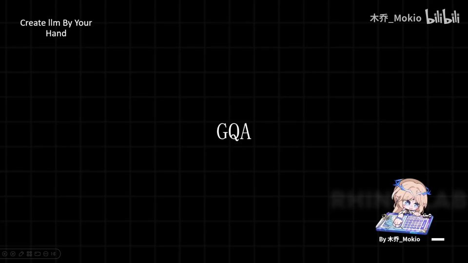
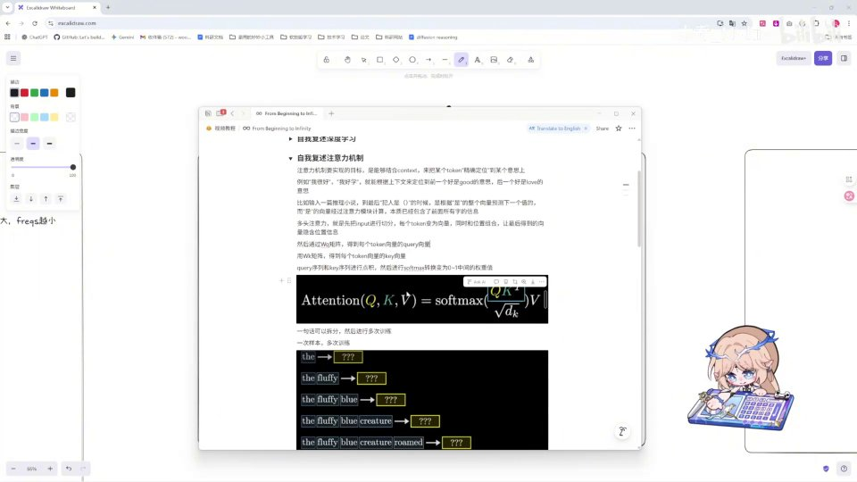
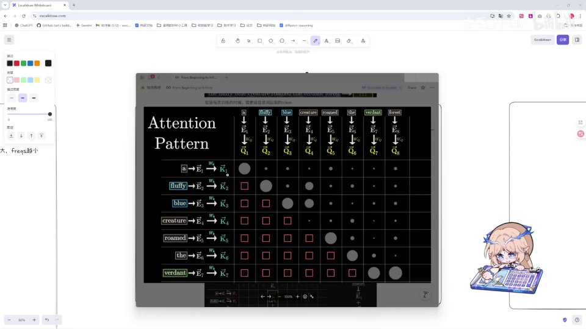
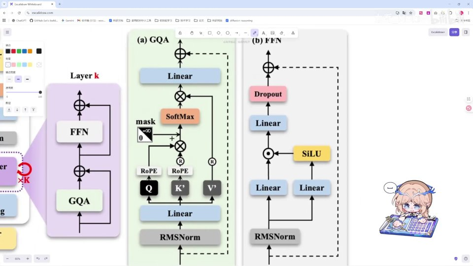

# 第11讲：理论：GQA（分组查询注意力）

## 本讲要解决的核心问题（SCQA）

**背景**：你已经学过 Transformer 里的注意力（attention）机制，知道它靠 Query（查询）、Key（键）、Value（值）三个向量算出「每个词该关注哪些词」。在 MiniMind 这样的模型里，注意力是「多头」的——一层里同时挂着十几个头，每个头各自算一份注意力。

**冲突**：多头带来一个新的成本问题。如果一层有 16 个头，是不是就要老老实实存 16 份 Key 和 Value？显存非常宝贵，算力也非常宝贵，存 16 份 K/V 太占显存了。而且在大模型做长文本生成时，K/V 还要被缓存起来反复读取，头数翻倍，这部分开销也翻倍。

**疑问**：有没有办法让多个 Q 共享同一组 K 和 V，既保留多头的表达力，又把 K/V 的存储与计算降下来？共享的方向能不能反过来，比如让 K 去共享 Q、V？

**回答（中心思想）**：这就是 **GQA（Grouped-Query Attention，分组查询注意力）** 要解决的问题。它让每 4 个 Q 共享一组 K 和 V——经过工程验证，这个比例效果最好。本讲把 GQA 的理论讲清楚：先复习 attention 这条主线，再说清「为什么要共享」「为什么是 Q 共享 K/V」，最后对着架构图把整个前向流程走一遍，为下一讲的代码实现做准备。

---

## 一、先复习 attention：Q/K/V 是怎么算出注意力值的

在学 GQA 之前，必须先确保你对 attention 有过学习和了解 [【跳转到 00:09】](https://www.bilibili.com/video/BV1T2k6BaEeC/?p=11&t=9)。如果你还没学过，完全可以先去看 3Blue1Brown 的注意力视频 [【跳转到 00:14】](https://www.bilibili.com/video/BV1T2k6BaEeC/?p=11&t=14)；而且我推荐你在学完之后，像我一样用**费曼学习法**：自己复述输出一遍，再去问 AI 让它给你补充 [【跳转到 00:24】](https://www.bilibili.com/video/BV1T2k6BaEeC/?p=11&t=24)。复述是检验理解的最好方式——讲得出来，才是真的懂了。

### 1.1 为什么需要注意力

一句话先讲清楚：**注意力就是让每个词都能「看一眼」句子里的其他词，并按相关程度把信息搬运过来**。

举个最直白的例子：句子「小明把书放在桌子上，因为它太重了」——「它」到底指书还是桌子？人靠上下文一眼就能判断；而模型要判断这一点，就得让「它」这个位置的向量去「关注」前面所有词，尤其是「书」和「桌子」，再根据相关度决定把谁的信息更多地取过来。这个「按相关度取信息」的动作，就是注意力。

从流程上看，一句话先被切成一个个 **token（词元/标记）**，每个 token 变成一个向量（称为 embedding，嵌入向量）。注意力要做的，就是让这些向量彼此交换信息，从而得到「结合了上下文」的新向量。

### 1.2 attention 的计算公式

注意力机制的计算公式长这样 [【跳转到 00:34】](https://www.bilibili.com/video/BV1T2k6BaEeC/?p=11&t=34)：

$$
\text{Attention}(Q, K, V) = \text{softmax}\!\left(\frac{QK^{\top}}{\sqrt{d_k}}\right)V
$$

逐项拆开看：

- **Q（Query，查询）**：当前这个词「想问什么」的向量。每个 token 用自己的 Q 去「提问」。
- **K（Key，键）**：每个词「能被怎样查询到」的向量。Q 和 K 的转置相乘，本质是在算「当前词和历史每个词有多相关」。$QK^\top$ 得到的是一个分数矩阵，第 $i$ 行第 $j$ 列表示「第 $i$ 个词对第 $j$ 个词的关注分数」。
- **$d_k$**：K 的维度。除以 $\sqrt{d_k}$ 是为了防止数值过大，让后续 softmax 的分布更稳定，不至于过于极端——如果分数差距被放大得太大，softmax 会退化成「几乎只看一个词」，梯度也会变得很小。
- **softmax**：把上一步算出的相关性分数归一化成一串加起来等于 1 的概率，也就是「注意力权重」。权重越大，说明越该关注那个词。
- 最后再乘以 **V（Value，值）**：按权重把各个词的信息加权求和，得到当前词融合上下文后的新表示。

换成图来看就很直观：视频用一句话「the fluffy blue creature roamed the verdant forest」举例，Q 的向量在这里，和 K 的向量进行一系列相乘 [【跳转到 00:43】](https://www.bilibili.com/video/BV1T2k6BaEeC/?p=11&t=43)。比如训练时输入 `the fluffy blue ___`，模型要学会把最后一个空缺位补成 `creature`。要做到这一点，`blue` 后面的位置就必须「关注」前面的 `fluffy` 和 `blue`，才能判断这里该填一个「毛茸茸的蓝色生物」。

### 1.3 注意力分数长成一张「方格表」

把每个位置的 Q 和每个位置的 K 两两相乘，就得到了一张**注意力分数矩阵**（Attention Pattern）：行是「当前词」，列是「它在看的历史词」[【跳转到 00:48】](https://www.bilibili.com/video/BV1T2k6BaEeC/?p=11&t=48)。矩阵里越相关的格子，分数越高；越不相关的格子，分数越低。

这张表有个重要特征：它天然是一个方阵，因为「当前词」和「被关注的词」来自同一个序列（这就是所谓 **self-attention，自注意力**）。也正因为是同一序列，一个位置才会「不小心看到后面的答案」，所以下一步必须靠掩码来限制可见范围。

---

## 二、为什么一定要加掩码（mask）

在算注意力的过程中，我们还需要应用**掩码（mask）**[【跳转到 00:48】](https://www.bilibili.com/video/BV1T2k6BaEeC/?p=11&t=48)。为什么要应用掩码呢？

因为让模型生成文本时，我们**希望它一定基于之前的文本去生成**[【跳转到 00:55】](https://www.bilibili.com/video/BV1T2k6BaEeC/?p=11&t=55)。如果我们训练时把后面的文本也喂进去，相当于模型「结合了前面和后面」来生成这个词——它就偷看到答案了。这样训出来的模型，推理时会「作弊失败」：真实使用时它看不到后面的词，表现会大打折扣。

而我们实际应用大模型的时候，模型只能根据前面已经出现的内容来生成。所以训练时就必须和推理时保持一致：**加上掩码，让它在 softmax 层做转化的时候，把「未来」位置的相关性都消为零** [【跳转到 01:00】](https://www.bilibili.com/video/BV1T2k6BaEeC/?p=11&t=60)。

具体做法是：先把注意力分数矩阵的**上三角**（即「当前词」看向「未来词」的位置）设成一个极大的负数（等价于负无穷）。这样经过 softmax 后，这些位置的权重就变成 0，模型等于完全看不到未来。视频这幅图上，灰点是被允许关注的、红叉是被 mask 掉的未来位置 [【跳转到 01:00】](https://www.bilibili.com/video/BV1T2k6BaEeC/?p=11&t=60)。这种「只能看前面」的结构，就是我们常说的**因果注意力（causal attention）**，也是所有自回归语言模型（GPT 系列、MiniMind 等）的标配。

用一句话总结掩码的意义：**它让训练和推理对齐，杜绝「偷看答案」**。

---

## 三、算完权重之后：乘以 V、拼接多头、再输出

### 3.1 用注意力权重对 V 做加权求和

得到 softmax 后的概率权重后，下一步就是把它作用到 V 上：把上一部分算到的值与 V 相乘 [【跳转到 01:20】](https://www.bilibili.com/video/BV1T2k6BaEeC/?p=11&t=80)，得到我们所需要的 attention 的值 [【跳转到 01:25】](https://www.bilibili.com/video/BV1T2k6BaEeC/?p=11&t=85)。

直觉上，这一步就是「按相关度把每个历史词的信息搬运过来、混合成当前词的新表示」。视频图里每个 V 前面的系数（如 0.93、0.00）就是注意力权重：系数接近 1，说明这个词的信息几乎被完整搬过来；系数是 0，说明它被忽略。把所有加权后的 V 加起来，就得到当前词融合了上下文的新向量。

这里能看出 Q、K、V 的分工：**Q 和 K 负责「算相关度」，V 负责「提供内容」**。这个分工很重要，后面讲 GQA 时「为什么只共享 K/V 而不共享 Q」就建立在这上面。

### 3.2 多头注意力：把单头拼接起来

因为是**多头注意力（multi-head attention）**，上面这套计算会在多个「头」里并行做，每个头学习到不同类型的关联方式。最后我们需要把单头给拼接（concatenate）在一起，成为多头 [【跳转到 01:30】](https://www.bilibili.com/video/BV1T2k6BaEeC/?p=11&t=90)。

为什么要有「多个头」？因为一句话里可能同时存在多种关系：有的头可能专门关注语法结构（比如主谓宾），有的头可能专门关注指代关系（比如「它」指谁），还有的头关注远距离依赖。如果只有一套 Q/K/V，模型只能用一张「关系图」勉强表达所有关系；拆成多个头后，每个头可以各管一摊，表达力更强。

把多个头的结果按维度拼接起来后，再经过一个 **linear 层（线性层）** 做融合，就得到了这一层注意力的最终输出 [【跳转到 01:30】](https://www.bilibili.com/video/BV1T2k6BaEeC/?p=11&t=90)。这也是为什么「头」的引入能提升表达力，而代价正是接下来要讲的 K/V 变多。

到这里，attention 机制的闭环就复习完了。接下来进入本讲的主角：**GQA**。

---

## 四、传统注意力的痛点：16 个头就要存 16 份 K 和 V

attention 机制了解之后，我们需要知道为什么这里写的是 GQA [【跳转到 01:35】](https://www.bilibili.com/video/BV1T2k6BaEeC/?p=11&t=95)。

核心矛盾只有一句话：**在传统注意力中，比如有 16 个头，那么你就需要存 16 份 K 和 V** [【跳转到 01:35】](https://www.bilibili.com/video/BV1T2k6BaEeC/?p=11&t=95)。

这为什么是个问题？至少两个原因：

1. **显存宝贵**：在自回归生成时，每生成一个新 token，K/V 都要被缓存下来（即 **KV Cache**），供后续 token 复用。序列越长、头越多，缓存越大。头数翻倍，K/V 的存储量也翻倍。对于长上下文场景，KV Cache 甚至可能成为显存的主要占用项。
2. **算力/带宽宝贵**：把 16 份 K 和 V 存下来、再反复读写，消耗的不只是容量，还有显存带宽和计算量。显存越紧张，能放的批量（batch）和序列长度就越小，吞吐也越低。

所以人们就想：**能不能让多个 Q 共享一组 KV 呢？** [【跳转到 01:35】](https://www.bilibili.com/video/BV1T2k6BaEeC/?p=11&t=95)

这里要强调一点：**Q 的数量不变，减少的是 K/V 的份数**。Q 仍然是多头（每个头一个 Q），只是让相邻的几个 Q 去共用同一份 K/V。这样既保住了「多头并行看问题」的能力，又把 K/V 的存储和读写降了下来。

---

## 五、GQA 的核心思想：让多个 Q 共享一组 KV

经过试验，有三种典型方案 [【跳转到 02:00】](https://www.bilibili.com/video/BV1T2k6BaEeC/?p=11&t=120)：

- **一对一**：一个 Q 自己独占一个 K 和 V（这其实就是原始的**多头注意力 MHA**）。
- **两个 Q 共享一组** K 和 V。
- **四个 Q 共享一组** K 和 V。

在工程验证中，**4 个 Q 共享一个 K 和 V 效果是最好的**，所以现在 GQA 就采用这个比例 [【跳转到 02:00】](https://www.bilibili.com/video/BV1T2k6BaEeC/?p=11&t=120)。这里的「4」就是 GQA 的**分组大小（group size）**——把 Q 每 4 个分为一组，每组共用一份 K/V。

顺便对照两个极端，方便建立整体图景：

| 方案 | 全称 | Q 与 KV 的关系 | KV 份数（16 头为例） | 特点 |
| --- | --- | --- | --- | --- |
| **MHA** | Multi-Head Attention | 每个 Q 独占一组 KV | 16 份 | 表达力强，但 KV 开销最大 |
| **GQA** | Grouped-Query Attention | 每若干（如 4）个 Q 共享一组 KV | 4 份 | 效果与开销的最佳折中 |
| **MQA** | Multi-Query Attention | 所有 Q 共享唯一一组 KV | 1 份 | 最省显存，但效果损失较大 |

可以发现，GQA 正好卡在 MHA 和 MQA 之间：比 MHA 省显存（16 份变 4 份），又比 MQA 保住了效果（MQA 只留 1 份，压缩太狠）。这就是它成为当下主流大模型（包括 MiniMind）默认选择的原因。

> 一句话记住 GQA：**它不是「新发明了某种注意力计算」，而是改变了 Q、K、V 的数量配比**——Q 保持多头，K/V 减少份数，并在组内被多个 Q 复用。

需要说明的是，共享并不改变注意力的计算方式，只是在计算前把 K/V「重复/广播」到和 Q 对齐的头数。也就是说，**GQA 的前向公式和普通注意力完全一样，区别只在 K/V 的来源份数**。

---

## 六、为什么是「Q 共享 KV」，而不是反过来？

也许有人会问：为什么不用 K 共享 Q、V 之类的呢？[【跳转到 02:00】](https://www.bilibili.com/video/BV1T2k6BaEeC/?p=11&t=120)

这里可以把 QKV 想象成数据库里的 **Query、Key、Value**[【跳转到 02:25】](https://www.bilibili.com/video/BV1T2k6BaEeC/?p=11&t=145)：

- **Query 是「查询」**：当前词拿着它去「问」历史信息，是发起检索的一方。
- **Key 是「键」**：用来和 Query 比对、定位到要取哪条记录。
- **Value 是「值」**：真正被取回的信息内容。

视频里有个很贴切的比喻：**很多个人去翻字典**。你可以让很多人共享几本字典；但绝不能反过来——很多本字典共享一个人。后者显然不合理 [【跳转到 02:25】](https://www.bilibili.com/video/BV1T2k6BaEeC/?p=11&t=145)。

对应到注意力里：

- **Q 是提问者**，负责融合上下文、获取不同词的信息，是「主动方」，每个位置、每个头都需要保留自己独立的提问方式，所以不能合并。
- **K 和 V 只是「数据库」一样的角色**，负责提供信息，它们的职责是「被查询、被取用」，性质上更适合被复用、共享。

所以结论就是：**我们让 Q 去共享 K 和 V，而不是让 K/V 去共享 Q** [【跳转到 02:50】](https://www.bilibili.com/video/BV1T2k6BaEeC/?p=11&t=170)。这也正是 GQA 名字里「Grouped-Query」的含义——把 Query 分组，每组共用一份 K/V。

---

## 七、对照架构图，走一遍 GQA 的完整前向流程

有了 attention 机制，我们就可以看着这张架构图，把 GQA 的具体内容串起来 [【跳转到 02:50】](https://www.bilibili.com/video/BV1T2k6BaEeC/?p=11&t=170)。左边 `Layer k` 里，残差（residual）加号、FFN、GQA 三块构成一个 Transformer 层；右边放大展示了 GQA 和 FFN 两个子模块。下面按数据流一步一步走。

先理解这张图的大结构：一个 Transformer 层里，先做一次归一化和 GQA 注意力，把结果通过**残差连接（residual）**加到原输入上；再做一次归一化和 **FFN（前馈网络）**，同样加残差。所谓残差连接，就是在子模块输出上加回它的输入（图里的 `+` 号），让梯度能顺畅地往回传，训练更稳、更深。GQA 就替换了传统层里的多头注意力模块。

### 7.1 输入先过 RMSNorm，再投影出 Q/K/V

输入向量先经过 **RMSNorm（均方根归一化）** 做归一化，让数值分布更稳定。所谓归一化，就是把各维数值的尺度拉齐，避免某些维度过大主导计算，从而让训练更稳定。RMSNorm 是 LayerNorm 的简化版，只按均方根缩放，计算更省。

然后输入 X 分别和 **W_Q、W_K、W_V 三个权重矩阵相乘，得到三个投影**，也就是 Q、K、V [【跳转到 02:58】](https://www.bilibili.com/video/BV1T2k6BaEeC/?p=11&t=178)。在 GQA 里，这三个投影的「头数」并不相同：Q 投影出全部注意力头，而 K、V 只投影出「组数」那么多份，份数变少了。

### 7.2 用 RoPE 给 Q 和 K 加位置编码

接着，用我们之前的 **RoPE（旋转位置编码）** 方法对 Q 和 K 进行位置编码 [【跳转到 02:58】](https://www.bilibili.com/video/BV1T2k6BaEeC/?p=11&t=178)。

位置编码的作用是让模型感知词的先后顺序——否则注意力本身就是「无序集合」，分不清「猫追老鼠」和「老鼠追猫」。RoPE 的做法是把 Q、K 向量按位置「旋转」一个角度，使得两个词的相对位置关系直接体现在它们的内积里。注意这里只对 Q、K 编码，不对 V 编码，因为位置信息只影响「算相关度」，而 V 只负责携带内容。

### 7.3 在组内复用 K/V，再做 Q·Kᵀ

编码之后，让它们在这里相乘，得到我们刚刚在 attention 部分讲的这一个量（$QK^\top$）[【跳转到 02:58】](https://www.bilibili.com/video/BV1T2k6BaEeC/?p=11&t=178)。

GQA 与普通 MHA 的关键区别就出现在这一步：**在 K 和 V 部分，我们让它进行重复（repeat），也就是让多个 Q 共享同一组 K 和 V** [【跳转到 03:21】](https://www.bilibili.com/video/BV1T2k6BaEeC/?p=11&t=201)。图上 K′、V′ 带一个重复符号，就是这个意思——K/V 的份数少（比如 4 份），通过广播/复制在计算时对齐到 Q 的头数（比如 16 份），从而被同组的 4 个 Q 复用。这样显存里真正只需保存 4 份 K/V，而不是 16 份。

### 7.4 加掩码、softmax、再与 V 相乘

随后应用掩码，把后面的部分遮住，不让它看答案 [【跳转到 03:16】](https://www.bilibili.com/video/BV1T2k6BaEeC/?p=11&t=196)；只能 softmax 转化成一个概率输出 [【跳转到 03:21】](https://www.bilibili.com/video/BV1T2k6BaEeC/?p=11&t=201)。最后再让这些权重和 V 相乘 [【跳转到 03:21】](https://www.bilibili.com/video/BV1T2k6BaEeC/?p=11&t=201)。

请注意顺序：**先 Q·Kᵀ 得到分数，再 mask，再 softmax，最后乘 V**。掩码必须在 softmax 之前加，因为 softmax 之后权重已经是非负且归一化的，再加负无穷就来不及了。

### 7.5 拼接多头并输出

再经过一个 **linear 层**，就把我们多个头给拼接（拼接回来）然后输出 [【跳转到 03:33】](https://www.bilibili.com/video/BV1T2k6BaEeC/?p=11&t=213)。至此 GQA 的理论部分就讲完了。

把整条链路连起来看，GQA 的完整前向是：

**RMSNorm → Q/K/V 投影（K/V 份数更少）→ RoPE 位置编码 → 组内复用 K/V 做 Q·Kᵀ → 加 mask → softmax → 乘 V → linear 拼接输出 → 残差相加。**

下一 part，我们会按照这整个过程来敲一遍代码，我们下一 part 见 [【跳转到 03:42】](https://www.bilibili.com/video/BV1T2k6BaEeC/?p=11&t=222)。

---

## 八、用一个具体例子把 GQA 的形状走一遍

为了把抽象概念落地，我们用一个具体数字走一遍。假设某层有 **16 个注意力头**，每个头的维度是 **64**，那么注意力部分的总维度就是 $16 \times 64 = 1024$。现在看三种方案分别要维护多少份 K/V：

- **MHA**：Q、K、V 都投影出 16 份，即 16 份 Q、16 份 K、16 份 V，KV 缓存存 16 份。
- **GQA（group size = 4）**：Q 仍然是 16 份；K、V 只投影出 $16 \div 4 = 4$ 份。计算时，每 4 个 Q 共用 1 份 K/V，合计 4 组。
- **MQA**：K、V 只投影出 1 份，16 个 Q 全部共用这一份。

数据流大致是这样的：

1. **投影**：输入 X（形状 `[batch, seq_len, 1024]`）分别乘 $W_Q$、$W_K$、$W_V$。$W_Q$ 输出 16 个头，$W_K$、$W_V$ 输出 4 个头。
2. **加位置编码**：对 Q、K 施加 RoPE，得到带位置信息的 Q、K′。
3. **重复 K/V**：把 4 份 K/V 在「头」这个维度上各复制 4 次，对齐成 16 份，记为重复后的 K″、V″。
4. **算分数**：Q 与 K″ 转置相乘，形状回到 `[batch, 16, seq_len, seq_len]`，每一行是一个词对全句的关注分数。
5. **掩码 + softmax**：把上三角设为负无穷，softmax 得到 0~1 的注意力权重。
6. **加权求和**：权重与 V″ 相乘，得到 16 个头各自的输出。
7. **拼接与输出**：把 16 个头在维度上拼回 `[batch, seq_len, 1024]`，再过一个 linear 层融合，最后和原输入做残差相加。

对比一下 K/V 的存储量：MHA 要存 16 份，GQA 只存 4 份，**直接省掉了约 75% 的 K/V 存储**；而 Q 的数量一份没少，多头的表达力基本保留。这就是 GQA 的性价比来源。

### 常见疑问

**Q1：共享 K/V 会影响多个 Q 的独立性吗？**
不会。每个 Q 仍然是独立的，只是它们去查询「同一个数据库」。就像同一个问题可以由不同人用不同方式去查同一本书，查出来的结果依然因提问方式而不同。

**Q2：group size 一定要是 4 吗？**
不一定。4 只是视频里工程验证下来效果最好的常规取值。只要 Q 的头数是组数的整数倍，就能整除分组。分组越细（越接近 1）越像 MHA、效果越好但越费显存；越粗（趋向 1 份）越像 MQA、越省显存但效果越差。

**Q3：GQA 是不是就不用掩码、不用 RoPE 了？**
不是。GQA 只改变 K/V 的份数，注意力内部该有的步骤一个不少：掩码保证因果性，RoPE 提供位置信息，softmax 归一化权重，最后乘 V 并拼接输出。

---

## 小结

- **attention 是 GQA 的基础**：$\text{Attention}(Q,K,V)=\text{softmax}(QK^\top/\sqrt{d_k})V$，用 Q·K 算相关度，softmax 归一化，再对 V 加权求和。
- **掩码保证因果性**：训练时遮住未来位置，让模型只能基于前文生成，与推理行为一致，杜绝偷看答案。
- **多头注意力把单头拼接起来**，不同头学习不同模式的关联，最后过一个线性层融合输出。
- **传统多头的痛点**：16 个头就要存 16 份 K/V，显存、带宽和算力都吃不消。
- **GQA 的核心**：让多个 Q 共享一组 K/V，工程验证「4 个 Q 共享一组」效果最好，是 MHA 与 MQA 之间的最佳折中。
- **为什么是 Q 共享 KV**：Q 是提问者（主动、需独立），K/V 是「数据库」（提供信息、适合复用）。
- **完整前向流程**：RMSNorm → Q/K/V 投影 → RoPE 位置编码 → 组内复用 K/V 做 Q·Kᵀ → mask → softmax → 乘 V → linear 拼接输出。

## 关键术语速查

| 术语 | 一句话解释 |
| --- | --- |
| **Attention（注意力）** | 用 Q、K、V 计算「每个词该关注哪些词」并加权汇总信息的机制。 |
| **Q / K / V** | Query 查询、Key 键、Value 值；分别代表想问什么、能被怎么查到、取回什么内容。 |
| **self-attention（自注意力）** | Q、K、V 都来自同一序列的注意力，分数矩阵是方阵。 |
| **$d_k$** | K 的维度；$QK^\top/\sqrt{d_k}$ 中的缩放因子，防止数值过大导致 softmax 过于极端。 |
| **softmax** | 把分数归一化成加起来等于 1 的概率（注意力权重）。 |
| **mask（掩码）** | 把未来位置的相关性置为负无穷，softmax 后权重变 0，保证只能看前文。 |
| **causal attention（因果注意力）** | 只能关注当前位置及其左侧的注意力，自回归模型的标配。 |
| **多头注意力（MHA）** | 并行多个注意力头，每个头独占一组 K/V，最后拼接输出。 |
| **KV Cache** | 自回归生成时缓存的 K/V，序列越长、头越多，占用越大。 |
| **GQA** | 分组查询注意力：每若干（如 4）个 Q 共享一组 K/V，兼顾效果与显存。 |
| **MQA** | 多查询注意力：所有 Q 共享唯一一组 K/V，最省显存但效果损失较大。 |
| **group size（分组大小）** | GQA 中每组共享 K/V 的 Q 个数，本讲取 4。 |
| **RMSNorm** | 均方根归一化，GQA 前对输入做归一化以稳定训练。 |
| **RoPE** | 旋转位置编码，给 Q、K 注入位置信息，让注意力能感知词序。 |
| **FFN** | 前馈网络，Transformer 层中注意力之后的另一个子模块。 |
| **residual（残差连接）** | 把子模块输入加回其输出，缓解梯度消失、便于深层训练。 |
