# 第12讲：代码：GQA 上

## 本讲要解决的核心问题（SCQA）

**背景**：前面几讲我们已经在架构图上认识了 GQA（Grouped Query Attention，分组查询注意力）——它让多个 Query 头共享同一组 Key/Value 头，从而在几乎不损失效果的前提下大幅降低显存与计算开销。架构图看懂了，下一步就是把它变成能跑的代码。

**冲突**：直接上手写 GQA 会卡在两处。一是模型代码里大量出现 `dropout`、`nn.Linear`、`view`、`transpose`、`triu`、`reshape` 这些 PyTorch 基础方法，如果不清楚它们各自干什么，读代码就像看天书；二是 GQA 的"共享"并不是嘴上说说，它需要一个专门的工具函数把少量 K/V 头"复制"成多头，还要在初始化时写下一堆约束与断言，稍有差池就会在维度上翻车。

**疑问**：这些 PyTorch 基础方法到底怎么用？GQA 的共享机制在代码里具体是怎么实现的？`Attention` 层初始化时要设置哪些头数、怎么保证 Q 一定是 K/V 的整数倍？

**回答（中心思想）**：本讲（上半部分）先集中复习 6 个 PyTorch 工具方法（dropout、Linear、view、transpose、triu、reshape），再用它们搭出 GQA 的两个基石——`repeat_kv` 工具函数和 `Attention` 层的 `__init__` 初始化。核心结论是：**GQA 的实现可以拆成"复制 K/V"和"准备投影层"两步，而所有安全性的保证都落在初始化的那几个头数变量与断言上。** 下一讲（下半部分）再补上 `forward` 前向传播。

---

## 一、本讲的路线：先复习工具方法，再写 GQA 的初始化

这一 part 我们正式开始 GQA 代码部分的讲解，老规则，先把这条路线讲清楚。

本讲的视频大约 13 分钟，内容被切成两段：

1. **前半场（约 0:00–4:58）**：复习 6 个后面一定会用到的 PyTorch 方法——`dropout`、`nn.Linear`、`view`、`transpose`、`triu`、`reshape`。它们不是 GQA 专属，而是整个 Transformer 代码的"通用零件"。
2. **后半场（约 4:58–13:08）**：正式写 GQA。先写工具函数 `repeat_kv`，再写 `Attention` 层的初始化 `__init__`，最后停在"下一块正式开始 forward 前向传播"这句话上。

[【跳转到 00:00】](https://www.bilibili.com/video/BV1T2k6BaEeC/?p=12&t=0)

先看本讲会用到的 PyTorch 方法。为了后面阅读方便，先把这一 part 要讲的 6 个方法列成一张总览表：

| 方法 | 一句话作用 | 在 GQA 里的用途 |
| --- | --- | --- |
| `dropout` | 随机丢弃元素，防止过拟合 | 注意力权重与残差后的正则化 |
| `nn.Linear` | 线性变换 `y = xW + b` | 把隐藏层投影成 Q/K/V/O |
| `view` | 改变张量形状（不改变数据） | 多头维度的重排 |
| `transpose` | 交换维度顺序 | 把 seq 与 heads 维换位 |
| `triu` | 取上三角矩阵 | 构造因果掩码 |
| `reshape` | 改变形状（内存处理更灵活） | 与 view 类似，最后的形状还原 |

[【跳转到 00:07】](https://www.bilibili.com/video/BV1T2k6BaEeC/?p=12&t=7)

这里特别说明一点：这些方法看似零散，其实都围绕同一个主题——**"张量的形状与数值如何被操纵"**。深度学习代码 90% 的时间在跟张量打交道，所以把这几个基础动作练熟，后面读任何 Transformer 代码都会顺畅很多。

从系列脉络上看，本讲处于一个承上启下的位置：**上一讲**已经讲清楚了 GQA 的原理与掩码计算（用到 `triu`）；**本讲**把原理落成代码的"静态部分"（工具函数 + 初始化）；**下一讲**则补齐 `forward`，让整个 Attention 真正跑起来。所以如果这一讲有哪个基础方法没看懂，宁可回头补，也不要在下一讲一边读前向、一边补基础。

---

## 二、dropout：训练时随机丢弃，是为了防止过拟合

**是什么**：`dropout` 是神经网络正则化的一种手段，顾名思义就是"丢弃"。它的参数 `p` 表示**丢弃的概率**。

[【跳转到 00:12】](https://www.bilibili.com/video/BV1T2k6BaEeC/?p=12&t=12)

**为什么需要**：模型在训练集上越拟合越容易"死记硬背"，这叫过拟合。一个极端的例子是：训练集里每道题都被记住了，考试换一批新题就全错。dropout 在每次前向传播时随机关闭一部分神经元，相当于每次都在训练一个"残缺版"的子网络，强迫网络不能依赖某几个固定的神经元，从而提升泛化能力。

这里有两个初学者常问的点：

- **为什么只在训练时开、推理时关？** 因为推理时我们希望模型输出稳定、可复现。如果推理时也随机丢弃，同一个输入每次输出都不一样，这显然不行。PyTorch 的 `nn.Dropout` 会自动根据 `model.train()` / `model.eval()` 切换模式。
- **为什么是"扩大"而不是"缩小"？** 想象一个班有 10 个学生，随机抽 5 个回答问题，每个人的回答要乘以 2 才能代表全班的平均水平。dropout 里的放大就是同一个道理。

**怎么做 / 举例**：我们来看一段最小示例。先造一个张量 `[1, 2, 3]`，对它应用 `nn.Dropout(p=0.5)`：

- 类别概率是 0.5 时，它随机丢弃了第三个元素，同时把一和二**扩大了两倍**（变成 `[2, 4, 0]`）。
- 为什么要扩大？因为丢弃了一半元素，如果剩下的还保持原值，输出的**期望**就变小了。为了让整体期望不变，必须把保留下来的元素按 `1/(1-p)` 放大。概率是 0.5，放大倍数就是 2。
- 如果概率是 0.3，那就会按 `1/0.7 ≈ 1.43` 倍来放大，保证整体期望不变。

多执行几次可以看到结果每次都不一样，这正是随机的体现：有一次它把后面两个都丢弃了，再执行一次又把第一个和第三个丢弃了。

[【跳转到 00:23】](https://www.bilibili.com/video/BV1T2k6BaEeC/?p=12&t=23)
[【跳转到 00:48】](https://www.bilibili.com/video/BV1T2k6BaEeC/?p=12&t=48)

> 一句话总结：**dropout 就是随机丢弃一部分元素，同时按比例扩大其他元素，以保持整体期望不变。** 注意它只在训练时生效，推理时是关闭的（这段代码注释里也写了）。

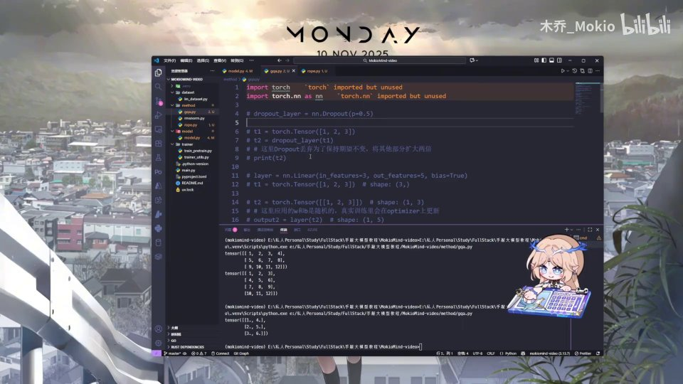
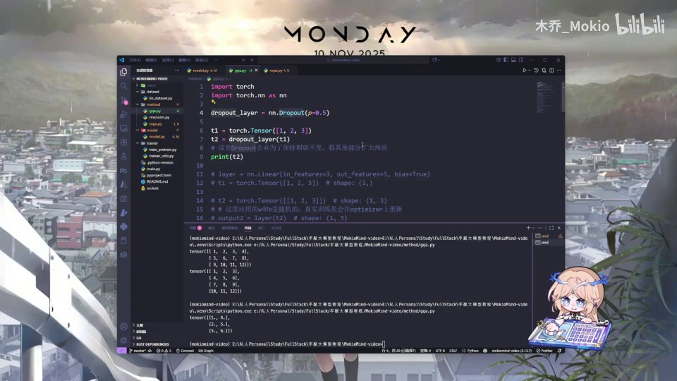

---

## 三、nn.Linear：一切"投影层"的本质都是线性变换

**是什么**：`nn.Linear` 就是我们在架构图里看到的那个 Linear 层，它有两个关键参数——`in_features`（输入的特征数）和 `out_features`（输出的特征数）。还有一个可选参数 `bias`（偏置，视频里口播成"偏执"）。

[【跳转到 00:23】](https://www.bilibili.com/video/BV1T2k6BaEeC/?p=12&t=23)

**为什么需要**：Transformer 里到处都是"升维/降维/换空间"的操作：把隐藏层维度投影到注意力头维度、把多头输出拼回隐藏层维度。这些统统靠 `nn.Linear` 完成。

**怎么做 / 举例**：先生成一个张量 `[1, 2, 3]`，然后定义 `nn.Linear(in_features=3, out_features=5, bias=True)`，把它作用到这个张量上，输出就变成了 5 个特征。

[【跳转到 01:13】](https://www.bilibili.com/video/BV1T2k6BaEeC/?p=12&t=73)

本质就是线性变换：

$$
y = xW + b
$$

也就是输入张量乘一个权重矩阵 `W`，再加上偏置 `b`。`in_features` 决定 `W` 的列数（输入维度），`out_features` 决定 `W` 的行数（输出维度），`bias=True` 就额外加上 `b`。

把形状写清楚会更直观。输入是一个长度为 3 的向量（可以看成 `1×3`），`W` 是一个 `3×5` 的矩阵：

- `x`（1×3）乘 `W`（3×5）得到 `1×5` 的结果；
- 再加一个长度为 5 的偏置 `b`，最终输出就是 `1×5`，即 5 个特征。

这也解释了为什么说"Linear 层本质是线性变换"：它做的无非是**换一组基、换一个维度**，把 3 维的表示搬到 5 维空间里去。

[【跳转到 01:38】](https://www.bilibili.com/video/BV1T2k6BaEeC/?p=12&t=98)

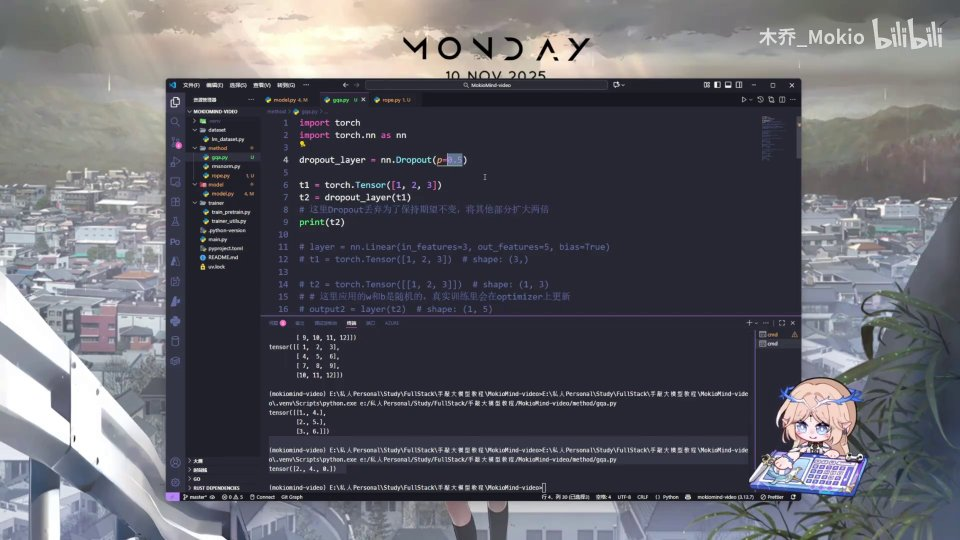

> 记住这个公式，后面写 Q/K/V/O 四个投影层时会反复用到。

顺带说一下 `bias` 这个偏置的意义：如果没有偏置，`y = xW` 表示的线性变换一定把原点映射到原点；加上 `b` 之后，相当于给整个变换加了一个"平移"，表达能力更强。不过在 Transformer 的注意力投影层里，很多实现（包括本讲）选择 `bias=False`，因为紧随其后的归一化和注意力本身已经能提供足够的非线性与偏移，省掉偏置还能少一点参数量。

---

## 四、改形状三件套：view、transpose、reshape

在多头注意力里，我们要不断在 `[batch, seq, hidden]` 和 `[batch, seq, heads, head_dim]` 之间来回切换，所以必须先掌握改变张量形状和维度顺序的方法。

为什么这件事在注意力里这么重要？可以这样理解：输入张量一开始是"扁"的，隐藏层维度 `hidden_size` 把多个头的表示**拼在一起**（比如 512 维 = 8 头 × 64 维）。要做注意力，必须先把这 512 维"拆开"成 `[heads, head_dim]` 两个维度，才能让每个头独立计算；算完之后又要把多个头"拼回去"，恢复成 512 维交给输出投影层。这一拆一拼，用的就是 `view`、`reshape`、`transpose` 这些方法。所以它们虽然基础，却是多头注意力的"搬运工"。

### 4.1 view：只改形状，不改数据

**是什么**：`view` 用来改变张量的形状。比如一个 `shape = (2, 6)` 的张量一共有 12 个元素，用 `view` 可以把它变成 `(3, 4)` 或 `(4, 3)`，元素总数始终是 12。

[【跳转到 02:03】](https://www.bilibili.com/video/BV1T2k6BaEeC/?p=12&t=123)

打印验证一下：第一个结果是三行四列，第二个是四行三列，元素依旧是 12 个。以此类推，甚至可以直接 `view(12)` 拉成一维。**要点是：`view` 只重新解释形状，不改变底层数据。**

### 4.2 transpose：交换维度顺序

**是什么**：`transpose` 进行维度交换。程序员从 0 开始数，所以 `transpose(0, 1)` 就是交换第 0 维和第 1 维。

[【跳转到 02:28】](https://www.bilibili.com/video/BV1T2k6BaEeC/?p=12&t=148)

**举例**：先生成一个二行三列的张量，交换第一维和第二维后，它就变成三行两列。更复杂的场景，比如张量是三维的，交换第 0 维和第 2 维，`(3, 2, 3)` 就会变成 `(3, 2, 3)` 对应的重排形式——视频里说的是"3、2、3、3、2"这样的效果，也就是维度顺序被换掉了。

[【跳转到 02:53】](https://www.bilibili.com/video/BV1T2k6BaEeC/?p=12&t=173)

> `transpose` 在多头注意力里常用于把 `[seq, heads, head_dim]` 转成 `[heads, seq, head_dim]` 之类，是维度对齐的常用手段。

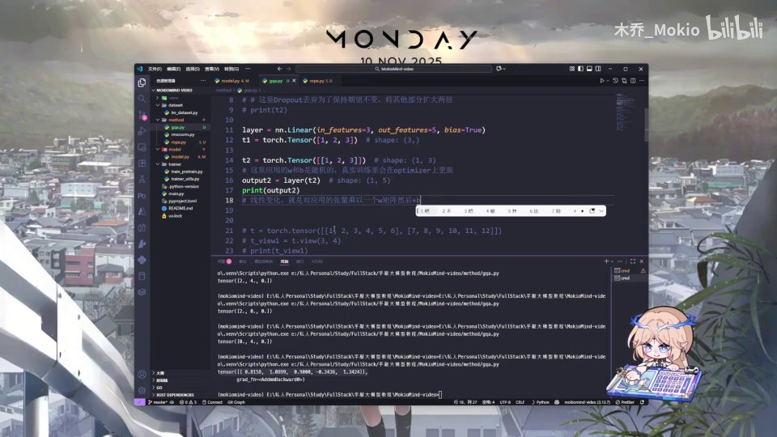
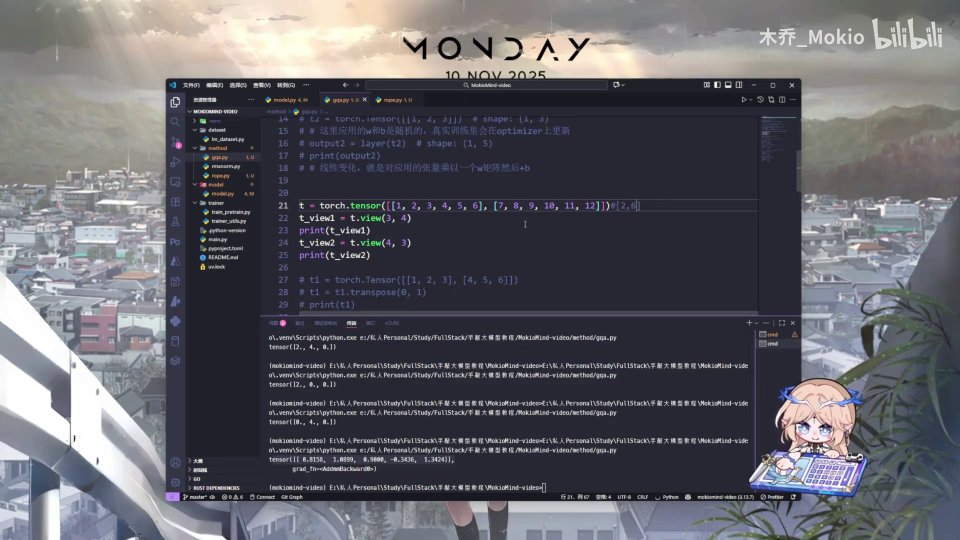

### 4.3 reshape：和 view 类似，但内存层面不同

**是什么**：`reshape` 也对矩阵做形状变化，用法和 `view` 很接近。

**举例**：用 `arange` 生成一个一行六列的矩阵，用 `reshape` 想把它变成二行三列，可以用 `-1` 让程序**自动推断**其中一个维度。比如 `reshape(x, (2, 3))` 得到 `[[1,2,3],[4,5,6]]`；用 `-1` 也能自动算出该填几。

[【跳转到 04:08】](https://www.bilibili.com/video/BV1T2k6BaEeC/?p=12&t=248)
[【跳转到 04:33】](https://www.bilibili.com/video/BV1T2k6BaEeC/?p=12&t=273)

**关键区别**：`reshape` 和 `view` 是类似的方法，但**底层实现不同，在内存层面不太一样**。`view` 要求张量在内存中连续，`reshape` 则更宽容（必要时会先拷贝一份再改变形状）。这部分和具体代码无关，视频建议自己去学习，此处不展开。

> 顺序上可以这样记：`view` 只改形状 → `transpose` 换维度顺序 → `reshape` 改形状且内存更灵活。

---

## 五、triu：为因果掩码服务的"上三角"工具

**是什么**：`triu`（triangular upper）用于取矩阵的上三角部分。它有一个参数，不传时默认是 `0`。

[【跳转到 03:18】](https://www.bilibili.com/video/BV1T2k6BaEeC/?p=12&t=198)

**为什么需要**：语言模型是"从左到右"生成的，第 t 个位置不能看到未来（第 t+1 及以后）的信息。我们把"不该看的位置"用一个很大的负数掩掉，`triu` 正是构造这种掩码的工具。上一 part 讲掩码计算时就用到了它。

**怎么做 / 举例**：设 `x` 是 3×3 张量。

- `diagonal=0`（默认）：只保留主对角线及其上方，主对角线以下的元素全部置零。因为对角线下方是零，所以保留的元素较少。
- `diagonal` 为正数，比如 `diagonal=1`：对角线整体上移，保留下来的元素更少。
- `diagonal` 为负数，比如 `triu(x, diagonal=-1)`：变成"下对角线"，对角线往下移，会多保留一些元素。

视频里用 `diagonal=-1` 演示，可以看到对角线往下移了一格。以视频中的 3×3 矩阵为例：

```python
x = torch.tensor([[1, 2, 3], [4, 5, 6], [7, 8, 9]])
print(torch.triu(x))            # diagonal=0：[[1,2,3],[0,5,6],[0,0,9]]
print(torch.triu(x, diagonal=-1))  # 对角线往下移：[[1,2,3],[4,5,6],[0,8,9]]
```

- `diagonal=0` 时，只有主对角线及右上方保留，左下角全变 0；
- `diagonal=-1` 时，连主对角线下方那一斜列也保留下来，所以置零的元素更少。

那它和因果掩码有什么关系？语言模型在预测第 t 个词时，只能看到它前面的词。把"未来位置"用手指挡住，本质上就是在注意力分数矩阵上保留一个**上三角**、屏蔽下三角。`triu` 提供的就是这个"上三角形状"，配合给被屏蔽位置填一个很大的负数（如 `-inf`），SoftMax 之后这些位置的概率就趋近于 0。

[【跳转到 03:43】](https://www.bilibili.com/video/BV1T2k6BaEeC/?p=12&t=223)


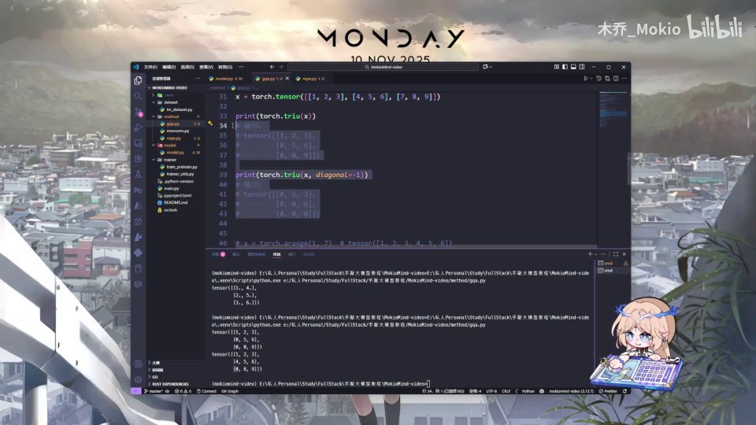

> 一句话：`triu` 主要就是为因果掩码（causal mask）服务的。

---

## 六、repeat_kv：GQA 共享 KV 的核心工具函数

工具方法复习完，正式进入 GQA。第一步不是写注意力，而是写一个工具函数——因为 **GQA 的本质就是"多个 Q 头共享一组 K/V 头"**，所以需要把少量 K/V 头复制成与 Q 头匹配的数量。

[【跳转到 04:58】](https://www.bilibili.com/video/BV1T2k6BaEeC/?p=12&t=298)

### 6.0 先搞清楚：为什么需要"共享 KV"

在标准的**多头注意力（MHA，Multi-Head Attention）** 里，每个头都有自己独立的 Q、K、V。头数越多，注意力部分的 K/V 参数量和显存占用就越大。到了长文本场景，K/V 缓存（KV Cache）会迅速膨胀，成为推理时的显存瓶颈。

于是有两种改良方案：

- **MQA（Multi-Query Attention）**：所有 Q 头共用**唯一一组** K/V，最省显存，但效果损失相对明显。
- **GQA（Grouped Query Attention）**：折中方案——把 Q 头分成若干组，**每组共享一组 K/V**。既省显存，又尽量保住效果。

所以 GQA 的"共享"落到代码上，就是要让较少的 K/V 头服务于较多的 Q 头。`repeat_kv` 正是做这件事：把 K/V 在头维度上"重复"若干次，让它的头数重新对齐 Q 头数，后续的注意力计算就能像普通多头注意力一样统一处理。视频里说的"我们需要重复使用 KV 嘛，就先写一个 repeat_kv 函数"，指的就是这个。

### 6.1 函数签名与输入输出

```python
def repeat_kv(x: torch.Tensor, n_rep: int) -> torch.Tensor:
    ...
```

- **输入**：一个 `torch.Tensor`（K 或 V），以及一个整数 `n_rep`，表示重复次数。
- **输出**：一个 `torch.Tensor`，仍然是 KV，只是头数被"复制"了。

先获取张量的形状：

```python
bs, slen, num_key_value_heads, head_dim = x.shape
```

这里的 `x.shape` 是四维的：`(batch_size, seq_len, num_key_value_heads, head_dim)`。也就是说，从最初的输入一路叠两层之后，它会变成一个**四维张量**，我们把这四个维度分别取出来。

[【跳转到 05:23】](https://www.bilibili.com/video/BV1T2k6BaEeC/?p=12&t=323)
[【跳转到 05:48】](https://www.bilibili.com/video/BV1T2k6BaEeC/?p=12&t=348)
[【跳转到 06:02】](https://www.bilibili.com/video/BV1T2k6BaEeC/?p=12&t=362)

### 6.2 提前返回：不需要重复就原样退回

```python
if n_rep == 1:
    return x
```

如果重复次数等于 1，说明 Q 头和 KV 头数量相同（退化成标准多头注意力），根本不需要复制，直接把 `x` 退回去即可。

[【跳转到 06:07】](https://www.bilibili.com/video/BV1T2k6BaEeC/?p=12&t=367)

### 6.3 高效实现：插入维度 → expand → reshape

真正需要重复时，用一套比较高效的做法：

```python
return (
    x[:, :, :, None, :]
    .expand(bs, slen, num_key_value_heads, n_rep, head_dim)
    .reshape(bs, slen, num_key_value_heads * n_rep, head_dim)
)
```

分三步理解：

1. **插入一个新维度**：`x[:, :, :, None, :]` 在第四个位置插入一个大小为 1 的维度。此时张量变成 `(bs, slen, num_key_value_heads, 1, head_dim)`。
2. **用 expand 扩展**：把这个大小为 1 的维度扩展到 `n_rep`。张量变成五维 `(bs, slen, num_key_value_heads, n_rep, head_dim)`。注意 `expand` 只是"广播视图"，没有真正复制内存，所以非常高效。
3. **reshape 回去**：把最后两个维度合并，重新变回四维 `(bs, slen, num_key_value_heads * n_rep, head_dim)`。

[【跳转到 06:32】](https://www.bilibili.com/video/BV1T2k6BaEeC/?p=12&t=392)
[【跳转到 06:57】](https://www.bilibili.com/video/BV1T2k6BaEeC/?p=12&t=417)
[【跳转到 07:22】](https://www.bilibili.com/video/BV1T2k6BaEeC/?p=12&t=442)

**结果**：头数从 `num_key_value_heads` 变成了 `num_key_value_heads * n_rep`，正好等于 Q 的头数。这就是 GQA 里"共享"在代码上的落地——每个 KV 头被广播给了 `n_rep` 个 Q 头使用，且过程中几乎没有多余的内存拷贝。

举个具体数字来体会。假设：

- Q 头有 8 个（`n_local_heads = 8`）；
- K/V 头只有 2 个（`num_key_value_heads = 2`）；
- 那么每个 KV 头要服务 4 个 Q 头，即 `n_rep = 8 // 2 = 4`。

调用 `repeat_kv(x, 4)` 后，K/V 的头数从 2 变成 `2 × 4 = 8`，正好和 Q 的头数对齐。原本 Q 的第 0～3 头会共用 K/V 的第 0 头，Q 的第 4～7 头共用 K/V 的第 1 头。这就是"分组"二字的由来。

注意 `expand` 与 `reshape` 的搭配是这里的关键技巧：如果一开始就直接用 `repeat` 复制，会真正占用 `n_rep` 倍的内存；而先 `expand` 出一个广播视图、再 `reshape` 合并维度，往往能避免真实拷贝，因此更高效。这正是视频里强调"用一个比较高效的实现"的原因。


---

## 七、Attention 层初始化：头数、约束与断言

`repeat_kv` 写好了，接下来定义 `Attention` 类。因为它是一层，我们照例把它定义成 `nn.Module`，先完成初始化的内容，下一块再写 forward 前向传播逻辑。

[【跳转到 07:22】](https://www.bilibili.com/video/BV1T2k6BaEeC/?p=12&t=442)
[【跳转到 07:47】](https://www.bilibili.com/video/BV1T2k6BaEeC/?p=12&t=467)

```python
class Attention(nn.Module):
    def __init__(self, args: MiniMindConfig):
        super().__init__()
        self.num_key_value_heads = args.num_key_value_heads if args.num_key_value_heads is not None else args.num_attention_heads
        ...
```

参数用一个 `MiniMindConfig` 传进来，这也是我们前面定义好的配置对象。`super().__init__()` 先把父类初始化好。

### 7.1 默认值：KV 头数量没给，就跟 Q 头一样

```python
self.num_key_value_heads = (
    args.num_key_value_heads
    if args.num_key_value_heads is not None
    else args.num_attention_heads
)
```

- 如果配置里指定了 `num_key_value_heads`，就用它；
- 如果是 `None`，就默认和注意力头（`num_attention_heads`）使用一样的数量——这时 GQA 退化为标准的多头注意力 MHA。

[【跳转到 08:12】](https://www.bilibili.com/video/BV1T2k6BaEeC/?p=12&t=492)
[【跳转到 08:37】](https://www.bilibili.com/video/BV1T2k6BaEeC/?p=12&t=517)

### 7.2 断言：Q 头必须是 KV 头的整数倍

```python
assert args.num_attention_heads % self.num_key_value_heads == 0, \
    "num_attention_heads must be divisible by num_key_value_heads"
```

因为我们要让多个 Q 头**共享**同一个 KV 头，就必须保证 Q 头数量能被 KV 头数量整除。否则复制时会出现"分不匀"的情况，后面的维度操作必然出错。这里用一个 `assert` 做保护：如果不是整数倍，程序会直接报错，把问题尽早暴露出来。

这一点非常重要：**GQA 的正确性建立在"Q 头数 % KV 头数 == 0"之上。**

[【跳转到 09:02】](https://www.bilibili.com/video/BV1T2k6BaEeC/?p=12&t=542)

### 7.3 三个头数变量与每个头的维度

```python
self.n_local_heads = args.num_attention_heads
self.num_key_value_heads = args.num_key_value_heads
self.n_rep = self.n_local_heads // self.num_key_value_heads
self.head_dim = args.hidden_size // args.num_attention_heads
```

逐个解释：

| 变量 | 含义 |
| --- | --- |
| `n_local_heads` | 当前实例的 Q 头数量，等于 `num_attention_heads` |
| `num_key_value_heads` | 当前实例的 K/V 头数量，等于配置里定义的值 |
| `n_rep` | 每个 KV 头需要重复的次数，等于 `n_local_heads // num_key_value_heads` |
| `head_dim` | 每个头的维度，等于 `hidden_size // num_attention_heads` |

`head_dim` 怎么理解？视频给了个具体例子：**隐藏层有 512 个维度，需要 8 个头，那么每个头就是 512 ÷ 8 = 64 个维度。** 这个除法就是"分头"的过程。

[【跳转到 09:27】](https://www.bilibili.com/video/BV1T2k6BaEeC/?p=12&t=567)
[【跳转到 09:52】](https://www.bilibili.com/video/BV1T2k6BaEeC/?p=12&t=592)

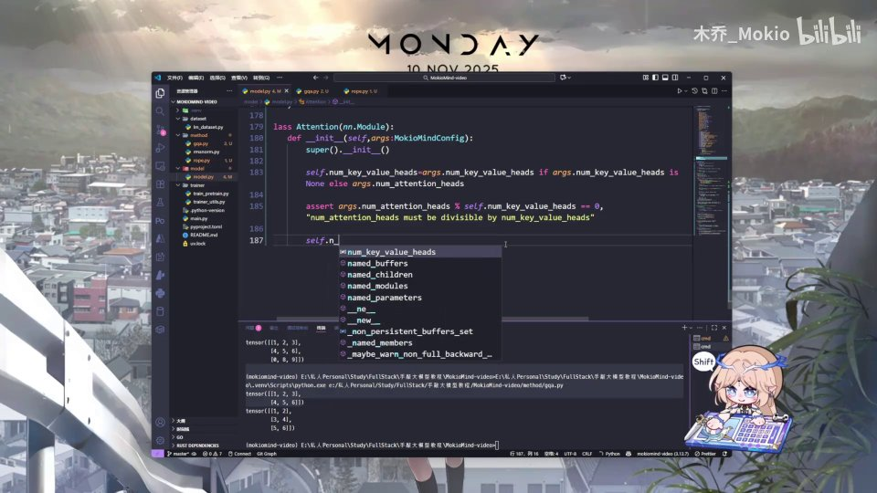

---

## 八、四个投影层与两个开关：dropout、flash attention

头数配置好后，就要定义 Q/K/V 的线性层——用 W_Q、W_K、W_V 把输入投影成 Q、K、V。如果你看过 3B1B 的视频，这些线性层可以直观地理解为"投影层"。

[【跳转到 10:17】](https://www.bilibili.com/video/BV1T2k6BaEeC/?p=12&t=617)
[【跳转到 10:26】](https://www.bilibili.com/video/BV1T2k6BaEeC/?p=12&t=626)
[【跳转到 10:31】](https://www.bilibili.com/video/BV1T2k6BaEeC/?p=12&t=631)

```python
self.q_proj = nn.Linear(args.hidden_size, args.num_attention_heads * self.head_dim, bias=False)
self.k_proj = nn.Linear(args.hidden_size, self.num_key_value_heads * self.head_dim, bias=False)
self.v_proj = nn.Linear(args.hidden_size, self.num_key_value_heads * self.head_dim, bias=False)
self.o_proj = nn.Linear(args.num_attention_heads * self.head_dim, args.hidden_size, bias=False)
```

四行代码对应四件事：

1. **`q_proj`**：输入维度是 `hidden_size`，输出维度 = Q 头数 × 每头维度。也就是说，把隐藏层维度投影成"多头拼接"的维度。
2. **`k_proj`**：输入维度同样是 `hidden_size`，但输出维度用 **`num_key_value_heads * head_dim`**——KV 头更少，所以这一层比 Q 小得多，这正是 GQA 省参数、省显存的地方。
3. **`v_proj`**：和 K 完全一样。
4. **`o_proj`**：反过来，输入是 Q 头数的拼接维度，输出回到 `hidden_size`。因为所有输出最后需要一个线性层把多头"拼回来"，恢复成隐藏层维度。

这四层都设了 `bias=False`，也就是不使用偏置。

[【跳转到 10:56】](https://www.bilibili.com/video/BV1T2k6BaEeC/?p=12&t=656)

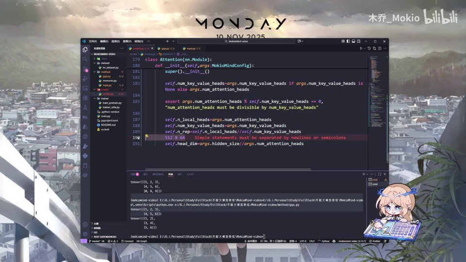

### 8.1 dropout 层：架构图可能漏画了

```python
self.attn_dropout = nn.Dropout(args.dropout)
self.resid_dropout = nn.Dropout(args.dropout)
```

视频特别提醒：**架构图里其实没写 dropout 层，我怀疑是架构图少画了，因为原本代码里确实有用到 dropout。** 这里定义了两个：

- `attn_dropout`：作用在注意力权重上；
- `resid_dropout`：作用在残差连接（residual）之后。

[【跳转到 11:20】](https://www.bilibili.com/video/BV1T2k6BaEeC/?p=12&t=680)
[【跳转到 11:45】](https://www.bilibili.com/video/BV1T2k6BaEeC/?p=12&t=705)

关于残差网络：它其实就是"比较简单地加一下"（把输入直接加到输出上）。视频说会在后面的 FFN 那部分补充讲解，感兴趣可以先往后看，或者现在直接使用。

### 8.2 flash attention 开关

```python
self.flash = hasattr(torch.nn.functional, "scaled_dot_product_attention") and args.flash_attention
```

最后定义一个 `flash` 开关，用来看你的程序是否支持 flash attention。flash attention 大家了解即可：它相当于一种更贴近磁盘 IO 的优化处理方法，能让注意力计算更快。

[【跳转到 12:10】](https://www.bilibili.com/video/BV1T2k6BaEeC/?p=12&t=730)

配套的 `scaled_dot_product_attention` 是 **PyTorch 内部内置的方法**，用它会比手动计算更简单。视频说后面会写两部分实现：既可以用这个内置方法，也可以自己手敲一个实现来做对比。

[【跳转到 12:35】](https://www.bilibili.com/video/BV1T2k6BaEeC/?p=12&t=755)

这里再补充两点，帮助理解这个开关为什么这么写：

- `hasattr(torch.nn.functional, "scaled_dot_product_attention")`：判断当前 PyTorch 版本里有没有这个内置函数。如果有，就说明可以走"内置高效路径"。
- 两者用 `and` 连起来：只有"环境支持"**且**"配置里开启了 `flash_attention`"时，`self.flash` 才为真。这样写的好处是兼容性更强——老版本 PyTorch 或用户主动关闭时，会自动回退到手动实现。

此外，`attn_dropout` 和 `resid_dropout` 都是在 `__init__` 里定义好、留到 `forward` 时再调用。这与 PyTorch 的惯例一致：**所有带参数的层都在 `__init__` 里注册，前向逻辑统一放在 `forward`。** 这也正是视频把本讲停在"初始化完成、下一块开始 forward"的原因。

到这里，`repeat_kv` 和 `Attention` 的初始化就都定义好了。

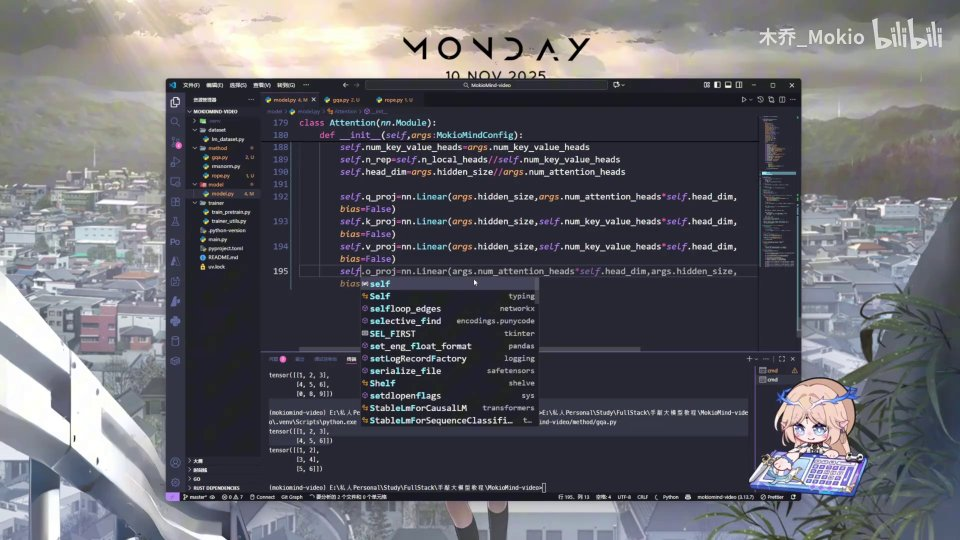
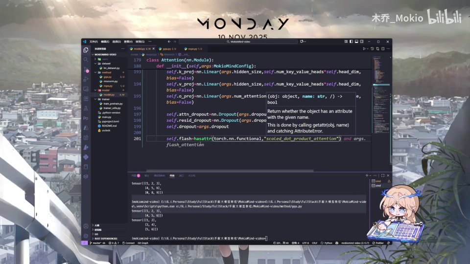

### 8.3 本讲代码骨架：把 `__init__` 拼完整

把上面所有片段按顺序拼起来，本讲写完的 `Attention.__init__` 大致长这样（`forward` 留到下一讲）：

```python
class Attention(nn.Module):
    def __init__(self, args: MiniMindConfig):
        super().__init__()
        self.num_key_value_heads = (
            args.num_key_value_heads
            if args.num_key_value_heads is not None
            else args.num_attention_heads
        )
        assert args.num_attention_heads % self.num_key_value_heads == 0, \
            "num_attention_heads must be divisible by num_key_value_heads"
        self.n_local_heads = args.num_attention_heads
        self.num_key_value_heads = args.num_key_value_heads
        self.n_rep = self.n_local_heads // self.num_key_value_heads
        self.head_dim = args.hidden_size // args.num_attention_heads

        self.q_proj = nn.Linear(args.hidden_size, args.num_attention_heads * self.head_dim, bias=False)
        self.k_proj = nn.Linear(args.hidden_size, self.num_key_value_heads * self.head_dim, bias=False)
        self.v_proj = nn.Linear(args.hidden_size, self.num_key_value_heads * self.head_dim, bias=False)
        self.o_proj = nn.Linear(args.num_attention_heads * self.head_dim, args.hidden_size, bias=False)

        self.attn_dropout = nn.Dropout(args.dropout)
        self.resid_dropout = nn.Dropout(args.dropout)
        self.flash = hasattr(torch.nn.functional, "scaled_dot_product_attention") and args.flash_attention
```

对照这段骨架，可以清晰看到三种量：

1. **头数类**：`n_local_heads`、`num_key_value_heads`、`n_rep`、`head_dim` —— 决定"分头"的规则；
2. **参数层类**：`q_proj`、`k_proj`、`v_proj`、`o_proj` —— 决定"投影"的规则；
3. **开关类**：`attn_dropout`、`resid_dropout`、`flash` —— 决定"训练/计算"的行为。

`slen`（序列长度）、`bs`（批大小）这些是运行时的量，要到 `forward` 里才知道，所以在 `__init__` 阶段完全不出现。

---

## 九、把代码放回架构图：GQA 在整体结构里的位置

在正式进入 forward 之前，不妨把这段代码放回 MiniMind 的整体架构里对照着看。Transformer Layer 内部，数据先经过 RMSNorm，再进入 GQA，之后接 FFN，每一块外面都套着残差连接；而 GQA 内部，则是 Q、K、V 分别经过 RoPE 后做注意力（带 mask 和 SoftMax），再经过 Linear 输出，旁边还有 Dropout 与残差。

沿着这张图从上到下走一遍，会更清楚各个模块的分工：

- **RMSNorm**：对输入做归一化，稳定训练。这是每个子层的"前置归一化"。
- **GQA（本讲主角）**：把归一化后的输入投影成 Q/K/V，做带掩码的缩放点积注意力，再线性输出。图中的 `Q`、`K'`、`V'` 上标撇号，暗示 K/V 是"被共享/被复制"的那一路。
- **FFN**：前馈网络，图中的 `SiLU` 是它的激活函数，两个 `Linear` 一升一降。
- **残差连接（图中那些绕行的箭头加 ⊕）**：把子层的输入直接加到输出上，缓解深层网络的梯度消失。

对照这张图，本讲做的两件事就很清楚了：`repeat_kv` 对应 GQA 里"K、V 头少于 Q 头"的共享机制；四个投影层和 dropout 开关对应图中的 `Linear` 与 `Dropout` 模块。至于 `forward` 里怎么把输入真正跑过这条路、RoPE 和 mask 在哪一步生效，就留给下一讲。

对照最新完整结构图，GQA 位于 Transformer Layer 的注意力分支，与 FFN 并列，两者各自被残差连接包裹——这说明 GQA 只是"半层"，理解它时要始终带着"它输出后还要加残差、再接下一个 RMSNorm"的上下文。

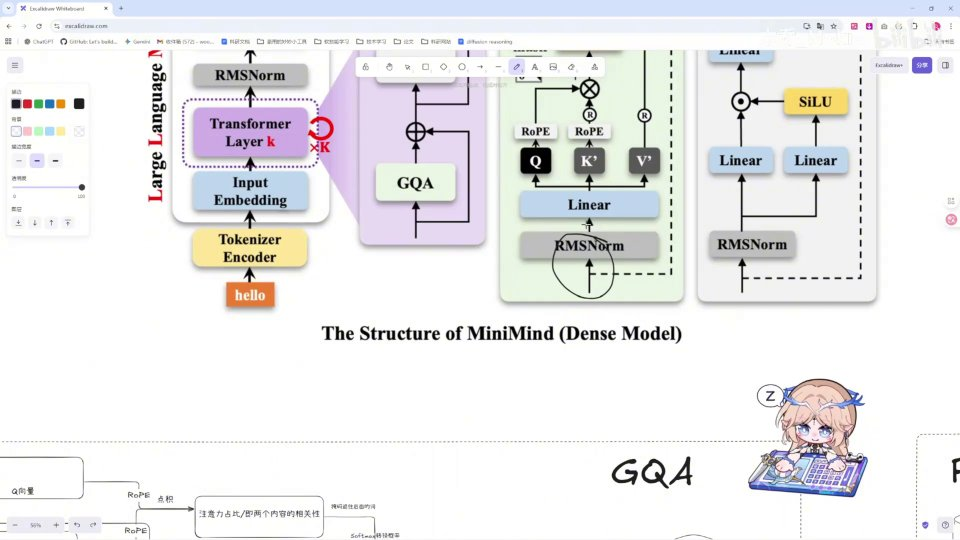
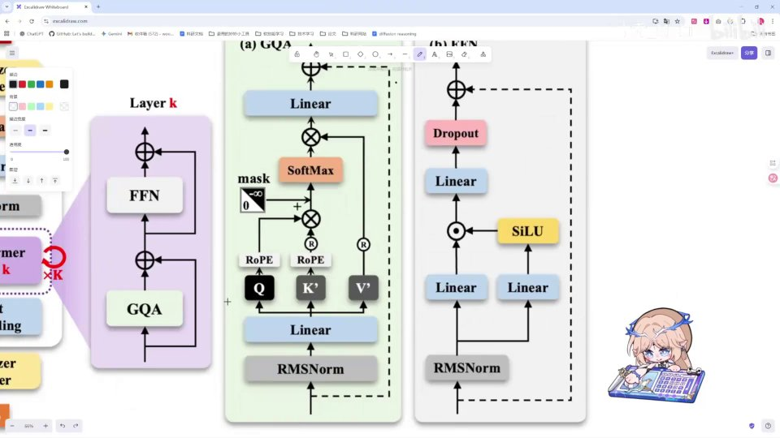

[【跳转到 13:00】](https://www.bilibili.com/video/BV1T2k6BaEeC/?p=12&t=780)

下一块，就正式开始 `forward` 向前传播的程序编写。

---

## 十、常见疑问与易错点

初学者在读这段代码时，最容易卡在下面几个地方，提前说清楚可以少走弯路。

**疑问 1：`n_local_heads` 和 `num_attention_heads` 有什么区别，为什么要多定义一个？**

它们在本讲里数值相同，都是 Q 头的数量。多定义一个 `self.n_local_heads` 是为了**在前向传播里读起来更直观**——后面会反复用到"本地的 Q 头数"这个概念，用一个短名字引用比每次写 `args.num_attention_heads` 清爽。可以理解为给同一份数据起了一个更贴切的名字。

**疑问 2：`n_rep` 会不会出现除不尽的情况？**

不会。前面的 `assert` 已经保证了 `num_attention_heads % num_key_value_heads == 0`，所以 `n_local_heads // num_key_value_heads` 一定是整数。这正是断言存在的意义——**把"隐含假设"显式化**，一旦配置写错就在初始化时报错，而不是等到前向传播时才莫名其妙地维度不匹配。

**疑问 3：为什么 K/V 的投影层输出维度更小，却仍然要对齐到 Q 头数？**

因为 `k_proj`/`v_proj` 只负责生成"少量"的 K/V 头；真正使用时要靠 `repeat_kv` 把它们广播成 Q 头数。**生成时省（少头），使用时对齐（扩展）**，这是 GQA 的核心套路。注意这个"扩展"发生在 `forward` 里，属于下一讲的内容。

**疑问 4：`reshape` 和 `view` 到底用哪个？**

视频的态度是：二者效果类似，`reshape` 在内存处理上更宽容。`repeat_kv` 里用的是 `reshape`，因为它前面接了 `expand`（可能产生非连续内存），用 `reshape` 更稳妥。如果拿不准，用 `reshape` 通常不会错。

**疑问 5：为什么 `__init__` 里看不到序列长度 `slen`？**

因为 `slen` 是**运行时**才确定的（取决于这次输入多长），而 `__init__` 只在创建层时执行一次。凡是和具体输入形状有关的操作，都放在 `forward`。这也解释了为什么 `repeat_kv` 要从 `x.shape` 现取形状，而不能提前算好。

---

## 十一、本讲的边界：哪些内容留到下一讲

上半部分到这里就结束了。为了不让你期待落空，明确划一下边界：

**本讲已经完成**

- 6 个 PyTorch 工具方法：`dropout`、`nn.Linear`、`view`、`transpose`、`triu`、`reshape`；
- 工具函数 `repeat_kv` 的完整实现；
- `Attention` 层的 `__init__`：头数配置、断言、四个投影层、两个 dropout、flash 开关。

**下一讲（下半部分）将完成**

- `Attention.forward`：如何取出输入形状、调用 `q_proj`/`k_proj`/`v_proj` 得到 Q/K/V；
- 把隐藏维拆成 `[heads, head_dim]`（这正是本讲 `view`/`reshape` 的用武之地）；
- 对 Q、K 施加 RoPE 旋转位置编码；
- 调用 `repeat_kv` 把 K/V 头扩展；
- 用 `scaled_dot_product_attention` 或手动实现做缩放点积注意力，并加上因果掩码；
- 经过 `o_proj`、dropout 与残差，得到最终输出。

换句话说，**下一讲就是把本讲搭好的"零件"按正确的顺序装配并通电。** 只要本讲的静态部分理解扎实，下一讲读起来会非常顺。

---

## 小结

- **本讲分两段**：前半段复习 PyTorch 工具方法，后半段写 GQA 的工具函数与 `Attention.__init__`。
- **dropout**：训练时按概率 `p` 随机把元素置零，并把剩余元素按 `1/(1-p)` 放大以保持期望不变。
- **nn.Linear**：本质是 `y = xW + b`，由 `in_features` / `out_features` / `bias` 三个参数决定。
- **view / transpose / reshape**：`view` 只改形状，`transpose` 交换维度顺序，`reshape` 与 `view` 类似但内存层面更灵活，`-1` 可自动推断维度。
- **triu**：取上三角矩阵，`diagonal` 控制对角线偏移，主要服务于因果掩码。
- **repeat_kv**：GQA 的核心工具——通过"插入维度 → expand → reshape"把少量 K/V 头高效复制成与 Q 头匹配的数量；`n_rep == 1` 时直接返回。
- **Attention 初始化三要点**：KV 头缺省时等于 Q 头；断言 `num_attention_heads % num_key_value_heads == 0`；用 `n_rep = n_local_heads // num_key_value_heads` 记录复制次数，用 `head_dim = hidden_size // num_attention_heads` 得到每头维度。
- **四个投影层**：`q_proj` 输出 Q 头数维度，`k_proj`/`v_proj` 输出 KV 头数维度（更小，体现 GQA 的省），`o_proj` 把多头拼回 `hidden_size`。
- **两个开关**：`attn_dropout` / `resid_dropout`（架构图疑似漏画），以及 `self.flash`（是否使用 PyTorch 内置的 `scaled_dot_product_attention`）。

---

## 关键术语速查

| 术语 | 一句话解释 |
| --- | --- |
| GQA | Grouped Query Attention，分组查询注意力，多个 Q 头共享一组 K/V 头 |
| dropout | 训练时以概率 p 随机关闭神经元、并按 1/(1-p) 放大其余元素的正则化手段 |
| nn.Linear | PyTorch 线性层，实现 `y = xW + b`，是架构图里的"投影层" |
| in_features / out_features | Linear 的输入/输出特征数，对应权重矩阵的列/行 |
| bias | 线性层里的偏置 b，可用 `bias=False` 关闭 |
| view | 改变张量形状且不改变数据，要求内存连续 |
| transpose | 交换张量的两个维度 |
| reshape | 改变张量形状，和 view 类似但内存处理更灵活，可用 -1 自动推断 |
| triu | 取矩阵上三角，`diagonal` 控制对角线偏移，用于构造因果掩码 |
| repeat_kv | GQA 工具函数，把 K/V 头复制 n_rep 次以匹配 Q 头数量 |
| n_rep | 每个 K/V 头需要复制的次数，`n_local_heads // num_key_value_heads` |
| head_dim | 每个注意力头的维度，`hidden_size // num_attention_heads` |
| q_proj / k_proj / v_proj / o_proj | 生成 Q、K、V 与输出拼接的四个线性投影层 |
| RMSNorm | 残差结构中的归一化层（回顾前文） |
| RoPE | 旋转位置编码（回顾前文） |
| residual | 残差连接，把模块输入直接加到输出上 |
| flash attention | 一种 IO 优化的高效注意力实现，PyTorch 内置接口为 `scaled_dot_product_attention` |
| scaled_dot_product_attention | PyTorch 内置的缩放点积注意力函数 |
