# 第13讲：代码：GQA 下——手写多头注意力的 forward

## 本讲要解决的核心问题（SCQA）

**背景**：上一讲我们已经把 GQA（Grouped Query Attention，分组查询注意力）的 `__init__` 搭好了——它定义了 Q/K/V 的投影层、输出投影层、dropout，还准备了 RoPE 位置编码。但一个模块真正干活的地方在 `forward`：输入进来，要经过投影、拆头、加位置、拼接缓存、算注意力、拼回头、加残差，最后返回。

**冲突**：这些步骤看着多，而且很多细节（多头怎么拆、KV cache 怎么拼、维度什么时候换、掩码怎么加、FlashAttention 和手写实现怎么二选一）单独看都容易懵。更要命的是，讲者在正式写 Attention 之前，先花了一分多钟补讲"残差连接"，因为整段 forward 最后一步就是加残差——不理解残差，后面的代码就会一头雾水。

**疑问**：代码量这么小的一个 `Attention.forward`，到底是怎么把"残差、投影、拆头、RoPE、KV cache、repeat、掩码、softmax、dropout、拼头、输出投影"这十几个概念串起来的？我们该怎么一步步看懂、能自己写出来？

**回答（中心思想）**：`Attention.forward` 本质上是一条固定流水线——**投影出 Q/K/V → 拆成多个头 → Q/K 加 RoPE → K/V 拼接历史缓存 → 维度交换并复制 K/V → 计算注意力（内置或手写二选一）→ 拼回头并做输出投影 → 加残差返回**。只要抓住"每一步的输入输出维度"这条主线，剩下的都是可替换的零件；而残差连接之所以放在最后，是因为它让"完美函数"的学习变得容易，并在梯度上天然带一个 `+1`，有效缓解梯度消失。

---

## 一、先补上残差连接：它为什么值得单独讲

### 1.1 残差让"拟合恒等映射"从费力变省力

讲者先假设：某个完整的函数如果被完美拟合，它应该输出 `H(x)=x`（输入等于输出，也叫恒等映射）。

- **没有残差**时，模块只能写成 `H(x)=F(x)`，想输出 `x`，就必须让网络费力地去学出 `F(x)=x` 这个映射。
- **有残差**时，模块写成 `H(x)=F(x)+x`，网络只需要让 `F(x)=0` 即可，因为那个 `x` 已经被"自动加上去了"。

所以残差的第一层好处在**拟合**上：网络不必再辛苦学一个恒等映射，只要把残差部分学成接近零就行，学习任务大大减轻。[【跳转到 00:00】](https://www.bilibili.com/video/BV1T2k6BaEeC/?p=13&t=0)

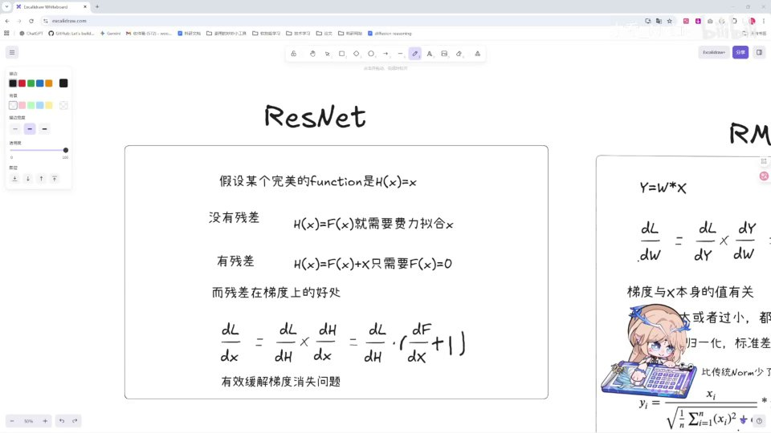

### 1.2 残差在梯度上带一个 +1，缓解梯度消失

第二层好处在**梯度**上。神经网络是一层套一层的：下一层的输出就是上一层的输入。计算梯度时会遇到形如 `dL/dx` 的形式。把 `H=F(x)+x` 代入并沿链路用链式法则展开：

```
dL/dx = (dL/dH) · (dH/dx) = (dL/dH) · (dF/dx + 1)
```

注意括号里的 `+1`：即便 `dF/dx` 很小甚至趋近于 0，梯度里也始终保留一个"1"，不会整体归零。这就有效缓解了深层网络中常见的**梯度消失**问题。[【跳转到 01:15】](https://www.bilibili.com/video/BV1T2k6BaEeC/?p=13&t=75)

讲者的评价很直接：ResNet 是"大道至简"的发明，但确实非常非常好用——而它在我们下面要写的 Attention 里的落点，就是最后那句 `self.resid_dropout(self.o_proj(output))`。

---

## 二、先看全景：Attention.forward 的六个步骤

在动手写代码前，讲者先给出 `forward` 的执行步骤清单，相当于一张地图：

1. **投影**：在 Linear 层里计算出 Q、K、V；
2. **拆头**：用 `view` 把输入拆分成多个头；
3. **位置编码**：对 Q 和 K 使用 RoPE；
4. **缓存与复制**：对 K 和 V 用 `repeat`，并留意 KV cache；
5. **注意力计算**：`Q @ K^T / sqrt(d)`，再乘 V；
6. **拼头与输出**：把多个头拼回去，做输出投影，最后加残差。

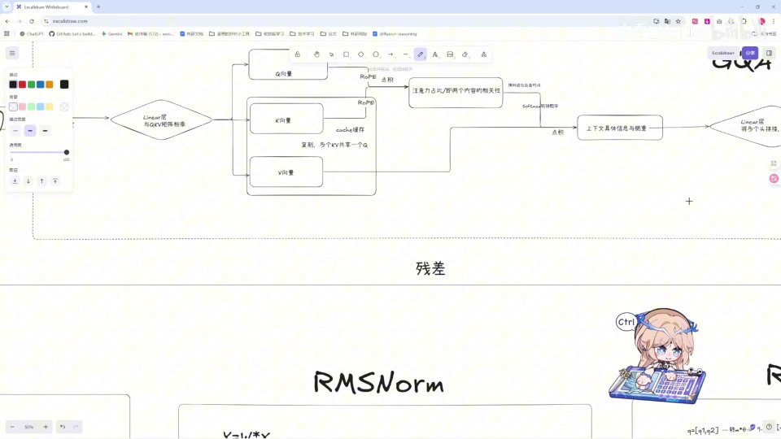

讲者特别提醒这一步的意思：**KV 需要有缓存**。原因是——每次计算一个 token 之前，都要用到前面所有 token 的 K 和 V；如果算下一个 token 时把前面的 K、V 全部重新算一遍，就太浪费了。于是把已经算过的 K、V 存起来，下一次直接取用，这就是 KV cache。[【跳转到 02:00】](https://www.bilibili.com/video/BV1T2k6BaEeC/?p=13&t=120)

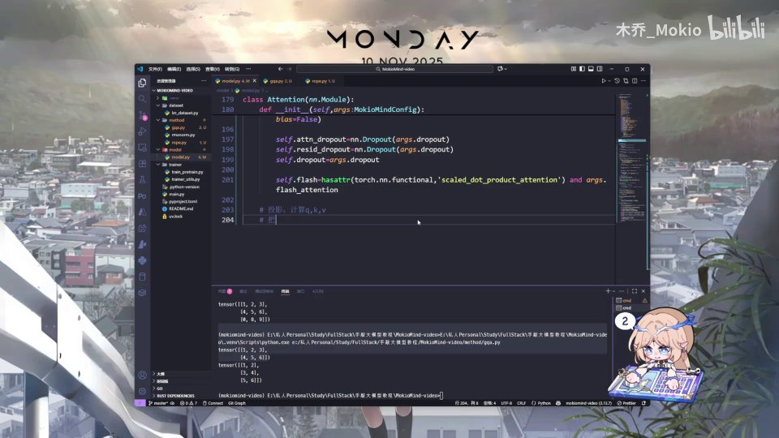

---

## 三、函数签名：把"要用的东西"一次性声明

### 3.1 forward 的输入参数

从代码上看，`forward` 的签名大致是：

```python
def forward(
    self,
    x: torch.Tensor,                                  # 输入张量
    position_embedding: Tuple[torch.Tensor, torch.Tensor],  # 位置编码 (cos, sin)
    past_key_value: Optional[Tuple[torch.Tensor, torch.Tensor]] = None,
    use_cache: bool = False,
    attention_mask: Optional[torch.Tensor] = None,
) -> torch.Tensor:
```

逐个解释这几个参数：

- **`x`**：`torch.Tensor`，形状是 `(batch, seq_len, hidden_size)`，也就是一批句子的向量表示。
- **`position_embedding`**：一个**元组**，里面装了两个张量，正是前面算好的 `cos` 和 `sin`。位置编码把它拆成 cos/sin 两部分传进来，供 RoPE 使用。
- **`past_key_value`**：**Optional** 类型，表示"可空"。因为第一个 token/第一段序列进来时，根本没有任何历史 K/V，它是 `None`；后续片段才有值。它本身又是 `(key, value)` 两个 tensor 组成的元组。
- **`use_cache`**：布尔值，默认 `False`，表示这次要不要使用并更新 KV 缓存。
- **`attention_mask`**：**Optional**，默认为 `None`，就是注意力掩码。

![forward 函数签名，可以看到 position_embedding 是 Tuple[torch.Tensor, torch.Tensor]，past_key_value 为 Optional，use_cache 默认 False，attention_mask 默认 None](assets/第13讲_代码：GQA 下/00272.jpg)

讲者强调 `Optional` 的用法：第一个片段没有缓存，后面的片段才有，所以类型标注必须允许 `None`。[【跳转到 04:07】](https://www.bilibili.com/video/BV1T2k6BaEeC/?p=13&t=247)

---

## 四、投影与拆头：把 512 维切成 8 个 64 维

### 4.1 先把 shape 拆出来

进入函数体，第一步是拿到形状：

```python
bsz, seq_len, _ = x.shape
```

这里 `_` 就是 hidden_size，因为后面不一定用到，先用下划线占位。[【跳转到 05:22】](https://www.bilibili.com/video/BV1T2k6BaEeC/?p=13&t=322)

### 4.2 投影得到 Q/K/V，再用 view 拆头

投影其实在 `__init__` 里定义的三个 Linear 层完成：

```python
xq, xk, xv = self.q_proj(x), self.k_proj(x), self.v_proj(x)
```

接着"拆头"——把每个 512 维的向量拆成 8 个头，每个头 64 维，用 `view` 实现：

```python
xq = xq.view(bsz, seq_len, self.n_local_heads, self.head_dim)
xk = xk.view(bsz, seq_len, self.n_local_kv_heads, self.head_dim)
xv = xv.view(bsz, seq_len, self.n_local_kv_heads, self.head_dim)
```

拆完后的形状是 `(batch, seq_len, num_heads, head_dim)`，也就是每个头、每个位置都拿到自己那 64 维的一小段。这正是"多头注意力"的字面含义：不是一个大注意力，而是很多个并行的小注意力。[【跳转到 05:47】](https://www.bilibili.com/video/BV1T2k6BaEeC/?p=13&t=347)

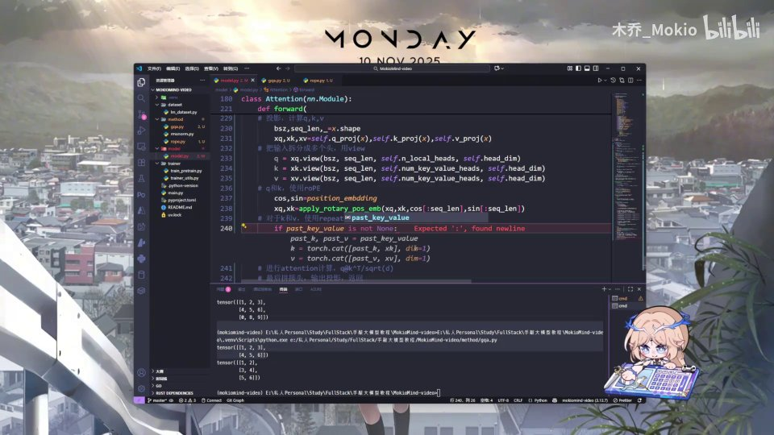

---

## 五、位置编码与 KV 缓存：把历史 K/V 拼进来

### 5.1 只给 Q 和 K 加 RoPE

```python
cos, sin = position_embedding
xq, xk = apply_rotary_pos_emb(xq, xk, cos[:seq_len], sin[:seq_len])
```

把传入的 `position_embedding` 元组解包成 `cos` 和 `sin`，再调用 `apply_rotary_pos_emb`，把位置信息"旋转"进 Q 和 K。注意这里只对 **Q 和 K** 做位置编码，V 不做——因为注意力分数由 Q、K 决定，V 只负责携带内容。[【跳转到 06:12】](https://www.bilibili.com/video/BV1T2k6BaEeC/?p=13&t=372)

剪取 `cos[:seq_len]`、`sin[:seq_len]` 是为了让序列长度正好对齐。至于 RoPE 本身怎么旋转，讲者说会在专门的位置编码那一讲讲清楚，这里先会用即可。

### 5.2 有历史缓存就拼接，然后更新缓存

```python
if past_key_value is not None:
    xk = torch.cat((past_key_value[0], xk), dim=1)
    xv = torch.cat((past_key_value[1], xv), dim=1)
past_kv = (xk, xv) if use_cache else None
```

- 如果 `past_key_value` 不为 `None`，说明之前有缓存：`past_key_value[0]` 是历史 K，`past_key_value[1]` 是历史 V，把它们和当前这一步的 K、V 在序列维度（`dim=1`）拼起来；
- 拼接后的这份 `(xk, xv)` 又会作为本次的输出缓存 `past_kv`，传给下一次使用，供下一段继续拼接。

这就是 KV cache 的闭环：**取旧缓存 → 拼当前 → 存为新缓存**。[【跳转到 06:37】](https://www.bilibili.com/video/BV1T2k6BaEeC/?p=13&t=397)


---

## 六、维度交换与 repeat_kv：让 8 个头各算各的

### 6.1 为什么要 transpose

处理好 K/V 后，要对 Q/K/V 做维度交换：

```python
xq, xk, xv = (
    xq.transpose(1, 2),
    repeat_kv(xk, self.n_rep).transpose(1, 2),
    repeat_kv(xv, self.n_rep).transpose(1, 2),
)
```

讲者解释：现在的张量是四个维度，按 `(batch_size, seq_len, num_heads, head_dim)` 排列，也就是"头"在第 3 位、"head_dim"在第 4 位。但 PyTorch 做矩阵乘法时，会把**前面两个维度当成批次、后面两个维度当成要计算的矩阵**。我们希望每个头独立地和自己的那一小段维度做计算，而不是所有头混在一起，所以要把头挪到前面，交换成 `(batch, num_heads, seq_len, head_dim)`。[【跳转到 07:52】](https://www.bilibili.com/video/BV1T2k6BaEeC/?p=13&t=472)

### 6.2 repeat_kv：GQA 里的"复制"

`repeat_kv(xk, self.n_rep)` 是 GQA 的关键。分组查询注意力的思想是：**K、V 的头数可以比 Q 少**，从而省下 KV cache 的显存。代价是计算时要把 K/V 复制若干份，让它们和 Q 的头数对齐，这个复制的份数就是 `n_rep = n_heads / n_kv_heads`。

讲者提醒：复制时同样要"注意 KV cache"——先拼完历史缓存、再做 repeat，顺序不能乱。[【跳转到 09:00】](https://www.bilibili.com/video/BV1T2k6BaEeC/?p=13&t=544)

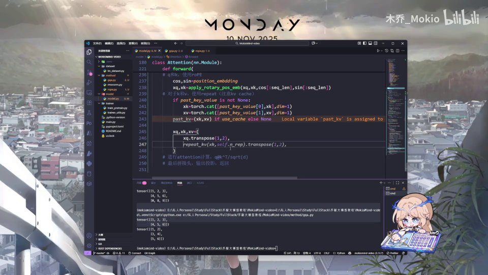

---

## 七、注意力计算的两条路：FlashAttention 还是手写

代码在这里分叉：能走捷径就走捷径（用 PyTorch 内置的高效实现），否则就手写一遍。

### 7.1 判断能否使用 FlashAttention

```python
if self.flash and seq_len > 1 and (attention_mask is None or torch.all(attention_mask == 1)):
```

三个条件同时满足才走内置分支：

1. `self.flash`：硬件和版本支持，并且在 `__init__` 里已通过 `hasattr(torch.nn.functional, 'scaled_dot_product_attention')` 检测过；
2. `seq_len > 1`：只有单个 token（seq_len==1）时没必要走这条路径；
3. 掩码为空，或者掩码全为 1（即没有真正需要屏蔽的位置）。

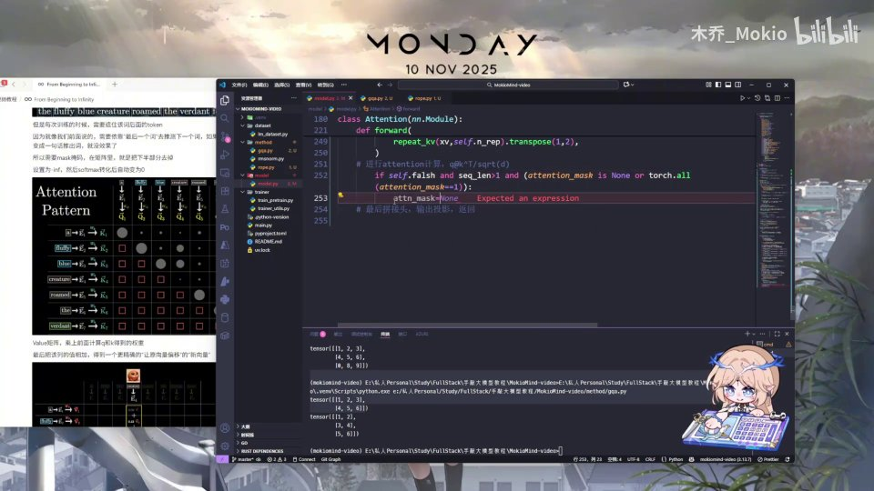

### 7.2 构造掩码，再调用内置函数

若判断通过，先准备掩码：

```python
attn_mask = (
    None
    if attention_mask is None
    else attention_mask.view(bsz, 1, 1, -1)
        .expand(bsz, self.n_local_heads, seq_len, -1).bool()
)
```

讲者坦言这段"掩码"的广播扩展略复杂，大家先看个大概。接着导入内置函数并调用：

```python
import torch.nn.functional as F

output = F.scaled_dot_product_attention(
    xq, xk, xv,
    attn_mask=attn_mask,
    dropout_p=self.dropout if self.training else 0.0,
    is_causal=True,
)
```

这里有两个细节：

- `dropout_p` 要判断模式：`self.training` 为真（训练）时用配置的 dropout；为假（推理）时用 `0.0`。讲者顺带解释了 `self.training`——就是 PyTorch 用来区分"训练模式 / 推理模式"的标志，`model.train()` 与 `model.eval()` 会切换它。
- `is_causal=True`：告诉内置函数按因果（下三角）方式屏蔽未来 token。

用 `scaled_dot_product_attention` 的好处是它内部可以用 FlashAttention，速度快、显存省。[【跳转到 11:19】](https://www.bilibili.com/video/BV1T2k6BaEeC/?p=13&t=679)

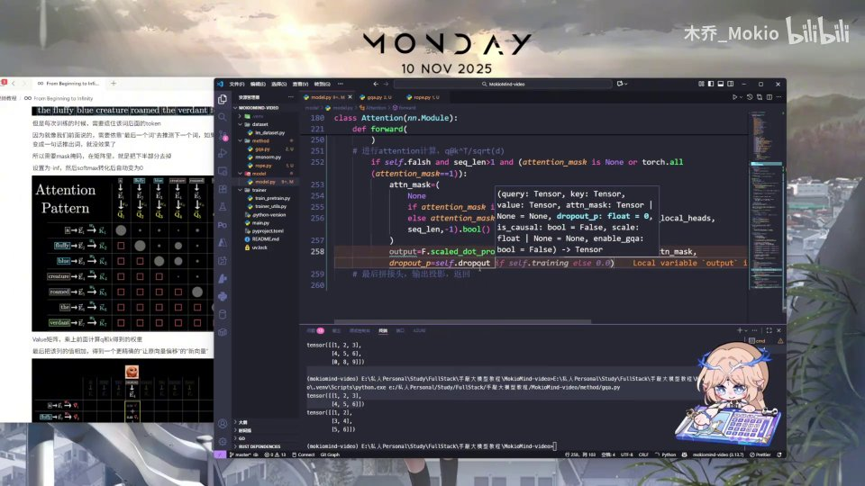

---

## 八、手写实现：公式、因果掩码、softmax 与 dropout

不用内置函数时，就按注意力最基础的公式一步步来。

### 8.1 Q 乘 K 转置，再除以维度的开方

```python
scores = (xq @ xk.transpose(-2, -1)) / math.sqrt(self.head_dim)
```

把 Q 和 K 的**转置**相乘（`transpose(-2,-1)` 交换最后两维），得到注意力分数，再除以 `sqrt(head_dim)` 做缩放。缩放的目的，是防止维度一大点积数值过大、导致 softmax 之后分布过于极端。[【跳转到 12:34】](https://www.bilibili.com/video/BV1T2k6BaEeC/?p=13&t=754)

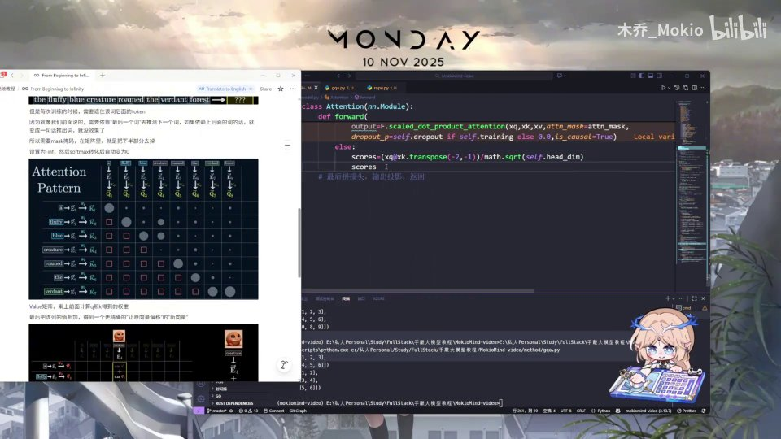

### 8.2 加因果掩码：用 torch.triu 填负无穷

```python
scores = scores + torch.triu(
    torch.full((seq_len, seq_len), float('-inf'),
               device=scores.device, dtype=scores.dtype),
    diagonal=1
).unsqueeze(0).unsqueeze(0)
```

这段是讲者口中"比较绕"的部分，拆开其实很清楚：

- `torch.full((seq_len, seq_len), float('-inf'))`：造一个全是负无穷的方阵；
- `torch.triu(..., diagonal=1)`：取**上三角**（对角线右上方，`diagonal=1` 表示从对角线再往上一格开始）；
- `.unsqueeze(0).unsqueeze(0)`：在最前面补两个维度，方便广播到每个 batch、每个头。

效果是：当前词**后面的位置**（未来 token）被填上 `-inf`。因为 `-inf` 经过 softmax 后会变成 0，相当于完全屏蔽了未来信息，只允许看自己和之前的词。这就是**因果掩码**（causal mask）。讲者建议不理解 softmax 这一性质的，可以去看 3Blue1Brown 的相关视频。[【跳转到 13:04】](https://www.bilibili.com/video/BV1T2k6BaEeC/?p=13&t=784)

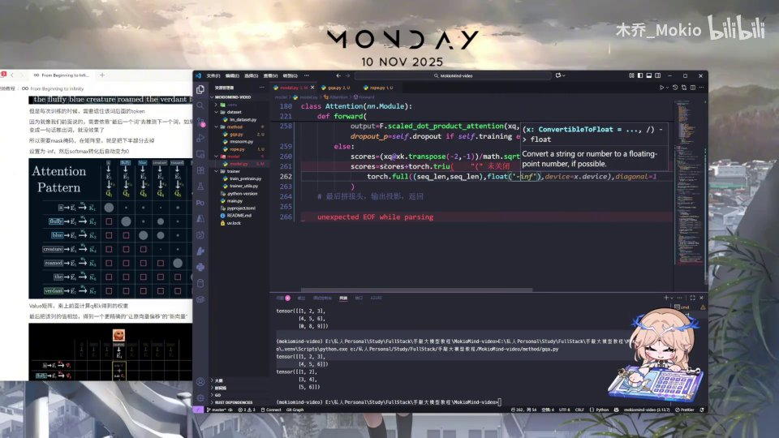

### 8.3 外部 attention_mask 的扩展

如果还传入了 `attention_mask`（比如 padding 掩码），需要把它广播成与 scores 同形：

```python
if attention_mask is not None:
    extended_attention_mask = attention_mask.unsqueeze(1).unsqueeze(2)
    extended_attention_mask = (1.0 - extended_attention_mask) * torch.finfo(scores.dtype).min
    scores = scores + extended_attention_mask
```

讲者直接把这部分写上去，说"掩码应用完之后"就进入下一步。

### 8.4 softmax、dropout，再乘 V

```python
scores = F.softmax(scores.float(), dim=-1).type_as(xq)
scores = self.attn_dropout(scores)
output = scores @ xv
```

- `F.softmax(scores.float(), dim=-1)`：在最后一维上把分数变成概率。这里先转成 `float32` 再算，是为了**训练更稳定**；算完再用 `.type_as(xq)` 转回原来的类型。
- `self.attn_dropout(scores)`：对注意力权重做 dropout。
- `output = scores @ xv`：概率化的权重和 V 相乘，得到加权聚合后的输出。

讲者在这里点出一个"架构图没体现、代码里却写了"的细节：**dropout**。原架构图上并没有画这一步，但位置编码的代码里确实做了 dropout。[【跳转到 15:16】](https://www.bilibili.com/video/BV1T2k6BaEeC/?p=13&t=916)

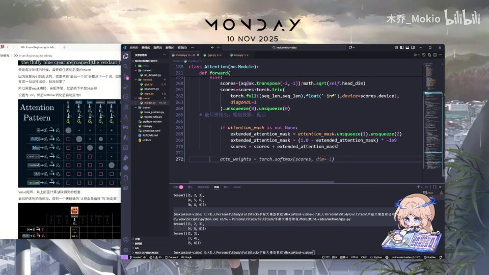

---

## 九、收尾：拼回头、输出投影、残差与返回

### 9.1 把维度换回来并 reshape

```python
output = output.transpose(1, 2).reshape(bsz, seq_len, -1)
```

因为前面把头（head）换到了第 2 位，现在要换回来——让 `seq_len` 回到原位，再把 `(num_heads, head_dim)` 两个维度合并成一个 `hidden_size`，也就是把 8 个 64 维的头拼回 512 维。[【跳转到 16:33】](https://www.bilibili.com/video/BV1T2k6BaEeC/?p=13&t=993)

### 9.2 输出投影 + 残差

```python
output = self.resid_dropout(self.o_proj(output))
return output, past_kv
```

把拼好的结果送进 `o_proj` 做输出投影，再过一层 `resid_dropout`，最后连同本步的缓存 `past_kv` 一起返回。讲者再次强调：因为需要残差，必须把最前面的原始输入部分加回来——这正是我们在第一节讲的那个"`+1`"在代码里的落地。[【跳转到 16:58】](https://www.bilibili.com/video/BV1T2k6BaEeC/?p=13&t=1018)

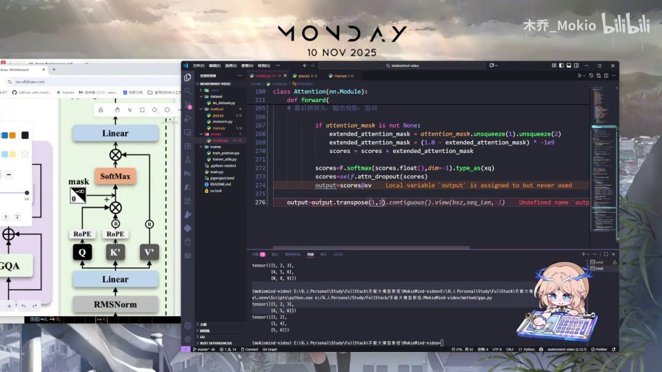

### 9.3 整体回顾

讲者最后把整段 forward 又串了一遍，核心就是：

1. 用前面的投影把 Q/K/V 算出来，再拆成 8 个头；
2. 只对 Q 和 K 用 RoPE 加位置编码；
3. 对 K 和 V，如果有 KV cache，就拼上历史的 KV；
4. 做 repeat 复制，让 K/V 的头数与 Q 对齐；
5. 进行最核心的注意力计算——内置实现或手写实现二选一；
6. 最后在输出投影层把 8 个头拼回 512 维，加残差后输出。

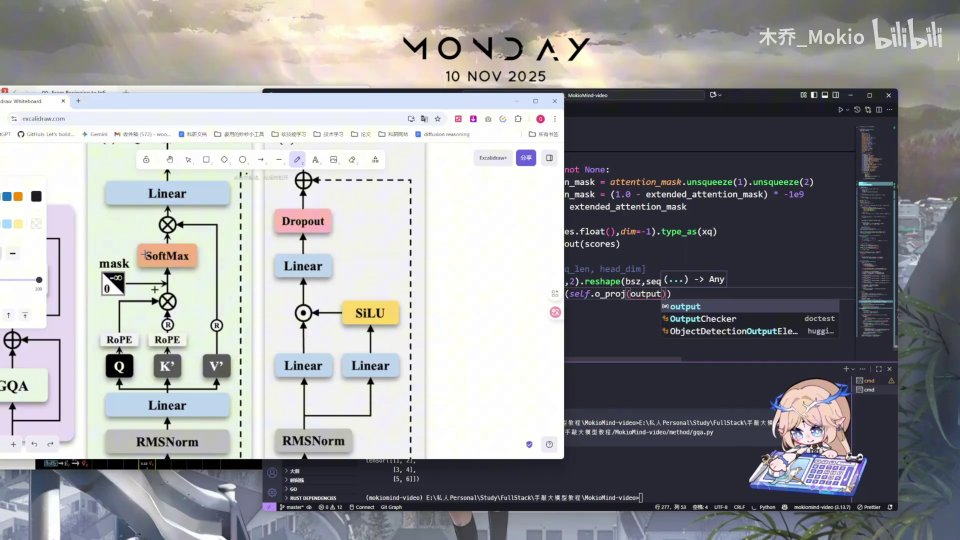

讲者最后建议：还有不懂的地方，可以对照他的 Notion 笔记和架构图理解，或者直接问 AI。至此 GQA 的代码讲解完毕，下一块进入更简单的 FFN 部分。[【跳转到 19:00】](https://www.bilibili.com/video/BV1T2k6BaEeC/?p=13&t=1140)

---

## 小结

- **残差连接**同时改善两件事：拟合上让 `H(x)=F(x)+x` 只需学 `F(x)→0`；梯度上留下一个恒定的 `+1`，有效缓解梯度消失。它是后续所有模块的收尾动作。
- `Attention.forward` 是一条**固定流水线**：投影 → 拆头 → RoPE → 拼 KV cache → transpose/repeat → 算注意力 → 拼头 → 输出投影 → 加残差。
- **拆头**用 `view` 把 `hidden_size` 切成 `(num_heads, head_dim)`；代码里的例子是 512 维切成 8 个头、每头 64 维。
- **KV cache** 的闭环是"取旧缓存 → `torch.cat` 拼接当前 → 存为新缓存"，避免每次重算历史 K/V；GQA 里再用 `repeat_kv` 按 `n_rep` 复制 K/V，使其头数与 Q 对齐。
- 注意力计算有**两条路**：满足条件时用内置 `F.scaled_dot_product_attention`（快、省显存、`is_causal=True`）；否则手写 `QK^T/√d`、`torch.triu` 因果掩码、`softmax`、`dropout` 再乘 V。
- 手写分支里有一个架构图没画、但代码里存在的 **dropout**；softmax 前先转 `float32` 是为了训练稳定。
- 最后一步永远是把头拼回 `hidden_size`、过输出投影、加残差，并把 `past_kv` 一并返回。

## 关键术语速查

| 术语 | 一句话解释 |
| --- | --- |
| GQA（分组查询注意力） | 让 K/V 的头数少于 Q，从而省下 KV cache 显存，计算时再把 K/V 复制到与 Q 相同头数。 |
| 残差连接 | `H(x)=F(x)+x`，让网络只学残差，梯度中保留恒定的 `+1`，缓解梯度消失。 |
| forward | PyTorch 模块真正执行计算的方法，输入张量、输出结果。 |
| view | 在不复制数据的前提下重塑张量形状，用来把向量拆成多个头。 |
| RoPE | 旋转位置编码，通过旋转把位置信息注入 Q、K，本讲只对 Q/K 使用。 |
| KV cache | 缓存历史 token 的 K、V，避免自回归生成时重复计算，用 `past_key_value` 传递。 |
| repeat_kv | 把较少的 K/V 头复制到与 Q 头数相同，GQA 的必要步骤，复制份数为 `n_rep`。 |
| transpose | 交换张量维度；用于把头维度换到前面或后面，配合矩阵乘与拼头。 |
| attention_mask | 注意力掩码，标出需要屏蔽的位置（如 padding），扩展后加到 scores 上。 |
| causal mask（因果掩码） | 用 `torch.triu` 生成上三角 `-inf`，屏蔽未来 token，保证只能看过去。 |
| scaled_dot_product_attention | PyTorch 内置的注意力函数，可用 FlashAttention 加速，支持 `is_causal`。 |
| softmax | 把注意力分数变成概率分布；`-inf` 经它之后会变成 0。 |
| dropout | 随机置零部分激活，防止过拟合；`self.training` 决定训练时启用、推理时关闭。 |
| o_proj | 输出投影层，把拼接好的多头结果映射回 `hidden_size`。 |
| self.training | PyTorch 的标志位，`model.train()` 为真、`model.eval()` 为假，用于区分训练/推理。 |
