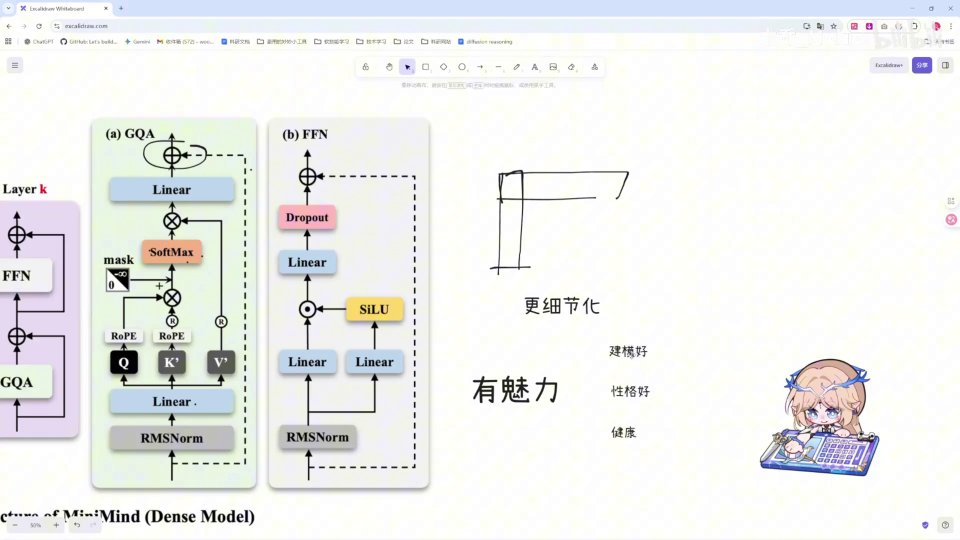
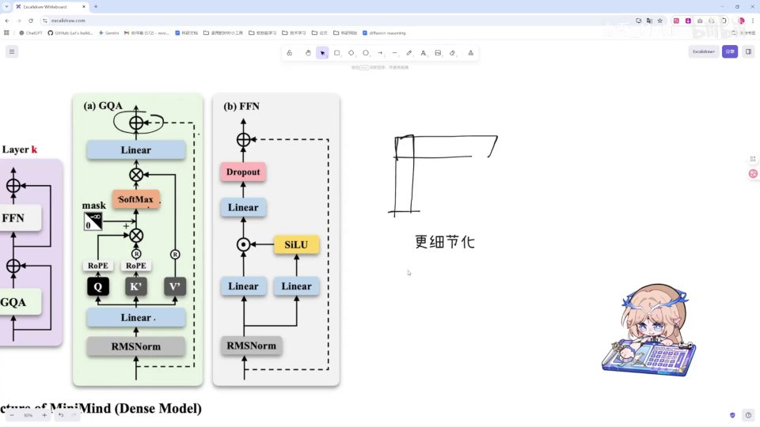
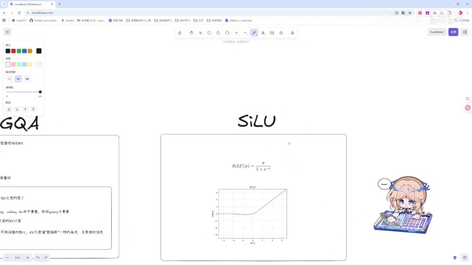
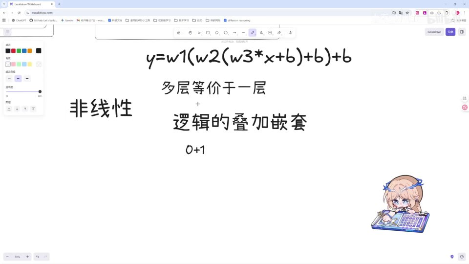
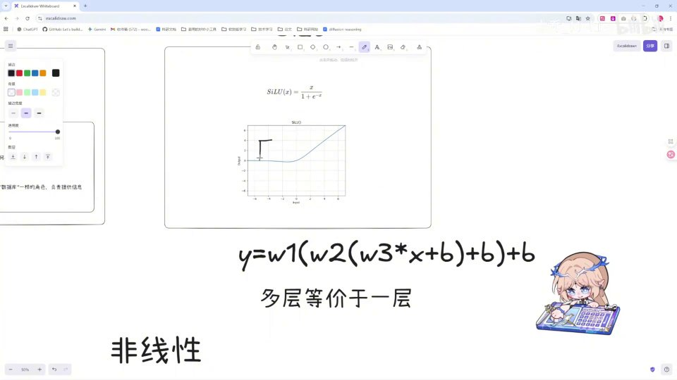
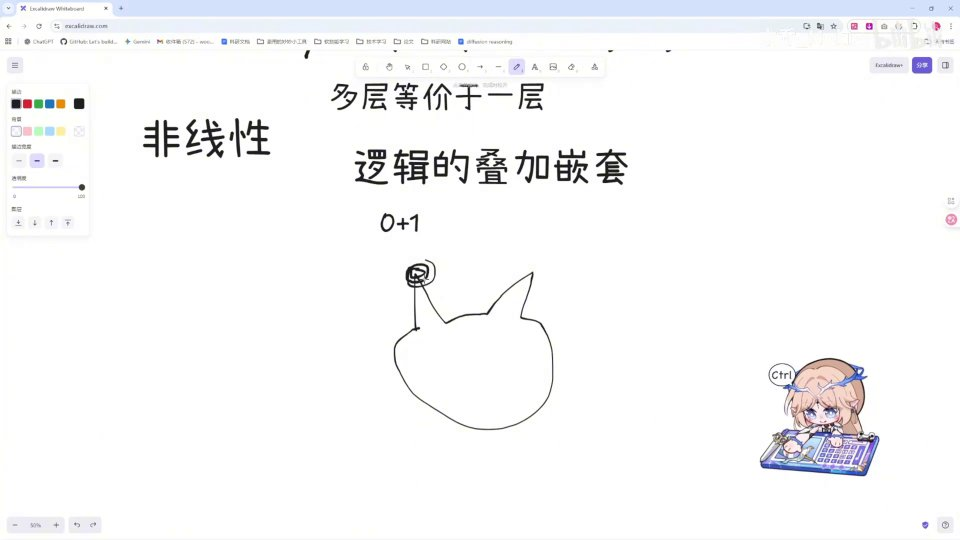
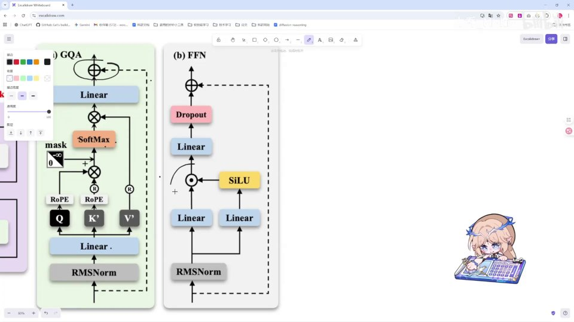

# 第14讲：理论：FFN

## 本讲要解决的核心问题（SCQA）

**背景**：在前面几讲里，我们已经拆解过 Transformer 的注意力模块（GQA），知道它负责让每一个 token「看向」序列中的其他 token，把上下文信息汇聚过来。但注意力只是 Transformer 层的一半，它的输出还要再经过另外半层——前馈网络 FFN（Feed-Forward Network，前馈网络）。

**冲突**：注意力擅长「混合信息」，可它本质上是一堆加权求和，是一个线性操作。如果模型里只有注意力，那么无论堆多少层，它都很难表达真正复杂的规律——它学不会「这只猫有尖耳朵，所以是猫」这类需要分步判断的逻辑。

**疑问**：FFN 到底做了什么？为什么它必不可少？它内部的升维、激活函数、门控、降维，各自解决什么问题？

**回答（中心思想）**：FFN 是 Transformer 的「非线性思考层」。它先用**升维**把信息拆细，再用**激活函数 SiLU** 引入非线性，接着用**逐元素相乘做门控**筛选信息，最后**降维**把精华浓缩回来。理解了「升维 + 非线性 + 门控」这三件事，就理解了 FFN。它比 GQA 简单很多，也更好理解 [【跳转到 05:59】](https://www.bilibili.com/video/BV1T2k6BaEeC/?p=14&t=359)。

如果你只记一句话，那就记这句：**注意力负责「把信息取回来」，FFN 负责「把信息想明白」。** 两者配合，才构成一个完整的 Transformer 层。

---

## 一、FFN 是 Transformer 层的另一半：先升维、再降维

FFN 层由若干 **linear 层**（线性层，也就是全连接层）和**激活函数层**组成，核心动作是「升维」和「降维」两步 [【跳转到 00:10】](https://www.bilibili.com/video/BV1T2k6BaEeC/?p=14&t=10)。

看 MiniMind 的整体结构图会更清楚：左边一列是完整的 Transformer Layer，它由 FFN 和 GQA 两块堆叠而成；右边 (a) 是 GQA 的细节，(b) 就是 FFN 的细节 [【跳转到 00:05】](https://www.bilibili.com/video/BV1T2k6BaEeC/?p=14&t=5)。

观察 (b) FFN 这张小图，从下往上读它的数据流：

1. **RMSNorm**：先对输入做一次归一化，稳定数值；
2. **两个并行 Linear**：输入同时送进两个线性层，其中一个的输出去经过 **SiLU** 激活函数；
3. **逐元素相乘（⊗）**：把激活后的那一路与没激活的那一路逐元素相乘，这就是「门控」；
4. **Linear（降维）**：把结果投影回原来的维度；
5. **Dropout**：随机丢弃一部分神经元，防止过拟合；
6. **残差相加（⊕）**：与最开始的输入相加，输出给下一层。

简单说，FFN 就是「升维 → 非线性变换 → 门控 → 降维」的一条流水线。下面我们逐段拆开讲。

### 1.1 为什么叫「前馈」

「前馈」这个词是相对「反馈」而言的：数据一层一层向前流动，不往回绕。注意，FFN 对序列里**每个位置（每个 token）都是独立、逐一处理的**——它不在 token 之间交换信息，那是注意力模块的职责。FFN 只对每个位置的向量做同一个变换，所以可以把它理解为「对每个词各自进行的一次深度加工」。

### 1.2 一个位置，一个向量

要理解升维降维，先明确一个事实：模型内部每个 token 都表示成一串数字，比如 768 个数字连成一个向量。这个向量就是它在某一层的「含义」。后续所有操作——注意力也好、FFN 也好——都是在修改这串数字。所谓「维度」，就是这串数字的长度。

---

## 二、升维的意义：把「有魅力」拆成可以计算的具体特征

先说「维度」。一句话里每个 token 都被表示成一个向量，这个向量有几个数字，就叫几维。所谓**升维**，就是把向量的维度变大，比如从 512 维变成 2048 维；**降维**就是反过来变小。

为什么要把维度变大？从信息的角度理解，**升维就是把信息更细节化** [【跳转到 00:10】](https://www.bilibili.com/video/BV1T2k6BaEeC/?p=14&t=10)。

### 2.1 一个贯穿全片的类比：「有魅力」

举个视频里的例子。假设你觉得一个人「有魅力」——「有魅力」只是一个笼统的词，模型很难直接拿它去计算。但当这个词经过升维之后，它就展开成很多个更具体的维度：建模（长相）好、性格好、身体健康……这些都可以归入「有魅力」这一大类 [【跳转到 00:35】](https://www.bilibili.com/video/BV1T2k6BaEeC/?p=14&t=35)。

也就是说，升维把一个笼统的特征，升到了更高的维度，让模型能「学习更细节的部分」。在数学上，升维无非就是把维度变多；但在信息上，它意味着**原本纠缠在一起的特征被拆开，模型可以在更细的粒度上去组合它们**。这就是升维的意义。

### 2.2 为什么「拆细」之后模型反而更强

可以这样理解：在低维空间里，很多概念是混在一起、线性不可分的；把它们映射到更高维的空间，原本「缠在一起」的模式就更容易被一刀切开。这正是升维带来的表达力：**给模型更多角度去看同一段信息**。

一个生活化的比喻：评价一个人是否「有魅力」，如果只给你一个笼统的印象分，你很难说清原因；但如果你拿到一张表格——长相 8 分、性格 9 分、健康 7 分——你就能针对每一项给出更细致的判断，也能发现「其实是性格加分」。升维就是在造这张更细的表格。

### 2.3 升维之后必须降维

升维不是终点。FFN 的输出维度必须和输入维度一致（下文会讲原因：残差相加要求形状对齐），所以升维做完非线性加工后，还要降回来。降维可以被理解为「浓缩精华知识」——把展开、筛选后的有用信息，重新压成一个紧凑的表示，交给下一层使用。

> 一句话记忆：**升维展开细节，降维浓缩精华。**

---

## 三、激活函数 SiLU：FFN 的非线性来源

升维之后，模型会经过一个**激活函数**。在 (b) FFN 图里黄色那格写的就是 **SiLU**（Sigmoid Linear Unit），它同时充当了这里的「门控网络」 [【跳转到 01:00】](https://www.bilibili.com/video/BV1T2k6BaEeC/?p=14&t=60)。

SiLU 长什么样？它的公式是：

$$
\text{SiLU}(x) = \frac{x}{1 + e^{-x}}
$$

看它的曲线就明白它在干什么 [【跳转到 01:17】](https://www.bilibili.com/video/BV1T2k6BaEeC/?p=14&t=77)：

- 当输入 $x$ 小于 0 时，输出基本靠近 0，相当于把这一路信号「关掉」或压小；
- 当输入 $x$ 大于 0 时，输出约等于 $x$ 本身，相当于「原样保留」。

### 3.1 它和 ReLU 有什么关系

这里有个关键点需要分清：

- **ReLU 风格的激活函数**（如 ReLU）确实是把负数直接截成 0，正数原样保留；
- **SiLU 比它们更平滑**，负半轴不是硬切到 0，而是一条缓慢趋近 0 的曲线，正半轴则平滑地过渡过来。这种平滑让梯度更稳定、训练更顺滑。

也就是说，SiLU 保留了「选择性通过」这一点，但把 ReLU 那个生硬的拐角磨圆了。拐角太尖，梯度容易「急转弯」；曲线平滑，优化过程就更从容。

### 3.2 激活函数唯一的核心使命：引入非线性

不管具体是哪种形式，激活函数最重要的作用只有一个：**引入非线性** [【跳转到 01:17】](https://www.bilibili.com/video/BV1T2k6BaEeC/?p=14&t=77)。它本身不改变向量的形状，只是对每个数字单独做一次「挤压或保留」的变换——但正是这一步，让整个网络从「只会直线」变成了「什么弯都能画」。为什么非线性这么重要？下一节专门回答。

> 术语解释：**激活函数**是接在线性层后面的一个逐元素函数，它对每个数字单独做一次非线性变换，相当于给网络装了一个「开关」，决定信号以多大的强度往后传。

---

## 四、为什么必须引入非线性：没有它，多层等价于一层

即使你没学过基础，这一节也值得认真读——它是理解整个深度学习的钥匙 [【跳转到 01:42】](https://www.bilibili.com/video/BV1T2k6BaEeC/?p=14&t=102)。

### 4.1 线性层叠加，还是线性层

假设我们有一个不含任何激活函数的网络，层与层之间只有矩阵乘法和加偏置：

$$
y = w_1\big(w_2(w_3 x + b) + b\big) + b
$$

把括号展开，你会发现它本质上还是：

$$
y = (w_1 w_2 w_3)\,x + (\text{某一堆常数})
$$

也就是说，**这个「三层」网络完全可以等价成一层神经网络**，权重就是 $w_1 w_2 w_3$，偏置是三项合并后的常数 [【跳转到 02:07】](https://www.bilibili.com/video/BV1T2k6BaEeC/?p=14&t=127)。

举个具体的数字例子会更直观。假设 $w_1=2,\ w_2=3,\ w_3=4$，没有偏置，那么：

$$
x \to 4x \to 3(4x)=12x \to 2(12x)=24x
$$

三层走下来，不过是把输入乘了 24。等价于一个权重为 24 的单层。多加的两层，一点新东西都没带来。

结论很反直觉却很重要：**多层如果没有引入非线性，多层就等价于一层**。既然如此，多堆几层根本无法提升表达能力，模型也就无法实现逻辑的复杂化。堆得再深，也只是把一堆矩阵乘预先合成一个大矩阵而已——深度变得毫无意义。

### 4.2 加了激活函数，深度才有意义

反过来，如果我们在**每一层都引入一个激活函数**，情况就完全不同了——模型能实现复杂得多的效果 [【跳转到 02:07】](https://www.bilibili.com/video/BV1T2k6BaEeC/?p=14&t=127)。

一个直观的说法：一个复杂的曲线函数，你只用一条直线是永远拟合不了的。但如果第一层用了一个会「拐弯」的激活函数，就相当于让我们这条线在某一部分**折断了** [【跳转到 02:32】](https://www.bilibili.com/video/BV1T2k6BaEeC/?p=14&t=152)。

一个「折线逼近」的小例子：任何一条平滑曲线，都可以用很多段折线去拼接近似。折线段越多、越短，拼出来的形状就越贴近原曲线。神经网络的每一层、每一个神经元，都可以贡献一段「折线」；这些折线复合起来，就能逼近极其复杂的函数。

这里有个好记的类比：**层数（多层）和宽度（多宽），代表的就是这条线「折断」的频数** [【跳转到 03:22】](https://www.bilibili.com/video/BV1T2k6BaEeC/?p=14&t=202)。

- 线不断地在某处折断、变化，再折断、再折断……
- 很多很多很小很小的线段拼接在一起，就能完全拟合一条复杂的曲线；
- **层数越多、越宽，可用的折线段就越多，能逼近的函数就越复杂。**

换一种说法：网络越深、越宽，它「折断」这条线的次数就越多，能表达的曲线就越灵活。这也解释了为什么大模型要做得很深、很宽——深度和宽度本质上是在购买「拟合能力」。

这就是「神经网络可以逼近任意函数」这一说法背后的直觉来源，也是引入非线性最根本的意义。

---

## 五、另一种直觉：非线性 = 逻辑的叠加与嵌套

除了「折线拟合」这个几何视角，视频里还给了一个更贴近「智能」的视角 [【跳转到 03:47】](https://www.bilibili.com/video/BV1T2k6BaEeC/?p=14&t=227)。

激活函数的输出，可以看成一位位的 **true / false（1 / 0）**，就像电路里的开关。无数个 0 和 1 拼接、叠加，就能搭出极其复杂的逻辑 [【跳转到 04:12】](https://www.bilibili.com/video/BV1T2k6BaEeC/?p=14&t=252)。

想想电脑：它由无数个 0 和 1 的晶体管组成，但无数个 0 和 1 就拼成了电脑这样复杂的东西。**非线性激活函数引入的，正是这种逻辑的复杂嵌套。**

### 5.1 用「识别一只猫」来理解自底向上的叠加

这种叠加是自底向上、层层组合的 [【跳转到 04:37】](https://www.bilibili.com/video/BV1T2k6BaEeC/?p=14&t=277)：

1. 这一个点，加上这两条线，拼出来是不是一个**角**？——一个 true / false；
2. 有了角，再往上连两条边，是不是一个**耳朵**？——又一层判断；
3. 一个耳朵加一个耳朵，再配上这张脸，是不是**猫**？——再叠一层。

每一步都是一个简单的是/否判断，但层层嵌套之后，就形成了识别复杂物体的能力。**这就是逻辑自底向上的叠加，也是激活函数引入非线性最重要的地方。**

### 5.2 两种视角，同一件事

- **几何视角**：非线性让直线能「折断」，多段折线逼近任意曲线；
- **逻辑视角**：非线性像 0/1 开关，层层嵌套组合出复杂判断。

两种说法其实讲的是同一件事：非线性让简单单元的组合能产生复杂的整体行为。这也正是「深度」神经网络之所以叫「深度」的底气所在。

> 类比总结：单看一个神经元，它只能做一次很笨的判断；但成千上万个这样的判断被组织起来，就能「认出猫」。智能，是从简单部件的大量嵌套中涌现出来的。

---

## 六、门控机制：逐元素相乘，动态决定放行哪些信息

讲完激活函数，回到 FFN 图里那个关键的「⊗」符号——**逐元素相乘** [【跳转到 05:21】](https://www.bilibili.com/video/BV1T2k6BaEeC/?p=14&t=321)。

在 (b) FFN 里，输入被分成两路：

- 一路经过 SiLU 激活，一部分数值会变成接近 0，一部分会保留原来的值；
- 另一路保持原样；
- 两者**逐元素相乘**。

所谓「逐元素相乘」，就是两个同样长度的向量，对应位置上的数字两两相乘，得到一个同样长度的新向量。比如：

$$
(2,\ 0.1,\ 5,\ 0) \times (3,\ 100,\ 2,\ 8) = (6,\ 10,\ 10,\ 0)
$$

可以看到，凡是第一路接近 0 的位置，乘完就变成了 0，信息被「关掉」；第一路保留的位置，第二路的信息就按比例通过。相乘的效果就是一次**信息过滤**：被激活函数压到接近 0 的那些位置，信息基本被「关掉」；保留下来的那些位置，信息则被放行。这相当于对信息做了一次控制 [【跳转到 05:21】](https://www.bilibili.com/video/BV1T2k6BaEeC/?p=14&t=321)。

### 6.1 「门控」这个名字从哪来

这正是「**门控**」这个名字的由来——它像一道闸门，动态决定：

- **应该放行哪些数据？**
- **应该依赖哪些数据？**

在工程上，这是一个非常有用的实现：它相当于一个**动态的门**，让模型在训练中自己学会「开多大、关多大」，从而决定信息的流通 [【跳转到 05:21】](https://www.bilibili.com/video/BV1T2k6BaEeC/?p=14&t=321)。

### 6.2 关键对比：ReLU 是硬开关，门控是软开关

| 对比项 | 单纯的激活函数（如 ReLU） | 门控（SwiGLU 式） |
| --- | --- | --- |
| 结构 | 只有一路输入 | 两路输入：一路当门、一路当内容 |
| 筛选方式 | 逐元素截断（负数归零） | 逐元素**相乘**，可调比例 |
| 灵活性 | 开关较硬 | 更细腻，能学习「放行多少」 |
| 表达能力 | 较弱 | 更强，是现代大模型 FFN 的主流 |

也就是说，门控让「过滤」这件事变得可以学习、可以渐变，比单靠一个激活函数一刀切要灵活得多。

> 术语解释：**门控（gating）**指用一路信号（门的「开关值」）去乘另一路信号，从而按比例保留或抑制信息的机制。这里的开关值由 SiLU 激活产生，取值基本在 0 到原值之间。
>
> 这种「一路激活后当门、另一路当内容、逐元素相乘」的 FFN 结构，就是常说的 **SwiGLU**——它是 GLU（Gated Linear Unit，门控线性单元）家族的一员，用 Swish/SiLU 做门。MiniMind 的 FFN 用的正是这种结构。

---

## 七、把 FFN 串起来：一条完整的「升维→门控→降维」流水线

现在把前面所有零件拼成完整流程 [【跳转到 05:46】](https://www.bilibili.com/video/BV1T2k6BaEeC/?p=14&t=346)：

1. **RMSNorm**：先归一化输入；
2. **升维（第一个 Linear）**：把维度扩大，展开细节；
3. **门控分支**：一路经过 SiLU，与另一路逐元素相乘，筛选信息；
4. **降维（第二个 Linear）**：把升维后的部分重新降维，浓缩精华知识；
5. **Dropout**：随机丢弃，防止过拟合；
6. **残差（residual）相加**：把结果加回原输入，输出给下一层。

### 7.1 为什么升维之后还要降维——瓶颈结构

为什么要有「升维再降维」这一步？注意 FFN 的输出维度必须和输入维度一致，才能与残差相加。所以 FFN 采用「升—变换—降」的**瓶颈式结构**：先进入一个更宽的空间做非线性与门控运算，再收回到原来的宽度。

这个升维后维度与原维度之比，就是所谓的**扩展比（expansion ratio）**。它通常大于 1（即中间层比输入宽），是 FFN 里衡量「展开多大」的关键超参数：比值越大，中间空间越宽、表达力越强，但计算量也越大。经典 Transformer 常用 4 倍左右，具体取值是「表达力」与「算力」之间的权衡。

### 7.2 Dropout：防过拟合

**Dropout** 是训练时的一种正则化手段：随机「丢弃」一部分神经元（把它们暂时置零），迫使网络不能过度依赖某几个特定通路，从而学到更稳健、更分散的特征。它只在训练时开启，推理时关闭。

### 7.3 残差连接：让深层网络可训练

这里的 **residual（残差连接）** 值得单独说一下：它把模块的输入直接加到模块的输出上。好处是梯度可以沿着这条「捷径」直接回传，深层网络更容易训练，也避免信息在层层变换中丢失。Dropout 与残差在后面的代码讲解里都会具体实现。

---

## 八、学习重点：抓住「门控」与「激活函数」两根线

回顾整讲，FFN 是比 GQA 简单很多、也更好理解的一块 [【跳转到 05:59】](https://www.bilibili.com/video/BV1T2k6BaEeC/?p=14&t=359)。只要抓住两条主线就够了 [【跳转到 06:04】](https://www.bilibili.com/video/BV1T2k6BaEeC/?p=14&t=364)：

- **门控网络**：理解「一路激活当门、一路当内容、逐元素相乘」如何动态筛选信息；
- **激活函数**：理解 SiLU 的形状，以及它引入非线性为何是深度网络能表达复杂逻辑的前提。

至于升维/降维、Dropout、残差，本质上都是围绕这两条主线的工程实现手段。视频最后也预告：下一部分将正式进入 FFN 的**代码讲解**，把这些理论逐一落地。

---

## 小结

1. **FFN 是 Transformer 层的另一半**，与 GQA 并列，负责对注意力汇聚来的信息做进一步的非线性加工；注意力「取信息」，FFN「想信息」。
2. **升维 = 展开细节，降维 = 浓缩精华**。「有魅力」被拆成建模、性格、健康等具体维度，就是把笼统特征细化的过程。
3. **激活函数 SiLU 引入非线性**：负半轴趋近 0，正半轴近似保留原值；比 ReLU 更平滑，是门控的开关来源。
4. **没有非线性，多层等价于一层**（如 $w_1w_2w_3$ 合并成一个权重）；有了非线性，多段「折线」才能逼近任意复杂曲线，深度才有意义。
5. **非线性的逻辑直觉**：像 0/1 电路一样层层嵌套，从「角」到「耳朵」再到「猫」，自底向上叠加出复杂判断。
6. **门控 = 逐元素相乘**：用激活后的信号当闸门，动态决定放行或抑制哪些信息，即 SwiGLU 结构；它比单纯的激活函数更灵活。
7. **FFN 完整流水线**：RMSNorm → 升维 → SiLU 门控 → 降维 → Dropout → 残差；升维比（扩展比）通常大于 1。
8. **学习重点**：抓住「门控网络」和「激活函数」两条主线，FFN 就不难了。

---

## 关键术语速查

| 术语 | 一句话解释 |
| --- | --- |
| FFN（前馈网络） | Transformer 层中与注意力并列的子层，由线性层和激活函数组成，做「升维→门控→降维」。 |
| Linear 层 | 全连接/线性层，做矩阵乘法加偏置；FFN 里用来升维和降维。 |
| 升维 / 降维 | 升维把向量维度变大、展开细节；降维把维度收回、浓缩精华。 |
| 激活函数 | 接在线性层后的逐元素非线性函数，给网络装「开关」，引入非线性。 |
| SiLU | $x/(1+e^{-x})$，负半轴趋近 0、正半轴近似原值，平滑版开关，是门控的来源。 |
| 非线性 | 使多层网络不再等价于一层的能力；让折线可折断、逻辑可嵌套。 |
| 门控（gating） | 用一路信号当开关去乘另一路信号，动态决定放行或抑制哪些信息。 |
| SwiGLU | 用 Swish/SiLU 做门的 GLU 结构，即「一路激活后与另一路逐元素相乘」的 FFN。 |
| GLU | Gated Linear Unit，门控线性单元；用门控制信息流通的一类结构，SwiGLU 是其变体。 |
| 逐元素相乘 | 两个同形状向量对应位置相乘，门控的实现方式，起到信息过滤作用。 |
| RMSNorm | 归一化方法，在 FFN 入口先稳定数值。 |
| Dropout | 训练时随机丢弃部分神经元，防止过拟合。 |
| 残差（residual） | 把模块输入直接加到输出上，便于梯度回传、避免信息丢失。 |
| 扩展比 | FFN 中间升维后的维度与输入维度之比，通常大于 1，衡量中间层有多宽。 |
