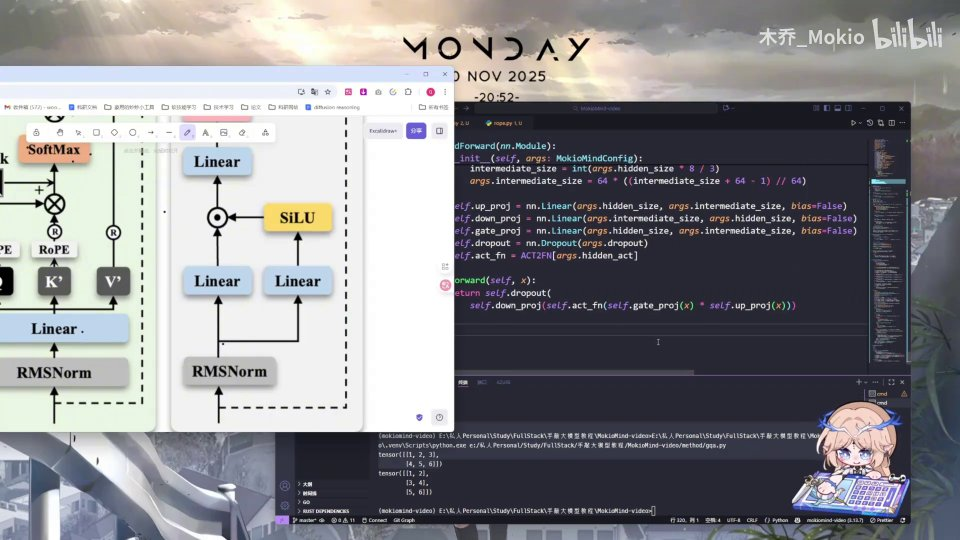
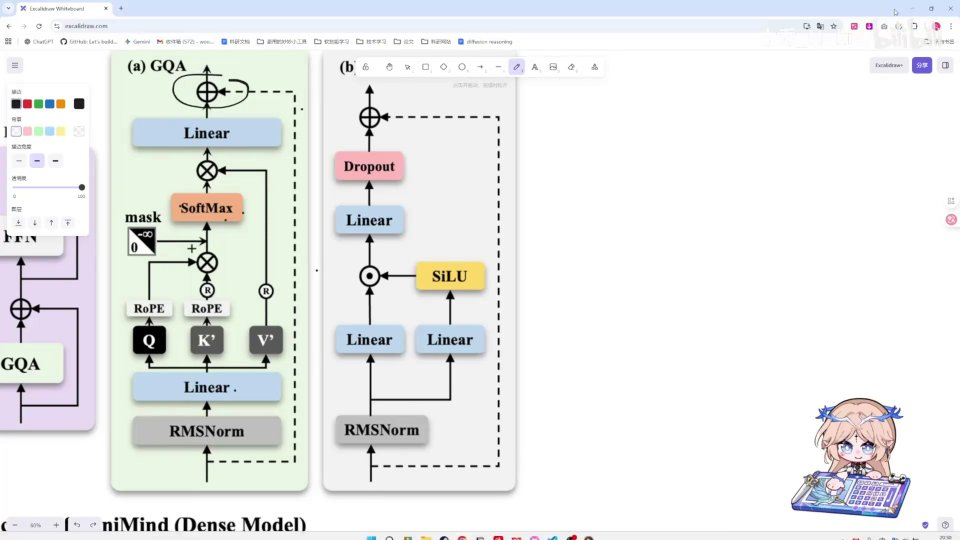

# 第15讲：代码：FFN —— 手写 SwiGLU 前馈网络

## 本讲要解决的核心问题（SCQA）

**背景**：前几讲我们已经把 Transformer 里最"烧脑"的注意力模块（Attention）拆完了：Q/K/V、RoPE 位置编码、RMSNorm、GQA 多头注意力都逐个手写实现。一个 TransformerBlock 里，注意力负责让 token 之间"互相看"，但每个 token 自己还需要被单独加工一遍。

**冲突**：承担"单独加工"任务的，就是前馈网络 FFN（Feed-Forward Network）。它看起来只是两层线性层（Linear），但在 Minimind 里，FFN 用的是带门控的 **SwiGLU** 结构——"升维 → 激活 → 门控相乘 → 降维"四步走，比朴素的两层 MLP 多了一个 gate 分支，升维的维度也不是随便定的。

**疑问**：这段 FFN 代码到底怎么写？升维维度是怎么算出来的？门控分支怎么和主分支配合？激活函数从哪里来？forward 的一行代码为什么能同时完成这么多事？

**回答（中心思想）**：本讲用一个 `FeedForward(nn.Module)` 类就把 FFN 写完——初始化时建好 **up_proj / down_proj / gate_proj** 三个线性层、一个 dropout 和一个激活函数；`forward` 里用 `down_proj(act_fn(gate_proj(x)) * up_proj(x))` 这一行实现 SwiGLU。全程不需要复杂的 PyTorch 技巧，是整条 Transformer 代码线里最友好的一段。

---

## 一、FFN 是每个 token 独立经过的小型 MLP

先说清楚 FFN 是什么。注意力（Attention）做的是"token 之间交换信息"：第 5 个词可以去看第 1、第 2 个词，把上下文的信息聚合过来。但光有交换还不够，模型还需要对聚合后的每个 token 做一次"独立的非线性加工"，这一步由 FFN 完成。

FFN 在论文里常被写成两层全连接网络：

> FFN(x) = W₂ · 激活函数(W₁ · x)

也就是"先线性变换一次，过个非线性激活，再线性变换回来"。它作用于序列里的每一个位置，而且**不同位置之间参数共享、互不干扰**——第 5 个 token 过 FFN 时，完全不知道第 6 个 token 是什么。正因为每个 token 独立计算，FFN 其实就是一个套在 TransformerBlock 里的小 MLP。

**为什么需要它？** 注意力是线性的加权求和，如果没有 FFN 提供非线性，整个模型堆再深也只是线性变换的组合，表达能力有限。FFN 用"升维 → 激活 → 降维"的方式，给模型一块高维空间去拟合复杂函数，是非线性能力的主要来源。经验上，FFN 的参数往往比注意力还多，是现代大模型里"存知识"的主要位置。

本讲对应的代码位置，就是上面注意力类下面紧接着的 `class FeedForward(nn.Module)`。[【跳转到 00:00】](https://www.bilibili.com/video/BV1T2k6BaEeC/?p=15&t=0)

---

## 二、类的骨架：继承 nn.Module，先规划四个零件

写任何 PyTorch 模块都从"继承 + 初始化"开始。FFN 依旧是一个层（layer），我们把它命名为 `FeedForward`，让它继承 `nn.Module`。第一步永远是初始化，也就是 `__init__`。[【跳转到 00:13】](https://www.bilibili.com/video/BV1T2k6BaEeC/?p=15&t=13)

在动手写代码前，先想清楚这个类需要哪几个"零件"：

1. **升维的 Linear**：把 hidden_size 放大到 intermediate_size；
2. **降维的 Linear**：加工完再缩回 hidden_size；
3. **门控（gate）**：SwiGLU 特有的第二条升维分支；
4. **dropout**：训练时随机丢弃部分神经元做正则化；
5. **激活函数**：提供非线性，这里用 SiLU。

把这五件事合起来，就是整个 FeedForward 的构成。[【跳转到 00:38】](https://www.bilibili.com/video/BV1T2k6BaEeC/?p=15&t=38)


代码上，初始化函数的第一句永远是父类初始化：

```python
def __init__(self, args):
    super().__init__()
```

`super().__init__()` 会调用 `nn.Module` 的初始化逻辑，把 PyTorch 管理子模块、参数注册等基础设施准备好。**只要继承 `nn.Module`，这一句就不能省**，否则后面 `self.xxx = nn.Linear(...)` 注册的参数会失效。

同时，我们把配置对象 `args` 传进来，它携带了所有超参数。Minimind 的配置类里和 FFN 直接相关的字段有这些：[【跳转到 00:63】](https://www.bilibili.com/video/BV1T2k6BaEeC/?p=15&t=63)


- `hidden_size`：模型主干的隐藏维度，这里默认是 512；
- `intermediate_size`：FFN 升维后的中间维度，默认是 `None`（表示"没手动指定，需要自动算"）；
- `hidden_act`：激活函数的名字，默认 `"silu"`；
- `dropout`：dropout 概率。

`intermediate_size` 默认是 `None` 这一点很关键，它决定了下一节要讲的"自动计算升维维度"逻辑。

---

## 三、升维维度：默认 hidden_size × 8/3，再对齐到 64 的倍数

FFN 的核心动作是"先升维、再降维"。升维到什么维度，不是拍脑袋定的，而有一套经验公式。配置里 `intermediate_size` 如果给了具体数值就直接用；如果是 `None`，就由代码自己算。[【跳转到 00:88】](https://www.bilibili.com/video/BV1T2k6BaEeC/?p=15&t=88)


```python
if args.intermediate_size is None:
    intermediate_size = int(args.hidden_size * 8 / 3)
```

这里的关键数字是 **8/3 ≈ 2.66**。也就是说，FFN 的中间维度大约是隐藏维度的 2.66 倍。视频里特别强调：这个倍数不是理论推导出来的，而是在实践中反复验证后"最好用"的经验值。[【跳转到 01:13】](https://www.bilibili.com/video/BV1T2k6BaEeC/?p=15&t=113)


**为什么是 8/3，而不是整数倍？** 这是为了在"参数量"和"表达能力"之间找平衡。早期 Transformer 常把中间维度设成 hidden_size 的 4 倍；后来 SwiGLU 结构里多了一个 gate 分支，参数量天然变多，于是把单分支的倍数从 4 降下来，`8/3` 正好让总参数量和传统 4 倍 FFN 大致持平。换句话说，8/3 是"补偿了门控分支多出来的参数"之后的结果。

算出一个浮点数还不够，还要把它**对齐到 64 的整数倍**，因为 GPU 对特定宽度的矩阵乘法更友好：

```python
args.intermediate_size = 64 * ((intermediate_size + 64 - 1) // 64)
```

这是"向上取整到 64 的倍数"的经典写法：先加 `64 - 1`，整除 64 就把零头抹掉、余数不为零时自动多进一格，最后再乘回 64。举个例子，如果 `hidden_size = 512`，`512 × 8 / 3 ≈ 1365`，向上对齐到 64 的倍数就是 `1408`。[【跳转到 01:38】](https://www.bilibili.com/video/BV1T2k6BaEeC/?p=15&t=138)


算出的结果会写回 `args.intermediate_size`，这样如果后面还有别的模块（比如 MoE 版本）复用同一份配置，就能直接拿到已经算好的值，避免重复计算。

---

## 四、三个投影：up_proj、down_proj、gate_proj，且都不带 bias

维度定下来后，就可以建三个线性层了。它们各司其职：

- `up_proj`：**升维**。输入 `hidden_size`，输出 `intermediate_size`；
- `down_proj`：**降维**。输入 `intermediate_size`，输出 `hidden_size`，正好和 up_proj 反过来；
- `gate_proj`：**门控**。和 up_proj 结构完全一样，输入 `hidden_size`、输出 `intermediate_size`，因为它是走"右边那条分支"的。

代码：

```python
self.up_proj   = nn.Linear(args.hidden_size, args.intermediate_size, bias=False)
self.down_proj = nn.Linear(args.intermediate_size, args.hidden_size, bias=False)
self.gate_proj = nn.Linear(args.hidden_size, args.intermediate_size, bias=False)
```


注意三处 `bias=False`。**bias（偏置）** 是线性层里额外加的一个常数向量 `b`，让 `y = Wx + b`；但在大模型里，线性层后面通常紧跟 RMSNorm，偏置的作用会被归一化"抹平"，留着反而增加参数量。所以 Minimind 的注意力、FFN 里的 Linear 统一都不用 bias。

再回头看结构命名，就很清楚了：`up_proj` 把维度抬上去，`gate_proj` 是并行的第二条抬升分支，两者相乘后由 `down_proj` 压回来。这就是 **SwiGLU** 的骨架。

### 为什么门控分支和 up_proj 一模一样？

你可能奇怪：既然 `gate_proj` 和 `up_proj` 的维度完全相同，为什么要建两个？关键不在"维度"，而在"后面怎么用"。`gate_proj` 的输出会先过激活函数，变成一个 0~1 区间附近、可正可负的"门"，再去和 `up_proj` 的输出逐元素相乘——相当于用一条分支去"筛选"另一条分支的信息。两个分支参数不同、各学各的，这才是门控的意义。如果只有一个 up_proj，就退化成了普通 MLP。

---

## 五、激活函数：用 ACT2FN 字典按名字查表

激活函数提供非线性，这里不自己实现，而是用一个"名字到函数"的字典 `ACT2FN` 来查表：

```python
self.act_fn = ACT2FN[args.hidden_act]
```

因为配置里 `hidden_act = "silu"`，这行代码实际拿到的是 **SiLU** 函数（也叫 Swish）。

### 什么是 ACT2FN？

`ACT2FN` 是 HuggingFace Transformers 里提供的一个映射表，把字符串名字（如 `"silu"`、`"gelu"`、`"relu"`）映射到对应的激活函数实现。视频里说"常用的一些激活函数它其实已经内置给我们实现过了"，指的就是它——我们不用手写 SiLU，直接按名字取就行。[【跳转到 02:04】](https://www.bilibili.com/video/BV1T2k6BaEeC/?p=15&t=204)

![用 ACT2FN[args.hidden_act] 取激活函数，IDE 提示 ACT2FN 尚未定义](assets/第15讲_代码：FFN/00234.jpg)

### SiLU 是什么？

SiLU 的定义是 `x · sigmoid(x)`：用 sigmoid 把输入压缩到 0~1 当作"开关"，再乘回输入自己。当 x 很大时 sigmoid≈1，几乎原样通过；当 x 很负时 sigmoid≈0，输出趋近 0，起到抑制负值的作用。它平滑、可导，比 ReLU 更利于训练，是 SwiGLU 里"SWI"（Swish）一词的来源。

### 记得 import

因为 `ACT2FN` 来自外部库，必须先在文件顶部导入，否则运行时会报 `NameError`：

```python
from transformers.activations import ACT2FN
```

视频里专门回到文件开头补了这一句 import。这也是 IDE 会标红提示"Undefined name: ACT2FN"的原因——先写用法、再补导入，是开发时的常见顺序。[【跳转到 02:39】](https://www.bilibili.com/video/BV1T2k6BaEeC/?p=15&t=239)


---

## 六、dropout：训练时的正则化开关

除了三个线性层和激活函数，还有一个不起眼但重要的零件——dropout：

```python
self.dropout = nn.Dropout(args.dropout)
```

**dropout 是什么？** 它在训练时以一定概率随机把神经元的输出置零，迫使模型不依赖某几个固定神经元，从而缓解过拟合；推理（预测）时则关闭，让全部神经元参与。`args.dropout` 就是丢弃概率。

这里直接把配置里的概率传给 `nn.Dropout`，用默认实现即可，不需要额外设置。这句话虽然短，但它被放在 FFN 的最外层：`forward` 的最后一步就是套一次 dropout，对输出做正则化。[【跳转到 01:88】](https://www.bilibili.com/video/BV1T2k6BaEeC/?p=15&t=188)


---

## 七、前向传播：一行代码实现 SwiGLU

零件都建好了，最后写 `forward`，也就是数据真正流过 FFN 时的计算路径。函数签名是 `forward(self, x)`，`x` 是输入的张量（形状通常是 `[batch, seq_len, hidden_size]`）。[【跳转到 02:64】](https://www.bilibili.com/video/BV1T2k6BaEeC/?p=15&t=264)

```python
def forward(self, x):
    return self.dropout(
        self.down_proj(self.act_fn(self.gate_proj(x)) * self.up_proj(x))
    )
```

这一行虽然嵌套得深，但从里往外拆开看，正好是四步流水线，和前面架构图里的箭头一一对应：[【跳转到 03:02】](https://www.bilibili.com/video/BV1T2k6BaEeC/?p=15&t=302)



1. **升维（两条分支）**：`up_proj(x)` 和 `gate_proj(x)` 分别把输入从 `hidden_size` 抬到 `intermediate_size`；
2. **门控 + 激活**：`act_fn(gate_proj(x))` 把门控分支过 SiLU，得到一个"闸门"；
3. **逐元素相乘**：把激活后的门控和主分支的 `up_proj(x)` **逐元素相乘**（对应符号 `*`）——注意这里既不是矩阵乘，也不是相加，而是同一个位置上两个数直接相乘，让门控去调节主分支每个维度的强度；
4. **降维 + dropout**：`down_proj(...)` 把维度压回 `hidden_size`，最后由最外层 `dropout` 收尾。

位置索引如图：[【跳转到 03:08】](https://www.bilibili.com/video/BV1T2k6BaEeC/?p=15&t=308)

- `gate_proj` / `up_proj`：@ 不同的 token 位置各自升维；
- `*`：两个升维结果逐元素相乘；
- `down_proj`：降维；
- `dropout`：输出前的正则化。

### 用公式总结

把上面的步骤写成数学式子，就是 SwiGLU 的标准形式：

> FFN(x) = Dropout( W_down · ( SiLU(W_gate · x) ⊙ (W_up · x) ) )

其中 `⊙` 表示逐元素相乘。和开篇的普通 MLP 相比，多出来的 `SiLU(W_gate·x)` 就是那个"门"——它决定了主分支的每个维度该被放大还是抑制。这种"一条分支当门、另一条当值"的设计，就是 GLU（Gated Linear Unit，门控线性单元）家族的核心思想，配上 SiLU 激活就成了 SwiGLU。

### 为什么 SwiGLU 比普通 MLP 好？

普通 MLP 只有一个升维分支，激活后直接降维。SwiGLU 额外引入门控分支，等价于让网络自己学习"哪些特征该保留、哪些该压制"，表达更灵活，在同等参数量下通常效果更好——这也是现在 LLaMA、Minimind 等主流模型都采用它的原因。

---

## 八、放进整体架构：FFN 与 GQA 共同拼成 TransformerBlock

把视角拉远，看看 FFN 在整个模型里的位置，就能明白为什么前面要花那么大篇幅写注意力。[【跳转到 03:18】](https://www.bilibili.com/video/BV1T2k6BaEeC/?p=15&t=318)



这张图左边是注意力分支（Q/K/V → RoPE → Softmax → 输出投影），右边就是本讲的 FFN 分支（RMSNorm → Linear 升维 → SiLU 门控 → 相乘 → Linear 降维 → Dropout）。两者并排，各由一次残差连接包裹，合起来才是一个完整的 TransformerBlock。

到这里，TransformerBlock 需要的两块积木——**注意力**和 **FFN**——都已经单独写完了。视频结尾说：FFN 讲完、这一块也讲完，接下来就是把这些模块"拼接"成一个完整的 TransformerBlock，那只是简单的组装工作。[【跳转到 03:25】](https://www.bilibili.com/video/BV1T2k6BaEeC/?p=15&t=325)

---

## 小结

1. **FFN 是每个 token 独立经过的小 MLP**，负责在注意力交换信息之后做非线性加工，是模型"存知识"和获得表达能力的主要部位。
2. **本讲没有复杂 PyTorch 技巧**，只用一个继承 `nn.Module` 的类就写完了：`super().__init__()` 打底，再建五个零件。
3. **升维维度有经验公式**：默认取 `hidden_size × 8/3 ≈ 2.66` 倍，再向上对齐到 64 的整数倍；8/3 是为了补偿门控分支带来的额外参数。
4. **三个 Linear 分工明确**：`up_proj` 升维、`gate_proj` 走门控、`down_proj` 降维，且统一 `bias=False`。
5. **激活函数用 ACT2FN 按名字查表**：配置 `hidden_act="silu"` 取到 SiLU（即 `x·sigmoid(x)`），使用前要用 `from transformers.activations import ACT2FN` 导入。
6. **forward 一行实现 SwiGLU**：`down_proj(act_fn(gate_proj(x)) * up_proj(x))`，再套一层 dropout；核心是"门控分支激活后与主分支逐元素相乘"。
7. **FFN 与注意力并排组成 TransformerBlock**，下一讲只需把两者拼接起来即可。

---

## 关键术语速查

| 术语 | 一句话解释 |
| --- | --- |
| FFN（Feed-Forward Network） | 前馈网络，TransformerBlock 里对每个 token 独立做非线性加工的小型 MLP。 |
| MLP | 多层感知机，由若干全连接层加激活函数组成的网络；FFN 就是一种 MLP。 |
| SwiGLU | 带 SiLU 门控的 GLU 变体，用一条门控分支与主分支逐元素相乘，是 Minimind 的 FFN 结构。 |
| GLU（门控线性单元） | 用一条分支当"门"去调节另一条分支输出的结构，SwiGLU 是它的具体实现。 |
| hidden_size | 模型主干的隐藏维度，FFN 的输入输出维度都是它（默认 512）。 |
| intermediate_size | FFN 升维后的中间维度，未指定时按 `hidden_size × 8/3` 自动计算并对齐到 64 的倍数。 |
| up_proj | 升维线性层，把 hidden_size 放大到 intermediate_size（不带 bias）。 |
| down_proj | 降维线性层，把 intermediate_size 缩回 hidden_size（不带 bias）。 |
| gate_proj | 门控升维分支，输出经激活函数后当"门"，与 up_proj 输出逐元素相乘。 |
| bias（偏置） | 线性层中 `y = Wx + b` 的常数项 b；大模型里通常设为 False 以省参数。 |
| ACT2FN | 名字到激活函数的映射字典，如 `ACT2FN["silu"]` 得到 SiLU。 |
| SiLU / Swish | 激活函数，定义为 `x · sigmoid(x)`，平滑可导，是 SwiGLU 的核心。 |
| dropout | 训练时随机置零部分神经元以缓解过拟合，推理时关闭。 |
| 逐元素相乘（⊙） | 两个同形状张量对应位置直接相乘，不是矩阵乘法，用于门控。 |
| RMSNorm | 均方根归一化，常放在 FFN/注意力之前，因此线性层可省去 bias。 |
| GQA | 分组查询注意力，与 FFN 并排构成 TransformerBlock 的另一个分支。 |
| TransformerBlock | 由注意力模块与 FFN 模块（各带残差连接）组成的基本积木。 |
