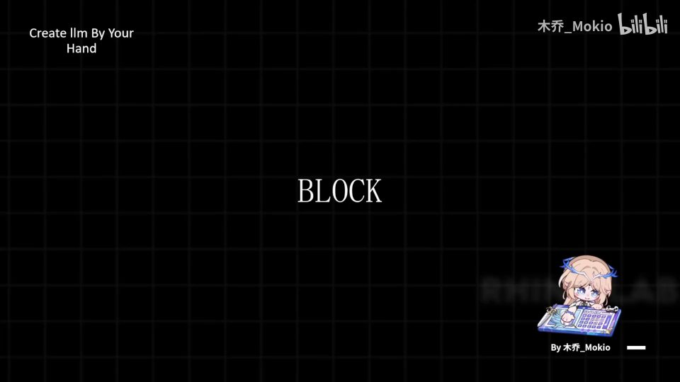
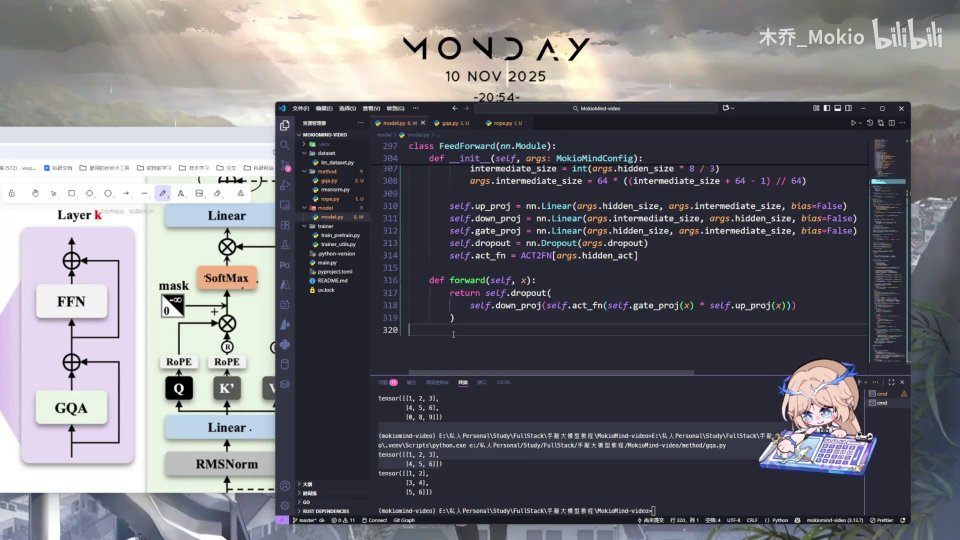
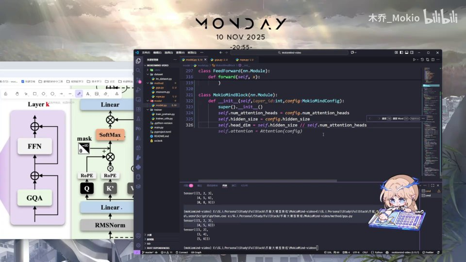
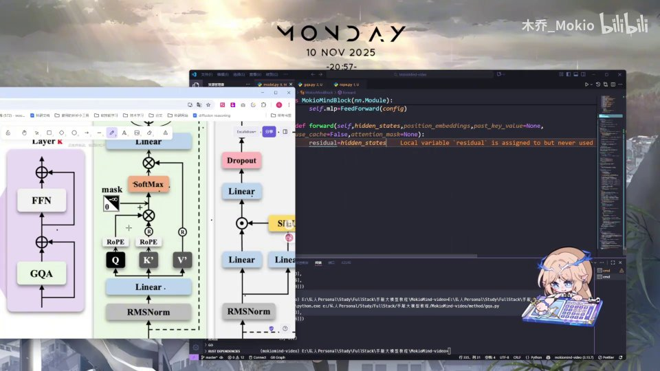
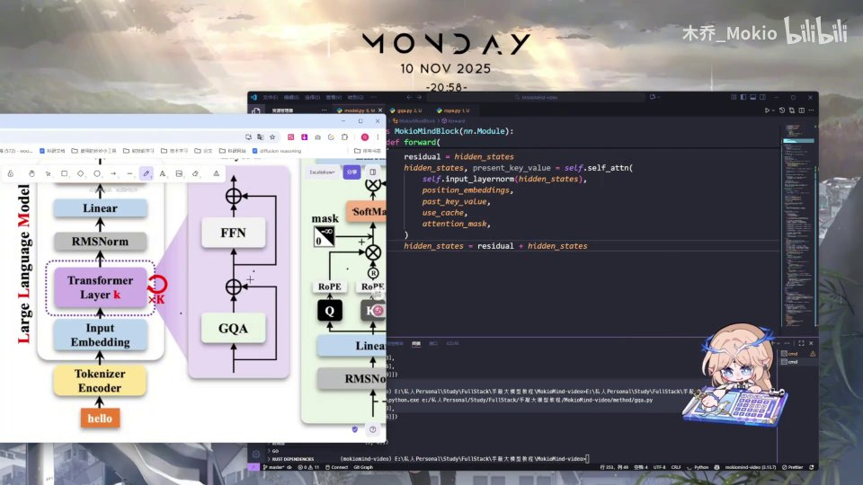
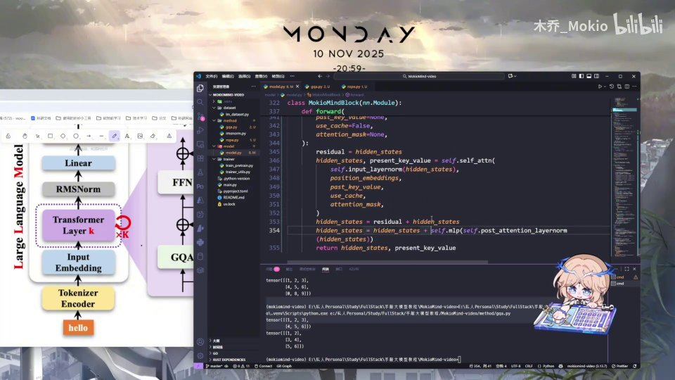

# 第16讲：拼接：Block

## 本讲要解决的核心问题（SCQA）

**背景**：前面几讲，我们已经把 Transformer 的三大零件分别写好了——负责归一化的 RMSNorm、负责"看上下文"的 GQA 注意力、以及负责"逐位置加工"的 FFN 前馈网络。它们各自都能在测试里跑通。

**冲突**：但零件终究只是零件。单独拿出一个 RMSNorm，它只能把一组数字的尺度拉回正常；单独拿出一个注意力，它只能算一次混合。谁把它们按正确顺序串起来？谁在中间接上那条让深层网络能训得动的"残差捷径"？这些事还没有人做。

**疑问**：怎么把一个 RMSNorm、一个注意力、一个 FFN 拼成一层真正能用的 Transformer Block？拼接的顺序是什么？两条残差连接分别接在哪里？

**回答（中心思想）**：用一个叫 `MokioMindBlock` 的类，把"归一化 → 注意力 → 残差"和"归一化 → FFN → 残差"两个子层前后串起来，就得到了 Transformer 的一层。它的前向传播只有四步：存一份输入做残差、过注意力、加回残差、再过 FFN 并加回残差。本讲不涉及新理论，只把这套拼接逻辑落到代码上。

> 本讲定位：这是纯实现的一讲。上一讲的 GQA、更早的 FFN 都会在这里被"正式用上"，所以可以边看边回顾。

---

## 一、Block 到底是什么：一个可复用的 Transformer 层

先把结论摆出来：**Block（块）就是 Transformer 的一层，是可以被重复堆叠 N 次的最小完整单元。** 一个 Llama 风格的模型，本质上就是把同一个 Block 复制几十层、首尾相接。

打开这一讲，幻灯片先给出了标题"BLOCK"[【跳转到 00:00】](https://www.bilibili.com/video/BV1T2k6BaEeC/?p=16&t=0)。



那一个 Block 里都有什么？看这张幻灯片左下角的 `Layer k` 示意图就很清楚：它由两个方框组成——下面的 `GQA`（注意力子层）和上面的 `FFN`（前馈子层），每个方框旁边都画着一条绕过去的加号箭头，那就是残差连接。右侧并排的 `RMSNorm`、`Q/K/V`、`SoftMax` 等，则是每个子层内部用到的细节[【跳转到 00:10】](https://www.bilibili.com/video/BV1T2k6BaEeC/?p=16&t=10)。


所以拼接这件事本身很简单：**把前面实现的 GQA 和 FFN 装进同一个类里，再用残差把它们串起来就行了**。讲者原话是"这些就是我们前面所写的 Attention、RMSNorm 和 FeedForward"，Block 只是给它们安排位置和顺序。

为什么顺序是"先注意力、后 FFN"而不是反过来？可以这样理解：

1. **注意力负责在"序列维度"交换信息**：让每个 token 去看同一条序列里其他 token 的内容，完成"上下文化"。
2. **FFN 负责在"特征维度"加工信息**：对每个 token 自己的向量做一次非线性变换，做更深的特征提炼。
3. **两者交替、缺一不可**：先让 token 之间交流，再让它各自消化，如此反复堆叠，模型才能同时"联系上下文"和"深入思考"。

---

## 二、先搭骨架：类定义与构造函数签名

实现从声明一个类开始[【跳转到 00:15】](https://www.bilibili.com/video/BV1T2k6BaEeC/?p=16&t=15)：

```python
class MokioMindBlock(nn.Module):
    def __init__(self, layer_id: int, config: MokioMindConfig):
```



这里有三点值得初学者留意：

**第一，它继承 `nn.Module`。** `nn.Module` 是 PyTorch 里所有神经网络模块的基类。继承它之后，PyTorch 就会自动帮你登记子模块、管理参数，`model.parameters()` 能一次性拿到全部权重，`model.to(device)`、`model.eval()` 这些也都能一层层递归生效。前面我们写的 Attention、RMSNorm、FeedForward 同样都继承了它。

**第二，构造函数需要 `self`、`layer_id` 和 `config`。**

- `self` 是所有实例方法的第一个参数，代表这个对象本身。
- `config` 是全局配置对象（这里是 `MokioMindConfig`），把模型结构相关的超参数集中管理。好处是：改层数、改隐藏维度时只改配置，不用去翻代码。
- `layer_id` 是这一层的编号。单看这个 Block，它似乎用不上；但整个模型会有很多层，层号能帮我们区分"这是第几层"——比如在调试、日志、或者某些"按层做不同处理"的技巧里会用到它。讲者专门把它存下来：`self.layer_id = layer_id`。

**第三，构造函数里要调用 `super().__init__()`。** 这句会初始化父类 `nn.Module` 的内部结构，是必须的。少了它，后面注册子模块时就会报错。

---

## 三、构造函数里初始化了什么

把 `__init__` 拆开看，其实就是两件事：**先从 config 取出几个尺寸变量，再把三个子模块实例化出来。**

### 3.1 从 config 取出的三个尺寸变量

```python
self.num_attention_heads = config.num_attention_heads
self.hidden_size = config.hidden_size
self.head_dim = self.hidden_size // self.num_attention_heads
```


这三个量的含义，正好对应注意力的"切分"逻辑：

- `num_attention_heads`（注意力头数）：把注意力拆成几个头并行计算。多头的好处是，不同的头可以各自关注不同的关系模式（有的看近处、有的看远处、有的看语法、有的看指代）。
- `hidden_size`（隐藏维度）：每个 token 的向量长度，也就是模型的"宽度"。
- `head_dim = hidden_size // num_attention_heads`（每个头的维度）：把宽度平均分给每个头。**注意这里用了整除 `//`**，所以 `hidden_size` 必须能被 `num_attention_heads` 整除，否则会丢失维度。这也是配置模型时的一个硬约束，比如隐藏层 512、8 个头，每个头就是 64 维。

为什么每个头的维度要这样算？因为多头注意力的做法是：把一个大向量切成若干段，每段独立做一次注意力，最后再拼回去。总宽度不变，但"看问题的角度"变多了。

### 3.2 实例化三个子模块

```python
self.self_attn = Attention(config)

self.input_layernorm = RMSNorm(config.hidden_size, eps=config.rms_norm_eps)
self.post_attention_layernorm = RMSNorm(config.hidden_size, eps=config.rms_norm_eps)
self.mlp = FeedForward(config)
```



这四个子模块的分工是：

- `self.self_attn`：前面实现的 GQA 注意力类，把 `config` 传进去实例化。这里就"正式用上"了上一讲的成果[【跳转到 01:05】](https://www.bilibili.com/video/BV1T2k6BaEeC/?p=16&t=65)。
- `self.input_layernorm`：注意力子层**入口**的归一化，用 RMSNorm 实现，维度取 `config.hidden_size`[【跳转到 01:30】](https://www.bilibili.com/video/BV1T2k6BaEeC/?p=16&t=90)。
- `self.post_attention_layernorm`：注意力子层**出口**、也就是进入 FFN 之前的归一化，同样用 RMSNorm[【跳转到 02:03】](https://www.bilibili.com/video/BV1T2k6BaEeC/?p=16&t=123)。
- `self.mlp`：其实也就是 FeedForward 层，实例化出来[【跳转到 02:08】](https://www.bilibili.com/video/BV1T2k6BaEeC/?p=16&t=128)。


这里要专门讲清楚 **RMSNorm 的第二个参数 `eps`**。

`RMSNorm` 的作用是把向量的整体尺度归一化，做法是用向量的均方根（RMS）去除它。但如果某个向量恰好接近全零，RMS 也会接近 0，除法就会爆炸。`eps`（epsilon）就是分母上加的一个极小量，用来防止除以零。`config.rms_norm_eps` 把它做成可配置项，方便统一调整。讲者说的"用我们前面参数里配置好的那个"，指的就是它。

然后是名字里最容易让人困惑的一点：**为什么一共要放两个 RMSNorm？**

这是当前主流大模型采用的 **Pre-Norm（前置归一化）结构**：每个子层的归一化放在"子层之前"，而不是"子层之后"。于是一个 Block 里就有两个归一化点：

```
hidden_states → [RMSNorm] → [Attention] → +残差
              → [RMSNorm] → [FFN]       → +残差
```

Pre-Norm 相比原始的 Post-Norm，梯度可以顺着残差这条路几乎不衰减地直接回到浅层，训练深层模型时更稳定、也更不需要精心调学习率预热。所以现在 Llama 系模型基本都用 Pre-Norm，这个 Block 也不例外。

到这里，`__init__` 就写完了。


---

## 四、forward 的签名：一个 Block 需要哪些输入

接下来是 `nn.Module` 必须实现的方法——`forward`（前向传播），也就是"数据进来、结果出去"的计算过程[【跳转到 02:33】](https://www.bilibili.com/video/BV1T2k6BaEeC/?p=16&t=153)。

```python
def forward(
    self,
    hidden_states,
    position_embeddings,
    past_key_value=None,
    use_cache=False,
    attention_mask=None,
):
```


逐个解释这些参数：

- `hidden_states`（隐藏态）：这一层的输入，形状大致是 `[batch, seq_len, hidden_size]`。它是上一层的输出，构图时我们也会先做 embedding。整个 Block 干的事，就是把这份隐藏态"加工得更懂上下文"，再交给下一层。
- `position_embeddings`（位置编码）：注意力是按内容匹配的，本身不知道 token 的先后顺序。位置编码负责把"第几个位置"这个信息注入进去。这一讲用 RoPE（旋转位置编码）的实现，所以它从前一层一路传进来。
- `past_key_value`（历史的 K/V）：推理时为了不重复计算前面已经生成过的 token，会把它们的 key、value 缓存起来，下次直接拿来用。默认 `None` 表示"没有缓存"，也就是训练或第一次前向。
- `use_cache`（是否使用缓存）：开关。推理要加速就设 `True`，训练时设 `False`。默认 `False`。
- `attention_mask`（注意力掩码）：控制"哪些位置能看、哪些不能看"。最常见的是因果掩码——生成时第 t 个位置只能看前面，不能偷看未来。默认 `None` 表示不加掩码。

理解这几个参数的另一个角度是：**它们不是 Block 自己造的，而是从模型的推理框架里传下来的。** 训练时你可能只关心 `hidden_states` 和 `position_embeddings`；到了自回归生成阶段，`past_key_value`、`use_cache`、`attention_mask` 才真正派上用场。把这些口子提前留在签名里，同一份 Block 代码就能同时服务于训练和推理。

---

## 五、注意力子层：存残差 → 归一化 → 注意力 → 加回残差

`forward` 的前半段，就是拼接的第一个子层[【跳转到 02:58】](https://www.bilibili.com/video/BV1T2k6BaEeC/?p=16&t=178)：

```python
residual = hidden_states
hidden_states, present_key_value = self.self_attn(
    self.input_layernorm(hidden_states),
    position_embeddings,
    past_key_value,
    use_cache,
    attention_mask,
)
hidden_states = residual + hidden_states
```


**第一步，`residual = hidden_states`：把最初的输入先存一份。** 为什么要存？因为下面这份 `hidden_states` 会被反复覆盖（先被归一化覆盖、再被注意力输出覆盖），原始值就丢了。残差连接需要的恰恰是"加工前"的那份原始值，所以必须先备份[【跳转到 03:21】](https://www.bilibili.com/video/BV1T2k6BaEeC/?p=16&t=201)。



**第二步，调用注意力。** 注意传进去的第一个实参不是 `hidden_states`，而是 `self.input_layernorm(hidden_states)`——归一化放在注意力之前，这就是前面说的 Pre-Norm。其余参数（位置编码、历史 K/V、是否用缓存、掩码）原样透传，因为注意力的 forward 正好需要这些[【跳转到 03:53】](https://www.bilibili.com/video/BV1T2k6BaEeC/?p=16&t=233)。


调用会返回两个东西：

- `hidden_states`：经过注意力处理后的新隐藏态；
- `present_key_value`：这一层算出的当前 key/value，交给外面缓存（`present` 对应"当前的"，和 `past`"过去的"相对）。

**第三步，`hidden_states = residual + hidden_states`：把备份的原始输入加回到注意力结果上。** 这一步就是残差连接的加号[【跳转到 04:43】](https://www.bilibili.com/video/BV1T2k6BaEeC/?p=16&t=283)。



残差连接为什么这么关键？一句话：**它给梯度开了一条高速公路。** 反向传播时，梯度可以沿着 `residual + hidden_states` 这条加法路径，不经过注意力内部就直接传到浅层，避免因为层层相乘而"梯度消失"；同时，即使注意力这一子层暂时学不到有用的东西，网络也可以先"原样跳过"，至少不比之前差。这让几十层的模型能被稳定训练。

---

## 六、前馈子层：再来一遍"归一化 → 加工 → 残差"

注意力子层处理完，接着拼第二个子层[【跳转到 04:48】](https://www.bilibili.com/video/BV1T2k6BaEeC/?p=16&t=288)：

```python
residual = hidden_states
hidden_states = self.mlp(self.post_attention_layernorm(hidden_states))
hidden_states = residual + hidden_states
```

结构与前半段完全对称，只是把注意力换成了 FFN，把归一化换成了 `post_attention_layernorm`：

1. **再存一次残差**：`residual = hidden_states`。注意这次存的不是最初的输入了，而是"注意力子层处理完"的结果。也就是说，两条残差各自独立、各管一段。
2. **归一化后送进 FFN**：`self.mlp(self.post_attention_layernorm(...))`。又一处 Pre-Norm。
3. **再把残差加回**：`hidden_states = residual + hidden_states`。

为什么 FFN 也需要残差？道理和注意力一样：FFN 内部有多层线性变换和非线性激活（这里是 SwiGLU 结构），残差保证信息能绕过它、梯度能顺畅回流。

---

## 七、收尾：返回值与完整代码

最后一步是返回[【跳转到 05:13】](https://www.bilibili.com/video/BV1T2k6BaEeC/?p=16&t=313)：

```python
return hidden_states, present_key_value
```



为什么返回值是一个二元组？

- `hidden_states` 交给下一层 Block，或者最后交给输出头去预测下一个 token；
- `present_key_value` 交给负责缓存的模块，让推理时后续生成可以复用，不必重算历史。


把整段代码合起来，就是这一讲的最终成果：

```python
class MokioMindBlock(nn.Module):
    def __init__(self, layer_id: int, config: MokioMindConfig):
        super().__init__()
        self.num_attention_heads = config.num_attention_heads
        self.hidden_size = config.hidden_size
        self.head_dim = self.hidden_size // self.num_attention_heads
        self.self_attn = Attention(config)

        self.layer_id = layer_id
        self.input_layernorm = RMSNorm(config.hidden_size, eps=config.rms_norm_eps)
        self.post_attention_layernorm = RMSNorm(config.hidden_size, eps=config.rms_norm_eps)
        self.mlp = FeedForward(config)

    def forward(
        self,
        hidden_states,
        position_embeddings,
        past_key_value=None,
        use_cache=False,
        attention_mask=None,
    ):
        residual = hidden_states
        hidden_states, present_key_value = self.self_attn(
            self.input_layernorm(hidden_states),
            position_embeddings,
            past_key_value,
            use_cache,
            attention_mask,
        )
        hidden_states = residual + hidden_states

        residual = hidden_states
        hidden_states = self.mlp(self.post_attention_layernorm(hidden_states))
        hidden_states = residual + hidden_states
        return hidden_states, present_key_value
```

讲者用一句话总结：Block 的实现就是"把原本的 `hidden_states` 传过来，用上 attention 之后做残差处理，然后 FFN 层再残差处理，就是这么简单"[【跳转到 05:19】](https://www.bilibili.com/video/BV1T2k6BaEeC/?p=16&t=319)。

到这里，模型的基本积木就备齐了。下一 part，讲者会正式把这些 Block 堆叠起来，把左侧那一大块完整的模型 module 搭建出来——换句话说，整个模型即将"搭建成功"[【跳转到 05:26】](https://www.bilibili.com/video/BV1T2k6BaEeC/?p=16&t=326)。

---

## 小结

- **Block = Transformer 的一层**，是 GQA 注意力子层和 FFN 子层的组合，可以被反复堆叠成整个模型。
- **构造函数做两件事**：从 config 取出 `num_attention_heads`、`hidden_size`、`head_dim` 三个尺寸变量；实例化 `self_attn`、两个 RMSNorm、`mlp` 共四个子模块。
- **两个 RMSNorm 对应 Pre-Norm 结构**：归一化放在子层入口，而非出口，更利于深层训练；`eps` 用来防止除以零。
- **forward 接收五个参数**：隐藏态、位置编码、历史 K/V、是否用缓存、注意力掩码；后三个主要服务于自回归推理。
- **前向传播只有四步**：存残差 → 过注意力（先归一化）→ 加残差 → 过 FFN（先归一化）并加残差。
- **残差连接给梯度开高速公路**：既防梯度消失，又保证子层"至少不学坏"，是深层网络能训起来的关键。
- **返回 `(hidden_states, present_key_value)`**：前者传给下一层，后者供推理缓存复用。
- 本讲没有新理论，价值在于**把前几讲的零件第一次真正组装成可运行的完整单元**。

---

## 关键术语速查

| 术语 | 一句话解释 |
| --- | --- |
| Block（块） | Transformer 的一层，由注意力子层 + FFN 子层构成，可重复堆叠 |
| `MokioMindBlock` | 本讲实现的 Block 类，继承自 `nn.Module` |
| `nn.Module` | PyTorch 神经网络模块基类，负责参数登记与设备/模式管理 |
| `layer_id` | 当前层在整个模型中的编号，用于区分第几层 |
| `config` | 集中存放结构超参数的配置对象 |
| `hidden_states` | 每个 token 的向量表示，Block 的输入与输出 |
| `num_attention_heads` | 注意力被拆成的头数 |
| `head_dim` | 每个注意力头的维度，等于 `hidden_size // num_attention_heads` |
| `hidden_size` | 隐藏层宽度，即每个 token 向量长度 |
| RMSNorm | 基于均方根的归一化，用 `eps` 防止除以零 |
| Pre-Norm（前置归一化） | 归一化放在子层输入前，利于深层网络稳定训练 |
| `position_embeddings` | 位置编码，把 token 的先后顺序信息注入注意力 |
| `past_key_value` / `present_key_value` | 推理时缓存的历史 / 当前 K、V，避免重复计算 |
| `use_cache` | 是否启用 KV 缓存以加速自回归生成 |
| `attention_mask` | 注意力掩码，控制哪些位置可见（如因果掩码遮住未来） |
| 残差连接（residual） | 把子层输入直接加到输出上，为梯度提供捷径、防止退化 |
| FFN / MLP | 前馈网络，对每个 token 独立做非线性特征变换 |
| SwiGLU | FFN 中常用的一种门控激活结构 |
