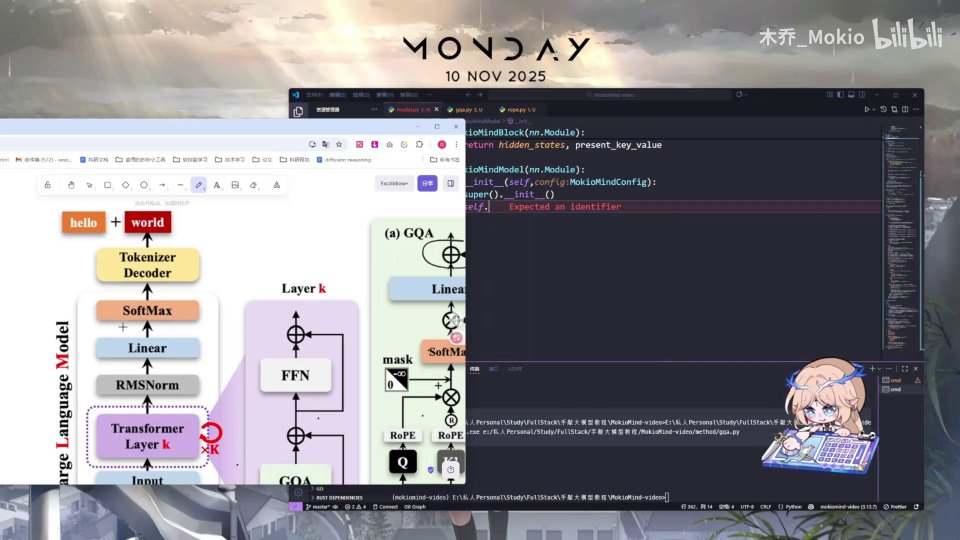
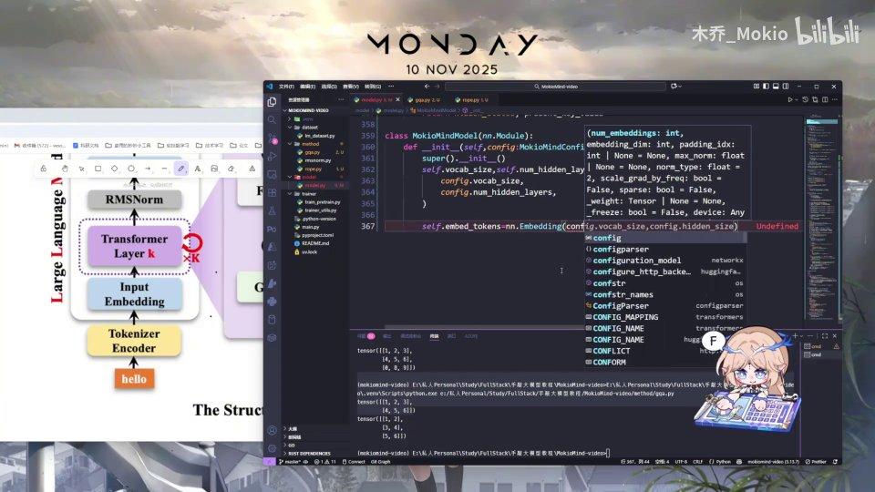
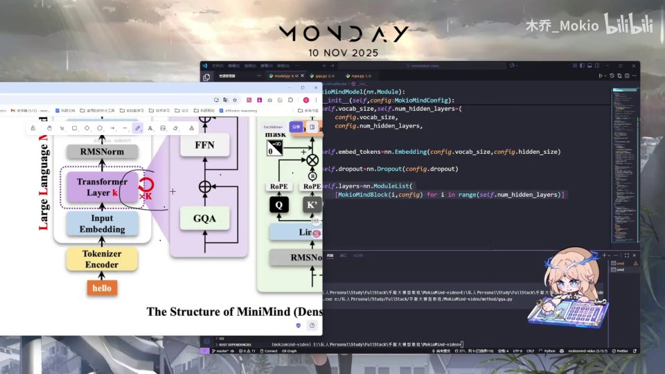
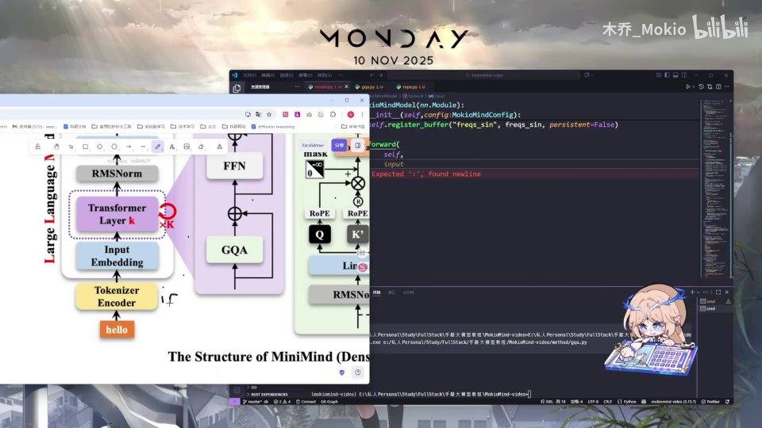
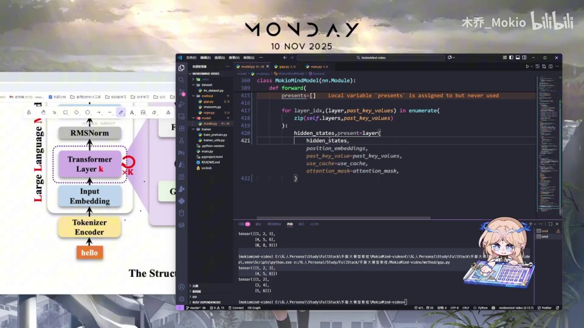
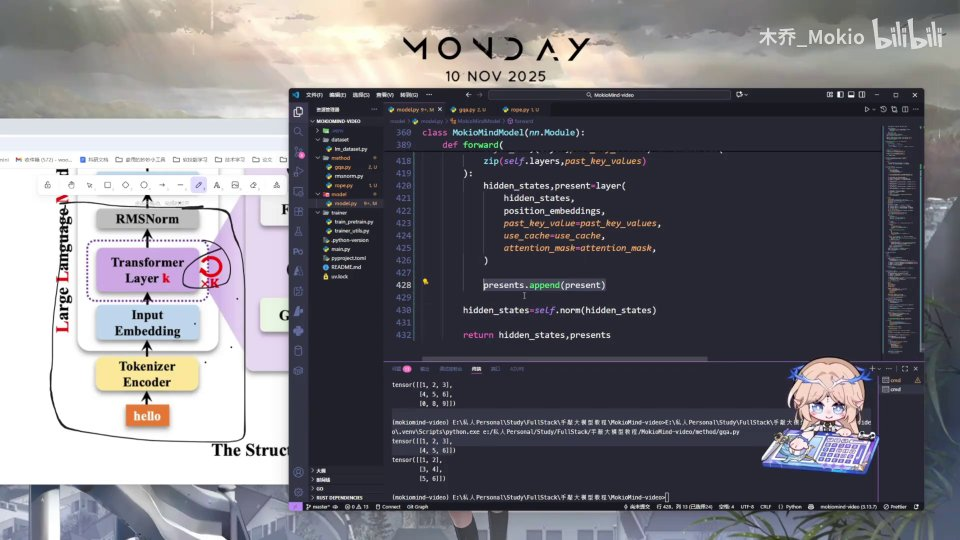

# 第17讲：组装——把 Block 拼成一个完整的 MiniMind 模型

## 本讲要解决的核心问题（SCQA）

**背景**：在前面的几讲里，我们已经把大模型的"零件"一个个写好了——负责注意力的 attention、负责前馈的 feed forward（FFN）、把两者包起来的 Block，以及 RoPE 位置编码需要的预计算。这些零件单独看都能用，但它们还散落在代码里，谁也没有把 token 真正变成模型输出。

**冲突**：零件再多，不组装就只是零件。一个完整的语言模型必须回答：token 进来之后，先经过什么、再经过什么、最后从哪里出去？中间的每一层如何接力？推理时每一步生成怎么复用上一步的计算？如果这些顺序或状态管理写错，模型要么跑不起来，要么每次都从头算、慢得不可接受。

**疑问**：这些写好的 Block 和相关模块，究竟要按什么顺序、用什么方式拼装成一个完整的 `MiniMindModel`？组装完之后，一次前向传播（forward）从头到尾到底发生了什么？

**回答（中心思想）**：组装分两大块——**在 `__init__` 里把"零件"备齐并登记好**（词嵌入、Dropout、K 个 Block、最终 RMSNorm，以及用 `register_buffer` 存下的 RoPE 预计算表），**在 `forward` 里把它们按"解析输入 → 定位起始位置 → 词嵌入 → 切位置编码 → 逐层循环并缓存 → 末尾归一化并返回"六步串起来**。本讲结束时，一个从 token id 到 hidden state、并支持 KV Cache 的模型主体框架就成型了；至于最后映射到词表、输出 softmax 的部分，留到后面的 CausalLM 里去完成。

---

## 一、总装图：模型是一条从 token 到 hidden state 的流水线

最激动人心的时刻来了：把前面写的所有东西应用起来，拼一个完整模型。作者的做法很直观——**左边放老师给的模型结构图，右边放代码编辑器，对照着图来写**。[【跳转到 00:00】](https://www.bilibili.com/video/BV1T2k6BaEeC/?p=17&t=0)


从这张结构图看，一个解码器（Decoder-only）式语言模型的主干，就是一条自下而上的流水线：

1. **Tokenizer / Input Embedding**：把输入的 token 变成向量；
2. **Transformer Block × K**：K 个结构相同的 Block 依次接力，每个 Block 内部又包含 RMSNorm、注意力（GQA）、FFN、以及 residual（残差）连接；
3. **RMSNorm**：所有 Block 之后再做一次归一化；
4. **Linear + SoftMax**：把 hidden state 映射到整个词表大小，输出下一个 token 的概率。

本讲要写的是第 2、3 层（也就是 `MiniMindBlock` 的堆叠加上最后的 RMSNorm），第 4 层（Linear + SoftMax）故意不在这里写。[【跳转到 10:22】](https://www.bilibili.com/video/BV1T2k6BaEeC/?p=17&t=622)

**为什么这样拆？** 因为"主干"和"输出头"是两种不同的东西：主干负责把输入反复加工成有语义的 hidden state，任何下游任务都能复用；而"映射到词表"这一步属于语言模型特有的输出头。把它们拆开，主干就能保持通用。

### 1.1 先分清"结构"和"参数"

初学者容易把"模型结构"和"模型参数"混为一谈。这里要建立一个关键观念：

- **结构**是"有哪些层、谁接谁"，写一次就固定了，对应代码里的一行行 `self.xxx = ...`；
- **参数**是每一层里的那些可训练数字（嵌入表、权重矩阵），它们的数量由结构决定，但数值是训练出来的。

本讲的组装，做的主要是**定义结构**；`register_buffer` 存的是"结构需要的常量"，而不是可训练参数。把这两者分清楚，后面看 `nn.Parameter` 和 `register_buffer` 的区别就水到渠成。

### 1.2 一次前向传播在做什么

用一句大白话概括整讲：**给模型一句话的 token 编号，让它把这串编号逐层加工，最后吐出一串同样长度、但更"有含义"的向量**。

举例：输入 `["我", "爱", "吃"]` 被编码成 `[12, 88, 305]`，模型输出是 3 个 `hidden_size` 维的向量；第 1 个向量偏向概括"我"，第 2 个偏向"我爱"，第 3 个偏向"我爱吃"。将来只要在最后一个向量上接一个 Linear + SoftMax，就能预测"下一个词"。这也是为什么讲者把输出头放到 CausalLM 里——**主干只管"理解"，输出头才负责"预测"**。

---

## 二、`__init__`：先把零件备齐、登记好

整个模型依旧是一个 `nn.Module` 的子类。作者把它命名为 `MiniMindModel`，让它继承 `nn.Module`，并且传入一个配置类 `MiniMindConfig`；在 `__init__` 里先调用父类的构造函数，完成 Python 模块的初始化。[【跳转到 00:17】](https://www.bilibili.com/video/BV1T2k6BaEeC/?p=17&t=17) [【跳转到 00:22】](https://www.bilibili.com/video/BV1T2k6BaEeC/?p=17&t=22)

> **术语：`nn.Module` 是什么？** 它是 PyTorch 里所有神经网络模块的基类。继承它之后，你定义的子模块（嵌入层、线性层、归一化层）只要赋值成 `self.xxx`，PyTorch 就会自动把它们登记下来，从而支持参数管理、`.to(device)`、保存/加载等一系列功能。


### 2.1 为什么先准备"词表大小"

作者解释：因为在最后一步我们需要把得到的 hidden state 映射到整个词表的大小上（这正是将来输出层要做的事），所以这里**先把词表大小等尺寸参数从 config 里取出来备用**。[【跳转到 00:47】](https://www.bilibili.com/video/BV1T2k6BaEeC/?p=17&t=47) [【跳转到 00:56】](https://www.bilibili.com/video/BV1T2k6BaEeC/?p=17&t=56)



这体现了写模型代码的一个好习惯：**尺寸、层数这类"超参数"统一从 config 读，而不是散落在代码各处**。这样换一个小模型或大模型，只改配置即可。

### 2.2 词嵌入：把 token id 变成向量

接下来是最基础的一层：把前面输入的 token 值转成向量。[【跳转到 01:01】](https://www.bilibili.com/video/BV1T2k6BaEeC/?p=17&t=61)

作者说这部分比较简单，就没有单独列出来讲。它做的事情可以概括成：**输入一个词表大小、一个嵌入维度，把每个 token 转化为一个对应的稠密向量**。[【跳转到 01:28】](https://www.bilibili.com/video/BV1T2k6BaEeC/?p=17&t=88)


这里用到的就是 `nn.Embedding`。理解它只需要一个类比：

> **类比**：把 `nn.Embedding` 想成一张巨大的查表。表的行数 = 词表大小（比如 6400），每行有 `hidden_size`（比如 768）个数。输入 token id 是"行号"，输出就是那一行的向量。训练时这些数值会被梯度更新，逐渐学到"语义相近的词，向量也相近"。

**只需要记住结论：经过这一层之后，我们的 id 就会变成一个向量了。** 注意此时向量的长度是 `hidden_size`，而输入的长度是序列长度——也就是说，形状从 `[batch, seq_len]` 变成了 `[batch, seq_len, hidden_size]`。

### 2.3 Dropout：随机"关掉"一部分神经元

然后定义一个 Dropout 层，和之前一样：`self.dropout = nn.Dropout(config.dropout)`。对输入的 id 进行一部分 dropout，相当于随机训练一部分神经元。[【跳转到 01:53】](https://www.bilibili.com/video/BV1T2k6BaEeC/?p=17&t=113) [【跳转到 06:39】](https://www.bilibili.com/video/BV1T2k6BaEeC/?p=17&t=399)



> **术语：Dropout 是什么？** 训练时它以一定概率把一部分神经元输出置零，迫使模型不要过度依赖某些固定通路，从而减轻过拟合；推理时它不生效。参数 `config.dropout` 就是这个"置零概率"。

### 2.4 用 `nn.ModuleList` 堆叠 K 个 Block

最关键的零件来了：中间的层。作者用一个 `nn.ModuleList` 来装它们。[【跳转到 01:53】](https://www.bilibili.com/video/BV1T2k6BaEeC/?p=17&t=113)

> **术语：`nn.ModuleList` 是什么？** 顾名思义，它就是一个 `nn.Module` 的**列表**，作用是"把多个 layer 放到一起"。它和普通 Python list 的区别是：放进 `ModuleList` 里的子模块会被 PyTorch 正确登记为模型参数。**隐藏层有多少层，就重复插入多少个 Block**。[【跳转到 02:18】](https://www.bilibili.com/video/BV1T2k6BaEeC/?p=17&t=138) [【跳转到 02:43】](https://www.bilibili.com/video/BV1T2k6BaEeC/?p=17&t=163)

![self.layers = nn.ModuleList([MiniMindBlock(...) for ...])：用列表推导式一次生成 K 个 Block](assets/第17讲_组装：Model/00138.jpg)

用一行列表推导式就能搞定：`self.layers = nn.ModuleList([MiniMindBlock(config) for _ in range(config.num_hidden_layers)])`。这里 `num_hidden_layers` 就是结构图里那个 **×K** 的 K。这样每个 Block 都共用同一份结构，但各自拥有独立的参数（不会互相共享权重）。

作者随后也把 norm 层简单写了一下——它就是最终那个 RMSNorm，等会 forward 结尾才会用到。[【跳转到 02:48】](https://www.bilibili.com/video/BV1T2k6BaEeC/?p=17&t=168)

---

## 三、RoPE 预计算与 `register_buffer`：把旋转值存成随模型走的常量

### 3.1 为什么要在初始化时就预计算 RoPE

接下来这一步是优化，也就是 **RoPE 预计算**。作者说得很清楚：这样预计算一次，**可以保证 RoPE 的所有旋转值都是固定的，在计算时避免重复计算**。[【跳转到 02:53】](https://www.bilibili.com/video/BV1T2k6BaEeC/?p=17&t=173)



> **术语：RoPE（旋转式位置编码）是什么？** 它让模型知道 token 在句子中的位置。做法是把 Query 和 Key 向量按位置"旋转"一个角度，位置越靠后旋转越大。而"每个位置对应的 cos/sin 值"跟输入内容无关，只跟位置和维度有关，所以**完全可以在初始化时一次性算好、缓存起来，之后每次 forward 直接查**，不必每层每步重算。

这就是典型的"用空间换时间"：预计算表只占一点显存，却省掉了每次前向传播里大量重复的三角函数运算。

### 3.2 `nn.Parameter` 和 `register_buffer` 的区别

算好之后要把这些东西"填进去"保存。作者在这里强调了一个非常重要、也很容易混的区分：[【跳转到 03:18】](https://www.bilibili.com/video/BV1T2k6BaEeC/?p=17&t=198)

- **`nn.Parameter`**：相当于"给模型一个参数"，它会被优化器更新；
- **`register_buffer`**：注册一个缓冲区，**它不会被优化器更新，但会随着模型一起保存和加载**。


**为什么必须用 `register_buffer` 而不是普通变量？** 因为普通 Python 变量不会被 `state_dict` 记录：模型存盘时它丢了，换设备（`.to(device)`）时它也不会跟着搬过去。RoPE 的 cos/sin 表是"常量但需要跟着模型走"，缓冲区正好符合这个定位：不训练、但要保存、要随模型迁移。

---

## 四、`forward`：一次前向传播的六个阶段

初始化把零件备齐后，最中心、最需要讲清楚的逻辑就是 `forward`。[【跳转到 03:43】](https://www.bilibili.com/video/BV1T2k6BaEeC/?p=17&t=223)

### 4.1 输入输出总览

输入是把 token 经过 tokenizer 之后得到的一串 id（`input_ids`），输出则是加工好的 hidden state。[【跳转到 03:43】](https://www.bilibili.com/video/BV1T2k6BaEeC/?p=17&t=223)

### 4.2 解析输入签名：兼容 HuggingFace

先来看 `forward` 的签名。除了 `self` 和 `input_ids`，还有几个参数：`input_ids` 是 optional 的 `torch.Tensor`，默认 `None`；`attention_mask`、`past_key_values` 也是这样。[【跳转到 04:12】](https://www.bilibili.com/video/BV1T2k6BaEeC/?p=17&t=252)



后面还有 `use_cache`（一个 bool）以及 `**kwargs`——作者解释说，**`**kwargs` 用来接收其他可能的关键词参数，主要是为了兼容性**。[【跳转到 04:37】](https://www.bilibili.com/video/BV1T2k6BaEeC/?p=17&t=277) 这种写法能让我们的模型接口和 HuggingFace 等生态里的调用方式对齐，别人按标准方式调用时不会因为多传/少传参数而报错。

### 4.3 解包形状与 HuggingFace 属性兼容

forward 写好之后，就按后面的逻辑往后写。首先依旧是**把输入解包出来**：`batch_size, seq_len = input_ids.shape`。[【跳转到 04:37】](https://www.bilibili.com/video/BV1T2k6BaEeC/?p=17&t=277)


接着有一个 `if hasattr(...)`：它用来**检查某个对象是否具有某个属性**——这里检查 `past_key_values` 是否有 `layers` 属性。[【跳转到 05:02】](https://www.bilibili.com/video/BV1T2k6BaEeC/?p=17&t=302) 作者特别说明，这是用来处理 **HuggingFace 的格式兼容性问题**，暂时不需要太在意，跟着写就好。核心思想是：当传入的对象是 HF 风格的结构时，先把它规整成我们内部期望的格式。

### 4.4 计算起始位置 `start_pos`：KV Cache 的关键

接下来要计算当前生成的起始位置 `start_pos`。作者解释了原因：**我们每次都是基于当前生成的位置去生成**，所以必须先算出当前位置在哪里。[【跳转到 05:52】](https://www.bilibili.com/video/BV1T2k6BaEeC/?p=17&t=352)

![start_pos = past_key_values[0][0].shape[1] if ... else 0](assets/第17讲_组装：Model/00424.jpg)

逻辑是这样的：

- 如果**有之前的 KV**（比如逐字生成时，前面 token 的 Key/Value 已经缓存好了），那么 `start_pos` 就等于已缓存序列的长度——我们**从之前 KV 的下一个位置开始算**；[【跳转到 05:52】](https://www.bilibili.com/video/BV1T2k6BaEeC/?p=17&t=352)
- 如果**没有之前的 K 和 V**，那就说明我们在开头，`start_pos = 0`。[【跳转到 06:31】](https://www.bilibili.com/video/BV1T2k6BaEeC/?p=17&t=391)

> **术语：KV Cache 是什么？** 自回归生成时，每生成一个 token 都要重新做一遍注意力。但前面 token 的 Key/Value 其实没变，于是把它们缓存下来，下一步只算新 token 的 Q、K、V，再和缓存拼接即可。`start_pos` 就是告诉位置编码"这次从第几个位置开始"，避免每次从零重算。

### 4.5 词嵌入 + Dropout，得到 hidden_states

然后用很直接的一行得到 hidden state：`hidden_states = self.dropout(self.embed_tokens(input_ids))`——先查表把 id 变成向量，再过一层 Dropout。[【跳转到 06:39】](https://www.bilibili.com/video/BV1T2k6BaEeC/?p=17&t=399)

### 4.6 切出位置编码

接着应用位置编码。**要应用的位置编码范围，是从起始位置到这个序列长度**，这样才能保证位置编码正确地、逐段地应用到当前这一段输入上。[【跳转到 06:39】](https://www.bilibili.com/video/BV1T2k6BaEeC/?p=17&t=399) 于是对之前缓存好的 `freqs_cos`、`freqs_sin` 按 `start_pos` 切片：

![position_embeddings = (self.freqs_cos[start_pos:start_pos+seq_len], self.freqs_sin[...])](assets/第17讲_组装：Model/00449.jpg)

**为什么可以切片？** 因为位置编码表在初始化时已经预计算好了所有位置，forward 时只是按需取"第 start_pos 到 start_pos+seq_len"这一段，不必重算。

### 4.7 把"形状流转"画出来

只看变量名容易迷糊，我们把一次前向里张量形状的变化列成一张表（设 batch=2、序列长度=8、hidden=768、词表=6400）：

| 步骤 | 变量 | 形状 | 含义 |
| --- | --- | --- | --- |
| 输入 | `input_ids` | `[2, 8]` | 2 句话，每句 8 个 token id |
| 词嵌入 | `hidden_states` | `[2, 8, 768]` | 每个 id 变成 768 维向量 |
| 位置编码 | `position_embeddings` | `[2, 8, head_dim/2]` ×2 | 从预计算表切出 8 个位置 |
| 逐层加工 | `hidden_states` | `[2, 8, 768]` | 形状不变，内容不断被更新 |
| 末尾归一化 | `hidden_states` | `[2, 8, 768]` | 输出给下游 |
| 输出头（下一讲） | logits | `[2, 8, 6400]` | 每个位置对 6400 个词的打分 |

**记住两个要点**：第一，**主干里的每一步都保持 `[B, L, H]` 形状不变**，变的只是数值——这正是残差连接带来的好处，也是为什么 K 个 Block 能直接首尾相接；第二，词表和序列长度是两个不同的维度，`L` 是"有几个位置"，词表是"每个位置最后要在多少个候选词里选"。

### 4.8 `attention_mask` 是做什么的

签名里的 `attention_mask` 也不用怕。它和 `input_ids` 形状相同（`[B, L]`），里面是 0/1：

- 值为 1 表示"这个位置是真实 token，可以被注意"；
- 值为 0 表示"这个位置是补齐（padding）出来的，应当被屏蔽"。

**为什么需要它？** 同一批里不同句子长度不同，短句要补齐到等长；如果不管补齐位，注意力会把"空白"也当成有意义的内容。`attention_mask` 就是告诉注意力"哪些位置别理"。它最终被一路传进每个 Block，参与注意力计算。

---

## 五、逐层循环：K 个 Block 接力，并维护缓存

### 5.1 准备一个最简单的缓存与迭代器

作者先创建一个最简单的 `kv_cache` 缓存，**用一个最简单的列表来实现**，然后进入 `for` 循环。[【跳转到 07:04】](https://www.bilibili.com/video/BV1T2k6BaEeC/?p=17&t=424)

迭代时用到了 `enumerate(zip(self.layers, past_key_values))`：



作者解释 `enumerate` 是 Python 的语法，**把可迭代对象打包成一组带下标的元组**；`zip` 则把层和它对应的历史缓存配对，这样循环时既有"第几层"、又有"这一层的 layer 和 past_key_value"。[【跳转到 07:29】](https://www.bilibili.com/video/BV1T2k6BaEeC/?p=17&t=449)

> **术语：`zip` 和 `enumerate` 是什么？** `zip(a, b)` 把两个序列按位置配对成 `(a0,b0), (a1,b1)…`；`enumerate(x)` 给每个元素加上从 0 开始的序号。两者合起来，就能同时拿到"层对象、它的缓存、它的编号"。

### 5.2 把每一层需要的东西都喂进去

对每一层调用 `layer(...)`，传入当前 hidden_states、位置编码、`past_key_value`、`use_cache`、`attention_mask` 等——**把上一讲 Block 定义好的接口，在这里原样对接**。[【跳转到 08:30】](https://www.bilibili.com/video/BV1T2k6BaEeC/?p=17&t=510)


Block 返回两个东西：更新后的 `hidden_states`，以及本层的新缓存 `present`。**这个 layer 就是上面 K 次循环里那个 Block**——前面用 `ModuleList` 堆了 K 个，这里就一个一个接力。[【跳转到 07:54】](https://www.bilibili.com/video/BV1T2k6BaEeC/?p=17&t=474) [【跳转到 08:19】](https://www.bilibili.com/video/BV1T2k6BaEeC/?p=17&t=499)

### 5.3 把新缓存 append 进列表

算完之后做最简单的缓存更新：**把这一层的 `present` 添加到列表末尾**。[【跳转到 08:30】](https://www.bilibili.com/video/BV1T2k6BaEeC/?p=17&t=510) [【跳转到 11:22】](https://www.bilibili.com/video/BV1T2k6BaEeC/?p=17&t=682) 这样下一层、乃至下一次 forward，就能直接复用这些缓存的 K/V，而不必重算。

### 5.4 一次逐字生成的完整推演

为了把 `start_pos` 和缓存讲透，我们推演"输入'我爱'，接着生成'吃'"这个过程：

- **第一步（prefill，预填充）**：把 `["我", "爱"]` 两个 token 一起喂进去。此时 `past_key_values` 为空，`start_pos = 0`，位置编码取第 0、1 两个位置。模型算出两个 token 的 hidden state，并在每层留下这两个位置的 K/V 缓存，`presents` 里存了 `[K, V]`。
- **第二步（decode，解码）**：从上一步的最后一个 hidden state 预测出下一个 token 是"吃"。把"吃"这**一个** token 再喂进去。此时 `past_key_values` 已经有长度 2 的缓存，于是 `start_pos = 2`，位置编码只取第 2 个位置——**只看新增的这一个 token**。注意力用"吃"的 Query 去和缓存里"我、爱、吃"的 Key 做匹配，得到上下文感知的表示，再把新的 K/V 追加进缓存。

如果没有 KV Cache，第二步就要把"我爱吃"整个序列从头重算，序列越长浪费越大。而有了这套 `start_pos` + `presents` 的机制，每解码一个 token，计算量都只和"新 token 数"成正比，而不是"总长度"。**这就是组装时必须把缓存逻辑写进 forward 的原因。**

> 注意：作者在这里是**先做最终 RMSNorm 的规划**，把它放在循环之后统一处理——但此刻代码里还没真正写输出层。

---

## 六、收尾：末尾 RMSNorm、返回，以及模型的边界

循环结束后，把输出的 hidden_states 过一个 norm 层，也就是 `self.norm(hidden_states)`。[【跳转到 08:55】](https://www.bilibili.com/video/BV1T2k6BaEeC/?p=17&t=535) [【跳转到 09:00】](https://www.bilibili.com/video/BV1T2k6BaEeC/?p=17&t=540) [【跳转到 09:05】](https://www.bilibili.com/video/BV1T2k6BaEeC/?p=17&t=545)


> **术语：RMSNorm 是什么？** 一种归一化层，把每个 token 的 hidden 向量按均方根缩放，稳定数值、加速收敛。放在所有 Block 之后，是 LLaMA 系模型的常规做法。

**这里先不处理 Linear、SoftMax。** 作者明确说：这两个操作留到后面的循环/后面的模块里再处理。[【跳转到 09:18】](https://www.bilibili.com/video/BV1T2k6BaEeC/?p=17&t=558) [【跳转到 09:26】](https://www.bilibili.com/video/BV1T2k6BaEeC/?p=17&t=566)



**边界非常清晰：**

- 本讲写完的模型主干，**一直做到 RMSNorm 这一层**；[【跳转到 10:16】](https://www.bilibili.com/video/BV1T2k6BaEeC/?p=17&t=616)
- 后面的 **Linear 层和 SoftMax 层，在后面的 CausalLM 里去实现**。[【跳转到 10:22】](https://www.bilibili.com/video/BV1T2k6BaEeC/?p=17&t=622)

至此，模型的主体框架就搭好了。它的产出是一串 hidden state（以及各层的 KV 缓存），这已经是"理解语言"的中间表示；至于怎么把它变成"下一个词的概率"，属于输出头的工作。

---

## 七、为什么这样设计：三个值得记住的取舍

组装代码不只是"把零件摆上去"，每一步背后都有取舍。理解了这些取舍，才算真正读懂模型。

### 7.1 预计算 vs 实时计算

RoPE 的 cos/sin 若放在 forward 里现算，每层、每一步、每个位置都要重复调用三角函数，浪费严重。**把它挪到 `__init__` 预计算一次，就变成了"一次算、多次查表"**。代价是初始化时多做一点、显存多占一点；收益是训练和推理的每一次前向都快一点。对要反复跑成千上万步的模型来说，这笔账非常划算。

### 7.2 训练参数 vs 缓存常量

模型里的张量按"是否参与训练"分两类：`nn.Parameter`（会被优化器更新）和 buffer（不更新、但要保存迁移）。**RoPE 的 cos/sin 属于后者**——它不该被梯度改变，却又必须随模型走，所以 `register_buffer` 是唯一正确的位置。若把它写成普通变量，保存时会丢、换设备时不会跟着搬，推理就会出错。

### 7.3 用列表维护 KV Cache 的简单与正确

作者用"最简单的列表"来存缓存：每过一层就 `append` 一个 `present`。这个做法看起来朴素，却完全正确——因为**缓存的顺序必须和层的顺序严格一致**：第 i 层的 K/V 只能喂回第 i 层。列表天然保证了这个顺序，`enumerate(zip(self.layers, past_key_values))` 又把"层"和"它对应的历史缓存"一一配对，逻辑上不会错位。

**一个容易踩的坑**：`start_pos` 必须和缓存长度一致。如果历史缓存有 5 个位置，而你从 0 开始算位置编码，就会把"第 0 个位置"的旋转角度套到"第 6 个 token"上，结果全乱。这就是为什么 forward 一开始就要算出 `start_pos`。

---

## 八、复盘：组装逻辑一条线顺下来

作者最后带着大家把整条流程又理了一遍。[【跳转到 10:28】](https://www.bilibili.com/video/BV1T2k6BaEeC/?p=17&t=628)

**初始化阶段：**
1. 从 config 取尺寸参数（vocab_size 等）；
2. 定义词嵌入、Dropout、K 个 Block、最终 RMSNorm；
3. **把 RoPE 位置编码预计算一次，并用 `register_buffer` 注册成缓冲区保存下来**——常量、不训练、随模型走。

**前向传播阶段：**
1. 先**计算起始位置** `start_pos`；
2. 在**输入的 token 处做词嵌入 + Dropout**；[【跳转到 10:58】](https://www.bilibili.com/video/BV1T2k6BaEeC/?p=17&t=658)
3. 从开头到整个序列结束，**把位置编码切出来**；
4. 用一个 `present` 列表做**简单的缓存**；
5. 对每一层**执行一次 layer 的处理**；[【跳转到 11:04】](https://www.bilibili.com/video/BV1T2k6BaEeC/?p=17&t=664)
6. **重复 K 次，每次都把 `present` append 进去**；[【跳转到 11:22】](https://www.bilibili.com/video/BV1T2k6BaEeC/?p=17&t=682)
7. 最后 **hidden_states 经过 RMSNorm 处理后返回**。[【跳转到 11:27】](https://www.bilibili.com/video/BV1T2k6BaEeC/?p=17&t=687)

下一块，我们就真正把这个模型给封顶完成。[【跳转到 11:35】](https://www.bilibili.com/video/BV1T2k6BaEeC/?p=17&t=695)

---

## 九、把组装逻辑写成伪代码

最后，我们把整讲的内容压缩成一段带注释的伪代码，方便你对照复习。看代码时不必纠结每个细节，只关注"顺序"和"状态"这两件事。

```python
class MiniMindModel(nn.Module):
    def __init__(self, config):
        super().__init__()
        # 1) 取出需要的尺寸与层数
        self.vocab_size = config.vocab_size
        self.num_hidden_layers = config.num_hidden_layers

        # 2) token id -> 稠密向量
        self.embed_tokens = nn.Embedding(config.vocab_size, config.hidden_size)
        # 3) 防过拟合
        self.dropout = nn.Dropout(config.dropout)
        # 4) 堆叠 K 个完全相同的 Block（参数互相独立）
        self.layers = nn.ModuleList(
            [MiniMindBlock(config) for _ in range(self.num_hidden_layers)]
        )
        # 5) 主干末尾的归一化
        self.norm = RMSNorm(config.hidden_size, eps=config.rms_norm_eps)

        # 6) 预计算 RoPE，并登记为"随模型走但不训练"的缓冲区
        freqs_cos, freqs_sin = precompute_freqs_cis(...)
        self.register_buffer("freqs_cos", freqs_cos, persistent=False)
        self.register_buffer("freqs_sin", freqs_sin, persistent=False)

    def forward(self, input_ids, attention_mask=None,
                past_key_values=None, use_cache=False, **kwargs):
        # 解包输入形状：批大小与序列长度
        batch_size, seq_len = input_ids.shape

        # 兼容 HuggingFace 传入的 past_key_values 结构
        if hasattr(past_key_values, "layers"):
            past_key_values = None
        # 没有历史缓存时，补齐成"每层一个 None"
        past_key_values = past_key_values or [None] * len(self.layers)

        # 起点：有缓存就从缓存长度接着算，否则从 0 开始
        start_pos = (
            past_key_values[0][0].shape[1]
            if past_key_values[0] is not None else 0
        )

        # token -> 向量，再过 Dropout
        hidden_states = self.dropout(self.embed_tokens(input_ids))

        # 按起点切出这一段需要的位置编码
        position_embeddings = (
            self.freqs_cos[start_pos:start_pos + seq_len],
            self.freqs_sin[start_pos:start_pos + seq_len],
        )

        presents = []
        # 逐层接力：每层拿上一层的 hidden_states，产出新的 hidden_states 和本层缓存
        for layer_idx, (layer, past_key_value) in enumerate(
                zip(self.layers, past_key_values)):
            hidden_states, present = layer(
                hidden_states,
                position_embeddings,
                past_key_value,
                use_cache,
                attention_mask,
            )
            presents.append(present)

        # 末尾归一化，返回 hidden_states 和全部缓存
        hidden_states = self.norm(hidden_states)
        return hidden_states, presents
```

**读这段伪代码的三个抓手：**

1. **`__init__` 决定"有哪些零件"**：嵌入、Dropout、K 个 Block、一个最终 Norm，外加一张 RoPE 表。
2. **`forward` 决定"零件怎么排队"**：解析输入 → 定起点 → 嵌入 → 切位置编码 → 逐层循环 → 归一化 → 返回。
3. **`present`/`past_key_values` 决定"状态怎么传"**：历史缓存从参数进来、在循环里被逐层使用、新的缓存被收集后返回，形成闭环。

> 提示：这段主干代码里没有、也不需要额外的"花活"——本讲严格只拼主干。至于输出头怎么把 hidden state 映射到词表、要不要复用嵌入矩阵，那是后续内容要回答的问题。

## 小结

- **组装分两块**：`__init__` 备零件，`forward` 串流程；本讲得到的是"模型主干"，输出头留给 CausalLM。
- **`nn.Embedding`** 把 token id 查表变成 `hidden_size` 维的稠密向量；**`nn.Dropout`** 按概率随机置零以防过拟合。
- **`nn.ModuleList`** 把结构相同的 Block 堆叠 K 次；K 由 `config.num_hidden_layers` 决定。
- **RoPE 预计算 + `register_buffer`**：旋转值只与位置有关，初始化时算一次存成缓冲区；它不被优化器更新，但会随模型保存、加载、迁移设备。
- **`nn.Parameter` vs `register_buffer`**：前者参与训练更新，后者是随模型走的常量。
- **`start_pos` 是 KV Cache 的接口**：有缓存就从缓存长度处接着算，没有就从 0 开始；位置编码按 `start_pos` 切片。
- **forward 主循环**：词嵌入 → 位置编码 → 逐层 `layer(...)` → append `present` → 末尾 RMSNorm → 返回 `(hidden_states, presents)`。
- **兼容性设计**：`**kwargs` 与 `hasattr` 检查用于对接 HuggingFace 风格的调用。

## 关键术语速查

| 术语 | 一句话解释 |
| --- | --- |
| `nn.Module` | PyTorch 所有网络模块的基类，继承后自动登记子模块与参数 |
| `nn.Embedding` | 词嵌入层，把 token id 查表映射成稠密向量，形状 `[B, L] → [B, L, H]` |
| `nn.Dropout` | 训练时按概率随机置零神经元、抑制过拟合；推理时不生效 |
| `nn.ModuleList` | 存放多个子模块的"列表"，保证它们被登记为模型参数 |
| hidden state | 主干网络逐层加工后的中间表示，尚未映射到词表 |
| RoPE | 用旋转方式注入位置信息的位置编码，cos/sin 只与位置有关 |
| `register_buffer` | 注册"不训练但随模型保存/迁移"的常量张量 |
| `nn.Parameter` | 会被优化器更新的可训练参数 |
| `input_ids` | 经 tokenizer 编码后的一串 token 编号 |
| `past_key_values` | 之前各层缓存的 Key/Value，供自回归生成复用 |
| `start_pos` | 当前这一步的起始位置，决定位置编码从哪切片、KV 从哪接着算 |
| KV Cache | 缓存历史 token 的 K/V，避免生成时重复计算 |
| `attention_mask` | 标记哪些位置需要被注意力关注的掩码 |
| RMSNorm | 按均方根缩放的归一化层，稳定训练 |
| CausalLM | 因果语言模型输出头，负责把 hidden state 映射到词表并输出概率 |
