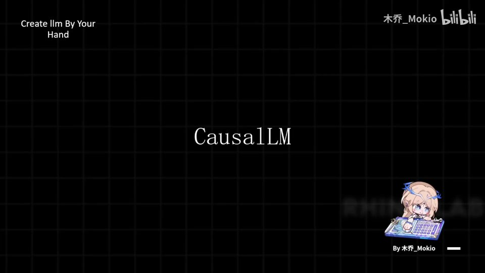
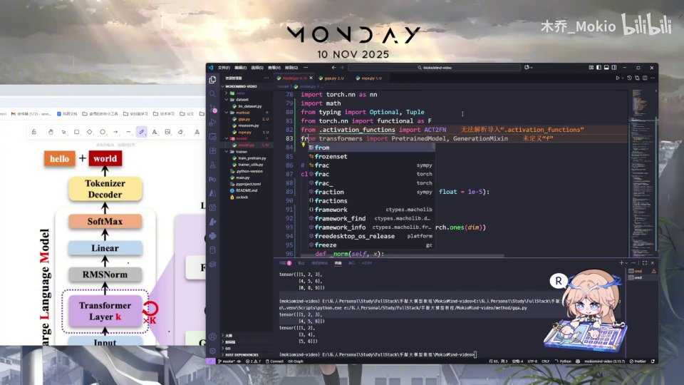
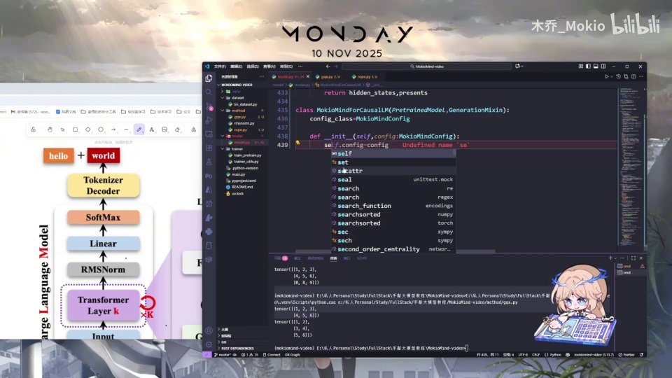
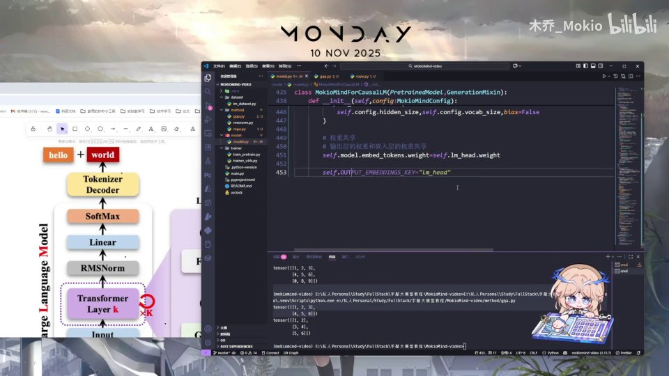
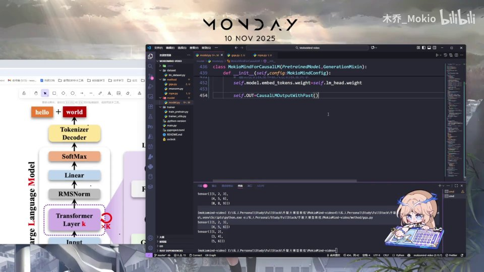
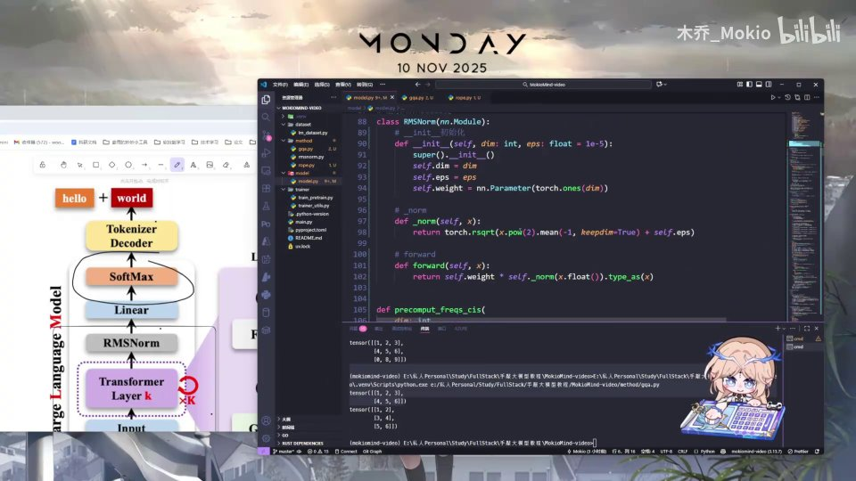

# 第18讲：封装 CausalLM —— 让自研模型融入 HuggingFace 生态

## 本讲要解决的核心问题（SCQA）

**背景**：前面十几讲，我们已经把 Transformer 的零件逐个手写完了——Embedding、RoPE 位置编码、RMSNorm、GQA 多头注意力、SwiGLU 前馈网络，最后把它们组装成一个可以跑通的 `MiniMindModel`。这个类内部堆叠了若干层 TransformerBlock，最后输出一组隐藏态（hidden states），已经是一个功能完整的 PyTorch 模块。

**冲突**：但能算出隐藏态，并不等于"好用"。它还只是一个"裸模型"：不能直接调用 `generate()` 来自回归地生成文本，不兼容 HuggingFace 的 `from_pretrained()` / `save_pretrained()` 生态，也无法把权重上传到模型社区让别人一键加载。更关键的是，隐藏态只是每个 token 的一串数字，还没有被翻译成"词表里每个词的概率"。

**疑问**：怎样把自研模型封装成一个标准的因果语言模型？要继承哪些基类？语言头（lm_head）怎么加？权重共享是什么、有什么用？`forward` 里都做了什么？输出对象为什么要用 HuggingFace 的类？`logits_to_keep` 又是干什么的？

**回答（中心思想）**：本讲用一个 `MiniMindForCausalLM(PreTrainedModel, GenerationMixin)` 类，把前面的 `MiniMindModel` 封装成标准的因果语言模型——它继承 HuggingFace 的两个内置基类以获得配置管理与文本生成能力，在 `__init__` 里加语言头并做权重共享，在 `forward` 里调主干、算 logits、按需切片，最后用 `CausalLMOutputWithPast` 统一封装输出。写到这里，整个 Minimind 的模型代码就全部完成了。

---

## 一、裸模型和标准模型差在哪



先把"封装"这件事说清楚。所谓因果语言模型（Causal Language Model，简称 CausalLM），就是**自回归地"用前面的词预测下一个词"的语言模型**。"因果"指的是注意力只能看左边（已经出现的 token），不能偷看右边（未来 token），这也正是我们在 GQA 里做因果 mask 的原因。

我们前面写的 `MiniMindModel` 只负责"把输入 token 变成隐藏态"，它回答的是"这句话里每个位置我理解到了什么"。但一个真正能生成文本的模型，还必须回答"下一个词最可能是谁"，并且要能和整个开发生态对接。

这两件事就是本讲封装要补上的：[【跳转到 00:00】](https://www.bilibili.com/video/BV1T2k6BaEeC/?p=18&t=0)

1. **能力补齐**：加一个语言头，把隐藏态映射到整个词表上，得到每个词的概率；
2. **生态对接**：让它继承 HuggingFace 的标准基类，从而具备配置管理、权重存取、`generate()` 生成等能力。

用一个比喻：前面的 `MiniMindModel` 像一台自制的发动机，性能没问题；本讲做的是给它装上标准接口的底盘、方向盘和油箱盖，让它能开上公路、能进任何一家 4S 店维修保养。视频里说得很直白——**就是让它和 HuggingFace 提供的一些类做一个标准化**。[【跳转到 00:06】](https://www.bilibili.com/video/BV1T2k6BaEeC/?p=18&t=6)


从上图可以看到，左侧那张"Large Language Model"结构图其实已经画出了完整的推理链路：输入 `hello` 经 Tokenizer Encoder 变成 token，进入 Input Embedding，穿过 K 层 Transformer Layer，再经过 RMSNorm、Linear、SoftMax，最后由 Tokenizer Decoder 输出 `world`。本讲要写的，正是图里 **Linear → SoftMax** 这一段（也就是语言头），以及把它和 HuggingFace 标准对齐的外壳。

---

## 二、继承两个标准父类：PreTrainedModel 与 GenerationMixin

写类永远从"继承 + 初始化"开始。第一步先写 `class`，但继承的对象一开始容易写错——很多人的第一反应是继承 `nn.Module`，毕竟前面每个模块都是这么写的。[【跳转到 00:11】](https://www.bilibili.com/video/BV1T2k6BaEeC/?p=18&t=11)

视频里特意纠正了这一点：**不能继承 `nn.Module`**，而应该继承 HuggingFace 提供的 `PreTrainedModel` 和 `GenerationMixin`。[【跳转到 00:36】](https://www.bilibili.com/video/BV1T2k6BaEeC/?p=18&t=36)

```python
from transformers import PreTrainedModel, GenerationMixin

class MiniMindForCausalLM(PreTrainedModel, GenerationMixin):
    ...
```


为什么要继承这两个类？因为它们都是 HuggingFace 内置的标准类，**你可以理解为：要上传到网上的模型，都需要继承这两个类**。它们的分工是：[【跳转到 01:01】](https://www.bilibili.com/video/BV1T2k6BaEeC/?p=18&t=61)

1. **`PreTrainedModel`**：定义模型的基础标准，提供一系列管理与配置相关的功能，比如 `save_pretrained()`、`from_pretrained()`、设备迁移、参数初始化等；
2. **`GenerationMixin`**：提供一个 `generate()` 文本生成方法，让模型可以直接自回归地"续写"。

这两个能力——可管理、可生成——是"现代模型都需要具备"的。继承之后，我们的模型就能无缝接入 HuggingFace 的整套工具链。



还有一个细节：类里要声明 `config_class = MiniMindConfig`，告诉父类"我的配置类长什么样"，这样 `from_pretrained()` 才能自动找到并实例化正确的配置。[【跳转到 01:26】](https://www.bilibili.com/video/BV1T2k6BaEeC/?p=18&t=86)

```python
class MiniMindForCausalLM(PreTrainedModel, GenerationMixin):
    config_class = MiniMindConfig
```


---

## 三、__init__：先存配置，再建主干

进入 `__init__`。封装的核心在这里：把配置存好、把主模型实例化、再加语言头。顺序很重要。

```python
def __init__(self, config: MiniMindConfig):
    self.config = config
    super().__init__(config)
    self.model = MiniMindModel(config)
```

第一句先把传进来的 `config` 存到 `self.config`，紧接着才调用 `super().__init__(config)`。**顺序不能反**——因为父类的构造函数需要用到我们自己定义的模型的配置信息，所以必须放在 `self.config = config` 之后。[【跳转到 01:51】](https://www.bilibili.com/video/BV1T2k6BaEeC/?p=18&t=111)

配好之后，实例化我们上一阶段写好的主干模型，把 config 传进去：

```python
self.model = MiniMindModel(config)
```

注意这里用的是组合（composition）而不是继承：`MiniMindForCausalLM` 内部"持有"一个 `MiniMindModel`。主模型负责把 token 变成隐藏态，外层负责把它变成词表概率，职责分离得很清楚。



---

## 四、语言头 lm_head：从隐藏态到词表概率

主模型建好之后，就到了本讲最重要的一步——**加语言头**。

语言头（language head，代码里叫 `lm_head`）就是我前面所说的那件事：**用一个 Linear 层，把上面算出的隐藏态映射到整个词表上，得到每个词的概率关系**。[【跳转到 02:16】](https://www.bilibili.com/video/BV1T2k6BaEeC/?p=18&t=136)

```python
self.lm_head = nn.Linear(config.hidden_size, config.vocab_size, bias=False)
```

拆开看这个线性层：

- 输入维度是 `config.hidden_size`，也就是隐藏态的长度。在 Minimind 里 hidden_size 是 **512**，所以从主模型出来的是一个 512 维的向量；
- 输出维度是 `config.vocab_size`，也就是词表大小。Minimind 的词表有 **6400** 个词；
- 和前面各种层一样，**不使用 bias（偏置）**。

于是，一个 512 维的隐藏态就被映射到 6400 个词上，每个词得到一个分数（logit）。这个分数经过 softmax 之后，就变成了每个词的概率。比如模型读到某个上下文后，`hello` 这个词的概率可能被标成 0.7。[【跳转到 02:49】](https://www.bilibili.com/video/BV1T2k6BaEeC/?p=18&t=169)

一句话概括这条链路：

```
隐藏态 (512 维)  --lm_head-->  logits (6400 维)  --softmax-->  每个词的概率
```


---

## 五、权重共享：让输出层复用嵌入层权重

语言头建好之后，视频里紧接着写了一句看起来不起眼、但很关键的代码：

```python
self.model.embed_tokens.weight = self.lm_head.weight
self._tied_weights_keys = ["lm_head.weight"]
```

这一步用到了一个叫**权重共享（weight tying）**的概念：**让最后输出层的权重和嵌入层的权重用同一个**。[【跳转到 03:08】](https://www.bilibili.com/video/BV1T2k6BaEeC/?p=18&t=188)

为什么可以共享？想一下两个矩阵的形状：

- 嵌入层 `embed_tokens` 要把"词 ID"变成"512 维向量"，它的权重形状是 `[vocab_size, hidden_size]`；
- 语言头 `lm_head` 要把"512 维向量"映射回"每个词的分数"，它的权重形状是 `[vocab_size, hidden_size]`。

两者**形状完全一致**，而且语义是对偶的：一个负责"词 → 向量"，一个负责"向量 → 词"。既然形状一样，就没有必要再单独维护一份参数。共享之后有两个直接好处：[【跳转到 03:33】](https://www.bilibili.com/video/BV1T2k6BaEeC/?p=18&t=213)

1. **省参数**：不用再多计算、多存储一个 weight，计算时更简单；
2. **省显存、推理更轻松**：权重少一份，推理时的开销也更小。

`self._tied_weights_keys = ["lm_head.weight"]` 是给 HuggingFace 的"暗号"：告诉它在保存和加载时，`lm_head.weight` 这个参数是和嵌入层绑定的，不需要重复存取。


---

## 六、输出容器：为什么要用 CausalLMOutputWithPast

语言头有了，还得决定"模型 forward 之后返回什么"。这里我们不再随手返回一个 tensor，而是用 HuggingFace 自己定义的输出类：

```python
self.OUT = CausalLMOutputWithPast()
```

`CausalLMOutputWithPast` 是 HuggingFace 定义的一个**输出类，用于封装模型的输出**。[【跳转到 03:58】](https://www.bilibili.com/video/BV1T2k6BaEeC/?p=18&t=238)

它至少要能装下这几样东西：[【跳转到 08:43】](https://www.bilibili.com/video/BV1T2k6BaEeC/?p=18&t=523)

- `last_hidden_state`：最后输出的隐藏态；
- `logits`：每个位置对词表的预测分数；
- `past_key_values`：缓存下来的 K/V，供推理时加速（这也是类名里 "WithPast" 的由来）。

名字里的 "Past" 说的正是这个"带过去 K/V 缓存"的能力。用标准输出类的好处是：所有下游代码（训练、推理、`generate()`）都按同一套约定来取字段，不用为每个模型写不同的解包逻辑。



因为它是 HuggingFace 自带的类，所以也需要在文件开头从 `modeling_output` 里导入它，和其他标准件保持一致。[【跳转到 04:23】](https://www.bilibili.com/video/BV1T2k6BaEeC/?p=18&t=263)

---

## 七、forward：调用主干、计算 logits、封装输出

有了前面所有准备，`forward` 就是顺理成章地把流程串起来。先看函数签名：

```python
def forward(
    self,
    input_ids: Optional[torch.Tensor] = None,
    attention_mask: Optional[torch.Tensor] = None,
    past_key_values: Optional[Tuple[Tuple[torch.Tensor]]] = None,
    use_cache: bool = False,
    logits_to_keep: Union[int, torch.Tensor] = 0,
    **args,
):
```

这些参数大多都是 `Optional` 的。`input_ids` 是输入 token；`attention_mask` 是注意力掩码；`past_key_values` 和 `use_cache` 配合用于推理缓存。[【跳转到 04:48】](https://www.bilibili.com/video/BV1T2k6BaEeC/?p=18&t=288)



第一步，**调用主干的 forward**：

```python
hidden_states, past_key_values = self.model(
    input_ids=input_ids,
    attention_mask=attention_mask,
    past_key_values=past_key_values,
    use_cache=use_cache,
    **args,
)
```

把所有东西都传进去，拿回两个结果：`hidden_states`（隐藏态）和 `past_key_values`（更新后的 K/V 缓存）。这就是"经过前面所有模块计算所得到的结果"。[【跳转到 06:03】](https://www.bilibili.com/video/BV1T2k6BaEeC/?p=18&t=363)


第二步，**用语言头算出 logits**，并按 `logits_to_keep` 做切片（下一节详讲）：

```python
logits = self.lm_head(hidden_states[:, slice_indices, :])
```

![logits = self.lm_head(hidden_states[:, slice_indices, :])，随后 return self.OUT](assets/第18讲_封装：CausalLM/00513.jpg)

第三步，**把结果装进输出容器**并返回：

```python
self.OUT._setitem_("last_hidden_state", hidden_states)
self.OUT._setitem_("logits", logits)
self.OUT._setitem_("past_key_values", past_key_values)
return self.OUT
```


这里还能看到一个训练相关的分支：当传入 `labels`（标签）时，forward 会计算损失（loss），把 logits 与标签错开一位做移位对齐——这正是因果语言模型"用第 t 个位置预测第 t+1 个词"的损失计算方式。训练时走这条带 loss 的分支；平时推理不传 labels，就只返回 logits。[【跳转到 08:08】](https://www.bilibili.com/video/BV1T2k6BaEeC/?p=18&t=488)

关于 logits 的用途，视频总结得很到位：**算出 logits 之后，后续可以在 tokenizer 的 decoder 里把它解码成一个 word；训练时不做解码，只有后面推理生成时才解码。**[【跳转到 08:33】](https://www.bilibili.com/video/BV1T2k6BaEeC/?p=18&t=513) [【跳转到 08:38】](https://www.bilibili.com/video/BV1T2k6BaEeC/?p=18&t=518)

---

## 八、logits_to_keep：生成时只保留需要的那几个位置

`forward` 里唯一需要多想一步的是 `logits_to_keep`，它决定了"保留几个位置的 logits"。

生成文本时有一个天然的优化：**要预测下一个词，其实只需要最后一个位置的 logits**，前面所有位置的预测都是多余的。`logits_to_keep` 就是用来表达这个需求的，它的类型用 `Union[int, torch.Tensor]` 实现——也就是"既可以是整数，也可以是张量"。[【跳转到 05:13】](https://www.bilibili.com/video/BV1T2k6BaEeC/?p=18&t=313) [【跳转到 05:38】](https://www.bilibili.com/video/BV1T2k6BaEeC/?p=18&t=338)

![forward 参数表里的 logits_to_keep: Union[int, torch.Tensor] = 0](assets/第18讲_封装：CausalLM/00313.jpg)

切片逻辑写成一行：

```python
slice_indices = (
    slice(-logits_to_keep, None)
    if isinstance(logits_to_keep, int)
    else logits_to_keep
)
```

它的规则是：

- **如果 `logits_to_keep` 是整数**：就保留它最后 N 个位置。比如值是 1，就只保留最后一个位置；值是 2，就保留最后第二个位置。这正是生成时"只需要最后的 logits 来预测下一个 token"的情况；
- **如果是 Tensor 类型**：直接用这个张量来做切片（相当于自定义要保留哪些位置）；
- **默认值 0** 是一个特殊约定：`slice(-0, None)` 等价于 `slice(0, None)`，等于**保留所有位置**，适合训练时对所有位置都算损失。


这一行小小的切片，是训练（要全部位置）和推理（只要最后位置）之间灵活切换的关键。默认 0 保证训练时行为不变，推理时传 1 就能省下大量无用计算。

---

## 九、模型编写完成：回顾与下一步

至此，`MiniMindForCausalLM` 写完了，整个 Minimind 的模型部分也全部完成。视频在这里请大家自行从头到尾把模型代码再理解一遍。[【跳转到 09:24】](https://www.bilibili.com/video/BV1T2k6BaEeC/?p=18&t=564) [【跳转到 09:33】](https://www.bilibili.com/video/BV1T2k6BaEeC/?p=18&t=573)

最后的产物是"双类配合"的结构：

- **`MiniMindModel`**：主干，token → 隐藏态；
- **`MiniMindForCausalLM`**：外壳，隐藏态 → 词表概率，并对外提供标准接口。

而这一切的超参数，都收敛在 `MiniMindConfig` 里。顺着这张配置类图可以看到模型的全貌：`model_type = "minimind"`、`hidden_size = 512`、`num_hidden_layers = 8`、`num_attention_heads = 8`、`num_key_value_heads = 2`（GQA 的体现）、`vocab_size = 6400`、`max_position_embeddings = 32768`、`rope_theta = 1e6`、`flash_attention = True`、`use_moe = False`、`hidden_act = "silu"` 等。



不过视频最后留了一个悬念：**后面两趴不会立刻进入 Dataset 和训练的编写，而是先带大家从头梳理整个模型的数据流动和维度变化**，好让大家更深入地理解这个模型。[【跳转到 09:44】](https://www.bilibili.com/video/BV1T2k6BaEeC/?p=18&t=584)

---

## 小结

- **本讲目标**：把前面手写的 `MiniMindModel` 封装成 HuggingFace 标准的因果语言模型 `MiniMindForCausalLM`，补齐"生成"和"生态兼容"两块能力。
- **继承两个基类**：`PreTrainedModel` 负责管理与配置，`GenerationMixin` 提供 `generate()`；同时声明 `config_class = MiniMindConfig`。
- **初始化顺序**：先 `self.config = config`，再 `super().__init__(config)`，然后 `self.model = MiniMindModel(config)`。
- **语言头**：`nn.Linear(hidden_size, vocab_size, bias=False)`，把 512 维隐藏态映射到 6400 个词，经 softmax 得到每个词的概率。
- **权重共享**：让 `lm_head.weight` 与 `embed_tokens.weight` 指向同一份参数，省参数、省显存、推理更轻松，并用 `_tied_weights_keys` 告知 HuggingFace。
- **标准输出**：用 `CausalLMOutputWithPast` 承载 `last_hidden_state`、`logits`、`past_key_values`。
- **forward 三步**：调主干拿 hidden_states 与缓存 → 用 lm_head 算 logits → 装进输出容器返回；训练时另有 labels 分支计算 loss。
- **logits_to_keep**：默认 0（保留全部，训练用）；整数时取最后 N 个（生成只用最后一个）；Tensor 时按张量切片。
- **结果**：模型代码全部写完，下一步将梳理数据流动与维度变化。

---

## 关键术语速查

| 术语 | 一句话解释 |
| --- | --- |
| CausalLM（因果语言模型） | 自回归地用前面的 token 预测下一个 token 的语言模型，注意力只能看左边 |
| `MiniMindModel` | 本系列手写的主干模型，负责把 token 变成隐藏态 |
| `MiniMindForCausalLM` | 本讲封装的因果语言模型外壳，负责隐藏态 → 词表概率并对外提供标准接口 |
| `PreTrainedModel` | HuggingFace 基类，提供配置管理、权重存取等基础设施 |
| `GenerationMixin` | HuggingFace 基类，提供 `generate()` 文本生成方法 |
| `config_class` | 类属性，告诉父类本模型对应的配置类（这里是 `MiniMindConfig`） |
| 语言头（lm_head） | 把隐藏态映射到词表维度的线性层，bias=False |
| hidden_size | 隐藏态维度，Minimind 里是 512 |
| vocab_size | 词表大小，Minimind 里是 6400 |
| logits | 语言头输出的、每个词对应的未归一化分数 |
| softmax | 把 logits 转成概率分布 |
| 权重共享（weight tying） | 输出层与嵌入层复用同一份权重，省参数省显存 |
| `_tied_weights_keys` | 告知 HuggingFace 哪些参数是绑定的，保存/加载时不重复存取 |
| `CausalLMOutputWithPast` | HuggingFace 标准输出容器，装 last_hidden_state、logits、past_key_values |
| `past_key_values` | 缓存的 K/V，供推理时避免重复计算 |
| `use_cache` | 是否使用/返回 K/V 缓存 |
| `logits_to_keep` | 保留多少个位置的 logits；0 全部、整数取最后 N 个、Tensor 自定义切片 |
| loss | 传入 labels 时计算的损失，用错位对齐实现"预测下一个词" |
