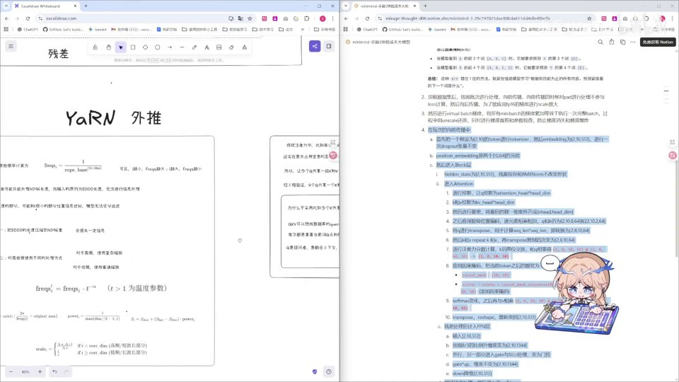
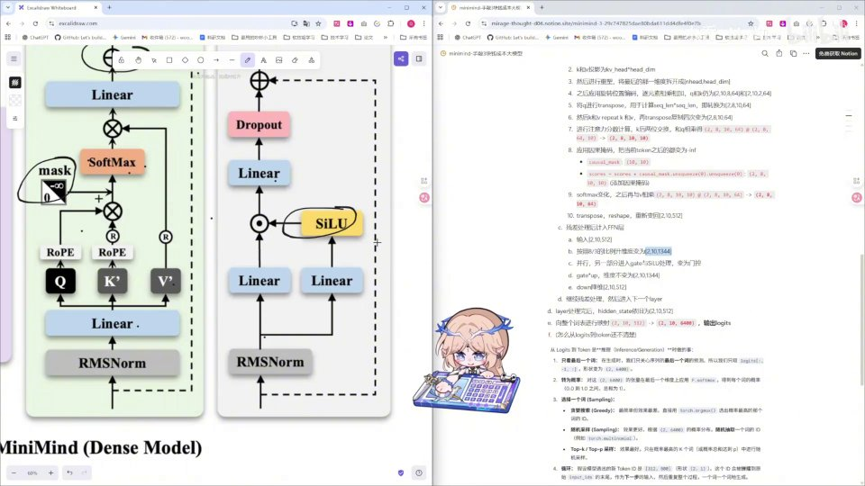
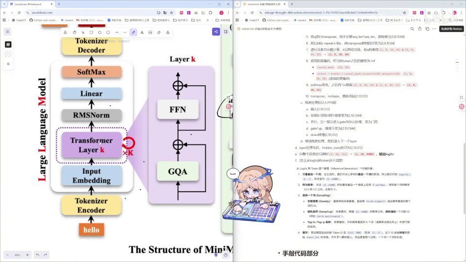

# 第19讲：回顾与知识检验

## 本讲要解决的核心问题（SCQA）

**背景**：前面 18 讲里，我们已经把 MiniMind 这个小语言模型的每一行代码都敲完了——从最小可用的 Transformer 骨架，到残差、RMSNorm、RoPE、YaRN、GQA、SwiGLU 这些"零件"，一个一个实现过。你已经具备了"照着图和公式写代码"的能力。

**冲突**：代码敲完不等于真的懂。很多人敲完一遍后，脑子里留下的是一堆零散的函数，而说不清"数据到底是怎么从一句话变成一个预测出来的词"。一旦换一张没见过的模型架构图，就立刻懵了。

**疑问**：怎么检验自己是不是真的把前 18 讲学透了？有没有一个标准，能说明"我确实掌握了这个模型"？

**回答（中心思想）**：真正掌握一个模型的标准，是能**合上代码、用自己的话把"数据从输入到输出、维度在每一层怎么变化"完整复述一遍**，并且能**看懂一个同类新模型的架构图**。本讲就是带着你做这样一次复盘：先回顾五大基础模块，再跟着一张完整架构图把张量（tensor）的维度之旅走一遍，最后用通义千问3（Qwen3）的架构图做一次"知识检验"。

这一讲是**前半程的阶段性总结**：到此为止，我们解决的是"模型怎么搭"；下一阶段要解决的是"模型怎么用"（加载数据集、训练、推理）。

---

## 一、为什么要"复述一遍"：从"敲过代码"到"真正理解"

讲者在进入正题前反复强调一件事：**在编写完之后，自己用语言叙述一下整个变化，看自己哪里还不理解，再去弥补**。[【跳转到 01:33】](https://www.bilibili.com/video/BV1T2k6BaEeC/?p=19&t=93)

这听起来像学习方法，其实是**知识检验的标准**。为什么复述这么重要？

- **代码会掩盖理解**。写代码时，你很容易被"这个函数调用那个函数"带着走，语法正确就等于通过。但"能跑通"和"知道为什么这么写"是两件事。
- **复述会暴露盲点**。当你要求自己从头讲一遍"输入进来是什么形状、经过每个模块变成什么形状、为什么是这个形状"，任何一个你说不下去的地方，就是你的知识漏洞。
- **复述是迁移的前提**。只有把 MiniMind 的运行规律抽象成一套"套路"，你才可能在看到 Qwen3、Llama 等新模型时迅速对应上。

打个比方：敲完代码，只相当于"照着菜谱把菜做出来一次"；而理解，是"合上菜谱也能说出为什么先炒这个、后放那个"。菜谱（代码）在手上时人人都能做，但只有真正理解火候与顺序，换一道新菜（新模型）才不会慌。

所以，本讲不是新知识课，而是一堂"检验课"。请把下面这张完整架构图当作复习地图：

这张图里，"Large Language Model"主干的顺序是：Tokenzier Encoder → Input Embedding → Transformer Layer k（重复 N 次）→ RMSNorm → Linear → SoftMax → Tokenizer Decoder。而右边的"Layer k"展开后，就是注意力（GQA）加前馈网络（FFN）加两个残差连接。[【跳转到 00:13】](https://www.bilibili.com/video/BV1T2k6BaEeC/?p=19&t=13)

如果你现在还不能自己把这张图讲明白，没关系——下面的回顾就是为你准备的。

---

## 二、五大基础模块回顾：每个都是"为了解决一个具体麻烦"

讲者先按顺序回顾了模型里最关键的几个"零件"。理解它们的关键，不是背定义，而是记住**它们在防什么、补什么**。[【跳转到 00:18】](https://www.bilibili.com/video/BV1T2k6BaEeC/?p=19&t=18)

### 2.1 残差网络（Residual）：让"深"变得可行

**是什么**：残差就是把**最初的状态保存下来，再和这一层处理后的状态相加**。用公式说就是 `y = x + F(x)`，其中 `x` 是输入，`F(x)` 是这一层学到的东西。

**为什么需要**：网络层数一多，梯度在反向传播时会逐层衰减，出现**梯度消失**（越靠前的层越学不动）；同时加深网络也更容易**过拟合**。

**怎么做**：把输入旁路（skip）过去，直接加到输出上。这样梯度有一条"高速公路"可以原样传回去，缓解了梯度消失，也减轻了拟合的负担。在后面的维度之旅里，你会看到每一层进 attention、进 FFN 前都会先把 hidden state 存一份，正是这个残差。

### 2.2 RMSNorm：让数据"稳"下来

**是什么**：一种**归一化**操作，把每个 token 的向量按均方根缩放，使其数值分布稳定。

**为什么需要**：数据在层层传递中数值可能越来越大（梯度爆炸）或越来越小（梯度消失）。归一化让每一层的输入保持在稳定尺度，训练才不容易崩。

**怎么做**：不像 LayerNorm 那样减去均值，RMSNorm 只做"除以均方根"的缩放，计算更省、效果够好，是大模型的常见选择。它出现在 Layer k 的入口和内部，起着"稳定器"的作用。

### 2.3 RoPE（旋转位置编码）：用相对位置说话

**是什么**：一种**位置编码**。它通过一种巧妙的方式，让两个 token 的 Q、K 做内积时，只由它们的**相对位置 `m - n`** 决定。

**为什么需要**：注意力本身对位置不敏感——如果不告诉它顺序，"我打你"和"你打我"在它眼里一样。所以要把位置信息注入进去；而**相对位置**比绝对位置更符合语言规律，也更容易外推。

**怎么做**：把向量看成复数平面上的点，按位置角度"旋转"它。两个向量分别旋转后做内积，结果自然只依赖它们的角度差。下面这张幻灯片给出了 RoPE 的公式推导——从二维旋转矩阵到最终"只与 `m - n` 有关"的结论：

### 2.4 YaRN：让 RoPE 能处理"比训练时更长"的序列

**是什么**：YaRN 是**对 RoPE 的一种外推（extrapolation）**。

**为什么需要**：模型训练时可能只见过长度 4096 的序列，但推理时你想喂给它 8192、甚至更长。直接超长会导致位置编码"没见过"，效果崩塌。

**怎么做**：对**高低频的不同维度做不同的缩放**。低频维度负责长距离、高频维度负责短距离，把它们分开调节，就能在保持短程能力的同时，把可处理长度外推到训练长度之外。[【跳转到 00:43】](https://www.bilibili.com/video/BV1T2k6BaEeC/?p=19&t=43)

### 2.5 GQA（分组查询注意力）：省显存的注意力

**是什么**：GQA = Grouped-Query Attention，即**多个 Q 共享一组 K、V**。它是多头注意力（MHA）和多查询注意力（MQA）之间的折中。

**为什么需要**：标准的注意力里，每个头都有自己独立的 Q、K、V。头一多，K、V 的缓存（KV Cache）就非常大，推理时显存吃不消。但如果所有 Q 共享一份 K、V（MQA），效果又会掉。GQA 取中间：把 Q 分成几组，每组共享一份 K、V。

**怎么做**：前面的代码里我们写过 `repeat_kv`——把 K、V 沿头维度**复制几份**，让它们和 Q 的头数对齐，再做注意力计算。MiniMind 里 Q 有 8 个头、K/V 只有 2 个头，所以每个 K/V 要重复 4 份（8 ÷ 2 = 4）。讲者说得很直白："attention 机制我就不必再过多赘述了，GQA 就是多个 Q 共享一组 KV，那在我们前面编写 `repeat_kv` 的时候也知道了。"[【跳转到 01:08】](https://www.bilibili.com/video/BV1T2k6BaEeC/?p=19&t=68)

还有最后一块基础内容是**激活函数**，它在 FFN 层里实现，是前馈网络"非线性"的来源。这块留到维度之旅里细看。

一句话记住这五个模块各自在防什么：

| 模块 | 它要解决的问题 | 一句话记住 |
| --- | --- | --- |
| 残差 residual | 梯度消失、过拟合 | 记住原样、加回去 |
| RMSNorm | 数值不稳定 | 把尺度压稳 |
| RoPE | 位置信息 | 转个角度，只看相对位置 |
| YaRN | 序列外推 | 高低频分开缩放 |
| GQA | KV 缓存太大 | 多个 Q 共用一组 KV |

> 一个容易被忽略的点：这些设计不是"堆功能"，而是**层层配合**的。残差要求每个子层的输入输出形状一致，所以 attention 和 FFN 都要把维度变回 512；归一化放在子层入口保证输入稳定；位置编码只在 Q、K 上加。理解了这条"配合链"，架构图就活了。

---

## 三、维度之旅：数据从一句话到一个词，到底经历了什么

这是本讲最核心的部分。讲者带大家从输入开始，一步一步追踪 hidden state 的形状变化。[【跳转到 01:33】](https://www.bilibili.com/video/BV1T2k6BaEeC/?p=19&t=93)

为了具体，我们沿用讲者的例子：**batch（批大小）= 2，序列长度 = 10，隐藏维度 = 512**。记住这三个数字，后面的形状全靠它们推导。

### 3.1 输入与 Embedding：把 id 变成向量

先补一个前置概念：模型不认识文字，只认识数字。**Tokenizer** 负责把一句话切成一串 token（可以理解为"词或子词"），并把每个 token 映射成一个整数 **id**。比如"你好"可能被切成若干 token，分别对应 id 1234、5678……在 MiniMind 的例子里，输入就是这些 id 组成的整数序列。

第一步是把输入的 token id（比如某个数字）做向量化。**Embedding** 本质上就是一张"查表"：词表里每个 id 都对应一个 512 维的向量，输入哪个 id 就取出哪个向量。经过 Embedding 之后，输入变成形状 **`[2, 10, 512]`** 的张量。

怎么理解这个形状？你可以把它想象成一个长方体：**2 个句子、每句 10 个 token、每个 token 用 512 个数字表示**。有 tensor 想象力的话，它就是一个三维张量。[【跳转到 01:58】](https://www.bilibili.com/video/BV1T2k6BaEeC/?p=19&t=118)

> 为什么是 512？这是模型的**隐藏维度（hidden size）**，也就是每个 token 用多长的向量来表示自己。维度越大，表达能力越强，但计算和显存也越贵。MiniMind 选了 512 这个较小的值，方便教学。

随后经过一次 **dropout**，张量的形状**不变**，依旧是 `[2, 10, 512]`。dropout 随机丢弃一部分数值，作用是防止过拟合。

### 3.2 位置编码与进入 Block

进入 Transformer Block 之前，还要准备位置信息。讲者提到 **position embedding 是两个 `(10, 64)` 的元组**——这对应 RoPE 需要的 cos、sin 两组旋转因子（每组对应序列长度 10、每个头 64 维）。

然后进入 Block。一进来，hidden state 是 `[2, 10, 512]`。第一件事是**残差**：把这个 hidden state 先**存一份**（后面 attention 算完要加回来）。[【跳转到 02:23】](https://www.bilibili.com/video/BV1T2k6BaEeC/?p=19&t=143)

### 3.3 Q、K、V 的投影与重塑

进入 attention 后，首先把 hidden state 分别投影，计算出 **Q、K、V**（查询、键、值）。[【跳转到 02:43】](https://www.bilibili.com/video/BV1T2k6BaEeC/?p=19&t=163)

接着做**重塑（reshape）**：把原本的 512 拆成"头数 × 每头维度"。也就是把 512 分成 `8 × 64`——**8 个头，每个头 64 维**。[【跳转到 02:48】](https://www.bilibili.com/video/BV1T2k6BaEeC/?p=19&t=168)

> 多头注意力的直觉：8 个头就像 8 个"视角"，各自关注句子里不同的关系（谁修饰谁、谁指向谁）。把维度拆给多个头，比用一个 512 维的大头更能捕捉多样的模式。

投影后，对 **Q 和 K 应用 RoPE**。这时：

- Q 的形状是 **`[2, 8, 10, 64]`**（batch、8 个头、10 个位置、每头 64 维）；
- K 的形状是 **`[2, 2, 10, 64]`**（注意头数是 **2**，不是 8——因为 GQA 里 K 只有 2 组）。

这就是 GQA 的体现：Q 有 8 个头，K 只有 2 个头。

### 3.4 维度变换与 GQA 的 repeat_kv

因为 K、V 要重复四份（8 ÷ 2 = 4），接下来先对它们做 **transpose** 做维度变化：把序列维度放到后面、把 head 放到前面，转化成 `[2, 8, 10, 64]`。然后再把 K、V 进行 **`repeat_kv`**，在 transpose 4 次之后也变成 `[2, 8, 10, 64]`，与 Q 对齐。[【跳转到 03:13】](https://www.bilibili.com/video/BV1T2k6BaEeC/?p=19&t=193)

### 3.5 注意力分数与因果掩码

现在做**注意力分数计算**：用 Q 和 K 相乘。形状为 `[2, 8, 10, 64]` 的 Q 与 K 相乘后，得到 **`[2, 8, 10, 10]`**——最后两个 10 表示"每个位置对每个位置的关注程度"。[【跳转到 03:38】](https://www.bilibili.com/video/BV1T2k6BaEeC/?p=19&t=218)

接着应用**因果掩码（causal mask）**：在 softmax 之前，把矩阵**下三角以外的部分（未来位置）填成负无穷大**。这样 softmax 之后，那些被掩码的位置变成 0，其余位置变成"和为一"的概率分布。

> 为什么要因果？因为语言模型在预测第 t 个词时，只能看到它前面的词，绝不能"偷看"后面的答案。因果掩码就是保证这一点的"遮羞布"。

**用一个三词句子建立直觉**：假设一句只有 3 个 token，注意力分数矩阵是 3×3。因果掩码会把右上角（位置 1 看位置 2、3，位置 2 看位置 3）填成负无穷，只留下左下三角。softmax 之后，第一行只剩第一个位置有权重（比如 `[1, 0, 0]`），第二行只在第 1、2 个位置分配权重（比如 `[0.4, 0.6, 0]`），第三行则可以在前三个位置分配。每一行都变成一个"和为一"的概率分布，再拿去对 V 加权求和。这样"第 1 个词"的表示永远不会掺入后面的词——因果性就守住了。

### 3.6 与 V 相乘、输出投影、残差相加

把注意力概率 `[2, 8, 10, 10]` 与 V `[2, 8, 10, 64]` 相乘，得到 **`[2, 8, 10, 64]`** 的输出张量。然后经过 **transpose** 把 8 和 10 交换过来，再 **reshape**，把 8 和 64 相乘（8 × 64 = 512），**重新变回 `[2, 10, 512]`**——和输入 attention 前的 hidden state 形状完全一致。[【跳转到 04:03】](https://www.bilibili.com/video/BV1T2k6BaEeC/?p=19&t=243)

形状一致，才能和刚才存下来的那份残差**相加**，完成 attention 子层的残差连接。然后进入 FFN 层。

### 3.7 FFN（SwiGLU）：先升维、再门控、再降维

FFN 层输入是 `[2, 10, 512]`。它做三件事：[【跳转到 04:28】](https://www.bilibili.com/video/BV1T2k6BaEeC/?p=19&t=268)

1. **升维**：用 Linear 层按约 8/3 的比例把维度升到 **`[2, 10, 1344]`**。升维让模型有更大的"中间工作台"去组合特征。所谓"8/3"是 Transformer 里的一个经验比例（512 × 8/3 ≈ 1365，实际取整附近的值）——它比原来宽两倍多，既给了足够的表达空间，又不像早期的 4 倍那样笨重。
2. **门控（gating）**：并行地，一份升维后的结果通过 **SiLU 激活函数**，变成"门"，再与另一份升维结果做**逐元素相乘**（元素过滤）。这就是 **SwiGLU** 结构——用门控决定信息通过多少。相乘后维度不变，仍是 `[2, 10, 1344]`。[【跳转到 04:53】](https://www.bilibili.com/video/BV1T2k6BaEeC/?p=19&t=293)
3. **降维**：再经过一个 Linear 层，从 1344 降回 **`[2, 10, 512]`**，然后做残差相加。

FFN 内部结构在架构图里画得很清楚——两条并行的 Linear，一条带 SiLU 作为门，最后相加再降维：

到这里，一个 Block 就完成了。这个"残差 → attention → 残差 → FFN"的流程，会**重复循环**多次（堆叠 N 个 Block）。

### 3.8 输出层：从 512 维映射到整个词表

循环结束后，输出的 hidden state 仍是 `[2, 10, 512]`，再经过一次 RMSNorm（形状不影响）。[【跳转到 05:14】](https://www.bilibili.com/video/BV1T2k6BaEeC/?p=19&t=314)

最后是**输出层**：用 Linear 把这个 512 维**映射到整个词表**。MiniMind 的词表有 **6400** 个词，所以这一步把每个 token 的 512 维向量变成 **6400 维的 logits**（每个词一个分数）。

> 为什么要"映射到词表"？因为模型最终要回答的问题是"下一个词最有可能是这 6400 个词里的哪一个"。所以它必须给每个候选词打一个分，而 6400 维的 logits 就是"给全部候选词打的分数表"。

再对 logits 应用 **softmax**，就变成概率分布；最后根据概率**真正地 decode 出一个 word**——这就是模型吐出的下一个词。

把主干再对一遍：Tokenzier Encoder 把文字变成 id，Input Embedding 把 id 变成向量，Transformer Layer k 反复加工，RMSNorm 稳定输出，Linear 映射到词表，SoftMax 变成概率，Tokenizer Decoder 把概率变成文字。这就是"手敲代码部分"对应的完整运行规律：

再看一次 Block 的输入输出全貌——注意 `hello + world` 这两个词如何一步步被处理，Layer k 内部就是 GQA 与 FFN：

---

### 3.9 一张表看清"维度之旅"

把上面每一步的张量形状整理成表，方便你随时对照自检：

| 步骤 | 操作 | 张量形状（batch=2, seq=10, hidden=512） |
| --- | --- | --- |
| 1 | 输入 token id → Embedding | `[2, 10, 512]` |
| 2 | dropout | `[2, 10, 512]`（不变） |
| 3 | 进入 Block，存残差 | `[2, 10, 512]` |
| 4 | 投影并拆头（8×64）+ RoPE | Q `[2, 8, 10, 64]`；K/V `[2, 2, 10, 64]` |
| 5 | `repeat_kv`（复制 4 份） | K/V 对齐为 `[2, 8, 10, 64]` |
| 6 | Q·K 注意力分数 | `[2, 8, 10, 10]` |
| 7 | 因果掩码 + softmax | `[2, 8, 10, 10]` |
| 8 | 与 V 相乘 → transpose → reshape | `[2, 10, 512]` |
| 9 | 加残差 → FFN 升维 | `[2, 10, 1344]` |
| 10 | SiLU 门控 → Linear 降维 | `[2, 10, 512]` |
| 11 | 堆叠 N 个 Block → RMSNorm | `[2, 10, 512]` |
| 12 | 输出 Linear 映射词表 | `[2, 10, 6400]`（logits） |
| 13 | softmax → decode | 概率 → 下一个 word |

**读表的口诀**：进 Block 是 512，出来还是 512（所以能加残差）；FFN 内部会短暂"变胖"到 1344 再瘦回来；只有在最后的输出层，维度才从 512 变成词表大小 6400。

---

## 四、把 MiniMind 架构图完整走一遍（知识检验清单）

讲者说："这就是整个模型的一个运行规律，我希望大家现在比较清楚地了解这样一个模型是怎么搭建完成的。"[【跳转到 05:39】](https://www.bilibili.com/video/BV1T2k6BaEeC/?p=19&t=339)

作为自检，请你合上文章，试着回答下面这串问题——能顺畅答完，说明前半程真的过关了：

1. **输入**：一句话被 tokenize 成 id 后，Embedding 输出的张量形状是什么？batch、序列长度、隐藏维度分别是多少？（答案：`[2, 10, 512]`）
2. **残差**：进入 attention 前，为什么要把 hidden state 存一份？（答案：attention 算完要和它相加，缓解梯度消失）
3. **多头**：512 维被拆成几个头、每头多少维？（答案：8 个头 × 64 维）
4. **GQA**：Q 和 K 的头数为什么不一样？`repeat_kv` 把 K、V 重复了几次？（答案：8 与 2；重复 4 次）
5. **因果掩码**：softmax 之前把哪些位置填成负无穷？为什么？（答案：未来位置；防止偷看答案）
6. **形状复原**：attention 输出如何从 `[2, 8, 10, 64]` 变回 `[2, 10, 512]`？（答案：transpose 交换头与序列，再 reshape 合并 8×64）
7. **FFN**：升维到什么形状？门控用的是什么激活函数？最后降回什么形状？（答案：`[2, 10, 1344]`；SiLU；`[2, 10, 512]`）
8. **输出**：512 维被映射到多大的词表？输出什么？再经过什么变成概率？（答案：6400；logits；softmax）

更完整的"答案清单"其实就写在讲者的代码笔记里——每一次投影、每一个张量形状变化都被逐条记录：

如果你发现某个环节卡住了，回到对应的一讲再补，这正是讲者建议的"看自己哪里还有不理解，然后再去弥补一下"。

---

## 五、迁移检验：换一张 Qwen3 架构图，你还看得懂吗

复习 MiniMind 的最终目的，不是为了背下这一个模型，而是**获得看懂新模型的能力**。讲者放出了一张通义千问3（Qwen3）的架构图，让大家检验自己能不能"一比一对应"。[【跳转到 06:04】](https://www.bilibili.com/video/BV1T2k6BaEeC/?p=19&t=364)

来看 Qwen3 的这张图。它虽然比 MiniMind 复杂，但骨架是相通的：

讲者带大家对着图念了一遍："首先输入之后变成向量，然后它先应用旋转位置编码，中间还是 residual 不变、中间 RMSNorm；然后送入 attention（Q、K、V、RMSNorm），再进行 attention 计算；Linear 层输出 RMSNorm 进入 FFN，依旧是这个门控函数，然后降维；降维之后继续，然后输出 RMSNorm。"[【跳转到 06:27】](https://www.bilibili.com/video/BV1T2k6BaEeC/?p=19&t=387)

把 MiniMind 和 Qwen3 并排看，你会发现**套路完全一致**：

| 结构 | MiniMind | Qwen3 |
| --- | --- | --- |
| 输入向量化 | Embedding `[2,10,512]` | Embedding |
| 位置编码 | RoPE | RoPE |
| 归一化 | RMSNorm | RMSNorm（每模块前） |
| 注意力 | GQA | 分组注意力 |
| 前馈网络 | SwiGLU 门控 FFN | 门控 FFN |
| 残差 | 每个子层相连 | 每个子层相连 |

差别主要在**规模**和**细节配置**（层数、头数、维度、词表大小），而不是**架构思想**。所以讲者说了一句很提气的话："大家看到这样一个也是比较清晰明了，而且我相信大家也可以一比一地用代码去实现这样一个模型架构了。"

我们再把 Qwen3 这张图**自上而下逐层拆开**，对照 MiniMind 一起看：

1. **输入层**：`Input` 是一串 token，先经 `Embedding` 变成向量——和 MiniMind 的 Embedding 完全对应。
2. **位置编码**：向量进入 `Rotary`（旋转位置编码），也就是 RoPE——和 MiniMind 用的一模一样。
3. **堆叠的 Decoder layer**：图中标注 `Decoder layer ×N`，表示这个解码层要被重复 N 次——对应 MiniMind 里"Block 循环"。每个 Decoder layer 内部又分两块：
   - **Attention 块**：先 `RMSNorm`，再做注意力，图里能看到 `Linear`（投影 Q/K/V）、`Attention Interface`（注意力计算，含因果掩码与 softmax），最后输出投影。
   - **MLP 块**：先 `RMSNorm`，再进 MLP。图里的 `SwiGLU` 标注说明 Qwen3 用的也是**门控前馈网络**——和 MiniMind 的 FFN 同源。
4. **每一块都套残差**：图中 Attention、MLP 的输出都有一条旁路加回输入，这就是 residual。
5. **输出层**：全部层处理完，经最后的 `RMSNorm`，再通过 `LM Head`（输出线性层）映射到词表，得到 logits，最后 softmax 取词。

对照下来你会发现，**Qwen3 就是"放大版 + 配置升级版"的 MiniMind**。讲者放这张图，正是要你亲手验证："我学的不是某个模型，而是一类模型的通用骨架。"

这就是知识检验的真正含义：**当你能把 Qwen3 的图逐块翻译成"这不就是 MiniMind 里那个 GQA / FFN / RMSNorm 吗"，前 18 讲就没白学。**

---

## 六、下一步：从"能搭模型"到"能用模型"

讲者最后给整段前半程做了收尾：**兴趣归兴趣，模型编完只是让它"存在"，要让它"真正可用"，还需要加载数据集、训练，以及后续的训练和推理**，这些留到后面再讲。[【跳转到 06:52】](https://www.bilibili.com/video/BV1T2k6BaEeC/?p=19&t=412)

用一句话概括这一讲在整个系列里的位置：

> **前半程（第 1–18 讲）解决"模型长什么样、怎么搭"；本讲（第 19 讲）是收口与自检；后半程解决"怎么把数据喂进去、怎么把它训起来、怎么用它生成"。**

如果你能独立复述本讲的维度之旅，并看懂 Qwen3 的架构图，那么恭喜——你已经完成了从"照着抄"到"真正理解"的跨越，可以自信地进入训练与推理阶段了。

---

## 七、常见疑问与自检提示

复习时，初学者最容易卡在这几个问题上。先在这里统一回应：

**Q1：为什么维度一会儿 512、一会儿 1344，不能一直 512 吗？**
512 是"隐藏维度"，也就是 token 在主干上传递时的固定宽度，所有子层进出都要回到 512，残差才加得起来。1344 只是 FFN **内部**临时"变胖"的工作台，让网络有空间组合特征，算完立刻降回 512。**变胖只在 FFN 内部，不影响主干宽度。**

**Q2：Q、K、V 到底是什么？**
它们是同一个 hidden state 投影出的三个角色。粗浅地说：**Q 是"我在找什么"，K 是"我能提供什么"，V 是"我的实际内容"。** Q 与 K 相乘算出"谁该关注谁"，再据此对 V 加权求和，得到这一层的输出。

**Q3：8 个头和 2 个 K/V 头，不会对不上吗？**
会的，所以要 `repeat_kv` 把 K/V 复制 4 份（8÷2）来对齐。这正是 GQA 的代价——用一点点复制换来 KV 缓存的大幅缩减。

**Q4：为什么 causal mask 必须在 softmax 之前？**
因为 softmax 会把负无穷变成 0 概率。如果先 softmax 再掩码，归一化就被破坏了。顺序是：**打分 → 掩未来位置为 -∞ → softmax → 加权 V。**

一条好用的自检习惯：**每读完一个模块，就问自己"如果不加它，模型会出什么问题？"** 能答上来，说明你理解的是"为什么"；只会背"是什么"，那还停留在表面。

## 小结

- **掌握的标准是复述**：能合上代码、用自己的话讲清"数据怎么流动、维度怎么变化"，才算真懂；换一张架构图看得懂，才算会迁移。
- **五大基础模块各有其"防御目标"**：残差防梯度消失/过拟合，RMSNorm 稳定数值，RoPE 注入相对位置，YaRN 外推长度，GQA 省下 KV 缓存。
- **维度之旅一句话串起全模型**：`[2,10,512]` 输入 → 存入残差 → 投影拆成 8×64 头 → Q/K 上 RoPE → GQA 复制 K/V → 注意力分数 `[2,8,10,10]` → 因果掩码 → 与 V 相乘 → 复原 `[2,10,512]` 残差相加 → FFN 升到 1344 再用 SiLU 门控并降回 512 → 堆叠 → RMSNorm → 映射到 6400 词表 → softmax → decode。
- **架构思想是共性，配置是差异**：Qwen3 与 MiniMind 用的是同一套骨架（RoPE + RMSNorm + GQA + 门控 FFN + 残差），只是规模不同。
- **本讲是前半程的阶段性终点**：编完模型只是"存在"，加载数据与训练、推理是下一阶段的开始。

## 关键术语速查

| 术语 | 一句话解释 |
| --- | --- |
| ResNet / 残差（residual） | 把输入旁路保存并加到输出上（`y = x + F(x)`），缓解梯度消失与过拟合 |
| RMSNorm | 一种只做均方根缩放的归一化，稳定数值、防止梯度爆炸/消失 |
| RoPE（旋转位置编码） | 通过旋转向量注入位置，使 Q、K 内积只依赖相对位置 `m - n` |
| YaRN | 对 RoPE 的外推方法，对不同频率维度分别缩放，支持超出训练长度的序列 |
| GQA（分组查询注意力） | 多个 Q 共享一组 K、V，在 MHA 与 MQA 之间折中，节省 KV 缓存 |
| `repeat_kv` | 把 K、V 沿头维度复制，使头数与 Q 对齐（此处 8÷2=4 次） |
| hidden state | 在层间传递的隐藏状态向量，本例形状 `[2, 10, 512]` |
| 多头注意力 | 把 512 维拆成 8 个 64 维的头，各自关注不同的关系模式 |
| 因果掩码（causal mask） | softmax 前把未来位置置为负无穷，保证预测只看前面、不看答案 |
| FFN / SwiGLU | 前馈网络：先升维到 1344，用 SiLU 做门控逐元素相乘，再降回 512 |
| SiLU | FFN 里用作门控的激活函数，给网络引入非线性 |
| logits | 输出层把 512 维映射到 6400 词表得到的原始分数，softmax 后变概率 |
| Qwen3 | 通义千问3，架构骨架与 MiniMind 相通（RoPE/RMSNorm/GQA/门控 FFN） |
