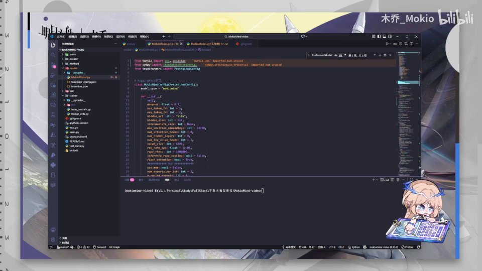
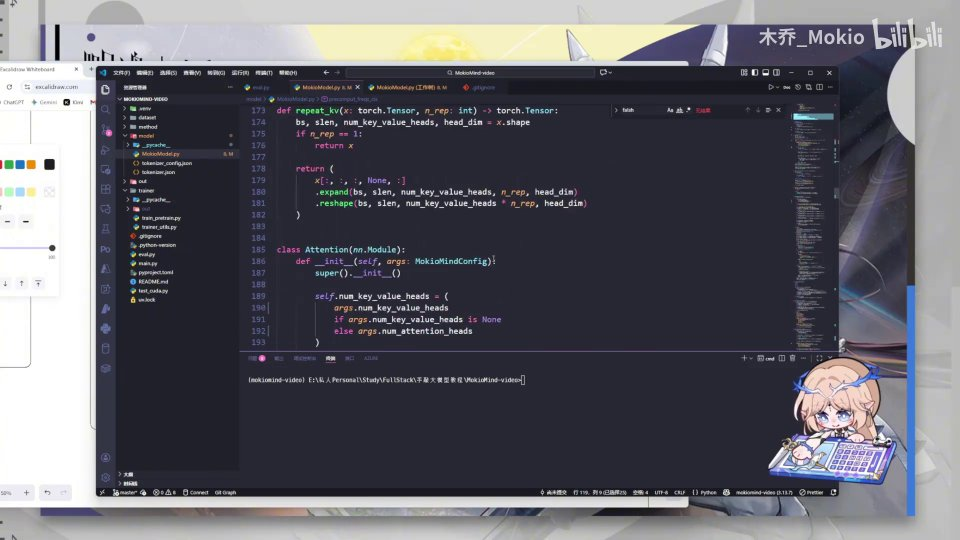
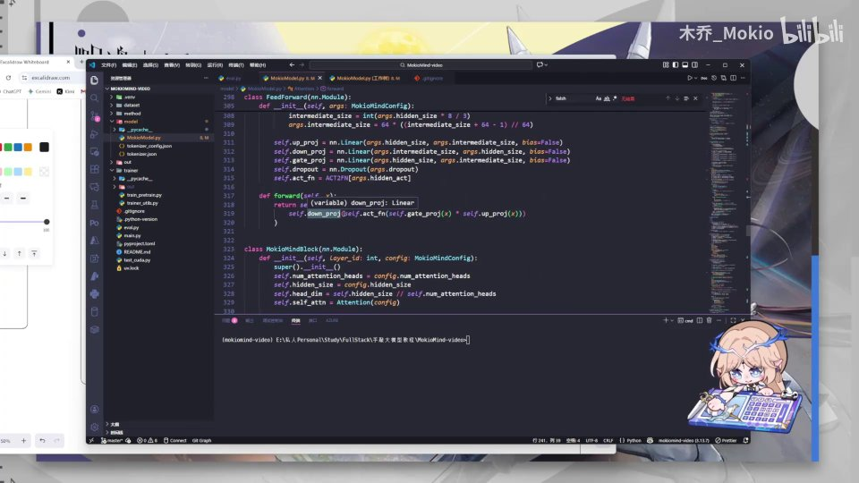
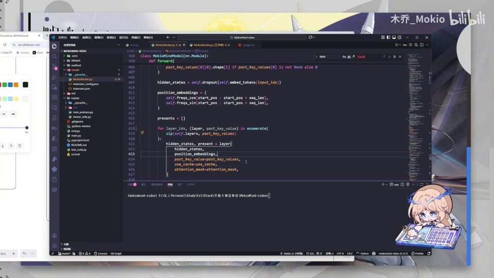
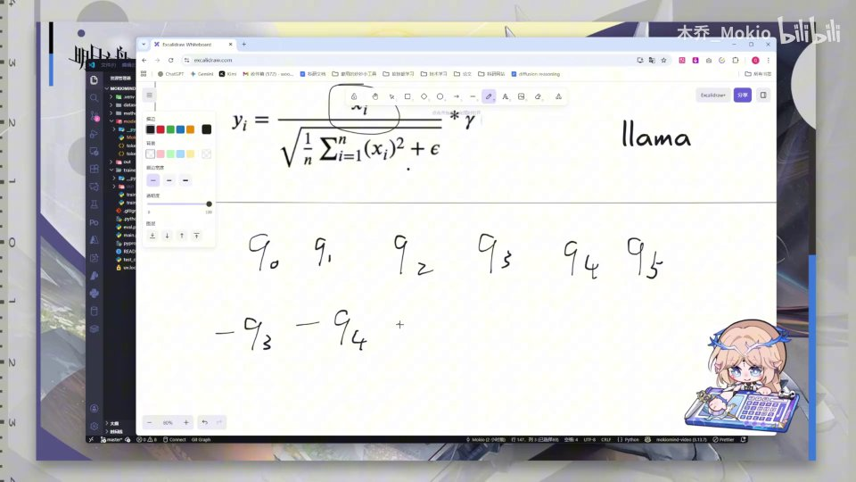

# 第20讲：必看：纠错补充

## 本讲要解决的核心问题（SCQA）

**背景**：在前面十几讲里，我们已经从零手写完了 MiniMind 的各个核心模块——分词、嵌入、注意力、前馈网络、旋转位置编码（RoPE）、归一化（RMSNorm）以及模型主体。此时模型代码"看起来"已经能跑，我们也准备进入数据加载与正式训练的环节。

**冲突**：在"敲完模型"到"正式开始训练"之间，作者发现之前写下的代码里混进了一批错误——有的是低级拼写和导入错误，有的是会直接改变数学结果的严重 bug（比如归一化漏乘、激活顺序写反、计算顺序被括号搞错、变量被循环覆盖）。这些错误如果带进训练，轻则报错跑不起来，重则模型"能跑但学错"，白白浪费算力和时间。

**疑问**：这些错误具体有哪些？分别该怎么改？改了以后数学上为什么是对的？还有一处被观众反复质疑的 RoPE 频率写法，到底是不是 bug？

**回答（中心思想）**：本讲是一次集中"纠错 + 补充"，把之前代码中的问题分成 **四类**——①导入与拼写错误、②数学计算错误（RMSNorm、RoPE、FFN 激活顺序）、③初始化与变量命名问题、④返回值规范问题，逐条修正；并在最后澄清：MiniMind 里那处"共享旋转频率"的 RoPE 写法在数学上并没有错，它能融合相对位置信息，只是与"标准相对实现"不同而已。**先纠错，再训练。**

下面我们按"从易到难、从编译期错误到逻辑错误"的顺序，把问题一个一个解决。

[【跳转到 00:12】](https://www.bilibili.com/video/BV1T2k6BaEeC/?p=20&t=12)

---

## 一、导入与拼写错误：小疏忽会直接让代码无法运行

先从最省事、也最容易被忽视的一类说起：**导入（import）和拼写错误**。它们的特点是"改起来只要几秒钟，但不改程序直接报错"。

为什么这类"低级错误"值得单独讲一节？因为一个从零手写的项目里，模块是**一天一天、一讲一讲**堆起来的：今天写了 `Attention`，明天写 `FFN`，后天改配置——中间难免有临时改名、试错、复制粘贴。等到要跑训练时，这些历史遗留就会一起爆出来。真正麻烦的不是"报错"，而是"报错信息指向的位置和真正的原因对不上"，让人反复排查。所以作者选择在训练前集中清一遍，非常有必要。

本讲开头作者第一件事就是删掉文件顶部两个"来路不明"的多余导入——这类残留往往是调试时临时加的，留着可能引入命名冲突。[【跳转到 00:00】](https://www.bilibili.com/video/BV1T2k6BaEeC/?p=20&t=0)

### 1.1 激活函数导入路径写错

第一个真正的错误是 `activation_functions` 的导入。

- **是什么**：HuggingFace Transformers 库里的激活函数模块，正确路径是 `transformers.activations`，而代码里写成了别的名字（类似 `transformers.actions`）。
- **为什么需要**：MiniMind 的 FFN 会用到 `ACT2FN`（一个把字符串名字映射成激活函数的字典），它来自 `transformers.activations`。导入路径一错，`ACT2FN` 就拿不到，模型根本构建不出来。
- **怎么改**：把导入改回 `from transformers import ...` 中对应 `activations` 的写法即可。[【跳转到 00:17】](https://www.bilibili.com/video/BV1T2k6BaEeC/?p=20&t=17)



### 1.2 大小写与拼写三连错

紧接着是三个典型的"手滑"：

1. **`pretrained_model` 少打了大写 T**：正确的类名是 `PreTrainedModel`（HuggingFace 所有预训练模型的基类），小写 `t` 会导致找不到类。
2. **`FALSH` 拼错**：本意是 `flash`（指 FlashAttention / 缩放点积注意力），拼成 `FALSH` 后变量引用失败。
3. **`EMBDDEDDINGS` 多打了 D**：正确拼写是 `embeddings`，多写的字母会让对应变量名对不上。

- **为什么需要**：Python 大小写敏感、标识符必须完全一致，这类错误 100% 触发 `NameError` 或 `AttributeError`。
- **怎么改**：把导入处的 `PretrainedModel` 改成 `PreTrainedModel`，把 `FALSH` 统一改成 `flash`，把 `EMBDDEDDINGS` 改成 `embeddings`。


**给初学者的排查建议**：导入和拼写错误有非常明确的"信号"——它们通常在**代码还没开始跑数值计算时**就抛出 `ImportError / NameError / AttributeError`。你可以据此二分：如果程序连模型都构建不出来，八成是导入/拼写；如果模型建出来了、但训练结果异常，才回头看数学逻辑。把两类问题分开处理，排查效率会高很多。

**一句话记住**：编译期错误先清干净，再谈逻辑——否则你会分不清"到底是算法错还是手滑"。

<[【跳转到 00:42】](https://www.bilibili.com/video/BV1T2k6BaEeC/?p=20&t=42)>

---

## 二、RMSNorm 漏乘 X：归一化公式的分子不能丢

从这一节开始进入**会改变数学结果的严重错误**。第一个是 RMSNorm（均方根归一化）。

### 2.1 什么是 RMSNorm

RMSNorm 是一种**归一化**手段，作用是把一层里数值的"整体尺度过大或过小"拉回到稳定范围。它和经典的 LayerNorm 很像，但**只除以均方根（RMS），不减均值、不算方差**，因此计算更省、效果却不相上下。

公式如下（作者白板上给出的是与 Llama 一致的写法）：

$$
y_i = \frac{x_i}{\sqrt{\frac{1}{n}\sum_{j=1}^{n} x_j^2 + \epsilon}} * \gamma
$$

其中 $x_i$ 是输入，$\gamma$ 是可学习的缩放参数（代码里叫 `weight`）。

**打个比方**：如果把一层网络的激活值比作"音量忽大忽小的声音"，归一化就是一台**自动音量均衡器**——它不改变"你说的是什么"（方向/相对比例），只把整体音量拉到合适区间。RMSNorm 的特别之处在于：它只用"信号的平方均值"来估计音量，因此比 LayerNorm 少算均值、少算方差，速度更快。

**一个具体数字例子**：假设某个位置输入的四个数是 `[3, 4, 0, 0]`，那么它们的平方均值是 $(9+16+0+0)/4 = 6.25$，均方根约等于 $\sqrt{6.25}=2.5$。归一化后第一个数变成 $3/2.5=1.2$。可以看到，**原数值被缩小了，但符号和相对大小保留了下来**。这正是"乘回 X"的意义——分子上的 $x_i$ 决定了归一化后每个位置的"方向"。

### 2.2 为什么需要它

作者在白板上从梯度推导了它的必要性：反向传播时

$$
\frac{\partial L}{\partial W} = \frac{\partial L}{\partial Y}\times X
$$

**梯度与输入 $X$ 的值直接相关**。如果 $X$ 过大或过小，就容易造成**梯度爆炸或梯度消失**；归一化把输入的标准差拉到 1 附近，就能稳定训练。[【跳转到 01:07】](https://www.bilibili.com/video/BV1T2k6BaEeC/?p=20&t=67)


### 2.3 错在哪里、怎么改

**错误**：代码里的分子**漏乘了原来的 X**。也就是说，计算出来的是"除以均方根后的值"，却没有把 $x_i$ 乘回去，等于把输入信息整个丢掉了。

正确写法是在分子上保留 $x_i$，即"$x_i$ 乘以它的均方根的倒数（`rsqrt`）再乘 `weight`"。作者强调：**这里分子上一定要有一个 X 参与相乘**。[【跳转到 01:23】](https://www.bilibili.com/video/BV1T2k6BaEeC/?p=20&t=83)

- **怎么改**：在归一化结果上乘回输入张量，再乘可学习权重。
- **为什么必须改**：RMSNorm 的输出必须"既被归一化、又保留原输入的方向信息"，少了这个乘 X，输出就和输入脱节，网络学不到东西。

**一个类比帮助记忆**：归一化像"把照片等比缩放"，它改变尺寸、不改变内容。如果漏乘 X，就相当于**把照片换成了一张白纸**——看起来"规规矩矩"，其实信息全没了。这就是为什么它属于"会改变数学结果的严重错误"，而不是拼写级别的小问题。

**一句话记住**：归一化是"缩放"，不是"替换"——归一化后的结果还要乘回原输入。

---

## 三、RoPE 的计算顺序：括号决定旋转对不对

旋转位置编码（RoPE）是 MiniMind 的关键组件，也是本讲错误最集中、最"隐蔽"的地方。

### 3.1 RoPE 是做什么的

RoPE 通过**把 Query 和 Key 向量按位置"旋转"一个角度**，让注意力在做点积时自动带上"相对位置信息"。位置越远，旋转角度差越大，模型就能感知词与词之间的距离。

**用直觉理解"旋转"**：把每个词向量想象成一支**钟表指针**。词在第 $m$ 位，就把指针再转一个与 $m$ 成正比的角度；词在第 $n$ 位，就转与 $n$ 成正比的角度。当 Query（第 $m$ 位）和 Key（第 $n$ 位）做点积时，两个指针之间的**夹角**恰好只和"位置差 $m-n$"有关——于是点积里自然就带上了"两个词隔多远"的信息。这就是 RoPE 为什么能表达相对位置：**绝对位置被转进角度里，点积时自动抵消成相对位置**。

正因为"角度"是核心，所以**角度计算的顺序（乘除、括号）一旦写错，整支"指针"就转错了**——这也是下一节要说的问题。

### 3.2 错误一：公式缺少括号，计算顺序错乱

**错误**：RoPE 角度计算式被写成了一个"没有括号、按默认优先级运算"的表达式，导致乘除顺序和数学定义不一致。

**怎么改**：
- 先给式子**右边加一对括号**，让右边的整体能先算出来；
- 再在 `1/`（一除以频率）这一项**单独加括号**，保证分子和后面的部分隔开。

作者强调：如果不加这两个括号，**计算顺序就会错误，导致严重问题**。[【跳转到 01:29】](https://www.bilibili.com/video/BV1T2k6BaEeC/?p=20&t=89)

**为什么两个括号这么关键**：Python（以及 NumPy / PyTorch）里，乘除是**同级运算符、从左到右结合**。这意味着 `a / b * c` 和 `a / (b * c)` 是两个完全不同的结果。RoPE 的角度公式里同时出现了"$1/$频率"和"乘以某个系数"，如果不显式加括号，整段表达式的结合顺序就和数学定义不一致。结果就是——**代码不报错、能算出数，但转的角度是错的**，模型的位置感知随之失真。这正是"补括号"看似微不足道、实则必要的原因。

### 3.3 错误二：频率相关计算被放在了 `if` 外面

在 `precompute_freqs_cis` 这类函数里，所有与"长上下文外推"有关的频率调整（RoPE scaling、beta、频率缩放等）**只应该在序列长度超出可处理范围时才计算并应用**。

**先解释这个函数在干什么**：`precompute_freqs_cis` 负责**提前算好每个位置对应的 cos/sin 值**（也就是前面说的"指针角度"），供正向传播时直接取用。它最基础的做法是先算出一组频率 $1/\text{base}^{2i/d}$，再按序列长度生成对应的角度。而当序列**超长**、超出了模型原本训练过的范围时，就需要启用 `rope_scaling`（RoPE 外推/缩放），通过额外的 beta、scale 等系数去"拉伸"这组频率，让长序列也能被正确处理。

**错误**：代码把一部分频率调整的计算（一直到 `FREQ` 那几行）放在了 `if` 判断之外，导致**无论是否需要外推都会执行**。

**怎么改**：把这些行**整体挪到 `if` 条件的下面**。否则这不仅是性能问题，更是**逻辑问题**——会在不该改写频率的时候改写频率。[【跳转到 02:19】](https://www.bilibili.com/video/BV1T2k6BaEeC/?p=20&t=139)

**一句话理解**：缩放系数是"备用档位"，只有真的进入长序列场景才该挂上；平时就挂上，等于把正常的频率也改了，模型会"看错位置"。


**一句话记住**：`if` 管住的必须是一整块逻辑，不能让半截计算"漏"在条件外面。

---

## 四、注意力头的初始化：key_value_heads 的回退逻辑

这一节处理 `Attention` 模块 `__init__` 中的初始化错误。

### 4.1 GQA 与 K/V 头数

MiniMind 使用 **GQA（分组查询注意力，Grouped-Query Attention）**：Query 的头数（`num_attention_heads`）和 Key/Value 的头数（`num_key_value_heads`）可以不同，多个 Query 头共享一组 K/V 头，从而在几乎不损失效果的前提下大幅省显存。

**为什么需要 GQA**：自回归生成时，K/V 缓存（KV Cache）会随着序列变长而不断膨胀，显存开销很大。如果每个 Query 头都配一套独立的 K/V 头（多头注意力的原始做法），缓存会非常占地方。GQA 让若干 Query 头**共用一组 K/V 头**，例如 32 个 Query 头共享 8 组 K/V——KV Cache 直接缩小到原来的四分之一，而效果几乎不受影响。推理时，K/V 头会通过 `repeat_kv` 复制扩展，去匹配对应的 Query 头。

**一个前提条件**：Query 头数必须能被 K/V 头数**整除**（比如 32 能被 8 整除），这样才能均匀分组。代码里的断言就是在检查这一点。

### 4.2 错在哪里

**错误**：初始化时本应设置 K/V 头数，代码却写成了别的名字（类似初始化了 `attention_heads`），逻辑混乱。

**正确的逻辑**是：

- 如果配置里给了 `num_key_value_heads`（不为 `None`），就用它；
- 否则（为 `None`），就退回到 `num_attention_heads`。

写成代码即：

```python
self.num_key_value_heads = (
    args.num_key_value_heads
    if args.num_key_value_heads is not None
    else args.num_attention_heads
)
```

作者还顺手删掉了一段**重复的 K/V 初始化**代码。[【跳转到 02:44】](https://www.bilibili.com/video/BV1T2k6BaEeC/?p=20&t=164)[【跳转到 03:09】](https://www.bilibili.com/video/BV1T2k6BaEeC/?p=20&t=189)




### 4.3 顺带修复的拼写

同一模块的 `forward` 里还有一处拼写错误 `EMBDDEDDINGS`，以及前面提到的 `flash` 变量问题，一并改掉。[【跳转到 03:34】](https://www.bilibili.com/video/BV1T2k6BaEeC/?p=20&t=214)

**一句话记住**：GQA 的 K/V 头数应优先取配置值，缺省时再退回 Q 头数；两者必须成整数倍关系。

---

## 五、FFN 门控激活顺序：先激活门控，再乘 up（SwiGLU）

这是本讲**最典型的"能跑但学错"**的逻辑 bug。

### 5.1 什么是门控 FFN / SwiGLU

MiniMind 的前馈网络（FFN）用了 **SwiGLU** 结构：它并行计算两路——一路是 `gate_proj`（门控），一路是 `up_proj`（放大部分）——然后把**激活后的门控**与 `up` 相乘，再经过 `down_proj` 降维。直观理解：**门控决定"让多少信息通过"，up 提供"信息内容"**。

**一个类比**：SwiGLU 像一扇**带旋钮的水闸**。`gate_proj` 算出"开多大"（经过激活后落在 0～1 附近），`up_proj` 是"水本身"。正确的做法是**先根据开度决定放多少水，再乘上水量**；如果反过来，先拿"水量×开度"再统一做一次非线性变换，就等于把"开关"和"内容"搅在一起，闸门失去意义。

**一个具体数字例子**：设某维上 `gate = 2.0`、`up = 3.0`，激活函数用 Swish（约等于 `x * sigmoid(x)`）。
- **正确顺序** `act(gate) * up`：`act(2.0)` 约为 $2.0\times0.88=1.76$，再乘 3 得约 `5.28`。
- **错误顺序** `act(gate * up)`：先算 `2.0*3.0=6.0`，再激活约 $6.0\times0.9975\approx5.99$。

两者结果不同，而且错误写法在数值较大时会把"门控的相对差异"抹平——这正是它"看起来能跑、实际学坏"的原因。

### 5.2 错在哪里

**错误**：代码把激活函数**作用在了整个基（相乘之后的结果）上**，而不是只作用在门控上。

**正确做法**：
$$
\text{output} = \text{down\_proj}\big(\text{act}(\text{gate\_proj}(x)) \times \text{up\_proj}(x)\big)
$$

也就是说——**先对门控 `gate_proj(x)` 做激活，再乘以 `up_proj(x)`，最后降维**。

作者原话非常明确：激活函数**应该应用在乘法之前**，应该"对这个门控进行激活然后再乘以 up"，而不是对整体激活，"这是完全错误的"。[【跳转到 03:59】](https://www.bilibili.com/video/BV1T2k6BaEeC/?p=20&t=239)




**一句话记住**：SwiGLU 的激活只加在"门"上，`act(gate) * up`，顺序一颠倒，非线性就被放错位置。

---

## 六、初始化顺序与变量遮蔽：两个容易被忽略的坑

### 6.1 初始化顺序：别忘了保存 config

在 MiniMind 主模型的 `__init__` 里，**先要初始化并保存配置对象**，也就是：

```python
self.config = config
```

**为什么需要**：后续很多逻辑（比如读取 `num_hidden_layers`、`hidden_size`、决定是否使用 FlashAttention）都要访问 `self.config`。如果没保存，后面就取不到配置，直接报错。[【跳转到 04:24】](https://www.bilibili.com/video/BV1T2k6BaEeC/?p=20&t=264)


### 6.2 变量遮蔽：past_key_values 不应该是循环变量

这是作者口中**"非常严重的问题"**。

**错误**：在 `forward` 的循环里，`past_key_values`（一个**函数参数**，代表缓存的 K/V）被**当成了循环变量重复赋值**。这样在后续每一轮循环中，`past_key_value` 都会指向"整个 `key_values`"，把原本应该逐个传递的缓存打乱。

**怎么改**：把循环变量改成一个不冲突的名字（作者说"把这个后面的 S 也扣掉"，即换掉这个名字），不要再覆盖参数本身。[【跳转到 04:49】](https://www.bilibili.com/video/BV1T2k6BaEeC/?p=20&t=289)

**用一个小例子理解"遮蔽"**：假设传进来一个列表 `past = [A, B, C]`，本意是第 0 层用 A、第 1 层用 B、第 2 层用 C。如果循环里写成 `for past in past:` 或把 `past` 重新赋值成整个列表，那么每一层拿到的都变成了 `[A, B, C]` 这个**整体**，而不是自己那一份。层与层之间缓存"串味"，推理时上下文就会错乱。

**为什么它隐蔽**：变量遮蔽**不会报错**，语法完全合法，只是语义被悄悄改写。所以作者把它称作"非常严重的问题"——训练可能照样能跑起来，但结果不可信。




**一句话记住**：函数参数一旦被循环同名变量覆盖，缓存就会"串味"——这是最容易骗过肉眼、却最致命的错误之一。

---

## 七、返回值规范化：直接返回对象，而不是逐字段拼装

最后一个问题看似"小事"，其实关系到代码的**可维护性与兼容性**。

**错误**：原代码的返回值写得不太规范——把 `cf.out`（输出对象上的字段）单独取出来，再在后面"一个字段一个字段地拼装"返回。

**怎么改**：作者改用 MiniMind 更规范的写法——**直接返回一个对象**（比如直接 `return self.out(...)` 或返回一个封装好的输出对象），而不是给对象"一个一个加特征"。[【跳转到 05:14】](https://www.bilibili.com/video/BV1T2k6BaEeC/?p=20&t=314)

- **为什么需要**：HuggingFace 生态里的模型通常返回一个结构化的输出对象（含 `logits`、`past_key_values`、`hidden_states` 等）。返回对象时，调用方能按需取字段；逐字段拼装既冗长又容易漏。
- **怎么做**：删掉多余的中间字段，直接用规范对象整体返回。


**一句话记住**：返回值要"整体规范"，不要"手工拼装"。

---

## 八、一张表看懂本讲所有改动（先总览，再看最后一处澄清）

在进入最后一处澄清之前，先把前面七处改动汇总成一张对照表，方便你逐条核对自己的代码：

| 序号 | 位置 | 问题类型 | 错误 | 正确做法 |
| --- | --- | --- | --- | --- |
| 1 | 文件顶部导入 | 编译期 | 两个多余导入 | 直接删除 |
| 2 | 激活函数导入 | 编译期 | `activation_functions` | 改为 `transformers.activations` |
| 3 | 预训练基类 | 编译期 | `pretrained_model`（小写 t） | 改为 `PreTrainedModel` |
| 4 | FlashAttention 变量 | 编译期 | `FALSH` | 改为 `flash` |
| 5 | RMSNorm 计算 | 数学逻辑 | 分子漏乘输入 X | 分子乘回 $x_i$，再乘 `weight` |
| 6 | RoPE 角度公式 | 数学逻辑 | 缺少括号、结合顺序错 | 右侧加括号、`1/` 项加括号 |
| 7 | RoPE 频率调整 | 数学逻辑 | 频率计算放在 `if` 外 | 整块移入 `if` 内 |
| 8 | 注意力头初始化 | 逻辑 | 头数初始化写错、重复初始化 | K/V 头数回退逻辑 + 删除重复 |
| 9 | 注意力 `forward` | 拼写 | `EMBDDEDDINGS` | 改为 `embeddings` |
| 10 | FFN `forward` | 数学逻辑 | 激活作用在整体上 | 改为 `act(gate) * up` |
| 11 | 模型 `__init__` | 逻辑 | 未保存 `config` | 补 `self.config = config` |
| 12 | 模型 `forward` | 逻辑 | `past_key_values` 被覆盖 | 循环变量改名，不遮蔽参数 |
| 13 | 模型返回值 | 规范性 | 逐字段拼装返回 | 直接返回结构化对象 |

把这张表当作"训练前自查清单"，逐条打勾，就能确保进入数据加载与训练阶段时代码是干净的。

---

## 九、RoPE 共享旋转频率：这不是 bug，而是另一种等价实现

改完前面所有错误后，作者专门花大篇幅澄清一处**被观众反复质疑的 RoPE 写法**。这一段是"补充说明"的核心。

### 9.1 作者的写法在做什么

先交代背景：`apply_rotary_pos_emb` 是**真正把旋转作用到 Q、K 上**的函数。它的常规做法是"两两一组"地对向量做旋转——把相邻两个分量看成一个二维小向量，按角度转一下（常用 `rotate_half` 把一半分量取负、再拼回原位）。作者这里用的是另一套**重排 + 取负**的写法，实现同一个目标。

具体来说，作者在 `apply_rotary_pos_emb` 里对 Query 的处理，相当于把一串序列：

$$
Q_0, Q_1, Q_2, Q_3, Q_4, Q_5
$$

重新排列、并使部分元素取负，得到类似

$$
-Q_3, -Q_4, -Q_5,\quad Q_0, Q_1, Q_2
$$

然后让 $-Q_3$ 与 $Q_0$ 配对、$Q_4$ 与 $Q_1$ 配对、$Q_5$ 与 $Q_2$ 配对——**它们共用同一个旋转频率**。[【跳转到 06:05】](https://www.bilibili.com/video/BV1T2k6BaEeC/?p=20&t=365)[【跳转到 06:15】](https://www.bilibili.com/video/BV1T2k6BaEeC/?p=20&t=375)

### 9.2 为什么照样能得到相对位置信息

关键在于：**只要 Query 和 Key 用的是同一个旋转频率，点积时就会融入"两者位置差"的信息**。

作者用示意解释了这一点：假设 Q 一侧有六个元素、K 一侧也有，无论两个位置相邻不相邻，它们相乘后对应的频率都由位置差决定——例如会出现 $(2-3)\theta_1$、$(2-3)\theta_2$ 这类项，从而携带相对位置（2-3 即相邻位置差）。

**为什么"共享同一个旋转频率"就够了**：RoPE 的数学原理是"用旋转角度的差来表示位置差"。只要参与点积的一对 Q、K 使用的是**同一套频率基**，它们各自携带的角度在相减时，就会把"绝对位置"消掉、只留下"位置差"。因此即使代码里把某些元素配对的方式看起来"非标准"（比如让 $-Q_3$ 与 $Q_0$ 配对），只要配对双方频率一致，**相对位置信息依然被完整保留**。这也解释了作者为什么说"无论它相邻不相邻，相乘都是一个 θ 的频率，但是没问题的"。

因此：

- 作者的写法**能融合相对位置信息**；
- **在数学上没有毛病**，MiniMind 原本这样写是**没有问题的**。[【跳转到 06:45】](https://www.bilibili.com/video/BV1T2k6BaEeC/?p=20&t=405)[【跳转到 07:10】](https://www.bilibili.com/video/BV1T2k6BaEeC/?p=20&t=430)

**为什么要专门澄清这一段**：很多初学者一看到"旋转频率被复用、下标还取了负号"，第一反应就是"这肯定是 bug"。作者用白板手推的方式证明：**它只是"非教科书式"的实现，而非错误**。学习大模型代码时这一点很重要——**判断对错要看数学等价性，而不是看它像不像标准教程**。

- 作者的写法**能融合相对位置信息**；
- **在数学上没有毛病**，MiniMind 原本这样写是**没有问题的**。[【跳转到 06:45】](https://www.bilibili.com/video/BV1T2k6BaEeC/?p=20&t=405)[【跳转到 07:10】](https://www.bilibili.com/video/BV1T2k6BaEeC/?p=20&t=430)




### 9.3 与"标准相对实现"的差别

作者也坦言：**标准实现一般用"相对（relative）的实现"**，与上面这种写法在代码结构上不同。但他强调：

- 用**作者的方法**从头训练，可以；
- 把**置顶评论里粘贴的标准代码**拿来从头训练，也可以。

两种方法都能得到正确的相对位置编码，只是实现风格不同。[【跳转到 07:35】](https://www.bilibili.com/video/BV1T2k6BaEeC/?p=20&t=455)

**一句话记住**：判断 RoPE 对不对，看的是"Q、K 是否共享同一旋转频率、点积后是否带出位置差"，而不是"代码长得像不像教科书"。

---

## 小结

本讲是一次**向训练出发前的"最后体检"**。回顾一下我们做的事：

1. **清理导入与拼写错误**：删除多余导入，修正 `transformers.activations`、`PreTrainedModel`、`flash`、`embeddings` 等，让代码先能正常构建。
2. **修正 RMSNorm**：分子必须乘回输入 X，归一化是"缩放"而非"替换"。
3. **修正 RoPE 计算顺序**：补括号、把频率调整整块放进 `if`，避免外推逻辑越界。
4. **修正注意力头初始化**：K/V 头数优先取配置，缺省退回 Q 头数，并删除重复初始化。
5. **修正 FFN 激活顺序**：SwiGLU 必须是 `act(gate) * up`，激活只加在门上。
6. **补齐初始化与变量命名**：保存 `self.config`、避免 `past_key_values` 被循环变量遮蔽。
7. **规范返回值**：直接返回结构化对象，不逐字段拼装。
8. **澄清 RoPE 频率写法**：共享旋转频率在数学上等价可行，能融合相对位置信息，不是 bug。

做完这些，模型代码才算真正"干净且正确"。**接下来，我们进入下一块内容：加载数据集与训练。**

## 关键术语速查

| 术语 | 一句话解释 |
| --- | --- |
| RMSNorm | 均方根归一化：只除以均方根、不减均值，计算更省；输出需乘回输入 X 与可学习权重 γ |
| RoPE | 旋转位置编码：把 Q、K 按位置旋转角度，使注意力点积携带相对位置信息 |
| GQA | 分组查询注意力：多个 Query 头共享一组 K/V 头，省显存且几乎不掉效果 |
| num_key_value_heads | K/V 头数；为 None 时回退到 num_attention_heads，且两者须成整数倍关系 |
| FFN / SwiGLU | 前馈网络；SwiGLU 用门控结构，正确顺序是 `act(gate_proj(x)) * up_proj(x)` |
| 门控（gate） | SwiGLU 中决定"放多少信息通过"的一路投影 |
| activation / ACT2FN | 激活函数；Transformers 用 ACT2FN 把激活名映射为具体函数，来自 transformers.activations |
| attention_heads | 注意力头数，决定 Q 的分头方式 |
| FlashAttention / flash | 使用 scaled_dot_product_attention 的高效注意力实现，变量名不可拼错 |
| past_key_values | 缓存的 K/V，用于自回归推理时复用历史计算，是 forward 的参数 |
| precompute_freqs_cis | 预计算 RoPE 所需的 cos/sin 频率张量 |
| rope_scaling | 长上下文外推时对 RoPE 频率的缩放策略，只在序列超长时启用 |
| config / self.config | 模型配置对象，必须在初始化时保存，供后续取值 |
| embeddings | 词嵌入层，拼写为 e-m-b-e-d-d-i-n-g-s |
| PreTrainedModel | HuggingFace 预训练模型基类，注意大小写 |
