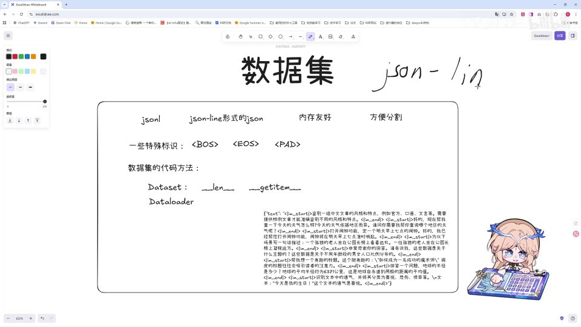
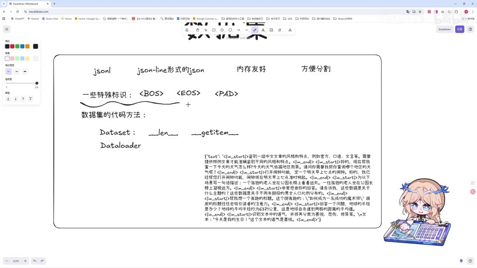
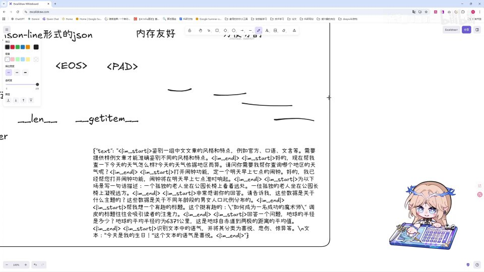
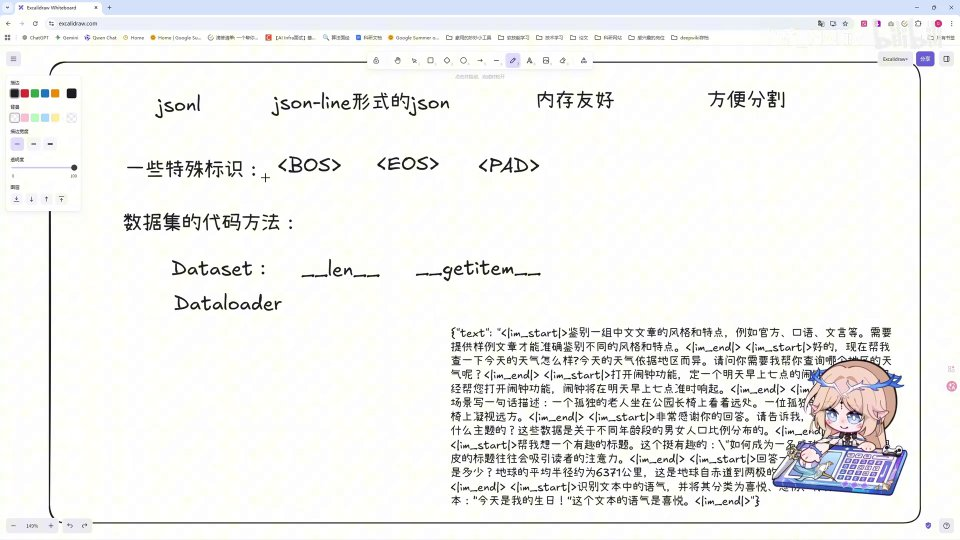
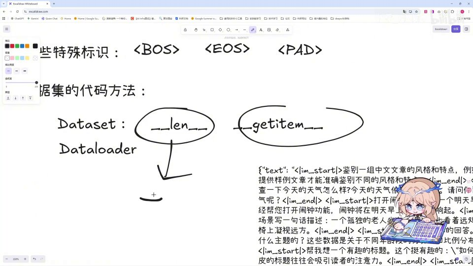
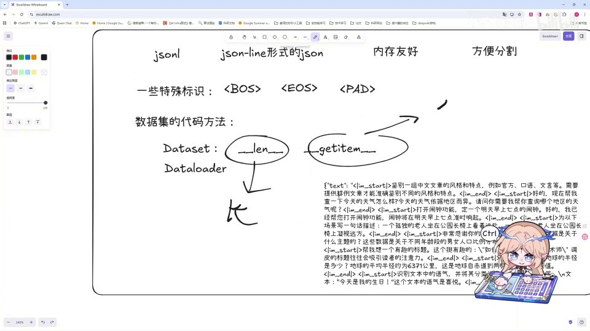

# 第21讲：重制 Dataset：理论

## 本讲要解决的核心问题（SCQA）

**背景**：前面二十讲，我们已经把 Minimind 的模型骨架搭得差不多了——从注意力、FFN、RMSNorm，到 GQA、RoPE、SwiGLU，TransformerBlock 的每一块积木都单独手写实现过。模型的结构已经清楚了，但模型再漂亮，也得"吃饭"：它的食物就是**数据**。

**冲突**：数据不是随便一堆 txt 扔进去就行。大模型训练需要海量的文本，这些文本要先被组织成一种规范的集合，再被切成模型能吃的形式（一串整数 id），还得在关键位置塞进一些"暗号"，告诉模型哪里是开头、哪里是结尾、什么时候该停、哪些位置是凑数占位的。这一整套约定，就是 **Dataset（数据集）** 要解决的问题。而且 up 主发现早期版本的代码有改动、相关知识也有错误，所以这一讲是**重制版**的理论课。[【跳转到 00:00】](https://www.bilibili.com/video/BV1T2k6BaEeC/?p=21&t=0)

**疑问**：数据集到底长什么样？为什么用 JSONL 而不是普通 JSON？那些 `<BOS>`、`<EOS>`、`<PAD>` 是什么、为什么必须有？PyTorch 又是用哪两个类、哪些方法，把一条条数据变成模型能读的输入？

**回答（中心思想）**：数据集就是**多条数据的集合**，工程上通常用 **JSONL** 格式存储（一行一条 JSON，内存友好、切分方便）；为了训练，需要在文本里加入 **BOS / EOS / PAD** 等特殊标识来标记边界、终止和补齐；而 PyTorch 用 **`Dataset`** 类定义"数据从哪来"（必须实现 `__len__` 和 `__getitem__`），用 **`DataLoader`** 负责"怎么成批、多线程地把数据取出来"。抓住这四件事——**格式、特殊标识、Dataset、DataLoader**，就把数据集理论这条线走通了。

---

## 一、数据集是什么：大模型靠"词语接龙"学会规律

先说结论：**数据集就是多条数据组成的集合，是喂给大模型的"课本"**。

我们训练大模型的时候，需要为它准备海量的文本数据。举一个最朴素的例子：数据集里的某一条内容可能是一段文字，我们把这个内容"喂"给大模型，模型通过一系列规律的学习，逐渐学会一件事——**怎样做"词语接龙"**。也就是说，给定前面的词，预测下一个词。正是无数次的"下一个词该是什么"，让模型学会语言规律。[【跳转到 00:15】](https://www.bilibili.com/video/BV1T2k6BaEeC/?p=21&t=15)

### 1.1 "词语接龙"到底在学什么

很多人第一次听到"预测下一个词"会觉得太简单了——这能学到什么？其实不然。要让模型准确预测下一个词，它必须在内部隐式地学会大量知识：

- 学**语法**：知道"我喜欢吃"后面更可能接名词，而不是介词；
- 学**常识**：知道"太阳从东边升起"，所以"太阳从西边____"的答案有倾向；
- 学**风格**：知道书面语和口语的用词差异；
- 甚至学**推理**：面对"因为下雨，所以____"，能接上"带伞"。

所以在 Minimind 这类从零实现的模型里，**"词语接龙"不是一个玩具任务，而是大模型学习的唯一训练目标**。我们把海量文本喂进去，模型不断猜下一个词、和真实的下一个词对比、修正参数，久之就"读"懂了语言的规律。

### 1.2 数据集就是"多条数据的集合"

既然模型是拿一条条数据来学的，那么"数据集"这个词就很好理解了：它本身就是**很多条这样的数据的一个集合**。你可以把它类比成一本练习册，每一页是一道题（一条数据），一本册子就是数据集；模型一次抽一小批题目来练，练完再来下一批，反复很多轮（epoch）。

这里先埋下一个关键认知：**数据集只负责"存和取数据"，它本身不决定模型怎么算**。真正决定"怎么喂、喂多少、并行几路"的，是后面要讲的 `DataLoader`。这一点想清楚了，第五节就不会觉得绕。


这张总览图，其实就是本讲后面所有内容的目录：左边讲"格式"（JSONL、内存友好、方便分割），中间讲"特殊标识"（BOS/EOS/PAD），下面讲"代码方法"（Dataset 的 `__len__`、`__getitem__` 和 DataLoader）。接下来我们逐一展开。

---

## 二、为什么用 JSONL：一行一条，内存友好又方便切分

### 2.1 JSONL 是什么

数据集一般用什么形式存呢？答案是 **JSONL**。顾名思义，可以把它拆成 **JSON + L**：前面的 JSON 就是大家熟悉的那种键值对格式，后面的 **L 是 line（行）的意思**——合起来就是"**每一行是一个 JSON**"。[【跳转到 00:40】](https://www.bilibili.com/video/BV1T2k6BaEeC/?p=21&t=40)

关键点在于：**每一个 JSON 体都是一行内容**。[【跳转到 01:05】](https://www.bilibili.com/video/BV1T2k6BaEeC/?p=21&t=65)

为了直观，我们看一个 JSONL 的样子（形式示意）：

```json
{"text": "今天天气真好，我想去公园散步。"}
{"text": "猫咪正在窗台上晒太阳。"}
{"text": "这本书讲述了一个关于勇气的故事。"}
```

注意：**三行是三条独立数据**，而不是一个 JSON 数组。每读完一行，就拿到一条完整记录。

而普通 JSON（整体式）长这样：

```json
[
  {"text": "今天天气真好，我想去公园散步。"},
  {"text": "猫咪正在窗台上晒太阳。"},
  {"text": "这本书讲述了一个关于勇气的故事。"}
]
```

两段内容完全一样，但**结构截然不同**：普通 JSON 用一对方括号把全部数据包成"一个数组"，必须整体读完才能解析；JSONL 则是"一行一条"，天然可以逐行流式处理。这个差别，正是下面两个好处的根源。



打个比方，普通 JSON 像一个**大箱子**，把所有东西塞进一个括号里；而 JSONL 像一排**带编号的小抽屉**，每个抽屉里恰好放一条记录，一行一个。要拿第 5 条？打开第 5 个抽屉即可，不用先翻遍整个箱子。

### 2.2 看一眼真实的 JSONL 数据集

我们拿 Minimind 官方的一个比较小的数据集来看：可以清楚地看到它是**每一行都有一个单独的 JSON 体**。[【跳转到 01:25】](https://www.bilibili.com/video/BV1T2k6BaEeC/?p=21&t=85)


在后续的 SFT（指令微调）数据里，你还会看到每条 JSON 里带着 `role` 和 `content` 这样的字段——比如用户说的话、助手回答的话，都是各自一条记录。这样模型才能学会"对话"这种一问一答的结构。[【跳转到 01:30】](https://www.bilibili.com/video/BV1T2k6BaEeC/?p=21&t=90)


对比一下就很清楚：

- **预训练数据**往往只有一个 `text` 字段，里面是一大段自然文本；
- **SFT 对话数据**通常有 `role`（谁在说：user / assistant）和 `content`（说了什么）两个字段，一条 JSON 代表一轮对话里的一个发言。

因此，同样是 JSONL，**字段结构会随训练阶段而变**——这正是数据集设计要灵活的地方。

### 2.3 JSONL 相比普通 JSON 的两个好处

那么这种"一行一个 JSON"的形式，到底好在哪里？主要有两点。[【跳转到 01:35】](https://www.bilibili.com/video/BV1T2k6BaEeC/?p=21&t=95)

**好处一：内存友好。** 它排列得更加紧密，不像原来的 JSON 那样"写两个大括号之后，中间夹了很多行"。普通 JSON 必须把整个文件解析完才能用，文件越大越吃内存；JSONL 可以一行一行地读，读一行处理一行，内存压力小得多。想象一下几十 GB 的训练语料：普通 JSON 可能还没开始训练，内存就先爆了。[【跳转到 01:40】](https://www.bilibili.com/video/BV1T2k6BaEeC/?p=21&t=100)

**好处二：方便分割。** 因为每一行独立成条，所以我可以很方便地"按行分割"，一下就知道哪一部分是哪一条 JSON。想切分出第 1000 到 2000 条？直接取对应的行就行。这也是为什么很多大数据工具（比如 `wc -l` 数行、`shuf` 打乱行）都能直接作用于 JSONL。[【跳转到 01:40】](https://www.bilibili.com/video/BV1T2k6BaEeC/?p=21&t=100)

这两点让它成了**数据集最常用的存储形式**。你可以这么记：**普通 JSON 是"整体"，JSONL 是"逐行"**——要处理海量数据时，"逐行"远比"整体"省心。

---

## 三、特殊标识（上）：BOS / EOS 告诉模型句子的边界和何时停下

了解完格式，接下来要认识数据集里的一些**特殊字符（特殊标识）**。up 主说明这些其实是"前置知识"，这里额外做一些补充。[【跳转到 01:40】](https://www.bilibili.com/video/BV1T2k6BaEeC/?p=21&t=100)

我们拿出预训练数据集的一部分，会看到里面有很多"奇怪的地方"：比如这里有一个 `im_start`，那里又有一个 `im_end`。这是什么意思呢？[【跳转到 02:05】](https://www.bilibili.com/video/BV1T2k6BaEeC/?p=21&t=125)



答案是：**我们在训练模型时，需要让模型知道哪一部分是所谓的开头，哪一部分是整个序列的结尾**。所以我们要加上这些特殊的标识去告诉它：这样一个句子是一句的开头、一句的结尾。[【跳转到 02:30】](https://www.bilibili.com/video/BV1T2k6BaEeC/?p=21&t=150)


### 3.1 为什么句子边界这么重要

因为模型看到的是连续的 token 流，它并不知道"哪里到哪算一句话"。如果不加边界标识，多句话连在一起，模型就会把它们当成一个整体来学，既学不好句子的起止，也难以在需要时生成"完整的一句话"。

可以这样理解：如果把一篇文章的所有标点和段落都删掉、连成一片，人类读起来都会懵，模型更是如此。加上 `im_start` / `im_end`（或在更底层用 `<BOS>` / `<EOS>`）后，**每一句话的边界就明确了**——模型知道"哦，这里开始一个新单元；这里，这个单元结束了"。

### 3.2 EOS：模型怎么知道"我该停下来了"

再看第二个问题。大家知道，**模型的输出是流式的——它会一个词一个词地往外"弹字"**。那么我们什么时候才能知道模型输出完了呢？[【跳转到 02:30】](https://www.bilibili.com/video/BV1T2k6BaEeC/?p=21&t=150)

做法是：**让模型输出一个特殊的标识**，比如 `<EOS>`（End Of Sequence，序列结束）。一旦看到这个标识，我们就知道模型在这里输出完了。反过来说，**模型在训练时也学会了"一般这个地方会有一个 EOS"，于是生成到那里它就自动停止输出**。这就是特殊标识的第一个核心作用：控制终止。[【跳转到 02:55】](https://www.bilibili.com/video/BV1T2k6BaEeC/?p=21&t=175)

这里有一个很关键的因为所以：**如果没有 EOS，模型理论上可以无限地往外弹字**，因为它不知道"什么时候算完"。推理程序通常会给一个最大长度上限兜底，但真正让模型"体面地停下来"的，是它学会了在合适位置输出 EOS。



到这里，两个最基本的边界标识就清楚了：

- **`<BOS>`**：Beginning Of Sequence，**序列的开头**；
- **`<EOS>`**：End Of Sequence，**序列的结尾**（也是让模型停下的信号）。

[【跳转到 03:10】](https://www.bilibili.com/video/BV1T2k6BaEeC/?p=21&t=190)

顺便说明一下 `im_start` / `im_end` 与 `<BOS>` / `<EOS>` 的关系：前者更像是**对话模板层面的标记**（把每一段"谁在说话"圈起来），后者更像是**序列层面的边界**（整个输入从哪开始、到哪结束）。它们服务的目的是一致的——**给模型明确的边界信息**，只是在不同的粒度上工作。

---

## 四、特殊标识（下）：PAD 填充到固定长度，且不参与计算

除了 BOS 和 EOS，还有第三个特殊标识：**`<PAD>`**。PAD 的意思就是 **padding（填充）**。[【跳转到 03:10】](https://www.bilibili.com/video/BV1T2k6BaEeC/?p=21&t=190)

### 4.1 为什么需要 PAD：长度必须对齐

先说背景：**我们把数据喂给模型时，需要让喂进去的数据是一个固定的长度，比如 1000**（这个数字只是举例）。[【跳转到 03:21】](https://www.bilibili.com/video/BV1T2k6BaEeC/?p=21&t=201)

为什么非要固定长度？因为 GPU 最擅长的是**批量、规整的矩阵运算**。如果一批数据长度参差不齐，就没法整齐地排成一个方阵一次算完，只能一条条串行算，效率大打折扣。所以工程上习惯把一批数据"拉齐"到同一个长度。

但现实是，每条数据的长度天生不一样。视频里随手举了个例子：目标是 1000 的长度，手上那条数据长度和 1000 对不上，会剩下一段差额。这种情况下，常用的做法就是——**在后面补上 PAD**，硬凑到目标长度。[【跳转到 03:21】](https://www.bilibili.com/video/BV1T2k6BaEeC/?p=21&t=201)


用一个具体场景来看（数字为示意）：

```text
原始数据：  [w1, w2, w3]                      长度 = 3
目标长度：  5
填充后：    [w1, w2, w3, <PAD>, <PAD>]        长度 = 5
```

短视频里 up 主在黑板上一路写下了数字并圈出差额，重点表达的就是"**多退少补、补的部分就叫 PAD**"这件事。

### 4.2 PAD 的规矩：参与对齐，但不参与计算

补 PAD 不是随便补，还有一条非常重要的规矩：**我们会告诉模型，这些 PAD 不参与 attention 里的计算，也不参与 loss 的计算**。这样我们只是为了**凑成一个固定长度**，去更好地让 GPU 去计算——这就是 PAD。[【跳转到 03:40】](https://www.bilibili.com/video/BV1T2k6BaEeC/?p=21&t=220)[【跳转到 03:52】](https://www.bilibili.com/video/BV1T2k6BaEeC/?p=21&t=232)

为什么必须"不参与计算"？因为 PAD 是人为填充的、没有意义的占位符。

- **如果让它参与 attention**：模型会去关注一堆无意义的符号，注意力被"稀释"，学到的是噪声；
- **如果让它参与 loss**：模型会去学"如何预测 PAD"，损耗训练目标。

所以工程上会用一个 **mask（掩码）** 把这些位置标记出来，在计算注意力分数和损失时把它们屏蔽掉。结果就是：**PAD 只占位置、不产生任何梯度**，纯粹是为了"对齐长度、方便 GPU 批量并行"。



一句话总结这一节：**BOS 标头、EOS 标尾、PAD 补齐**——三个特殊标识各管一件事，缺一不可。理解了它们，再看真实数据集里那些"奇怪的符号"，就不会陌生了。

---

## 五、PyTorch 怎么加载数据集：Dataset 与 DataLoader

理论讲完，终于到"代码层面"。我们需要了解 **PyTorch 里加载 Dataset 用到的代码方法**。[【跳转到 04:02】](https://www.bilibili.com/video/BV1T2k6BaEeC/?p=21&t=242)

PyTorch 作为一个深度学习框架，**早在"大模型"这个词出现之前，就已经内置定义好了 `Dataset` 和 `DataLoader`**：一个负责"怎样去定义一个数据集"，一个负责"怎样去加载一个数据集"。[【跳转到 04:07】](https://www.bilibili.com/video/BV1T2k6BaEeC/?p=21&t=247)


### 5.1 Dataset：必须实现 `__len__` 和 `__getitem__`

当我们自定义一个 `Dataset` 的时候，有**内置的方法必须实现**，也就是 `__len__` 和 `__getitem__` 这两个。[【跳转到 04:07】](https://www.bilibili.com/video/BV1T2k6BaEeC/?p=21&t=247)

- **`__len__`**：告诉我们**数据集有多长**（一共多少条）。[【跳转到 04:07】](https://www.bilibili.com/video/BV1T2k6BaEeC/?p=21&t=247)
- **`__getitem__`**：告诉我们**从数据集里应该怎样拿出每一条数据**。[【跳转到 04:32】](https://www.bilibili.com/video/BV1T2k6BaEeC/?p=21&t=272)


用伪代码表示，一个 Dataset 类的骨架大致是这样：

```python
class MyDataset(Dataset):
    def __init__(self, path):
        self.data = load_jsonl(path)      # 先把 JSONL 读进来

    def __len__(self):
        return len(self.data)             # 有多少条

    def __getitem__(self, index):
        return process(self.data[index])  # 第 index 条怎么取、怎么加工
```

**为什么偏偏是这两个？** 因为 PyTorch 想用一种统一的方式访问任意数据集。它只要知道"你有多少条"（`__len__`）和"第 i 条怎么取"（`__getitem__`），就足够把数据一条条取出来了。这其实是 Python 里"让对象支持 `len()` 和 `obj[i]`"的魔法方法：定义好它们，你的数据集就能像列表一样被索引和遍历，PyTorch 也能对它做统一下标访问。

这里要特别强调一句：**`__init__` 不是"必须实现的方法"意义上的强制项，但几乎所有 Dataset 都会有**，用来加载文件、建立索引。真正被框架约定为"接口"的，是 `__len__` 和 `__getitem__`——少了它们，`DataLoader` 就没法工作。

### 5.2 `__getitem__` 里真正做的事：把文本变成 id

光"取出文本"还不够。我们实际发送给模型的时候，**发送的应该是经过 tokenizer 处理之后的 id**——比如本质上发出去的是 `0、1、2、3、4` 这样一些 id 号。[【跳转到 04:42】](https://www.bilibili.com/video/BV1T2k6BaEeC/?p=21&t=282)



这里补一句解释：**tokenizer（分词器）** 负责把一段文字切分成一个个 token，再把每个 token 映射成一个整数 id。模型内部只认整数，不认文字。所以 `__getitem__` 里通常要做的加工就是：

```text
取出原始文本  →  交给 tokenizer  →  返回对应的 id 序列
"你好世界"    →  ["你", "好", "世", "界"]  →  [108, 265, 411, 892]
```

一句话：**`__getitem__` 不只是"取"，还要"转"**。把 JSONL 里存的文字，转成模型真正能吃的整数序列。[【跳转到 04:49】](https://www.bilibili.com/video/BV1T2k6BaEeC/?p=21&t=289)

这也解释了为什么前面要讲 JSONL 和特殊标识：JSONL 决定了"一条数据怎么存"，特殊标识决定了"文本里要嵌哪些边界符号"，而 `__getitem__` 就是把这两者最终转成模型能读的 id。三块知识到这里就串起来了。

### 5.3 DataLoader：负责"成批、多线程"地把数据端上来

除了 `Dataset`，还有一个方法叫做 **`DataLoader`**。它同样是从 `Dataset` 里获取数据，只是**它有内置的一些定义，能够实现多批次（batch）的数据收集，以及多线程的调用**，是对 `Dataset` 本身数据获取的一种**优化**。[【跳转到 05:03】](https://www.bilibili.com/video/BV1T2k6BaEeC/?p=21&t=303)



用法上也很好记——把 `Dataset` 实例包一层：

```python
dataset = MyDataset("data.jsonl")
loader = DataLoader(dataset, batch_size=8, shuffle=True, num_workers=4)
```

几个参数一看就懂：

- `batch_size`：一次取几条，决定"多批次"里每批的大小；
- `shuffle`：是否打乱顺序，训练时通常打开，避免模型记住"数据的先后"；
- `num_workers`：开几个子进程/线程去取数，实现"多线程调用"，在 GPU 算一批的同时，后台已经在准备下一批。

打个比方：

- **`Dataset`** 像一本**账本**，规定"第几条是什么"，你问一条它给你一条；
- **`DataLoader`** 像一位**跑腿的助手**，按照你要求的 batch 大小，一次取一批，还能开多个线程同时取，把数据源源不断地端到 GPU 面前。

所以二者的分工可以一句话概括：**`Dataset` 定义数据"从哪来、怎么取"，`DataLoader` 定义数据"怎么成批、怎么并行地送出去"**。这一讲只讲理论，下一块我们将正式进入**预训练 Dataset 的代码编写**。[【跳转到 05:03】](https://www.bilibili.com/video/BV1T2k6BaEeC/?p=21&t=303)

---

## 小结

1. **数据集就是多条数据的集合**，是喂给大模型的"课本"，模型通过它做"词语接龙"式的规律学习。[00:15](https://www.bilibili.com/video/BV1T2k6BaEeC/?p=21&t=15)
2. **工程上用 JSONL 存储数据集**：JSON + line，一行一条 JSON；相比整体式 JSON，它**内存友好、方便按行分割**，是数据集最常用的形式。[00:40](https://www.bilibili.com/video/BV1T2k6BaEeC/?p=21&t=40)
3. **特殊标识用来给模型"立规矩"**：`<BOS>` 标序列开头，`<EOS>` 标序列结尾并让模型知道何时停止输出；对话数据里还会用 `im_start` / `im_end` 圈出每段发言。[03:10](https://www.bilibili.com/video/BV1T2k6BaEeC/?p=21&t=190)
4. **`<PAD>` 用于把长度补齐到固定值**，同时约定 PAD **不参与 attention、也不参与 loss**，只为对齐长度、方便 GPU 计算。[03:21](https://www.bilibili.com/video/BV1T2k6BaEeC/?p=21&t=201)
5. **PyTorch 用 `Dataset` 定义数据集**，必须实现 `__len__`（有多长）和 `__getitem__`（怎么取一条）。[04:07](https://www.bilibili.com/video/BV1T2k6BaEeC/?p=21&t=247)
6. **`__getitem__` 里做 tokenization**：把文本交给 tokenizer，返回模型真正能吃的 id 序列（如 0、1、2、3、4）。[04:42](https://www.bilibili.com/video/BV1T2k6BaEeC/?p=21&t=282)
7. **`DataLoader` 负责成批与多线程取数**，是对 `Dataset` 取数过程的优化；两者分工明确，合起来才是完整的数据供给链。[05:03](https://www.bilibili.com/video/BV1T2k6BaEeC/?p=21&t=303)

---

## 关键术语速查

| 术语 | 一句话解释 |
| --- | --- |
| Dataset（数据集） | 多条数据的集合，是喂给大模型训练的"课本"。 |
| JSONL | JSON + line，每一行是一条独立 JSON 的文本格式。 |
| JSON | 常见的键值对数据格式，一整块用大括号包起来；JSONL 是其"逐行版"。 |
| 词语接龙 | 对语言模型训练目标的通俗比喻：给定前面的词，预测下一个词。 |
| 特殊标识 | 嵌在文本里的控制符号，用来标记边界、终止和填充，如 BOS/EOS/PAD。 |
| im_start / im_end | 成对出现的对话模板标识，用来圈出一段内容的开头与结尾。 |
| BOS（Beginning Of Sequence） | 序列开头标识，告诉模型"从这里开始"。 |
| EOS（End Of Sequence） | 序列结尾标识，也是模型生成时"停下来"的信号。 |
| PAD（padding） | 填充标识，把序列补齐到固定长度；约定不参与 attention 和 loss 计算。 |
| mask（掩码） | 用来屏蔽 PAD 等无效位置的机制，让它们不参与注意力与损失计算。 |
| PyTorch | 深度学习框架，很早以前就内置了 Dataset 和 DataLoader。 |
| Dataset（类） | PyTorch 中定义数据集需要继承的类，必须实现 `__len__` 和 `__getitem__`。 |
| `__len__` | 返回数据集一共有多少条数据。 |
| `__getitem__` | 定义"第 i 条数据怎么取"，通常在这里做 tokenization 并返回 id。 |
| tokenizer（分词器） | 把文本切分成 token、再把 token 映射为整数 id 的工具。 |
| token | 文本被切分后的基本单元，模型实际处理的对象。 |
| DataLoader | 从 Dataset 批量、多线程取数的工具，是数据获取的优化层。 |
| batch（批次） | 一次取一批数据，供模型一次前向/反向处理，提升 GPU 利用率。 |
| num_workers | DataLoader 的并行取数进程/线程数，取数与前向计算可重叠进行。 |
