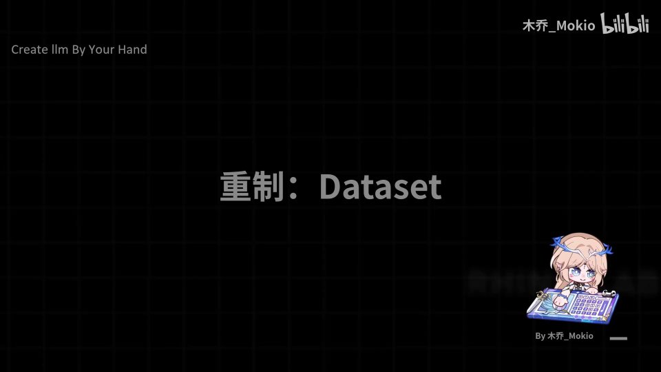
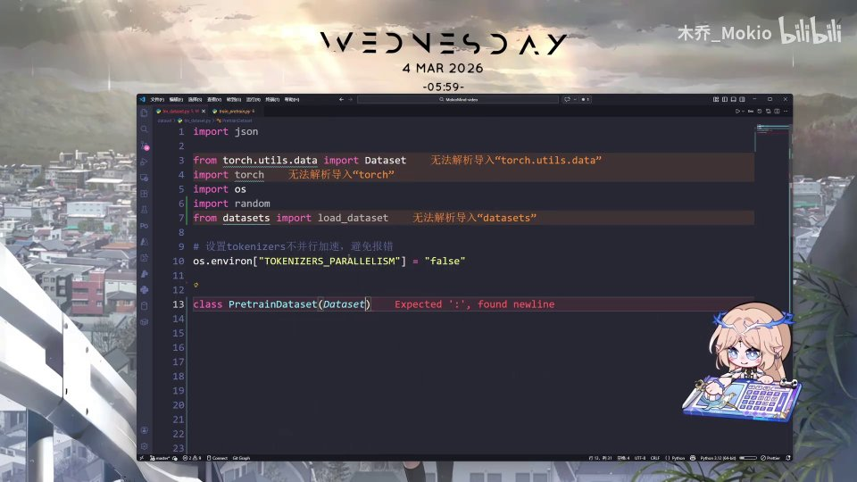
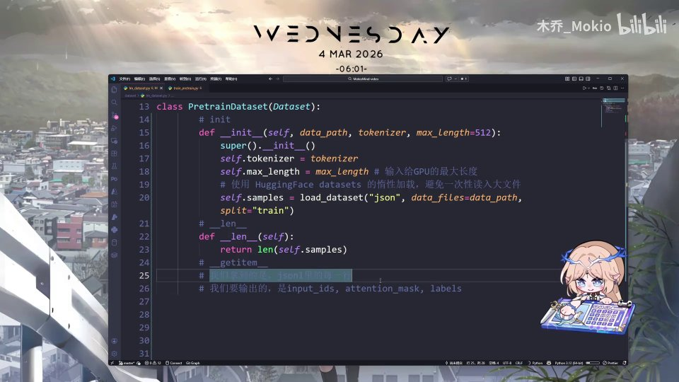
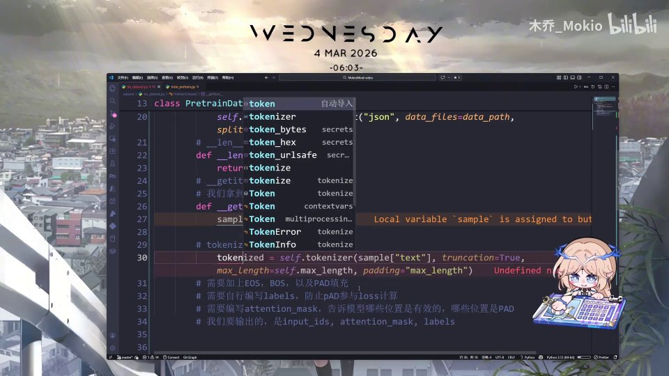
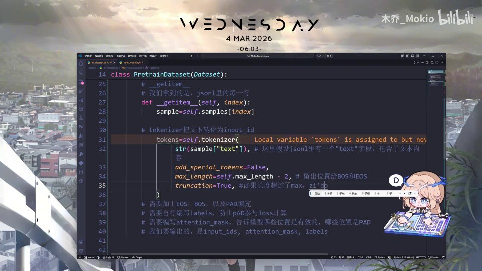
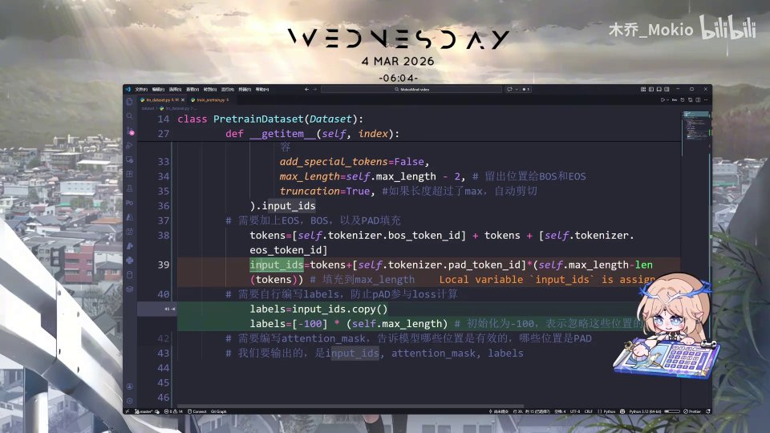
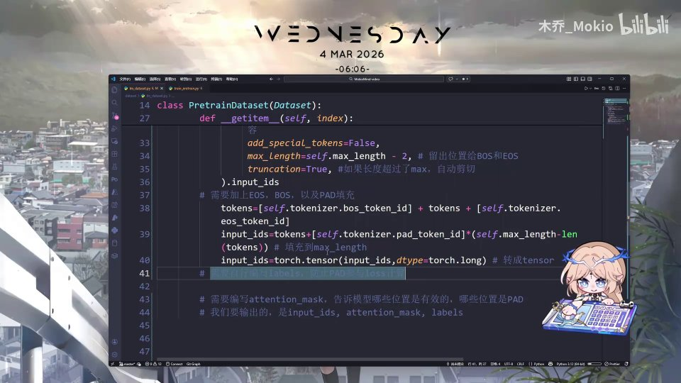

# 第22讲：重制 Dataset —— 手写 PyTorch 预训练数据集的代码实现

## 本讲要解决的核心问题（SCQA）

**背景**：前面几讲我们一直在讲大模型预训练的"数据流"：数据是怎么来的、怎么被清洗、怎么被 tokenizer 变成一串数字。我们已经知道模型训练时吃的不是原始文字，而是 `input_ids`、`labels`、`attention_mask` 这三个张量。

**冲突**：知道了"要什么"不等于"拿得到"。真正把一堆 JSONL 文本文件变成模型能直接消费的张量，需要写一个能对接 PyTorch 训练循环的 `Dataset` 类；而这一步里藏着几个初学者最容易写错、也最容易被忽略的细节——特殊 token 要不要让 tokenizer 自动加？`labels` 里为什么会出现 `-100`？`attention_mask` 又是干嘛的？

**疑问**：这个预训练用的 `Dataset` 到底该怎么写？每一行代码背后对应的是什么原理？

**回答（中心思想）**：这一讲我们从零手写一个 `PretrainDataset` 类。它只需要实现 PyTorch 规定的三个方法——`__init__`、`__len__`、`__getitem__`；核心工作是在 `__getitem__` 里把一行文本处理成三个对齐的张量：`input_ids`（喂给模型的 id 序列）、`labels`（监督信号，PAD 位置被置为 `-100` 以便被 loss 自动忽略）、`attention_mask`（标记哪些位置有效）。把这三样东西返回出去，整个数据集的逻辑就闭环了。

下面我们按代码的实际编写顺序，一步步拆解。

[【跳转到 00:00】](https://www.bilibili.com/video/BV1T2k6BaEeC/?p=22&t=0)

---

## 一、一切都从"继承 PyTorch 的 Dataset 类"开始

写任何自定义数据集，第一步都是"站在巨人的肩膀上"：继承 PyTorch 官方提供的 `Dataset` 基类，然后重写它规定的方法。本讲开头先把之前已经写好的导入部分复制过来，这段直接去代码仓库复制粘贴即可。

[【跳转到 00:06】](https://www.bilibili.com/video/BV1T2k6BaEeC/?p=22&t=6)

我们的类叫 `PretrainDataset`，表示"预训练用的数据集"，它继承自 `torch.utils.data.Dataset`：

```python
from torch.utils.data import Dataset
import torch
import os
import random
from datasets import load_dataset

os.environ["TOKENIZERS_PARALLELISM"] = "false"

class PretrainDataset(Dataset):
    ...
```



关于导入部分有两个小点值得说：

- `from datasets import load_dataset`：这是 HuggingFace `datasets` 库提供的加载接口，它能直接读取 `json`、`parquet` 等格式并支持"惰性加载"，避免一次性把整个大文件读进内存。
- `os.environ["TOKENIZERS_PARALLELISM"] = "false"`：关闭 tokenizer 的多进程并行，主要是为了规避多进程环境下的警告和偶发报错。

[【跳转到 00:11】](https://www.bilibili.com/video/BV1T2k6BaEeC/?p=22&t=11)


### 为什么继承 `Dataset` 就够了？

因为 PyTorch 的 `DataLoader` 只认一个约定：**一个对象只要有 `__len__` 和 `__getitem__` 两个方法，就能被当作数据集**。`Dataset` 基类本身几乎不做事，它的价值在于"声明契约"——提醒我们至少要实现这些方法。继承之后，需要实现的东西很明确：

1. `__init__`：初始化。
2. `__len__`：告诉调用方这个数据集一共有多少条样本。
3. `__getitem__`：给定一个下标，返回对应的那一条样本。

[【跳转到 00:36】](https://www.bilibili.com/video/BV1T2k6BaEeC/?p=22&t=36)

对应的代码骨架是这样：

```python
class PretrainDataset(Dataset):
    def __init__(self, ...):
        ...
    def __len__(self):
        ...
    def __getitem__(self, index):
        ...
```



> 一句话记忆：**`__init__` 负责"准备"、`__len__` 负责"报数"、`__getitem__` 负责"取货"。** 训练时 `DataLoader` 会不断调用 `__getitem__` 把下标变成真正能喂给模型的数据。

---

## 二、`__init__`：把 tokenizer、序列长度、数据三样东西准备好

`__init__` 是数据集的"库房管理员"，它只在数据集被创建时执行一次。我们要在里面预定义好三样东西：**tokenizer、最大长度、全部数据**。

[【跳转到 01:01】](https://www.bilibili.com/video/BV1T2k6BaEeC/?p=22&t=61)

```python
def __init__(self, data_path, tokenizer, max_length=512):
    super().__init__()
    self.tokenizer = tokenizer
    self.max_length = max_length          # 输入给 GPU 的最大长度
    # 使用 HuggingFace datasets 的惰性加载，避免一次性读入大文件
    self.samples = load_dataset("json", data_files=data_path,
                                split="train")
```


这四行里每一行都有讲究：

- **`super().__init__()`**：调用父类的初始化。继承场景下养成"先初始化父类"的习惯，是安全写法。
- **`self.tokenizer = tokenizer`**：tokenizer 从外面传进来。为什么不在这里新建？因为 tokenizer 通常还要被模型、被推理代码共用，保持"同一个实例"能确保编码规则完全一致。
- **`self.max_length = max_length`**：这是**序列的最大长度**——不是数据的长度，而是每条样本被编码后最多保留多少个 token。默认给了 512。它决定了张量的形状，也直接关系到显存占用。
- **`self.samples = load_dataset(...)`**：真正加载数据。这里传入 `"json"` 指定格式，`data_files=data_path` 指定文件路径，`split="train"` 表示取训练集分支。

### 为什么强调"惰性加载"？

假设数据文件有几个 GB，如果用普通方式读进内存，还没开始训练内存就先爆了。`datasets` 的惰性加载（memory-mapped）把数据映射到磁盘，只有真正访问某一条时才把它读出来。这对大模型预训练这种"数据量远超内存"的场景几乎是必需品。

---

## 三、`__len__` 与 `__getitem__`：数据集对外开的两个口子

准备好数据之后，要让数据能被取用，只差两个方法。

### 3.1 `__len__`：报数

它简单到只有一行——返回样本总数：

[【跳转到 01:26】](https://www.bilibili.com/video/BV1T2k6BaEeC/?p=22&t=86)

```python
def __len__(self):
    return len(self.samples)
```


这行代码跑通后，`len(dataset)` 就能正常返回一个整数，`DataLoader` 也才知道一轮 epoch 要迭代多少次。

### 3.2 `__getitem__`：整个教程的真正主战场

`__getitem__` 拿到一个下标 `index`，要返回这条样本的三个张量：`input_ids`、`attention_mask`、`labels`。但中间的加工流程有好几步，我们先在纸上把"输入是什么、输出是什么、中间要经过什么"捋清楚，再写代码。

[【跳转到 01:51】](https://www.bilibili.com/video/BV1T2k6BaEeC/?p=22&t=111)

**输入**：JSONL 里的一行，经过解析后是一个字典，里面至少有一个 `"text"` 字段，装着原始文本。

**输出**：三个张量——

- `input_ids`：把文本编码成的一串 token id；
- `attention_mask`：一串 0/1，标记哪些位置是有效的；
- `labels`：监督信号，形状通常与 `input_ids` 一致。

**中间处理步骤**：

1. 用 tokenizer 把文本转成 token id；
2. 加上 `BOS`（序列开头）和 `EOS`（序列结尾）；
3. 用 `PAD` 补足到固定长度；
4. 自行构造 `labels`，把 PAD 位置置为 `-100`；
5. 构造 `attention_mask`，标记有效/无效位置。

[【跳转到 02:16】](https://www.bilibili.com/video/BV1T2k6BaEeC/?p=22&t=136)



下面我们把这几步逐一落到代码。

---

## 四、从一行 JSONL 到 `input_ids`：tokenize 的三个关键开关

先取出这一条样本，再调用 tokenizer 编码。

[【跳转到 02:41】](https://www.bilibili.com/video/BV1T2k6BaEeC/?p=22&t=161)

```python
def __getitem__(self, index):
    sample = self.samples[index]
    text = sample["text"]
    # tokenizer 把文本转化为 input_id
    tokens = self.tokenizer(
        str(sample["text"]),
        add_special_tokens=False,
        max_length=self.max_length - 2,   # 留出位置给 BOS 和 EOS
        truncation=True,
    ).input_ids
```



这里 tokenizer 的三个参数是初学最容易踩坑的地方，我们逐个解释。

### 4.1 `add_special_tokens=False`：不要自动加特殊 token

一般调用 `tokenizer(text)` 时，tokenizer 会"贴心"地在开头/结尾自动补上它认识的 `[CLS]`、`[SEP]` 之类特殊 token。但在预训练里，我们要自己精确控制序列的头尾——**在前面加 `BOS`、在后面加 `EOS`**。如果让 tokenizer 自动加，序列里就会混进我们不想要的东西，或者重复。所以这里明确关掉它。

[【跳转到 03:31】](https://www.bilibili.com/video/BV1T2k6BaEeC/?p=22&t=211)

### 4.2 `max_length=self.max_length - 2`：给 `BOS` 和 `EOS` 留座位

我们最终要把序列补到 `self.max_length`（比如 512）那么长，但因为后面还要各自在头和尾插入一个 `BOS`、一个 `EOS`，这两个 token 也要占位置。所以这里先让正文最多只编码到 `max_length - 2`。**不减这 2，最终拼接完就会超出目标长度。**

### 4.3 `truncation=True`：超长就自动截断

如果某条正文编码后长度超过 `max_length - 2`，就自动截掉多余部分。这保证每条样本都落在可控的长度预算内，避免个别超长样本把显存撑爆。

[【跳转到 03:56】](https://www.bilibili.com/video/BV1T2k6BaEeC/?p=22&t=236)

最后 `.input_ids` 把编码结果里的 id 序列取出来，赋给 `tokens`。

> 小结这一步的"输入输出"：**输入**是一段文字（可能很长、可能含特殊符号）；**输出**是一串长度不超过 `max_length - 2` 的整数 id，且没有被 tokenizer 擅自插入特殊符号。

---

## 五、拼接 `BOS` / `EOS` 并用 `PAD` 补齐

### 5.1 给序列带上"开始"和"结束"

拿到正文的 token 后，我们在头尾各加一个边界标识：

[【跳转到 04:21】](https://www.bilibili.com/video/BV1T2k6BaEeC/?p=22&t=261)

```python
# 需要加上 EOS、BOS，以及 PAD 填充
tokens = [self.tokenizer.bos_token_id] + tokens + [self.tokenizer.eos_token_id]
```



**为什么需要 `BOS` 和 `EOS`？**

- `BOS`（Begin Of Sentence，句子开始符）：告诉模型"一句话从这里开始"，让模型学会从"空"开始预测第一个 token。
- `EOS`（End Of Sentence，句子结束符）：告诉模型"一句话到这里结束"，模型学会在结尾处输出 EOS，推理时我们也能靠它判断该停下。

在自回归语言模型里，模型的任务就是"看着前面的 token 预测下一个 token"。有了明确的起止符，模型才能学出"哪里是开头、哪里是结尾"的规律。

### 5.2 补 `PAD` 到固定长度

一批数据要一起送进 GPU，就需要形状一致（等长）。所以不足的部分用 `PAD` 补齐：

[【跳转到 04:46】](https://www.bilibili.com/video/BV1T2k6BaEeC/?p=22&t=286)

```python
input_ids = tokens + [self.tokenizer.pad_token_id] * (self.max_length - len(tokens))  # 填充到 max_length
```


**这行在做什么？** 用列表乘法一次性生成 `max_length - len(tokens)` 个 `pad_token_id`，追加在 `tokens` 后面。举例：如果当前 `tokens` 长 800，目标长度 1000，那么就补 200 个 PAD，序列刚好变成 1000。补完之后，每条样本长度都整齐地等于 `max_length`。

> 直觉理解：`PAD` 就是"占位符"，本身没有语义，只是为了让这一批的张量形状统一。但正因为它没有语义，我们在计算 loss 时必须把它排除掉——这正是下一节 `labels` 要做的事。

### 5.3 一个完整的数值走查

光看公式容易抽象，我们把一条真实的短样本从头到尾走一遍。假设 `max_length = 8`，正文编码后得到 `[10, 20, 30, 40]`（长度为 4）：

1. **加特殊 token**：`[BOS, 10, 20, 30, 40, EOS]`，长度变成 `n = 6`。
2. **补 PAD**：需要补 `max_length - n = 8 - 6 = 2` 个 PAD（设 `pad_id = 0`），得到 `[BOS, 10, 20, 30, 40, EOS, 0, 0]`，长度正好是 8。
3. **转张量**：`input_ids = tensor([BOS, 10, 20, 30, 40, EOS, 0, 0], dtype=torch.long)`。
4. **造 labels**：先 clone，再把等于 0（PAD）的位置改成 `-100`，得到 `[BOS, 10, 20, 30, 40, EOS, -100, -100]`。
5. **造 attention_mask**：非 PAD 置 1、PAD 置 0，得到 `[1, 1, 1, 1, 1, 1, 0, 0]`。

对照着看就很清楚：**三个张量长度完全一致，指向的是同一批位置，只是"角色"不同**——`input_ids` 是给模型的输入，`labels` 是监督目标，`attention_mask` 是注意力开关。这也解释了为什么它们必须严格等长：位置一一对应，模型才能在"这个位置的输入"和"这个位置的目标"之间建立联系。

如果正文本身恰好是 8 个 token 呢？那么编码时 `max_length - 2 = 6`，正文会被截断到 6 个，加上 BOS/EOS 刚好 8 个，**不会有 PAD**，此时 `labels` 里也就不会出现 `-100`。这说明 `-100` 的数量是"动态的"，完全取决于每条样本的真实长度。

---

## 六、转成张量，并构造 `labels`：为什么 PAD 要变成 `-100`

### 6.1 转成 PyTorch 张量

Python 列表还不能直接参与 GPU 计算，要转成张量：

[【跳转到 05:11】](https://www.bilibili.com/video/BV1T2k6BaEeC/?p=22&t=311)

```python
input_ids = torch.tensor(input_ids, dtype=torch.long)  # 转成 tensor
```



`dtype=torch.long` 是 64 位整数类型。token id 必须是整数，`long` 也是 PyTorch 里做 embedding 查表最常用的索引类型。

### 6.2 画个图理解 `labels` 的构造

视频里用一张手绘图把这一步讲得非常直观。假设原始 id 序列是这样的：

```text
id:     [ 1, 2, 3, PAD ]
```

我们希望对应的 `labels` 变成：

```text
label:  [ 1, 2, 3, -100 ]
```

[【跳转到 05:36】](https://www.bilibili.com/video/BV1T2k6BaEeC/?p=22&t=336)

即：真实 token 保持不变，**PAD 的位置统一替换成 `-100`**。

![手绘示意图：id 序列 [1,2,3,PAD] 对应标签 [1,2,3,-100]，标注为 cross loss](assets/第22讲_重制Dataset：代码/00341.jpg)

### 6.3 `-100` 是 PyTorch 的"忽略暗号"

为什么偏偏是 `-100`？因为 PyTorch 的 `CrossEntropyLoss`（交叉熵损失）有一个默认参数 `ignore_index`，它的默认值正是 `-100`。也就是说：

> 凡是 `labels` 里等于 `-100` 的位置，计算 loss 时会被**自动跳过**，既不产生梯度，也不影响梯度。

[【跳转到 05:41】](https://www.bilibili.com/video/BV1T2k6BaEeC/?p=22&t=341)

**为什么必须忽略 PAD？** 因为 PAD 不是真实内容，它只是为了凑长度。如果我们把"预测 PAD"也当成学习目标，模型就会花力气去学一个没有意义的规律，白白浪费算力、还可能带偏训练。把 PAD 换成 `-100`，就干净地把它排除在 loss 之外了。

### 6.4 代码实现

[【跳转到 06:47】](https://www.bilibili.com/video/BV1T2k6BaEeC/?p=22&t=407)

```python
labels = input_ids.clone()
labels[labels == self.tokenizer.pad_token_id] = -100  # 将 PAD 位置的标签设为 -100
```



- **`.clone()`**：复制一份，确保修改 `labels` 时不会连带改到 `input_ids`。
- **`labels[labels == self.tokenizer.pad_token_id] = -100`**：这是 PyTorch 的布尔索引（mask 赋值），把所有等于 `pad_token_id` 的位置一次性赋成 `-100`。

至此，`labels` 就构造完成了。

---

## 七、自回归与 shift：为什么可以直接克隆，而不用手动平移？

这里有个容易被追问的细节：**语言模型是自回归的，为什么 `labels` 直接等于 `input_ids`，而不做"错位（shift）"？**

### 7.1 什么是自回归

自回归（autoregressive）的意思是：**模型在每一步都根据前面已经出现的 token，预测下一个 token**。训练时，输入序列并不是一次性喂进去的，而是在因果掩码（causal mask）的作用下，让第 `t` 个位置的输出只能看到 `1..t` 的信息。

视频里用手写的方式描述了这个过程：

[【跳转到 06:06】](https://www.bilibili.com/video/BV1T2k6BaEeC/?p=22&t=366)

- 先传入 `1`，让它预测 `2`；
- 再传入 `1, 2`，让它预测 `3`；
- 再传入 `1, 2, 3`，让它预测下一个……

这就像"考试时遮住后半段答案，只让你根据已经看到的部分往下写"。

### 7.2 为什么代码里能"偷懒"

如果在一个"裸"的模型里实现自回归，我们通常需要手动把 `labels` 相对 `input_ids` 左移一位（shift），让"第 t 个位置的标签 = 第 t+1 个位置的输入"。但本项目的 `CausalLM` 模型**内部已经内置并实现了这个自回归/错位逻辑**，所以 `Dataset` 这一层直接 `clone` 一份即可，不需要再手动平移。

[【跳转到 06:31】](https://www.bilibili.com/video/BV1T2k6BaEeC/?p=22&t=391)

```python
labels = input_ids.clone()
```

> 视频作者也补了一句：这块如果暂时听不懂，**不影响接下来的代码编写**。记住结论即可——**训练目标的对齐由模型内部负责，数据集只负责提供干净的 `input_ids` 和 `labels`。**

---

## 八、`attention_mask`：告诉模型哪些位置该被"看见"

三个张量里最后一个，也是概念上最直观的一个。

[【跳转到 07:12】](https://www.bilibili.com/video/BV1T2k6BaEeC/?p=22&t=432)

```python
attention_mask = (input_ids != self.tokenizer.pad_token_id).long()
```


### 8.1 这行代码怎么读

1. `input_ids != self.tokenizer.pad_token_id`：逐元素比较，得到一个布尔张量——非 PAD 的位置是 `True`，PAD 的位置是 `False`。
2. `.long()`：把布尔值转成 0/1 整数，`True → 1`、`False → 0`。

于是得到的 `attention_mask` 长这样：

```text
attention_mask: [ 1, 1, 1, 0 ]
```

[【跳转到 07:37】](https://www.bilibili.com/video/BV1T2k6BaEeC/?p=22&t=457)

### 8.2 `attention_mask` 到底有什么用

**是什么**：一个和序列等长的 0/1 向量，1 表示"这个位置是真实内容"，0 表示"这是 PAD，请忽略"。

**为什么需要**：注意力机制（attention）在计算时，如果不去屏蔽 PAD，模型会把"填充位"也当成有效信息参与加权。这不仅浪费计算，还会污染表示、影响训练效果。

**怎么做**：把 `attention_mask` 传给模型，模型在计算 attention 分数时会将 mask 为 0 的位置赋上极小值（近似负无穷），使它们的注意力权重趋近于 0，从而"看不见"这些位置。

[【跳转到 07:44】](https://www.bilibili.com/video/BV1T2k6BaEeC/?p=22&t=464)

### 8.3 为什么不用 `-100` 去管 attention，也不用 mask 去管 loss？

初学者常会问：既然 `-100` 和 `attention_mask` 都在标记 PAD，能不能只用一个？答案是**不能**，因为它们作用的计算环节完全不同：

- 计算 **loss** 时，模型已经把整条序列前向算完了，它需要的是"哪些位置不算损失"——这是 `labels` 的职责，用 `-100` 告诉 `CrossEntropyLoss`。
- 计算 **attention** 时，序列还没有输出，模型需要的是"哪些位置不能互相看见"——这是 `attention_mask` 的职责，用 0 告诉注意力层把权重压到 0。

换句话说，`-100` 只影响"算完之后的评分"，`attention_mask` 影响"算的过程本身"。两者是两条流水线上各管一段的开关，缺一不可。理解了这一点，也就理解了为什么 `__getitem__` 必须同时返回这两个字段。

[【跳转到 07:44】](https://www.bilibili.com/video/BV1T2k6BaEeC/?p=22&t=464)

> 记忆口诀：**`-100` 管 loss（不算梯度），`attention_mask` 管 attention（不算注意力）。** 两者一个作用于"损失计算"，一个作用于"注意力计算"，分工不同、缺一不可。

---

## 九、收尾：把三样东西 `return` 出去

所有步骤完成后，把结果返回：

[【跳转到 07:52】](https://www.bilibili.com/video/BV1T2k6BaEeC/?p=22&t=472)

```python
return {
    "input_ids": input_ids,
    "labels": labels,
    "attention_mask": attention_mask,
}
```

（视频里这一步直接让 AI 生成即可。）返回后，`DataLoader` 会把一批这样的字典自动堆叠成 batch 张量，交给训练循环。至此，整个 `PretrainDataset` 的逻辑就编写完成了。

### 9.1 返回的字典之后经历了什么

`__getitem__` 每次只返回**一条**样本；真正训练时，`DataLoader` 会按 `batch_size` 一次性取若干条，再交给默认的 `collate_fn` 把它们的同名字段拼在一起：

- 若干 `input_ids`（各长 `max_length`）堆叠成形状 `(batch_size, max_length)` 的矩阵；
- 若干 `labels` 同样堆叠成 `(batch_size, max_length)`；
- 若干 `attention_mask` 堆叠成 `(batch_size, max_length)`。

正因为我们在前面已经把每条样本都严格补到了 `max_length`，这里才能顺利用默认的 `collate` 直接堆叠，而不用写复杂的"变长序列 padding"逻辑。这也是一种"在数据端多花一点功夫，换取训练端更省心"的典型权衡。

### 9.2 这个 Dataset 在整条链路里的位置

回过头看整条预训练数据链路：**原始语料 → 清洗 → 存成 JSONL → `PretrainDataset`（本讲）→ `DataLoader` → 模型前向 → 计算 loss → 反向传播**。本讲完成的正是"JSONL 到张量"这最关键的一跳。下一部分将在这个数据集的基础上，正式进入预训练的代码实现（如何取 batch、如何前向、如何反向、梯度如何累积等）。

---

## 十、把整段代码串起来看

把前面各段拼起来，一个完整可用的预训练数据集长这样：

```python
import os
import torch
from torch.utils.data import Dataset
from datasets import load_dataset

os.environ["TOKENIZERS_PARALLELISM"] = "false"


class PretrainDataset(Dataset):
    def __init__(self, data_path, tokenizer, max_length=512):
        super().__init__()
        self.tokenizer = tokenizer
        self.max_length = max_length
        self.samples = load_dataset("json", data_files=data_path, split="train")

    def __len__(self):
        return len(self.samples)

    def __getitem__(self, index):
        sample = self.samples[index]
        tokens = self.tokenizer(
            str(sample["text"]),
            add_special_tokens=False,
            max_length=self.max_length - 2,
            truncation=True,
        ).input_ids
        tokens = [self.tokenizer.bos_token_id] + tokens + [self.tokenizer.eos_token_id]
        input_ids = tokens + [self.tokenizer.pad_token_id] * (self.max_length - len(tokens))
        input_ids = torch.tensor(input_ids, dtype=torch.long)

        labels = input_ids.clone()
        labels[labels == self.tokenizer.pad_token_id] = -100

        attention_mask = (input_ids != self.tokenizer.pad_token_id).long()
        return {"input_ids": input_ids, "labels": labels, "attention_mask": attention_mask}
```

回头看，这一讲其实只做了三件事：

1. **搭骨架**：继承 `Dataset`，实现 `__init__` / `__len__` / `__getitem__`。
2. **造数据**：把一行文本 tokenize、加 BOS/EOS、补 PAD，变成定长的 `input_ids`。
3. **加约束**：用 `-100` 屏蔽 PAD 对 loss 的影响，用 `attention_mask` 屏蔽 PAD 对 attention 的影响。

---

## 小结

- **PyTorch 数据集的契约**：只需实现 `__init__`（准备）、`__len__`（报数）、`__getitem__`（取货）三个方法，就能被 `DataLoader` 使用。
- **`__init__` 三件套**：tokenizer、`max_length`、`load_dataset` 惰性加载的数据。
- **tokenize 的三个关键开关**：`add_special_tokens=False`（自己控制特殊 token）、`max_length - 2`（给 BOS/EOS 留位）、`truncation=True`（超长自动截断）。
- **BOS/EOS/PAD 各司其职**：BOS/EOS 标记句子边界，PAD 把序列补齐到统一长度。
- **`labels` 中的 `-100`**：`CrossEntropyLoss` 默认忽略 `-100`，用它把 PAD 排除出 loss 计算。
- **为什么能直接 clone**：自回归的错位逻辑已内置在 `CausalLM` 模型里，数据集层无需手动 shift。
- **`attention_mask`**：非 PAD 置 1、PAD 置 0，让注意力机制忽略填充位置。
- **最终产物**：`__getitem__` 返回 `input_ids`、`labels`、`attention_mask` 三个对齐的张量。

---

## 关键术语速查

| 术语 | 一句话解释 |
| --- | --- |
| `PretrainDataset` | 本讲手写的预训练数据集类，继承 `torch.utils.data.Dataset`。 |
| `torch.utils.data.Dataset` | PyTorch 官方数据集基类，定义了 `__len__` / `__getitem__` 的约定。 |
| `__init__` | 数据集初始化方法，只在创建时执行一次，负责准备 tokenizer、长度和数据。 |
| `__len__` | 返回样本总数，让 `DataLoader` 知道一轮要迭代多少次。 |
| `__getitem__` | 给定下标返回一条处理好的样本（三个张量），是数据处理的核心。 |
| `load_dataset` | HuggingFace `datasets` 提供的加载接口，支持 `json` 等格式与惰性加载。 |
| 惰性加载 | 数据映射到磁盘、按需读取，避免一次性把大文件读进内存。 |
| tokenizer | 把文本切分并映射成 token id 的工具，也负责特殊 token 的 id 管理。 |
| `add_special_tokens=False` | 关闭 tokenizer 自动添加特殊 token，改由我们自己精确控制。 |
| `max_length` | 编码后序列的最大长度，决定张量形状和显存占用。 |
| `truncation` | 序列超过长度上限时自动截断。 |
| `BOS` | Begin Of Sentence，句子开始符，标记序列起点。 |
| `EOS` | End Of Sentence，句子结束符，标记序列终点。 |
| `PAD` | 填充 token，仅为对齐批次长度，本身无语义。 |
| `input_ids` | 文本编码后的 token id 序列，是模型的主输入。 |
| `labels` | 监督信号，PAD 位置被置为 `-100` 以避免参与 loss。 |
| `-100` | PyTorch `CrossEntropyLoss` 的默认 `ignore_index`，表示该位置不计算 loss。 |
| `attention_mask` | 0/1 向量，标记哪些位置有效（1）和无效（PAD=0）。 |
| 自回归（autoregressive） | 模型根据前面已出现的 token 逐步预测下一个 token。 |
| shift（错位） | 传统实现中把 labels 相对 input 左移一位；本项目已内置，无需手写。 |
| `CausalLM` | 因果语言模型，内部已实现因果掩码与自回归对齐逻辑。 |
| `torch.long` | PyTorch 的 64 位整数类型，常用作 token id 和 embedding 索引。 |
| `.clone()` | 复制张量，避免对 `labels` 的修改影响到 `input_ids`。 |
