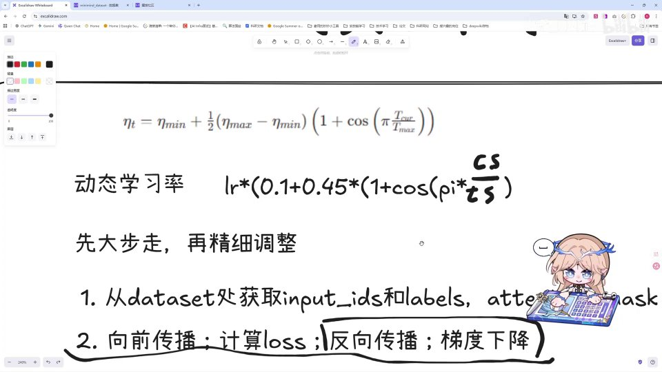
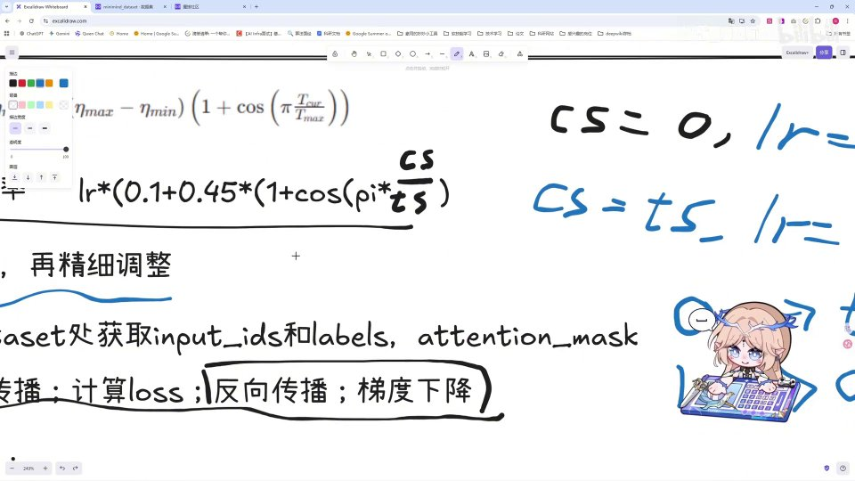
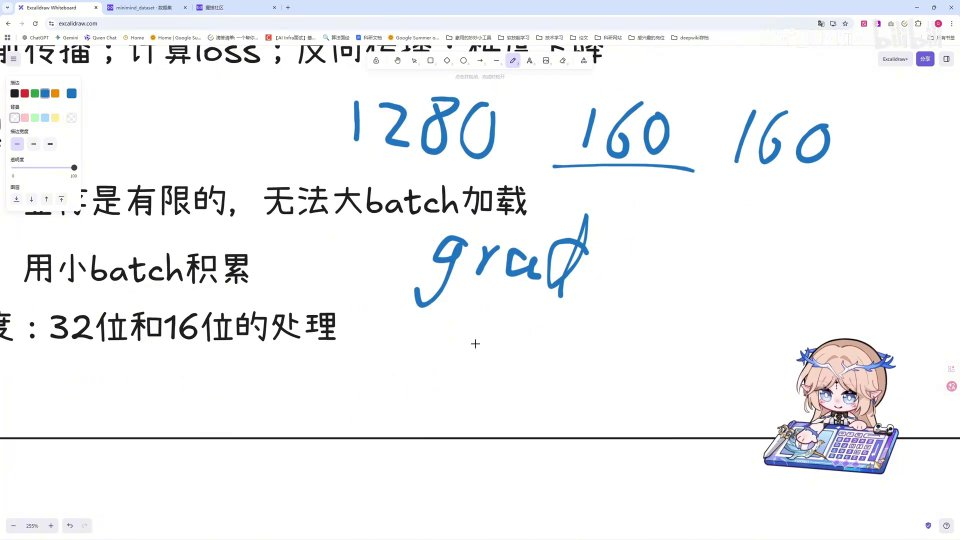
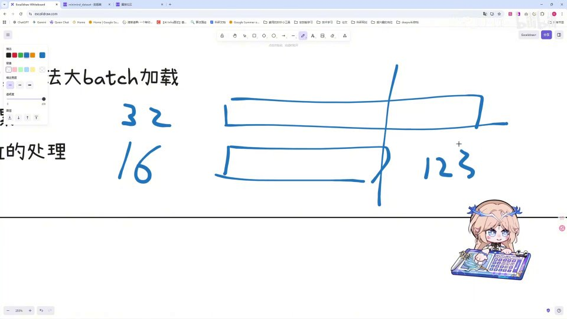

# 第23讲：重制 Pretrain——预训练的理论

## 本讲要解决的核心问题（SCQA）

**背景**：在 Minimind 的重制系列里，我们已经把模型结构、数据集等前置知识过了一遍。接下来要真正开始「训练模型」，也就是预训练（Pretrain）。

**冲突**：很多人对预训练的理解停留在「把数据喂给模型」这一句上。可一旦翻开训练代码，就会看到一堆没听过的名词：动态学习率、余弦退火、梯度累积、混合精度、scaler……它们分别在解决什么问题？为什么缺了它们训练就会不稳定、跑不动？

**疑问**：预训练到底是什么？一次完整的训练循环包含哪几步？为什么学习率要动态变化，而不是固定一个值？梯度累积和混合精度这两个「隐藏技巧」又是在显存和精度之间做什么样的权衡？

**回答（中心思想）**：预训练本质上是一次「填鸭式」的自监督训练——把海量资料一股脑喂给模型，让它学会「下一个词该是什么」。它的骨架很简单，就是「前向传播 → 计算 loss → 反向传播 → 梯度下降」四步循环；但为了让这个大循环稳定又高效，必须加上三个优化策略：**动态学习率（余弦退火）**负责让训练先大步后精细，**梯度累积**负责用小显存模拟大 batch，**混合精度 + scaler** 负责在省内存的同时保住精度。本讲就把这套理论讲清楚，为下一讲的代码实操铺路。

---

## 一、预训练是什么：一次「填鸭式」的猜下一个词训练

先看名字。预训练的「预」，就是「预先」，指的是它发生在所谓**正式训练**和**正式使用**之前。[【跳转到 00:00】](https://www.bilibili.com/video/BV1T2k6BaEeC/?p=23&t=0)

那预训练具体做什么呢？一句话：**它就是一次「填鸭」**。我们把自己收集到的所有资料，一股脑地直接喂给模型，模型就在这么多资料里学会一件事——「我下一句应该生成哪一个词。」[【跳转到 00:10】](https://www.bilibili.com/video/BV1T2k6BaEeC/?p=23&t=10)

这里有两个关键点值得初学者记住：

1. **它是自监督的**。我们不需要人工标注「正确答案」，因为文本本身既是输入也是答案——给定前面几个词，下一个词就是天然的标签。这正是「填鸭」能成立的原因。
2. **它的产物是一个「基座」**。预训练结束后，模型只是学会了语言的统计规律，还不擅长对话或做具体任务；后面还要经过微调（SFT）等阶段，才能真正变得好用。

如果不熟悉这个概念，可以按前置知识里的视频继续深入学习。

---

## 二、训练的四个基本步骤：一个永不停止的循环

不管模型多大，「训练」这个词拆开来只有四步，预训练也不例外：[【跳转到 00:35】](https://www.bilibili.com/video/BV1T2k6BaEeC/?p=23&t=35)

1. **前向传播（Forward）**：把输入数据送进网络，一层层算过去，得到模型当前的预测。
2. **计算 loss（损失）**：把预测和正确答案比对，用一个数（loss）衡量「错得有多离谱」。
3. **反向传播（Backward）**：根据 loss，算出每个参数对错误的「责任」，也就是梯度。
4. **梯度下降（Update）**：沿着梯度的反方向，把参数往「错误更小」的方向挪一点点。

这四步反复循环成千上万次，模型就一点点变聪明了。前两步是「看清现状」，后两步是「改正错误」。

其中，第四步更新参数时，用的是一个非常朴素的公式。以某个权重参数 W 为例：[【跳转到 01:00】](https://www.bilibili.com/video/BV1T2k6BaEeC/?p=23&t=60)

$$
W = W - \eta \cdot \text{grad}
$$

用大白话说就是：**新参数 = 旧参数 − 学习率 × 梯度**。这里的**学习率**（符号常写作 lr 或 η）就是「每一步迈多大」的系数。

- 学习率太小 → 每一步都挪一点点，训练慢得像蜗牛。
- 学习率太大 → 一步迈太猛，可能直接跨过最低点，导致震荡甚至发散。

所以学习率怎么设，是训练里最关键的超参数之一。而本讲要讲的第一个优化策略，就是**让学习率不再是一个固定的值**。

---

## 三、为什么要动态学习率：固定学习率的两个毛病

视频里给出了很直观的理由。如果我们全程把学习率固定成某一个值，那么「每次学习所要改变的内容」也会比较相近，这会导致一些常见问题：[【跳转到 01:25】](https://www.bilibili.com/video/BV1T2k6BaEeC/?p=23&t=85) [【跳转到 01:30】](https://www.bilibili.com/video/BV1T2k6BaEeC/?p=23&t=90)

- **梯度爆炸 / 梯度消失**：早期参数离最优解很远，如果步子太小就走不动；而某些方向上梯度又可能累积得过大。
- **训练不稳定**：固定步长无法同时适配「前期探索」和「后期收敛」两个阶段，loss 容易上下横跳。

打个比方：找一座山的最低点。

- 一开始你离得远，应该**迈大步**，快速靠近目标；
- 快到谷底时，如果还大步流星，就会在最低点两边反复横跳、永远踩不准。这时应该**收小步子**，慢慢精修。

这就是动态学习率要达成的效果——**训练从开始到结束，学习率从大到小，逐渐下降**。[【跳转到 02:31】](https://www.bilibili.com/video/BV1T2k6BaEeC/?p=23&t=151) 视频里用一句话概括得特别好：**先大步走，再精细调整**。[【跳转到 02:45】](https://www.bilibili.com/video/BV1T2k6BaEeC/?p=23&t=165)

---

## 四、余弦退火学习率：公式与两点代入推导

实现「先大后小」的经典方案叫**余弦退火（Cosine Annealing）**：让学习率沿着余弦曲线从最大值平滑地滑到最小值。视频给出的公式是：[【跳转到 01:35】](https://www.bilibili.com/video/BV1T2k6BaEeC/?p=23&t=95)

$$
\eta_t = \eta_{\min} + \frac{1}{2}(\eta_{\max} - \eta_{\min})\left(1 + \cos\left(\pi \cdot \frac{T_{cur}}{T_{max}}\right)\right)
$$

而在 Minimind 的实际实现里，它被写成了更紧凑、更适合代码的形式：

$$
\text{lr} = lr \times \left(0.1 + 0.45 \times \left(1 + \cos\left(\pi \cdot \frac{cs}{ts}\right)\right)\right)
$$

这里的两个新符号要记住：

- **cs = current step**，当前已经走了多少步；
- **ts = total step**，整个训练一共要走多少步。

视频里特别强调，要「代入式地」验证这个公式对不对。我们跟着算两遍，就能彻底理解它。

**情形一：训练刚开始，cs = 0。** 此时 cs/ts = 0，cos(0) = 1，带入括号里就是 1 + 1 = 2；于是 `0.45 × 2 = 0.9`，再加上 0.1，系数等于 1。而最大值设为一、最小值设为 0.1，所以**学习率正好等于 1（也就是最大值）**。[【跳转到 01:55】](https://www.bilibili.com/video/BV1T2k6BaEeC/?p=23&t=115)

**情形二：训练结束，cs = ts。** 此时 cs/ts = 1，cos(π) = −1，带入括号里就是 1 + (−1) = 0；于是 `0.45 × 0 = 0`，再加上 0.1，系数等于 0.1，**学习率正好等于 0.1（也就是最小值）**。[【跳转到 02:20】](https://www.bilibili.com/video/BV1T2k6BaEeC/?p=23&t=140)

两端都验证无误，中间又由 cos 曲线平滑过渡，所以整个训练过程学习率就是**从 1 逐渐下降到 0.1**。这种「和 cos 有关的学习率」，我们就叫它**余弦退火学习率策略**。[【跳转到 02:52】](https://www.bilibili.com/video/BV1T2k6BaEeC/?p=23&t=172) 想更深入了解的话，可以再去翻相关的知识和论文。

> 小提示：视频里同事把「先大步后精修」理解为——先让模型尽快学习相关内容，到后期再用和 cos 有关的学习率慢慢收敛。[【跳转到 01:40】](https://www.bilibili.com/video/BV1T2k6BaEeC/?p=23&t=100)

---

## 五、预训练主流程：从 dataset 取数据到计算 loss

讲完学习率，回到预训练本身。它的主流程其实非常直白：[【跳转到 03:02】](https://www.bilibili.com/video/BV1T2k6BaEeC/?p=23&t=182)

1. **从 dataset 处获取数据**：得到 `input_ids`、`labels` 和 `attention_mask`。
2. **前向传播**：模型跑一遍，输出预测。
3. **计算 loss**：把预测和 labels 比对，得到损失。
4. **反向传播 + 梯度下降**：更新参数，进入下一轮。

[【跳转到 03:20】](https://www.bilibili.com/video/BV1T2k6BaEeC/?p=23&t=200)

这里对三个数据的名字做一点解释，初学者最容易在这里卡壳：

- **input_ids**：把文本里的每个词（token）映射成词典编号后的一串整数，是模型的输入。
- **labels**：期望模型输出的「标准答案」。在下一词预测任务里，它通常就是 input_ids 向右平移一位。
- **attention_mask**：注意力掩码，用来告诉模型哪些位置是真实内容、哪些是补齐（padding）出来的无效位置，避免模型去关注填充符号。

之后这些数据经过 **loss 函数**去进行计算，就完成了向前传播这一环。[【跳转到 03:25】](https://www.bilibili.com/video/BV1T2k6BaEeC/?p=23&t=205)

不过视频指出，这里还有**两个方法**需要专门去抠，它们会在后面的代码里处处出现，也是理解「为什么代码要这么写」的关键：**梯度累积**和**混合精度**。下面两节分别讲。

---

## 六、梯度累积：用小显存「拼」出一个大 batch

**梯度累积（Gradient Accumulation）**解决的是显存不够的问题。视频用很接地气的例子说明：[【跳转到 03:33】](https://www.bilibili.com/video/BV1T2k6BaEeC/?p=23&t=213)

打开自己的机器一看，显卡内存只有 **8G**。而训练时我们希望用很大的 batch（比如长度 1280 的 batch）来获得更稳定、更接近真实分布的梯度。但显存装不下这么大的 batch，怎么办？

答案就是：**把大 batch 拆成若干个小 batch，一个一个地算，但先不更新参数，而是把每次算出来的梯度累加起来。**

具体流程是：[【跳转到 03:59】](https://www.bilibili.com/video/BV1T2k6BaEeC/?p=23&t=239)

1. 先加载 160 个样本，做一次前向 + 反向，得到一份梯度；
2. 再加载 160 个样本，同样算一份梯度，**累加**到上一份上；
3. 如此重复 8 次（8 × 160 = 1280），把所有梯度加在一起；
4. 最后**除以 8**，得到一个平均梯度；
5. 用这个平均梯度去更新一次参数。

[【跳转到 04:12】](https://www.bilibili.com/video/BV1T2k6BaEeC/?p=23&t=252)

这一手「先累加、再平均」的技巧，在数学上等价于用一个大 batch 求平均梯度，但**峰值显存只需容纳一个小 batch**。用一句话总结就是：**用时间（更多次的串行计算）换空间（显存）**。代价是训练速度会慢一些，但换来了能训得动大 batch 的可能。

有一个小细节要注意：视频里说「除以八次」，更严谨的说法是**除以累积的步数 8**（取平均），这样梯度量级才和单个大 batch 一致。

---

## 七、混合精度：用 scaler 保住那些「被舍掉的小数」

第二个优化策略是**混合精度（Mixed Precision）**。视频说它不会展开得很细，大家先意会即可，但核心思想一定要懂。[【跳转到 04:12】](https://www.bilibili.com/video/BV1T2k6BaEeC/?p=23&t=252)

**是什么 / 为什么需要**：模型默认常用 **32 位浮点数**（FP32）来存储和计算。32 位很「长」，精度高，但占用的显存也大。为了省内存、加快计算，我们用混合精度——**让它以 16 位的数据方式参与进来**。[【跳转到 04:37】](https://www.bilibili.com/video/BV1T2k6BaEeC/?p=23&t=277) 16 位占用空间小，但**代价是精度下降**。

**举个例子**：假设某个梯度值非常小，比如 `0.000000123`。在 32 位下它能被完整表示；但在 16 位下，由于有效位数只到 16 位，末尾的「123」部分会被直接舍掉，这个数就变成了 0。**而这一部分信息恰恰可能是模型学习所需要的，我们不想抛弃它。**

**怎么做**：解决办法是给它加一个「放大器」，叫 **scaler（梯度缩放器）**。[【跳转到 05:02】](https://www.bilibili.com/video/BV1T2k6BaEeC/?p=23&t=302) 具体分三步：

1. **放大**：把那些很小的梯度值乘上一个放大系数，抬到 16 位能表示的范围内；
2. **计算与学习**：这样这一部分数值也能被完整地参与计算和学习；
3. **还原**：在更新参数之前，再把放大的部分**缩小回去**，恢复原来的量级。

这样一来，我们既享受了 16 位带来的省内存、快计算，又避免了小数值被舍掉导致的精度损失。

---

## 小结

- **预训练的本质是「填鸭」**：把海量资料一股脑喂给模型，让它学会「下一个词该是什么」，属于自监督学习，产出一个语言基座模型。[【跳转到 00:10】](https://www.bilibili.com/video/BV1T2k6BaEeC/?p=23&t=10)
- **训练只有四步**：前向传播 → 计算 loss → 反向传播 → 梯度下降，循环往复。
- **参数更新公式**：`W = W − 学习率 × 梯度`，学习率决定了每一步迈多大。
- **动态学习率的必要性**：固定学习率会带来梯度爆炸/消失、训练不稳定；我们希望「先大步走，再精细调整」。[【跳转到 02:45】](https://www.bilibili.com/video/BV1T2k6BaEeC/?p=23&t=165)
- **余弦退火**让学习率从最大值 1 平滑降到最小值 0.1：CS=0 时 lr=1，CS=tS 时 lr=0.1，两端代入即可验证。[【跳转到 02:20】](https://www.bilibili.com/video/BV1T2k6BaEeC/?p=23&t=140)
- **预训练主流程**：从 dataset 获取 `input_ids`、`labels`、`attention_mask`，经前向传播与 loss 计算完成一轮。
- **梯度累积**用「小 batch 累加梯度再平均」模拟大 batch，用时间换显存。[【跳转到 03:59】](https://www.bilibili.com/video/BV1T2k6BaEeC/?p=23&t=239)
- **混合精度 + scaler** 用 16 位省内存，同时用放大器保住 32 位下才有的小数值，兼顾速度与精度。[【跳转到 05:02】](https://www.bilibili.com/video/BV1T2k6BaEeC/?p=23&t=302)
- 总体而言，预训练的概念和过程都很简单、很传统，难点在于这些配套的优化策略。掌握它们后，就可以进入下一讲的重制版预训练代码讲解了。[【跳转到 05:27】](https://www.bilibili.com/video/BV1T2k6BaEeC/?p=23&t=327)

## 关键术语速查

| 术语 | 一句话解释 |
| --- | --- |
| 预训练（Pretrain） | 在正式训练/使用之前，用海量文本做「猜下一个词」的自监督训练，得到语言基座模型 |
| 前向传播（Forward） | 把输入送进网络逐层计算，得到模型当前的预测输出 |
| loss（损失） | 用数值衡量模型预测与正确答案之间的差距 |
| 反向传播（Backward） | 由 loss 反推每个参数对错误的「责任」，即梯度 |
| 梯度下降（Update） | 沿梯度反方向更新参数：`W = W − lr × grad` |
| 学习率（lr / η） | 每一步参数更新的「步长」大小 |
| 动态学习率 | 训练过程中让学习率随时间变化的策略，通常由大到小 |
| 余弦退火（Cosine Annealing） | 让学习率沿余弦曲线从最大值平滑降到最小值，实现「先大步后精修」 |
| cs / ts | current step（当前步数）/ total step（总步数），余弦退火公式的两把尺子 |
| input_ids | 文本经分词和词典映射后的一串整数编号，是模型输入 |
| labels | 下一词预测任务的标准答案，通常是 input_ids 右移一位 |
| attention_mask | 标记哪些位置是真实内容、哪些是补齐的无效位置 |
| 梯度累积（Gradient Accumulation） | 多个小 batch 分别算梯度再累加平均，用小显存模拟大 batch |
| 混合精度（Mixed Precision） | 部分计算用 16 位以省内存提速，同时兼顾精度 |
| scaler（梯度缩放器） | 混合精度中把过小梯度放大到 16 位可表示范围、更新前再缩回的工具 |
