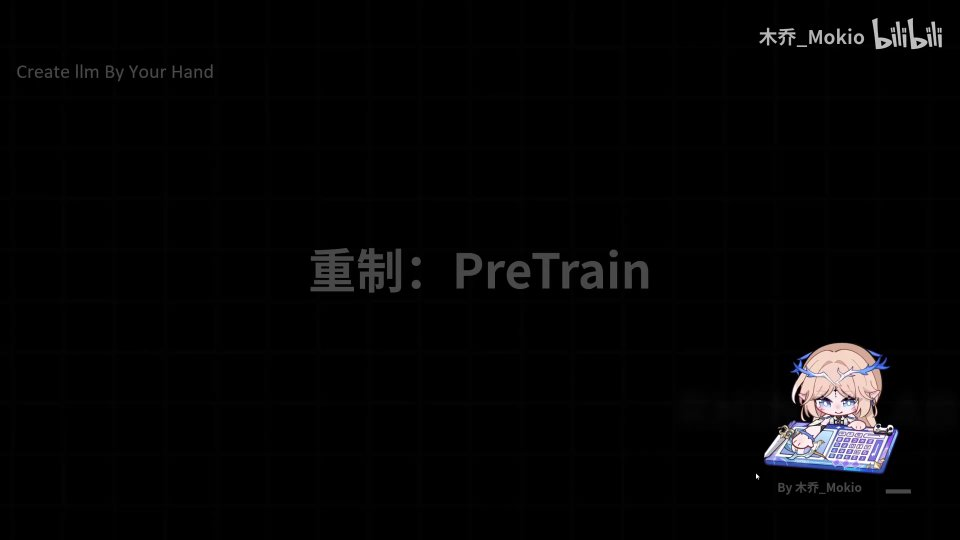
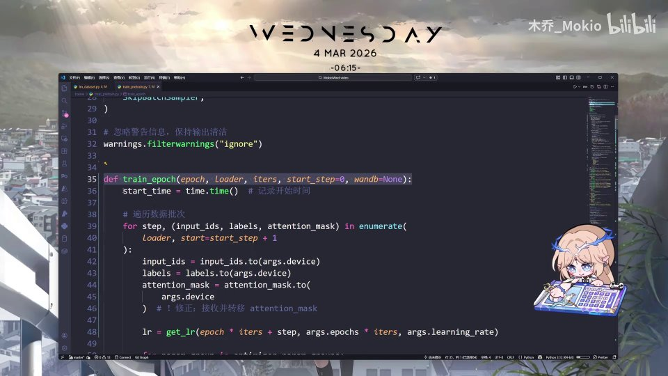
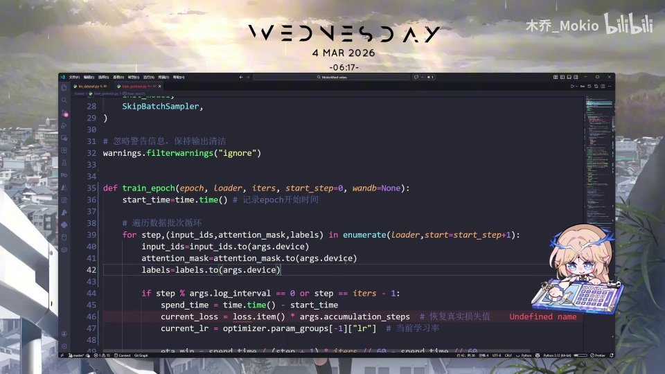
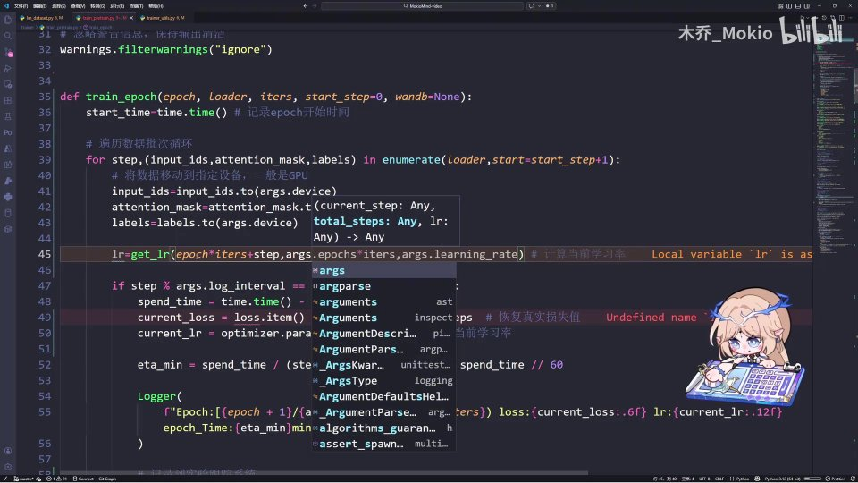
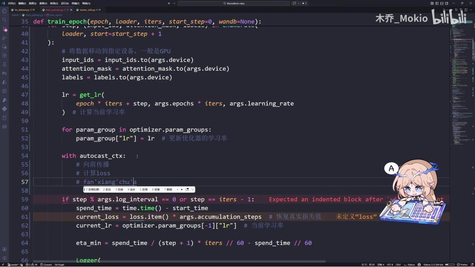
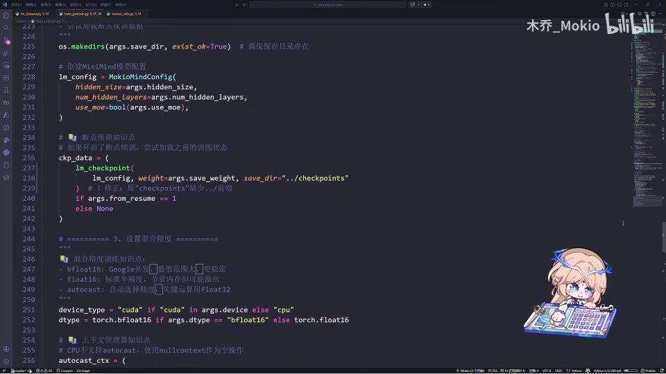
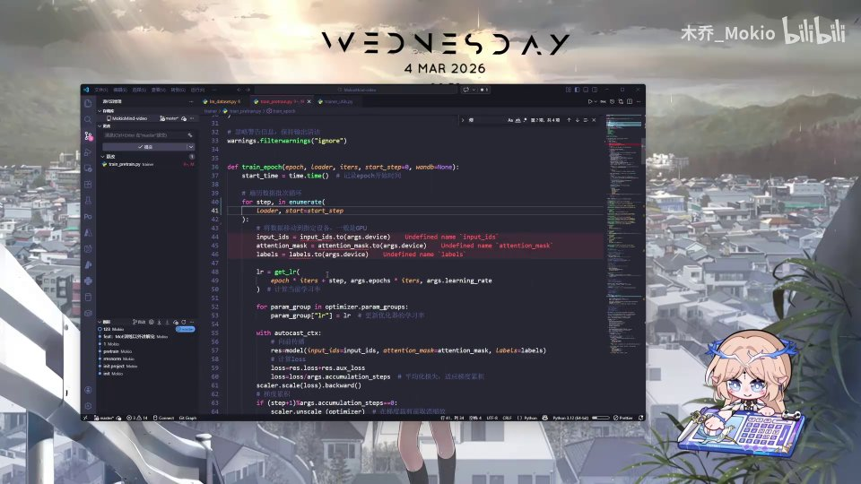

# 第24讲：重制 Pretrain：代码

## 本讲要解决的核心问题（SCQA）

**背景**：前面几讲，我们已经把 MiniMind 的模型结构、数据集（Dataset）这些前置知识补齐了。模型有了，数据也能读进来了，目录结构、配置参数也都理清了。

**冲突**：可预训练脚本整体很长、很复杂，如果从头到尾一句句读，很容易被日志打印、模型保存、命令行参数这些"边角料"淹没，反而错过了最关键的训练主循环；更麻烦的是，很多人抄完一整套代码，仍然说不清"一个 batch 进来以后，到底发生了什么"。

**疑问**：在整份预训练代码里，究竟哪一段是必须吃透的"心脏"？每一批数据进来之后，模型和优化器到底按什么顺序做了哪些事？

**回答（中心思想）**：预训练的核心，只有 `train_epoch` 里那个 batch 循环——把数据搬到设备上、算出动态学习率、进入混合精度上下文，然后跑"前向传播 → 计算 loss → 反向传播 → 参数更新"这训练老四样，再穿插梯度累积与梯度裁剪；其余部分（日志、评估、保存、命令行参数）都是外围设施，可以照抄、可以后补。

本讲我们就跟着作者一段一段手写这个循环，最后还会踩到一个真实的坑，并当场把它修好。

[【跳转到 00:00】](https://www.bilibili.com/video/BV1T2k6BaEeC/?p=24&t=0)

---

## 一、先认清重点：train_epoch 就是预训练的心脏

作者开门见山地说：整个训练脚本比较复杂，学习的时候**可以直接从仓库里复制粘贴，也可以跟着他一起手敲**。不管你选哪一种，都要先明白——真正需要手抄的，只有一处。



这一处就是 `train_epoch` 函数。先解释两个词：

- **epoch（轮）**：指的是"把整份训练数据完整地过一遍"。训练通常要过很多轮，模型才会越学越好。
- **train_epoch**：就是"完成一轮训练"的函数。它内部最核心的，是"每一个 batch 里训练的具体逻辑"。

> 术语：**batch（批）** 指一次喂给模型的一小撮样本。数据动辄几十万、上百万条，不可能一次性全塞进显存，于是切成一批批送进去，每送一批就更新一次参数。

作者的做法是：把原来的 `train_epoch` 内容**先删掉，自己重新手写一遍**。为什么非得手写？因为读懂和默写是两回事——只有自己敲一遍，才会真正记住每一步的来龙去脉，也才敢在出问题时动手改。

[【跳转到 00:10】](https://www.bilibili.com/video/BV1T2k6BaEeC/?p=24&t=10)


那剩下的部分呢？作者建议**保留**——它们是一些实验记录、评估模式、保存 checkpoint 之类的方法。这些不是"最核心"的内容，但相当重要，想深入了解可以自己阅读。本讲的策略非常清晰：**先啃心脏，外围照抄**。对初学者来说，这个取舍尤其重要：不要在还没跑通主循环时，就陷进保存格式、日志样式这些细节里出不来。

[【跳转到 00:35】](https://www.bilibili.com/video/BV1T2k6BaEeC/?p=24&t=35)

---

## 二、起手三件事：计时、循环、搬数据

手写从函数签名开始。`train_epoch` 接收几个参数（后续调用时再细看它们从哪来），进来第一件事是记录开始时间：

```python
def train_epoch(epoch, loader, iters, start_step=0, wandb=None):
    start_time = time.time()   # 记录 epoch 开始时间
```

`time.time()` 会返回当前的时间戳（单位是秒，一个小数）。把它存进 `start_time`，是为了后面算"这一轮已经跑了多久""照这个速度还要多久才能跑完"。

必须先说明：`start_time` 这一行**不是核心逻辑**，它只服务于速度和进度追踪。很多初学者会在这里纠结半天，其实完全没必要——记住它的用途，然后往下走。



### 2.1 遍历数据：for step 循环

接下来进入核心。第一步是**遍历训练数据、依次循环**：

```python
    for step, (input_ids, attention_mask, labels) in enumerate(loader, start=start_step + 1):
        input_ids = input_ids.to(args.device)
        attention_mask = attention_mask.to(args.device)
        labels = labels.to(args.device)
```

这里有几个点值得一个个拆开讲：

- **`step`**：当前是第几步（第几个 batch）。循环每转一圈，`step` 就加一。
- **`enumerate(loader, start=start_step + 1)`**：`enumerate` 给循环编号；`start` 从 `start_step + 1` 开始，是为了支持"断点续训"——如果训练到一半中断过，可以从中断记录的位置接着往后跑，而不是从头再来。
- **`input_ids`**：模型看到的输入 token 编号序列。**token** 是文本切分后的最小单位（可以粗略理解成"词片"），`input_ids` 就是这些 token 对应的整数 id。
- **`attention_mask`**：注意力掩码。它告诉模型"哪些位置是真实内容、哪些是补齐的填充（padding），填充位置不要参与计算"。
- **`labels`**：训练目标，也就是"正确答案"。在语言模型的自监督任务里，它通常是把 `input_ids` 往后移一位得到的——让模型根据前文预测下一个 token。



> 为什么一句话有三个东西？可以这样类比：`input_ids` 是"卷子题目"，`labels` 是"标准答案"，`attention_mask` 是"哪些题才算数、哪些是白占位置的占位符"。三者一起交给模型，它才知道该看什么、该对什么负责。

### 2.2 把数据搬到指定设备

拿到数据后，要把它放到**参数指定的 device（设备）里**。作者在视频里说的是"搬到 CPU 上"，因为演示环境用的是 CPU；实际训练时，这个 `device` 一般会是 `cuda`（也就是 GPU）。

> 术语：**device** 是 PyTorch 里"张量存在哪儿"的概念。模型和数据必须待在同一个设备上，否则运算会直接报错。`.to(args.device)` 就是把张量复制到目标设备。

这三行 `.to(args.device)` 就是"数据搬运工"，虽然简单，但必不可少：**先把模型和数据对齐到同一个设备，再谈计算**。这几行的位置也很关键——一定要在进入模型之前搬好，不能等到算到一半再搬。

[【跳转到 01:25】](https://www.bilibili.com/video/BV1T2k6BaEeC/?p=24&t=85)

---

## 三、动态学习率：get_lr 是怎么来的

数据备好，接下来获取**学习率（learning rate，lr）**。学习率决定每一步参数更新的幅度：太小了学得慢、半天不动；太大了容易震荡甚至发散。它是训练里最需要拿捏的超参数之一。

代码里用 `lr = get_lr(...)` 来取。那这个 `get_lr` 从哪来？它来自一个专门的工具文件 **`trainer_utils.py`**——里面放了一堆训练辅助函数。作者的建议依旧是：**直接从代码仓库复制粘贴过来**。


这个文件里有设置随机种子、初始化之类的常用函数，都不算核心逻辑，想了解可以自己读代码学习。本讲的重点是：**会用、知道它从哪来**就行。这也是一个很实用的学习方法——把"工具函数"和"业务逻辑"分开看：工具函数当作黑盒，知道输入输出即可；真正要反复琢磨的，是调用它的那段业务代码。

### 3.1 get_lr 需要的三个参数

有了 `get_lr` 之后，把参数传进去即可。作者提示函数签名大致是 `get_lr(current_step, total_steps, lr)` 这三个：

```python
    lr = get_lr(
        epoch * iters + step,      # 当前的累计步数
        args.epochs * iters,       # 总的训练步数
        args.learning_rate,        # 我们自己定义的学习率
    )  # 计算当前学习率
```

逐项拆开看：

- **`current_step = epoch * iters + step`**：把"第几轮 × 每轮的步数 + 当前步"合起来，得到从训练开始算起的**全局步数**。`iters` 是每一轮有多少个 batch。
- **`total_steps = args.epochs * iters`**：整个训练计划一共要走多少步。
- **`learning_rate`**：我们配置里的基准学习率。



为什么要同时传"当前步"和"总步数"？因为这里的学习率是**动态的**：典型做法是先用一个热身（warmup）阶段把学习率线性升上去，之后再用余弦（cosine）等方式慢慢衰减到接近零。函数内部根据"我走到哪了 / 总共要走多远"这两个信息，算出这一刻该用多大的学习率，训练会更稳定、收敛更好。

> 一句话概括：**给 `get_lr` 一个进度条上的位置，它告诉你此刻该迈多大的步子。**

### 3.2 把学习率写回优化器

拿到动态学习率之后，还不能直接用它，需要把它**塞进优化器（optimizer）的参数组里**——这是前置知识里讲过的做法：

```python
    for param_group in optimizer.param_groups:
        param_group["lr"] = lr   # 更新优化器的学习率
```

> 术语：**optimizer（优化器）** 是真正执行"参数更新"的组件，常见的有 AdamW、SGD 等。它的 `param_groups` 可以理解成"一组组共享超参数的参数集合"，每一个组里都有一个 `lr` 字段。所以每次算出新的学习率，都要同步改到这些组里，否则优化器根本不知道你换了学习率。

这一步的因果关系要理清：`get_lr` 只是"算出一个数"，真正"让这个数生效"的是 `param_group["lr"] = lr` 这一句。两者缺一不可。

[【跳转到 03:11】](https://www.bilibili.com/video/BV1T2k6BaEeC/?p=24&t=191)

---

## 四、混合精度：一行为什么能换来加速

学习率搞定后，就进入**混合精度**训练。所谓混合精度，就是让模型在部分计算里用更"省"的 16 位浮点数（半精度），在关键处仍保留 32 位精度。好处很直接：**省显存、跑得更快**。大模型训练里，显存往往是最稀缺的资源，能省一点是一点。

好消息是，用起来极其简洁——只要一个上下文：

```python
    with autocast_ctx:   # 混合精度上下文
        ...
```

`autocast_ctx` 会自动判断哪些算子可以用低精度算、哪些必须保持高精度，**不需要你手动修改每一个运算**。这正是作者强调"只需要写一个 autocast 上下文，它就能自动实现"的含义。

> 类比：这就像把整段计算交给一个"自动挡"，它帮你判断什么时候该降档省油、什么时候该升档保精度，你只要把业务写对就行。


后面第八节会讲到，`autocast_ctx` 本身是在 `main` 里根据设备与数据类型（bf16 / fp16）构造出来的。它之所以能被拿来 `with`，是因为它本质上就是一个"上下文管理器"。

[【跳转到 03:11】](https://www.bilibili.com/video/BV1T2k6BaEeC/?p=24&t=191)

---

## 五、训练老四样：前向、loss、反向、更新

进入 `autocast_ctx` 之后，就是作者反复强调的**训练老四样**：向前传播 → 计算 loss → 反向传播 → 梯度下降。这是所有神经网络训练共同的骨架，无论多大多复杂的模型，本质都是这四步的循环。

### 5.1 前向传播：让模型跑一遍

```python
        res = model(input_ids=input_ids, attention_mask=attention_mask, labels=labels)
```

把 `input_ids`、`labels`、`attention_mask` 全部输入模型，得到返回值 `res`。这一步就是**前向传播（forward）**：数据从输入层一路向前流过网络的每一层，最后得出预测结果和损失。

这里用的是关键字参数写法（`输入名=变量名`），好处是顺序不会传错、可读性也更好。



### 5.2 计算 loss：主损失 + 辅助损失

```python
        loss = res.loss + res.aux_loss
```

`loss`（损失）衡量"模型这次预测得有多差"，训练的全部目标就是把它一步步变小。这里作者**多写了一步**：除了主损失 `res.loss`，还加上了 `res.aux_loss`。

`aux_loss` 是**辅助损失（auxiliary loss）**，属于后面 **MOE（Mixture of Experts，混合专家）** 的相关内容。MOE 结构里，路由会倾向于把大多数 token 都发给少数几个专家，导致"专家负载不均衡"，辅助损失就是用来约束这种不均衡、鼓励专家们都被用起来。

你现在可以先把这个 `aux_loss` 写上，等讲到 MOE 的视频时自然会明白它为什么存在。**先占位、后理解**，是个很实用的策略——只要先保证代码结构完整，知识点可以后续回填。

### 5.3 损失平均化：适配梯度累积

```python
        loss = loss / args.accumulation_steps
```

这一行把 loss 除以 `accumulation_steps`（累积步数）。为什么偏偏要除以它？因为我们要做**梯度累积**（下一节会详讲）：它本质上是"把好几个小 batch 的梯度攒起来，当作一个大 batch 来更新"。既然一个"大 batch"实际上由 `n` 个小 batch 拼成，那么每个小 batch 的 loss 就要先除以 `n`，最后平均出来的结果，才等价于那个大 batch 的损失。

> 一句话：**除以累积步数，是为了让"攒起来的梯度"和"真·大 batch"在数学上等价。** 少了这一步，学习率都会被变相放大 `n` 倍，训练很容易崩掉。


[【跳转到 04:26】](https://www.bilibili.com/video/BV1T2k6BaEeC/?p=24&t=266)

---

## 六、梯度缩放、梯度累积与梯度裁剪

前面提到，`autocast` 用低精度计算，而低精度有个天然风险：数值很容易变得极小（下溢），导致梯度消失、训练推进不动。于是 PyTorch 提供了 **GradScaler** 来救场。

### 6.1 用 scaler 做梯度缩放

```python
        scaler.scale(loss).backward()
```

这一步做了两件事：`scaler.scale(loss)` 先把 loss **放大**（比如乘以一个很大的系数），这样反向传播算出来的梯度就不至于小到下溢为零；随后 `.backward()` 再执行**反向传播**，从损失出发、沿着网络反向推算出每个参数的梯度。

> 术语：**scaler（梯度缩放器）** 是一套"放大—计算—再还原"的机制。放大是为了在低精度下保住那些本会消失的小数值，而还原则发生在参数真正被更新之前（下一小节就会看到）。

### 6.2 梯度累积：攒够了再更新

```python
        if (step + 1) % args.accumulation_steps == 0:
            scaler.unscale_(optimizer)   # 在梯度裁剪前取消缩放
            torch.nn.utils.clip_grad_norm_(model.parameters(), args.grad_clip)
            scaler.step(optimizer)       # 更新参数
            scaler.update()              # 更新缩放器
            optimizer.zero_grad()        # 清空梯度
```

这是整段代码里信息量最大的区块，逐行拆解：

1. **判断"攒够了吗"**：`(step + 1) % accumulation_steps == 0` 的意思是，每累积满 `accumulation_steps` 个小 batch，才真正去更新一次参数。其余时候只算梯度、累加起来，不更新。为什么要梯度累积？因为显存有限、装不下大 batch，那就用若干个小 batch 分多次算梯度再累加，**用小显存模拟大 batch 的更新效果**——既拿到了大 batch 更稳定的梯度，又不至于爆显存。

2. **`scaler.unscale_(optimizer)`**：把之前放大的梯度**还原成真实值**。注意，这一步必须在"梯度裁剪"之前执行，否则后面裁剪面对的是被放大过的梯度，阈值就完全失去意义了。

3. **`clip_grad_norm_`**：**梯度裁剪**。它把整个梯度的范数限制在一个上限内，专门用来**防止梯度爆炸**——这是前置知识里讲过的经典问题。当某一步梯度异常大时，裁剪能把它"按住"，避免一步把参数带飞。

4. **`scaler.step(optimizer)`**：用（已还原、已裁剪的）真实梯度去更新参数。

5. **`scaler.update()`**：根据本次计算是否发生溢出，动态调整下一次的缩放系数，让缩放始终保持在一个合适的区间。

6. **`optimizer.zero_grad()`**：把梯度清零，为下一轮累积腾出干净的位置。忘了清零，梯度就会一直累加，越滚越大。


作者特别提醒：`scaler`、`optimizer` 这些都是 **PyTorch 的基础知识**，不熟悉的话要专门去学一下。至此，**训练的第一个 epoch 的主逻辑就写完了**——每个 batch 内部，就是"搬数据 → 算学习率 → 老四样 → 累积/裁剪"这一整套动作。

[【跳转到 05:41】](https://www.bilibili.com/video/BV1T2k6BaEeC/?p=24&t=341)

### 6.3 用四步记牢执行顺序

作者带我们重新理了一遍顺序，本质上就是：

1. 从 Dataset 里把需要的数据拿过来；
2. 把学习率拿过来；
3. 进行训练的老四样（前向、loss、反向、更新）；
4. 中间穿插梯度累积、梯度裁剪等方法。

只要这四步的顺序不乱，主循环就不会出大问题。建议你自己合上视频，凭记忆把这四步默写一遍，检验是否真的掌握了。

[【跳转到 06:31】](https://www.bilibili.com/video/BV1T2k6BaEeC/?p=24&t=391)

### 6.4 把 train_epoch 完整拼起来

为了让你有一张完整的"地图"，下面把视频里手写的这一段按顺序还原出来（注释是对应讲解点）：

```python
def train_epoch(epoch, loader, iters, start_step=0, wandb=None):
    start_time = time.time()                       # ① 记录 epoch 开始时间

    for step, (input_ids, attention_mask, labels) in enumerate(loader, start=start_step + 1):
        input_ids = input_ids.to(args.device)      # ② 数据搬到设备
        attention_mask = attention_mask.to(args.device)
        labels = labels.to(args.device)

        lr = get_lr(                               # ③ 计算动态学习率
            epoch * iters + step,
            args.epochs * iters,
            args.learning_rate,
        )
        for param_group in optimizer.param_groups:
            param_group["lr"] = lr                 # ④ 写回优化器

        with autocast_ctx:                         # ⑤ 混合精度
            res = model(input_ids=input_ids,
                        attention_mask=attention_mask,
                        labels=labels)             # ⑥ 前向传播
            loss = res.loss + res.aux_loss         # ⑦ 主损失 + 辅助损失
            loss = loss / args.accumulation_steps  # ⑧ 适配梯度累积

        scaler.scale(loss).backward()              # ⑨ 缩放 + 反向传播

        if (step + 1) % args.accumulation_steps == 0:
            scaler.unscale_(optimizer)             # ⑩ 还原真实梯度
            torch.nn.utils.clip_grad_norm_(model.parameters(), args.grad_clip)
            scaler.step(optimizer)                 # ⑪ 更新参数
            scaler.update()                        # ⑫ 更新缩放器
            optimizer.zero_grad()                  # ⑬ 清空梯度
```

对照着看，你会发现"老四样"和"梯度累积"的穿插关系非常直观：**每一小批都做前向和反向，但只有在累积满时才真正更新一次参数**。建议你把这张地图抄下来贴在显示器旁边，写代码时随手对照。

---

## 七、外围设施：日志、评估与保存

主循环写完后，函数后半部分开始处理"外围事务"：进行一些计算、进行跟踪、打日志；到了保存间隔就切换评估模式、构建保存路径、保存模型、保存训练的完整状态（checkpoint）；最后再恢复训练模式。

```python
        if (step % args.save_interval == 0 or step == iters - 1) and is_main_process():
            model.eval()   # 切换到评估模式
            ...            # 构建保存路径、保存模型
            ...            # 保存完整训练状态 lm_checkpoint(...)
            model.train()  # 恢复训练模式
```


这段里有几个必须掌握的概念：

- **日志与 ETA**：代码里会定期打印当前 loss、当前学习率，并根据已经花掉的时间（`spend_time`）估算剩余时间（`eta`），让你知道还要等多久。这对长时间训练非常实用——不然你根本不知道它是在正常跑还是卡住了。
- **评估模式 / 训练模式**：`model.eval()` 会关闭 Dropout、BatchNorm 更新等训练专属行为，保证评估结果稳定可复现；存完以后再 `model.train()` 切回训练。别小看这一对切换，**忘了切回来**是一个极其常见的 bug——训练会"悄悄变差"，还很难查。
- **checkpoint（检查点）**：它保存的可不只是模型权重，还连同优化器状态、缩放器状态、当前 epoch / step、随机种子等一起存下来，这样才能**断点续训**，从断的地方原样接上。
- **`is_main_process()`**：在多卡/分布式训练里，只有主进程才需要写日志和存盘，避免多个进程同时写同一份文件造成冲突。

代码里打印的几项数值，也值得认识一下：

```python
    spend_time = time.time() - start_time
    current_loss = loss.item() * args.accumulation_steps  # 还原真实损失值
    current_lr = optimizer.param_groups[-1]["lr"]         # 当前学习率
    eta_min = spend_time / (step + 1) * iters // 60 - spend_time // 60
```

- **`spend_time`**：这一轮到目前为止花了多少秒；
- **`current_loss`**：打印时要把之前"除以累积步数"的 loss **再乘回来**，才是这条样本真实的损失值，方便你判断训练是否正常；
- **`current_lr`**：从优化器参数组里读出当前学习率，确认调度是否按预期变化；
- **`eta_min`**：用"已花时间 / 已跑步数"算出平均每步耗时，再乘以总步数、换算成分钟，估计这一轮还要多久，最后打印出来。

checkpoint 里保存的字段也很说明问题：

```python
    lm_checkpoint(lm_config,
                  weight=args.save_weight,
                  model=model, optimizer=optimizer, scaler=scaler,
                  epoch=epoch, step=step, wandb=wandb,
                  save_dir="../checkpoints")
```

模型、优化器、缩放器、当前轮数与步数、wandb 状态一应俱全——这就是"完整训练状态"，也是断点续训能成立的前提。

作者的建议是：这部分"也建议大家去学习一下"，但它**不属于最核心逻辑**，可以先照抄、后理解。也就是说，先跑通，再优化。

[【跳转到 06:56】](https://www.bilibili.com/video/BV1T2k6BaEeC/?p=24&t=416)


---

## 八、main：脚本参数、混合精度配置与训练循环

再往外一层，就是脚本入口 `if __name__ == "__main__":` 里的 `main` 逻辑。作者概括了它做的事（这一大段"大伙不用看"，但要知道它在干嘛）：

1. **给脚本加各种命令行参数**（argparse）——比如 `--save_dir` 模型保存目录、`--epochs` 训练轮数、`--learning_rate` 学习率、`--batch_size` 批大小等；
2. **设置随机种子**，保证实验结果可复现；
3. **设置模型保存目录**；
4. **设置混合精度相关的配置**（下面详述）；
5. **设置 wandb 做训练追踪**；
6. 然后**定义并初始化模型、定义 Dataset、定义 scaler、定义 optimizer**；
7. 最后**用 epoch 循环，把整个需要跑的循环跑完**。

关于模型、数据、优化器这一串初始化，视频里有一页注释把顺序写得很清楚：


先 `init_model` 建出 MiniMind 模型，再建预训练数据集 `PretrainDataset`，然后按设备决定要不要用 `DistributedSampler`，接着创建 `GradScaler`（只在 fp16 时需要），最后用 AdamW 建优化器，并把 `start_epoch`、`start_step` 初始化好，以便从 checkpoint 恢复。

关于混合精度配置，视频里另有一页注释讲得很透：



- **bf16（Brain Floating Point 16）**：指数位更多、数值范围大，训练更稳定，是当前较推荐的选择；
- **fp16（半精度）**：标准半精度，但数值范围小，容易溢出，需要配合 GradScaler 使用；
- **autocast**：自动选择精度，把适合的算子下放到低精度运行；
- 若当前设备不支持 autocast，则用一个空操作（`nullcontext`）作为上下文，保证这套代码在 CPU / GPU 上都能原样跑通。

作者再次强调：后面那部分不算最核心逻辑，但也比较重要，想深入学习就自行阅读。对本讲来说，记住一句话即可——**main 负责把模型、数据、优化器、追踪器都摆好，然后调用 train_epoch 循环开跑**。

[【跳转到 07:46】](https://www.bilibili.com/video/BV1T2k6BaEeC/?p=24&t=466)

---

## 九、踩坑修正：字典取值与步数计算

代码讲到这，作者突然发现了一个**真实存在的问题**，这也是本讲最实用、最容易让初学者栽跟头的知识点。



原来的写法，是直接使用 `input_ids`、`attention_mask`、`labels` 这三个变量名：

```python
input_ids = input_ids.to(args.device)
attention_mask = attention_mask.to(args.device)
labels = labels.to(args.device)
```

问题出在哪里？在于**加载 Dataset 时返回的是一个字典（dict）类型**，它并没有把这三个名字直接铺成变量。于是直接引用它们，就会报"未定义（Undefined name）"的错误——IDE 里会标红，运行也会失败。

正确的做法，是**从字典里按 key 取出来**：

```python
input_ids = batch["input_ids"]
attention_mask = batch["attention_mask"]
labels = batch["labels"]
```

![修正后：input_ids = batch["input_ids"] 等三行](assets/第24讲_重制Pretrain：代码/00529.jpg)

作者说得很清楚：这样才能**确保我们获取的是准确的 id、准确的 mask 以及准确的 label**。

> 这是一个很典型的"先写顺序、后补细节"带来的 bug：理解了循环的逻辑，还要保证数据接口对得上。写训练循环时，**输入的名字和 Dataset 返回的 key 必须严格匹配**，否则前面逻辑再对也白搭。

此外，脚本里**还有一些 step 的问题，也就是步数的计算问题**。作者的态度很坦诚：如果我们只是**从零开始训练一个模型**，跑起来应该还是能跑下来，但会有一些相关错误；这部分如果有疑问，可以自己问 AI 去解决，他这里就不逐一修改了，**可以参考 MiniMind 的官方实现**。

> 给初学者的启示：学习阶段追求"理解主逻辑 + 能跑通"，遇到边角 bug 不必死磕；真正的标准答案，永远在官方仓库里。先建立全局认知，再逐步补齐细节，才是高效的学习路径。

[【跳转到 08:49】](https://www.bilibili.com/video/BV1T2k6BaEeC/?p=24&t=529)

---

## 十、初学者常见的几个疑问

**问 1：为什么作者说大部分代码可以复制粘贴，只手抄一小段？**

答：因为学习有主次。外围代码（日志、保存、参数解析）是"工程模板"，改来改去都是那几样，复制最省时间；而 `train_epoch` 主循环是"训练的灵魂"，每一步都牵涉原理，必须亲手敲、亲口讲透。**把时间花在刀刃上，是学大模型代码最省力的策略。**

**问 2：既然有现成仓库，为什么还要手写一遍？**

答：这是"输入"和"输出"的区别。看别人写是输入，自己默写是输出；只有能默写，才算真的内化。作者把原代码删掉再手打，就是为了逼自己（也逼观众）走一遍输出过程。

**问 3：这个脚本能直接跑通吗？**

答：作者很诚实地说，从零开始训练一个模型，**大致能跑下来**，但会有一些相关错误，尤其是前面提到的字典取值、步数计算等问题。遇到问题可以问 AI，或者直接对照 MiniMind 的官方实现来修。学习阶段的目标是"懂原理 + 能跑"，不必强求第一版就完美。

**问 4：这么多细节记不住怎么办？**

答：分层记忆。第一层记住四个关键词——**搬数据、算 lr、老四样、累积裁剪**；第二层再去记每步的具体函数名。先有骨架，再挂血肉，比一上来死记每个 API 有效得多。

---

## 小结

- **预训练的心脏是 `train_epoch` 里的 batch 循环**，其余（日志、评估、保存、命令行参数）都是可照抄的外围设施。
- 每个 batch 的固定动作：**搬数据到 device → 算动态学习率 → 写回优化器 → 进入混合精度上下文 → 跑训练老四样**。
- **动态学习率**靠 `get_lr(当前步, 总步数, 基础学习率)` 计算，再由 `param_group["lr"] = lr` 同步给优化器，两者缺一不可。
- **loss 要除以累积步数**，这样梯度累积才在数学上等价于真正的大 batch；`aux_loss` 是给后面 MOE 预留的辅助损失。
- **训练老四样**是前向传播、计算 loss、反向传播、梯度下降；配合 `scaler` 做梯度缩放，配合 `clip_grad_norm_` 防梯度爆炸。
- **保存前切 `model.eval()`、保存后切回 `model.train()`**；checkpoint 存的是完整训练状态，而非只有权重。
- **踩坑点**：Dataset 返回字典时要用 `batch["input_ids"]` 这种方式取值，否则会报未定义；步数计算等细节可对照 MiniMind 官方实现。
- **main 的职责**是摆好模型、数据、优化器、追踪器，然后循环调用 `train_epoch`。

[【跳转到 09:14】](https://www.bilibili.com/video/BV1T2k6BaEeC/?p=24&t=554)

---

## 关键术语速查

| 术语 | 一句话解释 |
| --- | --- |
| epoch（轮） | 把整份训练数据完整过一遍；一轮由许多 batch 组成 |
| batch（批） | 一次喂给模型的一小撮样本，每批更新一次参数 |
| token | 文本切分后的最小单位，`input_ids` 就是它的整数编号 |
| input_ids | 模型输入 token 的编号序列 |
| attention_mask | 注意力掩码，标记哪些位置是真实内容、哪些是填充 |
| labels | 训练目标（正确答案），自监督语言模型里常由输入右移一位得到 |
| device | 张量所在设备（CPU / cuda），模型与数据必须在同一设备 |
| get_lr | 动态学习率函数，按"当前步 / 总步数"算出此刻的学习率 |
| warmup / cosine | 学习率先升温、后余弦衰减的常见调度策略 |
| optimizer | 优化器，负责按梯度更新参数，如 AdamW |
| param_groups | 优化器里按组管理超参数，每组有独立的 `lr` |
| mixed precision | 混合精度，部分计算用低精度以省显存、提速 |
| autocast | 自动混合精度的上下文，自动选择每个算子的精度 |
| bf16 / fp16 | 两种 16 位浮点格式；bf16 范围大更稳，fp16 常需 GradScaler |
| GradScaler（scaler） | 梯度缩放器，放大 loss 防下溢，更新前再还原 |
| unscale_ | 把被放大的梯度还原为真实值，须在裁剪前调用 |
| clip_grad_norm_ | 梯度裁剪，限制梯度范数以防梯度爆炸 |
| gradient accumulation | 梯度累积，用多个小 batch 模拟大 batch 更新 |
| checkpoint | 检查点，保存模型 + 优化器等完整训练状态，支持断点续训 |
| model.eval() / model.train() | 切换评估 / 训练模式，评估时关闭 Dropout 等 |
| wandb | 实验追踪工具，记录 loss、学习率等训练指标 |
| ETA | 根据已用时间估算的剩余训练时间 |
| MOE / aux_loss | 混合专家模型及其辅助损失，本讲先占位、后详解 |
| MiniMind | 本系列要手搓的迷你语言模型，官方仓库是标准实现参考 |
