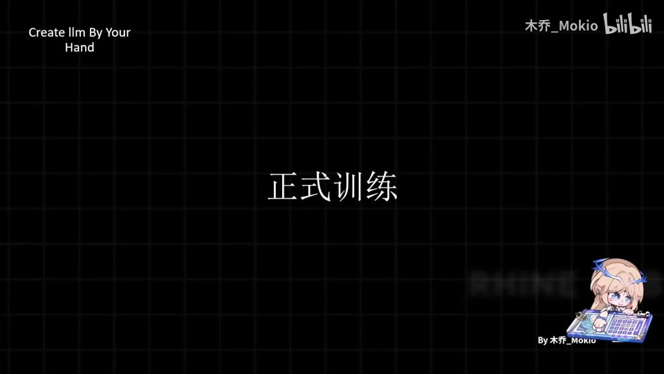
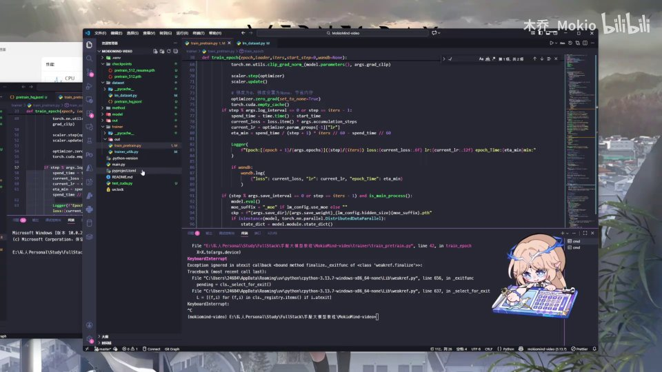
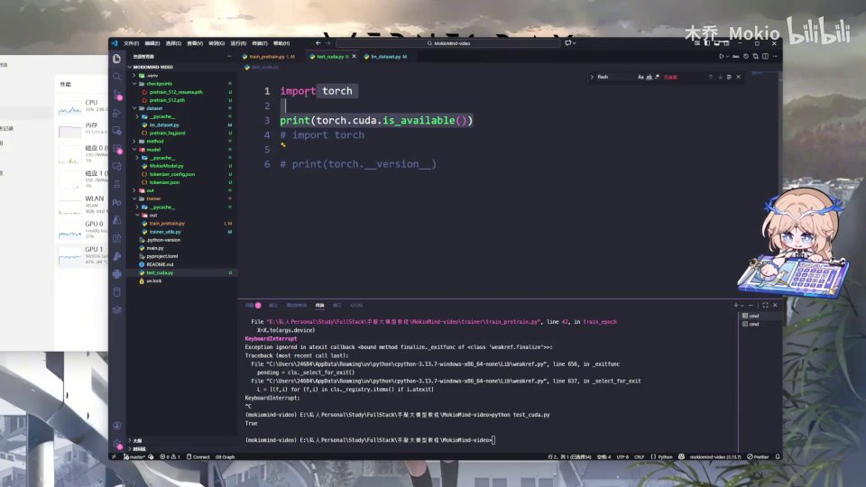
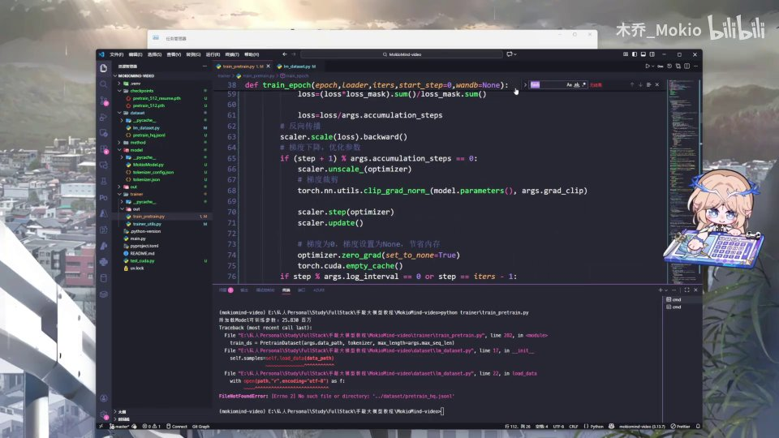
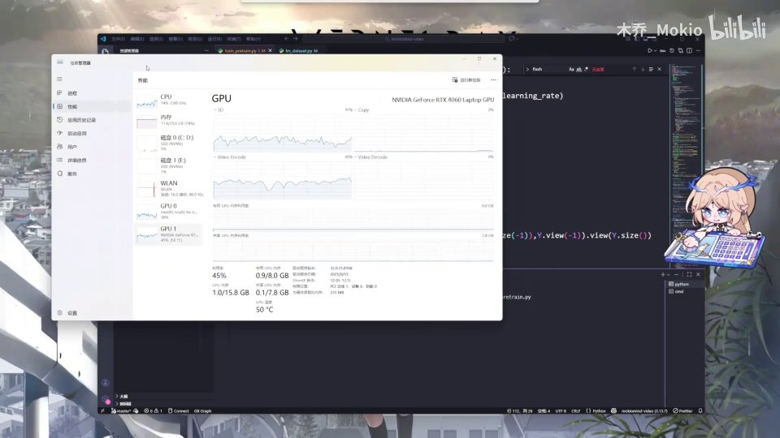
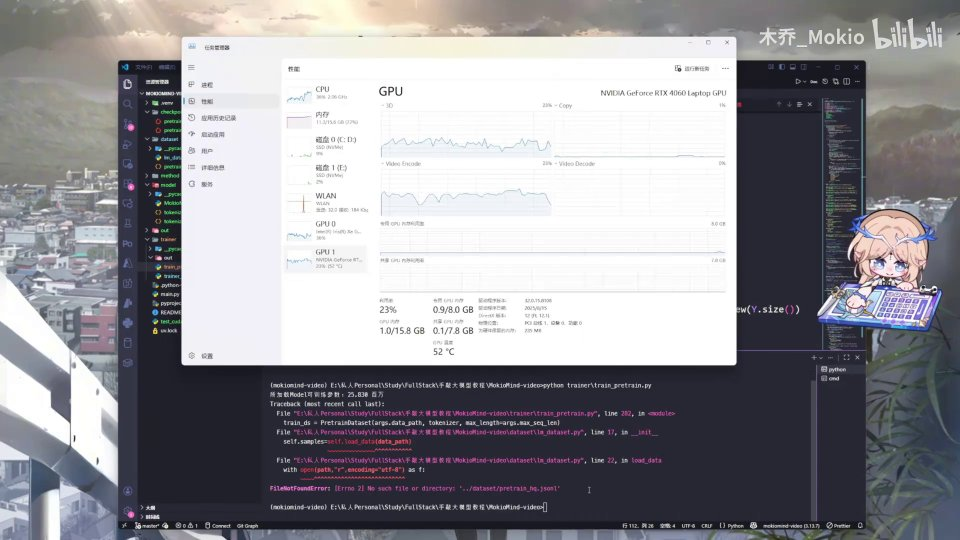
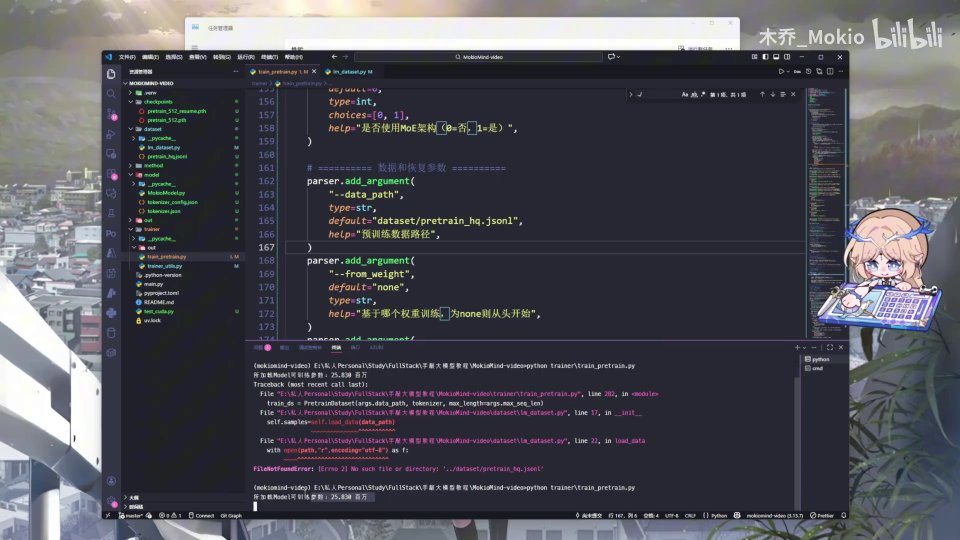
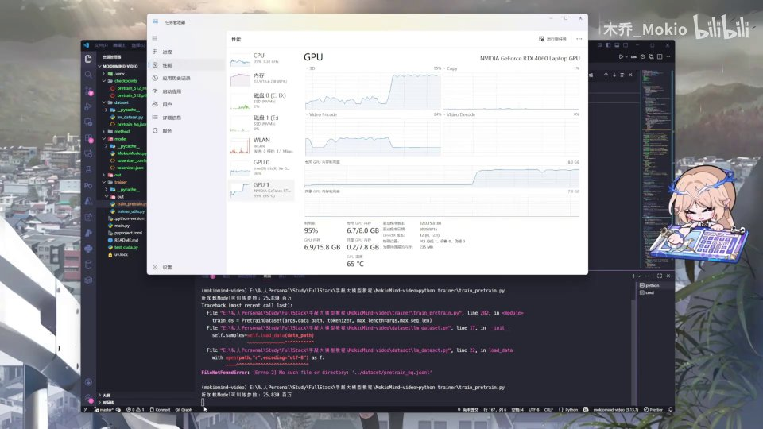

# 第25讲：训练，启动！

## 本讲要解决的核心问题（SCQA）

**背景**：前面二十多讲，我们已经把 Minimind 的模型骨架、数据集、预训练脚本一行行搭好，也知道了前向传播、反向传播、优化器、动态学习率这些概念是怎么回事。可以说，模型这台机器的"图纸"已经画完了。

**冲突**：图纸画完不等于机器能转。代码里还藏着几处之前遗留的小错误（反向传播没放进循环、模型导入拼写错误），而且很多同学一敲训练脚本就报错——要么显卡根本没被用上，要么数据集找不到。真正把训练跑起来，和"写好训练代码"之间隔着一道工程落地的坎。

**疑问**：我们怎么知道代码改对了？怎么确认 GPU 真的在工作？敲下训练脚本之后，屏幕上那么多日志，到底该看哪几个数字来判断训练是否正常？

**回答（中心思想）**：本讲带你完成从"代码就绪"到"训练真正跑起来"的关键一跃——先修正遗留错误，再用 `torch.cuda.is_available()` 自检环境，然后启动预训练脚本、用任务管理器观察显卡利用率，最终通过日志里的 loss、学习率和剩余时间判断训练是否健康。训练一旦启动，模型就会自己越跑越好。

[【跳转到 00:00】](https://www.bilibili.com/video/BV1T2k6BaEeC/?p=25&t=0)



---

## 一、训练前先清障：三处必须修正的代码错误

在模型的架构、数据集以及预训练脚本都完成之后，我们终于要正式训练模型了。但正如工程师按下总电源之前要检查线路，正式训练之前，得先把之前发现的几处错误纠正掉。这些错误不修，训练要么报错，要么悄悄跑出错误结果。

### 1.1 反向传播必须放进 `for` 循环里

第一点，也是最重要的一个代码结构问题：在编写反向传播的时候，我们没有把它放进 `for step` 循环里面，而是让它和 `for` 循环平级了。这是错误的。

为什么必须放进循环？因为训练的每一步都要做一次"前向 → 反向 → 更新参数"的完整动作。如果 `backward()`（反向传播）留在循环外面，它只会对最后一批数据算一次梯度，前面所有 step 的梯度就白算了，而且参数也几乎不会被更新。修法很简单：给它加一个缩进，把它放进 `for` 循环内部，让每一步都执行。

这里可以用一个生活类比来理解：训练就像老师批改作业。前向传播是学生答题（模型给出预测），反向传播是老师对照答案找出每道题错在哪（算出梯度），优化器更新是学生根据批改结果改进（调整参数）。如果批改只在最后一个学生交卷后做一次，那前面交卷的学生就永远得不到反馈——训练自然学不出东西。Python 的缩进在这里不是"格式美观"的问题，而是决定代码执行多少次的结构问题：缩进一级表示"属于循环体，每轮都执行"，退回一级表示"在循环结束后只执行一次"。

[【跳转到 00:10】](https://www.bilibili.com/video/BV1T2k6BaEeC/?p=25&t=10)


### 1.2 补上日志打印与 checkpoint 保存

第二点，我们其实缺了一部分内容。像打开我的 Minimind 之后，它原本是会有一些日志打印的。我们可以直接把这一部分复制粘贴过来：它会在每进行一定步数的时候在终端打印一次信息，并且在到达一定 checkpoint 的时候把模型保存下来。

日志打印（logging）解决的是"训练黑箱"问题——没有日志，你完全不知道模型跑到哪、loss 降没降。打个比方，日志就像是长途驾驶时的仪表盘：速度（每一步的 loss）、油量（剩余时间）、水温（学习率）一目了然，出问题能第一时间发现。

checkpoint（检查点，字面意思是"存档点"）解决的是"训练中断"问题——把某个时刻的模型权重存盘，万一断电、程序崩溃，或者想回头换一个起点继续训练，都可以从最近一次存档恢复，而不必从头再跑几百分钟。预训练动辄数小时甚至数天，所以 checkpoint 几乎是每个训练脚本的标配。

"每进行一定步数打印一次、每到达一定 checkpoint 保存一次"背后的思想，是**周期性采样**：不需要每一步都记录或保存（那样既慢又占空间），而是隔一段统一处理一次，既掌握全局趋势，又控制开销。这部分上一讲可能提过，但一定要记得查看。

[【跳转到 00:35】](https://www.bilibili.com/video/BV1T2k6BaEeC/?p=25&t=35)

### 1.3 修正三处 AI 生成带来的拼写/导入错误

接下来还有几处错误需要纠正。核心原因是：模型文件里有一些包是当时 AI 直接生成的，所以会有问题。

- **导入的包有问题**：模型文件里某些导入项需要修正。
- **`action` 多写了**：这里应该是多写了一段，这一处修正一下。
- **`PretrainModel` 的大小写错误**：我在导入 `PretrainModel` 的时候，把这个 `T` 写成了小写，所以也会有问题。Python 对大小写敏感，`pretrainModel` 和 `PretrainModel` 是两个完全不同的名字。
- **`flash` 拼写错误**：还有一个地方的 `flash` 拼写我也拼错了，大家在运行报错的时候记得修改一下。

这几处错误有一个共同点：它们都不是"逻辑想错了"，而是"名字写错了"。在 Python 里，一个变量名或函数名写错，解释器会立刻抛出 `NameError` 或 `ImportError`，训练根本启动不了。好消息是这类错误最容易修——报错信息会告诉你哪个名字找不到、在哪一行；坏消息是，如果用的是 AI 生成的代码，你往往默认它是对的，从而忽略了逐行核对。所以遇到报错别慌，顺着 traceback 一行行看即可。

[【跳转到 01:08】](https://www.bilibili.com/video/BV1T2k6BaEeC/?p=25&t=68)



### 1.4 那处 `flash` 拼写错在了哪里

顺着 `flash` 的线索往下看，出错的位置就在注意力（attention）模块里。这里用到了 PyTorch 提供的 `F.scaled_dot_product_attention`——也就是缩放点积注意力，它是 Transformer 注意力的核心计算。一旦这里的名字拼错，整个模型就无法构建。

这也提醒我们：AI 生成的代码看着"很对"，但命名细节常常不可靠。运行报错时，先顺着 traceback（报错回溯）里的文件名和行号找到具体那一行，再逐一核对拼写。

[【跳转到 01:33】](https://www.bilibili.com/video/BV1T2k6BaEeC/?p=25&t=93)


---

## 二、正式训练前的自检：确认 CUDA 真的能用

代码结构修好之后，我们正式来讲解应该怎么训练。在训练之前，需要做的第一件事，就是确认我们的 CUDA 能不能运行。这一步看似多余，其实决定了你接下来是"用显卡飞速训练"还是"用 CPU 跑到天荒地老"。

### 2.1 两行代码判断 GPU 是否可用

最简单的方法只需要两行代码：`import torch`，然后打印 `torch.cuda.is_available()`。运行这个文件，可以看到我这里打印出来的是 `True`——也就是说我运行训练这个模型的时候可以使用我的 GPU、可以使用 CUDA 来跑。

`torch.cuda.is_available()` 返回布尔值：`True` 表示 PyTorch 已经能识别并调用 NVIDIA 显卡（CUDA 是 NVIDIA 的并行计算平台）；如果是 `False`，就要进入下一步排查。这里的 GPU（Graphics Processing Unit，图形处理器）就是我们平时说的显卡，它擅长大规模并行计算，正是深度学习训练的主力。

为什么深度学习离不开 GPU？因为神经网络的核心运算是大量的矩阵乘法，而矩阵乘法可以拆成成千上万个互不依赖的小算式，天然适合同一时间一起算，这正是 GPU 的强项。相比之下，CPU（中央处理器）只有少数几个强大的核心，擅长串行、复杂逻辑，却不擅长这种"人海战术"。打个比方：CPU 像一个博士生，什么都会但一次只能算一道题；GPU 像一万个小学生，单个很弱，但让他们同时算一万道简单题，总速度反而快得多。所以"能不能用 GPU"直接决定了训练要 30 分钟还是 30 小时。

那两行代码为什么这么写？`import torch` 是把 PyTorch 库加载进来；`torch.cuda` 就是 PyTorch 里专门管理 CUDA/GPU 的子模块；`is_available()` 则是问它一句"你到底能不能用"。这种"先自检、再开跑"的习惯值得保留——它是后续所有排查的起点。

[【跳转到 01:47】](https://www.bilibili.com/video/BV1T2k6BaEeC/?p=25&t=107)


### 2.2 打印版本，区分 CPU 版和 CUDA 版 PyTorch

如果上面是 `False`，接下来就可以打印一下你的 torch、打印一下 torch 的 `version`。这里会打印出你 PyTorch 的版本，重点在后面：如果你装的是 CPU 版本，版本号后面会带一个 `CPU` 字样。这种情况下，**哪怕你的电脑插着英伟达的显卡，也无法使用 CUDA**。

所以你需要把 torch 重新下载成 CUDA 版本的。为什么 CPU 版就不能用显卡？因为 PyTorch 的 CPU 版本在编译时根本没有链接 CUDA 运行库，它压根不知道显卡的存在。判断依据就在版本字符串里。

[【跳转到 02:12】](https://www.bilibili.com/video/BV1T2k6BaEeC/?p=25&t=132)



### 2.3 换成 CUDA 版仍不行，大概率是驱动问题

那么怎么换 CUDA 版本呢？你可以去 PyTorch 官网查阅安装命令，或者直接问 AI 都可以。但如果换成 CUDA 版本之后还是不行，那应该就是你的驱动（driver）没安装好。

驱动是操作系统和显卡之间的"翻译层"，CUDA 工具包又建立在驱动之上。所以排查顺序是：先看 PyTorch 是不是 CUDA 版 → 再看显卡驱动装没装好 → 最后看 CUDA 与驱动版本是否匹配。这些问题留给大家，学会自己排查就好。

[【跳转到 02:37】](https://www.bilibili.com/video/BV1T2k6BaEeC/?p=25&t=157)

---

## 三、启动训练：敲一个脚本就够了

环境自检通过，接下来正式开始训练。训练本质上很简单——我们直接敲一个脚本就好。这里我用 `trainer` 来给大家演示效果：运行预训练的脚本，同时把任务管理器打开，观察显卡的情况。

### 3.1 预训练脚本都在做什么

预训练脚本（`train_pretrain.py`）里封装好了整个训练循环。下面这段就是它的核心：计算 loss、反向传播、梯度裁剪、优化器更新，一步不落。

- `loss = loss / args.accumulation_steps`：梯度累积，用多个小批次模拟一个大批次。
- `scaler.scale(loss).backward()`：混合精度下的反向传播，同时放大 loss 避免小梯度下溢。
- `torch.nn.utils.clip_grad_norm_`：梯度裁剪，防止梯度爆炸把训练带偏。
- `scaler.step(optimizer)` 与 `scaler.update()`：用缩放后的梯度更新参数，并调整缩放系数。
- `optimizer.zero_grad(set_to_none=True)`：每步更新后把梯度清零，否则梯度会不断累加、越滚越大。注意它只在真正执行更新的那一拍调用，和梯度累积配合使用。

这里出现了两个工程味很浓、但非常关键的技巧，值得展开讲：

**梯度累积**：显存有限，一次喂不了太大的批次（batch）。梯度累积的做法是——连续算几个小批次的梯度、先累加不更新，等攒够 `accumulation_steps` 次再更新一次参数。效果上约等于用了一个大批次，但显存只按小批次峰值占用。比如小批次 8、累积 4 次，就约等于批次 32 的效果。它的前提是：梯度的累加要在循环里持续进行，更新要按条件触发。

**混合精度与 scaler**：深度学习默认用 32 位浮点数（FP32），但 16 位（FP16/BF16）算得更快、更省显存。问题是 FP16 能表示的数值范围很窄，小的梯度可能直接"下溢"成 0。`scaler` 的做法是先把 loss 放大一个倍数，让梯度数值一起变大、避免下溢，更新参数前再缩回去。这就是 `scaler.scale(loss).backward()` 和 `scaler.unscale_(optimizer)` 成对出现的原因。

**梯度裁剪**：`clip_grad_norm_` 给梯度的总长度设一个上限。如果梯度突然变得极大（常见于训练不稳时），就按比例把它压到阈值以内，防止一次巨大的更新把好不容易学到的参数"一巴掌拍飞"。它相当于给训练加了根安全带。

这一段正是第一部分里被"缩进错误"坑到的地方——只有放进 `for` 循环，上述动作才能每个 step 都执行。也正因为它重要且容易出错，我们在正式开跑前才要反复确认缩进正确。

[【跳转到 02:52】](https://www.bilibili.com/video/BV1T2k6BaEeC/?p=25&t=172)




---

## 四、用任务管理器看显卡：显存与利用率

运行脚本的同时，我们拿出任务管理器，点击"性能"，在这里观察显卡的情况。这是判断训练是否真正发生的最直观方式。



要看两个关键指标：

- **显存占用（显存/专用 GPU 内存）**：模型参数、梯度、优化器状态、激活值都要占显存。占用越高，说明模型和数据越"重"。
- **GPU 利用率（3D/CUDA）**：反映显卡计算单元有多忙。训练时应该拉满，空闲时接近 0。

一开始脚本还在启动阶段，可能会看到显存占用很少、利用率也很少——这很正常，因为程序还在初始化。这里要建立起"分阶段看指标"的意识：

- **启动/数据准备阶段**：显存慢慢上涨，利用率忽高忽低甚至接近 0，因为此时主要在读磁盘、分词、搬数据。
- **正常训练阶段**：显存稳定在高位，利用率长期拉满或在高位波动。
- **卡住/失速阶段**：利用率突然掉到 0 并长时间不动，通常是数据管道阻塞、死锁或程序崩了。

换句话说，任务管理器不只是"看热闹"，它是排查性能问题的第一现场。显卡是训练里最贵的资源，让它在等待中空转就是浪费钱，所以学会看这两个数字，是每个训练者的基本功。

---

## 五、卡在数据加载：路径问题怎么排查

训练脚本启动后，首先会执行的就是加载数据。但我这里出现了数据加载错误，于是我来找一下原因。



报错信息很清楚：找不到 `../dataset/pretrain_hq.jsonl` 这个文件——因为我是在**根目录**下运行脚本的。如果在根目录下，就**不需要**用 `../` 这种相对路径去回溯上一级找数据集，只需要去掉那个 `../` 前缀就可以。

这涉及一个常见的路径概念：

- **绝对路径**：从盘符或根开始写全，如 `C:\project\dataset\...`。
- **相对路径**：相对于"当前工作目录"来定位。脚本里写 `../` 表示"上一级目录"。

代码里通常把数据路径做成了参数，方便修改。可以看到这里 `--data_path` 的默认值是 `dataset/pretrain_hq.jsonl`，改成正确的相对路径后再重新运行即可。

[【跳转到 03:23】](https://www.bilibili.com/video/BV1T2k6BaEeC/?p=25&t=203)

[【跳转到 03:28】](https://www.bilibili.com/video/BV1T2k6BaEeC/?p=25&t=208)



修正路径后再次运行。这时可以看到，显卡的显存和利用率还是很低，但终端里的那一行字加载出来了——说明我们的程序已经慢慢启动起来了。它第一步要做的，就是去分解数据集，然后把数据搬运过来。这一步需要等一会儿，视频里我把这段等待剪掉了。

---

## 六、训练真正开始的信号：利用率拉满 + 日志出现

等显卡利用率暴涨的时候，请大家看一下屏幕——到这里开始，显卡的用量就直接飞速上涨，然后开始居高不下。



这时候就说明：我们已经正式开始训练了。现在它的利用率拉满了，而且在不断地跑。与此同时，终端里也会开始打出日志。

为什么利用率会先低后高？因为前期是在"喂数据"——把 JSONL 格式的文本读进来、分词（tokenize）、打包成张量，这些工作主要吃 CPU 和磁盘 IO，GPU 在干等；等数据管道灌满，GPU 才被真正喂饱，利用率自然飙升。所以**利用率拉满是训练进入正轨的标志**，而日志则是我们可以读懂的"体检报告"。

这也解释了一个常见现象：为什么有人号称"用上了 GPU"却依然很慢？很可能就是数据加载成了瓶颈——GPU 时不时停下来等 CPU 喂数据，利用率上不去。解决办法通常是增加数据加载的并行进程、预先把数据打包成更高效的形式，或者放在更快的硬盘上。所以"利用率拉满"不仅代表训练开始了，也代表整条数据流水线终于跟上了 GPU 的节奏。

观察训练是否健康，可以同时看三样东西：**任务管理器**（资源层——显卡忙不忙）、**终端日志**（算法层——loss 降不降、学习率对不对）、**时间成本**（经济层——还要多久、值不值得）。三者互相印证，才能对训练状态心里有数。

[【跳转到 04:01】](https://www.bilibili.com/video/BV1T2k6BaEeC/?p=25&t=241)

---

## 七、读懂训练日志：loss、学习率与剩余时间

### 7.1 第一个 epoch 的日志长什么样

每训练 100 次（step）会打印一次日志，视频里这部分等待我也剪掉了。等训练出来，可以看到这里已经跑出了第一个 epoch（一轮，指把整个数据集完整过一遍）。日志大体会是这样的形式：

```
Epoch:[1/1](1/440) loss:6.7 lr:0.00003334 epoch_time:430.34min
```

信息很密集，我们逐个拆开看。

### 7.2 loss 从 7 降到 6：模型在学东西

这已经在这么多数据里训练了 100 步，它的 loss 现在是 7，是很高的。随着训练继续，loss 不断下降——现在已经从 7 降到了 6。

**loss（损失）** 衡量的是模型预测和真实答案之间的差距。训练的目标，就是不断降低这个差距。loss 从 7 降到 6，说明模型确实在进步。不过要注意，这只是刚开始，loss 还很高，离收敛还远。

为什么刚开始的 loss 会这么高？因为模型一开始是随机初始化的——它的参数是随机数，输出的预测几乎等同于瞎猜。对于一个语言模型，如果词表里有几万个候选词，随机乱猜时交叉熵损失大约会落在"词表规模的对数"附近，所以初始 loss 很高很正常。随着它见过越来越多的文本、不断微调参数，预测会越来越准，loss 也就一点点往下掉。

这里要理解一个关键点：**loss 下降是训练的"北极星"，但不能只看一步**。训练日志里 loss 有轻微波动是正常的，重要的是看整体趋势——如果它长期不降甚至上升，才说明学习率太大、数据有问题或代码有 bug。这也是为什么我们要按步数周期性打印日志：单点的噪声会被趋势抹平，趋势才能说明问题。

### 7.3 学习率发生了轻微变化：动态学习率在生效

根据我们前面学过的内容，可以再看一下：这里它的学习率发生了轻微的变化。这和我们之前学到的**动态学习率**（learning rate schedule）一样——学习率不是固定的，而是随着训练进程按计划调整（比如预热后下降），从而让训练更稳定。

**学习率（learning rate）** 是每一步参数更新的"步长"。想象下山：learning rate 就是每步跨多大。步子迈太大，容易一脚跨过山谷、在两侧来回震荡甚至越走越远（发散）；步子太小，虽然稳，但走半天还在半山腰（学得极慢）。所以常见的做法是动态调整：训练初期用较小的学习率"预热"，让模型先站稳脚跟；中期适当加大、快速下降；后期再逐步衰减，做精细微调。这里看到学习率发生轻微变化，正说明调度器在起作用——这不是 bug，而是精心设计。

### 7.4 剩余时间与租卡建议

日志里还有 epoch_time 和剩余时间。一开始需要跑完这一整轮还需要约 430 分钟，随着进度推进，剩余时间也在变化（后来显示约 349 分钟）。

这里有个背景：Minimind 它本身是通过租显卡、用 3060 来跑的。我这台可能是我本身电脑的问题，所以时间会比较慢。大家如果想跑快一点，也可以自己去 AutoDL 之类的平台租一些服务器去跑一下、试一下。这里大概给大家展示一下情况就可以。


[【跳转到 04:26】](https://www.bilibili.com/video/BV1T2k6BaEeC/?p=25&t=266)

[【跳转到 05:00】](https://www.bilibili.com/video/BV1T2k6BaEeC/?p=25&t=300)


---

## 八、让它自己跑：训练的常态与下一步

那么我们在训练的时候，就把它放在这里，让它自己跑就好。训练不是"一键出活"，而是一个需要等待、需要观察的过程。

下一 part，我们就开始讲：模型训练出来之后，怎样去体验一下它的效果，也就是最后一期。那我们下个 part 见。

[【跳转到 05:25】](https://www.bilibili.com/video/BV1T2k6BaEeC/?p=25&t=325)

---

## 小结

- **先清障再启动**：正式训练前必须修正三处遗留错误——把反向传播放进 `for` 循环、修正 `action` / `PretrainModel` / `flash` 的导入与拼写；并补上日志打印与 checkpoint 保存。
- **环境自检三步走**：`torch.cuda.is_available()` 判断 GPU 可用性 → 打印 torch 版本区分 CPU/CUDA 版 → 不行就检查显卡驱动是否装好。
- **看显卡就两指标**：显存占用看"模型有多重"，GPU 利用率看"显卡有多忙"；利用率先低后高是数据管道在预热的正常现象。
- **路径错误最常见**：在根目录运行就去掉 `../` 前缀，数据路径最好做成命令行参数，方便按运行位置调整。
- **训练启动的两个信号**：GPU 利用率拉满 + 终端开始按步数打印日志。
- **读日志看三个数**：loss 持续下降说明模型在学；学习率按计划变化说明动态调度生效；剩余时间用于评估成本，慢就考虑租 GPU 服务器。

## 关键术语速查

| 术语 | 一句话解释 |
| --- | --- |
| CUDA | NVIDIA 的并行计算平台，PyTorch 通过它调用显卡做深度学习计算 |
| `torch.cuda.is_available()` | 检查 PyTorch 能否识别并调用 NVIDIA GPU，返回 True/False |
| GPU 利用率 | 显卡计算单元的繁忙程度，训练时应接近拉满；空闲时接近 0 |
| 显存占用 | 模型参数、梯度、优化器状态与激活值占用的显卡内存 |
| 反向传播（backward） | 从 loss 出发反向计算每个参数的梯度，必须每个 step 执行 |
| 梯度裁剪（clip_grad_norm） | 限制梯度范数上限，防止梯度爆炸导致训练不稳定 |
| 梯度累积 | 用多个小批次累加梯度再更新一次，模拟大批次训练 |
| 混合精度（scaler） | 用低精度加速计算、同时用缩放避免小梯度下溢的技术 |
| loss（损失） | 衡量模型预测与真实答案差距的数值，训练目标就是让它下降 |
| epoch | 把整个数据集完整训练一遍；日志里 `[1/1]` 表示第 1 轮 |
| 动态学习率 | 学习率随训练进程按计划调整（如预热后下降），提升训练稳定性 |
| checkpoint | 训练过程中保存的模型权重快照，用于续训或回滚 |
| 相对路径 / 绝对路径 | 相对当前工作目录定位 / 从盘符根目录写全的路径 |
| tokenize | 把文本切分成 token 并转成数字 id，供模型读取 |
| AutoDL | 国内常见的 GPU 算力租赁平台，适合没有强显卡时租卡训练 |
