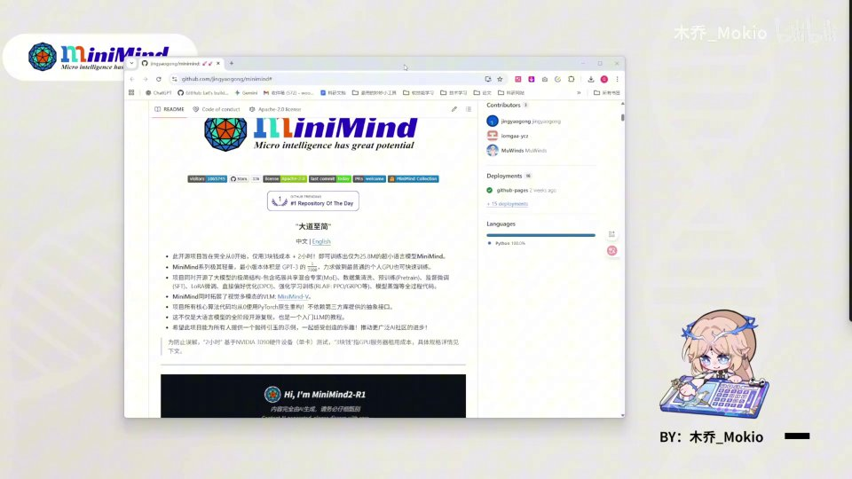
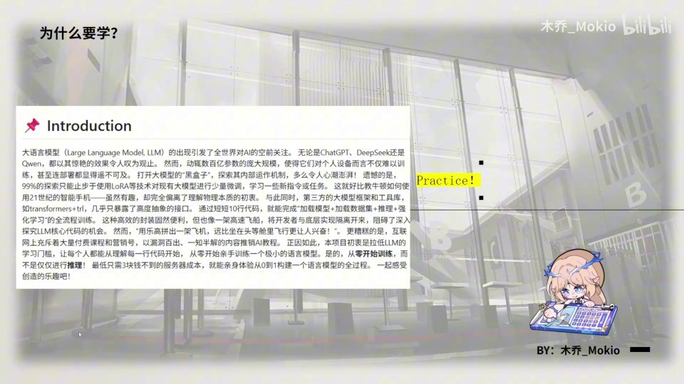
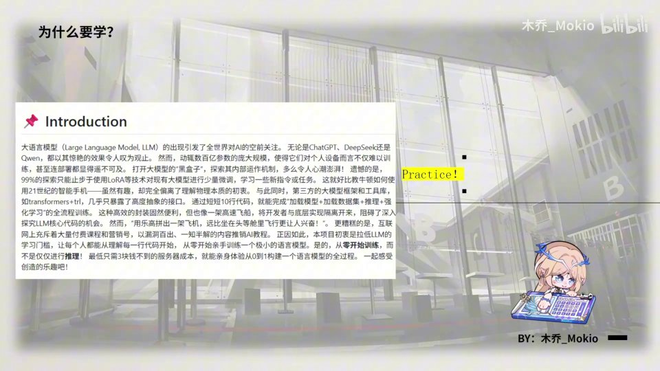
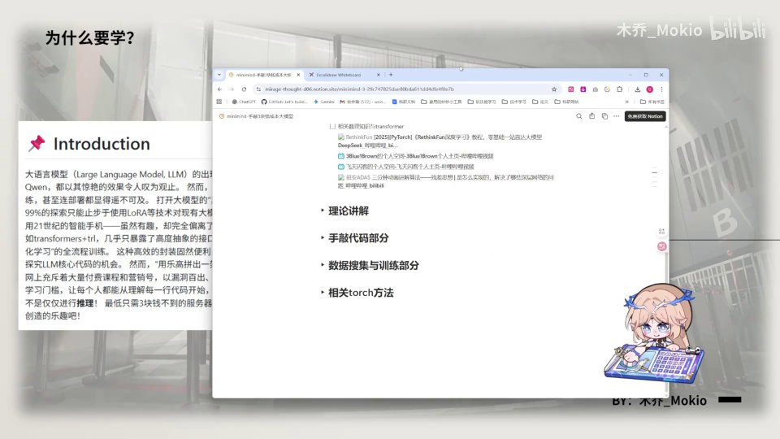
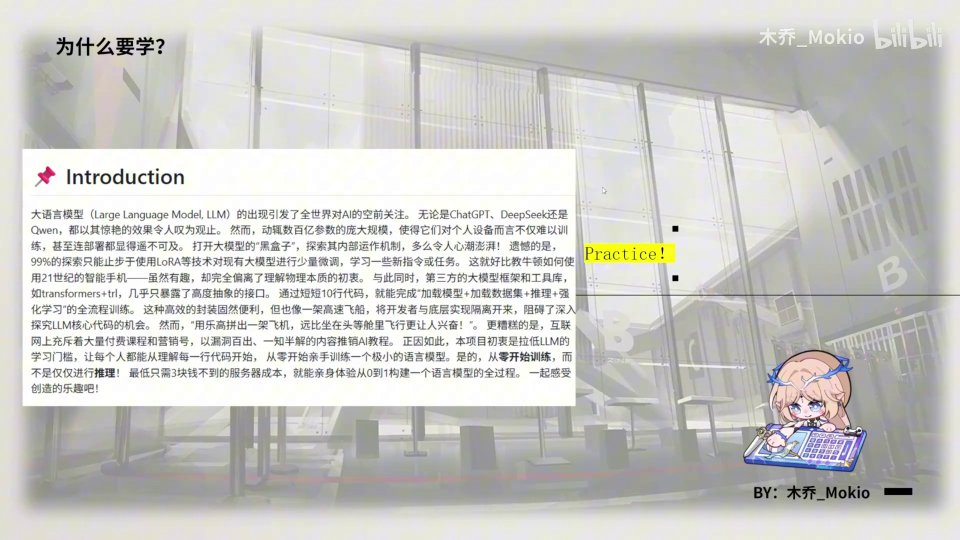
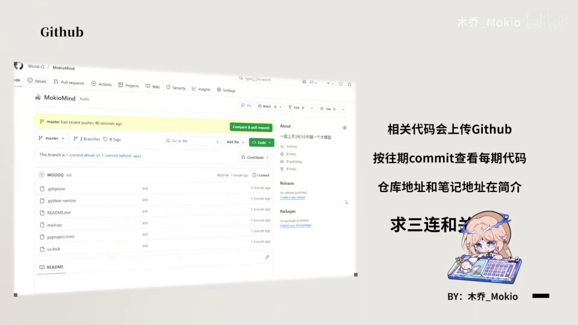
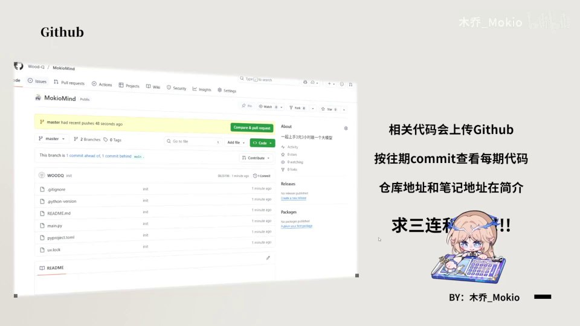

# 开篇 原始文稿（图-字幕分栏）

| 字幕文本 | 画面 |
| :--- | ---: |
| 大家好，这里是木乔，好久不见。这次我花了不少时间，整了一个大的。在这套视频里，我会带你亲手实践——就像标题所说的，我会带你用「三元三小时」亲手敲一个大模型出来。大家可以看到左上角这个 Minimind 的标志，没错，这期视频就是基于 Minimind 这个开源项目来做的。 [【跳转到 00:00】](https://www.bilibili.com/video/BV1T2k6BaEeC/?p=1&t=0) |  |
| 那为什么要做这个视频呢？ [【跳转到 00:25】](https://www.bilibili.com/video/BV1T2k6BaEeC/?p=1&t=25) |  |
| 其实，就像 Minimind 的这个 Introduction（引言/项目说明）所说的。 [【跳转到 00:30】](https://www.bilibili.com/video/BV1T2k6BaEeC/?p=1&t=30) |  |
| 大模型引发了全世界的关注，现在大家都已经习惯了使用大模型；但是 Transformer 已经是好几年前的事了，而 ChatGPT 横空出世也已经是两年前了。这么久的时间过去，大伙还是对大模型的底层并不清楚。像开发者，也往往与底层内容隔离开来。这样一来，其实就缺失了探索原理和构建的乐趣。 [【跳转到 00:35】](https://www.bilibili.com/video/BV1T2k6BaEeC/?p=1&t=35) |  |
| 就像我们程序员常说的，只有造轮子，你才能真正学会。现在的封装固然便利，但是「用乐高拼一架飞机」比坐在头等舱更让人兴奋。同时呢，网上也充斥着漏洞百出、一知半解的内容来推销 AI 教程。因此，Minimind 的初衷就是拉低大模型的学习门槛，让每个人能够理解每一行代码。 [【跳转到 01:00】](https://www.bilibili.com/video/BV1T2k6BaEeC/?p=1&t=60) |  |
| 训练一个极小的语言模型。而我的目的呢，则是拉低大家学习 Minimind 的门槛。我会深入地拆解，让大家尽可能地从底层就学会怎样去构建一个大模型；学懂 Minimind，也就学懂了大模型。那第二点呢，也是我自己的私心：因为我个人很钟爱费曼学习法嘛，每次学习之后，只有真正的输出内容，才会让我感觉我自己学会了。 [【跳转到 01:25】](https://www.bilibili.com/video/BV1T2k6BaEeC/?p=1&t=85) |  |
| 就像每次学习内容之后，我都会记很多笔记一样，那么只有真正的输出内容…… [【跳转到 01:50】](https://www.bilibili.com/video/BV1T2k6BaEeC/?p=1&t=110) |  |
| ……我相信，只有真正地讲给别人、把别人讲懂。 [【跳转到 01:55】](https://www.bilibili.com/video/BV1T2k6BaEeC/?p=1&t=115) |  |
| 才能说自己学会了。所以我在准备这套教程的时候，也在让自己不断完善知识，因此也学到了很多。那么这期视频依旧像往期一样。 [【跳转到 02:00】](https://www.bilibili.com/video/BV1T2k6BaEeC/?p=1&t=120) |  |
| 我会把这期视频的相关代码都上传到 GitHub，你可以按照往期的 commit 来查看每一期的代码。同时呢，仓库地址和笔记地址我也都会放在简介里了。那么看在准备了这么多的份上，给一个三连，同时给我仓库里的一些项目给一个 star，同时也点点关注。那么，就让我们怀着「dirty your hands」（动手实践）的理念来。 [【跳转到 02:11】](https://www.bilibili.com/video/BV1T2k6BaEeC/?p=1&t=131) |  |
| from beginning to infinity 吗？ [【跳转到 02:36】](https://www.bilibili.com/video/BV1T2k6BaEeC/?p=1&t=156) |  |
| 让我们真正地从零开始，构建一个属于你自己的大模型吧。那么，Link Start！ [【跳转到 02:41】](https://www.bilibili.com/video/BV1T2k6BaEeC/?p=1&t=161) |  |