# 前言 原始文稿（图-字幕分栏）

| 字幕文本 | 画面 |
| :--- | ---: |
| 好，那么前言部分我需要强调的一点是： [【跳转到 00:00】](https://www.bilibili.com/video/BV1T2k6BaEeC/?p=2&t=0) |  |
| 这套视频虽然尽可能降低了你的学习门槛，但我仍然不会去补充非常基础的知识，例如 Python 基础、语法学习，以及基础神经网络、强化学习的概念。如果你这方面真的很欠缺，那么请补齐之后再来看，效果会更好。同时，一些相关推荐的补充基础知识视频， [【跳转到 00:05】](https://www.bilibili.com/video/BV1T2k6BaEeC/?p=2&t=5) | 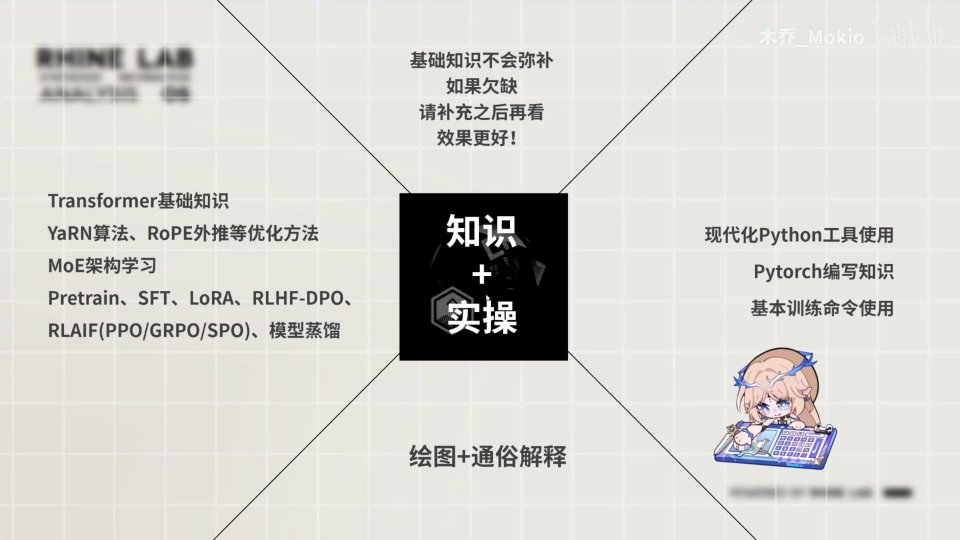 |
| 我会放在 Notion 笔记和下一页 PPT 里，大家可以自己查看。第二，跟随这套视频学完后，你能在知识和实操两方面同时有所收获。知识方面，你能学习 Transformer 的基础知识，还包括旋转位置编码 YaRN 算法、MoE 架构，以及很多训练方法，包括模型蒸馏这些知识；从实操层面上， [【跳转到 00:30】](https://www.bilibili.com/video/BV1T2k6BaEeC/?p=2&t=30) | 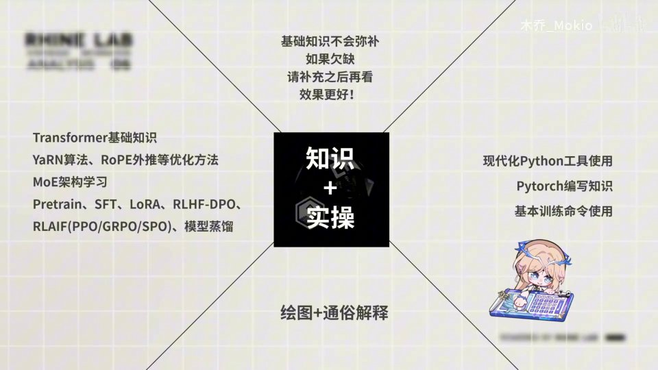 |
| 你还能学会现代化 Python 工具的使用（就是我上一期视频出的教程），你可以在这个项目里做实验，然后学习 PyTorch 的编写，包括一些基础命令的使用。同时，我会在讲解过程中穿插绘图来讲解。 [【跳转到 00:55】](https://www.bilibili.com/video/BV1T2k6BaEeC/?p=2&t=55) | 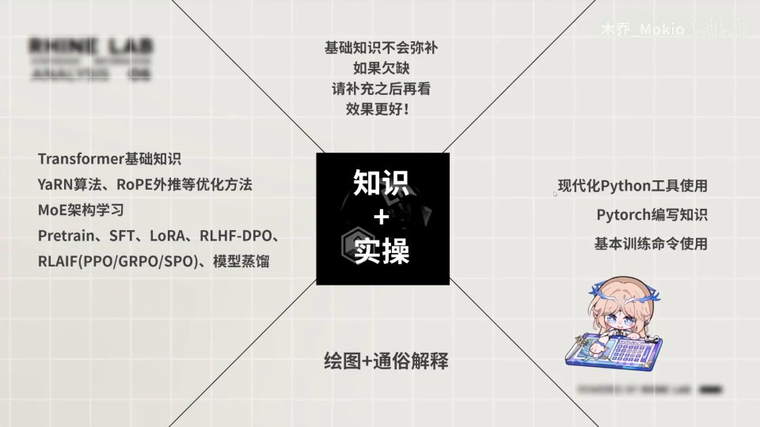 |
| 看，这是我准备的白板，我会穿插绘图来讲解理论知识，同时尽可能保证降低大家的理解门槛，让大家更深入地学会知识。好， [【跳转到 01:10】](https://www.bilibili.com/video/BV1T2k6BaEeC/?p=2&t=70) | 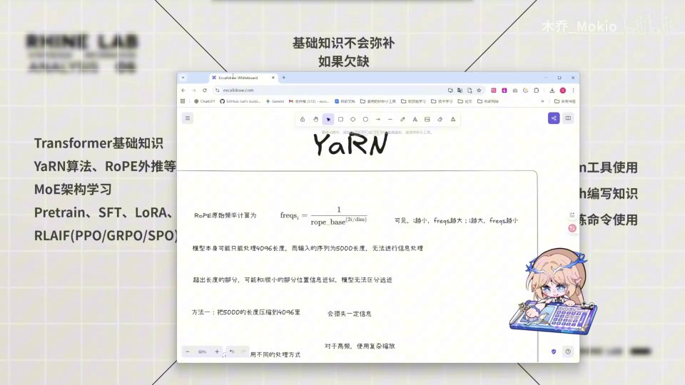 |
| 那么，请先确保学会并掌握基础知识。这一部分就是强调大家去看一些基础知识。 [【跳转到 01:21】](https://www.bilibili.com/video/BV1T2k6BaEeC/?p=2&t=81) | 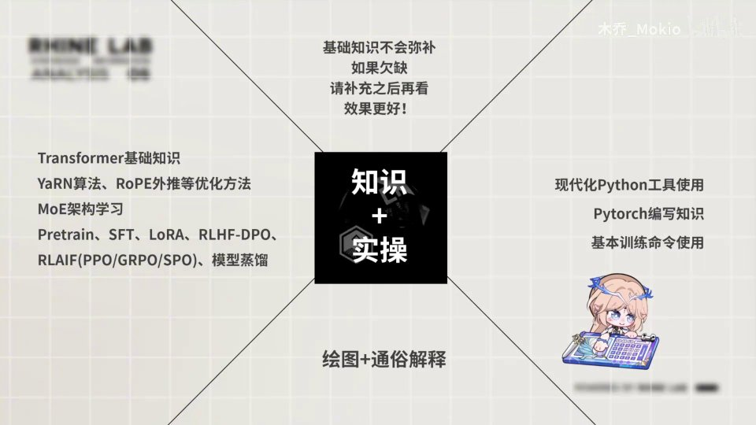 |
| 那么需要学哪些基础知识呢？我在这里列了出来。首先就是现代化的 Python 工具，这是我上一期视频所出的， [【跳转到 01:33】](https://www.bilibili.com/video/BV1T2k6BaEeC/?p=2&t=93) |  |
| 你可以在我的主页里看一下我的现代化 Python 教程， [【跳转到 01:43】](https://www.bilibili.com/video/BV1T2k6BaEeC/?p=2&t=103) | 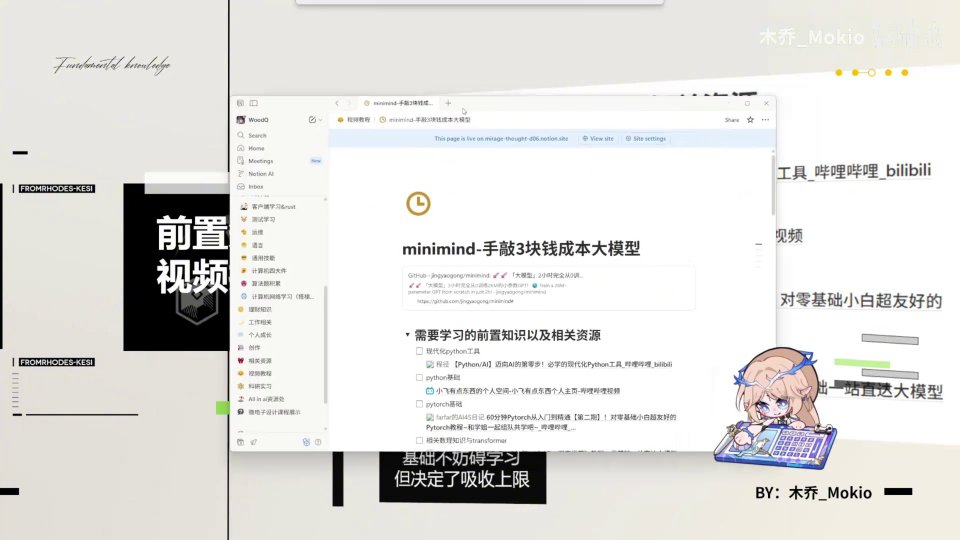 |
| 里面教了一些 uv 和 ruff 相关的东西，这个可以学一下。然后就是 UP 主“小飞有点东西”，这位 UP 主是我见过的全网讲 Python 讲得最好的人， [【跳转到 01:52】](https://www.bilibili.com/video/BV1T2k6BaEeC/?p=2&t=112) |  |
| 他从基础、进阶到全站深入讲解了 Python 的语法， [【跳转到 02:00】](https://www.bilibili.com/video/BV1T2k6BaEeC/?p=2&t=120) | 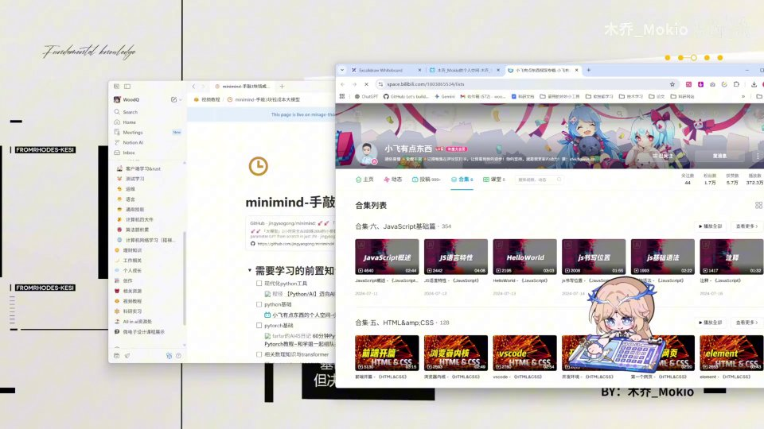 |
| 而且讲得非常通俗易懂。如果你 Python 语法不懂的话，可以先看一些基础篇的内容。 [【跳转到 02:05】](https://www.bilibili.com/video/BV1T2k6BaEeC/?p=2&t=125) | 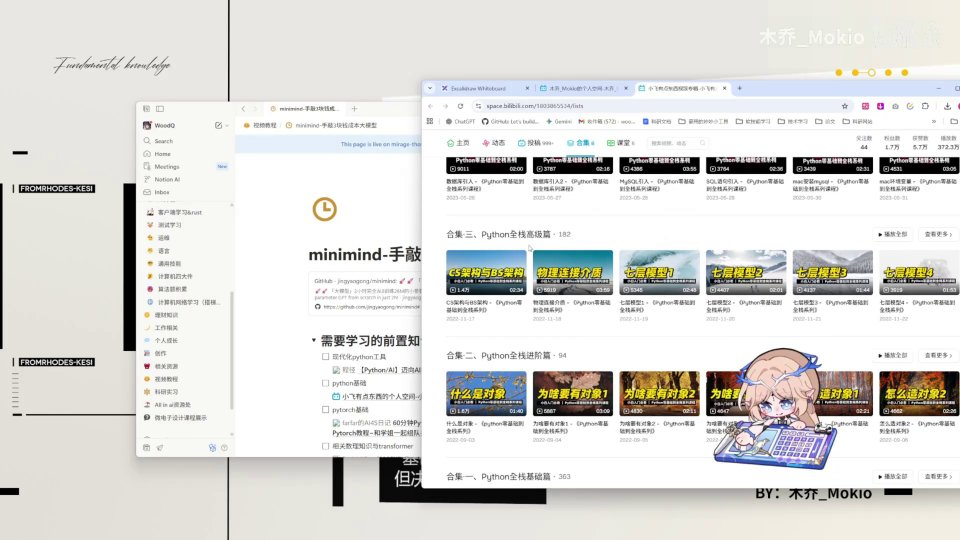 |
| 然后就是 PyTorch。了解 PyTorch 呢，可以看“farfar 的 AI4S 日记”的视频。 [【跳转到 02:11】](https://www.bilibili.com/video/BV1T2k6BaEeC/?p=2&t=131) |  |
| 这期视频看完之后，也不求非常精通，大概了解一下 PyTorch 的概念和原理就行。然后最重要的就是你缺失的数理知识和 Transformer，这里首当其冲推荐 RethinkFun 的深度学习整个教程。 [【跳转到 02:16】](https://www.bilibili.com/video/BV1T2k6BaEeC/?p=2&t=136) | 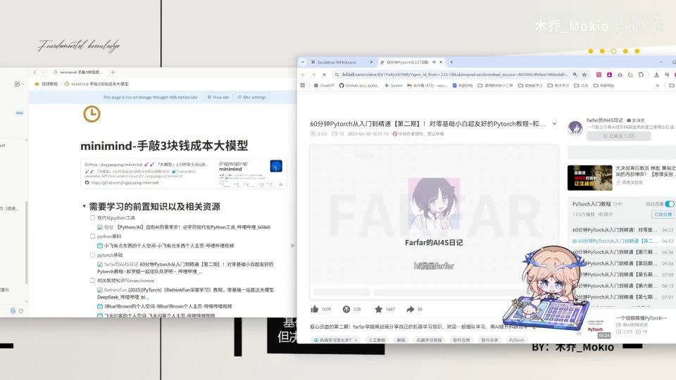 |
| 这个教程从基础的数学讲到了 Transformer， [【跳转到 02:33】](https://www.bilibili.com/video/BV1T2k6BaEeC/?p=2&t=153) | 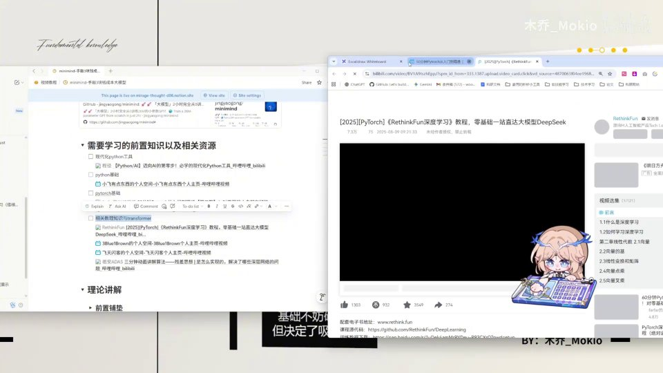 |
| 从深度学习、Transformer 讲到 CNN、RNN，包括最后的 DeepSeek 和 LLaMA。其实你看完这个视频，就不需要再看我的相关理论讲解了， [【跳转到 02:38】](https://www.bilibili.com/video/BV1T2k6BaEeC/?p=2&t=158) | 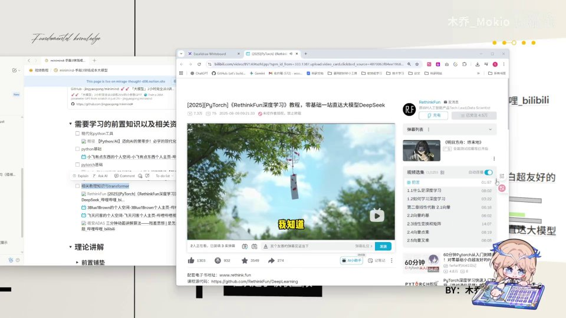 |
| 因为里面讲的已经非常透彻了。还有就是 3Blue1Brown 的视频， [【跳转到 02:51】](https://www.bilibili.com/video/BV1T2k6BaEeC/?p=2&t=171) | 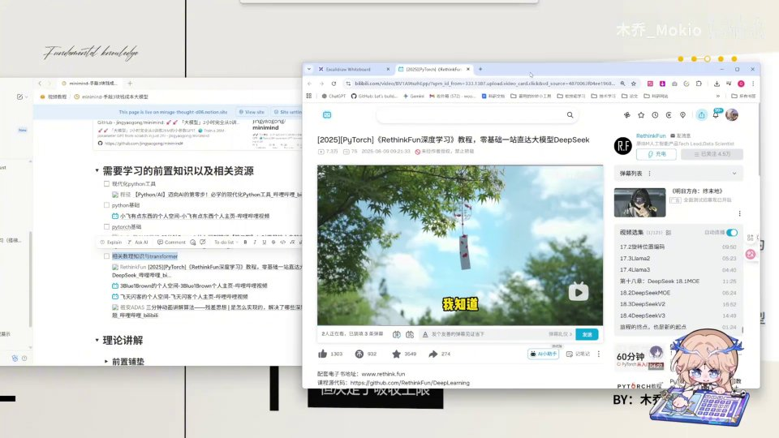 |
| 3Blue1Brown 的视频因为有非常优美的动画，所以你能非常通俗而深入地理解其中讲的内容。 [【跳转到 02:58】](https://www.bilibili.com/video/BV1T2k6BaEeC/?p=2&t=178) | 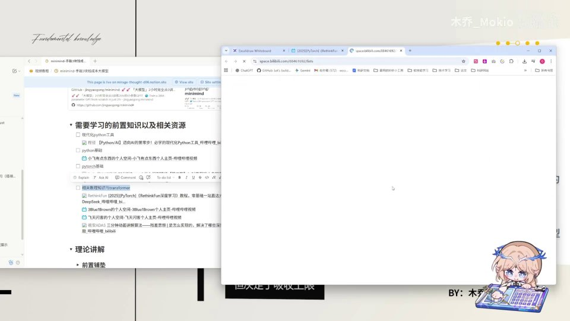 |
| 像这些：深度神经网络、梯度下降、反向传播，还有注意力机制和 Transformer，这些我在自己的视频里就不细讲了，大家缺失的话可以自己去看 3Blue1Brown 的视频。然后就是飞天闪客的视频， [【跳转到 03:03】](https://www.bilibili.com/video/BV1T2k6BaEeC/?p=2&t=183) | 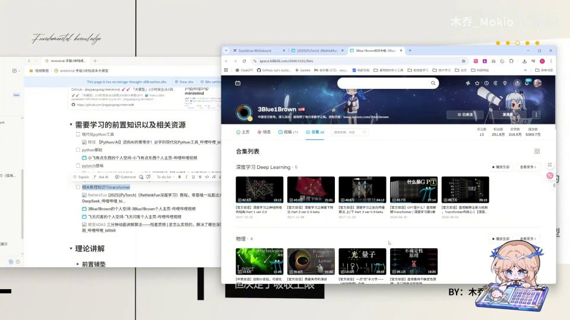 |
| 飞天闪客的视频也是讲解 AI 比较通俗的， [【跳转到 03:20】](https://www.bilibili.com/video/BV1T2k6BaEeC/?p=2&t=200) |  |
| 他一个小时，可以把这期视频看一下。然后就是我最近看到的祖安ADAS 的视频， [【跳转到 03:25】](https://www.bilibili.com/video/BV1T2k6BaEeC/?p=2&t=205) |  |
| 他用 3 分钟动画讲一个深度学习的基本思想，比如说残差网络和注意力机制， [【跳转到 03:30】](https://www.bilibili.com/video/BV1T2k6BaEeC/?p=2&t=210) | 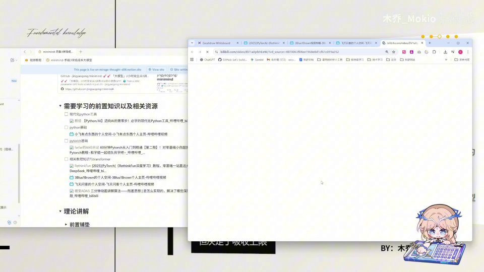 |
| 大家也可以看一下。好，那么再次强调，基础知识是非常重要的。 [【跳转到 03:35】](https://www.bilibili.com/video/BV1T2k6BaEeC/?p=2&t=215) | 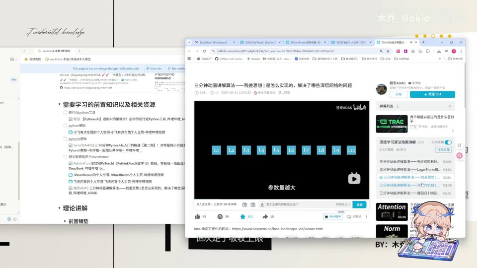 |
| 基础不妨碍你学习这期视频，但它一定决定了你吸收的上限。 [【跳转到 03:40】](https://www.bilibili.com/video/BV1T2k6BaEeC/?p=2&t=220) | 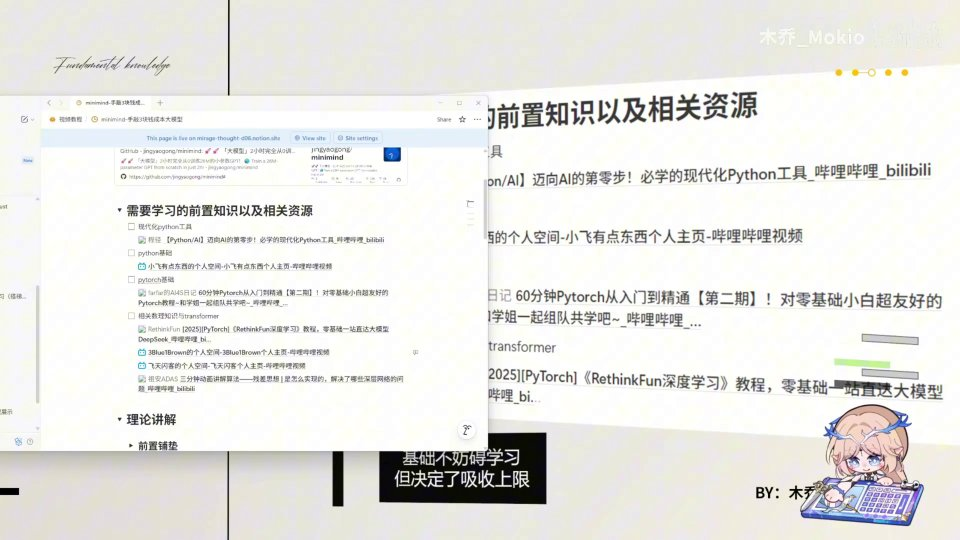 |
| （此区间无字幕） [【跳转到 03:45】](https://www.bilibili.com/video/BV1T2k6BaEeC/?p=2&t=225) |  |
| 那么最后再讲一下，我们整期视频大概分为四部分。首先第一部分，是我带你手敲整个模型的架构；第二部分，我们会手敲一些训练部分，最基础的预训练部分；第三部分，我们会深入 MoE 架构的学习；第四部分，会有训练算法的讲解。其实这第三部分，在我录这期视频的时候还没有学会，不过后面我会学会并且给大家补上。同时， [【跳转到 03:50】](https://www.bilibili.com/video/BV1T2k6BaEeC/?p=2&t=230) |  |
| Minimind 它还有视觉模型，那么在我学会之后，应该会以 DLC 的形式补充在这期视频后面，或者发新的视频。那么我们下一趴见。 [【跳转到 04:15】](https://www.bilibili.com/video/BV1T2k6BaEeC/?p=2&t=255) | 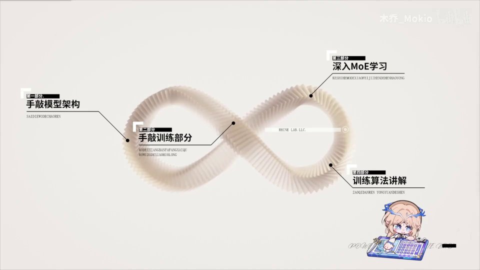 |