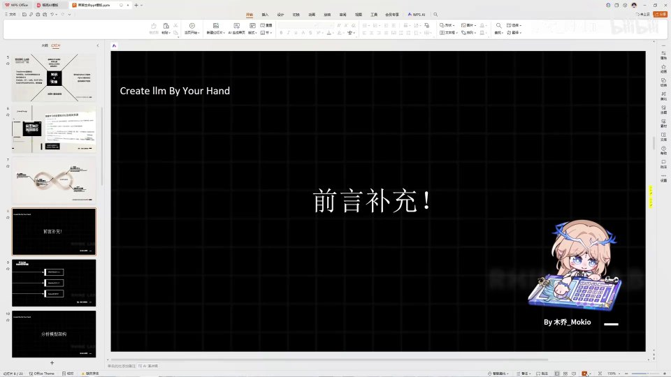
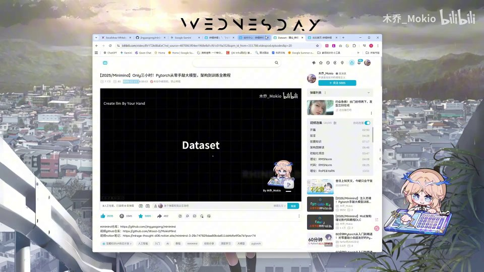
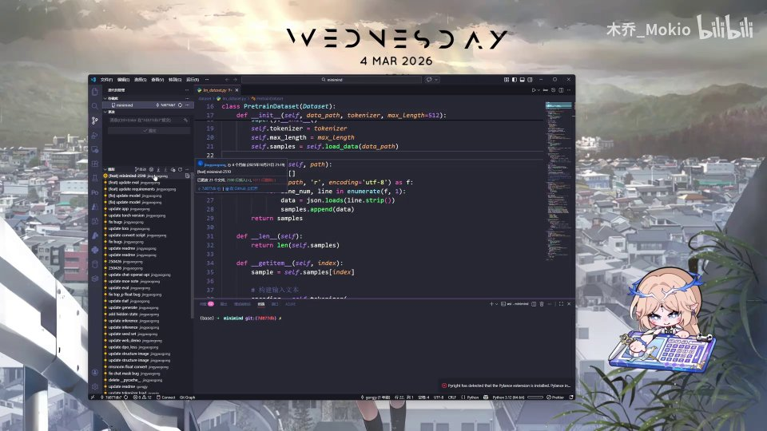
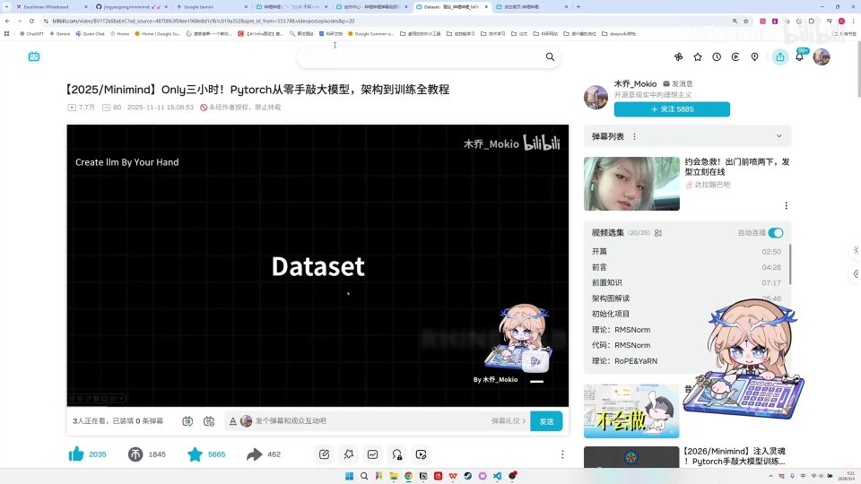
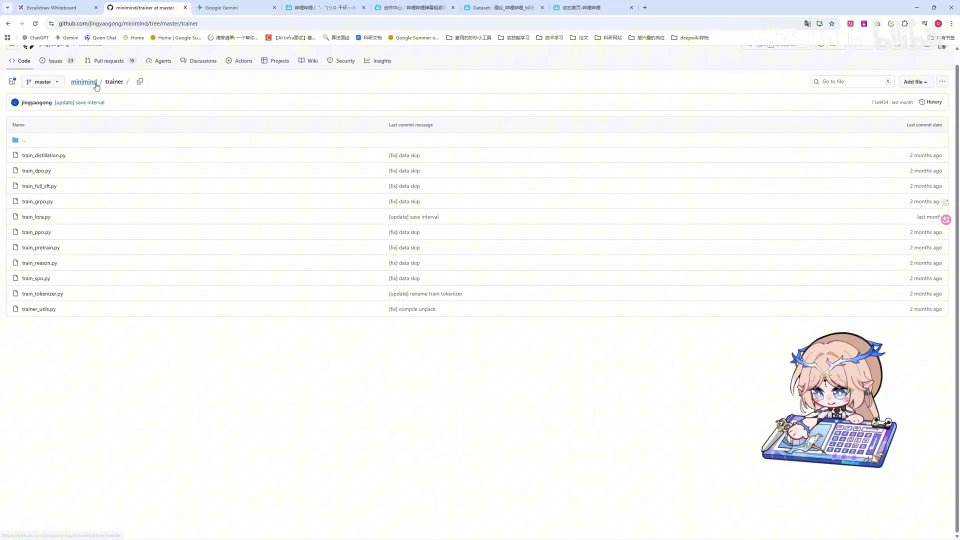
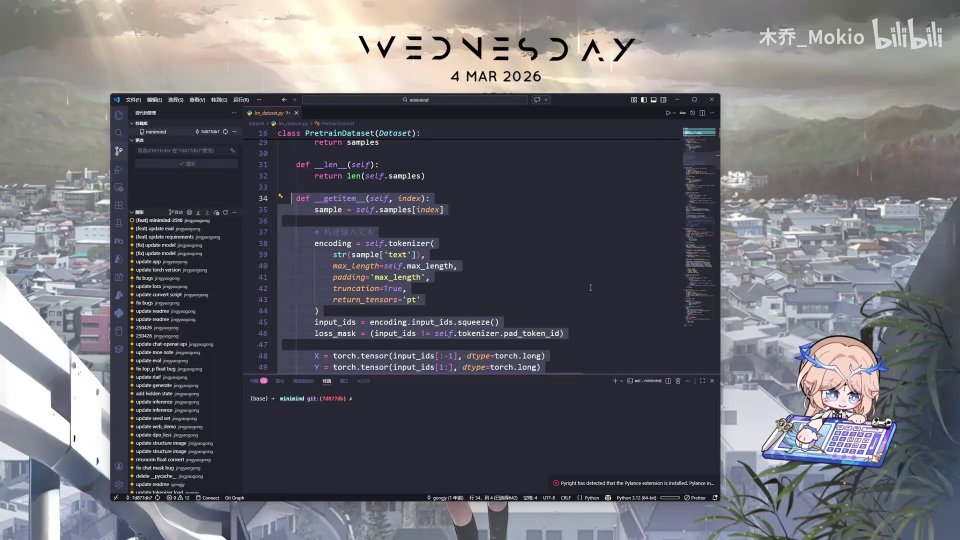
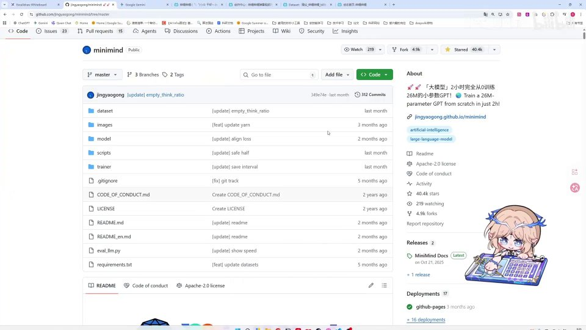
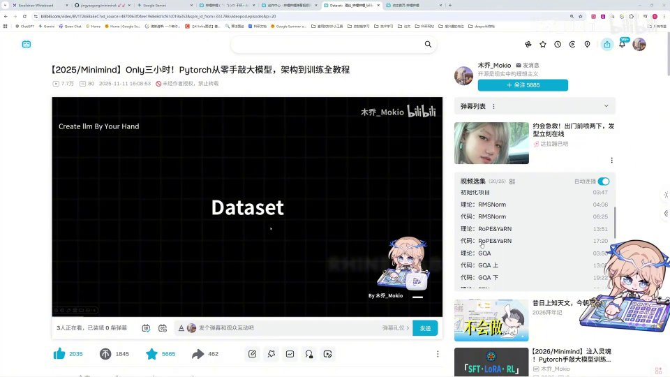
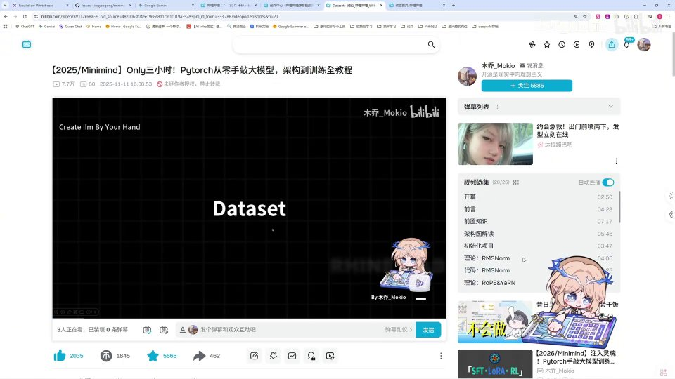

# 必看：前言补充 原始文稿（图-字幕分栏）

| 字幕文本 | 画面 |
| :--- | ---: |
| 大家好，这一 part 我必须做一次前言补充，以便后来的观众…… [【跳转到 00:00】](https://www.bilibili.com/video/BV1T2k6BaEeC/?p=3&t=0) |  |
| 避免一些误导。首先，现在是 26 年（2026 年）的 3 月 4 号。 [【跳转到 00:05】](https://www.bilibili.com/video/BV1T2k6BaEeC/?p=3&t=5) |  |
| 我制作的这一系列 Minimind 的视频 [【跳转到 00:10】](https://www.bilibili.com/video/BV1T2k6BaEeC/?p=3&t=10) |  |
| 是在去年 11 月份上传的，而当时我已经在 9 月和 10 月阅读了 [【跳转到 00:15】](https://www.bilibili.com/video/BV1T2k6BaEeC/?p=3&t=15) |  |
| Minimind 的官方代码。在当时，Minimind 的官方代码是有一系列问题的， [【跳转到 00:20】](https://www.bilibili.com/video/BV1T2k6BaEeC/?p=3&t=20) |  |
| 所以大家可能会在评论区觉得 [【跳转到 00:25】](https://www.bilibili.com/video/BV1T2k6BaEeC/?p=3&t=25) |  |
| 比如说代码的理论有问题，或者说是理论方面有问题， [【跳转到 00:30】](https://www.bilibili.com/video/BV1T2k6BaEeC/?p=3&t=30) |  |
| 或者我敲的代码和官方仓库对不上。那么这里呢 [【跳转到 00:35】](https://www.bilibili.com/video/BV1T2k6BaEeC/?p=3&t=35) |  |
| 是因为 up 主当时是在 9 月、10 月学习的 Minimind 的官方代码，可以看到当时的这样一个分支。 [【跳转到 00:40】](https://www.bilibili.com/video/BV1T2k6BaEeC/?p=3&t=40) |  |
| 在这里就是有很多问题的，比如说它的 pretrain_dataset 和现在官方仓库里的 pretrain_dataset 对不上。 [【跳转到 00:45】](https://www.bilibili.com/video/BV1T2k6BaEeC/?p=3&t=45) |  |
| 在这里的 [【跳转到 00:55】](https://www.bilibili.com/video/BV1T2k6BaEeC/?p=3&t=55) |  |
| 嗯，在这里的 pretrain_dataset 可以发现，当时的编写和现在的编写就是完全不一样的。这一切呢，都是因为 Minimind 的官方作者在最近的一两个月里更新了很多原本错误的地方，而当 up 主制作视频的时候，这些地方还没有被修复。 [【跳转到 01:00】](https://www.bilibili.com/video/BV1T2k6BaEeC/?p=3&t=60) |  |
| 所以说呢，我希望大伙儿不要完全照着去看相关的内容， [【跳转到 01:22】](https://www.bilibili.com/video/BV1T2k6BaEeC/?p=3&t=82) |  |
| 如果有修复或者错误的地方， [【跳转到 01:27】](https://www.bilibili.com/video/BV1T2k6BaEeC/?p=3&t=87) |  |
| 我会尽量去制作一个视频的重制版。然后呢，代码大家一定还是要以官方的最新代码为 [【跳转到 01:32】](https://www.bilibili.com/video/BV1T2k6BaEeC/?p=3&t=92) |  |
| 准，看他的最新代码，而且如果发现有任何问题的话， [【跳转到 01:39】](https://www.bilibili.com/video/BV1T2k6BaEeC/?p=3&t=99) |  |
| 也可以提个 issue 向官方去反馈。好，那么这里感谢大家的理解。 [【跳转到 01:44】](https://www.bilibili.com/video/BV1T2k6BaEeC/?p=3&t=104) |  |
| 如果大家还是想要去深入学习的话，可以继续往下观看， [【跳转到 01:49】](https://www.bilibili.com/video/BV1T2k6BaEeC/?p=3&t=109) |  |
| 不过一定要去对照官方代码，把错误的地方自己辨别一下，不要完全地照搬吸收。好，谢谢大家。 [【跳转到 01:54】](https://www.bilibili.com/video/BV1T2k6BaEeC/?p=3&t=114) |  |
| （此区间无字幕） [【跳转到 02:02】](https://www.bilibili.com/video/BV1T2k6BaEeC/?p=3&t=122) |  |