# 前置知识 原始文稿（图-字幕分栏）

| 字幕文本 | 画面 |
| :--- | ---: |
| 那么大家好，在这 1 part 呢，我们来了解一下学习之前你务必回答的三个问题。如果这三个问题你现在还没有头绪的话，那么我觉得还是需要去补一些基础知识再来学习比较好；如果说实在比较忙的话，可以听我接下来的讲解。那首先第一点，神经网络是什么？呃，我希望你能回答出神经网络…… [【跳转到 00:00】](https://www.bilibili.com/video/BV1T2k6BaEeC/?p=4&t=0) |  |
| 就是回答这三个问题吗？神经网络是为什么而被想出来的？它是为了解决什么问题？然后它是什么？那么 attention 它又是什么？它是为了解决什么问题而提出来的？那么还有最后一个，就是 PyTorch 的架构你有没有了解？这关乎我们后面写代码的相关内容。好，那么如果说…… [【跳转到 00:25】](https://www.bilibili.com/video/BV1T2k6BaEeC/?p=4&t=25) | 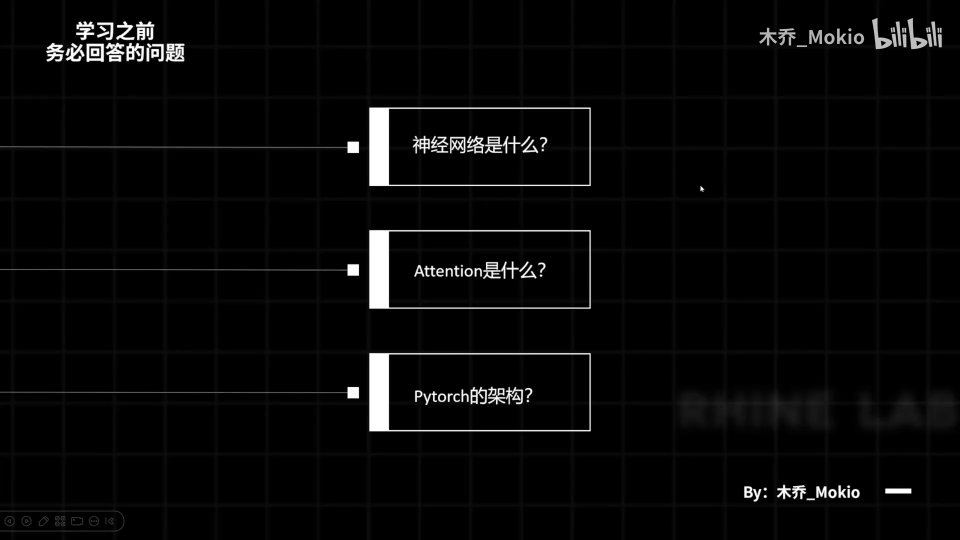 |
| 你想要去弥补自己的基础知识的话，现在可以退出去补一下再来看；如果实在太忙的话，听我接下来的讲解。 [【跳转到 00:50】](https://www.bilibili.com/video/BV1T2k6BaEeC/?p=4&t=50) | 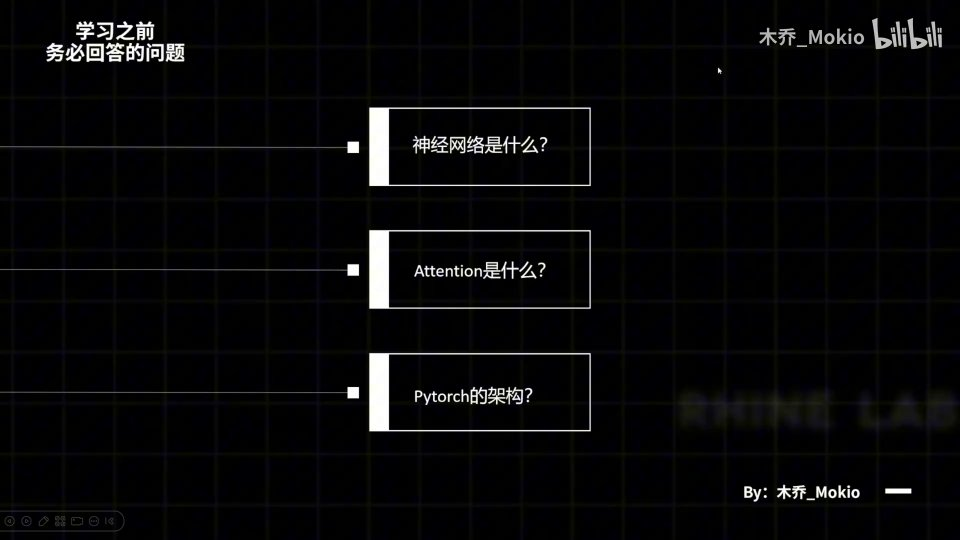 |
| 首先，神经网络是什么呢？在提神经网络之前，我们首先来了解一个概念，就是 function 函数嘛，这个大伙都知道：给定一个输入 X，然后经过 function 之后能够得到一个输出 Y，也就是给一个输入、然后能拿到一个输出，对吧？那么神经网络它研究的、它诞生的目的是什么呢？ [【跳转到 01:00】](https://www.bilibili.com/video/BV1T2k6BaEeC/?p=4&t=60) |  |
| 就是为了拟合函数。呃，为什么呢？为什么要拟合函数呢？因为函数很多都有各种乱七八糟的形式嘛，有的可能你没办法用一个式子写出来，但神经网络却可以拟合基本上任意一个函数。这里呢我不会去讲它为什么能拟合函数，如果说你想要了解的话，可以去看相关的讲解视频。那么它能拟合函数有什么意义呢？ [【跳转到 01:25】](https://www.bilibili.com/video/BV1T2k6BaEeC/?p=4&t=85) |  |
| 如果你看过 3B1B 或者类似科普的视频的话，你会知道这句话是 "world is a function"——世界是一个函数。为什么呢？世界，你给定一个输入之后，它一定会按照相应的规则得到一个输出。比如说如果蝴蝶扇动翅膀，它会在世界这个函数下运转出一场风暴。 [【跳转到 01:50】](https://www.bilibili.com/video/BV1T2k6BaEeC/?p=4&t=110) | 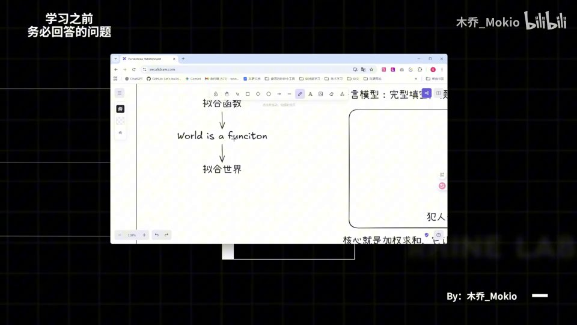 |
| 那么这就是"世界是一个函数"的一个例子，对吧？我们常说谚语里的一个例子。那么神经网络可以拟合函数，而世界又是一个函数，那么神经网络它又能做什么？没错，它又能拟合世界、拟合世界运行的规律。这就是我认为神经网络诞生的最重要的一个目的，就是它是为了拟合世界、或者说拟合世界的一部分而存在的。 [【跳转到 02:15】](https://www.bilibili.com/video/BV1T2k6BaEeC/?p=4&t=135) | 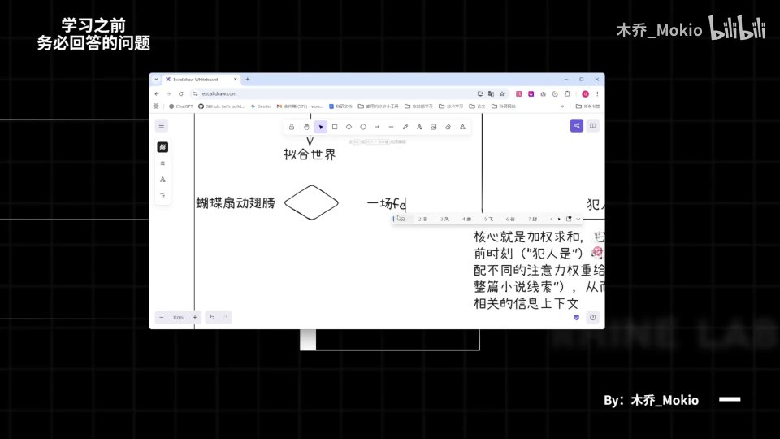 |
| 那么接下来第二点，attention 是什么？呃，这个如果你不了解的话…… [【跳转到 02:40】](https://www.bilibili.com/video/BV1T2k6BaEeC/?p=4&t=160) | 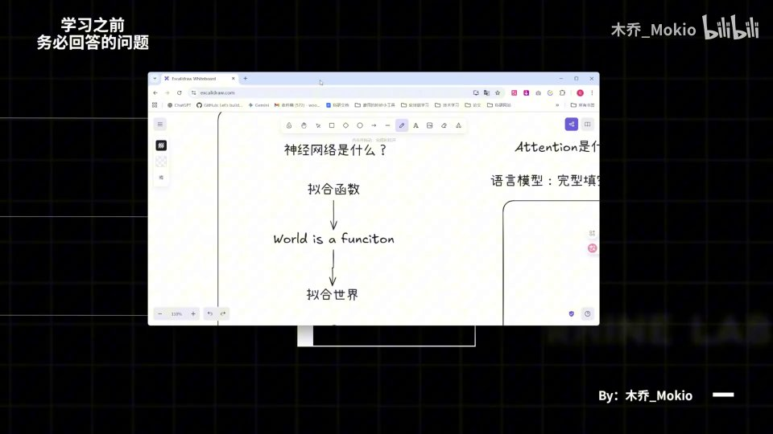 |
| 呃，希望能看完我的讲解之后，一定要再去看一下 3B1B 的 attention 讲解视频，真的是非常完美。那么在回答 attention 是什么之前，我们先聊、先看一下语言模型。那我们都知道，语言模型它本质上就是说它是一个完形填空一样的东西，就是说你输入一堆词之后，它会根据你输入的词然后不断预测下一个词是什么。 [【跳转到 02:45】](https://www.bilibili.com/video/BV1T2k6BaEeC/?p=4&t=165) | 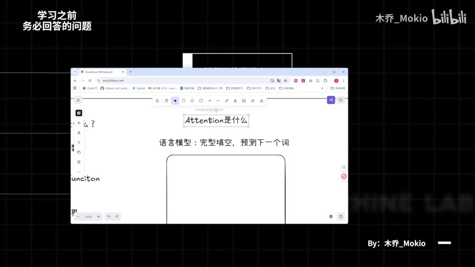 |
| 也就是说它本质是起一个预测的作用，它并不是说完全理解了你所说的话之类的。那么 attention 是什么呢？Attention 就是能让语言模型预测出下一个词的核心机制。比如说我们这里有一本推理小说，对吧？我前面写了很多很多很多很多东西，然后最后读到"凶手是谁、犯人是什么"的时候…… [【跳转到 03:10】](https://www.bilibili.com/video/BV1T2k6BaEeC/?p=4&t=190) |  |
| 那其实当你看到这个词的时候，你脑子里应该是能推理出犯人是谁。啊，为什么你能推理出呢？是因为前面所有内容的信息，在此刻都已经汇聚在了你的脑子里，当你读到这个事的时候，你就能根据前面的相关信息推导出犯人是什么，也就是说你能预测出下一个词是什么。 [【跳转到 03:35】](https://www.bilibili.com/video/BV1T2k6BaEeC/?p=4&t=215) | 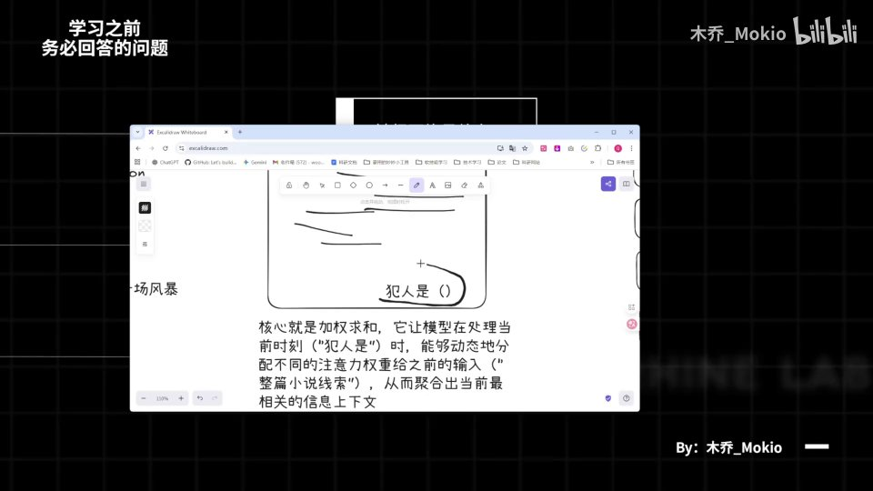 |
| 那么这个就是 attention 相关的机制，它的核心呢就是加权求和，呃，它能让模型在处理当前时刻、比如"犯人"这个词的时候，能够动态地分配注意力权重给之前的输入，从而聚合出最相关的上下文信息。为什么说是加权求和呢？因为像你在侦探小说里总会有一些关键的线索，那么这些关键的线索你自然是要去分配更多的注意力…… [【跳转到 04:00】](https://www.bilibili.com/video/BV1T2k6BaEeC/?p=4&t=240) | 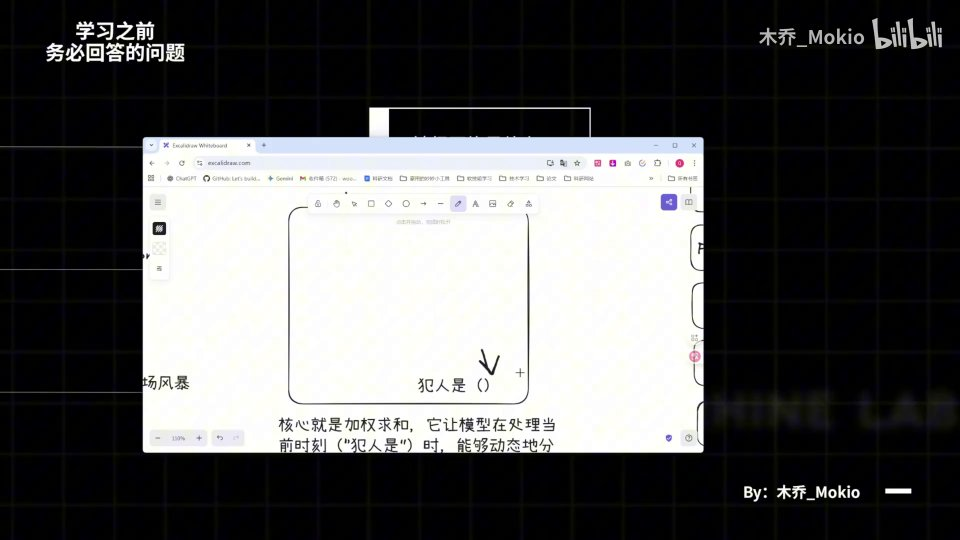 |
| 在上面，才能帮助你更好地预测出下一个词；而对于一些无关痛痒的描写，你当然就分配比较少的注意力。然后这就是加权的意义。求和呢，自然就是你把前面所有的信息汇总起来，预测出下一个词。那么这就是 attention 的机制，大伙能理解一下这句话就好。那么接下来呢就是第三点，就是我们 code 的时候必须要注意的一个点，就是 PyTorch。 [【跳转到 04:25】](https://www.bilibili.com/video/BV1T2k6BaEeC/?p=4&t=265) |  |
| 它的架构。呃，PyTorch 呢，在我看来有五个比较重要的概念，大伙可以理解一下。 [【跳转到 04:50】](https://www.bilibili.com/video/BV1T2k6BaEeC/?p=4&t=290) | 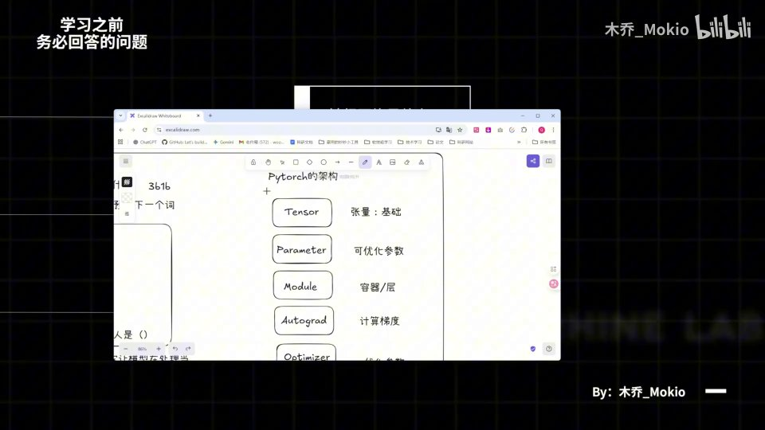 |
| 首先就是 tensor，tensor 就是张量，这个是我们在 PyTorch、包括我们在学习机器学习、人工智能里面最基础的概念。如果你不知道的话，我建议你去看飞天闪客老师新出的一个视频，里面详细讲了你应该怎样去理解、一把理解 tensor 这个概念。那么第二点就是 parameter…… [【跳转到 04:57】](https://www.bilibili.com/video/BV1T2k6BaEeC/?p=4&t=297) | 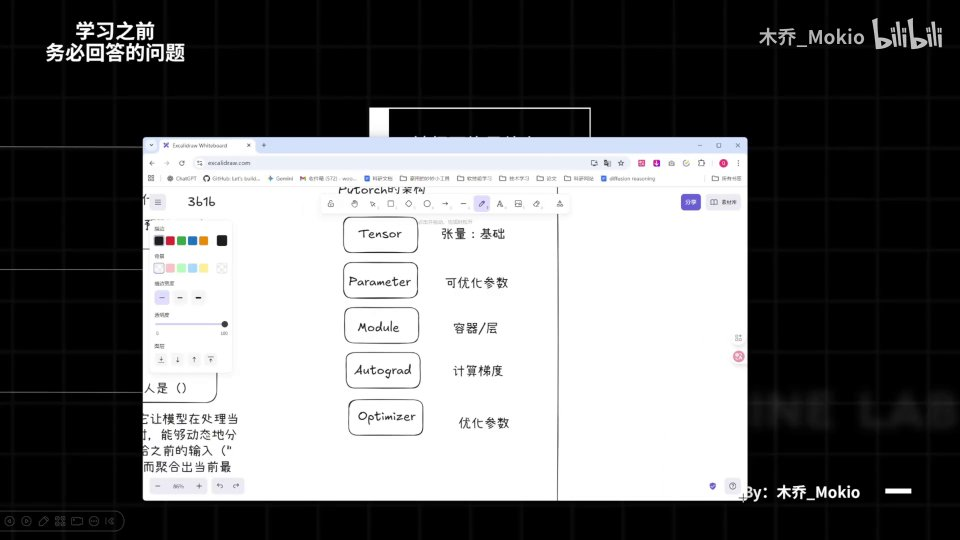 |
| 也就是 PyTorch 这个框架里你会定义很多参数。因为像我们在学习的时候，总会一开始会初始化一部分参数，然后在训练的过程中不断使这些参数达到最优，那这个 parameter 就是我们定义的、可以优化的一些参数。然后呢就是 module，比如写代码的时候我们的 nn.Module，那这个是什么呢？这个你可以看做一个容器，或者一层东西。 [【跳转到 05:22】](https://www.bilibili.com/video/BV1T2k6BaEeC/?p=4&t=322) | 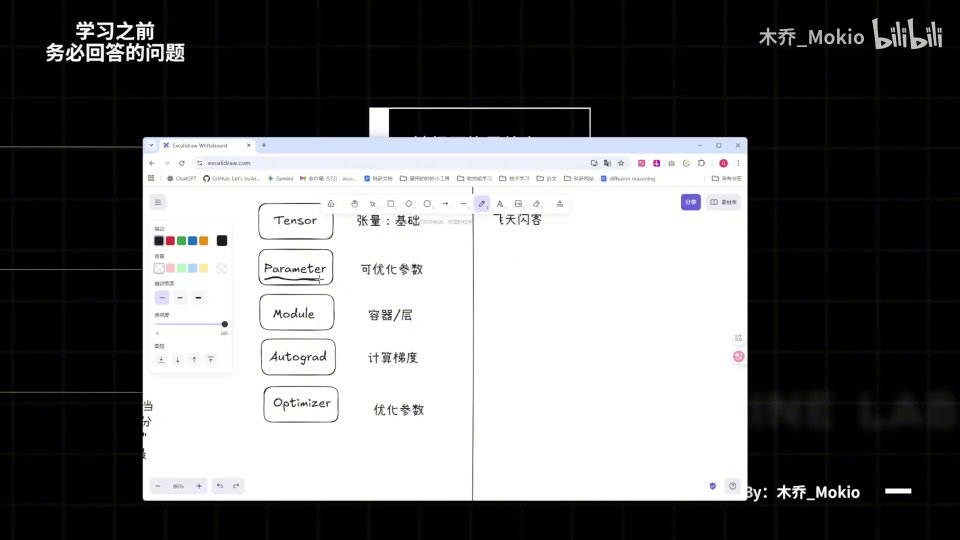 |
| 它本质上就是容纳了你对数据处理的所有逻辑。比如说你输入一个 tensor，然后经过这一层之后，它输出了另外一个 tensor，那么中间这些所有的加工过程，我们就可以包含在 nn.Module 里。那么这个 module 呢，它就相当于一个工厂，能够帮助你管理所有的零件。 [【跳转到 05:47】](https://www.bilibili.com/video/BV1T2k6BaEeC/?p=4&t=347) |  |
| 不只是容纳逻辑，比如说你把参数放进去，它能帮助你管理相关的参数。然后就是 autograd 和 optimizer 两个东西。既然前面我们都提到了可优化参数嘛，那么怎样去优化它，就是 autograd 和 optimizer 的事。呃，在机器学习里，如果你学过基础的概念的话，你就会知道我们往往优化…… [【跳转到 06:12】](https://www.bilibili.com/video/BV1T2k6BaEeC/?p=4&t=372) | 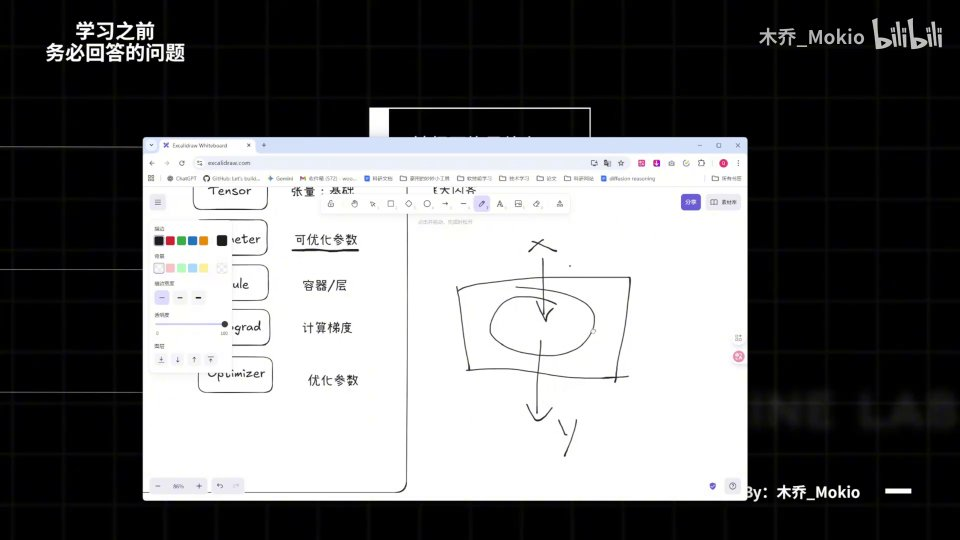 |
| 学习用的是梯度下降的算法。那么要梯度下降，首先就要计算梯度，就需要用 autograd；然后你就需要用 optimizer 来优化我们的参数。如果你不了解这个概念的话，依旧记得要去补基础知识。好，那么这就是我们这 1 part 所补充的三个最重要的点。如果说你仍然是一头雾水的话…… [【跳转到 06:37】](https://www.bilibili.com/video/BV1T2k6BaEeC/?p=4&t=397) |  |
| 呃，我再次、再次强调，一定要去弥补基础知识，才能够更好地学习。好，那么我们下一块正式开始对模型的学习，我们下一块见。 [【跳转到 07:02】](https://www.bilibili.com/video/BV1T2k6BaEeC/?p=4&t=422) | 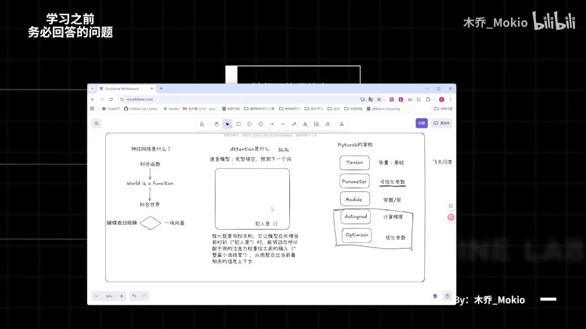 |