# 架构图解读 原始文稿（图-字幕分栏）

| 字幕文本 | 画面 |
| :--- | ---: |
| 我们这一趴就正式开始对 Minimind 的模型进行一些学习。那么，在学习任何一个模型之前，我们首先要学会看它的架构图。 [【跳转到 00:00】](https://www.bilibili.com/video/BV1T2k6BaEeC/?p=5&t=0) | 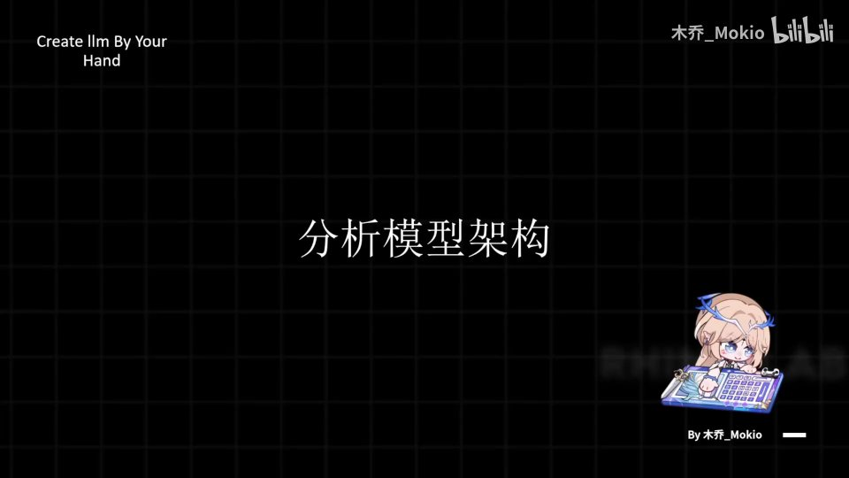 |
| 就像 Transformer 的架构图一样，这个架构图指引了我们后面代码如何编写。 [【跳转到 00:10】](https://www.bilibili.com/video/BV1T2k6BaEeC/?p=5&t=10) | 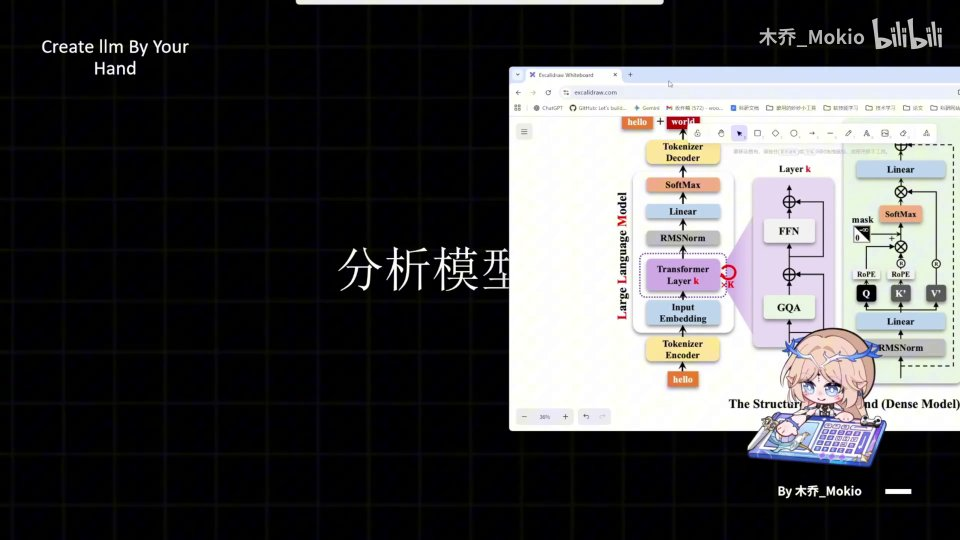 |
| 首先我们来看一下这个我从 GitHub 上扒下来的一个架构图。 [【跳转到 00:15】](https://www.bilibili.com/video/BV1T2k6BaEeC/?p=5&t=15) |  |
| 在此我说一下。 [【跳转到 00:21】](https://www.bilibili.com/video/BV1T2k6BaEeC/?p=5&t=21) | 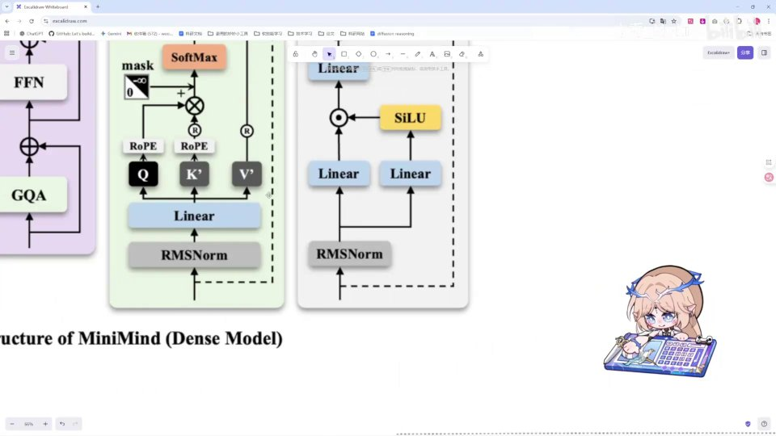 |
| 在这期讲架构图的时候，像中间 RMSNorm 或者 Linear 这些东西，我们不会放在这里讲。 [【跳转到 00:26】](https://www.bilibili.com/video/BV1T2k6BaEeC/?p=5&t=26) |  |
| 大家先对整个架构有一个最基础的印象，当我们学完后面所有的知识之后，你可以回过头来再看这个架构图，就会豁然开朗。 [【跳转到 00:31】](https://www.bilibili.com/video/BV1T2k6BaEeC/?p=5&t=31) | 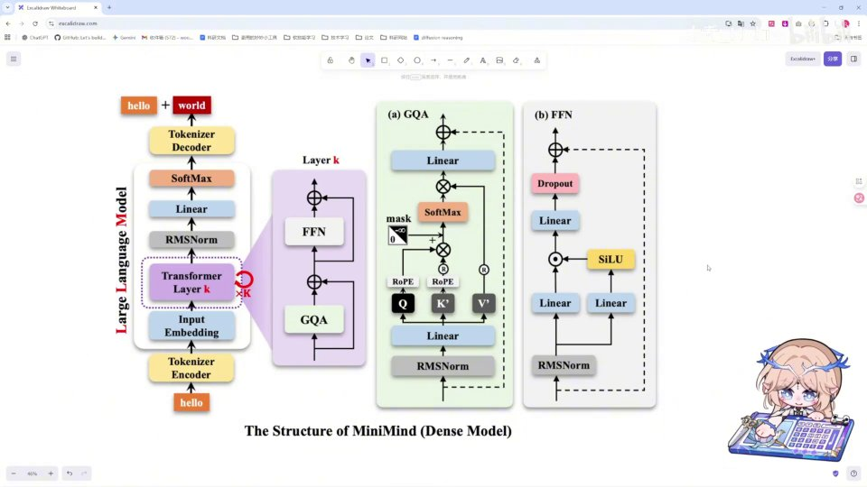 |
| 首先我们先对这个架构图有一个了解即可。首先我们输入一个 hello。 [【跳转到 00:41】](https://www.bilibili.com/video/BV1T2k6BaEeC/?p=5&t=41) |  |
| 输入 hello 这个词之后，它会经过 tokenizer encoder，也就是编码器，把它编码成一个 id。 [【跳转到 00:46】](https://www.bilibili.com/video/BV1T2k6BaEeC/?p=5&t=46) | 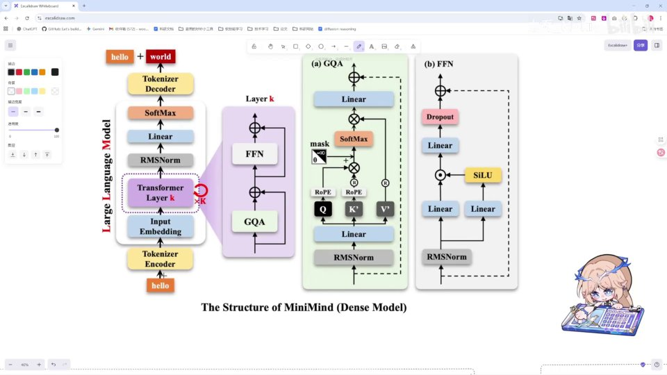 |
| 也就是 hello 输入之后，会被 tokenizer 编码成某个 id。 [【跳转到 00:53】](https://www.bilibili.com/video/BV1T2k6BaEeC/?p=5&t=53) | 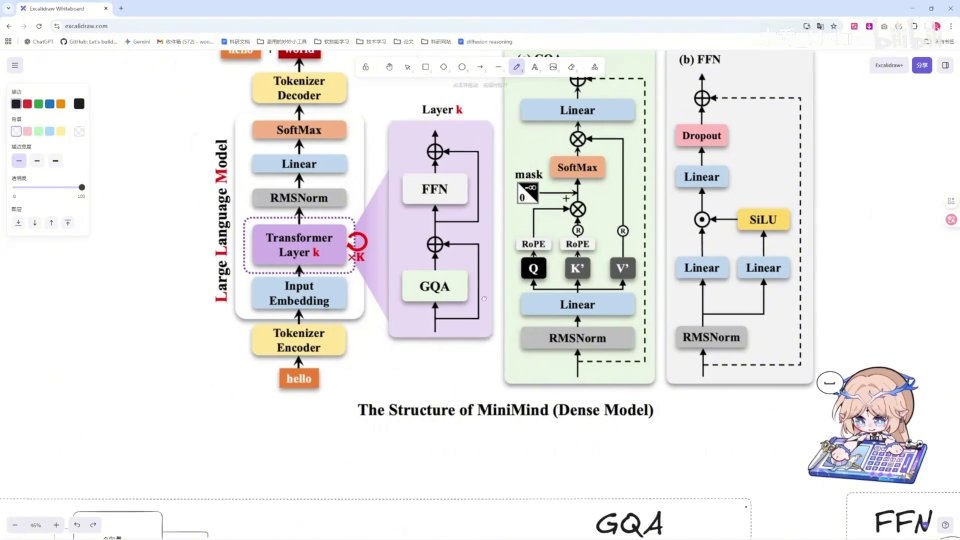 |
| 比如说 1234567 任意一个 id 输入之后，然后通过 input embedding 变成向量。 [【跳转到 00:58】](https://www.bilibili.com/video/BV1T2k6BaEeC/?p=5&t=58) |  |
| 也就是把张量变成向量之后，它会送入 Transformer 层进行 K 次循环。可以看到这里有一个 K 次，还要经过 K 次循环之后再输出，那我们来看一下这个最重要的 Transformer 层。 [【跳转到 01:03】](https://www.bilibili.com/video/BV1T2k6BaEeC/?p=5&t=63) | 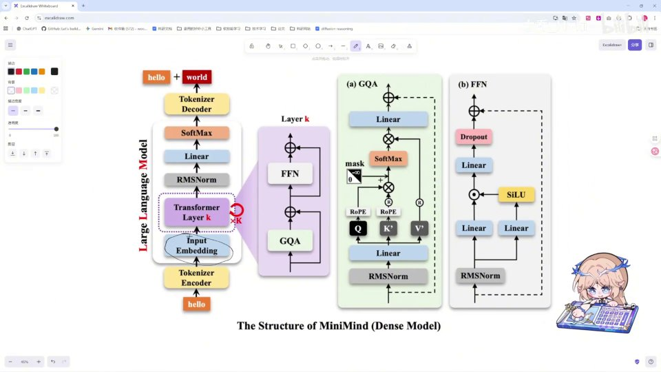 |
| 它有哪些部分？分为两大部分，一个是 FFN，一个是 GQA。那么 GQA 呢，它其实就是分组的、共享 K 和共享 V 的（注意力）。 [【跳转到 01:15】](https://www.bilibili.com/video/BV1T2k6BaEeC/?p=5&t=75) | 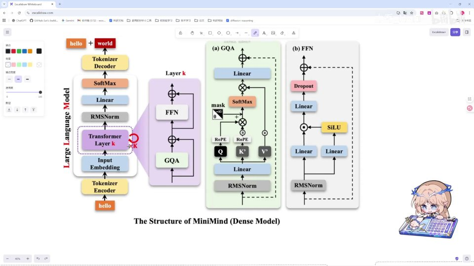 |
| 注意力机制其实就是算完 attention 之后进入 FFN。FFN 是一个处理数据的层，那我们再来细看一下里面两部分具体是什么。我们从这里开始，这里进入 GQA 之后，它会先进入 RMSNorm。我们现在不需要知道这个知识，你只需要知道这一层它的作用就是对数据进行处理，让数据更加规律稳定，然后送入 Linear 层。 [【跳转到 01:28】](https://www.bilibili.com/video/BV1T2k6BaEeC/?p=5&t=88) | 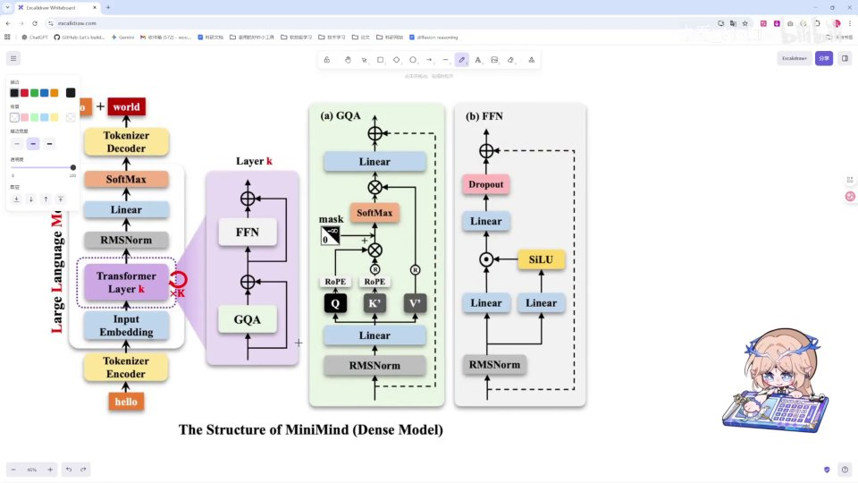 |
| 在这个 Linear 层呢，这个向量会分别和 W_Q、W_K、W_V 三个矩阵进行相乘，得到 Q、K、V 三个向量。然后得到 Q、K、V 三个向量之后，Q 向量和 K 向量会经过 RoPE 旋转位置编码，融入它的位置信息，这个我们也会在后面讲。然后 K 和 V 呢，它会自我复制，去让 Q 共享多个 K 和 V。 [【跳转到 01:53】](https://www.bilibili.com/video/BV1T2k6BaEeC/?p=5&t=113) | 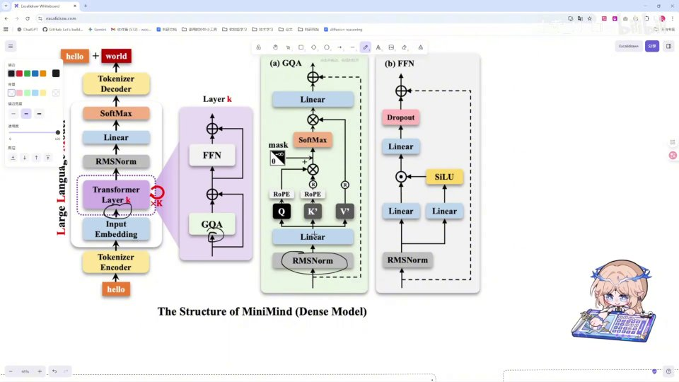 |
| 然后我们可以看到 Q 和 K 会在这里进行一个点积，进行点积之后，它会得到一个类似表格一样的东西，会计算出它的注意力，也就是注意力侧重。 [【跳转到 02:18】](https://www.bilibili.com/video/BV1T2k6BaEeC/?p=5&t=138) | 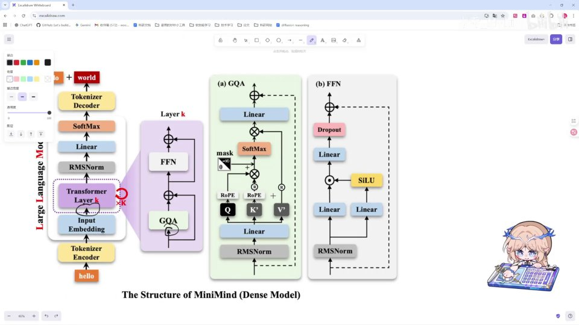 |
| 然后会经过 mask 掩码，经过掩码之后经过 softmax 函数转化成概率，转化成概率之后再和这里的 V 进行点乘。点乘之后经过 Linear 层，这个 Linear 层是用来处理多头注意力的，因为我们并不会用单头注意力。 [【跳转到 02:43】](https://www.bilibili.com/video/BV1T2k6BaEeC/?p=5&t=163) | 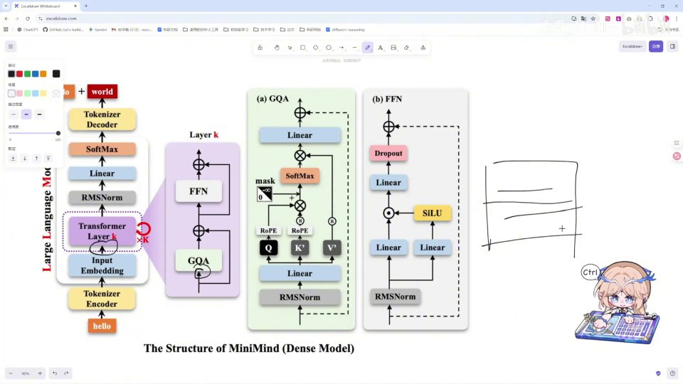 |
| 我们会在 Linear 层这里把多头拼接起来，然后再送出来，送出来之后进入 FFN。FFN 里首先也是 RMSNorm 来进行一个归一化，对数据进行处理让它更规范，然后会进入两个 Linear 层。这两个 Linear 层是对我们送进来的张量进行升维，升维之后，这个 Linear 层它会经过 SiLU 激活函数引入非线性，然后会在这里进行逐元素相乘。 [【跳转到 02:59】](https://www.bilibili.com/video/BV1T2k6BaEeC/?p=5&t=179) |  |
| 相当于一个门一样去筛选哪些信息可以流入。然后因为我们这里是升维嘛，所以这个 Linear 层的作用就是降维，把原来升维的给降维回来，然后 dropout 防止过拟合。 [【跳转到 03:24】](https://www.bilibili.com/video/BV1T2k6BaEeC/?p=5&t=204) | 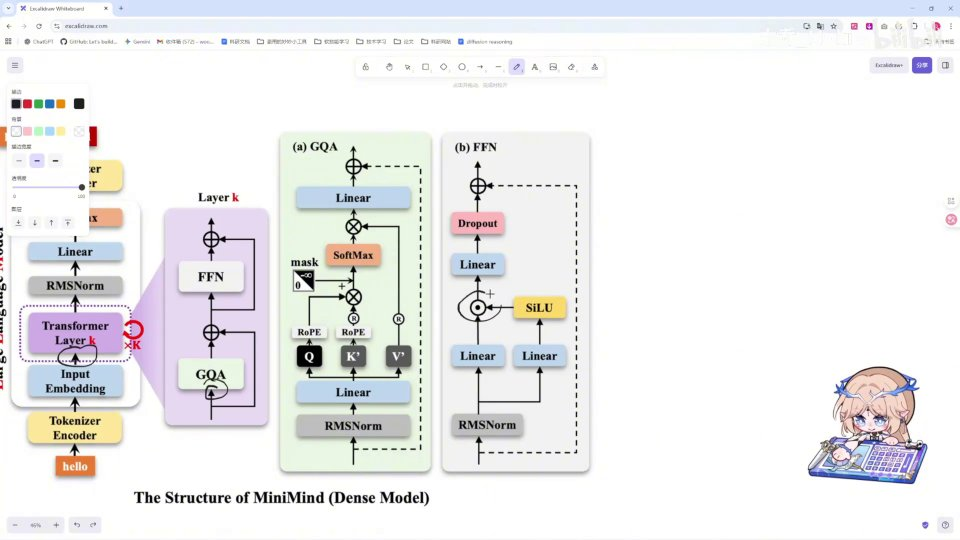 |
| 防止过拟合之后再输出。然后我们都可以看到，无论是 GQA 还是 FFN 里，都有这个虚线，那么这个虚线呢，就是残差网络（residual）。 [【跳转到 03:39】](https://www.bilibili.com/video/BV1T2k6BaEeC/?p=5&t=219) |  |
| 也就是说它会把最初的状态给保留下来，然后等处理完之后，再和最后处理出的状态相加，再送出来，那么这个作用呢我们后续也会讲。然后我们可以看到，经过 GQA、残差、FFN、残差之后再送入 RMSNorm 进行数据的稳定处理。 [【跳转到 03:50】](https://www.bilibili.com/video/BV1T2k6BaEeC/?p=5&t=230) | 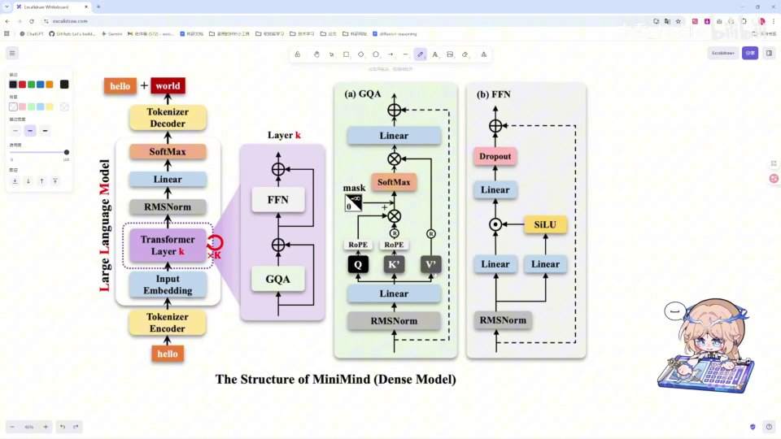 |
| 再送入这个 Linear 层，那么这个 Linear 层呢，作用就是说我们把得到的 logits，也就是注意力分数，给它映射到整个词表里。会有一个大的词表，然后会分配到每个词表里，告诉我们每个词预测到的概率应该是多少，然后经过 softmax 转化成概率，之后再通过 decoder，因为我们 encoder 嘛，encoder 编码。 [【跳转到 04:09】](https://www.bilibili.com/video/BV1T2k6BaEeC/?p=5&t=249) |  |
| 那么一定要解码，通过 tokenizer 的解码，我们把那个概率最大的词拿出来，也就是 word（词）。那么我在下面呢也画了一个完整的流水线的图。 [【跳转到 04:34】](https://www.bilibili.com/video/BV1T2k6BaEeC/?p=5&t=274) | 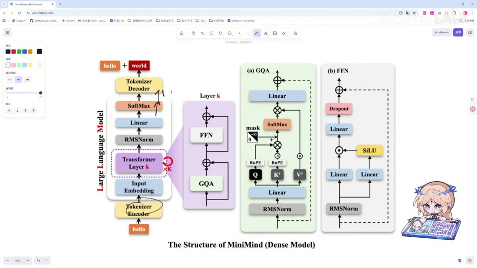 |
| 大伙可以这样来看一下。 [【跳转到 04:41】](https://www.bilibili.com/video/BV1T2k6BaEeC/?p=5&t=281) | 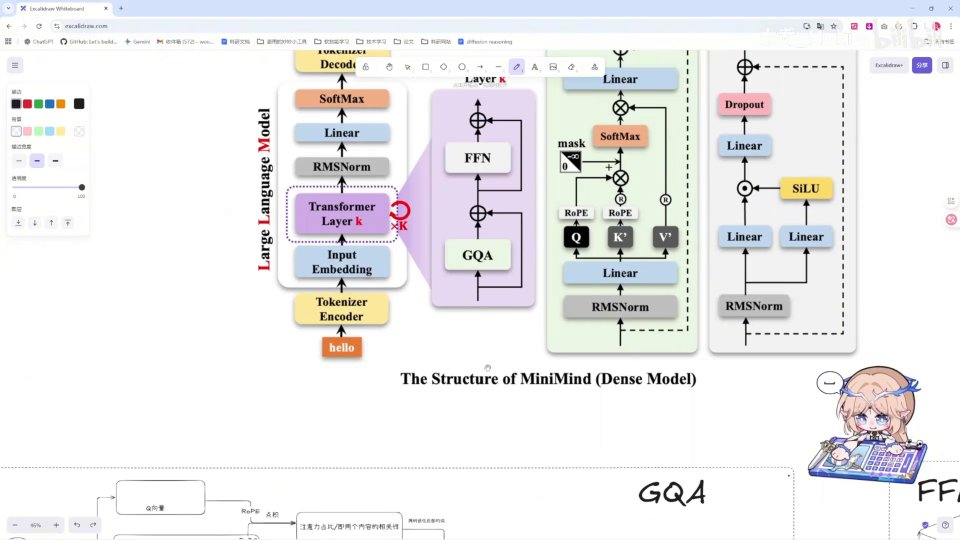 |
| Hello 经过 tokenizer 变成 id，然后向量化之后保存初始，它用作后续残差，然后 RMSNorm 送入这个 GQA 层里，然后在里面 Q、K、V 相乘，Q、K、V 分别处理，然后在 Linear 层进行多头拼接，然后归一化，在这里把原本的残差、这边的残差给加上来，然后再保留一下用到后面的残差，在 FFN 里升维降维。 [【跳转到 04:46】](https://www.bilibili.com/video/BV1T2k6BaEeC/?p=5&t=286) | 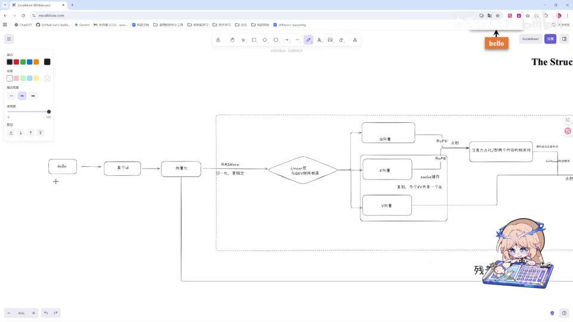 |
| 门控筛选，在 Linear 层降维，然后 dropout 防止过拟合，再在这里把残差加起来，之后 RMSNorm 处理，Linear 层映射全词表，softmax 层得到概率，然后我们经过 tokenizer decoder 然后得到这个 word。好，那么大伙如果这 1 part 听得有些迷惑的话，不用担心，对这个整个流程有一个了解就好。 [【跳转到 05:11】](https://www.bilibili.com/video/BV1T2k6BaEeC/?p=5&t=311) | 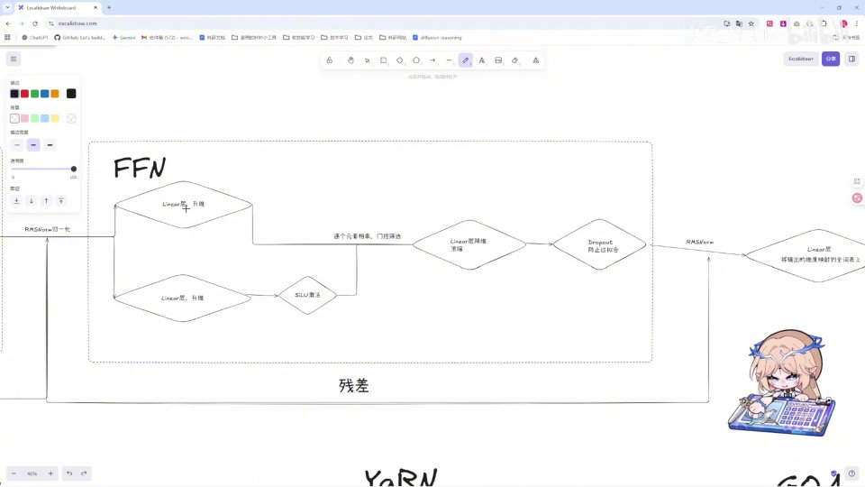 |
| 那么我们下一趴开始，正式开始我们代码的讲解和项目的构建。好。 [【跳转到 05:33】](https://www.bilibili.com/video/BV1T2k6BaEeC/?p=5&t=333) | 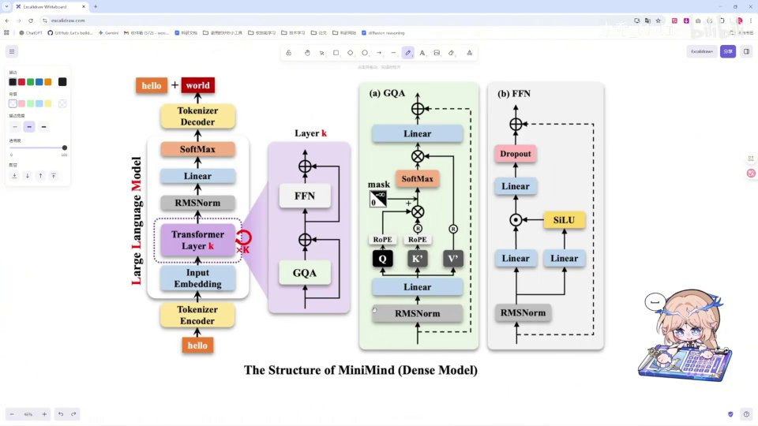 |
| 那么我们下一块见。 [【跳转到 05:40】](https://www.bilibili.com/video/BV1T2k6BaEeC/?p=5&t=340) | 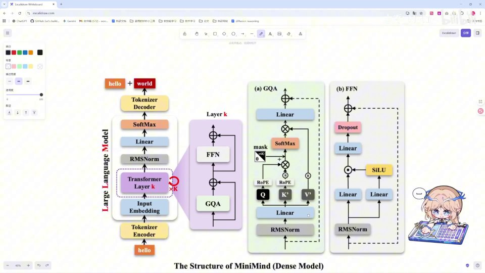 |