# 初始化项目 原始文稿（图-字幕分栏）

| 字幕文本 | 画面 |
| :--- | ---: |
| 磨刀不误砍柴工，我们首先来初始化一下我们的项目。那么首先准备一个空的文件夹。 [【跳转到 00:00】](https://www.bilibili.com/video/BV1T2k6BaEeC/?p=6&t=0) |  |
| 然后我们使用 uv 来初始化这个 Python 项目。 [【跳转到 00:07】](https://www.bilibili.com/video/BV1T2k6BaEeC/?p=6&t=7) | 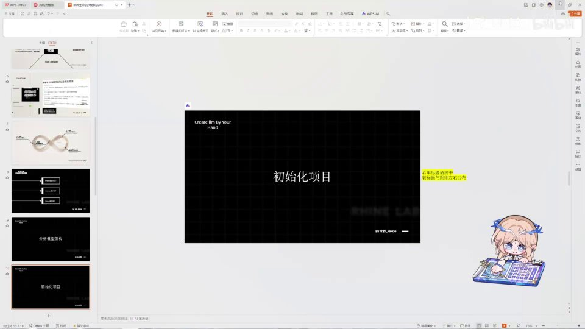 |
| 使用 uv init。如果你对 uv 不了解的话，我也挺推荐你去看一下我之前做的《现代化的 Python 工具》那个视频，我觉得还是比较有用的，也希望能给那个视频进行一个三连。 [【跳转到 00:12】](https://www.bilibili.com/video/BV1T2k6BaEeC/?p=6&t=12) | 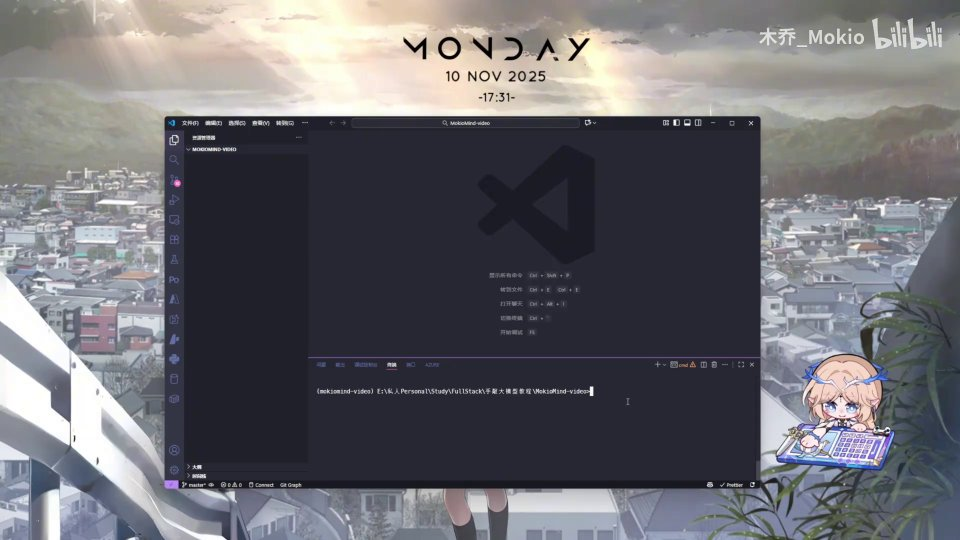 |
| 就是这样一个视频。好，那么我们继续用 uv init 来初始化一下 [【跳转到 00:32】](https://www.bilibili.com/video/BV1T2k6BaEeC/?p=6&t=32) | 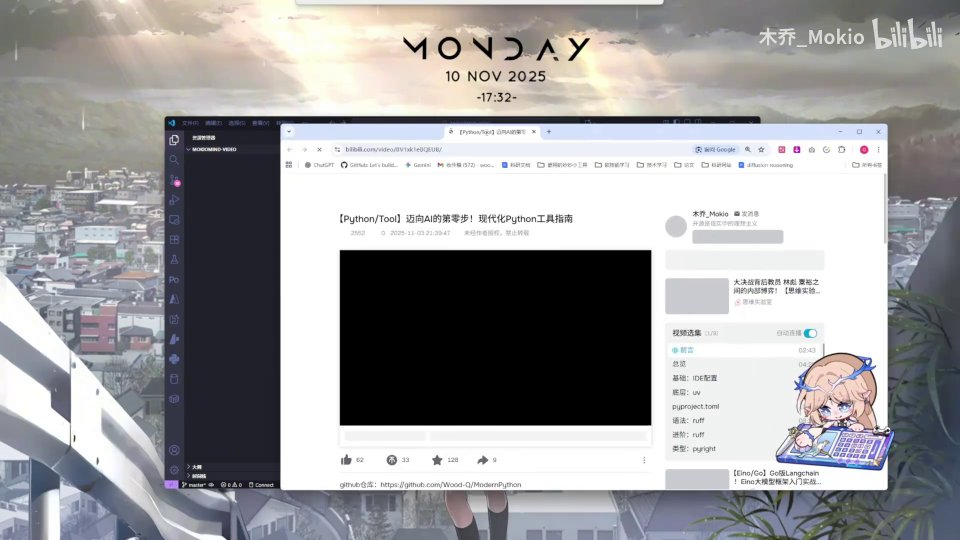 |
| 我们的项目。可以看到，然后把我这里的 pyproject.toml 直接复制粘贴过来。 [【跳转到 00:37】](https://www.bilibili.com/video/BV1T2k6BaEeC/?p=6&t=37) | 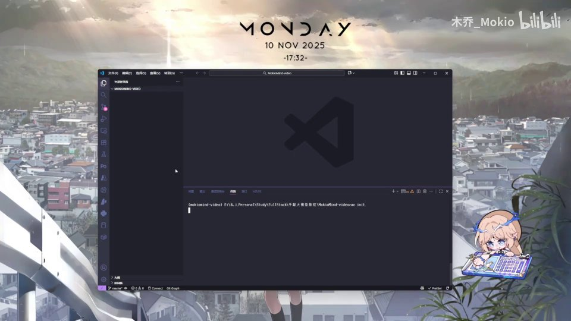 |
| 我们把这里的 dependencies [【跳转到 00:44】](https://www.bilibili.com/video/BV1T2k6BaEeC/?p=6&t=44) | 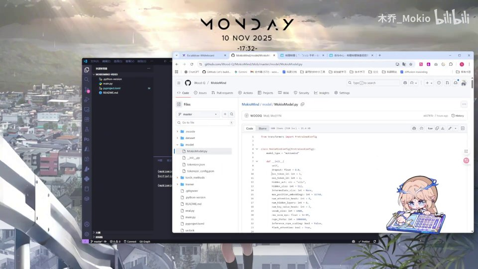 |
| 粘贴过来，也就是它的依赖。那么接下来我们直接用 uv sync 来进行依赖的安装 [【跳转到 00:49】](https://www.bilibili.com/video/BV1T2k6BaEeC/?p=6&t=49) | 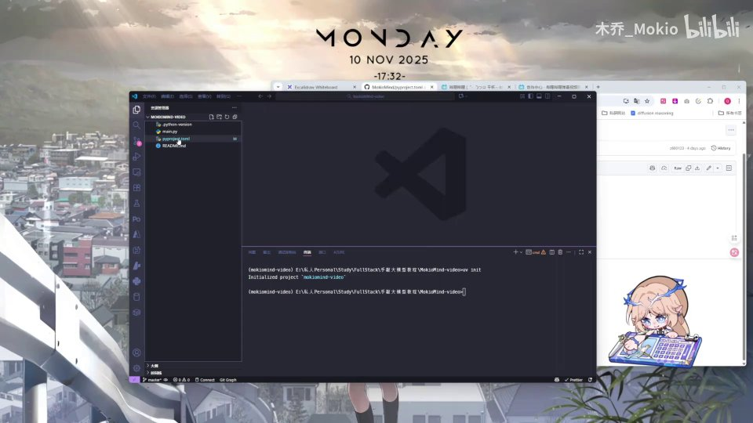 |
| 以及虚拟环境的搭建。那么这里呢，如果你比较慢的话，可能是第一次装这些包；我是因为装过了、有缓存，所以会稍微快一点。那么在等待的过程中，我们来规划一下文件夹：首先我们需要一个 model 文件夹，用来编写我们的模型；其次我们需要一个 trainer 文件夹。 [【跳转到 00:54】](https://www.bilibili.com/video/BV1T2k6BaEeC/?p=6&t=54) | 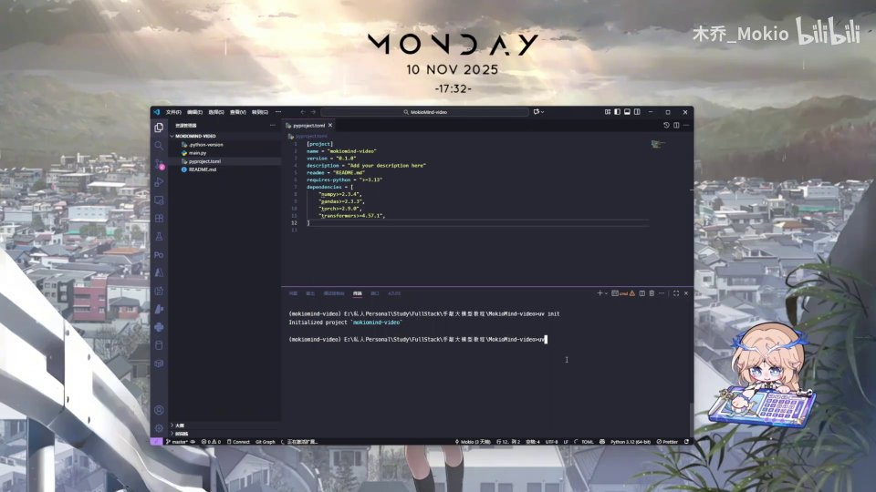 |
| 这个 trainer 专门用来训练。然后第三，我们需要一个 dataset 文件夹，它的作用就是处理数据集相关的内容。好，那么我们这里也可以看到环境已经搭建好了，然后这个虚拟环境也需要激活。激活完之后，我们在 model 里写上我们最初始的 model.py 文件。 [【跳转到 01:19】](https://www.bilibili.com/video/BV1T2k6BaEeC/?p=6&t=79) |  |
| 然后在 dataset 里我们也加一个文件，这个文件用来后续加载数据集。那么 trainer 呢，我们先新建两个文件：第一个是 trainer/trainer.py，我们在训练时会用到的一些通用工具类函数会放在这里；然后我们再创建一个预训练的文件。好， [【跳转到 01:44】](https://www.bilibili.com/video/BV1T2k6BaEeC/?p=6&t=104) | 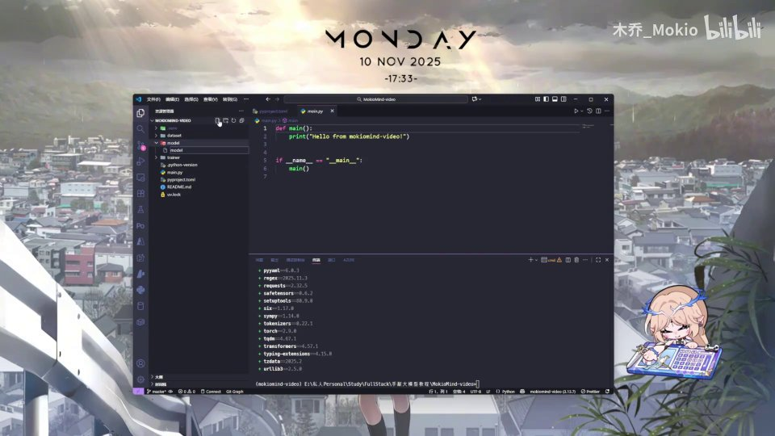 |
| 这样一个文件结构就搭建好了。然后我建议你在这里直接去复制我 GitHub 代码里模型相关的设置。 [【跳转到 02:09】](https://www.bilibili.com/video/BV1T2k6BaEeC/?p=6&t=129) |  |
| 在这里，把前面的部分，把这里整个 config 的内容给复制过来。 [【跳转到 02:21】](https://www.bilibili.com/video/BV1T2k6BaEeC/?p=6&t=141) | 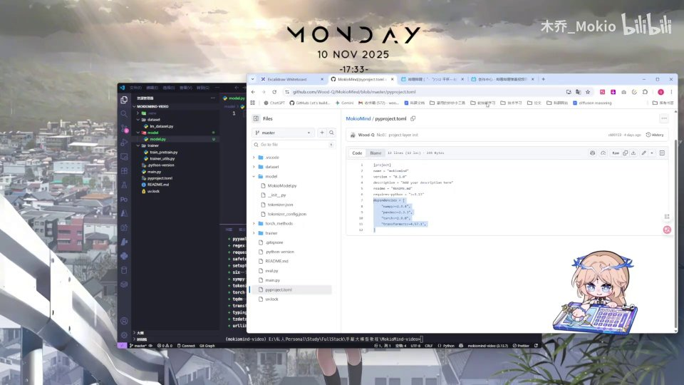 |
| 那么这个你不需要去 [【跳转到 02:31】](https://www.bilibili.com/video/BV1T2k6BaEeC/?p=6&t=151) |  |
| 可以不需要知道它是什么，如果你想问的话可以去问一下 AI。这个 PretrainedConfig 简单来说，就是 HuggingFace 的 Transformer 库里的一个类，它相当于明确规定了你的整个模型的一些参数会是什么样子。那么如果你去用 HuggingFace 加载一个别人家的模型的话， [【跳转到 02:36】](https://www.bilibili.com/video/BV1T2k6BaEeC/?p=6&t=156) | 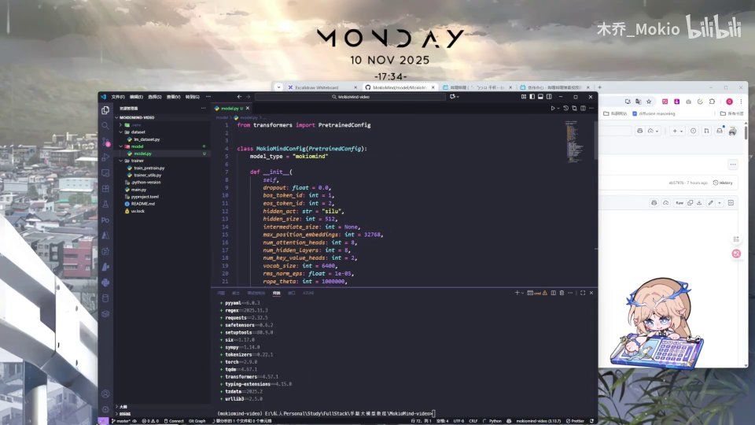 |
| 它可能就会给你一个这样的形式，也就是说这是别人家的模型它定义的架构，包括隐藏层的这些内容参数。也就是说，你通过继承这个 PretrainedConfig 类，就可以把自己的模型参数定义下来，同时可以传到 HuggingFace 上。好，那么我们项目的初始化也就搭建完成了。 [【跳转到 03:01】](https://www.bilibili.com/video/BV1T2k6BaEeC/?p=6&t=181) | 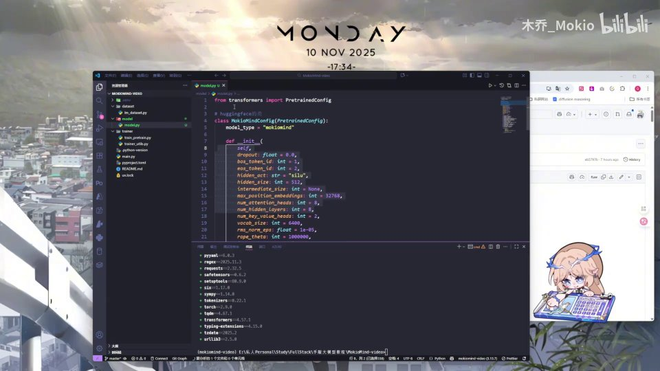 |
| 那么最后一定要养成好习惯，就是把你的 git 仓库提交一下，比如提交一个 "init project"，防止代码流失。好，那么我们这里存完之后，下一块正式开始对代码的学习。 [【跳转到 03:26】](https://www.bilibili.com/video/BV1T2k6BaEeC/?p=6&t=206) | 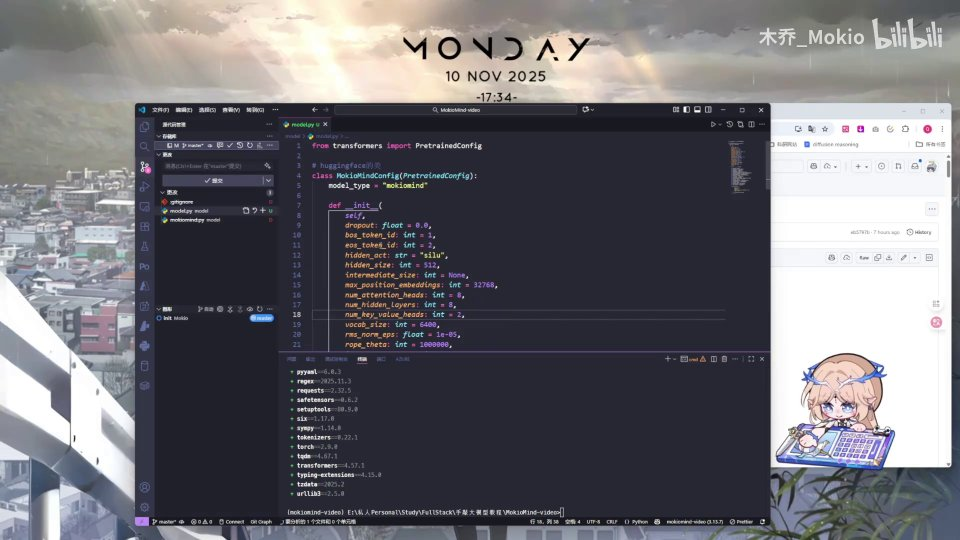 |
| 我们下一块见。 [【跳转到 03:41】](https://www.bilibili.com/video/BV1T2k6BaEeC/?p=6&t=221) | 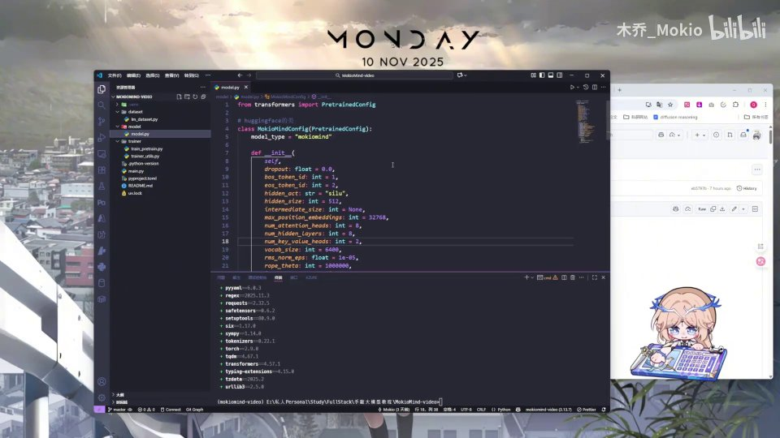 |