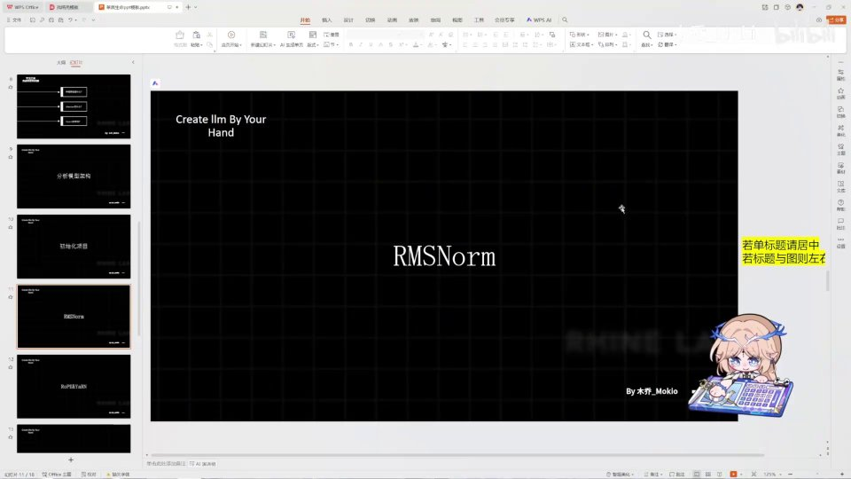
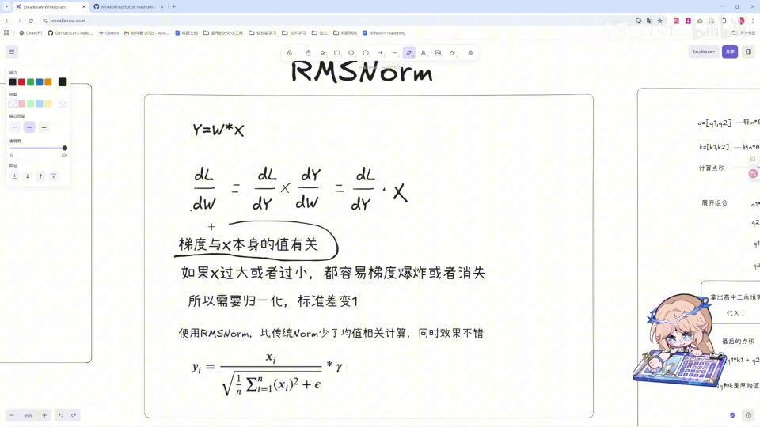
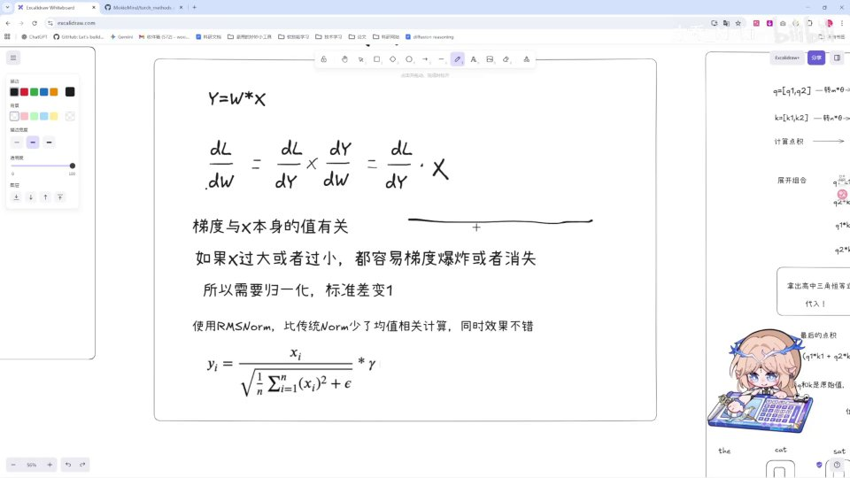
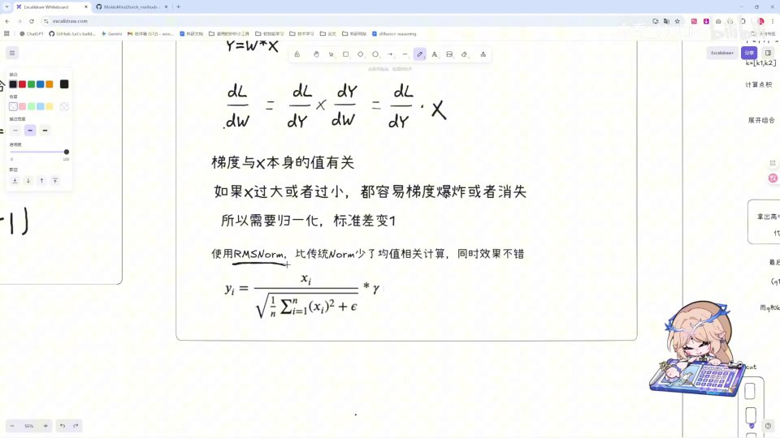
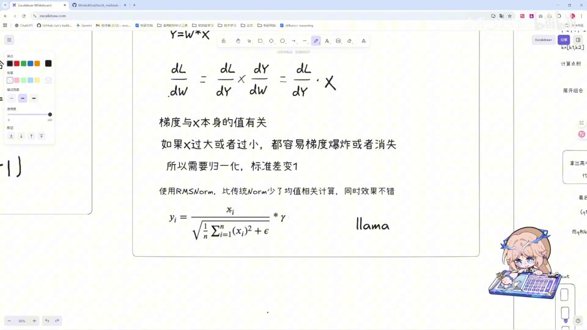
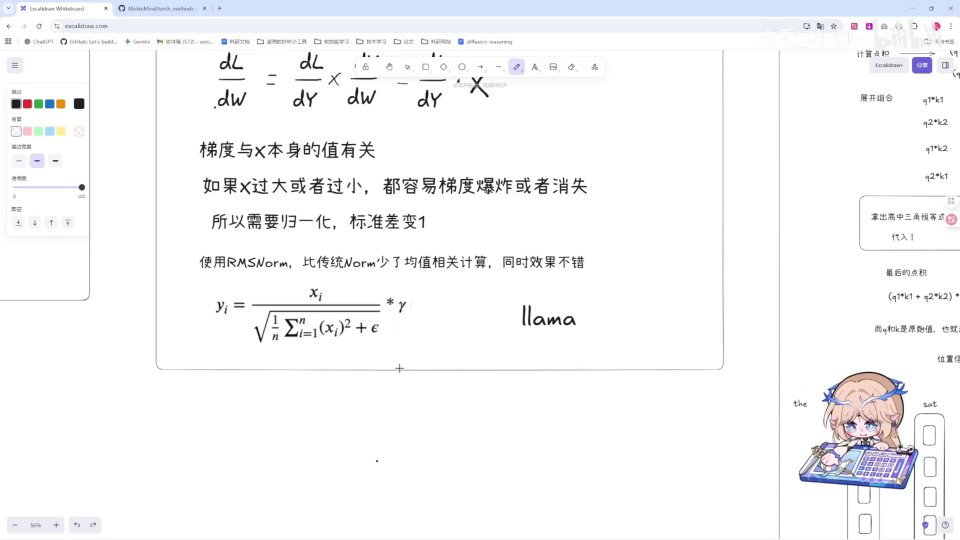
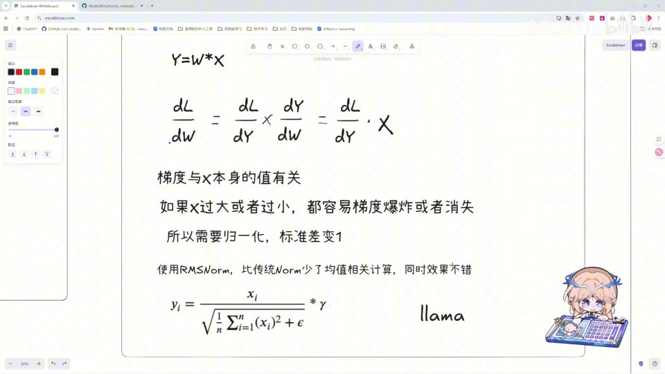

# 理论：RMSNorm 原始文稿（图-字幕分栏）

| 字幕文本 | 画面 |
| :--- | ---: |
| 好，我们这一 part 就来讲解一下最最常用的一层——也就是 RMSNorm，在我们的架构图里也看到它出现了很多次。那这一 part 我们先对理论知识做一个讲解。 [【跳转到 00:00】](https://www.bilibili.com/video/BV1T2k6BaEeC/?p=7&t=0) |  |
| 首先，我们为什么需要 norm？ [【跳转到 00:11】](https://www.bilibili.com/video/BV1T2k6BaEeC/?p=7&t=11) |  |
| 我们先不看 RMS，先说说为什么需要 norm。如果你学过前面的基础知识就应该知道，norm 的作用就是归一化。归一化是什么？就是让数据的均值为零、标准差为一，这就是它的目的。那为什么要达到这个目的呢？其实感性上也非常好理解。 [【跳转到 00:16】](https://www.bilibili.com/video/BV1T2k6BaEeC/?p=7&t=16) |  |
| 如果你在训练时使用一些乱七八糟的数据，也就是分布很散乱的数据，那么你要学习知识一定很难、很难学。对神经网络来说也是如此。我们可以通过一个最简单的计算式来推一下：首先用一个最基础的、Y 等于 W 乘 X 的函数来…… [【跳转到 00:40】](https://www.bilibili.com/video/BV1T2k6BaEeC/?p=7&t=40) |  |
| 在反向传播的时候需要梯度下降，那计算梯度时就要用损失函数对 W 求偏导。用链式法则算出来就是这样一个式子——DL/DY 再乘以一个和 X 本身的值有关的项。既然它和 X 本身的值有关，也就是说梯度与 X 本身值的大小有关。 [【跳转到 01:05】](https://www.bilibili.com/video/BV1T2k6BaEeC/?p=7&t=65) |  |
| 如果 X 过大或者过小，都容易导致梯度爆炸或者梯度消失。因为数据在每一层里都会被这个所谓的 W 权重矩阵乘来乘去。X 如果过大或过小，都会导致要么十分震荡，要么像一根死线一样，不会发生变化、也学习不到相关的知识。 [【跳转到 01:30】](https://www.bilibili.com/video/BV1T2k6BaEeC/?p=7&t=90) |  |
| 而 norm 呢，它就是 normalize、Normalization，是一个尺度控制器：它在每一层神经网络里强行把数据的尺度拉回到一个范围之内，也就是让它的标准差为一，从而让数据更加稳定，防止出现梯度爆炸或梯度消失这两种情况。那 RMSNorm 呢，它和传统的 norm 相比…… [【跳转到 01:55】](https://www.bilibili.com/video/BV1T2k6BaEeC/?p=7&t=115) |  |
| 少了一个均值的计算。它是 Meta 在 LLaMA 训练里使用到的。传统的 Transformer 使用的是 LayerNorm，而 RMSNorm 少了均值相关的计算，也就是说公式上它少了一个减去 X 的均值（μ）的步骤。这样在计算上：第一，我们不用计算均值；第二，我们不用减去均值。 [【跳转到 02:20】](https://www.bilibili.com/video/BV1T2k6BaEeC/?p=7&t=140) |  |
| 这两步计算在我们大量的训练中是可以节省不少开销的。那么这就是 RMSNorm 的计算公式，我们可以看一下：首先对 X 的平方求它的均值，然后加上一个 eps——这个 eps 是防止公式出现除零的情况的，一般给它一个比较小的值就可以；然后对它开方之后求倒数。 [【跳转到 02:45】](https://www.bilibili.com/video/BV1T2k6BaEeC/?p=7&t=165) |  |
| 再乘上 X 本身，最后再乘上一个权重。那这个权重是做什么的？这个权重就是说，当我们在 RMSNorm 时把数据分散之后，数据之间也各有各自不同的作用嘛——就像我们前面所说，attention 就是一个加权求和；那么对数据我们自然也有不同的处理。这个参数的作用就是对 RMSNorm 处理后的数据进行…… [【跳转到 03:10】](https://www.bilibili.com/video/BV1T2k6BaEeC/?p=7&t=190) |  |
| 一定程度上自行的一个放大或者缩小。这个就是我们之前讲的 parameter，我们可以把它放到之前的 parameter 里，当做一个可优化的参数。然后在 PyTorch 训练过程中，它会经过 optimizer 自动地去把它优化成一个最优的策略。好，我们这一 part 的理论就到此结束。 [【跳转到 03:35】](https://www.bilibili.com/video/BV1T2k6BaEeC/?p=7&t=215) |  |
| 我们下一 part 来讲解 RMSNorm 的代码部分。 [【跳转到 04:00】](https://www.bilibili.com/video/BV1T2k6BaEeC/?p=7&t=240) |  |