# 代码：RMSNorm 原始文稿（图-字幕分栏）

| 字幕文本 | 画面 |
| :--- | ---: |
| 那么这一盘我们正式开始讲解 RMSNorm 的代码部分。在讲解之前，我们先来学两个最基础的 PyTorch 方法。这两个 PyTorch 方法在我的 Notion 笔记里也都有讲解，就在下面，如果你想要自己去学习的话， [【跳转到 00:00】](https://www.bilibili.com/video/BV1T2k6BaEeC/?p=8&t=0) |  |
| 也可以完全自己去看一下。在下面这里，我有详细地对每个 PyTorch 方法进行一个简单的讲解。我们这里先来学习 RMSNorm 里 [【跳转到 00:15】](https://www.bilibili.com/video/BV1T2k6BaEeC/?p=8&t=15) | 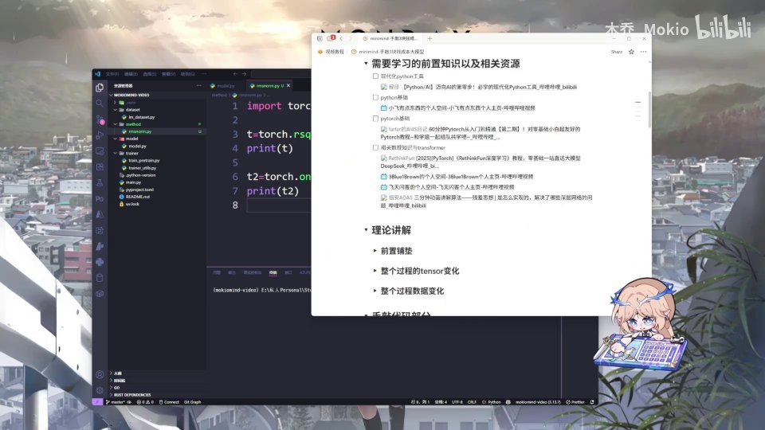 |
| 所要用到的两个 PyTorch 方法。 [【跳转到 00:26】](https://www.bilibili.com/video/BV1T2k6BaEeC/?p=8&t=26) | 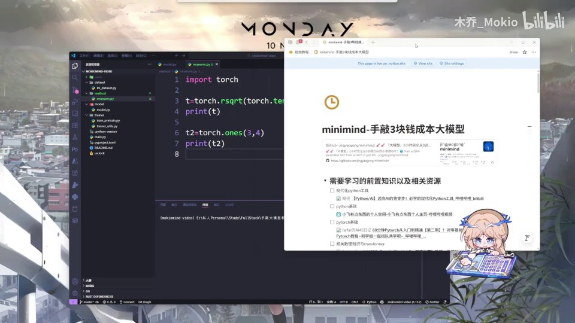 |
| 首先是 rsqrt，这个方法的作用是开方然后求倒数。它是 PyTorch 自带的开方求倒数方法，自然是对张量所运用的。然后这个 ones，它的作用是创建一个全 1 张量。那么我们首先来看一下它的运行效果。 [【跳转到 00:31】](https://www.bilibili.com/video/BV1T2k6BaEeC/?p=8&t=31) | 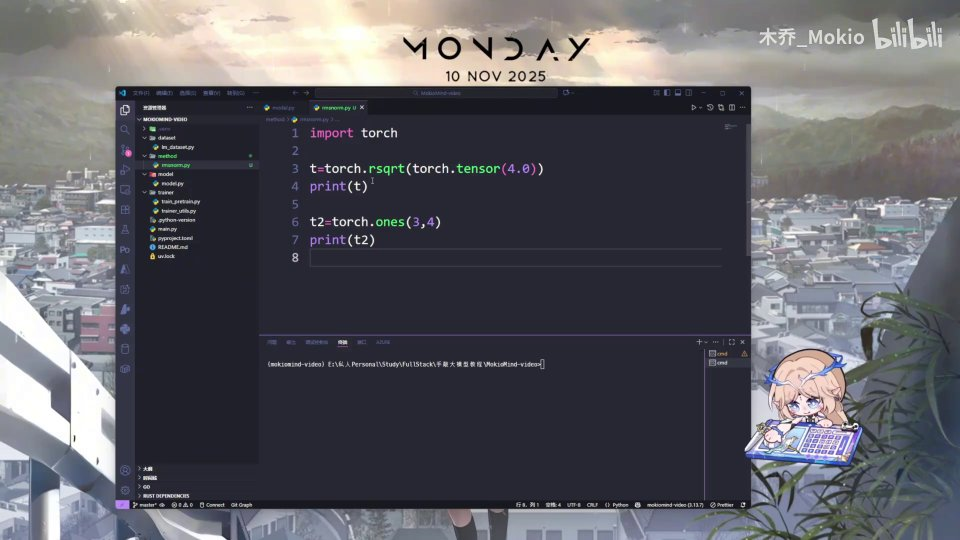 |
| 首先是对 4 开方求倒数，那么就是 1/2，也就是 0.5，这里就是一个 0.5 的 tensor。然后这个创建全 1 张量，我们创建一个行为 3、列为 4 的张量，那么它就全是 1。这就是两个方法。那么接下来，我们正式开始对 RMSNorm 的编写。 [【跳转到 00:56】](https://www.bilibili.com/video/BV1T2k6BaEeC/?p=8&t=56) |  |
| （此区间无字幕） [【跳转到 01:21】](https://www.bilibili.com/video/BV1T2k6BaEeC/?p=8&t=81) |  |
| （此区间无字幕） [【跳转到 01:26】](https://www.bilibili.com/video/BV1T2k6BaEeC/?p=8&t=86) | 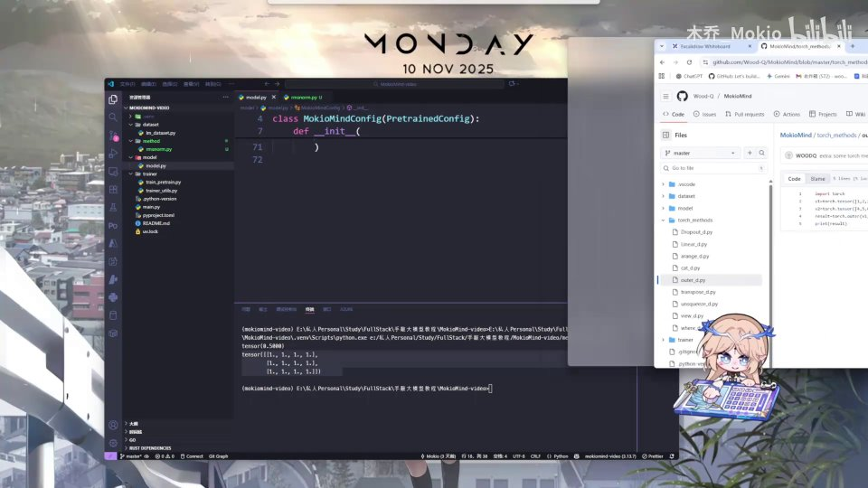 |
| （此区间无字幕） [【跳转到 01:31】](https://www.bilibili.com/video/BV1T2k6BaEeC/?p=8&t=91) | 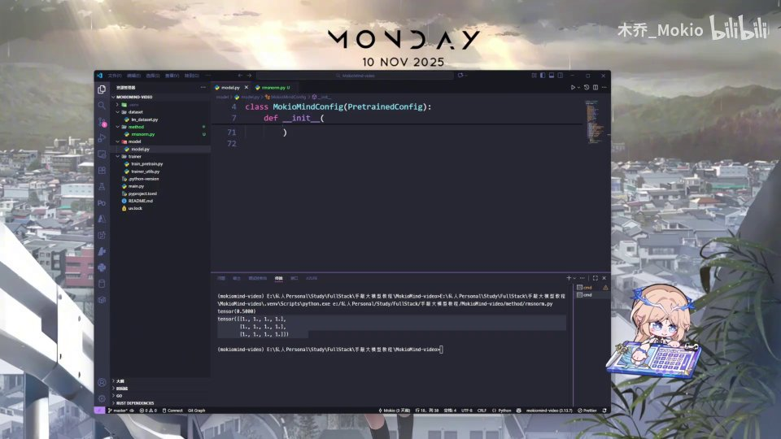 |
| 那么在正式写代码之前，我们先理一下要写的思路。首先，RMSNorm 是一层，那么它就需要继承 nn.Module，我们创建一个 RMSNorm 类。然后第二点，就是我们需要编…… [【跳转到 01:56】](https://www.bilibili.com/video/BV1T2k6BaEeC/?p=8&t=116) |  |
| 既然是一个类的话，我们编写 __init__ 方法，然后去做一些初始化。然后呢，我们就需要去编写 norm 它本身的一个最简单的计算公式。然后 nn.Module 这个类呢，它强制要求我们必须在里面写上 forward，实现 forward 这个方法，实现一个前向传播。 [【跳转到 02:21】](https://www.bilibili.com/video/BV1T2k6BaEeC/?p=8&t=141) | 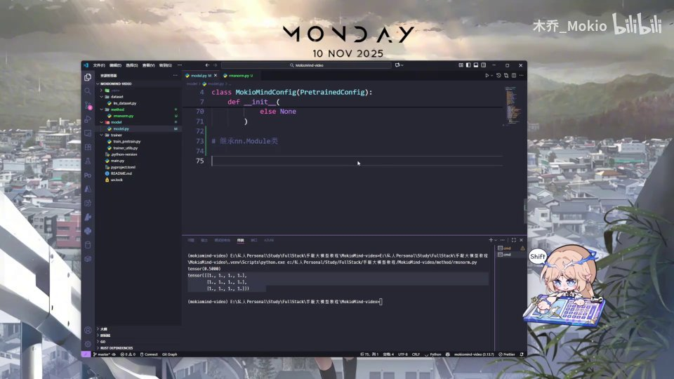 |
| 我们最后去实现一下 forward 这个方法。那首先，我们先来导入最基础的 PyTorch 包，然后我们把 PyTorch 的 nn 导入，`import torch.nn as nn` 这样写一下。然后这里我们就先创建一个最基础的类 RMSNorm，然后继承 nn.Module。 [【跳转到 02:46】](https://www.bilibili.com/video/BV1T2k6BaEeC/?p=8&t=166) |  |
| 然后接下来，我们去做 __init__ 初始化，也就是 def __init__，这些是基础的 Python 语法，如果你完全不懂的话，还是把最基础的 Python 语法补一下比较好。然后这个最后一个参数呢，它是 epsilon，也就是我们公式里的 [【跳转到 03:11】](https://www.bilibili.com/video/BV1T2k6BaEeC/?p=8&t=191) |  |
| 公式里的一个参数值，也就是 ε。我们把它放在这里，更方便写出后面的公式。 [【跳转到 03:35】](https://www.bilibili.com/video/BV1T2k6BaEeC/?p=8&t=215) |  |
| 我们给它一个 1e-5，也就是 10 的负 5 次方。然后接下来，我们把参数做一下：`super().__init__()`，然后 `self.dim = dim`、`self.eps = eps` 这个参数。最后，我们再初始化一个权重， [【跳转到 03:40】](https://www.bilibili.com/video/BV1T2k6BaEeC/?p=8&t=220) | 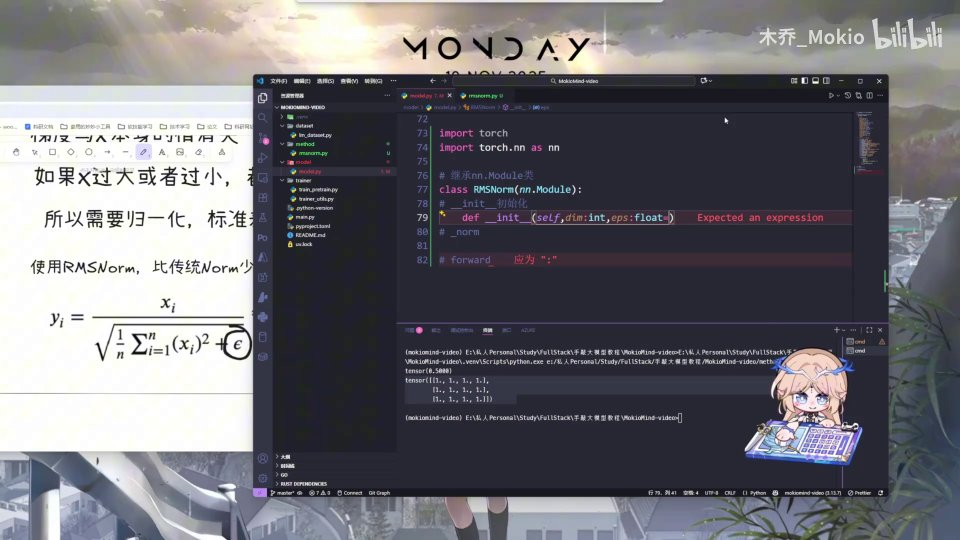 |
| 就是这里的这个值（也就是缩放参数 γ），让它作为一个参数，能够被后续优化。 [【跳转到 04:05】](https://www.bilibili.com/video/BV1T2k6BaEeC/?p=8&t=245) | 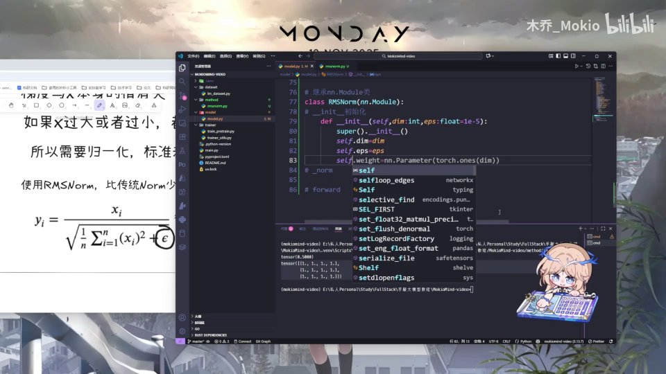 |
| 也就是 `nn.Parameter`。 [【跳转到 04:10】](https://www.bilibili.com/video/BV1T2k6BaEeC/?p=8&t=250) | 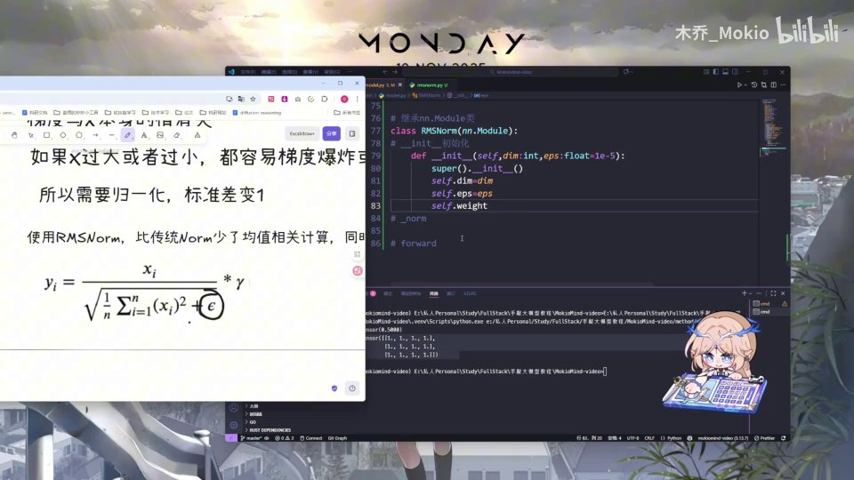 |
| 然后这个参数呢，它是一个张量。我们创建一个最基础的张量，就用 `torch.ones`，然后乘以这个维度。那么接下来，就是编写这个最核心的整个计算公式。然后这里我们可以看到 [【跳转到 04:15】](https://www.bilibili.com/video/BV1T2k6BaEeC/?p=8&t=255) | 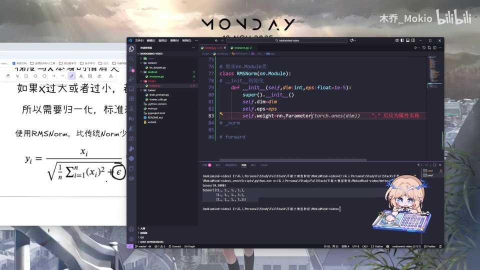 |
| 首先你把它平方之后求均值，就用 mean 这个方法。然后呢，加上 ε 之后开方求倒数，就用我们刚刚讲的 rsqrt 这个方法。 [【跳转到 04:30】](https://www.bilibili.com/video/BV1T2k6BaEeC/?p=8&t=270) |  |
| 我们来编写一下。首先在 _norm 里传入 x，因为我们需要对 x 值进行计算嘛，那么让它 return。首先我们先对 x 求平方，求平方之后，我们去对它求一个平均值。那么这个平均值呢，我们加上 keepdim 等于 True， [【跳转到 04:40】](https://www.bilibili.com/video/BV1T2k6BaEeC/?p=8&t=280) | 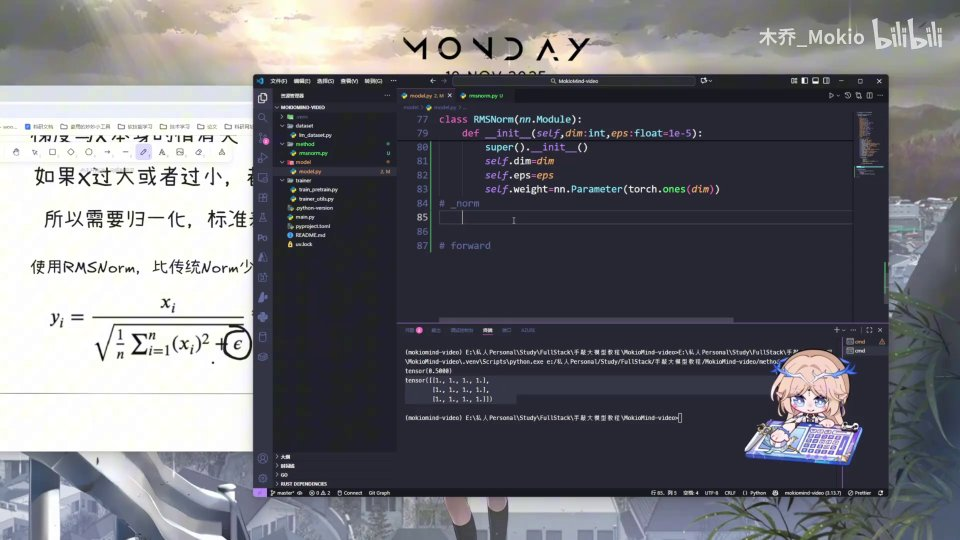 |
| 因为它求均值是会在最后一个维度上去进行求解的，然后这个 keepdim 呢，能保证它的维度不变，大概这样理解一下就好。我们求出均值之后，需要加上 epsilon 这个值，然后呢，我们需要对它开方求倒数，开方求倒数就用到我们这个函数， [【跳转到 05:05】](https://www.bilibili.com/video/BV1T2k6BaEeC/?p=8&t=305) | 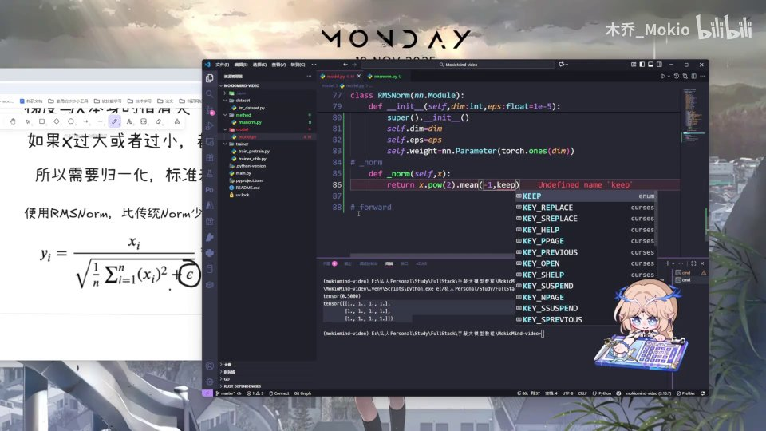 |
| 对它开方求倒数。好，那么这个就是左边整个的计算过程。 [【跳转到 05:30】](https://www.bilibili.com/video/BV1T2k6BaEeC/?p=8&t=330) |  |
| 那么最后呢，我们需要实现这个 forward 嘛。那 forward 我们直接定义 def forward(self, x): [【跳转到 05:36】](https://www.bilibili.com/video/BV1T2k6BaEeC/?p=8&t=336) | 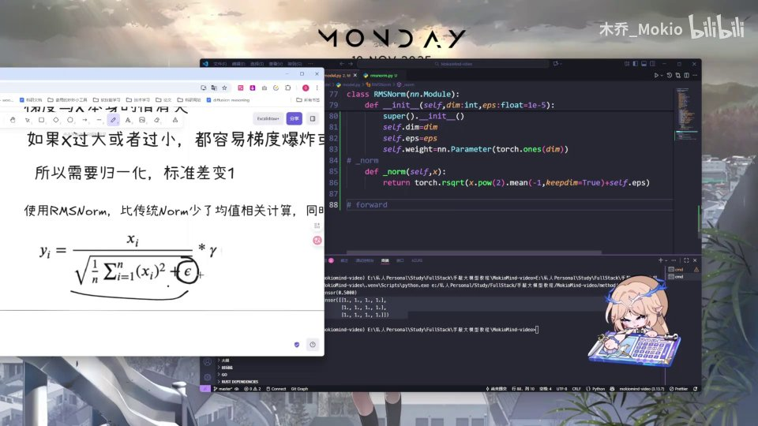 |
| 然后传入 x，接着把计算出的整个 norm 值乘上 self.weight，也就是 self.weight * self._norm(x.float()).type_as(x)。然后这个值呢我们用 float 来处理一下，最后保证它的类型依然是原始的类型。 [【跳转到 05:41】](https://www.bilibili.com/video/BV1T2k6BaEeC/?p=8&t=341) |  |
| 好，那么这就是整个 RMSNorm 的代码部分。那么我们继续来保存一下，完成 RMSNorm。好，那我们下一块进入旋转位置编码的讲解。 [【跳转到 06:06】](https://www.bilibili.com/video/BV1T2k6BaEeC/?p=8&t=366) |  |