# 理论：RoPE&YaRN 原始文稿（图-字幕分栏）

| 字幕文本 | 画面 |
| :--- | ---: |
| 好，我们这一 part 进入对 RoPE 和 YaRN 的讲解。那么首先这一 part 依旧是对理论知识的讲解。 [【跳转到 00:00】](https://www.bilibili.com/video/BV1T2k6BaEeC/?p=9&t=0) | 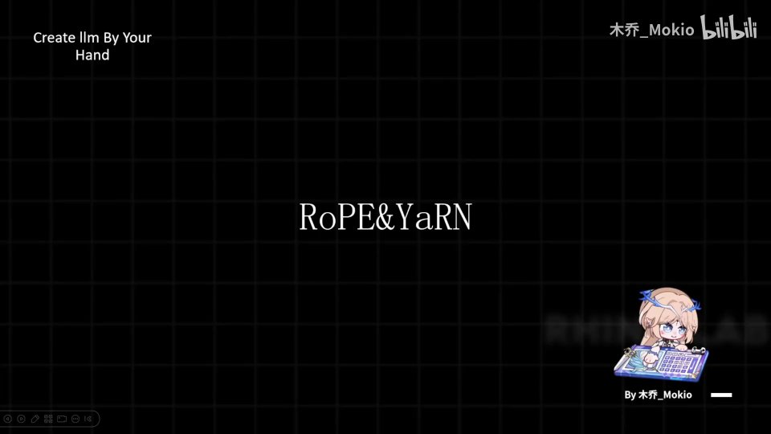 |
| 我们先讲一下我们为什么需要 RoPE 和 YaRN。 [【跳转到 00:06】](https://www.bilibili.com/video/BV1T2k6BaEeC/?p=9&t=6) | 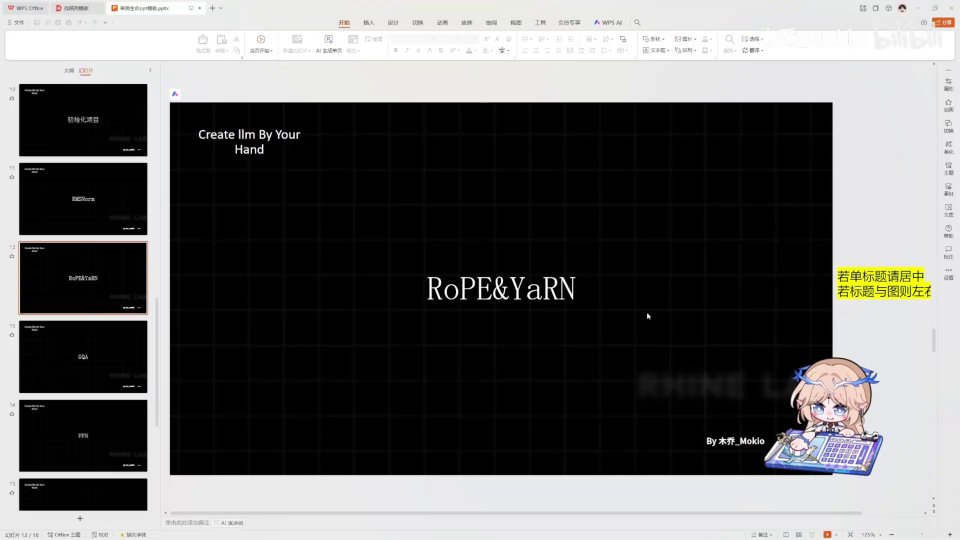 |
| 在讲解这个问题之前，首先你要知道为什么我们需要位置编码。如果你知道 attention 机制的话，它本身就是对 Q 和 K 进行点积操作嘛，那么点积操作本质上它是一个集合操作，也就是说它本身是无序的，我只需要某个和某个相乘就行。 [【跳转到 00:11】](https://www.bilibili.com/video/BV1T2k6BaEeC/?p=9&t=11) | 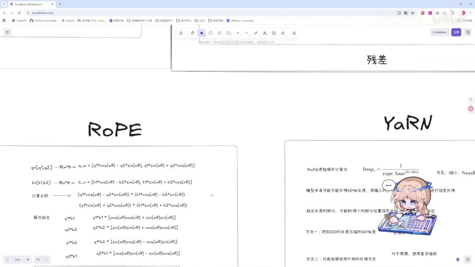 |
| 我不需要在乎它的先后顺序。但是当我们阅读文本的时候，我们是知道文本的先后顺序本身是包含有信息的，比如说你就拿之前的推理小说来举例，如果说一个场景它可能出现在命案前和命案后，它所代表的信息就完全不一样。又比如说“人咬狗”和“狗咬人”，一个是咬、一个是被咬，在不同的语句里也是不一样的。 [【跳转到 00:36】](https://www.bilibili.com/video/BV1T2k6BaEeC/?p=9&t=36) |  |
| 所以说我们需要一个方法去告诉模型说这个词它的顺序是怎样的，因此我们就需要位置编码。那么位置编码是有一个问题的，它有两种：一种是我们用相对位置编码，一种是我们用绝对位置编码。可如果我们用绝对位置编码的话，它本身是存在问题的。比如说我这一个小说， [【跳转到 01:01】](https://www.bilibili.com/video/BV1T2k6BaEeC/?p=9&t=61) |  |
| 我这里比如说到犯人事，然后这里比如说有一个 A 线索，那么这里它能学到的就是说 A 线索在这里的时候给到它的信息。那如果我在前面再加一段无关痛痒的描写，对吧，那么 A 它的位置相对最开始就变化了，那么这时候模型就需要重新学习一遍，这个就太呆板了，对吧。我们只需要知道 A 线索距离结局 [【跳转到 01:26】](https://www.bilibili.com/video/BV1T2k6BaEeC/?p=9&t=86) |  |
| 它的相对距离，我们知道了就可以了。所以说我们不应该使用绝对位置编码，我们应该使用相对位置编码。那么相对位置编码里面，现在最常用的方法就是 RoPE 这个旋转位置编码，那么这个旋转位置编码现在是许多模型里基本上都是最常用的编码。那么我们首先来理解一下为什么 RoPE 这个方法 [【跳转到 01:51】](https://www.bilibili.com/video/BV1T2k6BaEeC/?p=9&t=111) |  |
| 就是为什么它对 token 进行旋转之后就能够包含它的位置信息。旋转嘛，就是我们在向量上，比如说我们在二维空间上有一个向量，那么它旋转就旋转到这个角度，这就是最基础的旋转，这个我就不讲了。我们要理解为什么它能包含相对位置信息，就拿最基础的两个来看。因为 attention 是计算 Q 和 K 的嘛，我们拿一个小 Q，是 Q1、Q2， [【跳转到 02:16】](https://www.bilibili.com/video/BV1T2k6BaEeC/?p=9&t=136) |  |
| K 是 K1、K2 来计算。我们让 Q 旋转 mθ 个角，那么它就是这样一个向量，这个是我们初高中就学过的；我们让 K 旋转 nθ 个角，那么就是这个向量，这也是我们初中就学过的。我们计算点积，让 Q 和 K 进行点积相乘之后能够得到这些，那么这样呢我们把它展开、组合一下： [【跳转到 02:41】](https://www.bilibili.com/video/BV1T2k6BaEeC/?p=9&t=161) |  |
| Q1、K1 的放到一起，Q2、K2 的放到一起，就这样我们可以得到 Q1K1 乘以右边 cos 乘 cos 加 sin 乘 sin，然后 Q2K2 等于 sin 乘 sin 加 cos 乘 cos，Q1K2 是 sin 乘 cos 减去 cos 乘 sin，然后 Q2K1 也是这样。那你看到右边会不会感觉非常非常熟悉？那么这个呢就是我们高中学过的三角方程式， [【跳转到 03:06】](https://www.bilibili.com/video/BV1T2k6BaEeC/?p=9&t=186) | 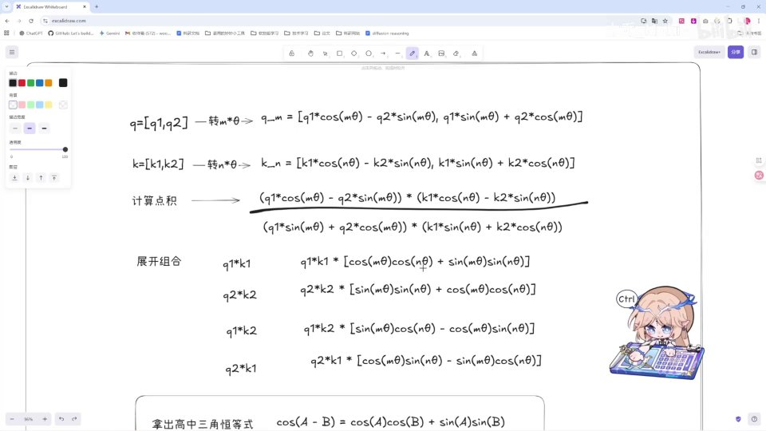 |
| 也就是 cos(A−B) 等于 cosA·cosB 加 sinA·sinB。那么我们拿高中的三角恒等式直接代入进去，我们最后得到它点积形式就是这样一个非常美妙的一个形式。那么这里 Q1K1、Q2K2 都是我们自己给定的值嘛，然后 θ 值也是我们自己给定的，那么也就是说整个式子里面它只和 m 减 n 有关。 [【跳转到 03:31】](https://www.bilibili.com/video/BV1T2k6BaEeC/?p=9&t=211) | 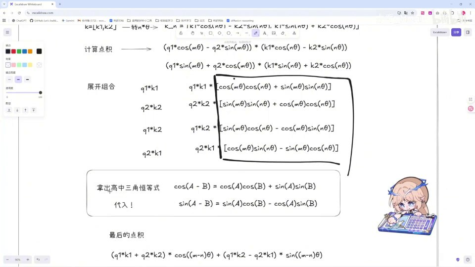 |
| 也就是说它的位置信息只和 m 减 n 这样一个差值有关，而不和 m 有关，也不和 n 有关，只是由它们的差值所决定。那么就是这样一个运用三角恒等式就能解决的、非常美妙的一个形式就出现了，这也是我当时学习的时候感觉非常奇妙的一个地方。那我们再举例一下它具体在我们计算过程中应该怎么使用呢？ [【跳转到 03:56】](https://www.bilibili.com/video/BV1T2k6BaEeC/?p=9&t=236) |  |
| 比如说这里有 the cat sat 这样三个 token 吧，我们把它编码成向量之后它会有一个非常长的一个向量列。那么这个 cat 呢它的位置是二，这个 sat 呢它的位置是三。我们在应用的时候，首先我们会把这样一个这么长的、比如说有 1、2、3、4、5、6、7、8 的向量，我们会把它们两两分成一组进行一个旋转。 [【跳转到 04:21】](https://www.bilibili.com/video/BV1T2k6BaEeC/?p=9&t=261) |  |
| 比如这里这个 cat 它有它自己的 Q 和它自己的 K，这个 sat 它也有它自己的 Q 和它自己的 K，我们都让它一二、一二，我们让它一组一组进行旋转。然后旋转之后呢，这个就会让它旋转一个 θ1 角度，而对于第二组我们让它旋转一个 θ2 角度，第三组旋转 θ3，以此类推。然后在我们进行 QK 点积的时候，那么这个计算出来就会是 2-3 或者 3-2 的 [【跳转到 04:46】](https://www.bilibili.com/video/BV1T2k6BaEeC/?p=9&t=286) |  |
| θ1，这个会是 2-3 或者 3-2 的 θ2，那么它的相对位置信息也就蕴含在了这个 θ 相减里。那么这样就是我们计算的过程，首先两两一组进行旋转，旋转之后进行点积。那么为什么我们有了 RoPE 之后还要引入这个 YaRN 呢？ [【跳转到 05:11】](https://www.bilibili.com/video/BV1T2k6BaEeC/?p=9&t=311) | 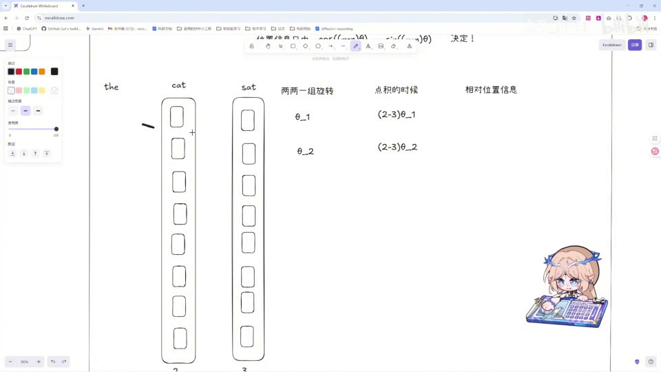 |
| 那它有一个名字就叫做外推，那么这个外推呢就是处理超出长度的一个大概的意思。那我们这里呢为什么要用 YaRN 呢？我们来看一下 RoPE 它的原始频率计算是这样一个式子，那么这里的 i 呢就代表我们之前要处理的这个对数嘛，这每一对它都是一个 i。那么我们通过这个计算式子可以很明显的看到， [【跳转到 05:36】](https://www.bilibili.com/video/BV1T2k6BaEeC/?p=9&t=336) |  |
| 那这个 i 它越小它的这个频率就越大，i 越大它的频率就越小。那么这里呢可能会有一个问题，比如说我们在训练模型的过程中，我们始终让模型训练的都是以一个 2048 的长度来训练的，相当于模型它的整个权重、整个里面的所有参数，比如说它的 80 亿个参数全都是按照这样一个 2048 的长度 [【跳转到 06:01】](https://www.bilibili.com/video/BV1T2k6BaEeC/?p=9&t=361) |  |
| 来理解的。那如果我哪一天我直接给模型一次性塞入一个 4000 的长度，那模型就会懵掉，因为它只知道从 0 到 2048 的整个长度里它应该怎么去计算，它完全没有去学习过 2048 以外的怎么处理，那么它的整个参数和这个 4000 就是不匹配的，那么就会完全计算混乱掉， [【跳转到 06:26】](https://www.bilibili.com/video/BV1T2k6BaEeC/?p=9&t=386) |  |
| 那么模型输出呢也不是我们想要的了。那这里呢就是 YaRN 解决这个问题。那我们有两个方法：第一种方法呢就是我把 5000 给压缩到 4096 里，比如说假如我模型一直训练的是 4096，对吧，那么它有一天突然给我一个 8192 的一个长度， [【跳转到 06:51】](https://www.bilibili.com/video/BV1T2k6BaEeC/?p=9&t=411) |  |
| 那么我完全可以让它乘以一个 0.5 的系数。也就是说我们在训练的时候就可以喂给它一些比较……嗯，在我们处理的时候就能让它自动去进行一个系数的部分的处理，让它在学会处理比如说 8192 的时候，然后它压缩到整个 4096 里去进行一个训练，那么当它遇到 8192 这样的情况的时候，它的参数也就能够适应。但是这样的话我们都知道呃 [【跳转到 07:16】](https://www.bilibili.com/video/BV1T2k6BaEeC/?p=9&t=436) |  |
| 你硬生生把 8192 压缩到 4096 里，一定会有一定的信息损失的。那么 YaRN 呢它的方法就是对高低频使用不同的处理方法。这里呢我们来进行一个比较简单的、呃表述不是很准确但是比较形象的说明：我们可以把模型能处理的地方视作一个钟表，那么我们都知道高频它转得快、 [【跳转到 07:41】](https://www.bilibili.com/video/BV1T2k6BaEeC/?p=9&t=461) |  |
| 低频转得慢，对吧。那我们举个例子，比如说我们依然是处理 2048 的 token，由于高频转得快，所以说比如说我除以 0 到 6 这样一个长度的对数的时候，那高频转得快它就已经转满了整个钟表，那么它就能够理解这整个 360 度区域里所有的一个信息。所以说我们高频的话 [【跳转到 08:06】](https://www.bilibili.com/video/BV1T2k6BaEeC/?p=9&t=486) |  |
| 我们就不让它缩放，继续保持原样，因为 0 到 6 之后的所有部分都一定是落在某个地方，那这样的模型都是能够处理的，所以我们高频部分可以不进行缩放。然后但是对于低频部分呢，我们知道低频部分转得慢，比如说这样一个钟表，呃由于频率足够低，所以我们比如说呃只有 i 等于到 6 万的时候，比如说我们 6 万长度的时候， [【跳转到 08:31】](https://www.bilibili.com/video/BV1T2k6BaEeC/?p=9&t=511) |  |
| 在低频的那个转速下才能让整个钟表给覆盖到。那么我们平时训练的 2048 可能就只能覆盖到这么一小点区域，那么这时候低频呢就有可能出现说我们刚刚讲的超出它认知范围的这样一个情况，比如说 4000 可能落在这，而模型只会处理这一部分的东西。那么我们所要做的就是对于低频使用一个线性缩放， [【跳转到 08:56】](https://www.bilibili.com/video/BV1T2k6BaEeC/?p=9&t=536) | 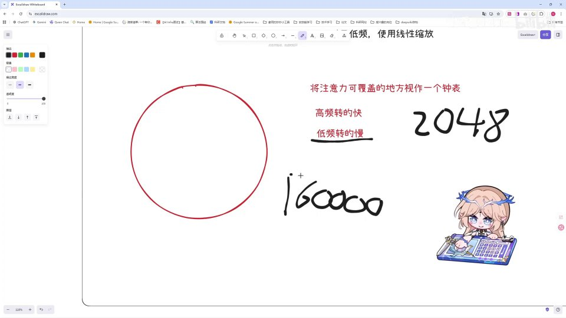 |
| 然后这里有专门的公式等会会讲，我们需要把这个 4000 给放到这个范围里，能够让它去理解。而同时呢还有一个问题，就是呃……还有一个优点，就是高频的时候，呃我们 0 到 6 个 token 就可以翻阅到整个它处理的范围的一个钟表嘛，所以说高频它能够实现对于呃近距离信息的一个精细度的把握， [【跳转到 09:21】](https://www.bilibili.com/video/BV1T2k6BaEeC/?p=9&t=561) |  |
| 而低频呢由于它转、它转的范围比较小，而在这么小的一个范围内就覆盖了我们全局所要处理的 2048 个 token，所以低频呢就是实现了对全局信息的一个把握，那么这也是 YaRN 比较优秀的地方。那么对于高频和低频中间呢还有一个地方就是中频，那么中频呢我们就要使用线性插值来保证 [【跳转到 09:46】](https://www.bilibili.com/video/BV1T2k6BaEeC/?p=9&t=586) |  |
| 整个缩放是平滑过渡的，那么这就是 YaRN 的思想。那么我们总结一下，那么 YaRN 呢它就是对于我们的呃超出模型处理长度的部分，我们需要把它压缩到模型能处理的范围内，而这里呢又因为我们强行压缩会损失信息，我们想让它保持好，那我们就针对高低频频率不同的地方 [【跳转到 10:11】](https://www.bilibili.com/video/BV1T2k6BaEeC/?p=9&t=611) |  |
| 来去进行一个处理，来让它高频不缩放保持原样，对于低频呢我们使用线性缩放，保证它能落在模型的认知范围内，同时也能保证模型对于全局信息的一个把握，对于中频呢我们使用插值去进行一个平滑过渡。而同时呢整个 YaRN 呢它还引入了一个温度系统，比如说还引入了一个温度系数。 [【跳转到 10:36】](https://www.bilibili.com/video/BV1T2k6BaEeC/?p=9&t=636) |  |
| 那么这个温度系数的目的是什么呢？呃比如说我一开始我呃有一个班的学生，然后我比较关注的学生呢，就是比如说呃我一个班有 20 个学生，然后我一开始比较关注前五个学生，然后呃如果说学校强行给我又塞了 3 万个学生， [【跳转到 11:01】](https://www.bilibili.com/video/BV1T2k6BaEeC/?p=9&t=661) |  |
| 那么我想比较关注那前五个学生的话，我的注意力就会比较涣散，对吧，因为我还要分很多精力去关注这 3 万个学生。那么这里翻译到我们实际的计算上呢，就是我们的 softmax 里去分配注意力分数的时候，会导致我们这五个学生的注意力会被严重稀释。那么我们就要引入一个温度系数来去呃 [【跳转到 11:26】](https://www.bilibili.com/video/BV1T2k6BaEeC/?p=9&t=686) | 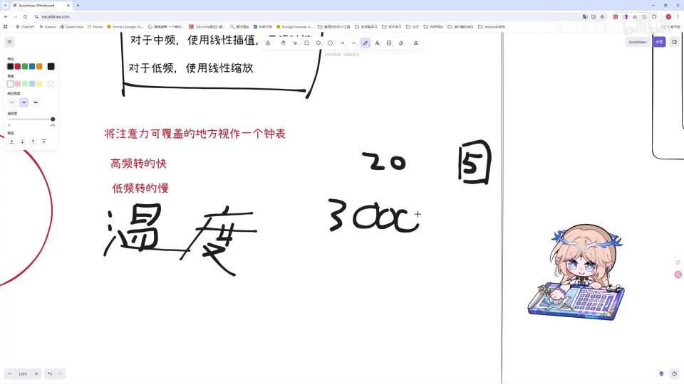 |
| 在 RoPE 计算之后我们把这个系数传进去，保证后面的 softmax 计算里我们依然让那五个学生保持一个高注意力，而其他的部分进行一个缩放，对吧。总之就是为了保证我们的注意力不涣散。那么这就是整个 YaRN 的部分。那么我们实际的计算部分应该怎么去计算呢？首先我们需要找到我们的临界维度，对吧， [【跳转到 11:51】](https://www.bilibili.com/video/BV1T2k6BaEeC/?p=9&t=711) |  |
| 我们需要找到我们怎么去处理那个高低频。那么我们就用 YaRN 它的原始的一个公式去进行计算。首先呢我们这里有频率，那么我们就去计算它的波长，波长 λ 就是 2π 除以我们这里的频率嘛，最后得出来就是 2π 乘以一个呃原始的一个 base，然后有一个 2i 比上 d。 [【跳转到 12:16】](https://www.bilibili.com/video/BV1T2k6BaEeC/?p=9&t=736) |  |
| 我们得出这个呃维度大小之后，在 YaRN 的论文里指出，我们应该用一个呃训练长度 L 和我们波长的比例 β 来区分高低频的边界。那么这个 β 的计算呢就是用 L 除以 λ 比上 i。我们把这个代入进来之后，我们可以得到，我们可以得到 base 的 2i 比上 d 等于 L 比 [【跳转到 12:41】](https://www.bilibili.com/video/BV1T2k6BaEeC/?p=9&t=761) | 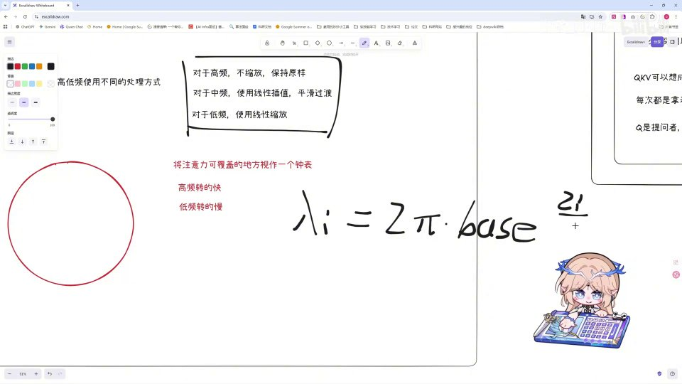 |
| 比上 β 乘以 2π。然后我们经过一系列计算，最后求这个 i 它的一个计算公式就是 β 乘以 ln 的 L 比上 β 的 2π，然后这里再乘上一个 2 的 ln 的 base，也就是这里呢我们就可以求出我们需要找的那个维度在哪了。 [【跳转到 13:06】](https://www.bilibili.com/video/BV1T2k6BaEeC/?p=9&t=786) |  |
| 然后通过这个维度我们找出高低频，然后再对高低频分别使用不同的缩放和插值，分别使用高频不缩放、低频进行线性缩放，最后再乘上我们刚刚说的温控系数，这就实现了整个 YaRN 的过程。好，那么我们下一块见。 [【跳转到 13:31】](https://www.bilibili.com/video/BV1T2k6BaEeC/?p=9&t=811) | 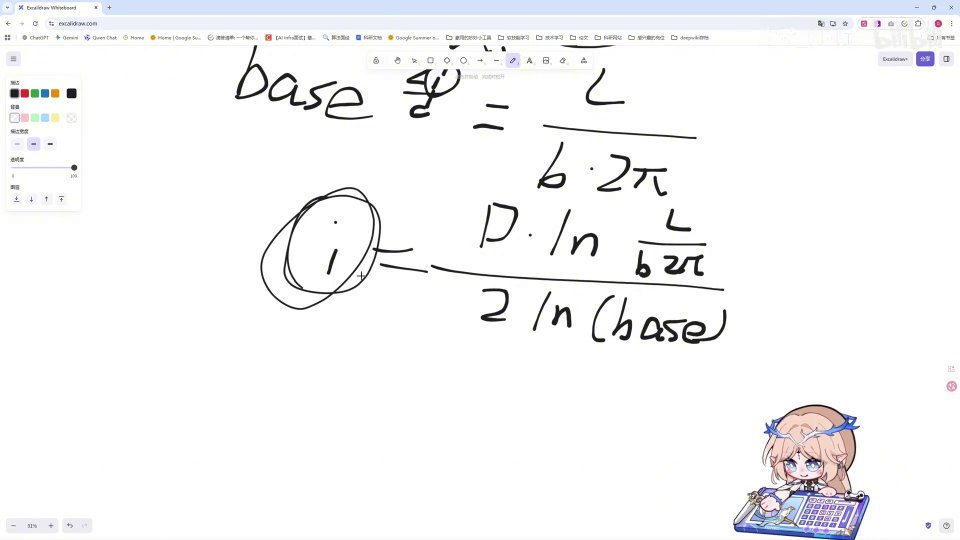 |
| （此区间无字幕） [【跳转到 13:50】](https://www.bilibili.com/video/BV1T2k6BaEeC/?p=9&t=830) | 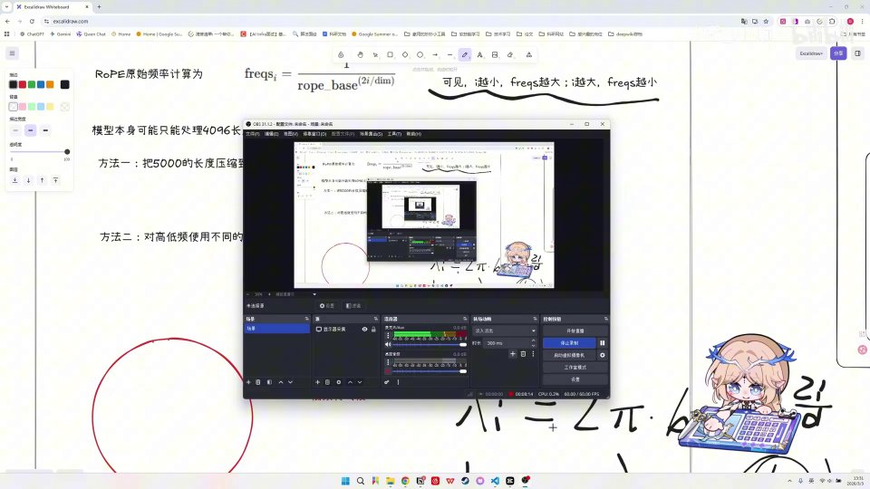 |