# 代码：RoPE&YaRN 原始文稿（图-字幕分栏）

| 字幕文本 | 画面 |
| :--- | ---: |
| 大家好，这一 part 我们继续来进行 RoPE 和 YaRN 的代码部分讲解。那么老惯例，我们先来讲一下 [【跳转到 00:00】](https://www.bilibili.com/video/BV1T2k6BaEeC/?p=10&t=0) | 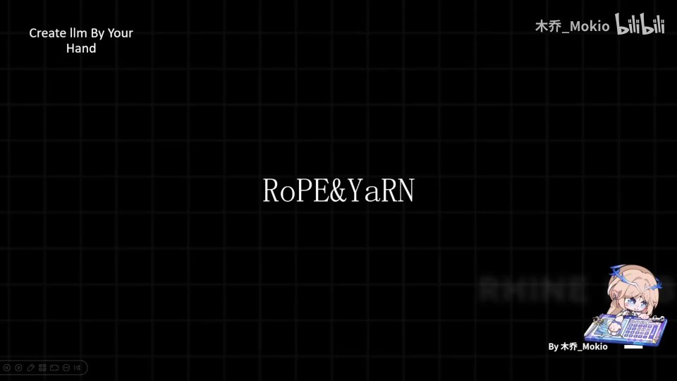 |
| 我们这一 part 所要用到的 torch 方法。这一 part 用到的 torch 方法比较多。 [【跳转到 00:09】](https://www.bilibili.com/video/BV1T2k6BaEeC/?p=10&t=9) | 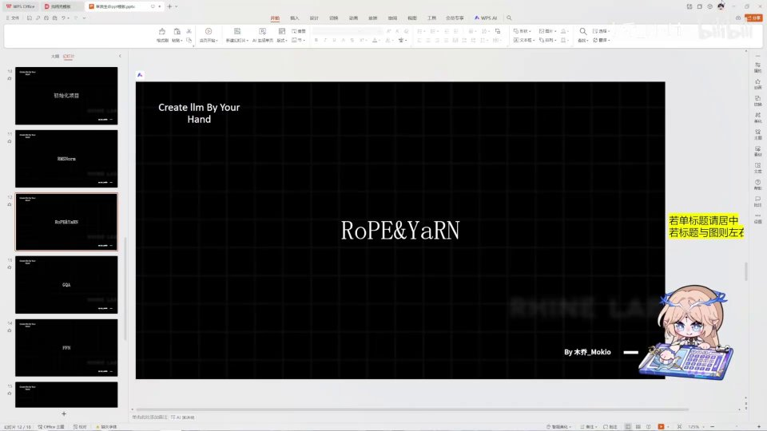 |
| 那么我们一个一个来看。首先第一个就是 torch.where，它的作用其实类似一个三目运算符。比如我这里有一个 X、Y 两个张量，一个是 1、2、3、4、5，一个是 10、20、30、40、50，这里有一个条件 X 大于 3，那么我运用 torch.where，第一个参数是这个条件，后面两个是两个张量，它的作用是什么呢？ [【跳转到 00:14】](https://www.bilibili.com/video/BV1T2k6BaEeC/?p=10&t=14) | 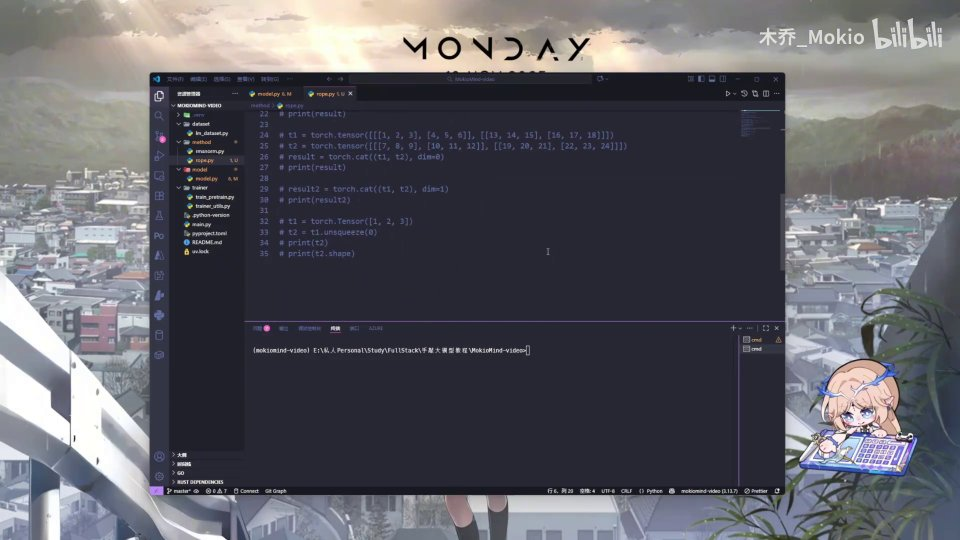 |
| 就是对条件进行过滤：第一个张量里符合条件的会被留下来，不符合条件的位置会用第二个张量对应位置填充上去。也就是这里 1、2、3、4、5，它的 4 和 5 是符合 X 大于 3 的，会被保留下来，1、2、3 会被抛掉，并用这里的 10、20、30 给留下来。那么我们运行一下，看一下它实际输出的结果是和我们讲的内容一样的。 [【跳转到 00:39】](https://www.bilibili.com/video/BV1T2k6BaEeC/?p=10&t=39) | 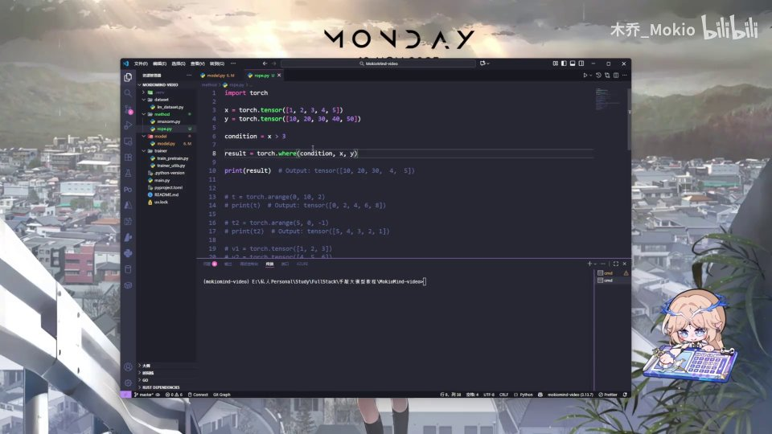 |
| 那么接下来下一个方法就是 torch.arange。这个 arange，如果你看过飞天闪课老师的 tensor 视频应该也知道，它的作用就是生成一个类似等差序列的东西。像这里 0 和 10 分别是起始和结束，2 是它的步长，那么它最后生成的就是 0、2、4、6。 [【跳转到 01:04】](https://www.bilibili.com/video/BV1T2k6BaEeC/?p=10&t=64) | 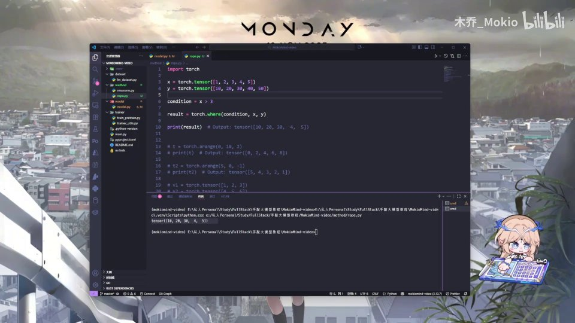 |
| 5 是起始，1 是结束，1 是步长，那么它生成的就是 5、4、3、2、1。那么我们运行一下，可以看到它生成的和我们讲的是一样的。然后接下来第三个方法是 outer 方法，也就是外积，这个学过线性代数的应该也比较清楚，我们直接运行看一下它的效果，就是它会 4、5、6，然后都乘 1，还是 4、5、6。 [【跳转到 01:29】](https://www.bilibili.com/video/BV1T2k6BaEeC/?p=10&t=89) |  |
| 都乘 2，4、5、6 都乘 2；都乘 3，4、5、6 都乘 3，生成一个二维的矩阵。然后我们再看下一个方法是 cat，cat 方法呢就是进行维度的拼接，这个比较复杂一点，我们可以来看一下，我开始学的时候也觉得比较复杂。我们这里生成一个三维的张量，像这里有三个括号在外面，那它就是一个三维的张量。那么它的 shape 我们可以看一下，print t1 点 shape： [【跳转到 01:54】](https://www.bilibili.com/video/BV1T2k6BaEeC/?p=10&t=114) |  |
| 我们可以看一下它的 shape 是 (2,3)，也就是什么？最外面有二，就是一共有两个行为 2、列为 3 的这样一个矩阵。然后我们先进行一个 cat，我们先讲解一下 cat：首先你输入你要拼接的这几个矩阵， [【跳转到 02:19】](https://www.bilibili.com/video/BV1T2k6BaEeC/?p=10&t=139) |  |
| 然后 dim 等于 0，就是说它会在第 0 个维度上去进行拼接。程序员都是从 0 开始数的嘛，这个 0 其实你也可以理解为在第一个维度上拼接。那么在第一个维度上拼接会变成什么样子？我们来看一下，它会变成这样，我们都知道这里 shape 是 (2,2,3)，它要在第一个维度上拼接，那么它的 shape 就应该变成 (4,2,3)。 [【跳转到 02:44】](https://www.bilibili.com/video/BV1T2k6BaEeC/?p=10&t=164) |  |
| 也就是说它有四个行为 2、列为 3 的矩阵，就是这样。那么以此类推，当 dim 为 1 的时候，就会在第二个维度上进行拼接，那么它的 shape 就应该是 (2,4,3)。我们可以执行一下，可以看到这里一共有两个， [【跳转到 03:09】](https://www.bilibili.com/video/BV1T2k6BaEeC/?p=10&t=189) | 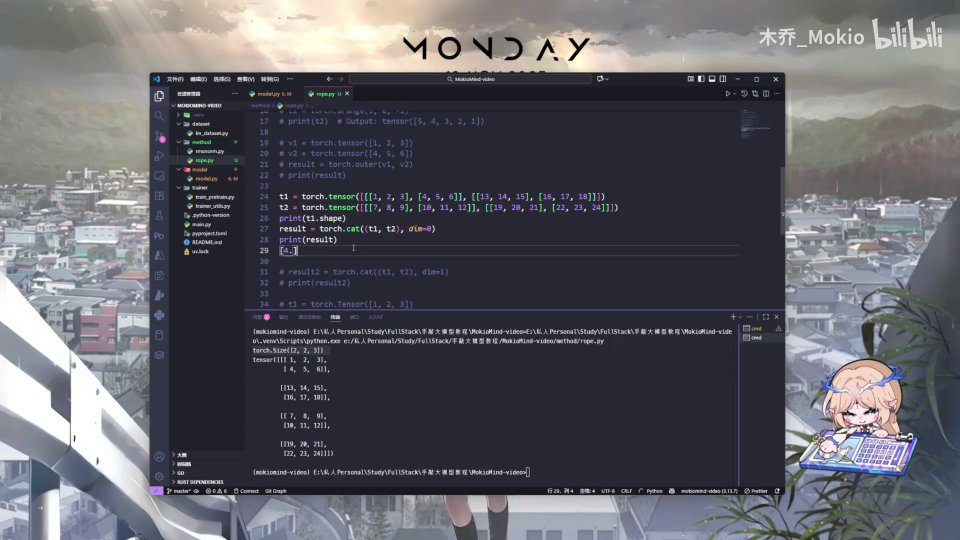 |
| 它一共有两个行为 4、列为 3 的。那么最后一个，如果我们输入 dim 等于 2，它会在最后一个维度上进行拼接，那么它原本是 (2,2,3)，最后就会变成 (2,2,6) 了。我们来执行一下，可以看到就是有两个行为 2、列为 6 的矩阵。那么这个就是 cat 的方法。 [【跳转到 03:34】](https://www.bilibili.com/video/BV1T2k6BaEeC/?p=10&t=214) |  |
| 那么最后我再来讲一个叫 unsqueeze。这个 unsqueeze 呢，就是想办法在这个位置、这个维度上去自适应增加一个维度。比如说我们原本的 T1 它是一个一维矩阵对吧，那么我们 print t2 的 shape，我们发现它是 (1,3)， [【跳转到 03:59】](https://www.bilibili.com/video/BV1T2k6BaEeC/?p=10&t=239) | 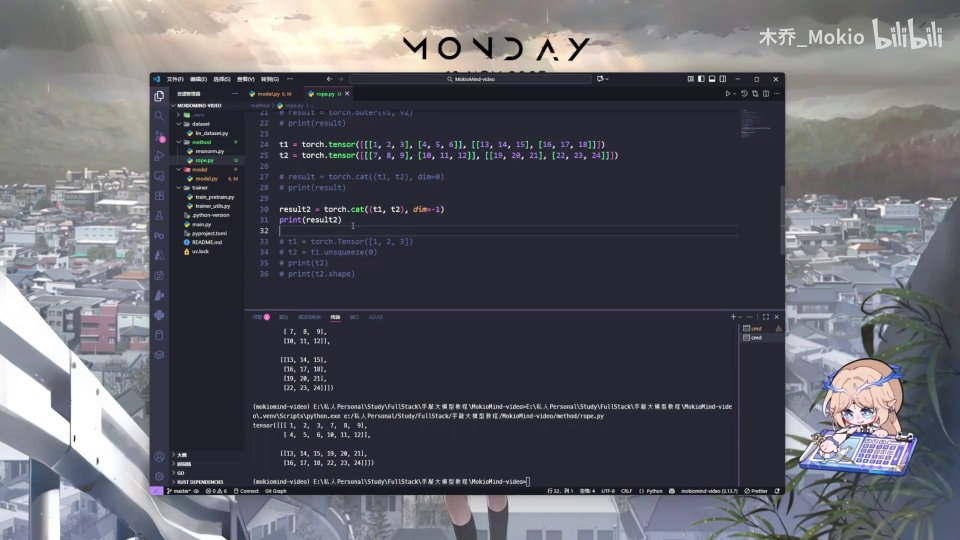 |
| 我们 print T1 的 shape 呢，print t1 点 shape，我们看一下，它其实就是在前面多加了一个维度。可以看到原本 shape 是三嘛，它现在变成 (1,3)，也就在最前面加了一个维度。这就是我们要学的 PyTorch 方法。嗯，接下来我们正式进入对 YaRN 的讲解。 [【跳转到 04:24】](https://www.bilibili.com/video/BV1T2k6BaEeC/?p=10&t=264) |  |
| 那么这一部分代码部分呢，我们来讲一下。那么首先呢， [【跳转到 04:45】](https://www.bilibili.com/video/BV1T2k6BaEeC/?p=10&t=285) |  |
| 呃我们需要去定义出我们的一个方法。 [【跳转到 04:50】](https://www.bilibili.com/video/BV1T2k6BaEeC/?p=10&t=290) | 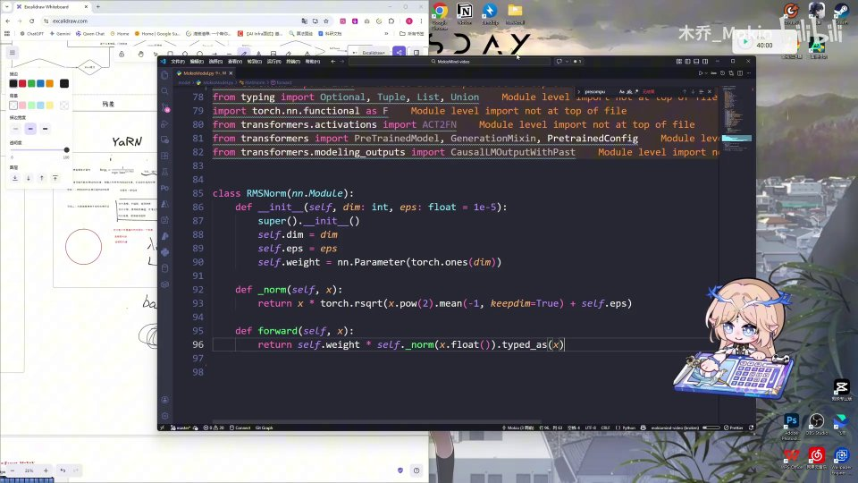 |
| 其实我们是先需要去写我们的 YaRN 实现方法，然后在 YaRN 实现之后，我们再把 YaRN 的方法用到 RoPE 上。所以我们需要先写出 YaRN 的方法。那么这里呢，我们就给它叫做 precompute_freqs_cis。那么这里的 dim 呢等于 int，然后我们给它一个 end，end 呢 [【跳转到 04:55】](https://www.bilibili.com/video/BV1T2k6BaEeC/?p=10&t=295) | 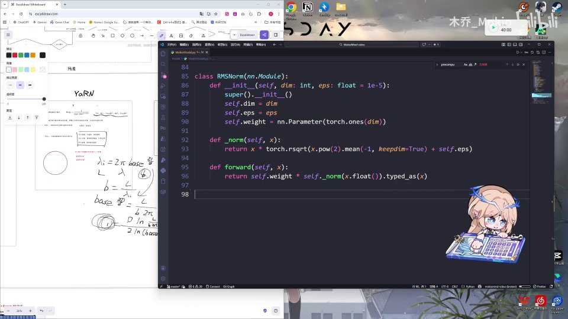 |
| 就是我们要计算的一整个的序列长度，我们给它算出来等于 1024。rope_base 就是我们的…就是这里的计算公式嘛。 [【跳转到 05:20】](https://www.bilibili.com/video/BV1T2k6BaEeC/?p=10&t=320) | 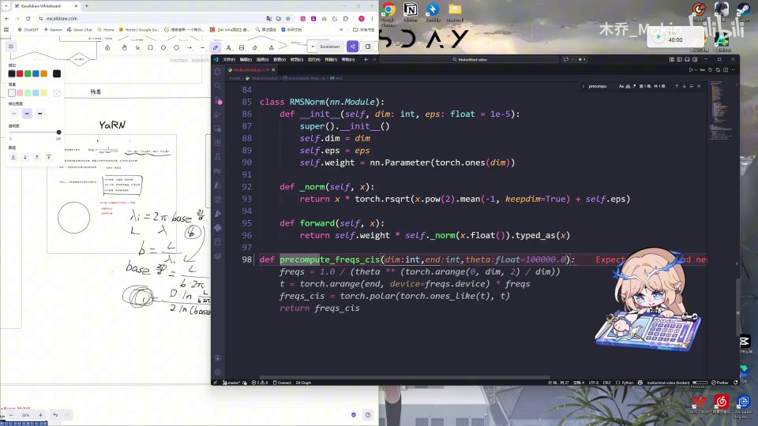 |
| 这里的 rope_base 然后就是一个 RoPE 的 scaling。 [【跳转到 05:36】](https://www.bilibili.com/video/BV1T2k6BaEeC/?p=10&t=336) | 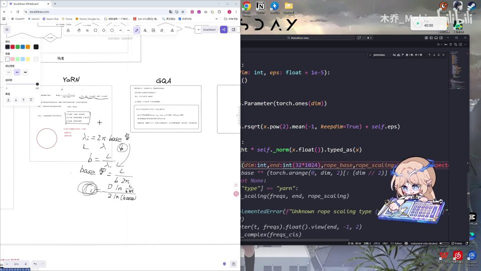 |
| 就是我们需要对 RoPE 本身进行一个缩放 scaling， [【跳转到 05:41】](https://www.bilibili.com/video/BV1T2k6BaEeC/?p=10&t=341) | 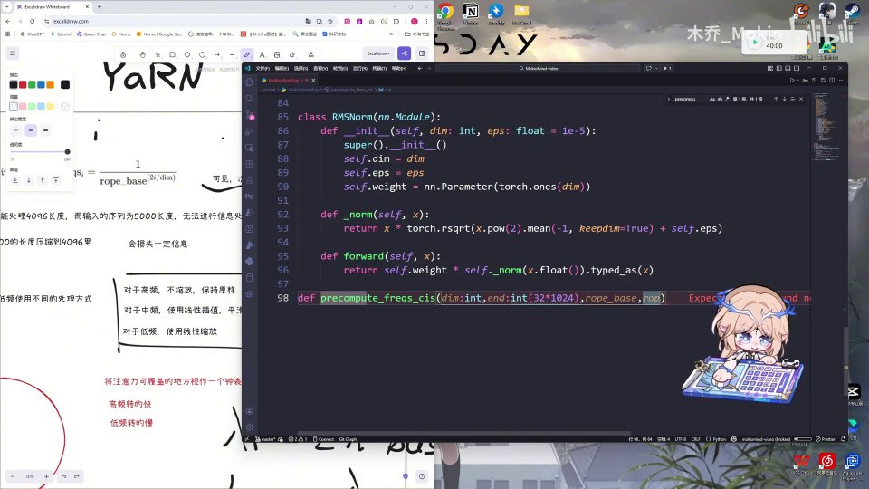 |
| 等于我们给它的参数类型选做 Optional[dict]，然后让它默认等于 None。好，然后首先第一步呢，我们需要初始化，初始化我们的 RoPE 的… [【跳转到 05:50】](https://www.bilibili.com/video/BV1T2k6BaEeC/?p=10&t=350) | 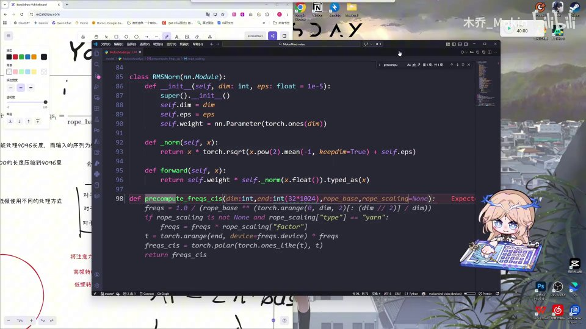 |
| 那么我们拿出我们的 freqs，还有我们的 attention_factor。这个 attention_factor 呢，就是我们后面所应用的一个…我们后面所应用的一个注意力缩放。然后这里呢，用 1.0 除以我们的 rope_base，这就是我们 RoPE 的这样一个基础公式嘛。 [【跳转到 06:15】](https://www.bilibili.com/video/BV1T2k6BaEeC/?p=10&t=375) | 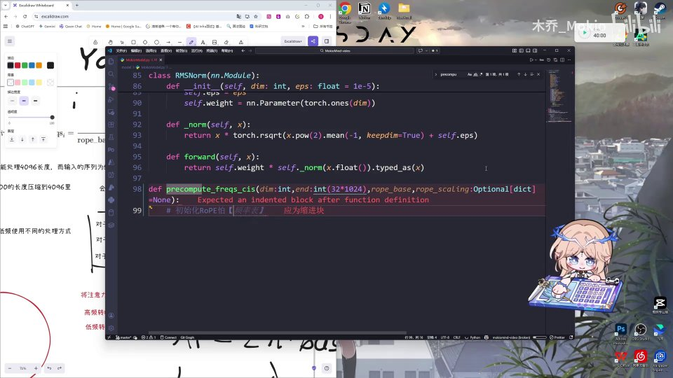 |
| 我们把它实现出来就行：1.0 除以 rope_base， [【跳转到 06:39】](https://www.bilibili.com/video/BV1T2k6BaEeC/?p=10&t=399) | 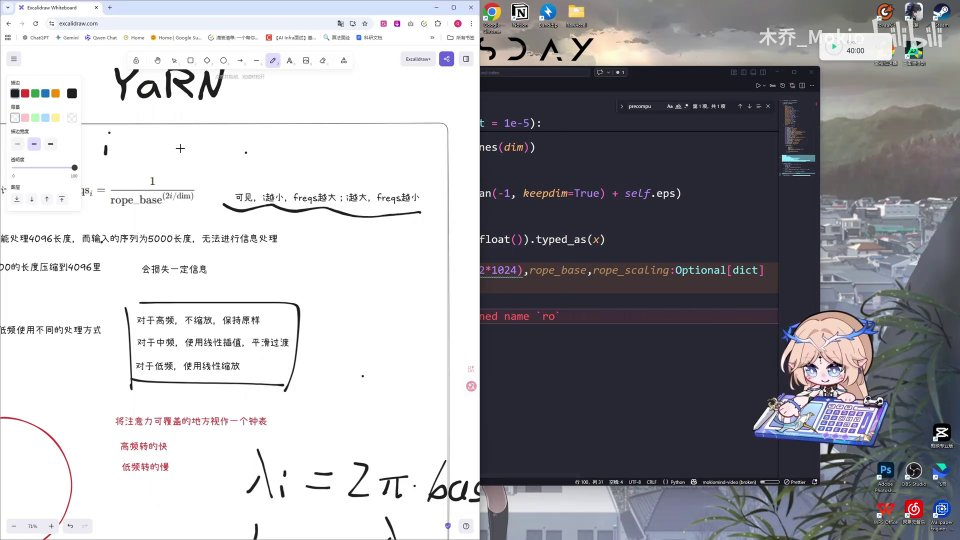 |
| 然后乘上我们的一个 torch.arange，然后 0，然后 dim，然后 2，然后呢，这里是冒号 dim 整除 2（即 `[: dim // 2]`），然后再加括号、点 [【跳转到 06:44】](https://www.bilibili.com/video/BV1T2k6BaEeC/?p=10&t=404) | 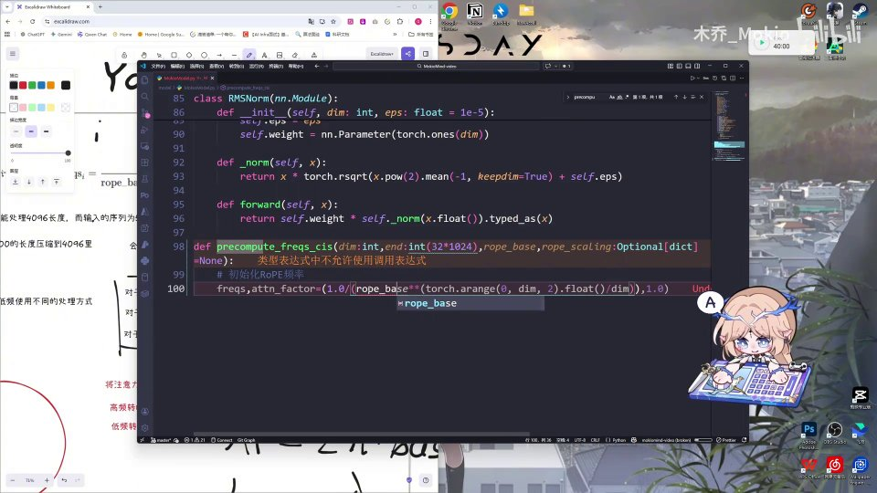 |
| float、float，括号之后再除以 dim。然后如果没有的话，我们就让这个 attention_factor 的值默认为 1.0。好，这就是我们整个所要用到的 RoPE 和我们需要用到的注意力参数的这样一个计算。 [【跳转到 07:09】](https://www.bilibili.com/video/BV1T2k6BaEeC/?p=10&t=429) | 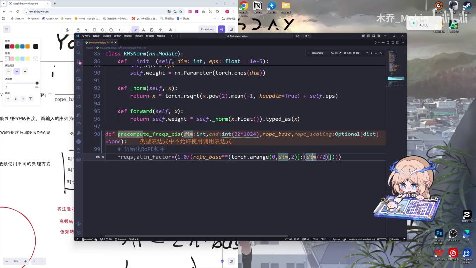 |
| 然后下面呢，就是我们的 YaRN，就是我们的处理。 [【跳转到 07:34】](https://www.bilibili.com/video/BV1T2k6BaEeC/?p=10&t=454) | 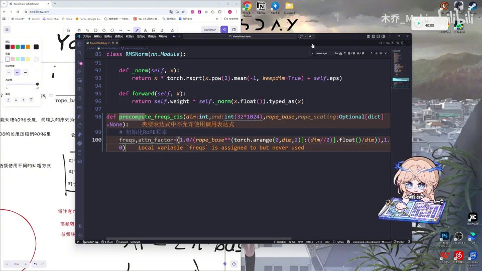 |
| 如果我们的 RoPE scaling 不等于 None 的话，也就是说我们需要用到 YaRN。那你用到 YaRN，就首先需要去我们前面的配置里面把我们的超参数给取出来。比如说我们前面有一个叫 original 的这里的 RoPE 的一个参数，我们需要把它取出来。这里呢我们就 [【跳转到 07:39】](https://www.bilibili.com/video/BV1T2k6BaEeC/?p=10&t=459) | 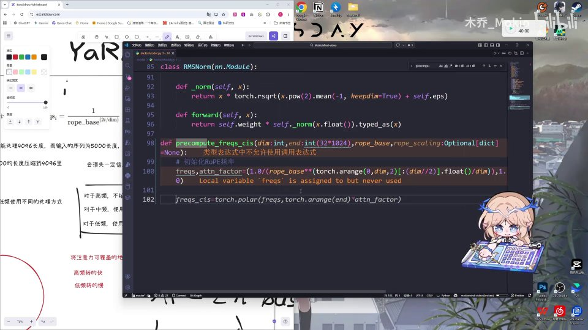 |
| 哎，这里的代码也比较绕，我们这里呢，比如说我们把这些：original_max、factor、beta_fast、beta_slow，然后我们这样取出来。取出来之后呢，我们就接下来考虑我们什么时候该用到 YaRN。用到 YaRN 呢， [【跳转到 08:04】](https://www.bilibili.com/video/BV1T2k6BaEeC/?p=10&t=484) | 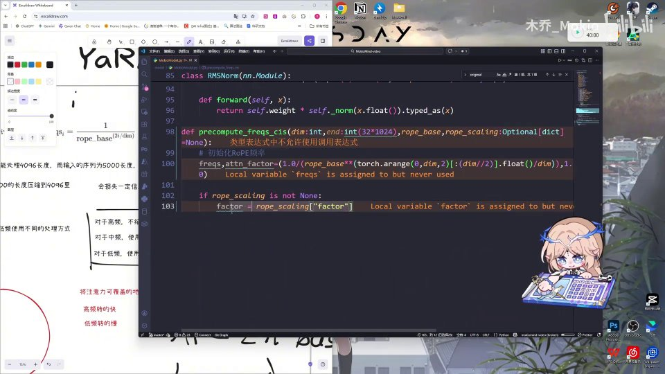 |
| 就是要推断的长度大于训练长度的时候用，对吧？那么我们前面的参数 end 就是我们要推断的长度，它如果大于我们的 original_max 呢，我们就要用到缩放。缩放呢就按照我们理论篇所讲到的这样一个计算公式。 [【跳转到 08:29】](https://www.bilibili.com/video/BV1T2k6BaEeC/?p=10&t=509) |  |
| 我们先把我们要处理成划分高低位的这个 i 给求出来。 [【跳转到 08:47】](https://www.bilibili.com/video/BV1T2k6BaEeC/?p=10&t=527) | 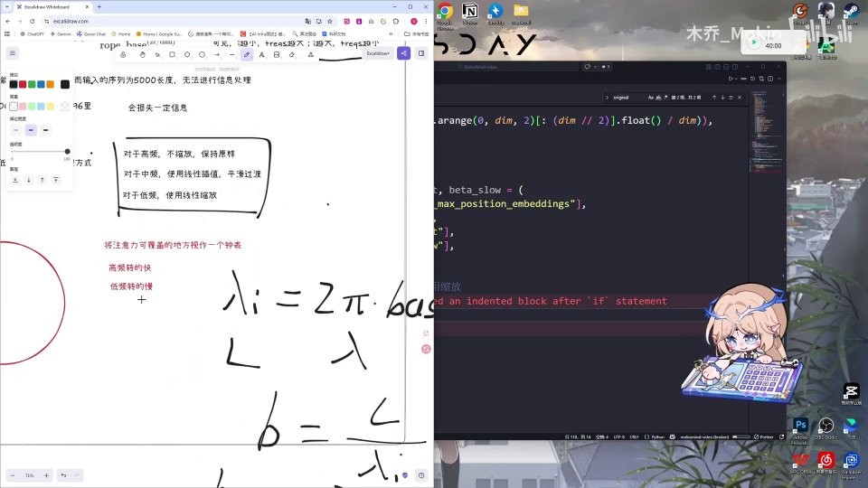 |
| 那么首先呢，这个 index 就等于，用 dim 乘上，就是实现我们这里手写的这样一个公式嘛， [【跳转到 08:54】](https://www.bilibili.com/video/BV1T2k6BaEeC/?p=10&t=534) | 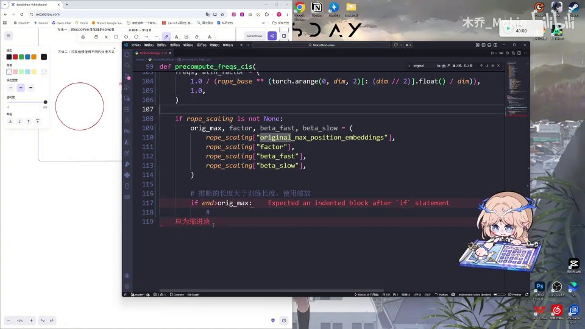 |
| 乘上我们的一个 log，也就是 max， [【跳转到 09:08】](https://www.bilibili.com/video/BV1T2k6BaEeC/?p=10&t=548) | 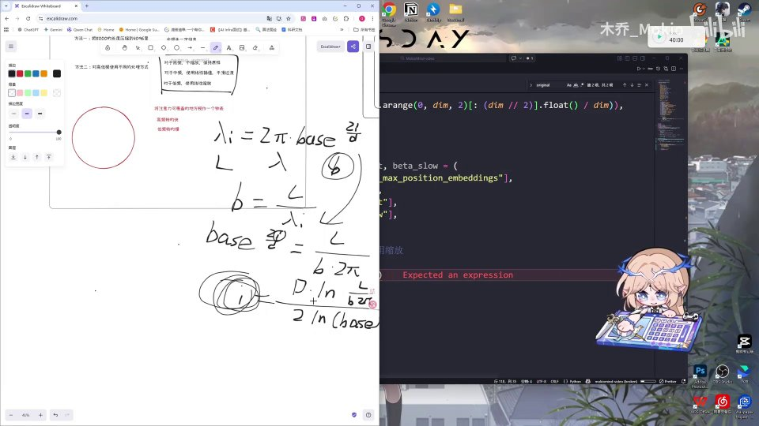 |
| max 然后再除以一个 b 乘以 2 再乘以 pi，然后再比上一个我们的 2 乘， [【跳转到 09:13】](https://www.bilibili.com/video/BV1T2k6BaEeC/?p=10&t=553) | 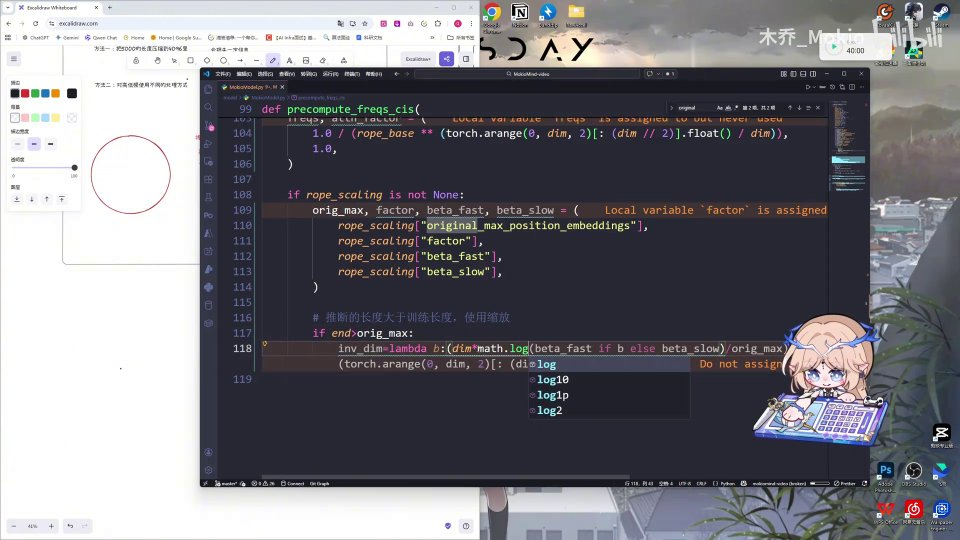 |
| 以 log 的 rope_base。好，那么这样呢，就是我们首先求出了我们需要计算的一个波长（b 到 i）。那么这里我们求出 i 之后呢，我们需要去划分高低位。 [【跳转到 09:38】](https://www.bilibili.com/video/BV1T2k6BaEeC/?p=10&t=578) | 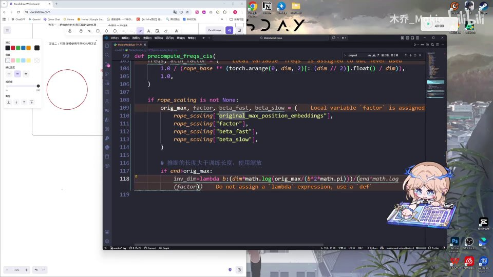 |
| 划分高低位。那么这里呢，我们用 low 来计算，就是不需要缩放的高频部分；然后这里的 high 呢，就是需要缩放的低频部分。我们这里的 low 和 high 分别代表高维和低维，不是我们这里的高频和低频啊。然后我们这里呢就用上我们的 low 和 high。 [【跳转到 10:03】](https://www.bilibili.com/video/BV1T2k6BaEeC/?p=10&t=603) | 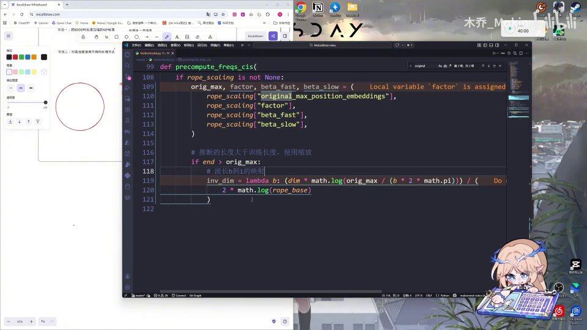 |
| 哎，这个连 high 的代码好烦哦。i 等于…那 low 部分呢，我们用 max(max 点 low, 0)，如果 fast 没有的话， [【跳转到 10:28】](https://www.bilibili.com/video/BV1T2k6BaEeC/?p=10&t=628) | 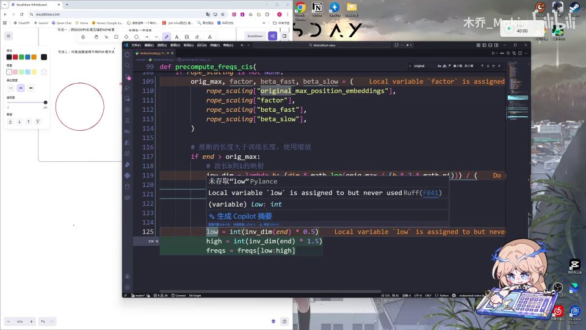 |
| 我们默认它 0。然后高维部分呢，我们就是按照这个 AI 自动生成的，我们用 min，然后用 max 点 slow 来计算，计算出来之后我们这里再给它减个一。然后呢，当我们计算出我们的 low 和 high 之后，我们就要去计算出一个混合因子、计算缩放因子。 [【跳转到 10:53】](https://www.bilibili.com/video/BV1T2k6BaEeC/?p=10&t=653) | 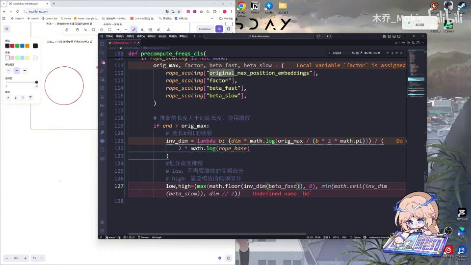 |
| 然后实现呢，就是在 low 之前，这个因子我们给它叫 ramp 为零；在 high 之后呢 ramp 为一。也就是说在 low 之前的时候，在不需要缩放的高频部分，我们让它为零，不进行缩放； [【跳转到 11:18】](https://www.bilibili.com/video/BV1T2k6BaEeC/?p=10&t=678) | 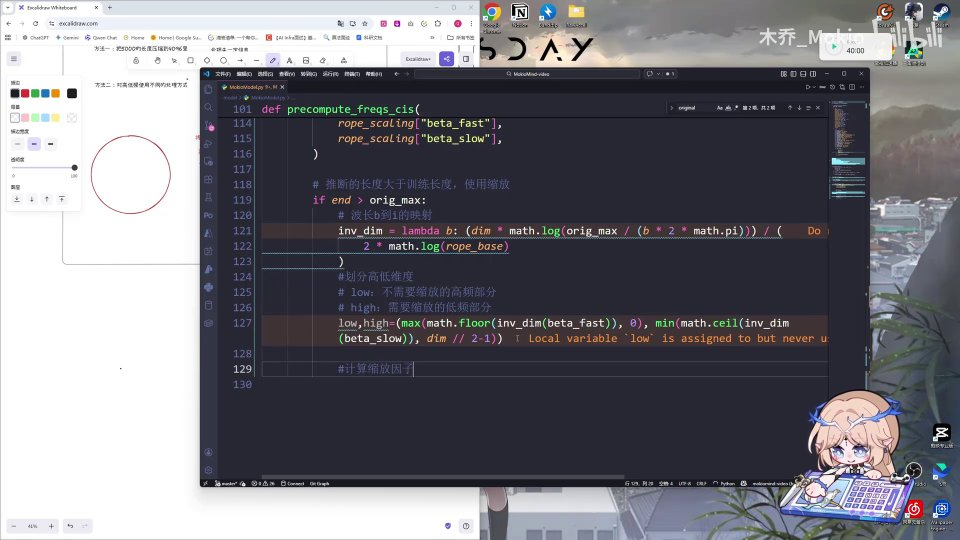 |
| 在需要缩放的低频部分，我们让它为一。然后后面的计算会用到 low 和 high 之间的线性过渡。好，那么我们这里就用我们的 torch 来进行计算。然后这里呢这个式子比较复杂，我就直接复制粘贴过来，大伙也可以直接去代码里面看一下。 [【跳转到 11:43】](https://www.bilibili.com/video/BV1T2k6BaEeC/?p=10&t=703) | 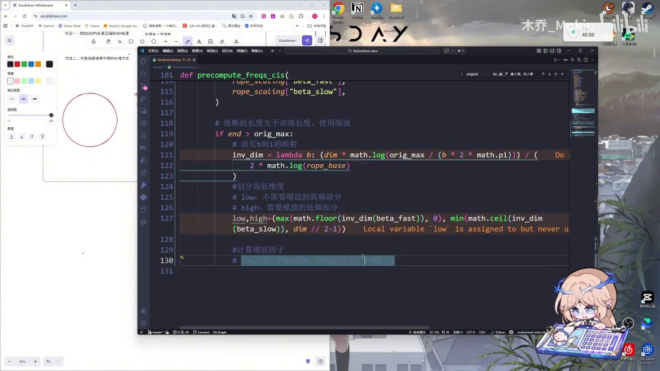 |
| 那它整个意思呢，就是我们用这个公式去计算我们的缩放因子，然后当如果说它在 low 之前就是零，如果在 high 之后那这个 ramp 就为一。好，那么接下来呢，就是我们需要把这个频率给应用上来，那么我们就写上我们的 frequency 等于 frequency 乘以一 [【跳转到 12:08】](https://www.bilibili.com/video/BV1T2k6BaEeC/?p=10&t=728) | 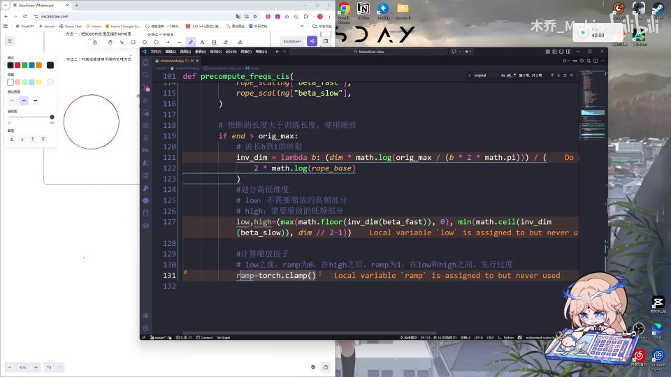 |
| 减去 ramp 加上 ramp 除以 factor。那么这样实现的一个效果就是什么呢？当我们的这个 ramp 为一的时候，那么原频率…那么它就能保证一个原频率的不变。那么当我们的 ramp 为低频部分的时候，那么它的系数就是一个，你看 1-1， [【跳转到 12:33】](https://www.bilibili.com/video/BV1T2k6BaEeC/?p=10&t=753) | 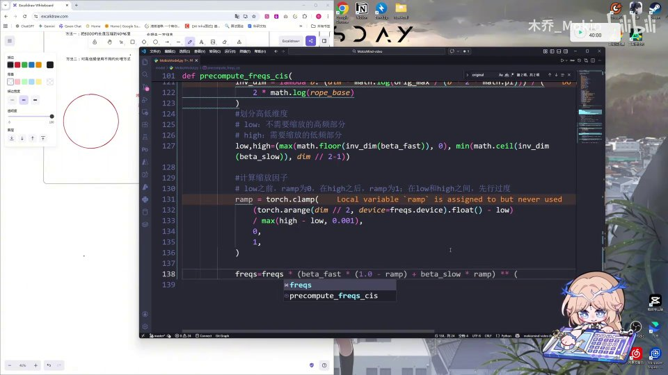 |
| 然后加上一个 1 除以 factor 对吧，那么它的系数就是一个 1/factor。也就是说实现了一个对频率乘以一个 factor 分之一的这样一个线性的缩放。 [【跳转到 12:58】](https://www.bilibili.com/video/BV1T2k6BaEeC/?p=10&t=778) |  |
| 然后当它在零和一中间呢， [【跳转到 13:06】](https://www.bilibili.com/video/BV1T2k6BaEeC/?p=10&t=786) | 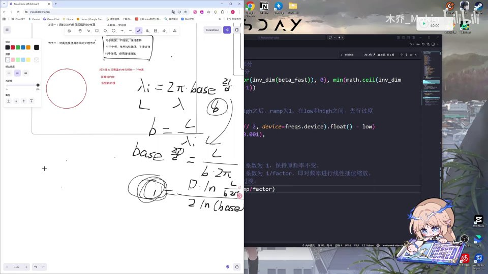 |
| 这样一个函数就实现了一个平滑的过渡，也就是我们所说的对中频使用线性插值。好， [【跳转到 13:11】](https://www.bilibili.com/video/BV1T2k6BaEeC/?p=10&t=791) | 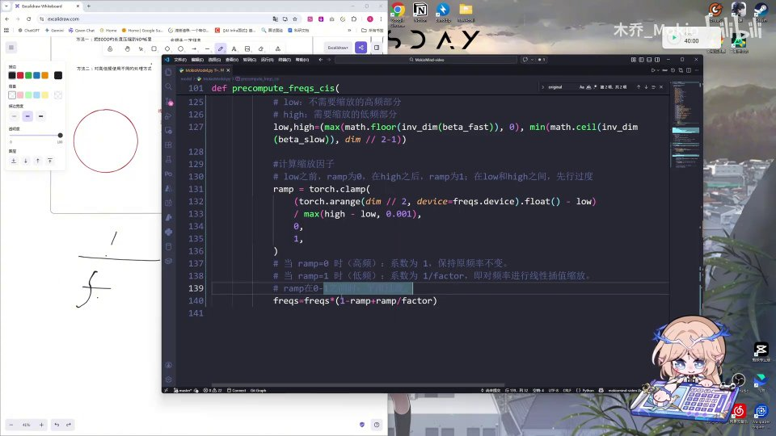 |
| 那么接下来呢， [【跳转到 13:16】](https://www.bilibili.com/video/BV1T2k6BaEeC/?p=10&t=796) |  |
| 就是我们需要去把这部分给应用上来。我们可以根据位置，`t` 等于 torch.arange，然后这里写上 end，这里 device 呢就是这样。然后呢，我们就接下来需要去计算外积。 [【跳转到 13:21】](https://www.bilibili.com/video/BV1T2k6BaEeC/?p=10&t=801) |  |
| 将 t 和频率做外积，得到每个位置的旋转轴。我们把索引和频率部分相乘，得到我们每个部分的旋转角度。那这里呢，我依然把这个代码直接复制粘贴过来，也就是我们需要得出我们每个频率所计算的 [【跳转到 13:46】](https://www.bilibili.com/video/BV1T2k6BaEeC/?p=10&t=826) |  |
| cos 和 sin，根据我们输入的频率来计算。然后最后呢，我们再把这个 cos 和 sin 给 return 出去，对应 [公式] 的 sin，或者 [公式]…啊，少了一个部分。我们得到旋转角度应该是这样一个公式，我们得到每个部分的旋转角度，然后再用上我们的 cos 和 sin [【跳转到 14:11】](https://www.bilibili.com/video/BV1T2k6BaEeC/?p=10&t=851) | 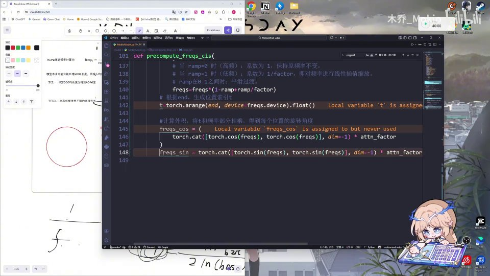 |
| 来把我们每个部分需要旋转的 cos 值和 sin 值给算出来。之后记得这里乘上我们前面所讲的一个温度系数、一个注意力系数来进行一个缩放。好，然后接下来呢，就是我们真正地编写 RoPE 的代码。连写 RoPE，那按照我说的给它起个名字。 [【跳转到 14:36】](https://www.bilibili.com/video/BV1T2k6BaEeC/?p=10&t=876) | 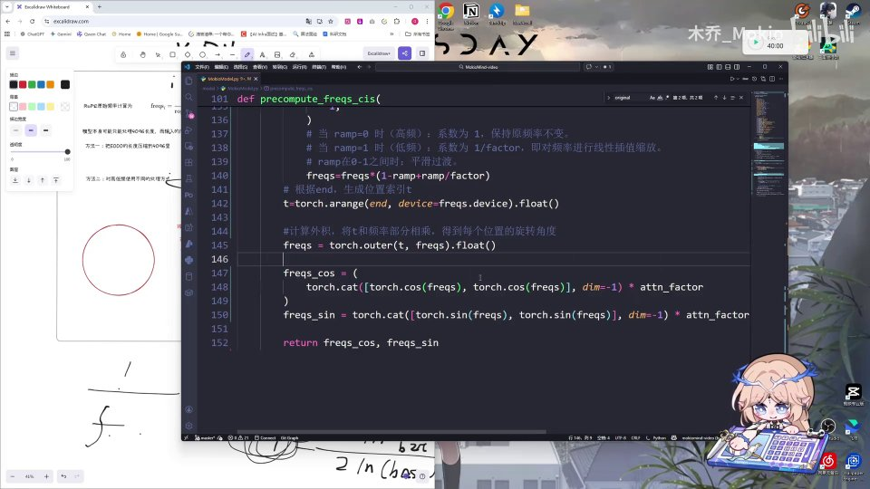 |
| 阿伟 bot…这里呢我就直接复制粘贴过来就可以，复制粘贴过来。那么首先，按照我之前讲的，我们的第一步是需要去把我们的 a、b 变成…因为我们要旋转吧，旋转的话在我们的计算里是需要把它变， [【跳转到 15:01】](https://www.bilibili.com/video/BV1T2k6BaEeC/?p=10&t=901) | 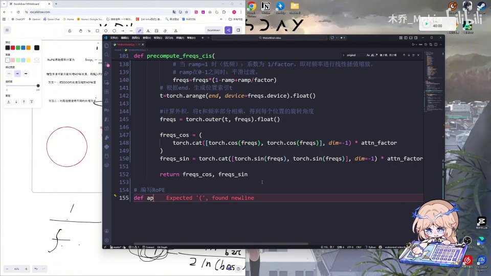 |
| 首先把它的符号和位置变一下，把 a、b 变成 -b、a。那么这里呢，我们先定义一个函数就叫 rotate_half，把 X 给输进来，然后 return 一个过去。看我直接把这个代码给粘贴过来，然后我们再来进行一个详细的解释。那么这里的 X 点 shape 呢， [【跳转到 15:26】](https://www.bilibili.com/video/BV1T2k6BaEeC/?p=10&t=926) | 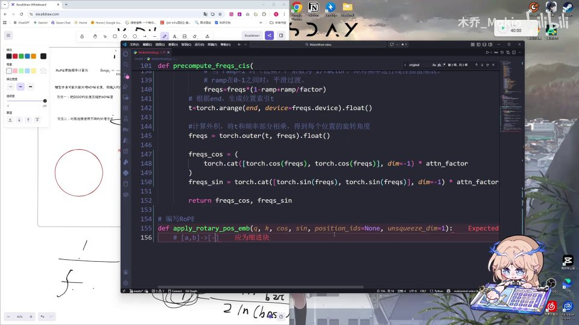 |
| X 点 shape 减 1，它的意思是取最后一个维度。然后呢，这里的这一部分意思就是什么意思？就是我们取出 X 的 [【跳转到 15:51】](https://www.bilibili.com/video/BV1T2k6BaEeC/?p=10&t=951) |  |
| 然后这一部分呢，就是我们取出它的前半部分。也就这里呢，我们实现了一个把整个的一个 a、b 转成了一个 -b、a 的一个思路。然后接下来呢，我们就要应用我们的旋转位置编码。因为旋转，我们把符号和位置变了之后，需要乘上我们前面这里所应用的一些…乘上我们的旋转位置编码。也就是 x_rotated 等于我们的 X 乘以 cos [【跳转到 16:16】](https://www.bilibili.com/video/BV1T2k6BaEeC/?p=10&t=976) |  |
| 加上旋转之后的 X 乘以 sin。哎，那这里呢，我要把这个代码给直接复制粘贴过来，这个比较好理解，我们就是完全地把 Q 和 K 都这样相乘，然后最后呢，我们把这个 Q 和 K 给 return 出去。好，那么这里呢，我们的 YaRN 和 RoPE 就实现了。 [【跳转到 16:41】](https://www.bilibili.com/video/BV1T2k6BaEeC/?p=10&t=1001) |  |
| 其实我们把前面的理论部分实现之后，代码这部分还是比较好理解的，无非就是把我们前面所讲的计算公式给实现了。好，那么我们下一块见。 [【跳转到 17:06】](https://www.bilibili.com/video/BV1T2k6BaEeC/?p=10&t=1026) | 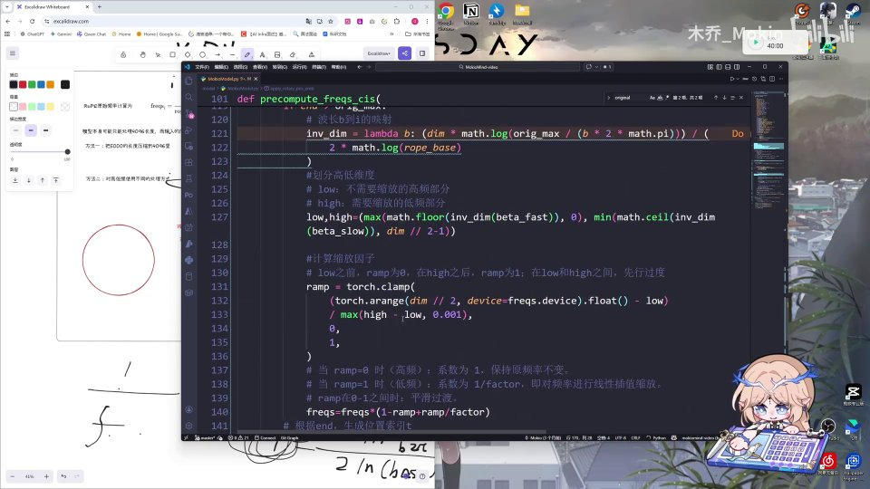 |
| （此区间无字幕） [【跳转到 17:19】](https://www.bilibili.com/video/BV1T2k6BaEeC/?p=10&t=1039) | 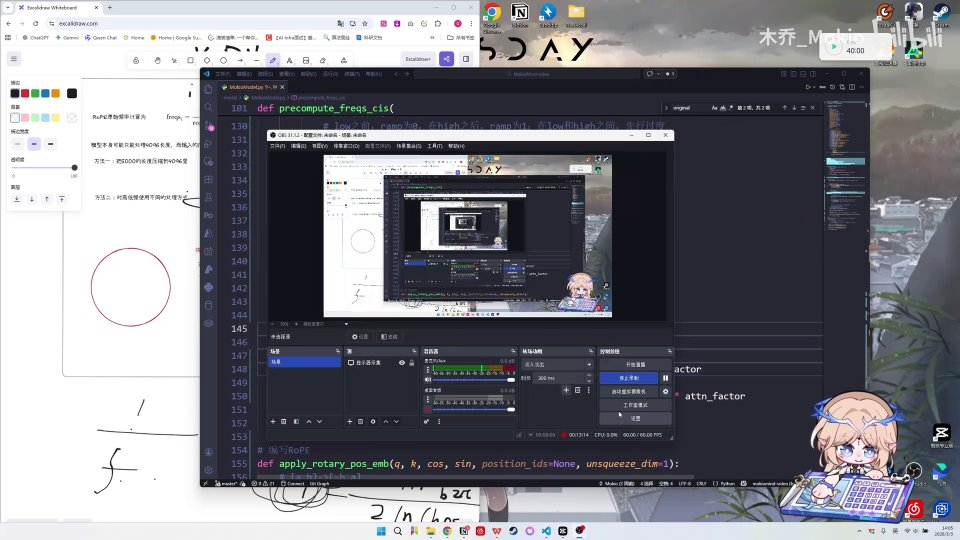 |