# 理论：GQA 原始文稿（图-字幕分栏）

| 字幕文本 | 画面 |
| :--- | ---: |
| 那么这一 part 我们就来到最关键的 GQA（分组查询注意力）部分讲解，它也是 attention 机制。这一 part 我们是对它的理论进行一个讲解。 [【跳转到 00:00】](https://www.bilibili.com/video/BV1T2k6BaEeC/?p=11&t=0) |  |
| 那么在学 GQA 之前，首先我要确保你一定对 attention 有过学习和了解。 [【跳转到 00:09】](https://www.bilibili.com/video/BV1T2k6BaEeC/?p=11&t=9) | 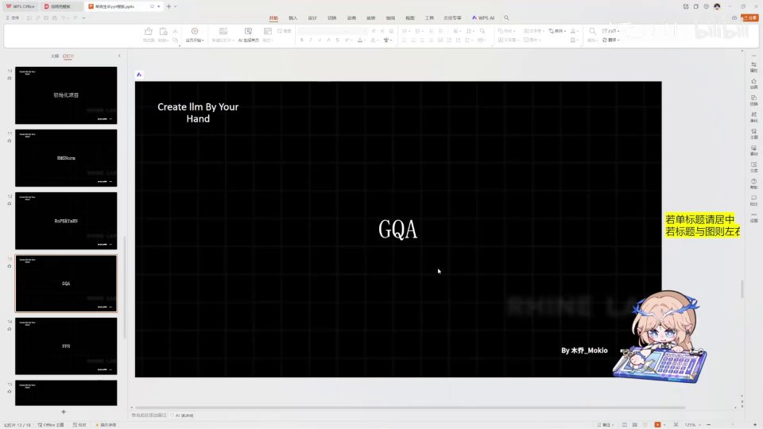 |
| 如果你还不了解的话，那么你完全可以去看一下 3Blue1Brown 的视频。 [【跳转到 00:14】](https://www.bilibili.com/video/BV1T2k6BaEeC/?p=11&t=14) | 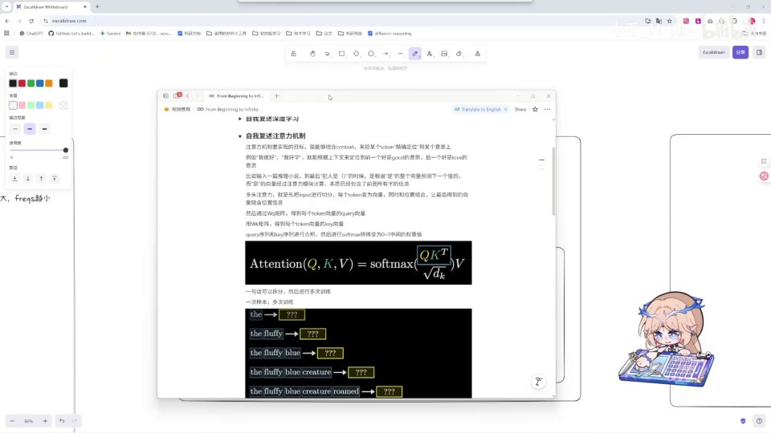 |
| 而且我推荐你在学习完之后可以像我一样运用费曼学习法。 [【跳转到 00:19】](https://www.bilibili.com/video/BV1T2k6BaEeC/?p=11&t=19) | 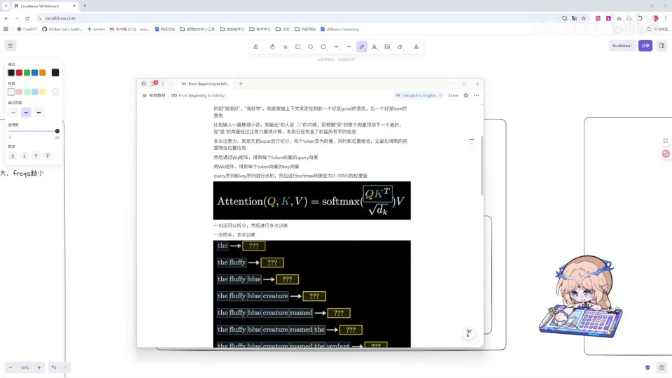 |
| 你可以自己输出、复述一遍，然后去问 AI。 [【跳转到 00:24】](https://www.bilibili.com/video/BV1T2k6BaEeC/?p=11&t=24) | 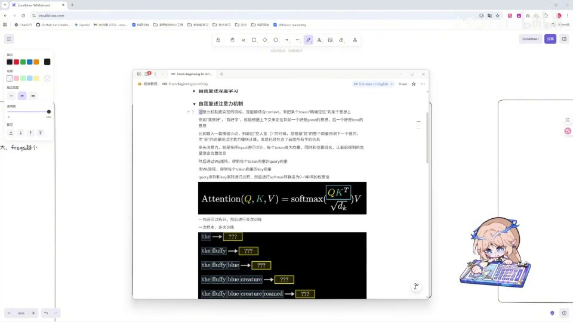 |
| 让 AI 给你进行一些补充。那么具体呢，还是推荐你去看一下 3Blue1Brown 的视频。 [【跳转到 00:29】](https://www.bilibili.com/video/BV1T2k6BaEeC/?p=11&t=29) | 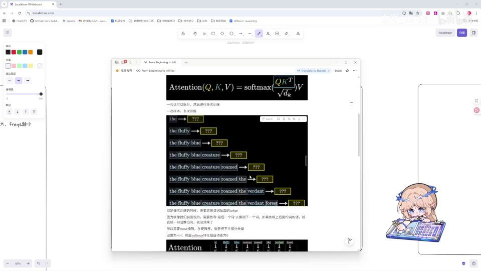 |
| 我们来看一下 attention 的计算公式，就是这个样子：Q 乘以 K 的转置，除以 K 的维度开方，之后再乘以 V。 [【跳转到 00:34】](https://www.bilibili.com/video/BV1T2k6BaEeC/?p=11&t=34) |  |
| 那么就相当于像这样一个图一样，Q 的向量在这里和 K 的向量进行一系列的相乘。 [【跳转到 00:43】](https://www.bilibili.com/video/BV1T2k6BaEeC/?p=11&t=43) | 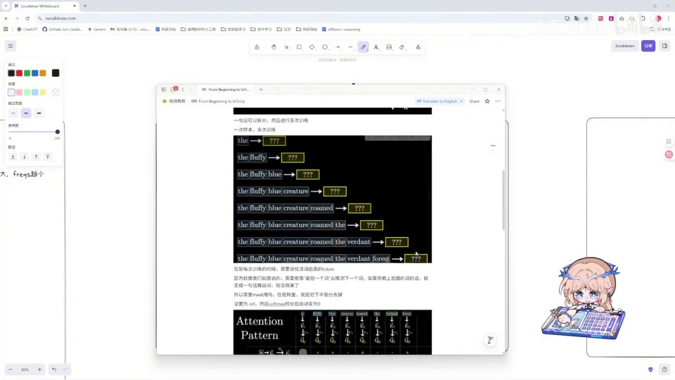 |
| 然后在这个过程中呢，我们还需要应用掩码（mask）。为什么要应用掩码呢？ [【跳转到 00:48】](https://www.bilibili.com/video/BV1T2k6BaEeC/?p=11&t=48) |  |
| 因为我们让模型去生成文本的时候，是希望它一定是基于之前的文本生成，对吧。 [【跳转到 00:55】](https://www.bilibili.com/video/BV1T2k6BaEeC/?p=11&t=55) | 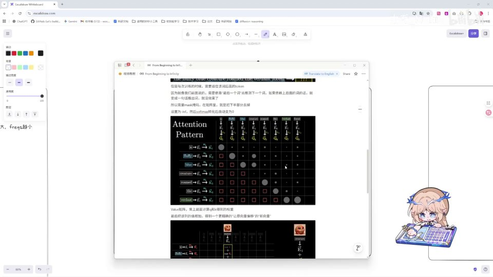 |
| 如果我们在训练的时候加上后面的文本，相当于它就结合前面和后面来生成这个词了；但是我们实际应用大模型的时候，它只根据前面来生成。所以我们就需要加上掩码，让它在 softmax 层进行转化的时候，把后面的部分都消为零。 [【跳转到 01:00】](https://www.bilibili.com/video/BV1T2k6BaEeC/?p=11&t=60) | 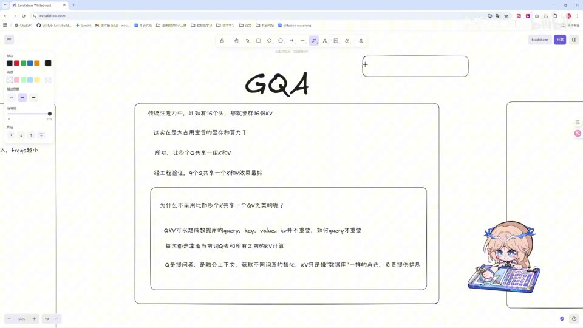 |
| 就是这样一个计算。然后在计算完之后，我们需要把上一部分计算到的值和 V 相乘。 [【跳转到 01:20】](https://www.bilibili.com/video/BV1T2k6BaEeC/?p=11&t=80) | 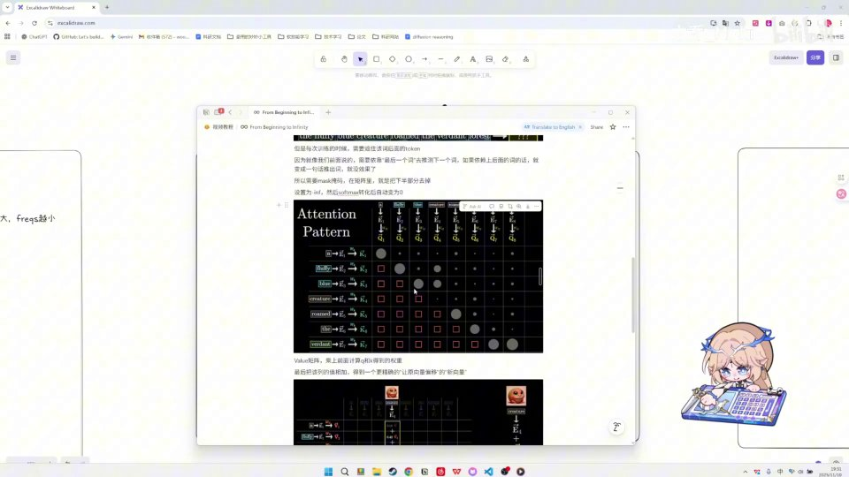 |
| 然后得到我们所需要的 attention 的值。 [【跳转到 01:25】](https://www.bilibili.com/video/BV1T2k6BaEeC/?p=11&t=85) | 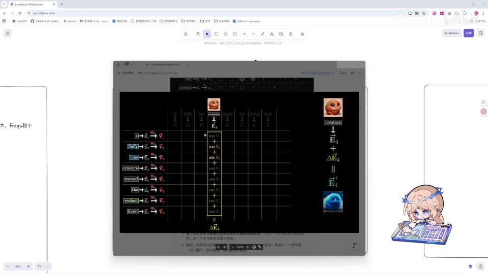 |
| 然后最后呢，因为是多头注意力嘛，我们需要把单头给拼接在一起。 [【跳转到 01:30】](https://www.bilibili.com/video/BV1T2k6BaEeC/?p=11&t=90) | 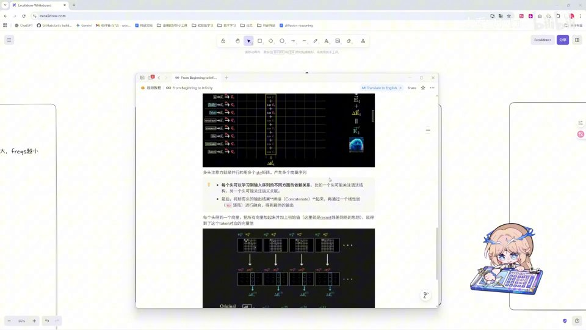 |
| 拼接成为多头。好，那么 attention 机制了解之后，我们就需要知道为什么我们这里写的是 GQA。嗯，首先呢我们需要知道，在传统注意力中有 16 个头，那么你就需要存 16 份 K 和 V 吗？那我们的显存是很宝贵的，算力也是很宝贵的，存 16 份 K 和 V 的话太占显存了。所以人们就想，嗯，能不能让多个 Q 共享一组 KV 呢？ [【跳转到 01:35】](https://www.bilibili.com/video/BV1T2k6BaEeC/?p=11&t=95) | 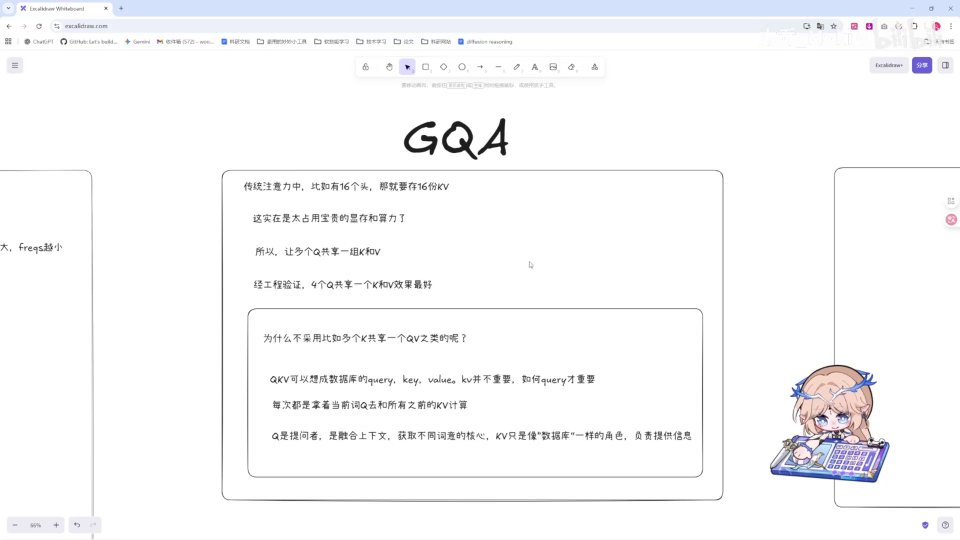 |
| 那么经过试验：首先是一对一，一个 Q 共用一个 K 和 V；然后是两个 Q 共用一个 K 和 V；以及四个 Q 共用一个 K 和 V。在工程验证中呢，四个 Q 共享一个 K 和 V 效果是最好的，所以现在 GQA 就是用这样。那么也许有人会问，为什么不用 K 共享 Q、V 之类的呢？ [【跳转到 02:00】](https://www.bilibili.com/video/BV1T2k6BaEeC/?p=11&t=120) | 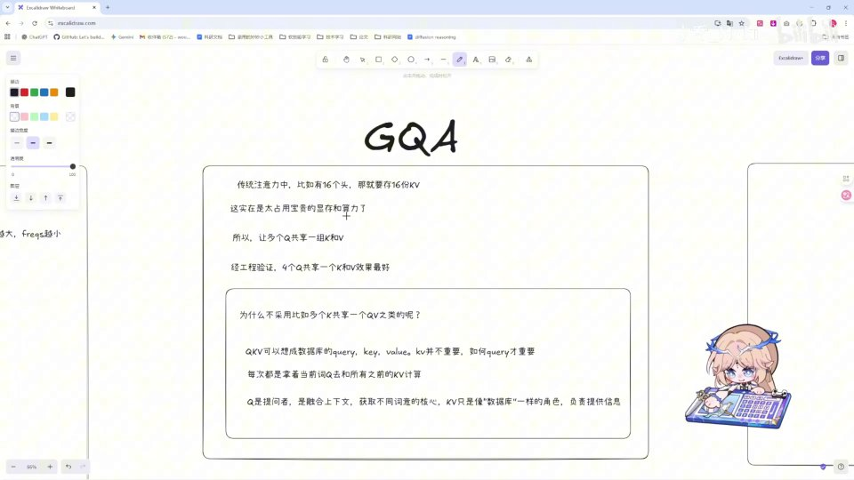 |
| 那么这里呢你就可以想象，QKV 就是 Query、Key 和 Value。如果你学过数据库的话就知道，Query 是查询的意思，Key 和 Value 就是键和值嘛。K 和 V 不重要，Query 才重要。你就相当于很多个人去翻字典，你可以让很多个人共享几本字典，但你不能说对吧——很多本字典共享一个人，对吧？那这就是不对的。 [【跳转到 02:25】](https://www.bilibili.com/video/BV1T2k6BaEeC/?p=11&t=145) | 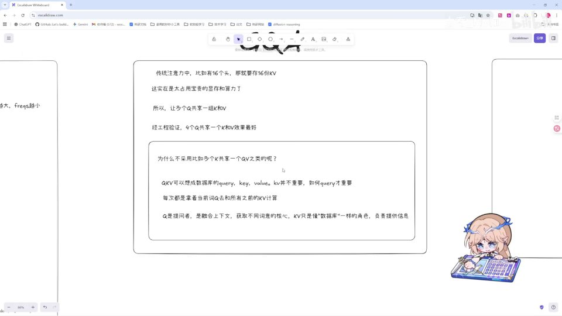 |
| 所以我们都是让 Q 共享 K 和 V 的。再加上 attention 机制呢，我们就可以看这个架构图来编写我们具体的内容。 [【跳转到 02:50】](https://www.bilibili.com/video/BV1T2k6BaEeC/?p=11&t=170) | 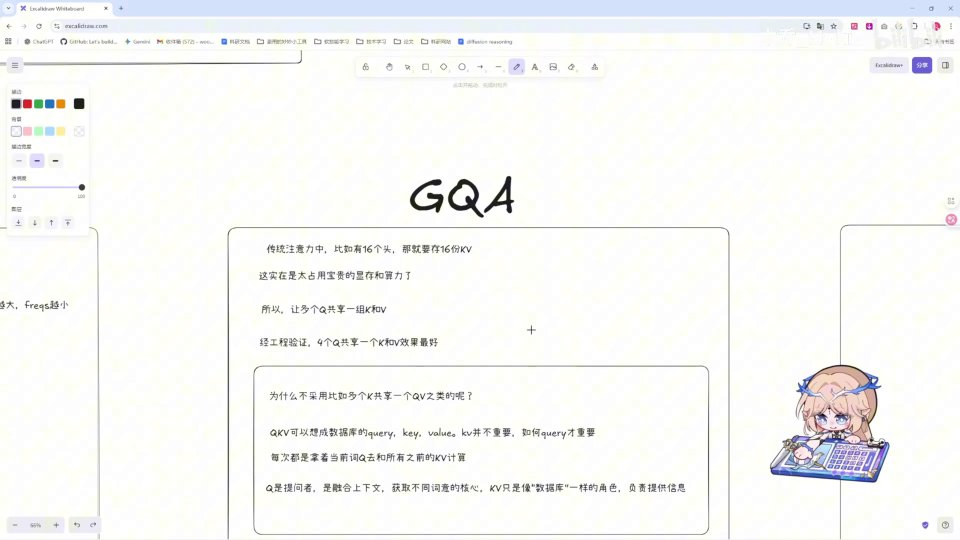 |
| 首先输入 X 和 W_K、W_Q、W_V 三个矩阵相乘，得到三个投影；然后用上我们之前的 RoPE 方法对 Q 和 K 进行位置编码；之后再让它们在这里相乘，得到我们刚刚在 attention 这里讲解的这一个量。 [【跳转到 02:58】](https://www.bilibili.com/video/BV1T2k6BaEeC/?p=11&t=178) |  |
| 然后应用掩码，把后面的部分给遮住，不让它来看答案。 [【跳转到 03:16】](https://www.bilibili.com/video/BV1T2k6BaEeC/?p=11&t=196) | 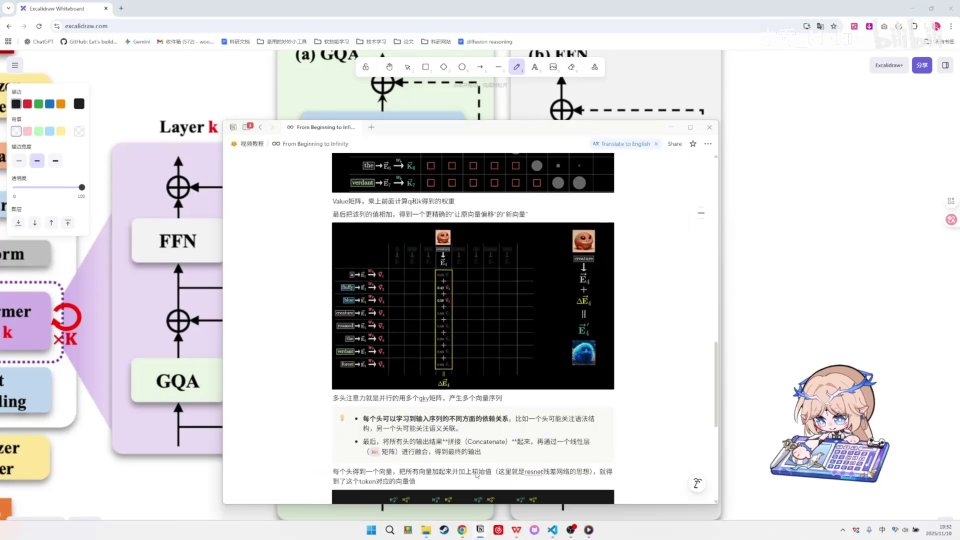 |
| 只能 softmax 转化成一个概率输出。而在 K 和 V 部分呢，我们去让它进行重复，也就是让多个 Q 共享 K 和 V；然后最后在这里再让它们生成之后再和 V 相乘。 [【跳转到 03:21】](https://www.bilibili.com/video/BV1T2k6BaEeC/?p=11&t=201) | 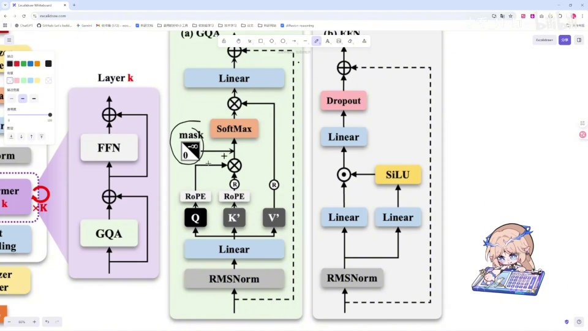 |
| 再经过一个 linear 层，就把我们多个头给拼接回来，然后再输出。那么这就是我们的理论。 [【跳转到 03:33】](https://www.bilibili.com/video/BV1T2k6BaEeC/?p=11&t=213) | 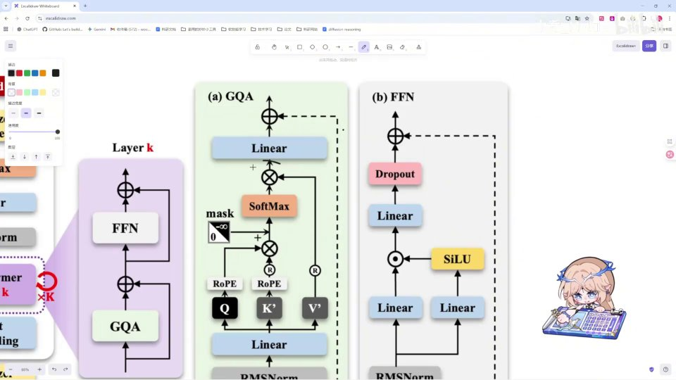 |
| 下一 part 呢，我们就会按照这一整个过程来敲一下代码，那我们下一 part 见。 [【跳转到 03:42】](https://www.bilibili.com/video/BV1T2k6BaEeC/?p=11&t=222) | 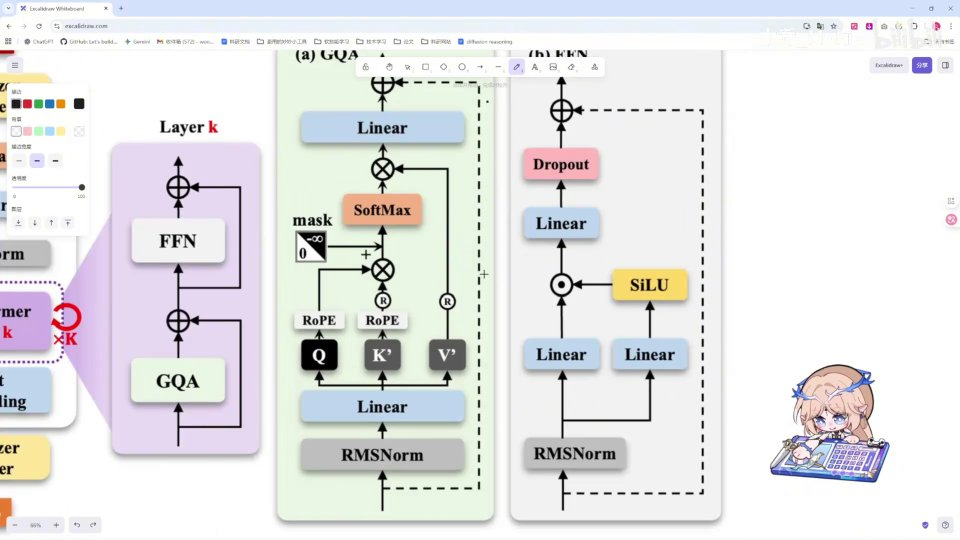 |