# 理论：FFN 原始文稿（图-字幕分栏）

| 字幕文本 | 画面 |
| :--- | ---: |
| 大家好，这一部分我们来讲 FFN 层。FFN 层也是比较简单的。 [【跳转到 00:00】](https://www.bilibili.com/video/BV1T2k6BaEeC/?p=14&t=0) | 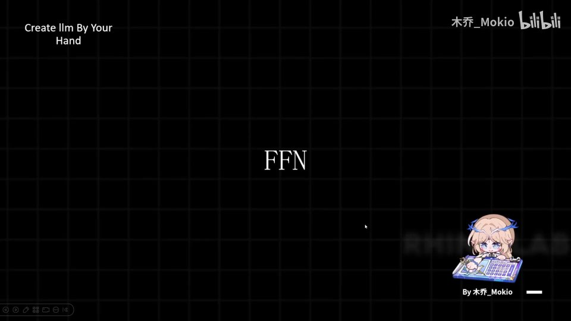 |
| 我们直接来看一下前面出现过的那张图。 [【跳转到 00:05】](https://www.bilibili.com/video/BV1T2k6BaEeC/?p=14&t=5) | 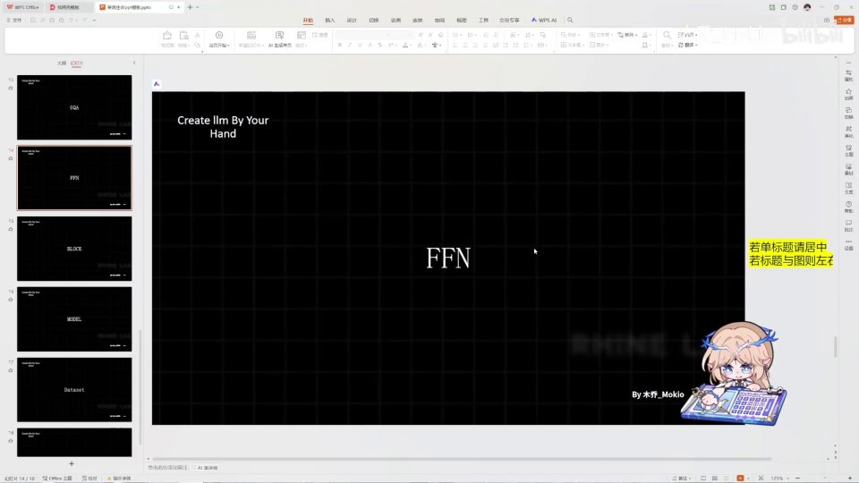 |
| FFN 层就是由 linear 层和激活函数层组成的，起到升维的作用。升维的作用是什么呢？比如说我们原本有两个维度，一个是行、一个是列。从信息上理解，升维就是把信息更细节化。举个例子，比如你觉得一个人有魅力…… [【跳转到 00:10】](https://www.bilibili.com/video/BV1T2k6BaEeC/?p=14&t=10) | 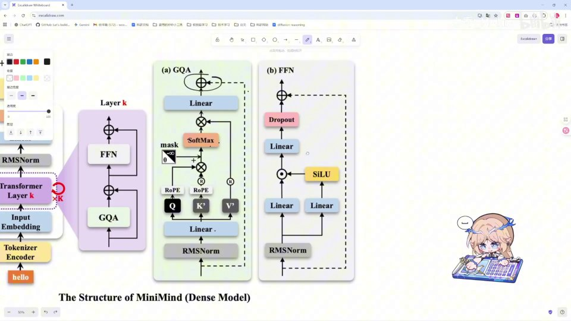 |
| 那么这个"魅力"在经过升维之后就变成了多个维度的"有魅力"，比如个人建模好看、性格好、身体健康等等，这些都可以归入"有魅力"。而这一升维，就是把"有魅力"原本的一个词升到了更高的维度。 [【跳转到 00:35】](https://www.bilibili.com/video/BV1T2k6BaEeC/?p=14&t=35) |  |
| 比如说让它学习更细节的部分，这就是我认为升维的意义，在数学上理解就是把维度变多了。在这里，它在升维之后还经过一个激活函数，这就是门控网络。如果你看过基础知识的话…… [【跳转到 01:00】](https://www.bilibili.com/video/BV1T2k6BaEeC/?p=14&t=60) |  |
| 你就知道这个思路。它就是一个激活函数。激活函数是什么样子呢？它是这样一个函数（比如 Swish/SiLU）：经过激活函数之后，可以看到它在小于零的这一部分基本靠近零，而在右边大于零的这一部分就相当于保留自己原来的值。这个思路就是这样一个激活函数。激活函数的作用是引入非线性。 [【跳转到 01:17】](https://www.bilibili.com/video/BV1T2k6BaEeC/?p=14&t=77) | 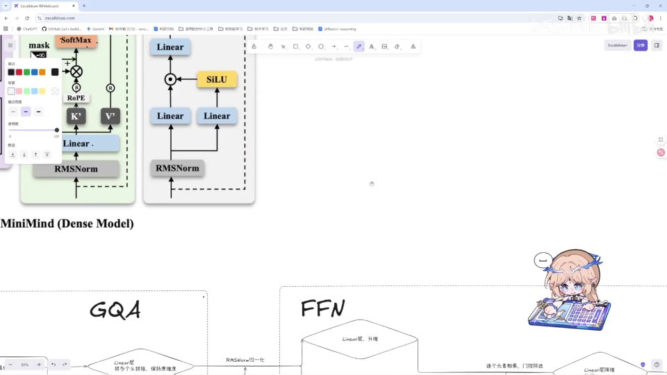 |
| 如果没学过基础知识，或者学过也可以再复习一下。引入非线性的意义是什么呢？如果没有非线性，那么无论多少层的神经网络，比如 W1 乘以 W2 再乘以 W3，再乘以 X 加 B，然后括起来加 B…… [【跳转到 01:42】](https://www.bilibili.com/video/BV1T2k6BaEeC/?p=14&t=102) |  |
| 再括起来加 B，这样一个神经网络本质上还是一个 W1W2W3 乘以 X 加上三个 B 的一层神经网络。也就是说，多层如果没有引入非线性，多层就等价于一层，那么它就无法实现逻辑的复杂化。而在每一层去引入一个激活函数的话…… [【跳转到 02:07】](https://www.bilibili.com/video/BV1T2k6BaEeC/?p=14&t=127) | 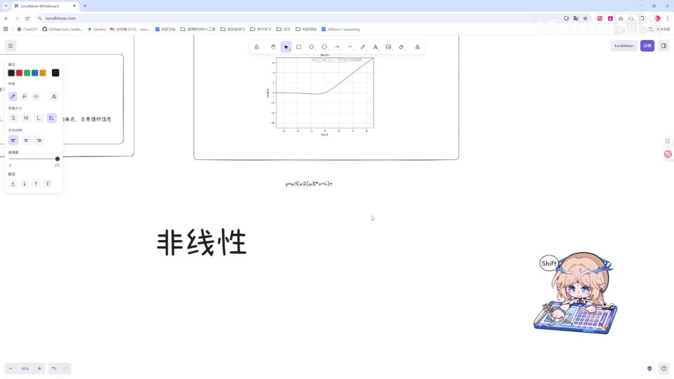 |
| 它就能实现比较复杂的效果。比如一个复杂的函数，你只用一条直线肯定是拟合不了的；而如果你在第一层去使用一个激活函数，它就相当于让我们的线在某一部分折断了。 [【跳转到 02:32】](https://www.bilibili.com/video/BV1T2k6BaEeC/?p=14&t=152) | 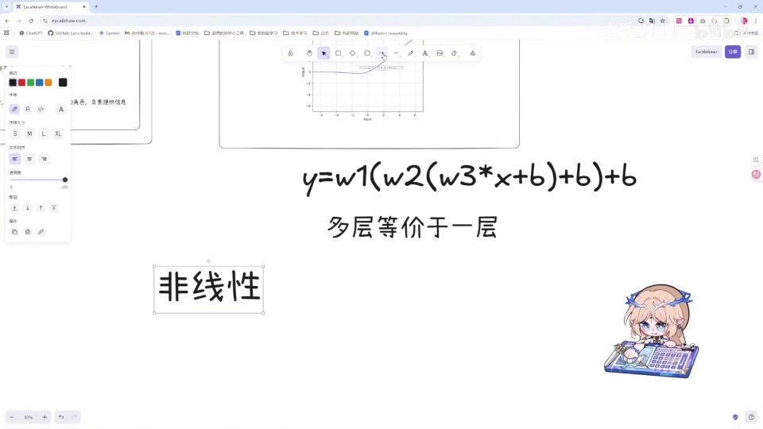 |
| 比如这样一条线，它在这里折断，然后进行了一些变化，然后在这里再折断，再折断、再折断……这样很多很小的段拼接在一起，就完全拟合了这样一个比较复杂的曲线函数。这就是引入非线性的意义。 [【跳转到 02:57】](https://www.bilibili.com/video/BV1T2k6BaEeC/?p=14&t=177) | 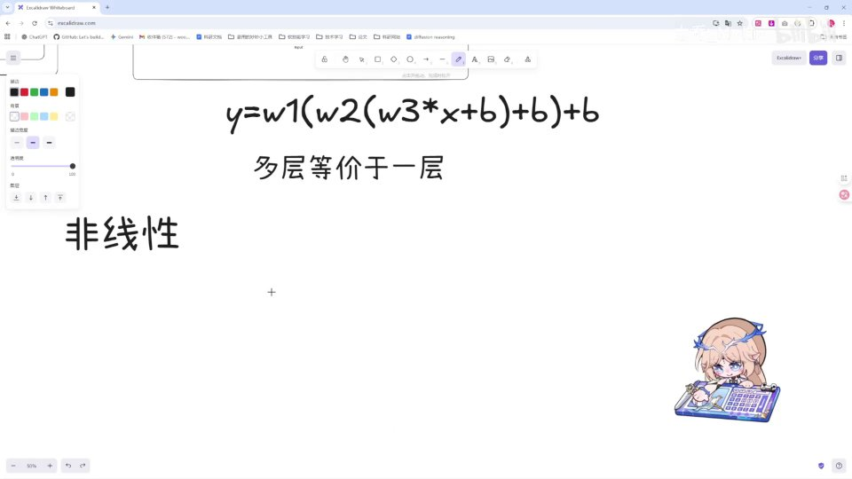 |
| 所以这就是引入非线性的意义。而我们的多层和多宽，其实就是代表了我们这条线折断的频数。 [【跳转到 03:22】](https://www.bilibili.com/video/BV1T2k6BaEeC/?p=14&t=202) | 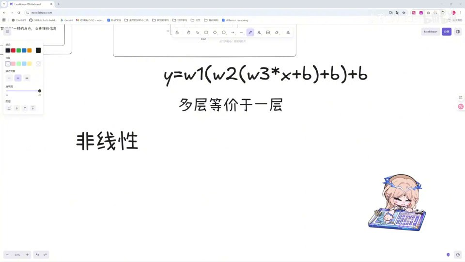 |
| 把这样一层一层的线复合起来，它弯曲的长度越来越弯，就能弯曲成近似一个曲线；而它的段数越来越多，就能逐渐逼近这样一个复杂的曲线函数。还有一种理解方式：这样一个非线性函数，它明显相当于一个 false 或者 true…… [【跳转到 03:47】](https://www.bilibili.com/video/BV1T2k6BaEeC/?p=14&t=227) | 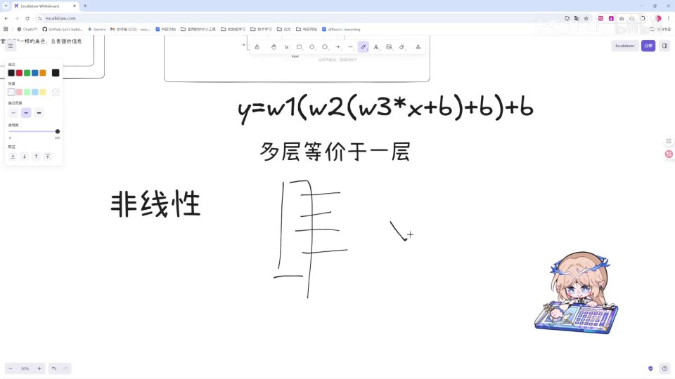 |
| 一种零和一、像电路一样的设计。在我的理解里，它实际上是实现了一种逻辑的嵌套叠加。嵌套是什么呢？比如我们的电脑本身是由无数个零和一的晶体管组成的，但无数个零和一就拼成了电脑这样复杂的逻辑。而非线性激活函数引入的就是一种逻辑的复杂嵌套。 [【跳转到 04:12】](https://www.bilibili.com/video/BV1T2k6BaEeC/?p=14&t=252) |  |
| 无数的 true 和 false，无数的拼接和叠加，就形成了大语言模型这样复杂的逻辑。比如我需要识别一只猫，那么这个 true 和 false 就相当于：我识别这个地方，这一个点加上这两条线，能拼出来是不是一个角？ [【跳转到 04:37】](https://www.bilibili.com/video/BV1T2k6BaEeC/?p=14&t=277) |  |
| 是一个角。再往上叠加，连接两个边是不是一个耳朵？是一个耳朵。然后一个耳朵加一个耳朵，再加上这张脸，是不是猫？这就是一个逻辑自底向上的叠加，这也是激活函数引入非线性最重要的地方。好像有点跑题了。我们讲完激活函数之后…… [【跳转到 05:02】](https://www.bilibili.com/video/BV1T2k6BaEeC/?p=14&t=302) |  |
| 可以看到这里就相当于逐元素相乘，是什么意思呢？是一个门控吗？当它经过激活函数之后，一部分会变成零，一部分会保留原来的值，和这里相乘之后就会进行信息的过滤，相当于对信息进行一个控制。在工程上，这是一个非常有用的实现，相当于一个动态的门，来进行学习…… [【跳转到 05:21】](https://www.bilibili.com/video/BV1T2k6BaEeC/?p=14&t=321) | 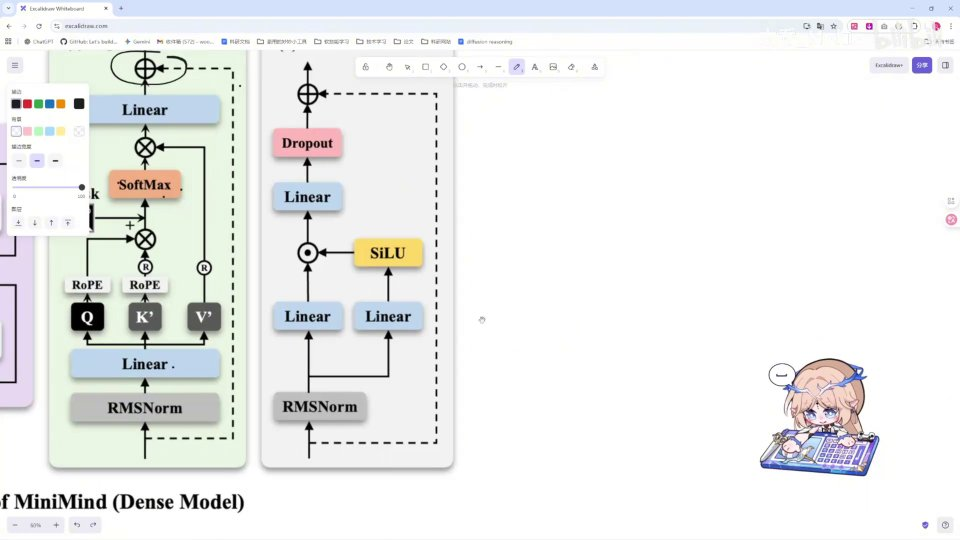 |
| 应该放行哪些数据、应该依赖哪些数据。然后这个 linear 呢就是降维，把我们升维后的部分给降维，相当于浓缩精华知识。再经过 dropout 之后，residual 输出。好，那么这个理论部分就讲解完毕。 [【跳转到 05:46】](https://www.bilibili.com/video/BV1T2k6BaEeC/?p=14&t=346) |  |
| 这个 FFN 层比 GQA 简单很多，也更好理解。 [【跳转到 05:59】](https://www.bilibili.com/video/BV1T2k6BaEeC/?p=14&t=359) | 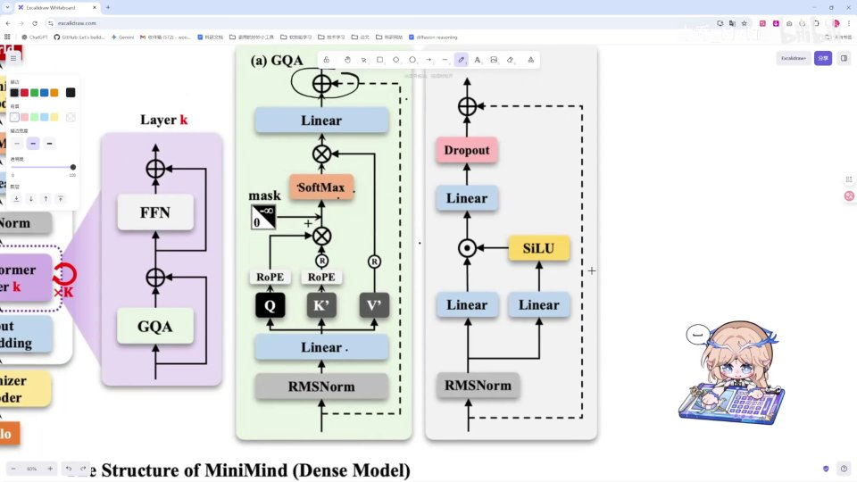 |
| 关键是理解这个门控网络和这个激活函数就可以了。好，那么我们下一部分正式开始对代码的讲解。 [【跳转到 06:04】](https://www.bilibili.com/video/BV1T2k6BaEeC/?p=14&t=364) | 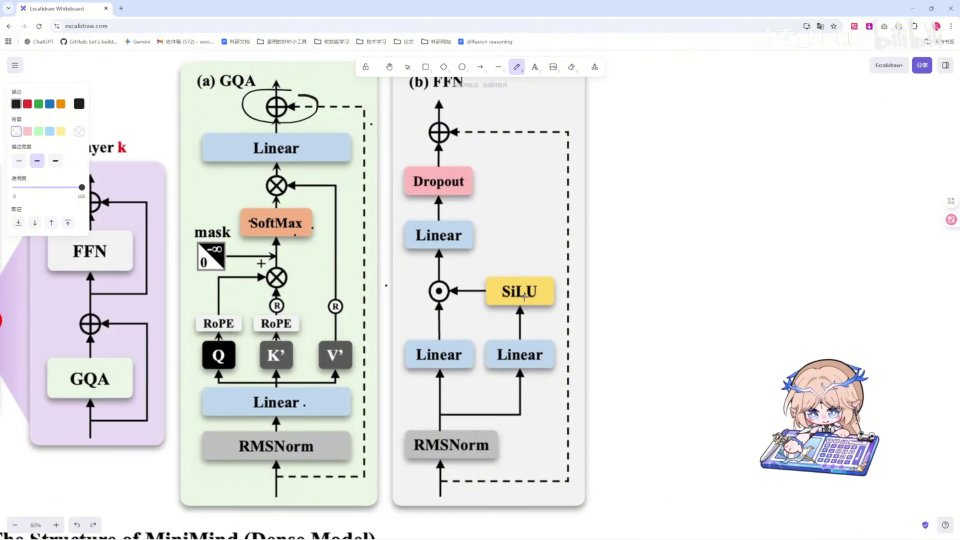 |