# 代码：FFN 原始文稿（图-字幕分栏）

| 字幕文本 | 画面 |
| :--- | ---: |
| 我们这一 part 是对 FFN 代码的讲解，这里没有比较复杂、需要额外学习的 PyTorch 方法。 [【跳转到 00:00】](https://www.bilibili.com/video/BV1T2k6BaEeC/?p=15&t=0) | 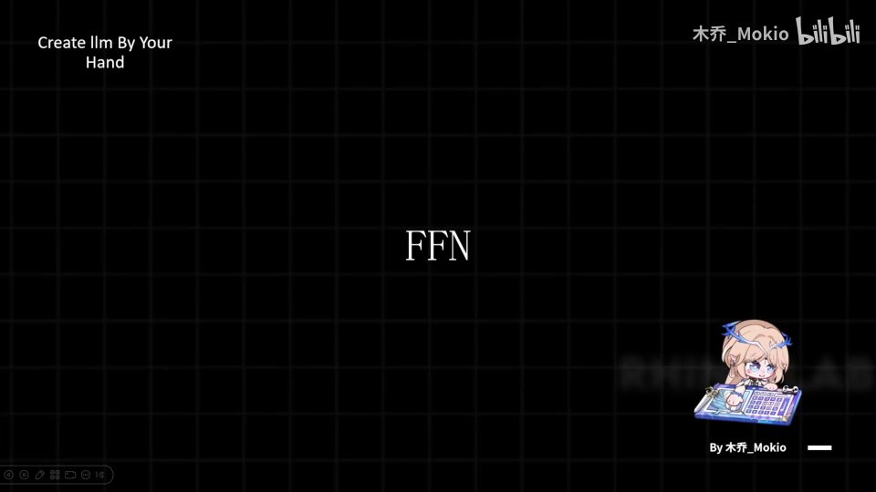 |
| 那么我们直接来敲代码就可以了。 [【跳转到 00:08】](https://www.bilibili.com/video/BV1T2k6BaEeC/?p=15&t=8) | 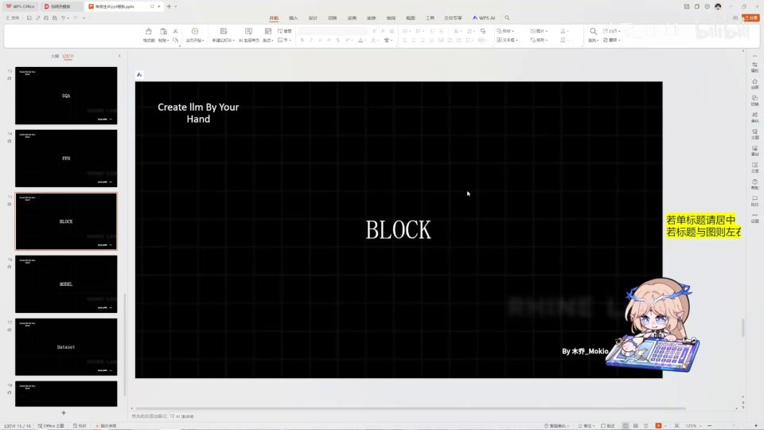 |
| 首先，FFN 依旧是一个层（layer），我们叫它 FeedForward，然后让它继承 nn.Module。第一步依旧是初始化；初始化之后，我们需要得到门控（gate）。 [【跳转到 00:13】](https://www.bilibili.com/video/BV1T2k6BaEeC/?p=15&t=13) | 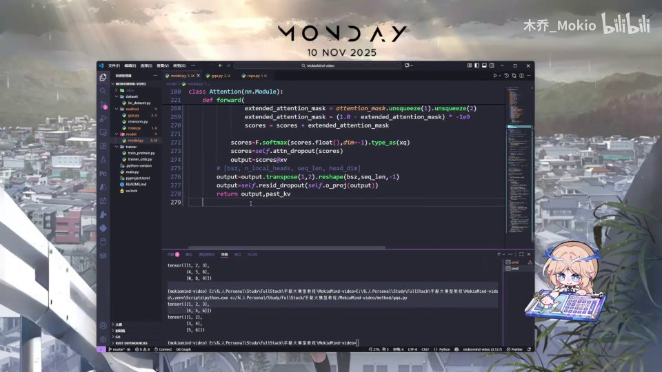 |
| 我们需要得到升维的 Linear，然后需要得到一个降维，然后需要得到一个门控，然后需要 dropout，然后需要一个激活函数，这就是整个 FeedForward。这里我们首先去做初始化，来实现一下 self。 [【跳转到 00:38】](https://www.bilibili.com/video/BV1T2k6BaEeC/?p=15&t=38) | 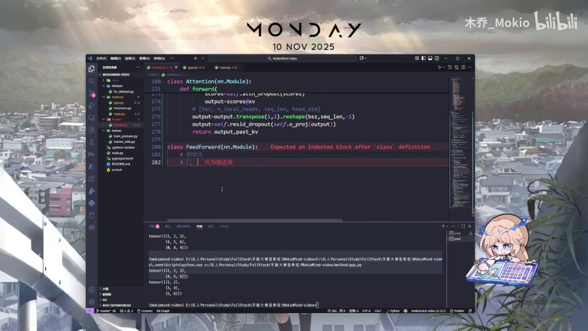 |
| 然后继承我们的 Config 参数，依旧是 super().__init__() 来进行一个父类的初始化。然后这里呢，因为要升维，升维的话在前面我们的参数里依旧指定了一个专门升维的维度，在这里就是这个维度。 [【跳转到 01:03】](https://www.bilibili.com/video/BV1T2k6BaEeC/?p=15&t=63) |  |
| 这个维度需要我们计算。如果 Config 的 intermediate_size，也就是 args 的 intermediate_size 还是 None 的话， [【跳转到 01:28】](https://www.bilibili.com/video/BV1T2k6BaEeC/?p=15&t=88) |  |
| 那我们就自己计算一下。像这里的话，我们实际验证里最好用的是 hidden_size 乘以 8/3，也就是 2.66，这个倍数是最好用的，这是实践得来的。然后我们继续让 args.intermediate_size 等于 64 的 [【跳转到 01:53】](https://www.bilibili.com/video/BV1T2k6BaEeC/?p=15&t=113) | 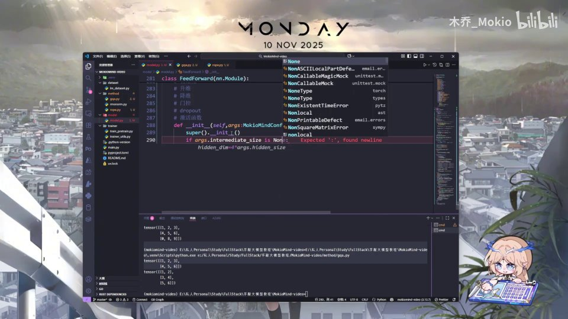 |
| 倍数，加 64 减 1 再整除 64，我让它得到这个应该升维的维度。然后接下来就是这么多投影（projection），我们一个一个来实现。 [【跳转到 02:18】](https://www.bilibili.com/video/BV1T2k6BaEeC/?p=15&t=138) |  |
| 首先实现 up 的投影，我们依旧用到 nn.Linear，让它输入的维度等于 hidden_size，输出的维度等于我们这个升维的维度，然后依旧不使用 bias（偏置）。然后 down 的话就是反过来，让升维的再变回原本的 hidden_size。然后我们需要实现门控（gate），门控和这个 up 是一样的，因为它是走右边的。 [【跳转到 02:43】](https://www.bilibili.com/video/BV1T2k6BaEeC/?p=15&t=163) |  |
| 然后我们用 dropout，dropout 就是直接用 nn.Dropout，然后用我们参数里设置的 dropout 层。 [【跳转到 03:08】](https://www.bilibili.com/video/BV1T2k6BaEeC/?p=15&t=188) | 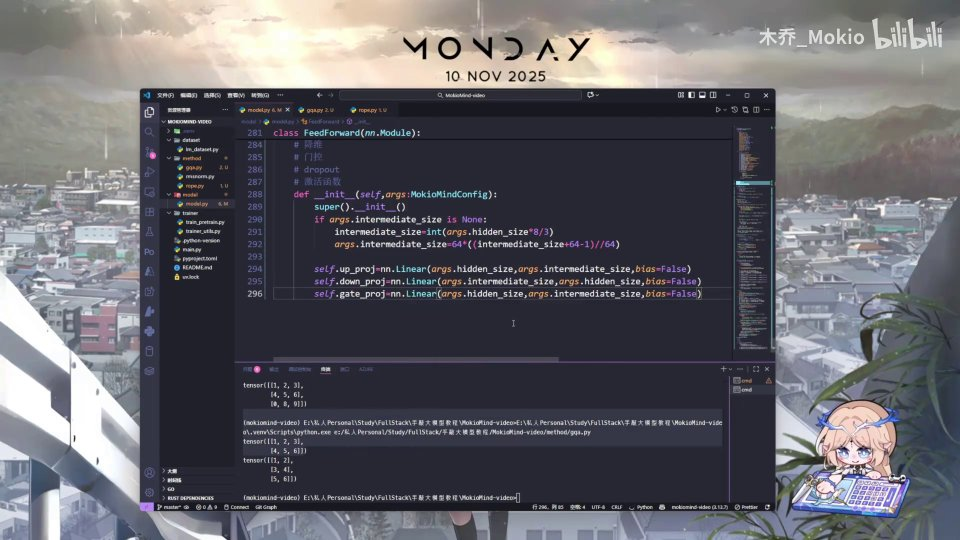 |
| 可以看到这里，然后我们接下来呢，就是需要用到激活函数。 [【跳转到 03:19】](https://www.bilibili.com/video/BV1T2k6BaEeC/?p=15&t=199) |  |
| 这个激活函数，我们就直接 act_fn 等于 ACT2FN， [【跳转到 03:24】](https://www.bilibili.com/video/BV1T2k6BaEeC/?p=15&t=204) |  |
| 然后用 self.act_fn。这个呢是需要我们依旧去导入的。 [【跳转到 03:29】](https://www.bilibili.com/video/BV1T2k6BaEeC/?p=15&t=209) | 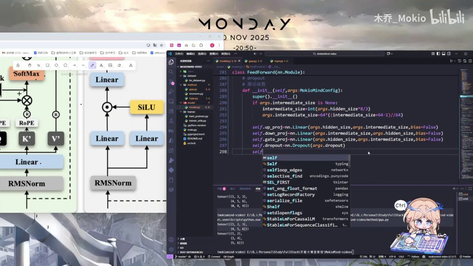 |
| 我们在前面把这个给 import 一下。 [【跳转到 03:54】](https://www.bilibili.com/video/BV1T2k6BaEeC/?p=15&t=234) | 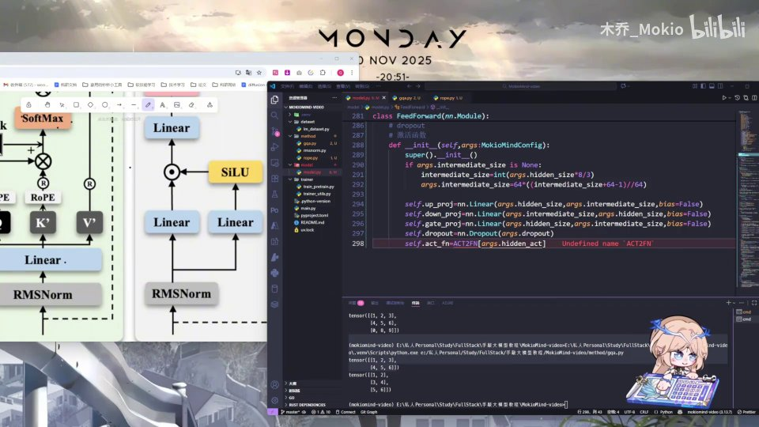 |
| from ... 我们把这个给导入一下，也就是我们常用的一些激活函数，它其实已经内置给我们实现过了。好，那我们实现完之后，需要去定义一个前向传播 forward(self, x)，去进行一个应用即可。 [【跳转到 03:59】](https://www.bilibili.com/video/BV1T2k6BaEeC/?p=15&t=239) | 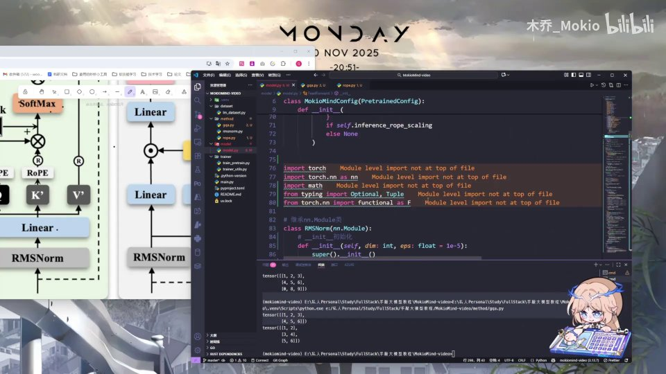 |
| self 的前向传播最外层是一个 dropout，底层呢是一个 down_proj，然后它是一个应用了激活函数的升维 X，和门控相乘之后，再和自己进行一个逐元素的相乘的 X。这就是整个计算过程。 [【跳转到 04:24】](https://www.bilibili.com/video/BV1T2k6BaEeC/?p=15&t=264) | 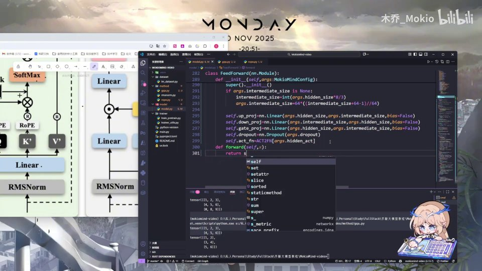 |
| 首先是这里是 gate，就是首先升维。 [【跳转到 04:49】](https://www.bilibili.com/video/BV1T2k6BaEeC/?p=15&t=289) | 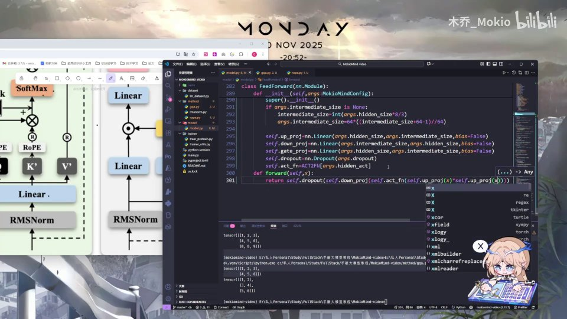 |
| 升维完之后，和门控这部分的和激活函数相乘，相乘完之后， [【跳转到 05:02】](https://www.bilibili.com/video/BV1T2k6BaEeC/?p=15&t=302) |  |
| 再在这里逐元素相乘完之后进行一个降维，最后进行一个 dropout。 [【跳转到 05:08】](https://www.bilibili.com/video/BV1T2k6BaEeC/?p=15&t=308) | 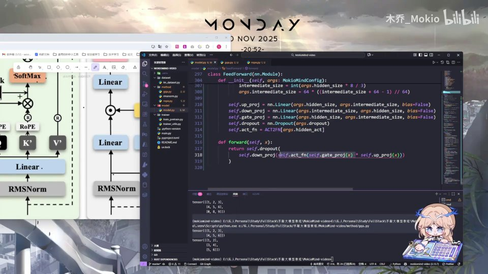 |
| 那么这个就是我们 FeedForward 的实现。 [【跳转到 05:13】](https://www.bilibili.com/video/BV1T2k6BaEeC/?p=15&t=313) | 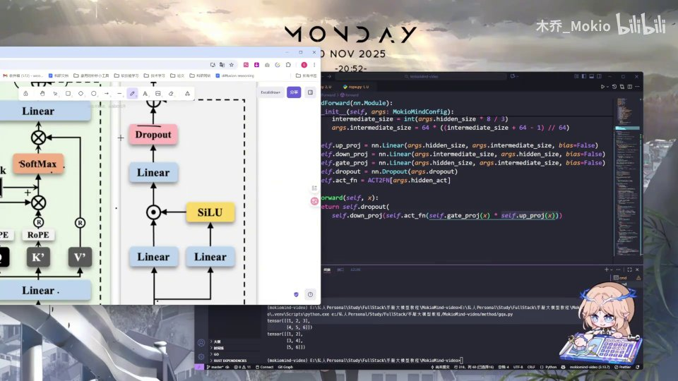 |
| 那么我们下一 part 呢，这个 FFN 就已经讲完了。 [【跳转到 05:18】](https://www.bilibili.com/video/BV1T2k6BaEeC/?p=15&t=318) | 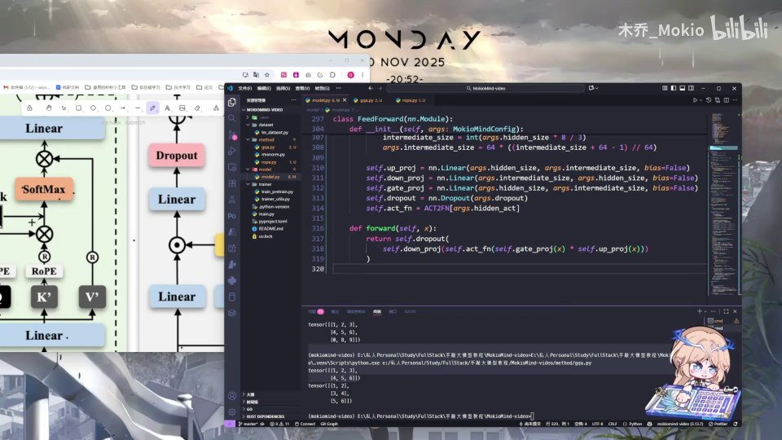 |
| 然后这个模块也讲完了，那么我们接下来就是对整个 TransformerBlock 进行一个拼接，这个就很简单了。 [【跳转到 05:25】](https://www.bilibili.com/video/BV1T2k6BaEeC/?p=15&t=325) | 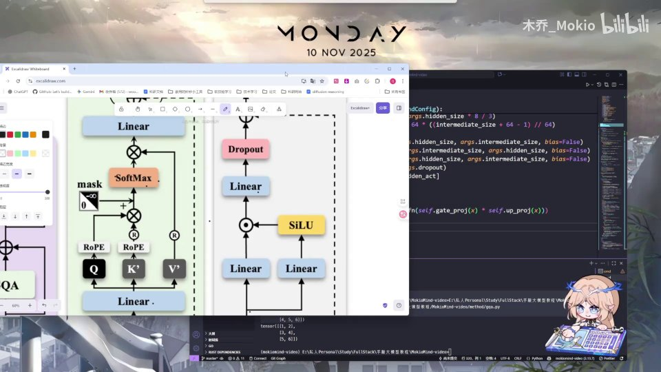 |
| 就只是一个简单的组装，那我们下一 part 见。 [【跳转到 05:33】](https://www.bilibili.com/video/BV1T2k6BaEeC/?p=15&t=333) | 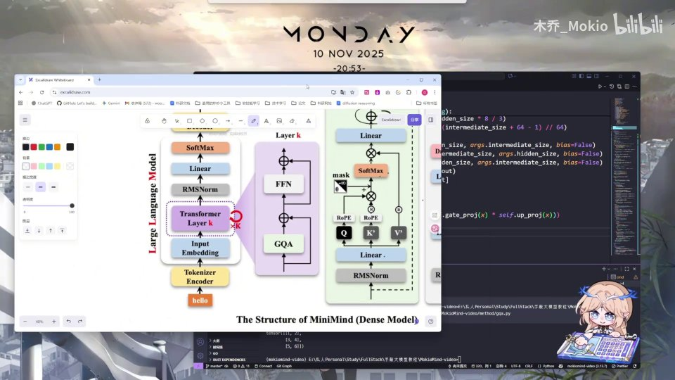 |
| （此区间无字幕） [【跳转到 05:38】](https://www.bilibili.com/video/BV1T2k6BaEeC/?p=15&t=338) |  |