# 拼接：Block 原始文稿（图-字幕分栏）

| 字幕文本 | 画面 |
| :--- | ---: |
| 好，我们这一趴就来动手实现 Block。这一趴没有什么理论知识，主要就是写代码。 [【跳转到 00:00】](https://www.bilibili.com/video/BV1T2k6BaEeC/?p=16&t=0) |  |
| Block 的实现也很简单，就是把前面我们实现的 GQA（注意力）和前面实现的 FFN 层 [【跳转到 00:05】](https://www.bilibili.com/video/BV1T2k6BaEeC/?p=16&t=5) | 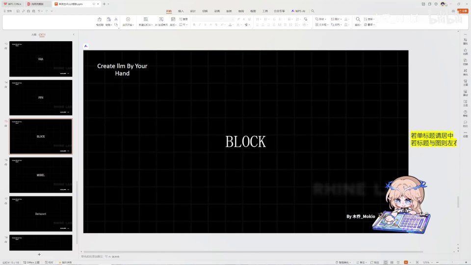 |
| 拼接在一起就可以了。那么来，我们实现一下这个 class。 [【跳转到 00:10】](https://www.bilibili.com/video/BV1T2k6BaEeC/?p=16&t=10) | 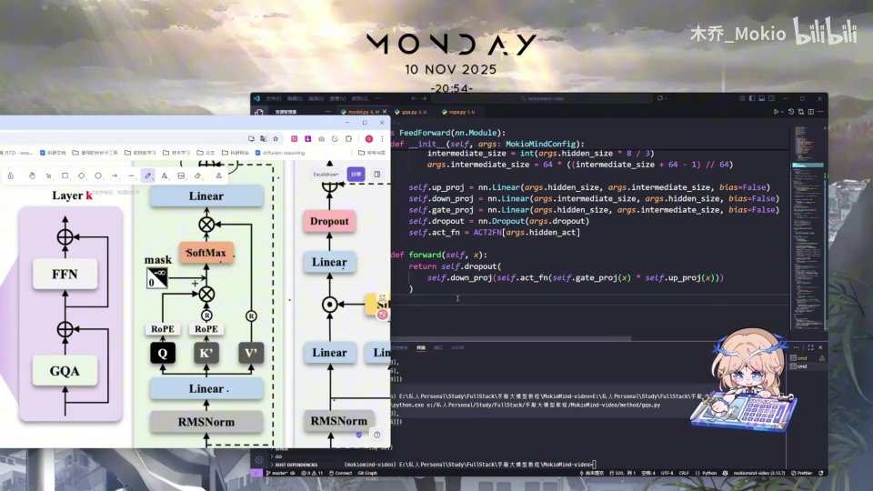 |
| 我们把它叫 MokioMindBlock。它依旧是一层，依旧继承 nn.Module。首先需要初始化，要传入 self、layer 的索引，然后接收 config。 [【跳转到 00:15】](https://www.bilibili.com/video/BV1T2k6BaEeC/?p=16&t=15) |  |
| 然后我们继承的依旧是 nn.Module，调用 super().__init__()。在这里我们进行一些变量的初始化：注意力头数等于 config 的 num_attention_heads，hidden_size 等于 config 的 hidden_size，然后每个头的维度等于隐藏层维度 [【跳转到 00:40】](https://www.bilibili.com/video/BV1T2k6BaEeC/?p=16&t=40) | 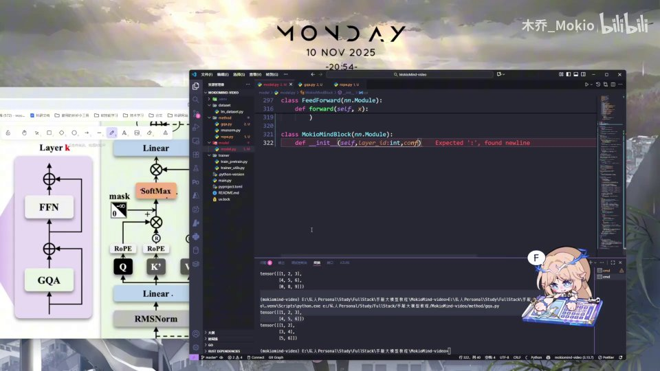 |
| 除以我们一共有几个头（也就是 num_attention_heads）。然后 self.attention，我们这里正式用上前面编写的 Attention 类，把 config 传进去实例化一个；这里我们把 layer_idx 也初始化一下。 [【跳转到 01:05】](https://www.bilibili.com/video/BV1T2k6BaEeC/?p=16&t=65) |  |
| 然后 self.input_layernorm，也就是每一层的输入归一化，我们用前面的 RMSNorm，传入 config 的 hidden_size 作为维度，其中 eps 就用前面参数里配置好的那个。接下来是 self.post_attention_layernorm [【跳转到 01:30】](https://www.bilibili.com/video/BV1T2k6BaEeC/?p=16&t=90) | 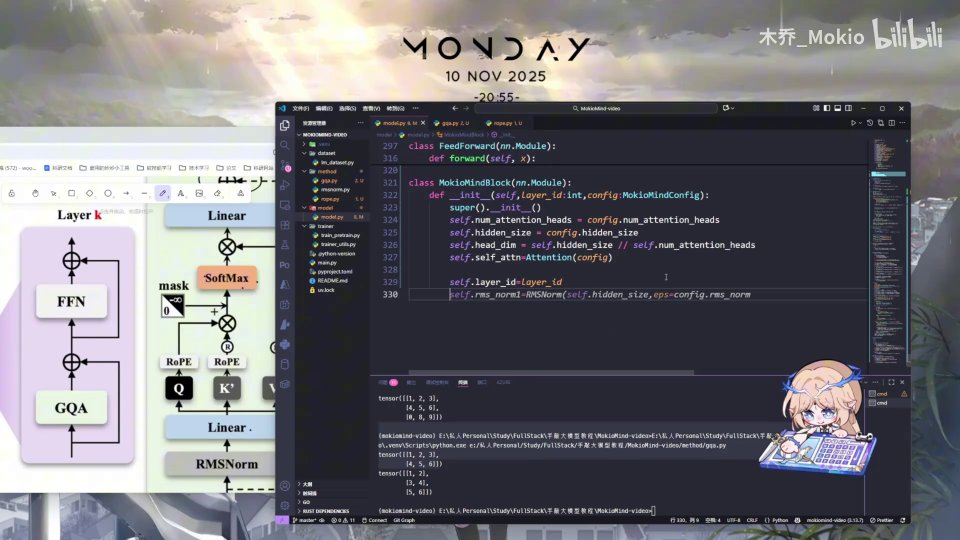 |
| 也就是在注意力这些拼完之后 [【跳转到 01:55】](https://www.bilibili.com/video/BV1T2k6BaEeC/?p=16&t=115) | 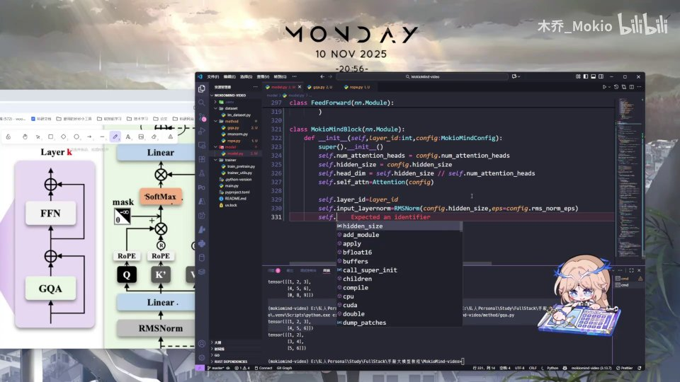 |
| 这里还有一个 layernorm，我们同样用 RMSNorm 来实现归一化。 [【跳转到 02:03】](https://www.bilibili.com/video/BV1T2k6BaEeC/?p=16&t=123) | 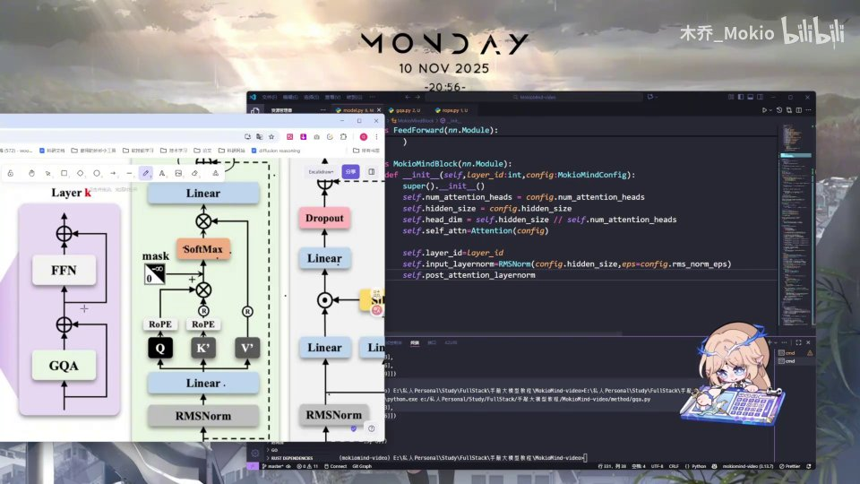 |
| 和上面一样。然后我们还有一个 MLP 层，其实也就是 FeedForward 层，把它实例化出来。这些就是我们前面写的 Attention、RMSNorm 和 FeedForward。接下来就是 nn.Module 必须实现的 forward（前向传播），我们来实现一下：self，然后是 hidden_states [【跳转到 02:08】](https://www.bilibili.com/video/BV1T2k6BaEeC/?p=16&t=128) |  |
| hidden_states（隐藏态），然后 position，然后 past_key_value 等参数默认值为 None，use_cache 默认值为 false，还有我们要用到的 attention_mask。 [【跳转到 02:33】](https://www.bilibili.com/video/BV1T2k6BaEeC/?p=16&t=153) |  |
| 然后这里我们首先做一次残差。这里的残差，就是先把最初的 input hidden_states 存一下 [【跳转到 02:58】](https://www.bilibili.com/video/BV1T2k6BaEeC/?p=16&t=178) |  |
| 这里存的也就是我们输入的 hidden_states。 [【跳转到 03:21】](https://www.bilibili.com/video/BV1T2k6BaEeC/?p=16&t=201) |  |
| 存好之后，我们把 hidden_states 和 present 的 key、value，也就是去应用一下我们的 Attention 层。这个 Attention 层就是前面定义的 Attention，它需要传入什么呢？需要传入 input_layernorm [【跳转到 03:28】](https://www.bilibili.com/video/BV1T2k6BaEeC/?p=16&t=208) |  |
| 它是套在 hidden_states 外面的；然后需要传入 position_embeddings，需要传入 past_key_value，需要传入 use_cache，需要传入 attention_mask。这些就是前面 Attention 层里用到的那些参数。 [【跳转到 03:53】](https://www.bilibili.com/video/BV1T2k6BaEeC/?p=16&t=233) | 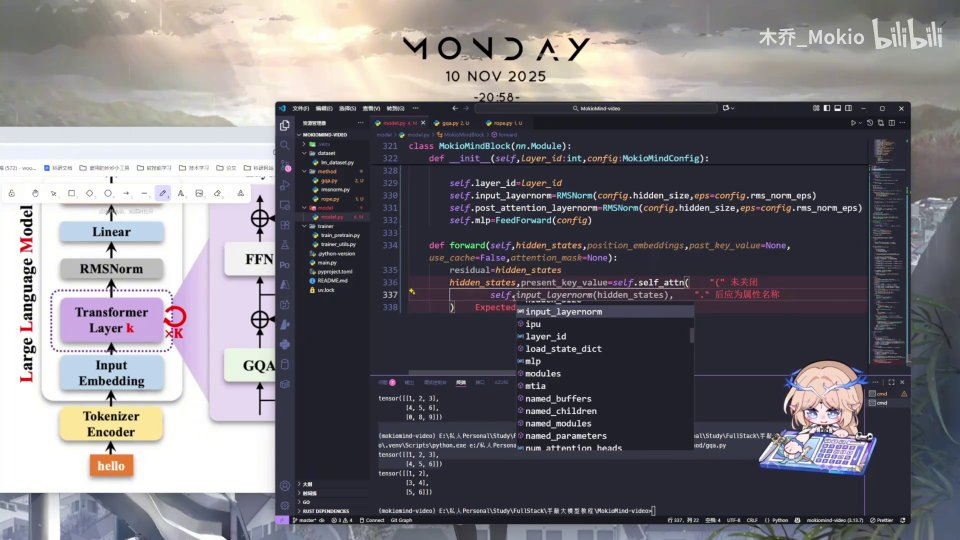 |
| Attention 层里所需要的那些参数，我们都给它传进来——Attention 的 forward 需要什么参数，我们全都传进来。传进来之后，经过 Attention 应用完，我们得到现在的 key、value，还有经过 Attention 处理之后的隐藏态；然后我们让这个 hidden_states 做一次残差处理，也就是把原本的 hidden_states [【跳转到 04:18】](https://www.bilibili.com/video/BV1T2k6BaEeC/?p=16&t=258) | 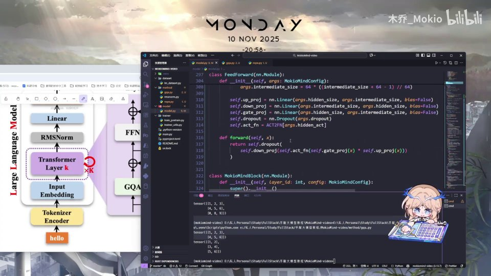 |
| 加到 Attention 处理之后的结果上。 [【跳转到 04:43】](https://www.bilibili.com/video/BV1T2k6BaEeC/?p=16&t=283) |  |
| 然后我们再进行一个简单的操作：hidden_states 等于 hidden_states 再加上经过 FeedForward 处理之后的结果。这里我们需要传入 post_attention_layernorm，其实也是 RMSNorm，然后传入 hidden_states。最后我们再把这个 hidden_states 和现在的 present key、value 返传出去就可以了。 [【跳转到 04:48】](https://www.bilibili.com/video/BV1T2k6BaEeC/?p=16&t=288) |  |
| 那么这个 Block 的实现就非常简单：把原本的 hidden_states 传过来 [【跳转到 05:13】](https://www.bilibili.com/video/BV1T2k6BaEeC/?p=16&t=313) |  |
| 用上 Attention 之后做残差处理，然后 FFN 层再残差处理，就是这么简单的一个实现。 [【跳转到 05:19】](https://www.bilibili.com/video/BV1T2k6BaEeC/?p=16&t=319) |  |
| 那么下一 part，我们来正式把完整的模型 module 搭建出来，也就是左边这一大块，完整搭建出来 [【跳转到 05:26】](https://www.bilibili.com/video/BV1T2k6BaEeC/?p=16&t=326) | 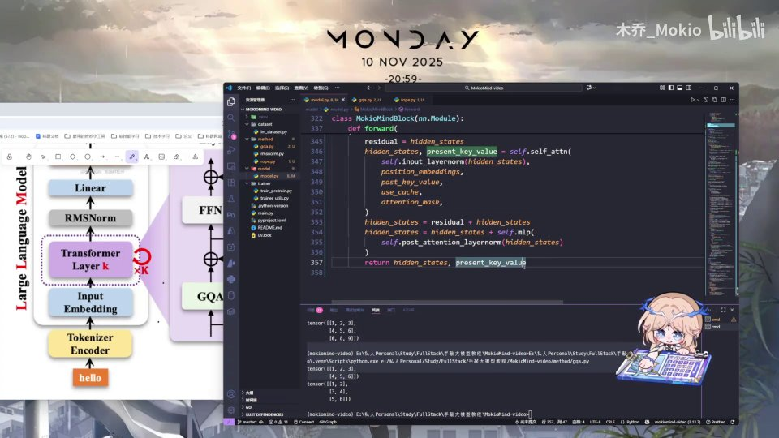 |
| 我们整个模型呢，就已经算是搭建成功了 [【跳转到 05:32】](https://www.bilibili.com/video/BV1T2k6BaEeC/?p=16&t=332) | 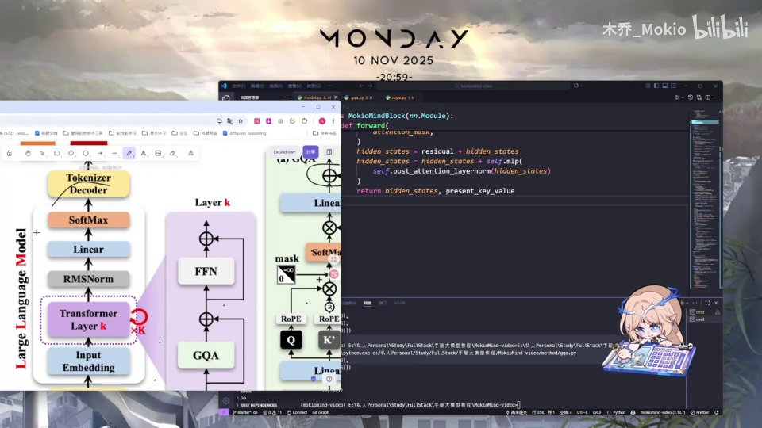 |
| 好，那我们下一 part 见 [【跳转到 05:37】](https://www.bilibili.com/video/BV1T2k6BaEeC/?p=16&t=337) | 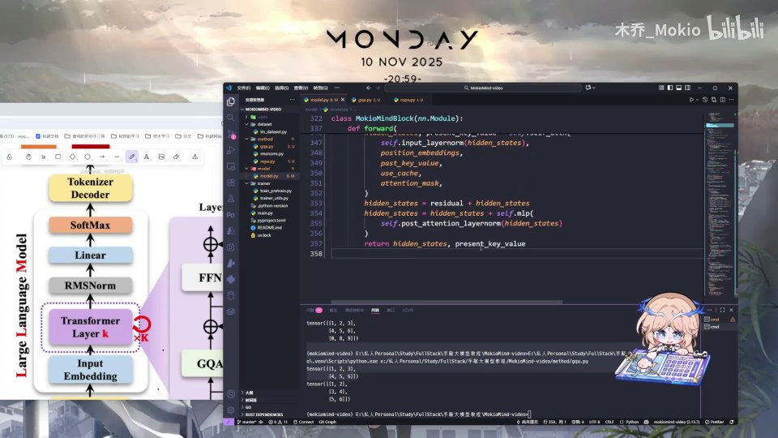 |
| （此区间无字幕） [【跳转到 05:42】](https://www.bilibili.com/video/BV1T2k6BaEeC/?p=16&t=342) | 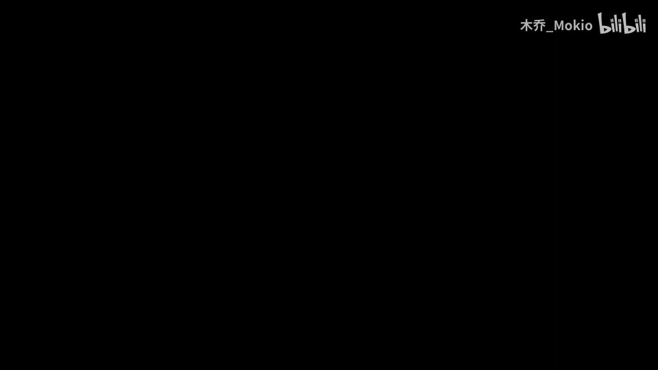 |