# 组装：Model 原始文稿（图-字幕分栏）

| 字幕文本 | 画面 |
| :--- | ---: |
| 好，最激动人心的时刻就来了。我们把前面编写的 Block、feed forward、attention，包括前面写的预计算的那些所有东西都应用起来，我们来编写一个完整的模型。好。 [【跳转到 00:00】](https://www.bilibili.com/video/BV1T2k6BaEeC/?p=17&t=0) | 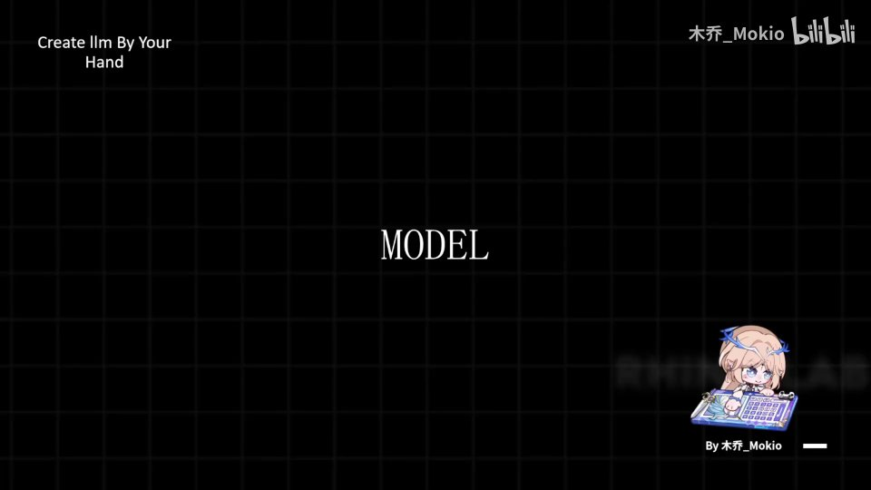 |
| 那么首先我们把图放在左边。 [【跳转到 00:12】](https://www.bilibili.com/video/BV1T2k6BaEeC/?p=17&t=12) | 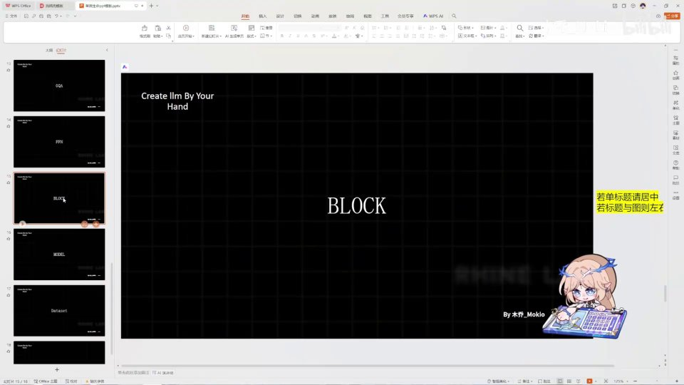 |
| 我们对照着来写就可以。那么整个模型呢，依旧是一个 nn.Module。 [【跳转到 00:17】](https://www.bilibili.com/video/BV1T2k6BaEeC/?p=17&t=17) | 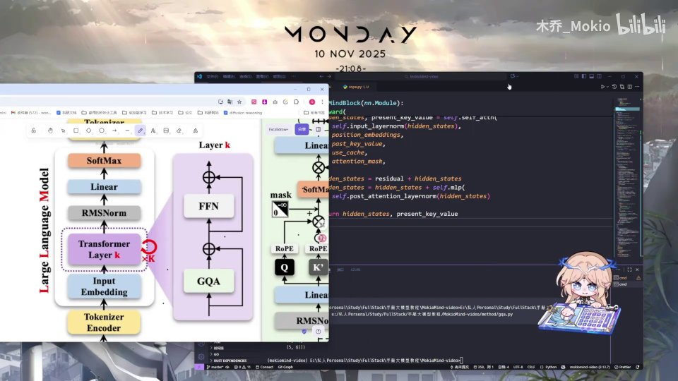 |
| 我们来叫 MiniMindModel，我们依旧让它继承 nn.Module 类，然后依旧对类进行一个初始化，Config 继承我们的 MiniMindConfig。在初始化里对父类进行一个构造函数的初始化，初始化我的 Python 模块。 [【跳转到 00:22】](https://www.bilibili.com/video/BV1T2k6BaEeC/?p=17&t=22) | 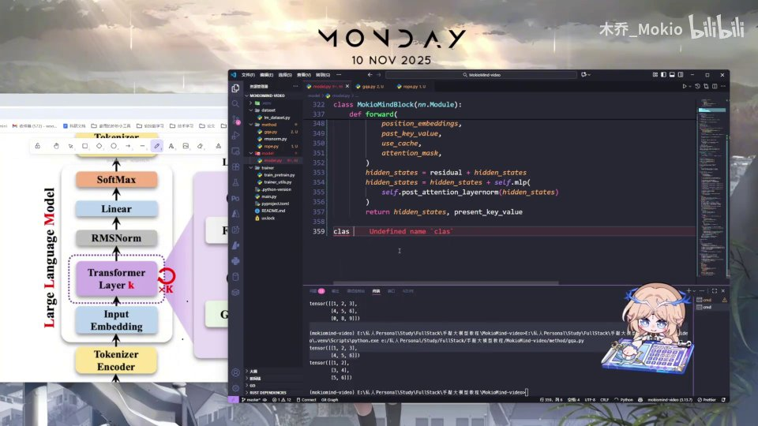 |
| 然后呢，因为在最后一步这里，我们需要把我们得到的 hidden state 来映射到整个词表的大小上嘛。 [【跳转到 00:47】](https://www.bilibili.com/video/BV1T2k6BaEeC/?p=17&t=47) | 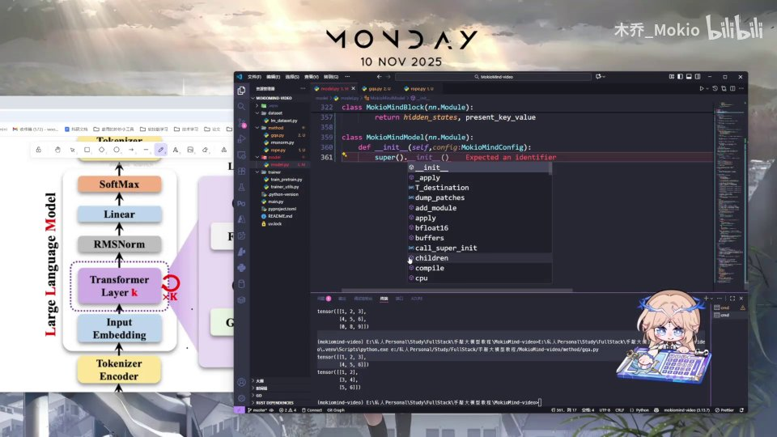 |
| 所以我们这里先去把我们的词表大小。 [【跳转到 00:56】](https://www.bilibili.com/video/BV1T2k6BaEeC/?p=17&t=56) |  |
| OK，vocab_size、hidden_size 等相关尺寸，从我们的参数里给取出来。好，我们取出来之后，然后我们需要把前面这里把 token 值转化为向量。 [【跳转到 01:01】](https://www.bilibili.com/video/BV1T2k6BaEeC/?p=17&t=61) | 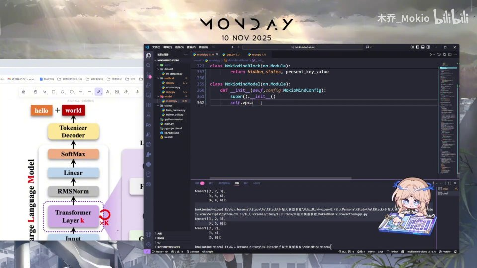 |
| 这个部分我们去做一下。 [【跳转到 01:23】](https://www.bilibili.com/video/BV1T2k6BaEeC/?p=17&t=83) | 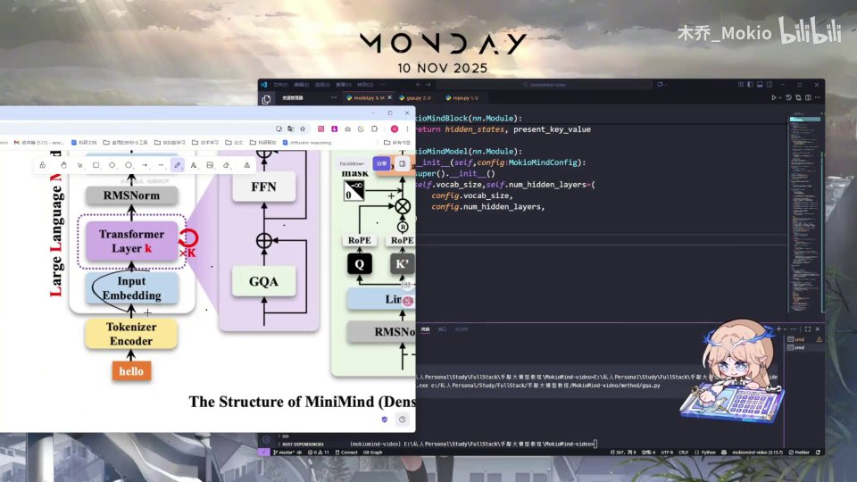 |
| embedding，tokens 等于 nn.Embedding，那这个呢就比较简单，我就没有单列出来去讲了。它的作用就是把输入的一个——它需要去输入一个词表大小、一个嵌入维度，来把每个 token 都转化为一个对应的、一个稠密的向量。 [【跳转到 01:28】](https://www.bilibili.com/video/BV1T2k6BaEeC/?p=17&t=88) | 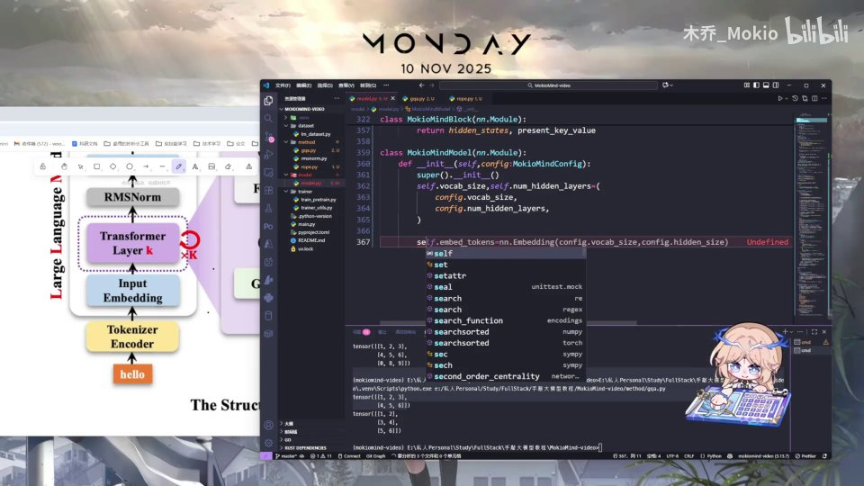 |
| OK，大家都这样，只需要知道经过这一层之后我们的 id 就会变成一个向量了。然后呢我们再定义一个 Dropout 层，等于 nn.Dropout，和之前一样定义一个 Dropout 层。然后呢我们需要把中间的定义一个——嗯，中间的 layer，来用一个 nn.ModuleList 来 ModuleList。 [【跳转到 01:53】](https://www.bilibili.com/video/BV1T2k6BaEeC/?p=17&t=113) |  |
| 顾名思义就是 nn.Module，但它是一个列表嘛，也就是说它是把多个 layer 给放到一起的。那么我们用 MiniMindBlock、config，for _ in range。 [【跳转到 02:18】](https://www.bilibili.com/video/BV1T2k6BaEeC/?p=17&t=138) | 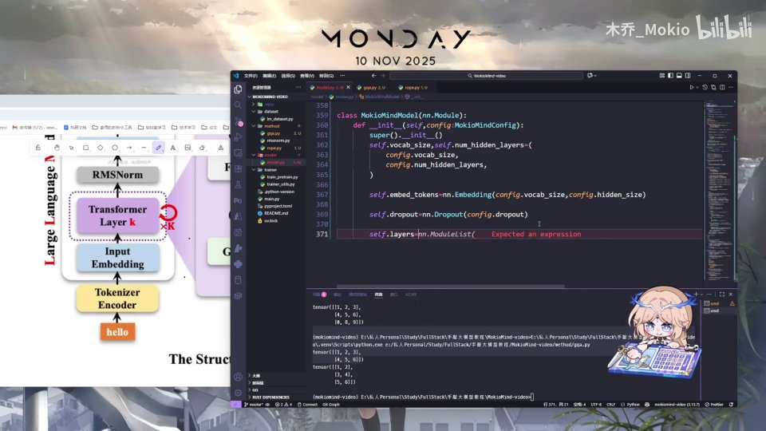 |
| 就是我们隐藏层有多少层，那我们就在中间插入这个，有重复 K 次嘛。 [【跳转到 02:43】](https://www.bilibili.com/video/BV1T2k6BaEeC/?p=17&t=163) | 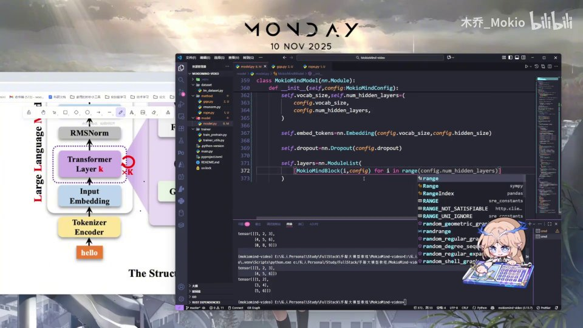 |
| 我们就在中间插入 K 个我们前面编写的 Block。然后我们依旧把 norm 层来简单写一下。 [【跳转到 02:48】](https://www.bilibili.com/video/BV1T2k6BaEeC/?p=17&t=168) |  |
| 然后接下来这些呢，这一步呢是优化，也就是 RPE 预计算。这样呢可以保证我们 RoPE 的所有旋转值是固定的，可以在计算的时候避免重复计算。我们直接来写一下，freqs_cos、freqs_sin 等于这个预计算。 [【跳转到 02:53】](https://www.bilibili.com/video/BV1T2k6BaEeC/?p=17&t=173) | 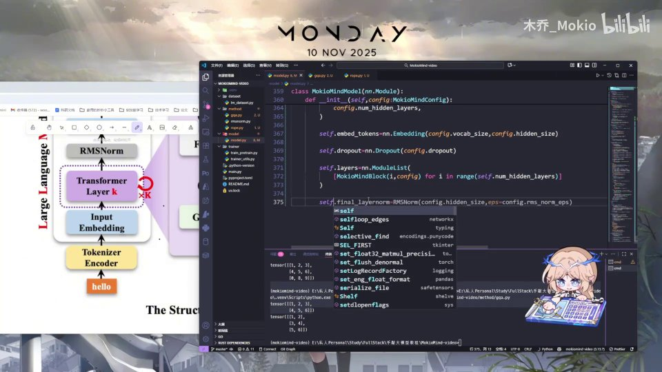 |
| 然后我们把东西都填进去，把东西都填进去，填进去之后呢，我们接下来需要一个用到一个 register_buffer，就注册一个缓冲区。大家都知道 nn.Parameter 是相当于给一个参数嘛，它会进行优化器更新；而 register_buffer 呢就是注册一个缓冲区。 [【跳转到 03:18】](https://www.bilibili.com/video/BV1T2k6BaEeC/?p=17&t=198) |  |
| 它不会更新，但是会随着模型去保存和加载。唉，然后呢我们这些都做好之后，我们就继续把 forward 这个最中心的逻辑给做一下。首先依旧是 self，然后是我们的 input_ids，也就是在 tokenizer 之后，这里就是很多 id 嘛。 [【跳转到 03:43】](https://www.bilibili.com/video/BV1T2k6BaEeC/?p=17&t=223) | 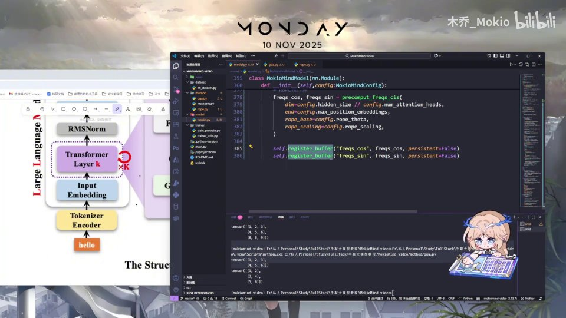 |
| 我们把这些 id 给输入到我们的前面的所有层里。 [【跳转到 04:07】](https://www.bilibili.com/video/BV1T2k6BaEeC/?p=17&t=247) |  |
| input_ids，然后它是一个 optional 的 torch.Tensor，然后等于 None，attention_mask、past_key_values 也是这样。 [【跳转到 04:12】](https://www.bilibili.com/video/BV1T2k6BaEeC/?p=17&t=252) |  |
| 然后就是 cache，一个 bool；然后是其他的，这个呢是接收到其他的任意变量，其他可能的关键词参数，这个主要是用于兼容性。唉，forward 写好之后我们就按照后面的逻辑往后写就可以。首先呢，我们依旧是把我们的输入的东西给解包出来，batch_size、seq_len 等于 input_ids 的 shape。 [【跳转到 04:37】](https://www.bilibili.com/video/BV1T2k6BaEeC/?p=17&t=277) |  |
| 你就把这个张量给解包。然后这里 if hasattr，这个是检查对象是否有属性的，past_key_values 它是否有 layers 的属性，这个是用来处理 HuggingFace 的格式兼容性问题，这个不需要太在意哦。 [【跳转到 05:02】](https://www.bilibili.com/video/BV1T2k6BaEeC/?p=17&t=302) |  |
| 跟着写就好，等于 None。然后接下来呢就是 past_key_values_length 等于 past_key_values_length，或者或者什么，乘以这。 [【跳转到 05:27】](https://www.bilibili.com/video/BV1T2k6BaEeC/?p=17&t=327) |  |
| 然后接下来是我们需要去计算当前生成的起始位置，就是 start_pos，因为我们每次都是基于当前生成的位置去进行生成嘛。我们首先需要去计算当前生成位置是什么样子，它可能是 past_key_values 的最初的。 [【跳转到 05:52】](https://www.bilibili.com/video/BV1T2k6BaEeC/?p=17&t=352) |  |
| shift 1，可能是在这个位置，如果它不为零的话；如果是零的话，那么就是从零的位置。因为如果有之前的 KV 的话，那么我们计算就是从之前 KV 的这一部分下一个来计算。 [【跳转到 06:17】](https://www.bilibili.com/video/BV1T2k6BaEeC/?p=17&t=377) |  |
| 如果不是——如果我们没有之前的 K 和 V 的话，那就说明我们在开头嘛，就是零。 [【跳转到 06:31】](https://www.bilibili.com/video/BV1T2k6BaEeC/?p=17&t=391) | 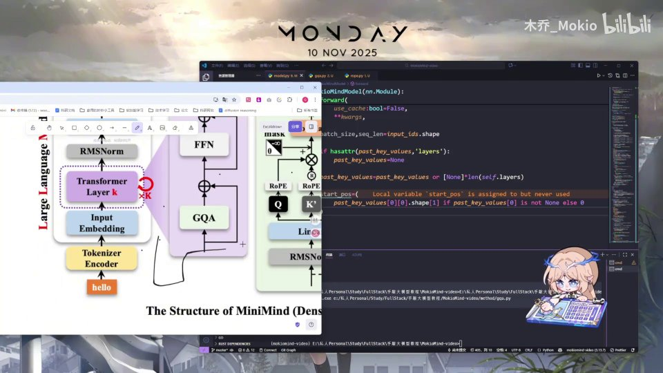 |
| 然后就是很简单的 hidden_states 等于 self.dropout，我们进行一个 dropout，我们对 input 的 id 进行一部分 dropout，来随机训练一部分神经元；然后这个 position embedding，他的位置编码，我们把两个 cos 和 sin 给用上。 [【跳转到 06:39】](https://www.bilibili.com/video/BV1T2k6BaEeC/?p=17&t=399) | 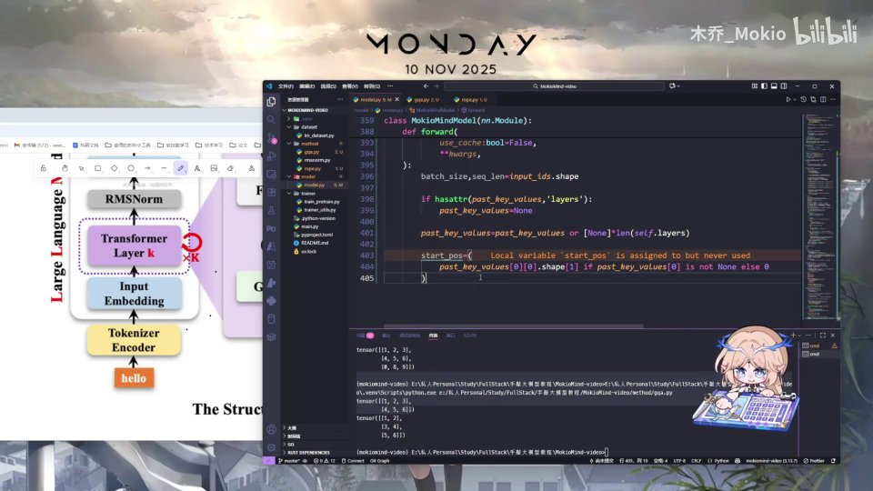 |
| 也就是说他要应用的位置编码就是从开始的位置到这个序列长度，保证他能成功地应用。然后我们创建一个最简单的 kv_cache 的缓存，用一个最简单的列表来实现。哎，然后 for layer。 [【跳转到 07:04】](https://www.bilibili.com/video/BV1T2k6BaEeC/?p=17&t=424) | 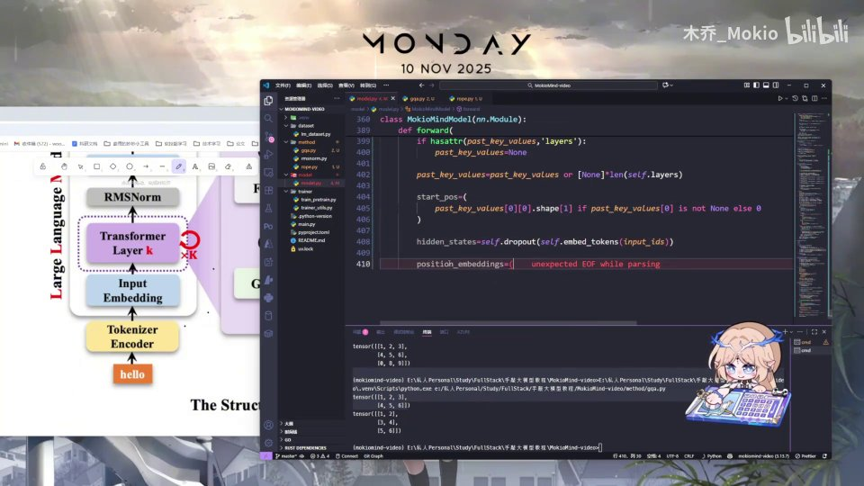 |
| 然后 layer，然后 past_key_values，past_key_values in enumerate，这个是 Python 的语法，将可迭代对象打包成元组迭代器，然后来返回我们的。 [【跳转到 07:29】](https://www.bilibili.com/video/BV1T2k6BaEeC/?p=17&t=449) | 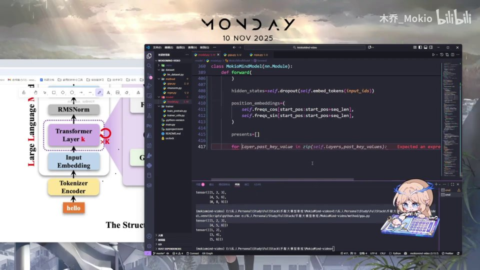 |
| 把 cache 嘛，对里面所有的 kv_cache 进行解包，hidden_states 和 past_key_value。我们的 present 等于就是 layer。 [【跳转到 07:54】](https://www.bilibili.com/video/BV1T2k6BaEeC/?p=17&t=474) | 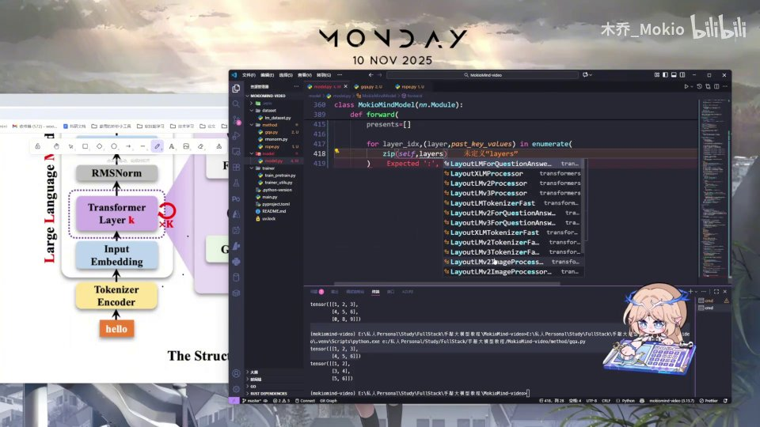 |
| 这个 layer 呢就是我们这里嘛，这一整层之间 K 次循环的 Block。嗯。 [【跳转到 08:19】](https://www.bilibili.com/video/BV1T2k6BaEeC/?p=17&t=499) | 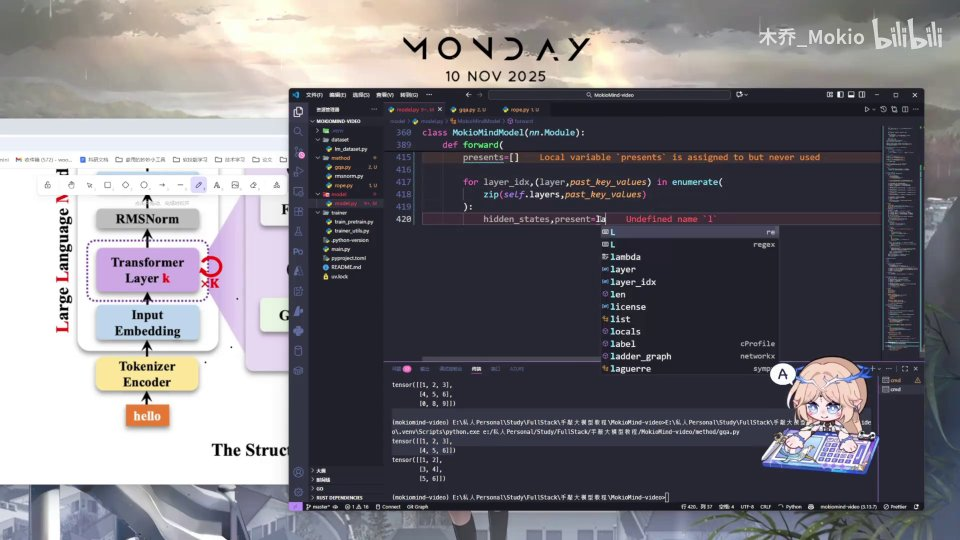 |
| 去输入 hidden_states，输入我们的位置编码。 [【跳转到 08:25】](https://www.bilibili.com/video/BV1T2k6BaEeC/?p=17&t=505) | 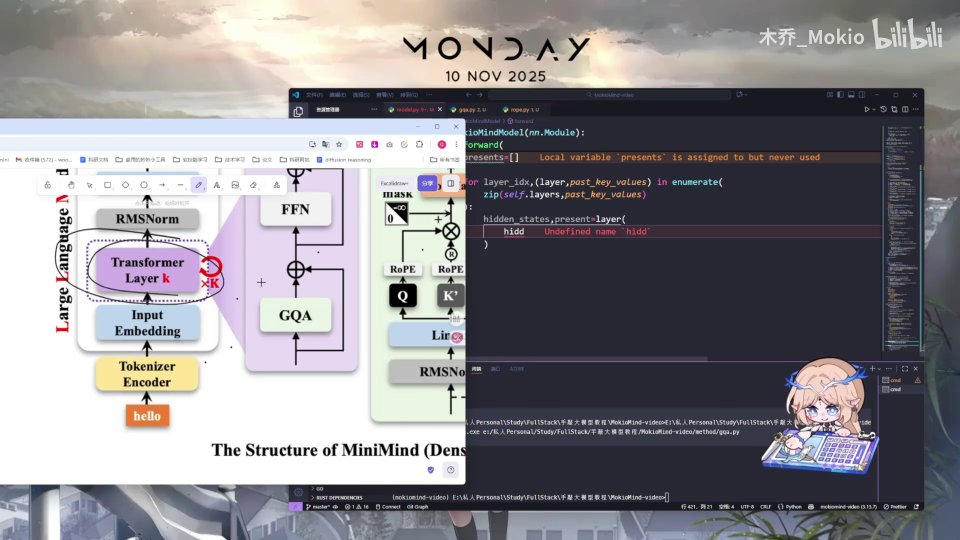 |
| 输我们的 past_key_value、use_cache、attention_mask 都输入进去之后，然后我们把现在的进行一个缓存，我们就进行一个最简单的缓存，把元素添加到末尾。然后呢我们哎就把进行一个最终的这个 RMSNorm 规划在前面。 [【跳转到 08:30】](https://www.bilibili.com/video/BV1T2k6BaEeC/?p=17&t=510) |  |
| input_embeddings 在这里处理之后。 [【跳转到 08:55】](https://www.bilibili.com/video/BV1T2k6BaEeC/?p=17&t=535) |  |
| 我们把输出的 hidden_states。 [【跳转到 09:00】](https://www.bilibili.com/video/BV1T2k6BaEeC/?p=17&t=540) |  |
| hidden_states 进行一个 norm 层的处理，那么从处理完之后，然后呢我们就相当于在这个 Linear 层进行一个处理。 [【跳转到 09:05】](https://www.bilibili.com/video/BV1T2k6BaEeC/?p=17&t=545) |  |
| 进行一个处理完之后就能输出到 softmax 层了吗？ [【跳转到 09:18】](https://www.bilibili.com/video/BV1T2k6BaEeC/?p=17&t=558) | 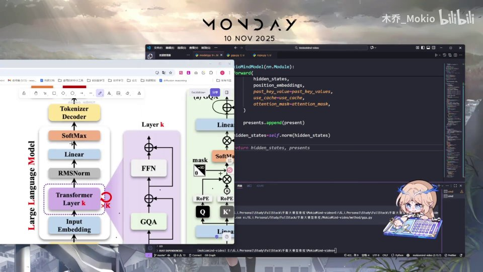 |
| 我们这里先不处理 Linear 操作，我们在后面的循环里再处理 present。好，那么我们整个 model 呢就是编写完毕了。对那个拉有我 say no。 [【跳转到 09:26】](https://www.bilibili.com/video/BV1T2k6BaEeC/?p=17&t=566) | 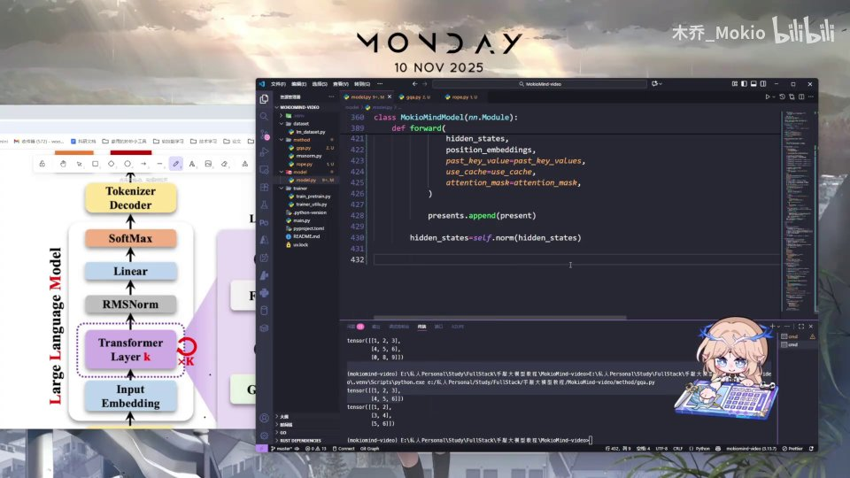 |
| Noneveragainso 哪有我 Soletanymore。好。 [【跳转到 09:51】](https://www.bilibili.com/video/BV1T2k6BaEeC/?p=17&t=591) | 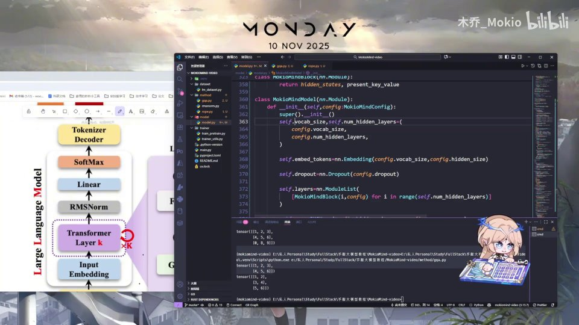 |
| 那么我们这里整个 model 也是编写完毕了，也就是一直到 RMSNorm 这一层。 [【跳转到 10:16】](https://www.bilibili.com/video/BV1T2k6BaEeC/?p=17&t=616) | 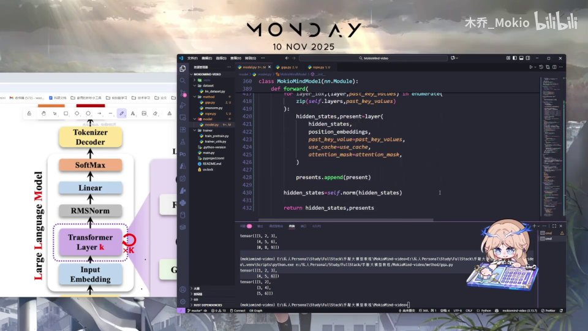 |
| 后面的 Linear 层和 softmax 层呢，我们在后面在 CausalLM 里去实现。 [【跳转到 10:22】](https://www.bilibili.com/video/BV1T2k6BaEeC/?p=17&t=622) | 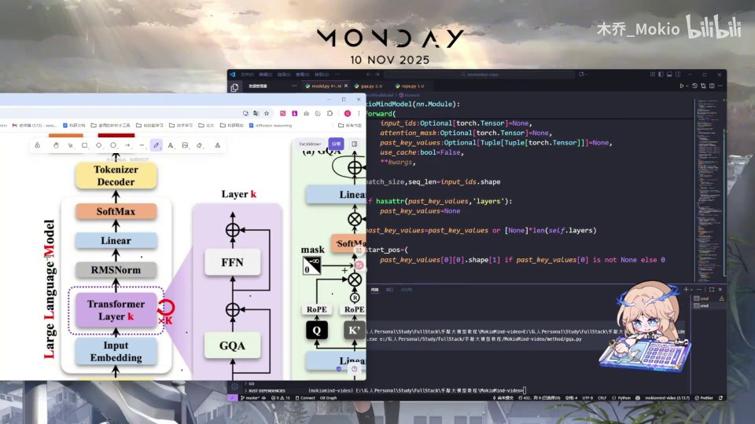 |
| 那么这个呢其实就已经是把我们相当于模型的主体框架给搭好了。我们再来理一下，就是首先呃初始化这些就不需要讲了。需要讲的就是这里我们需要把位置编码给预计算一下，然后让它呃注册一个缓冲区保存下来，再向前传播的过程中就按照这个过程来就好。我们首先计算一下它起始的位置，然后去进行呃在 to 输入的 token 这里进行一个 dropout。 [【跳转到 10:28】](https://www.bilibili.com/video/BV1T2k6BaEeC/?p=17&t=628) | 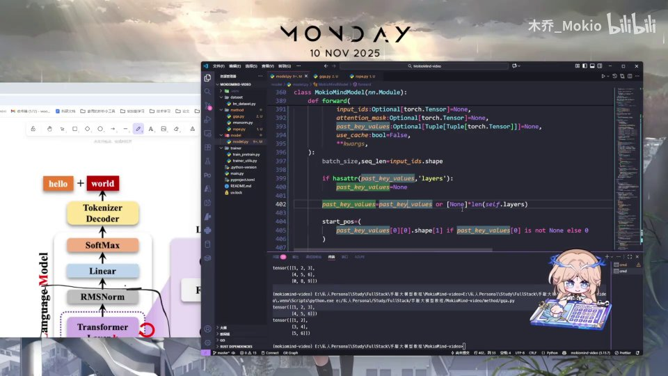 |
| （此区间无字幕） [【跳转到 10:53】](https://www.bilibili.com/video/BV1T2k6BaEeC/?p=17&t=653) | 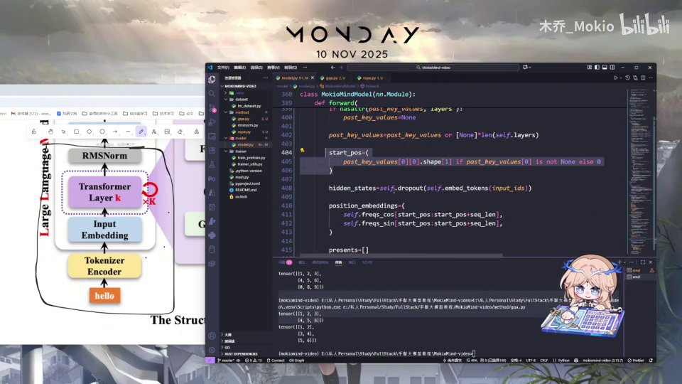 |
| 然后在 input_embeddings 这里去对它应用一个位置编码。 [【跳转到 10:58】](https://www.bilibili.com/video/BV1T2k6BaEeC/?p=17&t=658) | 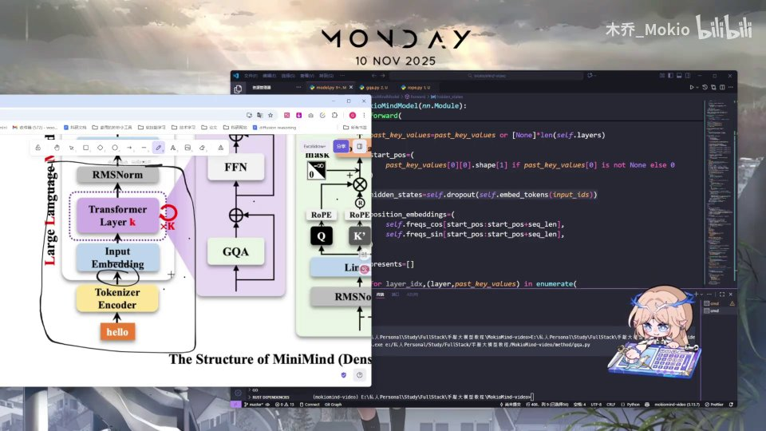 |
| 就是说在从开头到呃整个序列的结束去把这个位置编码给切出来，然后用一个 present 做一个简单的缓存，然后对每一层我们都进行一个 layer，也就是这里的 layer 进行一个处理。 [【跳转到 11:04】](https://www.bilibili.com/video/BV1T2k6BaEeC/?p=17&t=664) | 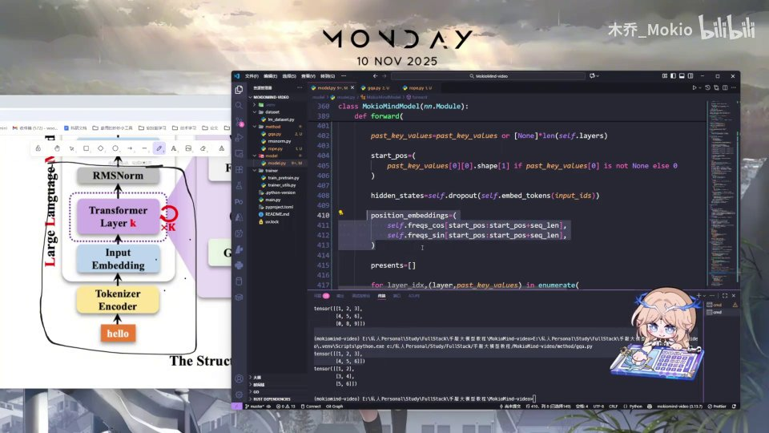 |
| 重复 K 次之后再把它就是每次都 append 的进去。 [【跳转到 11:22】](https://www.bilibili.com/video/BV1T2k6BaEeC/?p=17&t=682) | 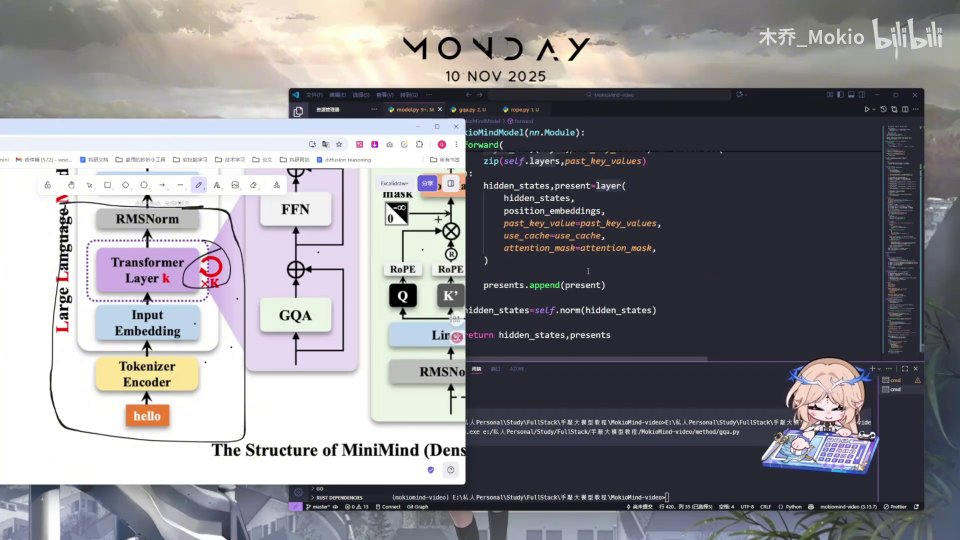 |
| 然后最后这个 hidden_states 经过 RMSNorm 处理之后再返回出来。那么下一块呢我们就真正的去把这个模型给封顶完成。好。 [【跳转到 11:27】](https://www.bilibili.com/video/BV1T2k6BaEeC/?p=17&t=687) |  |
| 那我们往我们下一趴见。 [【跳转到 11:35】](https://www.bilibili.com/video/BV1T2k6BaEeC/?p=17&t=695) | 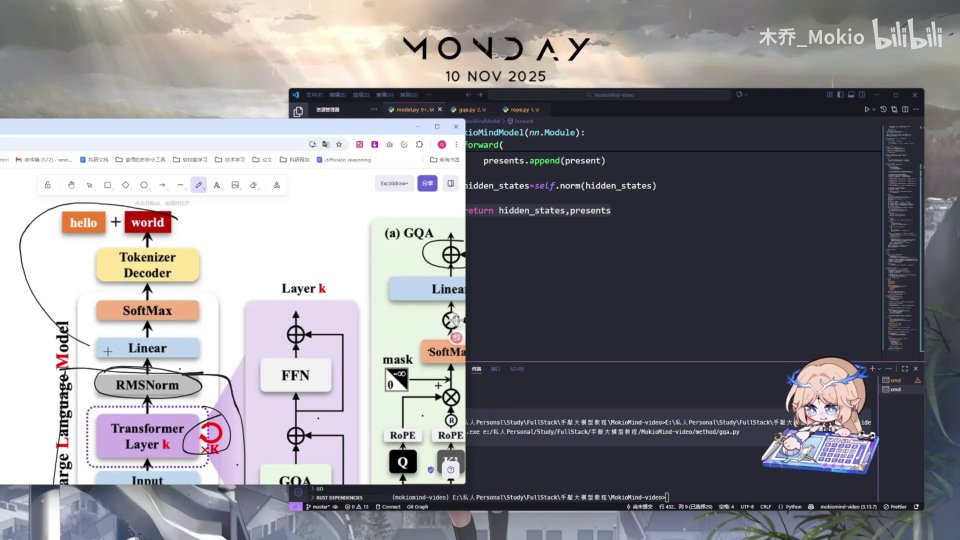 |