# 封装：CausalLM 原始文稿（图-字幕分栏）

| 字幕文本 | 画面 |
| :--- | ---: |
| 我们这一趴就来彻底完成整个模型的封装任务。如果说前面我们编写的是自己的 module， [【跳转到 00:00】](https://www.bilibili.com/video/BV1T2k6BaEeC/?p=18&t=0) |  |
| 它还是一个我们自己编写的模型的话，那么这一趴就是让它和 HuggingFace 所提供的一些类进行一个标准化， [【跳转到 00:06】](https://www.bilibili.com/video/BV1T2k6BaEeC/?p=18&t=6) | 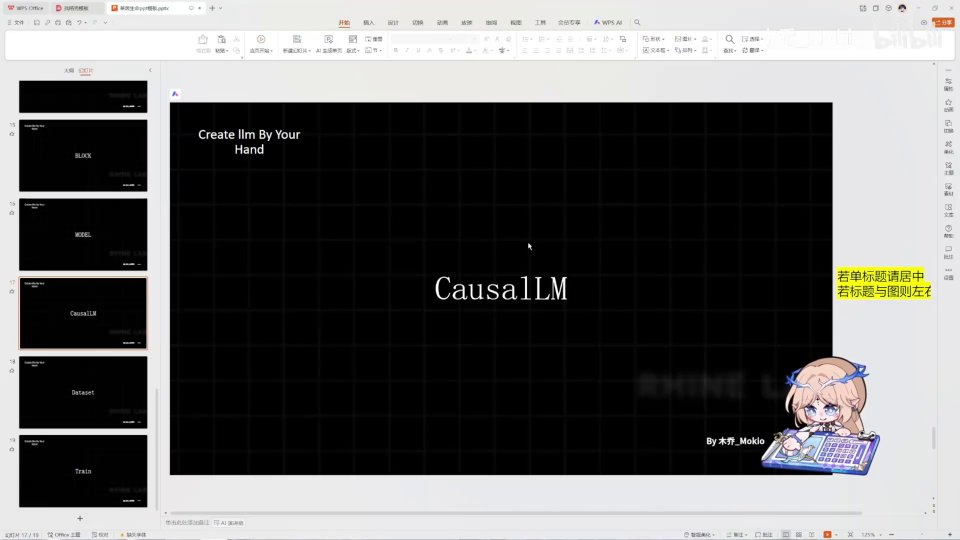 |
| 变成一个标准化的模型。那么首先，我们依旧是写一个 class，然后让它继承。一开始写的是 `nn.Module`， [【跳转到 00:11】](https://www.bilibili.com/video/BV1T2k6BaEeC/?p=18&t=11) | 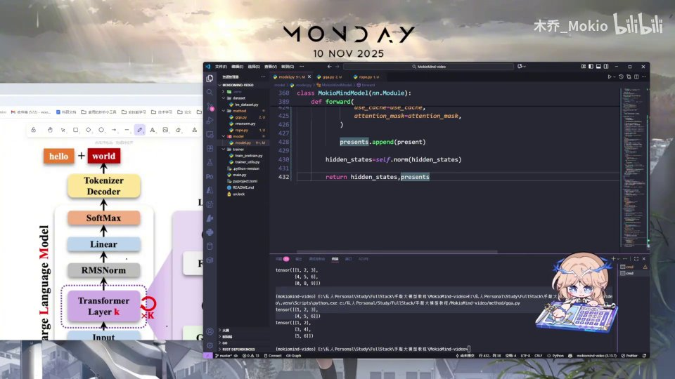 |
| 不对，不是 `nn.Module`，我们应该让它去继承 `PreTrainedModel` 和 `GenerationMixin`，这两个也是 HuggingFace 所提供的，我们把它导入进来。 [【跳转到 00:36】](https://www.bilibili.com/video/BV1T2k6BaEeC/?p=18&t=36) | 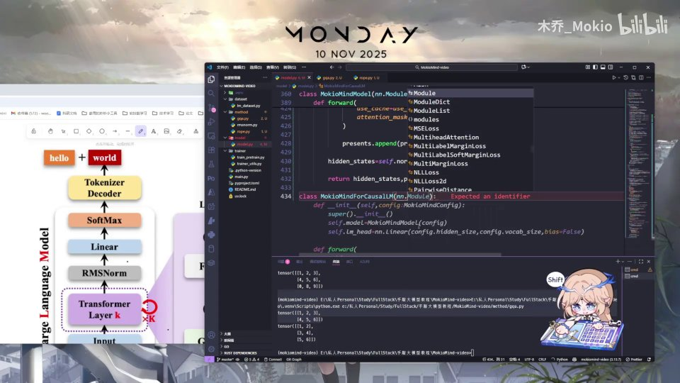 |
| 从 transformers 把它导进来。那么为什么要让它继承这两个类呢？因为这两个是 HuggingFace 内置的标准类，你可以理解为，网上你要上传的模型都需要继承这两个类。第一个类定义一个模型的基础标准，提供一些管理、配置的功能；第二个提供一个 generate 文本生成方法，这都是现代模型所需要具备的。 [【跳转到 01:01】](https://www.bilibili.com/video/BV1T2k6BaEeC/?p=18&t=61) |  |
| 其实就相当于把我们上面编写的模型标准化地封装了一层。`__init__` 里呢，传进来一个 config，然后初始化这个因果模型。我们首先需要把模型的 config 给填进来， [【跳转到 01:26】](https://www.bilibili.com/video/BV1T2k6BaEeC/?p=18&t=86) |  |
| 然后 `super().__init__(config)` 必须设在我们 `self.config = config` 之后，因为这个父类调用构造函数时，需要我们自己定义的模型的 config 信息。然后我们来实例化我们自己的模型 `self.model = MiniMindModel(config)`，把这个 config 传进去。 [【跳转到 01:51】](https://www.bilibili.com/video/BV1T2k6BaEeC/?p=18&t=111) |  |
| 然后就是我们的语言头 lm_head。这个语言头呢，就是我所说的，我们需要用一个 linear 层，把上面计算出的隐藏态映射到整个词表上，得到每个词的概率关系。所以我们用 `self.config.hidden_size` 映射到 `self.config.vocab_size` 上。 [【跳转到 02:16】](https://www.bilibili.com/video/BV1T2k6BaEeC/?p=18&t=136) |  |
| 然后我们依旧是不使用 bias（偏置）。这样呢，我们前面计算出的一个隐藏层就是一个 512 维的隐藏态向量， [【跳转到 02:41】](https://www.bilibili.com/video/BV1T2k6BaEeC/?p=18&t=161) | 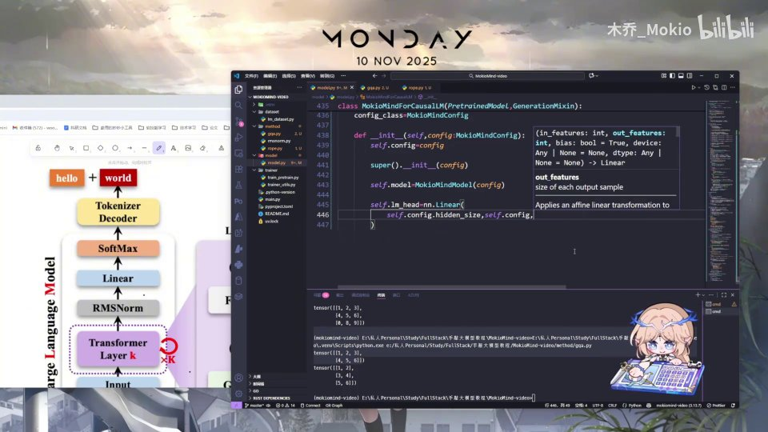 |
| 然后 512 维的隐藏态就能映射到我们一个 6400 个词的词表上，标示出这个词的概率是多少；经过 softmax 之后，就能标示出这个词的概率有多少，从而就能得到，比如 hello 这个词的概率。 [【跳转到 02:49】](https://www.bilibili.com/video/BV1T2k6BaEeC/?p=18&t=169) | 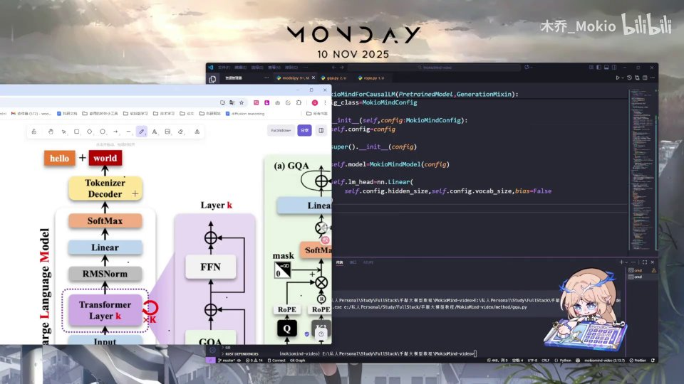 |
| `self.model.embed_tokens.weight = self.lm_head.weight`。这一步，我写完之后也来讲解一下它的用处。这一步用到了一个叫权重共享（weight tying）的概念：权重共享就是让我们最后输出层的权重和嵌入层的权重用同一个。 [【跳转到 03:08】](https://www.bilibili.com/video/BV1T2k6BaEeC/?p=18&t=188) | 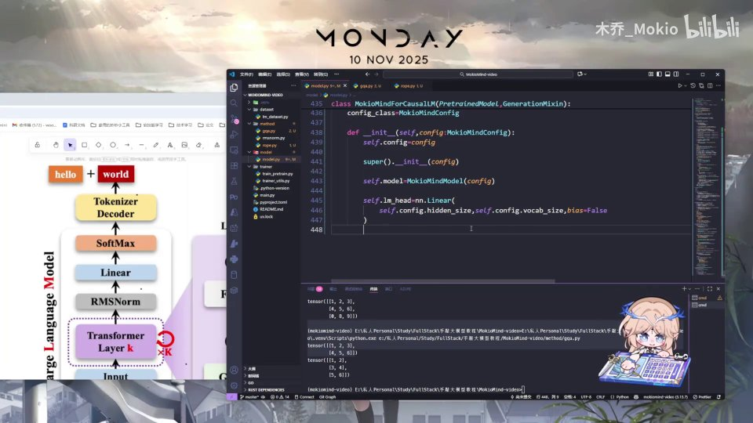 |
| 权重共享呢，能让我们避免再多计算一个 weight，也就是说在计算的时候能够更加简单，推理的时候也更加轻松。然后 `self.out`，我们定义一个具体的输出类， [【跳转到 03:33】](https://www.bilibili.com/video/BV1T2k6BaEeC/?p=18&t=213) | 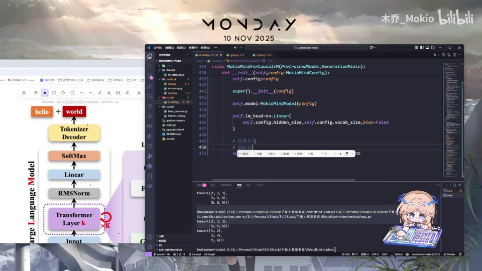 |
| 它应该等于一个 `CausalLMOutputWithPast`，这个呢是 HuggingFace 自己定义的一个输出类，它是用于封装模型的输出的，用来封装一些东西。 [【跳转到 03:58】](https://www.bilibili.com/video/BV1T2k6BaEeC/?p=18&t=238) |  |
| 它和 HuggingFace 本身是集成的。我们在前面也需要去导入：回到前面 import 这里，我们从 modeling_output 里来导入这个因果模型的输出，依旧是用 HuggingFace 自带的来进行标准化。然后呢，依旧是我们需要去实现一个 forward 方法。 [【跳转到 04:23】](https://www.bilibili.com/video/BV1T2k6BaEeC/?p=18&t=263) | 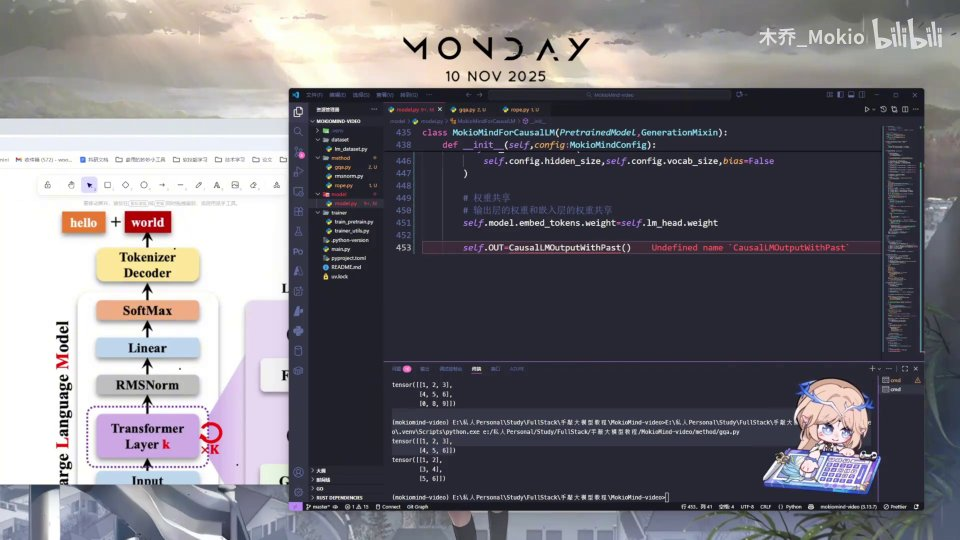 |
| `def forward(self, input_ids, attention_mask=None, ...)`，attention_mask 也是 optional 的。这里我先用 AI 生成一下这个函数签名，不过想偷一点懒，就先不详讲 AI 生成的部分。 [【跳转到 04:48】](https://www.bilibili.com/video/BV1T2k6BaEeC/?p=18&t=288) |  |
| 我们有 `past_key_values`，然后有 `use_cache`，还有 `logits_to_keep`——往往需要保存的 logits，我需要保留多少个位置的 logits 值。这个呢我们用 Union 来实现，`Union[...]`。我们在这里直接在文件开头进行导入。 [【跳转到 05:13】](https://www.bilibili.com/video/BV1T2k6BaEeC/?p=18&t=313) | 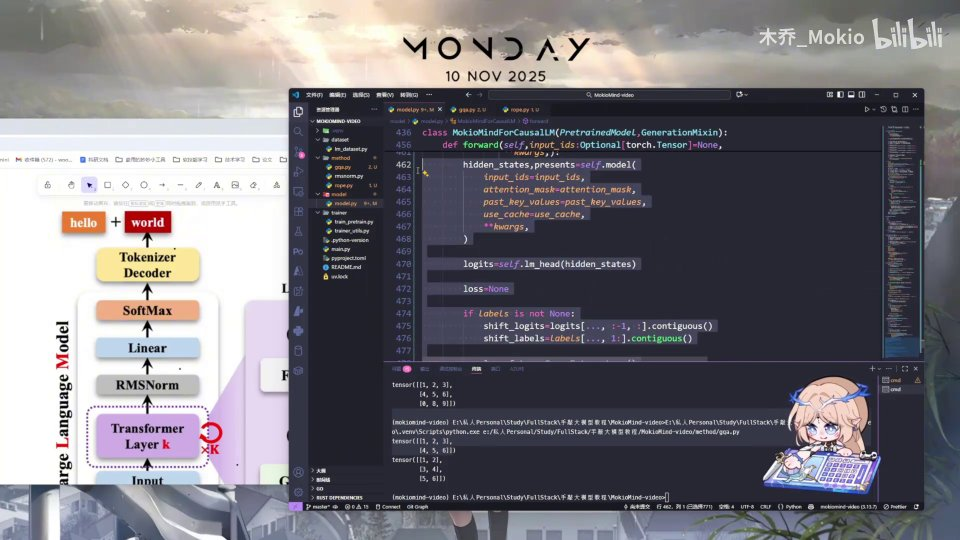 |
| 它的类型可以是 int，也需要一个 `torch.Tensor`。它的意思呢，是我们需要保留多少位的 logits；然后我们还能存入其他的一些参数。 [【跳转到 05:38】](https://www.bilibili.com/video/BV1T2k6BaEeC/?p=18&t=338) | 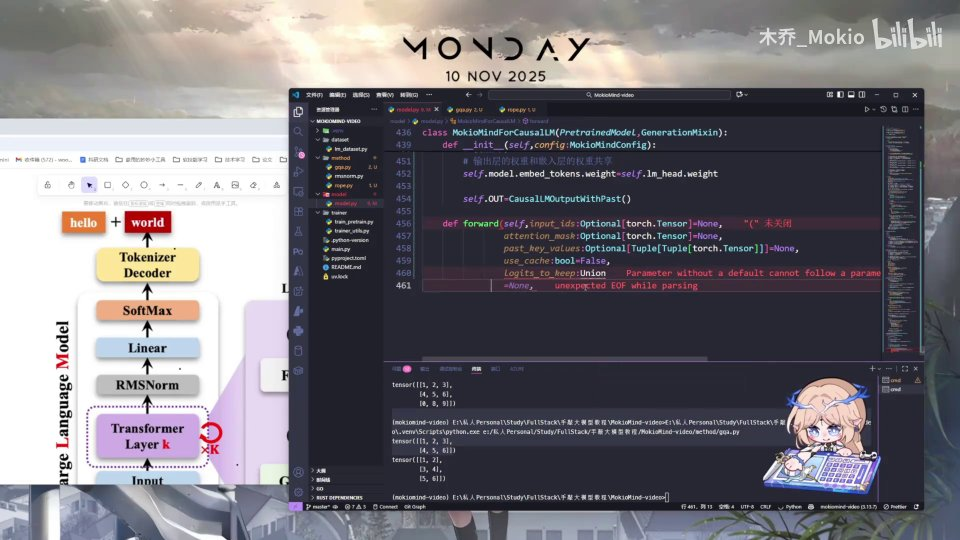 |
| 那么 Union 呢，我们在前面导入，把 Union 导进来。接下来我们就调用模型的 forward 方法：首先是依旧我们的 hidden_states，然后我们的 past 过去的 key 和 value（past_key_values），等于 `self.model(...)`。 [【跳转到 06:03】](https://www.bilibili.com/video/BV1T2k6BaEeC/?p=18&t=363) | 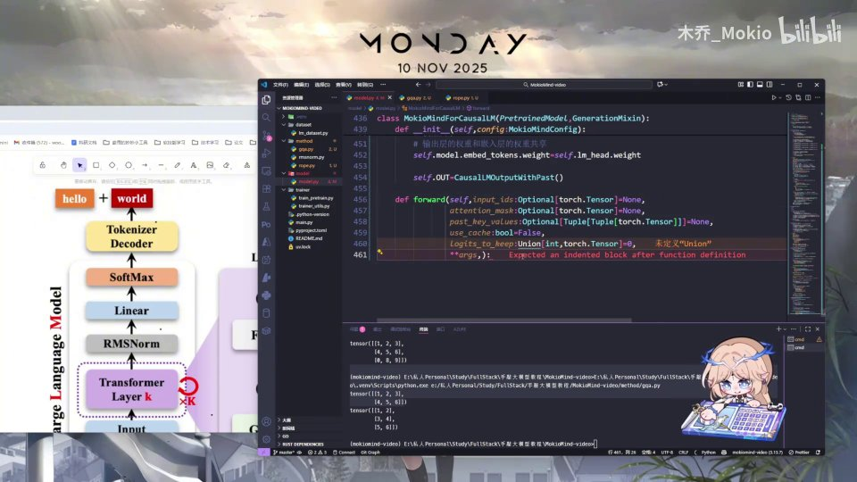 |
| 然后把东西都放进去，还有最后一个也放进去。放进去之后，这个就是经过前面所有模块计算所得到的结果。 [【跳转到 06:28】](https://www.bilibili.com/video/BV1T2k6BaEeC/?p=18&t=388) | 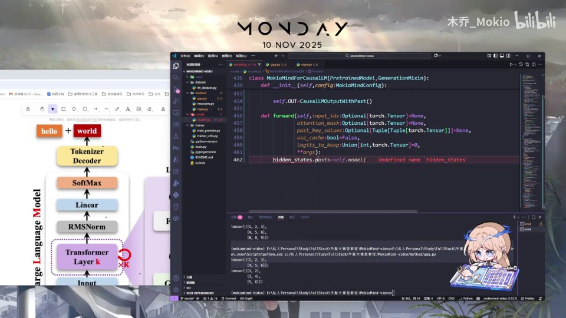 |
| 然后接下来呢，我们进行一个 slice（切片）。 [【跳转到 06:48】](https://www.bilibili.com/video/BV1T2k6BaEeC/?p=18&t=408) | 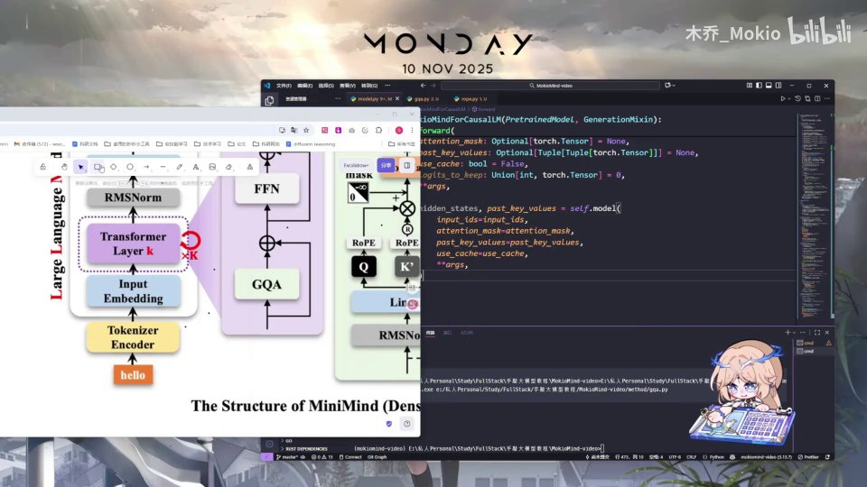 |
| `slice_indices = slice(-logits_to_keep, None)`，如果 `logits_to_keep` 是整数就用它，否则就直接用 logits_to_keep 来做切片。 [【跳转到 06:53】](https://www.bilibili.com/video/BV1T2k6BaEeC/?p=18&t=413) | 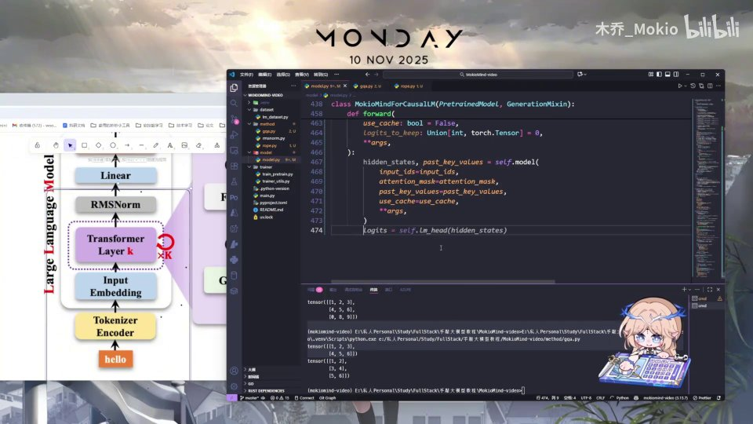 |
| 那这个的作用是什么呢？它的逻辑就是说，如果我们的 `logits_to_keep` 是整数，那就保留它最后 N 个，最后 N 个。 [【跳转到 07:18】](https://www.bilibili.com/video/BV1T2k6BaEeC/?p=18&t=438) |  |
| 比如说我们的 `logits_to_keep` 如果是一的话，那它就最后保留一个位置；如果是二，就保留最后第二个位置。那么这个作用呢，就是我们生成的时候只需要最后的 logits 来预测下一个 token。而如果说它不是 int 类型， [【跳转到 07:43】](https://www.bilibili.com/video/BV1T2k6BaEeC/?p=18&t=463) |  |
| 它是 Tensor 类型的话，那我就让 `logits_to_keep` 等于 0，来保留所有的位置。然后接下来就是我们进行 logits 的计算：`logits = self.lm_head(hidden_states[:, slice_indices, :])`，把 hidden_states 进行切片之后，最后计算出整个 logits。计算出 logits 之后，我们就能在后续的 tokenizer decoder 中把这个 logits 给解码， [【跳转到 08:08】](https://www.bilibili.com/video/BV1T2k6BaEeC/?p=18&t=488) | 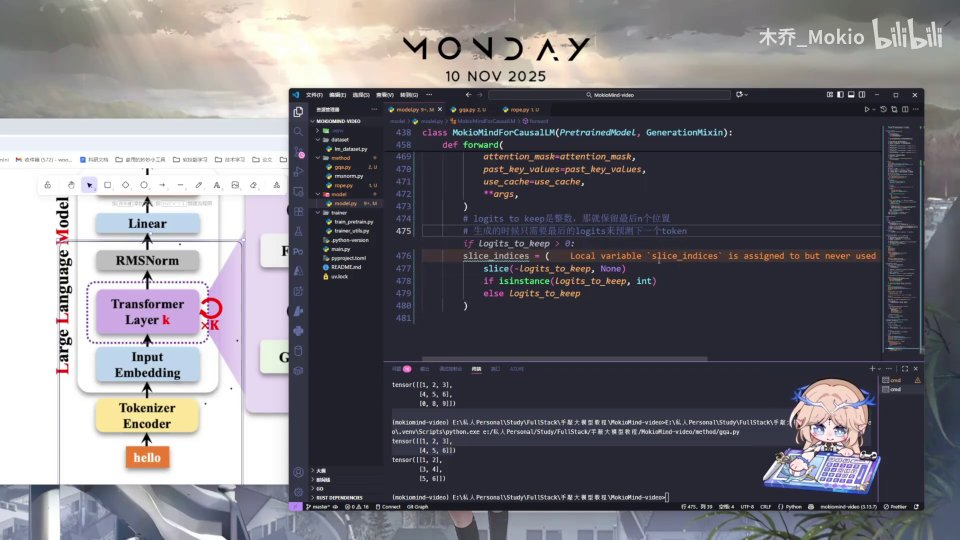 |
| 解码成一个 word（词）。 [【跳转到 08:33】](https://www.bilibili.com/video/BV1T2k6BaEeC/?p=18&t=513) | 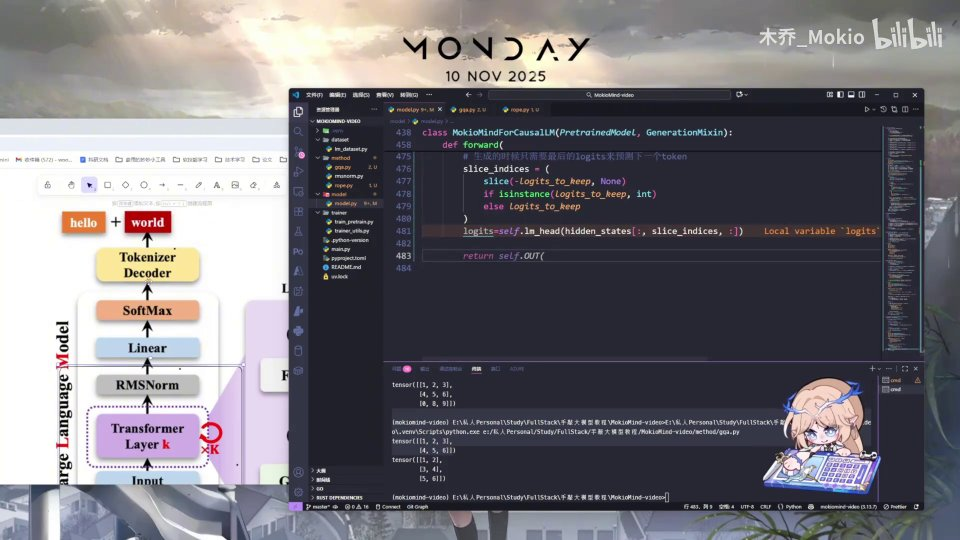 |
| 在模型训练的时候我们就不进行解码，在我们后面推理的时候才进行解码。 [【跳转到 08:38】](https://www.bilibili.com/video/BV1T2k6BaEeC/?p=18&t=518) | 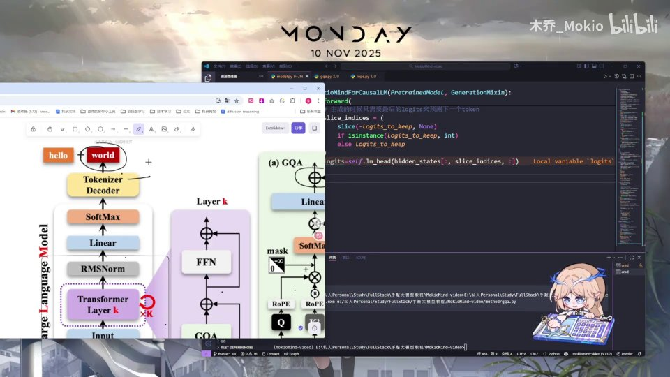 |
| 然后我们定义一下整个模型所需要输出的对象，它有哪些。首先呢是 `last_hidden_state`，等于 hidden_states；然后需要定义 logits；然后需要定义 past_key_values；最后我们输出一个 `self.out`。好，那经过这一块，我们主要讲解的就是把我们的模型和 HuggingFace 它自定义的一些类， [【跳转到 08:43】](https://www.bilibili.com/video/BV1T2k6BaEeC/?p=18&t=523) | 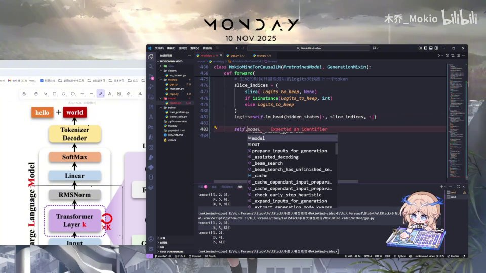 |
| 还有包括把它整个模型再进行一个完整的封装，包括加上 linear 和 softmax 层， [【跳转到 09:08】](https://www.bilibili.com/video/BV1T2k6BaEeC/?p=18&t=548) |  |
| 来让这个模型既能契合 HuggingFace，也就是契合我们网络上所有主流模型， [【跳转到 09:19】](https://www.bilibili.com/video/BV1T2k6BaEeC/?p=18&t=559) | 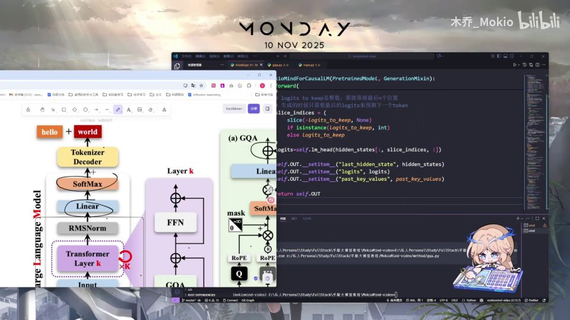 |
| 同时呢把最后两个方法给它加上去。好，那么至此，我们整个模型的编写就已经完成了。 [【跳转到 09:24】](https://www.bilibili.com/video/BV1T2k6BaEeC/?p=18&t=564) | 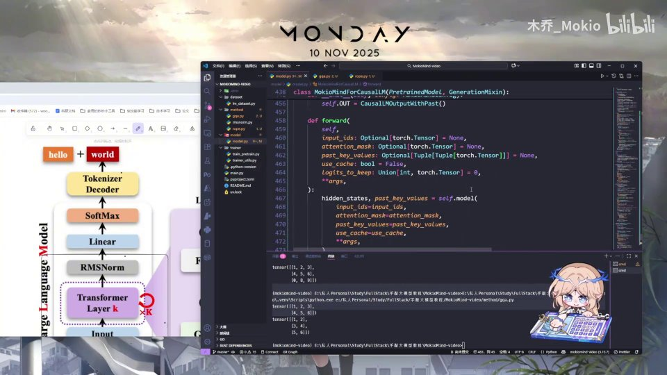 |
| 大家可以自行地再去从头到尾理解一下我们的模型是怎么编写的。 [【跳转到 09:33】](https://www.bilibili.com/video/BV1T2k6BaEeC/?p=18&t=573) | 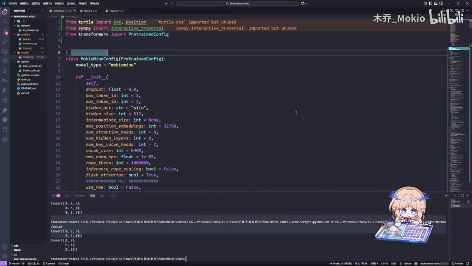 |
| 那么我们后面两趴呢，不会立马进入 Dataset 和训练的编写， [【跳转到 09:38】](https://www.bilibili.com/video/BV1T2k6BaEeC/?p=18&t=578) |  |
| 我带大家从头再来梳理一下整个模型的数据流动， [【跳转到 09:44】](https://www.bilibili.com/video/BV1T2k6BaEeC/?p=18&t=584) | 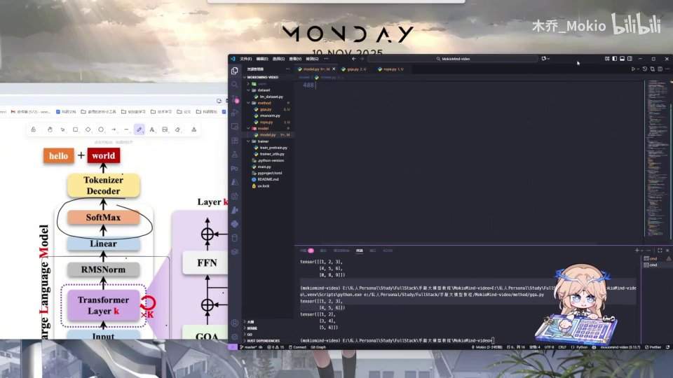 |
| 包括它的维度变化，来让大家更深入地理解一下这个模型。我们下 1 part 见。 [【跳转到 09:49】](https://www.bilibili.com/video/BV1T2k6BaEeC/?p=18&t=589) | 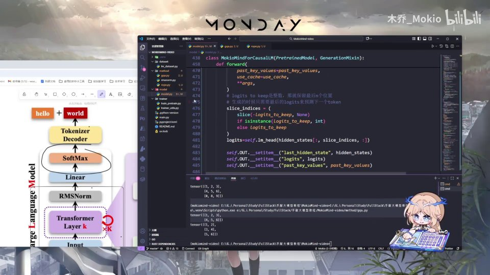 |