# 回顾与知识检验 原始文稿（图-字幕分栏）

| 字幕文本 | 画面 |
| :--- | ---: |
| 好，这一 part 呢，是我们之前把模型所有的代码都敲完之后，我们再来从头回顾一下我们前面所讲的所有知识，以及整个模型里数据和维度是怎么变化的。 [【跳转到 00:00】](https://www.bilibili.com/video/BV1T2k6BaEeC/?p=19&t=0) | 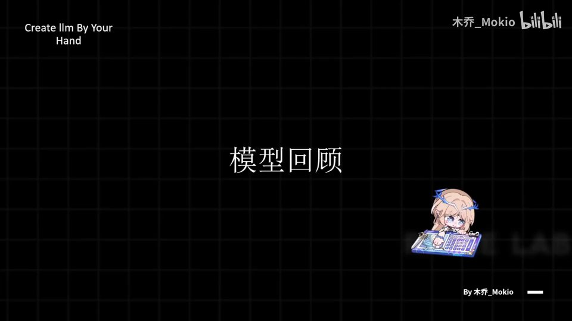 |
| 那首先我们再来看这张架构图。 [【跳转到 00:13】](https://www.bilibili.com/video/BV1T2k6BaEeC/?p=19&t=13) | 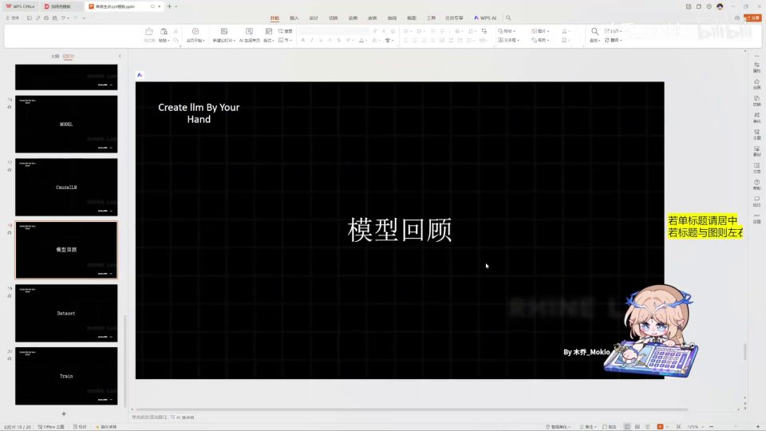 |
| 我们就大概可以理解了，因为前面的代码我们都敲过了嘛。我们先来把上面的知识再回顾一下：Residual 残差网络，它就是把最初的状态保存下来，然后加上最后的状态，能够缓解梯度消失问题，同时可以减少拟合的麻烦；RMSNorm 呢，它是归一化，让数据更加稳定，防止出现梯度爆炸或者梯度消失；然后是 RoPE 旋转位置编码。 [【跳转到 00:18】](https://www.bilibili.com/video/BV1T2k6BaEeC/?p=19&t=18) | 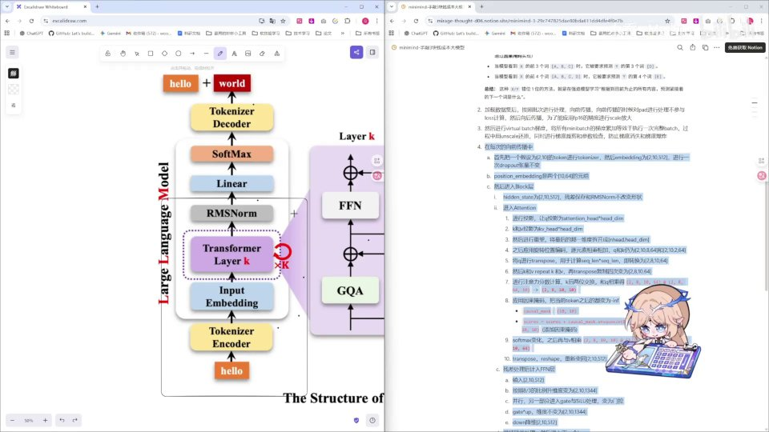 |
| 它就是通过一种巧妙的方式，实现了两个 token 的 Q、K 之间只由它们的相对位置 m 减 n 来决定；YaRN 呢，它是对 RoPE 的一个外推，也就是优化对于高低频的不同维度来进行不同的缩放，然后保证序列能够外推来处理。 [【跳转到 00:43】](https://www.bilibili.com/video/BV1T2k6BaEeC/?p=19&t=43) | 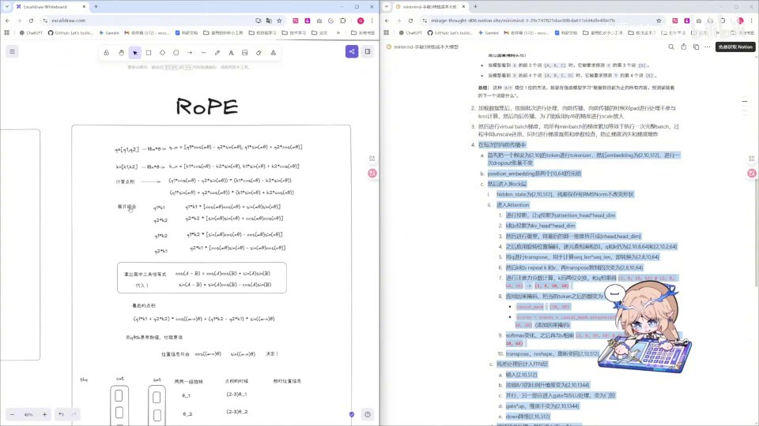 |
| 它比它能处理的还长的序列。然后呢就是 GQA，GQA 呢，attention 机制我就不必再过多赘述了，GQA 呢就是多个 Q 共享一组 K、V，那在我们前面编写 repeat_kv 的时候也知道了。然后这里呢就是激活函数，激活函数就是最基础的一部分内容，在 FFN 层实现。那么这个呢，再看这个架构图。 [【跳转到 01:08】](https://www.bilibili.com/video/BV1T2k6BaEeC/?p=19&t=68) |  |
| 应该是比较清晰明了了，因为我们在代码上也是从头到尾都敲过了。那么这一 part 呢，我建议你像我一样，在编写完之后自己用语言叙述一下整个的变化，然后看自己哪里还有不理解，然后再去弥补一下。那么这里有，嗯，我带大家过一遍：首先呢，我先不讲加载数据，包括训练这部分。 [【跳转到 01:33】](https://www.bilibili.com/video/BV1T2k6BaEeC/?p=19&t=93) | 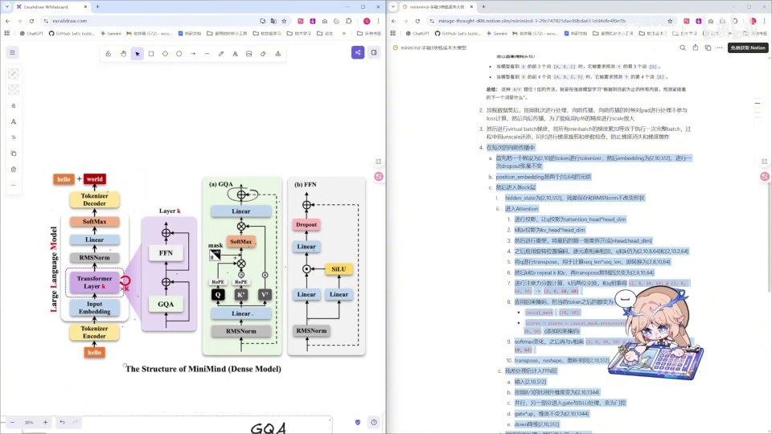 |
| 我们先从这里看，我们输入的一个 Embedding，在我们输入的一个 token 的 id，就比如某个数字嘛，它在经过向量处理之后，它的象征值比如说是 [2, 10, 512]，也就是你可以想象为一个长方体吗，或者说有 tensor 想象力的话，它是一个三维张量，每一个 id 都是 512 位，然后经过一次 dropout，在这里有一次 dropout。 [【跳转到 01:58】](https://www.bilibili.com/video/BV1T2k6BaEeC/?p=19&t=118) | 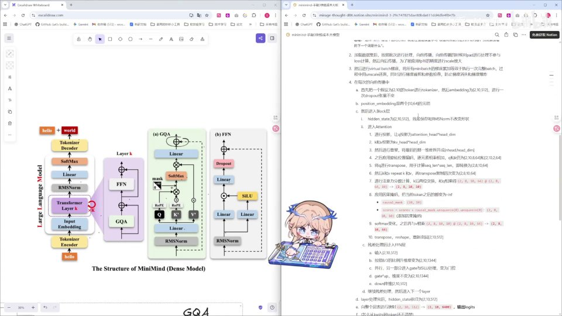 |
| 它的张量不变，然后 position embedding 是两个 (10, 64) 的元组。这里进入 block 层之后，首先 hidden state 一开始是 [2, 10, 512]，在这里呢我们进行一个 residual 的残差网络，把这个 hidden state 给存起来。 [【跳转到 02:23】](https://www.bilibili.com/video/BV1T2k6BaEeC/?p=19&t=143) | 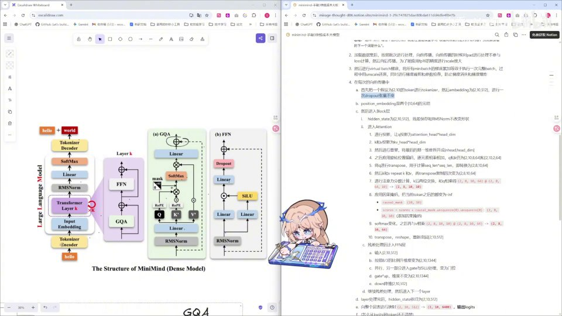 |
| 然后呢进入 attention 之后，首先投影 Q、K、V。 [【跳转到 02:43】](https://www.bilibili.com/video/BV1T2k6BaEeC/?p=19&t=163) | 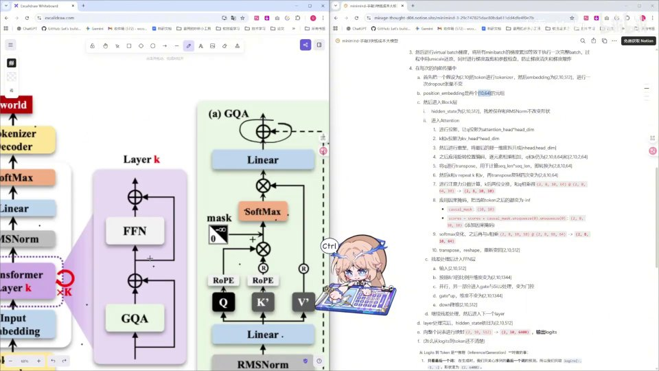 |
| 计算出 Q、K、V，然后在这里呢，我们投影之后需要把它进行重塑，重塑的话我们需要把原本的 512 给它重塑成 kv head 乘一个 head dim，也就是八个头，我们给它拆成 8×64。那么然后再对 Q 和 K 应用旋转位置编码，之后 Q 和 K 呢，它就是 [2, 8, 10, 64] 和 [2, 2, 10, 64]。 [【跳转到 02:48】](https://www.bilibili.com/video/BV1T2k6BaEeC/?p=19&t=168) | 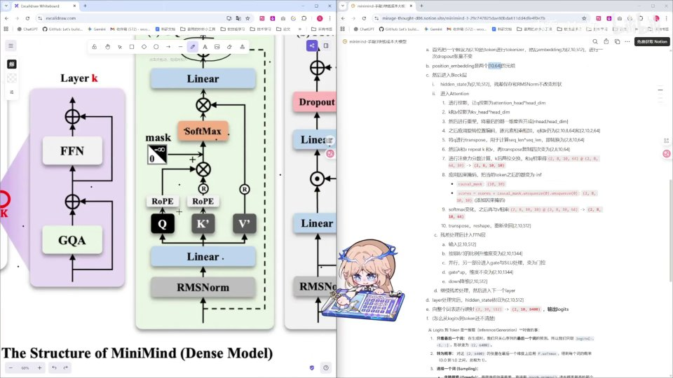 |
| 因为 K 和 V 它是要重复四份嘛，之后对它们进行一个 transpose 进行一个维度变化，我们把它的序列维度放到后面，嗯，然后就是把它转化成 [2, 8, 10, 64]，我们把 head 放到前面，然后呢把 K 和 V 进行 repeat_kv，在 transpose 4 次之后也变成 [2, 8, 10, 64]。 [【跳转到 03:13】](https://www.bilibili.com/video/BV1T2k6BaEeC/?p=19&t=193) | 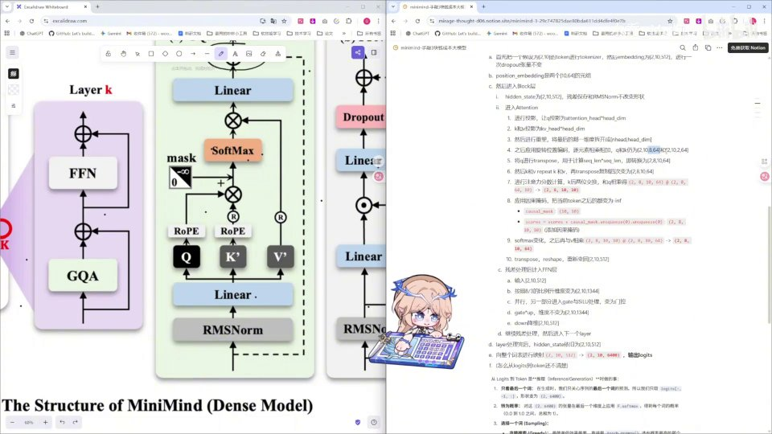 |
| 进行注意力分数计算，和 Q 相乘，然后得到一个这样的 [2, 8, 10, 10] 的张量，然后应用因果编码，也就是应用一个 softmax 的掩码，然后把它变成一个 [2, 8, 10, 10]，但是它的整个矩阵的下半部分已经全部变成负无穷大了，softmax 变换之后，被掩码的部分变成零。 [【跳转到 03:38】](https://www.bilibili.com/video/BV1T2k6BaEeC/?p=19&t=218) |  |
| 其他部分变成一个和为一的一个概率部分，就是最大值为一的一个概率部分，然后再与 V 相乘，相乘之后得到一个 [2, 8, 10, 10] 和 [2, 8, 10, 64] 相乘，得到一个 [2, 8, 10, 64] 的一个矩阵张量，这个张量经过 transpose 把 8 和 10 再交换过来，之后再 reshape，让 8 和 64 再相乘。 [【跳转到 04:03】](https://www.bilibili.com/video/BV1T2k6BaEeC/?p=19&t=243) | 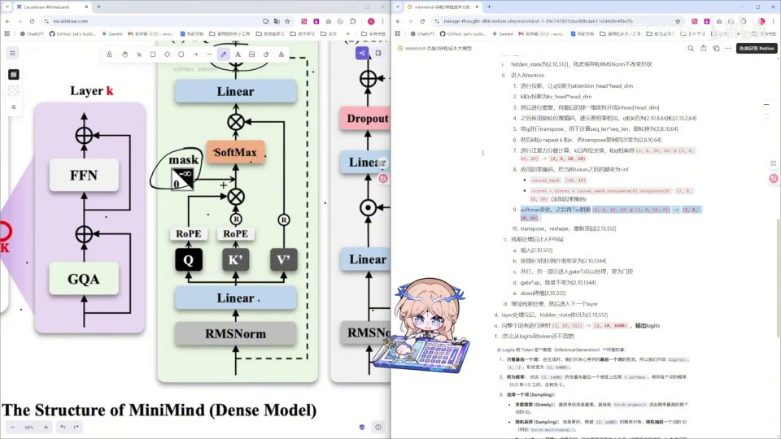 |
| 重新变回原本我们输入的 hidden state 的 [2, 10, 512]，然后呢，这里就是完成之后和残差相加，进入我们的 FFN 层。FFN 层输入是 [2, 10, 512]，那在这里 Linear 层呢，我们进行升维，按照约 8/3 的比例把它升维成 [2, 10, 1344]，然后并行输入左边的一个升维，右边升维之后和 SiLU 激活函数进行相乘。 [【跳转到 04:28】](https://www.bilibili.com/video/BV1T2k6BaEeC/?p=19&t=268) | 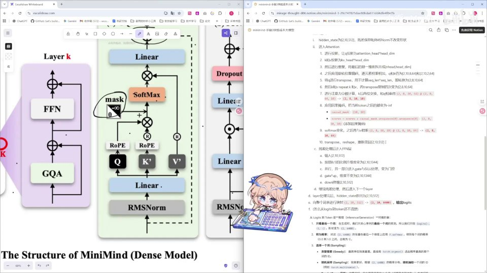 |
| 变为一个门控的，然后在这里门控的和我们这一部分升维的进行一个元素过滤，然后维度不变，依旧是 [2, 10, 1344]。在这个 Linear 层我们进行一个降维，变回 [2, 10, 512]，残差处理，然后继续进行残差处理，残差处理完后，这整个 block 进行一个重复循环。 [【跳转到 04:53】](https://www.bilibili.com/video/BV1T2k6BaEeC/?p=19&t=293) |  |
| 循环完之后，我们输出的 hidden state 是一个 [2, 10, 512]，然后就是 RMSNorm，这里不影响。在这个 Linear 层呢，我们会把它映射到整个词表上，我们的词表有 6400 个，我们就把这个 512 位的映射到 6400 个词表上，然后输出一个 logits，然后在后面的部分应用 softmax 之后变成概率，在后面的部分呢，我们会把这个概率真正地 decode 成一个 word。 [【跳转到 05:14】](https://www.bilibili.com/video/BV1T2k6BaEeC/?p=19&t=314) |  |
| 那这就是整个模型的一个运行规律，我希望大家能够现在是比较清楚地了解这样一个模型是怎么搭建完成的，然后同时呢，希望大家之后对看到一个新模型也比较能理解。比如说这里我会放上来一个，放上来一个我找到的一个。 [【跳转到 05:39】](https://www.bilibili.com/video/BV1T2k6BaEeC/?p=19&t=339) | 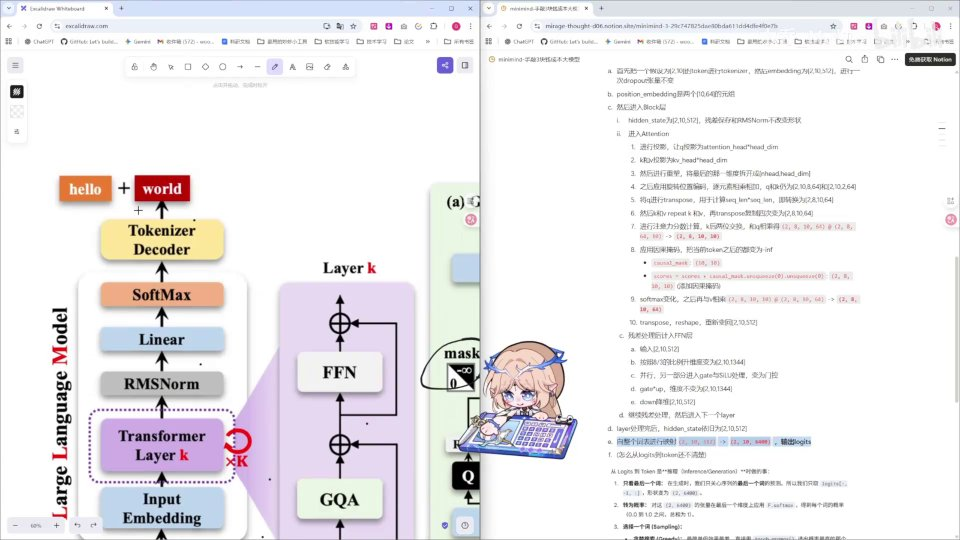 |
| 找到的一个，比如说这里，我会放上来一个我找到的一个千问三的一个架构图，那么我希望大家在敲过代码包括学完知识之后，能理解这个架构图是一个什么形式。 [【跳转到 06:04】](https://www.bilibili.com/video/BV1T2k6BaEeC/?p=19&t=364) | 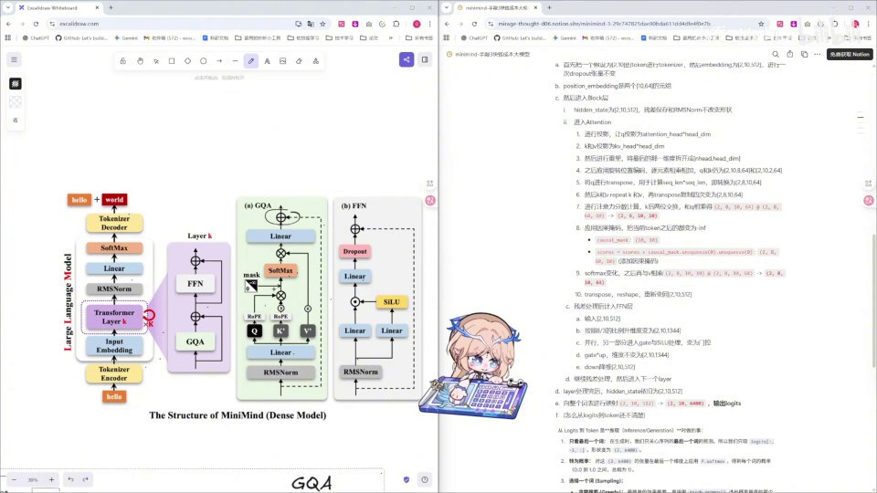 |
| 首先这个架构图呢，它是输入之后变成向量。 [【跳转到 06:22】](https://www.bilibili.com/video/BV1T2k6BaEeC/?p=19&t=382) | 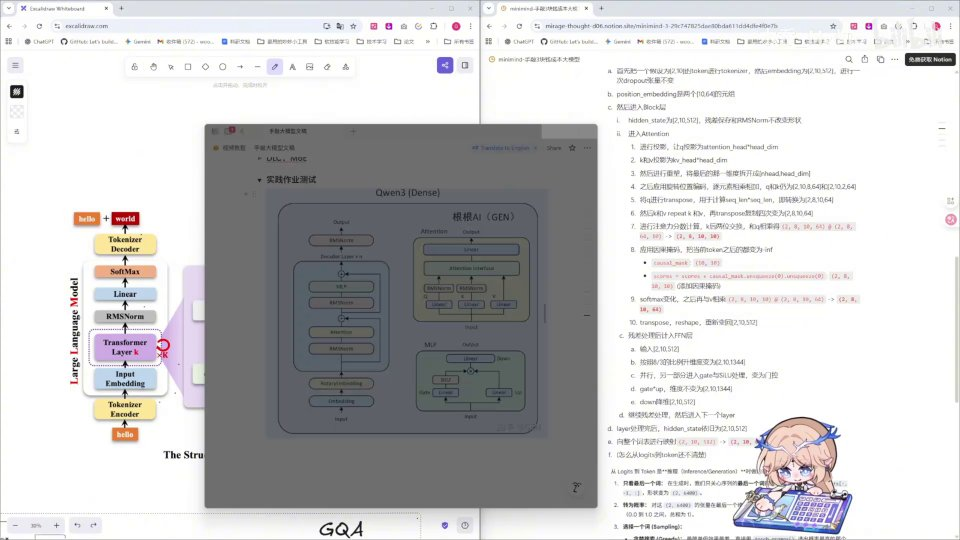 |
| 然后它先应用旋转位置编码，然后中间还是 residual 不变，中间 RMSNorm，然后送入了 attention，Q、K、V，RMSNorm，然后 attention 计算，Linear 层输出 RMSNorm，进入 FFN，依旧是这个门控函数，然后降维，降维之后继续，然后输出 RMSNorm。那大家看到这样一个也是比较清晰明了，而且我相信大家也可以一比一地用代码来去实现这样一个模型架构了。 [【跳转到 06:27】](https://www.bilibili.com/video/BV1T2k6BaEeC/?p=19&t=387) | 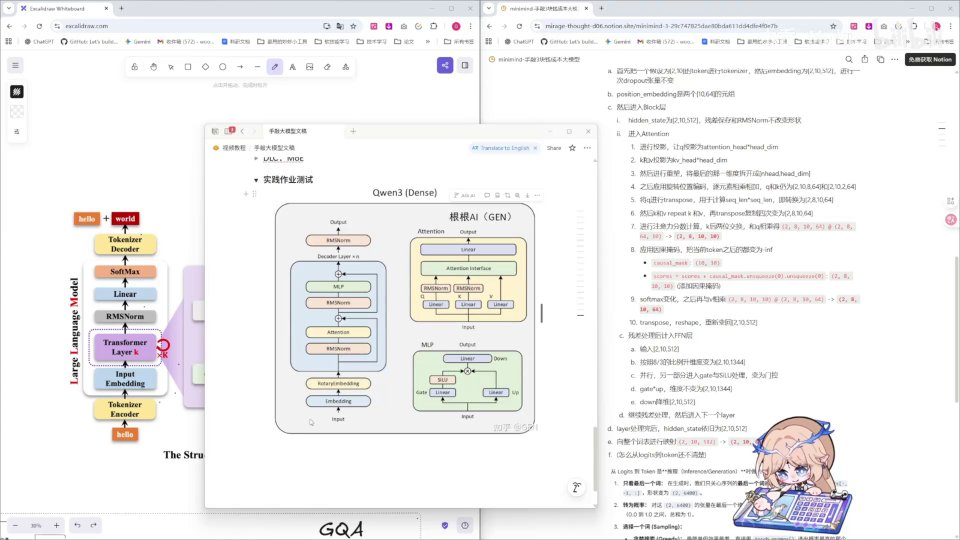 |
| 那么好，这就是我们学习完整个模型编写之后的部分。那么学习完模型编写之后呢，为了让模型真正可用，我们还需要加载数据集、训练，包括后续真正的训练和推理，那么这些我们留到后面再讲，我们下一 part 见。 [【跳转到 06:52】](https://www.bilibili.com/video/BV1T2k6BaEeC/?p=19&t=412) | 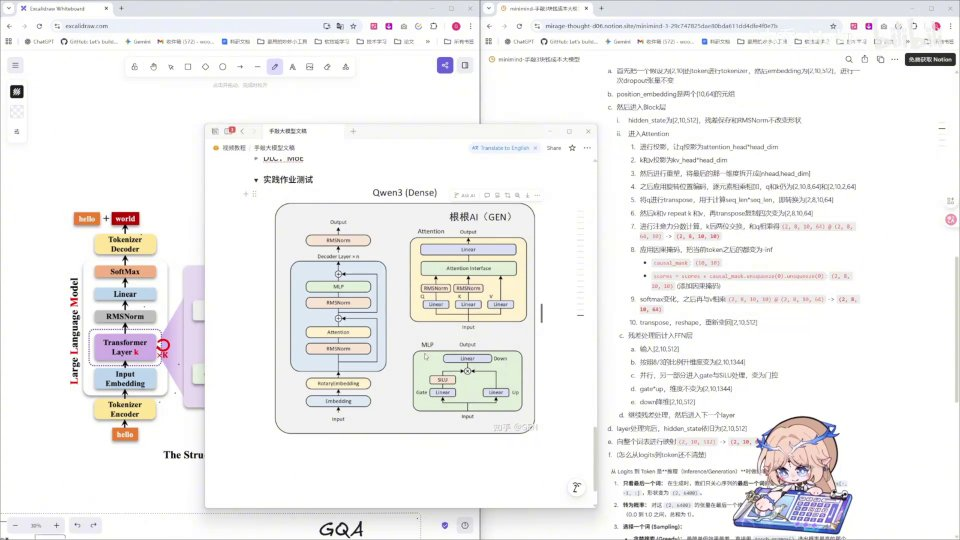 |