# 必看：纠错补充 原始文稿（图-字幕分栏）

| 字幕文本 | 画面 |
| :--- | ---: |
| 好，那么在我们敲完模型之后，在正式开始数据加载与训练之前，我们还需要对之前代码中的一些错误做一些补充说明，那么这里来 [【跳转到 00:00】](https://www.bilibili.com/video/BV1T2k6BaEeC/?p=20&t=0) | 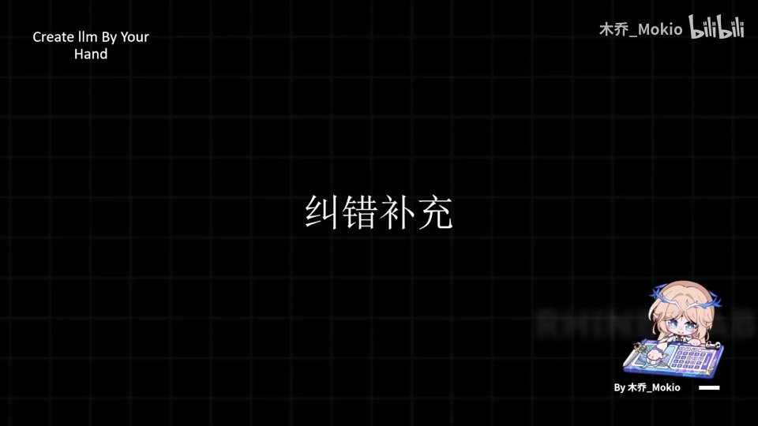 |
| 我们来看一下，我们原本的代码都有哪些奇奇怪怪的漏洞。 [【跳转到 00:12】](https://www.bilibili.com/video/BV1T2k6BaEeC/?p=20&t=12) | 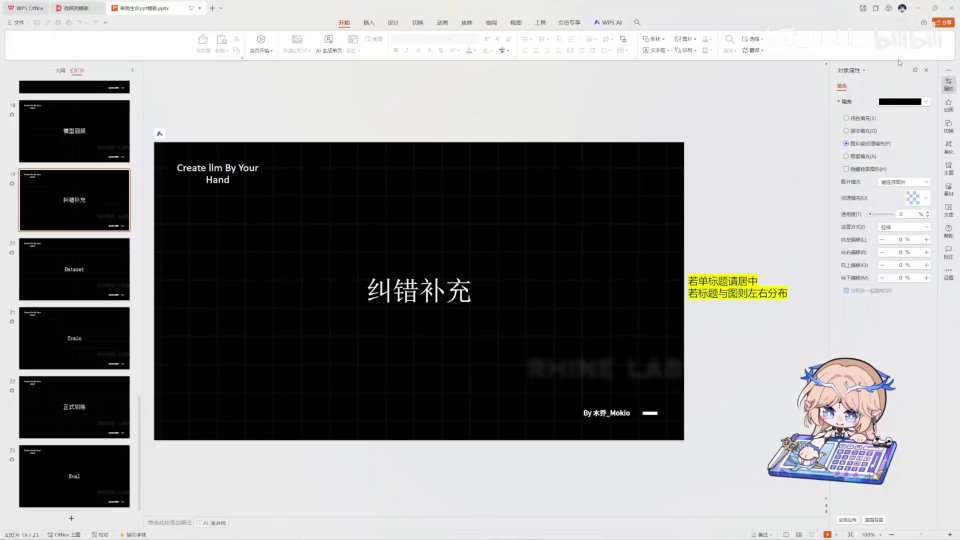 |
| 首先第一步，就是我不知道前面为什么会有这两个奇怪的导入，我们先把它删掉。然后我们这里的 import 语句是有一些问题的：首先这里有一个点，这个 activation_functions 的导入是错误的，我们需要去改一下，把它改成 transformers.activations， [【跳转到 00:17】](https://www.bilibili.com/video/BV1T2k6BaEeC/?p=20&t=17) |  |
| 这样才能正常导入这个 function。然后这里的 pretrained_model，我这里少打了，打成了小写的 t，这里是错的，我们把对应导入的地方也改一下，把它改成大写。然后还有一个问题，就是我在这里有一个拼写错误，Falsh， [【跳转到 00:42】](https://www.bilibili.com/video/BV1T2k6BaEeC/?p=20&t=42) | 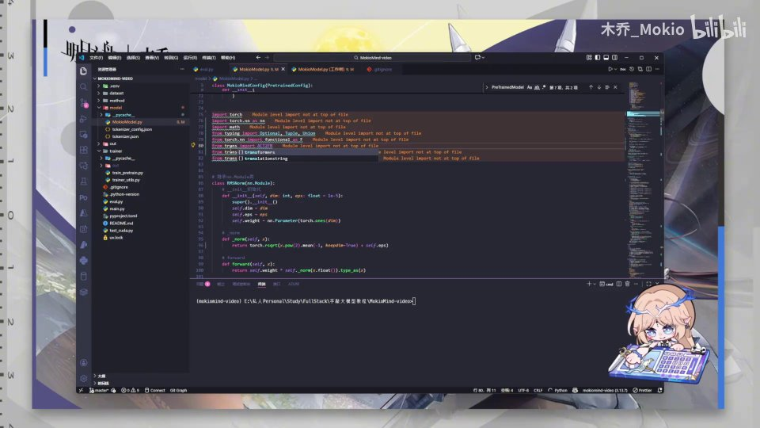 |
| 这里本来是 flash，我拼成了 FALSH，这是错误的。然后是一些其他比较严重的问题。首先是这个 RMSNorm，我的错误就是我没有乘上原来的 X， [【跳转到 01:07】](https://www.bilibili.com/video/BV1T2k6BaEeC/?p=20&t=67) | 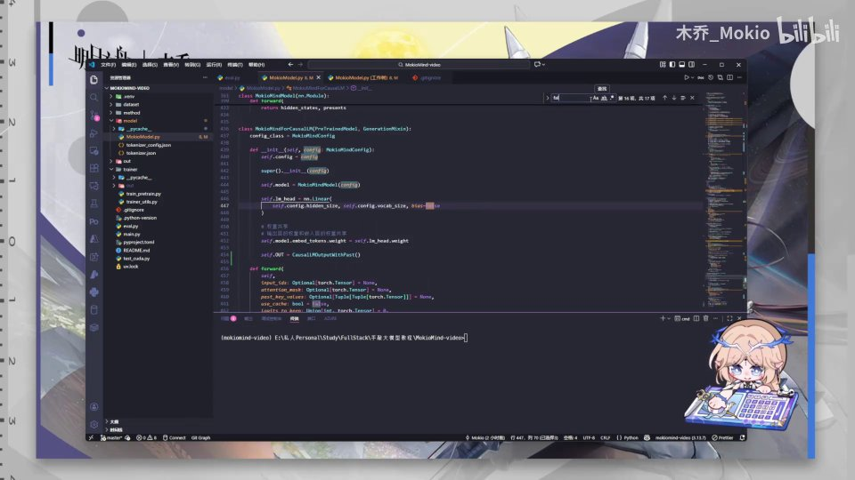 |
| 也就是在这里，它的分子上是有一个 X 需要相乘的。 [【跳转到 01:23】](https://www.bilibili.com/video/BV1T2k6BaEeC/?p=20&t=83) | 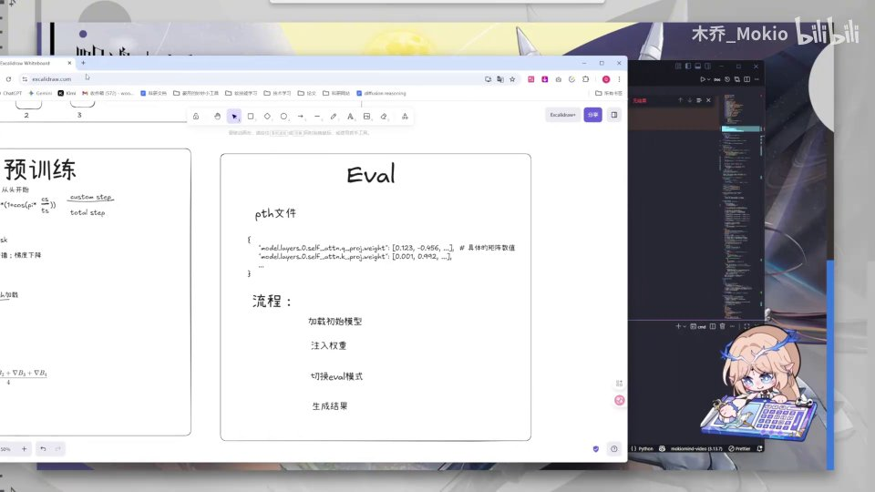 |
| 但是我没有把它乘上去，所以大家需要把这个 X 乘上去，来弥补 RMS 的这个错误。然后旋转位置编码这里有比较严重的问题。首先这个式子的计算我写错了，我们需要给它加上一些括号，来弥补它计算顺序的错误。首先呢，我们需要在它这个就是 me 上， [【跳转到 01:29】](https://www.bilibili.com/video/BV1T2k6BaEeC/?p=20&t=89) | 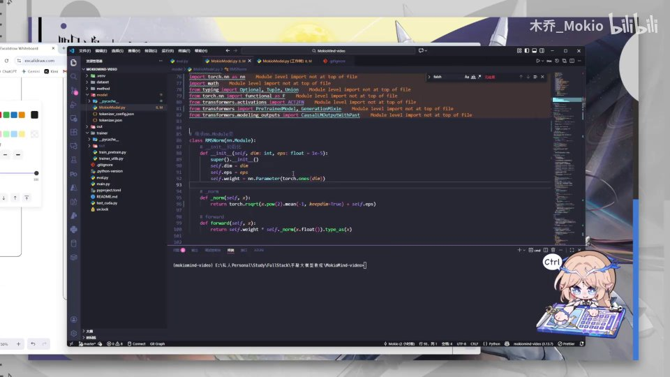 |
| 我们在右边加上一个括号，让它右边能够正常计算；然后我们需要在「一除以」这里也加上一个括号，保证分子是跟它隔开的。如果是原来的写法，它的计算顺序就会错误，导致严重的问题。然后就是这里，在计算 correction stream 的时候， [【跳转到 01:54】](https://www.bilibili.com/video/BV1T2k6BaEeC/?p=20&t=114) |  |
| 在此之前我们讲过，就是只有当它超出了我们可以处理的长度之后，才去计算并应用。所以我们这里需要把一直到这里的 FREQ 都放到这个 if 的下面，不然的话也是一个比较严重的逻辑问题。然后在 attention 里面有一个很奇怪的错误， [【跳转到 02:19】](https://www.bilibili.com/video/BV1T2k6BaEeC/?p=20&t=139) | 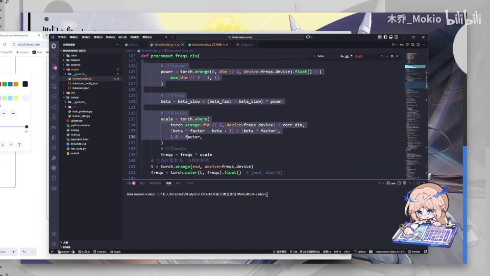 |
| 在这里我们写的时候，它应该去初始化它的 attention，呃 AttentionHeads，我这里写错了。然后它应该是——哦不对，它应该是这样，它应该是 key_value_heads。如果 key_value_heads 是 None 的话，那么我们这里就应该用到 attention_heads；否则如果它不为 None 的话，呃 [【跳转到 02:44】](https://www.bilibili.com/video/BV1T2k6BaEeC/?p=20&t=164) |  |
| 这里是 key_value_heads，大家可以理解一下这个逻辑：如果是 None 的话，我们就不做特殊处理；如果不是 None 的话就用它。然后这里我们又多写了一个 key_value 初始化，我们给它删掉。那么接下来还有一个拼写问题，就是我们在 attention 的 forward 里拼写的时候， [【跳转到 03:09】](https://www.bilibili.com/video/BV1T2k6BaEeC/?p=20&t=189) |  |
| 这个 EMBDDEDDINGS 我们给它加上，呃，然后是 flash 的变量问题。还有一个问题，是我们在 forward 里计算的时候有一个计算错误，FFN 里的实现，在这里的时候我们有一个计算错误， [【跳转到 03:34】](https://www.bilibili.com/video/BV1T2k6BaEeC/?p=20&t=214) | 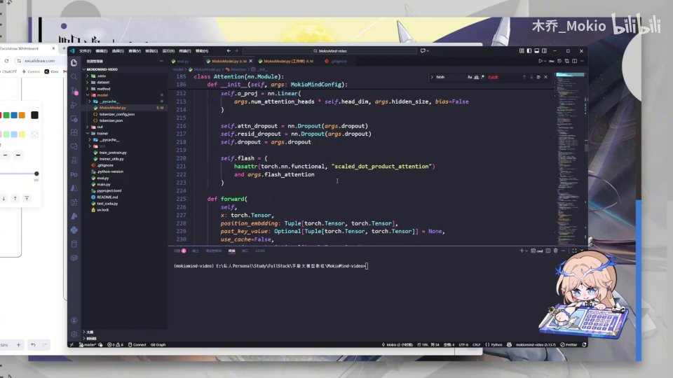 |
| 我们需要把它改成这个样子。这些复制粘贴我来给大家看一下。就是我们这个激活函数应该应用在乘法之前，它应该先对这个门控进行激活，然后再乘以 up，而不是对它整个的基进行激活——这是完全错误的。 [【跳转到 03:59】](https://www.bilibili.com/video/BV1T2k6BaEeC/?p=20&t=239) |  |
| 然后就是我们的 MiniMind 里的初始化顺序，哎，在这里初始化的时候，我们需要这里也去初始化一下我们的 config，即 self.config = config。然后后面还有，是在我们 forward 里的时候， [【跳转到 04:24】](https://www.bilibili.com/video/BV1T2k6BaEeC/?p=20&t=264) | 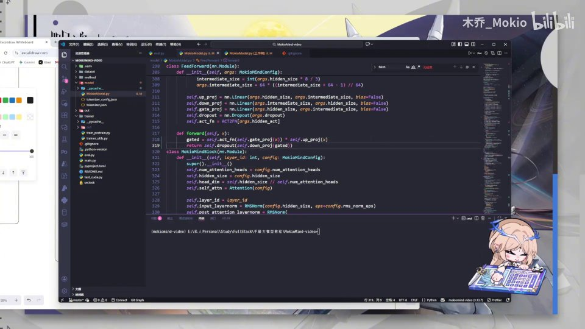 |
| 变量名有一些问题。像我们这里的……我找一下，在这里，在这个 past_key_values，这是在前面的、是参数，但是它不应该是这里循环里的一个变量，这样的话问题就错误了，相当于后面每个 past_key_value 都是整个 key_values。 [【跳转到 04:49】](https://www.bilibili.com/video/BV1T2k6BaEeC/?p=20&t=289) |  |
| 这个就是非常严重的问题，我们把这个后面的 S 也去掉。那么最后一个就是这个返回值问题。这个返回值呢不是很规范，我们可以用 MiniMind 它自己写的方式。我们可以把这个 cf.out 删掉，然后把后面这里的也删掉，直接用 MiniMind 里比较规范的一个方式，就是直接返回一个对象， [【跳转到 05:14】](https://www.bilibili.com/video/BV1T2k6BaEeC/?p=20&t=314) |  |
| 就是这样，而不是给这个对象加上一个又一个的特征。好，那么这样的话就没有任何问题了，很抱歉给大家，就是这样子写错了很多。然后还有一点我需要给大家提一下，就是我们置顶（评论）所提到的这个 FREQUENCE 这里的处理。那么我这样的写法相当于是什么呢？ [【跳转到 05:39】](https://www.bilibili.com/video/BV1T2k6BaEeC/?p=20&t=339) | 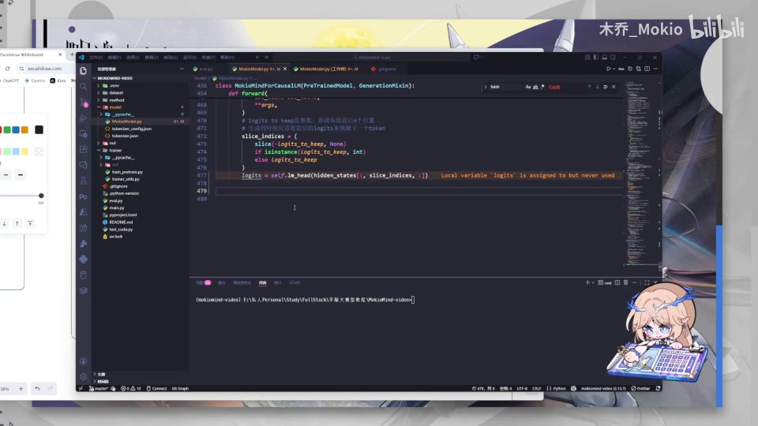 |
| 我在这里给大家画一下，相当于我们有一串序列是 Q1、Q2、Q3……呃， [【跳转到 06:00】](https://www.bilibili.com/video/BV1T2k6BaEeC/?p=20&t=360) | 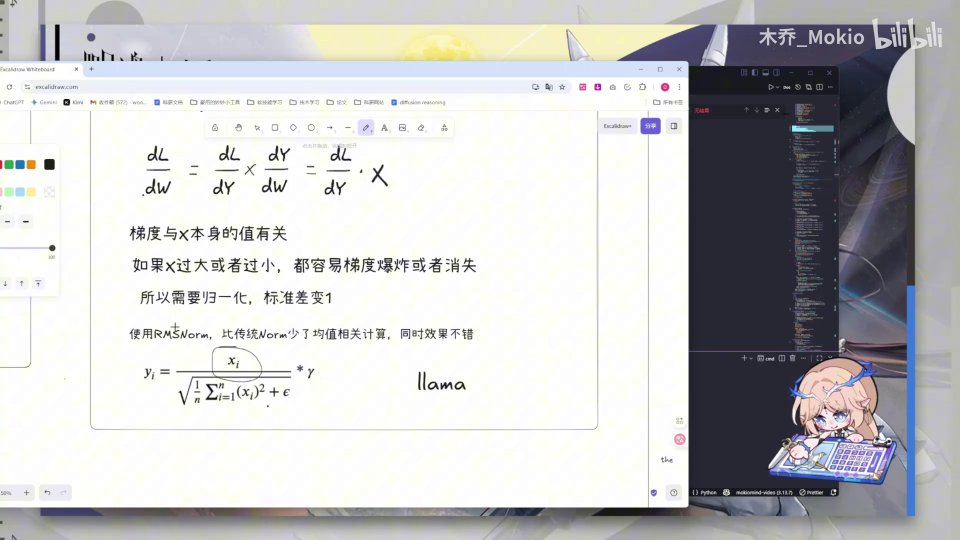 |
| Q0、Q1、Q2、Q3、Q4、Q5，比如说我们有这一串序列，对吧？然后我在这里写的这种处理， [【跳转到 06:05】](https://www.bilibili.com/video/BV1T2k6BaEeC/?p=20&t=365) | 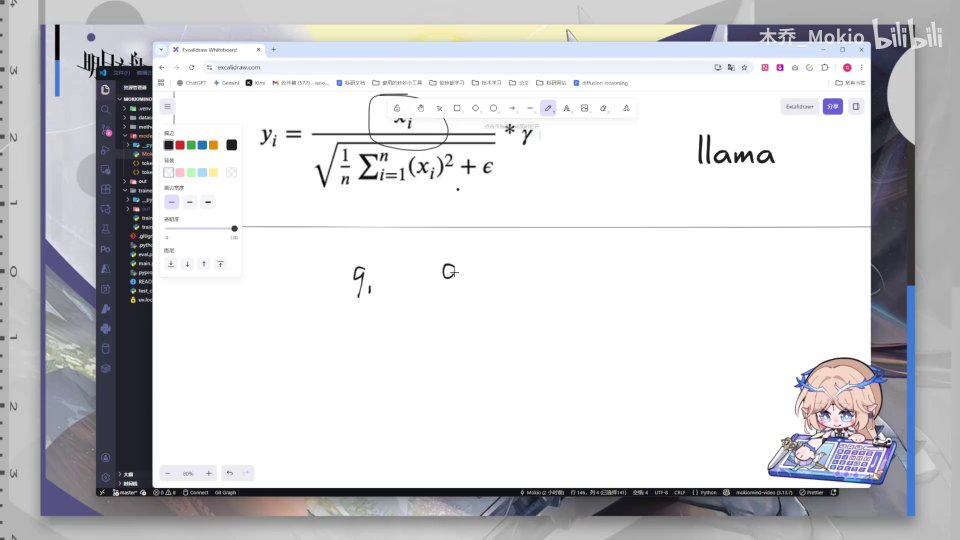 |
| 相当于是负 Q3、负 Q4、负 Q5， [【跳转到 06:15】](https://www.bilibili.com/video/BV1T2k6BaEeC/?p=20&t=375) | 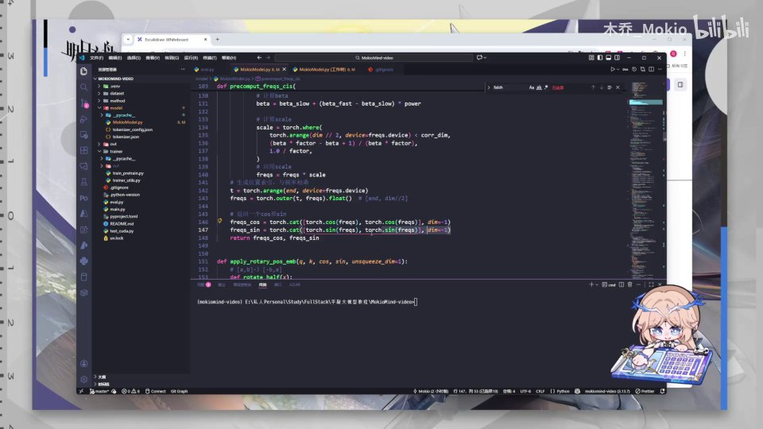 |
| 然后 Q0、Q1、Q2，然后我却让负 Q3 跟 Q0 配对、Q4 跟 Q1 配对、Q5 跟 Q2 配对，也就是说它们共用一个旋转频率，这个共用一个旋转频率，这个也共用一个旋转频率。那么这个呢，它问题其实不大的，为什么呢？因为你想一下就知道，比如说我们用 set 的 Q 矩阵，然后用 cat 的 K 矩阵来进行计算的时候， [【跳转到 06:20】](https://www.bilibili.com/video/BV1T2k6BaEeC/?p=20&t=380) |  |
| 比如说这里有六个，123456，然后这里也有六个，2345……那么其实无论它相邻不相邻，它和它相乘都是一个 theta1 的频率。包括它到这儿，因为它们共享的话，包括这里也可能是 theta1，而不是第二个是 theta1，但是是没问题的。 [【跳转到 06:45】](https://www.bilibili.com/video/BV1T2k6BaEeC/?p=20&t=405) | 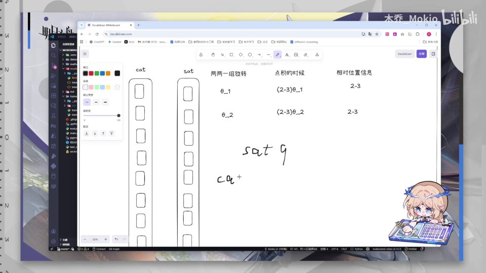 |
| 只要这个 Q 和这个 K 它们都是用同一个旋转频率，那么按照我们上面讲的，相乘的时候就会融入 2-3 或者 3-2 的位置信息。也就是说我这样去写，MiniMind 它原本这样去写是没有任何问题的，它都能融合上相对位置信息，在数学上是没有毛病的。只是说标准实现一般都是用相对（relative）的实现，当然你也可以拿我首页粘贴……呃 [【跳转到 07:10】](https://www.bilibili.com/video/BV1T2k6BaEeC/?p=20&t=430) | 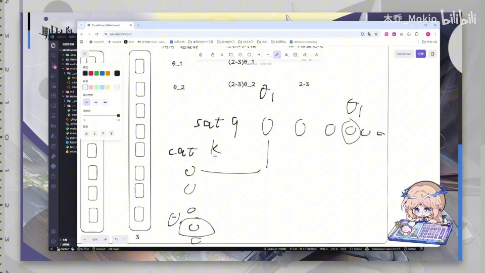 |
| 置顶粘贴的那个代码给它粘贴上去，那么这样就……用那种方法从头开始训练也是可以的，用我这种方法从头开始训练也是可以的。好，那么我们的纠错部分就到此结束，我们下一块开始讲加载数据集和训练。 [【跳转到 07:35】](https://www.bilibili.com/video/BV1T2k6BaEeC/?p=20&t=455) |  |
| （此区间无字幕） [【跳转到 07:54】](https://www.bilibili.com/video/BV1T2k6BaEeC/?p=20&t=474) | 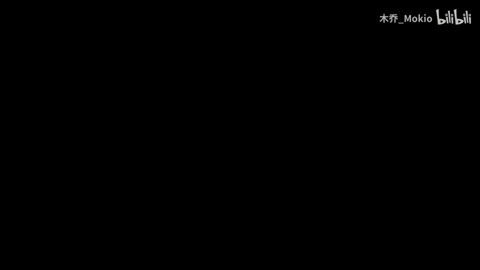 |