# 重制Dataset：理论 原始文稿（图-字幕分栏）

| 字幕文本 | 画面 |
| :--- | ---: |
| 大家好，这一 part 我们正式进入 Dataset 的部分讲解。那么这里为什么加上"重制"呢？因为这是 up 主后期发现代码更改 [【跳转到 00:00】](https://www.bilibili.com/video/BV1T2k6BaEeC/?p=21&t=0) | 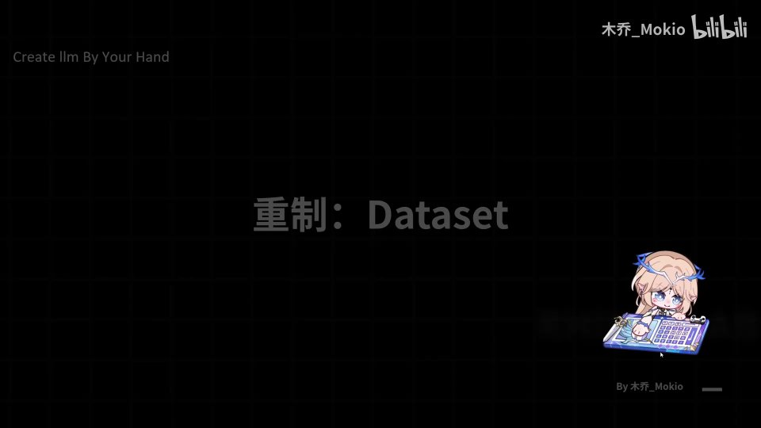 |
| 以及相关知识性错误后，重置的一期理论视频。好， [【跳转到 00:10】](https://www.bilibili.com/video/BV1T2k6BaEeC/?p=21&t=10) | 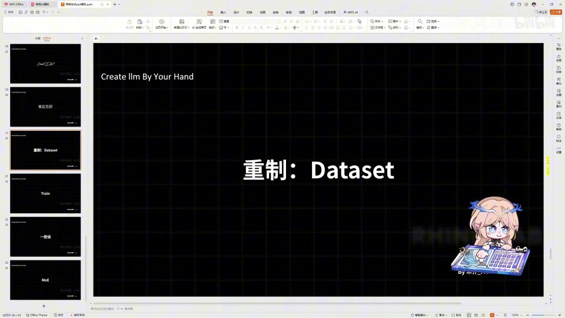 |
| 那么我们先来看一下 Dataset 的理论相关知识。首先我们需要了解数据集它是一个怎样的概念。我们都知道大模型在训练的时候需要为它准备海量的文本数据，比如说这是数据集里的一个内容，我们需要把这样一个内容喂给大模型，之后大模型通过一系列的规律学习，然后学会怎样去做"词语接龙"。 [【跳转到 00:15】](https://www.bilibili.com/video/BV1T2k6BaEeC/?p=21&t=15) | 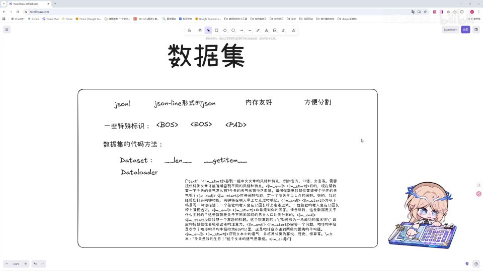 |
| 所以我们的数据集本身就是多条这样的数据的一个集合。那么首先我们需要知道数据集一般是用什么形式的，我们一般用一个叫 JSONL 的形式。顾名思义，可以把它就是 JSON，然后后面的 L 意思就是 line（行）的意思，也就是说它是一个 JSON 形式， [【跳转到 00:40】](https://www.bilibili.com/video/BV1T2k6BaEeC/?p=21&t=40) | 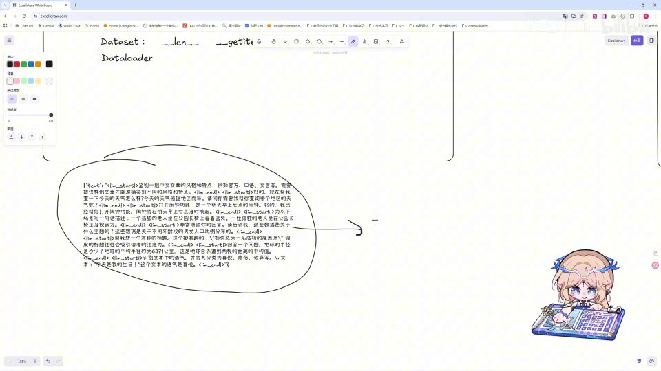 |
| 但是它的每一个 JSON 体都是一行内容。 [【跳转到 01:05】](https://www.bilibili.com/video/BV1T2k6BaEeC/?p=21&t=65) |  |
| 比如说我们这里拿到 Minimind 的一个官方的这样一个 [【跳转到 01:10】](https://www.bilibili.com/video/BV1T2k6BaEeC/?p=21&t=70) | 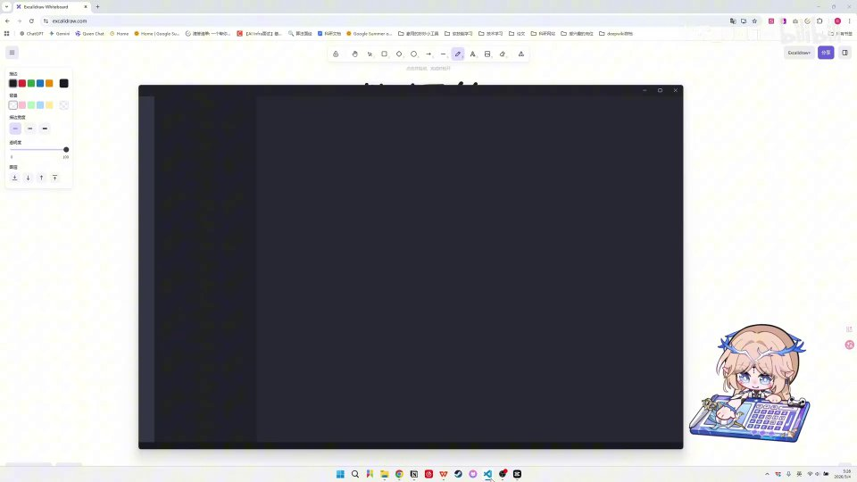 |
| 这样的一个 dataset 来看。 [【跳转到 01:15】](https://www.bilibili.com/video/BV1T2k6BaEeC/?p=21&t=75) | 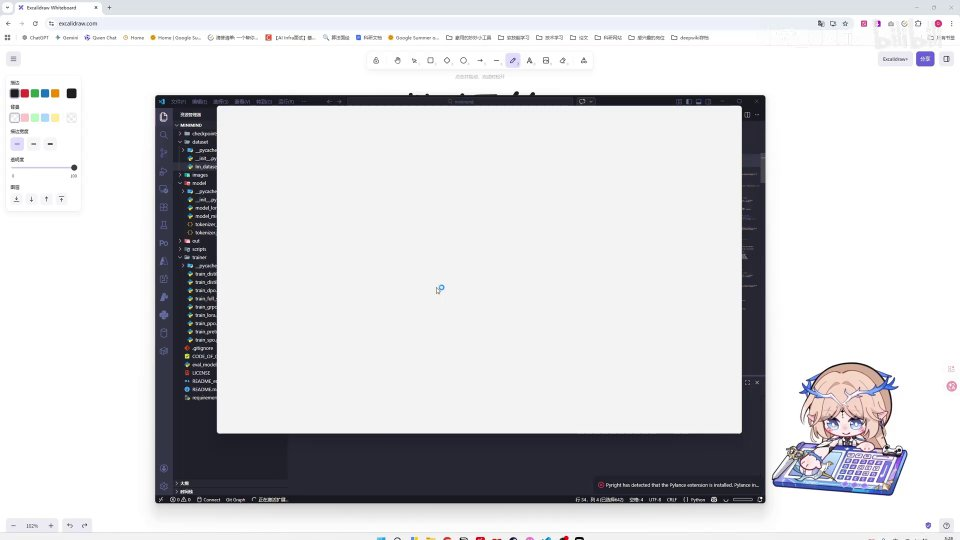 |
| （此区间无字幕） [【跳转到 01:20】](https://www.bilibili.com/video/BV1T2k6BaEeC/?p=21&t=80) | 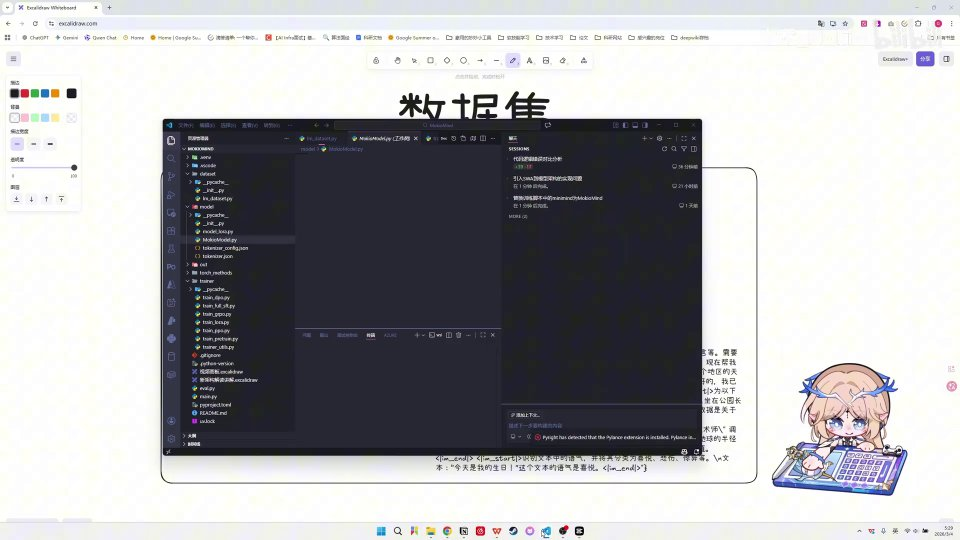 |
| 在这里我们加载一个比较小的，那么可以看到它是每一行都有一个单独的 JSON [【跳转到 01:25】](https://www.bilibili.com/video/BV1T2k6BaEeC/?p=21&t=85) | 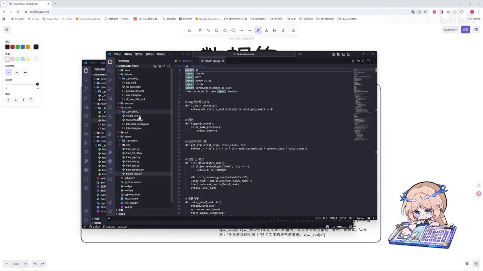 |
| JSON 体。 [【跳转到 01:30】](https://www.bilibili.com/video/BV1T2k6BaEeC/?p=21&t=90) | 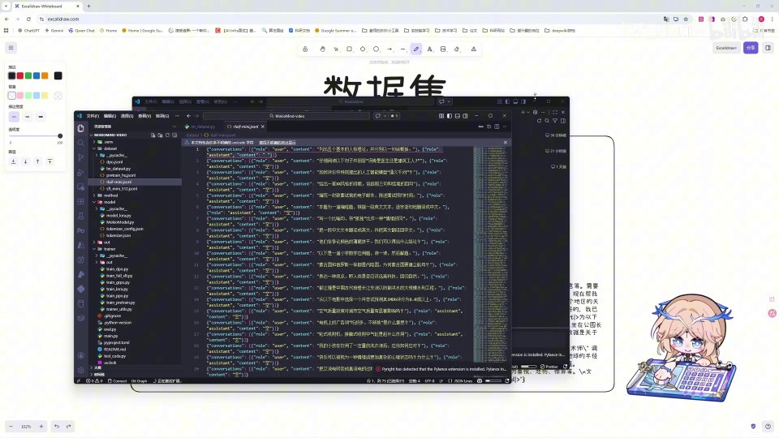 |
| 一行是一个单独的 JSON。那么这样的一个形式有什么好处呢？ [【跳转到 01:35】](https://www.bilibili.com/video/BV1T2k6BaEeC/?p=21&t=95) | 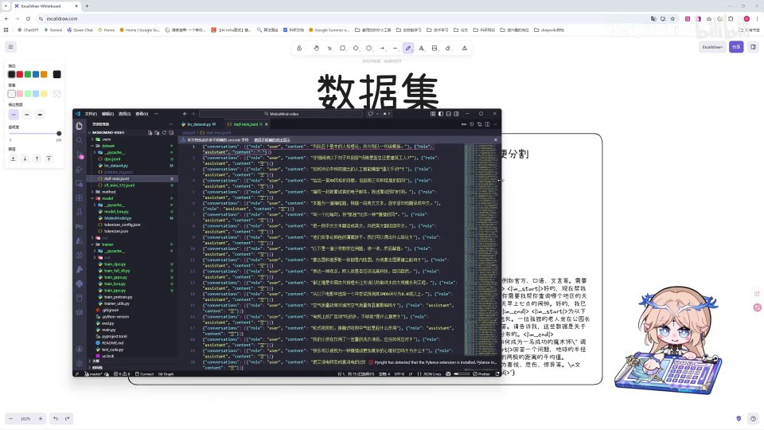 |
| 首先，因为它排列得更加紧密，而不是像原来的 JSON 一样，我写两个大括号之后中间夹了很多行，所以它在内存上比较友好。其次，因为它是每一行，所以我可以很方便地去分割哪一部分是哪一条 JSON，就按行来分割就可以了。这就是数据集常用的形式。同时，我们需要了解数据集里会有的一些特殊字符。当然这些标识是前置知识里的， [【跳转到 01:40】](https://www.bilibili.com/video/BV1T2k6BaEeC/?p=21&t=100) | 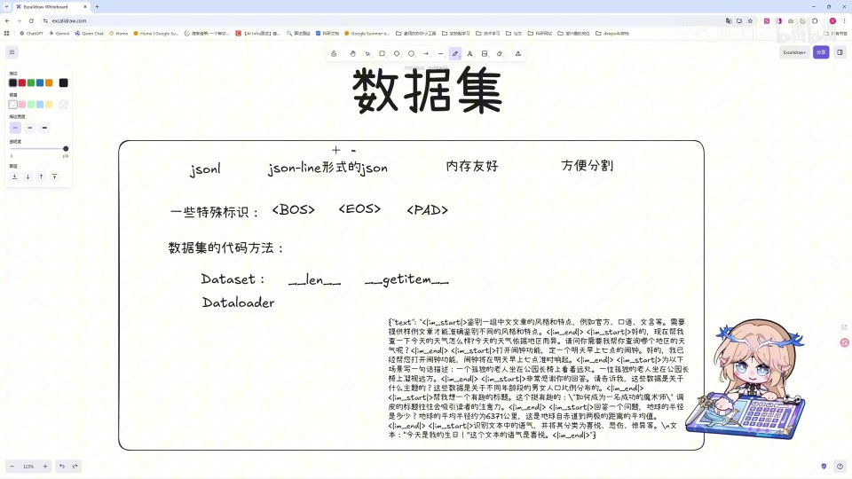 |
| 这里我进行一些补充。比如说我们拿出预训练的这样一个数据集里的部分，可以看到里面有很多奇怪的地方。比如说这里有一个 im_start，然后这里又有一个 im_end，那这个是什么意思呢？就是我们在训练模型的时候，需要让模型知道哪一部分是所谓的 [【跳转到 02:05】](https://www.bilibili.com/video/BV1T2k6BaEeC/?p=21&t=125) |  |
| 哪一部分是所谓的开头，哪一部分是整个序列所谓的结尾。所以我们需要给它加上特殊的标识去告诉它：这样一个句子是一句的开头、一句的结尾，这样一个句子是一句的开头和一句的结尾。同时，模型输出的时候大家知道是一个流式的输出，它会往外弹字嘛，那我们什么时候才能知道模型输出完了呢？ [【跳转到 02:30】](https://www.bilibili.com/video/BV1T2k6BaEeC/?p=21&t=150) | 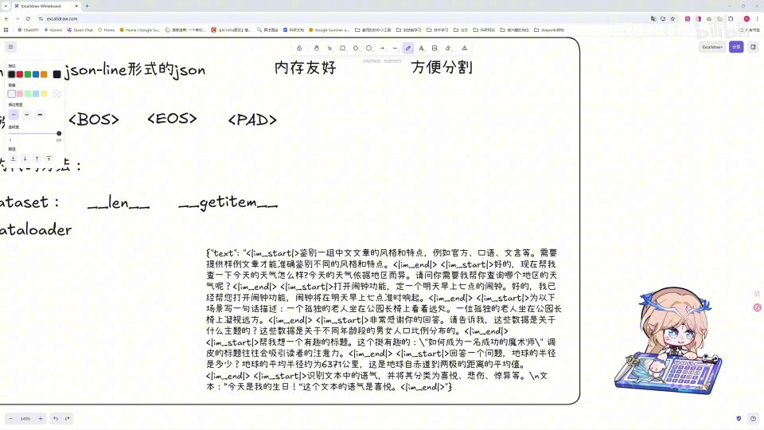 |
| 我们就会让模型输出一个特殊的标识，比如说这里的 EOS，然后我们就知道模型在这里输出完了；或者说，模型在训练的时候知道一般这个地方会有一个 EOS，它就会停止输出。这就是特殊标识。 [【跳转到 02:55】](https://www.bilibili.com/video/BV1T2k6BaEeC/?p=21&t=175) |  |
| 除了 BOS 表示序列的开头 beginning of sequence 和 EOS 表示 end of sequence 之外，我们还有一个特殊标识 PAD，PAD 的意思就是 padding（填充）的意思。 [【跳转到 03:10】](https://www.bilibili.com/video/BV1T2k6BaEeC/?p=21&t=190) |  |
| 就是说，比如说我们在喂给模型的时候，我们都需要让喂给的数据是一个 1000 的长度。而假如说我们有一个 3800 的数据要喂给它，那么最后我们会剩 800 个长度，那么这样它就和这个 1000 对不上了。这时候我们常用的做法 [【跳转到 03:21】](https://www.bilibili.com/video/BV1T2k6BaEeC/?p=21&t=201) |  |
| 就是在后面填上 200 个 PAD。我们会告诉模型说，这个 pad 我们不参与 attention 里的计算，也不参与 loss 的计算。那这样我们就是为了让它凑成一个 1000 的长度， [【跳转到 03:40】](https://www.bilibili.com/video/BV1T2k6BaEeC/?p=21&t=220) |  |
| 去更好地让 GPU 去计算，这就是 pad。 [【跳转到 03:52】](https://www.bilibili.com/video/BV1T2k6BaEeC/?p=21&t=232) | 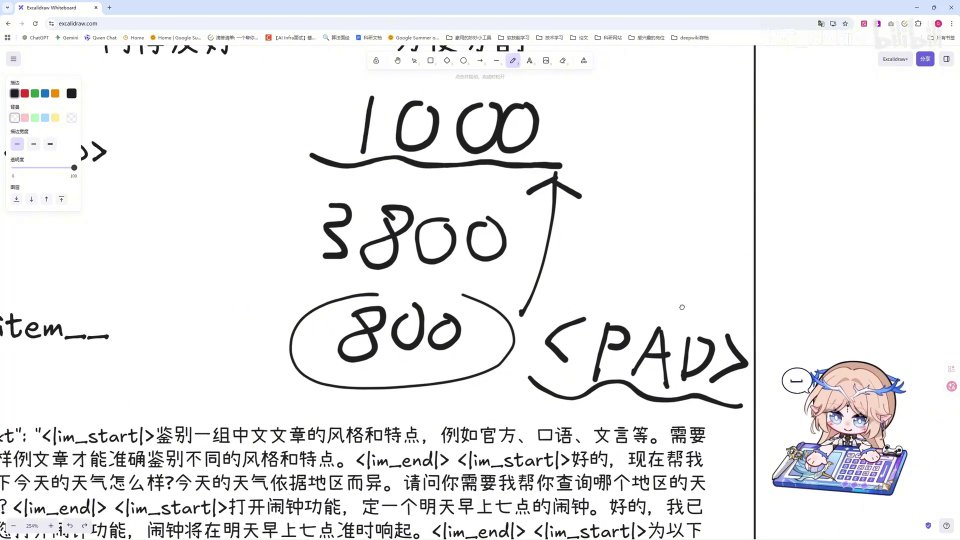 |
| 那么在我们了解完 Dataset 以及我们的一些 Dataset 里的特殊字符之后， [【跳转到 03:57】](https://www.bilibili.com/video/BV1T2k6BaEeC/?p=21&t=237) | 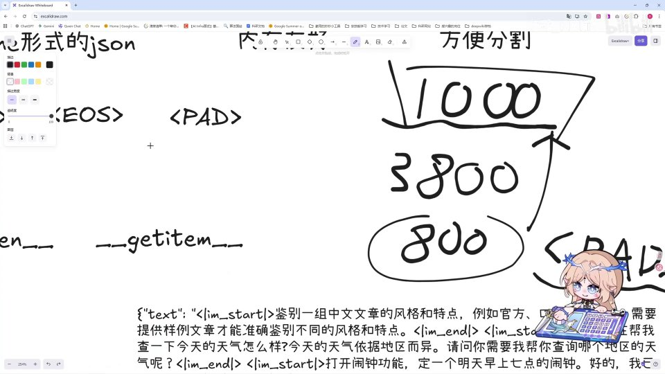 |
| 我们需要了解一下 PyTorch 里我们加载 Dataset 用到的代码方法。 [【跳转到 04:02】](https://www.bilibili.com/video/BV1T2k6BaEeC/?p=21&t=242) | 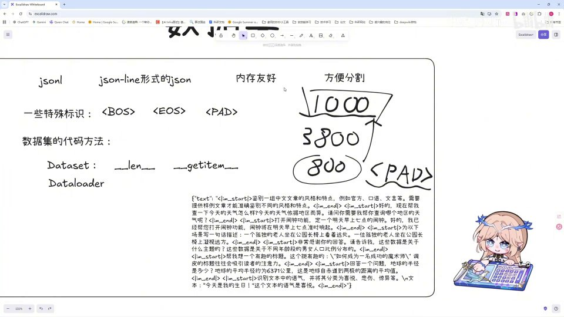 |
| PyTorch 呢，它作为一个深度学习的框架，早在——早在大模型之前，它就已经内部定义了 Dataset 以及 DataLoader，就是我们怎样去定义一个数据集以及怎样去加载一个数据集。那么当我们定义 Dataset 的时候，它有内置的方法必须要实现，也就是 __len__ 和 __getitem__。__len__ 就是告诉我们数据集有多长， [【跳转到 04:07】](https://www.bilibili.com/video/BV1T2k6BaEeC/?p=21&t=247) | 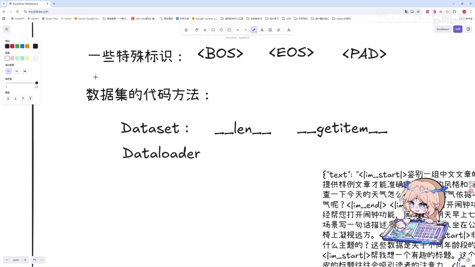 |
| 那么 __getitem__ 呢，就是告诉我们从数据集里应该怎样拿出每一条数据。 [【跳转到 04:32】](https://www.bilibili.com/video/BV1T2k6BaEeC/?p=21&t=272) |  |
| 比如说我们这样一条数据， [【跳转到 04:37】](https://www.bilibili.com/video/BV1T2k6BaEeC/?p=21&t=277) | 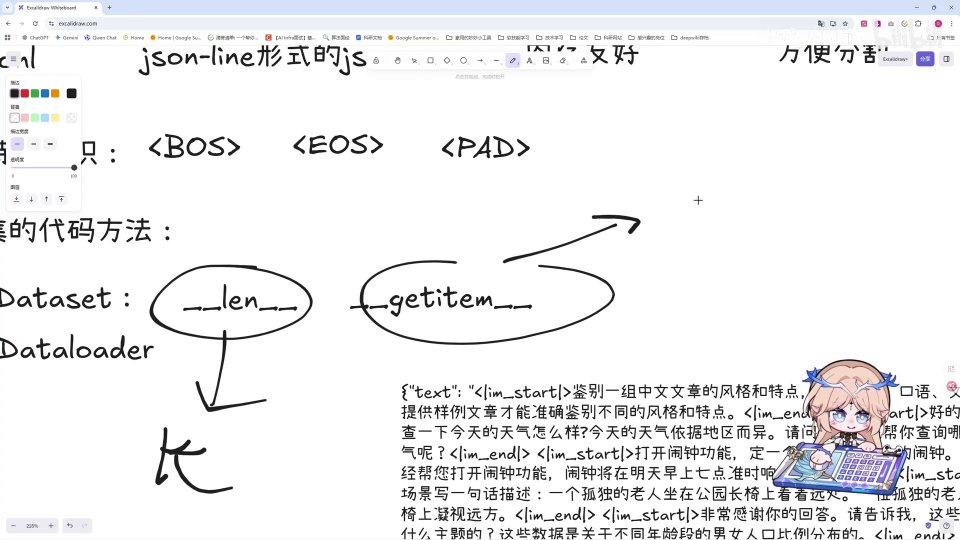 |
| 我们实际发送给模型的时候，应该是发送给 tokenizer 处理之后的 id，也就是我们发送的本质上是 0、1、2、3、4 [【跳转到 04:42】](https://www.bilibili.com/video/BV1T2k6BaEeC/?p=21&t=282) | 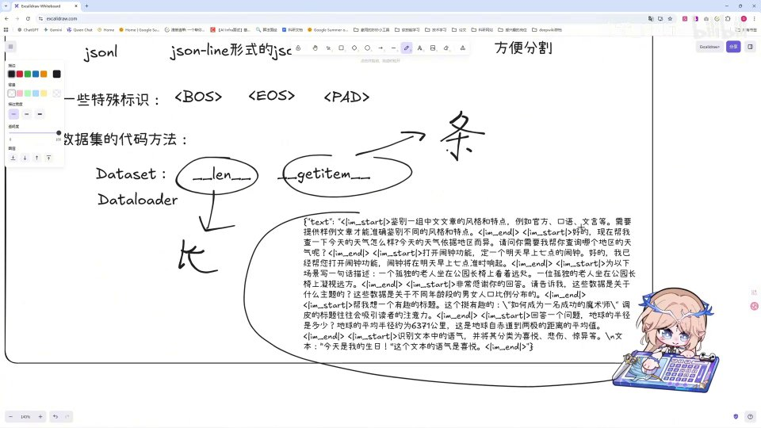 |
| 这样一些 id 号。那么这个我们就会在 __getitem__ 这里去对这样一个数据进行处理，最后让它返回一个 id。同时还有一个方法叫做 DataLoader， [【跳转到 04:49】](https://www.bilibili.com/video/BV1T2k6BaEeC/?p=21&t=289) | 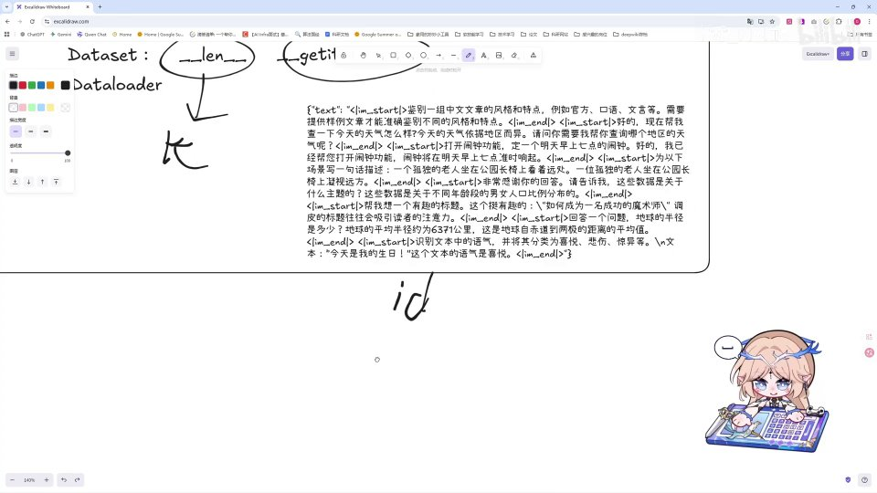 |
| 那么这个 DataLoader 呢，就是从 Dataset 里获取到数据，只是说它有内置的一些定义，能够实现多批次的数据的收集，以及多线程的一个调用，是对 Dataset 本身的数据获取进行了一个优化。好，那么这一块呢我们的数据集理论部分就讲解完毕，下一块呢我们正式进入预训练的 Dataset 的代码编写。 [【跳转到 05:03】](https://www.bilibili.com/video/BV1T2k6BaEeC/?p=21&t=303) |  |
| 我们下一块见。 [【跳转到 05:28】](https://www.bilibili.com/video/BV1T2k6BaEeC/?p=21&t=328) | 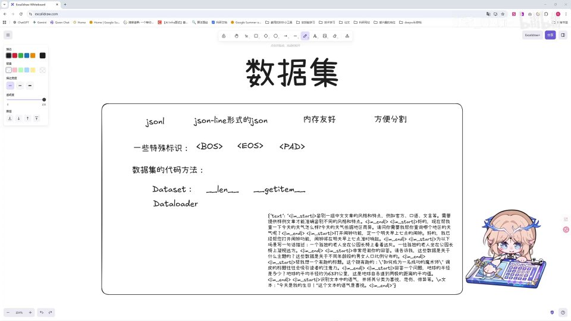 |