# 重制Dataset：代码 原始文稿（图-字幕分栏）

| 字幕文本 | 画面 |
| :--- | ---: |
| 大家好，这一 part 我们正式进入重制版的 Dataset 代码部分的讲解。 [【跳转到 00:00】](https://www.bilibili.com/video/BV1T2k6BaEeC/?p=22&t=0) |  |
| 那么我们首先拿到这个代码之后， [【跳转到 00:06】](https://www.bilibili.com/video/BV1T2k6BaEeC/?p=22&t=6) | 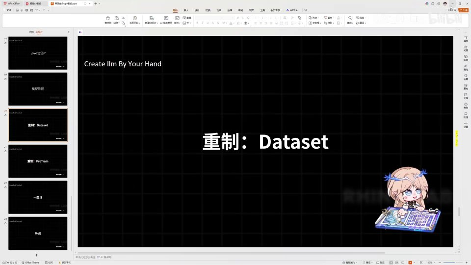 |
| 把前面的东西复制粘贴过来，这部分大伙直接去仓库里复制粘贴就可以。那首先我们来编写预训练的一个 Dataset 类，按照我们之前说的 PretrainDataset，我们让它继承原生 PyTorch 里的 data [【跳转到 00:11】](https://www.bilibili.com/video/BV1T2k6BaEeC/?p=22&t=11) | 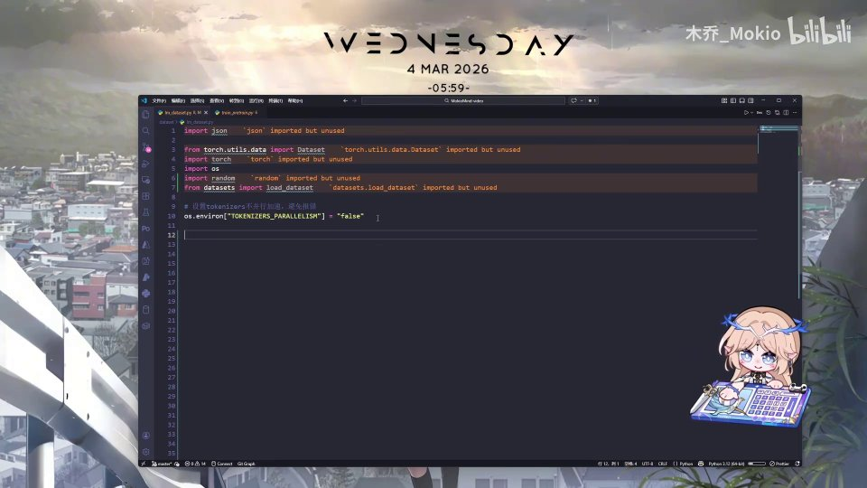 |
| set 这样一个类。那么我们都知道，继承 PyTorch Dataset 这个类之后，首先 `__init__` 是一定要编写的，然后就是 `__len__` 这样一个方法需要去实现，再然后是 `__getitem__` 方法的实现。好，那么我们首先来把 `__init__` 给编写一下，这个 init 函数我就直接复制粘贴过来，大伙可以跟着敲，或者直接复制粘贴 [【跳转到 00:36】](https://www.bilibili.com/video/BV1T2k6BaEeC/?p=22&t=36) |  |
| 就可以。把这个再加一行缩进，可以看到我们预定义的内容就是：首先我们把 tokenizer 定义一下，把需要输入给 GPU 的最大长度 max_length 给定一下，然后就是我们的所有数据集内容，我们用这样一个 load_data 的函数去加载数据，那么这里我们直接用 HuggingFace [【跳转到 01:01】](https://www.bilibili.com/video/BV1T2k6BaEeC/?p=22&t=61) | 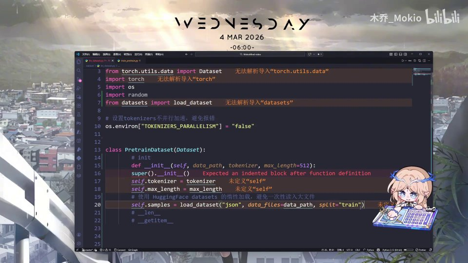 |
| 它自带的这样一个 load_dataset 方法去进行数据集的加载就可以。好，那么我们接下来实际编写我们的 `__len__` 长度和 `__getitem__` 方法。首先 `__len__` 我们就直接让 AI 生成，返回这样一个 samples 的长度即可。然后就是 `__getitem__` 方法，这里我们需要去对我们要拿到的每一条数据 [【跳转到 01:26】](https://www.bilibili.com/video/BV1T2k6BaEeC/?p=22&t=86) | 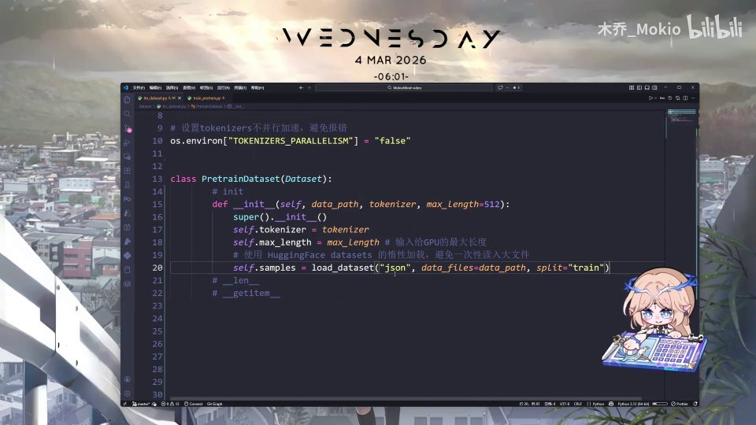 |
| 去进行一个详细的处理。那么我们首先需要知道我们拿到的是什么：我们拿到的是 JSONL 的每一行；我们要输出的是 input_ids、attention_mask 和 labels。那么我们中间需要经过哪些处理呢？ [【跳转到 01:51】](https://www.bilibili.com/video/BV1T2k6BaEeC/?p=22&t=111) | 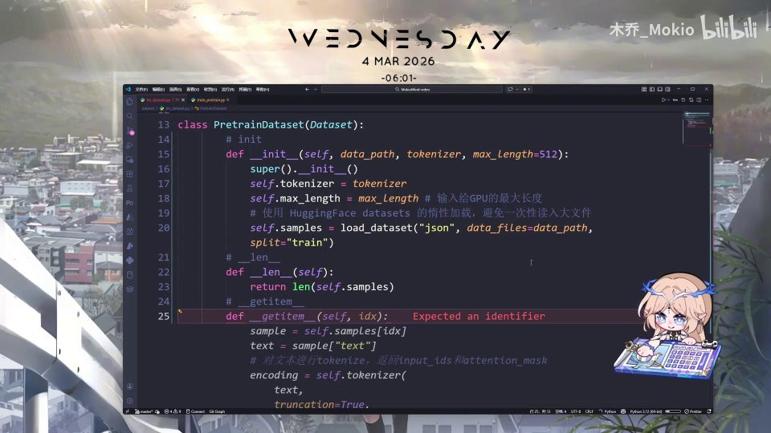 |
| 首先 tokenizer 会把文本转化成 input 的 id，把文本转化为词（token），然后我们需要加上 BOS 和 EOS 以及 PAD 填充，然后我们需要自行编写 labels [【跳转到 02:16】](https://www.bilibili.com/video/BV1T2k6BaEeC/?p=22&t=136) |  |
| 防止 PAD 参与 loss 计算，然后我们需要编写 attention_mask 来告诉模型哪些位置有效、哪些位置是 PAD。好，那我们首先来一步步去编写：首先我们把 `__getitem__` 方法给写出来，然后这里有 self [【跳转到 02:41】](https://www.bilibili.com/video/BV1T2k6BaEeC/?p=22&t=161) | 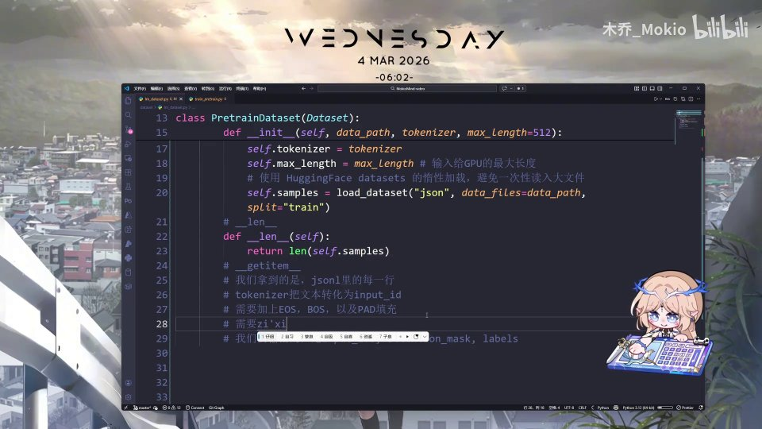 |
| 然后还有这样一个 index 就是索引。那么我们首先把我们要处理的那一条数据给拿出来，就是从 samples 里根据 index 索引，把这样一个具体的数据取出来。取出来之后，我们下一步就是我们这里写的：我们需要用 tokenizer 来把文本转化为 input 的 id，那么这里写 tokens 等于 self.tokenizer [【跳转到 03:06】](https://www.bilibili.com/video/BV1T2k6BaEeC/?p=22&t=186) | 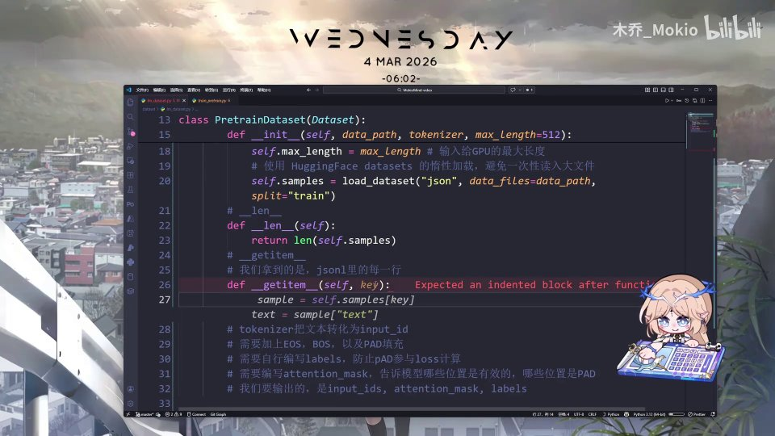 |
| 然后我们把相关的数据传进去。首先我们需要把在 samples 里拿出的这样一个 JSON 里的 text 相关部分转化为字符串，然后我们 `add_special_tokens=False` [【跳转到 03:31】](https://www.bilibili.com/video/BV1T2k6BaEeC/?p=22&t=211) |  |
| 我们不让它自动地给我们添加特殊 token，而由我们自己去进行相关处理。然后我们需要写上 max_length，我们需要让它减二，因为后面我们会自己加上 BOS 和 EOS；然后还有一个就是截断（truncation），我们让它等于 true，这个意思就是如果长度超过了 max 就自动截断。好 [【跳转到 03:56】](https://www.bilibili.com/video/BV1T2k6BaEeC/?p=22&t=236) | 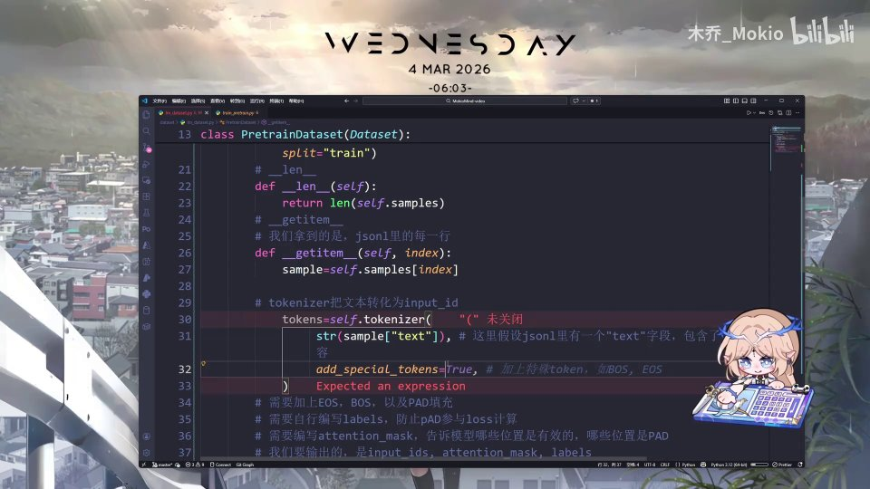 |
| 然后我们编写完之后，把这样一个 input_ids 取出来。接下来我们需要去拼接 BOS 和 EOS，那么 tokens 等于——我们直接让 AI 生成——也就是在前面加上一个 BOS，在后面加上一个 EOS；然后接下来就是需要去补足 padding [【跳转到 04:21】](https://www.bilibili.com/video/BV1T2k6BaEeC/?p=22&t=261) |  |
| 在这里我们需要去编写：input_ids 等于 tokens 加上 self.tokenizer 的 pad_token_id 乘以（self.max_length 减去我们现在的 token 长度），就是让我们不足的长度（比如 800 的长度）加上 200 个 token 的 PAD [【跳转到 04:46】](https://www.bilibili.com/video/BV1T2k6BaEeC/?p=22&t=286) | 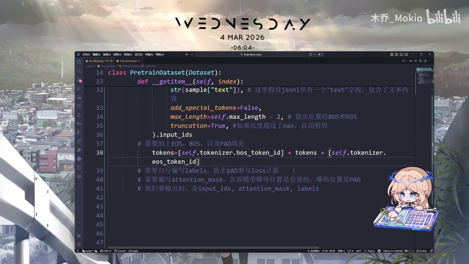 |
| 然后把它填充到 1000 的一个长度。然后我们在这里进行一步张量计算，把 input_ids 转化为一个张量（tensor），它的 type 等于 torch.long 这样一个类型。接下来我们需要去编写 labels 来防止它参与 loss 计算，那么这个 labels 怎么编写呢？ [【跳转到 05:11】](https://www.bilibili.com/video/BV1T2k6BaEeC/?p=22&t=311) |  |
| 我们在这里简易地画个图，比如我们的 id 是这样一个形状， [【跳转到 05:36】](https://www.bilibili.com/video/BV1T2k6BaEeC/?p=22&t=336) | 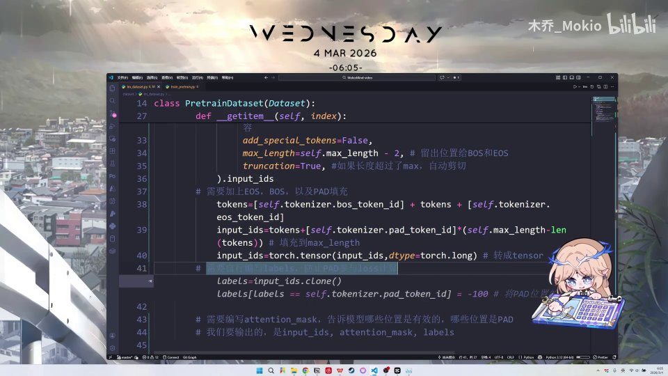 |
| 比如 1、2、3 然后 PAD，对吧。那么我们在编写 label 的时候，就把它转化成这个样子：1、2、3 然后 -100。至于这里为什么要转化成 -100 呢，是因为在后面计算 loss 的时候会用到交叉熵的一个 loss 计算 [【跳转到 05:41】](https://www.bilibili.com/video/BV1T2k6BaEeC/?p=22&t=341) | 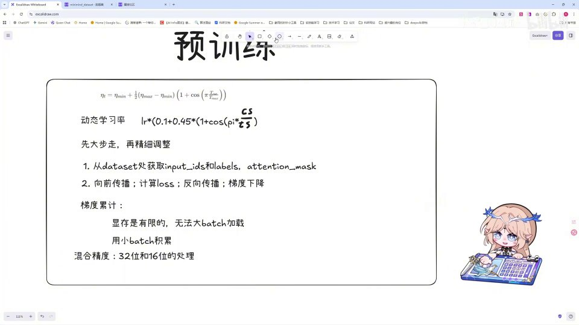 |
| 比如说是 CrossEntropyLoss，它里面会有一个参数（默认的参数）会自动忽略 -100 的部分，那我们把 PAD 转化为 -100 就自动忽略了。而且大家如果详细学习过的话可能会知道，在计算的时候明明是一个自回归（autoregressive）——也就是说每一位都应该在它前面那一位的后面——也就是说当我们交给模型训练的时候 [【跳转到 06:06】](https://www.bilibili.com/video/BV1T2k6BaEeC/?p=22&t=366) | 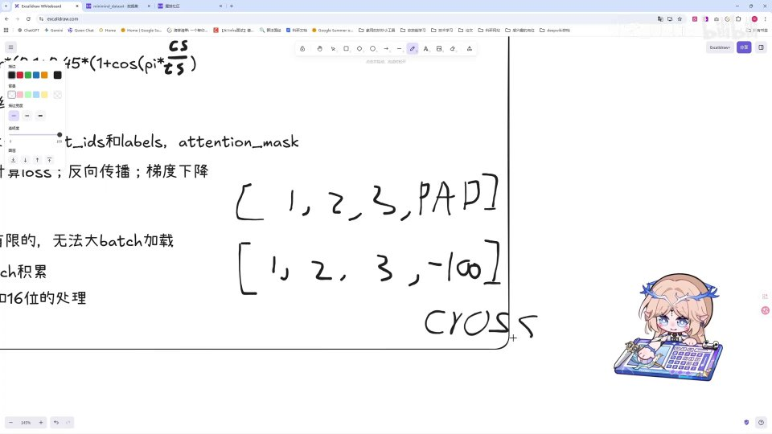 |
| 我们会先传入 1，再传入 1、2，再传入 1、2、3，再传入完整的这样一个序列。那我们代码实现的时候为什么要直接把它克隆下来，而不是把它平移移位（shift）呢？这是因为我们在前面编写 CausalLM 模型的时候 [【跳转到 06:31】](https://www.bilibili.com/video/BV1T2k6BaEeC/?p=22&t=391) | 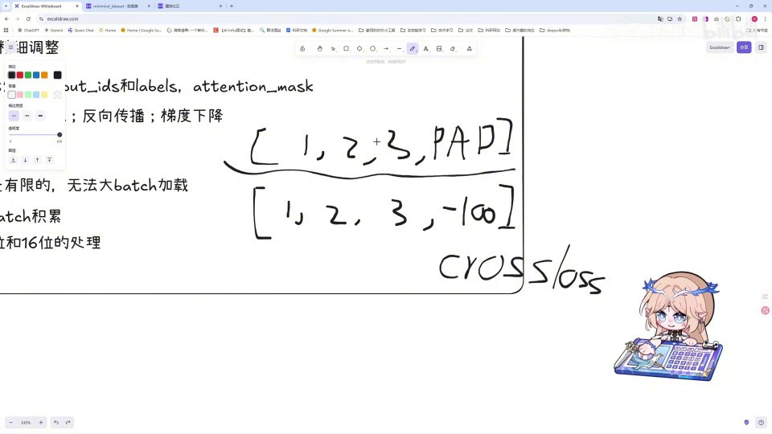 |
| 它里面已经内置了、帮我们实现了那样一个自回归部分。这块如果你听不懂的话也没关系，不影响我们接下来的代码相关编写。那么 labels 呢，我们首先把 input_ids 克隆下来，克隆下来之后我们就实现了刚刚所讲的这样一个 1、2、3、PAD，然后我们需要把 labels 里等于 PAD 的部分 [【跳转到 06:47】](https://www.bilibili.com/video/BV1T2k6BaEeC/?p=22&t=407) |  |
| 给它设置为 -100，那么接下来参与 loss 计算的时候就会自动忽略这些 PAD。最后我们需要编写 attention_mask 来告诉模型哪些位置是有效的、哪些位置是无效的：等于 input 的 id，如果它不等于 PAD 的话——这里我们会把非 PAD 的位置设置为 1 [【跳转到 07:12】](https://www.bilibili.com/video/BV1T2k6BaEeC/?p=22&t=432) | 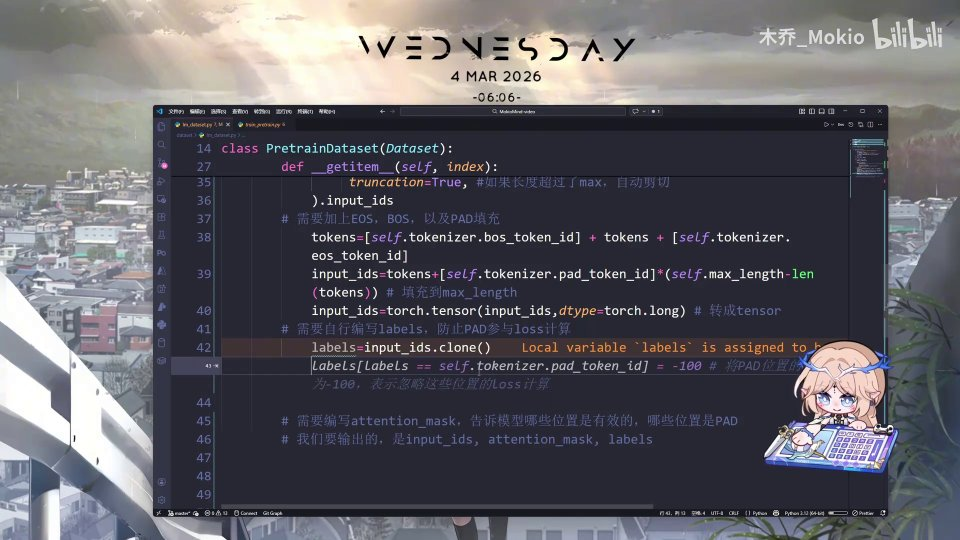 |
| 然后把 PAD 的位置设置为 0。这样一个不等式的意思就是，我们在编写的时候 [【跳转到 07:37】](https://www.bilibili.com/video/BV1T2k6BaEeC/?p=22&t=457) | 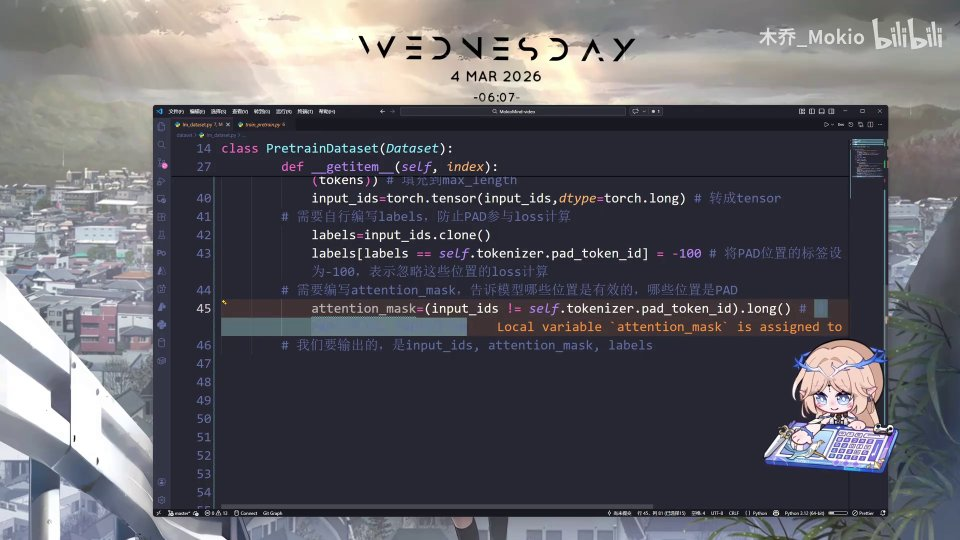 |
| 这个 attention_mask 它会是这样一个样子：1、1、1、0，这样一个 0 的部分不会参与我们的 attention 计算。好 [【跳转到 07:44】](https://www.bilibili.com/video/BV1T2k6BaEeC/?p=22&t=464) | 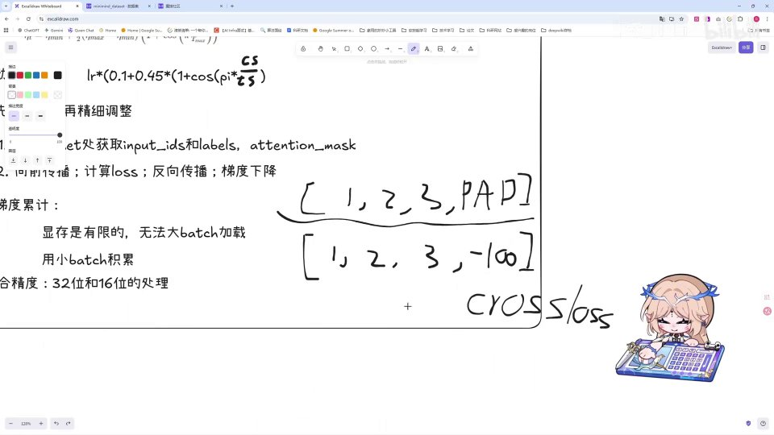 |
| 那我们全部编写完之后，需要把这部分 return 出去，直接让 AI 生成。那么这样我们整个 Dataset 的逻辑就编写完成了，好，我们下一 part 见。 [【跳转到 07:52】](https://www.bilibili.com/video/BV1T2k6BaEeC/?p=22&t=472) | 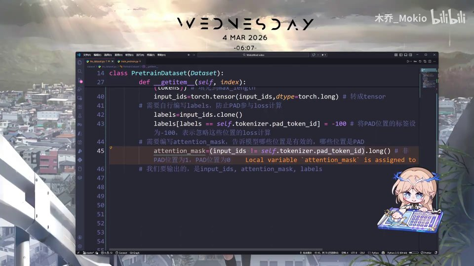 |