# 重制Pretrain：理论 原始文稿（图-字幕分栏）

| 字幕文本 | 画面 |
| :--- | ---: |
| 大家好，这一部分我们正式进入重制版预训练的理论部分讲解。 [【跳转到 00:00】](https://www.bilibili.com/video/BV1T2k6BaEeC/?p=23&t=0) | 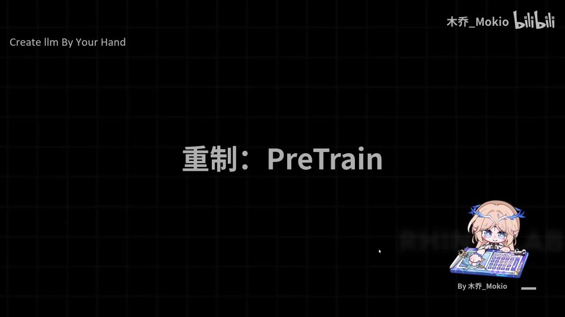 |
| 那么首先，我们来讲解一下预训练的相关概念。 [【跳转到 00:05】](https://www.bilibili.com/video/BV1T2k6BaEeC/?p=23&t=5) | 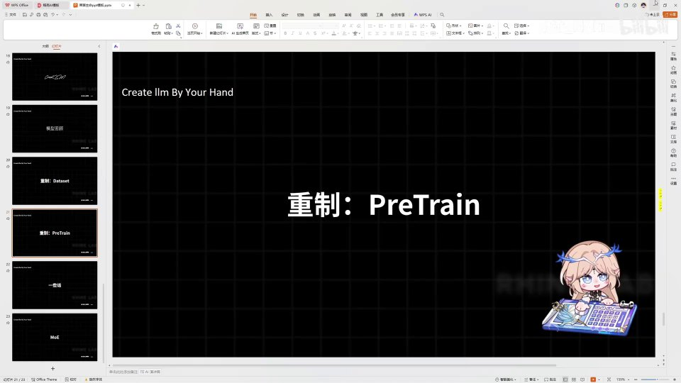 |
| 首先，预训练是什么呢？我们知道这个「预」字就是「预先」，也就是说它是在所谓正式训练和正式使用之前的阶段。那么预训练本质上就是一种「填鸭」，也就是把我们收集到的所有资料直接一股脑地喂给模型，然后模型就会在这么多的资料里学会「我下一句应该生成哪一个词」这样一个规律。 [【跳转到 00:10】](https://www.bilibili.com/video/BV1T2k6BaEeC/?p=23&t=10) | 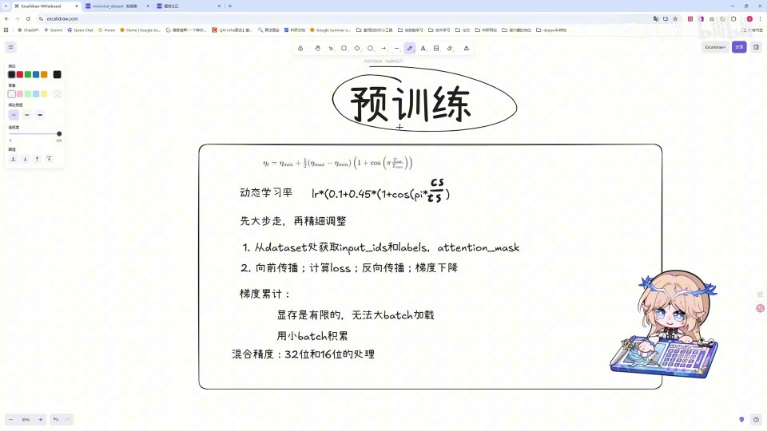 |
| 这就是预训练的简单概念，不了解的话大家可以继续按前置知识里的视频去深入学习理解。那么在预训练的过程中，我们首先需要了解一些相关的方法。首先我们都知道，训练的本质就是这四步：首先前向传播，然后计算 loss，接着反向传播和梯度下降。 [【跳转到 00:35】](https://www.bilibili.com/video/BV1T2k6BaEeC/?p=23&t=35) | 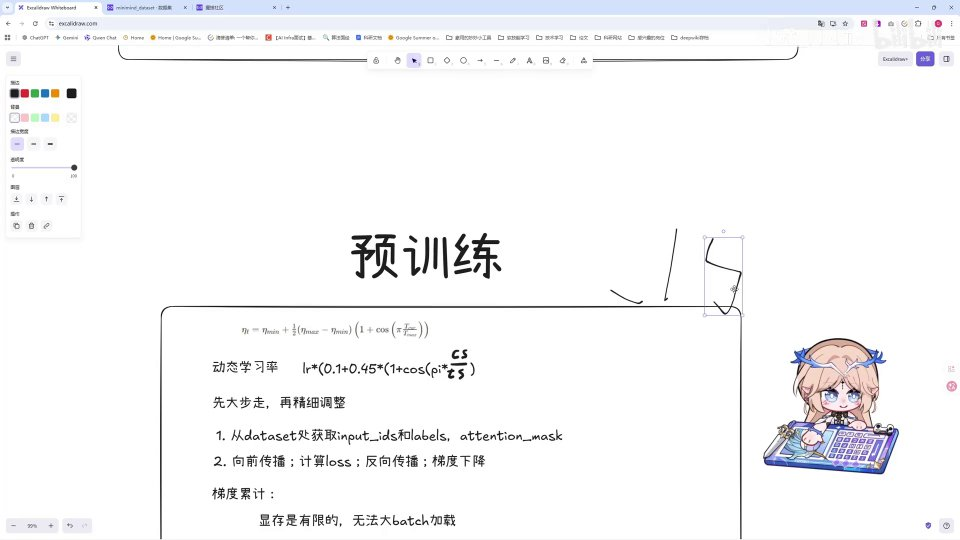 |
| 这是非常基础的基础知识，大伙不懂的话还可以再补充一下。那么在这里，在反向传播和梯度下降的过程中，我们都知道，在调整比如 W 参数的时候，我们都是让它减去「学习率乘以梯度」这样一个量。那么在这里，我们会对学习率进行一个动态的要求。 [【跳转到 01:00】](https://www.bilibili.com/video/BV1T2k6BaEeC/?p=23&t=60) | 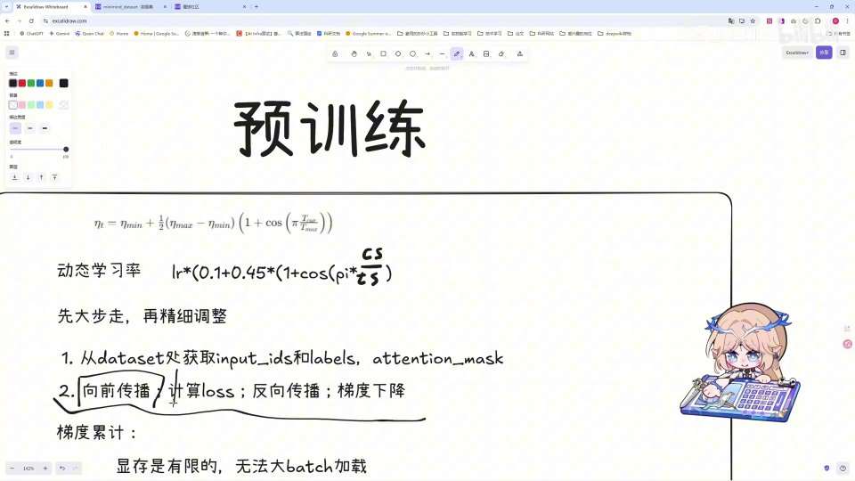 |
| 如果说我们的学习率一直固定为某一个值的话，那么它每次学习所要改变的内容 [【跳转到 01:25】](https://www.bilibili.com/video/BV1T2k6BaEeC/?p=23&t=85) | 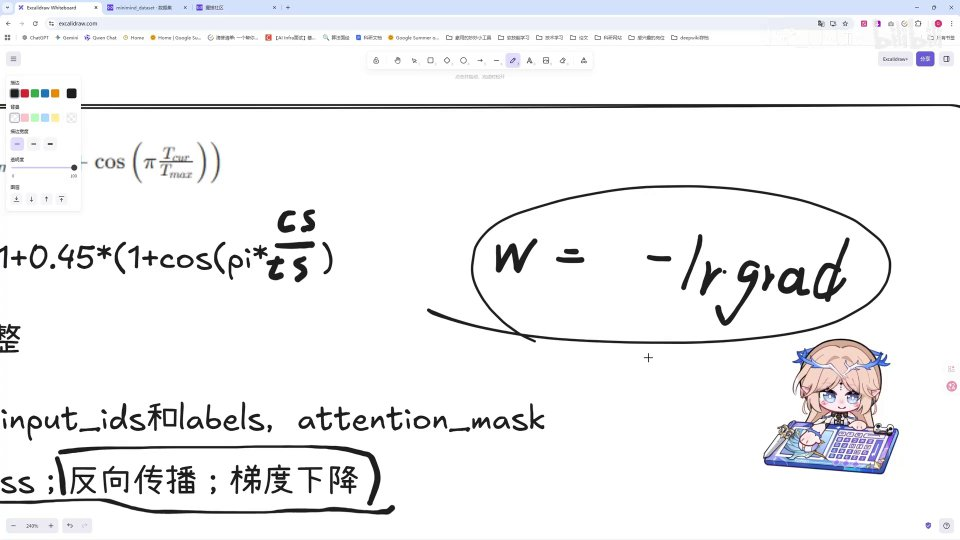 |
| 也会比较相近，就会导致一些常见的问题， [【跳转到 01:30】](https://www.bilibili.com/video/BV1T2k6BaEeC/?p=23&t=90) | 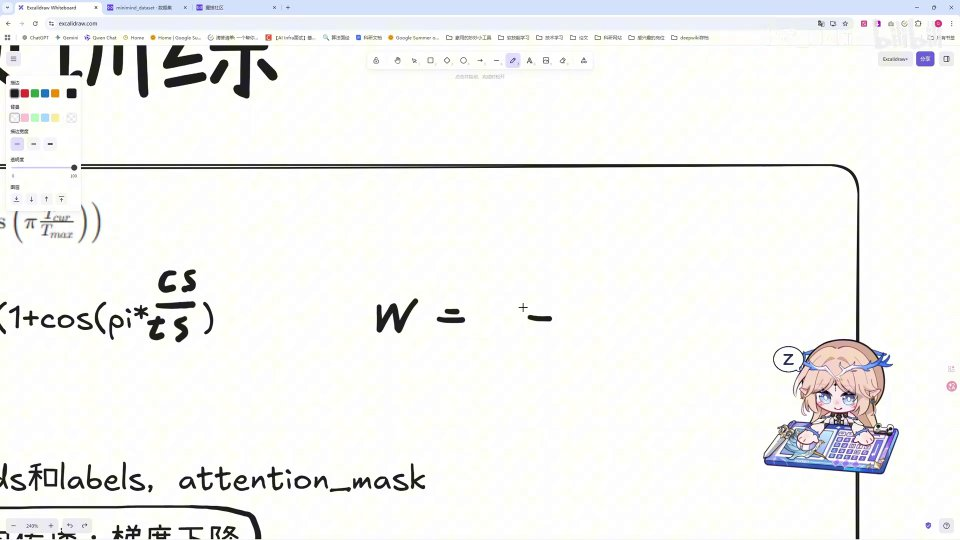 |
| 比如梯度下降、梯度爆炸或者学习不稳定。那么我们这里就有一个动态学习率的公式，我们可以看到：把学习率的最大值设置为一，最小值设置为 0.1，最后得到的学习率就长这样一个样子。那么我们可以代入式地来看一下 [【跳转到 01:35】](https://www.bilibili.com/video/BV1T2k6BaEeC/?p=23&t=95) |  |
| 这样一个公式的效果。首先 cs 就是 current step，也就是当前的步数；tS 就是 total step，也就是总的步数。当我们一开始步数为零的时候，我们可以把它代入进去，那么为零的话这部分就是零，cos 内部为零，cos 值就为一，也就是这一部分为一；为一的话，1 加 1，括号里就是 2，2 乘以 0.45 再加上 0.1， [【跳转到 01:55】](https://www.bilibili.com/video/BV1T2k6BaEeC/?p=23&t=115) | 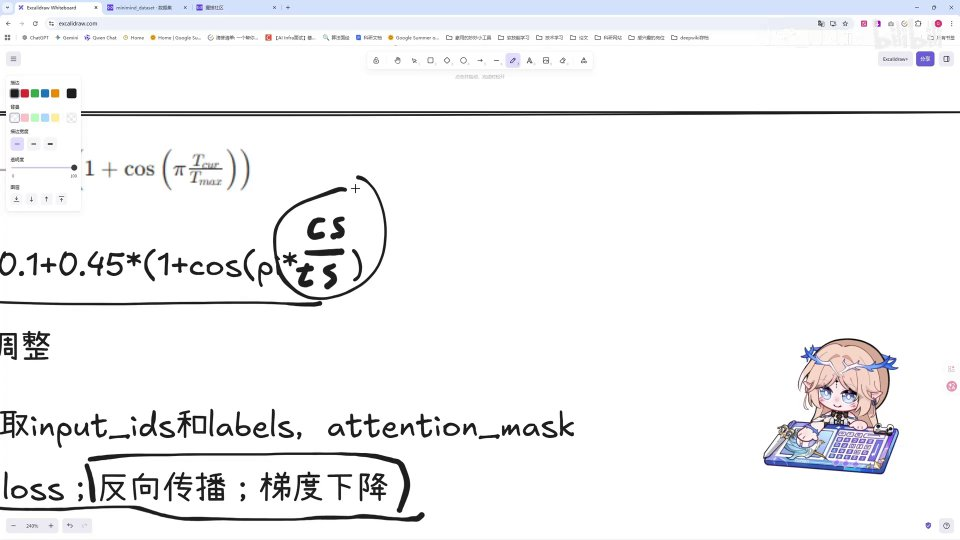 |
| 也就是当我们 current step 等于零的时候，我们的学习率是一。那么当我们的 current step 等于 total step 呢，我们经过计算之后可以很简单地算出来这样一个学习率， [【跳转到 02:20】](https://www.bilibili.com/video/BV1T2k6BaEeC/?p=23&t=140) | 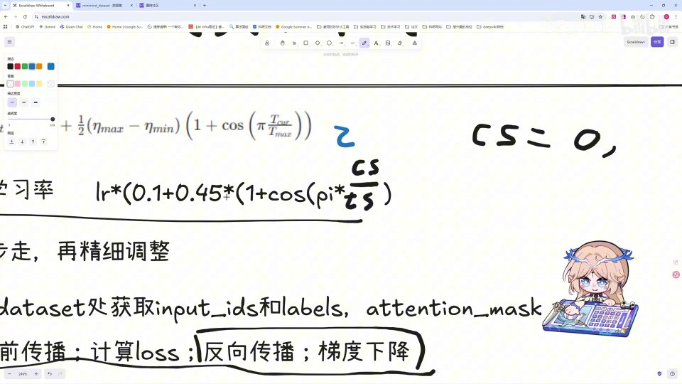 |
| 就是 0.1。那么这样就实现了一个什么样的目的呢？就是我在训练的时候，从头一直到我们训练结束，我们的学习率是从 1 到 0.1，实现一个逐渐下降的过程。也就是说，我们会让模型在学习的时候 [【跳转到 02:31】](https://www.bilibili.com/video/BV1T2k6BaEeC/?p=23&t=151) | 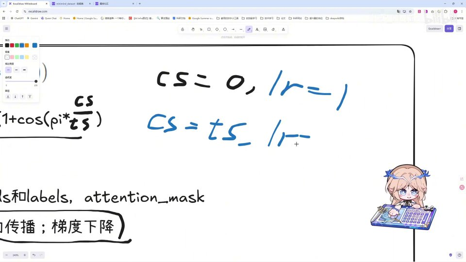 |
| 尽可能先大步走，然后再精细地去调整参数。这个逻辑大家应该能体会到， [【跳转到 02:45】](https://www.bilibili.com/video/BV1T2k6BaEeC/?p=23&t=165) | 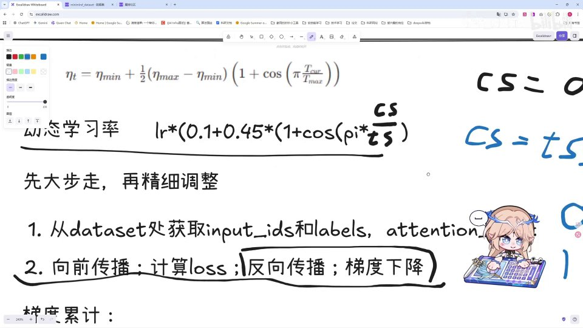 |
| 就是我先让模型尽快地去进行相关内容的学习；在学习到后期的时候，那么这样一个和 cos 有关的学习率 [【跳转到 02:52】](https://www.bilibili.com/video/BV1T2k6BaEeC/?p=23&t=172) | 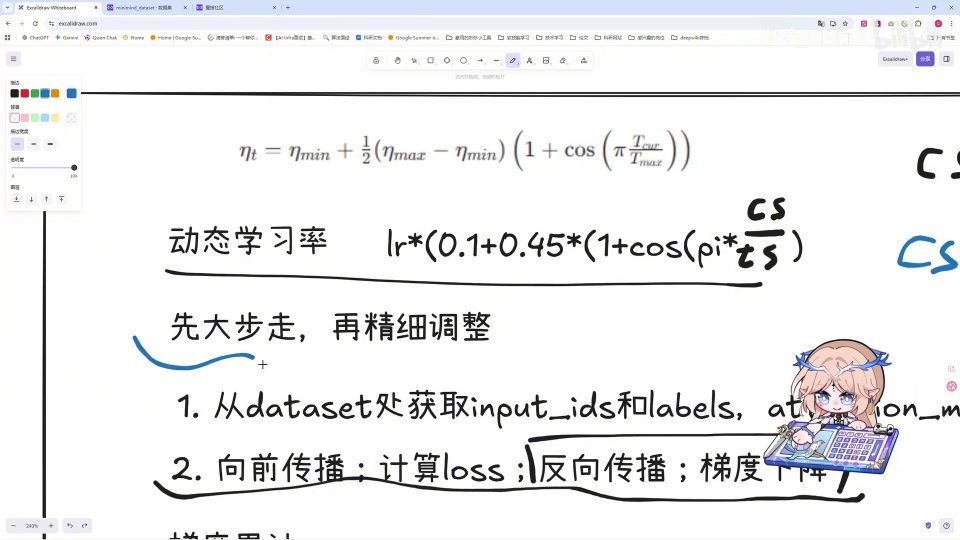 |
| 我们也叫它「余弦退火学习率策略」。这部分大家想更深入了解的话，可以去看相关的知识或者论文。好，那么在讲解完这样一个学习率之后，我们来看一下我们预训练的部分。 [【跳转到 03:02】](https://www.bilibili.com/video/BV1T2k6BaEeC/?p=23&t=182) |  |
| 就很简单，从 data 加载的部分获取到 input 的 id、labels 和 attention mask， [【跳转到 03:20】](https://www.bilibili.com/video/BV1T2k6BaEeC/?p=23&t=200) | 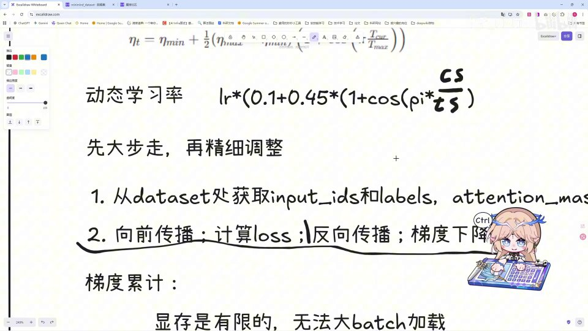 |
| 之后经过我们的 loss 去进行计算。那么这里还有两个方法需要去抠，就是梯度累积和混合精度， [【跳转到 03:25】](https://www.bilibili.com/video/BV1T2k6BaEeC/?p=23&t=205) | 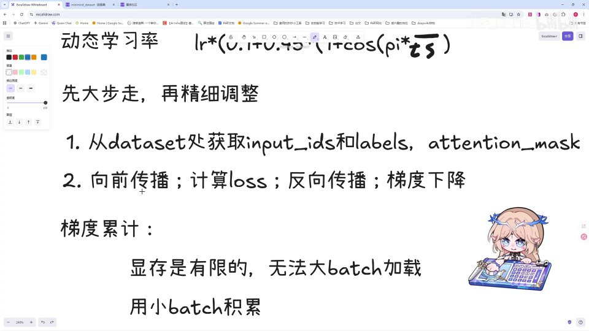 |
| 在后面的代码里方便大家去理解。首先，梯度累积是什么意思呢？我们的显存是有限的，比如说我这一台机器把它的性能打开之后，可以看到我的显卡内存只有 8G，那么显存是有限的。比如说我要加载一个超级大的 batch，比如我加载一个 1280 长度的 batch， [【跳转到 03:33】](https://www.bilibili.com/video/BV1T2k6BaEeC/?p=23&t=213) | 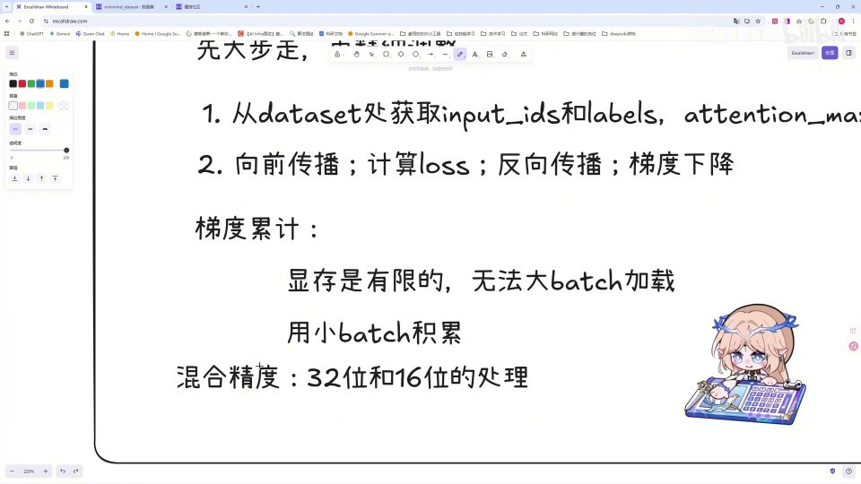 |
| 那我加载不进来怎么办呢？我就去把小的 batch 一个一个地计算进来， [【跳转到 03:54】](https://www.bilibili.com/video/BV1T2k6BaEeC/?p=23&t=234) | 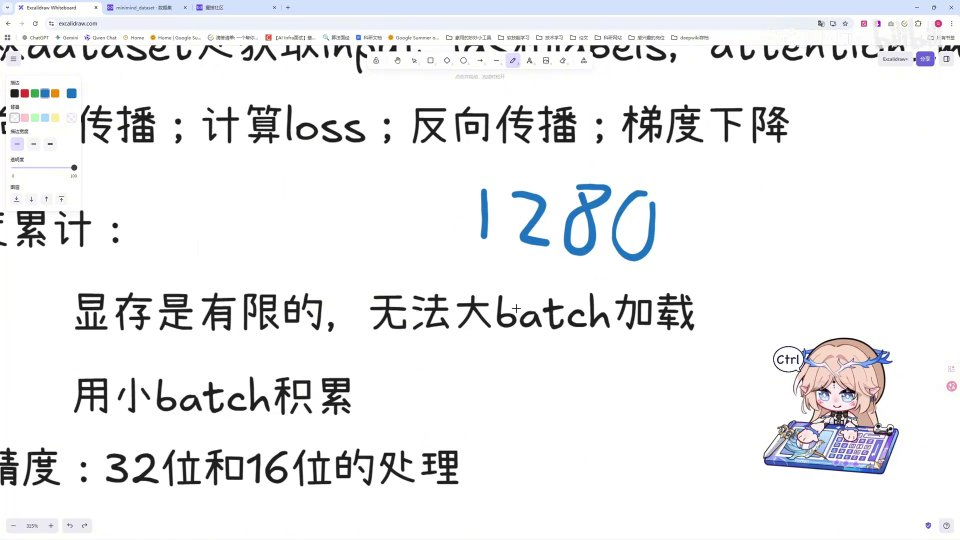 |
| 比如说我先加载 160 个 batch，再加载 160 个 batch，这样去加载，加载完八次之后，我把八次计算出的梯度进行累加，累加之后再除以八次， [【跳转到 03:59】](https://www.bilibili.com/video/BV1T2k6BaEeC/?p=23&t=239) | 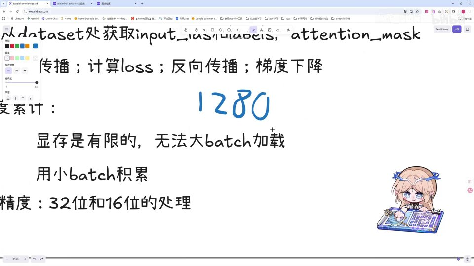 |
| 得到一个平均的梯度，那么这就是我们的梯度累积策略。还有一个叫混合精度的东西，这个呢我不会很详细地介绍，大家简单意会一下就行。混合精度呢，就是我们模型常用的是 32 位的精度，那 32 位肯定是很长的，它虽然精度高，但是它占用的内存部分也大，所以我们会用混合精度， [【跳转到 04:12】](https://www.bilibili.com/video/BV1T2k6BaEeC/?p=23&t=252) |  |
| 让它以 16 位的数据方式参与进来。那么这样呢，16 位它占用的空间肯定就小，但是带来的问题就是它的精度也会下降。比如说我们实际在用 32 位计算的时候，计算到了就是 16 位之后的——比如这一部分，我们算了一个值，比如 0.000000123，那么在 16 位的情况下 [【跳转到 04:37】](https://www.bilibili.com/video/BV1T2k6BaEeC/?p=23&t=277) | 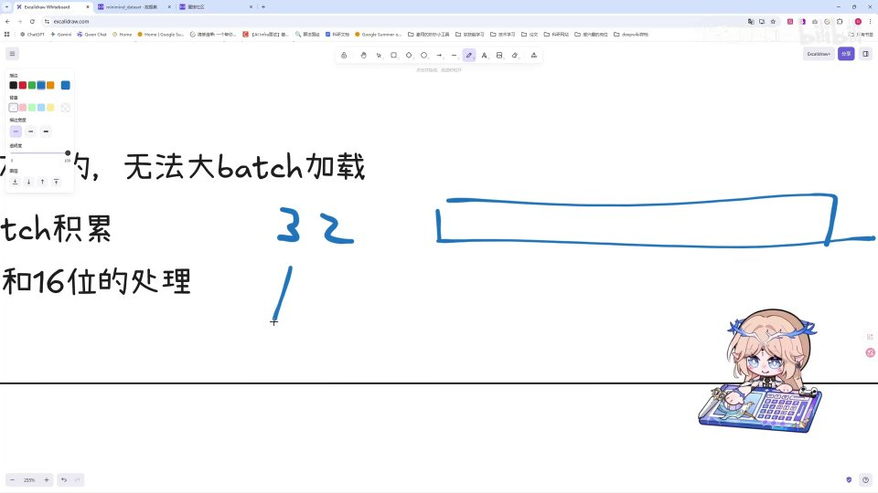 |
| 这个 123 就会被忽略掉，因为它的精度只到 16 位，这部分就忽略掉、它就为零。但是我们不想抛弃这一部分，我们怎么做呢？我们会给它加一个放大器，叫 scaler（梯度缩放器），我们把这一部分小的数值给它放大到 16 位以内的部分，这样这一部分也能够完整地被学习到；然后在之后呢，我们再把放大的这部分缩小回去还原就可以。好， [【跳转到 05:02】](https://www.bilibili.com/video/BV1T2k6BaEeC/?p=23&t=302) |  |
| 那么这就是预训练的相关部分。总体来说，预训练的概念和过程都是很简单的、很传统的，但是这里会有一些相对应的优化策略，大家学习一下就好。好，那我们下一块进入重制版的预训练代码讲解。 [【跳转到 05:27】](https://www.bilibili.com/video/BV1T2k6BaEeC/?p=23&t=327) | 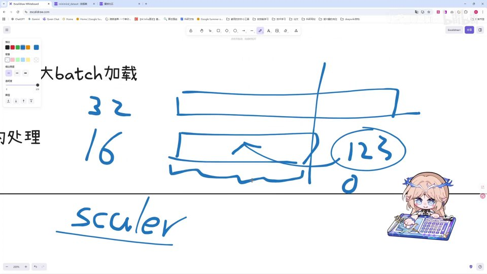 |