# 重制Pretrain：代码 原始文稿（图-字幕分栏）

| 字幕文本 | 画面 |
| :--- | ---: |
| 大家好，这一 part 我们进入到重制版的预训练代码部分的讲解 [【跳转到 00:00】](https://www.bilibili.com/video/BV1T2k6BaEeC/?p=24&t=0) |  |
| 整个训练的代码还是比较复杂的，建议大家在学的时候 [【跳转到 00:05】](https://www.bilibili.com/video/BV1T2k6BaEeC/?p=24&t=5) | 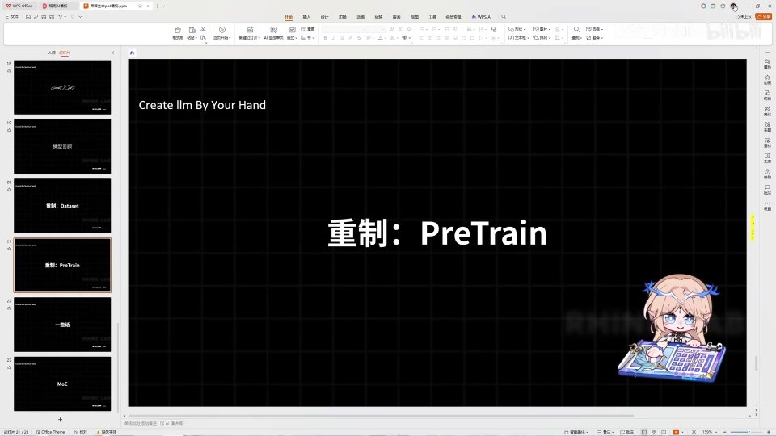 |
| 可以直接去复制粘贴，把我仓库里的预训练代码复制粘贴过来；如果你想继续跟着手敲的话，可以跟着我来看一下。前面的部分我们就不多讲了，预训练的核心部分就在于这样一个 train_epoch，也就是每一个 batch 里他训练的具体逻辑，这部分就是我们具体要手抄的地方 [【跳转到 00:10】](https://www.bilibili.com/video/BV1T2k6BaEeC/?p=24&t=10) | 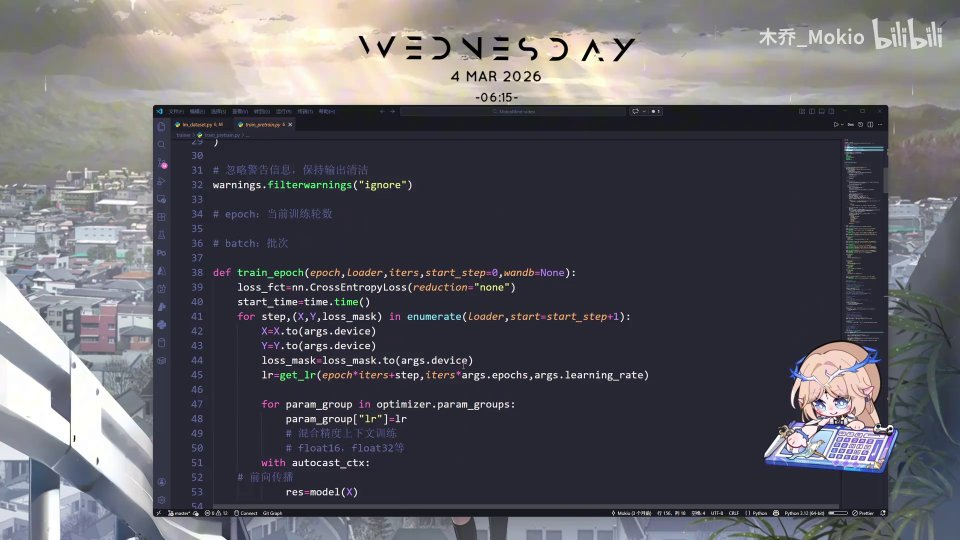 |
| 我们把这部分给删掉，自己来进行手抄；后面的这些部分大家可以保留，因为它是一些实验记录、评估模式、保存之类的方法，不算我们最核心的内容，大家想了解的话也可以自己去阅读。我们先把前面最核心的代码部分编写一下。首先我们会写一个 start_time 等于 time [【跳转到 00:35】](https://www.bilibili.com/video/BV1T2k6BaEeC/?p=24&t=35) |  |
| time.time()，也就是用于计算我们的开始时间，这也不是核心逻辑。好，那么接下来就是核心逻辑了。首先我们需要去遍历训练数据、依次循环，就是 for step 循环，然后我们拿到我们的 input_ids [【跳转到 01:00】](https://www.bilibili.com/video/BV1T2k6BaEeC/?p=24&t=60) | 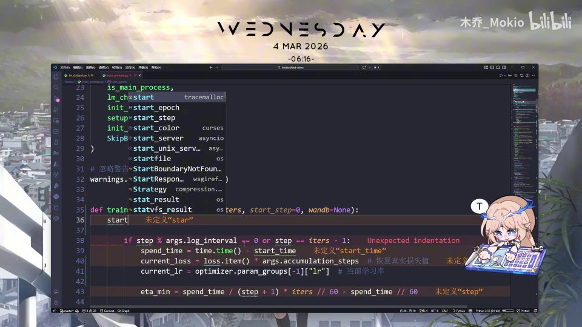 |
| 把 attention_mask 和 labels 从我们的 loader 里取出来。然后这里我们需要写上 start 等于 step 加一。然后我们把 input_ids、attention_mask 还有 labels 都放到参数指定的 device 里 [【跳转到 01:25】](https://www.bilibili.com/video/BV1T2k6BaEeC/?p=24&t=85) | 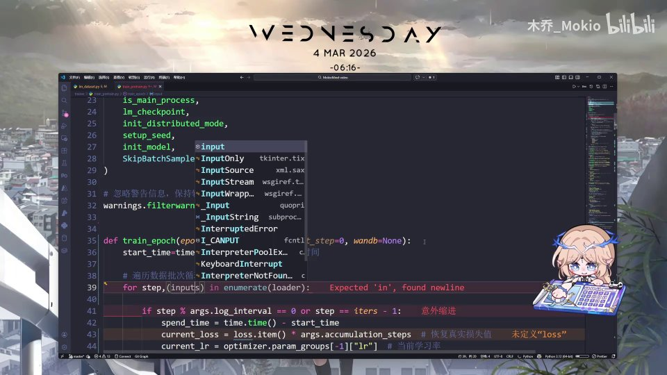 |
| 也就是把它搬到 CPU 上，将数据移动到指定设备（这里是 CPU）。然后接下来我们就需要去写我们的 LR 的获取方法，这里用 get_lr 来获取。那么这个 get_lr 是从哪来的呢？这里我们一般会有一个文件叫 trainer_utils.py [【跳转到 01:50】](https://www.bilibili.com/video/BV1T2k6BaEeC/?p=24&t=110) |  |
| 这里是一些训练相关的函数。这个我也建议你直接从我的代码仓库里把它复制粘贴过来。常用的函数都会放在这里，比如设置种子、初始化这些，不是我们的核心逻辑，大家如果想看的话也请自己阅读代码去学习和理解。那么在有 get_lr 之后，我们把 get_lr 所需要的参数传进去 [【跳转到 02:15】](https://www.bilibili.com/video/BV1T2k6BaEeC/?p=24&t=135) | 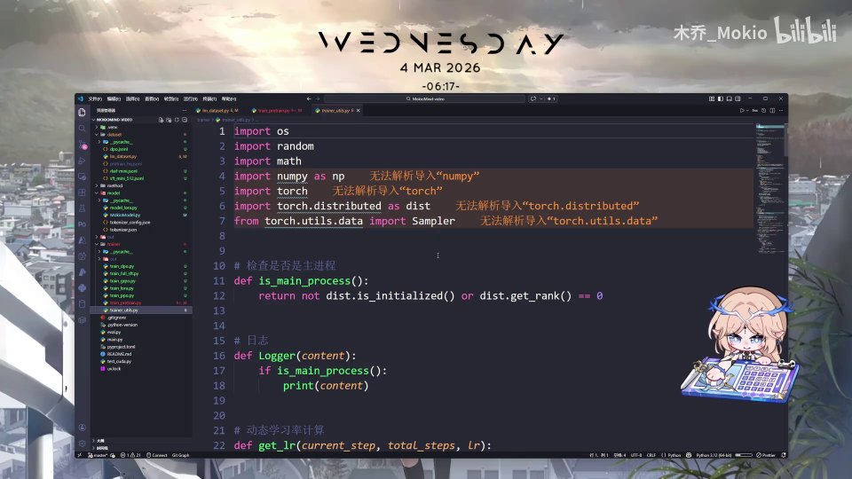 |
| 可以看到这里有个 current_step、total_steps 和 lr [【跳转到 02:40】](https://www.bilibili.com/video/BV1T2k6BaEeC/?p=24&t=160) | 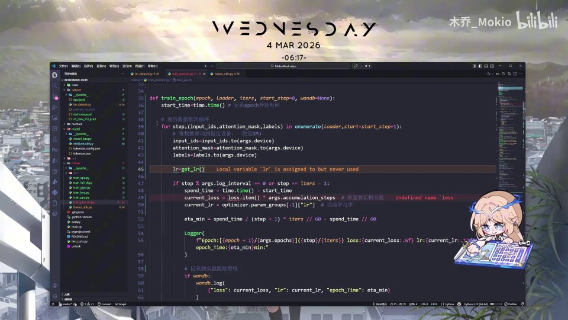 |
| 那么我们这里就把在这里设定的 current_step（也就是我们的 epoch 乘以 iters，再加上 step），以及我们总的训练步数（就是 epochs 乘以 iters） [【跳转到 02:46】](https://www.bilibili.com/video/BV1T2k6BaEeC/?p=24&t=166) | 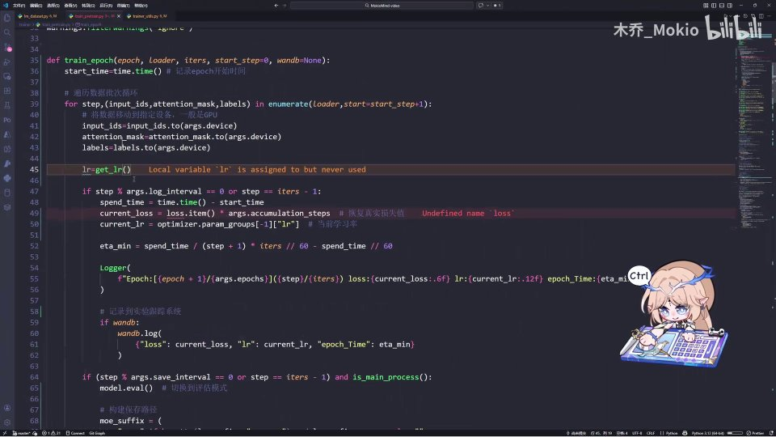 |
| epochs 乘以 iters，然后还有我们自己定义的这样一个学习率，我们把它传进去之后，就能拿到我们的一个动态学习率。然后我们需要把这个学习率放到优化器的参数里，这是我们在前置知识里所讲的——需要把优化器的学习率设置为这样一个动态学习率。然后就用到我们的混合精度 [【跳转到 03:11】](https://www.bilibili.com/video/BV1T2k6BaEeC/?p=24&t=191) |  |
| 混合精度我们这里只需要写一个 autocast ctx，它就能自动地去进行实现。写上之后，接下来首先就到了我们训练的老四样：向前传播、计算 loss、反向传播 [【跳转到 03:36】](https://www.bilibili.com/video/BV1T2k6BaEeC/?p=24&t=216) | 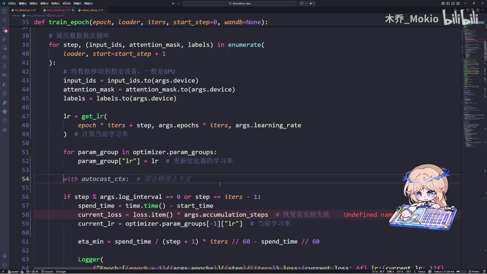 |
| 然后梯度下降，这老四步。那么前向传播非常简单，我们让返回的东西等于我们的模型，把 input_ids、labels、attention_mask 全都输入进去，得到我们的前向传播、计算 loss。loss 就等于我们返回值的 loss，再加上这里我多写一步——加上我们的 res.aux_loss [【跳转到 04:01】](https://www.bilibili.com/video/BV1T2k6BaEeC/?p=24&t=241) |  |
| 这个 aux_loss 辅助 loss 是我们后面 MOE 的相关部分，你在这里可以先把它写上去，可以看后面的视频去进行相关的了解。然后就用到我们前面所讲的：loss 等于 loss 除以（2 乘以 args.accumulation_steps），来做一个平均化的损失。接下来就要用到我们前面所讲的 [【跳转到 04:26】](https://www.bilibili.com/video/BV1T2k6BaEeC/?p=24&t=266) | 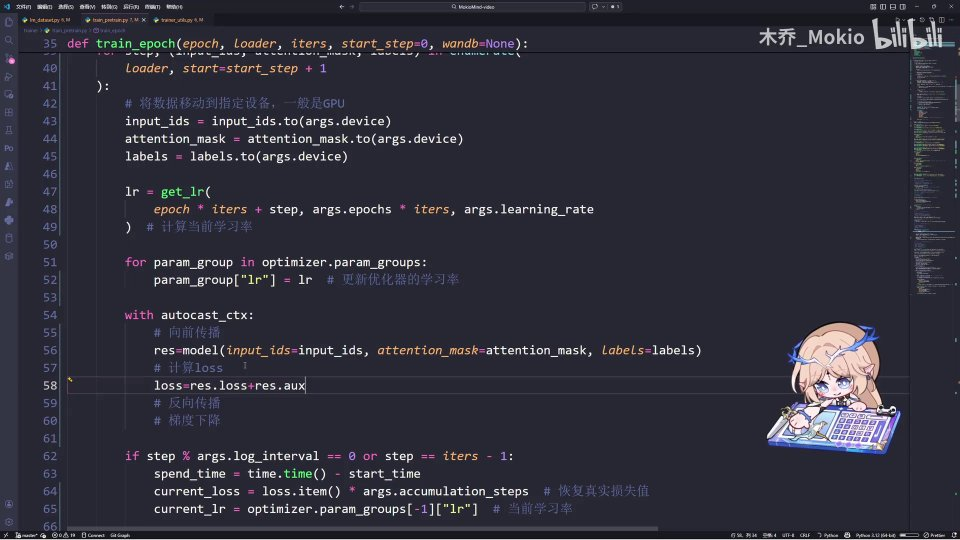 |
| 我们需要去编写一个 scaler，对梯度进行一个缩放，然后反向传播。接下来就需要用到我们前面所讲的梯度累积的部分：如果我们当前的步数 [【跳转到 04:51】](https://www.bilibili.com/video/BV1T2k6BaEeC/?p=24&t=291) | 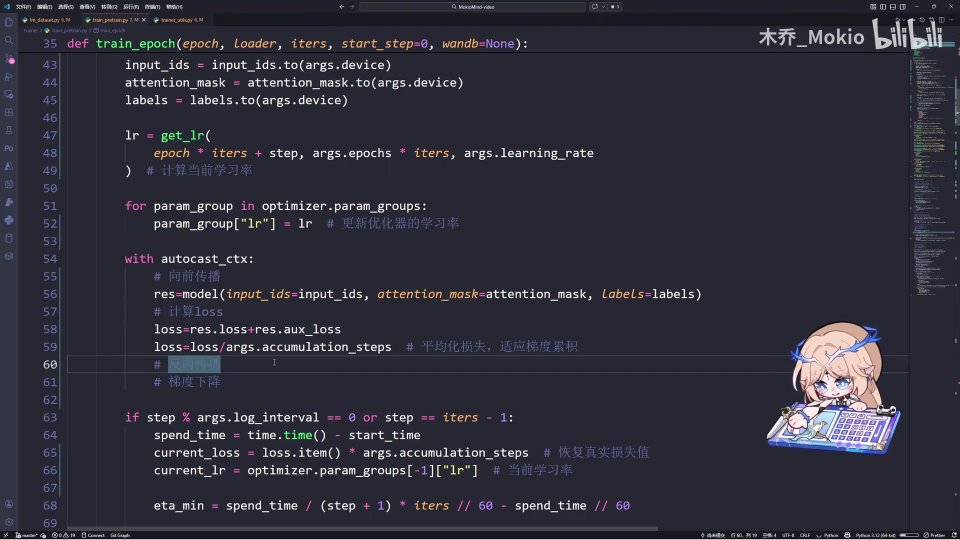 |
| 如果我们当前的步数加一，然后它去对参数里的 accumulation_steps 取余，如果它等于零的话——如果它等于零的话，那么我们就让我们的 scaler [【跳转到 05:16】](https://www.bilibili.com/video/BV1T2k6BaEeC/?p=24&t=316) | 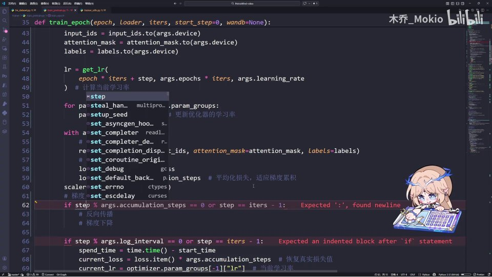 |
| 去还原我们梯度的一个真实值（unscale_），然后我们进行一个梯度裁剪。这个梯度裁剪就是为了防止我们前面所讲的出现梯度爆炸的问题。然后我们再用 scaler.step 配合 optimizer 去更新参数，之后写上 update 去更新我们的这样一个 scaler。这个 scaler、optimizer 这些都是 PyTorch 的基础知识 [【跳转到 05:41】](https://www.bilibili.com/video/BV1T2k6BaEeC/?p=24&t=341) | 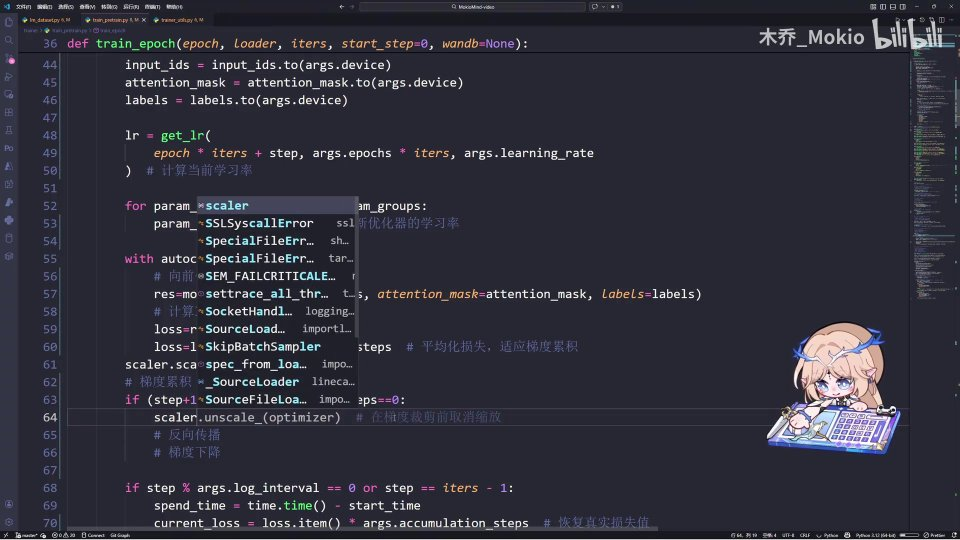 |
| 大家不了解的话去学习。最后我们用 zero_grad 去把梯度清理完成。那么这样，整个训练的第一个 epoch 我们就编写完了，它的每个 batch 内部就是这么一些逻辑，最后让它的梯度清零。好，那么这样我们就把我们的 PreTrain 最核心的这一部分 [【跳转到 06:06】](https://www.bilibili.com/video/BV1T2k6BaEeC/?p=24&t=366) | 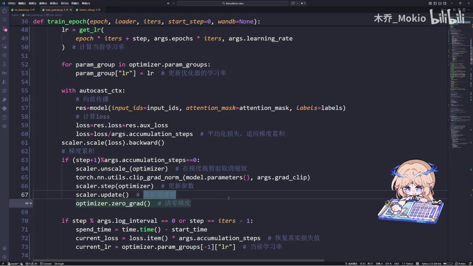 |
| 逻辑给编写完成了。大家可以重新理一下这样一个顺序，本质上就是从我们的 DATASET 里把所需要的部分拿过来，把学习率拿过来，然后进行训练的老四样，中间穿插一些梯度累积、梯度裁剪这样的一些方法。那么后面我也带大家来看一下它的核心逻辑 [【跳转到 06:31】](https://www.bilibili.com/video/BV1T2k6BaEeC/?p=24&t=391) | 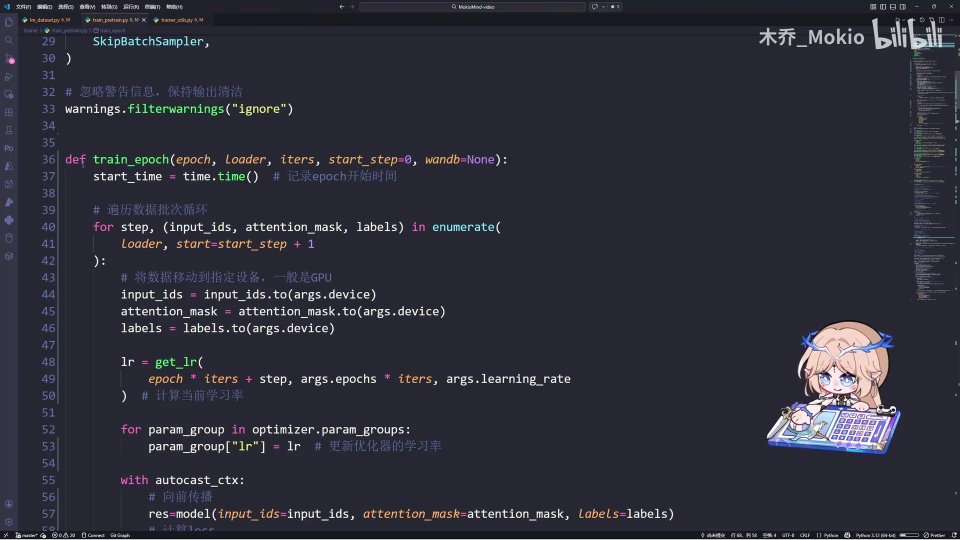 |
| 就是后面这一部分：进行一些计算、进行一些跟踪、打一些日志，包括这里切换评估模式、构建保存路径，然后保存我们的模型，然后保存训练的完整状态这个 checkpoint。大伙想了解的话也建议大家去学习一下。那么这里恢复我们的训练模式，然后 main 里的逻辑呢 [【跳转到 06:56】](https://www.bilibili.com/video/BV1T2k6BaEeC/?p=24&t=416) | 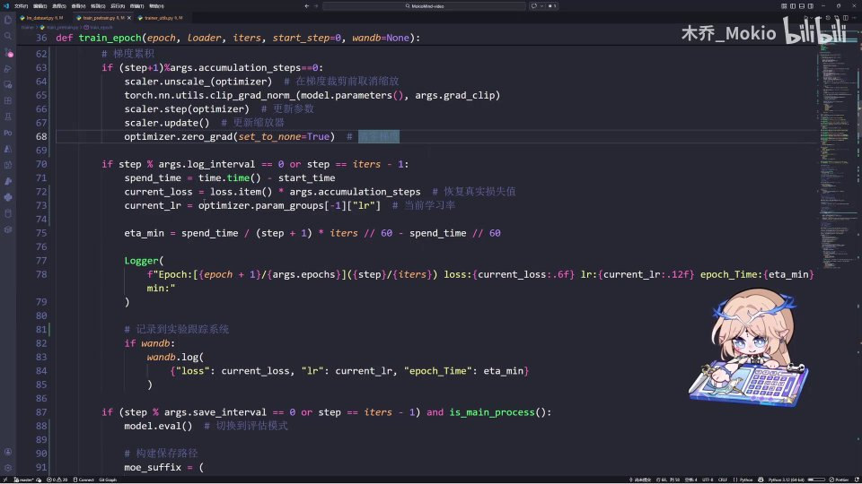 |
| 就是他会给这个脚本加上各种参数（这块大伙不用看），然后设置种子，然后设置我们模型要保存的目录这样一些部分，然后设置混合精度的相关内容，然后设置 wandb 去进行训练的追踪。后面的我们会把模型定义下来之后，把我们的 DATASET 定义下来 [【跳转到 07:21】](https://www.bilibili.com/video/BV1T2k6BaEeC/?p=24&t=441) | 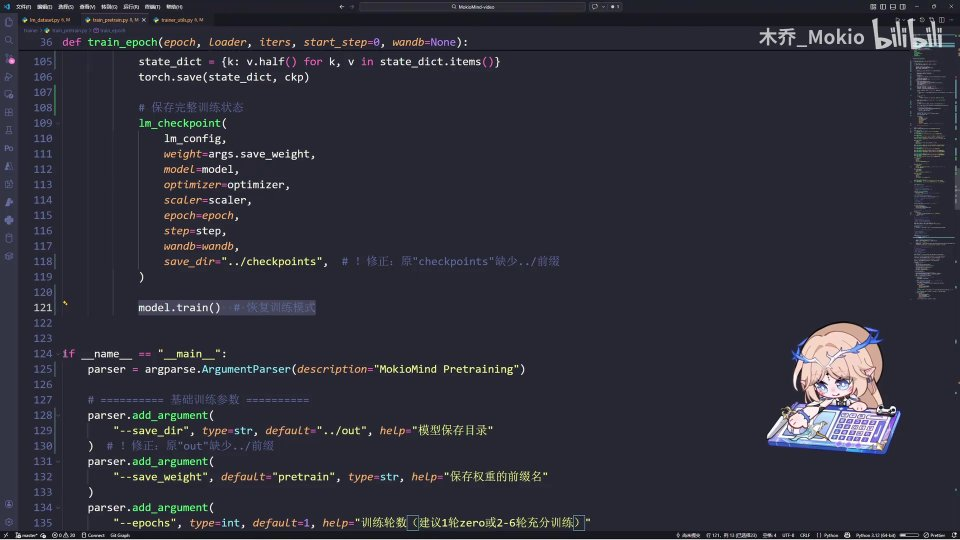 |
| 把我们的 scaler 定义下来、optimizer 定义下来，然后去执行，用 epoch 来把整个所需要跑的循环给跑完。后面那部分不算我们最核心的逻辑，但也比较重要，大伙如果想深入学习的话自行阅读一下就好。那我们这一 part 也算是把预训练的相关 [【跳转到 07:46】](https://www.bilibili.com/video/BV1T2k6BaEeC/?p=24&t=466) | 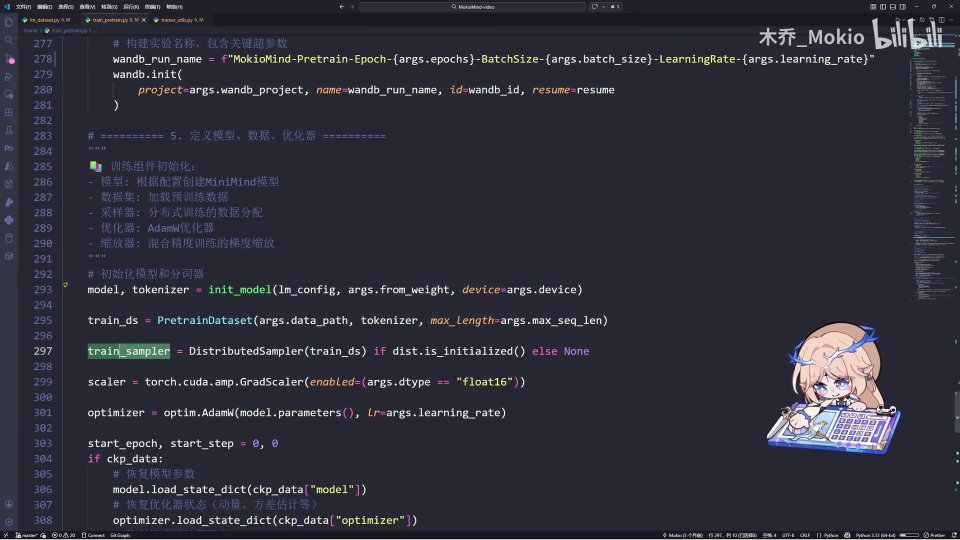 |
| 一些知识给讲完了。代码呢，大伙一定要详细理解，我也没有讲得很深入，有一些具体代码上的细节大伙不懂的自己学习一下。这里呢有一个问题 [【跳转到 08:11】](https://www.bilibili.com/video/BV1T2k6BaEeC/?p=24&t=491) |  |
| 我刚刚发现的就是在这里：当我们要拿取这些参数的时候，我们原本写的是这样一个 input_ids、attention_mask 和 labels，但是这会有问题。因为我们在加载 dataset 的时候返回的是一个字典类型，然后我们如果想要获取的话，应该从字典里拿出来 [【跳转到 08:24】](https://www.bilibili.com/video/BV1T2k6BaEeC/?p=24&t=504) |  |
| 比如说这样，我要把它修改为 input_ids 等于 batch 里面的 input_ids，然后 attention_mask 等于这样，这样才能确保我们获取的是准确的 id、准确的 mask 以及准确的 label。然后同时脚本好像还有一些 step 的问题，就是步数的计算问题，但是对于我们如果是从零开始 [【跳转到 08:49】](https://www.bilibili.com/video/BV1T2k6BaEeC/?p=24&t=529) | 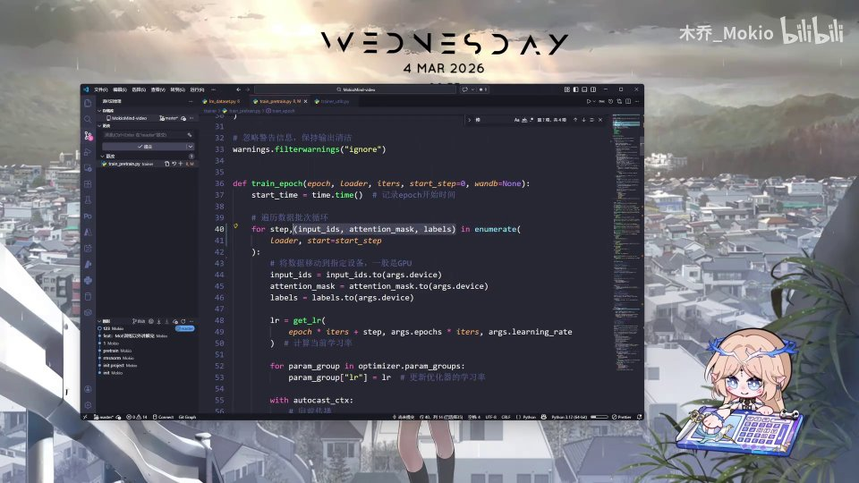 |
| 完全训练一个模型跑出来的话应该还是能跑下来，但是会有一些相关错误。那这部分大伙如果有疑问的话可以自己去问一下 AI 去解决，这里我就不去详细修改了，可以参考一下 MiniMind 的官方实现。好，那么重制版的 PreTrain 就结束 [【跳转到 09:14】](https://www.bilibili.com/video/BV1T2k6BaEeC/?p=24&t=554) | 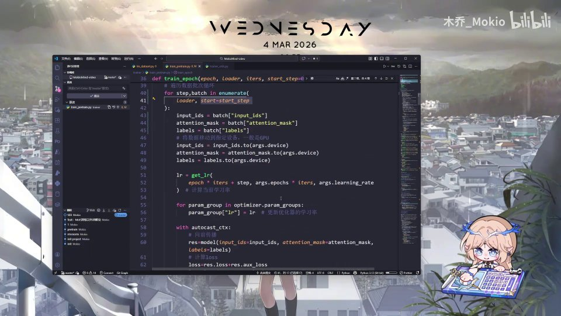 |
| 我们下一 part 见 [【跳转到 09:35】](https://www.bilibili.com/video/BV1T2k6BaEeC/?p=24&t=575) | 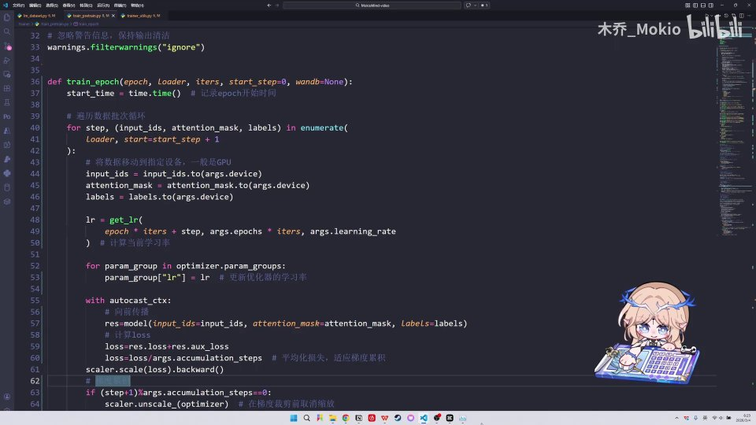 |