# 训练，启动！ 原始文稿（图-字幕分栏）

| 字幕文本 | 画面 |
| :--- | ---: |
| 好，那么这一 part 呢，我们来开始正式训练我们的模型。 [【跳转到 00:00】](https://www.bilibili.com/video/BV1T2k6BaEeC/?p=25&t=0) |  |
| 在模型的架构、dataset，包括我们的 pretrain 完成之后， [【跳转到 00:05】](https://www.bilibili.com/video/BV1T2k6BaEeC/?p=25&t=5) | 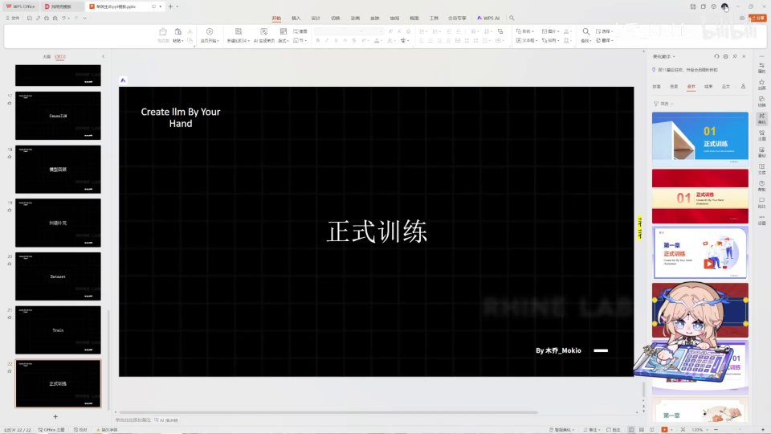 |
| 我们现在开始正式训练模型。那么在正式训练之前，依旧有几个之前发现的错误要纠正一下。首先第一点，我们在编写反向传播的时候，没有把它放到 for step 里面，也就是说它俩是平级的，那这个是错误的；我们需要给它加一个缩进，把它放到 for 循环里面来才好。然后第二点呢，就是我们其实是缺了一部分内容的。 [【跳转到 00:10】](https://www.bilibili.com/video/BV1T2k6BaEeC/?p=25&t=10) | 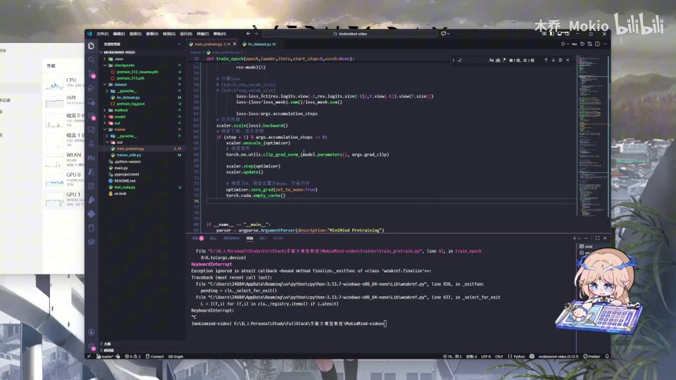 |
| 像我们打开我的 Minimind 的话，那么它原本是会有一些日志打印的。 [【跳转到 00:35】](https://www.bilibili.com/video/BV1T2k6BaEeC/?p=25&t=35) | 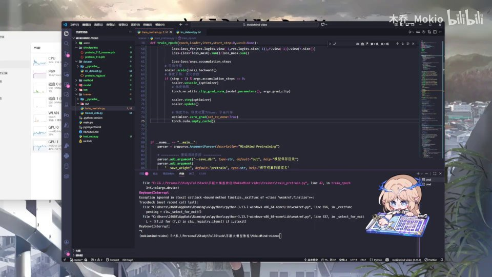 |
| 我们可以直接把这个给复制过来，像这里这一部分我们直接把它复制粘贴过来，它会在每进行一定步数的时候在终端进行一个打印，然后包括到一定的 checkpoint 的时候把它保存下来。不记得上一期讲没讲了，但是记得查看一下。然后还有之前发现的一些错误。 [【跳转到 00:43】](https://www.bilibili.com/video/BV1T2k6BaEeC/?p=25&t=43) | 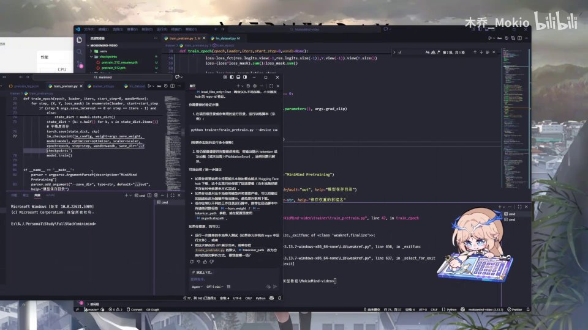 |
| 这里也需要纠正一下。首先是我们的模型文件里，在这里导入的时候，我有一些包是当时 AI 直接生成的，所以是会有问题的，像这里应该就有问题；包括这里的 action 应该是多写了，这一处修正一下。然后就是这个 PretrainModel 在导入的时候，我好像在这个地方把这个 T 写成了小写，所以也有问题。 [【跳转到 01:08】](https://www.bilibili.com/video/BV1T2k6BaEeC/?p=25&t=68) |  |
| 还有就是在一个地方的 flash 拼写我也拼错了，那这里呢，大家在运行的时候报错了记得修改一下。那么现在我们正式来开始讲解一下我们应该怎么训练。那么在训练之前呢，我们需要做的第一件事， [【跳转到 01:33】](https://www.bilibili.com/video/BV1T2k6BaEeC/?p=25&t=93) | 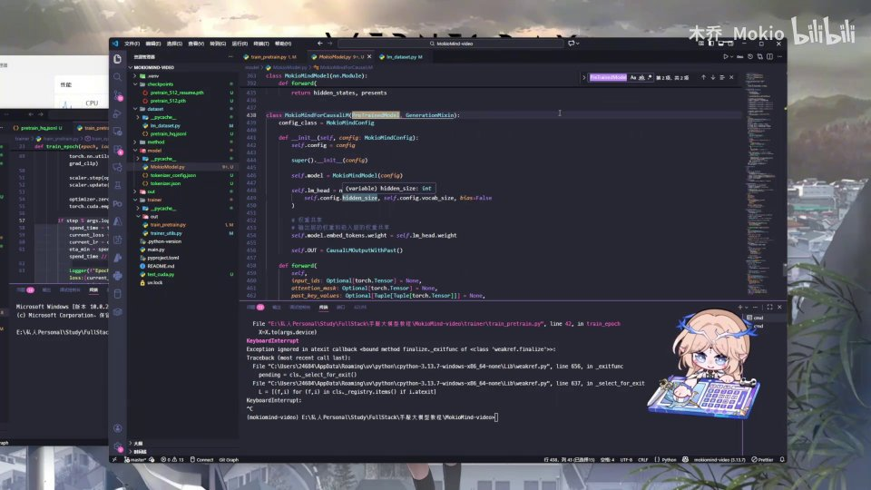 |
| 就是我们可以看一下我们的 CUDA 能不能运行。那么这里呢，你只需要写两行代码，就是你去 import torch，然后打印一下 torch 是不是 available。那么这里呢，我们来运行一下这个文件，我们来看一下。那可以看到我现在这里打印的是 True，也就是说我运行训练这个模型的时候可以使用我的 GPU、可以使用 CUDA 来跑。那么如果你是 False 呢，那么进行下一步的排查。 [【跳转到 01:47】](https://www.bilibili.com/video/BV1T2k6BaEeC/?p=25&t=107) | 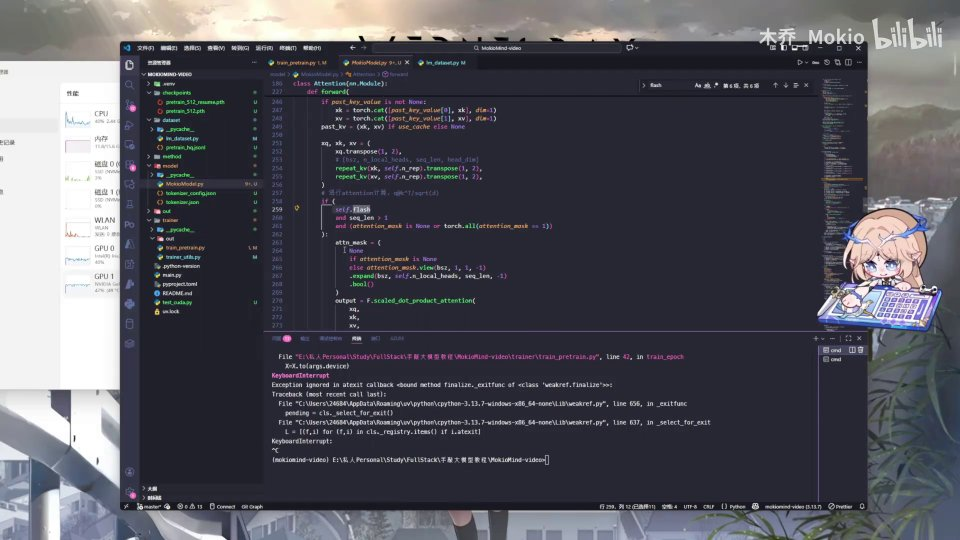 |
| 就是你可以打印一下你的 torch、打印一下 torch 的 version，那可以看到这里它会打印出你 PyTorch 的版本。我这里重点在后面：如果说你是 CPU 的话，那它后面会是带一个 CPU 的；那么这里呢，你哪怕你是英伟达的显卡也不能使用 CUDA。所以说你需要把你的 torch 给下载成…… [【跳转到 02:12】](https://www.bilibili.com/video/BV1T2k6BaEeC/?p=25&t=132) |  |
| CUDA 版本的。那么这个呢，你可以去查阅官网或者问 AI 都可以。如果说你换成 CUDA 版本还是不行，那应该就是你的驱动安装没安装好。 [【跳转到 02:37】](https://www.bilibili.com/video/BV1T2k6BaEeC/?p=25&t=157) | 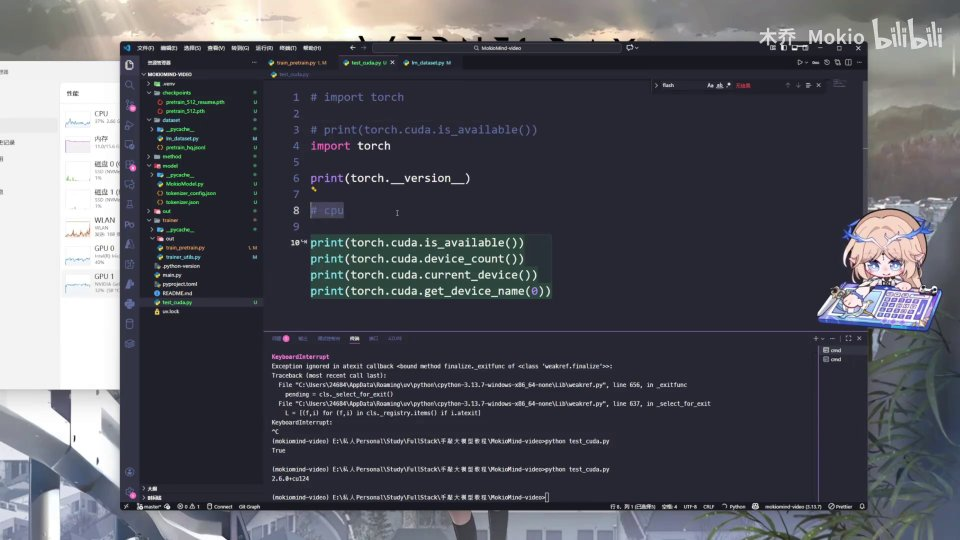 |
| 那么这些问题呢，留—— [【跳转到 02:47】](https://www.bilibili.com/video/BV1T2k6BaEeC/?p=25&t=167) | 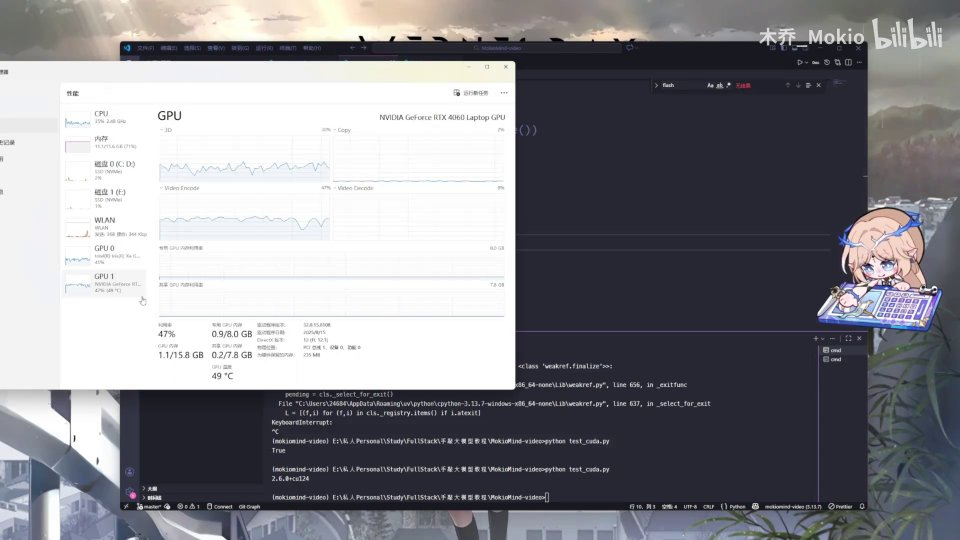 |
| 学会自己排查就好。那么接下来我们开始正式的训练。那么训练呢就很简单，我们直接敲一个脚本就好了，我就是给大家演示一下效果。那么我们用 trainer，然后我们运行一下预训练的脚本。那么我们这里同时拿出我们的 [【跳转到 02:52】](https://www.bilibili.com/video/BV1T2k6BaEeC/?p=25&t=172) | 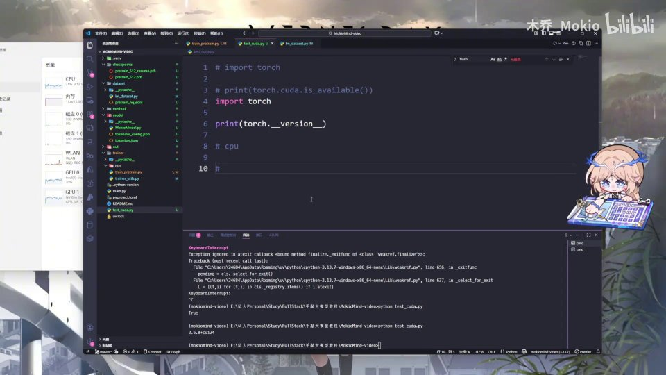 |
| 拿出我们的任务管理器，点击性能，我们来这里观察一下显卡的情况。 [【跳转到 03:13】](https://www.bilibili.com/video/BV1T2k6BaEeC/?p=25&t=193) |  |
| 那么首先呢，它首先会执行的就是加载数据嘛。 [【跳转到 03:18】](https://www.bilibili.com/video/BV1T2k6BaEeC/?p=25&t=198) | 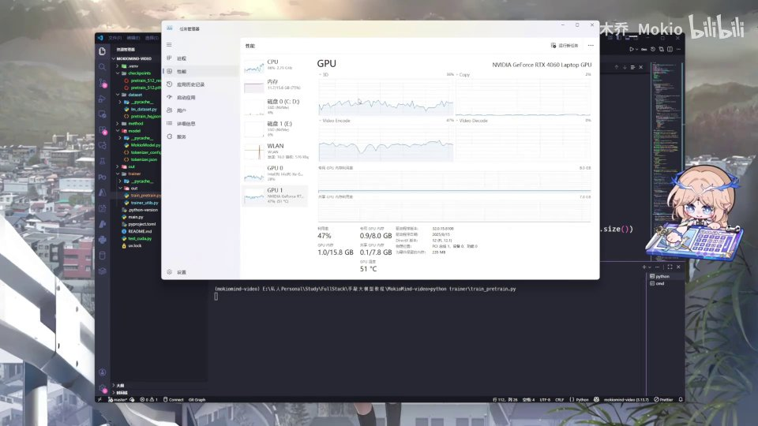 |
| 那这里可以看到我的数据加载有问题，那么我来找一下。 [【跳转到 03:23】](https://www.bilibili.com/video/BV1T2k6BaEeC/?p=25&t=203) |  |
| 因为我是在根目录下嘛，所以我如果在根目录下的话，就不需要这个来找数据集了，我就只需要去掉这个就可以。那么再次来运行一下，我们来看一下任务管理器里显卡的情况。 [【跳转到 03:28】](https://www.bilibili.com/video/BV1T2k6BaEeC/?p=25&t=208) |  |
| 可以看到现在它的显存占用是很少的，利用率也是很少的，然后这一行字加载出来—— [【跳转到 03:43】](https://www.bilibili.com/video/BV1T2k6BaEeC/?p=25&t=223) | 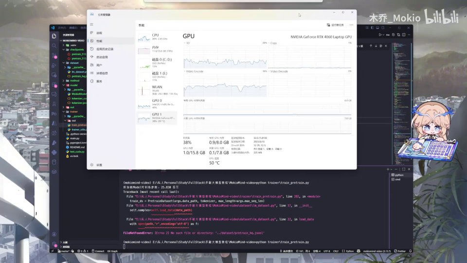 |
| 说明说我们的程序已经慢慢启动起来了。那么他第一步要做的就是说去分解数据集，然后去把数据搬运过来。那么我们可以等一会，这部分我会剪掉。 [【跳转到 03:50】](https://www.bilibili.com/video/BV1T2k6BaEeC/?p=25&t=230) |  |
| 等显卡利用率暴涨的时候给大家看一下。好，大家可以看到，到这里开始显卡的这个用量就直接飞速上涨，然后开始居高不下。那么这时候呢，就说明我们已经正式开始训练了，现在它的利用率也拉满了，而且在不断地跑。那么我们可以看一下，等会这里会打一个日志出来。 [【跳转到 04:01】](https://www.bilibili.com/video/BV1T2k6BaEeC/?p=25&t=241) | 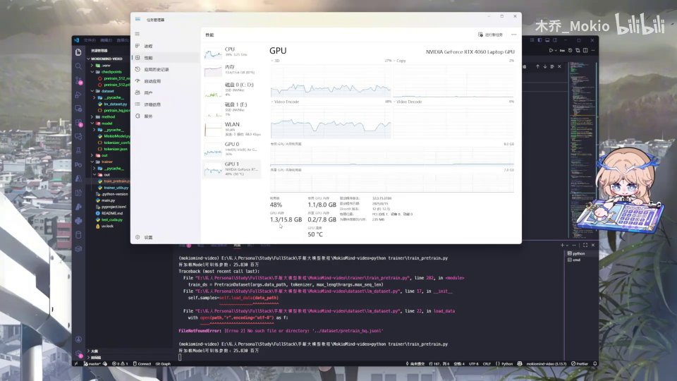 |
| 每训练 100 次……我也这也会剪掉，等训练出来。好，那么可以看到我这里是已经跑出了第一个 epoch。 [【跳转到 04:26】](https://www.bilibili.com/video/BV1T2k6BaEeC/?p=25&t=266) |  |
| 已经在这么多数据里训练了 100 步，他的 loss 现在是 7，是很高；然后他的学习率也是这个样子。然后我们需要跑完这一整轮还需要 430 分钟。那么这里呢，Minimind 它本身是通过租显卡、用 3060 来跑的。我这台可能是我本身电脑的问题，所以时间会比较慢。大家如果想跑快一点的话， [【跳转到 04:35】](https://www.bilibili.com/video/BV1T2k6BaEeC/?p=25&t=275) | 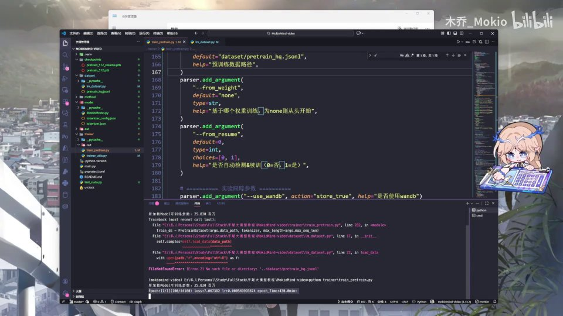 |
| 也可以自己去 AutoDL 啊，等于是租一些服务器去跑一下、试一下。那么这里大概给大家展示一下这个情况就可以。那么我们根据我们前面学的可以再看一下：看到这里他的学习率发生了轻微的变化，对吧？这和我们之前学到的动态学习率一样。然后在训练的过程中 loss 不断下降，现在已经从 7 降到了 6，然后他的预计时间也是 349 分钟。 [【跳转到 05:00】](https://www.bilibili.com/video/BV1T2k6BaEeC/?p=25&t=300) |  |
| 那么我们在训练的时候就把它放在这里，让它自己跑就好。那么我们下一 part 就开始来讲一下我们应该怎样训练出模型之后去体验一下它的效果，也就是最后一期。那我们下个 part 见。 [【跳转到 05:25】](https://www.bilibili.com/video/BV1T2k6BaEeC/?p=25&t=325) | 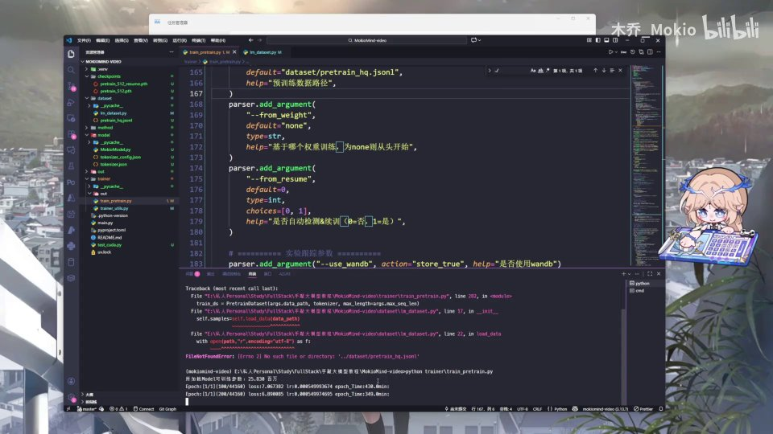 |