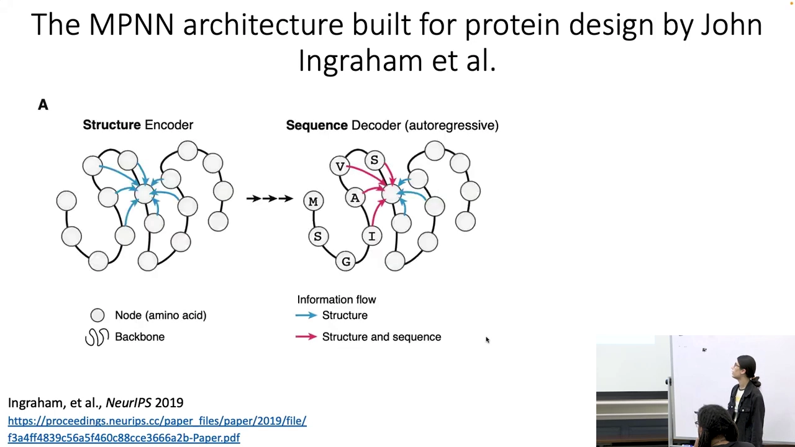
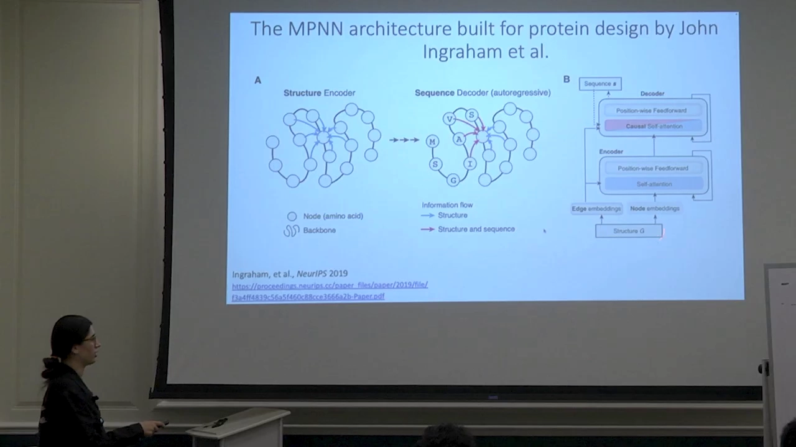
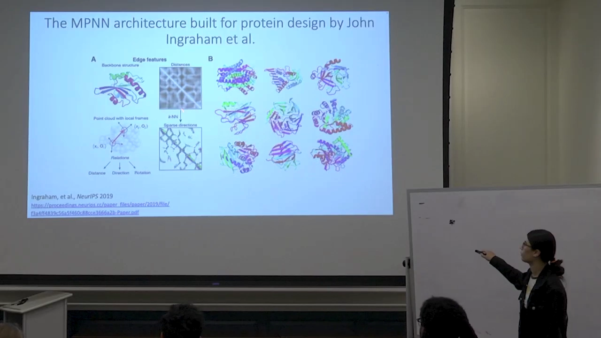
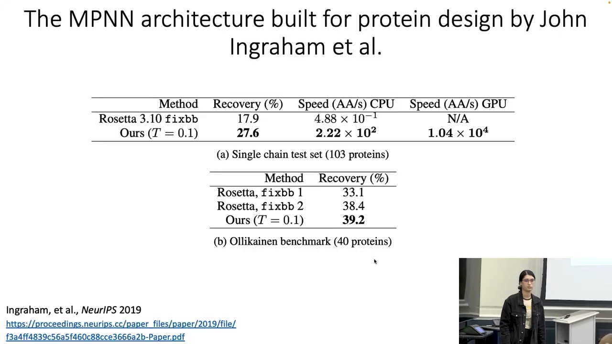
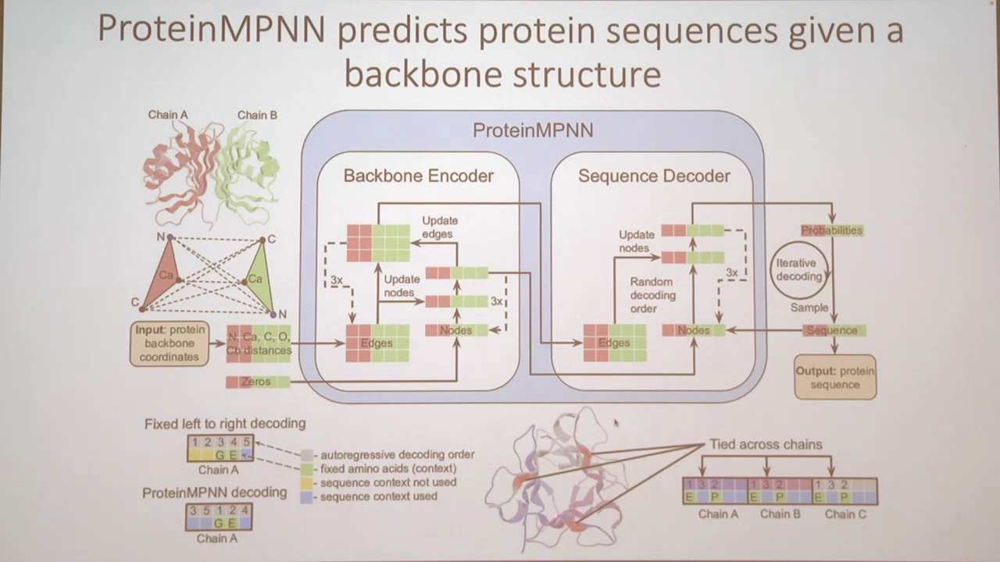
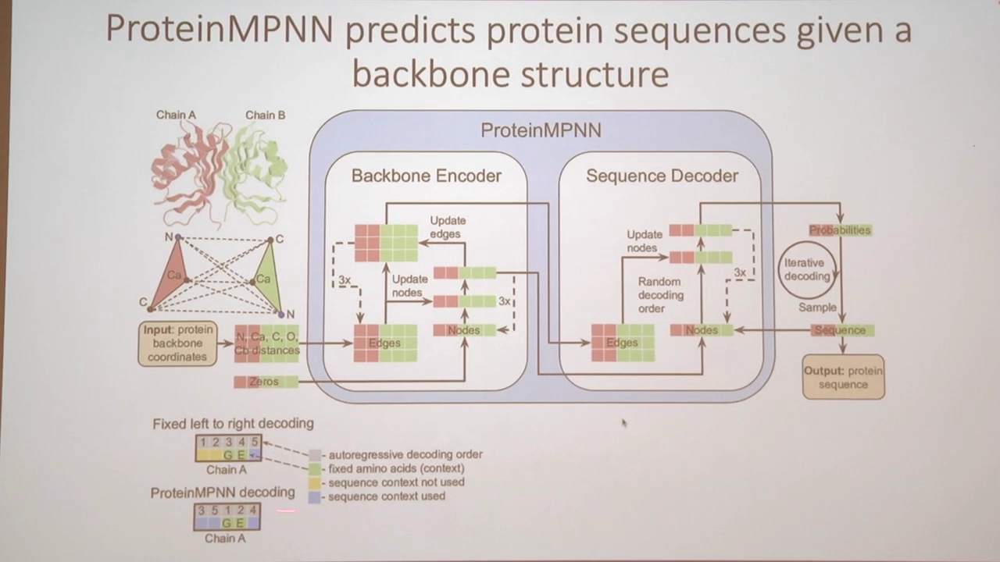
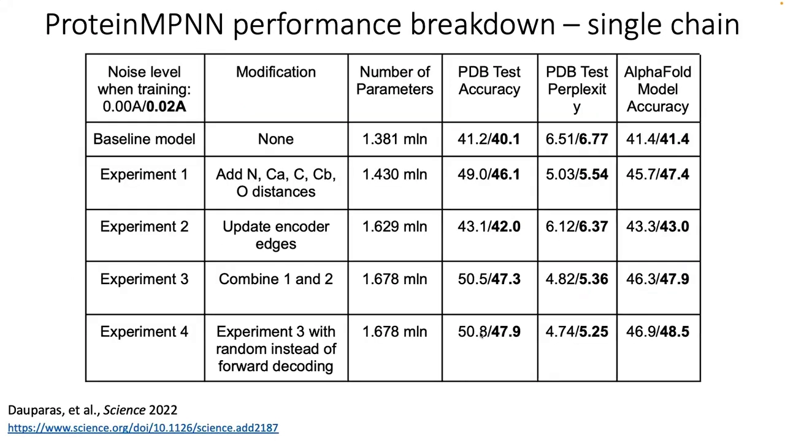
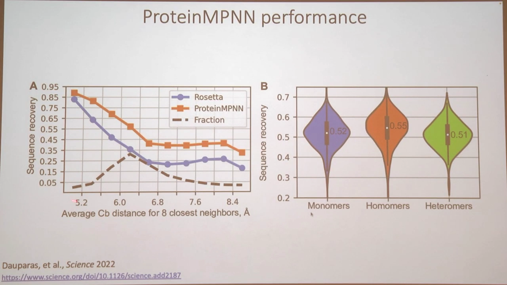

# MPNN：用机器学习做蛋白质序列设计

> 本讲是一节课程讲解，主题从「用 AlphaFold 做结构预测」自然过渡到「蛋白质序列设计」。它会先告诉你什么是**固定主链设计**，复习蛋白质的各种表示，然后从 John Ingraham 2019 年的 MPNN 架构讲到 ProteinMPNN：模型怎么建图、怎么自回归地逐位填序列、边特征里为什么需要「朝向」，以及它相比 Rosetta 在恢复率和速度上提升了多少。
> 一句话结论：**序列设计就是在固定骨架上「填」序列**；MPNN 把骨架变成图、用消息传递更新节点、按顺序逐位预测氨基酸，而 ProteinMPNN 通过补充重原子距离、更新边、随机解码，把序列恢复率从 Rosetta 的 ~18% 提升到 ~50%，速度还快几个数量级。

## 本讲要解决的核心问题（SCQA）

**背景**：前面几节课我们用 AlphaFold 做**结构预测**——给定一条序列，预测它的 3D 构象。

**冲突**：蛋白质设计要的是反方向。我们常常先有一个想要的骨架，却不知道什么序列能折叠成它；而「设计出来表达不出、不稳定」往往就出在序列没选好。

**疑问**：怎么给一个**固定骨架**设计序列？模型的结构长什么样、信息怎么流动、效果比传统方法好多少？

**回答（中心思想）**：这类问题叫**固定主链设计**。做法是先把蛋白质建成**图**（节点=残基，边=几何关系），用**消息传递神经网络（MPNN）**更新节点表示，再**自回归**地逐位预测氨基酸身份。Ingraham 2019 的版本已经超过 Rosetta；ProteinMPNN 在其上加了三处改进——**重原子距离特征、更新编码器的边、随机解码顺序**——把恢复率推到约 50.8%，并在 GPU 上做到每秒钟上万氨基酸。

## 一、从结构预测到序列设计：固定主链设计

蛋白质序列设计，名字基本说明了含义（[【跳转到 00:00:16】](https://www.youtube.com/watch?v=6z4XmUAwdNA&t=16)）：目标是找出还能对序列做哪些改变，同时**尽可能保持结构不变**。

它和结构预测正好相反：

| 任务 | 方向 |
| --- | --- |
| 结构预测（AlphaFold） | 序列 → 3D 结构 |
| 序列设计 | 给定主链坐标 → 设计序列 |

因为主链不动，这个问题一般叫**固定主链设计（fixed backbone design）**（[【跳转到 00:01:21】](https://www.youtube.com/watch?v=6z4XmUAwdNA&t=81)）：目标不是改主链，而是找到**新的序列**——甚至让多条不同的序列都能折叠成同一个结构。

## 二、先复习：蛋白质在机器学习里怎么表示

在讲模型前，先回顾之前学过的蛋白质表示方式（[【跳转到 00:00:51】](https://www.youtube.com/watch?v=6z4XmUAwdNA&t=51)）：

- 序列的 **one-hot 编码**；
- 以**多序列比对**形式表达的**进化信息 / 进化信号**；
- **二级结构**；
- 各种**残基间距离**与**扭转角**、其它角度；
- **蛋白质表面**；
- 一般的**坐标**；
- 以及把这些组织起来的**蛋白质图**。

我们这次关心的，就是从「主链坐标」出发，构造图、再设计序列。

## 三、MPNN 的基础架构（Ingraham 2019）

### 3.1 消息传递：节点是残基，边是关系

MPNN 的全称是 **message passing neural network（消息传递神经网络）**（[【跳转到 00:01:46】](https://www.youtube.com/watch?v=6z4XmUAwdNA&t=106)）。Ingraham 等人在 2019 年的 NeurIPS 上提出了这个用于蛋白质设计的架构：

- **节点**：每个节点是一个**残基**；
- **边**：表示残基之间的几何关系（我们之前讨论过的节点-边表示）；
- **输入**：结构信息（每个节点的坐标）；
- **输出**：每个位置应该是什么氨基酸身份。

给定「定义每个节点坐标」的结构信息，模型的目标就是推断每个节点的氨基酸身份（[【跳转到 00:02:44】](https://www.youtube.com/watch?v=6z4XmUAwdNA&t=164)）。

### 3.2 自回归：按顺序填空，前面的预测会影响后面

起点是**还没有任何氨基酸身份的节点**，信息从结构流向「身份」这个目标（[【跳转到 00:03:09】](https://www.youtube.com/watch?v=6z4XmUAwdNA&t=189)）。预测时，比如从 N 端走到 C 端：

- 每预测一个位置，不仅能用它**邻域的结构信息**，还能用**之前已经预测出来的序列**信息；
- 之前预测的任何位置，都会影响当前这个位置的设计。

这就是**自回归（autoregressive）**：从头开始按顺序填满所有空位，而这个**顺序会影响每个位置的预测**（[【跳转到 00:04:03】](https://www.youtube.com/watch?v=6z4XmUAwdNA&t=243)）。

从「架构由哪些层组成」看（[【跳转到 00:04:43】](https://www.youtube.com/watch?v=6z4XmUAwdNA&t=283)）：

- **输入**：整张蛋白质图（节点、边，以及其它边特征）；
- **过程**：编码所有节点信息 → 在边层面做更新 → 为每个位置解码出身份；
- **损失**：**交叉熵**，逐位置比较预测序列与真值序列；
- **训练**：不断强化编码/解码权重，让编码越准、解码越准，直到输出接近真值。

### 3.3 边特征：邻域、稀疏与「朝向」

边到底传递什么？讲者重点讲了两类（[【跳转到 00:06:00】](https://www.youtube.com/watch?v=6z4XmUAwdNA&t=360)）：

**① 邻域大小。** 预测某个残基时，它周围约 **30 个节点**（Ingraham 版）对「这个位置能放什么」最有影响。邻域大小要平衡两件事：

- 既要**计算高效**，又要**准确**；
- 从距离构造特征时，通过描述邻域引入**稀疏性**，从而在「重要的地方」有更尖锐的峰值——**越近的节点，流出的信息越重要**。

这也符合直觉：某些残基体积很大，而很多大体积残基**不能挤在一个非常紧凑的邻域里**，这些模式有助于预测更准（[【跳转到 00:07:35】](https://www.youtube.com/watch?v=6z4XmUAwdNA&t=455)）。

**② 朝向（orientation）。** 朝向指的是两个东西（比如两个 α 碳）之间「该往哪个方向走」。深入到 α 碳层面后，要计算我们称为**点云（point cloud）和坐标系（frame）**的东西，它包含三个量：**距离、方向、旋转**。这些信息都能从主链构造出来（[【跳转到 00:08:11】](https://www.youtube.com/watch?v=6z4XmUAwdNA&t=491)）。

### 3.4 和 Rosetta 比：恢复率更高，速度快几个数量级

先把话说清楚：这里的指标叫 **recovery（恢复率）**——不是序列相似性，而是**与真值（天然）序列完全一致的百分比**（[【跳转到 00:10:27】](https://www.youtube.com/watch?v=6z4XmUAwdNA&t=627)）。比如真值第 100 位是丙氨酸，你填成缬氨酸就算错。你可以设计出很多「相似但不同」的序列（保留疏水倾向等），但 recovery 只统计**逐位完全相同**的比例。

结果（[【跳转到 00:08:41】](https://www.youtube.com/watch?v=6z4XmUAwdNA&t=521)）：

- 在 **103 个蛋白**的单链测试集上，Rosetta 固定主链协议恢复率 **17.9%**，Ingraham 的方法（T=0.1）**27.6%**；
- 在 **40 个蛋白**的 Ollikainen 基准上，Rosetta 分别为 33.1% / 38.4%，该方法 **39.2%**；
- 速度上差距更夸张：CPU 上 Rosetta 约 $4.88\times10^{-1}$ AA/s，该方法约 $2.22\times10^{2}$ AA/s；GPU 上达到 $1.04\times10^{4}$ AA/s。

> 讲者提醒：103 个、40 个蛋白都不算多；这篇论文的测试集其实大得多，但当时跑 Rosetta 太慢，所以只用了这个规模（[【跳转到 00:11:53】](https://www.youtube.com/watch?v=6z4XmUAwdNA&t=713)）。

## 四、ProteinMPNN：在 Ingraham 之上的三处改进

ProteinMPNN 于「去年夏天」发布，同样是从主链坐标到序列，真正做出来的是 David Baker 实验室的 Justas 等人（[【跳转到 00:12:18】](https://www.youtube.com/watch?v=6z4XmUAwdNA&t=738)、[【跳转到 00:12:34】](https://www.youtube.com/watch?v=6z4XmUAwdNA&t=754)）。

### 4.1 架构总览：重原子坐标 → 多链设计 → 概率采样

看论文的第一张图（[【跳转到 00:12:42】](https://www.youtube.com/watch?v=6z4XmUAwdNA&t=762)）：

- **输入**是主链的 3D 坐标，具体用**重原子坐标**：氮（N）、α 碳（Cα）、碳（C）、羰基氧（O）和 β 碳（Cβ）；
- 基于这些**距离**构造**边**；节点从零开始，通过更新节点来预测序列；
- 颜色代表链：A 链红色、B 链绿色——这是一个支持**多链**的模型，既能设计单体，也能设计多聚体；
- **编码器**里节点和边经过**三层 MLP** 反复更新；进入结构类似的**解码器**；
- 最终每个位置输出 **20 种氨基酸的概率**，据此**采样**出序列。

### 4.2 自回归解码：随机顺序 + 绑定链

ProteinMPNN 的自回归有两个特别之处（[【跳转到 00:14:43】](https://www.youtube.com/watch?v=6z4XmUAwdNA&t=883)）：

**① 随机解码顺序。** 不是固定地从 N 端走到 C 端（1→2→3→4→5），而是**随机顺序**地填（[【跳转到 00:15:20】](https://www.youtube.com/watch?v=6z4XmUAwdNA&t=920)）。这看起来不起眼，却对序列恢复率有实质影响。

**② 绑定链解码（tied chain decoding）。** 对同源多聚体（比如三聚体），可以让 A、B、C 三条链在同一次随机解码中**共享同一个身份**——因为这是同源组装，对应位置必须是同一个氨基酸。这样能一次从整个对称组装收集更多结构信息，做出更好的预测（[【跳转到 00:15:50】](https://www.youtube.com/watch?v=6z4XmUAwdNA&t=950)）。一直重复到整条主链填满，这就是**迭代解码 + 随机解码顺序 + 从概率采样**的完整推理流程（[【跳转到 00:17:05】](https://www.youtube.com/watch?v=6z4XmUAwdNA&t=1025)）。

### 4.3 性能分解：每一步改进了多少

这张单链性能表把每一步的贡献拆得很清楚（[【跳转到 00:17:44】](https://www.youtube.com/watch?v=6z4XmUAwdNA&t=1064)）。先解释两个列名：

- **PDB Test Accuracy**：在选定的单链 PDB 上的序列恢复率；
- **AlphaFold Model Accuracy**：把预测出的序列重新用 AlphaFold 折叠，看结构与真值的吻合度（[【跳转到 00:18:25】](https://www.youtube.com/watch?v=6z4XmUAwdNA&t=1105)）。

（还有一个 **perplexity（困惑度）**，课程说第二天再讲。）

| 模型 | 改动 | 参数量 | PDB 准确率 (0.00Å/0.02Å) | AlphaFold 准确率 |
| --- | --- | ---: | --- | --- |
| 基线 | 无（接近 Ingraham 模型） | 1.381 M | 41.2 / 40.1 | 41.4 / 41.4 |
| 实验 1 | 加 N、Cα、C、Cβ、O 距离 | 1.430 M | **49.0 / 46.1** | 45.7 / 47.4 |
| 实验 2 | 更新编码器的边 | 1.629 M | 43.1 / 42.0 | 43.3 / 43.0 |
| 实验 3 | 结合 1 和 2 | 1.678 M | **50.5 / 47.3** | 46.3 / 47.9 |
| 实验 4 | 实验 3 + 随机解码 | 1.678 M | **50.8 / 47.9** | 46.9 / 48.5 |

几个结论：

- **加距离特征**提升最大（41.2 → 49.0）：当你从零开始、还不知道任何身份时，信息流里只有结构，所以对结构细节把握越好，能恢复的序列身份越多（[【跳转到 00:19:10】](https://www.youtube.com/watch?v=6z4XmUAwdNA&t=1150)）；
- **更新编码器的边**也有帮助，把两者结合再上一层；
- **随机解码**带来最后的提升，最终达到 50.8%（AlphaFold 准确率 46.9）。

这个结果相比 Rosetta 固定主链协议是巨大的提升（同样要记住 103 个蛋白的前提，[【跳转到 00:21:29】](https://www.youtube.com/watch?v=6z4XmUAwdNA&t=1289)）。

## 五、性能分析：核心难还是表面难？单体难还是多聚体难？

### 5.1 核心比表面更容易恢复

右图横轴是「**最近 8 个 β 碳的平均距离**」——它其实是一种**埋藏度（burial）**的度量（[【跳转到 00:22:15】](https://www.youtube.com/watch?v=6z4XmUAwdNA&t=1335)）：

- 8 个最近 β 碳彼此**非常近**的位置，就是**核心（core）**；
- 彼此较远的位置，就是**表面（surface）**。

结论：

- 从核心到表面，序列恢复率**逐渐下降**；
- **核心**残基在物理上受限得多，能放什么氨基酸的选择少，所以更容易恢复；
- **表面**没有足够的物理约束，选项更多、柔性更大，所以更难恢复出精确序列；
- 而且表面未必有「真值」——如果你从一个全新骨架出发做从头设计，本就不存在一条要恢复的天然序列。

### 5.2 多聚体比单体略好

右图把输入分成三类，画序列恢复率的分布（[【跳转到 00:24:36】](https://www.youtube.com/watch?v=6z4XmUAwdNA&t=1476)）：

- **单体（monomers）**：只让 A 链进入 ProteinMPNN，也只预测 A 链——恢复率约 **0.52**；
- **同源多聚体（homomers）**：同时预测多条链——约 **0.55**；
- **异源多聚体（heteromers）**：约 **0.51**。

可见给模型更多链间（结构）信息，往往能提高预测准确率。

## 小结

- **序列设计 = 固定主链设计**：给定骨架坐标，设计能折叠成它的序列，方向与 AlphaFold 的「序列→结构」相反。
- **MPNN 把蛋白质变成图**：节点是残基，边是几何关系（距离、方向、旋转）；用消息传递更新节点，自回归逐位预测氨基酸，损失是交叉熵。
- **边特征的关键**：合适的**邻域大小**（越近越重要、兼顾效率）和**朝向**（点云 + 坐标系）。
- **恢复率（recovery）= 与真值序列逐位完全一致的百分比**，不是相似性。
- **Ingraham 2019 已超 Rosetta**：103 蛋白上 27.6% vs 17.9%；40 蛋白上 39.2%；速度（尤其 GPU）快几个数量级。
- **ProteinMPNN 的三处改进**：加入 N/Cα/C/Cβ/O 距离、更新编码器边、随机解码顺序——最终 50.8%（AlphaFold 准确率 46.9%）；还支持**多链**与同源多聚体的**绑定链解码**。
- **性能规律**：核心区比表面更容易恢复（约束更强）；多聚体输入通常比单体略好。

## 关键术语速查

| 术语 | 一句话解释 |
| --- | --- |
| 固定主链设计 | 主链不动、只设计序列的蛋白质设计问题 |
| 消息传递神经网络（MPNN） | 在图的节点与边之间交换信息来更新节点表示的网络 |
| 自回归 | 逐位预测，已预测的内容作为后续预测的条件 |
| 交叉熵 | 训练损失：让预测的氨基酸分布逼近真值 |
| 恢复率（recovery） | 设计序列与天然序列逐位完全一致的比例 |
| 邻域大小 | 预测某残基时考虑的最近节点数（Ingraham 用 30） |
| 稀疏性 | 只保留邻近节点的连接，使近距离特征更突出 |
| 朝向 / 点云 / 坐标系 | 描述两个节点间几何关系的量：距离、方向、旋转 |
| 重原子坐标 | N、Cα、C、O、Cβ 等主链原子坐标，用于构造边 |
| 随机解码顺序 | 不按 N→C 顺序，而是随机顺序填序列 |
| 绑定链解码 | 同源多聚体各链在同一位置共享同一氨基酸身份 |
| perplexity（困惑度） | 衡量模型预测分布不确定性的指标（本课程后续讲） |
| 埋藏度（burial） | 残基被包埋的程度，用最近邻 β 碳距离度量核心/表面 |
