# ProteinMPNN 论文精读：稳健的深度学习蛋白质序列设计

> 本讲来自 Justas Dauparas（Baker 实验室博士后，华盛顿大学）对论文《Robust deep learning based protein sequence design using ProteinMPNN》的报告。
> 半页速览：ProteinMPNN 是一个「给定了蛋白质骨架、帮你写出能折叠成这个骨架的氨基酸序列」的神经网络。它很小（约 170 万参数）、很快（CPU 也能跑上万个残基），却比传统 Rosetta 设计得更准、可溶性更好，已经在 Baker 实验室的多个真实项目中把「设计失败」救成「拿到晶体结构」。本文按「它是什么 → 实验证明它能干什么 → 模型怎么设计 → 为什么这样设计 → 表现如何 → 怎么评估和扩展 → 问答」的顺序展开。

## 本讲要解决的核心问题（SCQA）

**背景**：AlphaFold 解决的是「给定序列，预测结构」——即序列到结构。但蛋白质设计要反过来：我想做一个特定形状的蛋白质，该写一条什么样的氨基酸序列，才能折叠成这个形状？

**冲突**：传统方法（如 Rosetta）能设计序列，但常常「设计出来表达不出来」——蛋白不可溶、会聚集，或者做出来也不结合目标。问题往往不在骨架，而在序列没选好。

**疑问**：能不能用一个数据驱动的模型，直接为给定骨架「配」出一条能折叠、又能稳定表达的序列？它要比 Rosetta 更准、更鲁棒吗？

**回答（中心思想）**：ProteinMPNN 就是一个「骨架 → 序列」的逆折叠模型：它把骨架的局部几何编码成图，用轻量的编码器-解码器网络自回归地逐位设计序列。它的关键设计（距离特征、边更新、随机解码顺序、主链噪声训练）让它在序列恢复率上全面超过 Rosetta，在核心区甚至达到约 90%，并能提高可溶性、挽救大量原本失败的设计。

## 一、ProteinMPNN 是什么：给骨架「配」序列的逆折叠模型

### 1.1 一个双向映射中的反方向

蛋白质世界里有两个相反的任务（[【跳转到 00:01:15】](https://www.bilibili.com/video/BV1zu4y1J7MJ/?t=75)）：

- **序列 → 结构**：给氨基酸序列，预测它的三维结构。这是 AlphaFold 的一部分。
- **结构 → 序列**：给一个三维骨架，设计出一条能折叠成它的氨基酸序列。这就是蛋白质设计，也是 ProteinMPNN 要做的。

ProteinMPNN 把「蛋白质主链的几何结构」映射成「蛋白质序列」，本质上是一个**逆折叠（inverse folding）**模型：把其余部分固定，只设计某些区域的序列（[【跳转到 00:01:15】](https://www.bilibili.com/video/BV1zu4y1J7MJ/?t=75)）。

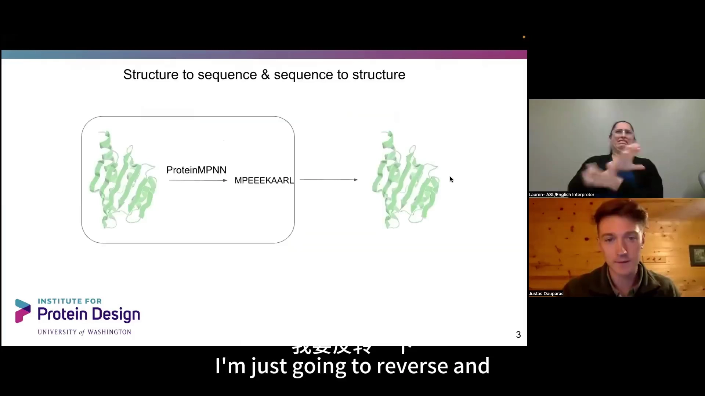

### 1.2 一个接地气的类比：给图配文字

机器学习里常见的任务是「文字生成图像」或「图像生成文字」。ProteinMPNN 更像**图像描述（image captioning）**：输入是一张「图」（蛋白质的原子坐标网格），输出是一段「文字」（只有 20 个字母的氨基酸序列，[【跳转到 00:11:25】](https://www.bilibili.com/video/BV1zu4y1J7MJ/?t=685)）。只不过这里：

- 输入不是二维像素，而是原子的三维坐标；
- 输出不是任意文字，而是长度固定、只有 20 种字符的序列；
- 分布很不一样——这是一个更受约束的任务。

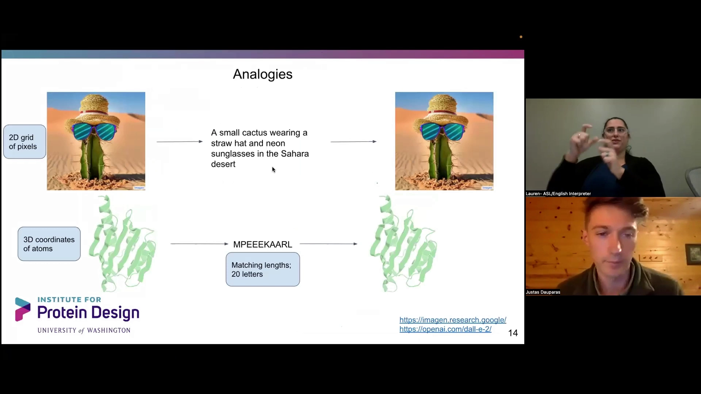

### 1.3 问题陈述：不止是「设计一条链」

论文把任务形式化为（[【跳转到 00:12:21】](https://www.bilibili.com/video/BV1zu4y1J7MJ/?t=741)、[【跳转到 00:13:06】](https://www.bilibili.com/video/BV1zu4y1J7MJ/?t=786)）：

> 给定蛋白质主链坐标，采样出高概率的蛋白质序列。

它要支持三件更实用的事：

1. **多条链**：比如两条链相互作用，可以只重新设计界面（红色区域），其余固定；
2. **部分序列固定**：想保留某些关键残基时，可以把它们「锁住」；
3. **给出不确定性**：对每个位置输出氨基酸概率分布，让人知道模型有多笃定。

典型应用包括：单侧 binder 设计、同源多聚体设计、酶设计等（[【跳转到 00:12:21】](https://www.bilibili.com/video/BV1zu4y1J7MJ/?t=741)）。

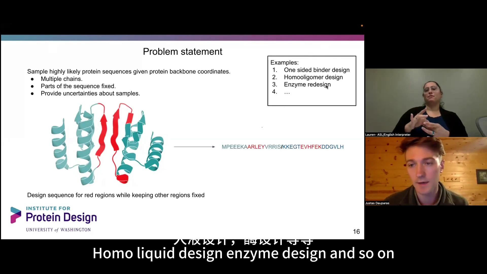

## 二、实验证明它能干什么：从「设计失败」到「拿到晶体结构」

模型好不好，最终要看实验。报告用几个真实项目说明 ProteinMPNN 的价值：它常常是那个「把原本失败的骨架重新设计序列后救活」的环节。

### 2.1 对称蛋白：可溶性产量提高一到两个数量级

在《幻觉对称蛋白质组合（Hallucinating symmetric protein assemblies, Science 2022）》中，团队用 AlphaFold「幻觉」出环状对称蛋白，再用 MCMC 突变序列迭代（[【跳转到 00:01:40】](https://www.bilibili.com/video/BV1zu4y1J7MJ/?t=100)）。

原始设计的**溶解度**中位数大约只有 10 mg/L，很多设计不溶、会聚集（[【跳转到 00:02:55】](https://www.bilibili.com/video/BV1zu4y1J7MJ/?t=175)）。用 ProteinMPNN 在**同一骨架**上重新设计序列后，单次产量大幅提升——注意这是**对数坐标**，从十几个 mg/L 提到数百甚至接近上千 mg/L（[【跳转到 00:03:20】](https://www.bilibili.com/video/BV1zu4y1J7MJ/?t=200)）。

这些重新设计的蛋白中，有七个拿到了晶体结构，模型预测（灰色）与实验解析（彩色，按链着色）吻合得很好（[【跳转到 00:03:39】](https://www.bilibili.com/video/BV1zu4y1J7MJ/?t=219)）。

<table>
<tr><td width="50%">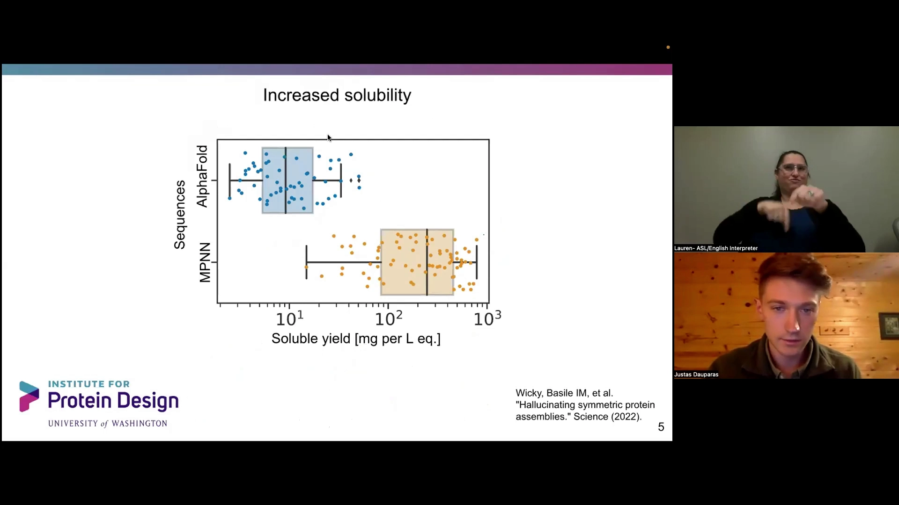</td><td width="50%">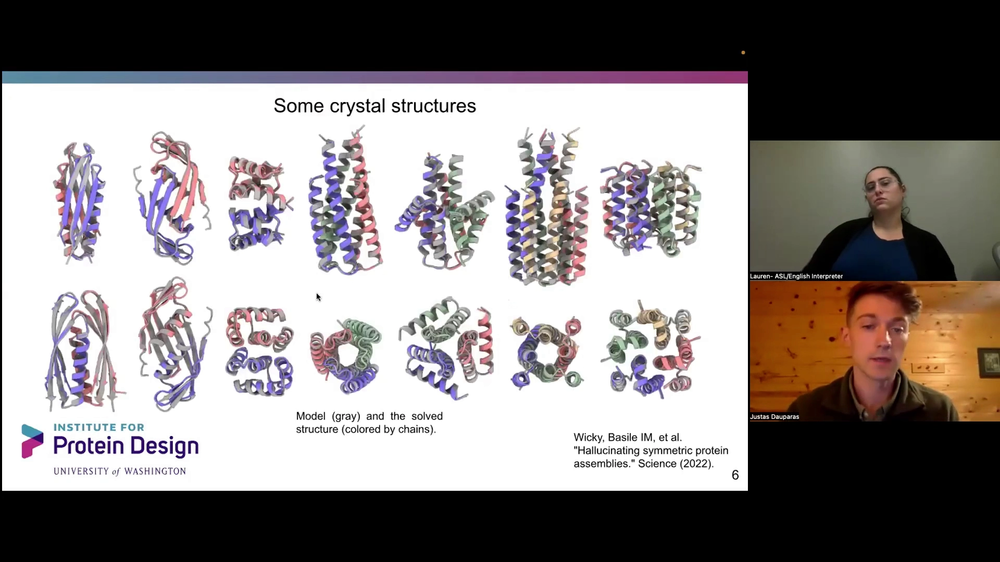</td></tr>
<tr><td>左：溶解度对比。用 ProteinMPNN 重新设计（MPNN）后，可溶产量从约 10 mg/L 提升到数百 mg/L（对数坐标）。<br>右：七个设计的晶体结构，灰色为模型、彩色为实验解析，二者高度吻合。</td><td></td></tr>
</table>

### 2.2 不止小蛋白：大对称结构、纳米颗粒、模体支架

ProteinMPNN 也能重新设计大型对称结构。比如六个亚基、内部有十八重对称性的环状结构，已通过负染/冷冻电镜初步验证（[【跳转到 00:04:30】](https://www.bilibili.com/video/BV1zu4y1J7MJ/?t=270)）。类似地：

- **四面体纳米颗粒**（Robert de Haas，King 实验室）：最初用 Rosetta 快速设计界面，颗粒无法组装；用 ProteinMPNN 重新设计类似骨架后，得到了非常好的晶体结构，颗粒非常稳定。
- **把短线性模体嫁接到从头设计的支架**（Hua Bai）：先把天然肽的结合模体装进设计好的支架，最初 Rosetta 的设计没有结合信号；ProteinMPNN「救场」重新设计后恢复了结合。为验证这些区域确实支撑结构，还把关键残基做突变（天冬酰胺→天冬氨酸）作为对照。

这些例子说明：**问题往往出在序列，而不是骨架**。同样的骨架，换一条 ProteinMPNN 设计出来的序列，就能从「做不出来」变成「有晶体结构」。

### 2.3 Binder 设计：区分两种失败模式

在 Nate Bennett 的《用深度学习改进从头蛋白质 binder 设计（bioRxiv 2022）》中，把设计失败分成两类（[【跳转到 00:06:27】](https://www.bilibili.com/video/BV1zu4y1J7MJ/?t=387)）：

- **Type 1 失败**：binder 单体自己就折叠不好；
- **Type 2 失败**：单体折叠好了，但不结合目标。

把 ProteinMPNN 嵌入到「设计-放松」的循环里（ProteinMPNN-FR），多个靶点（IL2Rα、ALK、LTK、CD86、ROR1、cKIT、Tie2）的成功率都明显提升。此外，用 AlphaFold 预测的 lDDT 指标可以区分好的 binder 和最差的 binder（[【跳转到 00:07:17】](https://www.bilibili.com/video/BV1zu4y1J7MJ/?t=437)）。

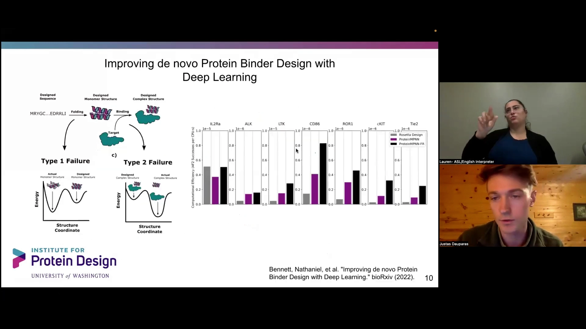

还有一个例子是**带中心口袋的闭合重复蛋白**的幻觉设计：先做出对称骨架，再用 ProteinMPNN 重新设计、去掉对称性，让各单元拥有不同序列，形成「伪对称」——主链对称、序列不对称（[【跳转到 00:08:06】](https://www.bilibili.com/video/BV1zu4y1J7MJ/?t=486)）。

### 2.4 现场演示：Hugging Face 上一分钟跑完一轮设计

Simon 在 Hugging Face 上做了 ProteinMPNN 的在线空间（[【跳转到 00:08:18】](https://www.bilibili.com/video/BV1zu4y1J7MJ/?t=498)）。整个流程是：

```
输入结构（实验解析或设计） → 提取主链、指定要设计的链
        → ProteinMPNN 设计出多条序列
        → AlphaFold2 预测结构并与原结构叠合做验证
```

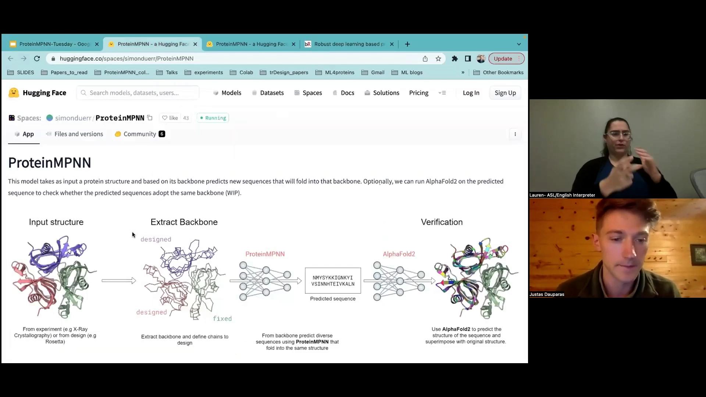

演示里，对同一骨架设计出四条序列，与原天然序列的相似度约 45%；用 AlphaFold、三个 recycle 验证只要约三十秒，最好的 Cα RMSD 约 0.8 Å，说明设计序列确实能折叠回目标结构（[【跳转到 00:09:33】](https://www.bilibili.com/video/BV1zu4y1J7MJ/?t=573)、[【跳转到 00:37:23】](https://www.bilibili.com/video/BV1zu4y1J7MJ/?t=2243)）。

## 三、模型怎么设计：轻量、局部、抗噪

### 3.1 训练数据：按单链收集，并刻意防止「抄答案」

训练数据是范（Fan）等人收集的 PDB 单链数据，规则是（[【跳转到 00:12:46】](https://www.bilibili.com/video/BV1zu4y1J7MJ/?t=766)、[【跳转到 00:52:51】](https://www.bilibili.com/video/BV1zu4y1J7MJ/?t=3171)）：

- 序列一致性 30% 截断；
- 分辨率优于 3.5 Å；
- 每条链长度至少 30 个残基。

这里有一个关键细节：数据集里有很多二聚体、同源多聚体。如果直接让模型「只预测其中一条链」，而另一条同源链就在旁边，模型会**直接把旁边那条链抄过来**——任务变得毫无难度（[【跳转到 00:13:11】](https://www.bilibili.com/video/BV1zu4y1J7MJ/?t=791)）。所以论文加了一条规则：如果两条链序列相似度超过 70%，就要求模型**同时预测所有链**，从而堵住这种数据泄露。

### 3.2 目标函数：逐残基最小化交叉熵

模型的训练目标是**逐残基的分类交叉熵**（[【跳转到 00:14:01】](https://www.bilibili.com/video/BV1zu4y1J7MJ/?t=841)）：

$$
\mathrm{CCE} = -\sum_{i=1}^{20} p_i \log q_i
$$

其中 $p_i$ 是真实分布（正确的氨基酸处为 1，其余为 0），$q_i$ 是模型预测的分布。模型要让它对每个位置输出的概率，尽量靠近真实的那个氨基酸。

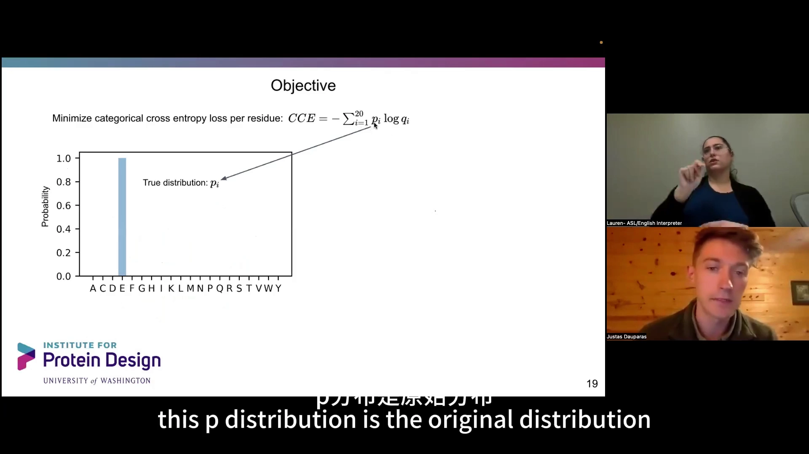

### 3.3 自回归分解与「随机解码顺序」

ProteinMPNN 采用**自回归分解**：每次只预测一个氨基酸，然后把已解码的结果作为条件，再预测下一个，如此反复（[【跳转到 00:14:51】](https://www.bilibili.com/video/BV1zu4y1J7MJ/?t=891)）。

关键创新在于**解码顺序**。常见做法是「从左到右」，但论文改用**随机解码顺序**（[【跳转到 00:14:59】](https://www.bilibili.com/video/BV1zu4y1J7MJ/?t=899)）：

- 从左到右时，预测某个位置只能用到它「左边」的上下文；
- 随机顺序时，模型可以**同时利用左右两边**的上下文来预测中间位置。

训练时给随机顺序，模型就必须学会所有可能的解码顺序。结果出人意料：随机解码的性能几乎不下降，后面会看到这带来很强的泛化能力。

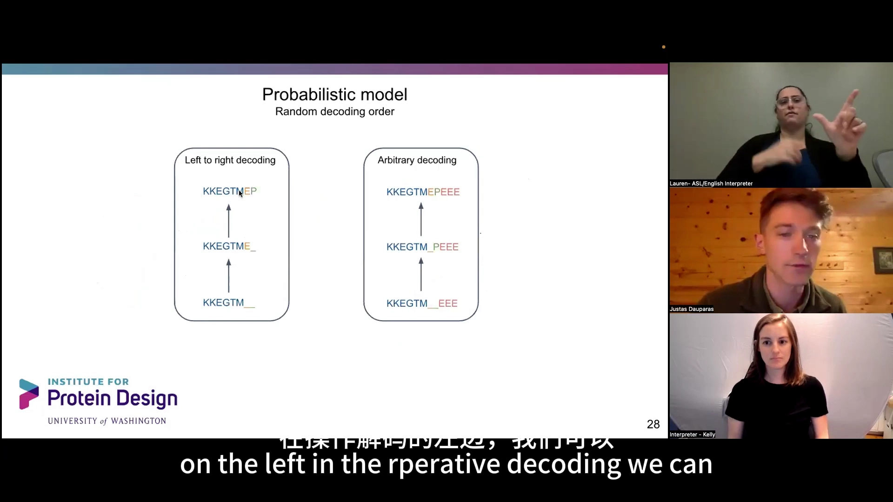

### 3.4 输入特征：只喂「局部几何」

模型先在每个残基周围构造一个**局部图**，节点特征主要来自三部分（[【跳转到 00:15:24】](https://www.bilibili.com/video/BV1zu4y1J7MJ/?t=924)）：

1. **局部邻域**：以 Cα–Cα 距离找最近邻，把附近的残基连成边；
2. **相对序列位置**：给出 ±32 范围的主序列空间距离，并用一个二值指示器标记「是否在同一条链」。注意链叫 A 还是叫 B 并不重要，它只关心「同链 / 不同链」；
3. **距离的径向基函数（RBF）编码**：把 N、Cα、C、O 以及虚拟 Cβ 之间的距离，用 16 个 RBF 通道编码。

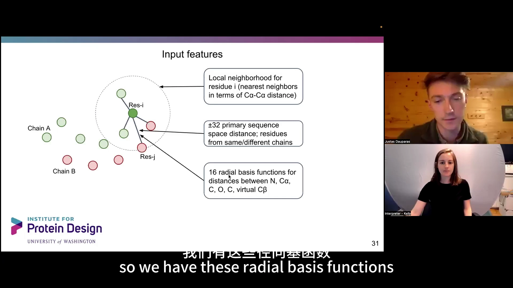

论文还验证了「局部性」这个假设：把最近邻数量从 2 增到 16、64，序列恢复率很快就收敛，说明**预测氨基酸身份最重要的是局部信息**（[【跳转到 00:16:51】](https://www.bilibili.com/video/BV1zu4y1J7MJ/?t=1011)）。他们也试过用二面角等角度特征，效果都不好，除非加在距离特征之上——距离是更好的归纳偏置。

RBF 的直觉是：把真实距离表示成一排「小通道」，取值是
$$
\exp\!\Big(-\frac{(d - \text{箱中心})^2}{\text{标准差}^2}\Big)
$$
所以每个通道都在 0 到 1 之间。距离很大时全部为零，距离落在某个箱子里时对应通道接近 1（[【跳转到 00:17:41】](https://www.bilibili.com/video/BV1zu4y1J7MJ/?t=1061)）。

### 3.5 网络结构：三层编码器 + 三层解码器

整个模型是一个**消息传递神经网络（MPNN）**（[【跳转到 00:18:56】](https://www.bilibili.com/video/BV1zu4y1J7MJ/?t=1136)、[【跳转到 00:19:21】](https://www.bilibili.com/video/BV1zu4y1J7MJ/?t=1161)）：

- **主链编码器**：以原子间距离为节点特征，边和节点初始为零，逐层**同步更新节点和边**，共三层；
- **序列解码器**：把编码器的边、节点，以及已解码的序列作为输入，产生可以采样的概率分布，也是三层。

训练时用 **teacher forcing**（一次性提供全部已解码序列，只跑一遍解码器）；推理时则一次采样一个氨基酸、多次运行解码器（[【跳转到 00:19:46】](https://www.bilibili.com/video/BV1zu4y1J7MJ/?t=1186)）。

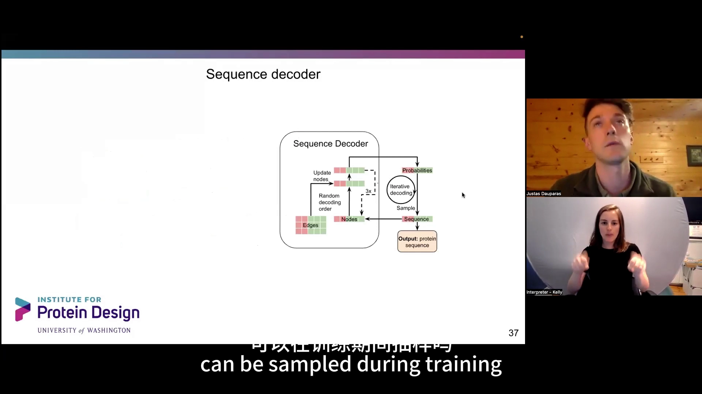

这个架构非常轻量：**约 170 万个参数**，而 AlphaFold 约 1 亿个参数（[【跳转到 00:20:11】](https://www.bilibili.com/video/BV1zu4y1J7MJ/?t=1211)）。所以即使只有 CPU，也能在上万残基的大蛋白上运行。

### 3.6 主链噪声：让模型对坐标误差「不敏感」

训练时还有一招：**给所有主链坐标加高斯噪声**（[【跳转到 00:21:01】](https://www.bilibili.com/video/BV1zu4y1J7MJ/?t=1261)）。原因是：

- 晶体结构可能带有人为伪影，尤其是高分辨率结构；
- 人们在设计新东西时，主链位置本来就不确定。

加了噪声，模型就不会过度依赖极精确的原子间距离，变得更鲁棒。推理时反而**不需要加噪声**，因为模型已经不在意这个尺度。

## 四、为什么这样设计：逐个改动看效果

### 4.1 从基线开始，一次只改一件事

论文的起点是 John Ingraham 的《基于图的蛋白质设计（Generative models for graph-based protein design）》。为了看清每个设计的贡献，他们从基线模型出发，**一次只改一个点**（[【跳转到 00:21:26】](https://www.bilibili.com/video/BV1zu4y1J7MJ/?t=1286)）：

| 实验 | 改动 | PDB 测试准确率 |
| --- | --- | --- |
| 基线模型 | 无 | 41.2 |
| 实验 1 | 加入 N、Cα、C、Cβ、O 距离特征 | **49.0** |
| 实验 2 | 编码器也更新边 | 43.1 |
| 实验 3 | 实验 1 + 实验 2 | **50.5** |
| 实验 4 | 实验 3，但把从左到右换成随机解码 | **50.8** |

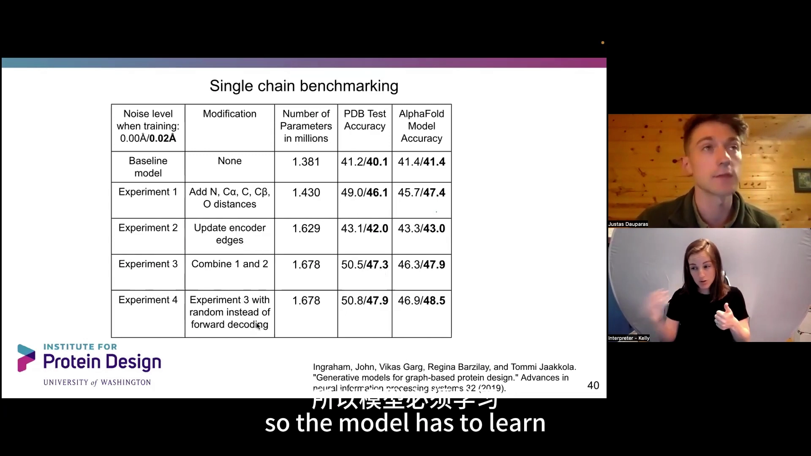

结论很清楚：

- **距离特征是最有用的归纳偏置**（41.2 → 49.0）；
- **同步更新边**也有帮助；
- **随机解码几乎不损失性能**——这正是它泛化好的原因；
- 找到这些设计后，论文才用**更大噪声**训练出最终模型（[【跳转到 00:22:16】](https://www.bilibili.com/video/BV1zu4y1J7MJ/?t=1336)）。

## 五、表现如何：与 Rosetta 对比的四个发现

### 5.1 核心区接近 90%，全面优于 Rosetta

用**序列恢复率**（设计序列与真实序列一致的比例）衡量。作者按「最近 Cβ 原子的平均距离」把残基分成核心（距离小、被包埋）和表面（距离大、暴露），可以看到（[【跳转到 00:23:56】](https://www.bilibili.com/video/BV1zu4y1J7MJ/?t=1436)）：

- ProteinMPNN 在核心区和表面**都优于 Rosetta**；
- 核心区确定性很高，序列恢复率接近 **90%**；
- 越靠近核心，恢复率越高——二者都是距离的单调函数。

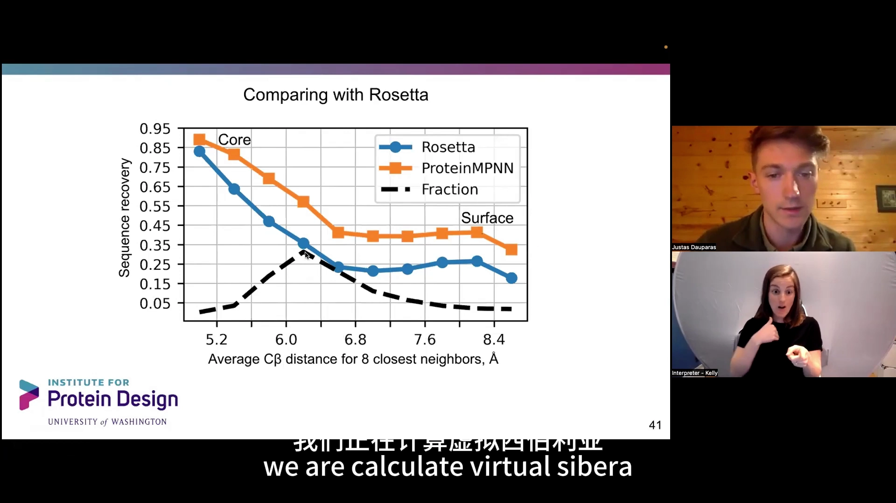

### 5.2 序列恢复率其实是「几何约束的函数」

一个很有意思的观察：恢复序列的能力，只取决于**该残基从周围获得了多少几何约束**，和它有没有功能、是什么功能都无关（[【跳转到 00:24:46】](https://www.bilibili.com/video/BV1zu4y1J7MJ/?t=1486)）。换句话说，模型学到的是「这个局部形状该配什么氨基酸」，而不是「这个蛋白是干什么的」。这也解释了为什么在数百个单体结构上，ProteinMPNN 几乎总是优于 Rosetta。

### 5.3 采样温度：控制「确定性」与「多样性」的旋钮

模型输出的不是一条序列，而是一个概率分布。**采样温度** $T$ 就用来调节这个分布的"尖锐程度"（[【跳转到 00:26:12】](https://www.bilibili.com/video/BV1zu4y1J7MJ/?t=1572)）：

$$
\logits_i = \mathrm{ProteinMPNN}(\text{backbone}), \qquad
q_i = \frac{e^{\,logits_i / T}}{\sum_j e^{\,logits_j / T}}
$$

- **温度低**（如 0.1）：分布很尖锐，趋向于选最可能氨基酸，序列恢复率高但多样性少；
- **温度高**（如 0.5）：分布趋于均匀，多样性大但更可能"乱来"；
- **温度 = 0**（取 argmax）：理论上完全确定，但由于随机解码顺序，仍保留约 **10%** 的多样性。

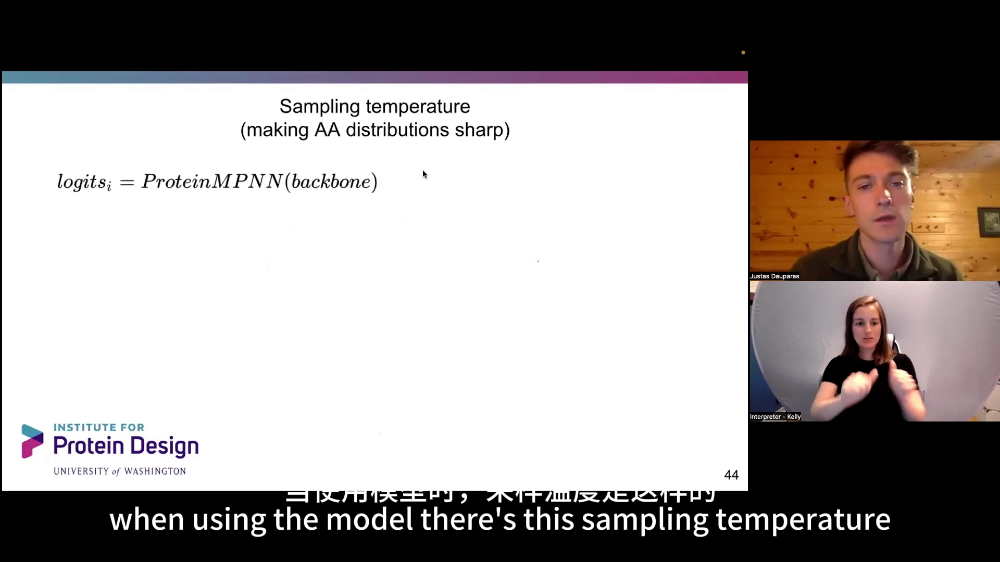

温度对核心和表面的影响截然不同（[【跳转到 00:27:02】](https://www.bilibili.com/video/BV1zu4y1J7MJ/?t=1622)）：

- **核心**：不同温度下几乎完全一致，说明模型非常笃定；
- **表面**：低温时相似度约 75%，高温时降到约 47%，说明表面有大量不确定性。

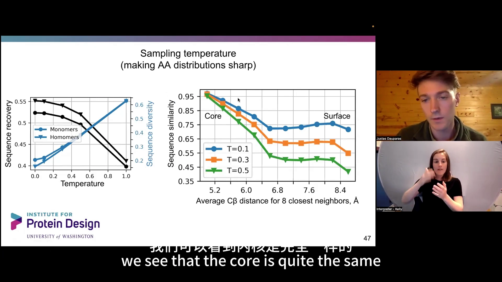

### 5.4 氨基酸偏差：模型偏爱把带电残基放在表面

把「模型输出概率 − PDB 真实频率」画出来，就能看出模型的偏好（[【跳转到 00:28:17】](https://www.bilibili.com/video/BV1zu4y1J7MJ/?t=1697)）：

- ProteinMPNN 倾向于在表面放更多**带正/负电的谷氨酸（E）和赖氨酸（K）**，同时**减少极性氨基酸**；
- 温度越低，这种偏置越强；
- 这个偏置很可能正是**高表达、高可溶产量**的原因——在表面布置带电残基能抑制聚集。

作为对照，Rosetta 也有自己的偏差，比如核心区偏好丙氨酸（A）、残基太靠近、太多跑到表面等（[【跳转到 00:29:07】](https://www.bilibili.com/video/BV1zu4y1J7MJ/?t=1747)）。

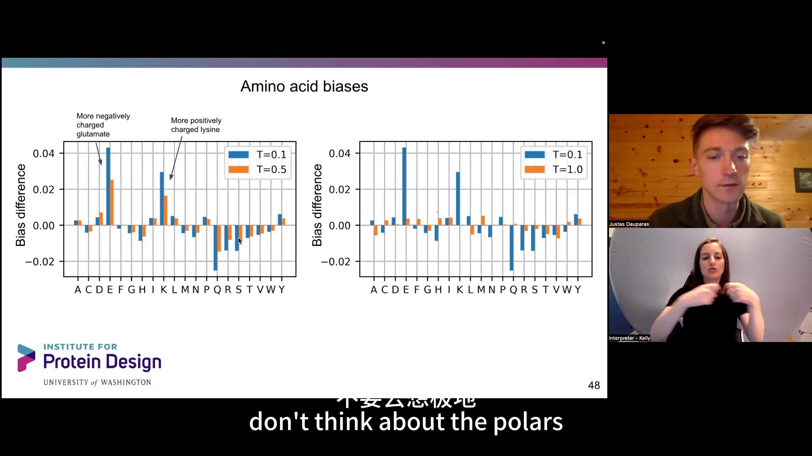

### 5.5 对分辨率敏感：报告序列恢复率时必须交代分辨率

模型对主链分辨率很敏感。有明确趋势：分辨率越高（如 1–1.5 Å）恢复率越高，3 Å 左右则下降（[【跳转到 00:29:32】](https://www.bilibili.com/video/BV1zu4y1J7MJ/?t=1772)）。AlphaFold 模型也类似——对结构越自信，就越接近晶体结构。所以论文提醒：**每当有人报告序列恢复率，都应该检查它用的主链分辨率是多少**。

### 5.6 用「不确定性」给设计排序

虽然设计时我们不知道真实恢复率，但模型会给出负对数概率 $-\log p(\text{seq}\mid\text{struct})$。这个分数与序列恢复率有很好的线性关系（[【跳转到 00:30:10】](https://www.bilibili.com/video/BV1zu4y1J7MJ/?t=1810)）：

- 分数越低（模型越自信），恢复率越高；
- 于是可以**用较高温度采样大量序列**，再按这个分数排序，挑出既多样又高置信的设计。

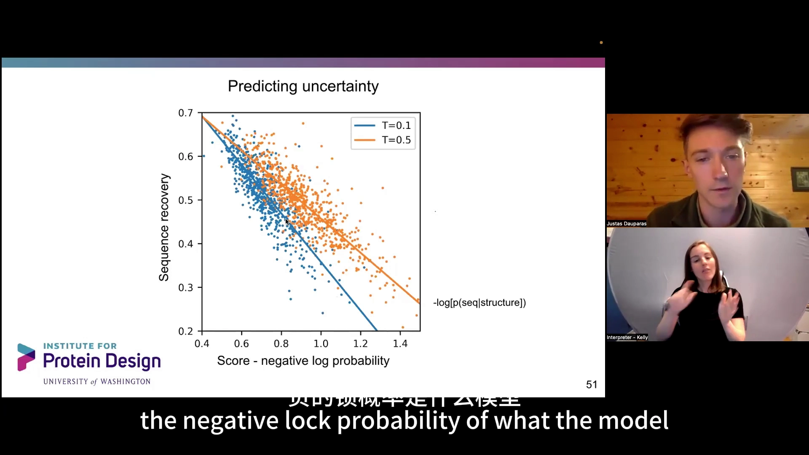

## 六、如何评估与扩展：正向折叠、共识序列与多状态设计

### 6.1 正向折叠：设计序列能不能折回目标结构？

评估设计的经典方法是**正向折叠（forward folding）**：拿到设计序列，用 AlphaFold 预测结构，看它和输入骨架是否匹配（[【跳转到 00:31:25】](https://www.bilibili.com/video/BV1zu4y1J7MJ/?t=1885)）。

这里有一个细节：设计出的序列和天然序列差别很大，**没有多序列比对（MSA）可用**，所以只能用「单序列」版本的 AlphaFold。结果：

- 天然序列在没有同源信息时很难预测，匹配度很低；
- 但用 ProteinMPNN 重新设计后，序列**更"理想化"**，AlphaFold 更容易预测，分布明显右移——说明设计序列更符合结构预测模型的"口味"。

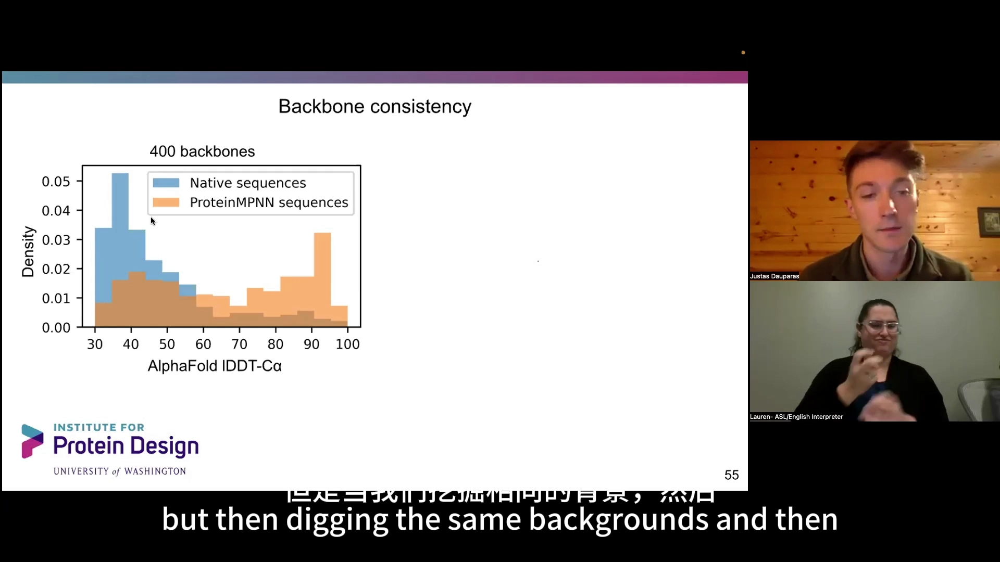

### 6.2 噪声带来的意外好处：更鲁棒、更接近共识

增加训练噪声会**降低**序列恢复率（约从 50% 降到 45%），但却**提升**了 AlphaFold 的成功率——因为模型变得更鲁棒、给出的序列更理想化（[【跳转到 00:33:11】](https://www.bilibili.com/video/BV1zu4y1J7MJ/?t=1991)）。

更妙的是：如果把同一个骨架生成一堆序列，**噪声更大的模型产生的序列，反而与天然序列更相似**。作者猜测，可以把这看作一种「共识（consensus）序列」——而 AlphaFold 可能更擅长预测共识样的序列（[【跳转到 00:34:01】](https://www.bilibili.com/video/BV1zu4y1J7MJ/?t=2041)）。

这也引出一个判断：当 ProteinMPNN 设计的序列与 AlphaFold 预测不匹配时，**到底是序列设计错了，还是 AlphaFold 预测错了？** 通过增加 recycle 次数可以看出，结构预测才是更困难的部分——每增加 6 次 recycle 成功率就提升近 20%，说明一些 AlphaFold 暂时预测不准的序列，其实仍能折叠成正确主链（[【跳转到 00:34:51】](https://www.bilibili.com/video/BV1zu4y1J7MJ/?t=2091)）。

### 6.3 多状态设计：把多个骨架的分布「叠加」

既然模型输出的是概率分布，就可以把多个状态的分布组合起来（[【跳转到 00:35:16】](https://www.bilibili.com/video/BV1zu4y1J7MJ/?t=2116)）：

- **同源多聚体**：A 链和 B 链应当同序列时，把两条链的 logit 取平均，再采样；
- **多状态**：把多个骨架（可以是相似骨架，也可以是不同构象）的 logit 以线性系数 $\beta$ 混合（$\beta$ 可正可负，对应正向/负向设计），得到一个同时适应所有状态的分布，再采样。

### 6.4 开源、易用，并已被大量采用

最后总结（[【跳转到 00:36:31】](https://www.bilibili.com/video/BV1zu4y1J7MJ/?t=2191)、[【跳转到 00:36:56】](https://www.bilibili.com/video/BV1zu4y1J7MJ/?t=2216)）：

- 在 GitHub 上**开源**，速度快、体积小；
- 几乎不需要专家定制，**只有两个旋钮**：选择要重新设计的区域、选择采样温度；
- 已经救回了 Baker 实验室的一批设计；
- 表面偏向带电氨基酸的设计，可能是高产量的原因；
- 支持对称设计、多状态设计等扩展。

## 七、问答精选

报告后的问答覆盖了很多实践细节，按主题整理如下：

**关于模型能力**

- **能提升稳定性吗？** 有可能，用 ProteinMPNN 让蛋白更稳定、或「抢救」特定设计是可行的。
- **不用 RBF 编码距离行不行？** 行。可以用别的编码，甚至用**离散的距离箱**（比如 0.5 Å、2 Å 分档），用非常简单的方式也 work。
- **模型是确定性的吗，解码顺序重要吗？** 对数似然确实依赖解码顺序。想要非常精确的分数时，可以**多跑几次取平均和标准差**；不过通常顺序带来的偏差很小。作者试过「从核心到表面」等几何启发的顺序，和随机顺序表现差不多。
- **能输入多种构象吗？** 可以。模型是**局部图**，只需一个 PDB，把多个主链放进同一个 PDB、在空间上分开即可——它只看到附近节点，不会「注意到」远处另一个骨架。实验室的多状态设计就是这么做的。
- **能处理配体、金属、DNA/RNA 吗？** 这个版本不行（只接受氨基酸原子）。作者正在做能吸收金属、配体、DNA、RNA 的版本。
- **最大精度能到多少？** 作者强调核心区更确定、表面更难，且和分辨率、是否结晶有关。更重要的观点是：**对生成模型做基准测试本身很难**——序列恢复率更高，不代表模型就一定更好；AlphaFold 的可预测性是一个有用的补充指标。

**关于训练细节**

- **为什么随机解码在自然语言里通常更差，这里却不差？** 可能因为数据量小、模型容易过拟合，而学习多个解码顺序能起到正则化作用；也可能因为蛋白质是**局部主导**的，从左到右的非局部依赖并不强。
- **只用了晶体结构吗？** 是，只训练了晶体结构，还没用冷冻电镜结构；试过不同分辨率（2 Å、2.5 Å、3.5 Å）一起训练，表现相近。
- **训练要多久、什么硬件？** 在一张 **A100 上训练了大约两天**，相当快。
- **模型名里的 v_48_002 是什么意思？** `v` 是版本，`48` 是图中最近邻数，`002` 表示训练时使用 **0.02 Å** 噪声（`020` = 0.2 Å，`030` = 0.3 Å）。噪声越大的模型对更大噪声水平越鲁棒。
- **B 因子会有帮助吗？** 也许，因为它反映柔性与无序；但实际使用时用户往往不知道该填什么 B 因子，所以输入是个问题。

**关于应用与边界**

- **膜蛋白表现如何？** 作者没测过，但知道模型能设计出「膜样」蛋白质（把疏水残基放在表面）。
- **考虑溶液条件、膜/可溶标签吗？** 目前没有；作者训练的是纯可溶蛋白模型，并设想未来把「膜/可溶」作为输入标签，应该很容易加上。
- **会对不同拓扑、侧链连接性（如 GFP）过拟合吗？** 没有具体答案，也没试过，但**还没有看到针对特定拓扑的过拟合**。
- **能对结合伙伴的不同构象采样吗？** 可能可以——通过移动主链、对一系列序列采样来观察构象变化。
- **能用来设计 CDR 吗？** 作者没试过，但认为这会是一个有趣且困难的应用。
- **数据筛选标准？** 链长超过 30 个残基、分辨率优于 3.5 Å、且满足前述一致性要求。
- **主要应用设想？** 让序列更容易溶解、让天然酶更稳定（如重新设计部分序列以保持功能、同时更耐热、更增产）。核心观点是：**给定一个像样的骨架，ProteinMPNN 能给出在实验中有效的序列；真正困难的是"设计出有功能的骨架"这件事本身**。

## 小结

- ProteinMPNN 解决的是**逆折叠**问题：给定主链几何，设计能折叠成它的序列；它把结构设计从「凭经验试序列」变成「让模型给分布」。
- 它的价值在实验里被反复验证：给同一骨架换一段 ProteinMPNN 设计的序列，就能把不溶的对称蛋白、组装不了的纳米颗粒、不结合的 binder 救回来，并拿到晶体结构。
- 模型的核心是**局部几何 + 轻量 MPNN**：局部邻域、±32 相对位置、链内/链间指示、以及距离的 RBF 编码；三层编码器 + 三层解码器，仅约 170 万参数。
- 三项关键设计带来增益：**距离特征**（41% → 49%）、**边同步更新**、**随机解码顺序**（几乎不损失性能）。
- 训练时**加主链噪声**，让模型对坐标误差更鲁棒；推理时无需噪声。
- 表现上，核心区序列恢复率接近 90% 且全面优于 Rosetta；恢复率本质上是**局部几何约束的函数**。
- **采样温度**是控制确定性与多样性的旋钮；模型对表面的确定性低、并倾向在表面放带电残基（有助可溶）。
- 输出分布可用于**排序**、**正向折叠评估**、**多状态设计**与**伪对称设计**；模型开源、快、易用。

## 关键术语速查

| 术语 | 一句话解释 |
| --- | --- |
| ProteinMPNN | 把蛋白质主链几何映射为氨基酸序列的逆折叠神经网络 |
| 逆折叠（inverse folding） | 由结构反推序列，与 AlphaFold 的「序列→结构」方向相反 |
| 主链 / 骨架（backbone） | 蛋白质的 N、Cα、C、O（及虚拟 Cβ）等主链原子构成的框架 |
| 残基（residue） | 蛋白质链上的一个氨基酸单元 |
| 序列恢复率（sequence recovery） | 设计序列与真实序列逐位一致的比例，衡量模型"还原"能力 |
| 交叉熵（cross entropy） | 训练损失：让模型分布去逼近真实氨基酸分布 |
| 自回归分解 | 每次只预测一个氨基酸，再把已预测结果作为条件预测下一个 |
| 随机解码顺序 | 训练/推理时不按从左到右，而是随机顺序解码，可同时利用左右上下文 |
| 消息传递神经网络（MPNN） | 在图节点/边之间反复传递信息、同步更新节点与边的网络 |
| RBF 编码 | 用一组"距离窗口"把连续距离转成 0–1 的向量，是常用的几何特征编码 |
| 虚拟 Cβ | 对没有 Cβ 的甘氨酸等，根据主链几何推算出的等效 Cβ 位置 |
| teacher forcing | 训练时一次性喂入全部已解码序列，只跑一遍解码器 |
| 采样温度（temperature） | 调节概率分布尖锐程度的参数：低=确定、高=多样 |
| 负对数概率 | 模型对某序列的置信度分数，越低越自信，可用于排序 |
| 正向折叠（forward folding） | 用 AlphaFold 把设计序列折回结构，验证是否匹配目标骨架 |
| 多状态设计 | 让同一条序列同时适应多个骨架/构象 |
| 伪对称（pseudo-symmetry） | 主链对称但序列不对称的设计 |
| lDDT / RMSD | 衡量结构预测与目标结构吻合程度的常用指标（越大 / 越小越好） |
