# 用 ProteinMPNN 进行逆折叠：从图、注意力到消息传递

> 本讲来自 Ian Anderson（课程「Sequence Design」，幻灯片改编自 Nick Randolph 2025 年的版本）在实操课上的讲解。这一讲不讲论文结果，而是把 ProteinMPNN 的来龙去脉讲清楚：逆折叠是什么、逆折叠模型三代演进了什么、为什么 ProteinMPNN 不是 Transformer、它的消息传递和输入特征具体长什么样，最后给出上手实操任务。
> 一句话结论：**ProteinMPNN 用「局部图 + 消息传递」而不是「全局注意力」，在只需要局部几何的逆折叠任务上又快又准**；读懂它，关键要分清「图、局部/全局注意力、消息传递/注意力」这几组概念。

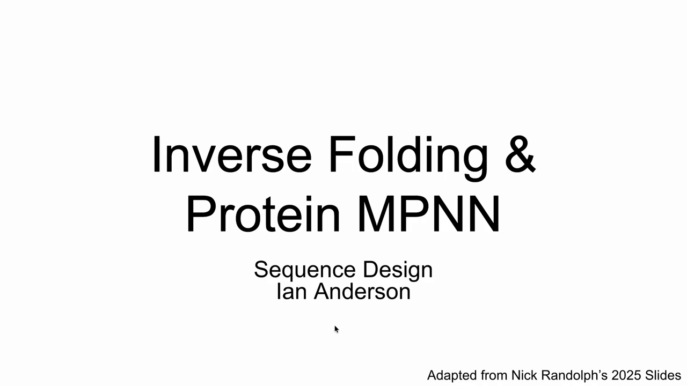

## 本讲要解决的核心问题（SCQA）

**背景**：我们已经会用 RFdiffusion 之类的模型「生成骨架」，但骨架只是一堆坐标，还缺氨基酸序列。把「想要的骨架拓扑」变成「能折叠成它的序列」，这件事叫**逆折叠**。

**冲突**：逆折叠模型有好几代，名词又乱——有人把 ProteinMPNN 叫「Transformer」，有人分不清「注意力」和「消息传递」。概念没理清，看论文和写代码都会踩坑。

**疑问**：逆折叠到底在做什么？局部注意力和全局注意力差在哪？ProteinMPNN 的网络和输入究竟是怎么设计的？它在什么场景会失效、后来又被怎么改进？

**回答（中心思想）**：逆折叠是「结构→序列」。ProteinMPNN 建立在一个关键洞察上——**当你已经有 3D 骨架时，只需关注局部邻域就够了**。它用 48 个最近邻构成的局部图、16 维主链原子间距离做输入，通过**消息传递（而非注意力）**的编码器-解码器网络输出氨基酸概率，训练三个月后取代了当时更强的 ESM-IF。它的局限（对配体/核酸支持差）由后续的 LigandMPNN 补齐。

## 一、先修概念：图和注意力

### 1.1 图：节点代表实体，边代表关系

张量、注意力之前，先回到「图」。一张图由**节点**和**边**组成（[【跳转到 00:03:57】](https://www.youtube.com/watch?v=o8JWPjSH1Ig&t=237)）：

- **节点**代表某种实体；
- **边**代表实体之间的关系。

一个更真实的例子是**序列相似性网络**（由伊利诺伊大学 EFI 制作，Harris et al. 2020）：每个节点是一个蛋白质，每条边是它们的序列相似性百分比。做这种网络时会设一个阈值（比如 50%），相似度在阈值以内的蛋白就聚成一簇（[【跳转到 00:04:18】](https://www.youtube.com/watch?v=o8JWPjSH1Ig&t=258)）。

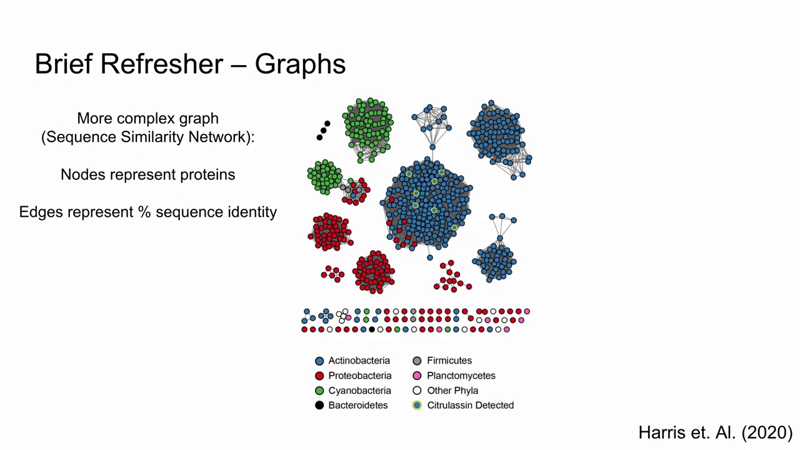

### 1.2 局部注意力 vs 全局注意力

有了图，就看「一个节点该关注谁」。这里有两种注意力（[【跳转到 00:05:34】](https://www.youtube.com/watch?v=o8JWPjSH1Ig&t=334)）：

- **全局注意力**：每个节点关注图里/序列里的**所有**其它节点。AlphaFold 做序列到结构时就是这样——每个氨基酸关注序列中的每一个氨基酸。
- **局部注意力**：每个节点只关注**某个邻近范围内**的若干节点，范围由你设定的准则决定。

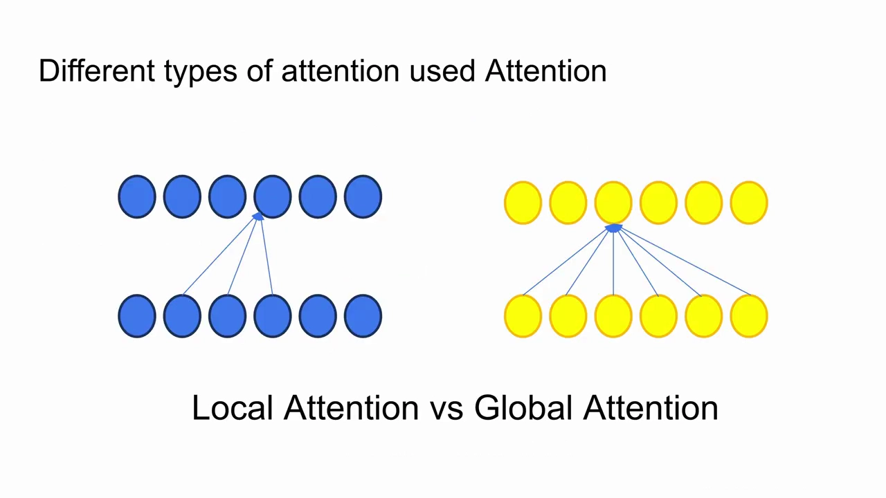

为什么逆折叠用局部注意力就够？讲者的解释很直观（[【跳转到 00:08:55】](https://www.youtube.com/watch?v=o8JWPjSH1Ig&t=535)）：

- 如果你手里已经有 **3D 结构**，你其实不太在意那些离你很远、与你无关的氨基酸；
- 但在 **1D 序列**表示里，序列上离你 30 个位置的氨基酸，折叠后在 3D 空间里可能离你非常近，你必须从它那里学习，所以全局信息更关键。

所以「已经有 3D 骨架」这个前提，正是局部注意力成立的底气。

## 二、逆折叠简史：三代模型，三个台阶

### 2.1 第一代：Ingraham 2019，局部注意力 + K=30

ProteinMPNN 直接建立在 MIT 的 John Ingraham 2019 年论文之上（他后来去了 Baker 实验室）（[【跳转到 00:06:14】](https://www.youtube.com/watch?v=o8JWPjSH1Ig&t=374)）。它的设计是：

- 用**局部注意力，K=30**：每个氨基酸关注离它最近的 30 个氨基酸；
- **节点**是单个氨基酸，**边**是它们之间的相对刚体变换，包含**距离、方向、旋转**三个量；
- 用**还原晶体结构序列**的准确率衡量：当时 Rosetta 是金标准，40%–43%；这个更早的 Transformer 方法达到 50%。

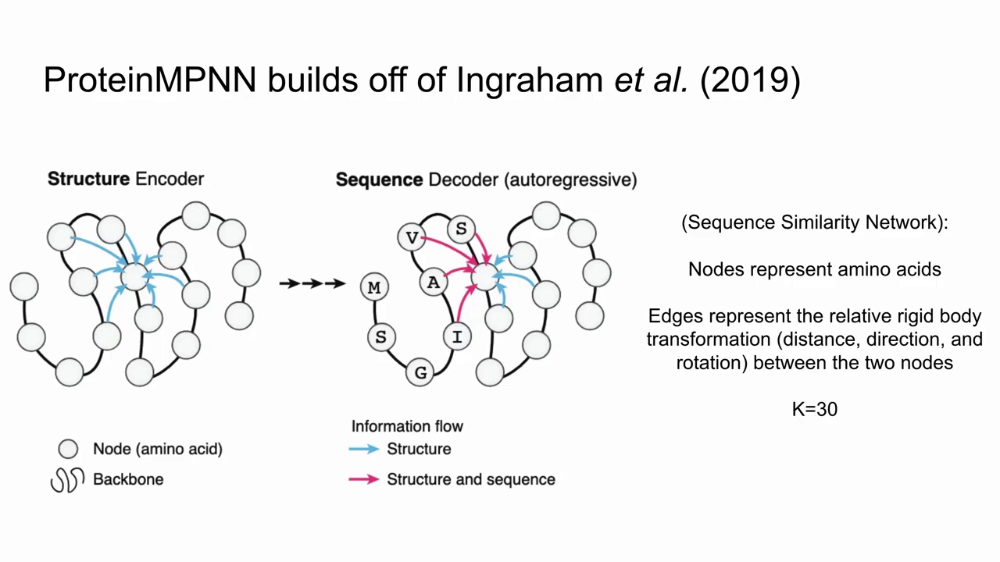

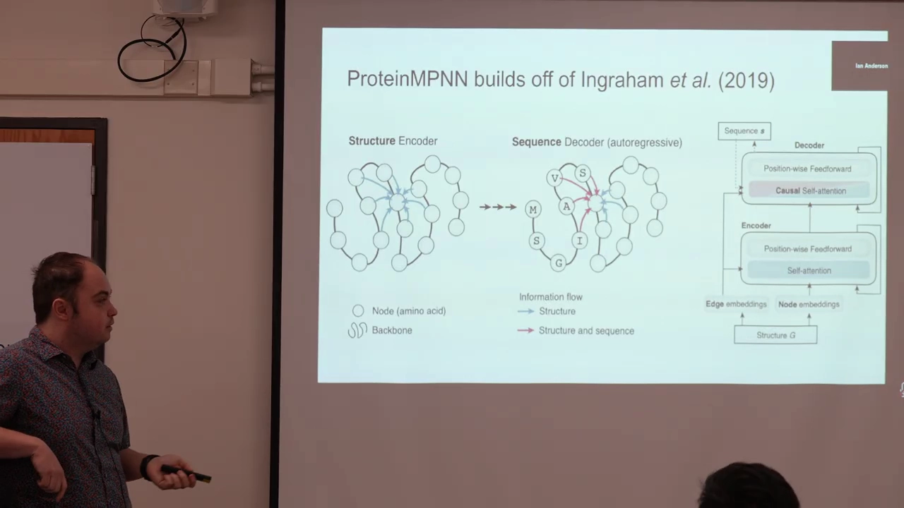

当时为什么要限制在 30？讲者认为主要是**计算资源**：那是 2019 年用当时的 GPU 能做的最好结果。而 ProteinMPNN 后来用了 **48**，因为两年间 GPU 容量提升，允许做得更大（[【跳转到 00:07:42】](https://www.youtube.com/watch?v=o8JWPjSH1Ig&t=462)）。

> 一个值得注意的点：算法上「最近的 30 个」可能落在蛋白质内部很远的地方，因为它算的是 **3D 空间距离**，不是序列上的远近（[【跳转到 00:07:17】](https://www.youtube.com/watch?v=o8JWPjSH1Ig&t=437)）。

### 2.2 第二代：ESM-IF（2022，Meta），全局注意力 + 1200 万结构

2022 年 4 月，Meta（当时 Facebook）的 Hsu 等人发布 **ESM-IF / ESM 逆折叠**（[【跳转到 00:11:59】](https://www.youtube.com/watch?v=o8JWPjSH1Ig&t=719)）。思路很「暴力」：既然 AlphaFold2 / ESMFold 能预测结构，那就把整个 UniRef50 都折叠一遍，再从结构反推序列。

- 折叠 UniRef50，得到 **1200 万个**蛋白质结构（PDB 当时只有约 25 万个）；
- 仍然用编码器-解码器，但用的是**完整的全局注意力**；
- 序列恢复率达到 **54%**，比 Ingraham 的 50% 更高。

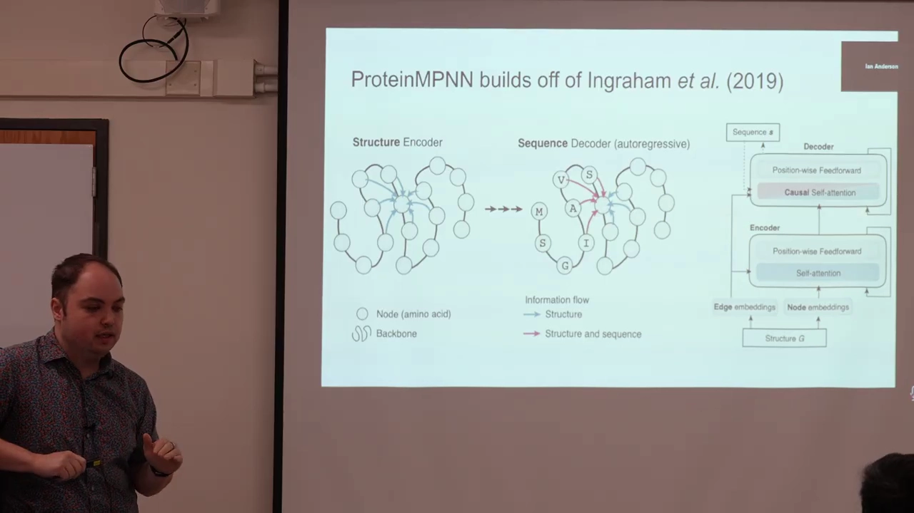

ESM-IF 的优势和局限都很鲜明（[【跳转到 00:13:19】](https://www.youtube.com/watch?v=o8JWPjSH1Ig&t=799)）：

| 优势 | 局限 |
| --- | --- |
| 对「模糊（不完美）骨架」容忍度好——它训练在 AlphaFold/ESMFold 结构上，而非完美晶体 | 训练在合成数据上，可能继承 AlphaFold2/ESMFold 的偏置 |
| 能很好地处理复合物（与蛋白、RNA、DNA 结合） | 全局注意力让它**慢** |
| 数据量是 PDB 的约 48 倍 | 有**幻觉问题**：倾向朝它见过的 loop 偏置，重折叠时可能折成意料之外的结构 |

讲者评价：ESM-IF 是个非常好的模型，**如果不是一个月后 Baker 实验室发布了 MPNN，它很可能就是现在的标准**（[【跳转到 00:15:04】](https://www.youtube.com/watch?v=o8JWPjSH1Ig&t=904)）。

### 2.3 第三代：ProteinMPNN（2022），消息传递取代注意力

ProteinMPNN 在 ESM-IF 之后一个月发布。它没有走「更大、更全局」的路线，而是回到局部图，并用**消息传递**替代注意力，做到又小又快又准——这正是下一节的重点。

## 三、ProteinMPNN 到底怎么工作

### 3.1 它不是 Transformer：消息传递 ≠ 注意力

一个常见的误解是「MPNN 就是 Transformer、用了注意力」（[【跳转到 00:15:47】](https://www.youtube.com/watch?v=o8JWPjSH1Ig&t=947)）。实际上：

- **注意力**：节点与最近邻交流时，会按模型感知到的**相对重要性加权**；
- **消息传递**：同样与最近邻交流，但**一视同仁、不加权，直接全部相加**，汇总成新向量。

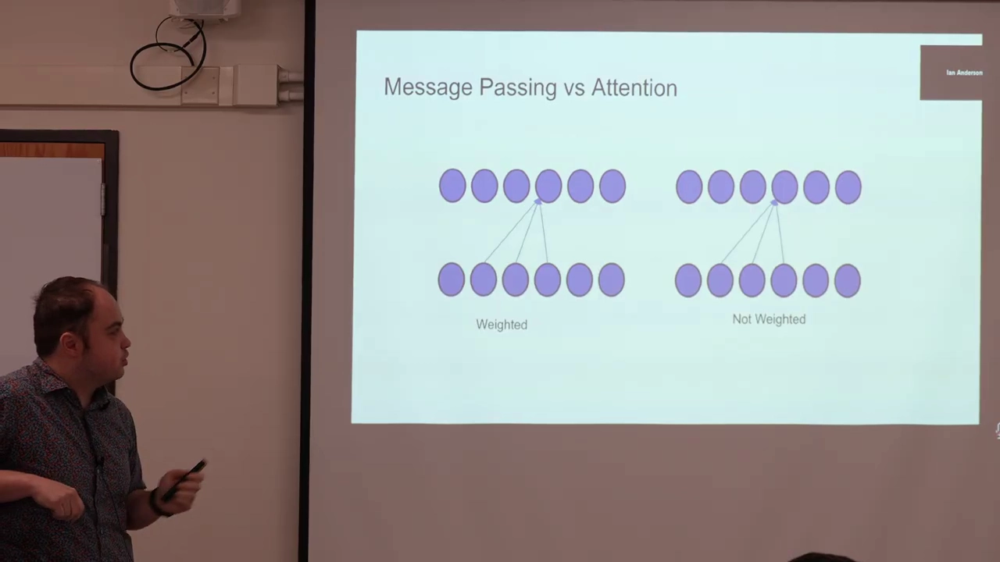

ProteinMPNN 里每个节点和最近的 **48 个邻居**交流。

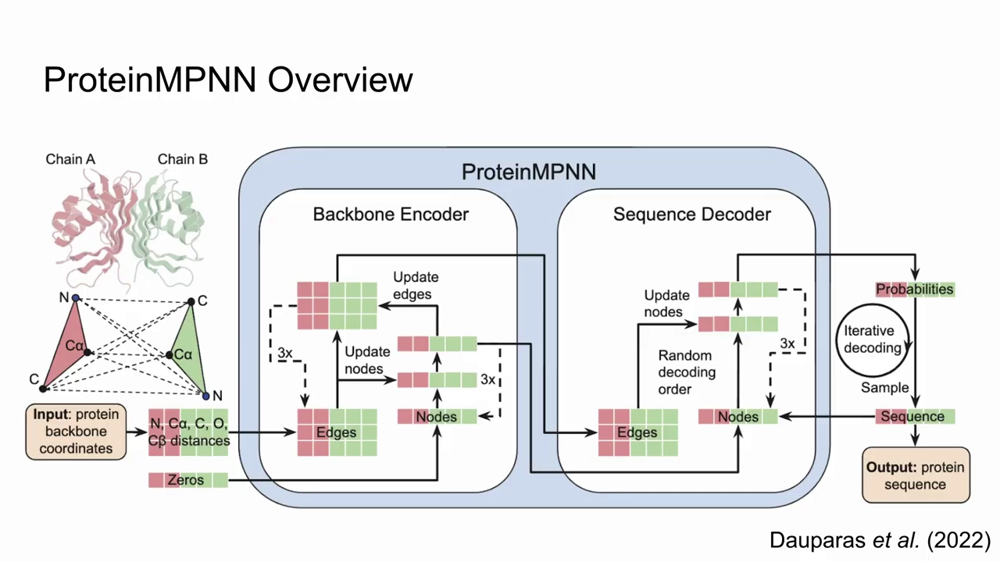

### 3.2 输入：从 3D 向量到 16 维距离向量

边上传递的「消息」是什么？两代模型不同（[【跳转到 00:17:07】](https://www.youtube.com/watch?v=o8JWPjSH1Ig&t=1027)）：

- **Ingraham 版**：一个 **3 维向量**，包含距离、旋转、方向；
- **ProteinMPNN 版**：一个 **16 维向量**，是主链上碳、氮、氧之间**两两的配对距离**。

讲者特别提醒一个隐患：模型在做「最近邻」的初始估计时，**只用 α 碳（Cα）** 来排名。因此理论上可能存在实际更近、却因为 Cα 距离没排进 48 邻居的残基，模型没有考虑这一点（[【跳转到 00:17:18】](https://www.youtube.com/watch?v=o8JWPjSH1Ig&t=1038)）。

### 3.3 编码器：三轮消息传递，用 48³ 覆盖全局

整体架构是经典的**编码器-解码器**：左边结构编码器，右边自回归序列解码器（[【跳转到 00:10:10】](https://www.youtube.com/watch?v=o8JWPjSH1Ig&t=610)）。ProteinMPNN 沿用了这个骨架，但把内部的「自注意力」换成了**消息传递**（见第三节）。

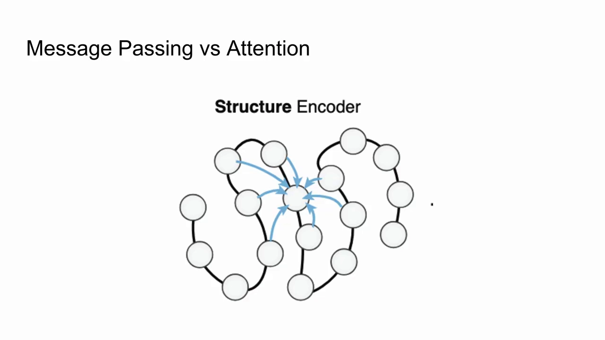

编码器里发生的事情（[【跳转到 00:18:26】](https://www.youtube.com/watch?v=o8JWPjSH1Ig&t=1106)）：

1. 节点和边进入，做消息传递，每个节点用**局部环境**更新自己；
2. 这个过程**来回做三次**；
3. 每一次，节点都重新与链内其它节点交流自己的局部环境。

讲者用「对话」来类比（[【跳转到 00:18:51】](https://www.youtube.com/watch?v=o8JWPjSH1Ig&t=1131)）：

> 第一轮：嗨 A，我是 B，我离你 3 埃。
> 第二轮：嗨 B，我是 B，我离你 3 埃，而且这些其它氨基酸都在我的邻域里。

关键在于**传播范围**：虽然每次只和最近的 48 个（K=48）交流，但三轮之后信息可以覆盖 $48\times48\times48$，潜在的「对话对象」非常多。因此它**隐式地学到了蛋白质另一侧的信息**，尽管没有像全局注意力那样直接关注全部残基（[【跳转到 00:19:16】](https://www.youtube.com/watch?v=o8JWPjSH1Ig&t=1156)）。

### 3.4 解码器：输出的是概率矩阵，温度控制多样性

解码器常被误解为「直接吐出一个氨基酸」（[【跳转到 00:23:12】](https://www.youtube.com/watch?v=o8JWPjSH1Ig&t=1392)）。实际上它把嵌入变换成一个**所有可能氨基酸的概率矩阵**，再从中解码。

因此**温度**的作用很明确：

- 升高温度 → 扩大选择范围 → 更多采样到「不太可能」的氨基酸 → **多样性更大**；
- 但讲者引用作者和社区的经验：**温度一旦超过 1，模型会明显退化**，结果开始失去意义（[【跳转到 00:24:02】](https://www.youtube.com/watch?v=o8JWPjSH1Ig&t=1442)）。

## 四、局限与后续版本：从 ProteinMPNN 到 LigandMPNN

### 4.1 原始版本的三个局限

1. **只在全 PDB 上训练**：它认识膜结构，但最初没有专门的「可溶」倾向。约一年后官方重新发布了 **「可溶性 ProteinMPNN」权重**，很多人在改善酶或蛋白可溶性时发现它非常有用（[【跳转到 00:24:34】](https://www.youtube.com/watch?v=o8JWPjSH1Ig&t=1474)）；
2. **对生物分子支持差**：最初的版本处理配体、RNA、DNA 都不太好，这方面 ESM-IF 反而更强（[【跳转到 00:25:14】](https://www.youtube.com/watch?v=o8JWPjSH1Ig&t=1514)）；
3. 上面提到的**最近邻只用 Cα** 的隐患。

### 4.2 LigandMPNN（2023）：给小分子、DNA/RNA 补课

一年后发布的 **LigandMPNN** 是一套新权重、新模型（[【跳转到 00:25:23】](https://www.youtube.com/watch?v=o8JWPjSH1Ig&t=1523)），专门处理小分子、DNA、RNA，并允许在生物分子背景下做构象。它的表示方式和 ProteinMPNN 不同：

- **ProteinMPNN**：16 维向量，做碳/氧/氮的两两距离；
- **配体之间**：每个原子是一个节点，用 **1 维向量**（彼此距离）交流；
- **蛋白–配体之间**：用 **6 个维度**——氧加四个碳，给出到目标原子的距离；
- 这些不同维度的特征会通过一个 MLP 映射到 **128 维**的矩阵，再进行归一化（[【跳转到 00:26:46】](https://www.youtube.com/watch?v=o8JWPjSH1Ig&t=1606)）。

它计算的是「每个残基的 32 个最近蛋白残基」和「25 个最近配体原子」的邻域。

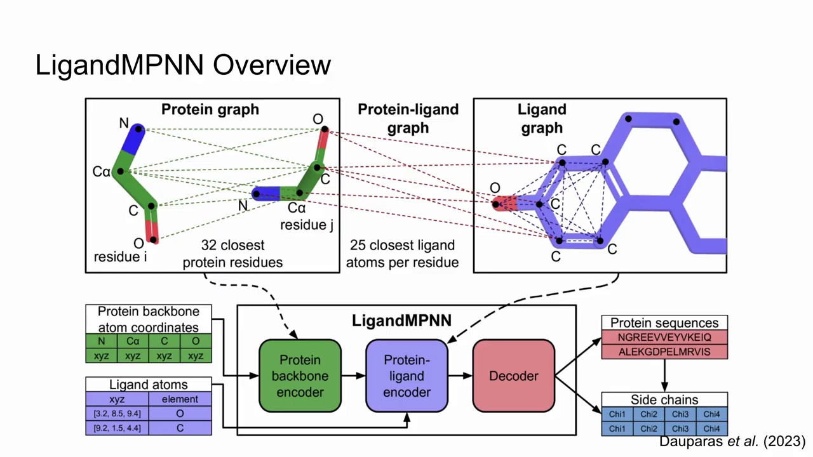

## 五、实操任务

课程最后布置了上手练习（[【跳转到 00:28:04】](https://www.youtube.com/watch?v=o8JWPjSH1Ig&t=1684)）：

1. **对比两种权重**：用 ProteinMPNN 权重和 LigandMPNN 权重，各跑一遍默认 PDB，然后把结果送进你选择的结构预测模型——集群上的 AlphaFold2 / ColabFold / ESMFold，或 AlphaFold3 服务器、Chai 服务器；
2. **调参观察**：修改 LeanMPNN 的一些参数，看结果差异；
3. **进阶实验**：基于一篇用 ProteinMPNN/LigandMPNN 显著提高蛋白稳定性的论文，为你自己的靶点做小实验——为蛋白建一个 **MSA**，找出**最不保守的氨基酸**，用它们作为 ProteinMPNN 设计的指导（[【跳转到 00:29:18】](https://www.youtube.com/watch?v=o8JWPjSH1Ig&t=1758)）。

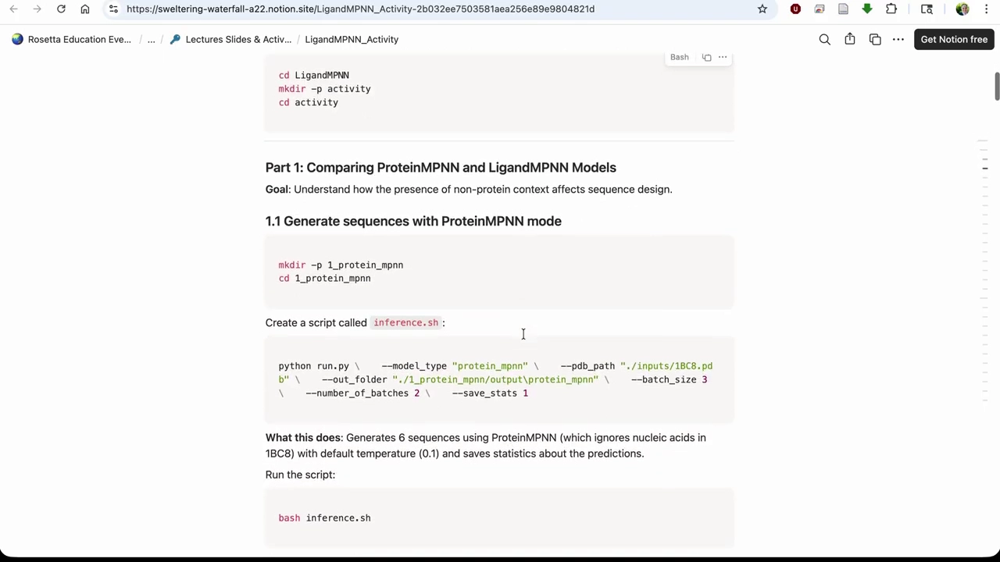

**课程信息（课前通知）**：讲者先花几分钟讲了环境问题——大家用 RFdiffusion2 时兼容性问题较多，JSON 里有拼写错误，建议改用底层模型相同的 **RFdiffusion all-atom**（文档更好、更易用）；也可走云端 API（讲者发了 key）；多人共用安装时要用**不同的命名目录**，避免互相覆盖（[【跳转到 00:01:15】](https://www.youtube.com/watch?v=o8JWPjSH1Ig&t=74)）。

## 小结

- **逆折叠 = 结构 → 序列**：给定想要的骨架拓扑，输出理论上能折叠成它的序列，是 RFdiffusion 之后必需的下一步。
- **图**：节点是实体（蛋白质/氨基酸），边是关系（序列相似性/相对刚体变换）。**局部注意力**只关注邻近节点，**全局注意力**关注所有节点；因为已有 3D 骨架，逆折叠用局部注意力就足够。
- **三代演进**：Ingraham 2019（局部注意力 K=30，还原率约 50%，超过 Rosetta 的 40–43%）→ ESM-IF 2022（折 1200 万结构、全局注意力、54%，但慢、有合成数据偏置与幻觉）→ ProteinMPNN 2022（局部图 + 消息传递，在一个月后取代 ESM-IF 成为主流）。
- **ProteinMPNN 不是 Transformer**：它用**消息传递**（48 邻居、不加权求和），输入是 16 维主链原子两两距离；编码器三轮传递可覆盖 48³，隐式学到远距离信息；解码器输出概率矩阵，**温度 > 1 会退化**。
- **局限与补课**：原始版对可溶性、配体/RNA/DNA 支持不足；官方补发可溶权重，并由 **LigandMPNN**（1D 配体-配体、6D 蛋白-配体、映射到 128 维）补齐生物分子场景。

## 关键术语速查

| 术语 | 一句话解释 |
| --- | --- |
| 逆折叠（inverse folding） | 由骨架结构反推氨基酸序列 |
| 图（graph） | 由节点（实体）和边（关系）构成的数据结构 |
| 序列相似性网络 | 节点是蛋白质、边是序列相似性的图，按阈值聚类 |
| 局部注意力 | 每个节点只关注邻近的若干节点 |
| 全局注意力 | 每个节点关注所有其它节点（AlphaFold 的做法） |
| 消息传递（message passing） | 节点与最近邻交换消息、不加权求和来更新自身 |
| K / 最近邻 | 每个节点交流的邻居数量（Ingraham 30，ProteinMPNN 48） |
| 16 维向量 | ProteinMPNN 的边特征：主链 N/Cα/C/O 等原子的两两距离 |
| 编码器-解码器 | 编码器编码骨架，解码器自回归地逐位输出序列 |
| 温度（temperature） | 控制解码采样多样性的参数，>1 会使模型退化 |
| 可溶性 ProteinMPNN | 官方后续发布的、改善蛋白可溶性的权重 |
| LigandMPNN | 支持小分子、DNA、RNA 的后续模型（2023） |
| MSA | 多序列比对，用于找出蛋白中保守/不保守的位点 |
