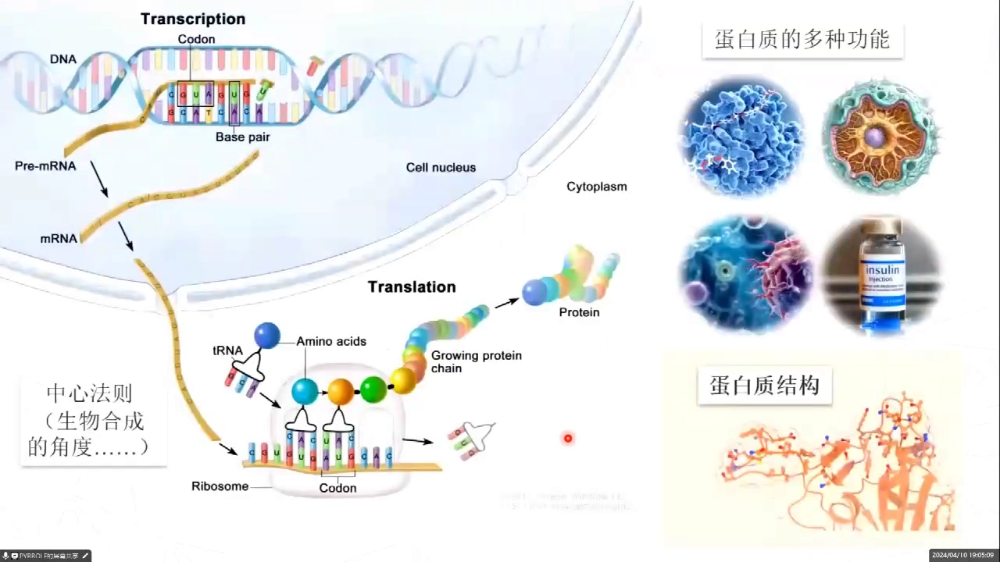
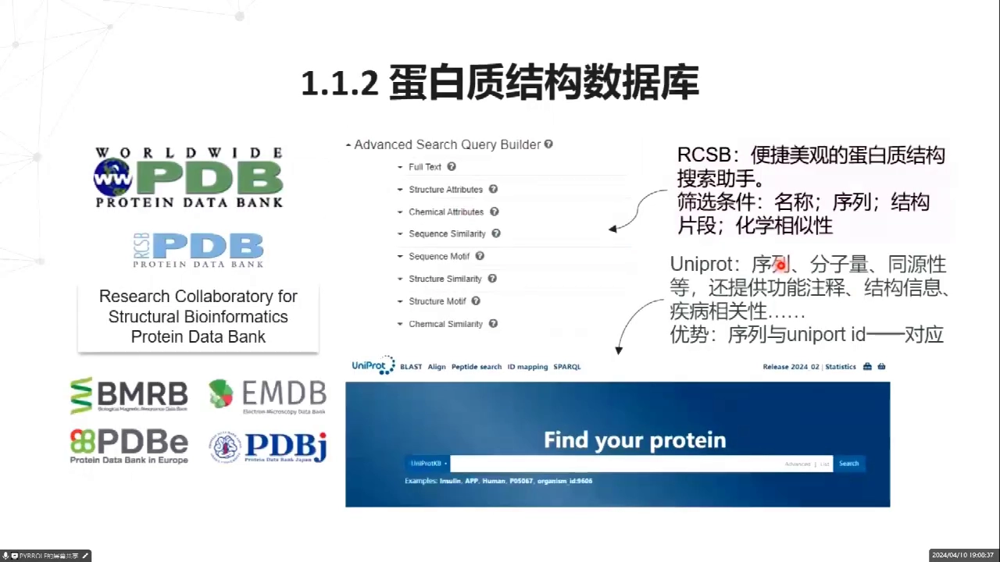
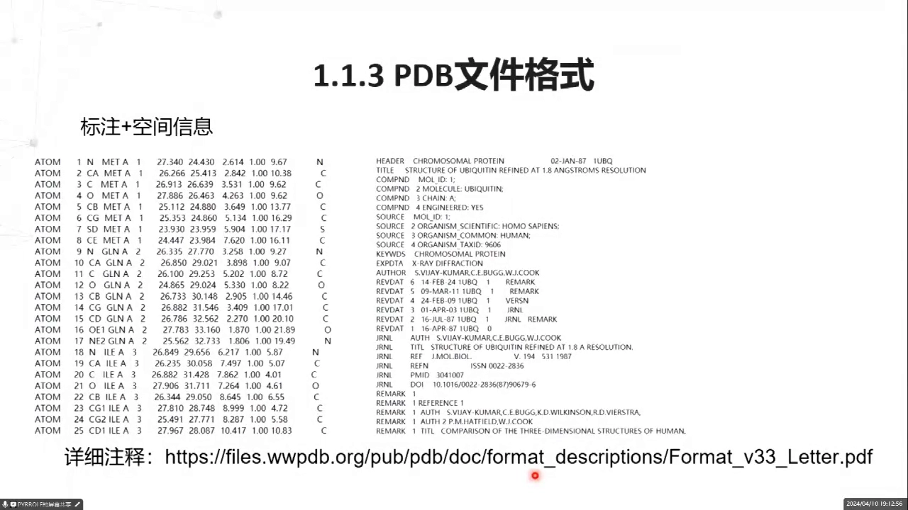
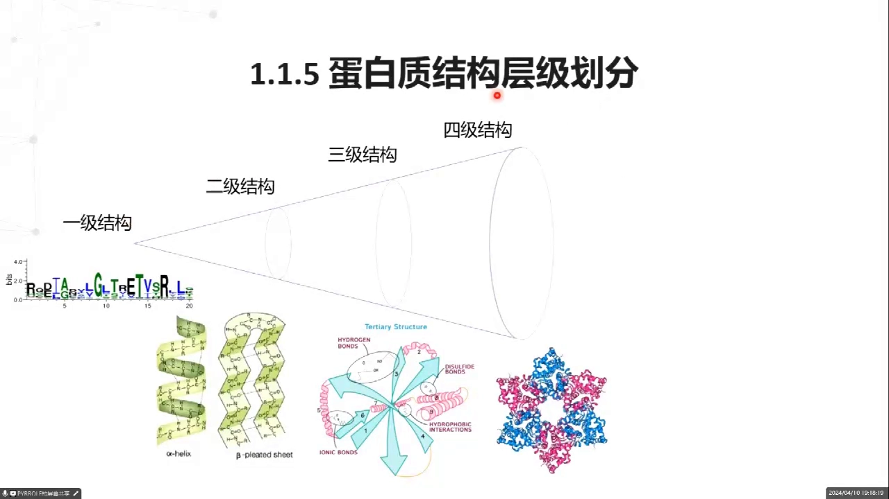
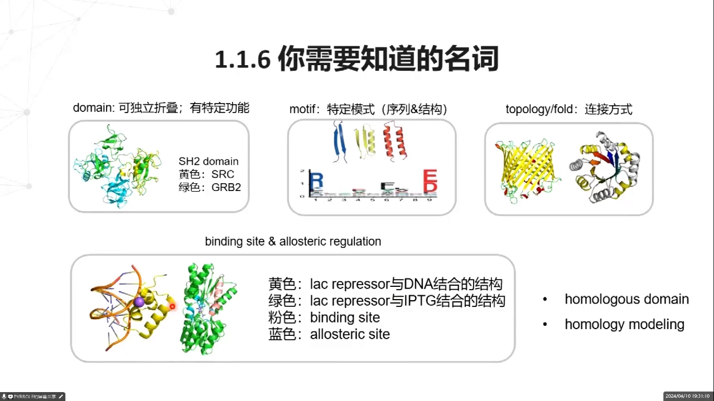
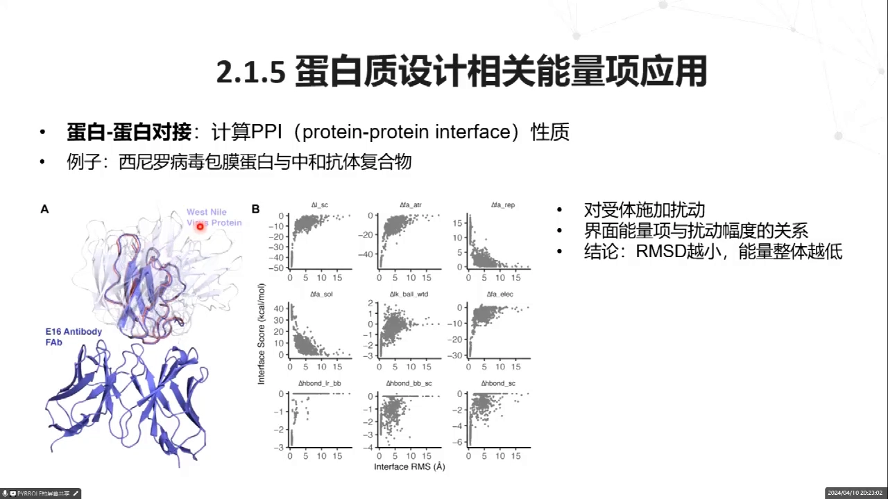
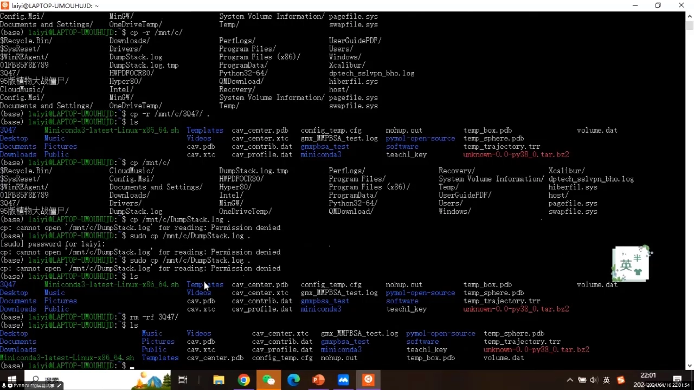

# 第1讲：AI + 蛋白质设计基础——从经典力场到深度学习

> 内容来源：B 站视频《【AI+蛋白质设计第1课】完整版》（BV1mkdwBoE6Z），时长约 2 小时 53 分。本文依据视频演讲逐字稿与幻灯片画面整理，力求完整、可核查。文中 `[【跳转到 MM:SS】]` 可点击回到视频对应位置。

## 本讲要解决的核心问题（SCQA）

**背景**：蛋白质是生命功能的执行者，它的三维结构决定了能否催化反应、传递信号、被药物识别。过去几十年，我们已积累海量数据：结构存进 PDB，序列存进 UniProt，测定手段从 X 射线晶体学、冷冻电镜到核磁共振一应俱全。

**冲突**：但"看懂、改造、设计"蛋白质远比查数据难。经典方法（分子力学、统计势、Rosetta）依赖大量人为规定的能量参数和"已知配体/已知结合位点"这类先验知识；当我们想设计一个自然界从未有过、专门抓住某个新靶点的结合蛋白（binder）时，这套思路常常力不从心。与此同时，深度学习正以一年一个跨步的速度改写整个领域。

**疑问**：一个初学者，究竟该按什么顺序入门？从结构基础，到经典力场设计，再到深度学习设计，这条路能不能走通、每一段的关键是什么？

**回答（中心思想）**：本讲给出了一条**从经典力场到深度学习**的完整设计路线——
1. **先打地基**：搞懂蛋白质结构、PDB 文件、结构层次与二面角，以及能量为什么能"从结构算出来"（分子力学 + 溶剂化能）；
2. **再学经典设计**：用统计势与 Rosetta 打分函数做基于物理的设计，并以 RF 方法实现"无先验知识"的 binder 设计；
3. **最后拥抱深度学习**：从人工神经网络、图神经网络讲到 ProteinMPNN，理解数据驱动方法为何能超越经验参数；
4. **动手实践**：用 Linux 常用命令把上述工具真正跑起来。

## 本讲地图

| 章节 | 主题 | 时间 |
| :--- | :--- | :--- |
| 一 | 蛋白质结构基础：从数据获取到能量计算 | [00:04:59](https://www.bilibili.com/video/BV1mkdwBoE6Z/?t=299) |
| 二 | 基于统计势函数的蛋白质设计：Rosetta 打分函数 | [00:48:07](https://www.bilibili.com/video/BV1mkdwBoE6Z/?t=2887) |
| 三 | 无先验知识的蛋白质药物设计：RF 方法 | [01:13:22](https://www.bilibili.com/video/BV1mkdwBoE6Z/?t=4402) |
| 四 | 基于深度学习的蛋白质设计：从 ANN 到 ProteinMPNN | [01:50:27](https://www.bilibili.com/video/BV1mkdwBoE6Z/?t=6627) |
| 五 | 实践准备：Linux 常用命令速成 | [02:35:34](https://www.bilibili.com/video/BV1mkdwBoE6Z/?t=9334) |

---

## 一、蛋白质结构基础：从数据获取到能量计算

### 1.1 看蛋白质有两个视角：做实验的人看"怎么造出来"，做应用的人看"能干什么"

同一张蛋白质的图，不同背景的人看到的东西完全不同。抱着一颗蛋白质，先要问自己：我到底想从它身上了解什么？[【跳转到 04:59】](https://www.bilibili.com/video/BV1mkdwBoE6Z/?t=299)

**第一个视角是生物合成视角。** 如果你做的是生物实验，你关心的往往是"这个蛋白怎么被表达、提纯出来"。这时你会先构建一个质粒——质粒是一小段环状 DNA，像一张"施工图纸"，把目标蛋白的基因装进去，再递送到细胞里。接着还要给细胞一个"开工信号"：比如对 **lac repressor**（乳糖阻遏蛋白，一种会抑制基因转录的蛋白）体系，就加入 **IPTG** 去诱导表达。做过这类实验的同学，看到蛋白质时脑子里浮现的就是质粒、诱导、纯化这一套流程。[【跳转到 05:04】](https://www.bilibili.com/video/BV1mkdwBoE6Z/?t=304)

**第二个视角是生物功能视角。** 如果你面向应用，你更关心"这个蛋白能干什么"。它可以分几大类：作为**酶**，催化化学反应；作为**结构蛋白**，充当细胞内的骨架支撑；作为细胞表面的**信号蛋白**，承担信号传递，比如免疫里非常重要的 **MHC**（主要组织相容性复合体，负责把抗原"展示"给免疫细胞）与 **TCR**（T 细胞受体，负责识别被展示的抗原）之间的细胞交流；以及作为**蛋白药物**，例如胰岛素。前者是"制造者"的视角，后者是"使用者"的视角。[【跳转到 05:29】](https://www.bilibili.com/video/BV1mkdwBoE6Z/?t=329)

那么这门课从哪里切入？答案是：**从蛋白质结构的角度出发**。而且即便是"看结构"，也有深浅之分。大多数人第一眼看到的是一张 **surface**（表面图），它告诉你蛋白大概是什么形状；稍微接触过结构的人会关注它的**二级结构**——这一段是 **helix**（α 螺旋）、**beta sheet**（β 折叠）还是 **loop**（环，连接螺旋与折叠的松散区段）；再进一步，才会深入到原子、分子水平的细节：哪个位置是什么原子、它们的化学性质和物理性质如何。[【跳转到 06:19】](https://www.bilibili.com/video/BV1mkdwBoE6Z/?t=379)




### 1.2 结构从哪来、存在哪：三大实验手段与两套数据库分工明确

**结论先行：蛋白质结构不是猜出来的，而是被"测"出来的，然后集中存进数据库；找人取结构时，UniProt 负责"认人"，PDB 负责"给结构"。**[【跳转到 06:52】](https://www.bilibili.com/video/BV1mkdwBoE6Z/?t=412)

**先说测定手段。** 最早，**Rosalind Franklin**（罗莎琳德·富兰克林）拍出了 DNA 的 X 射线衍射图，人们从衍射图的规律反推出 DNA 是双螺旋结构。但直到近 20 年后，人们才解析出蛋白质的 X 射线衍射结构。为什么晚了这么久？因为**蛋白质的衍射图样比 DNA 复杂得多**，必须经历一系列技术革命和方法更新，X 射线晶体学才成为主流手段。[【跳转到 07:17】](https://www.bilibili.com/video/BV1mkdwBoE6Z/?t=437)

第二类是 **Cryo-EM**（冷冻电镜），从图上一眼就能认出来。它擅长解析**比较大的蛋白**；反过来说，**小蛋白用 X-ray（X 射线）分辨率会更高**。二者各有所长。[【跳转到 07:42】](https://www.bilibili.com/video/BV1mkdwBoE6Z/?t=462)

第三类是 **NMR**（核磁共振）。它的谱图同样非常复杂，后来有人把某种算法应用到生物大分子的 NMR 谱图解析中，因此获得了诺贝尔奖。NMR 与前两者最不一样的地方在于：**它能给出动态的、多构象的结构**。比如一条柔性较强的多肽，在 loop 区域存在很多种构象，NMR 都能解析出来；而 X 射线和冷冻电镜通常只能给出一种结构。[【跳转到 08:07】](https://www.bilibili.com/video/BV1mkdwBoE6Z/?t=487)

**再说数据库。** 常见的名字有 **PDB**、**wwPDB**、**RCSB PDB**，它们是什么关系？**wwPDB** 是 world wide protein data bank 的缩写，它收集世界各地测出的大分子三维结构，是一个**国际性组织**，负责整个 PDB 档案的管理与发展。它下面有多个成员机构，比如美国/全球的 **RCSB PDB**、**BMRB**、**EMDB**，以及欧洲的 **PDBe**、日本的机构等。[【跳转到 08:32】](https://www.bilibili.com/video/BV1mkdwBoE6Z/?t=512)

其中**最常用的是 RCSB PDB**。它最关键的作用就是**搜索非常方便、界面美观**：既能按名字搜，也能按结构的组成、化学组成、序列、序列比对、结构相似度、结构多重比对乃至化学相关性来搜。想找到它也很简单，在 Bing 或 Google 搜索"RCSB PDB"，第一个结果通常就是官网。[【跳转到 09:22】](https://www.bilibili.com/video/BV1mkdwBoE6Z/?t=562)

另一个是 **UniProt**，大家可能更熟悉。它由欧洲生物信息研究所、瑞士生物信息研究所和蛋白质信息资源共同维护，是一个国际合作项目。它提供的信息**更全面**：序列、分子量、同源性，以及丰富的功能注释、结构信息和疾病相关性。[【跳转到 10:12】](https://www.bilibili.com/video/BV1mkdwBoE6Z/?t=612)

**两者的分工为什么要记牢？** 因为 UniProt 里**一种蛋白只对应一种序列、对应一个 UniProt ID**：人源、鼠源、兔源各有不同的 ID。而在 PDB 里检索时，你输入一条相似序列，可能会一次冒出很多结构相近的蛋白，反而不好筛选。所以实操建议是：**先在 UniProt 里根据自己蛋白的详细信息找出 UniProt ID，点进去后在左侧的 structure 部分，找到它在 PDB 中对应的 ID。** 先认人，再取结构。[【跳转到 10:37】](https://www.bilibili.com/video/BV1mkdwBoE6Z/?t=637)



### 1.3 读懂 PDB 文件：前面是"档案信息"，后面是"原子坐标"

**结论先行：PDB 文件就像一份结构档案，前半部分是元信息（谁、何时、怎么测的），后半部分才是真正的原子坐标；看懂列的意义，就能读懂原子层结构。**[【跳转到 11:35】](https://www.bilibili.com/video/BV1mkdwBoE6Z/?t=695)

**下载时的第一个坑：一定要选择 PDB format（PDB 格式）。** 官网上有多种格式，务必认准这种。[【跳转到 11:50】](https://www.bilibili.com/video/BV1mkdwBoE6Z/?t=710)

**文件里有什么？** 如果结构来自 X-ray，文件会记录**衍射条件、结晶条件**；如果来自 NMR，则记录 NMR 实验过程中的条件。除此之外是标注信息和空间信息。标注信息包括 **header**（蛋白的名字）、这个结构**什么时候解析出来、什么时候上传**，以及 **PDB ID**——PDB ID 一般都是**四个字符**。强烈建议到官网下载最新版的、关于 PDB 文档格式的详细说明 PDF，对照它来读。[【跳转到 12:26】](https://www.bilibili.com/video/BV1mkdwBoE6Z/?t=746)

**接着看空间信息。** 直接用文本编辑器打开 PDB 会觉得很乱：有的行结束得靠前，有的靠后，参差不齐。但其实它**编写得非常有规律、非常漂亮**——乱，只是因为空格比数字占的宽度小，文本软件自动对齐造成的错觉。对照官方 PDF 的 record format，各列含义如下：[【跳转到 13:16】](https://www.bilibili.com/video/BV1mkdwBoE6Z/?t=796)

- 第 1–6 列：**record name**（记录类型），如 `ATOM`，以及 `HETATM` 等；
- 第 7–11 列：**原子编号**；
- 之后是**原子名称**；
- 再后一般是**残基名称**和**残基编号**；
- 接着三列是**空间上的 XYZ 坐标**；
- 最后一列是 **temperature factor**（温度因子，也叫 **B-factor**），它**表征这个位置结构的置信度**。

要特别注意：**并不是所有信息都会标出**，你必须根据列的位置去查表判断它代表什么。[【跳转到 14:31】](https://www.bilibili.com/video/BV1mkdwBoE6Z/?t=871)



**原子是怎么命名的？** 以第一个残基为例：因为起始密码子都是 AUG，所以第一个氨基酸都是甲硫氨酸（MET）。主链原子比较简单：**N** 是氨基氮（也就是肽键里的氮），**CA** 是 α 碳，**C** 是羰基的碳，**O** 是肽键里羰基的氧。[【跳转到 15:01】](https://www.bilibili.com/video/BV1mkdwBoE6Z/?t=901)[【跳转到 15:26】](https://www.bilibili.com/video/BV1mkdwBoE6Z/?t=926)

**侧链原子的命名遵循"希腊字母顺序翻译成拉丁字母"。** 从 β、γ、δ、ε、ζ 这些希腊字母排序，再翻译成英文字母，就成了我们看到的 **B、G、D、E、Z**。以 MET 为例：主链四个原子之外，**CB** 是 β 碳，**CG** 是 γ 碳，**SD** 是 δ 位置的硫，**CE** 是 ε 碳；单看元素就是 C、C、S、C。注意第二个字母是希腊字母的拉丁转写（β→B、γ→G、δ→D、ε→E、ζ→Z）。[【跳转到 15:51】](https://www.bilibili.com/video/BV1mkdwBoE6Z/?t=951)

还有两个特殊情况：**C 端**因为羧基是裸露的，会比中间残基**多出一个氧**，一般命名为 **OXT**（C 端羧基氧之一）；而 **TER** 表示这条多肽链到此结束。[【跳转到 16:16】](https://www.bilibili.com/video/BV1mkdwBoE6Z/?t=976)

此外，**HOH** 是溶剂水分子，它不会归在正常氨基酸的原子属性里，而是记为 **HETATM**（非标准残基/杂原子）。[【跳转到 16:41】](https://www.bilibili.com/video/BV1mkdwBoE6Z/?t=1001)

再举两个例子。**赖氨酸**侧链是碳、碳、碳、碳、氮，同样从 B、G、D、E、Z 开始编号。**苯丙氨酸**比较特殊：它有两个碳在化学上环境等价，按顺序仍编号为 B、G、D、E、Z，但对等价的碳用 **D1、D2、E1、E2** 来区分。所以你以后做计算时，如果某个工具（比如 Rosetta）突然报错说"原子不识别"，第一件事就是检查它的**原子命名**是不是有问题。[【跳转到 16:59】](https://www.bilibili.com/video/BV1mkdwBoE6Z/?t=1019)[【跳转到 17:24】](https://www.bilibili.com/video/BV1mkdwBoE6Z/?t=1044)

### 1.4 结构分四级，二面角决定二级结构

**结论先行：蛋白质结构可以分成四个层次，而从一级到二级的关键，是主链二面角的不同组合带来了不同的氢键模式，进而长出 α 螺旋与 β 折叠。**[【跳转到 17:49】](https://www.bilibili.com/video/BV1mkdwBoE6Z/?t=1069)

**四级结构分别是：** 一级结构就是**序列**（氨基酸排列顺序）；二级结构是 **α 螺旋、β 折叠**；三级结构是**一条多肽链的整个三维空间结构**；四级结构是**多条链组成的复合物**，比如一个解旋酶由六条链构成。[【跳转到 18:14】](https://www.bilibili.com/video/BV1mkdwBoE6Z/?t=1094)

它们之间如何衔接？从一级到二级，主要考虑**特定的主链二面角**，它们形成的不同氢键模式，使链呈现螺旋状或 β 片状。从二级到三级，是**不同二级结构的组合**，而且往往有固定排列，比如两段 α 螺旋落在一片 β 折叠上，这类模式常叫 **alpha/beta**；再如荧光蛋白那种 **β 桶**，都是稳定且特征鲜明的三级结构。从三级到四级，则是**肽链之间的相互作用**。[【跳转到 18:39】](https://www.bilibili.com/video/BV1mkdwBoE6Z/?t=1119)[【跳转到 19:04】](https://www.bilibili.com/video/BV1mkdwBoE6Z/?t=1144)



**接下来是最抽象、也最关键的"二面角"。** 回想高中数学：两个面，在一个面上选一个点，在两面相交的直线上选两个点，再在另一个面上选一个点，这四个点就定义了一个二面角。在蛋白质里，就是**四个原子定义一个二面角**，我们主要关心**主链原子**形成的二面角。[【跳转到 19:22】](https://www.bilibili.com/video/BV1mkdwBoE6Z/?t=1162)

**为什么主链上有个角可以直接忽略？** 因为肽键上的氮原子有孤对电子，与碳氧双键之间存在 **p-π 共轭**，使这一段实际上是一个平面。把两个平面画出来后，这个角要么是 0°，要么是 180°，所以叫 **ω（omega）角**，通常不做考虑（0°对应**顺式**，180°对应**反式**）。真正要关注的是 **φ（phi）** 和 **ψ（psi）** 两个角。[【跳转到 19:47】](https://www.bilibili.com/video/BV1mkdwBoE6Z/?t=1187)[【跳转到 20:12】](https://www.bilibili.com/video/BV1mkdwBoE6Z/?t=1212)

- **φ 角**由 C–Cα–N–C 这四个原子定义；
- **ψ 角**由 N–C–Cα–N 这四个原子定义。

正是这两种二面角的不同组合，形成了非常丰富的二级结构和主链构象。[【跳转到 20:37】](https://www.bilibili.com/video/BV1mkdwBoE6Z/?t=1237)

**动态演示比静态图好懂。** 讲座用一个交互网页演示：先看 φ 角，把两个原子调到重叠、再减 20°来理解旋转；会发现**某些固定角度能量比较低**，因为它们之间的碰撞比较小。再看 ψ 角，正角度是逆时针、负角度是顺时针。把胺键也展示一下，就能看到 0°与 180°分别对应顺式和反式构象。[【跳转到 22:00】](https://www.bilibili.com/video/BV1mkdwBoE6Z/?t=1320)[【跳转到 22:25】](https://www.bilibili.com/video/BV1mkdwBoE6Z/?t=1345)[【跳转到 22:50】](https://www.bilibili.com/video/BV1mkdwBoE6Z/?t=1370)

**旋转二面角的过程中，"氢键"登场了。** 主链氮上有氢，会和主链上的氧形成氢键；不同的二面角组合呈现不同的**氢键模式**，于是形成了 α 螺旋和 β 折叠。以 α 螺旋为例：形成氢键后能量比较低，所以图上形成氢键的地方颜色较深；这就是我们常说的**右手螺旋**。这里还藏着一个有趣的现象——它存在一个**关于原点对称**的位置；而在 β 折叠那边，主要是**左手螺旋**，或者说 D 型氨基酸形成螺旋时 φ 和 ψ 刚好反过来，呈现**镜像**的情形。这就是所谓 **Ramachandran 图**上低能区、以及能量与氢键模式互相对应的直观含义。[【跳转到 23:55】](https://www.bilibili.com/video/BV1mkdwBoE6Z/?t=1435)[【跳转到 24:20】](https://www.bilibili.com/video/BV1mkdwBoE6Z/?t=1460)


### 1.5 设计必备概念：domain、motif、别构调控与同源建模

**结论先行：做蛋白质设计，有五个概念必须吃透——domain、motif、topology/fold、binding site 与 allosteric regulation，以及 homologous domain/homology modeling。**[【跳转到 24:50】](https://www.bilibili.com/video/BV1mkdwBoE6Z/?t=1490)

**第一个是 domain（结构域）。** 它是多肽链上的一个区域，关键是**可独立折叠、并有特定功能**。既然能独立折叠、又有特定功能，就意味着**同一个 domain 可以出现在不同的蛋白质里**。典型例子是 **SH2 domain**：它能与磷酸化的酪氨酸残基结合，广泛存在于信号传导蛋白中，尤其在细胞增殖和分化过程里。图中黄色的 **SRC** 蛋白与绿色的 **GRB2** 蛋白，**序列上差得非常多，却共享同一个 SH2 domain**，行使类似的功能。[【跳转到 25:15】](https://www.bilibili.com/video/BV1mkdwBoE6Z/?t=1515)[【跳转到 25:40】](https://www.bilibili.com/video/BV1mkdwBoE6Z/?t=1540)

**第二个是 motif（基序/模式）。** 直译是"特定模式"，它**既可以指序列上的特定模式，也可以指结构上的特定模式**。[【跳转到 26:05】](https://www.bilibili.com/video/BV1mkdwBoE6Z/?t=1565)

- **序列 motif**：以免疫为例，巨噬细胞等吞掉外源微生物后把病原蛋白消化掉，再把片段结合到 **MHC** 分子上；MHC 像一只手掌托着一段抗原肽，经内质网、高尔基体送到细胞表面展示，被 T 细胞识别后引发杀伤反应。科研人员通过**多肽组学**分析发现，这些结合肽在某些位点比较保守，于是做成 **sequence logo**：在比如一万条肽里，某个位置某类氨基酸出现的频率越高，该位点的字母就越大。这种 MHC 结合肽的序列特异性，就叫 **binding motif / sequence motif**。[【跳转到 26:30】](https://www.bilibili.com/video/BV1mkdwBoE6Z/?t=1590)[【跳转到 26:55】](https://www.bilibili.com/video/BV1mkdwBoE6Z/?t=1615)[【跳转到 27:20】](https://www.bilibili.com/video/BV1mkdwBoE6Z/?t=1640)
- **结构 motif**：不同的二级结构组合在一起，或同类二级结构自己组合，也叫 structure motif。例如两片 β 连在一起、α 与 β 组合、两个螺旋组合。其中**螺旋束（helix bundle）非常稳定**：中间疏水残基如果聚在一起，会产生极好的疏水作用，能量非常低，因此是极常见的 structure motif。[【跳转到 27:45】](https://www.bilibili.com/video/BV1mkdwBoE6Z/?t=1665)[【跳转到 28:10】](https://www.bilibili.com/video/BV1mkdwBoE6Z/?t=1690)

**第三个是 topology 与 fold。** **topology（拓扑结构）** 通常指蛋白质中二级结构元素（α 螺旋、β 折叠）的**空间排列和连接方式**；**fold（折叠）** 描述蛋白质链**如何折叠成特定的三维结构**，特别指整体的三维结构模式。二者的区别在于：topology 更侧重二级结构元素的排列与连接，和 structure motif 概念有些重合，但一般指更复杂的组合；fold 则着眼整体三维模式。[【跳转到 28:35】](https://www.bilibili.com/video/BV1mkdwBoE6Z/?t=1715)[【跳转到 29:00】](https://www.bilibili.com/video/BV1mkdwBoE6Z/?t=1740)

**第四个是 binding site 与 allosteric regulation（别构调控）。** 前者顾名思义是**结合位点**；后者是**别构调控**。用一个经典例子把两者一起讲清楚——提蛋白时常用的 **Lac repressor**。[【跳转到 29:25】](https://www.bilibili.com/video/BV1mkdwBoE6Z/?t=1765)

在细胞生长曲线上，找到 S 型曲线**斜率最大**的地方，就是要加 **IPTG** 诱导表达蛋白的时机。为什么加了 IPTG 就能表达？从结构上看：第一张 PDB 结构里，黄色是 Lac repressor 的一个片段，橙色和蓝色一看就是 DNA，这是 **Lac repressor 与 DNA 结合**的状态；第二张结构是 **IPTG 与 Lac repressor 结合**的状态。[【跳转到 29:50】](https://www.bilibili.com/video/BV1mkdwBoE6Z/?t=1790)[【跳转到 30:15】](https://www.bilibili.com/video/BV1mkdwBoE6Z/?t=1815)

Lac repressor 顾名思义是**抑制 DNA 转录**的蛋白；加了 IPTG 后能转录，说明 **IPTG 与 Lac repressor 结合后，使 repressor 不再能结合 DNA**。但麻烦在于：Lac repressor 与 DNA 结合时，结合位点是**紧紧连在一起**的，所以 IPTG **无法直接结合在 binding site 上**，它只能结合到**别的位置**，反过来调控那处的结构，让 repressor 从 DNA 上脱离。这种"不结合在活性位点、却影响蛋白活性"的结合方式，就叫**别构结合 / allosteric regulation**。图中粉色是 binding site，蓝色是 allosteric site。[【跳转到 30:40】](https://www.bilibili.com/video/BV1mkdwBoE6Z/?t=1840)[【跳转到 31:05】](https://www.bilibili.com/video/BV1mkdwBoE6Z/?t=1865)

再做一步 **align（对齐**，即通过摆放结构使两个结构之间的 **RMSD**——均方根偏差——最小，让它们最相近）：把 DNA 结合态对齐到 IPTG 结合态后会发现，**DNA 和其他部分发生了碰撞**。也就是说，IPTG 的结合使原本张得较开的 Lac repressor 两处角度**关上了**，关上之后 DNA 自然与 repressor 脱离。这就是 binding site 与别构调控的关系。[【跳转到 31:30】](https://www.bilibili.com/video/BV1mkdwBoE6Z/?t=1890)[【跳转到 31:55】](https://www.bilibili.com/video/BV1mkdwBoE6Z/?t=1915)

**第五个是 homologous domain 与 homology modeling。** "homolog"即**同源**，可以理解为进化上关系非常近。**homologous domain** 就是非常相像的结构域；**homology modeling（同源建模）** 则是：手上有一条新序列、不知道它的结构，就用 **BLAST** 去搜索与它序列很相像、而且已经有结构的蛋白，再据此模拟构建新序列的结构。[【跳转到 32:20】](https://www.bilibili.com/video/BV1mkdwBoE6Z/?t=1940)[【跳转到 32:45】](https://www.bilibili.com/video/BV1mkdwBoE6Z/?t=1965)

**这里要泼一盆冷水：尽管 AlphaFold2 已经人人尽知、能直接从序列预测结构，但在实际应用中，它对一些序列仍给不出很好的预测结果**，这时还得靠传统的同源建模。常用工具是 **MODELLER**（软件）和 **SWISS-MODEL**（网站）。[【跳转到 33:10】](https://www.bilibili.com/video/BV1mkdwBoE6Z/?t=1990)[【跳转到 33:35】](https://www.bilibili.com/video/BV1mkdwBoE6Z/?t=2015)



### 1.6 可视化、编辑与能量计算：分子力学、溶剂化能与 MM/PBSA

**结论先行：算能量之前，先用工具把结构"看"清楚、必要时"改"一改；而计算的核心思路，是把能量拆成分子力学项加溶剂化能项，再通过 Born-Haber 循环得到结合自由能，这就是 MM/PBSA、MM/GBSA 的原理。**[【跳转到 33:47】](https://www.bilibili.com/video/BV1mkdwBoE6Z/?t=2027)

**可视化与编辑工具。** 可视化常用 **PyMOL**（听得最多）、**ChimeraX**（画图更好看）和 **VMD**。VMD 专门用于**分子动力学模拟**，跑模拟时通常用它来看轨迹；如果完全不碰分子动力学，可以只装前两个。编辑主要是编辑 PDB 文件：可以用 Python 的 **BioPython** 库，改原子坐标、加原子、删原子都行，灵活性很强，但体系庞大、算起来偏慢；也可以直接做**文本处理**——Python 结合 TXT，或者用观感较好的 **Sublime Text**。[【跳转到 33:56】](https://www.bilibili.com/video/BV1mkdwBoE6Z/?t=2036)[【跳转到 34:46】](https://www.bilibili.com/video/BV1mkdwBoE6Z/?t=2086)[【跳转到 35:11】](https://www.bilibili.com/video/BV1mkdwBoE6Z/?t=2111)

**能量计算分三部分：** 分子力学公式、溶剂化能计算方法，以及结合自由能常用的 **MM/PBSA** 和 **MM/GBSA**。其中 **MM = molecular mechanics**（分子力学）；**PB、GB** 是计算溶剂化能的两种方法。[【跳转到 35:21】](https://www.bilibili.com/video/BV1mkdwBoE6Z/?t=2121)[【跳转到 35:46】](https://www.bilibili.com/video/BV1mkdwBoE6Z/?t=2146)

**能量包含动能和势能**；对能量求和、求一阶导就得到力，分别对应**动力学**与**静力学**。本课不考虑蛋白的动力学性质（那是分子动力学模拟做的事：对每个原子应用牛顿运动定律、在周围填满水分子、观察蛋白如何变化），而只考虑**静力学，也就是势能**。势能与空间位置相关，意味着**仅凭蛋白质的三维结构、仅凭它的 PDB 文件，我们就要算出能量**：在一个很大的势能面上搜索能量最低的点，因为最低即最稳定。[【跳转到 35:56】](https://www.bilibili.com/video/BV1mkdwBoE6Z/?t=2156)[【跳转到 36:21】](https://www.bilibili.com/video/BV1mkdwBoE6Z/?t=2181)[【跳转到 36:46】](https://www.bilibili.com/video/BV1mkdwBoE6Z/?t=2206)

**分子力学是在真空条件下描述蛋白质能量**，因此只需考虑蛋白原子之间的相互作用，分成**共价能**与**非共价能**。[【跳转到 37:11】](https://www.bilibili.com/video/BV1mkdwBoE6Z/?t=2231)

- **共价项**包括：**成键能**（原子轨道重叠、能量下降形成的键，一般由电子能谱得出）、**键角弯折**（分子在振动，角度会弯折）、**二面角**（这里包括所有原子的二面角，不只是主链）。[【跳转到 37:36】](https://www.bilibili.com/video/BV1mkdwBoE6Z/?t=2256)
- **非共价项**分为**静电作用**与**范德华作用**。[【跳转到 38:01】](https://www.bilibili.com/video/BV1mkdwBoE6Z/?t=2281)

**它们的数学形式是什么？** 键长拉伸/缩短和键角弯折都可以用**胡克定律**式的能量表达：系数乘以"实际距离减平衡位置距离的平方"（即二次函数），更精确时可用 **Morse 势**（曲线稍微拐一下）。二面角因为是**周期性的**，用 `cos(n·ω − ω₀)` 形式拟合，其中 ω₀ 是能量最低的位置。范德华是经典的 **6-12 定律**（即 **Lennard-Jones 势**），静电则是库仑作用。简单说：弯折、拉伸这类用二次函数，二面角用周期函数，非键作用都能写成类似"小对勾"式的能量形式。[【跳转到 38:26】](https://www.bilibili.com/video/BV1mkdwBoE6Z/?t=2306)[【跳转到 38:51】](https://www.bilibili.com/video/BV1mkdwBoE6Z/?t=2331)[【跳转到 39:16】](https://www.bilibili.com/video/BV1mkdwBoE6Z/?t=2356)

**参数从哪来？从力场（force field）得到。** 分子力学的力场有三个基本假设：[【跳转到 39:41】](https://www.bilibili.com/video/BV1mkdwBoE6Z/?t=2381)

1. **BO 近似（Born-Oppenheimer 近似）**：不考虑原子核的运动，把原子核视为相对固定，只考虑电子的运动；
2. **势能面可以拆分为若干简单模式的贡献之和**——真实能量很难表述，我们只拆出主要成分，类似一种低阶泰勒展开；
3. **可迁移性**：类比机器学习的泛化能力，在某个蛋白上用的参数，换到另一个蛋白也能用，因为原子的组成和基本性质不变。

常用的力场有 **AMBER、CHARMM、GROMOS**。[【跳转到 40:06】](https://www.bilibili.com/video/BV1mkdwBoE6Z/?t=2406)[【跳转到 40:31】](https://www.bilibili.com/video/BV1mkdwBoE6Z/?t=2431)

**但真实蛋白在溶液里，不能只算真空能量。** 蛋白质与水分子的相互作用不容忽视：从 PDB 下载蛋白，常看到旁边好多细小杂乱的线，那其实都是**水分子**。用 ChimeraX 画亲水/疏水的 surface 可以看到：黄色代表**疏水**、蓝色代表**亲水**、白色是中性；与溶液接触的部分大部分是蓝色（亲水），而黄色非常集中，说明存在疏水痕迹并叠在一起。[【跳转到 40:48】](https://www.bilibili.com/video/BV1mkdwBoE6Z/?t=2448)[【跳转到 41:13】](https://www.bilibili.com/video/BV1mkdwBoE6Z/?t=2473)

**溶剂化能拆成两部分：**[【跳转到 41:38】](https://www.bilibili.com/video/BV1mkdwBoE6Z/?t=2498)

- **静电能量**：蛋白与溶液之间的静电相互作用。用两种方程计算——**Poisson-Boltzmann 方程**（泊松-玻尔兹曼方程）本质上是一个二阶微分方程：泊松方程描述电势，玻尔兹曼部分把电子密度与离子浓度联系起来，代入后即可求解静电势 ψ；另一是 **Generalized Born（GB）方程**。简单理解：**GB 是 PB 的一种低阶展开**，想算得快用 GB，想算得更准用 PB。[【跳转到 42:03】](https://www.bilibili.com/video/BV1mkdwBoE6Z/?t=2523)[【跳转到 42:53】](https://www.bilibili.com/video/BV1mkdwBoE6Z/?t=2573)
- **非静电相互作用**：包括**范德华力**（任何原子都有，有排斥有吸引），以及 **cavity（空腔）项**。cavity 的含义是：把一个蛋白放进水里，它会**排开一部分水**，破坏了水分子之间原有的相互作用，这部分能量损失就计入该项。这两项很难拆出精确的解析表达，于是用经验公式拟合：`γ·SASA + b`，其中 γ 和 b 是**用实验数据拟合出来的系数**。[【跳转到 43:18】](https://www.bilibili.com/video/BV1mkdwBoE6Z/?t=2598)[【跳转到 43:43】](https://www.bilibili.com/video/BV1mkdwBoE6Z/?t=2623)

**这里引入一个关键量：SASA（solvent accessible surface area，溶剂可及表面积）。** 怎么算？拿一个小球，半径取水分子的半径，沿着蛋白质表面像"刮"或"扫"一样滚一圈，算出来的面积就是 SASA。把它代入上面的拟合公式，就能把溶剂化能算出来。[【跳转到 44:08】](https://www.bilibili.com/video/BV1mkdwBoE6Z/?t=2648)[【跳转到 44:34】](https://www.bilibili.com/video/BV1mkdwBoE6Z/?t=2674)

**最后把分子力学与溶剂化能结合起来：Born-Haber 循环。** 灰色代表**水溶液**、下面代表**真空**。先在真空中让蛋白与小分子结合，用分子力学算出气相自由能 ΔG_gas；再分别计算各自的溶剂化能；两步合起来，就得到该过程在水溶液中的自由能变化。这正是大家常说的、安装起来很"痛苦"的 **gmx_MMPBSA** 背后的原理。[【跳转到 44:39】](https://www.bilibili.com/video/BV1mkdwBoE6Z/?t=2679)[【跳转到 45:04】](https://www.bilibili.com/video/BV1mkdwBoE6Z/?t=2704)

**用公式看更清楚：** ΔG 的定义是"产物减反应物"，而每一项都可以写成"分子力学 + 溶剂化能 − 熵"。**熵项**是通过**正交模式分解**算的——看蛋白哪些振动模式占优势，再据其结构计算熵；但因为它算得不准，**实际计算中一般不带这一项**，我们通常只得到 ΔG 的主项。gmx_MMPBSA 虽然有算熵的方法，但其说明文档明确**不建议计算**。[【跳转到 45:29】](https://www.bilibili.com/video/BV1mkdwBoE6Z/?t=2729)[【跳转到 45:54】](https://www.bilibili.com/video/BV1mkdwBoE6Z/?t=2754)

**软件流程**大致是：先处理轨迹或结构（一般输入 **XTC** 文件，因为 gmx 对应 **GROMACS** 的轨迹格式，没有也可以）；再处理拓扑，用 **parmed** 把输入结构转换成 **AMBER 的拓扑形式**（AMBER 即前面提到的一种常用力场）；然后执行计算；最后输出 result，给出**每一个残基在结合中的贡献**。[【跳转到 46:02】](https://www.bilibili.com/video/BV1mkdwBoE6Z/?t=2762)[【跳转到 46:27】](https://www.bilibili.com/video/BV1mkdwBoE6Z/?t=2787)

**关于熵，最后补一句判断经验：** 熵要用态密度，而态密度一般难以知道，所以通常不算。如果配体是两个都比较稳定的蛋白，一眼看去不会有明显影响，可以忽略；但如果配体是一条多肽、你又不确定它的二级结构是 helix 还是一段 loop，那就需要**单独在水溶液里跑一次配体的 MD**，观察它是否稳定，以此判断要不要考虑熵效应。[【跳转到 46:52】](https://www.bilibili.com/video/BV1mkdwBoE6Z/?t=2812)[【跳转到 47:17】](https://www.bilibili.com/video/BV1mkdwBoE6Z/?t=2837)


---

## 二、基于统计势函数的蛋白质设计：Rosetta 打分函数

### 2.1 统计势函数：从"状态出现的概率"反推"能量"

统计势函数（statistical potential，又叫基于知识的势能 knowledge-based potential）的核心思想只有一句话：**能量可以由概率反推出来，公式是 U = -kT ln P**。这里的 U 是能量，k 是玻尔兹曼常数、T 是温度，P 是"某一种状态出现的概率"。换句话说，一个状态在真实蛋白质结构中越常见，它的能量就越低；越罕见，能量就越高。[【跳转到 48:17】](https://www.bilibili.com/video/BV1mkdwBoE6Z/?t=2897)

- **它怎么工作**：先从已知结构的蛋白质数据库（PDB）里，统计各种状态（比如某个距离、某个角度）实际出现的频率，得到 P，再代入 `-kT ln P`，就把"概率"翻译成了"能量"。[【跳转到 48:42】](https://www.bilibili.com/video/BV1mkdwBoE6Z/?t=2922)
- **为什么叫"统计势/知识势"**：因为它的参数不是从纯物理推导出来的，而是从大量已知结构中"学"出来的，这些结构就是它的"知识"。
- **Rosetta 打分函数的地位**：讲座接下来重点讲的是 Rosetta 打分函数，它是蛋白质设计中最常用、也最好用的一种打分函数，通讯作者是 David Baker——著名的美国生物化学家和计算生物学家，开创了预测与设计蛋白质三维结构的方法（比如大家熟悉的 RoseTTAFold），就职于华盛顿大学。[【跳转到 49:22】](https://www.bilibili.com/video/BV1mkdwBoE6Z/?t=2962)

### 2.2 Rosetta 打分函数总览：ΔE_total = Σ w_i · E_i

Rosetta 的总能量写成一个很简洁的求和式：**ΔE_total = Σ w_i · E_i**，也就是"每一项能量乘以它自己的权重，再全部加起来"。[【跳转到 50:58】](https://www.bilibili.com/video/BV1mkdwBoE6Z/?t=3058) 理解这个公式要抓住几个关键点。

- **为什么左边写 ΔE**：因为需要一个能量基准、一个能量的"零点"。做法是先给定一个 PDB 结构（一个三维空间结构），在这个基准之上去算它的能量，所以是"相对值"。[【跳转到 51:23】](https://www.bilibili.com/video/BV1mkdwBoE6Z/?t=3083)
- **下标 i 不是氨基酸**：这里最容易误解。i 并不是指某一个氨基酸，而是指**一种能量形式**——也就是公式右边列出的那些项（范德华、静电、氢键、扭转能……）。每一种能量项，都与所研究的那几个原子、残基的几何信息和化学信息相关。[【跳转到 51:48】](https://www.bilibili.com/video/BV1mkdwBoE6Z/?t=3108)
- **单位问题（非常重要）**：由于这些参数是用参数化方法拟合出来的，不一定能对应真实实验。但 Rosetta 经年累月的调整优化后，前面那些能量项的输出基本可以和千卡每摩尔（kcal/mol）对应；而后面一些与角度相关的项（比如 omega 等），不太好用实验能量来量化，它们的单位就是一个**任意单位**。所以实际使用时一定要留意能量项后面的单位。[【跳转到 52:13】](https://www.bilibili.com/video/BV1mkdwBoE6Z/?t=3133)
- **权重 w_i**：就是每个能量项前面乘的那个系数，决定这一项在总分里占多大分量。
- **这张表要记牢**：做蛋白质设计时 Rosetta 会输出一堆以字母缩写命名的分数，别看到乱七八糟的字母就抓瞎，一定要反过来对照它对应的是哪一项能量。讲座提到这是重要文献里的 Table 1。[【跳转到 52:13】](https://www.bilibili.com/video/BV1mkdwBoE6Z/?t=3133)


### 2.3 范德华力：拆成 fa_atr 与 fa_rep 的 6-12 势

第一个层级是"原子与原子对之间的力"，首先讲范德华力。Rosetta 用的还是经典的 6-12 定律，也就是 Lennard-Jones 势。[【跳转到 53:28】](https://www.bilibili.com/video/BV1mkdwBoE6Z/?t=3208)

- **三个符号的含义**：sigma 是两个原子的半径之和，D 是原子间的距离，epsilon 是势阱深度的平均值。势阱深度就是那条"对勾形"曲线最低点对应的能量。epsilon 和 D 都来自实验数据拟合——如果记得物理化学里的气体实验，就能从那些数据里拟合出这两个值。[【跳转到 53:53】](https://www.bilibili.com/video/BV1mkdwBoE6Z/?t=3233)
- **定性行为**：近距离排斥、在一定距离有吸引、再远则几乎没有作用。
- **为了优化，拆成两项**：Rosetta 把它截成两部分——fa_atr（attraction，吸引）和 fa_rep（repulsion，排斥），方便设计过程中做细微调整。[【跳转到 54:18】](https://www.bilibili.com/video/BV1mkdwBoE6Z/?t=3258)
- **排斥项怎么处理**：靠近时曲线太陡峭，搜索最低点时会出现"梯度爆炸"，所以做了两处处理：截断值取 **0.6 倍的范德华半径之和**；大于范德华半径之和时认为排斥能量为零；非常近的一段用线性函数代替。[【跳转到 55:03】](https://www.bilibili.com/video/BV1mkdwBoE6Z/?t=3308)
- **吸引项与平滑**：吸引项也拆成两部分，在一定距离范围内其值等于势阱值，非常远时吸引为零。中间用**幂函数**过渡，目的是让函数平滑地到达零点，这样求导也连续；而势能对距离的导数就是力，所以这同时保证了力的连续，符合真实物理过程。[【跳转到 55:33】](https://www.bilibili.com/video/BV1mkdwBoE6Z/?t=3333)
- **能量最小化中的技巧**：Rosetta 采样（比如能量最小化）时会**逐步增加排斥项的权重**，防止构象过度紧凑、保持结构完整性、避免陷入能量陷阱。这个 relax 过程在下一讲会带大家实际操作。[【跳转到 56:03】](https://www.bilibili.com/video/BV1mkdwBoE6Z/?t=3383)

### 2.4 静电：介电常数会随位置变化

静电力也是非常经典的能量形式，用库仑形式描述，但蛋白质里有一个特殊之处。[【跳转到 56:28】](https://www.bilibili.com/video/BV1mkdwBoE6Z/?t=3408)

- **介电常数不是常数**：蛋白质的疏水核心因为很疏水，介电常数低；靠近表面与溶剂接触后逐步增大。因此在 Rosetta 的函数里，介电常数从 6 逐渐增大到 80（水的介电常数约为 80）。这是"距离依赖的介电常数"。[【跳转到 56:53】](https://www.bilibili.com/video/BV1mkdwBoE6Z/?t=3433)
- **只算附近**：它只考虑 4 埃以内的静电相互作用，远处忽略。
- **数值稳定处理**：和范德华力类似，在距离 R 很小时做截断，防止斜率太大导致梯度爆炸；中间用幂函数平滑，幂函数参数满足"导数连续"的条件。[【跳转到 57:18】](https://www.bilibili.com/video/BV1mkdwBoE6Z/?t=3458)

### 2.5 溶剂化能：用能量项代替显式水分子

溶剂化能主要考虑两种能量形式：**FASol** 和 **LKBWTD**。WTD 一般表示 weighted（加了权重）；LK 指使用了一个叫 LK 的模型，是一个隐式的高斯排斥模型。[【跳转到 57:43】](https://www.bilibili.com/video/BV1mkdwBoE6Z/?t=3483)

- **核心思路**：不把水分子显式地建成"一个氧原子加两个氢原子"，而是**用一个能量项来代表溶剂对蛋白的影响**。[【跳转到 58:08】](https://www.bilibili.com/video/BV1mkdwBoE6Z/?t=3508)
- **FASol 项**：比较常规，主要考虑非极性原子与周围溶剂的相互作用。
- **极性项**：另一项主要考虑极性原子。把蛋白从真空拿到水里时，极性原子引入会破坏水分子之间原本的氢键，这部分能量的损失就用一个专门的公式表达。[【跳转到 58:33】](https://www.bilibili.com/video/BV1mkdwBoE6Z/?t=3533)
- **分段与连续**：能量公式同样分成很多段，一为防止梯度爆炸，二为使远端到近端的函数形式连续。讲座强调，因为不做力场开发，初学者只需知道这些项的**物理意义**即可。[【跳转到 58:58】](https://www.bilibili.com/video/BV1mkdwBoE6Z/?t=3558)

### 2.6 氢键：为什么必须从静电里单拿出来

接下来是"非常重要的"氢键，要详细讲。依据是 IUPAC（国际纯粹与应用化学联合会）对氢键的定义：它有结构、红外光谱、紫外光谱等多个方面的定义，这里只考虑**结构**，也就是从**距离和角度**两方面来限定什么算氢键。[【跳转到 59:23】](https://www.bilibili.com/video/BV1mkdwBoE6Z/?t=3583)

- **三个角色**：donor（给体 D）、氢原子（H）、acceptor（受体 A）。A 一般有孤对电子或带负电，D 是电负性比较强的原子，使得氢原子暴露较多正电荷；正负电荷吸引形成氢键。[【跳转到 60:33】](https://www.bilibili.com/video/BV1mkdwBoE6Z/?t=3633)
- **为什么单列**：氢键不只是正负电荷吸引，还包含一定的原子轨道重叠（一定的共价作用），所以它本质上不该被并入静电，而应作为一个单独的能量项。[【跳转到 61:23】](https://www.bilibili.com/video/BV1mkdwBoE6Z/?t=3683)
- **各项符号**：DHA 是给体—氢—受体这个距离；θ_AHD 和 θ_BAH 是角度；还有一个二面角。B 是 A 的母原子，即"到骨架原子最短路径上的第一个原子"，B2 是 B 的母原子。蛋白质中氢键形成时，这个二面角也有特定偏好，所以要单独统计。[【跳转到 61:48】](https://www.bilibili.com/video/BV1mkdwBoE6Z/?t=3708)
- **参数来源**：这些参数都是从 PDB 结构库中训练获得的。[【跳转到 62:13】](https://www.bilibili.com/video/BV1mkdwBoE6Z/?t=3733)
- **输出项命名规则**：Rosetta 输出的氢键相关项如 hb_lr_bb、hb_sc 等。BB 是骨架、SC 是侧链、LR 是 long range（长程）、SR 是 short range（短程）。具体定义下一讲看 score 文件时再细过。[【跳转到 62:38】](https://www.bilibili.com/video/BV1mkdwBoE6Z/?t=3758)

### 2.7 扭转能：Ramachandran 统计与脯氨酸的例外

扭转能（torsion）主要指 Ramachandran map 里主链二面角的统计，以及骨架设计中相关的一些能量项。[【跳转到 63:33】](https://www.bilibili.com/video/BV1mkdwBoE6Z/?t=3813)

- **传统做法与问题**：传统力场主要用 sin、cos 函数，但这类函数在 loop 区域拟合效果不好。有些方法干脆绕过，用一个显式的新函数去逼近量子力学计算结果，从而避免周期性带来的 loop 区拟合不佳。[【跳转到 63:58】](https://www.bilibili.com/video/BV1mkdwBoE6Z/?t=3838)
- **数据来源**：同样来自 PDB。
- **rama_prepro**：这个输出项包含两个类别。如果某残基的下一个残基是脯氨酸——脯氨酸侧链成环且连在主链氮上，会严重影响前一个残基的二面角——统计时就专门区分：下一个不是脯氨酸的算一类，是脯氨酸的算另一类，用两个函数分别拟合，防止异常情况拉偏平均值。[【跳转到 64:48】](https://www.bilibili.com/video/BV1mkdwBoE6Z/?t=3888)
- **p_aa_pp**：它做的是相反方向的事——在已知二面角的情况下去推测氨基酸类型，可以用**贝叶斯公式**计算。[【跳转到 65:38】](https://www.bilibili.com/video/BV1mkdwBoE6Z/?t=3938)

### 2.8 Rotamer：侧链构象为什么要离散化

Rotamer 指**侧链构象**（旋转异构体）。我们常说的侧链构象库，就是氨基酸侧链一些特定的几何排列方式。关键结论是：**侧链构象通常是离散的**。[【跳转到 65:47】](https://www.bilibili.com/video/BV1mkdwBoE6Z/?t=3947)

- **例外**：如果有 SP2 杂化的碳原子（比如带芳环的，或带其他基团的），侧链构象就不离散。
- **函数形式**：整体形式里包含一个高斯分布项。对于全是 SP3 杂化的键，所有键都可自由旋转，呈现明显的周期性变化。[【跳转到 66:37】](https://www.bilibili.com/video/BV1mkdwBoE6Z/?t=3997)
- **酰胺键是半可旋转的**：像酰胺键，只有在 0° 和 180° 附近，不会有太多其他角度。[【跳转到 67:02】](https://www.bilibili.com/video/BV1mkdwBoE6Z/?t=4022)
- **三种特殊情况**：①主链酰胺键的 ω 角，一般在 0° 或 180°；②脯氨酸要单独计算；③long range（长程）部分也要单独考虑。如果实际设计中没遇到特别困难的问题，可以不必太关注这些项；但若要用特殊氨基酸（如谷氨酸）去稳定蛋白，就要考虑这些能量。[【跳转到 67:45】](https://www.bilibili.com/video/BV1mkdwBoE6Z/?t=4065)

### 2.9 能量零点、权重与 ΔΔG

与蛋白质设计相关的能量，首先要回答一个基础问题：**能量零点怎么确定？**[【跳转到 69:00】](https://www.bilibili.com/video/BV1mkdwBoE6Z/?t=4140)

- **为什么不直接用全解折叠态**：蛋白质的全解折叠态能量本应是零点，但根本没法确定"没有折叠时"到底是什么构象，所以计算上不可行。[【跳转到 69:25】](https://www.bilibili.com/video/BV1mkdwBoE6Z/?t=4165)
- **为什么仍然要统一零点**：因为我们想**比较不同序列**的能量，而不只是看同一序列在不同构象间的变化。Rosetta 的 reference energy 也采用了一个函数形式，其参数经过非常长时间、大量的优化，使能量零点与实验数据最为吻合。[【跳转到 69:50】](https://www.bilibili.com/video/BV1mkdwBoE6Z/?t=4190)
- **权重怎么定**：权重 w_i 的确定在设计中非常重要，通常**根据自己的设计目的来调整**；Rosetta 开发时也是根据实验数据来调整和优化各能量项参数。[【跳转到 70:15】](https://www.bilibili.com/video/BV1mkdwBoE6Z/?t=4215)
- **单位回顾**：很多参数从实验数据确定，一般对应 kcal/mol，可参见那张表格或文献里的 Table 1。[【跳转到 70:40】](https://www.bilibili.com/video/BV1mkdwBoE6Z/?t=4240)
- **ΔΔG**：指突变一个残基后蛋白质的能量变化。文献例子是 RTrh 衍生多肽与 HIV 蛋白酶复合物 T193V 的突变，展示了能量分解——突变后有些原子间能量降低、有些升高。[【跳转到 69:25】](https://www.bilibili.com/video/BV1mkdwBoE6Z/?t=4165)

### 2.10 应用：热点残基分析与蛋白-蛋白对接

这些能量项能直接用来分析界面的性质。[【跳转到 71:05】](https://www.bilibili.com/video/BV1mkdwBoE6Z/?t=4265)

- **原子水平能量分解**：通过上面的 ΔΔG，可以逐一查看不同原子间的能量变化，帮助分析界面性质或找出 hotspot（热点残基）。[【跳转到 71:30】](https://www.bilibili.com/video/BV1mkdwBoE6Z/?t=4290)
- **分析热点残基的现代做法**：现在一般用 gmx_MMPBSA 提供的 in silico 分析。Rosetta 也可以做 alanine scanning——把界面上的残基逐个突变成丙氨酸，再计算结合自由能变化，以此表示该残基对结合的贡献。[【跳转到 71:42】](https://www.bilibili.com/video/BV1mkdwBoE6Z/?t=4302)
- **蛋白-蛋白对接（PPI）案例**：第二个应用是计算 PPI（蛋白-蛋白界面）性质，例子是西尼罗病毒包膜蛋白与其中和抗体的复合物。西尼罗病毒能引起人类致命的神经系统疾病。方法是**对病毒包膜蛋白（受体）进行扰动**，再看界面各能量项与扰动幅度的关系。[【跳转到 72:07】](https://www.bilibili.com/video/BV1mkdwBoE6Z/?t=4327)
- **结论**：如果 RMSD 越小，整体能量越低，就说明原来这个受体构象确实是结合最好的构象；横坐标是 RMSD 变化，RMSD 越大，那些突出贡献的能量项就越弱，这与实际情况相符。[【跳转到 72:57】](https://www.bilibili.com/video/BV1mkdwBoE6Z/?t=4377)



### 2.11 从"有统计势"走向"无先验知识的 binder 设计"

到这里，第二章讲完了基于统计势函数的思路：从 PDB 统计概率反推能量，再用 Rosetta 的十几项能量（范德华、静电、溶剂化、氢键、扭转能、rotamer）加权求和，去评估和优化一个结构。它的特点是**依赖已知结构提供的"知识"**——无论是打分参数还是能量零点，都从大量已知蛋白中训练而来。

那么，如果我们要设计一个自然界里从来没有的、专门去结合某个靶点的结合蛋白（binder），还能不能只靠这套"从已知知识里统计"的办法？当目标界面没有现成模板可参考时，又该从哪里获得能量信号？这正是下一章要展开的——**无先验知识的 binder 设计**。

---

## 三、无先验知识的蛋白质药物设计：RF 方法

### 3.1 传统 PPI 设计（2011–2015）是"室内攀岩"：先对接找位置，再在位置处设计序列

**结论先行：2011 到 2015 年的早期蛋白—蛋白相互作用设计，思路是先用 docking（对接）搜索配体结合得最好的位置，再在结合最好的位置设计序列；但它高度依赖已知的热点残基，并且只做极有限的构象采样。** [【跳转到 73:22】](https://www.bilibili.com/video/BV1mkdwBoE6Z/?t=4402)

先解释几个词。**PPI（protein-protein interaction）** 就是两个蛋白质之间发生相互作用；我们想做的是设计一个 **binder**（结合蛋白，能把目标蛋白"抓住"的分子）。**docking（对接）** 是把配体（ligand）往受体（receptor）上摆，搜索它结合得最好的位置，这一步是 2011 年力场刚成熟时的主要手段。当时的典型做法是 **docking 配合 match design**，也就是在对接最优的位置上，反过来设计该位置的序列。[【跳转到 74:12】](https://www.bilibili.com/video/BV1mkdwBoE6Z/?t=4452)

**为什么小分子好做、蛋白配体难做？** 因为小分子结构简单、结合口袋很深，还有 **Cavity 这类程序**可以主动在蛋白表面搜索"哪里可能是个小分子口袋"；确定口袋后，把小分子放进去，生成上千、上万甚至几十万个构象，几乎可以**遍历所有构象**，总能找到结合最好的那一个。而蛋白配体结构非常复杂，要遍历它的构象极其困难，所以传统方法只能退而求其次。[【跳转到 74:37】](https://www.bilibili.com/video/BV1mkdwBoE6Z/?t=4477)

具体退到什么程度？传统方法的四条典型做法是：[【跳转到 75:07】](https://www.bilibili.com/video/BV1mkdwBoE6Z/?t=4507)

- **只考虑 1–3 个 hotspot（热点残基）**，也就是对结合界面贡献最大的那几个残基，其余一概不看；
- **只优选少量 PPI 侧链优势构象**：不遍历所有侧链构象，更不要说主链，只对少数关键侧链改变它的 **rotamer**（侧链旋转异构体，即侧链绕单键转动形成的优势构象）；
- **ligand 与 receptor 只做粗糙的形状互补**，大概符合"锁钥模型"、看着能契合就行；
- **把热点残基与 scaffold 融合**：确定热点后，把它放到 **scaffold**（骨架，用于承载设计界面的蛋白框架）上，再进行多轮设计优化。[【跳转到 75:32】](https://www.bilibili.com/video/BV1mkdwBoE6Z/?t=4532)

这套方法的成败还**高度依赖 scaffold 数据库的多样性**——骨架库的质量，直接决定了最终设计出来的质量。[【跳转到 75:57】](https://www.bilibili.com/video/BV1mkdwBoE6Z/?t=4557)

### 3.2 传统方法三大缺点：要先知道配体、结构预测不成熟、蛋白表面太平坦

**结论先行：传统 PPI 设计有三个硬伤——必须先知道配体才能定 hotspot；当时的蛋白—蛋白结构预测还不成熟；而蛋白结合界面天生平坦、没有明显口袋，导致相互作用弱、算出来的能量彼此接近，根本挑不出满意的 binder。** [【跳转到 76:22】](https://www.bilibili.com/video/BV1mkdwBoE6Z/?t=4582)

- **缺点一：需要已知配体。** 否则你凭什么判断哪几个残基是关键的热点？没有参照，热点无从确定。
- **缺点二：当时蛋白—蛋白结构预测不成熟。** 即使有了配体，配体和靶标具体长什么样也不清楚，热点残基就更难定位了。
- **缺点三：蛋白表面没有明显的结合口袋。** 观察大量蛋白—蛋白复合物会发现，界面**非常平坦**，不像小分子那样有一个凹下去的口袋。[【跳转到 76:47】](https://www.bilibili.com/video/BV1mkdwBoE6Z/?t=4607)

第三个缺点又衍生出两个挑战。第一，**平坦表面很难产生强相互作用**：小分子的每个原子多少都能贡献点范德华力、疏水作用，而平坦界面做不到。第二，正因为作用弱，当你设置一个打分阈值去筛设计结果时，会冒出一大堆构象，它们的**能量都差不多**，于是你根本分不清哪个才是真正好的 binder。[【跳转到 77:12】](https://www.bilibili.com/video/BV1mkdwBoE6Z/?t=4632)

### 3.3 RF 方法：用"侧链相互作用场"实现"野外攀岩"，搜索范围大幅扩大

**结论先行：RF（rotamer interaction field，侧链相互作用场）方法的核心，是不再依赖已知落脚点，而是先在界面附近生成海量可能的相互作用侧链，形成一个"场"，再去反向匹配骨架——这就像从室内攀岩转向野外攀岩。** [【跳转到 77:37】](https://www.bilibili.com/video/BV1mkdwBoE6Z/?t=4657)

介绍方法之前先说人。这篇工作的第一作者是**曹龙星**，他当时在 **David Baker** 组做博后——David Baker 正是我们前面反复提到的 Rosetta 的通讯作者（机构、职称信息以讲座所述为准：曹龙星现在西湖大学生命科学学院从事蛋白质设计研究）。[【跳转到 77:46】](https://www.bilibili.com/video/BV1mkdwBoE6Z/?t=4666)

作者用一个巧妙的**攀岩类比**来讲清楚两种路线的差别：

- **室内攀岩**：墙上有人预先装好一堆凸起的小圆点，你只要沿着设计好的轨迹踩着这些"现成落脚点"往上爬。这**正对应 2011–2015 年的 hotspot 方法**——热点残基就是现成落脚点，你沿着它找一条好路径即可。
- **野外攀岩**：没人给你长凸起，你得自己寻找坚固的锚点（岩石突出物、树木，或用岩钉、螺栓等装备），而且必须确认锚点自身稳定、能承受多方向的力量。它**搜索范围极大、没有任何先验锚点**，好处是能发现更多通往终点的中间路径。[【跳转到 78:20】](https://www.bilibili.com/video/BV1mkdwBoE6Z/?t=4700)[【跳转到 79:10】](https://www.bilibili.com/video/BV1mkdwBoE6Z/?t=4750)[【跳转到 79:35】](https://www.bilibili.com/video/BV1mkdwBoE6Z/?t=4775)

理解"场"这个字也很关键：**场不是一个实体**，就像重力场、静电场一样，它是一个概念。RF 产生的侧链并不是真的被摆在了那个位置，而是记录了"这种残基放在这里能量是多少"，再把**能量与残基信息存进一张哈希表**里。[【跳转到 80:23】](https://www.bilibili.com/video/BV1mkdwBoE6Z/?t=4823)

### 3.4 RF 设计流程：生成侧链场 → 套骨架 → 对接 → 嫁接 → 聚类迭代

**结论先行：完整流程是五步——①用 RFgen 生成相互作用侧链形成"场"；②在骨架库里搜索能容纳这些侧链、又不与靶标碰撞的骨架；③用 RFdock 让配受体几何逐步契合；④用创新的 MULTIGRAFT 把多肽片段嫁接到骨架上；⑤聚类后再次嫁接、设计，最后进入"设计—合成—测试"的迭代循环。** [【跳转到 79:58】](https://www.bilibili.com/video/BV1mkdwBoE6Z/?t=4798)

**第一步，RFgen 生成侧链场。** 它在小分子或热点残基附近生成 rotamer，而且**特别之处在于能针对极性残基做优化**；不过本工作为了减少工作量，**只做了疏水残基**的 RF 生成。这些 rotamer 信息被存进**六维哈希表**，记录氨基酸骨架坐标和结合能量；每个对接位点的分数，就是把哈希表里对应残基类型的分数求和。[【跳转到 82:38】](https://www.bilibili.com/video/BV1mkdwBoE6Z/?t=4958)[【跳转到 83:03】](https://www.bilibili.com/video/BV1mkdwBoE6Z/?t=4983)

**这一步最重要的意义，是把连续采样的计算复杂度从 N、N² 降到近似一维，从而极大扩展了搜索空间。** 以往对接要一个骨架一个骨架地往上放；现在只要**一次性算出附近所有残基侧链的能量**，之后把骨架与已生成的侧链做个 align（对齐，使二者 RMSD 最小）就可以了，不必逐个摆着试。[【跳转到 83:28】](https://www.bilibili.com/video/BV1mkdwBoE6Z/?t=5008)[【跳转到 83:53】](https://www.bilibili.com/video/BV1mkdwBoE6Z/?t=5033)

**第二步，在骨架库中找骨架。** 条件是尽量涵盖侧链构象、且不与 target 碰撞。库里的骨架多是稳定的**三螺旋束**等小蛋白，长度在 50–65 之间，结构 motif 非常多样。**为什么不用更省事的单根螺旋？** 关键在**疏水核心**：小蛋白中间有更大范围的疏水核心，而疏水作用是蛋白折叠最强的驱动力，所以它更稳定，对重新设计的界面**耐受性也更高**——中间结合得好，界面上改几个残基对整体结构影响不大；反之单根或两根螺旋，改了这边就可能影响那边的结合。[【跳转到 80:48】](https://www.bilibili.com/video/BV1mkdwBoE6Z/?t=4848)[【跳转到 84:16】](https://www.bilibili.com/video/BV1mkdwBoE6Z/?t=5056)[【跳转到 84:41】](https://www.bilibili.com/video/BV1mkdwBoE6Z/?t=5081)

**第三步，RFdock。** 对每一个 binding pose（结合位置），让 ligand 与 receptor 的 online RMSD **逐步减小**，做层级式、逐渐缩小范围的搜索：一开始 RMSD 设得大，再一点点收紧，直到收到与 RFgen 生成侧链结合最好的地方。评估同时看两项——低分辨结构适配度与 **RIF 分数**，通俗说就是"配受体几何上契合得好不好"。[【跳转到 85:36】](https://www.bilibili.com/video/BV1mkdwBoE6Z/?t=5136)[【跳转到 86:01】](https://www.bilibili.com/video/BV1mkdwBoE6Z/?t=5161)

**第四步，MULTIGRAFT，这是本文最创新的地方。** 以往对接都是整个 ligand 对整个 receptor；而 MULTIGRAFT 的思路是**先找到一个好骨架，再把稳定它结构的东西放上去**。**graft 就是"嫁接"**，即把一段多肽片段移植到已有骨架上。对接完成后，做 **Rosetta fast design**（侧链 repacking，重新优化侧链二面角构象）加上**梯度下降能量最小化**；再用 **TM-align** 去重（TM-score 是衡量两个结构相似度的打分），筛出约 2000 个 motif；最后用 **motif graft mover**（Rosetta 的一个功能模块）把 scaffold **superimpose**（叠合）到 motif 上。[【跳转到 86:36】](https://www.bilibili.com/video/BV1mkdwBoE6Z/?t=5196)[【跳转到 87:26】](https://www.bilibili.com/video/BV1mkdwBoE6Z/?t=5246)[【跳转到 87:51】](https://www.bilibili.com/video/BV1mkdwBoE6Z/?t=5271)

**第五步，聚类与迭代。** 把界面 motif 提出来按 TM-score 聚类，挑出占比高的"privileged"骨架，再做一次 motif grafting，然后进入第二轮 sequence design，用 Rosetta 打分函数筛出最终用于实验的 binder。整体上，蛋白质 binder 设计基本都遵循**"设计—合成—测试"的循环**：只设计一轮往往不够，至少再优化一次，这种迭代能系统性提高成功率。[【跳转到 81:38】](https://www.bilibili.com/video/BV1mkdwBoE6Z/?t=4898)[【跳转到 97:46】](https://www.bilibili.com/video/BV1mkdwBoE6Z/?t=5866)

### 3.5 实验体系：一口气做十几个靶标，并用四种湿实验方法交叉验证

**结论先行：算法是否好用，最终要靠实验体系说话；这篇工作选了 13 个靶标，涵盖细胞表面信号蛋白与病原表面蛋白，并用圆二色谱、SPR、ITC、酵母展示四类方法交叉验证——不过多数靶标其实用了已知的结合位点。** [【跳转到 88:31】](https://www.bilibili.com/video/BV1mkdwBoE6Z/?t=5311)

**靶标选择。** 以往工作常只选一到两个靶标，这里直接做了 **13 个**。它们分两类：第一类是**细胞信号传导相关的细胞表面蛋白**，如神经营养因子受体 **TRKA**、表皮生长因子受体 **EGFR**，都是热门药物靶点；第二类是**病原表面蛋白**，如 **SARS-CoV-2 spike 蛋白**与**流感 A 型 H3 蛋白**。让同行震惊的是，作者在 **2021 年**（全球疫情最严重之时）设计出了对 SARS-CoV-2 spike 具有**皮摩尔级**结合的抗体。 [【跳转到 89:21】](https://www.bilibili.com/video/BV1mkdwBoE6Z/?t=5361)[【跳转到 89:46】](https://www.bilibili.com/video/BV1mkdwBoE6Z/?t=5386)

**需要客观指出**：方法虽宣称"无先验知识"，但实际设计时，多数靶标仍是在蛋白表面选择一到两个**已知的结合位点**。[【跳转到 90:11】](https://www.bilibili.com/video/BV1mkdwBoE6Z/?t=5411)

**四种湿实验方法的原理：**

- **圆二色谱（CD）**：氨基酸具有**手性**，手性分子对左旋、右旋圆偏振光的吸收不同，于是产生信号。α 螺旋有特征谱形；实际蛋白的谱图是混合的，需用**傅立叶变换去卷积**，拆出各二级结构的占比。它还能变温测量，精确测出蛋白的热变性/熔解温度。[【跳转到 90:36】](https://www.bilibili.com/video/BV1mkdwBoE6Z/?t=5436)[【跳转到 91:26】](https://www.bilibili.com/video/BV1mkdwBoE6Z/?t=5486)
- **表面等离子体共振（SPR）**：芯片下方有一束激光，当芯片上结合了配体，金属表面的**共振角会发生变化**，由响应曲线即可算出结合强度 **KD**（解离常数，数值越小结合越强）。[【跳转到 91:51】](https://www.bilibili.com/video/BV1mkdwBoE6Z/?t=5511)
- **等温滴定量热法（ITC）**：直接测结合过程的**焓变**，比 MM/PBSA 那类理论计算更直接，可用来推 ΔG。
- **酵母展示 + 荧光分选**：高通量表达蛋白，把靶标带上**荧光标记**，再用基于荧光的 cell sorting 分选。此外，这个组还解了**晶体结构**——验证结构的"终极武器"。[【跳转到 92:41】](https://www.bilibili.com/video/BV1mkdwBoE6Z/?t=5561)

### 3.6 结果：设计结构与实验吻合，H3 双组结合凸显"无先验"优势

**结论先行：设计出的 binder 螺旋含量高、CD 谱与设计预期一致；针对流感 A H3 的 binder 能同时结合 group one 与 group two 两类蛋白，说明它不必依赖已有靶标结构；晶体结构与设计结构叠合约 2 Å，验证了设计的准确性。** [【跳转到 93:06】](https://www.bilibili.com/video/BV1mkdwBoE6Z/?t=5586)

**CD 验证设计。** 这些 binder 的螺旋含量很高，实测 CD 谱（蓝线）与设计理想结构吻合得很好，说明序列确实折叠成了预期结构。[【跳转到 93:06】](https://www.bilibili.com/video/BV1mkdwBoE6Z/?t=5586)

**H3 靶标的案例最精彩。** 流感 A H3 分为 **group one** 与 **group two** 两类。已有靶向 group one 的小分子，但 group two 的结合口袋环境与 group one 差异很大：[【跳转到 93:30】](https://www.bilibili.com/video/BV1mkdwBoE6Z/?t=5610)

- 其一，口袋内有一个**色氨酸的取向发生翻转**。色氨酸有巨大的芳香环，在结合面积很小的情况下贡献极大；取向一翻，小分子大概率就结合不上了，事实也确实如此。
- 其二，group two 周围有**糖基化**，使口袋变得更亲水、体积更小，group one 的小分子根本无法挪用。[【跳转到 93:55】](https://www.bilibili.com/video/BV1mkdwBoE6Z/?t=5635)

而本文设计的 mini binder 竟然能**同时结合 group one 和 group two**；竞争实验表明其结合位点与已知位点、设计位点一致，并且它只与这两类蛋白结合，没有出现其他结合，特异性良好。这最能说明方法的优势：**不必依赖已有的靶标结构，也能设计出同时结合两种蛋白的抗体。** [【跳转到 94:20】](https://www.bilibili.com/video/BV1mkdwBoE6Z/?t=5660)[【跳转到 94:45】](https://www.bilibili.com/video/BV1mkdwBoE6Z/?t=5685)[【跳转到 95:10】](https://www.bilibili.com/video/BV1mkdwBoE6Z/?t=5710)

**晶体结构进一步背书。** 侧链叠合得很好，设计结构与晶体结构整体约 **2 Å** 的偏差，属于非常优秀的设计。[【跳转到 95:17】](https://www.bilibili.com/video/BV1mkdwBoE6Z/?t=5717)

### 3.7 亮点总结：高效建库 + 只做疏水优化 + 分离聚类 + 多重嫁接

**结论先行：RF 工作的六个亮点串成一条"更高效、更聚焦、更快"的技术链——高效扩展出高质量多样骨架库、只考虑疏水 hotspot、patch dock 接 RAPDock、repack+minimization 提速十倍、分离聚类隐式筛热点、multi motif graft 细化搜索。** [【跳转到 95:41】](https://www.bilibili.com/video/BV1mkdwBoE6Z/?t=5741)

- **高效建库**：采用更高效的 **high-level extension**，产生了质量高、多样性好的骨架库，共 **3 万多个**。
- **聚焦疏水**：RF 侧链采样时只考虑**疏水 hotspot**，以节省计算资源。
- **快速形状互补到精确对接**：先用 **patch dock** 做快速形状互补，再接上 **RAPDock**；不仅看 RF 分数，还看结构适配度（可找到结合自由能）与 **CMS**（contact molecular surface，Rosetta 的结合适配度指标），从而得到更好的 pose。[【跳转到 96:06】](https://www.bilibili.com/video/BV1mkdwBoE6Z/?t=5766)
- **优化提速十倍**：采用快速的 **repack + minimization**（侧链重新搜构象 + 整体能量最小化），且**只考虑疏水相互作用**，使优化速度提升约十倍。[【跳转到 96:31】](https://www.bilibili.com/video/BV1mkdwBoE6Z/?t=5791)
- **界面设计加权重**：优化中考虑形状互补与非极性包埋残基，并在**蒙特卡洛**过程中给 PPI 界面更高的权重，进一步提升设计质量。
- **分离聚类筛热点**：把质量好的连续 motif 分离、聚类，这一步相当于**隐式地考虑 hotspot 的体积**，同时把最可能结合的热点残基筛出来。
- **多重嫁接**：最后用 **multi motif graft** 细化搜索 scaffold，并展开新一轮界面设计。[【跳转到 97:21】](https://www.bilibili.com/video/BV1mkdwBoE6Z/?t=5841)


### 3.8 局限与展望：瓶颈是"经验能量函数"，方向是引入深度学习

**结论先行：RF 工作虽然出色，但作者自己指出成功率仍偏低、亲水界面难设计、依赖海量数据库；这些问题的共同根源，是 Rosetta 打分函数本质上仍是人为规定大量参数的经验函数，说明我们对 PPI 的理解还不够充分，于是自然要引入深度学习方法。** [【跳转到 98:11】](https://www.bilibili.com/video/BV1mkdwBoE6Z/?t=5891)

- **成功率仍较低**：若想获得结合更好的残基，还需要做**更大范围的饱和突变**（把某个氨基酸逐一突变成其他 19 种，工作量极大）。
- **亲水界面不好设计**：本工作要求界面至少包含**四个疏水残基**，但蛋白表面其实**大部分是亲水的**，只盯着疏水那一小部分，很难设计出特别好的结合。[【跳转到 98:41】](https://www.bilibili.com/video/BV1mkdwBoE6Z/?t=5921)
- **构建了大量数据库**：既有结合的蛋白骨架序列，也有不结合的，工作量非常庞大。[【跳转到 99:06】](https://www.bilibili.com/video/BV1mkdwBoE6Z/?t=5946)

作者希望用这些信息进一步挖掘蛋白—蛋白相互作用的规律，从而节约设计资源。但上述三点改进方向的**本质**，都指向同一个瓶颈：**Rosetta 打分函数毕竟是一个人为规定参数非常多的经验能量函数**，虽然表现已很好，但仍说明我们对 PPI 理解不充分。因此，面对庞大的数据，除了用物理函数去描述，也可以引入**深度学习**方法——下一课就先讲深度学习基础，再讲 **ProteinMPNN** 的工作原理。[【跳转到 99:31】](https://www.bilibili.com/video/BV1mkdwBoE6Z/?t=5971)[【跳转到 99:45】](https://www.bilibili.com/video/BV1mkdwBoE6Z/?t=5985)

---

## 四、基于深度学习的蛋白质设计：从 ANN 到 ProteinMPNN

### 4.1 人工智能的起点，就是"模拟一个神经元"

人工智能（AI，artificial intelligence）最初并不是为了写诗、画图，而是源于人类对**大脑工作机制**的模仿。早在 1943 年，人们就提出了最早的人工神经网络。它的基本设想非常朴素：**模拟一个神经元的工作方式——接收信号、处理信号、再把结果输出给下一个神经元。**[【跳转到 111:49】](https://www.bilibili.com/video/BV1mkdwBoE6Z/?t=6709)

- **直观例子**：我们看一部美剧时，眼睛接收到画面、耳朵接收到声音，这就是两个输入；信号经过一层层神经元判断"该不该笑"，最后汇聚成一个输出"该笑"，于是脸上就出现了笑的表情。真实大脑里的神经元数量极多、机制极复杂，但这套"输入→处理→输出"的框架，就是人工神经网络的灵感来源。[【跳转到 112:14】](https://www.bilibili.com/video/BV1mkdwBoE6Z/?t=6734)
- **layer（层）是什么意思**：神经元并不是"一个输入直接变成一个输出"，中间要经过多步处理，每一步处理就对应一个 layer（层）。只藏在中间、不直接对接外界的层，叫 **hidden layer（隐藏层）**。这就是"分层处理信号"的过程。[【跳转到 113:04】](https://www.bilibili.com/video/BV1mkdwBoE6Z/?t=6784)
- **分层识别一张脸的比喻**：第一层先检查边缘和角点，比如哪些是点、哪些是线（edges and corners）；第二层把这些局部特征组合成有意义的部件，比如这里是一只鼻子、那里是嘴、那里是眼睛；第三层再在更高维度上把它们拼成"一整张脸"。神经网络的每一层，干的就是这类逐级抽象的事。[【跳转到 113:29】](https://www.bilibili.com/video/BV1mkdwBoE6Z/?t=6809)


### 4.2 三个早期经典案例说明：注入"专家先验知识"能让 AI 少走弯路

在讲深度学习之前，先看三个早期成果。它们共同说明一件事——**AI 不一定要从零开始学，把专家的经验先喂进去，往往能事半功倍。**[【跳转到 114:11】](https://www.bilibili.com/video/BV1mkdwBoE6Z/?t=6851)

- **吴文俊与几何定理自动证明**：中国科学家吴文俊曾用 AI 来做几何定理的自动证明。数学里的定理像搭积木一样，一块一块垒起来，逻辑链条清晰，所以很适合机器自动推理，这在当时甚至能辅助做奥数题。[【跳转到 114:11】](https://www.bilibili.com/video/BV1mkdwBoE6Z/?t=6851)
- **费根鲍姆的质谱解析专家系统**：这是上世纪 60 年代的事。一位做天体生物学的人来求助费根鲍姆，希望帮忙分析火星上收集到的各类光谱、质谱，判断其中是否存在有机物。当时的通用思路是"从最基础的东西开始训练"，效率很低。费根鲍姆的创新在于**引入专家的先验知识**——让专家先造出大量数据来训练模型，于是不用从头摸索，少走很多弯路。最终模型能从几千种可能的结构中，挑出与质谱结果最吻合的那个正确分子结构。用一句话概括：**输入数据，输出一个化学结构。**[【跳转到 114:36】](https://www.bilibili.com/video/BV1mkdwBoE6Z/?t=6876)
- **E. J. Corey 的反向合成分析**：Corey 的工作同样是**基于专家经验加上神经网络模型**，用来做反向合成分析（从目标分子倒推合成路线）。他也因此获得了诺贝尔奖。[【跳转到 115:11】](https://www.bilibili.com/video/BV1mkdwBoE6Z/?t=6911)

这三个例子的共同点是：**"专家经验"本身就是一种宝贵的先验，把它装进模型里，就能显著降低学习成本。**

### 4.3 大数据时代，是深度学习得以爆发的地基

随着计算机和科学仪器迅速小型化、信息化，20 世纪下半叶我们进入了**高通量时代**。高通量技术带来了史无前例的大数据，而大数据正是深度学习能work的前提。[【跳转到 115:30】](https://www.bilibili.com/video/BV1mkdwBoE6Z/?t=6930)

- **人类基因组计划**：把人体中所有基因组都测序出来，形成了一个极其庞大的数据库。[【跳转到 115:55】](https://www.bilibili.com/video/BV1mkdwBoE6Z/?t=6955)
- **高通量合成**：最直观的就是我们天天在用的 **PCR**（聚合酶链式反应）。从前从头合成一段核酸非常困难，有了多聚酶之后，就能大批量地生产核酸，实验数据随之暴增。特别是引入了 **error-prone PCR（易错 PCR）**和 **DNA shuffling（DNA 改组）**之后，可以高效制造大量序列变体。[【跳转到 116:20】](https://www.bilibili.com/video/BV1mkdwBoE6Z/?t=6980)
- **文献、专利与数据库的指数增长**：做科研的人越来越多、手段越来越方便，文献、实验方法、专利和数据库的数量都呈**指数级增长**。这同样是大数据时代最典型的产物。[【跳转到 117:25】](https://www.bilibili.com/video/BV1mkdwBoE6Z/?t=7045)

### 4.4 神经网络的本质，是一个万能的函数拟合器 Y = F(X)

理解了大数据，再看神经网络的数学本质就很容易了：**人工神经元的本质就是一次函数处理，写成 Y = F(X)。**X 是输入，Y 是输出，F 就是模型要去学会的那个函数。所以从某种意义上说，**AI 就是一个"万能的函数拟合器"。**[【跳转到 117:47】](https://www.bilibili.com/video/BV1mkdwBoE6Z/?t=7067)

- **X 和 Y 可以是什么**：可以是单变量、数组、向量，乃至**张量**（tensor，可以简单理解为"更高维的数组"）。正因为输入输出形式极其灵活，AI 才能被搬到各种领域。[【跳转到 118:12】](https://www.bilibili.com/video/BV1mkdwBoE6Z/?t=7092)
- **ANN 与 DNN 的区别**：早期的 **ANN（artificial neural network，人工神经网络）**只有输入层和输出层；我们今天用的 **DNN（deep neural network，深度神经网络）**则在中间插入了若干隐藏层，用来完成分层处理和层级抽象，从而解决复杂的模式识别与层次分类问题。[【跳转到 118:12】](https://www.bilibili.com/video/BV1mkdwBoE6Z/?t=7092)
- **两者怎么表达**：ANN 可以用比较简洁的**显式函数**来表达；DNN 则是**权重矩阵与函数网络的复合**——一层套一层。也正因为隐藏层太多、中间参数无法逐一解释，大家才把深度学习叫做"黑箱"。[【跳转到 118:37】](https://www.bilibili.com/video/BV1mkdwBoE6Z/?t=7117)
- **DNN 是大数据时代的产物**：数据量太大、模式太复杂，才需要用更复杂的网络去处理。所以说 DNN 天生就是一个"高通量 + 大数据"时代下的产物。[【跳转到 119:02】](https://www.bilibili.com/video/BV1mkdwBoE6Z/?t=7142)

### 4.5 常见深度学习模型速览：从可解释的矩阵运算到"黑箱"

讲座按从老到新的顺序，快速过了一遍主流模型。**类型不同，但底层大多可以归结为"对矩阵做某种运算"。**[【跳转到 119:27】](https://www.bilibili.com/video/BV1mkdwBoE6Z/?t=7167)

- **传统机器学习算法**：如 **SVM（支持向量机 support vector machine）**、**随机森林**、贝叶斯分类模型、概率神经网络等。它们的优点是**数学、物理上的可解释性比较高**，本质仍是对矩阵做运算。[【跳转到 119:27】](https://www.bilibili.com/video/BV1mkdwBoE6Z/?t=7167)
- **多层感知器（MLP，multilayer perceptron）**：本质上就是一个**全连接层**——上一层的每个节点都和下一层的每个节点相连，和前面的神经网络很像，只不过它是全连接的。[【跳转到 120:01】](https://www.bilibili.com/video/BV1mkdwBoE6Z/?t=7201)
- **循环神经网络（RNN，recurrent neural network）**：它有一个公认的大毛病——**梯度爆炸与梯度消失**。如果中间某个参数大于 1，经过多步循环会滚成一个极大的数，造成梯度爆炸；如果参数小于 1（比如 0.5），循环 50 轮后 0.5⁵⁰ 已无限接近 0，梯度衰减到零、无法继续优化。[【跳转到 120:26】](https://www.bilibili.com/video/BV1mkdwBoE6Z/?t=7226)
- **长短期记忆网络（LSTM，long short-term memory）**：正是为解决 RNN 的梯度问题而生。它通过**分别调整远端输入和近端输入的权重**，让网络该记的记、该忘的忘，从而避免梯度爆炸/消失。[【跳转到 120:51】](https://www.bilibili.com/video/BV1mkdwBoE6Z/?t=7251)
- **Transformer**：核心是**注意力机制（attention）**——关于它，Google 有篇著名论文《Attention Is All You Need》，后面课程会专门讲。它是当前大模型（如 GPT 系列）的基石。[【跳转到 120:51】](https://www.bilibili.com/video/BV1mkdwBoE6Z/?t=7251)
- **卷积神经网络（CNN，convolutional neural network）**：最广泛的应用是图像处理，比如手写数字识别。所谓"卷积"本质上是一种**下采样（downsampling）**，目的是把输入里冗余的信息浓缩掉，中间那些层干的就是这件事。[【跳转到 121:16】](https://www.bilibili.com/video/BV1mkdwBoE6Z/?t=7276)
- **生成对抗网络（GAN，generative adversarial network）**：它**同时学习正确与错误的结果**。放到蛋白质设计里，就是同时告诉它"什么没结合、什么结合了"，让它自行学到其中关键参数。感兴趣可以看一个叫 **HelixGAN** 的工作（约 2021—2022 年前后），用它来设计短螺旋结构。[【跳转到 121:41】](https://www.bilibili.com/video/BV1mkdwBoE6Z/?t=7301)
- **图神经网络（GNN，graph neural network）**：输入与前面几类都不同——它的输入是**图（graph）**。因为蛋白质本质上是一个分子，而分子最适合用图来表征，所以 GNN 是本节后面要重点展开的网络。[【跳转到 122:06】](https://www.bilibili.com/video/BV1mkdwBoE6Z/?t=7326)

### 4.6 深度学习做蛋白质设计的时间线：从 2020 年起，几乎一年一个跨步

把上述模型对应到蛋白质设计，就能看到一条非常清晰的时间线。**这个领域几乎每年都突飞猛进。**[【跳转到 122:44】](https://www.bilibili.com/video/BV1mkdwBoE6Z/?t=7364)

- **2020 年前后：序列→结构（sequence to structure）**。代表工作是 **AlphaFold2**，重磅成果，它用的模型正是 **Transformer**。[【跳转到 122:44】](https://www.bilibili.com/video/BV1mkdwBoE6Z/?t=7364)
- **2022 年前后：结构→序列（structure to sequence）**。任务方向反过来，代表工作就是本节主角 **ProteinMPNN**，同样出自 David Baker 组，采用 **message passing neural network（消息传递神经网络）**。[【跳转到 123:09】](https://www.bilibili.com/video/BV1mkdwBoE6Z/?t=7389)
- **2023 年前后：binder design 与 RFdiffusion**。这是一个能**直接生成蛋白骨架**的强力模型，用的是当时很火的**扩散模型（diffusion model）**。它好比先给数据打上"马赛克"，再让机器学会把马赛克去掉、复原原貌：具体做法是对原始数据**加入随机高斯噪声**，再训练网络学习去噪。[【跳转到 123:34】](https://www.bilibili.com/video/BV1mkdwBoE6Z/?t=7414)
- **2024 年前后：RFAA 与 LigandMPNN**。当年可能大家都在追**别构（allostery）**与 **all-atom 比赛**，而 all-atom 的桂冠已被 **RFAA** 摘走；此外还有 history design、enzyme design 等方向。很多酶的定向进化仍靠高通量人工筛选，实验量巨大，有人筛一两个月全是阴性、非常沮丧，因此借助深度学习是很未来、很火的方向。[【跳转到 124:14】](https://www.bilibili.com/video/BV1mkdwBoE6Z/?t=7454)
- **RFAA 的关键是"多模态"**：过去模型往往只处理蛋白质—蛋白质相互作用，RFAA 则能把蛋白质—小分子、蛋白质—DNA、蛋白质—其他分子等多种模态融合起来。这很像 GPT-4、国产 Kimi Chat 这类聊天模型：既能读文字，也能读文件、读图片。多模态在自然语言处理中早已普及，如今正慢慢渗透进蛋白质设计。[【跳转到 124:39】](https://www.bilibili.com/video/BV1mkdwBoE6Z/?t=7479)

### 4.7 图神经网络 GNN：因为它天生适合描述分子与蛋白质

本节的工作主要基于图神经网络，所以必须先讲清 **GNN**。GNN 是**专门为处理"图"这种数据结构而设计的神经网络**。[【跳转到 126:00】](https://www.bilibili.com/video/BV1mkdwBoE6Z/?t=7560)

- **图 vs 图像/文本**：图像（image）和文本（text）本质上是同一类——图像可以拆成一个个**像素（pixel）**，文本可以拆成一个个 **token**（你可以把 token 简单理解成一句话里的一个单词；调用 GPT 的 API 时按 token 计费就是这个 token）。而分子、知识图谱、流程图、神经连接网络、基因互作网络、社交网络，这些**无法用像素来表示**，它们叫 **graph（图）**。[【跳转到 125:45】](https://www.bilibili.com/video/BV1mkdwBoE6Z/?t=7545)
- **为什么分子不能被当成图像**：举个例子，一个半胱氨酸分子，你把它旋转一下它还是半胱氨酸；但如果用像素去描述，转一下像素矩阵就全变了。所以对化学分子、社交网络、文献引用网络，必须用 graph 来描述。[【跳转到 127:15】](https://www.bilibili.com/video/BV1mkdwBoE6Z/?t=7635)
- **graph 由节点和边组成**：image 由 pixel 组成，text 由 token 组成，graph 则由 **node（节点）**与 **edge（边）**组成。对化学分子来说，球棍模型里的**每个原子就是 node、每根键就是 edge**。而且 node 和 edge 上还可以挂很多信息：edge 不止存键长，还能存力场参数、所属分子、原子杂化信息等；node 也能携带多种性质。[【跳转到 127:40】](https://www.bilibili.com/video/BV1mkdwBoE6Z/?t=7660)
- **GNN 更强在哪**：传统神经网络**只能关注节点自身的信息**，捕捉不到节点之间的连接关系；GNN 则能显式地**捕捉节点间的连接关系**，对复杂关系的处理更灵活。[【跳转到 128:51】](https://www.bilibili.com/video/BV1mkdwBoE6Z/?t=7731)
- **用"晶体"加深理解**：图像可以类比成一块晶体——简单立方堆积时，每个节点上下左右连接都相同，是**各向同性**的；而 graph 是**各向异性**的，不同节点的连接信息各不相同。这就是两者最本质的差别。[【跳转到 129:07】](https://www.bilibili.com/video/BV1mkdwBoE6Z/?t=7747)


### 4.8 MPNN：原本为量子化学而生，是一套通用的"消息传递"框架

**MPNN（message passing neural network，消息传递神经网络）最初是由量子化学家提出的。**他们的动机很实际：量子化学最关键的工作是预测分子的物理性质，比如红外光谱、紫外光谱、振动能、熵等。理论上这些都能用薛定谔方程描述，但**没有人真去解它**——太耗资源。于是人们退而求其次，用 **DFT（density functional theory，密度泛函理论）**。[【跳转到 129:46】](https://www.bilibili.com/video/BV1mkdwBoE6Z/?t=7786)

- **DFT 太慢，撑不起药物初筛**：以一个带取代基的芳香环为例，DFT 算一次大约要 **10³ 秒**（比起薛定谔方程已高效太多）。但药物初筛一次要面对几千、几万个分子，这个速度根本等不起。[【跳转到 130:36】](https://www.bilibili.com/video/BV1mkdwBoE6Z/?t=7836)
- **MPNN 把速度提升了好几个数量级**：直接用消息传递读取分子的图信息——告诉它 node 什么样、node 之间的 edge 什么样，就能预测量子化学性质，算一次只要约 **0.01 秒**，通量大大提升。之所以选消息传递，正是因为它能**同时读取节点和边的信息**。[【跳转到 131:01】](https://www.bilibili.com/video/BV1mkdwBoE6Z/?t=7861)
- **GNN 与 MPNN 的关系**：GNN 有很多变体，比如 GCN（图卷积网络）等，而 **MPNN 是把"消息传递"这一过程抽象出来的通用大框架**。不管哪种图神经网络，都要经历消息传递，MPNN 就把它统一表达。[【跳转到 131:51】](https://www.bilibili.com/video/BV1mkdwBoE6Z/?t=7911)
- **MPNN 的三个步骤**：① **信息更新**——整合节点信息与边的信息，以及两个节点之间的边信息；② **节点更新**——结合刚刚的信息更新结果，以及节点上一个隐含层的信息，原地更新；③ **输出目标函数**——按需求输出想要的量（比如自由能、熵），再通过训练不断优化参数，从而做到"给它一个新分子，就能预测新性质"。[【跳转到 132:16】](https://www.bilibili.com/video/BV1mkdwBoE6Z/?t=7936)


### 4.9 ProteinMPNN：给"已有骨架"设计序列的鲁棒深度网络

接下来是把 MPNN 用到蛋白质设计的关键工作，仍是 David Baker 组，题目是《Robust Deep Learning-Based Protein Sequence Design Using ProteinMPNN》。[【跳转到 134:07】](https://www.bilibili.com/video/BV1mkdwBoE6Z/?t=8047)

**首先要牢记一个关键前提：ProteinMPNN 只能"给骨架设计序列"，不能重新生成骨架。**它必须你已经知道骨架长什么样，才能去填序列。[【跳转到 134:22】](https://www.bilibili.com/video/BV1mkdwBoE6Z/?t=8062)

- **输入两条链，以及边上的距离信息**：模型输入两条链，主链原子、侧链原子信息以及 distance（距离）信息都作为 **edge** 的输入；而 **node**（每个位置的氨基酸类型）一开始是未定义的，用 zeros（全零）占位。[【跳转到 134:47】](https://www.bilibili.com/video/BV1mkdwBoE6Z/?t=8087)
- **节点和边同时更新，循环 3 轮**：每次循环同时更新 edge 和 node，共循环 3 轮。这与之前的工作不同——过去人们觉得 edge 里的距离应该是固定的，而这里把骨架从"锁死"中解放出来，边也参与更新。[【跳转到 135:12】](https://www.bilibili.com/video/BV1mkdwBoE6Z/?t=8112)
- **encoder 读入、decoder 输出**：**encoder（编码器）**把输入信息读成计算机能识别的表示；再送入 **decoder（解码器）**，由它根据这些信息输出每个位置应该是什么氨基酸类型，经过迭代解码，最终给出整条蛋白序列。[【跳转到 135:37】](https://www.bilibili.com/video/BV1mkdwBoE6Z/?t=8137)


### 4.10 四个消融实验：看似细微的调整，带来了巨大跨越

论文先定义一个基准模型（baseline），后续所有实验都与之比较。[【跳转到 136:07】](https://www.bilibili.com/video/BV1mkdwBoE6Z/?t=8167)

- **基准模型长什么样**：输入特征是 Cα、Cα–Cα 距离、Cα–Cα–Cα 旋转角、骨架二面角；解码顺序是从 N 端到 C 端；对高度对称、链特别多的结构（比如冷冻电镜解出来的复杂结构）**不共享残基信息**，chain A 和 chain E 即使一样也分别单独设计；训练时**不更新 edge、fix backbone**（冻结主链构象），只更新节点（氨基酸类型）。[【跳转到 136:32】](https://www.bilibili.com/video/BV1mkdwBoE6Z/?t=8192)
- **实验 1：加入 N、C、Cβ、O 的距离信息**。既然只用了 Cα，那就补充更多主链原子间的距离。结果显示各项指标显著提升——信息量更大，性能自然更好。[【跳转到 139:02】](https://www.bilibili.com/video/BV1mkdwBoE6Z/?t=8342)
- **实验 2：flex BB（柔化骨架）**。更新节点的同时，也让 edge 参与更新、对主链结构做扰动。性能有小幅提升，但幅度不如实验 1，因为距离信息本身的信息量更大；不过"同时更新边"确实能稍微改善性能。[【跳转到 139:27】](https://www.bilibili.com/video/BV1mkdwBoE6Z/?t=8367)
- **实验 3：把前两者结合**，达到了"1+1 大于 2"的效果。[【跳转到 139:52】](https://www.bilibili.com/video/BV1mkdwBoE6Z/?t=8392)
- **实验 4：random encoding / random decoding（随机编码/解码）**。传统解码是从 1 号残基、2 号、3 号……按 N 端到 C 端一路排下去；这里则**不限定解码顺序**。举例说，已知语境是 3 号的 G 和 4 号的 E，传统方法里位于预测位置**之前**的信息往往用不到，而随机解码可以**把所有上下文都用上**。结果表明随机解码效果最好。[【跳转到 140:17】](https://www.bilibili.com/video/BV1mkdwBoE6Z/?t=8417)
- **实验 4 末尾的"斜杠"**：说明训练时对骨架原子加了 **0.02 Å 级别的高斯扰动**，目的是模拟序列设计中的**温度变化**。[【跳转到 142:30】](https://www.bilibili.com/video/BV1mkdwBoE6Z/?t=8550)

论文"看似细微"的调整能带来很大改进——**sequence recovery 从 41.2 提升到 50.8，在蛋白质设计里就是一个非常大的跨越**。[【跳转到 141:40】](https://www.bilibili.com/video/BV1mkdwBoE6Z/?t=8500)

### 4.11 怎么评价生成序列的好坏：三个指标与关键计算结果

理解结果前，先弄清三个评价指标。[【跳转到 137:47】](https://www.bilibili.com/video/BV1mkdwBoE6Z/?t=8267)

- **sequence recovery（序列恢复率）**：在 PDB 结构数据库中，把设计出来的序列和天然晶体序列逐位比较，**有多少百分比的氨基酸和天然序列一致**，就是序列恢复率。[【跳转到 137:47】](https://www.bilibili.com/video/BV1mkdwBoE6Z/?t=8267)
- **perplexity（不确定性）**：公式较复杂，物理意义是**设计结果的不确定性**，这个值**越低越好**。[【跳转到 138:12】](https://www.bilibili.com/video/BV1mkdwBoE6Z/?t=8292)
- **AlphaFold accuracy（AlphaFold 置信度/成功率）**：拿 AlphaFold 当"金标准"来 benchmark，衡量设计序列预测回结构的可信程度，本质上仍是一种序列恢复率。论文使用的是 **AlphaFold 预测的 UniRef50 结构库**中的序列恢复率。[【跳转到 138:37】](https://www.bilibili.com/video/BV1mkdwBoE6Z/?t=8317)
- **核心结果**：以"Cβ 到 8 个最近邻居的距离"为横轴，**ProteinMPNN 在 5.2–8.4 Å 范围内的序列恢复率都高于 Rosetta**；整体序列恢复率约 **50%**，无论单体、同源寡聚体还是异源多聚体，箱线图都表现不俗。[【跳转到 143:26】](https://www.bilibili.com/video/BV1mkdwBoE6Z/?t=8606)


- **噪声/温度的两条规律**：训练噪声（temperature 可类比为同类扰动）达到一定值时，**lDDT（一种结构置信度指标，越高越可信）大于 90 时恢复率最高**——也就是说，做结构微调时适当加扰动，反而能提高序列恢复率；而当温度升高，单体和三聚体的 sequence recovery 会逐渐下降，但**序列多样性（sequence diversity，指某个位置出现多种氨基酸的概率）随之升高**。[【跳转到 143:51】](https://www.bilibili.com/video/BV1mkdwBoE6Z/?t=8631)

讲座特别强调：**序列恢复率不一定能完全评估模型好坏，序列多样性可能更重要。**以 RF 作者的曹龙星此前的一次采访为例——蛋白质设计不是传统意义上的基础科学，它需要一点工程化：理性设计之外，还要像工程师那样把模块串联成流程。就像人类想飞上天，不会去造一只鸟，而要造一架比鸟更厉害、更适合人类的飞机。序列恢复率衡量的是"设计得跟自然界有多像"，但我们需要更多 **diversity**，因为多样性意味着更多新探索的可能性。有志做算法开发的人，可以多想想怎样提高序列多样性。[【跳转到 145:31】](https://www.bilibili.com/video/BV1mkdwBoE6Z/?t=8731)

### 4.12 实验验证：从可溶性、binder，到 SH3 蛋白嫁接

计算指标之外，论文用大量湿实验验证了 ProteinMPNN 的设计质量。[【跳转到 147:41】](https://www.bilibili.com/video/BV1mkdwBoE6Z/?t=8861)

- **可溶性**：MPNN 设计蛋白的**可溶性明显优于 AlphaFold**。原因是此前讲 RF 时提过，受计算资源限制，RF 没有产生极性残基，设计出的蛋白偏疏水、溶解度受影响；MPNN 不受此限制，因此溶解度更好。[【跳转到 148:06】](https://www.bilibili.com/video/BV1mkdwBoE6Z/?t=8886)
- **binder 的稳定性**：测得二级结构与设计相符（α 螺旋）；用**圆二色谱**检测变性温度，**在 95 °C 下结构基本保持**，说明非常稳定。分子筛实验里，原先用 Rosetta **没能折叠到预计的保留/洗脱体积**，而 MPNN 成功设计出来。[【跳转到 148:31】](https://www.bilibili.com/video/BV1mkdwBoE6Z/?t=8911)
- **晶体学与冷冻电镜**：长出了晶体，实测构象与实验电子密度**高度吻合**；多聚体（含金属结合蛋白）设计中，Rosetta 曾失败的洗脱体积异常的例子，MPNN 成功；冷冻电镜进一步显示侧链基本重合，尤其**相互作用界面**验证得非常好，非常不容易。[【跳转到 149:21】](https://www.bilibili.com/video/BV1mkdwBoE6Z/?t=8961)
- **SH3 domain 蛋白嫁接案例**：从一个 SH3 domain 出发，已有天然多肽底物，经过 remodel（重塑）、design（设计）、resurfacing（表面重设计）等改造，也就是**蛋白嫁接**——用 loop 把两侧接到骨架上，再用 ProteinMPNN 重新设计序列。设计后发现界面上有两个关键氢键，把其中一个 N 突变为 D，用来检验界面生成效果。[【跳转到 150:24】](https://www.bilibili.com/video/BV1mkdwBoE6Z/?t=9024)
- **SPR 验证**：**SPR（表面等离子体共振）**纵坐标值越大，说明 binder 结合响应越强、结合越明显。天然多肽有一定响应；Rosetta 设计的与天然差不多；**ProteinMPNN 设计的响应明显增强**；而把界面关键残基突变后效应又减弱——这反过来验证了设计方法的可靠性与结构的正确性。[【跳转到 151:39】](https://www.bilibili.com/video/BV1mkdwBoE6Z/?t=9099)

### 4.13 Rosetta vs ProteinMPNN：MPNN 赢在哪，又输在哪

最后讲座从几个角度比较了两种方法。[【跳转到 152:14】](https://www.bilibili.com/video/BV1mkdwBoE6Z/?t=9134)

- **序列恢复率**：Rosetta 约 **32.99%**，ProteinMPNN 达到 **52.4%**，差距明显。[【跳转到 152:14】](https://www.bilibili.com/video/BV1mkdwBoE6Z/?t=9134)
- **高对称寡聚体**：对带 C5 轴或 C6 轴的**多聚高对称蛋白**，正确、可折叠的设计总数 ProteinMPNN 优势非常明显。这与其 **random decoding** 有关——它会把 edge 信息相近的 node 赋予相同氨基酸类型，从而同时设计两条相同的链；而手动设计只能从头来、无法共享信息。[【跳转到 152:39】](https://www.bilibili.com/video/BV1mkdwBoE6Z/?t=9159)
- **设计效率**：传统 Rosetta 设计完后，**还需要将近一周的人工调整**，非常依赖经验，要靠人眼去判断界面哪里结合好、哪里不好；ProteinMPNN 经验证不需要这个过程。[【跳转到 153:29】](https://www.bilibili.com/video/BV1mkdwBoE6Z/?t=9209)
- **避免人为经验参数**：Rosetta 的本质是搜索大量构象空间、找能量最低的序列组成，而很多能量参数的截断值是人为定义的，比如范德华力的截断位置、曲线拟合的方式，都带有很强的人为性；深度学习能有效规避这一点。更典型的例子是：Rosetta 要预先界定蛋白的疏水核心是哪些残基、暴露在外的是哪些残基，可很多时候**一个残基究竟在内还是在外很难界定**，非常依赖人工经验；而深度学习不需要你告诉它 cutoff 在哪，它可以自己去学。[【跳转到 153:54】](https://www.bilibili.com/video/BV1mkdwBoE6Z/?t=9234)
- **最大弱点：失去物理可解释性**：这是深度学习的通病，也是 MPNN 最大的短板——隐藏层太多，**可解释性以及泛化能力都不太好**。这也正是它与传统物理方法之间需要权衡的地方。[【跳转到 155:09】](https://www.bilibili.com/video/BV1mkdwBoE6Z/?t=9309)

至此，本节就讲完了。**后面是 Linux 环境下的实操环节**——把这一讲学到的模型真正跑起来，我们下一个环节见。

---

## 五、实践准备：Linux 常用命令速成

### 5.1 真正要动手，先把 Linux 过一遍；具体代码可以自己看，不会就问 AI

这一节专门讲给**从没用过 Linux 的同学**，已经熟练的可以提前下课。讲师先给了两条重要提醒。[【跳转到 155:34】](https://www.bilibili.com/video/BV1mkdwBoE6Z/?t=9334)

第一，**具体代码不用怕看不懂**——课上不会逐行带着敲，你自己看即可，不会就去问 **ChatGPT**（讲师笑称"它比我懂一点"），或者国产的 **Kimi Chat** 也很好用。[【跳转到 157:56】](https://www.bilibili.com/video/BV1mkdwBoE6Z/?t=9476)

第二，**服务器通常也是 Linux 系统**。也就是说，这一节在本地 Ubuntu 子系统里练的命令，将来在真正的服务器上跑计算时同样适用，值得认真过一遍。下面讲师打开 Ubuntu 子系统，逐个演示最常用的命令。[【跳转到 158:21】](https://www.bilibili.com/video/BV1mkdwBoE6Z/?t=9501)

### 5.2 pwd 看"我在哪"，cd 决定"我去哪"

**想知道自己当前在哪个目录，输入 `pwd`，下面返回的就是你当前所在的位置。** 这是 Linux 里最基本的一次"定位"。[【跳转到 158:21】](https://www.bilibili.com/video/BV1mkdwBoE6Z/?t=9501)

**想切换目录，输入 `cd`，它是 change directory（改变目录）的缩写。** 用法是 `cd` 加空格，再跟上目标路径。你可以把 `pwd` 刚输出的路径复制过来粘上去；如果 `cd` 到当前目录，输入后按回车，你会发现自己还在原地。[【跳转到 158:46】](https://www.bilibili.com/video/BV1mkdwBoE6Z/?t=9526)

```bash
pwd              # 查看当前所在位置
cd /home/user    # 切换到指定目录（change directory）
```

> **最容易踩的坑：Ubuntu 终端里不能用 `Ctrl+C` / `Ctrl+V` 复制粘贴。**
> 至少讲师的环境是这样，粘贴要**用鼠标右键**：选中文本后点一下右键复制，再到终端里点一下右键粘贴。不同电脑可能略有差异，有的左键即可复制，但**千万别依赖 `Ctrl+C`/`Ctrl+V`**，这一点非常重要。[【跳转到 159:11】](https://www.bilibili.com/video/BV1mkdwBoE6Z/?t=9551)[【跳转到 159:36】](https://www.bilibili.com/video/BV1mkdwBoE6Z/?t=9576)

### 5.3 ls 查看当前目录里有什么

**想知道一个目录下有哪些文件，就输入 `ls`（list），它会列出当前目录的内容。** 这是后面访问 Windows 文件、检查复制结果时都会反复用到的命令。[【跳转到 159:36】](https://www.bilibili.com/video/BV1mkdwBoE6Z/?t=9576)

```bash
ls              # 查看当前目录下的内容
```

### 5.4 vim 编辑文本文件：默认是查看模式，按 i 才能输入

**要编辑文本文件，用 `vim` 命令。** 讲师习惯用 vim，演示编辑的对象是环境变量文件 `~/.bashrc`（注意 `b` 前面有一个点，这是隐藏文件名）。[【跳转到 160:01】](https://www.bilibili.com/video/BV1mkdwBoE6Z/?t=9601)

```bash
vim ~/.bashrc   # 用 vim 打开并编辑 .bashrc
```

打开后，文件里存的是电脑的各种环境变量。进入 vim 时有几个关键操作：[【跳转到 162:17】](https://www.bilibili.com/video/BV1mkdwBoE6Z/?t=9737)

- **`Shift+G` 直接跳到文件最下方**；
- **`gg` 直接跳到文件最上方**；
- **刚进来时处于查看模式，敲键盘是不能输入的**；要编辑必须先按 **`i`** 进入插入模式，此时**左下角会出现 `insert` 字样**，看到它才说明可以编辑了。[【跳转到 162:42】](https://www.bilibili.com/video/BV1mkdwBoE6Z/?t=9762)[【跳转到 163:07】](https://www.bilibili.com/video/BV1mkdwBoE6Z/?t=9787)

```text
Shift+G   # 跳到文件末尾
gg        # 跳到文件开头
i         # 进入插入模式（左下角出现 insert）
ESC       # 退出插入模式
```

**设置环境变量的通用语法是 `export KEY=VALUE`，和文件里已有的行是同一格式。** 想**注释掉**某一行，就在前面加一个 `#`；想取消注释，把 `#` 删掉即可。[【跳转到 163:57】](https://www.bilibili.com/video/BV1mkdwBoE6Z/?t=9837)

```bash
export KEY=VALUE    # 设置环境变量
# export KEY=VALUE  # 行首加 # 即注释掉
```

**关于 Rosetta 的环境变量，讲师特别提醒：路径一定要自己上网搜清楚，不能照抄别人的。** 网上教程给出的路径是作者自己的路径，你要找到自己机器上 Rosetta 的实际位置，把路径部分**替换成你自己的**。[【跳转到 164:22】](https://www.bilibili.com/video/BV1mkdwBoE6Z/?t=9862)[【跳转到 164:47】](https://www.bilibili.com/video/BV1mkdwBoE6Z/?t=9887)

### 5.5 退出 vim：先 ESC，再冒号，wq 保存 / q! 不保存

**退出 vim 有一套固定顺序，记住"先 `ESC`，再 `:`"就不会乱。** 编辑完先按 **`ESC`**，左下角的 `insert` 会消失，回到查看模式。这和用 Word 关闭文件时系统问你"保存还是不保存"是一个道理：**没编辑过可以直接退出；编辑过则要明确选择"保存退出"还是"不保存退出"。**[【跳转到 165:12】](https://www.bilibili.com/video/BV1mkdwBoE6Z/?t=9912)[【跳转到 165:37】](https://www.bilibili.com/video/BV1mkdwBoE6Z/?t=9937)

按 `ESC` 之后，**再按冒号 `:`**，光标会跑到左下角、出现一个冒号，表明你进入了命令行模式，接着输入命令并回车：[【跳转到 166:02】](https://www.bilibili.com/video/BV1mkdwBoE6Z/?t=9962)

- **`wq`**：write and quit，**保存并退出**；
- **`q!`**：**不保存、强制退出**（感叹号表示不更改）。比如你误敲了一串 `11111`，用 `:q!` 退出后再打开，那些字符就不见了；
- 如果**完全没做任何编辑**，直接 **`:q`** 回车即可退出。[【跳转到 166:12】](https://www.bilibili.com/video/BV1mkdwBoE6Z/?t=9972)[【跳转到 166:42】](https://www.bilibili.com/video/BV1mkdwBoE6Z/?t=10002)

```text
:wq     # 保存并退出
:q!     # 不保存，强制退出
:q      # 未编辑时直接退出
```

### 5.6 改完环境变量要 source，相当于"先点确定、再点应用"

**编辑完环境变量文件还不够，必须执行 `source` 让它真正生效。** 讲师打了个比方：这就像软件设置里**先点"确定"，再点"应用"**，改动才会落地。用法是 `source` 加上刚才那个文件路径：[【跳转到 167:07】](https://www.bilibili.com/video/BV1mkdwBoE6Z/?t=10027)

```bash
source ~/.bashrc    # 让 .bashrc 里的环境变量立即生效
```

回车后它会停顿一小会儿，执行文件里的命令，这样环境变量就配置好了。[【跳转到 167:32】](https://www.bilibili.com/video/BV1mkdwBoE6Z/?t=10052)

### 5.7 Windows 磁盘挂在 /mnt 下，cd 进不去就用 ls /mnt 找盘

**在 Linux 看来，Windows 是另一个"寄宿"系统，它的磁盘被挂载在一个叫 `/mnt` 的文件夹下。** 比如 C 盘就是 `/mnt/c`、D 盘就是 `/mnt/d`。很多同学把 Rosetta 下载到了 Windows 磁盘里，就需要通过 `/mnt` 路径把它复制到 Linux 这边。[【跳转到 167:57】](https://www.bilibili.com/video/BV1mkdwBoE6Z/?t=10077)

```bash
ls /mnt         # 查看挂载了哪些 Windows 磁盘
ls /mnt/c       # 查看 C 盘里的内容
```

**这里有个非常实用的补全技巧：文件名很长时，按一次 `Tab` 会自动补全。** 如果你不知道 `/mnt` 下有哪些盘，**连按两下 `Tab`**，就会列出 C 盘、D 盘等；输入 `c` 再按 `Tab`，系统会帮你补成 `/mnt/c/`，再按 `Tab` 就能继续补全里面的内容。[【跳转到 169:06】](https://www.bilibili.com/video/BV1mkdwBoE6Z/?t=10146)[【跳转到 169:31】](https://www.bilibili.com/video/BV1mkdwBoE6Z/?t=10171)

### 5.8 cp 复制、sudo 提权、rm 删除：三个命令一起掌握

**复制文件和文件夹用 `cp`；复制文件夹要加 `-r`（递归）。** 例如把 Windows 上的 `3Q47` 文件夹复制到当前目录：[【跳转到 169:56】](https://www.bilibili.com/video/BV1mkdwBoE6Z/?t=10196)

```bash
cp -r /mnt/c/.../3Q47 .   # 递归复制文件夹到当前目录
cp /mnt/c/.../file.log .  # 复制单个文件
```

这里的 **`.`（一个点）表示"当前目录"**，`-r` 表示递归复制整个文件夹。回车后文件就在复制中，再用 `ls` 查看当前目录，就能看到 `3Q47` 已经在里面了。[【跳转到 170:34】](https://www.bilibili.com/video/BV1mkdwBoE6Z/?t=10234)

**如果出现 `permission denied`（权限被拒绝），说明该文件需要更高权限，在命令前加 `sudo` 即可。** `sudo` 的意思是"我现在以管理员身份操作"，通常还会要求你先输入密码。（讲师演示时遇到某个 Windows 文件复制不了，判断那可能是 Windows 系统文件的限制，但 Rosetta 这类文件肯定是可以复制的。）[【跳转到 170:59】](https://www.bilibili.com/video/BV1mkdwBoE6Z/?t=10259)

```bash
sudo cp -r /mnt/c/.../3Q47 .
```

**删除用 `rm`。** 删除文件夹写成 `rm -rf 3Q47`，回车后再 `ls`，它就消失了。[【跳转到 171:24】](https://www.bilibili.com/video/BV1mkdwBoE6Z/?t=10284)

```bash
rm -rf 3Q47     # 递归、强制删除文件夹
```

> **务必牢记：Linux 没有回收站。** 任何 `rm -rf` 操作都无法撤销，执行前一定要反复确认，谨慎再谨慎。[【跳转到 171:24】](https://www.bilibili.com/video/BV1mkdwBoE6Z/?t=10284)

**另外还会遇到 `.swp` 文件。** 它是 vim 的交换文件（swap）——当你上次**没有正常保存退出**、因意外中断时，vim 会把编辑状态留存下来，再次打开同一文件时就会看到它。这种情况通常是因为你原来的 `.bashrc` 并没有被真正改动，所以可以**直接按 `d` 把这个 `.swp` 文件删掉**，原文件不受影响。[【跳转到 168:16】](https://www.bilibili.com/video/BV1mkdwBoE6Z/?t=10096)[【跳转到 168:41】](https://www.bilibili.com/video/BV1mkdwBoE6Z/?t=10121)

### 5.9 记住 pwd / cd / ls / vim / cp / rm / source / sudo 这八个命令

**讲师最后的建议很朴素：把 `pwd`、`cd`、`ls`、`vim`、`cp`、`rm`、`source`、`sudo` 这几个命令记住就够了。** 它们覆盖了定位、切换、查看、编辑、复制、删除、让配置生效和提权这些最日常的操作。看讲师演示过一遍之后再去看网上的教程，会轻松很多。[【跳转到 171:49】](https://www.bilibili.com/video/BV1mkdwBoE6Z/?t=10309)

```text
pwd      查看当前位置
cd       切换目录
ls       列出目录内容
vim      编辑文本文件
cp       复制文件/文件夹
rm       删除文件/文件夹
source   让环境变量生效
sudo     以管理员权限执行
```



---

## 小结

- **总纲**：蛋白质设计的内核只有一句话——**"给定三维结构，算出它的能量；再按能量去搜索更好的结构或序列"**。经典方法与深度学习方法的分歧只有一个：评分/能量到底从"人为规定的物理公式"来，还是从"数据里学"来。
- **地基是结构**：蛋白质结构分一级到四级，二级结构由主链二面角 φ/ψ 的氢键模式决定；结构测出来后存进 PDB，序列存进 UniProt，二者分工是"先认人（UniProt ID），再取结构（PDB ID）"。
- **能量可以算**：真空里用分子力学（共价项 + 非共价项），溶液里再加溶剂化能（PB/GB + γ·SASA），通过 Born–Haber 循环得到结合自由能，这就是 MM/PBSA、MM/GBSA 与 gmx_MMPBSA 的原理。
- **经典设计**：统计势 `U = -kT ln P` 把"出现概率"翻译成"能量"，Rosetta 打分函数 `ΔE_total = Σ w_i·E_i` 把范德华、静电、溶剂化、氢键、扭转能、rotamer 等项加权求和，参数与权重都从实验/PDB 优化而来。
- **无先验设计**：RF（rotamer interaction field）方法用"侧链相互作用场 + 小蛋白骨架库 + MULTIGRAFT 嫁接 + 聚类迭代"实现"野外攀岩"式搜索，能直接设计 binder，但成功率仍偏低、亲水界面难做，根因是经验能量函数的人为性。
- **深度学习设计**：从 ANN、GNN、MPNN 讲到 ProteinMPNN——它在**已知骨架**上设计序列，通过"节点/边同步更新 + 随机解码 + 骨架扰动"把序列恢复率从 Rosetta 的约 33% 提升到约 52%，免去一周人工调参，代价是失去物理可解释性。
- **落地实践**：记住 `pwd`、`cd`、`ls`、`vim`、`cp`、`rm`、`source`、`sudo` 八个 Linux 命令，就能顺利进入下一讲的实操。

## 关键术语速查

| 术语 | 一句话解释 |
| :--- | :--- |
| PDB | 蛋白质结构数据库；下载结构时务必选 PDB format |
| wwPDB / RCSB PDB | wwPDB 是管理 PDB 的国际组织，RCSB PDB 是其最常用的成员网站，搜索功能强 |
| UniProt | 蛋白质序列与功能数据库，一种蛋白对应一个 UniProt ID |
| 二面角 φ / ψ / ω | 主链构象角：φ、ψ 决定二级结构，ω 是肽键角（约 0° 或 180°） |
| Ramachandran 图 | 以 φ、ψ 为坐标的构象分布图，低能区对应螺旋/折叠等允许构象 |
| domain（结构域） | 可独立折叠并有特定功能的区域，可在不同蛋白中共享（如 SH2） |
| motif（基序） | 序列或结构上的"特定模式"，如 MHC 结合 motif、螺旋束 |
| allosteric regulation（别构调控） | 配体结合在非活性位点、却改变蛋白活性的调控方式 |
| 同源建模 | 用已知结构的同源蛋白来模拟新序列结构；工具如 MODELLER、SWISS-MODEL |
| 力场（force field） | 一套描述原子间相互作用的能量函数与参数，如 AMBER、CHARMM、GROMOS |
| 溶剂化能 | 蛋白放入水中产生的能量变化，分静电（PB/GB）与非静电（γ·SASA + b） |
| SASA | 溶剂可及表面积，用探针小球沿蛋白表面"滚动"算出的面积 |
| MM/PBSA、MM/GBSA | 分子力学 + 溶剂化能估算结合自由能的常用方法，gmx_MMPBSA 可实现 |
| 统计势 | 基于知识的势能 `U = -kT ln P`，从数据统计反推能量 |
| Rosetta 打分函数 | 经典蛋白质设计打分函数 `ΔE_total = Σ w_i·E_i`，通讯作者 David Baker |
| rotamer（旋转异构体） | 侧链绕单键旋转形成的离散优势构象 |
| hotspot（热点残基） | 对结合界面贡献最大的少数残基 |
| docking（对接） | 把配体摆到受体上、搜索最佳结合位置 |
| RIF | rotamer interaction field，侧链相互作用场，实现无先验知识的 binder 设计 |
| scaffold / graft | scaffold 是承载设计界面的蛋白骨架；graft 是把多肽片段"嫁接"到骨架上 |
| sequence recovery | 序列恢复率，设计序列与天然序列逐位一致的比例 |
| GNN / MPNN | 图神经网络 / 消息传递神经网络，专门处理"节点 + 边"的图结构数据 |
| ProteinMPNN | David Baker 组的深度网络，能给已知骨架设计序列（不能生成骨架） |
| diffusion model / RFAA | 扩散模型（如 RFdiffusion）可生成骨架；RFAA 是多模态 all-atom 模型 |
