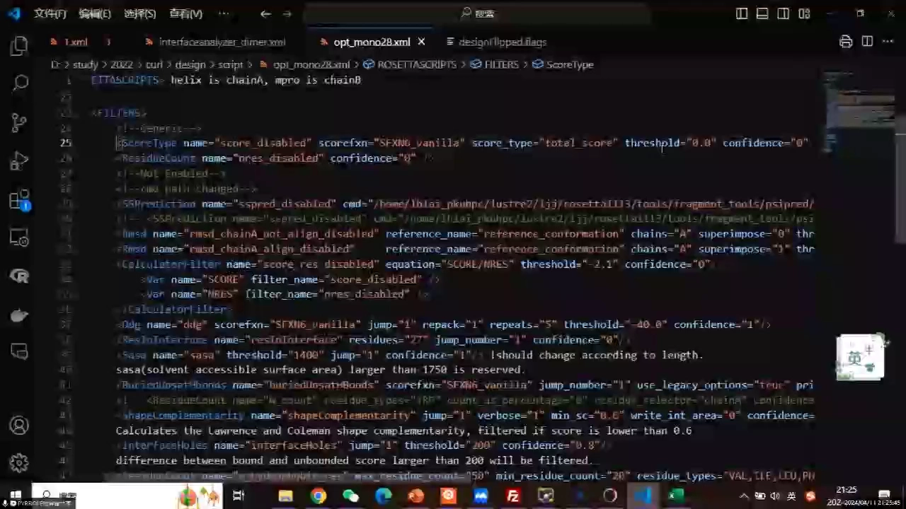
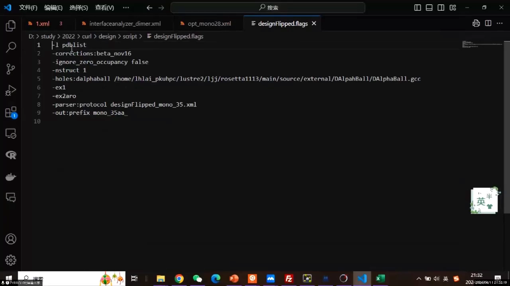
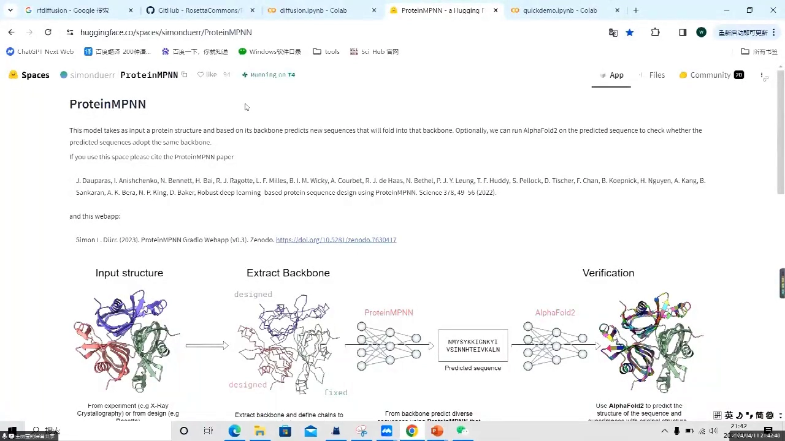
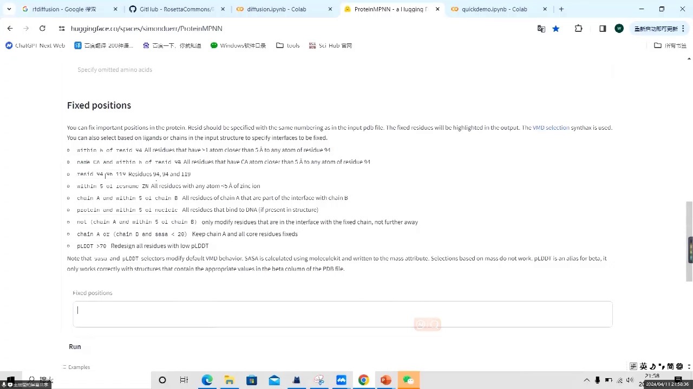
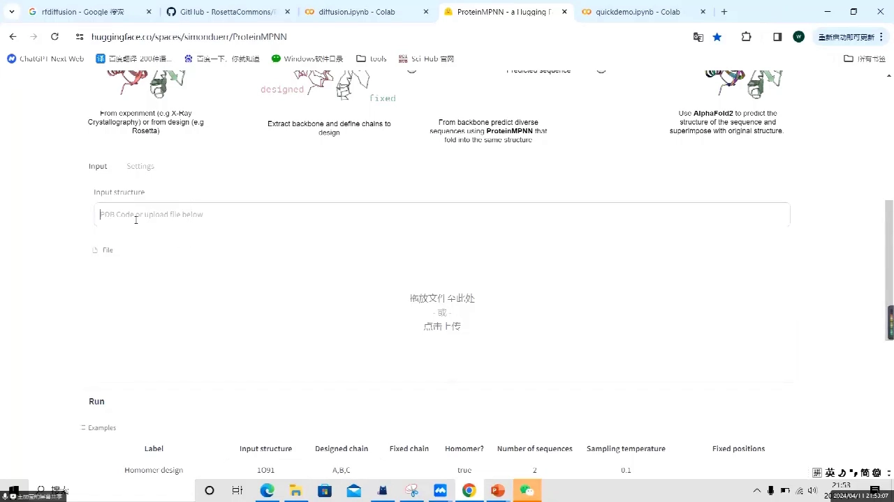
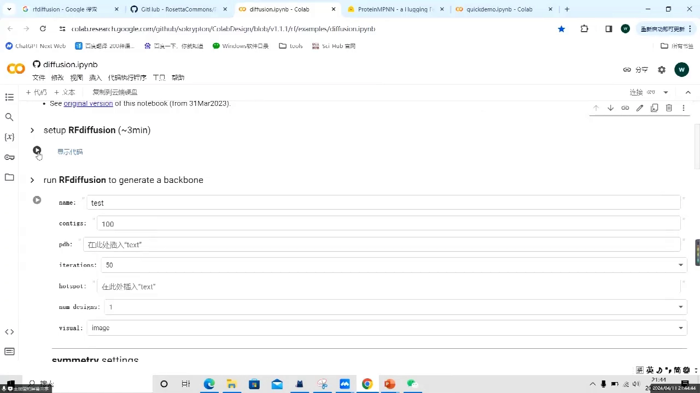
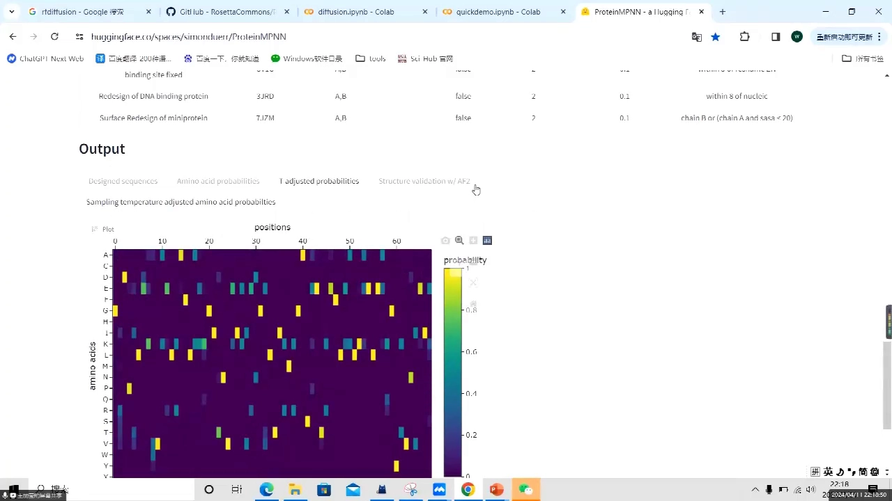

# 第2讲：实践操作——RosettaScripts 与 ProteinMPNN 网页工具

> 内容来源：B 站视频《【AI+蛋白质设计第2课】完整版》（BV1PudwBnEtq），时长约 64 分钟。本文依据视频演讲逐字稿与屏幕画面整理，力求完整、可核查。文中 `[【跳转到 MM:SS】]` 可点击回到视频对应位置。

## 本讲要解决的核心问题（SCQA）

**背景**：上一讲把理论铺完了——蛋白质结构与能量计算、Rosetta 打分函数、无先验知识的 RF 设计，以及 ProteinMPNN 的原理。但理论懂不等于会用，真正要动手时问题才刚出现。

**冲突**：这些工具都有"非科学"的门槛。Rosetta 要靠一大段 XML 脚本和命令行参数驱动，标签、空格、引号、命名规则繁琐，新手极易卡在格式报错上；ProteinMPNN 若从 GitHub 本地安装还要配环境。很多人不是不懂原理，而是被这些工程细节劝退。

**疑问**：能不能不纠结环境，先把「Rosetta 的整套设计流程」和「ProteinMPNN 的序列设计」真正跑通、看到结果？

**回答（中心思想）**：本讲给出两条实操路线——
1. **RosettaScripts**：用一份 XML 脚本把打分函数（scorefunction）、残基选择（residue selector）、任务定义（task operation）、筛选（filter）、结构操作（Mover）按顺序（PROTOCOL）编排起来，一条命令跑完整个设计流程；
2. **ProteinMPNN 网页工具**：用 Colab / Hugging Face 的在线工具，**零环境配置**跑通 `RFdiffusion（生成骨架）→ ProteinMPNN（设计序列）→ AlphaFold2（验证结构）`这一完整流水线，并读懂采样温度、pLDDT 等关键参数与指标。

## 本讲地图

| 章节 | 主题 | 时间 |
| :--- | :--- | :--- |
| 一 | RosettaScripts 实操：用 XML 脚本编排蛋白质设计 | [00:00](https://www.bilibili.com/video/BV1PudwBnEtq/?t=0) |
| 二 | ProteinMPNN 网页工具实操：从骨架到序列再到 AlphaFold2 验证 | [00:26:31](https://www.bilibili.com/video/BV1PudwBnEtq/?t=1591) |

---

## 一、RosettaScripts 实操：用 XML 脚本编排蛋白质设计

### 1.1 RosettaScripts 是什么：一份 XML 脚本，替你按顺序跑完整个设计流程

**结论：RosettaScripts 不是新软件，而是用 XML 脚本把 Rosetta 的各种功能"编排"起来。** 你把要用的打分函数、筛选条件、结构操作按先后顺序写进一个文件，Rosetta 就会一次性自动执行，不用再一条一条单独敲命令。

讲师用一个很直观的例子说明这种好处：以前要单独运行的 relax，现在只要在脚本的 movers 里加一个 relax，再在 protocol 里把它挂上，程序就会自动帮你运行[【跳转到 00:00】](https://www.bilibili.com/video/BV1PudwBnEtq/?t=0)。

先把 XML 说清楚。XML 可以理解成一种"用标签把内容包起来"的文本格式。RosettaScripts 的层级感很强：开头是 `<ROSETTASCRIPTS>`，也就是两个尖括号；结尾要在前面加一个斜杠，写成 `</ROSETTASCRIPTS>`。开头和结尾之间，才是它具体的功能模块——比如 relax 就写在 movers 里面[【跳转到 00:00】](https://www.bilibili.com/video/BV1PudwBnEtq/?t=0)。

**为什么很多人前期觉得 RosettaScripts 很难用？** 因为它的格式要求特别严格：标签要配对，参数之间的空格、引号都有讲究。讲师反复提醒"前期用着不舒服，就是因为它有太多格式上的要求"[【跳转到 10:46】](https://www.bilibili.com/video/BV1PudwBnEtq/?t=646)。先接受这一点，后面会顺很多。

它的结构与普通命令行最大的不同，在于它是**嵌套的、树状的**：最外层是 `<ROSETTASCRIPTS>`，往里按功能分成若干"大功能块"（如 scorefunctions、residue_selectors、filters、movers 等），每个大功能块下面再挂一个个"小模块"，小模块里才放 name、weights 这类参数。讲师用 scorefunction 说明过这种层次：大的功能块下面有一个叫 scorefunction 的小模块，参数就写在它内部[【跳转到 00:25】](https://www.bilibili.com/video/BV1PudwBnEtq/?t=25)。所以读脚本时，先看它属于哪个大功能块，再看里面填了什么参数，思路会清晰很多。

还有一条省心的经验：**Rosetta 不需要你知道它原本的程序叫什么名字**。你只要在官网 documentation 上找到对应功能的名字，就能把它写进脚本直接调用[【跳转到 12:01】](https://www.bilibili.com/video/BV1PudwBnEtq/?t=721)。这也是为什么官网上参数写得更全，遇到不懂的参数去官网搜索是最快的办法。

### 1.2 脚本中间的七类模块：先分清每一类各自管什么

脚本主体由几类功能块组成。讲师按顺序讲了 scorefunction、residue selector、task operation、SimpleMetrics、filter、Mover 和 PROTOCOL 这七类[【跳转到 00:00】](https://www.bilibili.com/video/BV1PudwBnEtq/?t=0)。下面逐个说清它们"是什么、为什么需要、怎么写"。

#### scorefunction：决定用哪套打分函数

scorefunction 的作用是**选择用哪一套打分函数**。打分函数决定了 Rosetta 如何评价一个结构的能量高低，相当于给设计定了"评分标准"[【跳转到 00:25】](https://www.bilibili.com/video/BV1PudwBnEtq/?t=25)。

讲师强烈推荐用较新的 **beta_nov16**，它的立场参数（力场参数）比较新；旧的叫 **ref2015**，是最早的版本，"有新的当然用新的"[【跳转到 14:56】](https://www.bilibili.com/video/BV1PudwBnEtq/?t=896)。很多人还在用旧版，讲师估计是因为官网教程的默认设置就是旧的。

看 scorefunction 时经常出现 **vanilla** 这个词，讲师特意澄清：**它是"常规/普通"的意思，不是人名**，有些 score 里面也会带这个词[【跳转到 00:25】](https://www.bilibili.com/video/BV1PudwBnEtq/?t=25)。

scorefunction 里常见参数包括 name（自己起的名，方便后面引用）和 weights（引用已有的一套能量项权重）。讲师说**参数中间一定要加空格**，官网例子里的引号、等号中间都不能有空格，否则就报错[【跳转到 10:21】](https://www.bilibili.com/video/BV1PudwBnEtq/?t=621)。它还支持对某个能量项 **reweight**，也就是单独调整权重：比如把氨基酸组成 aa_composition 的权重调到 1，或把排斥项 fa_rep 的权重调高[【跳转到 11:36】](https://www.bilibili.com/video/BV1PudwBnEtq/?t=696)。里面还有个 symmetry 选项，讲师说它是默认项，具体含义可以自己查 documentation。

#### residue selector：圈定"对哪些残基/链/界面"动手

residue selector 用来**从蛋白质里选出你要操作的那部分残基**。为什么需要它？讲师举例：如果不想改蛋白质的疏水核心序列，只想改外周，就可以先用 selector 把外周残基选出来，之后的设计操作只作用在这一部分[【跳转到 00:50】](https://www.bilibili.com/video/BV1PudwBnEtq/?t=50)。

常用的选择器有：

- **chain**：按链来选。可以写字母（chain A、chain B），也可以写数字（1、2），数字对应 PDB 文件里链出现的顺序。讲师提醒，有时 B 会排在 A 前面，所以数字是一种按先后顺序的表达方式[【跳转到 16:15】](https://www.bilibili.com/video/BV1PudwBnEtq/?t=975)。
- **neighbor / neighborhood**：按邻近关系选。讲师给的例子是"选 chain A 上距离 chain B 十 Å 以内的残基"，这个单位是 Å（0.1 纳米），选出来就把它命名为"chain B 在界面上的残基"[【跳转到 16:40】](https://www.bilibili.com/video/BV1PudwBnEtq/?t=1000)。
- **interface**：按界面来选。
- **逻辑组合**：支持 **and / or / not**。not 里面直接收一个 selector 的 name，表示"除了它以外的东西都要"；再用 and 做交集。讲师举的例子是：用 not 取到"除界面链之外的所有残基"，再用 and 与 chain B 求交集，就得到"不在界面上的 chain B"[【跳转到 17:05】](https://www.bilibili.com/video/BV1PudwBnEtq/?t=1025)。此外，用 1、2 这类数字可以表示先后顺序，这也是一种选择方式。

#### task operation：定义任务细节，限制序列设计的范围

task operation 用来**定义任务的具体细节**，比如哪些位置允许设计、哪些必须固定。讲师在 design 部分演示时会用到它，常见写法有：

- **initial**：先把初始状态存下来。
- **freeze**：把某些位置固定住，不让它被改动。
- **chain A only native**：只设计/保留某一条链。
- **design**：指定允许设计的位置，例如在 ligand 相关的链上只设计该设计的地方[【跳转到 23:10】](https://www.bilibili.com/video/BV1PudwBnEtq/?t=1390)。

简单说，它解决的是"哪里能动、哪里不能动"的问题，从而把序列设计的范围收窄[【跳转到 01:15】](https://www.bilibili.com/video/BV1PudwBnEtq/?t=75)。

#### SimpleMetrics：一般用不到

讲师说得很直接：**SimpleMetrics 一般我们不用**[【跳转到 01:40】](https://www.bilibili.com/video/BV1PudwBnEtq/?t=100)。这里保持中性理解即可，不必在入门阶段纠结它。

#### filter：最常用的"筛子"，把不合格的设计删掉

filter 是**七类里最常用的**，作用是对设计结果做筛选。逻辑很直白：比如你希望设计出的界面接触面积 SASA 必须大于 1000，就可以在 filter 里写明——若结果小于 1000，就不把它输出[【跳转到 01:40】](https://www.bilibili.com/video/BV1PudwBnEtq/?t=100)。

由于运行时会设置 nstruct（输出结构数量，比如 100），一旦加上 filter，**不合格的结构会被删掉，最后可能只剩一两个**，最惨的是一个都不剩，那就需要回去调 filter 的参数。当然，也可以选择"来者不拒"全部输出，再到 score 文件里按不同能量项自己筛[【跳转到 02:05】](https://www.bilibili.com/video/BV1PudwBnEtq/?t=125)。

讲师重点介绍了几种常用 filter：

- **SASA**：溶剂可及表面积，用来衡量界面接触面积。
- **ddG**：界面结合自由能。
- **shape complementarity（形状互补）**：衡量结构之间的适配度，讲师在讲 RFdiffusion 时提到过，ProteinMPNN 也把它当作很重要的指标[【跳转到 18:45】](https://www.bilibili.com/video/BV1PudwBnEtq/?t=1125)。
- **SS prediction（二级结构预测）**：计算二级结构的数量占比，本质上是**保证结构的稳定性**[【跳转到 18:20】](https://www.bilibili.com/video/BV1PudwBnEtq/?t=1100)。
- **interface HB（界面未成氢键的极性原子数）**：这是讲师特别看重的指标。极性原子一般形成氢键会更稳定；根据 Rosetta（David 课题组）的统计，**埋藏的、未成氢键的极性原子数越少，界面性质越好**。ProteinMPNN 也把它当成一个重要指标[【跳转到 19:10】](https://www.bilibili.com/video/BV1PudwBnEtq/?t=1150)。
- **net charge（净电荷）**：想限制静电荷时可以用它。
- **RMSD**：计算设计结构与初始结构的偏差，如果太大，说明"设计出来的结构直接飞了"[【跳转到 18:20】](https://www.bilibili.com/video/BV1PudwBnEtq/?t=1100)。

filter 通常可以设 **threshold（阈值）**，还可以设 **confidence（置信度/通过概率）**：confidence 设成 0 就"来者不拒"，设成 1 就是非常严格的限制，0.8 相当于概率上放宽一些。讲师建议大家把 confidence 都改成 0，"不管什么都要"[【跳转到 12:51】](https://www.bilibili.com/video/BV1PudwBnEtq/?t=771)。

#### Mover：对蛋白质结构动手

Mover 就是**对蛋白质结构做各种操作**，例如 relax（结构弛豫）、给分子加环化、改变拓扑结构，或者打包、序列设计等[【跳转到 02:30】](https://www.bilibili.com/video/BV1PudwBnEtq/?t=150)。讲师后面举的例子里用到了 InterfaceAnalyzerMover（分析界面性质）等 Mover。

#### PROTOCOL：声明"先做什么、后做什么"

PROTOCOL 字面翻译是"协议"，在实验里就是**方法的流程和步骤**。在脚本里，它专门声明执行顺序：先干哪个、后干哪个、最后干什么[【跳转到 02:30】](https://www.bilibili.com/video/BV1PudwBnEtq/?t=150)。

这里有个重要区分：**前面各模块内部的顺序无所谓，但 PROTOCOL 必须严格按你想要的顺序来写**。它可以引用前面 filter 的 name，也可以引用 Mover，通常用 ParsedProtocol 来组织。

**讲师给了一条很实用的建议：拿到一个陌生脚本，先把上面的 Mover、Filter 大致看完，然后直接从 PROTOCOL 开始看**，这样你会先建立起"先后顺序"的整体概念，再回头读细节就清楚多了[【跳转到 20:25】](https://www.bilibili.com/video/BV1PudwBnEtq/?t=1225)。

### 1.3 最简单的例子：一头一尾 + scorefunction + filter + mover

看完了模块，讲师先给了一个**结构最简单**的脚本练手。它的骨架是：一头一尾（`<ROSETTASCRIPTS>` 与 `</ROSETTASCRIPTS>`），中间依次是 scorefunction、filter、mover，最后是 PROTOCOL[【跳转到 08:24】](https://www.bilibili.com/video/BV1PudwBnEtq/?t=504)。

- **scorefunction 写法**：如果一条命令就能写完，直接在一行左右各加一个尖括号即可。scorefunction 是 scorefunctions 底下的一个函数，name 是自己起的名字，weights 引用已有权重[【跳转到 08:59】](https://www.bilibili.com/video/BV1PudwBnEtq/?t=539)。
- **ddG filter**：`name` 自己起（这里直接叫 ddG）。后面几个关键参数是：**jump** 选择计算哪两条链之间的界面，**relax** 表示优化侧链构象，**repeat** 表示 relax 重复几次（例子是 5 次），**threshold** 表示 ddG 要低于多少才保留[【跳转到 12:26】](https://www.bilibili.com/video/BV1PudwBnEtq/?t=746)。confidence 就是前面说过的通过概率。
- **mover**：例子用 InterfaceAnalyzerMover。它的 **name** 要跟 PROTOCOL 里引用的一致；scorefunction 引用的是上面定义的 **name，不是 weights**，讲师特别提醒别引错。**pack_separated** 表示分别进行测量，**relax** 要设成 true 或 false。此外还要定义好 leanchain（链名要和你 PDB 里的一致）[【跳转到 13:16】](https://www.bilibili.com/video/BV1PudwBnEtq/?t=796)。
- **PROTOCOL**：在这里把 filter 的 name（ddG）加进去。写法上 Add 里面的 mover name 单引号双引号都可以，**但结尾也要记得留一个空格**，否则会报错[【跳转到 14:06】](https://www.bilibili.com/video/BV1PudwBnEtq/?t=846)。

这就是最简单的 RosettaScripts 全貌：定义打分函数、定义筛选条件、定义操作动作、声明执行顺序。

讲师还顺便分享了一个读"祖传代码"的心得：脚本里有些行其实根本用不到，可以直接删；但有些行虽然看着多余，里面却藏着 reweight 之类的设置，删之前一定要看清楚它到底做了什么，否则会莫名其妙丢掉功能[【跳转到 12:01】](https://www.bilibili.com/video/BV1PudwBnEtq/?t=721)。他建议自己动手时，先把这个简单例子逐个参数改一遍、跑一遍，理解每个参数的作用，再去看复杂脚本。

一个很容易忽略的细节是**引用要"对名"**：mover 里写 `scorefunction` 时，引用的是上方定义的 **name**，而不是 weights；PROTOCOL 里引用 filter 时，引用的也是 filter 的 name。讲师把这类"名字要对上"称为最容易出错、也最重要的一环[【跳转到 13:16】](https://www.bilibili.com/video/BV1PudwBnEtq/?t=796)。

### 1.4 更复杂的例子：多了 task operation、SimpleMetrics 与 ParsedProtocol

第二个例子在框架不变的基础上，**增加了 task operation 和 ParsedProtocol**，scorefunction 则明显是从上一个复制过来的[【跳转到 15:21】](https://www.bilibili.com/video/BV1PudwBnEtq/?t=921)。

**residue selector 部分**用到了 chain、neighborhood、not、and：先按 chain 选，再按邻近选，然后用 not 取补集、用 and 取交集，组合出想要的残基集合[【跳转到 16:15】](https://www.bilibili.com/video/BV1PudwBnEtq/?t=975)。

**filter 部分更详细**，出现了一批常用指标：scoretype（给分数命名/计算分数）、SASA 阈值、SS prediction、ddG、shape complementarity、net charge，以及用于限定操作范围的 keep_only chainA——这样在算 SS prediction 时，就只统计 chain A 的二级结构占比[【跳转到 20:00】](https://www.bilibili.com/video/BV1PudwBnEtq/?t=1200)。

这里有个**量级上的经验**值得记住：如果蛋白是一条多肽、**约 30 个氨基酸**，SASA 一般在一两千的量级，讲师说 **1400 其实是一个相对比较低的 cutoff**[【跳转到 18:45】](https://www.bilibili.com/video/BV1PudwBnEtq/?t=1125)。

这里还体现了 filter 的用法细节：filter 里的 scoretype 其实只是先定义并计算一个分数，**如果你不加限制，它并不起筛选作用**；想让它真正"卡人"，就要把阈值调成负的某个值，这样限制才比较强[【跳转到 18:45】](https://www.bilibili.com/video/BV1PudwBnEtq/?t=1125)。

复杂例子里还出现了"只对某条链操作"的技巧：如果只想对 chain A 做某个操作，可以在 Mover 里加一个 keep_only chainA，这样后面用 SS prediction 筛选时，就只统计 chain A 的二级结构占比[【跳转到 20:00】](https://www.bilibili.com/video/BV1PudwBnEtq/?t=1200)。此外，还有一步是保存 PDB 的结构信息（info），讲师说这在计算 RMSD 时需要用到，但实际操作中"可有可无"[【跳转到 20:25】](https://www.bilibili.com/video/BV1PudwBnEtq/?t=1225)。

复杂例子的整体流程也体现了设计思路：**先 design，再 relax，然后经过结构筛选，最后评估界面**，讲师认为这很合理[【跳转到 21:30】](https://www.bilibili.com/video/BV1PudwBnEtq/?t=1290)。另外，讲师操作时用的是 VS Code 编辑 XML，并提到之前给大家发过"如何用 VS Code 编辑 RosettaScripts"的文章，里面有可参考的链接[【跳转到 21:35】](https://www.bilibili.com/video/BV1PudwBnEtq/?t=1255)。

讲师也坦白说明：因为当天官网临时打不开，他没法逐条对照官网讲，所以做的 PPT 没有官网详细，但他会**把关键地址和需要重点关注的地方都告诉大家**[【跳转到 17:05】](https://www.bilibili.com/video/BV1PudwBnEtq/?t=1025)。对初学者来说，不要指望一份脚本示例覆盖所有参数，学会顺着官网 documentation 查才是长久之计。

### 1.5 design（序列设计）：控制"哪些位置允许变"

时间关系，design 部分是讲师重点收尾讲的内容。它的协议流程大致是：先导入 initial 的 PDB 信息，再做 fast design，最后用 clear composition constraints 清掉之前加的限制，让下一轮设计重新回到随机的过程[【跳转到 21:55】](https://www.bilibili.com/video/BV1PudwBnEtq/?t=1315)。

**为什么要限制色氨酸数量？** 讲师给了一个非常实用的理由：如果不加限制，程序**一般会设计出非常非常多的色氨酸**，甚至三四个连着。因为色氨酸疏水性、能量都很好，如果一味以能量最小化为目标，它就会堆出很多色氨酸；但实验上色氨酸会导致多聚，"什么实验也做不了"[【跳转到 21:55】](https://www.bilibili.com/video/BV1PudwBnEtq/?t=1315)。

在 design 里，task operation 负责规定哪些位置可动：例如 chain A 的骨架和二面角都要动；对 receptor 来说二面角不能动；对 chain B 先 relax 它的 receptor interface，其余部分在设计过程中"其他都不要动"，以加快计算。最后用 chain A only native / freeze 等控制，只设计指定的那条链[【跳转到 23:10】](https://www.bilibili.com/video/BV1PudwBnEtq/?t=1390)。协议里还会用 repeat 让每一步重复设计三次。

讲师把这段 design 协议拆开讲了一遍：先给整个流程起一个名字，设置好 scorefunction，然后写 MoverFactory。**MoverFactory 的作用，就是告诉程序"哪些要动、哪些不动"**——比如 chain A 要动骨架和二面角，而 receptor 的二面角不能动[【跳转到 22:45】](https://www.bilibili.com/video/BV1PudwBnEtq/?t=1365)。这也解释了为什么它和 task operation 要配合使用：一个负责"结构上动哪里"，一个负责"序列上允许改哪里"。

至于限制色氨酸，并不是要完全禁止，而是把它控制在一个合理范围——不做任何限制时，程序会为了能量好看而堆叠色氨酸，结果实验做不了；加了限制后，设计才更贴近可表达、可实验的需求[【跳转到 21:55】](https://www.bilibili.com/video/BV1PudwBnEtq/?t=1315)。

**命令行与 flags 文件**：实际运行时一般搭配 flags 文件，把输入简化。要点包括[【跳转到 23:35】](https://www.bilibili.com/video/BV1PudwBnEtq/?t=1415)：

- 用 **-l** 搭配一个 **pdb list（列表文件）** 做批量输入，list 里放很多文件路径。
- 用 **-parser:protocol** 指定要用哪个脚本（也就是 `@xxx.flex` 里指定的那个 XML）。
- 用打分函数时，必须在 flex 文件里声明 corrections；ignore_zero_occupancy 要设成 false，这两项打包在一起。
- nstruct 可以设 100、1000、10000。
- 还会设置计算 SASA 时探测用的小球的体积/半径，以及范德华半径等；讲师说这些可以先用默认值，也可以自己改[【跳转到 24:00】](https://www.bilibili.com/video/BV1PudwBnEtq/?t=1440)。

配置好后，运行命令形如 `rosetta_scripts.linuxgccrelease @xxx.flex`，按回车即可跑起来，不必再把一堆 input 设置逐项敲一遍[【跳转到 24:33】](https://www.bilibili.com/video/BV1PudwBnEtq/?t=1473)。

### 1.6 踩坑清单：新手最容易卡住的几件事

讲师现场演示时踩了好几个坑，这些都很值得提前记下：

- **Windows 编辑后传到 Linux 可能报错**：如果看到类似 `^M` 的符号，说明文件不是 Unix 格式，可以用 `dos2unix` 转换[【跳转到 07:05】](https://www.bilibili.com/video/BV1PudwBnEtq/?t=425)。
- **名字里不要含无法识别的字符**：讲师遇到报错后，把名字改成只含英文字母就好了；有时报错并不是你输错了，而是程序不识别某些语法[【跳转到 05:15】](https://www.bilibili.com/video/BV1PudwBnEtq/?t=315)。
- **注释位置有限制**：RosettaScripts 里可以任意加注释，**但注释要放在尖括号标签之外，标签内部不行**[【跳转到 06:30】](https://www.bilibili.com/video/BV1PudwBnEtq/?t=390)。
- **空格是高频错误来源**：参数之间要空格、等号之间不能有空格、PROTOCOL 结尾也要留空格，务必逐处检查[【跳转到 10:21】](https://www.bilibili.com/video/BV1PudwBnEtq/?t=621)。
- **输入 PDB 用 -s，脚本用 parser 解析**[【跳转到 04:37】](https://www.bilibili.com/video/BV1PudwBnEtq/?t=277)。

讲师也坦言，现场有些报错"不知道怎么就突然好了"，有时候是网络或软件自身的波动，未必是你写错了。所以遇到报错先别慌，按上面几条逐个排查格式问题，再考虑是不是环境原因。

还有一个和工具相关的提醒：讲师现场用 VS Code 编辑 XML，并提到群里发过一篇讲"怎么用 VS Code 编辑 RosettaScripts"的文章，里面有很多可参考的链接[【跳转到 21:35】](https://www.bilibili.com/video/BV1PudwBnEtq/?t=1255)。选一个顺手的编辑器，并把换行符、编码这些"隐形坑"处理好，能省下大量排查时间。

**把常见错误按来源分成三类**，排查时会更有方向：第一类是**格式**问题（空格、引号、标签是否闭合、注释位置）；第二类是**命名**问题（名字里有不识别字符、引用名对不上）；第三类是**环境**问题（换行符、网络、软件本身）。讲师遇到的坑基本都能归到这三类里。

### 1.7 作业与练习：自己按进度动手，问题在群里问

因为课程进度和学员水平不一，讲师表示不会在课上一步一步带着做，而是**布置作业让大家按自己的进度实践**。他给的建议很实在：结合课上讲的信息，再加上自己去官网查阅，完全可以做出来[【跳转到 25:16】](https://www.bilibili.com/video/BV1PudwBnEtq/?t=1516)。

讲师还强调了一种能力：以后不会总有老师随时回答你的问题，科研中也不会总有"每题都会"的人，所以**要学会自己搜索**。当然，遇到问题可以随时在群里问他，讲师也会把今天讲到的脚本发给大家。

---

## 二、ProteinMPNN 网页工具实操：从骨架到序列再到 AlphaFold2 验证

### 2.1 ProteinMPNN 的定位：只设计序列，不生成骨架

一句话概括：ProteinMPNN 是一个"根据已有骨架去设计序列"的算法，它解决的是"结构已知、序列待定"的问题，本身不负责生成结构骨架。

昨天理论课已经讲过它的原理，今天这节课专门讲使用指南（[【跳转到 27:18】](https://www.bilibili.com/video/BV1PudwBnEtq/?t=1638)）。讲师特别说明，这部分主要用网页资源来演示，对初学者非常友好——**完全不需要安装任何环境**，打开网站就能运行。原因也很直接：AI for Science 现在发展得很火，这类工具的生态已经相当完备，基于 Colab 和 Hugging Face 的网页版工具随手可得（[【跳转到 27:48】](https://www.bilibili.com/video/BV1PudwBnEtq/?t=1668)）。

三点要记住：

1. **只设计序列**：输入一个骨架，它输出这个骨架可能对应的氨基酸序列。它不生成骨架，骨架要由你提供或由别的工具生成。
2. **网页版零配置**：Colab、Hugging Face 都是网页工具，不用配环境，直接在网站上跑。
3. **量大才考虑本地**：如果你有大批量运行等更高需求，也可以从 GitHub 把执行文件装到本地或服务器上，但那要先配置环境，而且配置步骤比较多，本节课不涉及（[【跳转到 27:48】](https://www.bilibili.com/video/BV1PudwBnEtq/?t=1668)）。

需要强调的是，"网页版"不等于功能缩水。相反，现在主流的网页工具已经把设计流程串了起来：有的把 RFdiffusion、ProteinMPNN、AlphaFold2 三个工具集成在同一个 Colab 里，有的在 Hugging Face 页面上同时提供结构输入、序列设计、参数定制和结构预测。对初学者来说，先用网页工具把整套流程跑通、建立直觉，是性价比最高的入门方式。

### 2.2 基本流程：先有骨架 → 设计大量序列 → AlphaFold2 预测筛选

结论：ProteinMPNN 不是一个孤立的工具，它是"设计—预测—筛选"这条流水线中间的一环（[【跳转到 28:19】](https://www.bilibili.com/video/BV1PudwBnEtq/?t=1699)）。

完整逻辑是这样的：

1. **先拿到一个骨架**。来源有两种：一种是你自己已经有的、想要的靶标骨架，基于它重新设计序列；另一种是用别的工具生成，比如用 RFdiffusion 基于靶标的结合位点生成一段 binder 骨架。
2. **用 ProteinMPNN 设计大量序列**。同一个骨架可以指定生成很多条序列，几十条、上百条都行。
3. **把设计出的序列交给 AlphaFold2 预测**。看 AlphaFold2 预测出来的这些结构质量如何，挑质量好的（[【跳转到 28:44】](https://www.bilibili.com/video/BV1PudwBnEtq/?t=1724)）。
4. **进入实验或继续筛选**。选中的序列再拿去做下一步实验，或用 Rosetta 之类的工具进一步算指标。

这里可以换一种理解：整条流程就是"先造结构、再补序列、再验结构"。讲师用多肽 binder 举例说明最后一环为什么必要——你用 RFdiffusion 针对靶标生成一个多肽 binder 时，得到的只有骨架、没有序列，文件里的序列全是 A；这时必须用 ProteinMPNN 给出序列，再把序列交回 AlphaFold2 验证它长出来的结构质量，最后才谈得上做实验。所谓筛选，就是在这条链上反复比较。除了 AlphaFold2 之外，也可以用 Rosetta 去算一些相互作用参数，作为辅助判据（[【跳转到 45:52】](https://www.bilibili.com/video/BV1PudwBnEtq/?t=2752)）。

讲师强调，这个"生成很多、再挑好的"思路是现在比较流行的判断标准；后面讲 AlphaFold 的老师还会展开怎么选。

### 2.3 关键参数详解：一个骨架怎么设计出想要的序列

结论：ProteinMPNN 的可调参数不多，但每一个都直接决定你拿到什么样的序列，值得逐个弄清。

#### number：这个骨架要设计几条序列

最直观的参数（[【跳转到 29:09】](https://www.bilibili.com/video/BV1PudwBnEtq/?t=1749)）。你希望一个骨架生成多少条序列就填多少，一条、八条、十条都可以，区别只在于消耗的时间。设计得越多，你后面可以挑选的候选就越多。

#### sampling temperature：控制"多样性"的总开关

这是最需要理解的一个参数，默认值是 0.1，讲师推荐尝试 0.1、0.15、0.2、0.25、0.3 这几档（[【跳转到 29:34】](https://www.bilibili.com/video/BV1PudwBnEtq/?t=1774)）。先解释它是什么：

MPNN 最原始的输出版本，是给出骨架**每一个位置**对应**每一种氨基酸**的概率。采样温度（sampling temperature，字面是"采样温度"，可以理解为"抽签时的随机程度"）就决定你从这个概率分布里怎么取氨基酸：

- **T = 0** 时，每个位置只取概率最大的那个氨基酸。例如某位置色氨酸概率是 0.9，T=0 就必然选色氨酸。结果是确定性最高，但多样性低，而且可能和你已有的序列很像（[【跳转到 30:11】](https://www.bilibili.com/video/BV1PudwBnEtq/?t=1811)）。
- **T 变大**，概率较小的氨基酸也有机会被选中。甚至当 T 远大于 1 时，选择会非常随机，哪怕某个氨基酸概率只有百分之几、零点几，也可能被抽中。
- **代价**：T 太大时，生成的序列可能不那么可靠，模型的预测能力没有保证。所以要在"多样性"和"可靠性"之间找一个平衡点，多试几档温度，看哪个生成的序列符合你的需求。

举个直观例子：同一个位置，模型可能给出"色氨酸 0.9、丙氨酸 0.1"这样的分布。T=0 时铁定选色氨酸；温度升高后，那 0.1 的丙氨酸也进入了候选池，序列于是出现新的可能。这也是为什么想要多样性的序列时，第一件事往往是调采样温度。

#### model：换一套神经网络参数

不同 model 对应不同的神经网络权重参数，例如素材里提到的 `v_48_020`、`v_48_002`，还有很多其他型号（[【跳转到 30:49】](https://www.bilibili.com/video/BV1PudwBnEtq/?t=1849)）。调用不同的 model，给出的设计序列也会不一样。一般工具会有一个默认 model，通常不改也行；如果觉得默认模型给出的序列不满意，可以换一个试试。

#### omit / remove amino acids：不想出现的氨基酸

这个参数（全称 remove amino acid）让你指定蛋白质序列里**不希望出现哪些氨基酸**（[【跳转到 37:31】](https://www.bilibili.com/video/BV1PudwBnEtq/?t=2251)）。最典型的例子是半胱氨酸（Cysteine，Cys）：有半胱氨酸时，它可能在蛋白折叠中引起问题，比如形成二硫键，导致后面做实验、纯化蛋白时折叠不正确。所以常见做法是限制设计出的序列里一个半胱氨酸都不要有。填法很简单，把氨基酸的**单字母缩写**写进去即可；有其他需求也照此处理（[【跳转到 37:56】](https://www.bilibili.com/video/BV1PudwBnEtq/?t=2276)）。

#### fixed / designable positions：固定某些位置、只设计其余位置

这是 Hugging Face 版工具比较灵活的地方（[【跳转到 43:09】](https://www.bilibili.com/video/BV1PudwBnEtq/?t=2589)）。如果你有一部分位置因为对相互作用非常重要而不希望改动，就可以在 fixed position（固定位置）选项里定义。

它支持多种语法（Hugging Face 页面上给了大量示例）：

- 按**残基编号**固定，例如只固定编号为 94、96、9619 等位置的氨基酸（素材原话示例 `res 94949619`，[【跳转到 44:37】](https://www.bilibili.com/video/BV1PudwBnEtq/?t=2677)）。
- 按**空间距离**固定，例如固定第 94 个残基附近 5 Å 以内的氨基酸（`Å` 读作"埃"，是衡量原子间距离的长度单位，[【跳转到 44:07】](https://www.bilibili.com/video/BV1PudwBnEtq/?t=2647)）。
- 按**原子类型**固定，例如第 94 个氨基酸 5 Å 以内的主链碳 α（Cα）原子都不动。

网页会在输入框前给出对应说明，告诉你语法怎么写，按实际情况套用即可。

#### backbone noise 与 initial guess / recycle

- **backbone noise（骨架噪声）**：对蛋白骨架做一点微扰，从而提高采样多样性，让生成的骨架更多样（[【跳转到 31:14】](https://www.bilibili.com/video/BV1PudwBnEtq/?t=1874)）。
- **initial guess**：这是 AlphaFold 相关的选项（[【跳转到 36:16】](https://www.bilibili.com/video/BV1PudwBnEtq/?t=2176)）。意思是先基于已有的蛋白质结构数据库和序列知识，粗略构建一个初始结构，再迭代优化，最终预测出结构。对于做 binder 设计，页面明确推荐勾选它（"for better design"）。
- **recycle**：迭代、预测优化的次数，页面推荐选 3（[【跳转到 36:41】](https://www.bilibili.com/video/BV1PudwBnEtq/?t=2201)）。
- **use multimer**：是否用 AlphaFold Multimer。它是 AlphaFold2 面向复合物结构训练的扩展模型，而普通 AlphaFold2 是基于单体蛋白训练的；Multimer 可能预测得更准，但资源消耗更大，一般可以不选（[【跳转到 37:06】](https://www.bilibili.com/video/BV1PudwBnEtq/?t=2226)）。

### 2.4 RFdiffusion 流程简介：它生成骨架，序列还得靠 MPNN 补

结论：RFdiffusion 和 ProteinMPNN 是一对搭档——前者只出骨架，后者才补序列。更详细的原理由后面的老师讲，这里先建立整体印象（[【跳转到 31:53】](https://www.bilibili.com/video/BV1PudwBnEtq/?t=1913)）。

RFdiffusion 现在的流程已经相当完善，GitHub 上有详细说明和链接（[【跳转到 32:10】](https://www.bilibili.com/video/BV1PudwBnEtq/?t=1930)）。核心参数概念：

- **contig**：定义你要设计的蛋白长度。素材里举的例子是想设计一个 100 个氨基酸的小蛋白（[【跳转到 33:56】](https://www.bilibili.com/video/BV1PudwBnEtq/?t=2036)）。
- **PDB**：提供你的靶标蛋白的 PDB 结构文件。
- **迭代次数**：生成时迭代设计多少次。
- **hotspot**：热点残基。如果你已经知道靶标上哪些氨基酸对结合起关键作用，就把它们定义为 hotspot。如果实验上还不知道，也可以用 Rosetta 的**丙氨酸扫描突变**（alanine scanning，把界面上的残基逐个替换成丙氨酸，观察影响，从而找出关键残基）等工具来发现（[【跳转到 34:46】](https://www.bilibili.com/video/BV1PudwBnEtq/?t=2086)）。
- **指定要设计的链**：你希望设计哪一条链、固定哪一条链，都可以设置。

最关键的一点：**RFdiffusion 生成的 binder 骨架是完全没有序列的**，文件里的序列全是 A（占位），正因如此才需要用 ProteinMPNN 给它设计序列（[【跳转到 47:57】](https://www.bilibili.com/video/BV1PudwBnEtq/?t=2877)）。讲师特别说明，不管骨架是几十个氨基酸，还是 100 个以上，ProteinMPNN 都能设计。

顺带解释一下 contig 和 hotspot 这两个词。**contig** 原本是"连续片段"的意思，在这里用来告诉 RFdiffusion：生成的蛋白从第几个残基到第几个残基、一共多长。**hotspot** 直译是"热点"，指的是你希望结合作用发生的那几个关键残基，把它们框出来后，生成出来的 binder 会更倾向于去接触这些位置。所以这两个参数一个管"造多长"，一个管"往哪儿贴"。如果手上没有 hotspot 信息，也可以先跳过，后续再用丙氨酸扫描等实验或计算手段补上。

### 2.5 Colab 工具：稳定但较慢，参数少

结论：Colab 版胜在稳定、集成度高，适合按流程从头做一整套，但灵活度有限、速度较慢。

使用要点（[【跳转到 32:41】](https://www.bilibili.com/video/BV1PudwBnEtq/?t=1961)）：

1. **需要 Google 账号**，有时要先注册才能执行。
2. **操作方式**：点每个单元格左上角的三角形符号即可运行该单元格；填好参数后也可以点菜单"代码执行程序 → 全部运行"，遇到警告点继续即可，然后等它转圈、出结果（[【跳转到 33:31】](https://www.bilibili.com/video/BV1PudwBnEtq/?t=2011)、[【跳转到 52:09】](https://www.bilibili.com/video/BV1PudwBnEtq/?t=3129)）。
3. **只用云资源**：完全不依赖你本地电脑的环境，所以很方便。
4. **局限**：输入只能是已有的 **PDB code**，你自己建模、生成的 PDB 结构用不了；可选参数比较少；速度较慢。
5. **本站推荐的一个 Colab 集成了 RFdiffusion、ProteinMPNN、AlphaFold 三件套**（[【跳转到 48:58】](https://www.bilibili.com/video/BV1PudwBnEtq/?t=2938)），很适合做新课题：从头生成全新结构、给它设计序列、再预测挑选，一站完成。另有一个 Colab 只做 MPNN，限制更多（[【跳转到 50:44】](https://www.bilibili.com/video/BV1PudwBnEtq/?t=3044)）。

还要理解 Colab 与 Hugging Face 的一个能力差异：Colab 里的 MPNN 模块相对简单，如果你有更多、更细的序列设计要求（比如固定某些残基、做表面重设计），在这个模块里往往实现不了，这正是讲师另外推荐 Hugging Face 的原因（[【跳转到 39:24】](https://www.bilibili.com/video/BV1PudwBnEtq/?t=2364)）。

### 2.6 Hugging Face 工具：更快更灵活，但网站有时不稳定

结论：如果你想要更高灵活性、更多设置项、更快速度，推荐 Hugging Face 版；唯一的不便是它偶尔打不开（[【跳转到 39:24】](https://www.bilibili.com/video/BV1PudwBnEtq/?t=2364)）。

它的优势：

- **输入更灵活**：既可以输入已有的 PDB code，也可以**上传自己的蛋白结构**（当你的结构没有被数据库收录，来自生成或建模时就用得上）（[【跳转到 40:14】](https://www.bilibili.com/video/BV1PudwBnEtq/?t=2414)）。
- **多链处理灵活**：对多链蛋白（如 A、B、C 三条链），可以全都重新设计，也可以只设计其中一条、固定其余链。素材例子：只设计 A 链而固定 B、C 链，或设计 A、B 链而固定 C 链（[【跳转到 40:39】](https://www.bilibili.com/video/BV1PudwBnEtq/?t=2439)）。
- **支持 resurface**：表面重设计。例如把 A、B 链填进 design chain，把 C 链填进需要固定的 chain 选项（[【跳转到 41:54】](https://www.bilibili.com/video/BV1PudwBnEtq/?t=2514)）。
- **可定义固定位置/可设计位置**：语法丰富，页面给了大量示例（见 2.3 节）。
- **速度更快**：设计师实测 Hugging Face 通常不到一分钟就能出结果，而 Colab 相对慢一些（[【跳转到 52:34】](https://www.bilibili.com/video/BV1PudwBnEtq/?t=3154)）。

一个实操细节：点页面里的示例，会同步好 PDB code 和 settings；改好参数点 **run** 即可。比如用同源多聚的示例 `6MRR`，把 homo（同源多聚）选上，设计两条序列，采样温度保持 0.1（[【跳转到 59:03】](https://www.bilibili.com/video/BV1PudwBnEtq/?t=3543)）。

这里还有几个小概念值得解释。**PDB code** 是蛋白质结构数据库里每个结构的四字符编号，输入它等于告诉工具"去数据库取这个结构"；**homo** 指同源多聚，也就是这个蛋白由多条相同的链组成，勾选它是为了按多聚体的规则来设计；**design chain（设计链）**和 **fixed chain（固定链）**则是分别告诉工具"哪些链重设计、哪些链原样保留"。把这几个字段填对，工具才知道你的设计意图。

需要提醒的是，这个网站稳定性一般，讲师现场多次打不开，遇到打不开不必着急，多是网络问题，刷新或换个时间、换个网络再试（[【跳转到 58:07】](https://www.bilibili.com/video/BV1PudwBnEtq/?t=3487)）。

### 2.7 结果解读：先看序列，再看概率图

结论：ProteinMPNN 的输出有两类——设计好的序列，以及解释"它为什么这么选"的概率图。

**序列部分**（[【跳转到 52:49】](https://www.bilibili.com/video/BV1PudwBnEtq/?t=3169)）：输出会先列出**原始序列**（骨架原本的序列，素材例子如 `WWO91`），接着列出本次使用的参数，然后给出**设计出的新序列**。你让它设计几条，下面就列几条；素材现场只设计一条时就只给一条，后面 `6MRR` 的例子设计了两条就列两条（[【跳转到 60:18】](https://www.bilibili.com/video/BV1PudwBnEtq/?t=3618)）。

**概率图部分**（[【跳转到 53:19】](https://www.bilibili.com/video/BV1PudwBnEtq/?t=3199)）：

- 这是一张热力图：**纵轴**是氨基酸类型（从 A 到 X，20 多种），**横轴**是骨架上的位置。
- 图上某一点的颜色，表示"这个位置是该氨基酸的概率"。鼠标移到格子上会显示具体信息，比如"第几个位置、氨基酸、概率 0.01"。
- 最右边的 **colorbar（颜色条）**用来对照数值：**越黄表示概率越大**（[【跳转到 53:49】](https://www.bilibili.com/video/BV1PudwBnEtq/?t=3229)）。

- 如果采样温度大于 0，还会额外输出一张 **adjusted probability（调整后的概率）图**。因为温度改变了整体的氨基酸概率分布，调大温度后选中其他氨基酸的概率会变高，所以这张图会和原始概率图不同——如果温度完全等于 0，两张图应当是一样的（[【跳转到 54:06】](https://www.bilibili.com/video/BV1PudwBnEtq/?t=3246)）。

换句话说，两张概率图是在帮你诊断"温度到底做了什么"：原始图是模型的本来判断，调整图是温度作用之后的分布。当你发现设计结果不够多样时，对照这两张图就能看出，是不是温度把某些低概率氨基酸"抬"了上来。素材里的两条设计序列因为温度只有 0.1，彼此比较相近，讲师也提醒可以把温度调大一些，让序列的多样性更高（[【跳转到 60:18】](https://www.bilibili.com/video/BV1PudwBnEtq/?t=3618)）。

### 2.8 AlphaFold2 集成：直接预测设计序列，看 pLDDT 和 PAE

结论：Hugging Face 版把 AlphaFold2 也集成了进来，生成序列后可以一键预测结构并给出质量指标（[【跳转到 60:48】](https://www.bilibili.com/video/BV1PudwBnEtq/?t=3648)）。

操作：点 **run AlphaFold on all sequences**，它就会对你生成的所有序列做 AlphaFold 预测，然后展示结构和指标（[【跳转到 61:18】](https://www.bilibili.com/video/BV1PudwBnEtq/?t=3678)）。

指标怎么读：

- **pLDDT（预测局部距离差异测试，一个结构置信度指标）**：**越高越好**。它衡量的是 AlphaFold 对自己预测的结构有多自信；越高说明预测越可靠，现实中纯化出来真是这个结构的可能性越高（[【跳转到 62:07】](https://www.bilibili.com/video/BV1PudwBnEtq/?t=3727)）。
- **PAE**：也是预测结构的一个指标，**分数越高说明结构越可靠**（[【跳转到 62:24】](https://www.bilibili.com/video/BV1PudwBnEtq/?t=3744)）。
- **pTM 等**：素材还提到会输出预测结构以及置信度类指标。
- **颜色展示置信度**：蓝色表示结构非常可靠（大概率真实结构就是这样），越偏橙色表示 pLDDT 越低、越不可靠（[【跳转到 62:39】](https://www.bilibili.com/video/BV1PudwBnEtq/?t=3759)、[【跳转到 62:49】](https://www.bilibili.com/video/BV1PudwBnEtq/?t=3769)）。

讲师提到，GitHub 上的 binder design 模块对"做多肽 / 蛋白 binder 设计"给过挑选建议：预测完之后还要结合你的靶标一起综合看指标。更具体的筛选标准，后面专讲 AlphaFold 的老师会展开；现阶段先记住一句话——pLDDT 和 PAE 都是越高越可信（[【跳转到 61:43】](https://www.bilibili.com/video/BV1PudwBnEtq/?t=3703)）。

值得一提的是，讲师回答同学提问时也补充过：经过 ProteinMPNN 设计出来的序列，一般可溶性会更好一些（[【跳转到 55:06】](https://www.bilibili.com/video/BV1PudwBnEtq/?t=3306)）。这一点可以作为你评估设计序列时的参考。

### 2.9 工具选择建议：看需求、看网络

结论：没有唯一最优解，按"速度 vs 稳定"和你的网络情况来选。

- **Hugging Face**：快、参数灵活、功能全、还集成 AlphaFold2，**讲师最推荐**；缺点是偶尔连不上。
- **Colab**：网站更稳定，但速度慢、参数少，且输入受限于已有 PDB code；其中一个 Colab 集成 RFdiffusion→ProteinMPNN→AlphaFold2 全流程，适合从头做整套。
- **共同点**：两者都跑在云上，不依赖本地环境；选哪个主要看当时的网络情况。

如果只记一句结论：**能连上 Hugging Face 就用 Hugging Face，连不上就退回 Colab**。讲师的判断依据很实际——Hugging Face 速度快、参数灵活、还自带 AlphaFold2，体验最好；Colab 的强项是稳、且有一个能跑完整流程的集成版，适合网络环境不理想、或者想按部就班从头做一整套的时候。两者并不是互相替代，而是互为备份。

最后一句讲师的提醒值得记牢：**同一个骨架能设计出很多性质不同的序列**，有的偏亲水、有的偏疏水，性质可能变也可能不变；最终你要自己筛选，不是生成出来的就全都要。素材提到，近期有研究工作会先用 RFdiffusion 生成大量不同骨架，每个骨架再生成约 2–5 条序列，最后再从中挑选去做实验——筛选这一步始终是你自己的工作（[【跳转到 47:07】](https://www.bilibili.com/video/BV1PudwBnEtq/?t=2827)）。

---

## 小结

- **总纲**：本讲把上一讲的理论"落地"成两条可执行路线——**RosettaScripts 编排经典设计流程**，以及**ProteinMPNN 网页工具跑通"骨架→序列→验证"流水线**。
- **RosettaScripts 是什么**：用 XML 把 Rosetta 的功能按顺序编排进一份脚本，`<ROSETTASCRIPTS>...</ROSETTASCRIPTS>` 一头一尾，中间是各类功能块，一条命令自动跑完。
- **七类模块**：scorefunction（选打分函数，推荐 `beta_nov16`）、residue selector（圈定操作的残基/链/界面，支持 and/or/not）、task operation（规定哪里能动、哪里固定）、SimpleMetrics（基本不用）、filter（最常用的筛子：SASA、ddG、shape complementarity、interface HB 等）、Mover（对结构动手：relax、pack、design）、PROTOCOL（声明先后顺序，**拿到脚本先看它**）。
- **两个例子**：简单例子=一头一尾+scorefunction+filter+mover；复杂例子多了 task operation 与 ParsedProtocol，filter 更细，SASA 对约 30 肽常在 1400 上下。
- **命令行与踩坑**：用 `-l` + pdb list 批量输入、`-parser:protocol` 指定脚本；运行 `rosetta_scripts.linuxgccrelease @xxx.flex`。坑集中在格式（空格/引号/标签/注释位置）、命名（不识别字符、引用名对不上）、环境（Windows 换行符 `^M` 用 `dos2unix`、网络波动）三类。
- **ProteinMPNN 定位**：只根据**已有骨架设计序列**，不生成骨架；网页版零环境，量大才考虑本地安装。
- **流水线**：RFdiffusion 生成骨架（无序列）→ ProteinMPNN 设计大量序列 → AlphaFold2 预测筛选 → 实验，反复迭代。
- **关键参数**：number（生成条数）、sampling temperature（默认 0.1，越大越多样但越不可靠）、model（v_48_020 等）、omit amino acids（如去掉半胱氨酸）、fixed / designable positions（固定关键位置）、backbone noise。
- **网页工具**：Colab 稳定、慢、参数少、集成 RFdiffusion+ProteinMPNN+AlphaFold2；Hugging Face 快、灵活、可上传结构、可多链/表面重设计、还集成 AlphaFold2，但偶尔连不上。**能连上优先 Hugging Face，连不上退回 Colab。**
- **结果解读**：序列输出 + 氨基酸概率热力图（colorbar 越黄概率越大）+ 温度调整后的概率图；AlphaFold2 给出 pLDDT、PAE（都越高越可靠）并按置信度着色。

## 关键术语速查

| 术语 | 一句话解释 |
| :--- | :--- |
| RosettaScripts | 用 XML 脚本编排 Rosetta 各类功能的脚本系统 |
| XML | 用成对标签包裹内容的文本格式；RosettaScripts 脚本即 XML |
| scorefunction | 选择用哪套打分函数评价结构能量，推荐较新的 `beta_nov16`（旧版 `ref2015`） |
| residue selector | 圈定要操作的残基/链/界面，支持 chain、neighborhood、interface 及 and/or/not |
| task operation | 任务定义，规定哪些位置可设计、哪些必须固定（freeze、design 等） |
| filter | 对设计结果做筛选（SASA、ddG、shape complementarity、interface HB 等）；可设 threshold 与 confidence |
| SASA | 溶剂可及表面积，常用来衡量界面接触面积 |
| ddG | 界面结合自由能变化，越小（越负）结合越好 |
| shape complementarity | 形状互补度，衡量两个界面的几何适配 |
| Mover | 对蛋白质结构执行操作，如 relax、pack、design、环化 |
| PROTOCOL | 声明脚本的执行顺序，是读脚本的第一入口；常用 ParsedProtocol 组织 |
| nstruct | 输出的结构数量 |
| flags 文件 / `@xxx.flags` | 把命令行参数写进文件，运行时用 `@` 引用，简化输入 |
| dos2unix | 把 Windows 换行符转成 Unix 格式，解决 `^M` 报错 |
| ProteinMPNN | 根据已有骨架设计序列的深度网络，只设计序列、不生成骨架 |
| sampling temperature | 采样温度：T=0 取概率最大的氨基酸、多样低；T 越大越随机、多样性越高 |
| omit amino acids | 指定不希望出现的氨基酸（常用单字母缩写，如去掉 Cys） |
| fixed / designable positions | 固定位置与可设计位置，决定哪些残基不变、哪些重设计 |
| contig | RFdiffusion 参数，定义要生成的蛋白长度/片段范围 |
| hotspot | 希望 binder 结合的关键残基 |
| RFdiffusion | 用扩散模型生成蛋白骨架的工具；生成的 binder 骨架没有序列 |
| Colab / Hugging Face | 两个零环境的网页工具平台，可在线运行 ProteinMPNN 等 |
| AlphaFold2 | 从序列预测结构；在本流程中用于验证设计序列能否折回目标骨架 |
| pLDDT | AlphaFold 的结构置信度指标，越高越可靠 |
| PAE | 预测对齐误差指标，越高表示结构越可靠 |
| homomer | 同源多聚体，由多条相同链组成 |
| resurface | 表面重设计，保留核心、只改表面残基 |
