# 第01讲_AI+蛋白质设计基础 原始文稿（图-字幕分栏）

| 字幕文本 | 画面 |
| :--- | ---: |
| 好的，那我们现在就开始吧。非常欢迎、也非常感谢大家来选择蛋白质深度学习设计相关的课程。今天呢，我先给大家介绍一下蛋白质设计的基础。我是从两个角度来讲，从经典力场到深度学习——这其实是最近才跨越到深度学习的。大家也知道，随着大数据的发展…… [【跳转到 00:00】](https://www.bilibili.com/video/BV1mkdwBoE6Z/?t=0) | 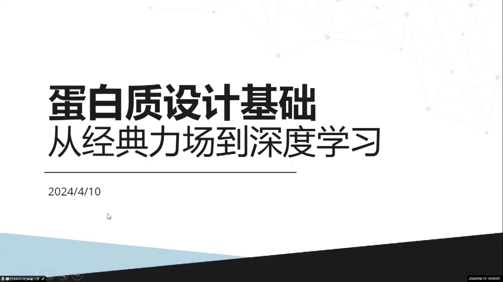 |
| 深度模型、深度学习的模型在我们科研中应用的范围越来越广。但是即便它现在看起来非常 fancy，比如说我们现在都爱用 ChatGPT 啊、什么 Kimi Chat 之类的，但实际上从蛋白质设计基础来说，经典力场是整个……我们理解蛋白质的结构…… [【跳转到 00:25】](https://www.bilibili.com/video/BV1mkdwBoE6Z/?t=25) |  |
| 甚至是功能，然后包括它后面的应用场景，是一个很基础的东西。所以我今天还是会花比较长的时间给大家讲解一下。首先是蛋白质结构的基础，然后还有经典力场的一些设计方法。下面先……嗯，先调研一下大家的背景。 [【跳转到 00:50】](https://www.bilibili.com/video/BV1mkdwBoE6Z/?t=50) |  |
| 然后大家可以根据屏幕上的这个条件扣一下不同的数字，这样我后面讲的时候大概知道哪块要详讲、哪块要略讲。 [【跳转到 01:06】](https://www.bilibili.com/video/BV1mkdwBoE6Z/?t=66) | 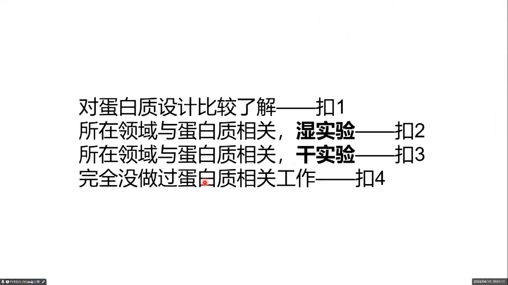 |
| （此区间无字幕） [【跳转到 01:31】](https://www.bilibili.com/video/BV1mkdwBoE6Z/?t=91) | 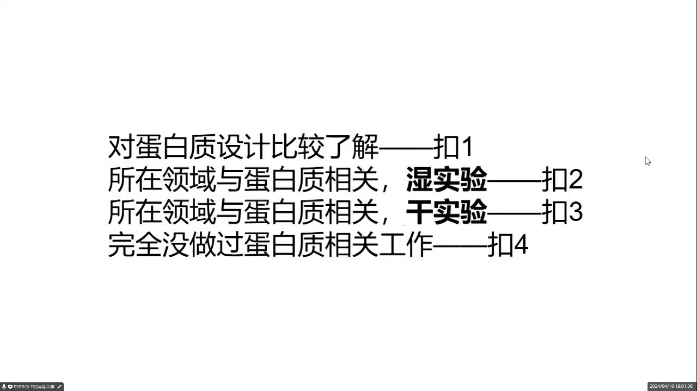 |
| 那个，大家有什么信息都发在腾讯会议里啊，我这边看微信不方便。OK，那我就差不多统计到这里。嗯，感觉大家大部分是做湿实验的，然后想大概了解一下蛋白质设计这方面哈。 [【跳转到 01:56】](https://www.bilibili.com/video/BV1mkdwBoE6Z/?t=116) |  |
| 好的好的，那我一会儿可能重点多讲一些我们在干实验中常用的一些基本技术。 [【跳转到 02:21】](https://www.bilibili.com/video/BV1mkdwBoE6Z/?t=141) |  |
| 好，下面就是……我们今天大概是讲目录中的前三个部分，然后明天晚上是实践操作。首先我呃……先说一下我们今天的课程安排啊，是 50 分钟加 10 分钟休息，然后再 50 分钟加 10 分钟休息，然后最后一个小时是我讲 50 分钟，最后 10 分钟……因为我看大部分其实是做湿实验的人，我们就花 10 分钟给大家讲一下…… [【跳转到 02:44】](https://www.bilibili.com/video/BV1mkdwBoE6Z/?t=164) | 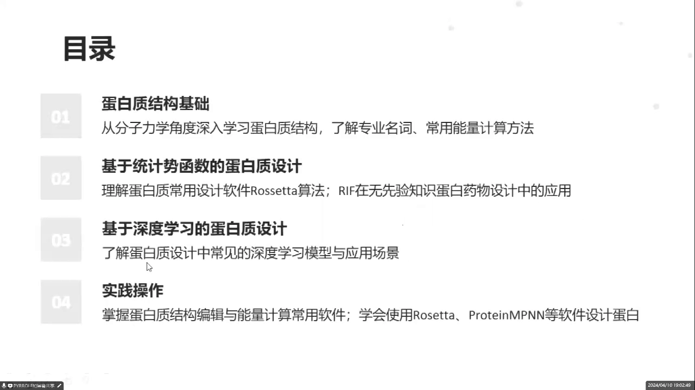 |
| 我们 Linux 系统中常用的一些命令行。然后如果您已经比较熟悉这些呢，就可以提前下课了。然后第一部分就是蛋白质结构基础，我们会从分子力学的角度深入学习蛋白质的结构，然后了解一些专业名词，还有一些我们常用的评价指标，以及比如说结合自由能的这些计算方法。然后第二部分就是基于统计势函数的…… [【跳转到 03:09】](https://www.bilibili.com/video/BV1mkdwBoE6Z/?t=189) | 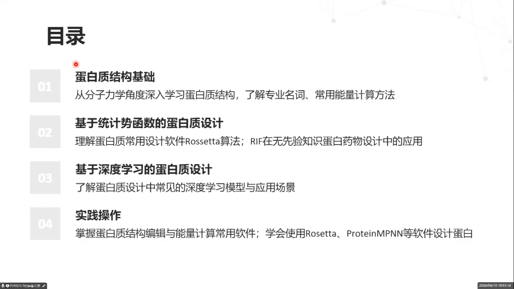 |
| 蛋白质设计就是我刚刚说的基于经典力场的设计。那我们会以 Rosetta 这个算法、这个软件为主，然后简单大概介绍一下它里面用到的一些能量函数。然后我们后面会给出一个 RIF，就是这种方法在无先验知识的蛋白质药物设计中的应用，它本质上也是一种基于经典力场的设计。然后第三部分呢…… [【跳转到 03:34】](https://www.bilibili.com/video/BV1mkdwBoE6Z/?t=214) | 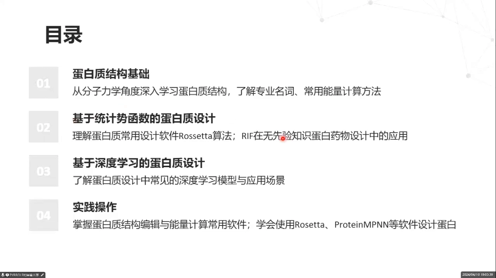 |
| 就是基于深度学习的蛋白质设计。首先我会……因为我看也确实是大部分是湿实验吧，我们还是大概讲一讲深度学习的一些基本知识，然后后面会给大家介绍 ProteinMPNN，也是去年……前年刚发表的一个非常新的工作，也是非常有意义、很好用的软件，给大家讲一讲它的原理。然后在最后一个实践操作呢…… [【跳转到 03:59】](https://www.bilibili.com/video/BV1mkdwBoE6Z/?t=239) | 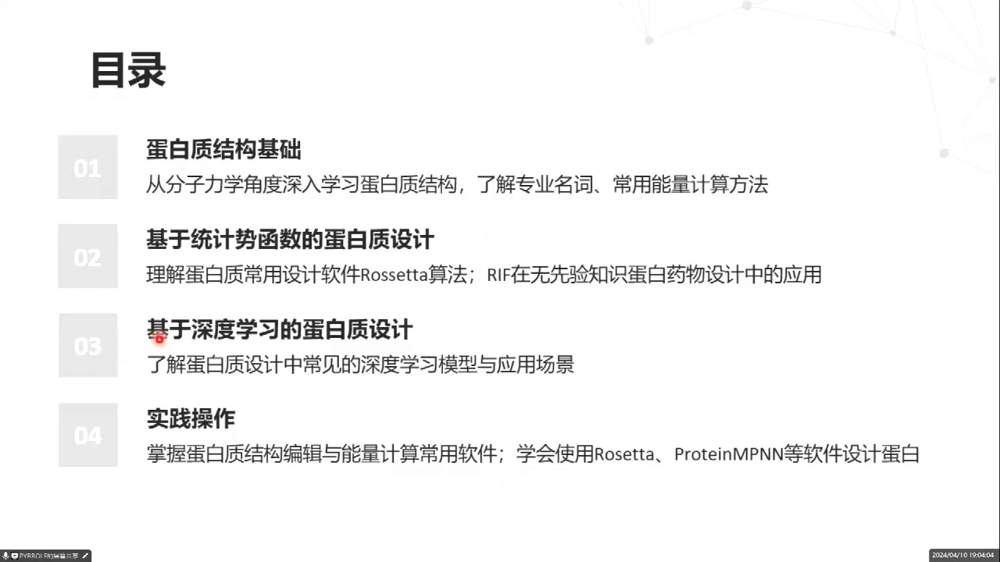 |
| 我们会带大家掌握一下蛋白质结构编辑与能量计算的常用软件。然后再带大家用一下 Rosetta、ProteinMPNN 这些软件来设计蛋白质结构或者序列。然后注意一下，因为 Rosetta 是一个文件特别大、而且编译很复杂的东西，所以你这两天没有搞定的话…… [【跳转到 04:24】](https://www.bilibili.com/video/BV1mkdwBoE6Z/?t=264) | 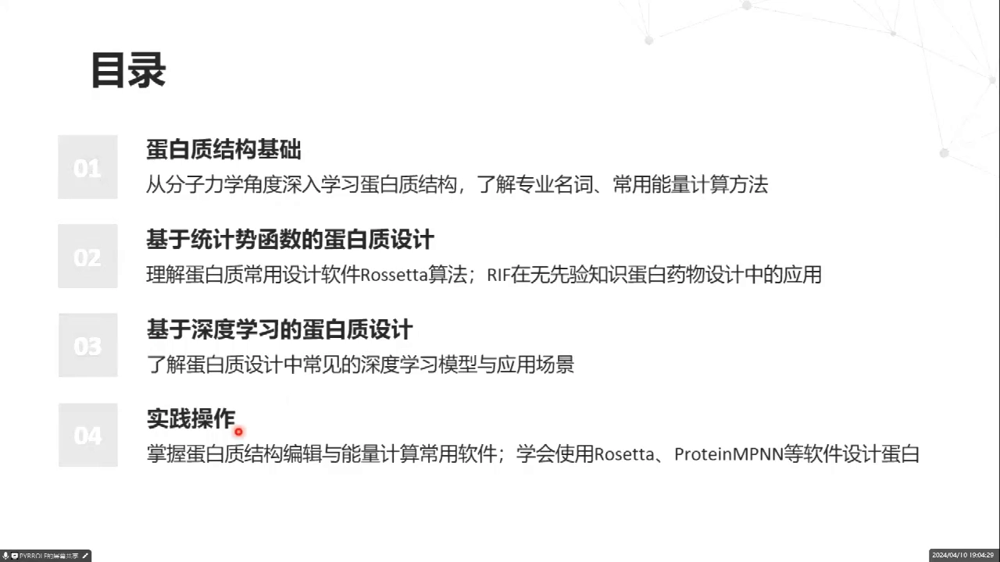 |
| 没有关系，你可以先跟着我们看看这个命令行和界面大概是怎么样的，然后自己再慢慢下载。所以不要着急啊。 [【跳转到 04:49】](https://www.bilibili.com/video/BV1mkdwBoE6Z/?t=289) | 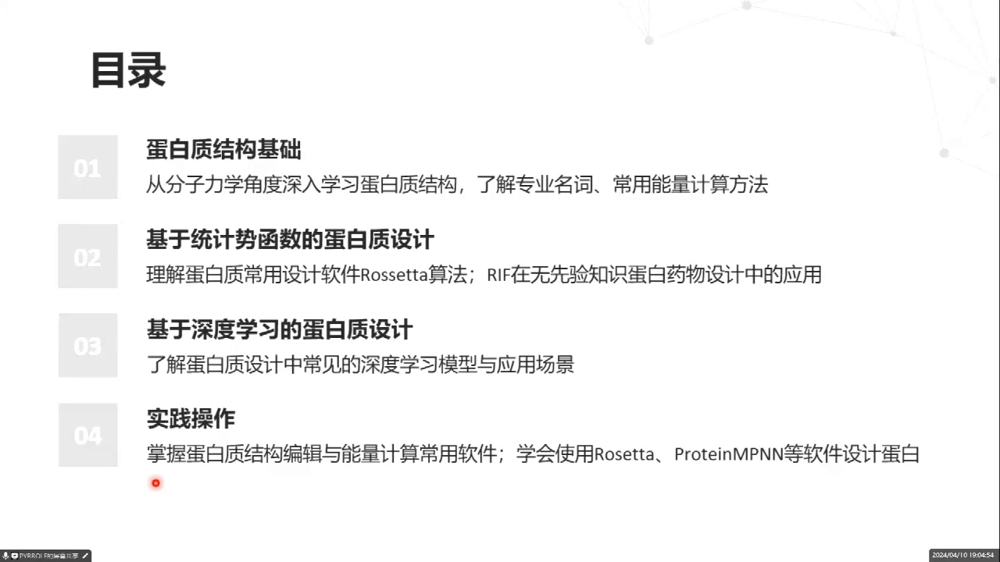 |
| 接下来就是第一部分：蛋白质结构。 [【跳转到 04:59】](https://www.bilibili.com/video/BV1mkdwBoE6Z/?t=299) | 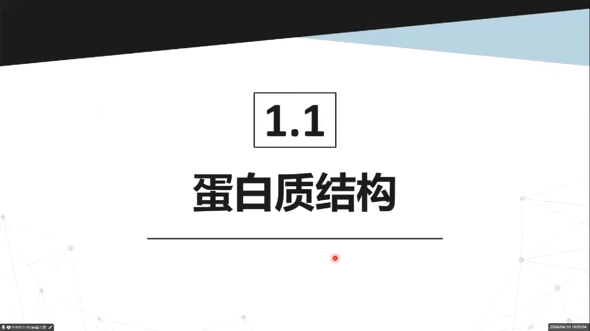 |
| 呃，我想这张 PPT 上的内容大家都很熟悉了。但是我想说的是，我们看一个蛋白质，可以从很多角度来看。首先，如果你是做生物实验的话，你可能会从蛋白质生物合成的角度，比如说我们表达、提纯一个蛋白，都是先构建一个质粒，然后再加一些什么，呃，比如说如果是 lac repressor，就加一些 IPTG 去诱导它表达。 [【跳转到 05:04】](https://www.bilibili.com/video/BV1mkdwBoE6Z/?t=304) |  |
| 然后可能做这些实验的同学可能会想到这方面。但是如果你是做一个比较偏向应用的场景的话，我们可能会考虑各种蛋白质的功能。比如说它作为一个酶，它可以催化反应；然后作为结构蛋白，它是细胞里面的一个骨架支撑；然后比如说细胞表面的信号蛋白，它是很重要的信号传递分子。 [【跳转到 05:29】](https://www.bilibili.com/video/BV1mkdwBoE6Z/?t=329) | 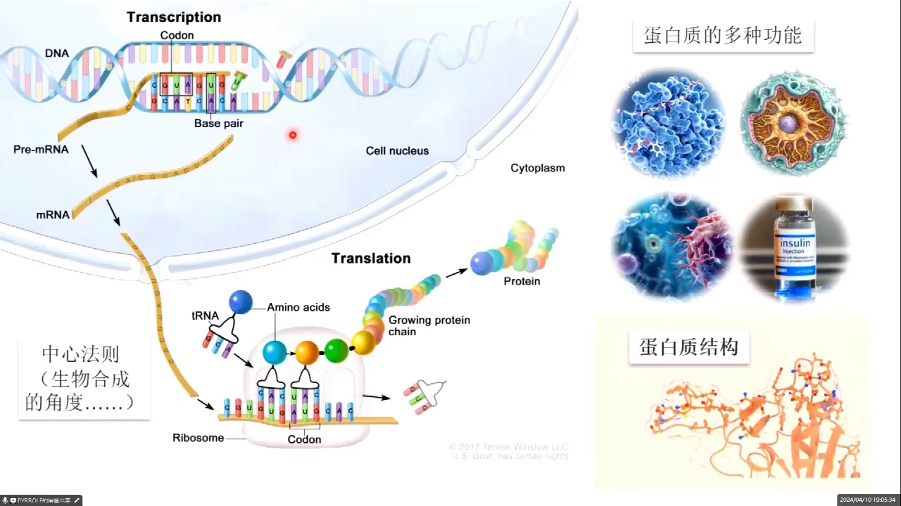 |
| 比如我们免疫中的 MHC，然后和 TCR 这些非常重要的细胞交流。然后第四个的话，如果是做药物相关的话，蛋白药物也是非常重要的一个部分，比如说胰岛素。但是呃，我今天想讲的蛋白质设计主要是从蛋白质结构的角度出发。我们……大家比较喜欢看的蛋白质结构…… [【跳转到 05:54】](https://www.bilibili.com/video/BV1mkdwBoE6Z/?t=354) |  |
| 可能直接是一个 surface，直接是一个表面，告诉你它大概什么形状；然后稍微接触过一点结构的人可能会关注它的二级结构，是 helix 还是 beta sheet 还是 loop；然后如果是更进一步的话，可能大家会需要关注到它原子、就是分子水平的一个结构细节，就是哪一个位置是什么原子啊，然后它们的一些化学性质…… [【跳转到 06:19】](https://www.bilibili.com/video/BV1mkdwBoE6Z/?t=379) | 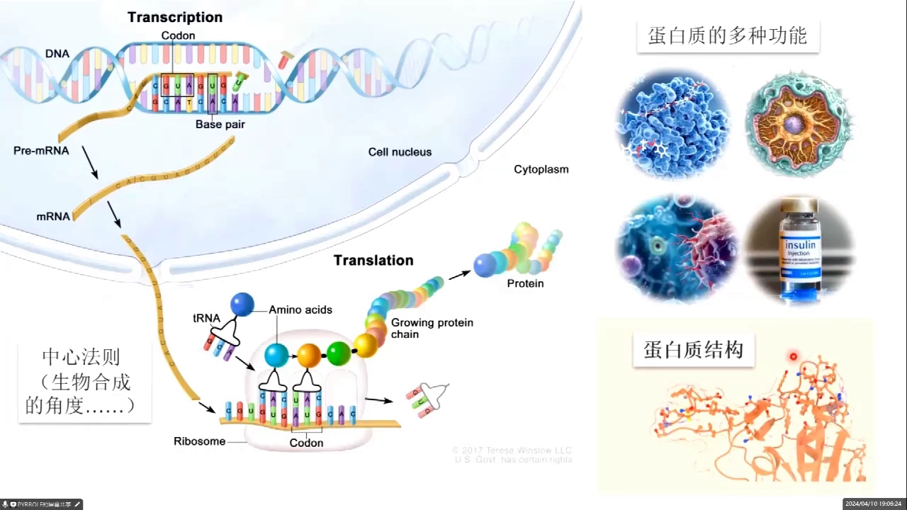 |
| 物理性质是怎么样的。 [【跳转到 06:44】](https://www.bilibili.com/video/BV1mkdwBoE6Z/?t=404) | 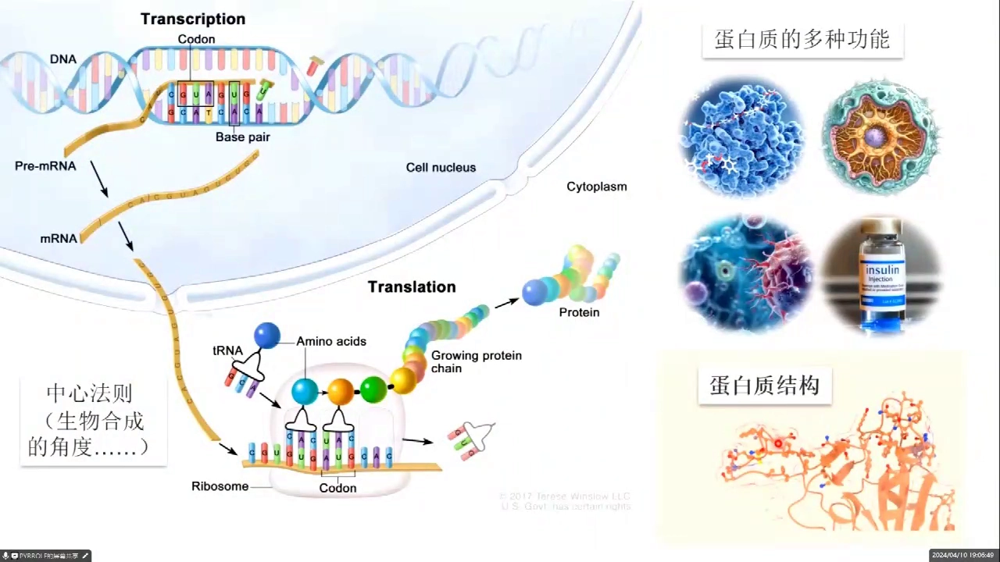 |
| 好，下面一个 PPT 呢，就是简单给大家回顾一下我们这些结构是怎样获得的。大家知道，在最初的时候，其实是 Rosalind Franklin，她首先拍出了 DNA 的一个 X 射线衍射图，然后从这个衍射图像的一些规律里面，我们可以去反推 DNA 具有一个双螺旋的结构。但是直到 20 年以后…… [【跳转到 06:52】](https://www.bilibili.com/video/BV1mkdwBoE6Z/?t=412) | 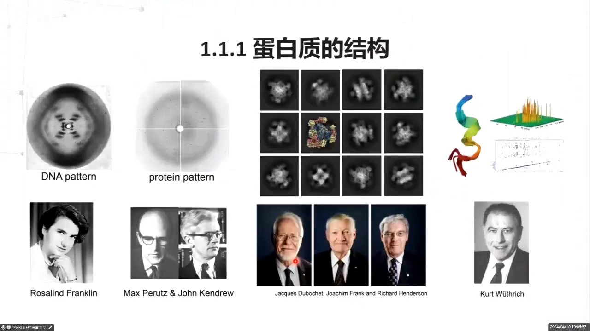 |
| 近 20 年以后，人们才解析出了蛋白质 X 射线衍射的一个结构。这是为什么呢？因为我们可以看到，蛋白质它的衍射图点和 DNA 相比非常复杂，所以也是经历了一系列的技术革命，还有一些方法的更新，人们才开始把蛋白质 X 射线衍射结晶作为一个比较主流的方法。 [【跳转到 07:17】](https://www.bilibili.com/video/BV1mkdwBoE6Z/?t=437) | 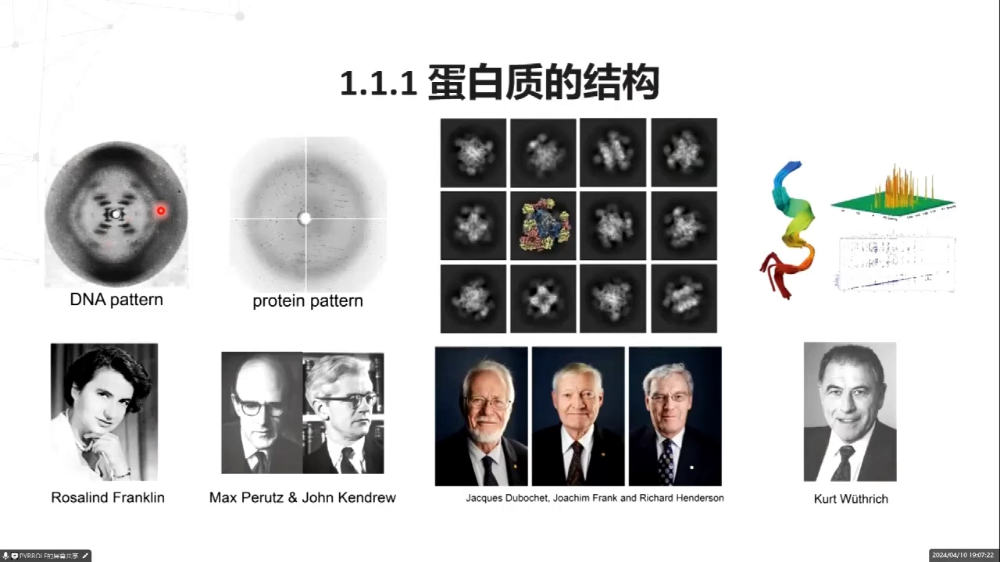 |
| 然后第三个呢，就是一看图就知道是这个 Cryo-EM，就是冷冻电镜。然后它呢，它是解析比较大的蛋白，然后小蛋白的话可能还是 X-ray 分辨率会高一点。然后最后一个呢，就是 NMR，核磁共振的。它也是，我们可以看到这个图谱也是非常复杂。然后呢…… [【跳转到 07:42】](https://www.bilibili.com/video/BV1mkdwBoE6Z/?t=462) |  |
| 然后将一种算法应用到了这种解析大分子 NMR 图谱里面，得了诺贝尔奖。那么 NMR 和前面几种不一样的是，它能够给出一个动态的结构。我们可以看到，比如说这个多肽，这个小肽它的柔性还是比较强的，然后就会在这个 loop 区域，它有很多种构象，那么 NMR 都可以解析出来。但是前面这两种的话，也是只能给出一种结构。 [【跳转到 08:07】](https://www.bilibili.com/video/BV1mkdwBoE6Z/?t=487) |  |
| 接下来说一下我们在实际应用中不可避免地要接触到的一些蛋白质结构数据库。首先，可能大家经常听到 PDB 啊，然后什么 wwPDB、RCSB PDB。那么这些它们是什么关系呢？首先，wwPDB 它是 world wide protein data bank 的一个缩写，它收集了世界各地测出的大分子三维结构。 [【跳转到 08:32】](https://www.bilibili.com/video/BV1mkdwBoE6Z/?t=512) |  |
| 然后它是一个国际性的组织，它负责整个 PDB 档案的管理和发展。同时它下属有很多成员，比如说下面展示的是 RCSB PDB，然后 BMRB、EMDB、PDBe 下面都有，就是他们是哪个国家或者地区的，比如说这是欧洲的，然后这个是日本的。 [【跳转到 08:57】](https://www.bilibili.com/video/BV1mkdwBoE6Z/?t=537) |  |
| 那我们最常用的是 RCSB PDB，它其实在我们实际科研中最关键的作用就是……它搜索非常方便，然后就是它的搜索界面就是这样的一个形式。我们既可以从它的名称，然后还可以从它结构的组成，还有一些化学组成啊、序列呀，还有序列比对以及一些结构相似度啊…… [【跳转到 09:22】](https://www.bilibili.com/video/BV1mkdwBoE6Z/?t=562) |  |
| 结构的多重比对，以及就是化学上的一些相关性。所以说它这个 RCSB 最大的优点，就是便捷、美观的蛋白质结构搜索的一个功能。大家如果想要找到这个网站的话也不难，就是直接在 Bing 上，或者 Google 上搜“RCSB PDB”，跳出来的第一个应该就是这个网站。然后还有一个就是 UniProt。 [【跳转到 09:47】](https://www.bilibili.com/video/BV1mkdwBoE6Z/?t=587) |  |
| UniProt 应该是大家更加熟悉的一个数据库。它是一个国际合作项目，是由欧洲生物信息研究所，还有瑞士生物信息研究所和蛋白质信息资源共同维护的一个网站。那么它提供的信息其实更加全面，包括序列啊、分子量、同源性等，而且它还提供了丰富的功能注释、结构信息，还有疾病相关性。那在实际工作中呢…… [【跳转到 10:12】](https://www.bilibili.com/video/BV1mkdwBoE6Z/?t=612) |  |
| 一个比较明显的优势就是，它的序列……就是它一种蛋白就对应的一种序列，对应的是一个 UniProt ID。也就是说，不管是人源还是鼠源还是兔源，它的 UniProt ID 是不一样的。但是我们在检索 PDB 的过程中，可能我们输入相似的序列，它各种……各种蛋白结构比较相近啊…… [【跳转到 10:37】](https://www.bilibili.com/video/BV1mkdwBoE6Z/?t=637) |  |
| 然后都会出来，然后你就不太好筛选。所以我的建议其实是，大家先在 UniProt 里面根据自己蛋白的详细信息找出它的 UniProt ID，然后点进去之后，在左边的 structure 部分找到它在 PDB 中对应的 ID 是什么。然后大家有什么疑问…… [【跳转到 11:02】](https://www.bilibili.com/video/BV1mkdwBoE6Z/?t=662) |  |
| 就可以随时在聊天框里面说。 [【跳转到 11:27】](https://www.bilibili.com/video/BV1mkdwBoE6Z/?t=687) | 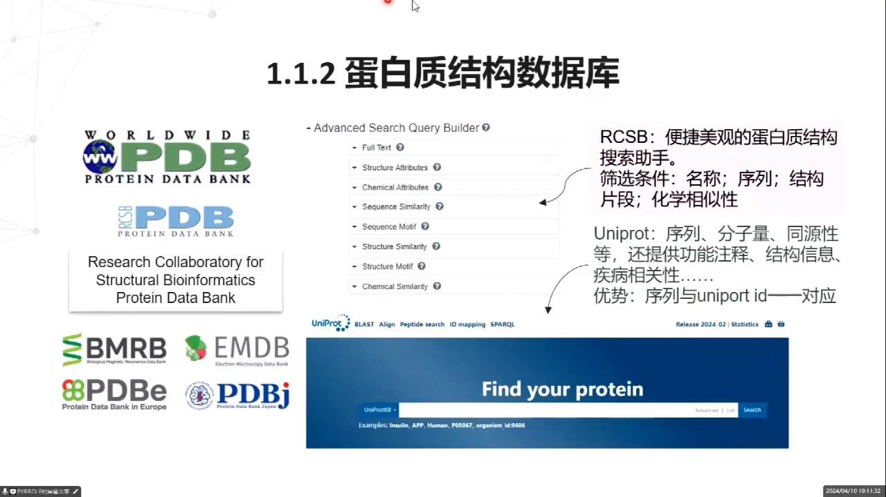 |
| 那么接下来就是详细介绍一下我们最常打交道的 PDB、PDB 文件。然后首先 PDB 文件的下载呢，我们是可以直接在我刚刚说的这个…… [【跳转到 11:35】](https://www.bilibili.com/video/BV1mkdwBoE6Z/?t=695) | 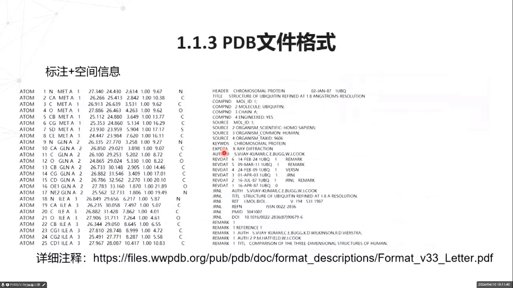 |
| 注意一定要选择 PDB format，要选择这种格式。然后具体的操作明天也会带大家一起来看啊。 [【跳转到 11:50】](https://www.bilibili.com/video/BV1mkdwBoE6Z/?t=710) | 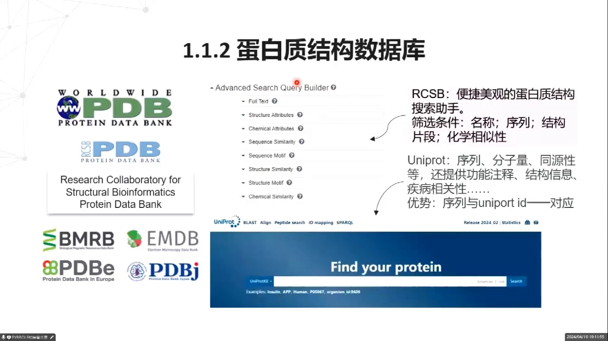 |
| 那么它里面包括什么呢？它里面主要是包括关于这个蛋白……比如说如果是 X-ray 得到的结构的话，就是这个衍射条件呀，然后结晶条件；然后还有如果是 NMR 的话，就是 NMR 实验过程中的条件。它是包括这种标注以及空间的信息。标注的话，就是可以看到非常的丰富，header 就是它的这个名字。 [【跳转到 12:01】](https://www.bilibili.com/video/BV1mkdwBoE6Z/?t=721) | 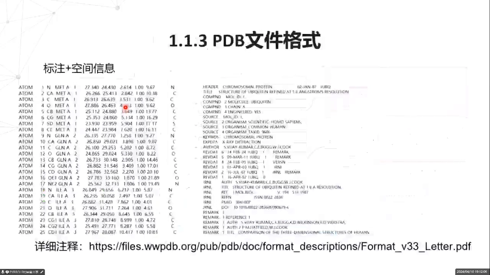 |
| 然后后面还有它是什么时候……什么时候这个解出来的，什么时候上传的，然后还有就是它的这个 PDB ID，PDB ID 一般都是四个字符。嗯，那么具体的我就不会给大家一一讲了，但是强烈推荐大家到这个网站上下载这个 PDF，它是最新版本的关于 PDB 文档格式的一个详细说明。 [【跳转到 12:26】](https://www.bilibili.com/video/BV1mkdwBoE6Z/?t=746) | 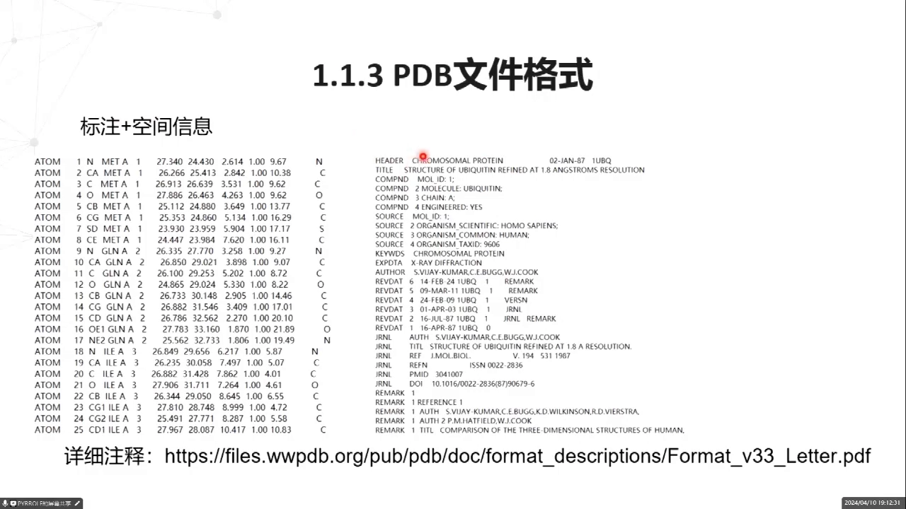 |
| 接下来我们看一下空间信息。空间信息的话，第一列就是 item，然后第二列就是 item 的一个编号。然后我们看，如果我们用一个文本文件打开这个 PDB 的话，我们会感到非常乱，就是有的结束在这，有的在前面，有的又往后了，就是看起来就是觉得很乱，但实际上它是一个编写非常有规律…… [【跳转到 12:51】](https://www.bilibili.com/video/BV1mkdwBoE6Z/?t=771) |  |
| 而且是一个非常漂亮的形式。因为我们在 PDB、就是我们在 TXT 或者一些文本编辑软件中看它的时候，它会因为一些字符然后自动调整，它就是比如说空格肯定比一个数字占据的这个空间要小，所以我们看起来参差不齐的。但实际上我们看到这个 PDF 里面说的 record format 的话…… [【跳转到 13:16】](https://www.bilibili.com/video/BV1mkdwBoE6Z/?t=796) | 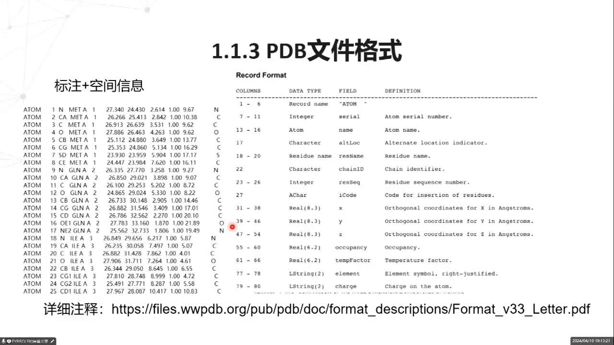 |
| 它的第一列到第六列代表的是 record name，也就是说是 atom，然后还有一些其他，比如说 HETATM 之类的，对。然后大家可以自己看一下，然后第 7 到 11 列这个是数字，然后它就代表的是原子的这个编号。接下来呢是原子的名称，后面……后面的话就是…… [【跳转到 13:41】](https://www.bilibili.com/video/BV1mkdwBoE6Z/?t=821) | 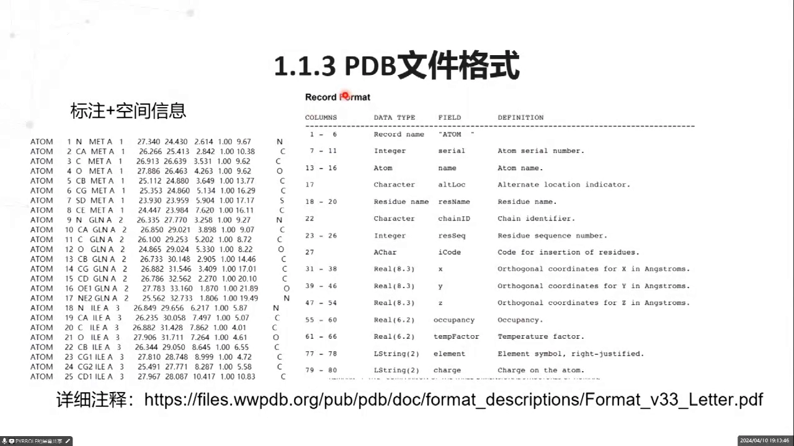 |
| 这个一般……哎，对，这个是原子的名称，然后后面一般会空出来一个，然后再往后面就是这个残基名称、残基名称，然后还有就是残基的编号。然后后面这三列就是它在结构、就是它在空间上有个 XYZ 坐标。然后再往后的话…… [【跳转到 14:06】](https://www.bilibili.com/video/BV1mkdwBoE6Z/?t=846) | 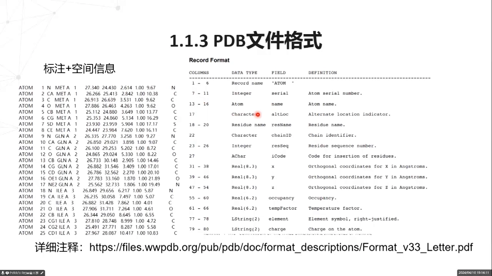 |
| 最后这一列我们可以看是比较关键的，最后一列对应的是这个 temperature factor，就是……就是一个温度因子，也表征了这个位置它的这个结构的置信度。剩下的就是……并不是说 PDB 文件并不会说所有的这些信息都标出来，所以你要根据它的列的位置，然后再从这个表里面确定它代表什么。 [【跳转到 14:31】](https://www.bilibili.com/video/BV1mkdwBoE6Z/?t=871) | 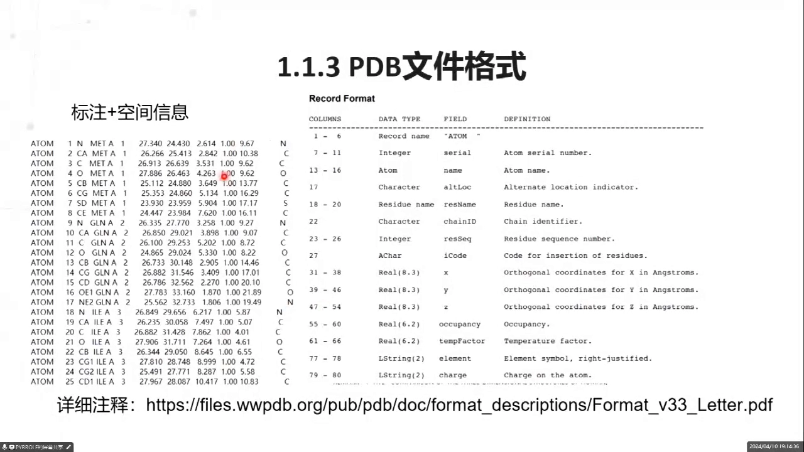 |
| 接下来我们来仔细看一下。 [【跳转到 14:56】](https://www.bilibili.com/video/BV1mkdwBoE6Z/?t=896) |  |
| 我、我就把刚刚的第一个……第一个残基的信息给它列出来。因为起始子都是 AUG 嘛，所以第一个氨基酸都是甲硫氨酸。然后我们可以看到，就是这一列的名字，可能大家相对于其他的信息来说不是特别熟悉。 [【跳转到 15:01】](https://www.bilibili.com/video/BV1mkdwBoE6Z/?t=901) | 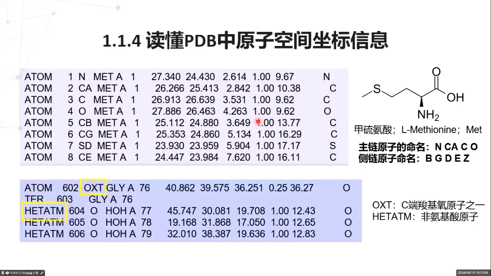 |
| 所以说给大家大概介绍一下我们在 PDB 里面这些原子都是怎么命名的。首先主链原子的话就是比较简单，N 就是这个氨基，也就是那个肽键里面的氮；然后碳阿尔法，碳阿尔法就是 CA 表示；然后这个 C 的话它是代表那个羰基的碳；然后氧就是代表肽键里面羰基的氧。那么侧链原子呢，它是从 B、G、D、E、Z 这样的一个希腊字母…… [【跳转到 15:26】](https://www.bilibili.com/video/BV1mkdwBoE6Z/?t=926) |  |
| 就是按照希腊字母排序的，然后后面翻译成了拉丁字母，也就是我们现在看到的英文字母。我们以这个 MET 为例的话，前面四个是主链原子，不说，CB 就是碳贝塔原子，是这个；然后 CG 就是这里，然后 SD 就是这个，然后 CE 就是它。然后如果我们单从元素看的话，就是 C、C、S、C。 [【跳转到 15:51】](https://www.bilibili.com/video/BV1mkdwBoE6Z/?t=951) | 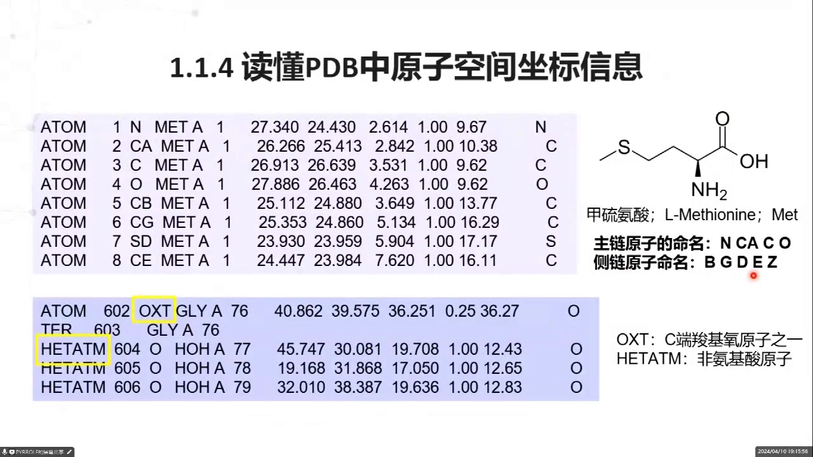 |
| 然后我们把 B、G、D、E 给它按到后面，就是这个就是它的一个命名的方式。然后还有另一个想要说明的问题是，我们在最后一个……就是最后一个残基，因为它 C 端是裸露的嘛，它就会多出来一个氧，那么这个氧一般会被命名为 OXT，就是 C 端羧基、羧基氧原子之一。然后这个 TER 就代表…… [【跳转到 16:16】](https://www.bilibili.com/video/BV1mkdwBoE6Z/?t=976) | 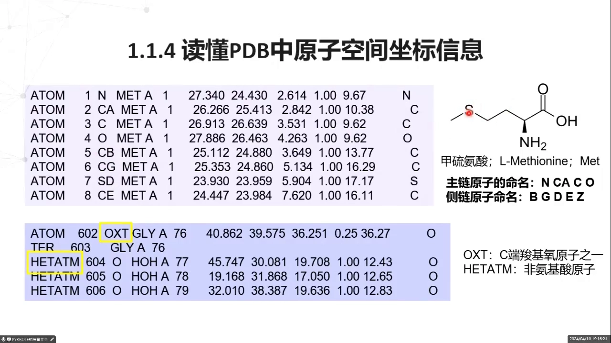 |
| 这条多肽链结束了。然后接下来呢，这个 HOH 大家看到就是溶剂嘛、溶剂化的，它并不会归在正常氨基酸的原子属性里面，它是叫 HETATM。 [【跳转到 16:41】](https://www.bilibili.com/video/BV1mkdwBoE6Z/?t=1001) | 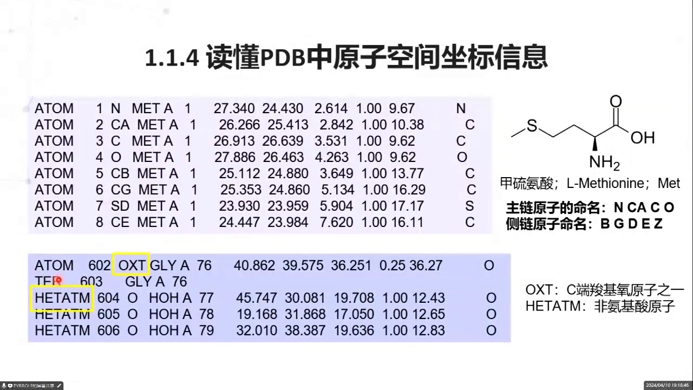 |
| 接下来再给大家举两个例子来熟悉一下命名。以这个赖氨酸为例，就是也是碳、碳、碳、碳、氮，然后就是从 B、G、D、E、Z 开始编号。那么比较特殊的是这个苯丙氨酸，因为它的这两个碳在化学上是环境一样的，那么我们在编号它的时候呢，这里还是……碳、碳。 [【跳转到 16:59】](https://www.bilibili.com/video/BV1mkdwBoE6Z/?t=1019) | 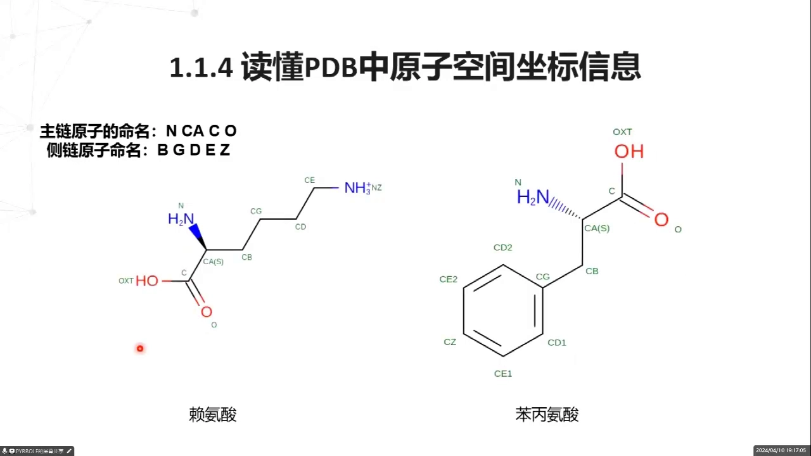 |
| 然后这两个是一样的，这两个是一样的，这个是一样的，所以还是 B、G、D、E、Z。然后 D 和 E 分别用 D1、D2、E1、E2 表示。所以大家以后看到，就是在做计算的时候，比如说你可能在用 Rosetta，它突然给你报了一个错，说什么原子不识别，那你看看是不是它原子的命名有问题了。 [【跳转到 17:24】](https://www.bilibili.com/video/BV1mkdwBoE6Z/?t=1044) | 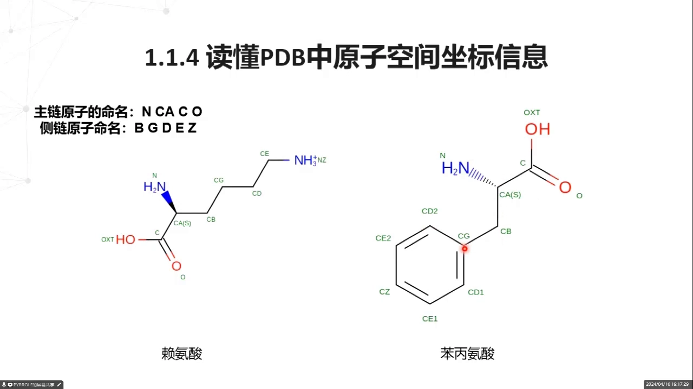 |
| 嗯，刚刚介绍的是 PDB 文件一些坐标信息。那么现在接下来我们就是比较传统地讲一下蛋白质的、蛋白质的一些结构。哦，是的是不一样的，如果想要更新的话，我会今天再给大家发过去。呃，蛋白质结构它主要是可以分为四层…… [【跳转到 17:49】](https://www.bilibili.com/video/BV1mkdwBoE6Z/?t=1069) | 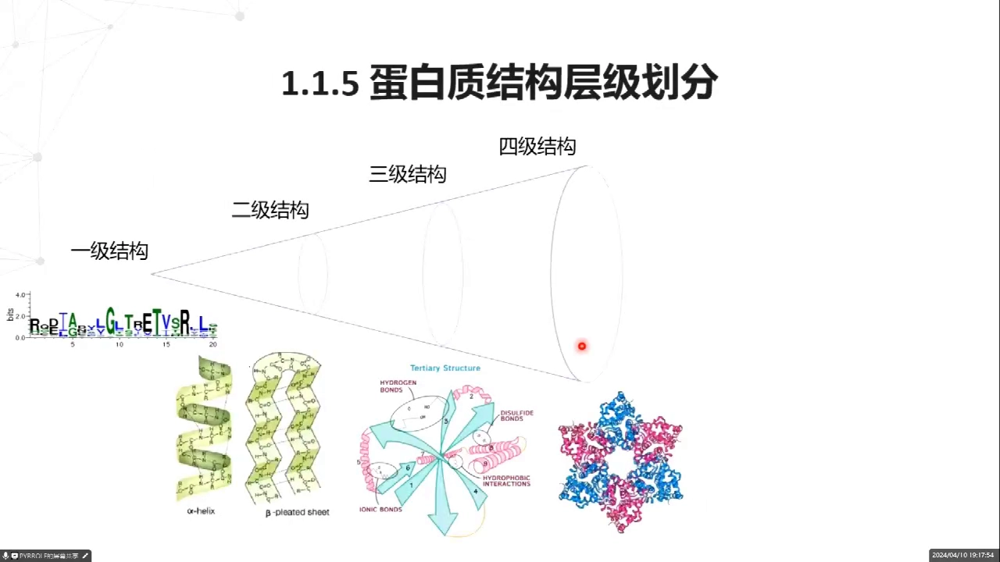 |
| 一级结构就是序列；二级结构是 alpha helix、beta sheet；然后三级结构的话就是一条多肽链的整个三维空间结构；四级结构就是多条链组成的一个复合物，比如说这是一个解旋酶，它是由六条链构成的。 [【跳转到 18:14】](https://www.bilibili.com/video/BV1mkdwBoE6Z/?t=1094) |  |
| 那么从一级结构到二级结构，主要考虑的是特定的主链二面角，然后形成的不同形式的氢键导致了它呈现螺旋状或者是 beta 片状。那么从二级结构到三级结构，就是不同二级结构的组合，比如说……其实它也是有一些固定的排列的，比如说两个 alpha 在一个 beta 上面…… [【跳转到 18:39】](https://www.bilibili.com/video/BV1mkdwBoE6Z/?t=1119) |  |
| 可能这种叫 alpha/beta，然后包括我们看到荧光蛋白一些 beta 桶，它们都是比较稳定、然后也特征鲜明的三级结构。那么三级结构到四级结构的话，就是肽链间的相互作用，刚刚也都说了。 [【跳转到 19:04】](https://www.bilibili.com/video/BV1mkdwBoE6Z/?t=1144) | 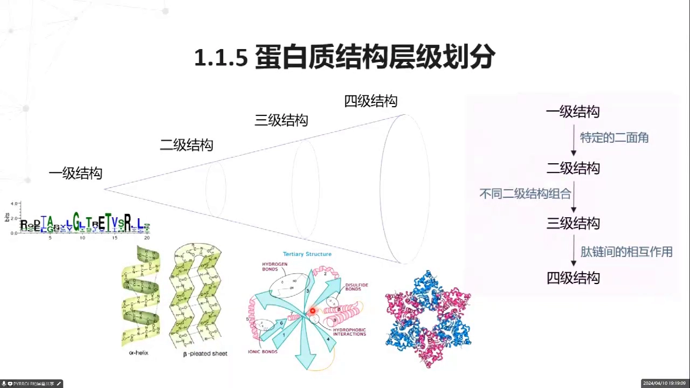 |
| 然后下面的话是带大家过一下比较……我认为比较难理解的部分，或者比较抽象一点的部分，是这个二面角。嗯，二面角的话，大家高中数学应该都还记得，就是你可以回想一下，就是两个面，一个面选一个点，然后在这两个面的…… [【跳转到 19:22】](https://www.bilibili.com/video/BV1mkdwBoE6Z/?t=1162) | 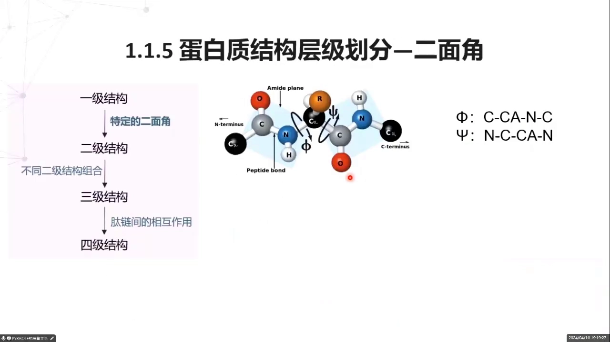 |
| 就是相交的直线上选两个点，然后再在另一个面上选一个点，这、这个就是……这四个点就定义了一个二面角。那么在我们、就是蛋白质设计里面，就相当于是四个原子定义了一个二面角。那么我们考虑的二面角主要是主链、主链原子形成的。那么我们知道主链、主链链上有肽键，然后肽键呢…… [【跳转到 19:47】](https://www.bilibili.com/video/BV1mkdwBoE6Z/?t=1187) |  |
| 因为这个氮原子的孤对电子和这个碳氧双键有一个……p-π 共轭，或者有一个共轭的结构，所以说这个地方其实是一个、其实是一个平面对吧。然后我们把这两个平面画出来，所以说其实这个角度要么是零度要么是 180 度，我们就不做考虑了。那我们要考虑的实际上是 φ 和 ψ 这两个角。 [【跳转到 20:12】](https://www.bilibili.com/video/BV1mkdwBoE6Z/?t=1212) | 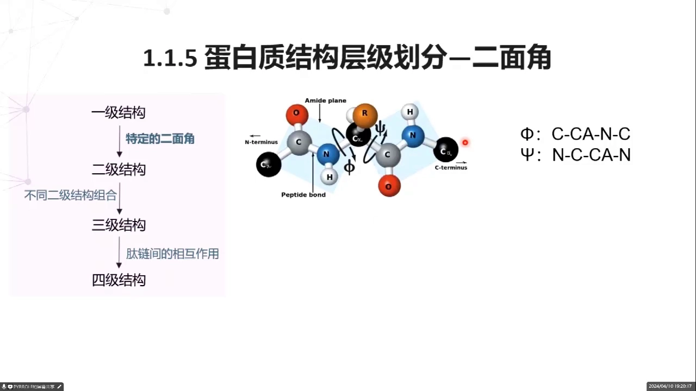 |
| φ 的话就是碳、碳阿尔法、氮、碳，就是……诶，这样，碳、碳阿尔法、氮和碳，我们从这个角度看、从这个角度看，就是这样的一个二面角。然后 ψ（普赛）的话就是氮、碳、碳阿尔法、氮，就是从这个地方看。那么正是这两种二面角不同的组合，形成了非常丰富的二级结构。 [【跳转到 20:37】](https://www.bilibili.com/video/BV1mkdwBoE6Z/?t=1237) |  |
| 还有我们的主链构象，这种静态图还是比较难以理解，我们接下来给大家做一个实例的演示。呃，我要重新共享一下屏幕。 [【跳转到 21:02】](https://www.bilibili.com/video/BV1mkdwBoE6Z/?t=1262) | 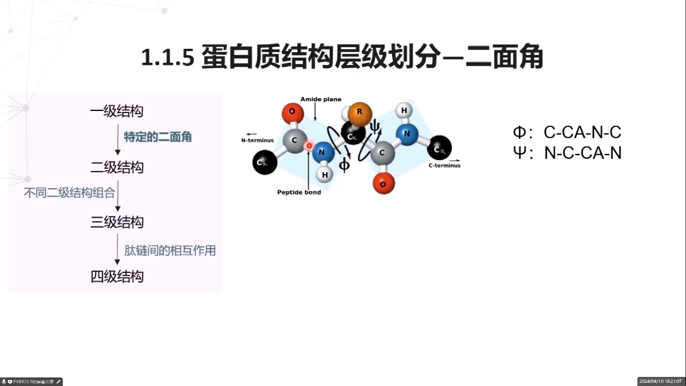 |
| 大家能看到这个网页吗？ [【跳转到 21:27】](https://www.bilibili.com/video/BV1mkdwBoE6Z/?t=1287) |  |
| 有人吗？大家能看到这个网页吗？好的好的。然后接下来就是我们看一下这个二面角，具体是让大家有个比较生动的理解。首先是 φ 角。 [【跳转到 21:35】](https://www.bilibili.com/video/BV1mkdwBoE6Z/?t=1295) | 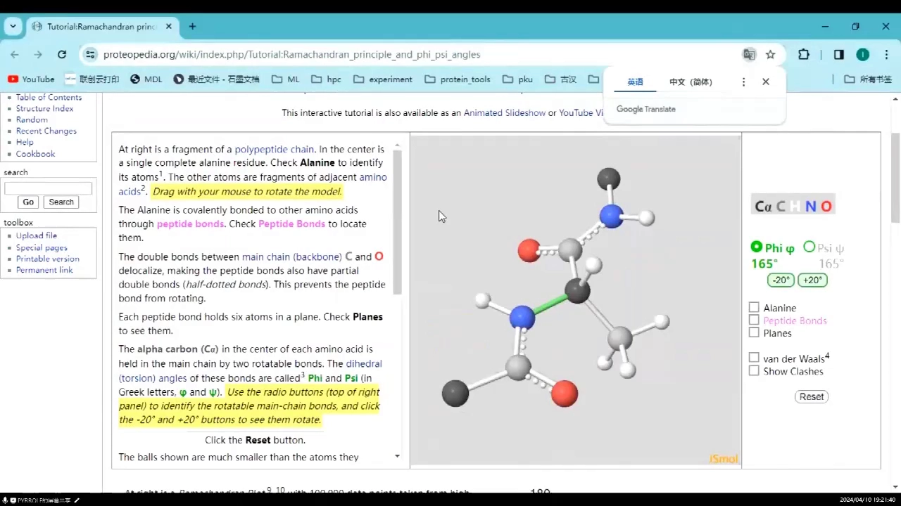 |
| φ 角是碳、碳阿尔法、氮、碳、碳、碳阿尔法、氮、碳，也就是这四个原子组成的。然后我们把角度调到这里，让这两个原子、让这两个原子重叠，然后我们减 20 度，我们可以看到就是它的 φ 和 ψ。 [【跳转到 22:00】](https://www.bilibili.com/video/BV1mkdwBoE6Z/?t=1320) | 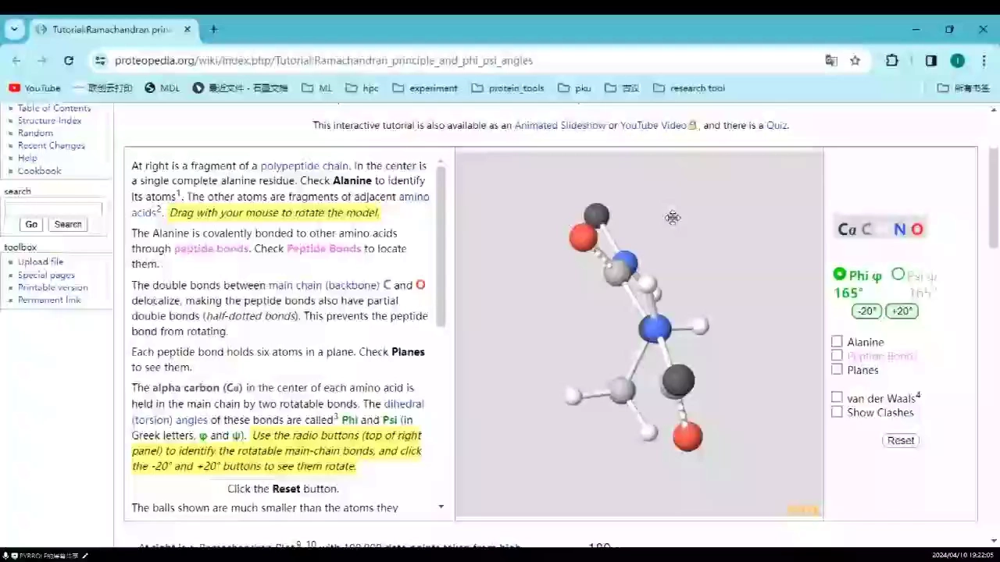 |
| 实际上在一些固定的角度是能量比较低的，因为它的碰撞比较小嘛。好，然后接下来我们看一下 ψ（普赛）角，是氮、碳、碳阿尔法、氮，氮、碳、碳阿尔法、氮，所以我们把这两个原子重叠在一起。正的话就是逆时针…… [【跳转到 22:25】](https://www.bilibili.com/video/BV1mkdwBoE6Z/?t=1345) | 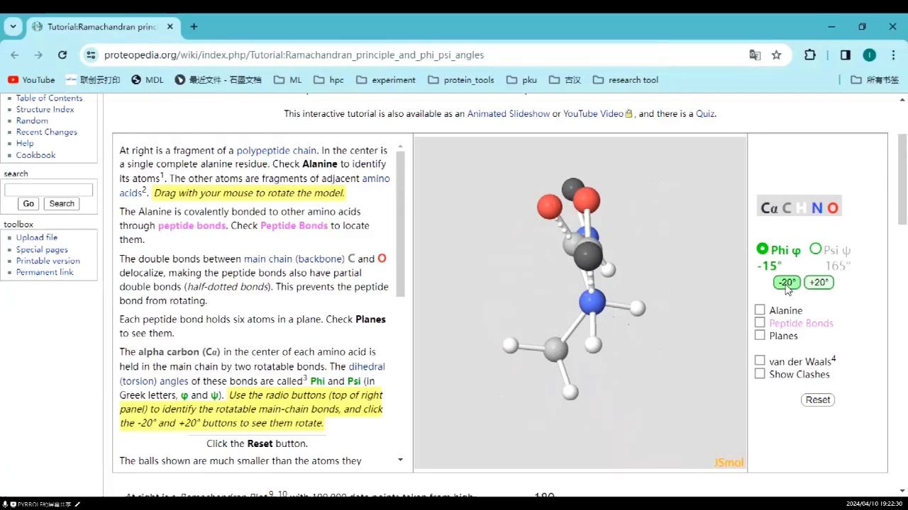 |
| 然后负的话就是顺时针。然后我们刚刚说的就是这个酰胺键，我们也给它展示一下。这里的话就是零度或 180 度，其实零度和 180 度分别就对应是顺式和反式的构象。 [【跳转到 22:50】](https://www.bilibili.com/video/BV1mkdwBoE6Z/?t=1370) | 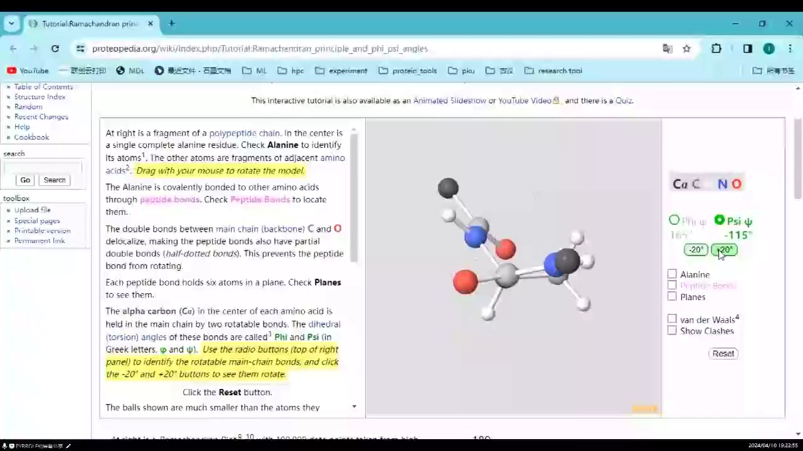 |
| 好，希望大家能有一个更加深入的理解。 [【跳转到 23:15】](https://www.bilibili.com/video/BV1mkdwBoE6Z/?t=1395) | 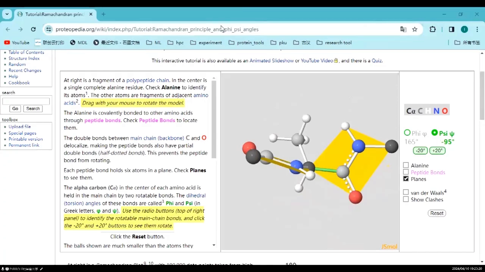 |
| 好，现在我们回到这个 PPT 上。那么在我们旋转二面角的过程中呢，就是主链上的氮——主链上氮有氢嘛——然后它和主链上的氧原子会形成一些氢键。 [【跳转到 23:30】](https://www.bilibili.com/video/BV1mkdwBoE6Z/?t=1410) | 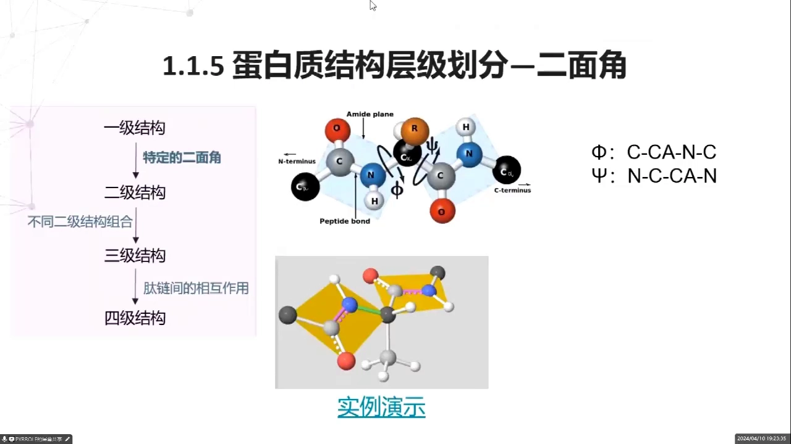 |
| 那么它们不同的二面角组合会呈现出不同的氢键模式，那么也就、也就形成了我们所说的 alpha 螺旋和 beta 折叠。比如说这里就是 alpha 螺旋，因为它们形成氢键之后能量比较低嘛，所以说我们可以看到，就是形成氢键的地方…… [【跳转到 23:55】](https://www.bilibili.com/video/BV1mkdwBoE6Z/?t=1435) |  |
| 它颜色比较深，这里就是我们常说的右手螺旋。然后这里大家可以想一下为什么，就是它会有一个关于原点对称的地方。当然这里就是 beta 折叠了。这里主要是因为有一些左手螺旋，或者说我们 D 型氨基酸形成螺旋的时候，它的 φ 和 ψ 就刚好是反过来的，就是一个镜像的…… [【跳转到 24:20】](https://www.bilibili.com/video/BV1mkdwBoE6Z/?t=1460) | 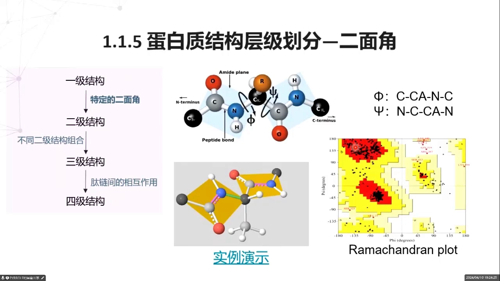 |
| 就是一个镜像的情况。 [【跳转到 24:45】](https://www.bilibili.com/video/BV1mkdwBoE6Z/?t=1485) |  |
| 接下来呢，是给大家介绍一下我们在蛋白质设计过程当中必须要知道的关键的概念。首先是 domain，domain 它的定义呢就是一个区域。 [【跳转到 24:50】](https://www.bilibili.com/video/BV1mkdwBoE6Z/?t=1490) |  |
| 你可以理解为多肽链的一个区域，那么这个区域它是可独立折叠并且有特定功能的。那么我这里举的一个例子就是 SH2 domain。我们知道，既然它可独立折叠、有特定功能，那意味着同一个 domain 它可以出现在不同的蛋白质里。那么像这个 SH2 domain，是一种与磷酸化酪氨酸残基结合的一个 domain。 [【跳转到 25:15】](https://www.bilibili.com/video/BV1mkdwBoE6Z/?t=1515) |  |
| 它是广泛存在于信号传导蛋白中的，嗯，对，特别是在细胞增殖和分化过程中。比如说黄色的就是 SRC 蛋白，绿色的就是……GRB2 蛋白，就是它们序列上差得非常多。 [【跳转到 25:40】](https://www.bilibili.com/video/BV1mkdwBoE6Z/?t=1540) |  |
| 序列上差得非常多，但是它们都有这一个共同的 domain，就是它们行使、它们有类似的功能。第二个概念就是 motif，motif 我们直译过来是特定模式。那么我们所说的特定模式，既可以是序列的特定模式，也可以是结构上的特定模式。大家如果了解一点免疫的话，我们知道，嗯，巨噬细胞或者一些细胞…… [【跳转到 26:05】](https://www.bilibili.com/video/BV1mkdwBoE6Z/?t=1565) |  |
| 它们吞噬掉了外源的一些微生物之后，或者外源一些病原之后，它会把这些病原的蛋白给消化掉，并且把它们结合到一个叫 MHC 的分子上。这个分子在经过内质网、高尔基体再传送到细胞表面，把它展示出来，就是一个像一个手掌托着一段抗原肽一样。 [【跳转到 26:30】](https://www.bilibili.com/video/BV1mkdwBoE6Z/?t=1590) |  |
| 然后这个抗原肽呢会被 T 细胞识别，然后引起一些后面的杀伤性的反应。那么这个肽呢，经过科研人员的一些探索和序列分析，然后实验上就是多肽组学，会发现这些肽其实有一些比较保守的位点，那么做了一个 sequence logo。也就是说，在比如说在 1 万条肽里面…… [【跳转到 26:55】](https://www.bilibili.com/video/BV1mkdwBoE6Z/?t=1615) |  |
| 它不同的位置某种氨基酸类型出现的频率，如果这个地方越高的话、如果它频率越大的话，这个地方它的字体就越大。那么我们可以看到，就是它其实在有些位点是比较保守的，那么我们可以管这样的一个多肽、就是 MHC 结合多肽的一个序列、序列特异性，就管它叫一个 binding motif，就管它叫一个 sequence motif。 [【跳转到 27:20】](https://www.bilibili.com/video/BV1mkdwBoE6Z/?t=1640) |  |
| 那么对于结构的话呢，我们刚刚说的就是，我们可以经常看到不同的二级结构组合在一起，或者是同组二级结构它们自己组合在一起，这个也叫一种 structure motif。像这个就是两个 beta 片连在一起，然后这个就是 alpha 和 beta 它们组合起来，我刚刚说的 alpha 跟 beta 结构，然后这个就是两个螺旋，因为我们知道…… [【跳转到 27:45】](https://www.bilibili.com/video/BV1mkdwBoE6Z/?t=1665) |  |
| 就是螺旋束其实是一种非常稳定的结构，那么中间的疏水残基如果是聚在一起的话，会产生非常好的、非常好的一种疏水作用，这样它的能量就非常低，所以是一个非常常见的 sequence、呃、structure motif。第三个关键的名词就是 topology 和 fold。Topology…… [【跳转到 28:10】](https://www.bilibili.com/video/BV1mkdwBoE6Z/?t=1690) | 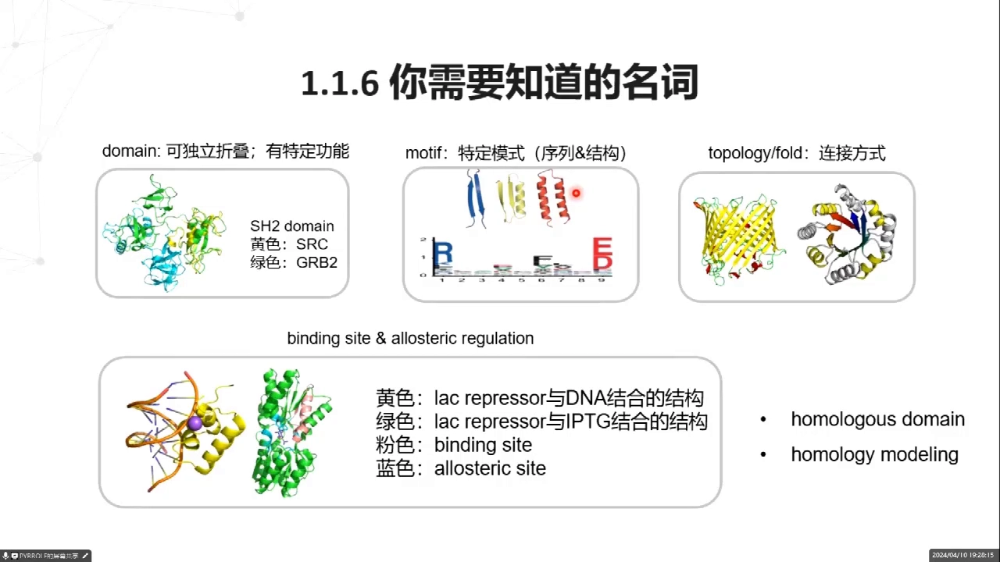 |
| 也就是拓扑结构，通常指的是蛋白质中二级结构元素，如 alpha 螺旋呀、beta 折叠的空间排列和它们之间的连接方式。那么 fold 也就是蛋白质折叠，它描述的是蛋白质链如何折叠成特定的三维结构，特别是指蛋白质的整体三维结构模式。但是，那么相比来说呢，蛋白质的 topology 其实更侧重于二级结构元素…… [【跳转到 28:35】](https://www.bilibili.com/video/BV1mkdwBoE6Z/?t=1715) |  |
| 在空间中的排列和连接方式，可能跟我刚刚说的 structure motif 就是概念上有些重合，但 topology 一般指更加复杂的一些组合。那么 fold 则是描述蛋白质整体的三维结构模式。嗯，最后一个就是，如果大家是做药物设计相关，或者是、即便不是药物，biomarker 或者一些配体…… [【跳转到 29:00】](https://www.bilibili.com/video/BV1mkdwBoE6Z/?t=1740) |  |
| 就是配体相关的话，binding site 和 allosteric regulation 是非常重要两个概念。binding site 顾名思义就是结合的位点，那 allosteric regulation 就是别构位点。我给大家举一个非常经典的例子，把这两个概念都给包含进来。那么我举的例子就是大家在…… [【跳转到 29:25】](https://www.bilibili.com/video/BV1mkdwBoE6Z/?t=1765) |  |
| 提蛋白或者表达蛋白过程中非常常用的 Lac repressor。我们知道在细胞的……找到它的那个 S 型曲线斜率最大的地方，是斜率最大的地方的时候，我们要往里面加 IPTG 去诱导它表达蛋白。那为什么加了 IPTG 它就能表达了呢？我们从结构上来详细地解释一下。首先这是一个 PDB 中的结构，黄色的就是 Lac repressor 的一个片段。 [【跳转到 29:50】](https://www.bilibili.com/video/BV1mkdwBoE6Z/?t=1790) |  |
| 然后这个橙色的还有这个蓝色的，大家一看就知道是一个 DNA。那么这个就是 Lac repressor，Lac repressor 和 DNA 结合的一个结构。第二个呢，就是 IPTG 与我们的 Lac repressor 结合的结构。我们知道 Lac repressor 顾名思义…… [【跳转到 30:15】](https://www.bilibili.com/video/BV1mkdwBoE6Z/?t=1815) |  |
| 它是抑制 DNA 转录的一个蛋白。那么我们加了 IPTG 之后它能转录，说明 IPTG 它能够与 Lac repressor 结合，从而使 Lac repressor 不能与 DNA 结合。但是因为我们知道，在 Lac repressor 与 DNA 结合的时候，它的结合位点这里是紧紧地连接在一起的，也就是说我们的 IPTG 它不能直接结合在这个 binding site 上。 [【跳转到 30:40】](https://www.bilibili.com/video/BV1mkdwBoE6Z/?t=1840) |  |
| 它需要结合在别的地方，反过来调控这个地方的结构，然后让它从 DNA 上脱离下来。那么我们所说的这种结合——没有结合在活性位点，但是影响了蛋白活性的这种结合模式——就叫别构结合，allosteric regulation。那么在这个里面呢，粉色的就是 binding site。 [【跳转到 31:05】](https://www.bilibili.com/video/BV1mkdwBoE6Z/?t=1865) |  |
| 然后蓝色的就是 allosteric site。然后如果我们把这个片段 align 到和 IPTG 结合的这个结构，align 就是说对齐，具体上的话就是说怎么样摆这个结构，让它们让这两个结构之间的 RMSD 最小，就是结构最相近。如果我们把它 align 到这个上面，我们发现 DNA 其实和其他部分是有这个碰撞的。 [【跳转到 31:30】](https://www.bilibili.com/video/BV1mkdwBoE6Z/?t=1890) |  |
| 也就是说，IPTG 的结合它导致本来比较、就是这两个地方角度张得比较开的 Lac repressor，它结合了之后把这个地方给关上了。关上了之后，这个 DNA 自然和这个 repressor 脱离了。然后这个就是 binding site 和 allosteric regulation 的关系。 [【跳转到 31:55】](https://www.bilibili.com/video/BV1mkdwBoE6Z/?t=1915) |  |
| 然后希望大家能够有进一步的理解。然后后面还有两个是我们经常遇到的两个名词，homologous domain 和 homology modeling。Homologous domain 就是……这两个首先都有一个什么？homolog，同源，你可以理解为就是进化上…… [【跳转到 32:20】](https://www.bilibili.com/video/BV1mkdwBoE6Z/?t=1940) |  |
| 关系非常近。那么 homologous domain 就是说非常像的、非常像的就是结构域。然后 homology modeling 意思就是说，我现在有一个新的序列，我不知道它的结构，但是我可以通过 BLAST 去搜索跟它序列很相像、而且已经有结构的蛋白，然后我根据这个蛋白去模拟构建这个新序列的结构。对，然后虽然说现在 AlphaFold2 已经就是…… [【跳转到 32:45】](https://www.bilibili.com/video/BV1mkdwBoE6Z/?t=1965) |  |
| 就是人人尽皆知，它可以从序列直接预测结构。但实际上在我们实际应用过程中，AlphaFold2 对于一些序列并不能给出很好的预测结果，我们还需要用比较传统的这种 homology modeling 去做。因为我们就这个课……就这个课其实（是）蛋白质设计，所以 homology modeling 我就不再详述了。 [【跳转到 33:10】](https://www.bilibili.com/video/BV1mkdwBoE6Z/?t=1990) |  |
| 大家比较感兴趣的话可以去搜一搜 MODELLER 这个软件，model 就是那个模型，然后后面加 LER，就是这个软件，非常常用。然后大家也可以用 SWISS-MODEL 那个网站去做。 [【跳转到 33:35】](https://www.bilibili.com/video/BV1mkdwBoE6Z/?t=2015) |  |
| 接下来就是给大家讲一下蛋白质一些能量相关、能量计算的一些方法。那在此之前也是再给大家说一下…… [【跳转到 33:47】](https://www.bilibili.com/video/BV1mkdwBoE6Z/?t=2027) | 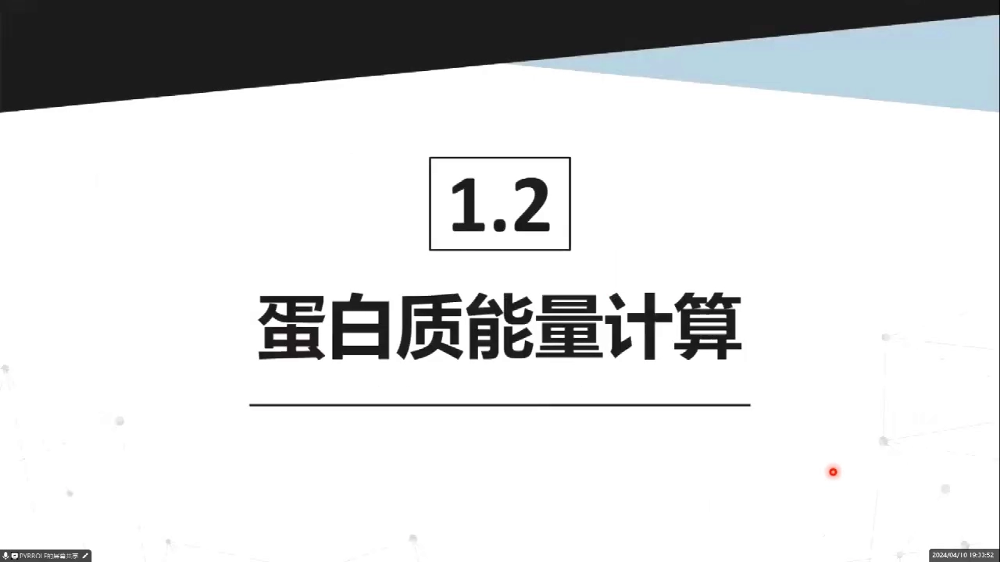 |
| 蛋白质可视化与编辑常用方法。可视化的话 PyMOL、ChimeraX 还有 VMD，可能大家都比较……PyMOL 可能应该是大家听过最多的。然后 ChimeraX，我个人是觉得它画的图比 PyMOL 好看一点。然后 VMD 的话，它是专门就是如果你跑分子动力学模拟的话…… [【跳转到 33:56】](https://www.bilibili.com/video/BV1mkdwBoE6Z/?t=2036) | 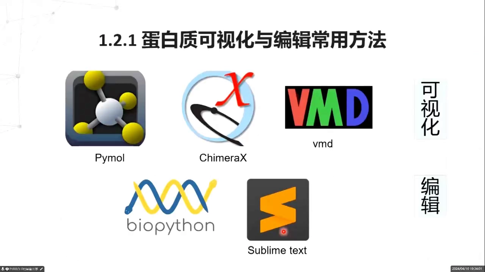 |
| 你一般会用这个 VMD 可视化一下轨迹。当然如果你跟分子动力学模拟一点也不沾边，其实你可以不下这个软件，用前面两个就够了。然后编辑的话，我们编辑主要是编辑的蛋白质结构，也就是编辑 PDB 文件。那么有一个 Python 的库叫 BioPython，大家可以自己上网查一下怎么下载，它就是可以对蛋白质…… [【跳转到 34:21】](https://www.bilibili.com/video/BV1mkdwBoE6Z/?t=2061) |  |
| 包括比如说什么改个原子坐标啊、加了原子、删了原子，然后就是它也是灵活性比较强的。但有时候就是这个 BioPython，它这个体系比较庞大，它算起来有点慢。我们可以直接用文本处理。那么文本处理的话，一方面你是可以用 Python 结合 TXT，然后另一方面就是我觉得从个人角度看观感比较好的话，是这个 Sublime Text 这个软件。 [【跳转到 34:46】](https://www.bilibili.com/video/BV1mkdwBoE6Z/?t=2086) |  |
| 它有一种让你在做科研的感觉，就是比较好看。 [【跳转到 35:11】](https://www.bilibili.com/video/BV1mkdwBoE6Z/?t=2111) |  |
| 接下来就是说一说我们的蛋白质能量计算相关的东西。我们主要是从分子力学和溶剂化能两个角度来说。第一部分是分子力学公式的形式，第二部分是溶剂化能的计算方法，第三部分就是我们计算结合自由能比较常用的 MMPBSA 还有 MMGBSA，这个 MM 就是 molecular mechanics…… [【跳转到 35:21】](https://www.bilibili.com/video/BV1mkdwBoE6Z/?t=2121) | 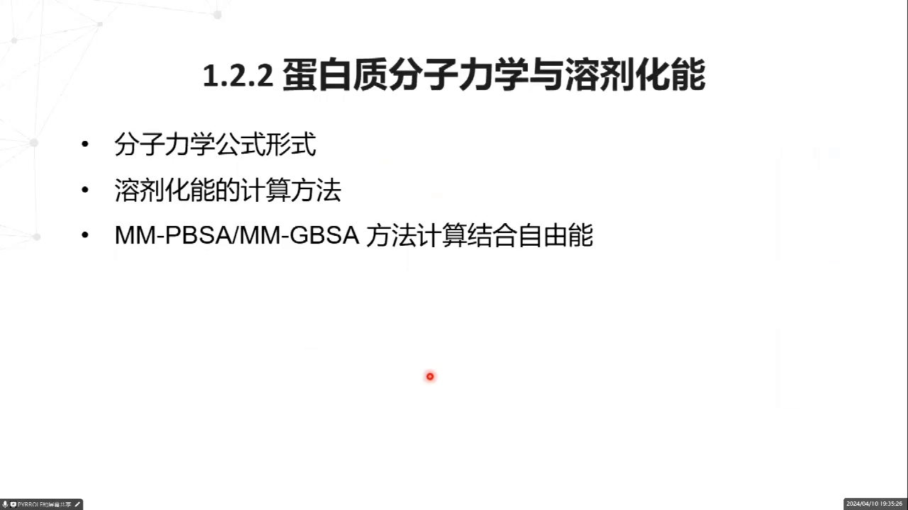 |
| 对应的就是这个分子力学。啊，PB 和 GB 是计算溶剂化能的两种方法。 [【跳转到 35:46】](https://www.bilibili.com/video/BV1mkdwBoE6Z/?t=2146) | 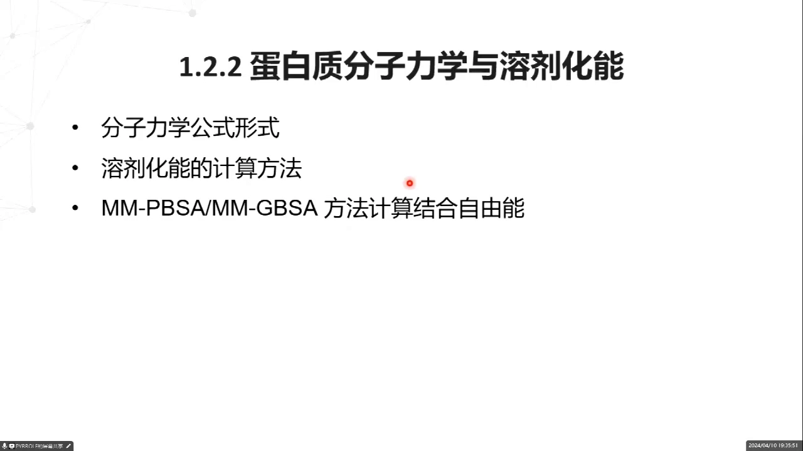 |
| 我们知道就是能量包括动能和势能。那么它如果求和、一阶导就是力的话，就是分别对应着动力学与静力学。那么我们在此不考虑蛋白的动力学性质，因为这是分子动力学模拟要做的事情，它是对整个蛋白的每个原子…… [【跳转到 35:56】](https://www.bilibili.com/video/BV1mkdwBoE6Z/?t=2156) | 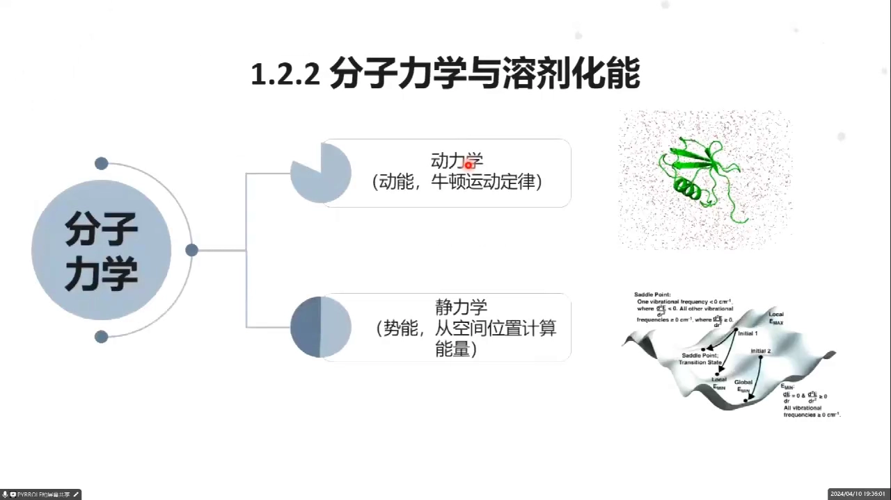 |
| 应用牛顿运动定律，然后在这个周围填充水分子，要看它这个蛋白是怎么变化的。那我们主要考虑的是静力学方面，静力学就是势能。那么势我们知道是指和空间位置相关，也就是说我们仅仅基于蛋白质的三维结构，仅仅基于它的 PDB，我们就要计算出它的能量是多少。 [【跳转到 36:21】](https://www.bilibili.com/video/BV1mkdwBoE6Z/?t=2181) | 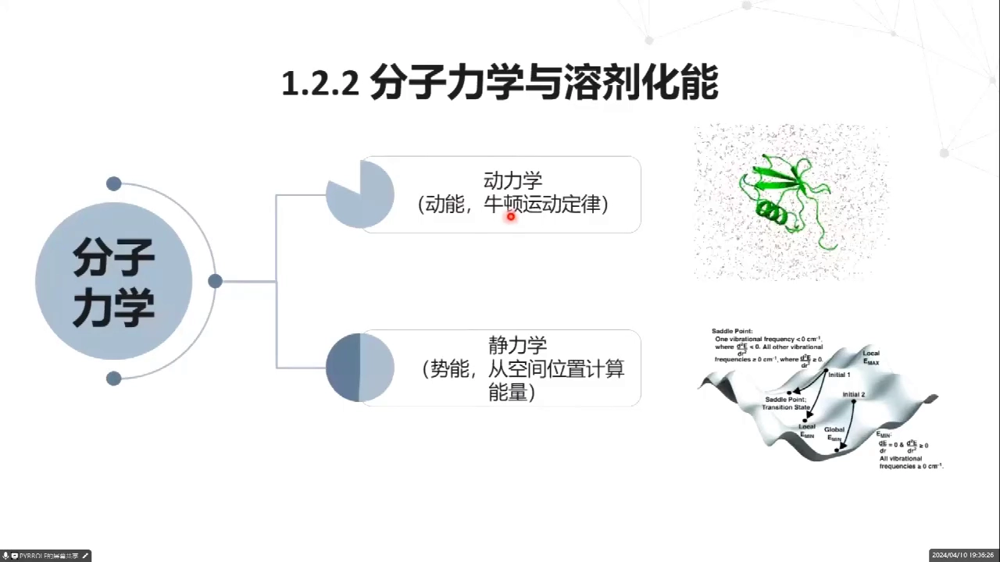 |
| 也就是说，在一个很大的势能面上，我们总希望它能量最低嘛，因为最稳定，我们就搜索一下它势能面上最低的点。这个就是我们分子力学、就是静力学、势能这一部分要关注的事情。分子力学首先说一下，它是在真空条件下对蛋白质能量的描述，所以我们只需要考虑…… [【跳转到 36:46】](https://www.bilibili.com/video/BV1mkdwBoE6Z/?t=2206) | 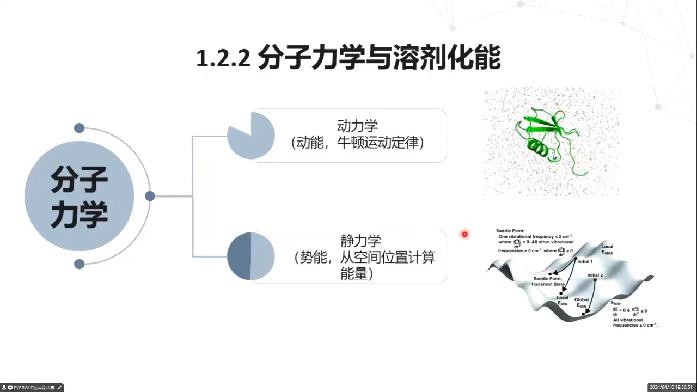 |
| 蛋白质原子之间的相互作用。我们可以把这些能量分为共价的能量和非共价的能量。那么在共价能里面，我们包括成键能量，然后角度的 bending。就是不知道大家有没有学过结构化学…… [【跳转到 37:11】](https://www.bilibili.com/video/BV1mkdwBoE6Z/?t=2231) |  |
| 就是 bond，就是成……就是原子轨道重叠能量下降的成键能量；angle 这个就是角度的弯折，我们知道因为分子在振动嘛，就是它的角度弯折；然后 dihedral 就是成键的原子，就包括我们刚刚看到的二面角，其实就是二面角。但这里的二面角是包括了所有原子的二面角，不仅仅是主链原子。 [【跳转到 37:36】](https://www.bilibili.com/video/BV1mkdwBoE6Z/?t=2256) |  |
| 那么非共价我们可以把它分为静电作用和范德华作用。然后接下来我们进一步看一下它的形式是怎么样的。首先首先是这个成键的能量，就不说了，一般是由电子能谱得出来的。那么角度这个，嗯，对振动的话，我们可以（用）这种角度的 bending…… [【跳转到 38:01】](https://www.bilibili.com/video/BV1mkdwBoE6Z/?t=2281) | 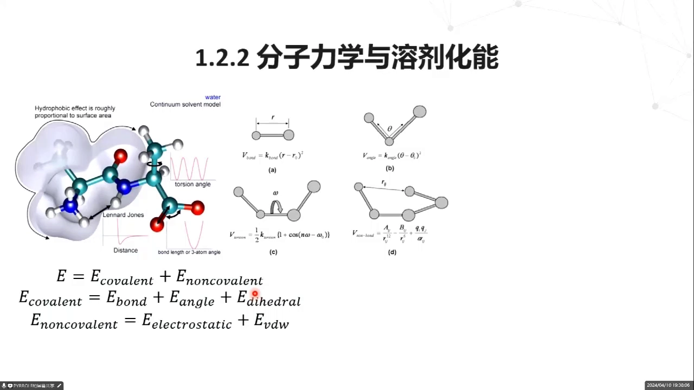 |
| 然后还有就是键的这个拉伸，拉伸和缩短。那么它们都可以用这种胡克定律的那种能量来表述，就是 R 减到平衡位置距离的平方，然后再乘一个系数。然后下面是这个二面角，二面角的话它呢是这样的一种形式，因为我们知道它是一个周期性的函数，所以用这个 cos(n·omega) 减 omega 零…… [【跳转到 38:26】](https://www.bilibili.com/video/BV1mkdwBoE6Z/?t=2306) |  |
| omega 零就是它能量最低的一个位置，然后用这样的一个函数来去拟合这个二面角的能量。那么对于非键部分来说，比如范德华的话，就是这种 6-12 定律嘛，大家如果记得物理化学的话也应该见过这个公式。然后后面这个就是静电、静电力，那么这个非键的这种能量…… [【跳转到 38:51】](https://www.bilibili.com/video/BV1mkdwBoE6Z/?t=2331) |  |
| 其实我们都可以用这种这样一个小对勾式的能量形式。然后我们的这种弯折，就是弯折啊，还有这个拉伸和缩短，这种能量都可以用这个二次函数，然后你想更精确的话用 Morse 势也可以，就是这样稍微拐过来一点。然后 torsion angle 就是我们二面角，一般都是这种周期性的函数。那么我们就想知道，既然我们要计算这个能量…… [【跳转到 39:16】](https://www.bilibili.com/video/BV1mkdwBoE6Z/?t=2356) | 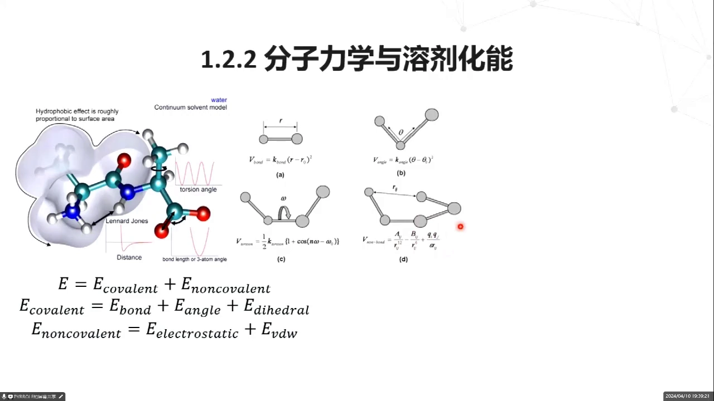 |
| 我们现在已经知道它的形式还有它的一个计算方法了。那关键就是我们要确定这些参数，就是这个 K 分别是多少呢？参数的话主要是从力场来得到的。力场的话，首先我们分子力学的力场有一个基本假设，就是 BO 近似（Born-Oppenheimer 近似）…… [【跳转到 39:41】](https://www.bilibili.com/video/BV1mkdwBoE6Z/?t=2381) |  |
| 就是说我们不考虑原子核的运动，只把原子核比较固定，然后只是电子的，我们只考虑电子的运动。然后第二个就是势能面可以拆分为一些简单模式的贡献之和，因为我们知道其实能量是很难表述的，我们只是把它拆解出了一些比较主要的成分，类似于一种低阶的泰勒展开。第三个就是可转移性。 [【跳转到 40:06】](https://www.bilibili.com/video/BV1mkdwBoE6Z/?t=2406) | 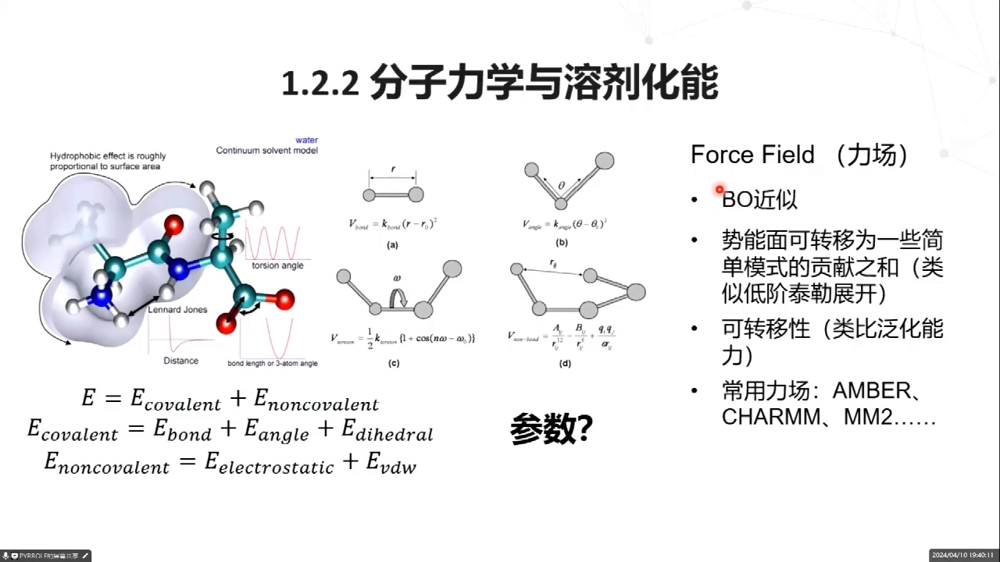 |
| 我们可以类比机器学习里面的泛化能力，意思就是说我在这一个蛋白上用的这个参数，我在另一个蛋白也得用这个参数，因为它们的原子的组成还有一些它们基本性质不变的嘛。然后最后给大家说一下常用的力场，就是 AMBER、CHARMM 还有 GROMOS。 [【跳转到 40:31】](https://www.bilibili.com/video/BV1mkdwBoE6Z/?t=2431) | 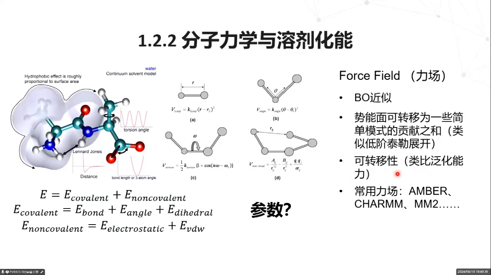 |
| 嗯，我们知道，就是我们刚刚说就是蛋白在真空里可以那样计算它的能量，但实际上我们蛋白是在溶液里的，蛋白质与水分子的相互作用也是不容忽视的。比如说我们在 PDB 里面下载一个蛋白，经常会看到旁边有些……是什么？好多好小的线啊，好乱，但实际上它们都是水分子，就是这种水分子嘛，蛋白溶剂化之后就是在溶液里面。 [【跳转到 40:48】](https://www.bilibili.com/video/BV1mkdwBoE6Z/?t=2448) |  |
| 然后我们用一个亲水或疏水的一个 surface，这是用 ChimeraX 画的图。我们用这种 surface 来看的话，黄色就是疏水，蓝色就是亲水，白色是中性。我们可以看到和溶液接触的部分大部分其实是蓝色，也就是亲水的。那么这些黄色它们也非常集中，说明是有一些疏水的痕迹，它们叠在一起了。那么我们如何计算这个溶剂化能呢？ [【跳转到 41:13】](https://www.bilibili.com/video/BV1mkdwBoE6Z/?t=2473) | 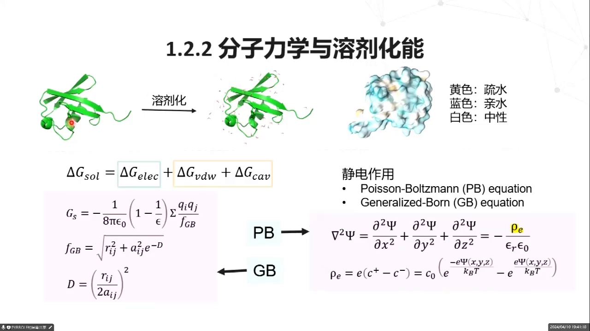 |
| 溶剂化能也是我们拆成两部分来看。第一部分是这个静电能量，也就是说我们蛋白跟溶液的一个静电相互作用。第二个就是非静电的相互作用，包括范德华力，因为范德华力是一个无处不存在的力；第二个就是 cavity，这个后面具体的含义我后面会说。那么静电作用我们有两种方程来计算。 [【跳转到 41:38】](https://www.bilibili.com/video/BV1mkdwBoE6Z/?t=2498) |  |
| 第一种叫 Poisson-Boltzmann equation，就是泊松-波尔兹曼方程。这个方程具体的推导……不是物理课，就是大家看一下就行。那么它本质上是求解一个二阶微分方程。然后我们用……这个是泊松方程，然后波尔兹曼的话我们用这个电子密度…… [【跳转到 42:03】](https://www.bilibili.com/video/BV1mkdwBoE6Z/?t=2523) |  |
| 电子的密度其实就跟它这个离子浓度是相关的嘛，然后这个就是波尔兹曼方程的形式。我们把这个式子带到上面，我们就可以去求解这个 psi，也就是静电势，它具体是怎么样的。然后第二个就是 GB 方程，GB 方程它的形式是这样的。就是如果你想理解二者的区别的话，简单来说…… [【跳转到 42:28】](https://www.bilibili.com/video/BV1mkdwBoE6Z/?t=2548) |  |
| 简单来说，GB 它是 PB 的一种低阶展开，所以我们在计算的时候，如果你想算得快一点，可以用 GB 的方法；然后如果你想算得更精确一点，就用 PB 的方法。接下来是非静电的相互作用。我们刚刚说范德华的话，范德华力其实就是…… [【跳转到 42:53】](https://www.bilibili.com/video/BV1mkdwBoE6Z/?t=2573) |  |
| 任何原子都会有嘛，有排斥有吸引。然后这个 cavity 的意思呢，就是说我们在接触的过程中，你把一个蛋白放到水里面，它会排出一部分水，那么这一部分水，你破坏了它们之间的相互作用，那你这部分能量怎么算呢？就是包含在这一项里。那么这两项它们很难拆开来说具体的解析表达是什么样的。 [【跳转到 43:18】](https://www.bilibili.com/video/BV1mkdwBoE6Z/?t=2598) |  |
| 但是我们可以用一个经验性的公式来拟合，就是这个 gamma 乘上 SASA 加上 b，gamma 是一个系数，b 也是个系数，是通过拟合这个实验数据得到的。那 SASA 就是溶剂可及表面积，就是 solvent accessible surface area。那它是怎么算的呢？我们可以……比如说这三个红色的…… [【跳转到 43:43】](https://www.bilibili.com/video/BV1mkdwBoE6Z/?t=2623) |  |
| 是我们蛋白质的表面，类似于蛋白质的表面。然后我们拿一个小球，然后这个小球的半径就是水的半径……水的体积……就是这不就水的半径。然后我们拿它这样哎刮一下、扫一下，然后我们算出来的这个面积就是 SASA。 [【跳转到 44:08】](https://www.bilibili.com/video/BV1mkdwBoE6Z/?t=2648) | 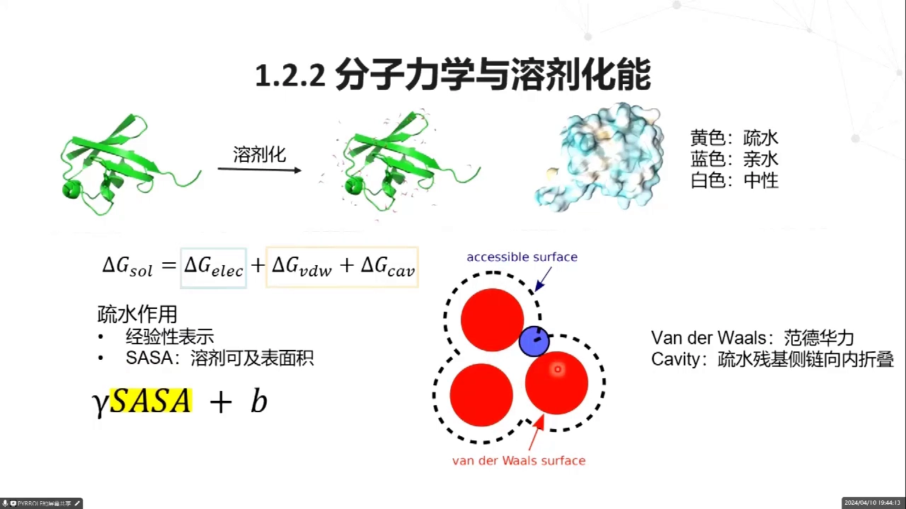 |
| 那么经过这样的拟合公式，我们就可以把它带进去，然后我们就可以算上溶剂化能。 [【跳转到 44:29】](https://www.bilibili.com/video/BV1mkdwBoE6Z/?t=2669) | 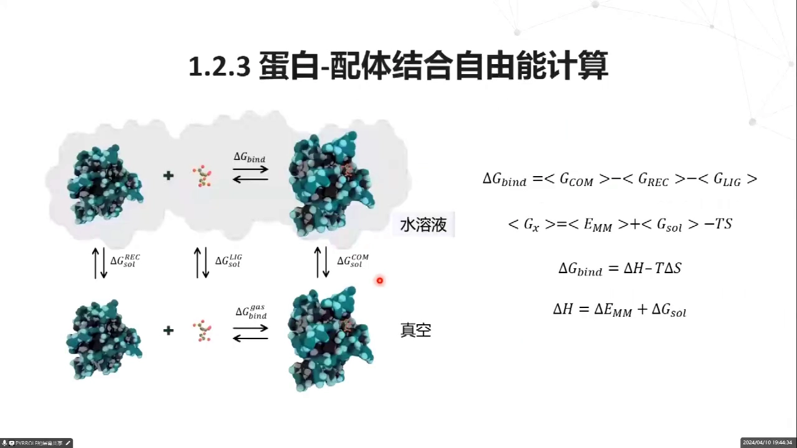 |
| 然后接下来，跟我们刚刚讲到了就是分子力学还有溶剂化，那我们怎么样把它给结合起来呢？ [【跳转到 44:34】](https://www.bilibili.com/video/BV1mkdwBoE6Z/?t=2674) |  |
| 我们可以构造一个波恩-哈伯循环。首先这个灰色、灰色的其实是代表水溶液，然后下面这个就是真空。我们在真空里面把一个蛋白加上小分子结合了之后，我们可以通过分子力学计算它的 delta G gas，就是 delta G gas 相。那么我们分别计算它们的溶剂化能，然后我们就可以得到了…… [【跳转到 44:39】](https://www.bilibili.com/video/BV1mkdwBoE6Z/?t=2679) |  |
| 它在水溶液中的一个自由能变化，这个计算的方法就是我们……大家我看很多人 struggling with，就是非常痛苦下载那个 gmx_MMPBSA，它后面的一个原理就是这样的。我们如果从公式上来看的话，就是其实 delta G 的定义就是产物减反应物，然后它每一个都可以代表……都可以表示成就是…… [【跳转到 45:04】](https://www.bilibili.com/video/BV1mkdwBoE6Z/?t=2704) |  |
| 分子力学加上溶剂化能，再减掉一个熵的效应。那么熵的效应……它因为也是比较物理的部分，那这个熵的能它是怎么算的？其实它是做一个正交模式分解，就是看你这个蛋白它什么样的振动模式是占优势的，然后通过这个模式的具体的结构去计算它的熵。那么我们其实在算的时候并不会带这一项。 [【跳转到 45:29】](https://www.bilibili.com/video/BV1mkdwBoE6Z/?t=2729) | 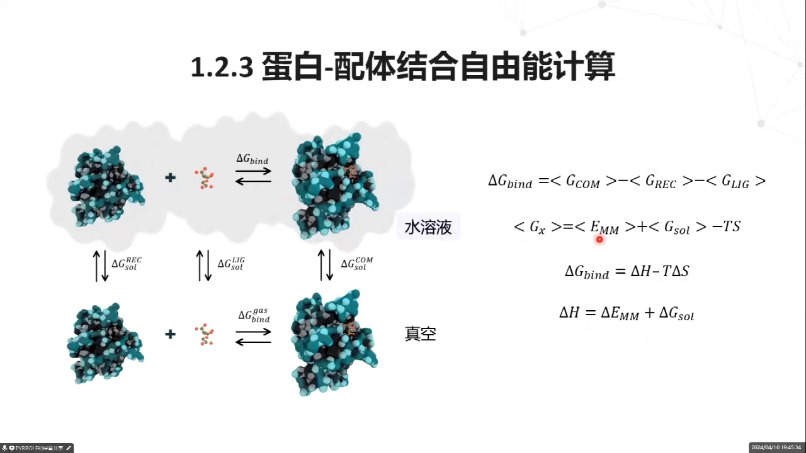 |
| 因为算得不准。对，所以我们一般得到的都是 delta G 的这一项。 [【跳转到 45:54】](https://www.bilibili.com/video/BV1mkdwBoE6Z/?t=2754) |  |
| 然后接下来就是得跟大家说的这个软件，然后右边是它的一个流程图。那它的流程主要就是先处理你的轨迹或者是这个结构，那么它其实一般是输入一个 XTC 文件，因为 gmx 嘛，它是对应的 GROMACS 的一个轨迹文件，叫 XTC。其实如果我们没有的话也没关系。下面的话是先处理这个拓扑，然后这个 parmed 就是要把我们输入的结构…… [【跳转到 46:02】](https://www.bilibili.com/video/BV1mkdwBoE6Z/?t=2762) |  |
| 把它转化成一个 AMBER 的拓扑形式。AMBER 就是我刚刚说的一种常用的力场。然后接下来就是他的一个计算的步骤，就是我刚刚说的，然后最后会输出一个 result，会输出一个就是每一个残基它在结合中的贡献。啊，这一部分大家还有什么问题吗？ [【跳转到 46:27】](https://www.bilibili.com/video/BV1mkdwBoE6Z/?t=2787) | 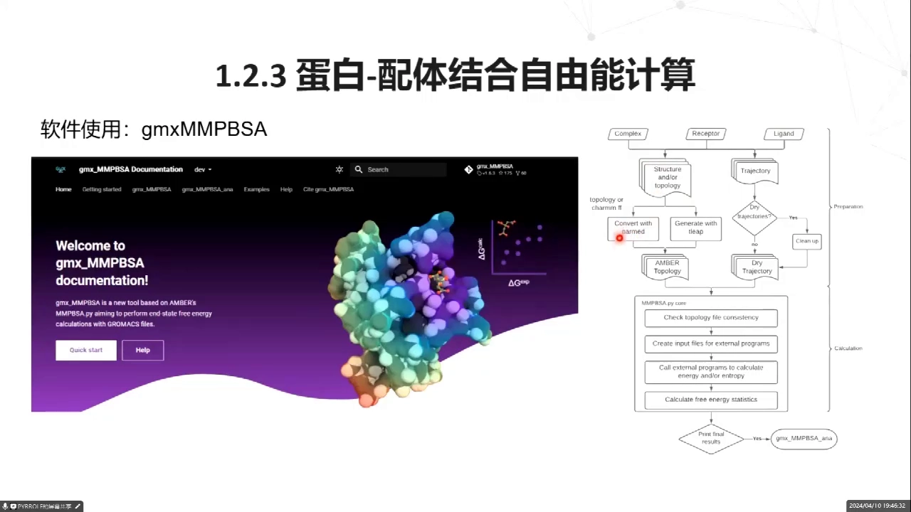 |
| 哦是的，是的，S 是要用态密度的，对，是不知道的。所以说我们一般不会算这个，但是 gmx_MMPBSA 它有这个方法，但是它的 document，就是它的这个说明文档里说不建议算。对，其实熵变的话…… [【跳转到 46:52】](https://www.bilibili.com/video/BV1mkdwBoE6Z/?t=2812) |  |
| 如果是两个比较稳定的蛋白，你看着就知道它们不会有特别明显的影响。但是如果是比如说你是一个多肽的配体，你不知道它的二级结构是 helix 还是一段 loop，那你就需要单独在水溶液里面跑一个你配体的 MD，来看它是否稳定。对，这样才能保证……这才能帮你判断你需不需要考虑它的熵效应。 [【跳转到 47:17】](https://www.bilibili.com/video/BV1mkdwBoE6Z/?t=2837) |  |
| 这个我也不太清楚了，我也不是学这个的。你可以，如果你是对这个软件感兴趣的话，你可以直接去 GitHub 上问他的开发者；然后如果你是对这个理论感兴趣的话，你可以搜一搜相关的书籍或者文献。大家还有其他问题吗？ [【跳转到 47:42】](https://www.bilibili.com/video/BV1mkdwBoE6Z/?t=2862) |  |
| 如果没有的话，我们就进入下一部分。下一部分就是基于统计势函数的蛋白质设计。 [【跳转到 48:07】](https://www.bilibili.com/video/BV1mkdwBoE6Z/?t=2887) | 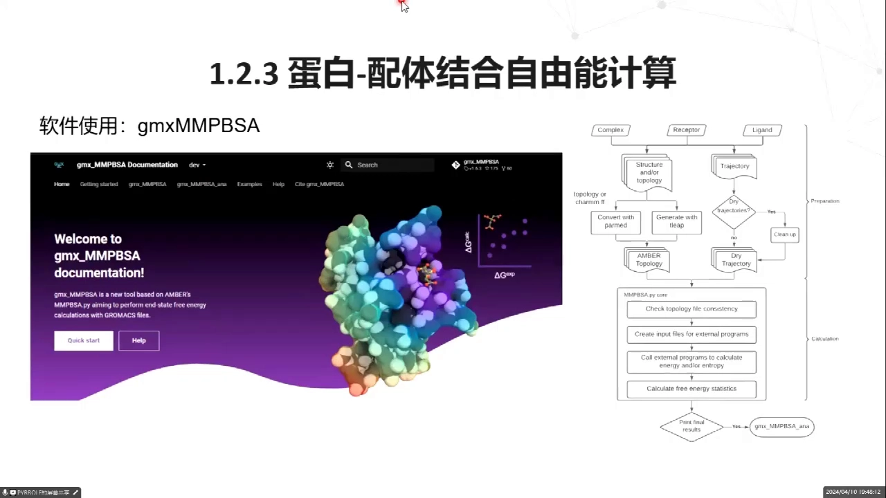 |
| 首先给大家说一下…… [【跳转到 48:12】](https://www.bilibili.com/video/BV1mkdwBoE6Z/?t=2892) | 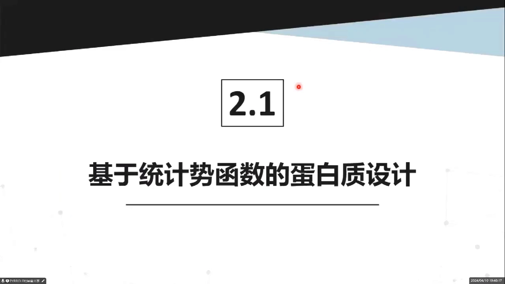 |
| 统计势函数的一个一般定义，这里有一个非常简单的公式，就是 U 等于负的 kT ln P。那么这个 P 呢，其实就是某一种状态它出现的概率。那么在蛋白质设计领域中的统计势能或基于知识的势能，是通过对蛋白质数据库中已知蛋白质结构的分析而拟合出的评分函数。 [【跳转到 48:17】](https://www.bilibili.com/video/BV1mkdwBoE6Z/?t=2897) | 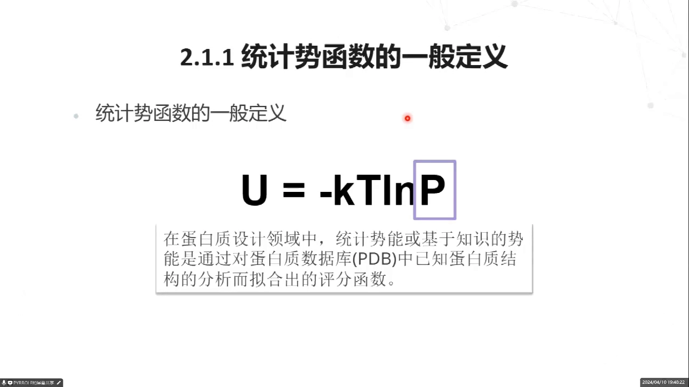 |
| 实际上就是从数据集里面来查看不同的状态下它的 P 是多少，然后从而反推它的能量。接下来我们要讲的这个 Rosetta 打分函数，是蛋白质设计中最常用也是最好用的一种打分函数。那么它是 17 年发表的文章，他的通讯作者是 David Baker。 [【跳转到 48:42】](https://www.bilibili.com/video/BV1mkdwBoE6Z/?t=2922) | 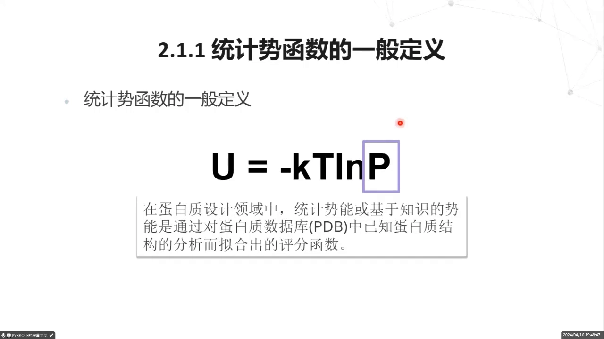 |
| 是特别著名的美国生物化学家和计算生物学家，他开创了预测和设计蛋白质三维结构的方法，比如说大家熟悉的 RosettaFold。他现在就职于华盛顿大学。 [【跳转到 49:06】](https://www.bilibili.com/video/BV1mkdwBoE6Z/?t=2946) | 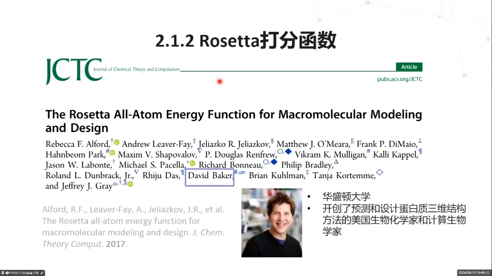 |
| 然后我们就先到这里，然后休息 10 分钟。啊，好的。他发表了很多蛋白质从头设计（的工作），他要把这个领域给霸占了。 [【跳转到 49:19】](https://www.bilibili.com/video/BV1mkdwBoE6Z/?t=2959) | 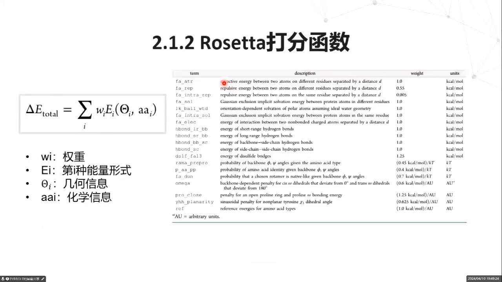 |
| （此区间无字幕） [【跳转到 49:44】](https://www.bilibili.com/video/BV1mkdwBoE6Z/?t=2984) | 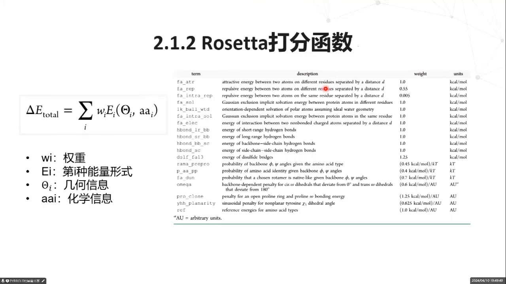 |
| （此区间无字幕） [【跳转到 49:49】](https://www.bilibili.com/video/BV1mkdwBoE6Z/?t=2989) |  |
| （此区间无字幕） [【跳转到 49:54】](https://www.bilibili.com/video/BV1mkdwBoE6Z/?t=2994) | 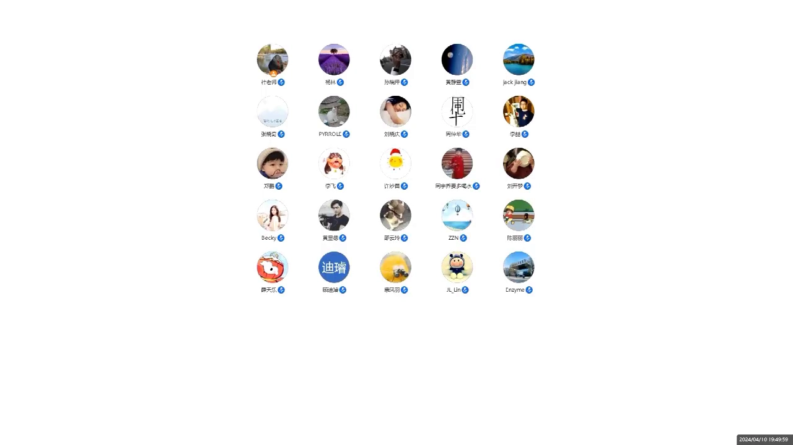 |
| （此区间无字幕） [【跳转到 50:03】](https://www.bilibili.com/video/BV1mkdwBoE6Z/?t=3003) | 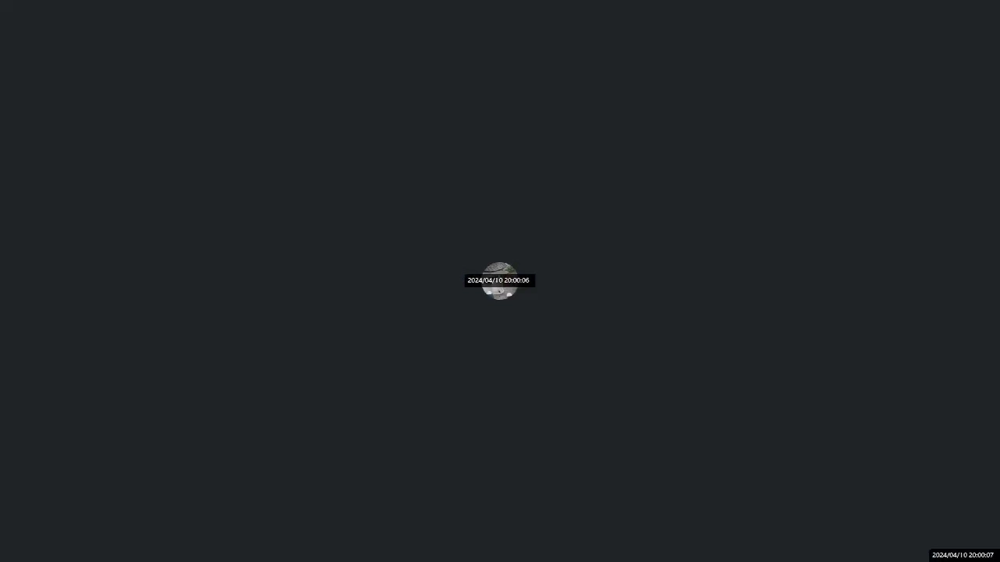 |
| 好，大家能听到我说话吗？好的。 [【跳转到 50:08】](https://www.bilibili.com/video/BV1mkdwBoE6Z/?t=3008) |  |
| 好，哦，我问一下，就是有谁下不到我今天讲的文献吗？就是没有权限下载。如果有的话，我把这三篇文献发到群里。OK，行，大家都能……哦行，那我一会儿下课的时候发一下。 [【跳转到 50:33】](https://www.bilibili.com/video/BV1mkdwBoE6Z/?t=3033) | 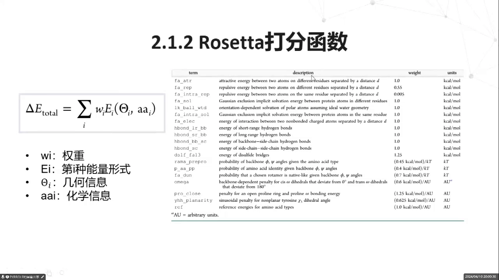 |
| 好，我们现在继续来讲 Rosetta 打分函数。嗯，首先它有一个比较整体的形式，就是这个 delta E total，然后是一些权重 w_i 乘上 E_i。然后这里面有两个符号，那么它……我们整体看它的意思。首先左边它的意义是……为什么是 delta E total 呢？看…… [【跳转到 50:58】](https://www.bilibili.com/video/BV1mkdwBoE6Z/?t=3058) | 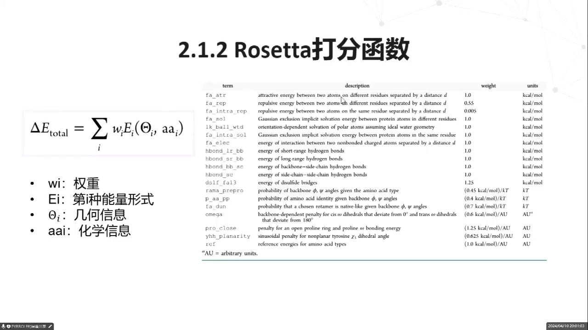 |
| 你肯定是说有一个能量的基准，然后一个能量的零点，然后我们现在给定了一个 PDB 结构，给定了一个三维空间结构，然后我们来算它的这个能量。然后这个能量呢，它是这个 i，这个 i 就是每一个氨基酸的意思，那么 i 就是从一到它的最后一个氨基酸，那么每一个氨基酸的能量…… [【跳转到 51:23】](https://www.bilibili.com/video/BV1mkdwBoE6Z/?t=3083) | 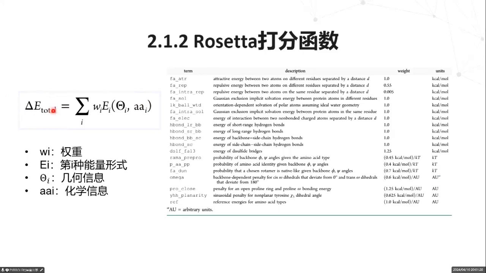 |
| 它自己有一个分配的……对对，不好意思，不好意思，这个 i 不是那个 i，不是氨基酸，实际上是一种能量形式，就是我们右边列举出来的这些地方都是一种能量形式。那么这个能量，每一种能量呢，它是和我们所研究的氨基酸…… [【跳转到 51:48】](https://www.bilibili.com/video/BV1mkdwBoE6Z/?t=3108) | 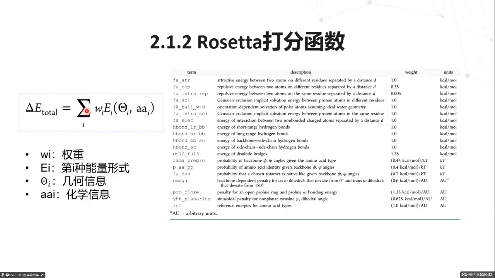 |
| 或者是几个原子、几个原子残基，它的几何信息以及它的化学信息相关的。那么右边这张表，详细的话我后面会说。那么整体看这张表，我有一个想说的点，就是这个 unit。我们知道就是…… [【跳转到 52:13】](https://www.bilibili.com/video/BV1mkdwBoE6Z/?t=3133) | 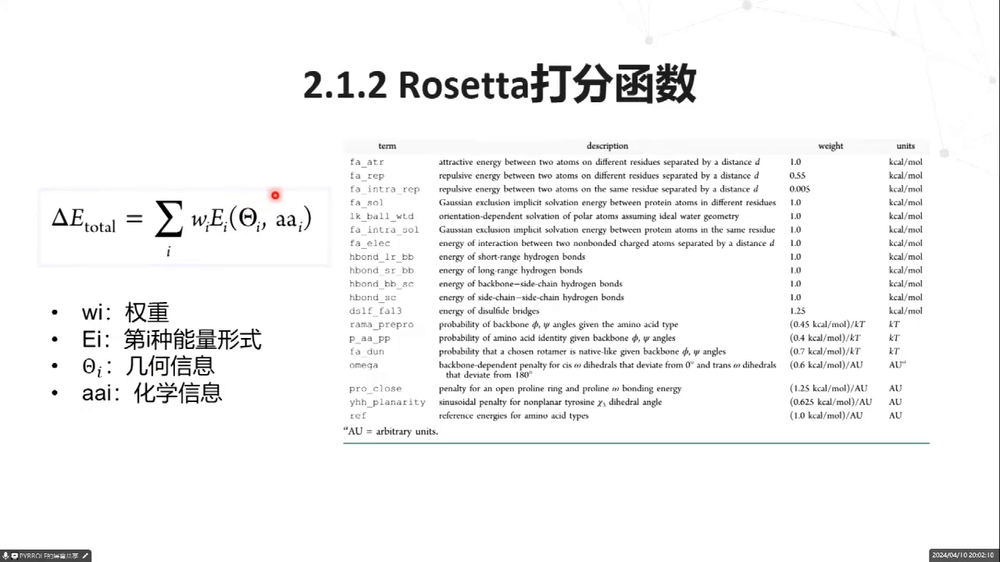 |
| 因为我们刚刚所说的参数化方法，它不一定能对应到我们实际的实验中。那么根据就是 Rosetta 它开发这么多年来它的一个不停的调整和优化，现在在前面这些项、前面这些像输出的能量，基本上都和千卡每摩尔可以有一个一一对应的关系。那么像后面这几项，omega 就是这些跟角度相关的东西，不太好用…… [【跳转到 52:38】](https://www.bilibili.com/video/BV1mkdwBoE6Z/?t=3158) | 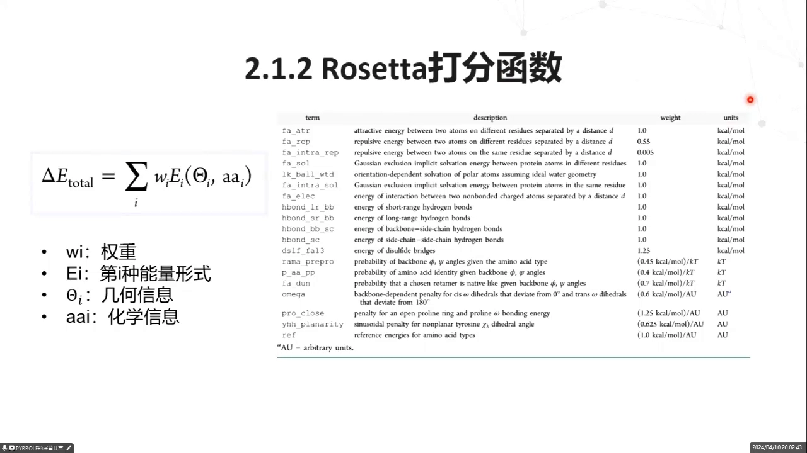 |
| 实验量化的能量项来说，它的 unit 就是一个任意的单位。所以说大家一定要注意，在实际使用的过程中要注意它后面这个单位。weight 就是前面对应的这个地方。啊，这个表也是很重要的，后面大家做蛋白质设计的时候…… [【跳转到 53:03】](https://www.bilibili.com/video/BV1mkdwBoE6Z/?t=3183) | 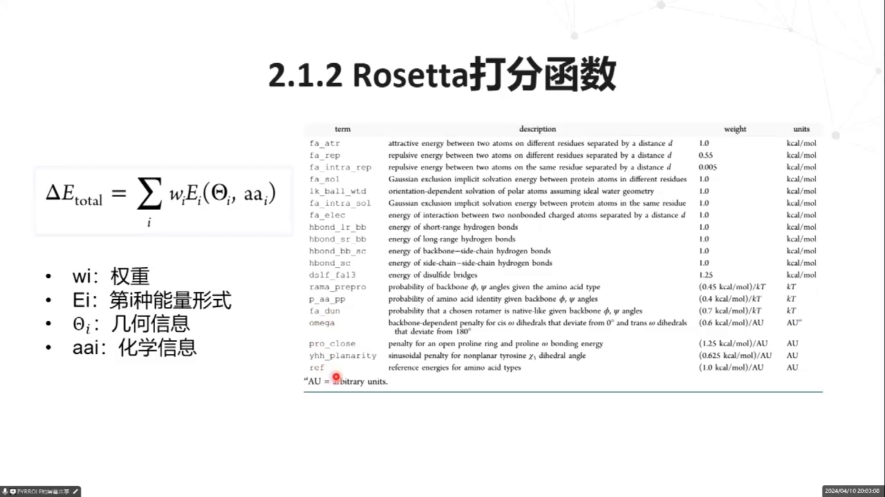 |
| 他会输出一个分数的情况，不要看到这些乱七八糟的字母就抓瞎，然后一定要反过来看看它对应的是哪些能量。接下来我就是按不同的能量类型给大家讲一下。首先第一个层级是原子、原子对之间的力。第一个就是范德华力，van der Waals。 [【跳转到 53:28】](https://www.bilibili.com/video/BV1mkdwBoE6Z/?t=3208) | 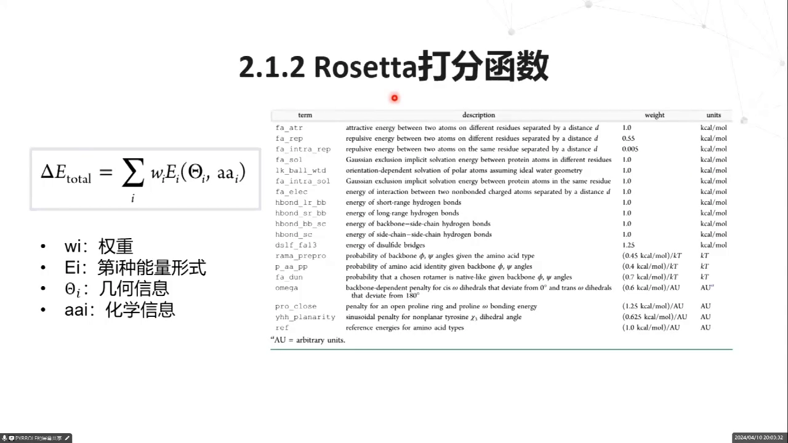 |
| 它的表示方式还是我们经典的 6-12 定律，就是 Lennard-Jones。sigma 就是两个原子它的半径之和，D 是原子间的距离，epsilon 是势阱深度的平均值。因为我们知道这个函数它实际上就是这样一个对勾嘛，势阱深度就是最低的点它对应的能量。那么 epsilon 和 D 它们都是来自实验数据来拟合的。 [【跳转到 53:53】](https://www.bilibili.com/video/BV1mkdwBoE6Z/?t=3233) |  |
| 然后如果大家还记得物理化学的话，就是经常有些气体实验，我们可以从那些地方来拟合出 epsilon 和 D 的值。那么我们通常说的 Lennard-Jones，或者说范德华力，我们说它近距离排斥，然后在相等……在一定地方有吸引，然后再远的话就几乎没有作用了。那么在 Rosetta 里面…… [【跳转到 54:18】](https://www.bilibili.com/video/BV1mkdwBoE6Z/?t=3258) | 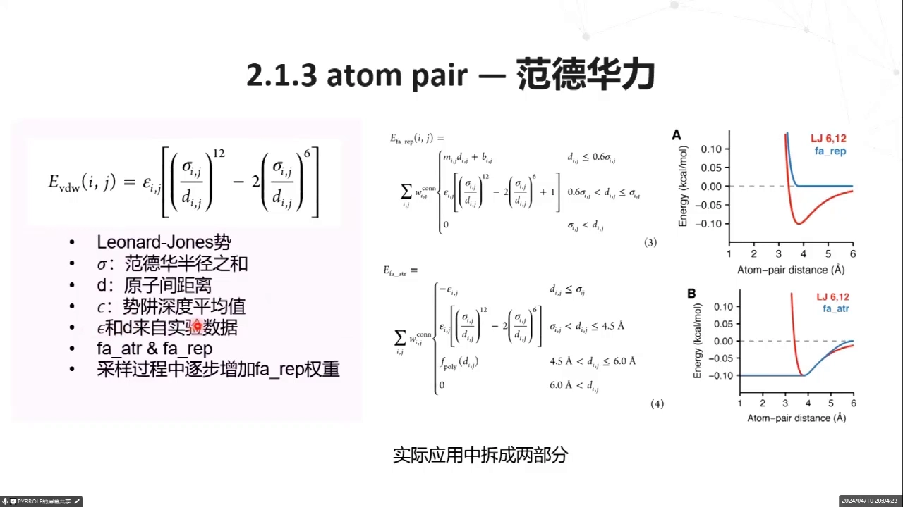 |
| 它为了方便我们在设计过程中进行一些细微的调整，它把这个函数截成了两个部分，fa_atr 和 fa_rep，分别是 attractive、attraction 和 repulsion 的缩写。那么它是怎么裁的呢？对于 repulsion 来说，因为在这个地方它的这个斜率实在是太大了，就是它在距离比较近的时候…… [【跳转到 54:43】](https://www.bilibili.com/video/BV1mkdwBoE6Z/?t=3283) |  |
| 非常陡峭，那么你在搜索最低点的时候会带来一些梯度爆炸的问题，所以他把这个拆成了两部分。它的一个截断值就是 0.6 倍的范德华半径之和，然后还有……就到这个范德华半径之和，然后那么当它大于范德华半径之和的时候，就认为这个排斥的能量就是零了。然后前面的话用了一个比较温和的函数形式。 [【跳转到 55:08】](https://www.bilibili.com/video/BV1mkdwBoE6Z/?t=3308) |  |
| 然后在非常近的时候就是一个线性的。然后对于吸引项的话，它也是拆成了两部分，那么截断值我就不念了，就是这里面显示的这几个。那么这个意思就是说，也是在距离……在这样的距离范围内，它的 attract，它的这个吸引值都是这个它的这个势阱值。 [【跳转到 55:33】](https://www.bilibili.com/video/BV1mkdwBoE6Z/?t=3333) |  |
| 然后在非常远的时候它的这个吸引就是零。然后中间的话……至于为什么要用这种函数的具体形式，它都是用幂函数，那具体的形式它的目的，是要让这个函数平滑地到达零点、平滑到达零点，这样我们在求导数的时候它也是连续的。然后并且我们知道，力，它对距离的导数就是…… [【跳转到 55:58】](https://www.bilibili.com/video/BV1mkdwBoE6Z/?t=3358) |  |
| 势能对距离的导数就是力，所以这样的话也保证了我们的力是连续的，也和实际的物理过程相符。那么在通常我们 Rosetta 采样过程中，比如说我们在进行能量最小化的时候，它会逐步增加这个 repulsion 的权重，逐步增加这个排斥的权重，这样是为了防止过度紧凑的构象，来保持结构的完整性。 [【跳转到 56:23】](https://www.bilibili.com/video/BV1mkdwBoE6Z/?t=3383) | 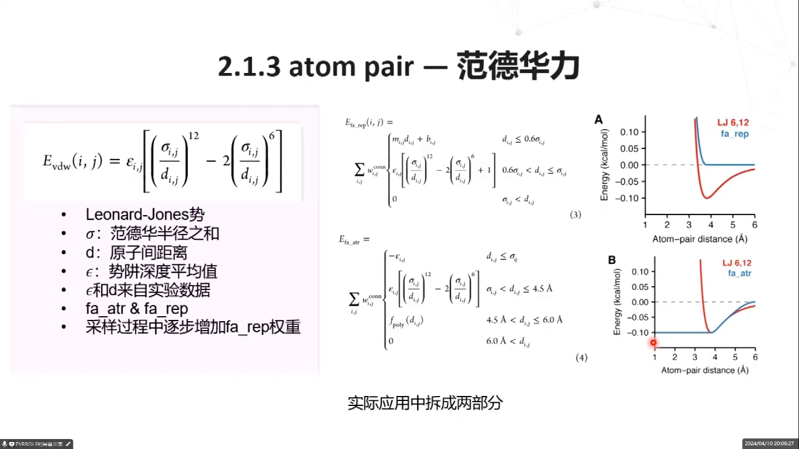 |
| 来避免能量陷阱。这个话我们明天会带大家、对，带大家做一下这个 relax 过程。接下来是静电力，静电力也是非常经典的这个能量形式。那么需要关注的是，对于我们蛋白质来说…… [【跳转到 56:48】](https://www.bilibili.com/video/BV1mkdwBoE6Z/?t=3408) |  |
| 它的介电常数并不是不变的。它的疏水核心介电常数，是因为很疏水，它介电常数一般是低的，然后到表面它和溶剂接触，它就又逐步增大。所以说我们在实际……在它的函数中，它的这个介电常数是从 6 到 80 逐渐增大的，然后并且它只考虑四埃以内的静电相互作用。 [【跳转到 57:13】](https://www.bilibili.com/video/BV1mkdwBoE6Z/?t=3433) | 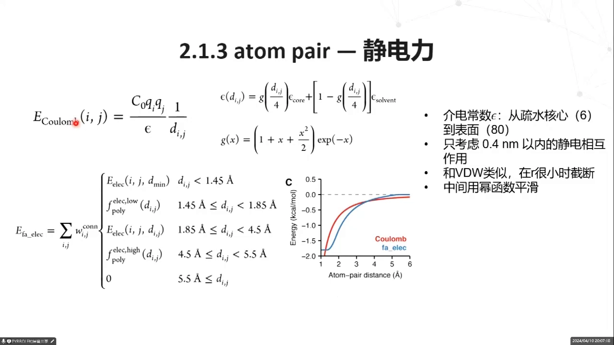 |
| 然后，那么也是和刚刚的范德华力类似，它是在 R 很小的时候做一个截断，防止这个斜率太大导致梯度爆炸，然后中间也是用一个幂函数平滑。幂函数的参数就是满足导数连续，就是这样的一个条件。下面是溶剂化能。 [【跳转到 57:38】](https://www.bilibili.com/video/BV1mkdwBoE6Z/?t=3458) | 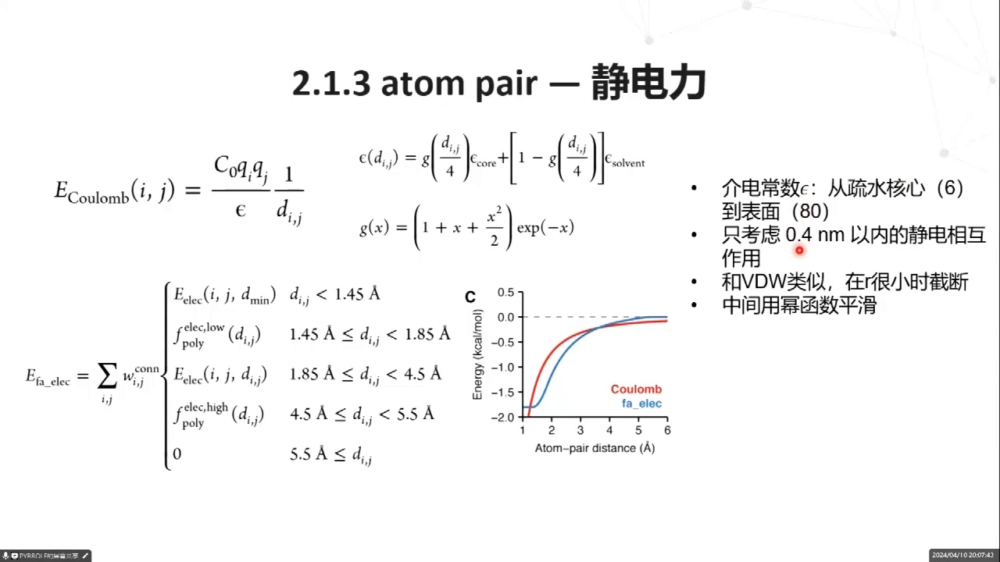 |
| 溶剂化能，它主要是考虑了两种能量形式，一种叫 FASol，另一种叫 LKBWTD。一般 WTD 的意思都是 weighted，就是取了权重；然后这里的 LK 就是说它使用了一个模型叫做 LK 这个名字，然后是隐式的一个高斯的排斥模型。 [【跳转到 58:03】](https://www.bilibili.com/video/BV1mkdwBoE6Z/?t=3483) | 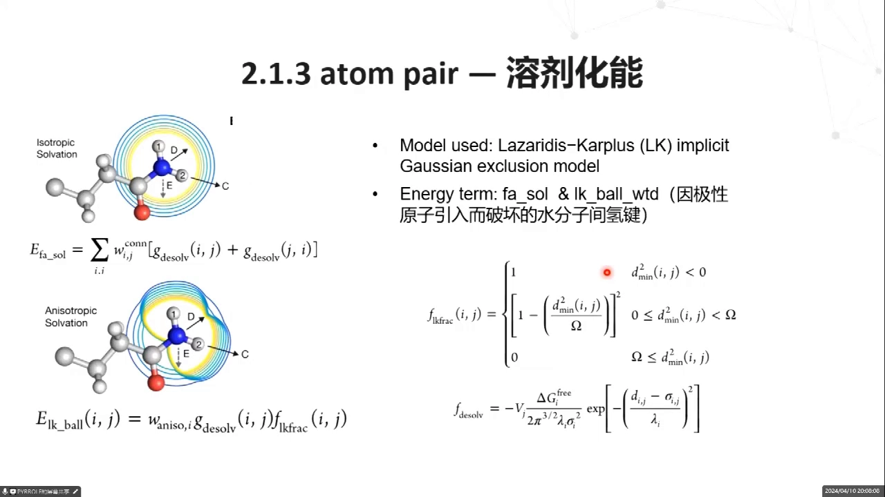 |
| 演示的就是说，并不会把水分子看成一个氧原子、两个氢原子，而是用能量来代替这个溶剂对蛋白的影响。那么在这个里面呢，在第一项 FASol 里面，其实就是比较常规的…… [【跳转到 58:28】](https://www.bilibili.com/video/BV1mkdwBoE6Z/?t=3508) | 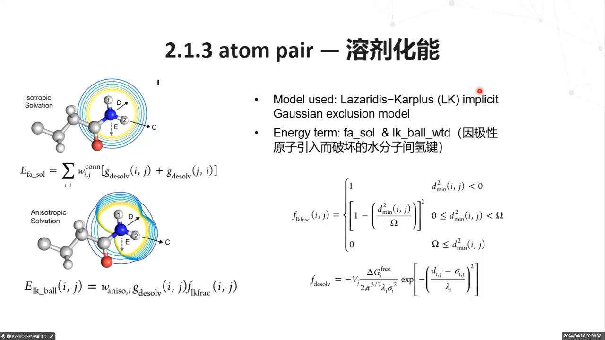 |
| 就是比如说非极性作用，非极性的一些原子跟周围溶剂的一些相互作用。那么在这个里面，它主要考虑的是非极性原子；那么在这一项里面，它主要考虑的是极性原子。那么这个极性原子，我刚刚说了，把蛋白从真空拿到水里的时候，极性原子引入会破坏一些水分子之间的氢键。 [【跳转到 58:53】](https://www.bilibili.com/video/BV1mkdwBoE6Z/?t=3533) | 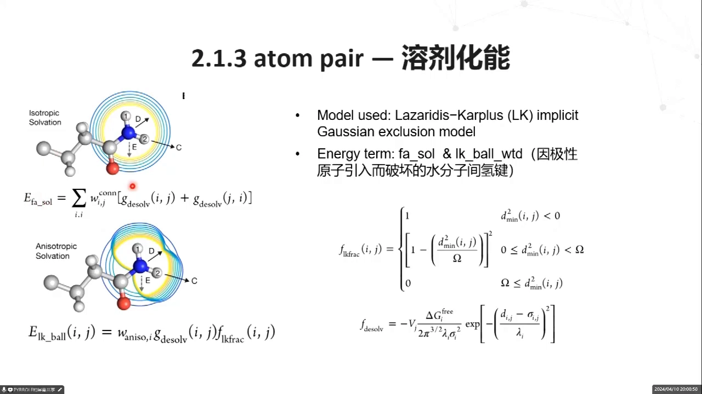 |
| 那么这一部分能量的损失就会用下面这个公式的形式来表达。因为我们并不是做物理的，我们也不做这个力场，所以大家只需要知道这些能量的物理意义是什么就可以了。然后我把这些公式放上来，也是希望如果有感兴趣的同学可以自己再钻研一下。然后它也是分了这么多段，这么多段也是为了防止梯度爆炸，二是为了把就是远端到近端…… [【跳转到 59:18】](https://www.bilibili.com/video/BV1mkdwBoE6Z/?t=3558) | 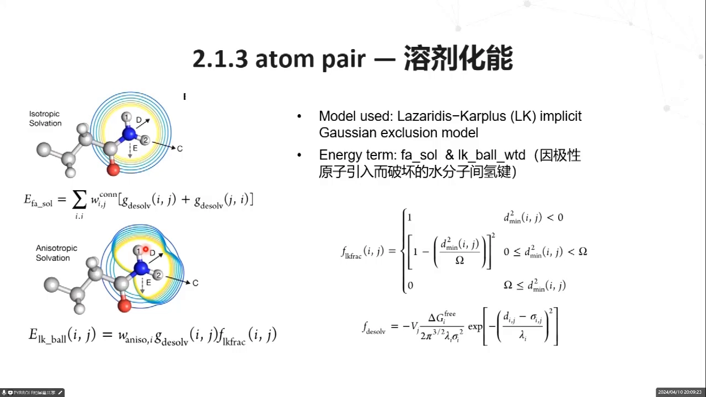 |
| 这个能量形式、这个函数形式给变得连续。接下来就是非常重要的，就是氢键。氢键是要详细讲一下的。我们就是在 IUPAC，也就是国际纯粹与应用化学联合会，它关于氢键与结构相关的定义。 [【跳转到 59:43】](https://www.bilibili.com/video/BV1mkdwBoE6Z/?t=3583) | 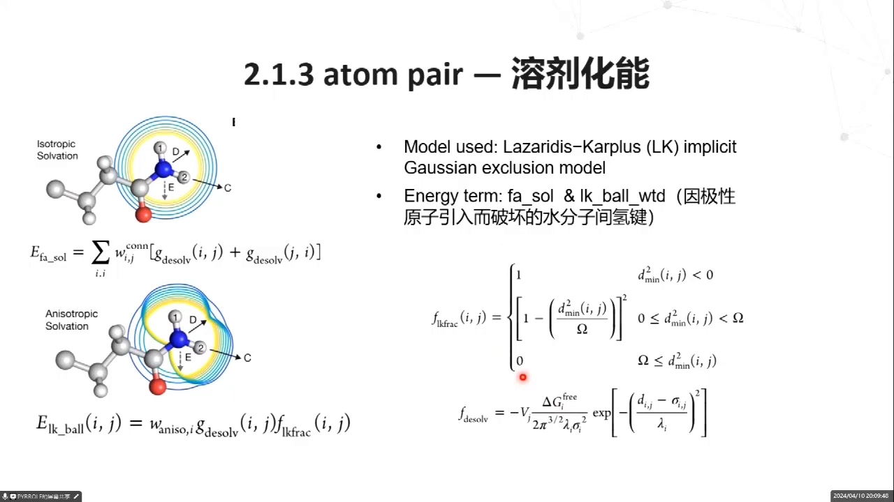 |
| 它有很多方面的定义，比如说结构、红外光谱、紫外光谱这些。那么那些光谱我们不考虑，我们只考虑结构。它是从距离和角度两方面来限定，说什么样叫氢键。但是在蛋白质设计中，也就是说我们之所以要使用 Rosetta 的打分函数，它充分考虑了蛋白质的一些性质，它在距离和角度的…… [【跳转到 60:08】](https://www.bilibili.com/video/BV1mkdwBoE6Z/?t=3608) | 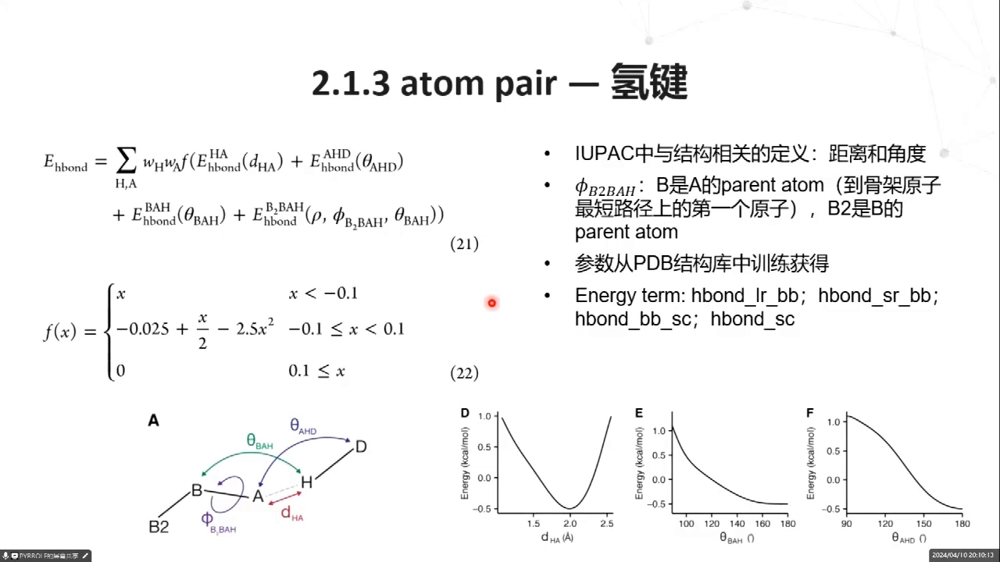 |
| 它在距离和角度的基础上增加了其他的一些项。比如说我们看，首先解释一下这里面的一些下角标都是什么意思。一个氢键，它是由一个 donor（给体），就是氢键的给体，然后 H 就是夹在中间的氢原子，A 就是一个氢键的受体 acceptor。 [【跳转到 60:33】](https://www.bilibili.com/video/BV1mkdwBoE6Z/?t=3633) | 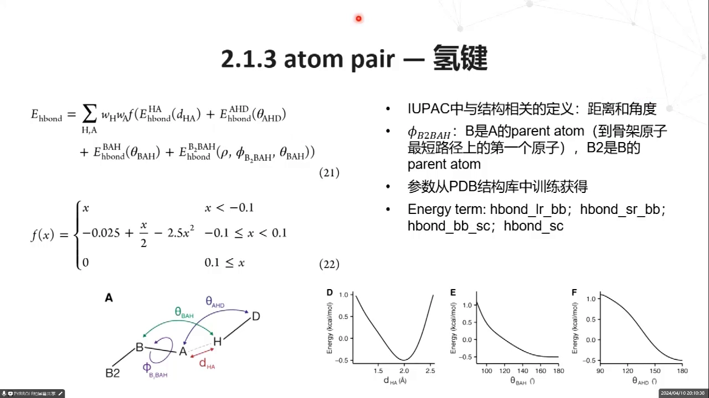 |
| 那么 A 一般是有孤对电子或者是带负电的，然后 D 也是一个带电负性比较强的原子。然后它把这个氢原子裸露的，就是让它暴露了比较多的正电荷。那么这样的话，就是正负电荷吸引，然后就是形成了氢键。但当然氢键它也不只是正负电荷吸引，它还有包含一定的原子轨道重叠，也就是一定的共价作用。 [【跳转到 60:58】](https://www.bilibili.com/video/BV1mkdwBoE6Z/?t=3658) | 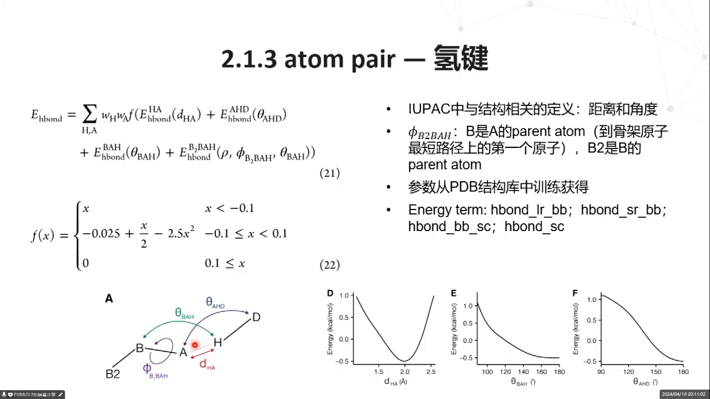 |
| 所以说氢键也是不能放在静电里，就是虽然有些模型放在静电里面，但是本质上来讲，它应该是单拿出来的一个能量项。那么这里我再解释一下这个氢键能量计算的一些每一小项的意思。DHA 就是这个距离，然后 θ_AHD 就是我们的这个角度。那么 IUPAC 就是定义了这两个东西，然后 θ_BAH 就是这个角度。 [【跳转到 61:23】](https://www.bilibili.com/video/BV1mkdwBoE6Z/?t=3683) | 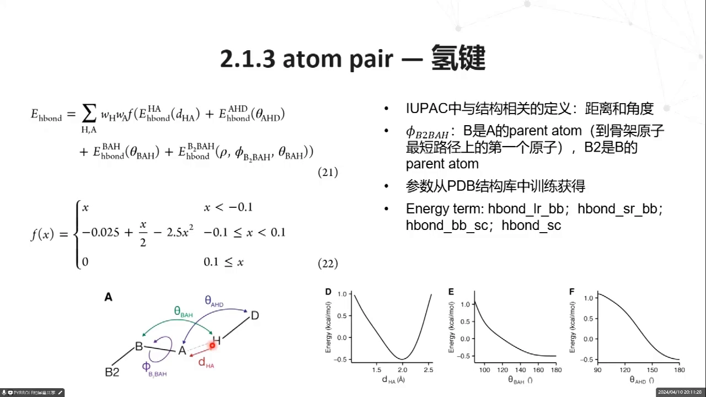 |
| 然后接下来是一个二面角，二面角是 B-A-H（θ_BAH）。那么 B 是 A 的，就是一个母原子，意思就是说到骨架原子最短路径上的第一个原子。就我们知道 A 的骨架在这边嘛，然后往这边走，遇到第一个原子就是 B。然后 B2 是 B 的一个母原子。那么它考虑的一个二面角是这样的一个二面角。 [【跳转到 61:48】](https://www.bilibili.com/video/BV1mkdwBoE6Z/?t=3708) | 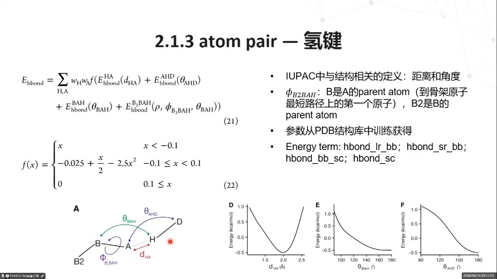 |
| 就是说在蛋白质中，这样的一个，就是对于氢键的形成，这个地方的二面角也有一种特定的偏好性，所以说要单独拿出来统计。那么这些参数都是从 PDB 结构库中训练获得。然后这个是它的一个能量形式，大家感兴趣就看看，不感兴趣知道啥意思就行。 [【跳转到 62:13】](https://www.bilibili.com/video/BV1mkdwBoE6Z/?t=3733) | 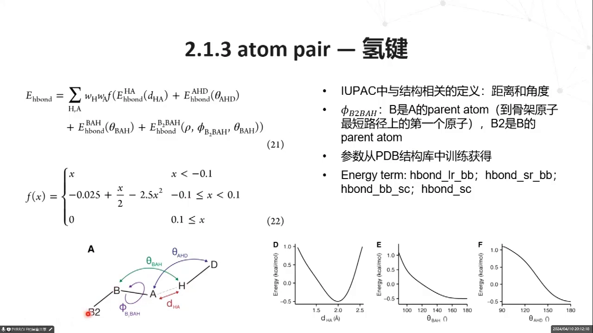 |
| 那么最后我们用 Rosetta 来计算能量，输出的能量项中与氢键相关的就是这几项。先大家过一下，hb lr bb，就是首先 BB 它的意思是骨架的意思，那么 SR 是什么？SR 是…… [【跳转到 62:38】](https://www.bilibili.com/video/BV1mkdwBoE6Z/?t=3758) | 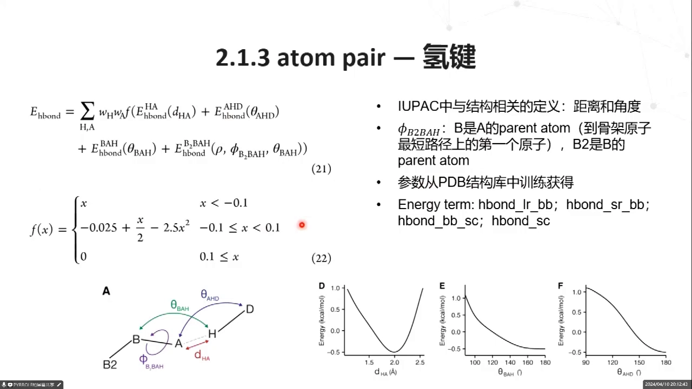 |
| 哦对，BB 是骨架的意思，SC 就是侧链的意思，LR 是 long range，然后 SR 是 short range。BB 就是骨架之间的氢原子。然后具体的定义我们明天还会再大家过一下，看一下它输出的 score 文件。 [【跳转到 63:03】](https://www.bilibili.com/video/BV1mkdwBoE6Z/?t=3783) | 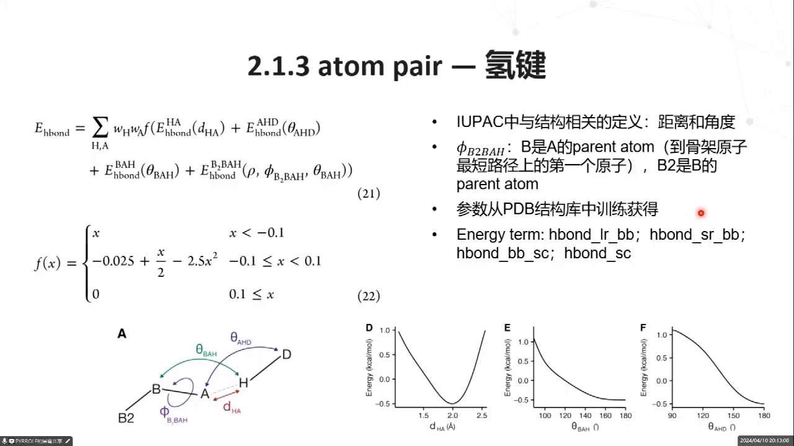 |
| （此区间无字幕） [【跳转到 63:28】](https://www.bilibili.com/video/BV1mkdwBoE6Z/?t=3808) | 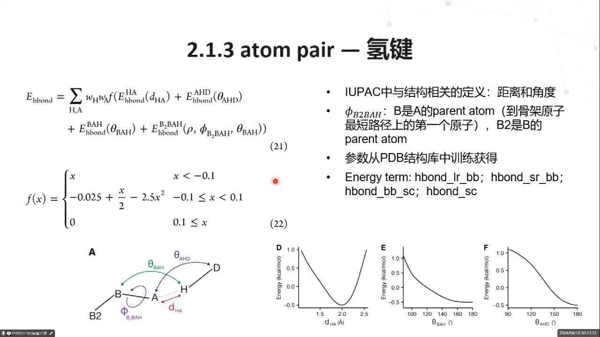 |
| 然后刚刚说完的氢键，接下来就是一些扭转能（torsion）。扭转能主要说的是在 Ramachandran map 里，我们刚刚给大家其实看过了，就是二面角、主链二面角的一个统计。然后还有就是在骨架设计中相关的一些能量项。那么在传统的力场方法中，主要使用的是 sin 和 cos 函数。 [【跳转到 63:33】](https://www.bilibili.com/video/BV1mkdwBoE6Z/?t=3813) |  |
| 但是这样的函数，它在 loop 区域拟合的效果是不好的。然后有些它采用的方法，它会直接绕过，说是用一个显式的函数来表示这个二面角，它会直接用一个新的函数去逼近量子力学方法计算的结果，这样就避免了这种周期性带来的 loop 区域拟合不佳的结果。 [【跳转到 63:58】](https://www.bilibili.com/video/BV1mkdwBoE6Z/?t=3838) |  |
| 区域拟合不佳的结果。那么它的拟合的数据来源也还是 PDB。然后需要注意的一个问题是，它这里输出的能量项就叫做 rama_prepro，它这里是包含了两个分类吧，就是两个类别。如果说你的…… [【跳转到 64:23】](https://www.bilibili.com/video/BV1mkdwBoE6Z/?t=3863) | 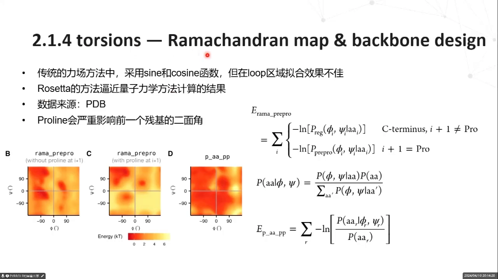 |
| 如果你的下一个残基，如果这个残基它下一个残基是脯氨酸的话。因为我们知道脯氨酸它的侧链成了一个环，而且是在主链的氮原子上，所以说如果下一个残基是脯氨酸的话，它会严重影响前一个残基的二面角。那么首先它在统计的时候专门做了一个区别。 [【跳转到 64:48】](https://www.bilibili.com/video/BV1mkdwBoE6Z/?t=3888) |  |
| 就是下一个残基不是脯氨酸的统计了一类，是脯氨酸的统计一类，然后用两个函数来分别去拟合它，这样我们在计算的时候就会防止一些比较奇怪的情况影响了我们的平均值。那么 p_aa_pp 这个能量项，就是说我们在已知二面角的情况下去推测氨基酸的类型。 [【跳转到 65:13】](https://www.bilibili.com/video/BV1mkdwBoE6Z/?t=3913) | 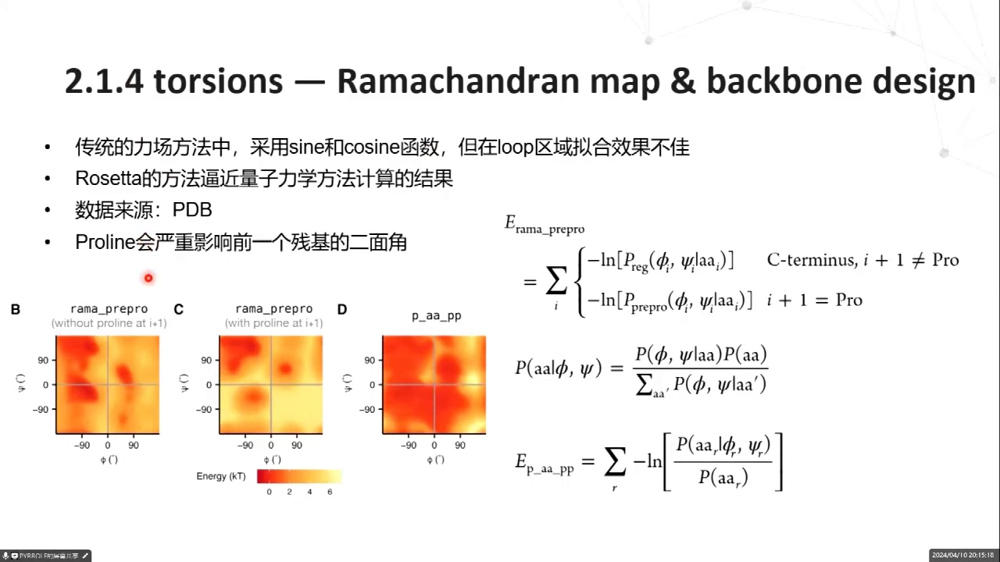 |
| 其实跟上面就是反过来的过程嘛，这个就可以用一个贝叶斯公式去计算。 [【跳转到 65:38】](https://www.bilibili.com/video/BV1mkdwBoE6Z/?t=3938) |  |
| 好，然后接下来是 Rosetta 里面一个非常，或者说整个蛋白质设计里面非常重要的一个概念，就是 rotamer，它的意思是侧链构象。我们经常说一些侧链构象库，就是一些氨基酸的侧链残基…… [【跳转到 65:47】](https://www.bilibili.com/video/BV1mkdwBoE6Z/?t=3947) | 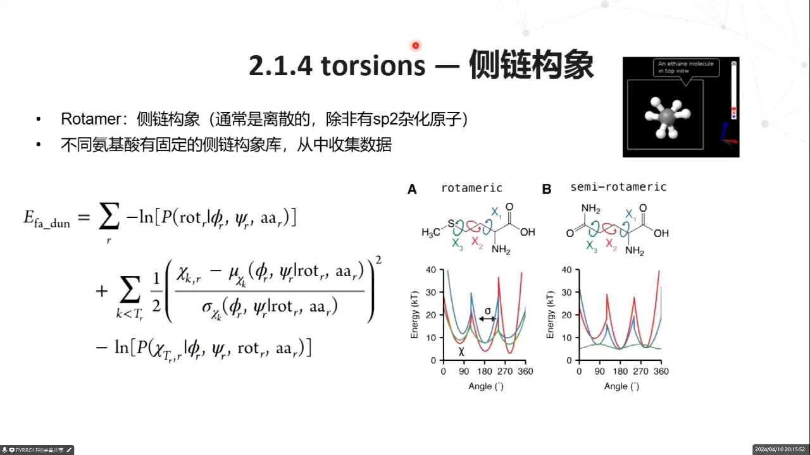 |
| 一些特定的一些几何、几何排列的方式。那么它通常是离散的，除非有 SP2 杂化的碳原子、杂化的原子，比如说大家能想到的，比如说带芳环的呀，然后还有就是带其他基团的。那么这些，它们的侧链构象就不是离散的。 [【跳转到 66:12】](https://www.bilibili.com/video/BV1mkdwBoE6Z/?t=3972) | 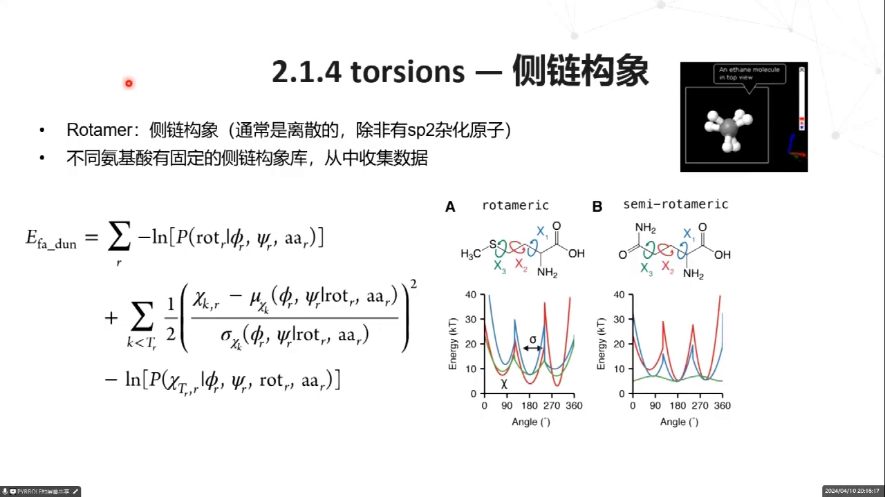 |
| 它的一个函数的形式就是……这个样子，然后中间有一个高斯的分布。那么我们主要看的是，对于我刚刚说的，如果它都是 SP3 杂化的话，那它就是所有的键都可以自由地旋转，它就是这样一个周期性的变化。然后如果是有 SP2 杂化的，比如说这里有一个酰胺键…… [【跳转到 66:37】](https://www.bilibili.com/video/BV1mkdwBoE6Z/?t=3997) | 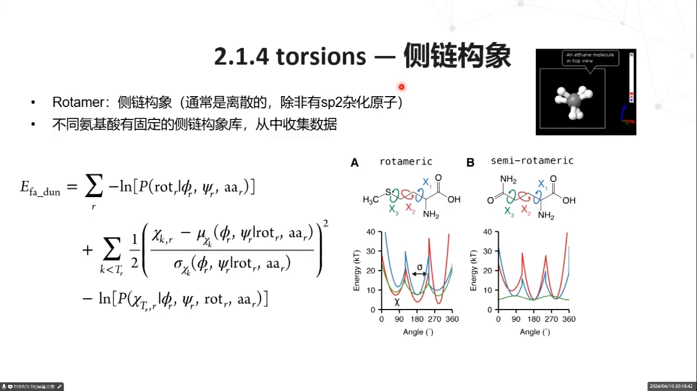 |
| 这里有一个酰胺。然后它就是一个，嗯，就是半可旋转的一种构象吧。然后我们可以看到这两个，因为它们这几个二面角都是 SP3 的，所以它们就是这种周期性的结果比较明显。那么对于这个键的话，它只有在 0 和 180 的时候…… [【跳转到 67:02】](https://www.bilibili.com/video/BV1mkdwBoE6Z/?t=4022) |  |
| 就是基本都是在这个附近，基本都是在这个附近，它不会有、不会有很多其他的角度。 [【跳转到 67:27】](https://www.bilibili.com/video/BV1mkdwBoE6Z/?t=4047) | 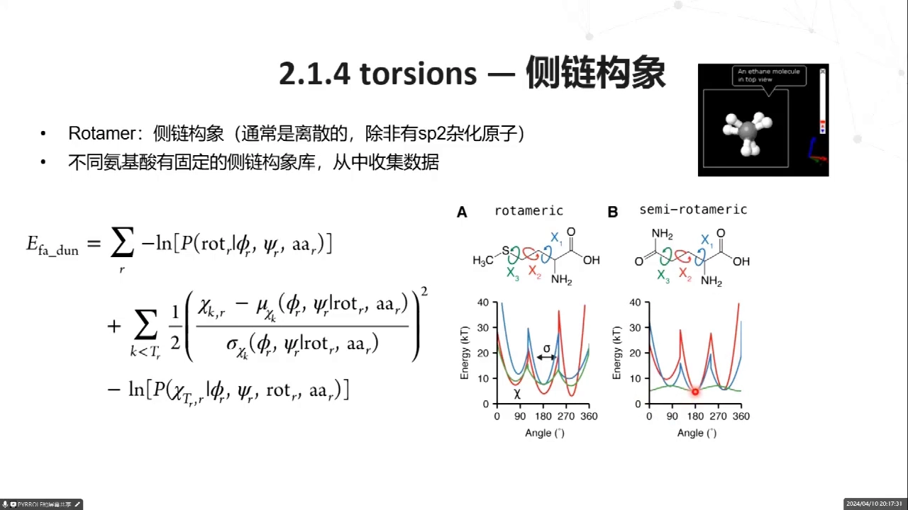 |
| 接下来就是在我们扭转角中的一些特殊情况，就是我刚刚说的 ω 角。ω 角就是我们主链的酰胺键，一般会有这两种形式嘛，一种是 0 度，然后另一种是 180 度。然后第二个特殊情况就是这个，也是刚刚说了…… [【跳转到 67:45】](https://www.bilibili.com/video/BV1mkdwBoE6Z/?t=4065) | 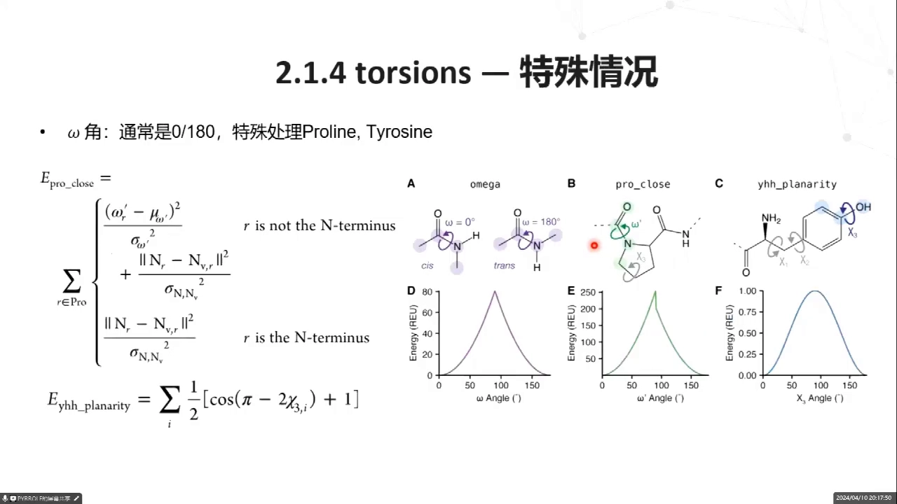 |
| 就是如果是这种脯氨酸的话，它也要单独地计算。第三种情况就是这个，刚刚说的 long range 的部分，它最后这一个部分也是要单独考虑进来的。如果你在实际操作中没有遇到这种特别困难的问题，其实也不用太关注这些能量项。 [【跳转到 68:10】](https://www.bilibili.com/video/BV1mkdwBoE6Z/?t=4090) | 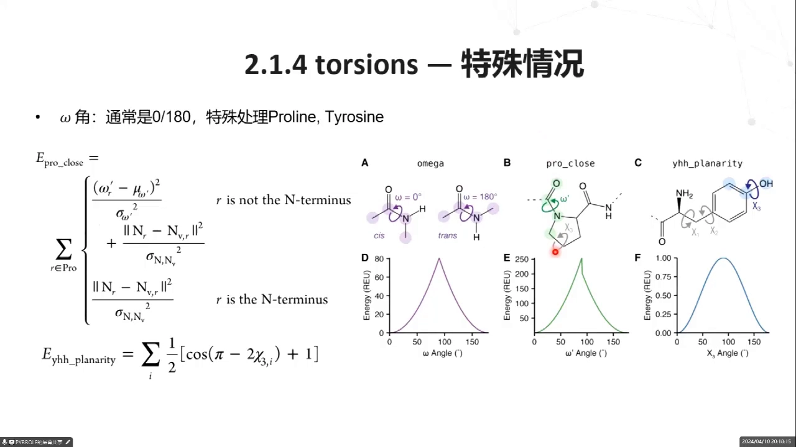 |
| 但是有时候我们在设计一些蛋白质的时候，我们可能会用一些特殊的氨基酸来稳定它，比如说用谷氨酸，或者是用一些其他的东西，我们可能就需要考虑一下这个能量。接下来是说一下与蛋白质设计相关的能量。 [【跳转到 68:35】](https://www.bilibili.com/video/BV1mkdwBoE6Z/?t=4115) | 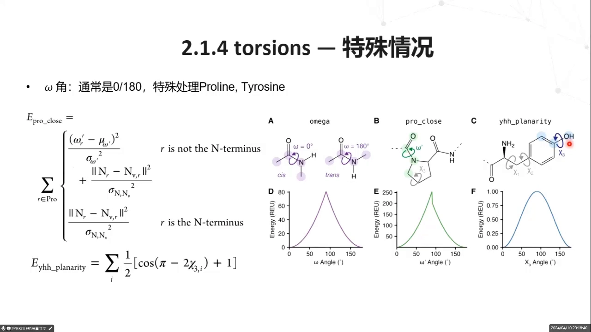 |
| 第一个就是比较宽泛的问题，或者说一个比较基础的问题，我们如何确定一个，就是我们如何来确定一个零点，如何确定能量的零点。那么我们知道，就是对于蛋白质来说，应该就是它全解折叠的能量。但是这样的话，计算就，首先你根本没有办法确定它没有折叠的时候…… [【跳转到 69:00】](https://www.bilibili.com/video/BV1mkdwBoE6Z/?t=4140) | 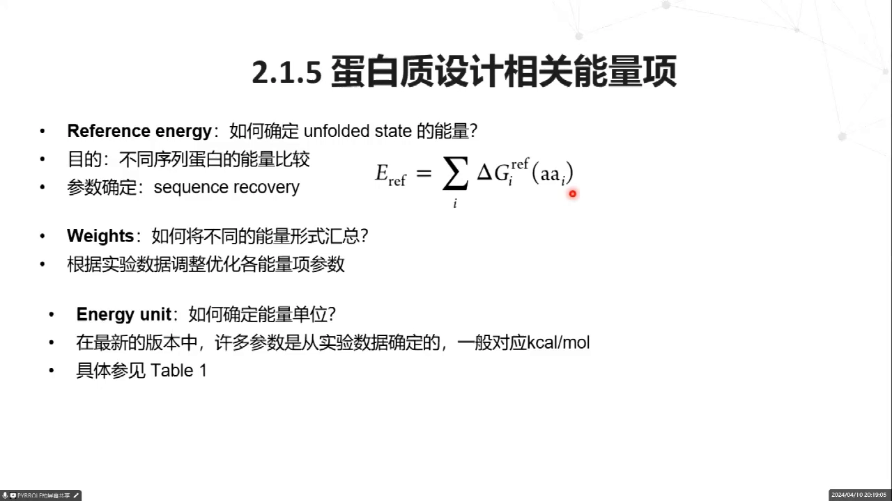 |
| 到底是什么构象。所以说就是计算上是不可行的。那么我们为什么要这样做？我们为什么还要确定这个计算的零点？就是我们想要对于不同的序列，我们要进行不同序列蛋白，我们也想进行能量比较，而不是说同一个序列我看它不同构象的能量变化，那么对于不同序列我也想来比较。那么这个 reference energy 它也是使用了一个就是这样的一个函数形式。 [【跳转到 69:25】](https://www.bilibili.com/video/BV1mkdwBoE6Z/?t=4165) | 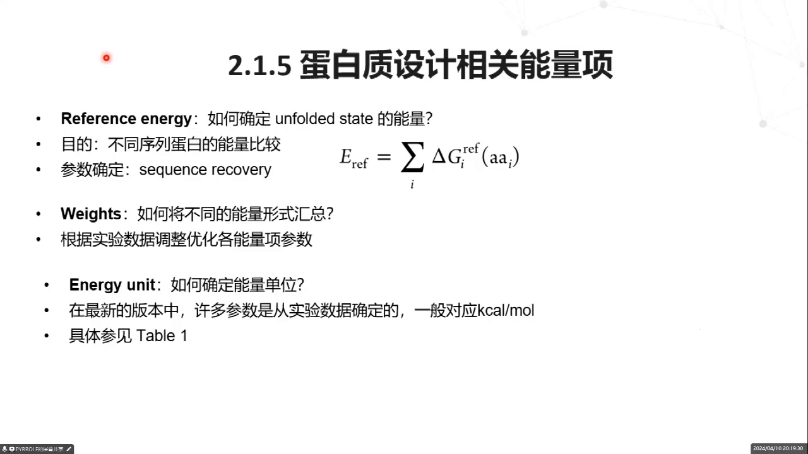 |
| 那么具体的参数呢，也是说进行了非常长时间、大量的优化，能够使它们这个能量零点跟实验数据最为吻合。接下来就是想说一下这个权重。那么我们刚刚可以看到，之前的那个表格里有一个…… [【跳转到 69:50】](https://www.bilibili.com/video/BV1mkdwBoE6Z/?t=4190) | 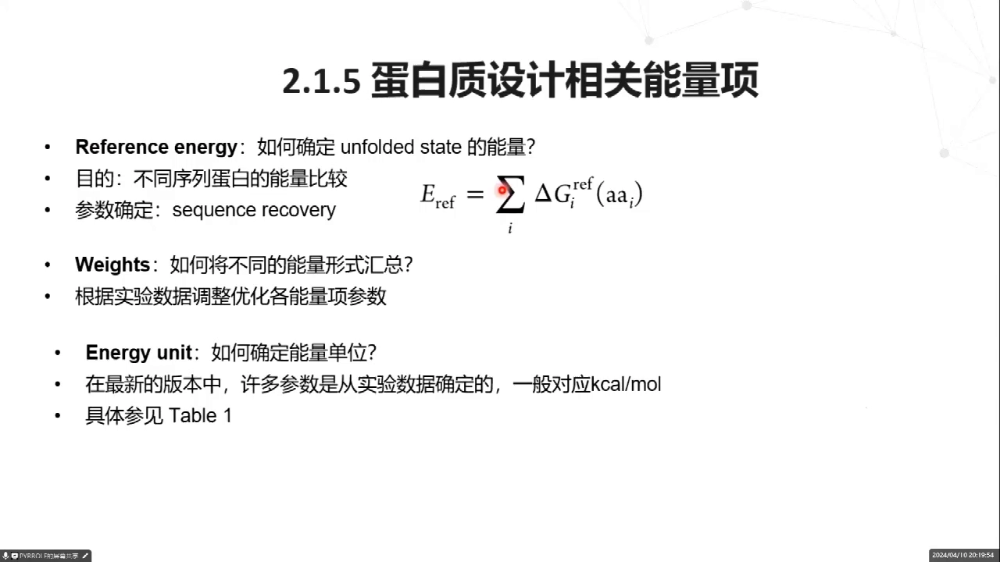 |
| 这里就是这个权重，它的确定也是在蛋白质设计过程中是非常重要的。那么我们通常根据自己的设计目的可以调整。然后在 Rosetta 他们开发的时候，也是根据实验数据来调整、优化了各能量项的参数。还有最后一个就是这个能量单位，刚刚我说了，就是很多参数它是从实验数据确定的…… [【跳转到 70:15】](https://www.bilibili.com/video/BV1mkdwBoE6Z/?t=4215) | 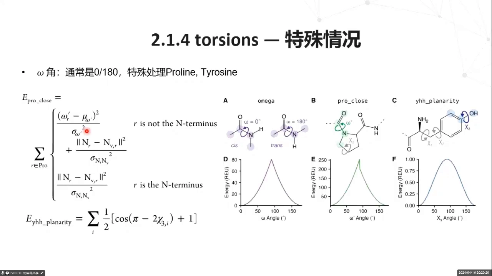 |
| 然后一般对应的是千卡每摩尔（kcal/mol），大家也可以参见刚刚的表格，或者这篇文献里面的 Table 1。那么在这篇文献里呢，它还是最后又介绍了一个叫做 ΔΔG 的一个能量，它就是突变一个残基后蛋白质的能量变化。那么它做的例子就是 RTrh 衍生多肽…… [【跳转到 70:40】](https://www.bilibili.com/video/BV1mkdwBoE6Z/?t=4240) | 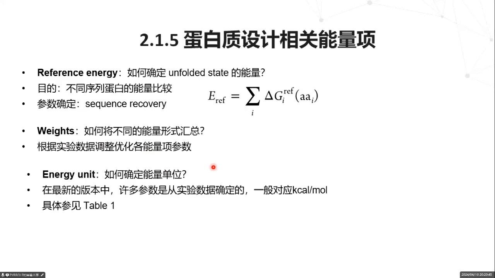 |
| 就是中间这一段，它与 HIV 蛋白酶复合物 T193V 的一个突变。那么这里就是一个能量分解的情况。这里的话我们可以来做一个原子水平的能量分析，就是它突变了之后，我们可以看到不同原子之间，比如说可能有的地方，诶，突变了之后…… [【跳转到 71:05】](https://www.bilibili.com/video/BV1mkdwBoE6Z/?t=4265) |  |
| 它的这个能量降低了，然后有的地方能量升高了，这样可以帮助我们来分析一些界面的性质。 [【跳转到 71:30】](https://www.bilibili.com/video/BV1mkdwBoE6Z/?t=4290) | 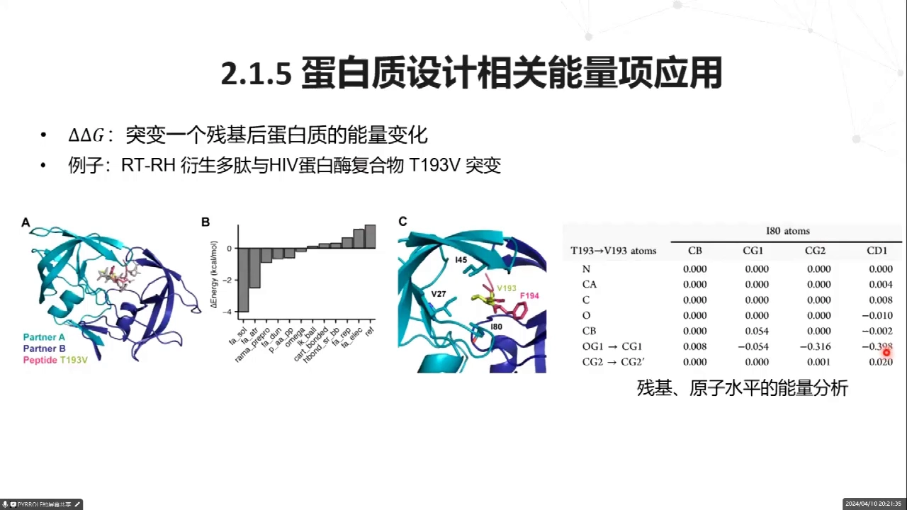 |
| 或者分析一些 hotspot，就是热点残基。但实际上我们现在分析热点残基的话，一般都会用 gmx_MMPBSA 它提供的 in silico 分析。当然 Rosetta 也可以做 alanine scanning，就是我们把不同的界面上的残基突变成丙氨酸，然后来看它、来再次计算这个结合自由能…… [【跳转到 71:42】](https://www.bilibili.com/video/BV1mkdwBoE6Z/?t=4302) | 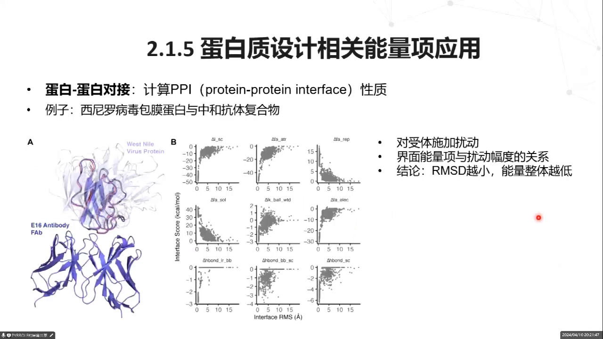 |
| 来看它结合自由能变化来表示这个残基对结合的贡献。那么第二个就是关于蛋白质设计相关能量项的一个应用，就是蛋白质-蛋白质对接方面，它可以计算 PPI，也就是蛋白-蛋白界面的性质。那么它的例子是，它的例子是用这个西尼罗病毒包膜蛋白和它的这个中和抗体一个复合物。 [【跳转到 72:07】](https://www.bilibili.com/video/BV1mkdwBoE6Z/?t=4327) | 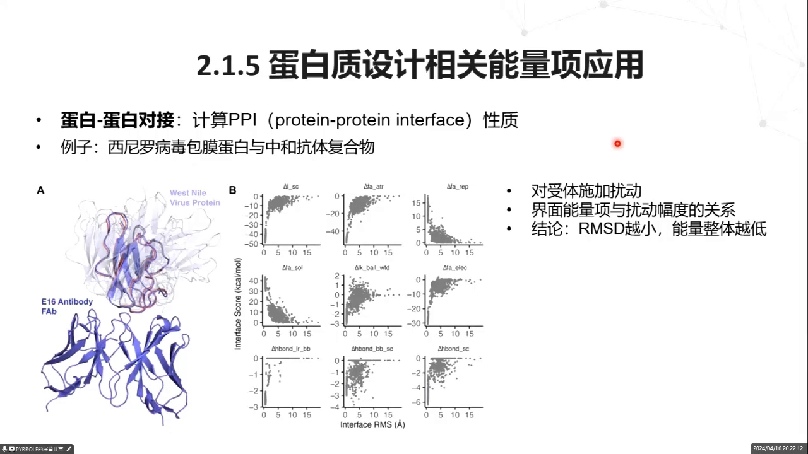 |
| 这个病毒它是一种能够引起人类致命神经系统疾病的一个病毒。它的方法就是对受体，就是这个病毒包膜蛋白进行扰动，然后来看界面各种能量项与扰动幅度的关系。那么它的结论就是，如果我的 RMSD 越小，整体能量越低，那么这样就可以确定说…… [【跳转到 72:32】](https://www.bilibili.com/video/BV1mkdwBoE6Z/?t=4352) | 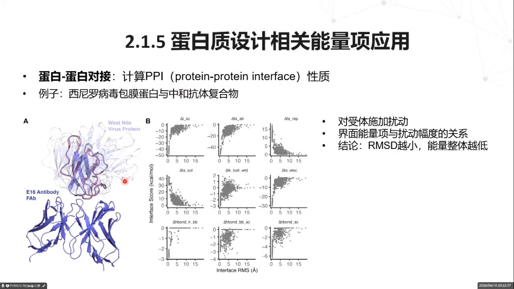 |
| 我之前的这个受体的这个构象，确实就是它结合最好的一种构象。那么这个图呢，横坐标就是它的 RMSD 一个变化，就可以发现，当我的 RMSD 越大的时候，它的一些能量项，就是那些比较有突出贡献的能量项会减弱。这是比较符合实际情况的。那么接下来就是有一个问题…… [【跳转到 72:57】](https://www.bilibili.com/video/BV1mkdwBoE6Z/?t=4377) |  |
| 或者说如果大家是做蛋白质 binder 设计的话，我们通常想要，或者说我们接触到一个新的靶标蛋白，大部分情况下它并没有一个已知的配体。但我们能否做到在不知道结合位点的情况下来设计靶向特定蛋白的结合蛋白呢？接下来就是我想给大家讲的一个例子。 [【跳转到 73:22】](https://www.bilibili.com/video/BV1mkdwBoE6Z/?t=4402) | 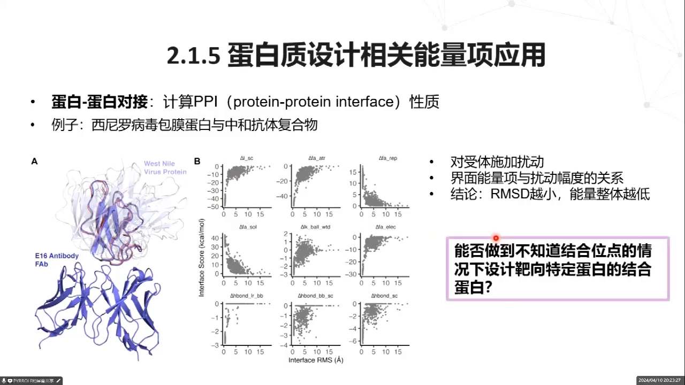 |
| 无先验知识的蛋白质药物设计 [【跳转到 73:47】](https://www.bilibili.com/video/BV1mkdwBoE6Z/?t=4427) |  |
| （此区间无字幕） [【跳转到 74:02】](https://www.bilibili.com/video/BV1mkdwBoE6Z/?t=4442) | 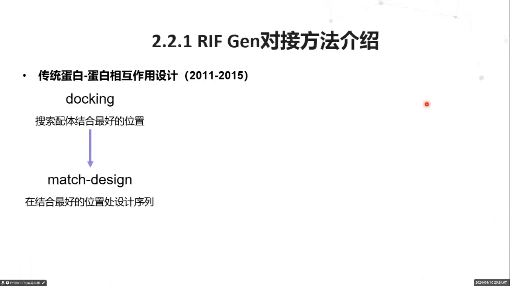 |
| 对，首先是给大家介绍一下传统蛋白…… [【跳转到 74:07】](https://www.bilibili.com/video/BV1mkdwBoE6Z/?t=4447) | 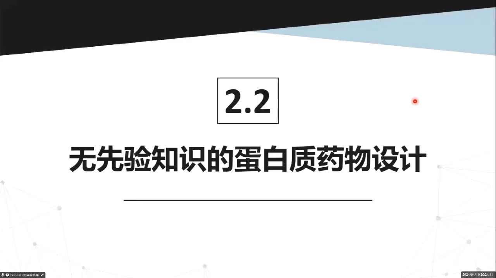 |
| 蛋白相互作用设计。那么这是从 11 年到 15 年的一个初期阶段，因为 11 年的时候力场才刚刚成熟嘛。那么对接的英文就是 docking，它的目的是搜索配体结合最好的位置。那么我们之前所用的一种方法就是 docking 配合这个 match design，就是在结合最好的位置处设计序列。 [【跳转到 74:12】](https://www.bilibili.com/video/BV1mkdwBoE6Z/?t=4452) |  |
| 但是这样有些问题啊，对于小分子来说…… [【跳转到 74:37】](https://www.bilibili.com/video/BV1mkdwBoE6Z/?t=4477) | 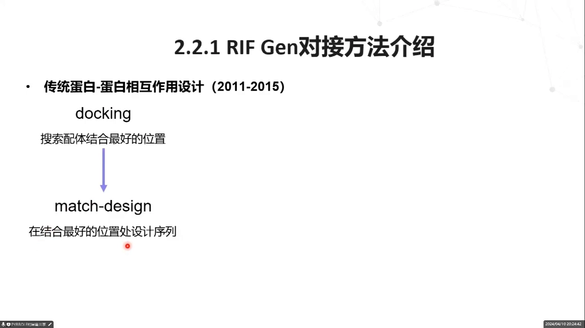 |
| 因为小分子的结构非常简单，我们几乎……而且小分子它的结合口袋很深。然后大家如果知道 Cavity 这个程序的话，它也是可以在蛋白表面去搜索哪些是有可能的小分子结合口袋，然后我们再把小分子放到这个口袋里，产生上千、上万、十万、几十万个构象，都可以遍历所有构象，我们就总可以找到它结合最好的。但是对于蛋白质来说，它的结构非常复杂…… [【跳转到 74:42】](https://www.bilibili.com/video/BV1mkdwBoE6Z/?t=4482) | 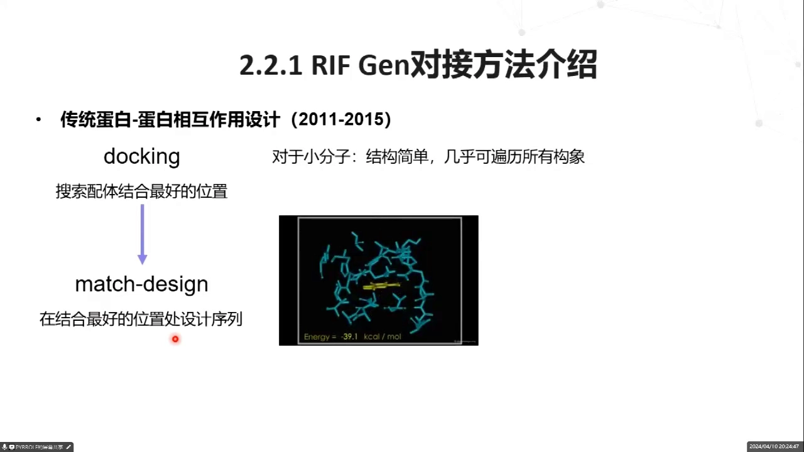 |
| 构象探索有限。所以说从这个遍历构象上来说，就是相比小分子来说就非常难。然后因此呢，我们大家就是之前的科研人员在讨论这个问题的时候，只考虑了 1~3 个 hotspot，就是说对这个结合界面贡献最大的几个残基。我们只考虑这个。 [【跳转到 75:07】](https://www.bilibili.com/video/BV1mkdwBoE6Z/?t=4507) | 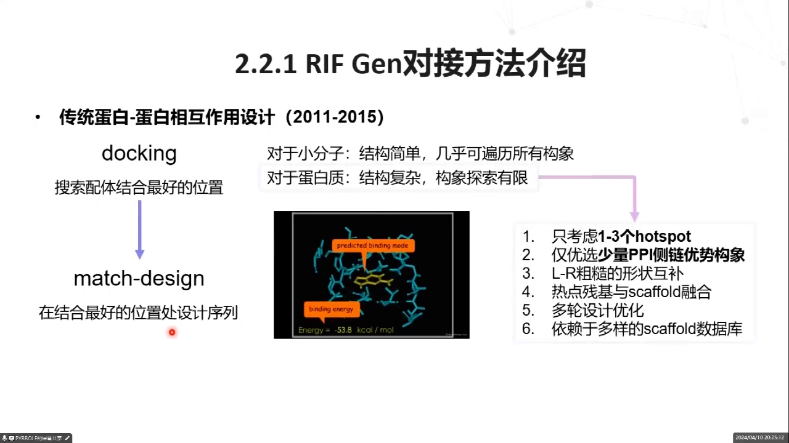 |
| 然后并且它仅优选少量 PPI 侧链优势构象，也就是说我们并不会遍历所有的侧链构象，或者是更别说主链了，只是在一些关键的侧链残基我们来变动它的一个 rotamer。然后第三个就是考虑的方式，就是 ligand-receptor 一个粗糙的形状互补，就他们大概看着，诶，他看着就是比较符合锁钥模型、能够契合就可以。 [【跳转到 75:32】](https://www.bilibili.com/video/BV1mkdwBoE6Z/?t=4532) | 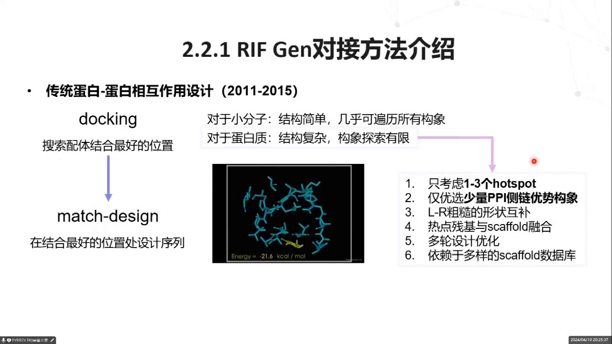 |
| 然后第四个就是热点残基与 scaffold 融合，就是说我们确定热点残基之后，把它放到这个 scaffold 上，然后就是要进行多轮的设计优化。然后并且这种方法它其实是依赖于多样性 scaffold 数据库的，也就是说你 scaffold 数据库的质量直接决定了你最后设计出来的质量。那么总结一下传统蛋白-蛋白相互作用设计…… [【跳转到 75:57】](https://www.bilibili.com/video/BV1mkdwBoE6Z/?t=4557) |  |
| 主要有以下几个缺点：首先是需要已知的配体，不然的话我怎么确定这个热点残基呢？第二个是即使我知道了这个残基，即使我知道了这个配体，在那个时候，就是蛋白-蛋白结构预测并不是非常成熟的阶段，它们的具体结构不知道，那么我热点残基就更加不容易确定了。 [【跳转到 76:22】](https://www.bilibili.com/video/BV1mkdwBoE6Z/?t=4582) |  |
| 第三个也是我觉得很关键的一个问题，是蛋白表面它没有明显的结合口袋。我们观察一些，或者观察大量的蛋白-蛋白结合复合物，我们会发现它的结合界面是非常平坦的，不像小分子是有一个凹下去。所以说，既然是这些缺点的话，那就带来两个挑战：第一个就是刚说的平坦表面，它很难有强的相互作用。 [【跳转到 76:47】](https://www.bilibili.com/video/BV1mkdwBoE6Z/?t=4607) |  |
| 就是因为你小分子相当于你所有的原子都能跟它去更多、或多或少，你没有、你也能有点范德华，也能有点疏水之类的，但平坦表面很难。然后第二个就是刚刚说的，正是因为平坦表面很难有强的相互作用，所以我给它设置一个阈值，设计出来一堆构象的时候，它可能非常非常多，这些构象都，这些序列或者这些构象…… [【跳转到 77:12】](https://www.bilibili.com/video/BV1mkdwBoE6Z/?t=4632) | 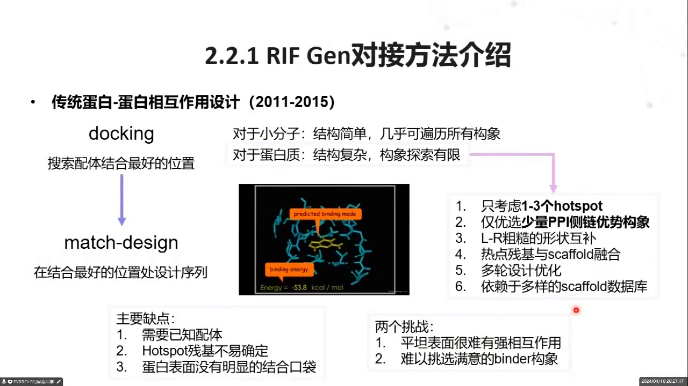 |
| 它们可能，我算出来的能量都差不多，那我就是难以挑选满意的 binder。那么如何解决这个问题呢？今天要接下来给大家介绍这篇文章。 [【跳转到 77:37】](https://www.bilibili.com/video/BV1mkdwBoE6Z/?t=4657) | 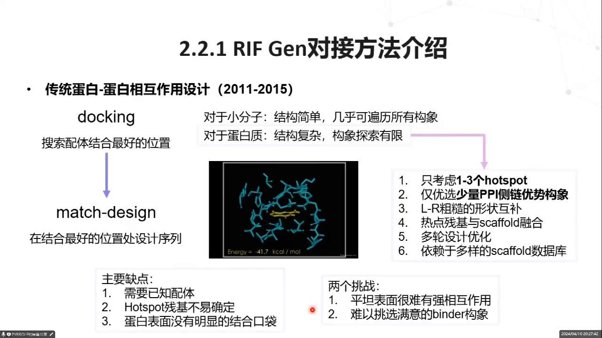 |
| 就是叫做采用了这种 RF 方法，rotamer interaction field，就是侧链相互作用的一个场。给大家介绍一下它的第一作者曹龙星老师，曹龙星大神，他现在是在西湖大学生命科学学院，然后从事蛋白质设计领域的相关研究。然后他的这篇文章是他当时在 David Baker 组…… [【跳转到 77:46】](https://www.bilibili.com/video/BV1mkdwBoE6Z/?t=4666) | 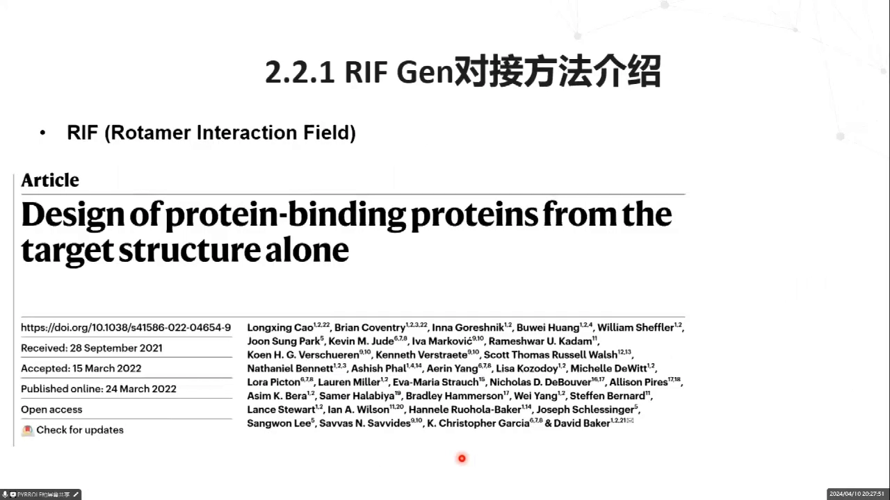 |
| 就是我们刚讲的，就是开发 Rosetta 的那个通讯作者，在他的组做博后的时候做出来的工作。 [【跳转到 78:11】](https://www.bilibili.com/video/BV1mkdwBoE6Z/?t=4691) | 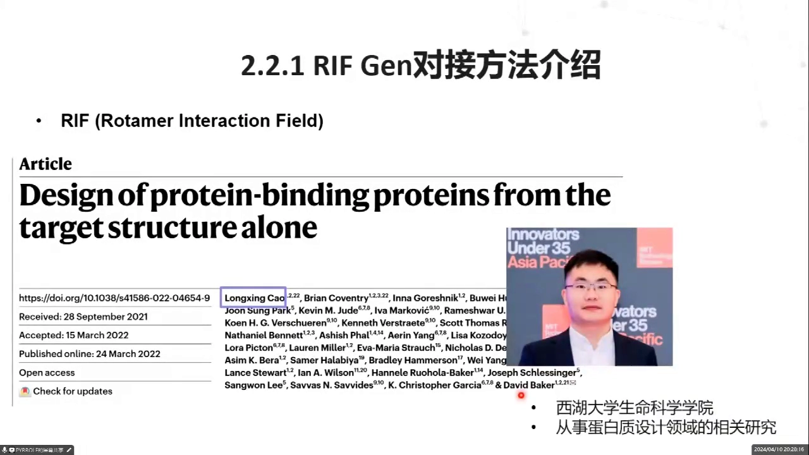 |
| 首先给大家说一个看起来没有什么关系的话题，就是你攀岩过吗？或者说你是做的是室内攀岩呢，还是野外攀岩的？室内攀岩的话，我们看到就是一堵墙，然后上面有很多凸起的这种小圆点，让你、小圆点或者什么其他形状，让你去爬，让你去按照他设计好的轨迹去爬。 [【跳转到 78:20】](https://www.bilibili.com/video/BV1mkdwBoE6Z/?t=4700) |  |
| 但是在野外攀岩的时候，不会有好心人给你就是长出来这些凸起的东西，你需要自己去找到坚固的固定点，比如说岩石的突出物啊，然后树木，或者是用你特定的固定装备，比如这个人拿了一个岩钉或者是螺栓。那么你在选择这个锚点的时候，要确保固定点本身稳定，且能承受多方向的力量。 [【跳转到 78:45】](https://www.bilibili.com/video/BV1mkdwBoE6Z/?t=4725) | 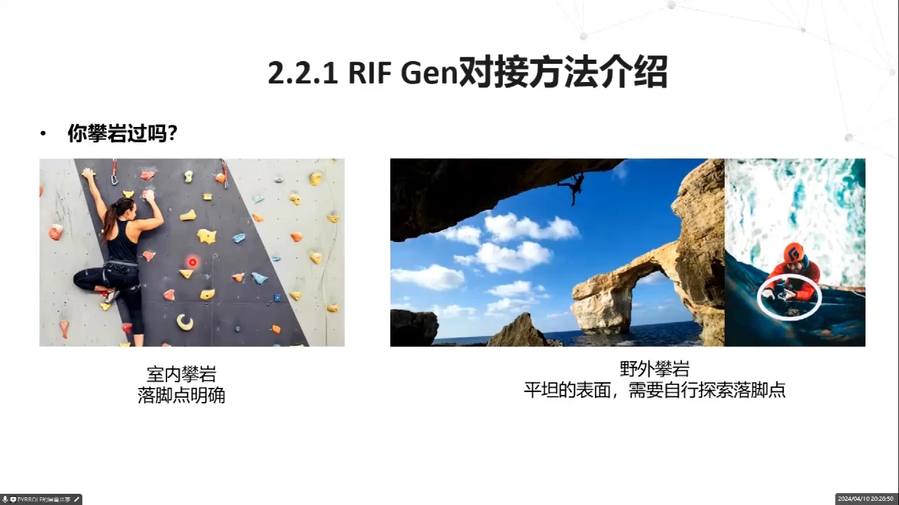 |
| 那我为什么要讲攀岩呢？因为就是这篇文章里把它的一个，把它程序的一个设计思路跟攀岩非常巧妙地结合起来。对于室内攀岩，落脚点明确的话，就很像我们 11 年到 15 年早期的 hotspot 蛋白的 docking 方法，就是我们已经知道了一些热点残基，那么你就沿着这几个 hotspot 去爬，就是你总能，就是怎么着…… [【跳转到 79:10】](https://www.bilibili.com/video/BV1mkdwBoE6Z/?t=4750) | 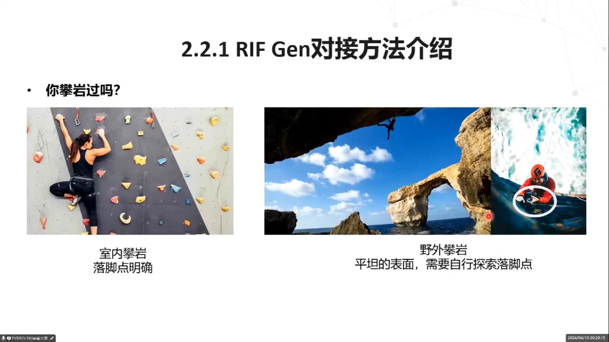 |
| 就是根据你这个已经有的落脚点去找一个比较好的路径。那么对于野外攀岩呢，它就是，它找锚点的方式是，它搜索范围非常大，没有任何先验的知识，没有任何给你的锚点，那这样的话它就可以找到更多到达终点的中间路径。那么接下来就是给大家介绍一下…… [【跳转到 79:35】](https://www.bilibili.com/video/BV1mkdwBoE6Z/?t=4775) | 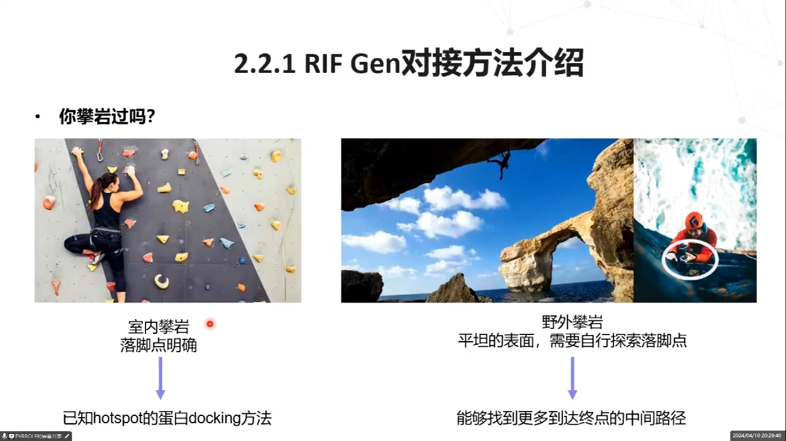 |
| 这种 docking 方法的设计流程。第一步就是根据你先选一个蛋白结合界面，然后生成有很多相互作用的侧链。然后注意我们这个模型的名字是一个场，是一个 field，我们之前学的什么重力场啊、什么静电力场啊、静电场啊。 [【跳转到 79:58】](https://www.bilibili.com/video/BV1mkdwBoE6Z/?t=4798) |  |
| 它这个场东西，它不是一个实体存在的东西，它只是一个概念，它只是一个虚无、是一个虚无的东西。当然这里也是一样的。他这个 RFjoint 这个方法，它产生的这些侧链，它并不是说真的在那块放了，而是说这个、这种残基，它在这里它的能量是什么样的，然后他把这样的能量还有包括这个残基信息存储在了一个哈希表格里面。 [【跳转到 80:23】](https://www.bilibili.com/video/BV1mkdwBoE6Z/?t=4823) |  |
| 然后我们继续往下说。第二个就是在蛋白骨架库中搜索尽可能涵盖侧链构象且不与 target 碰撞的骨架。那么这里的这种骨架库，我们可以看到的都是这种我刚刚说的比较稳定的三螺旋束啊，就是这种跟小，我们就是之前常用的什么小螺旋肽啊…… [【跳转到 80:48】](https://www.bilibili.com/video/BV1mkdwBoE6Z/?t=4848) |  |
| 或者小 loop 比起来要复杂一些，但是也是更稳定一些。那么我们在 RFjoint 这一步确定了一些比较好的结合的侧链之后呢，我们把这个骨架给它对接到，就是也是 align 去找最小 RMSD，把这些骨架对接到这个上面。然后第三步就是我们再重新设计一下序列的、界面的序列，也就用 RosettaScripts…… [【跳转到 81:13】](https://www.bilibili.com/video/BV1mkdwBoE6Z/?t=4873) | 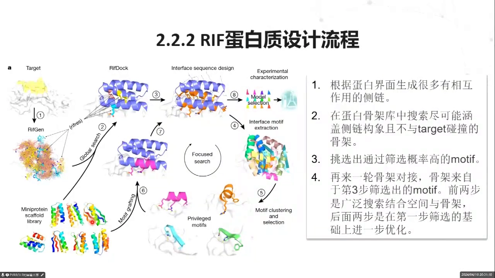 |
| 或者是就是基于 Rosetta 一些方法。然后呢我们把这个界面上的一些 motif interface，我们把它给提取出来，然后进行一个聚类，然后这里主要是根据 TM-score 的分数来聚类。然后我们挑选出一些 privileged，就是说在这些里面占比比较高的一些骨架…… [【跳转到 81:38】](https://www.bilibili.com/video/BV1mkdwBoE6Z/?t=4898) | 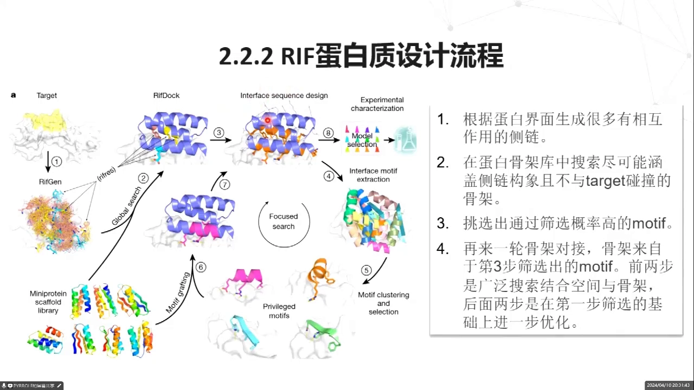 |
| 比如说可能很多种对接的结果、界面性质都是这样的，那么我们把它们聚类，然后挑选出来，我们再进行一次 motif grafting，就是再把这些骨架对接到这个这种 motif 上面，然后诶再来一次。然后这第二轮再进行一次 sequence design，然后就是再根据 Rosetta，我们刚刚介绍到的一些打分函数，再筛选出来…… [【跳转到 82:03】](https://www.bilibili.com/video/BV1mkdwBoE6Z/?t=4923) |  |
| 用于做实验的最终的 binder，然后就是最后进行到这个实验上的验证。 [【跳转到 82:28】](https://www.bilibili.com/video/BV1mkdwBoE6Z/?t=4948) |  |
| 下面我是想要具体地介绍一下 RF 这个方法。首先简单来说，就是 RFgen 负责在某些小分子或者是热点残基附近进行这个 rotamer 生成，特别是这个 RF，它可以针对极性残基也做优化。 [【跳转到 82:38】](https://www.bilibili.com/video/BV1mkdwBoE6Z/?t=4958) | 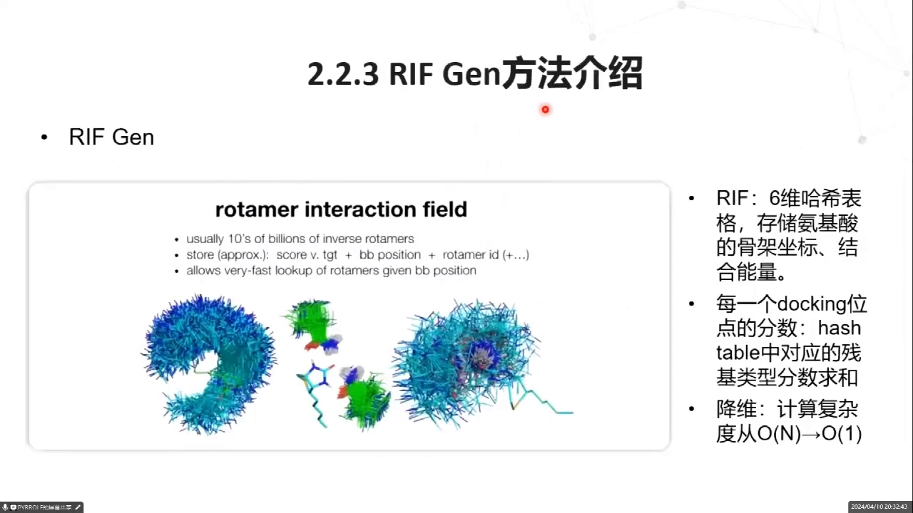 |
| 当然在这个工作里面，他们为了减少工作量，只做了疏水残基的 RF 生成。那么这些 rotamer 的信息，他们都被存储在了六维的哈希表格里面，它存储的就是氨基酸的骨架坐标，还有些结合能量。那么每一个 docking 位点分数，就是这个哈希 table 中对应的残基类型分数求和。那么这样的一个特征…… [【跳转到 83:03】](https://www.bilibili.com/video/BV1mkdwBoE6Z/?t=4983) | 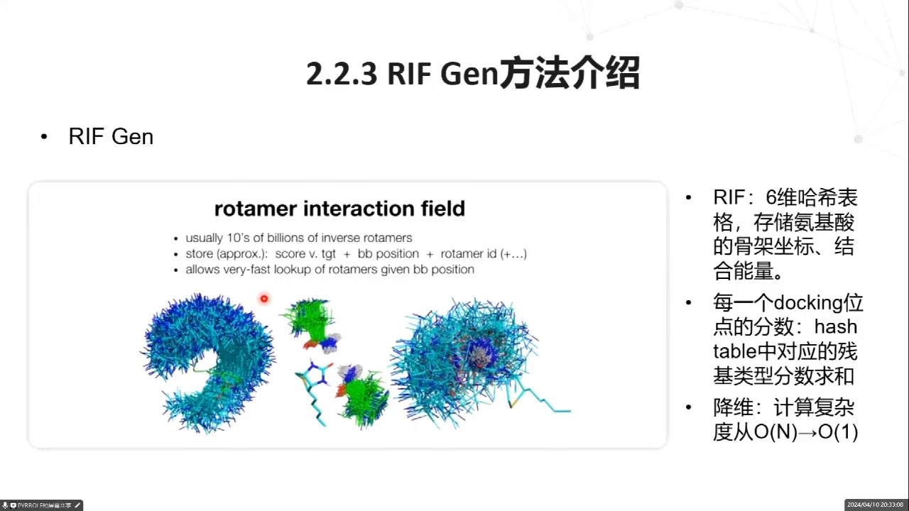 |
| 或者说这样的一个方法，它最重要的是把连续的采样，计算复杂度从 N，或者是 N，甚至是 N 方的复杂度，降低到了一维复杂度，这样就使我们搜索空间扩大了很多。就是我个人的理解是说，我们之前对接的时候，我们要有很多骨架一次一次地往上放，但是如果我生成了这样一个场…… [【跳转到 83:28】](https://www.bilibili.com/video/BV1mkdwBoE6Z/?t=5008) | 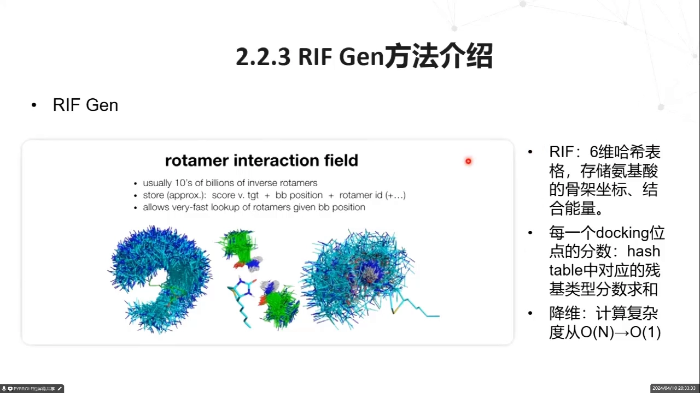 |
| 只需要计算一次，计算一次的这个所有残基侧链在附近的一个能量。然后我只需要计算它们这些能量，然后我再把骨架和已经生成出来的侧链 align 一下就可以了，而不需要说每次都单个单个放那去对接。我不知道有没有解释清楚。 [【跳转到 83:53】](https://www.bilibili.com/video/BV1mkdwBoE6Z/?t=5033) |  |
| 第二个，在这个工作中我认为比较重要的，就是这种小蛋白的骨架生成。那么它采用的方法是，这些，但因为我们这节课并不是在讲蛋白质骨架的从头设计，所以我就不再详说了。这些小蛋白它们的长度都是在 50~65 之间。 [【跳转到 84:16】](https://www.bilibili.com/video/BV1mkdwBoE6Z/?t=5056) |  |
| 然后这些结构 motif 也非常的多样。那么为什么要设计这种小蛋白？为什么不设计单根螺旋呢？它跟螺旋不是合成更方便吗？然后它不是设计上更简单吗？它有一个，这种小蛋白最大的优势就是它有更大范围的疏水核心，就是在中间这一块，因为我们知道就是在蛋白质折叠过程中…… [【跳转到 84:41】](https://www.bilibili.com/video/BV1mkdwBoE6Z/?t=5081) | 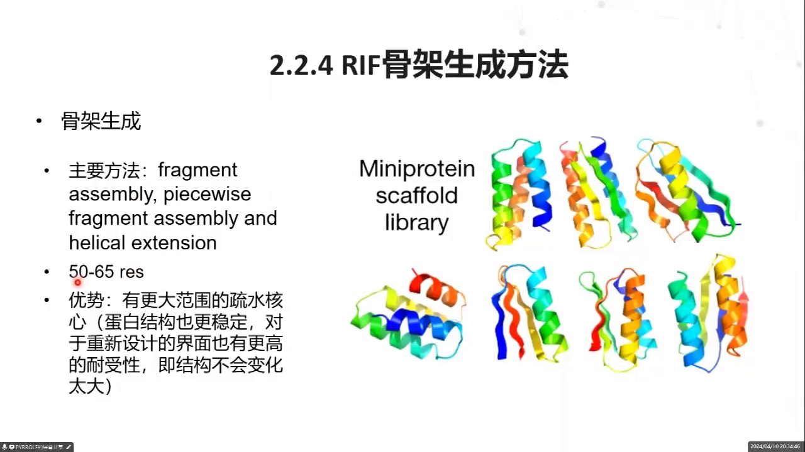 |
| 疏水作用是它最强大的驱动力，这样的话蛋白结构也更稳定，那么对于重新设计的界面也有更高的耐受性。就是这个怎么理解呢？因为它中间这块结合很好，那么在界面上你稍微改几个残基，对它整体的结构影响不大。但如果你是一个单根的螺旋，或者只有两个螺旋这样结合的话，可能这边的残基改变会影响这边的结合，也就是说它的结构也不会变化太大。 [【跳转到 85:06】](https://www.bilibili.com/video/BV1mkdwBoE6Z/?t=5106) | 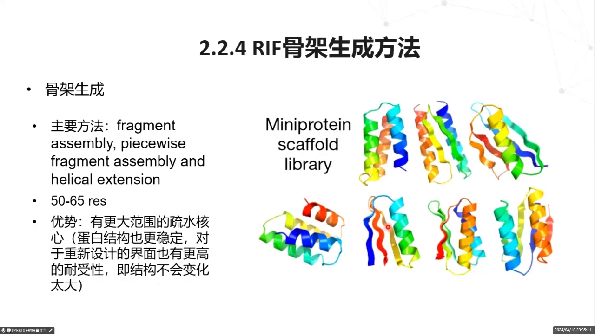 |
| （此区间无字幕） [【跳转到 85:31】](https://www.bilibili.com/video/BV1mkdwBoE6Z/?t=5131) | 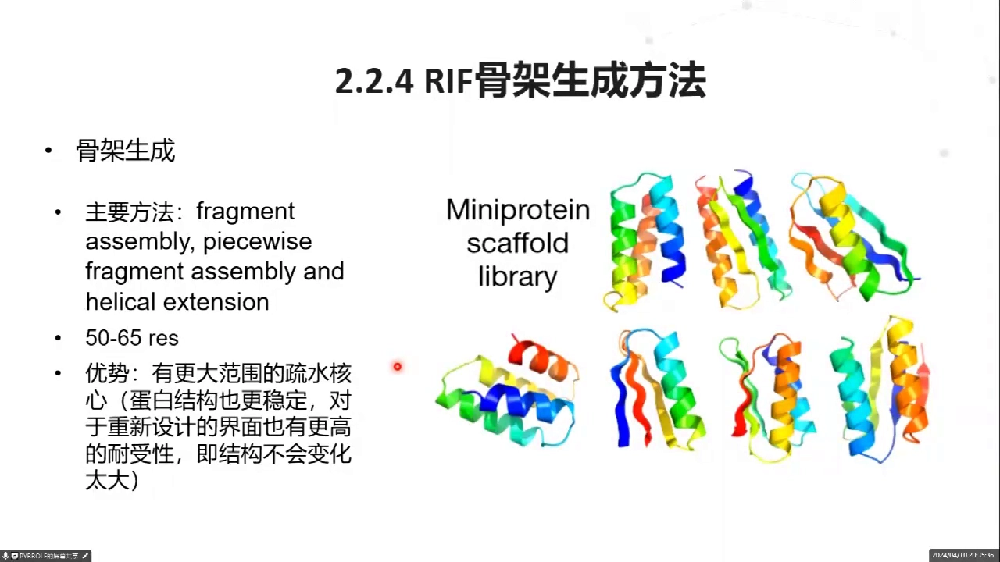 |
| 那么在 RFjoint 和我们这个、我们的 binder 骨架都已经生成了之后呢，接下来一步就是 RFdock，这个呢是说对每一个 binding pose，就是对每一个结合的一种位置，然后与 RFjoint 中巨量的 rotamer 进行层级，就是层级逐渐缩小范围的搜索。 [【跳转到 85:36】](https://www.bilibili.com/video/BV1mkdwBoE6Z/?t=5136) |  |
| 什么意思呢？就是说你可能一开始你 online RMSD 设置的比较大，它可能在这一个范围，然后逐步地减小、减小、减小，然后减小到它跟你 RFgenerator 生成出来的侧链结合最好的地方。那么它的评估指标就是低分辨的结构适配度与 RIF 分数，就是它不仅考虑了 RIF 分数，也要考虑一下结构适配度。 [【跳转到 86:01】](https://www.bilibili.com/video/BV1mkdwBoE6Z/?t=5161) | 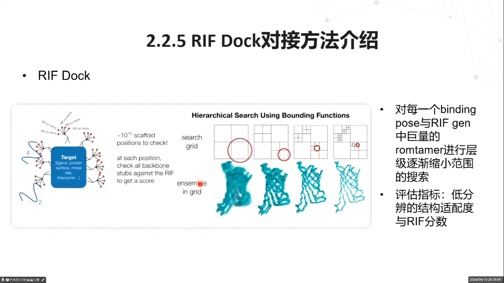 |
| 你可以简单理解为 ligand 和 receptor 它两个几何契合的好不好。 [【跳转到 86:26】](https://www.bilibili.com/video/BV1mkdwBoE6Z/?t=5186) |  |
| 接下来也是这个工作中非常重要的一个部分，或者说是我觉得创新点非常新颖的一个地方，就是 MULTIGRAFT。因为确实这个思路真的太新了。MULTIGRAFT 就是我们之前常说的，可能大家做蛋白对接，或者怎么说，都是整个的 ligand 和整个的 receptor 去做。 [【跳转到 86:36】](https://www.bilibili.com/video/BV1mkdwBoE6Z/?t=5196) | 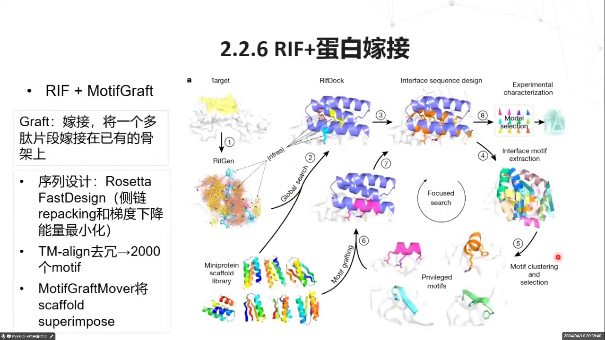 |
| 那么这个 MULTIGRAFT 它核心的思路就是：我先找到一个比较好的骨架，然后再把稳定它结构的东西给放上去。那么 graft 它的意思就是嫁接，将一个多肽片段嫁接在已有的骨架上。然后也是再重复一下我刚刚说到的一些流程吧。 [【跳转到 87:01】](https://www.bilibili.com/video/BV1mkdwBoE6Z/?t=5221) |  |
| 就是在这种对接完毕了之后，还是进行这个 fast Rosetta fast design，然后这个函数我们明天也会带大家来使用。然后他这里主要做的事情是侧链的 repacking，就是说重新优化侧链、侧链的这个二面角构象。 [【跳转到 87:26】](https://www.bilibili.com/video/BV1mkdwBoE6Z/?t=5246) | 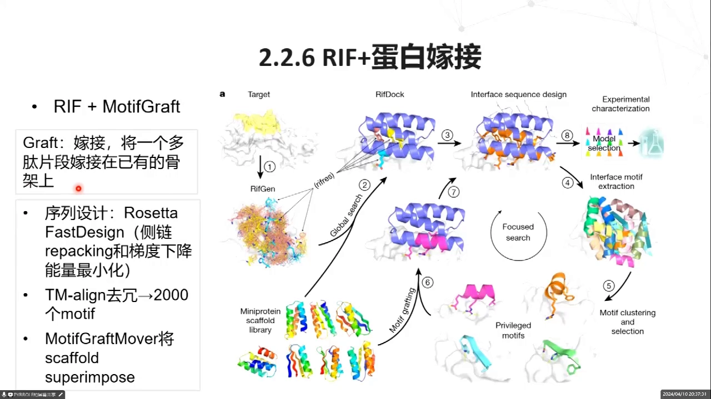 |
| 然后还有就是用梯度下降来进行能量的最小化。第二个就是 TM-align 去重，最后他们筛选出来了 2000 个 motif，然后再用 motif graft mover，这个 mover 也是 Rosetta 中的一种，就是一种函数、一种功能，这个东西可以把我们的 scaffold 给它…… [【跳转到 87:51】](https://www.bilibili.com/video/BV1mkdwBoE6Z/?t=5271) | 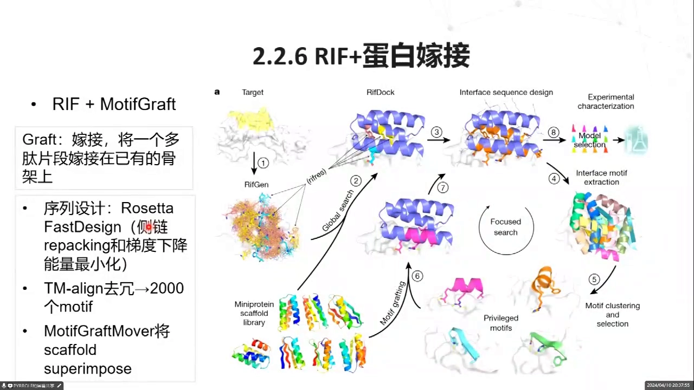 |
| 就是按 superimpose 就是把它给对接，或者说是对齐到我们这个 motif 上。 [【跳转到 88:16】](https://www.bilibili.com/video/BV1mkdwBoE6Z/?t=5296) | 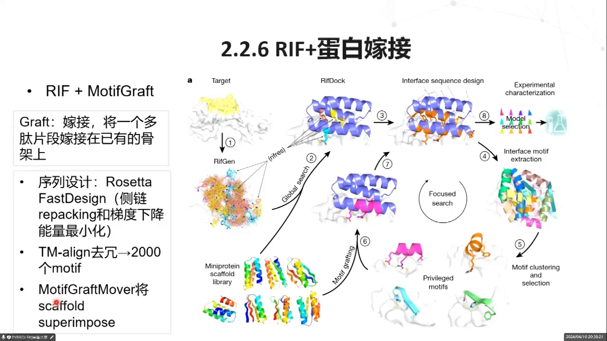 |
| 我们知道，尤其是对于蛋白质设计这种非常、也是很计算的学科或者是一个领域，我们算法设计是一方面，但更重要的是我们如何选择一个好的实验体系来验证我们的算法是不是好的。那么在这里呢…… [【跳转到 88:31】](https://www.bilibili.com/video/BV1mkdwBoE6Z/?t=5311) | 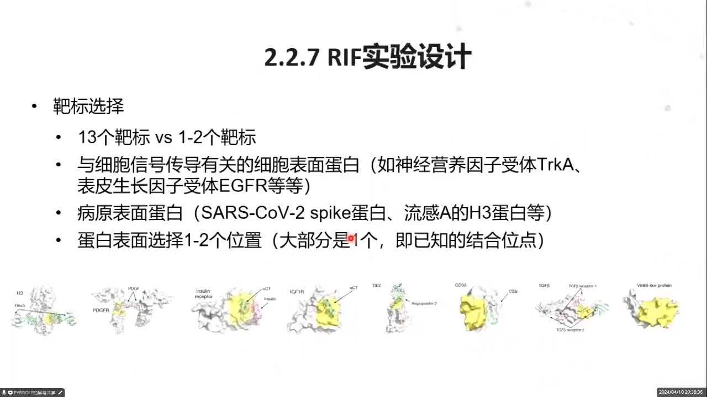 |
| 我们可以看一下他是怎么选择它的靶标，或者怎么设计它的实验的。那么在之前的一些蛋白质设计工作中，或者蛋白质 binder 设计过程中，可能只是选择一到两个靶标，但是他这里直接做了 13 个靶标，所以看就是人家发 CNS 不是没有道理的，这个恐怖的工作量。那么这些靶标它们主要是分为两种、两类吧。 [【跳转到 88:56】](https://www.bilibili.com/video/BV1mkdwBoE6Z/?t=5336) | 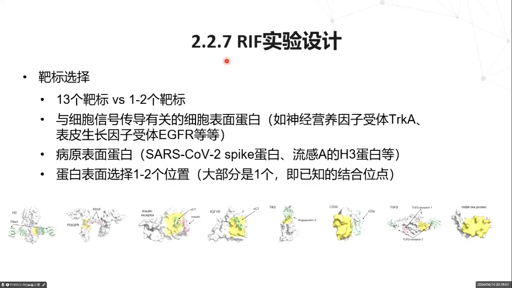 |
| 第一类是与细胞信号传导有关的细胞表面蛋白，比如说神经营养因子受体 TRKA，还有表皮生长因子受体 EGFR，这些都是药物里面非常热门的靶点。然后第二种就是病原表面的蛋白，比如说 SARS-CoV-2 spike 蛋白，还有流感 A 的 H3 蛋白。那么这篇工作之所以、之所以为什么让大家那么震惊…… [【跳转到 89:21】](https://www.bilibili.com/video/BV1mkdwBoE6Z/?t=5361) | 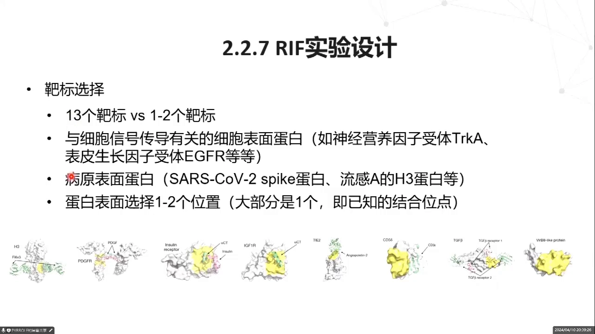 |
| 就是因为作者用这种方法设计了一个 SARS-CoV-2 spike 蛋白的、皮摩尔级别的、结合的抗体。大家可以想想，那个时候是 21 年，正是全球疫情最严重的时候，那这个工作确实是非常 stunning、令人震撼的。那么接下来就是在蛋白表面选择一到两个位置…… [【跳转到 89:46】](https://www.bilibili.com/video/BV1mkdwBoE6Z/?t=5386) | 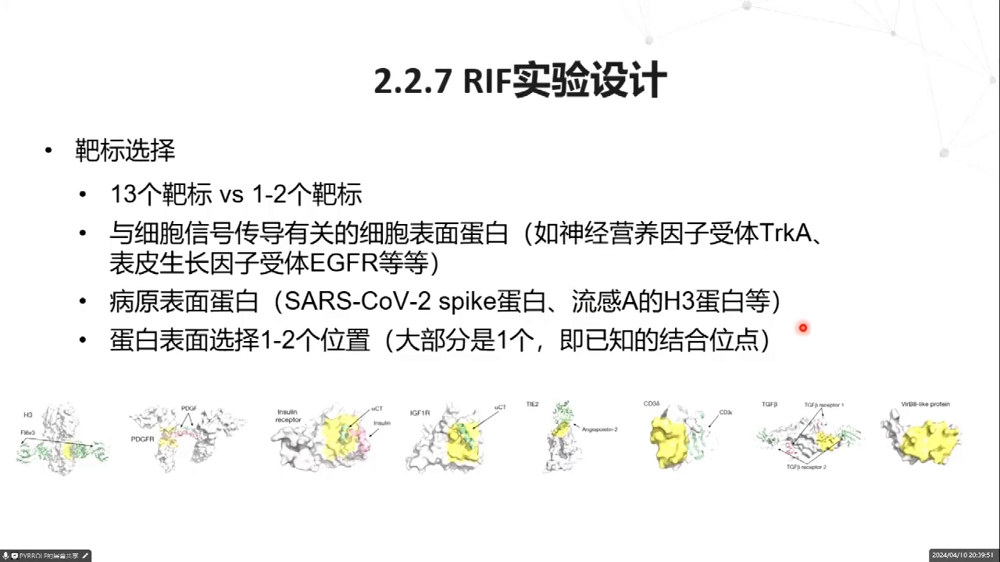 |
| 那么大部分是一个，而且是已知的结合位点。那么这个方式，虽然他宣称说他没有先验知识，但是他实际设计的时候还是用了已知的结合位点，我们可以看到。就是这些，反正总而言之，这些靶标都是潜在的药物靶标。下面的话是大概说一下实验设计。因为即便是我知道有很多做湿实验的同学…… [【跳转到 90:11】](https://www.bilibili.com/video/BV1mkdwBoE6Z/?t=5411) | 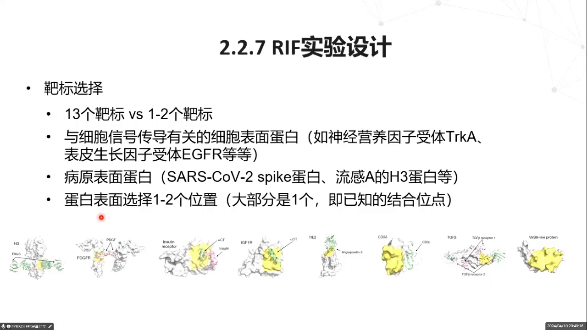 |
| 但是一般湿实验可能做这些实验、做这些方法也比较少，我还是简单介绍一下他们的技术原理。首先是圆二色谱。圆二色谱它的一个基本原理就是氨基酸有手性，然后有手性的分子它在圆二色谱上就会有响应的信号，比如说这张图里面…… [【跳转到 90:36】](https://www.bilibili.com/video/BV1mkdwBoE6Z/?t=5436) | 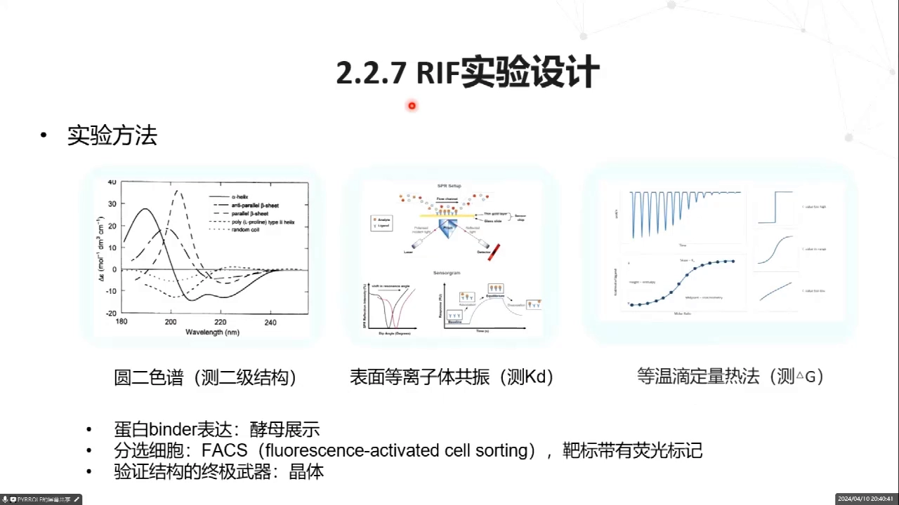 |
| 实线就是一个 α 螺旋的信号。就是我们，嗯，它本质上就是一个光谱嘛，它在扫这个不同的波长，然后不同的波长会有不同的响应值。那么这些不同的虚线就代表了是不同的二级结构组成。那么我们在实际上打一个蛋白的 CD 色谱的时候，他不会说是这么好看，其中某一条线它可能是个混合的…… [【跳转到 91:01】](https://www.bilibili.com/video/BV1mkdwBoE6Z/?t=5461) | 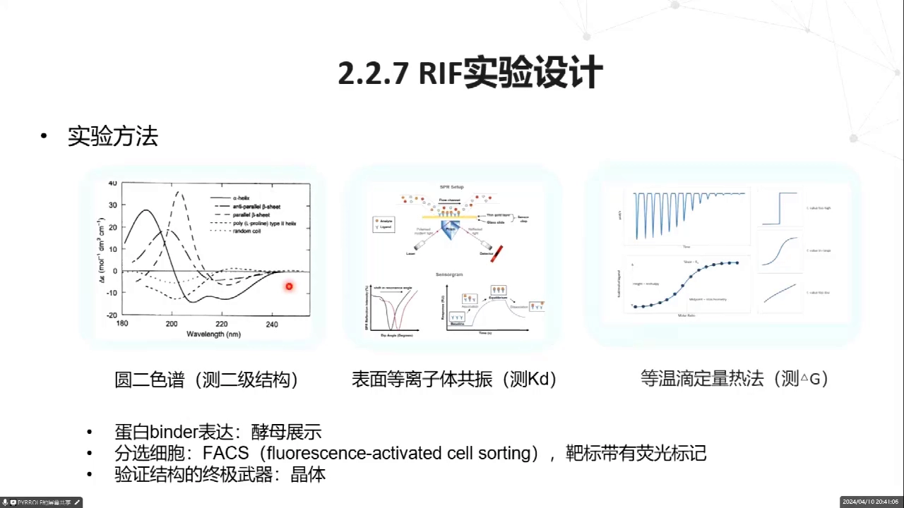 |
| 那么我们就需要用到傅立叶变换把它给去卷积到这几种基本的组成中，然后来看它各类二级结构含量占比是怎么样的。圆二色谱另一个非常重要的功能就是它可以随温度——就是你可以改，你测的时候可以改温度——这样的话你就可以看到这个蛋白它什么时候它的二级结构就变了，也就是说它的变性温度是多少，圆二色谱可以非常精确地测出来。 [【跳转到 91:26】](https://www.bilibili.com/video/BV1mkdwBoE6Z/?t=5486) | 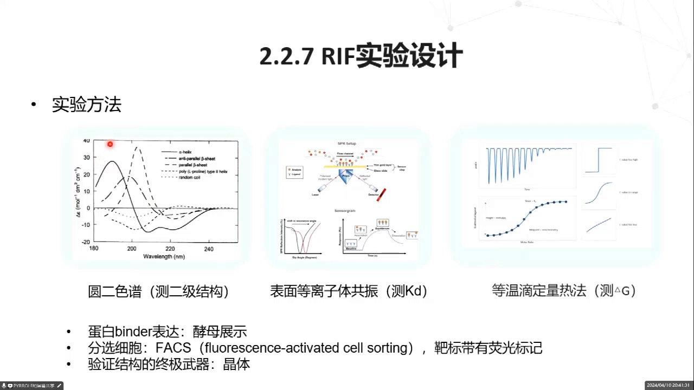 |
| 第二个比较重要的实验方法就是表面等离子体共振。这个的话大家可能也做过。它就是当你在你的芯片上——然后这下面有一束激光——然后当你这芯片上的这个载的东西发生了变化，比如说你配体结合之后呢，这个金属它的这个表面等离子体共振角…… [【跳转到 91:51】](https://www.bilibili.com/video/BV1mkdwBoE6Z/?t=5511) | 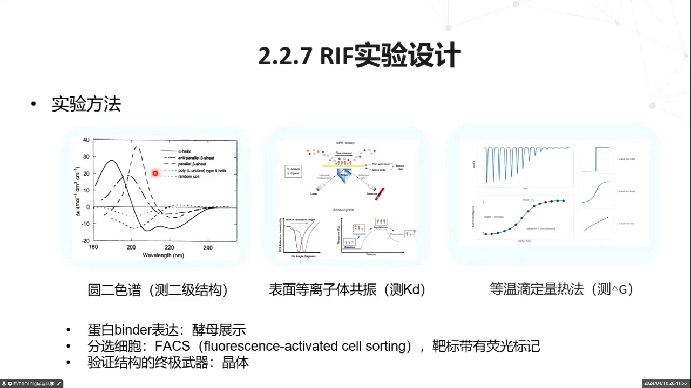 |
| 它的共振角会发生变化，然后表现在我们实验测的时候就会有这样的一个响应。我们通过这种曲线就可以测出来这个结合强度，就是 KD。然后第三个就是等温滴定量热法，这个如果是之前做过物化实验的话会比较熟悉，那么这个实验也是非常直接地去算它的这个 ΔG 是多少。因为我们刚刚说的 MM/PBSA 之类都是理论上计算…… [【跳转到 92:16】](https://www.bilibili.com/video/BV1mkdwBoE6Z/?t=5536) | 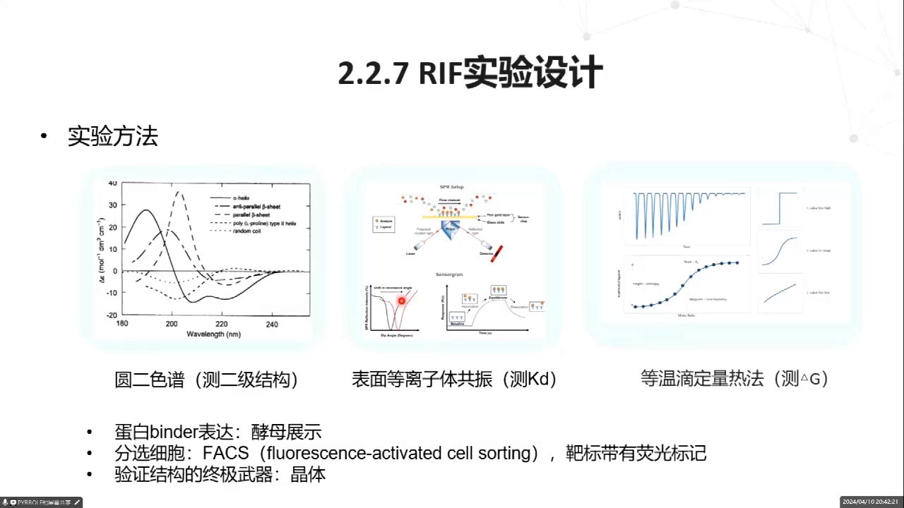 |
| 这个就可以直接测、直接测它的焓变，非常方便。然后下面这几个呢我就不详细说了。首先是蛋白的表达，它是一个非常高通量的酵母展示技术，然后分选细胞就是把靶标上带上一个荧光标记，然后用这种基于荧光的 cell sorting；然后第三个就是——当然他们这个组真的是，这个工作量太大了——他们还解了晶体，晶体就是验证结构的终极武器了。 [【跳转到 92:41】](https://www.bilibili.com/video/BV1mkdwBoE6Z/?t=5561) | 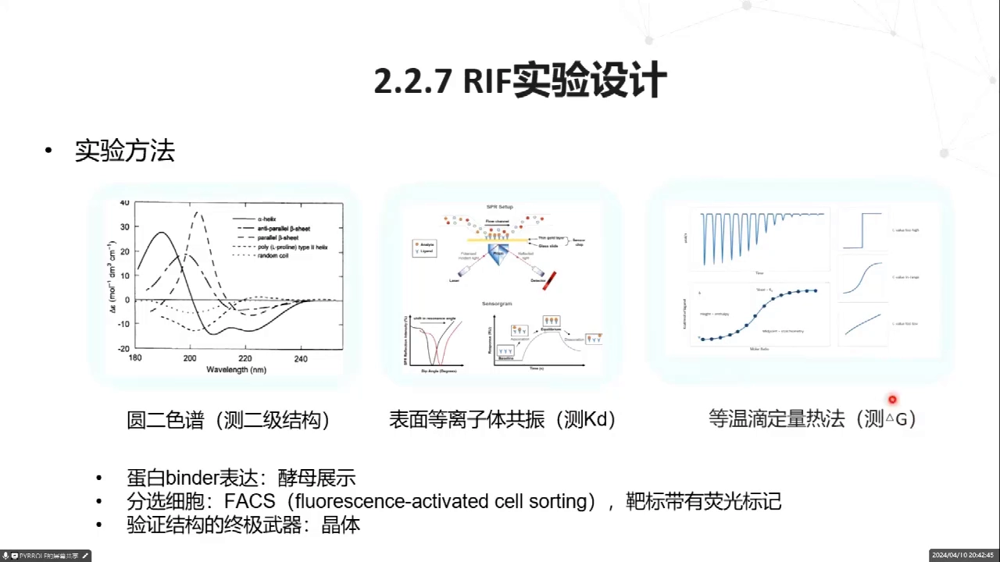 |
| 接下来就是它的一个设计结果与圆二色谱。我们可以看到这些 binder 就是螺旋含量很高，然后它的这个蓝色的线——我们可以看到——就是跟它想要设计的，就是它实际圆二色谱测出来的结构和它设计理想中的是一致的。 [【跳转到 93:06】](https://www.bilibili.com/video/BV1mkdwBoE6Z/?t=5586) | 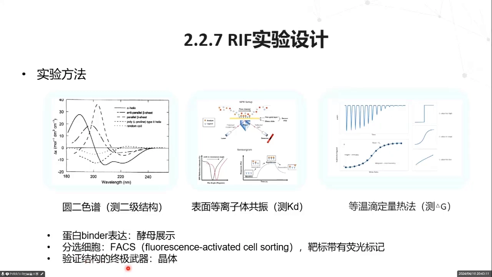 |
| 然后比较有意思的是这个靶向人类流感病毒 A H3 蛋白的 binder 设计。H3 它首先是分为两个类型，那我们其实已经有靶向 group one 的小分子，就是这 H3 分为 group one 和 group two 两种类型的蛋白，我们已经有了靶向 group one 的小分子。但是因为 group two 的结合口袋环境…… [【跳转到 93:30】](https://www.bilibili.com/video/BV1mkdwBoE6Z/?t=5610) |  |
| 与 group one 有较大的差异。一是它里面有一个色氨酸的取向翻转。因为我们知道色氨酸有非常大的这个芳香——就是芳香的环——那它尤其在结合小分子，就是这种结合面积很小的情况下，所以说色氨酸对这个结合的贡献非常大。如果它的取向翻转了的话，这个小分子大概率是不能再结合这个口袋，然后实际上也确实如此。 [【跳转到 93:55】](https://www.bilibili.com/video/BV1mkdwBoE6Z/?t=5635) |  |
| 二是这个 group two 蛋白它周围有糖基化，导致这个口袋比较亲水，而且也体积变小了，然后就肯定是没有办法挪用 group one 的这个小分子了。那么本文——就是这个文章——它非常有意思的是设计出了能够同时结合 group one 和 group two 的抗体，然后并且通过竞争实验说明结合位点与已知的位点一致，也与它设计的位点一致。 [【跳转到 94:20】](https://www.bilibili.com/video/BV1mkdwBoE6Z/?t=5660) | 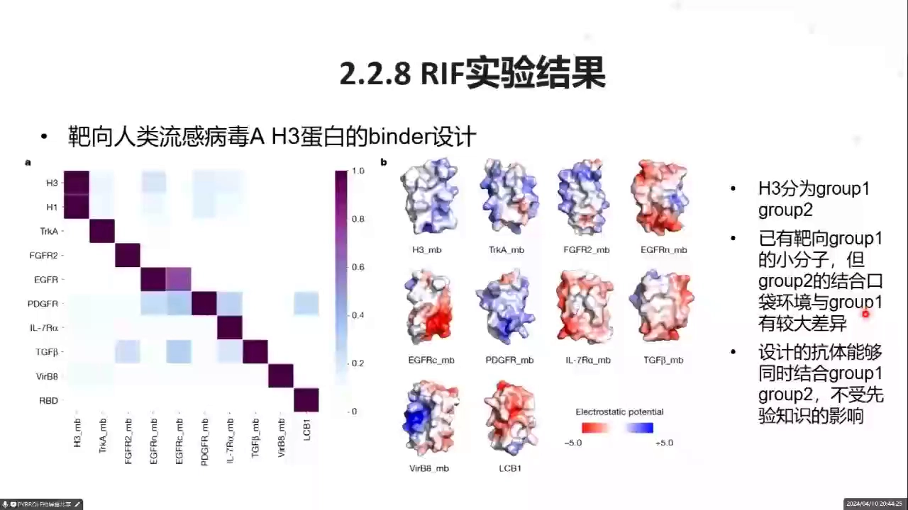 |
| 并且也做了结合特异性实验。就是左边这张图，H3MB——就是他设计的这个 mini binder——我们可以看到它并没有出现其他特性，只是与这两类蛋白结合。然后整体而言，我觉得这个实验最能说明这种方法的一个优势，就是我并不必须要依靠已有的靶标结构…… [【跳转到 94:45】](https://www.bilibili.com/video/BV1mkdwBoE6Z/?t=5685) | 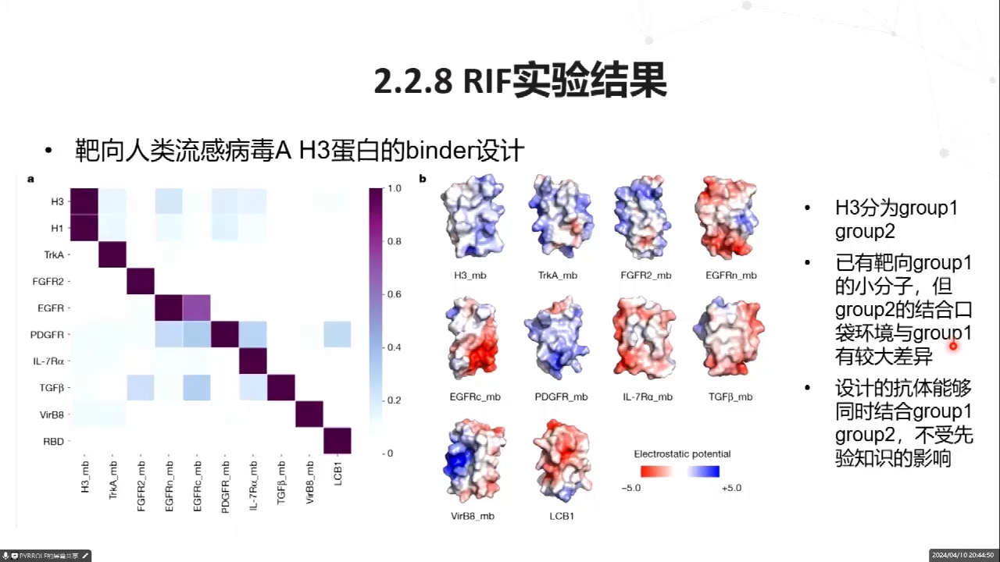 |
| 设计出的抗体能够同时结合这两种蛋白，不受先验知识的影响。 [【跳转到 95:10】](https://www.bilibili.com/video/BV1mkdwBoE6Z/?t=5710) | 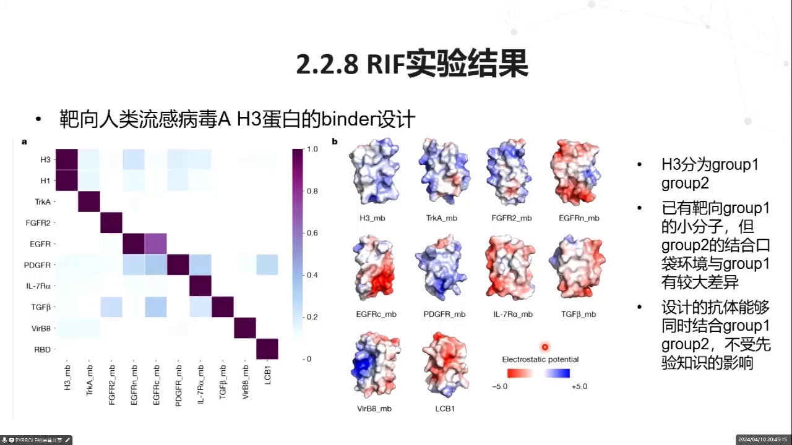 |
| 这个的话就是晶体的结构。我们可以看到这些其实侧链它们叠合得都比较好。然后具体分辨率我忘了，分辨率我并没有太关注，但是他们和晶体结构、设计的结构叠合起来的话，大概也就是 2 Å 左右，是非常好的一个设计。 [【跳转到 95:17】](https://www.bilibili.com/video/BV1mkdwBoE6Z/?t=5717) | 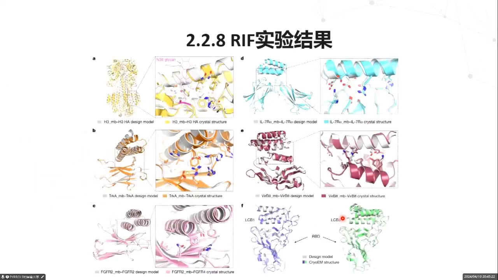 |
| 最后总结一下 RF 工作的亮点吧。首先是它采用了更高效的 high-level extension 就是这种方法，产生了高质量的、多样性的骨架库，一共是 3 万多个。然后但是为了——可能也不算亮点了——就是为了节省这个计算资源，它是在 RF 就是这个侧链构象采样时…… [【跳转到 95:41】](https://www.bilibili.com/video/BV1mkdwBoE6Z/?t=5741) | 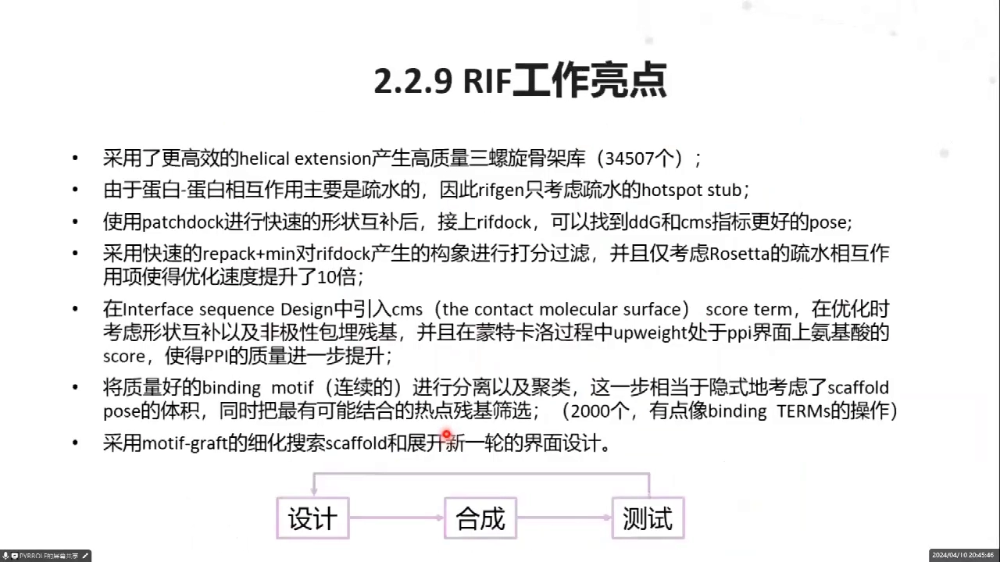 |
| 它只是考虑了疏水的这种 hotspot，然后在第三个就是在使用 patch dock 进行快速的形状互补之后再接上 RAPDock。也就是说我们不仅考虑 RF 分数，还要考虑这个结构适配度，我们可以找到结合自由能；还有就是 CMS，就是也是结构适配度，是 Rosetta 的结合适配度指标，更好的一个 pose。patch dock 是另一个软件。然后第四个是采用快速的…… [【跳转到 96:06】](https://www.bilibili.com/video/BV1mkdwBoE6Z/?t=5766) | 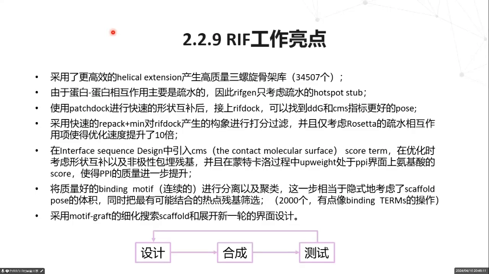 |
| repack 加 minimization，就是侧链重新搜索构象，加上整体能量最小化，并且仅考虑在它的疏水相互作用下，使得优化速度提升了十倍，因为主要还是就有疏水作用嘛。然后接下来就是在界面的序列设计中同样引入了这个 contact molecular surface，就是说这个结构适配度的指标。 [【跳转到 96:31】](https://www.bilibili.com/video/BV1mkdwBoE6Z/?t=5791) | 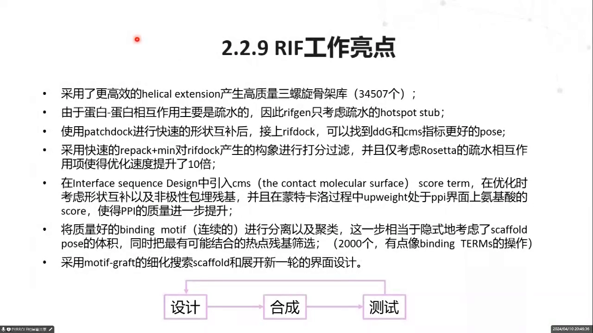 |
| 那么在优化的时候考虑形状互补以及非极性的包埋残基，并且在蒙特卡罗过程中对于这个 PPI 界面上的计算，他给一个更高的权重，这样也使得 PPI 设计出来质量进一步提升。最后呢，它是将质量好的 binder motif，也就是一些连续的 motif…… [【跳转到 96:56】](https://www.bilibili.com/video/BV1mkdwBoE6Z/?t=5816) | 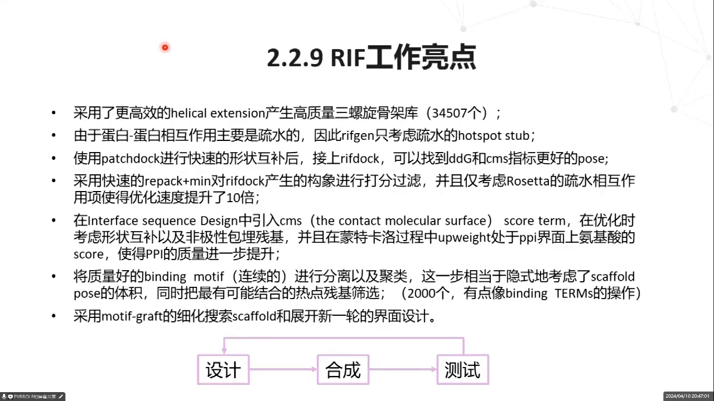 |
| 进行分离以及聚类，这一步相当于就是隐式地考虑 hotspot 的体积，同时把最有可能结合了的热点残基给筛选出来了。最后一个就是它采用了 multi motif graft，就是这种蛋白质嫁接的方法，细化搜索 scaffold，然后并且展开了新一轮界面设计。所以我们可以看到，在我们当下的蛋白质 binder…… [【跳转到 97:21】](https://www.bilibili.com/video/BV1mkdwBoE6Z/?t=5841) |  |
| 蛋白质 binder 的一个流程中，基本上都是一种「设计—合成—测试」这样的一个循环。然后为什么是循环呢？就是我们大部分情况下，光设计一轮是不够的，肯定是要优化，至少要再进行一次优化。总体而言，这种迭代的「设计—合成—测试」循环能够系统性地提高设计成功率。 [【跳转到 97:46】](https://www.bilibili.com/video/BV1mkdwBoE6Z/?t=5866) | 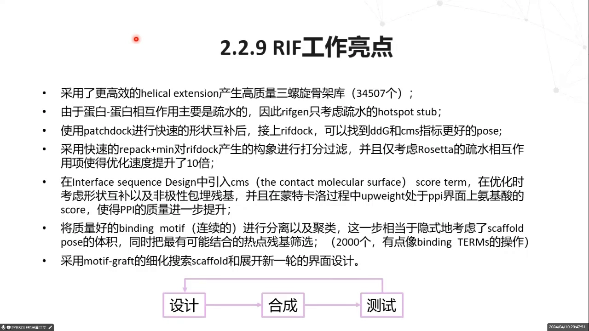 |
| 但是，虽然这个工作很厉害， [【跳转到 98:11】](https://www.bilibili.com/video/BV1mkdwBoE6Z/?t=5891) | 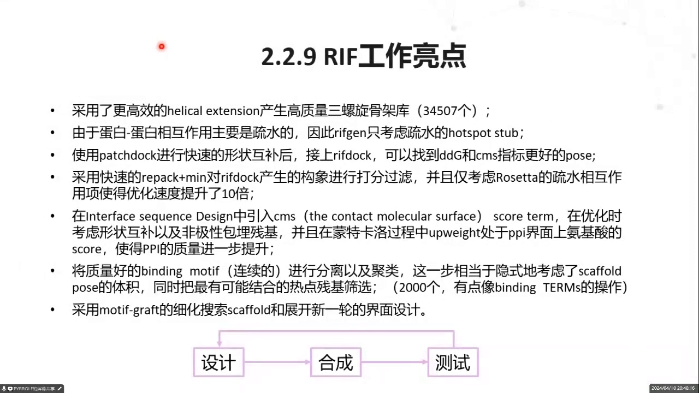 |
| 但是作者自己也提到了有一些待改进之处。比如说成功率还是比较低的，然后如果想要获得结合更好的残基，他们还是要做更大范围的饱和突变。第二个就是亲水性的界面它并不好设计。在本工作中，界面要至少包含四个疏水残基， [【跳转到 98:16】](https://www.bilibili.com/video/BV1mkdwBoE6Z/?t=5896) |  |
| 但我们知道，其实蛋白表面大部分都是亲水的嘛，所以说如果你只关注疏水的话，只是那么一小部分，肯定是设计不出来特别好的。还有就是值得一提的是，本工作构建了大量数据库，然后比如说有结合的蛋白骨架序列，然后也有没结合的，就是可以看到这种非常庞大的工作量。还有饱和突变，而且他们就是做了非常多的饱和突变。 [【跳转到 98:41】](https://www.bilibili.com/video/BV1mkdwBoE6Z/?t=5921) |  |
| 就是饱和突变，就是把一种氨基酸突变成另外其他 19 种，就是也是非常恐怖的工作量。那么作者他本质上是希望能够通过这些信息进一步去挖掘蛋白-蛋白相互作用，来节约设计蛋白质所需的资源。但是呢，就是我们说的这三个有待改进的地方，其实本质上都是因为我们的 Rosetta 打分函数。 [【跳转到 99:06】](https://www.bilibili.com/video/BV1mkdwBoE6Z/?t=5946) | 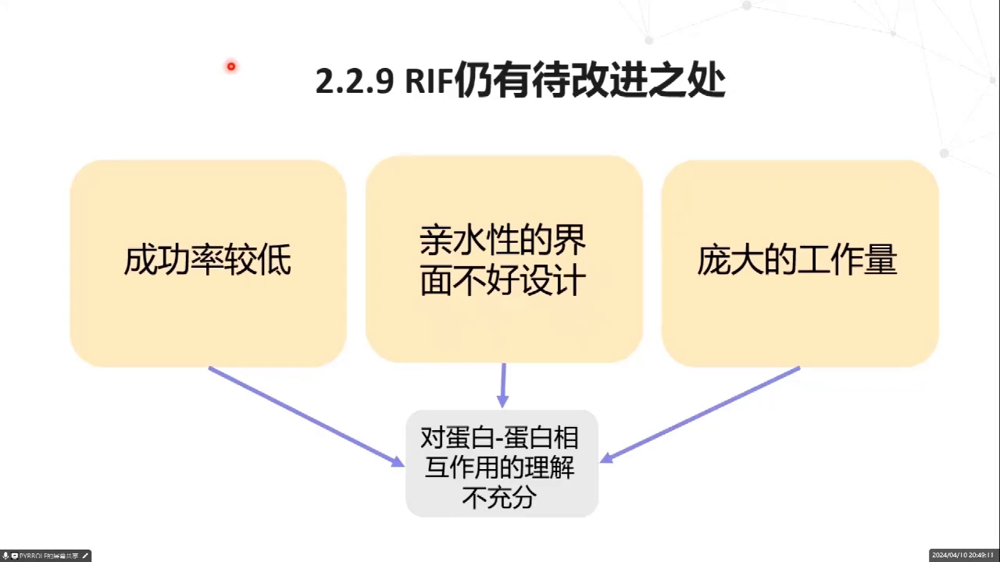 |
| 它毕竟还是一个、就是人为规定参数非常多的一种能量函数，虽然它表现已经很好了，那本质上还是说我们对蛋白-蛋白相互作用理解并不充分。因此就是我们在庞大的数据面前， [【跳转到 99:31】](https://www.bilibili.com/video/BV1mkdwBoE6Z/?t=5971) | 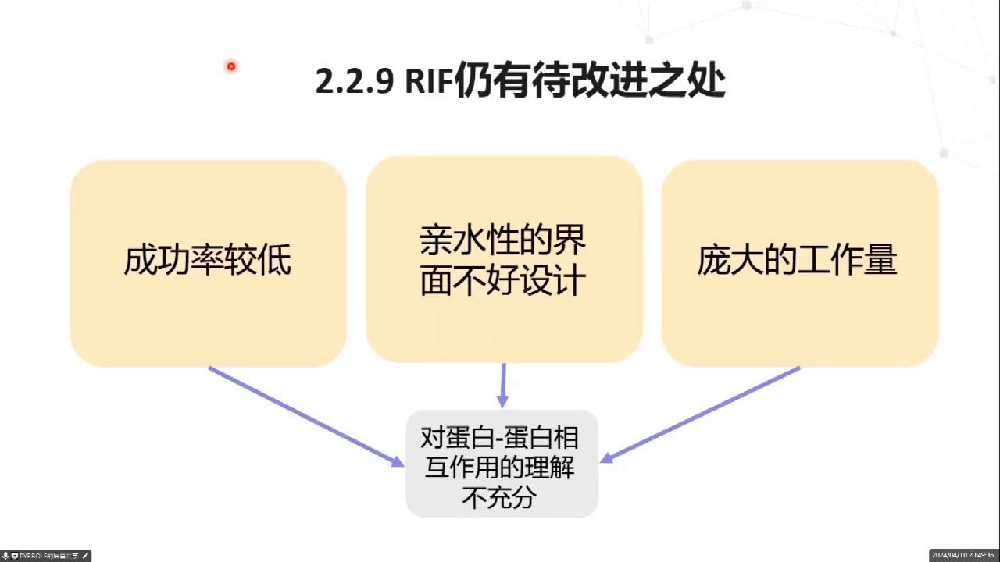 |
| 除了用物理的一些函数去描述，我们也可以引入一些深度学习的方法。那么下一节课我就会先给大家讲一些深度学习的基本知识，然后再给大家讲一下 ProteinMPNN 它的工作原理是怎么样的。然后我们现在也是休息 10 分钟，大家有什么问题可以打出来。 [【跳转到 99:45】](https://www.bilibili.com/video/BV1mkdwBoE6Z/?t=5985) |  |
| （此区间无字幕） [【跳转到 100:09】](https://www.bilibili.com/video/BV1mkdwBoE6Z/?t=6009) | 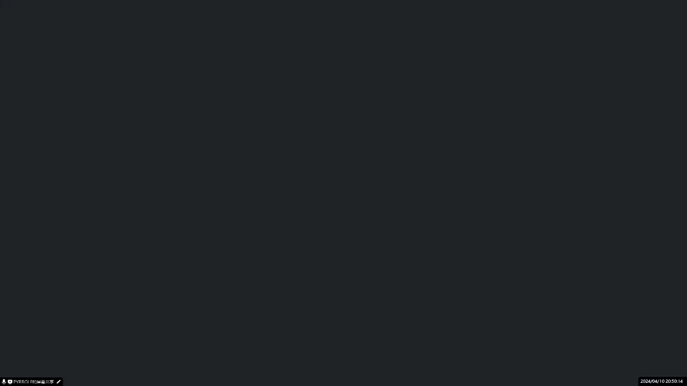 |
| 有饭吃，饿了。 [【跳转到 100:14】](https://www.bilibili.com/video/BV1mkdwBoE6Z/?t=6014) | 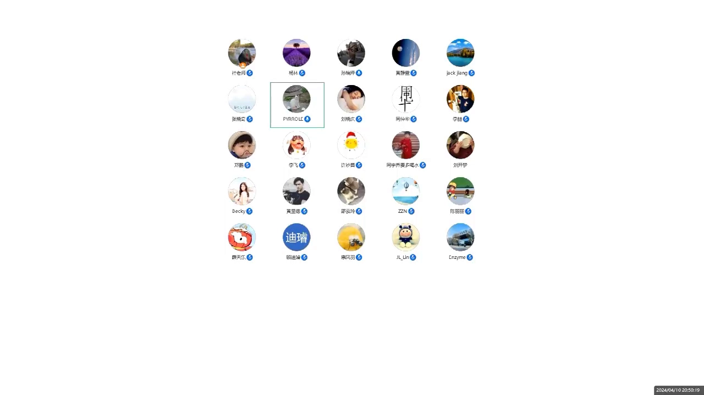 |
| （此区间无字幕） [【跳转到 100:39】](https://www.bilibili.com/video/BV1mkdwBoE6Z/?t=6039) |  |
| （此区间无字幕） [【跳转到 101:04】](https://www.bilibili.com/video/BV1mkdwBoE6Z/?t=6064) |  |
| （此区间无字幕） [【跳转到 101:29】](https://www.bilibili.com/video/BV1mkdwBoE6Z/?t=6089) |  |
| （此区间无字幕） [【跳转到 101:54】](https://www.bilibili.com/video/BV1mkdwBoE6Z/?t=6114) |  |
| （此区间无字幕） [【跳转到 102:19】](https://www.bilibili.com/video/BV1mkdwBoE6Z/?t=6139) |  |
| （此区间无字幕） [【跳转到 102:44】](https://www.bilibili.com/video/BV1mkdwBoE6Z/?t=6164) |  |
| （此区间无字幕） [【跳转到 103:09】](https://www.bilibili.com/video/BV1mkdwBoE6Z/?t=6189) |  |
| （此区间无字幕） [【跳转到 103:34】](https://www.bilibili.com/video/BV1mkdwBoE6Z/?t=6214) |  |
| （此区间无字幕） [【跳转到 103:59】](https://www.bilibili.com/video/BV1mkdwBoE6Z/?t=6239) |  |
| （此区间无字幕） [【跳转到 104:24】](https://www.bilibili.com/video/BV1mkdwBoE6Z/?t=6264) |  |
| （此区间无字幕） [【跳转到 104:49】](https://www.bilibili.com/video/BV1mkdwBoE6Z/?t=6289) |  |
| （此区间无字幕） [【跳转到 105:14】](https://www.bilibili.com/video/BV1mkdwBoE6Z/?t=6314) |  |
| （此区间无字幕） [【跳转到 105:39】](https://www.bilibili.com/video/BV1mkdwBoE6Z/?t=6339) |  |
| （此区间无字幕） [【跳转到 106:04】](https://www.bilibili.com/video/BV1mkdwBoE6Z/?t=6364) |  |
| （此区间无字幕） [【跳转到 106:29】](https://www.bilibili.com/video/BV1mkdwBoE6Z/?t=6389) |  |
| （此区间无字幕） [【跳转到 106:54】](https://www.bilibili.com/video/BV1mkdwBoE6Z/?t=6414) |  |
| （此区间无字幕） [【跳转到 107:19】](https://www.bilibili.com/video/BV1mkdwBoE6Z/?t=6439) |  |
| （此区间无字幕） [【跳转到 107:44】](https://www.bilibili.com/video/BV1mkdwBoE6Z/?t=6464) |  |
| （此区间无字幕） [【跳转到 108:09】](https://www.bilibili.com/video/BV1mkdwBoE6Z/?t=6489) |  |
| 嗯嗯，救命，真的很洋。 [【跳转到 108:34】](https://www.bilibili.com/video/BV1mkdwBoE6Z/?t=6514) | 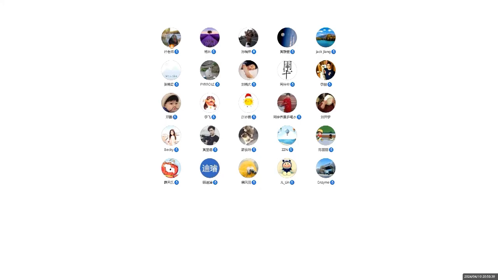 |
| （此区间无字幕） [【跳转到 108:59】](https://www.bilibili.com/video/BV1mkdwBoE6Z/?t=6539) |  |
| （此区间无字幕） [【跳转到 109:24】](https://www.bilibili.com/video/BV1mkdwBoE6Z/?t=6564) |  |
| （此区间无字幕） [【跳转到 109:49】](https://www.bilibili.com/video/BV1mkdwBoE6Z/?t=6589) |  |
| （此区间无字幕） [【跳转到 109:57】](https://www.bilibili.com/video/BV1mkdwBoE6Z/?t=6597) | 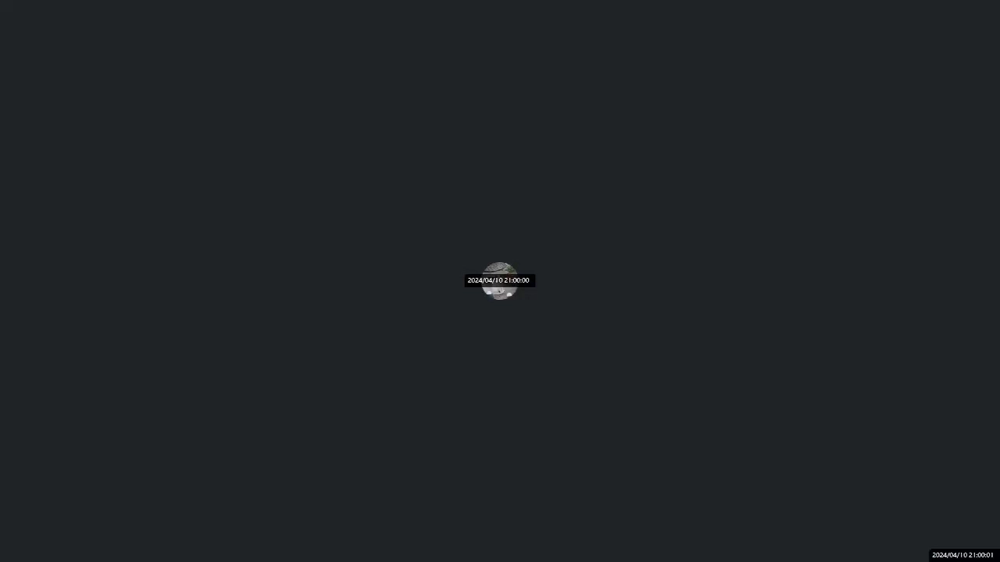 |
| （此区间无字幕） [【跳转到 110:02】](https://www.bilibili.com/video/BV1mkdwBoE6Z/?t=6602) |  |
| 好，大家能听到我说话吗？好的，然后我们接下来讲今天的最后一个部分，就是深度学习在蛋白质设计中的应用。然后我主要是讲在蛋白质序列设计中的应用。嗯，段飞飞同学好像没有关麦。 [【跳转到 110:27】](https://www.bilibili.com/video/BV1mkdwBoE6Z/?t=6627) |  |
| 哎呀，我刚还记得，transformer 你知道是什么吗？但是谁都知道，但是中文什么都知道，人家都没加中文。只要你 AI，不都是基于 transformer 吗，attention，那篇 Google 那篇重要的 Attention Is All You Need。呃，段飞飞同学你刚刚没有关麦。 [【跳转到 110:52】](https://www.bilibili.com/video/BV1mkdwBoE6Z/?t=6652) |  |
| 就是注意一下，大家可以检查一下自己有没有关麦，@一下老师。 [【跳转到 111:17】](https://www.bilibili.com/video/BV1mkdwBoE6Z/?t=6677) | 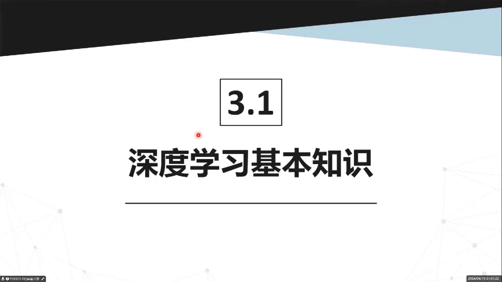 |
| 好的，我们继续讲。 [【跳转到 111:42】](https://www.bilibili.com/video/BV1mkdwBoE6Z/?t=6702) |  |
| 因为大家好像都是做湿实验的比较多，然后我就从 AI 发展的早期阶段开始讲起。首先介绍一下早期的重要概念和成就。首先就是我们为什么要做 AI 呢？AI 它就是人工智能嘛，它起源于我们人类对大脑工作机制的探索。实际上早在 1943 年就已经提出了…… [【跳转到 111:49】](https://www.bilibili.com/video/BV1mkdwBoE6Z/?t=6709) | 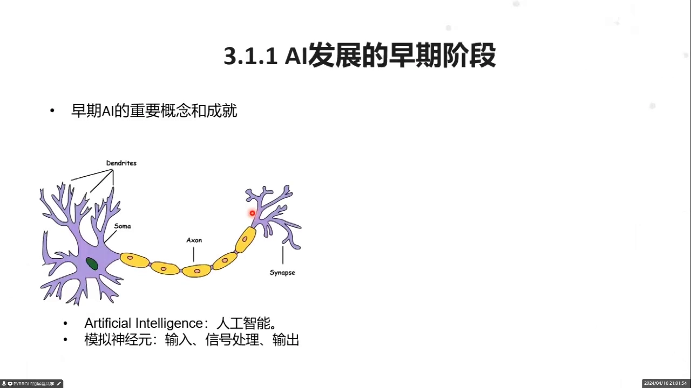 |
| 首个人工神经网络。那么 AI 主要的工作，或者说早期的一个研究方向，是说想要模拟神经元——就是神经元，我们知道，就是包括接收信号，然后这中间信号处理，然后最后输出传递给下一个神经元细胞。举一个例子，就是我们在看美剧的时候，我们的眼睛接收到信息， [【跳转到 112:14】](https://www.bilibili.com/video/BV1mkdwBoE6Z/?t=6734) |  |
| 我们的耳朵也接收到信息，这就是两个输入。然后我们经过一些神经元，他判断，诶，该不该笑，然后该笑，然后这……该笑、该笑，然后都是一，然后激活了。相当于说本来是一个非常多的神经元，最后集中到一个输出，一个输出就是一，你该笑。所以我们人就有这个反应，面部就有这个反应。当然实际上我们神经元非常非常多，然后整个工作机制也非常复杂。 [【跳转到 112:39】](https://www.bilibili.com/video/BV1mkdwBoE6Z/?t=6759) | 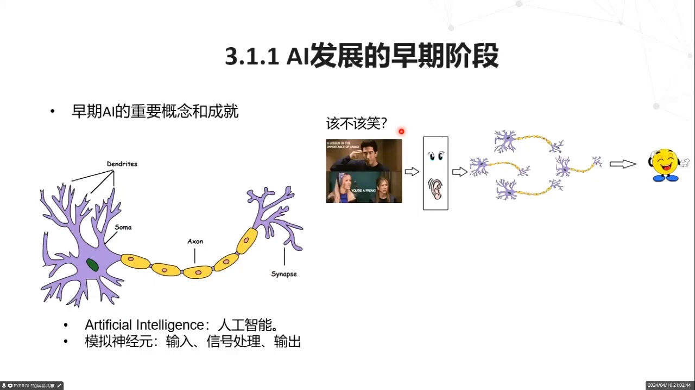 |
| 但实际上我们现在经常看到一些神经元、或者说神经网络的概念，我还是用一个比较、就是简单或者说方便于理解的形式给大家说一下。首先是我们经常听到什么各种 layer，这种 layer、hidden layer、什么 layer。那么尤其是在深度学习中， [【跳转到 113:04】](https://www.bilibili.com/video/BV1mkdwBoE6Z/?t=6784) | 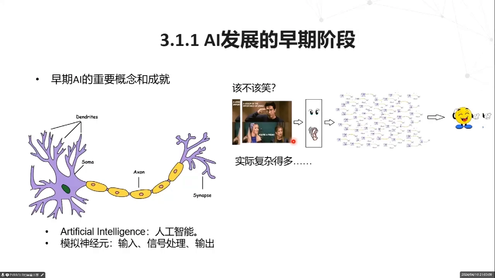 |
| 我们神经元它并不是单层，直接说你一个输入就直接输出的，它中间要经过多步的处理，那么多步处理对应的就是多步的 layer，也就是神经元分层处理信号的一个过程。比如说第一层信息，我们先检查这个 edges 还有 corners 是不是点、然后还有这些连线；然后第二步就是说我们要形成一些有特点的组，比如说这里是一个鼻子， [【跳转到 113:29】](https://www.bilibili.com/video/BV1mkdwBoE6Z/?t=6809) |  |
| 这里是嘴，这里是眼睛。那么第三步就是整个一个更高维的层面，就是我们要组成一个面部。这个可以理解为一个神经网络中不同层在干的事情。 [【跳转到 113:54】](https://www.bilibili.com/video/BV1mkdwBoE6Z/?t=6834) | 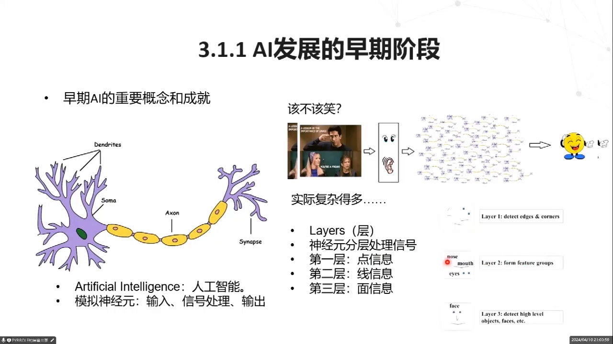 |
| 那么接下来给大家举几个重要的例子吧。比如说中国科学家吴文俊，他曾经用 AI 进行了几何定理的自动证明。然后第二个就是费根鲍姆质谱解析专家系统。其实这是一个上世纪 60 年代的事情， [【跳转到 114:11】](https://www.bilibili.com/video/BV1mkdwBoE6Z/?t=6851) | 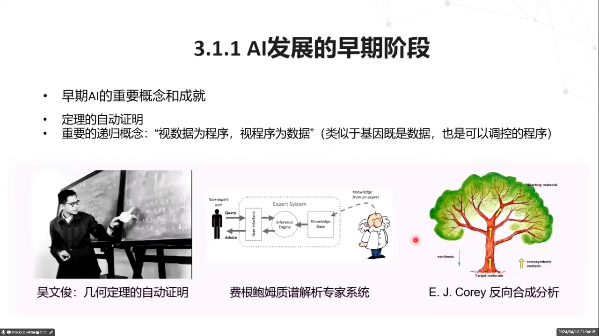 |
| 然后当时是一些科学家，其实是一个做天体生物学的人，他来求助费根鲍姆——他当时特别想做 AI——然后就跟他说，你能不能帮我分析一下我的数据，说是天体生物学，实际上就是分析火星上收集到的各种光谱、质谱，然后来打质谱呀， [【跳转到 114:36】](https://www.bilibili.com/video/BV1mkdwBoE6Z/?t=6876) | 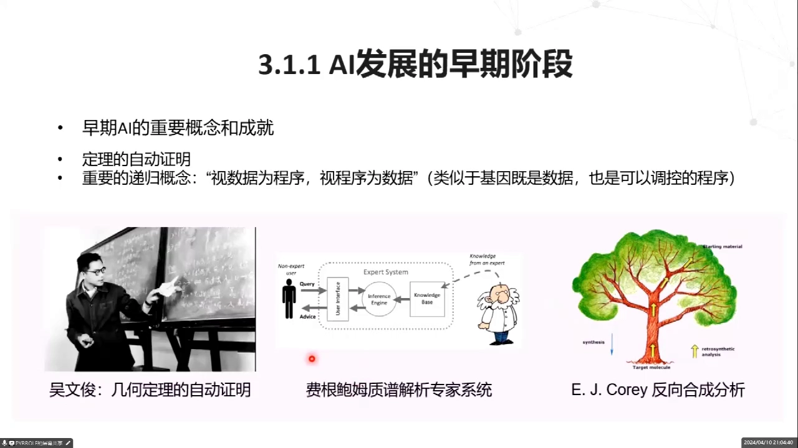 |
| 看他们是不是存在一些有机物，这样子。那么在当时的、在当时的一些学习方法，比如说吴文俊提出的几何定理自动证明，能够帮助我们来做奥数题，因为数学的每一条定律都是，就是像积木一样，都是一块一块这样搭起来的。但是对于像这种质谱解析的话，当时的思路还是说我要从最基础的东西开始训练起来， [【跳转到 115:01】](https://www.bilibili.com/video/BV1mkdwBoE6Z/?t=6901) | 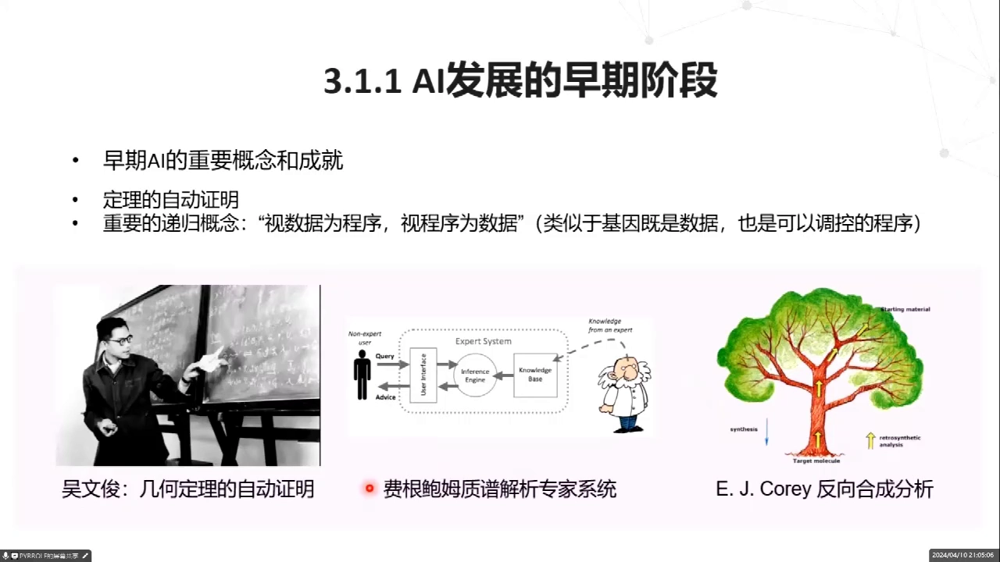 |
| 但是这个费根鲍姆他的一个创新点就是说引入了一个专家的先验知识。也就是说我一些专家先造出来很多的数据，然后我来训练这个模型，那么这样的话我就不需要从头去做，少走很多弯路。也就是说，这样的这个模型它就可以达到一种从几千种可能的分子结构中挑选出一个和质谱、最吻合这个质谱结果的一个正确分子结构， [【跳转到 115:26】](https://www.bilibili.com/video/BV1mkdwBoE6Z/?t=6926) |  |
| 简单说就是输入数据，然后输出一个化学结构。然后第三个比较著名的例子就是 E. J. Corey 的反向合成分析，它也是采用、也是使用了就是这种基于经验的、基于专家的关键经验，然后还有一些神经网络的模型，那么他也因此获得了诺贝尔奖。 [【跳转到 115:51】](https://www.bilibili.com/video/BV1mkdwBoE6Z/?t=6951) | 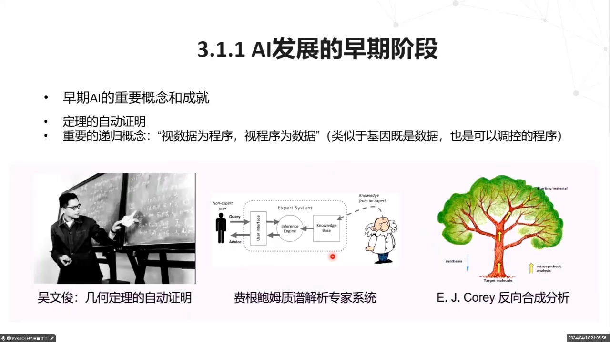 |
| 随着计算机技术的高速发展，计算机和科学仪器也是迅速地小型化和信息化，尤其是在 20 世纪下半叶，我们进入了高通量的时代。那么在高通量技术加支持下，产生了史无前例的大数据。那么下面我也是给大家举三个例子，第一个就是人类基因组。 [【跳转到 116:10】](https://www.bilibili.com/video/BV1mkdwBoE6Z/?t=6970) |  |
| 人类基因组计划，我们把人体中所有的基因组都测序出来，这是一个非常庞大的数据库。第二个就是高通量合成，最为直观的就是我们天天都在用的PCR。可能你之前如果从头合成一段核酸非常非常困难，但是有了多聚酶以后，你可以批量、大批量地生产核酸，这样也会给我们的实验带来非常多的数据。 [【跳转到 116:35】](https://www.bilibili.com/video/BV1mkdwBoE6Z/?t=6995) | 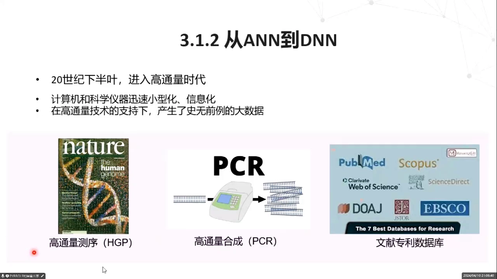 |
| 尤其是引入一些易错PCR（error-prone PCR）或者一些DNA改组（DNA shuffling）的PCR。第三个就是文献、专利数据库。我们知道，随着信息的发展，做科研的人越来越多了。 [【跳转到 117:00】](https://www.bilibili.com/video/BV1mkdwBoE6Z/?t=7020) |  |
| 科研手段也越来越方便、广泛，然后也越来越容易学了。所以随之而来的就是文献、一些实验方法、专利，还有数据库数量上一个指数级的增长。这些也是高通量时代下产生的一个非常典型的大数据。 [【跳转到 117:25】](https://www.bilibili.com/video/BV1mkdwBoE6Z/?t=7045) |  |
| 那么基于这些大数据，我们实际上就可以干更多的事情。比如说，我们知道人工神经元的本质实际上就是一个函数处理，Y等于F(X)，就是它的输入，它要输出一个Y，那么F就是我们要知道的事情。所以说AI本质上来讲就是一个万能的函数拟合器。 [【跳转到 117:47】](https://www.bilibili.com/video/BV1mkdwBoE6Z/?t=7067) |  |
| 那么X和Y可以是单变量、数组、向量或张量，然后也可以是各种东西，这样就让我们的后续应用有非常大的灵活性。那么早期的ANN（artificial neural network，人工神经网络）只有输入和输出层，我们现在所使用的DNN，也就是深度神经网络，它是在中间插入了若干层，也就是我刚刚说的分层的处理、很多分层处理。 [【跳转到 118:12】](https://www.bilibili.com/video/BV1mkdwBoE6Z/?t=7092) |  |
| 这样可以解决复杂的模式识别还有层次分类的问题。那么DNN是如何处理事物之间的关系、也就是层之间的关系的？它是用函数的解析形式表达，或者说在ANN中有这种显式的表达。那么在DNN中，这种隐藏的层就是我们说的人工智能是黑箱子——实际上就是说很多隐藏层中间的参数我们是没有办法解释的。 [【跳转到 118:37】](https://www.bilibili.com/video/BV1mkdwBoE6Z/?t=7117) | 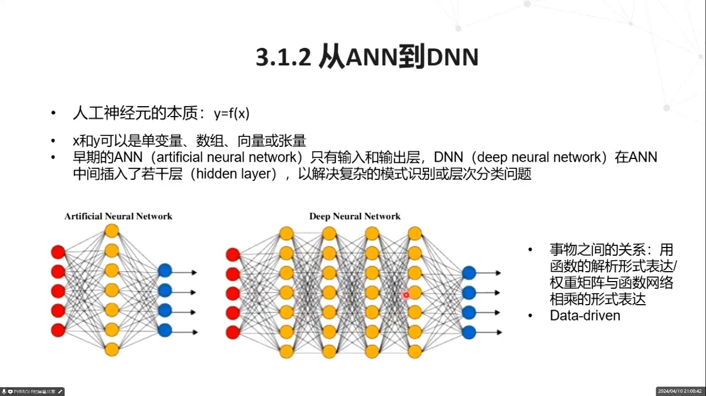 |
| 它的权重矩阵与函数网络相乘的形式表达，这个就是它输出的，我们一般是一个矩阵，然后再来一个函数网络。然后DNN一个最明显的特点就是因为数据太多了，就是我们现在数据量太大了，我们需要用更复杂的一个网络来处理，所以DNN明显是一个高通量与大数据时代下的产物。 [【跳转到 119:02】](https://www.bilibili.com/video/BV1mkdwBoE6Z/?t=7142) |  |
| 下面我还是介绍几个常用的深度学习模型。首先是机器学习算法，当然这个只是比较……我的意思就是ANN那些比较古老的算法，大家可能听得比较多，什么支持向量机——不好意思这里打错字了——随机森林，然后贝叶斯分类模型，还有概率神经网络，这些方法它们其实都是…… [【跳转到 119:27】](https://www.bilibili.com/video/BV1mkdwBoE6Z/?t=7167) | 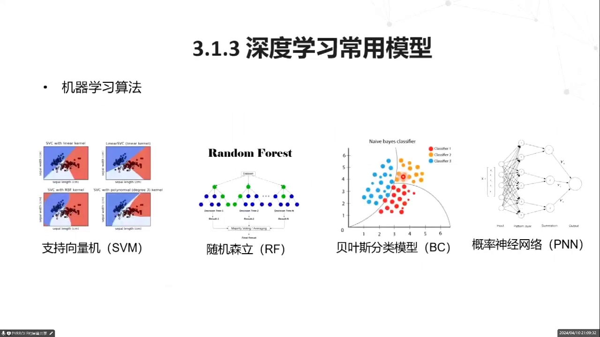 |
| 或者说本质上是在对一个矩阵做某种运算。它还是就是数学上或物理上具有比较高的解释性的。 [【跳转到 119:52】](https://www.bilibili.com/video/BV1mkdwBoE6Z/?t=7192) | 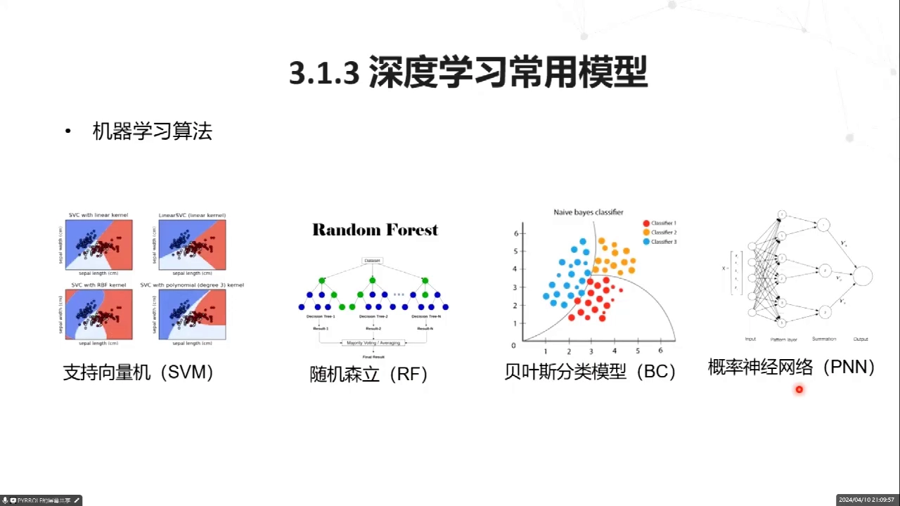 |
| 那么深度学习比较常见的算法包括多层感知器，它本质上就是一个全连接、就是全连接的一个层，它跟前面的神经网络比较像，但它是全连接的层，然后最后输出。然后是循环神经网络，但循环神经网络它有一个比较大的缺点，就是当你的数据量比较大…… [【跳转到 120:01】](https://www.bilibili.com/video/BV1mkdwBoE6Z/?t=7201) |  |
| 然后或者你的参数、你中间有一波参数大于1的时候，那么经过你多步的循环，它会产生非常大的数字，造成梯度爆炸；然后如果你的参数小于1的话，比如说0.5，那你循环了50轮，那0.5的50次方无限接近于零了已经，那就会造成梯度消失，没有办法继续优化。那么基于这个呢…… [【跳转到 120:26】](https://www.bilibili.com/video/BV1mkdwBoE6Z/?t=7226) | 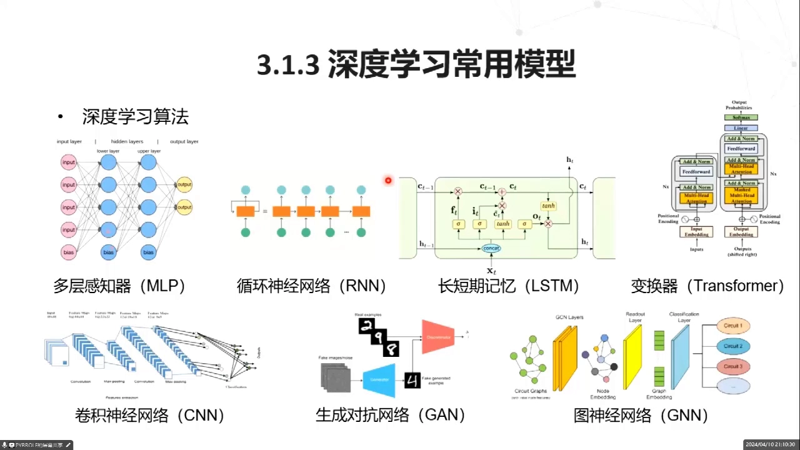 |
| 就是产生了这个长短期记忆模型，这个模型就可以来调整你远端输入的一个参数的权重，然后还有近端输入参数的权重，然后来防止这种梯度问题的产生。最后一个就是这种transformer，它里面有一个很重要的注意力机制。因为我们后面有专门的课程来讲这个transformer，我就不剧透了，我就不再讲了。然后下面这个是卷积神经网络。 [【跳转到 120:51】](https://www.bilibili.com/video/BV1mkdwBoE6Z/?t=7251) |  |
| 卷积神经网络最广泛的应用就是在图像处理方面，比如说手写数字的识别。它所谓的卷积就是downsampling，就是一种下采样的方法，把你……就是它本质上的目的是说你给它喂进去的数据里面其实有很多冗余的东西，你要把它进行一个浓缩。那么这个中间的这些layer…… [【跳转到 121:16】](https://www.bilibili.com/video/BV1mkdwBoE6Z/?t=7276) | 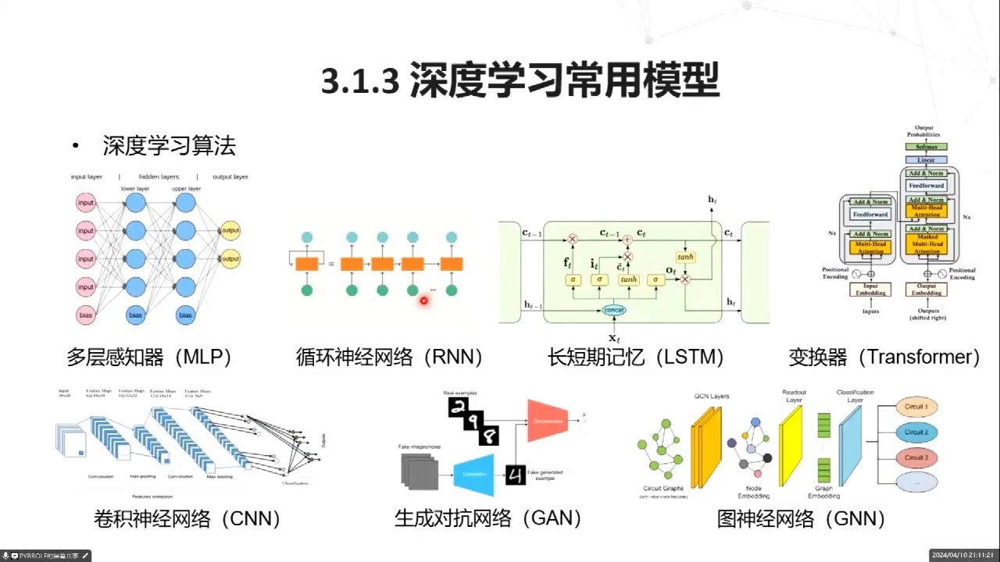 |
| 它们其实就是在干这些事情。还有生成对抗网络（GAN），这个网络其实如果放现在来说可能是比较老的网络，可能两年……但是两年前还是非常非常新的网络。它就是说同时学习正确和错误的结果，然后如果是对于蛋白质设计来说，你就同时告诉他什么东西没结合、什么东西结合，让他来学习其中的一些…… [【跳转到 121:41】](https://www.bilibili.com/video/BV1mkdwBoE6Z/?t=7301) |  |
| 其中一些比较关键的参数。然后大家感兴趣的话可以看一下一个叫HelixGAN的工作，应该是两年前或三年前的工作，大家可以看一下，他是设计一个短螺旋态。最后一个就是图神经网络，也就是说我们今天要重点讲一下、重点讲一下的网络，这个图神经网络，它的输入…… [【跳转到 122:06】](https://www.bilibili.com/video/BV1mkdwBoE6Z/?t=7326) |  |
| 跟前面这些都不一样，它是图。并且我们的分子，因为蛋白质本质上就作为一个分子嘛，分子它也是用图神经网络来表征是最好的。 [【跳转到 122:31】](https://www.bilibili.com/video/BV1mkdwBoE6Z/?t=7351) |  |
| 下面就是介绍完了我们之前ANN中的机器学习算法，然后还有我们深度神经网络中的一些算法。那么接下来就是给大家介绍一下近年来应用于蛋白质设计的深度学习模型。这个主要是从2020年开始的，属于当时的重磅消息AlphaFold2。那么它完成的任务是从sequence to structure…… [【跳转到 122:44】](https://www.bilibili.com/video/BV1mkdwBoE6Z/?t=7364) |  |
| 就是从序列到结构，那么它使用的模型就是transformer。到了22年，structure……就是这个任务反过来了，从sequence to structure变成了structure to sequence，就是结构到序列。那么这个比较重要的工作就是ProteinMPNN，也是David Baker组发的，也是我们一会要讲的。那么它采用的就是message passing neural network…… [【跳转到 123:09】](https://www.bilibili.com/video/BV1mkdwBoE6Z/?t=7389) |  |
| 是一种消息传递的图神经网络。那么2023年也就是去年非常新鲜热乎的binder design、RFdiffusion，可能就是大家今天来听这个课可能也都知道这个东西，它就是一个非常厉害的、可以直接生成这个蛋白骨架的（模型）。那么它采用的模型也是非常火的扩散模型（diffusion model），就相当于是把这个东西打个马赛克…… [【跳转到 123:34】](https://www.bilibili.com/video/BV1mkdwBoE6Z/?t=7414) |  |
| 然后你让机器学怎么着把这个马赛克给去除、恢复到原貌。它实际上就是增加了一些扰动，对你的原始数据加一些随机的高斯噪声的处理，这个在后续的课程中也会详细讲到。那么在今年是更加新鲜热乎的RFAA工作，还有LigandMPNN工作。那么其实就是在我们现在这个时代——其实都不能算这个时代…… [【跳转到 123:59】](https://www.bilibili.com/video/BV1mkdwBoE6Z/?t=7439) | 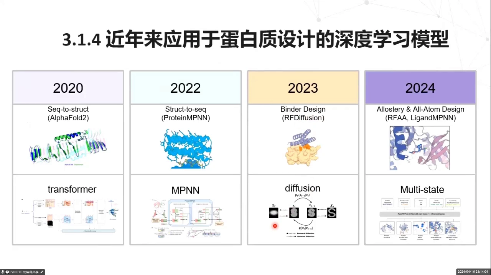 |
| 因为蛋白质设计这个领域真的是一年、每一年都突飞猛进。那么今年可能大家追寻的一个任务可能就是别构（allostery），还有all-atom比赛，但是all-atom比赛已经RFAA已经摘走它的桂冠了。当然也有非常多可以优化的地方，就是history design，还有一些enzyme design。就可能比如说现在一些酶的定向进化的工作，还是依靠高通量的人为筛选，实验非常大…… [【跳转到 124:24】](https://www.bilibili.com/video/BV1mkdwBoE6Z/?t=7464) |  |
| 而且你可能有同学筛了一个月两个月全是阴性结果，非常沮丧，那么就可以借助这种机器深度学习的模型，所以说它也是一个比较未来、比较火的方向吧。那么RFAA，它一个就是他这个模型跟之前相比最关键的一个地方，就是它引入了一个多模态的思想。多模态的思想就是说…… [【跳转到 124:49】](https://www.bilibili.com/video/BV1mkdwBoE6Z/?t=7489) |  |
| 它不仅以前、以往只生成蛋白质-蛋白质的相互作用，它可以生成蛋白质-小分子、蛋白质-DNA、蛋白质-其他分子这种多种模态融合，有点像我们现在用的一些人工智能聊天模型，比如GPT-4，还有一些Kimi Chat，我们国产的Kimi Chat，它既可以读取你的文字，也可以读取你的文件，然后还可以读取你的图片——读图片的话可能需要Midjourney——但是这种多模态在我们日常生活中…… [【跳转到 125:14】](https://www.bilibili.com/video/BV1mkdwBoE6Z/?t=7514) | 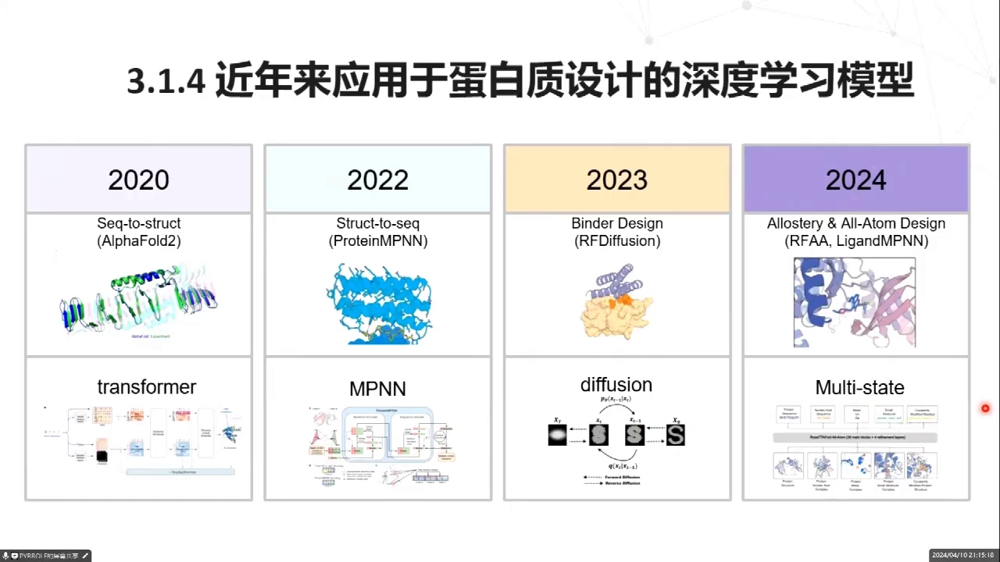 |
| 或者说自然语言处理中已经用得非常广泛，它也在慢慢渗透到我们蛋白质设计领域。 [【跳转到 125:39】](https://www.bilibili.com/video/BV1mkdwBoE6Z/?t=7539) |  |
| 接下来就是给大家讲一下基于深度学习的蛋白质序列设计。 [【跳转到 125:50】](https://www.bilibili.com/video/BV1mkdwBoE6Z/?t=7550) | 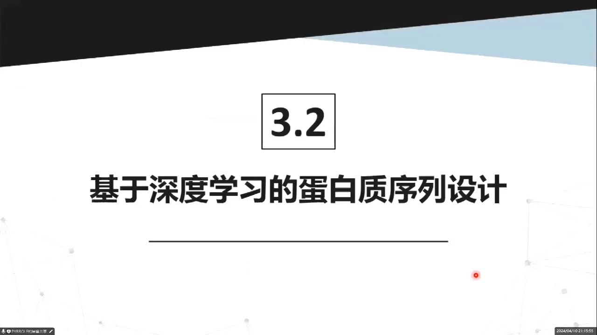 |
| 因为我们这里的工作介绍的主要是用图神经网络，所以还是要先给大家简单地介绍一下GNN，也就是图神经网络（graph neural network），它是专门为处理图数据结构、图结构数据设计的一种神经网络。那么我们看到图，说这个猫它不也是一个图吗？这些不也都是图吗？ [【跳转到 126:00】](https://www.bilibili.com/video/BV1mkdwBoE6Z/?t=7560) |  |
| 它们的区别在哪儿呢？在左边的话，这个东西、这种图片其实可以叫做image，它和text本质上是一类的，因为image我们可以把它拆成每一个pixel的信息，这种图片我们可以把它拆成每个像素点的信息。那么对于text的话，我们可以把它拆成token的信息。token大家可能比较常听到…… [【跳转到 126:25】](https://www.bilibili.com/video/BV1mkdwBoE6Z/?t=7585) |  |
| 你可以把它简单地、对于text来说可以把它简单地理解为一句话中的一个单词。我们如果是买一些GPT的API的话，他可能会说多少个token多少钱啊，就是这个意思。那么我们右边的这些呢，比如说这个是一个分子，这个是一个知识网络图，这个是一些流程图，这个又是我们大脑的一些神经元连接…… [【跳转到 126:50】](https://www.bilibili.com/video/BV1mkdwBoE6Z/?t=7610) |  |
| 这个就是基因的相互作用网络，这个又是一些联络、一些比较庞大的数据联络图，那这个就是一个软件的一个流程图，然后这个就是我们社交关系网络，更加复杂。那么这些图跟image有什么区别呢？就是这些图，你没有办法去用pixel、没有办法用像素去表示，因为你看这个分子，它是一个半胱氨酸…… [【跳转到 127:15】](https://www.bilibili.com/video/BV1mkdwBoE6Z/?t=7635) | 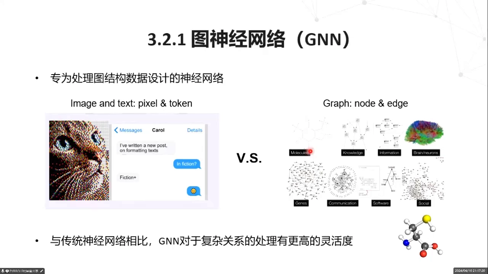 |
| 你把它旋转一下它还是半胱氨酸，但是你用pixel去表述的时候它就变了。所以说对于化学分子、社交网络、文献引用网络这些东西，我们管它叫做graph。那么image是由pixel组成的，text是由token组成的，我们的graph就是由节点和边组成的，分别就是代表node和edge。比如说对于（一个）化学分子来说…… [【跳转到 127:40】](https://www.bilibili.com/video/BV1mkdwBoE6Z/?t=7660) | 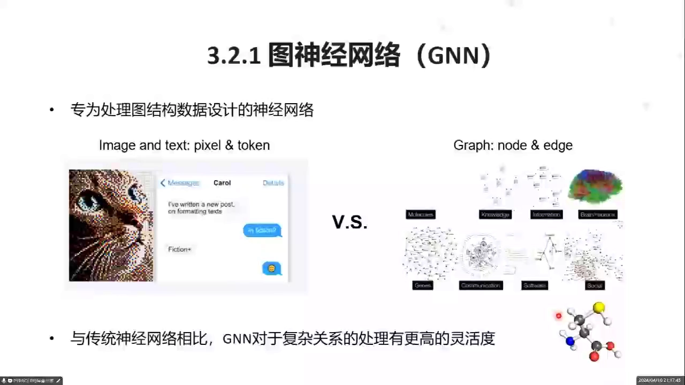 |
| 它的node节点就是这个球棍模型，非常形象，node就是这一个一个原子，edge就是它这个边。然后当然我们还可以包括其他的信息，我们的edge不一定说是这个键长，也可以包括它的一些力场参数的信息，还有它的这个、或者说所属分子的信息，然后原子杂化信息，它都可以存储在这个edge上。 [【跳转到 128:05】](https://www.bilibili.com/video/BV1mkdwBoE6Z/?t=7685) |  |
| 然后包括node，它也可以包括很多不同的性质。但是不管怎么说，这些graph它都是由node和edge来组成的。与传统神经网络相比，我们的GNN（graph neural network）它对于复杂关系的处理有更高的灵活度，因为我们可以看一下之前所说的神经网络…… [【跳转到 128:30】](https://www.bilibili.com/video/BV1mkdwBoE6Z/?t=7710) | 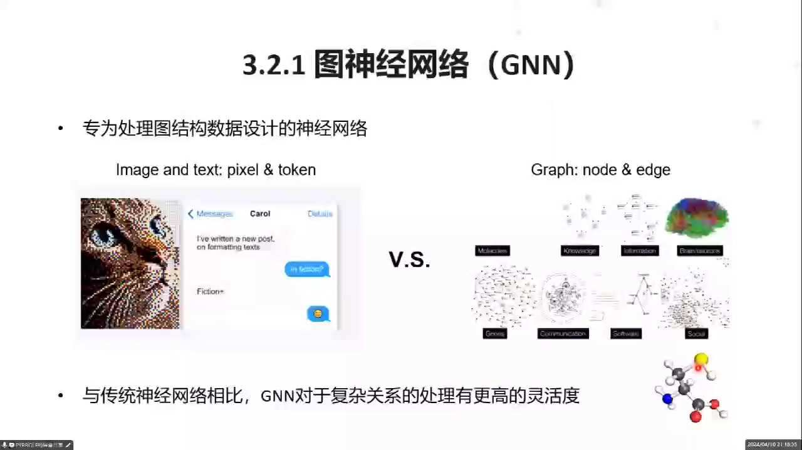 |
| 它只能关注到节点、就是node本身的信息。 [【跳转到 128:51】](https://www.bilibili.com/video/BV1mkdwBoE6Z/?t=7731) | 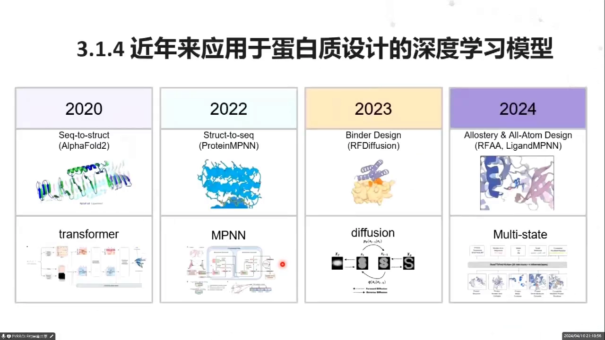 |
| 但是对于node之间的连接关系它并不能捕捉到，那么GNN图神经网络就可以达到这样的效果。 [【跳转到 128:56】](https://www.bilibili.com/video/BV1mkdwBoE6Z/?t=7736) |  |
| （此区间无字幕） [【跳转到 129:02】](https://www.bilibili.com/video/BV1mkdwBoE6Z/?t=7742) |  |
| 然后还有从另一个角度来理解image和graph的区别，就是image你可以把它理解为一个晶体。你想象一个晶体结构，比如说简单立方堆积的一个晶体，它每个node周围节点连接都是一样的、都是一样的，就是这个pixel它们之间连接关系都是一样的。 [【跳转到 129:07】](https://www.bilibili.com/video/BV1mkdwBoE6Z/?t=7747) |  |
| 就上面一个、下面一个、左边一个、右边一个一样。但是右边的这个graph它是不一样的，它是各向异性的，它不同的节点它周围的连接信息不同，然后也可以从这个角度来理解它们俩的区别。 [【跳转到 129:32】](https://www.bilibili.com/video/BV1mkdwBoE6Z/?t=7772) |  |
| 下面就要介绍一下消息传递神经网络，也就是MPNN（message passing neural network）。那么这个工作最初是一个量子化学家提出来的，这篇文章是一个会议文章。他为什么要做这件事情呢？我们知道就是量子化学…… [【跳转到 129:46】](https://www.bilibili.com/video/BV1mkdwBoE6Z/?t=7786) | 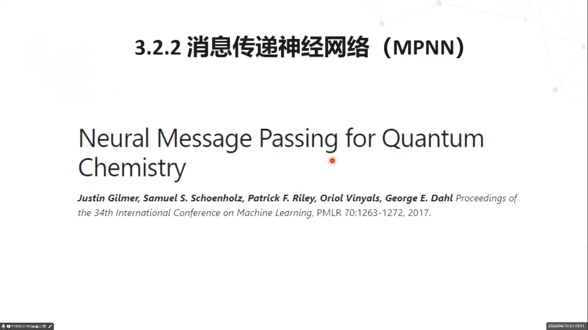 |
| 最关键的工作就是去预测一个分子的量子化学性质，就是他最关键的一个工作是去预测分子的物理性质，比如它红外光谱什么样、紫外光谱什么样、振动能啥样，然后它的熵什么样，这个是他们非常关心的东西。那么如果想要从解析的方式去得到它，我们需要用薛定谔方程，当然是说你可以写出来…… [【跳转到 130:11】](https://www.bilibili.com/video/BV1mkdwBoE6Z/?t=7811) |  |
| 但是没有人会去解它，因为它实在是太难算了，太耗资源了。所以人们现在其实主流的方法就是密度泛函理论DFT。那么对于这样一个有一个取代基的芳香环分子，这个DFT要计算大概十的三次方秒，当然相比于薛定谔方程来说已经非常非常高效了。但是如果你想要高通量…… [【跳转到 130:36】](https://www.bilibili.com/video/BV1mkdwBoE6Z/?t=7836) |  |
| 说你可能初筛一个药物，你初筛出来几千个几万个，那你、那你得等到猴年马月去，对吧？所以说量子化学家就想要更快地预测这些小分子的量子化学性质，提出了一个通用的模型，就是基于消息传递读取图的信息。也就是说我直接告诉我的模型，我的分子长什么样…… [【跳转到 131:01】](https://www.bilibili.com/video/BV1mkdwBoE6Z/?t=7861) | 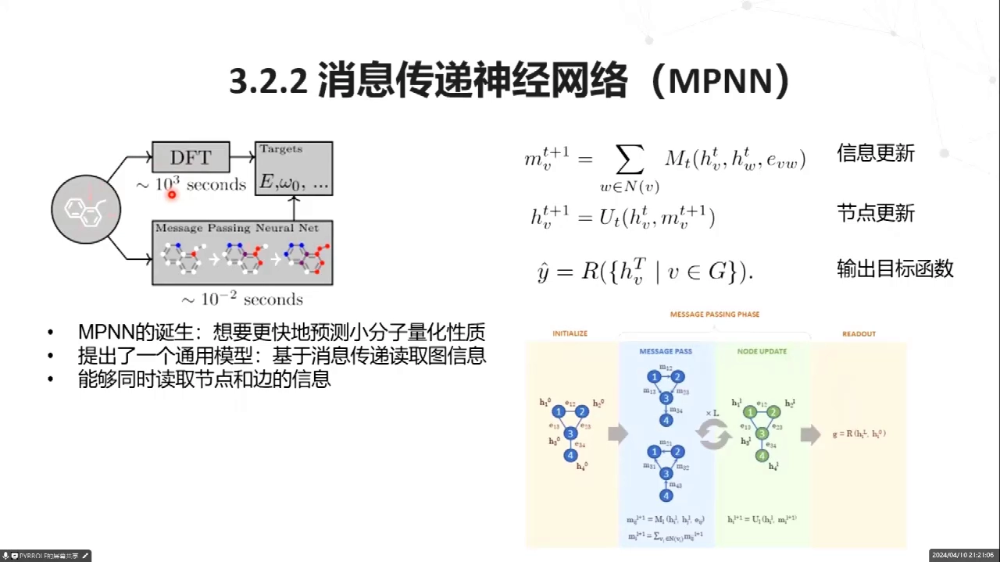 |
| 它的node、它的节点什么样，它节点之间的edge关系是什么样，他直接告诉你这些量子化学性质是怎么样，那这样计算的话只需要0.01秒就可以算出来了，通量大大的提高了。那么也是因为、之所以选择这种message passing的网络，也是因为它能够同时读取节点和边的信息。那么右边就是他一个基本的…… [【跳转到 131:26】](https://www.bilibili.com/video/BV1mkdwBoE6Z/?t=7886) |  |
| 基本的一个结构吧。首先，我刚刚说的GNN跟MPNN是什么关系呢？就是因为时间限制，我并没有把GNN讲得特别那么的详细。GNN实际上它也有很多变体，就比如说GNN、GCN就是卷积网络，还有一些其他的东西，但是MPNN相当于是一种概括性质的东西。 [【跳转到 131:51】](https://www.bilibili.com/video/BV1mkdwBoE6Z/?t=7911) |  |
| 不管你是什么样的图神经网络，你都要经历一个消息传递的过程，那么MPNN就是把这个过程给抽象出来的一个更大的框架，它主要是包括以下几个部分吧。首先是信息更新，信息更新的话，信息更新就是首先是你节点的信息…… [【跳转到 132:16】](https://www.bilibili.com/video/BV1mkdwBoE6Z/?t=7936) | 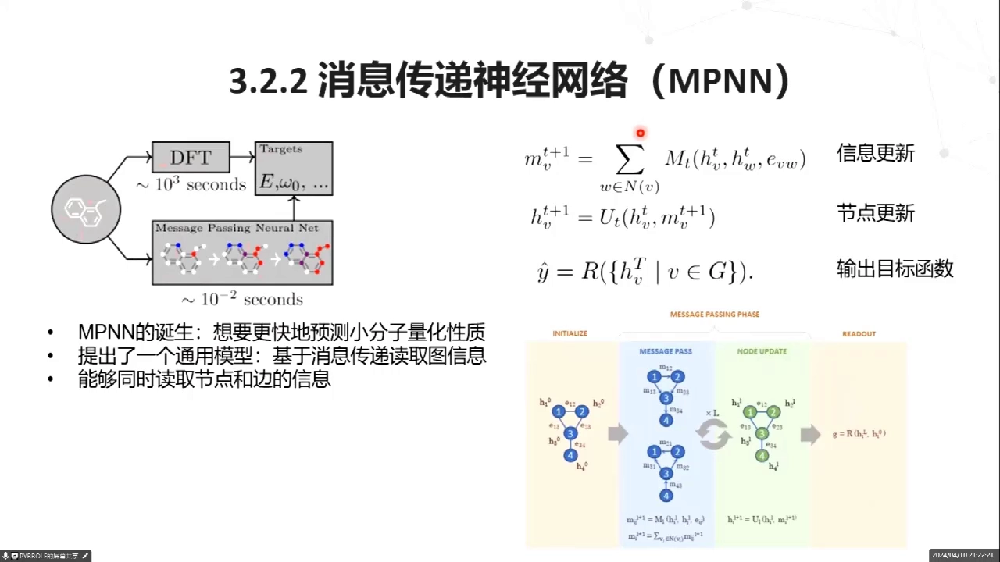 |
| 然后还有你边的信息、两个节点信息、边的信息。然后信息更新了之后呢，你在原地进行一个节点的更新，当然节点的更新也是包括了刚刚这里的信息更新，还有它本身的一个上一个隐含层它是什么、它是什么信息。然后接下来最后一步就是输出你的目标函数，你的目标函数跟你的这个、就是就是你想要什么嘛。 [【跳转到 132:41】](https://www.bilibili.com/video/BV1mkdwBoE6Z/?t=7961) |  |
| 比如说你在计算量子化学，你想要知道他的自由能啊、熵啊，那你这里输出的就是自由能和熵的值，然后通过训练来不断地优化你这些参数，能够达到说你给它一个新的分子，它来预测出新的性质。那么这个图就是一个比较详细的讲述。首先我们最开始赋予它节点和边的信息，然后在信息传递的过程中呢…… [【跳转到 133:06】](https://www.bilibili.com/video/BV1mkdwBoE6Z/?t=7986) | 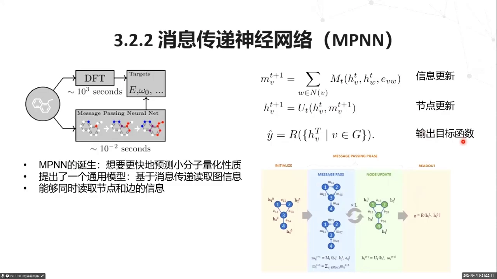 |
| 我们把不同的——就是我们可以看到，我们给它定义说，比如说他对他两个都有影响，然后他对这里有影响，然后他再影响到这里，然后经过这样的几次循环的时候呢，它每一次都会更新它的节点，然后呢再输出、最后输出一个你想要的函数。那么这里的MPNN是将它应用在一些…… [【跳转到 133:31】](https://www.bilibili.com/video/BV1mkdwBoE6Z/?t=8011) | 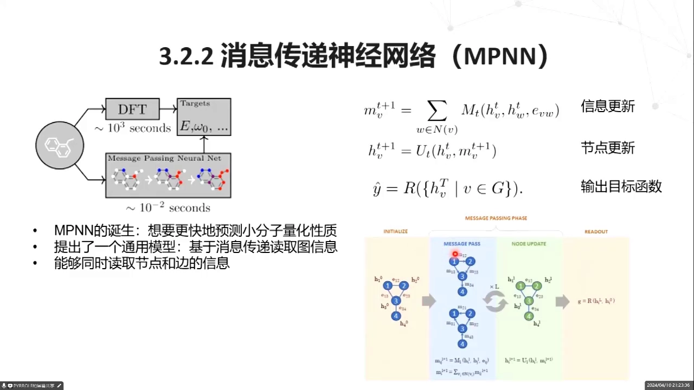 |
| 小分子当中。那么接下来我要介绍的工作就是把MPNN模型应用在蛋白质设计中。 [【跳转到 133:56】](https://www.bilibili.com/video/BV1mkdwBoE6Z/?t=8036) | 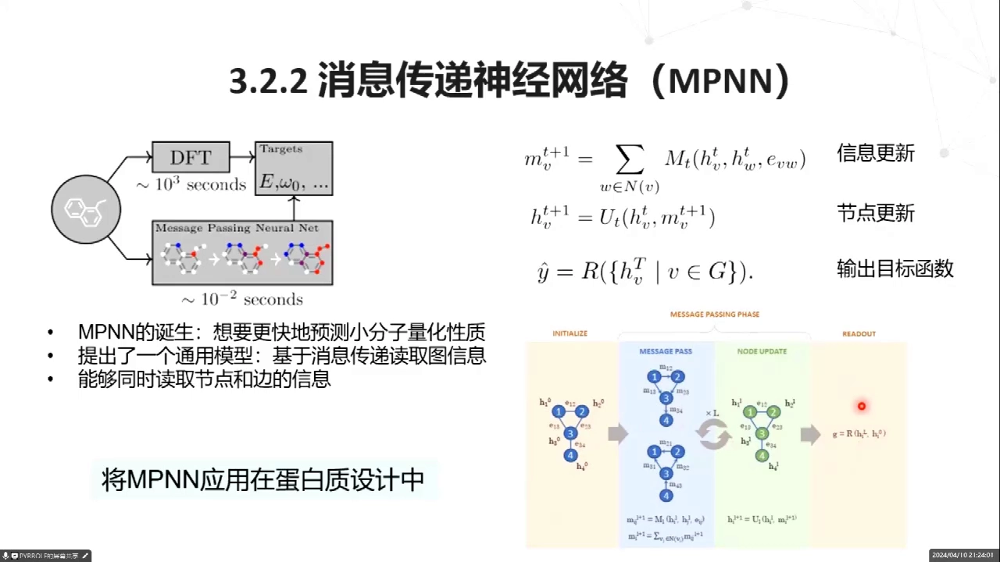 |
| 这篇文章还是David Baker组的工作，它的题目就是《Robust Deep Learning-Based Protein Sequence Design Using ProteinMPNN》。 [【跳转到 134:07】](https://www.bilibili.com/video/BV1mkdwBoE6Z/?t=8047) | 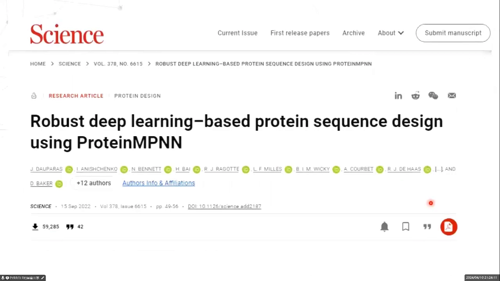 |
| 首先介绍一下它的结构，这个是两条输入的链。首先我要说明一下，我们的MPNN它不能——就是它你需要知道骨架，它只能设计序列，但是不能重新生成骨架，就是大家需要明确这一点。首先我先输入两条链，然后这两条链的话，上面就是骨架已经确定了嘛，然后我的输入是什么呢？我输入包括主链原子…… [【跳转到 134:22】](https://www.bilibili.com/video/BV1mkdwBoE6Z/?t=8062) |  |
| 还有侧链原子信息啊，然后还有一些distance信息，这些都是作为edges的信息来输入的。那么nodes，也就是说我每一个地方氨基酸的氨基酸的类型，我最开始是没有定义的，都是用zeros来表示。那么我每一次我都更新一次edge和nodes，就是从我最开始设定的这个参数来计算…… [【跳转到 134:47】](https://www.bilibili.com/video/BV1mkdwBoE6Z/?t=8087) | 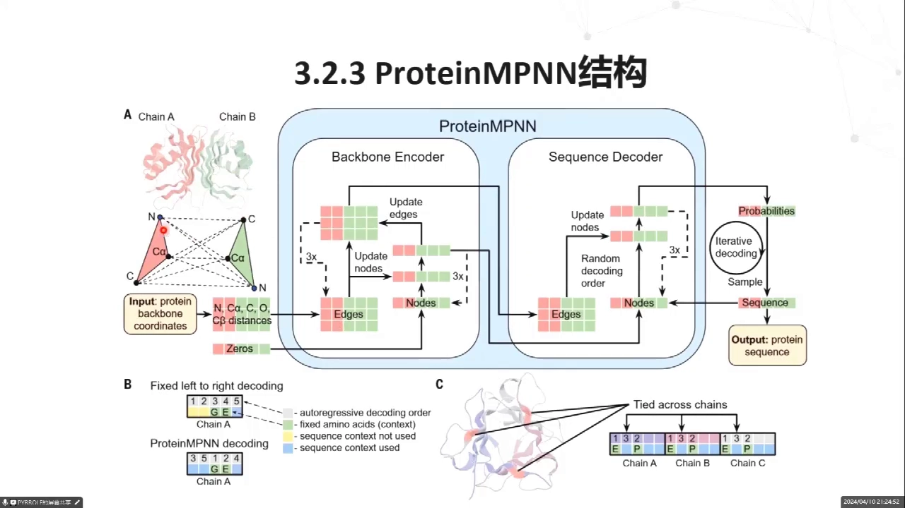 |
| 然后这样不停地循环、循环三轮，并且他这个工作和传统的、就之前的ProteinMPNN不一样的是，他的节点和边它是同时更新的，它每次循环它都更新了，因为我们总觉得edges这些distance它应该是不变的嘛，但是这里相当于是一个解放了backbone、解放了骨架限制的一种设计。然后他们在backbone encoder…… [【跳转到 135:12】](https://www.bilibili.com/video/BV1mkdwBoE6Z/?t=8112) |  |
| 也就是说把我输入的信息读取成一个计算机可以识别的语言之后，我把它输入到下一个decoder部分，Decoder就是说我根据这些信息我来输出每个位置上是什么样的氨基酸类型。那么这里也是有三次的、就是迭代的这种迭代的这种decoding，然后最后他输出的就是一个蛋白的序列。 [【跳转到 135:37】](https://www.bilibili.com/video/BV1mkdwBoE6Z/?t=8137) |  |
| （此区间无字幕） [【跳转到 136:02】](https://www.bilibili.com/video/BV1mkdwBoE6Z/?t=8162) |  |
| 下面是想说一下他这个模型的一个不断仔细调试和发展的过程。首先我们首先baseline model，也就是基准模型，后面所有的实验它的结果都要和基准模型去做比较。 [【跳转到 136:07】](https://www.bilibili.com/video/BV1mkdwBoE6Z/?t=8167) | 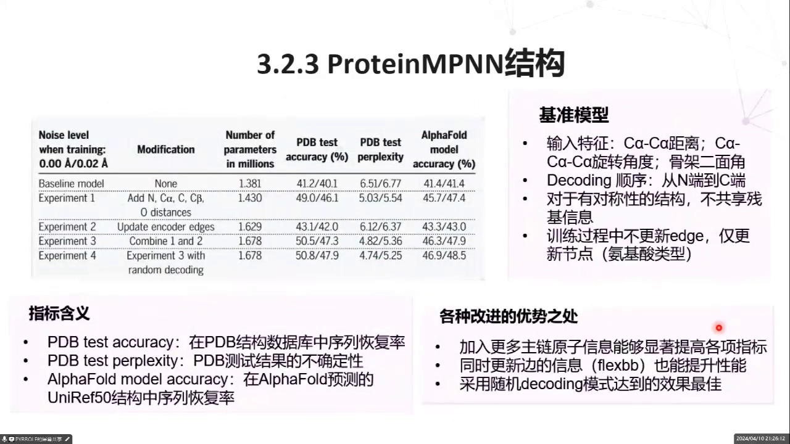 |
| 基准模型它输入的特征是Cα、Cα-Cα距离、Cα-Cα-Cα旋转角度，还有骨架的二面角。那么它decoding的顺序，也就是说他给不同位置分配氨基酸残基类型，它的顺序是从N端到C端。那么对于一些有对称性的结构，比如说像那种高度对称的结构呀…… [【跳转到 136:32】](https://www.bilibili.com/video/BV1mkdwBoE6Z/?t=8192) | 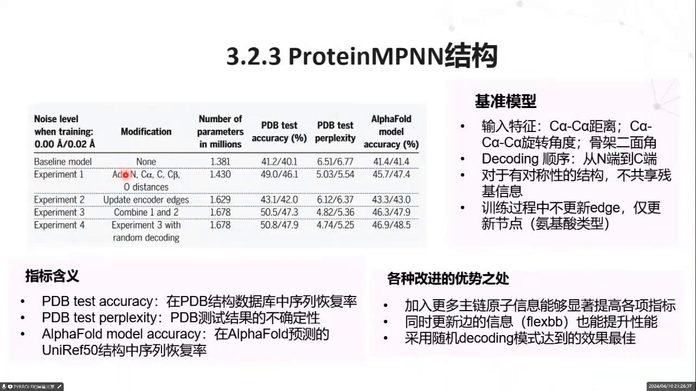 |
| 然后就是经常用CryoEM解出来那些特别复杂、链特别多的结构，它是不共享残基信息的。也就是说你在设计chain，可能chain A跟chain E，他们的长度啊还有结构都是一样的，但是你是、你就是单独设计它们。 [【跳转到 136:57】](https://www.bilibili.com/video/BV1mkdwBoE6Z/?t=8217) | 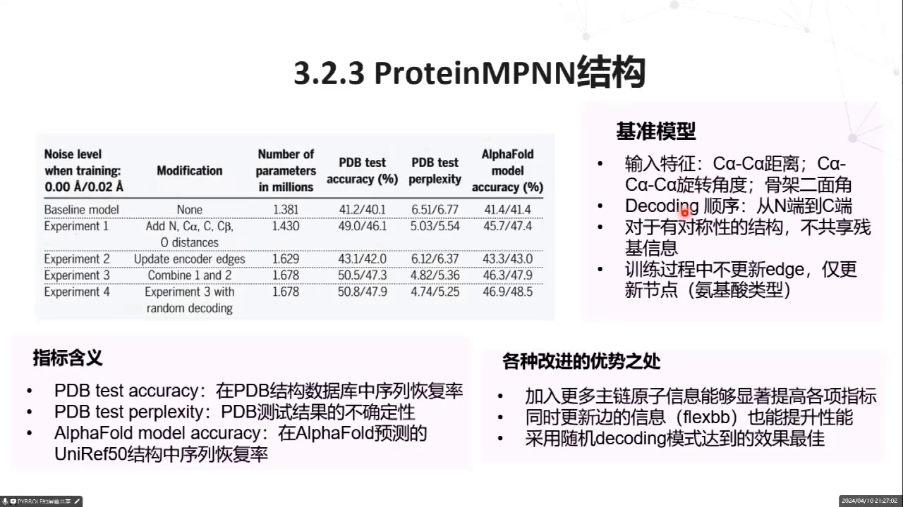 |
| 那么最后一个基准模型就是说，训练过程中不更新edge、不更新边的距离，也就是说fix backbone，fix我们这个主链构象，仅更新节点、就是仅更新氨基酸类型，这就是它的基准模型。那么接下来他是做了以下四个实验来评估这些指标。那我还是先给大家介绍一下这些指标都是什么意思。首先是PDB test accuracy，他的意思是说在PDB结构数据库中…… [【跳转到 137:22】](https://www.bilibili.com/video/BV1mkdwBoE6Z/?t=8242) | 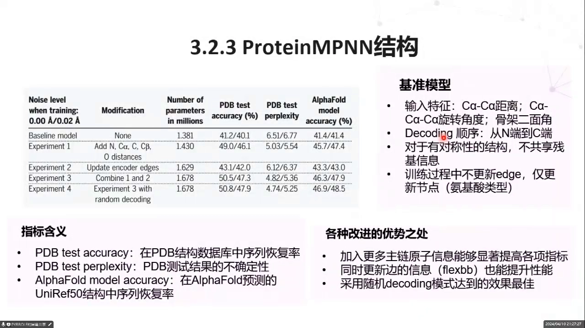 |
| 我来看一下我这个生成序列的序列恢复率（sequence recovery），就是说我有百分之多少——大概理解就是说我有百分之多少的氨基酸跟我天然长出来晶体的氨基酸是序列一样的。第二个就是PDB test perplexity，它的计算公式也比较复杂…… [【跳转到 137:47】](https://www.bilibili.com/video/BV1mkdwBoE6Z/?t=8267) |  |
| 但是从物理意义上来讲，它是在显示你这个PDB测试结果、就是你这个设计结果它的一种不确定性是多少，那肯定是不确定性越低越好。然后最后一个就是AlphaFold model accuracy，这个是拿AlphaFold做一种benchmark，Benchmark意思就是一种、你可以类似于金标准吧。它是在、它所用的数据库…… [【跳转到 138:12】](https://www.bilibili.com/video/BV1mkdwBoE6Z/?t=8292) | 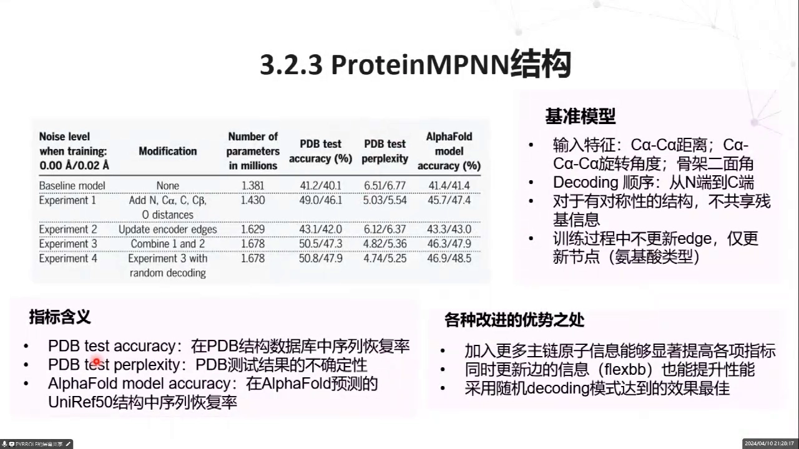 |
| 就是他的这种、他的这个恢复率，就accuracy的定义跟这个是一样的，都是一种序列恢复率。然后他做的蛋白质结构库是AlphaFold预测的unitrap50结构中的序列恢复率。那么接下来我们就看一下它对他、相比基准模型做了哪些改进。 [【跳转到 138:37】](https://www.bilibili.com/video/BV1mkdwBoE6Z/?t=8317) | 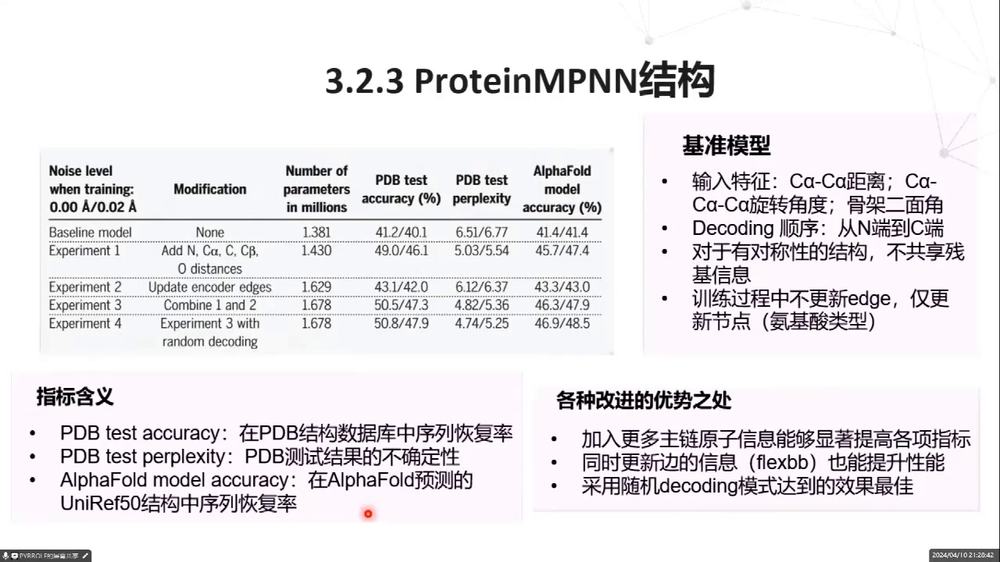 |
| 首先在基准模型中只考虑了Cα信息，还有骨架二面角信息。第一个实验就是加入了氮、碳、碳β、氧这些距离的信息。我们可以看到加入更多主链信息肯定是能够显著提高各项指标的，我们可以看到跟这个baseline model相比，这些指标性能都变好了。那么第二个实验：update encoder edges…… [【跳转到 139:02】](https://www.bilibili.com/video/BV1mkdwBoE6Z/?t=8342) | 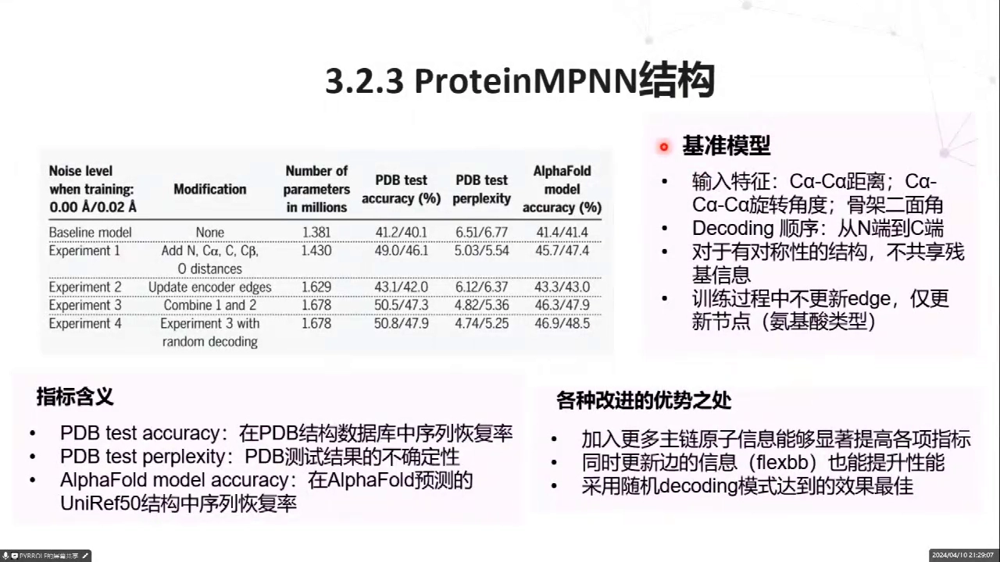 |
| 也就是说我们在更新节点的同时，我们要有更新边的信息，就是对这些主链的结构也做一些扰动，那么这样的话也可以提升性能。那我这里的flex BB，就是说flex就是让它变得灵活嘛，BB就是backbone，那就是我让这个骨架也变得灵活，然后它也可以提升性能。 [【跳转到 139:27】](https://www.bilibili.com/video/BV1mkdwBoE6Z/?t=8367) |  |
| 但是相比来说，它提升的肯定没有这些高，因为他们这些信息还是含量非常、就是信息量非常大的，但是也、也是能稍微、就是这种同时更新边也是能稍微改善它的性能吧。第三个实验是结合了这两个，也是说结合了之后达到了1+1大于二的效果。 [【跳转到 139:52】](https://www.bilibili.com/video/BV1mkdwBoE6Z/?t=8392) | 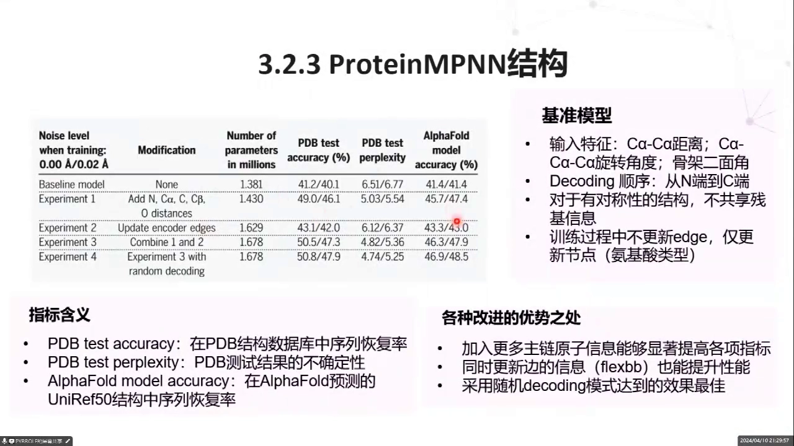 |
| 那么第四个就是experiment 3，在结合E2（实验2）的基础上，with random encoding、random decoding，是什么意思呢？ [【跳转到 140:17】](https://www.bilibili.com/video/BV1mkdwBoE6Z/?t=8417) | 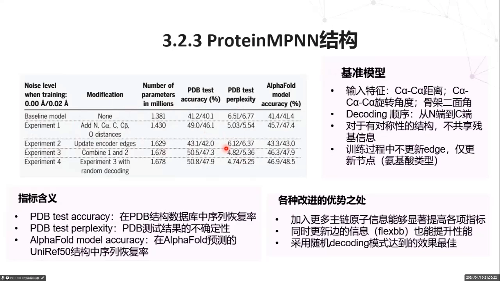 |
| 我们常说，就是传统的decoding方法可能就是你一号氨基酸、一号残基是啥氨基酸，2号是啥，3号是啥，从N端到C端这样一溜。但是在这个实验中，它是采取了一种就是不限定你decoding顺序的一种方法。 [【跳转到 140:26】](https://www.bilibili.com/video/BV1mkdwBoE6Z/?t=8426) | 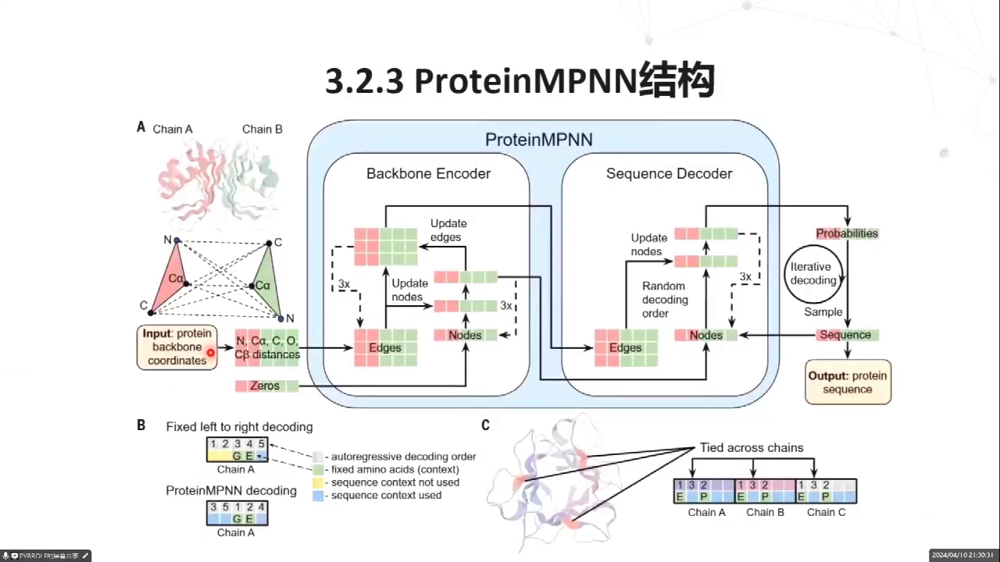 |
| 比如说你fix amino acids，就是你的语境，就是说你已经知道的氨基酸、它的这个序列信息可能是3号和4号的G和E。那么黄色的代表、就是黄色，就是说在传统的方法中你只用G和——就是就是在传统的方法中…… [【跳转到 140:51】](https://www.bilibili.com/video/BV1mkdwBoE6Z/?t=8451) | 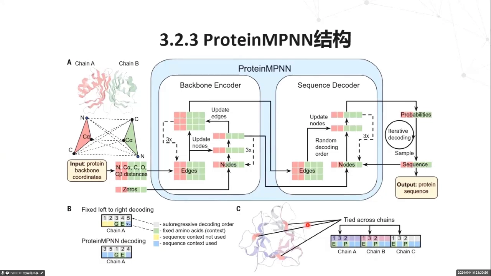 |
| 你这、这前面你要预测的位置前面的这个信息都是没有用到的，但是在我们如果是一个random decoding，或者说不限制这种decoding顺序的一种方法中，你所有的环境、所有的语境都可以被用到。我不知道有没有讲清楚，因为他也没有一个数学表达的形式，但是理解上可以这么理解，如果要看数学表达形式就需要看源码。 [【跳转到 141:16】](https://www.bilibili.com/video/BV1mkdwBoE6Z/?t=8476) | 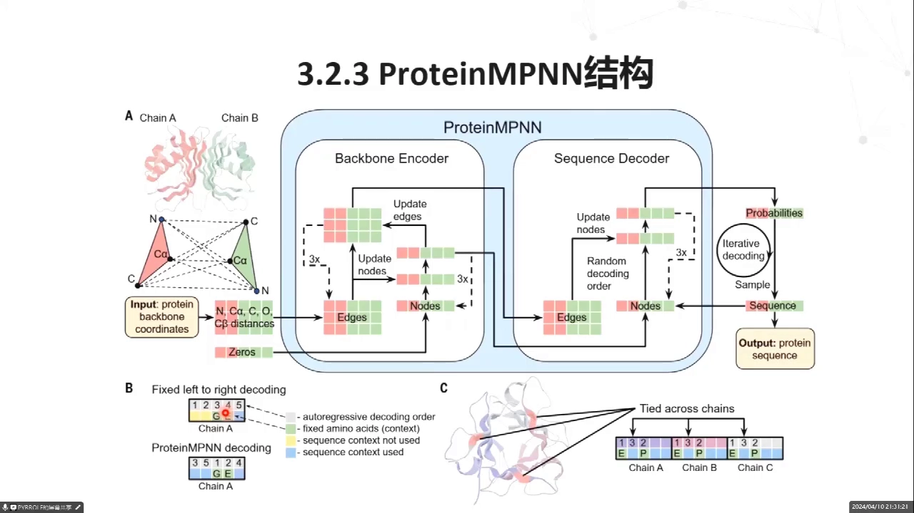 |
| 那么实验室的结果也显示，我们采用了随机的decoding模式也是达到了效果是最好的。所以说就是我们在套用、或者说现在可能很多蛋白质设计的工作都是——计算机那边发了什么新模型，我们套过来，然后随便一发，反正我用上了。但实际上我们可以看到，就是他这篇文章他为什么能够得到…… [【跳转到 141:40】](https://www.bilibili.com/video/BV1mkdwBoE6Z/?t=8500) | 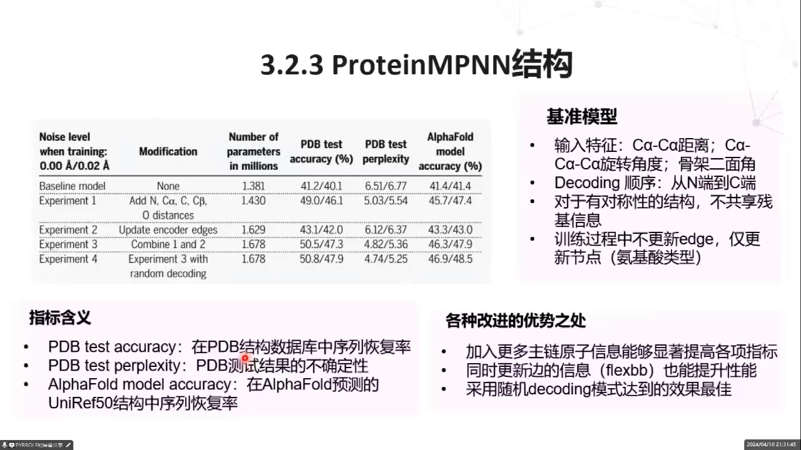 |
| 就是得到编辑的赏识，就是因为他在这个模型的基础上，他们做了很多创新的方法，而且这些看似是细微的调整能为结果带来非常大的改进。就是你可能就是不同的人可能这种数值观念不一样，但是在蛋白质设计里面，sequence recovery从41.2到50.8是一个非常大的跨越。 [【跳转到 142:05】](https://www.bilibili.com/video/BV1mkdwBoE6Z/?t=8525) | 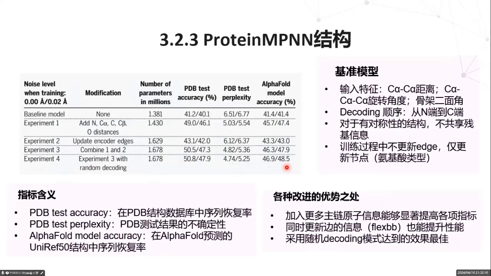 |
| 然后再解释一下后面这个斜杠的意思啊，斜杠的意思就是说他在训练的时候对骨架原子进行了一些高斯扰动，就是0.02Å这个级别。那么他为什么要做这个？其实是想模拟序列设计中的一个温度变化。那么具体的效果还有就是一些指标…… [【跳转到 142:30】](https://www.bilibili.com/video/BV1mkdwBoE6Z/?t=8550) | 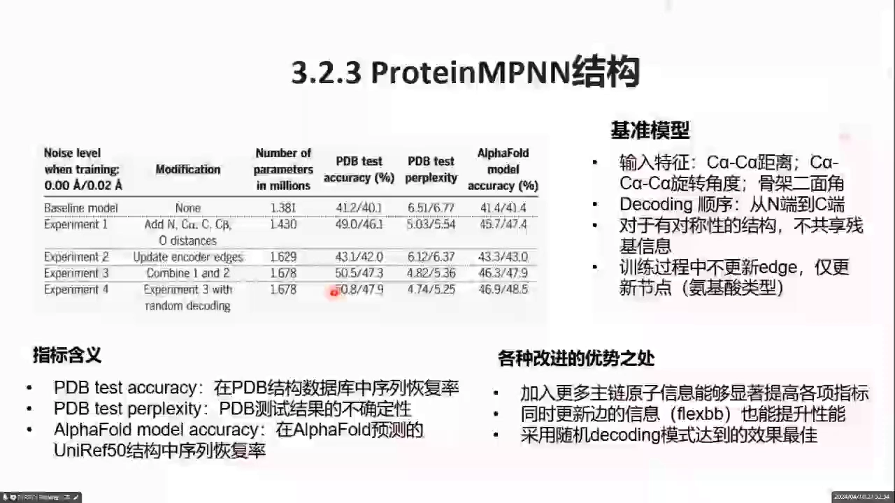 |
| 我们会在后面仔细讲到。 [【跳转到 142:55】](https://www.bilibili.com/video/BV1mkdwBoE6Z/?t=8575) | 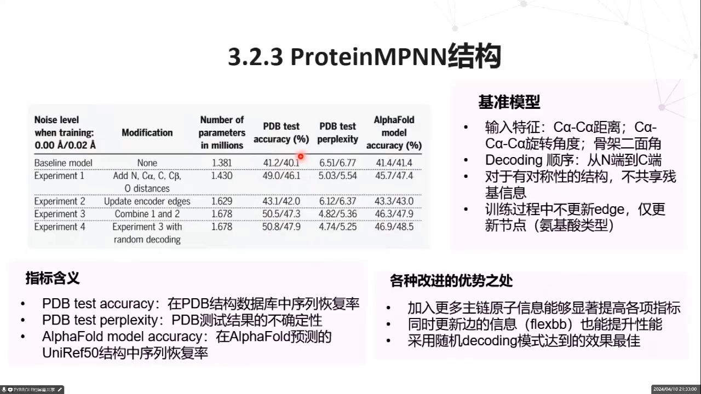 |
| 这个给大家说一下ProteinMPNN的一个计算上的设计结果。首先这张图呢，它的纵坐标是Cβ的距离到八个最近的邻居，或者说最近的原子，我们可以看到就是从5.2Å到8.4Å这个范围内，ProteinMPNN…… [【跳转到 143:01】](https://www.bilibili.com/video/BV1mkdwBoE6Z/?t=8581) |  |
| 它的序列恢复率都比Rosetta序列恢复率要高一些。然后B图呢，也是在说sequence recovery也是比较高的，我看下来50%。不论是单体、同源寡聚体还是异源多聚体，他的这个箱线图能达到这样平均，确实非常不容易。 [【跳转到 143:26】](https://www.bilibili.com/video/BV1mkdwBoE6Z/?t=8606) |  |
| 确实非常不容易。然后在C图呢，C图他是在说training noise，就是我在骨架上增加了一些扰动，然后第二个就是这个temperature。其实这两个你可以理解为比较类似的概念，都是对骨架实施一些扰动。那么我们可以看到，就是在你的train noise达到一定程度的时候…… [【跳转到 143:51】](https://www.bilibili.com/video/BV1mkdwBoE6Z/?t=8631) |  |
| 你的lDDT、也就是说你结构的置信度，如果是大于90的话，他是在这里达到最高的，然后大约95它也是这里达到最高。也就是说你在进行一些结构微调的时候，你增加了结构扰动，反而能使它的序列恢复度更高，这个是这个文章想要再说明的一点。 [【跳转到 144:16】](https://www.bilibili.com/video/BV1mkdwBoE6Z/?t=8656) | 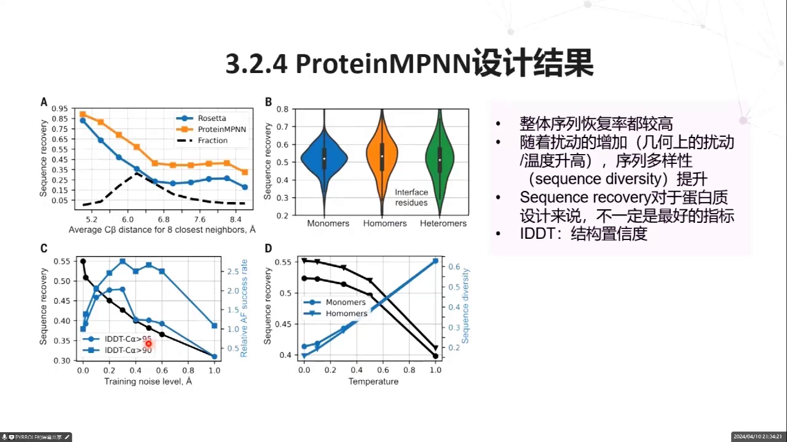 |
| 然后第二个就是这个温度、温度问题。我们在提高温度的时候，对于单体来说，他的sequence recovery是越来越低的，对吧？然后对trimer（三聚体）来说，它的sequence recovery也是越来越低的，也是跟我们——不好意思，这条黑线sequence recovery是越来越低的…… [【跳转到 144:41】](https://www.bilibili.com/video/BV1mkdwBoE6Z/?t=8681) | 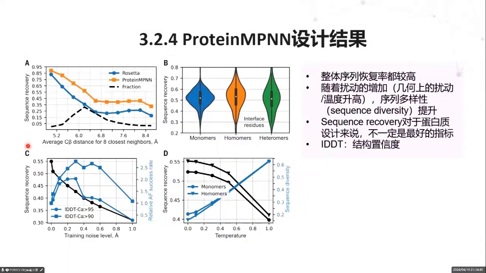 |
| 然后跟我们的直觉是相关的，但是相应的他们的sequence diversity，也就是说序列的多样性——你一个位置氨基酸它出现几种氨基酸、多种氨基酸的概率，也就是你这种序列的多样性，它是升高的。然后这里我想说明的一点就是说，我们可以看到它这个模型它前面比较的一些指标都是比如说sequence recovery…… [【跳转到 145:06】](https://www.bilibili.com/video/BV1mkdwBoE6Z/?t=8706) | 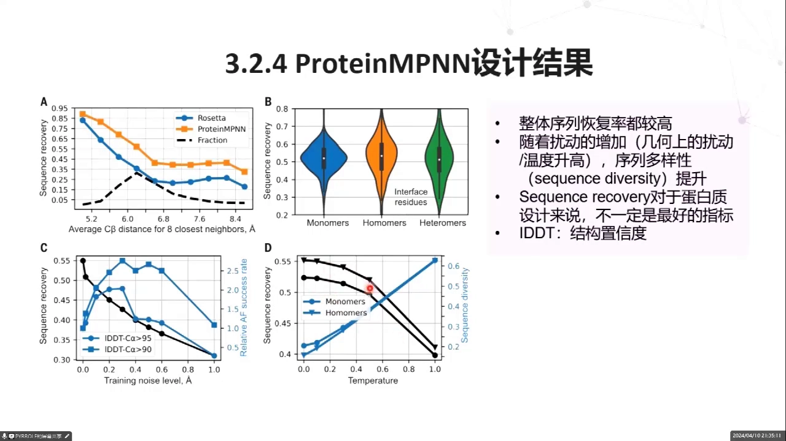 |
| 他们预测出来的都是在考虑序列恢复率这个事情，但是有时候序列恢复率不一定能完全评估你这个模型的好坏，序列多样性提升可能是一个更加重要的事情。其实还是以曹龙兴大神他之前的一个采访为例吧，就是刚刚 RF 作者的一个采访。他说，我们蛋白质设计的话 [【跳转到 145:31】](https://www.bilibili.com/video/BV1mkdwBoE6Z/?t=8731) |  |
| 它并不是一个传统的那种 basic science，并不是那种传统的基础科学，它是需要一点工程化的东西。你既需要理性的设计，你也需要一些工程。工程其实就是把你的整个不同的模块串联起来，完成一个流程。那么就是以这个设计飞机为例，我们都知道鸟可以飞行，但是我们人类想要飞上天， [【跳转到 145:56】](https://www.bilibili.com/video/BV1mkdwBoE6Z/?t=8756) |  |
| 我们不会去设计鸟，我们要设计一个飞机，也就是说我们要设计一个比鸟更厉害、更适合人类、更适合我们的东西。那么序列恢复率，实际上是序列的恢复力，sequence recovery，实际上就是在看我们的这个模型能够把这个蛋白质设计效果跟自然界有多大的相似。但是有时候我们需要更多的 diversity，因为 diversity 更多的话， [【跳转到 146:21】](https://www.bilibili.com/video/BV1mkdwBoE6Z/?t=8781) |  |
| 说明我们有更多新的探索的可能性。所以如果大家以后要做蛋白质设计算法开发这一块，其实可以多考虑考虑怎样提高这种序列的多样性。下面这个就是用 AlphaFold 来评估一下生成模型结构的一个置信度。native sequences 就是 PDB 里面原始的序列， [【跳转到 146:46】](https://www.bilibili.com/video/BV1mkdwBoE6Z/?t=8806) | 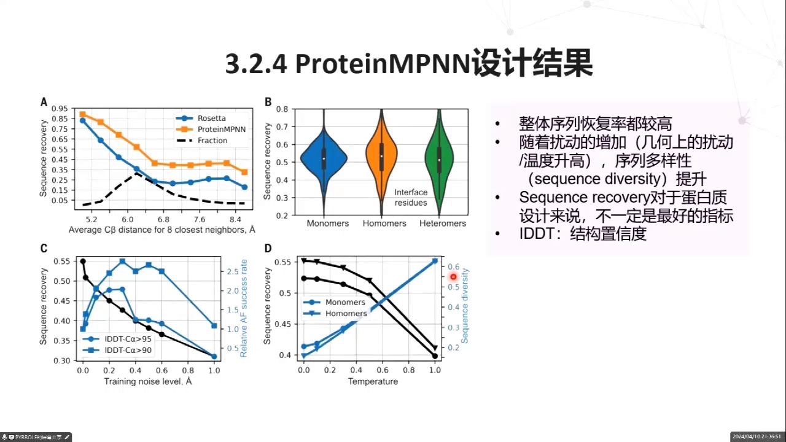 |
| 然后 ProteinMPNN sequences，就是我们经过 MPNN 优化之后、ProteinMPNN 设计之后的一个置信度。然后这里的话就是 Rosetta 的，然后这个是 MPNN。我们可以看到 MPNN 它整体在 IDDT，就是置信度比较高的地方，比 native sequence 要高很多，然后跟 Rosetta 相比，结果也要明显好于 Rosetta。 [【跳转到 147:11】](https://www.bilibili.com/video/BV1mkdwBoE6Z/?t=8831) |  |
| （此区间无字幕） [【跳转到 147:36】](https://www.bilibili.com/video/BV1mkdwBoE6Z/?t=8856) | 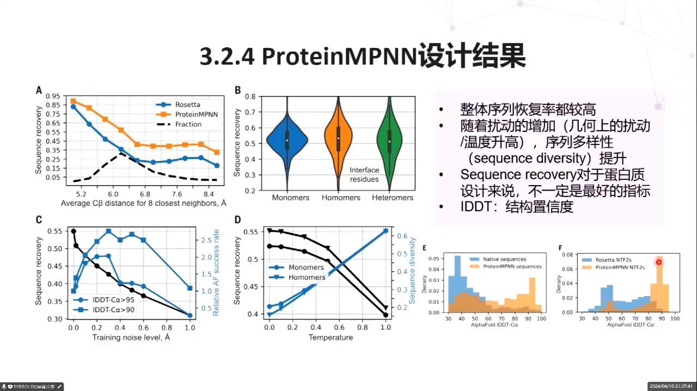 |
| 下面这一页 PPT 呢是想说明这样几件事情，主要展示的是 ProteinMPNN 的实验结果。第一个呢，这张图它的纵坐标就是 MPNN 和 AlphaFold——哦，我这里标错了，不好意思，这里这个字打错了，然后这里应该是 AlphaFold。 [【跳转到 147:41】](https://www.bilibili.com/video/BV1mkdwBoE6Z/?t=8861) |  |
| AlphaFold。然后横坐标就是你蛋白的可溶性。我们可以看到，MPNN 设计出来的可溶性明显比这个 AlphaFold 要好。然后这也是——不知道大家还记不记得我刚刚在讲 RF 的时候说，因为计算上资源的一个限制，并没有产生极性残基附近的 RF，那么这样设计出来，也就是说设计出来的蛋白可能， [【跳转到 148:06】](https://www.bilibili.com/video/BV1mkdwBoE6Z/?t=8886) | 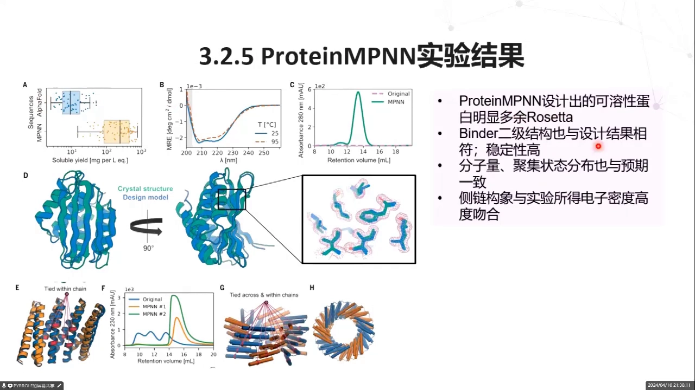 |
| 可能确实疏水性比较强，会带来一些溶解度上的问题，但是 MPNN 它就不受这个限制，所以它设计出来的溶解度就肯定要明显好于 AlphaFold。B 的话就是 binder，测了一下二级结构，然后也与设计的相符，就是 Alpha 螺旋嘛。并且这个黄色——橙色的虚线，就是我刚刚说的可以用这个圆二色谱来检测它的变性温度，我们可以看到在 95 度 [【跳转到 148:31】](https://www.bilibili.com/video/BV1mkdwBoE6Z/?t=8911) |  |
| 它也基本上是这个结构，所以说是非常稳定的。然后这个分子筛的结果，原先就说用 Rosetta，它并没有成功地折叠到我们预计的这个保留体积、洗脱体积上，但是 MPNN 就成功设计了。那地图的话也是 [【跳转到 148:56】](https://www.bilibili.com/video/BV1mkdwBoE6Z/?t=8936) |  |
| 巨大的实验工作量长出了晶体，并且它的测量构象与实验所得的电子密度高度吻合。电子密度就是这里这个——线画的这些地方。那么这里也是一些多聚体的设计，那么在多聚体的设计中呢，可以看到这是一个金属结合蛋白， [【跳转到 149:21】](https://www.bilibili.com/video/BV1mkdwBoE6Z/?t=8961) | 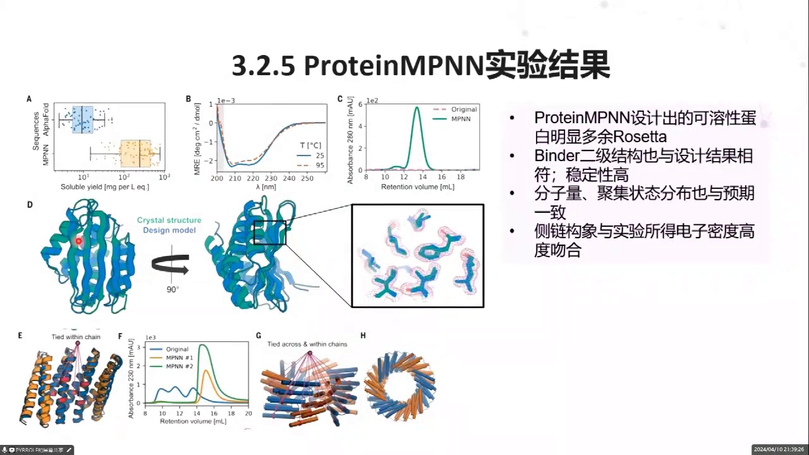 |
| 然后还有就是，这张图就是说我们在之前使用 Rosetta 设计失败的例子里面，这个 retention volume，这个洗脱体积，这个线非常奇怪，然后但是 MPNN 它会这样成功地设计了这些多聚体。然后这个也是对他设计结果的 [【跳转到 149:46】](https://www.bilibili.com/video/BV1mkdwBoE6Z/?t=8986) |  |
| 用冷冻电镜来做了一下验证，然后也是发现这个侧链它们基本上都是重合的，然后尤其是这里的相互作用界面，非常不容易。 [【跳转到 150:10】](https://www.bilibili.com/video/BV1mkdwBoE6Z/?t=9010) | 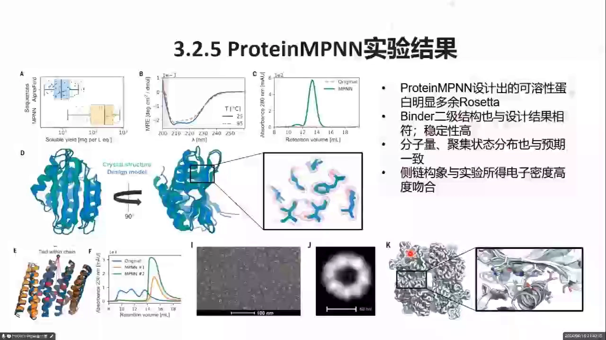 |
| 下面是一个——我觉得非常值得大家去参考、去借鉴的一个实验。他是从一个 SH3 domain 开始的，我们现在已经有一个多肽，它是这个 SH3 domain 的一个天然结合底物，那么经过一系列改造， [【跳转到 150:24】](https://www.bilibili.com/video/BV1mkdwBoE6Z/?t=9024) |  |
| 他 remodel、design、resurfacing，就是也是一种蛋白嫁接，把这两边用 loop 跟这个骨架连起来之后呢，我们用 ProteinMPNN 去重新设计它的序列。然后再重新设计序列之后呢，我们会发现这两个界面上有两个关键的氢键。然后我们把形成氢键之一的 [【跳转到 150:49】](https://www.bilibili.com/video/BV1mkdwBoE6Z/?t=9049) |  |
| 其中一个 N 把它突变为 D，然后我们来检验一下这个界面生成的效果。下面这个就是刚刚给大家讲的这个 SPR 的实验结果。那么 SPR 它的纵坐标，值越大，说明你这个 binder 结合上去、蛋白的响应越强，也就是说结合效果越强、越明显。 [【跳转到 151:14】](https://www.bilibili.com/video/BV1mkdwBoE6Z/?t=9074) |  |
| 那么如果是 native peptide，也就是说天然结合多肽的话，它响应是这样的。然后我们用 Rosetta，就是一个基于经典力场的一个方法的话，它跟天然的差不多。但如果我们用 ProteinMPNN 设计了这个序列之后，它的响应明显地增强了。然后最后呢，如果我们把界面的关键残基给它突变了之后， [【跳转到 151:39】](https://www.bilibili.com/video/BV1mkdwBoE6Z/?t=9099) | 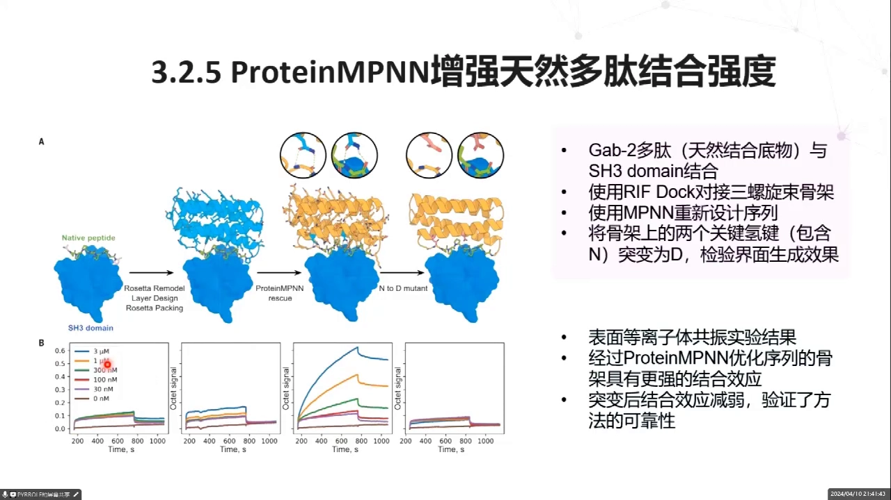 |
| 效应减弱了。然后这样也是验证了我们设计方法的一个可靠性，就是这个结构确实可能是这样的。 [【跳转到 152:04】](https://www.bilibili.com/video/BV1mkdwBoE6Z/?t=9124) |  |
| 最后呢是想跟大家分享一下，就是这两种蛋白质设计方法的一个比较，也是我的一点思考。首先是从文章看的嘛，它的序列恢复率，Rosetta 的话也是从序列恢复率方面来比较的吧，Rosetta 是 32.99%、32.99%，然后 ProteinMPNN 达到 52.4%。那对于物理性质来说呢， [【跳转到 152:14】](https://www.bilibili.com/video/BV1mkdwBoE6Z/?t=9134) |  |
| 就是这种有 C5 轴或者 C6 轴的蛋白，就这种多聚的高对称性的蛋白，它的正确结构可折叠的设计总数，对于两种方法来说分别是这样的。我们可以看到 ProteinMPNN 他在设计这种高对称性蛋白上有非常明显的优势。其实也是跟他在设计结果中 [【跳转到 152:39】](https://www.bilibili.com/video/BV1mkdwBoE6Z/?t=9159) | 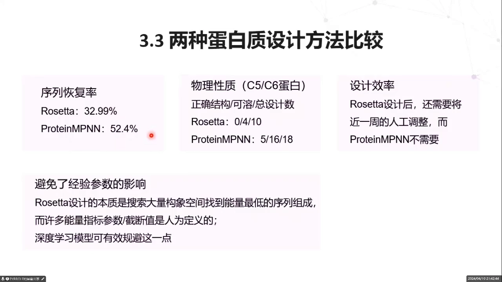 |
| random decoding。也就是说我们在这个 decoding 的时候，不是固定地从 N 端到 C 端，这是 random decoding 相关。也就是说他会把 edge 信息比较相近的 node——给它们赋予边信息比较相近的节点，给它们赋予相同氨基酸类型，这样我就可以同时设计两个相同的链，而手动的话，它是要从头设计的。 [【跳转到 153:04】](https://www.bilibili.com/video/BV1mkdwBoE6Z/?t=9184) |  |
| 并没有这种信息之间的共享。第三个是设计效率。在传统的 Rosetta 经典力场方法设计之后，还需要将近一周的人工调整，这个是非常靠经验性的，你就人眼去看那个界面哪个地方结合比较好、哪个地方结合不好。但是 ProteinMPNN 经过他们的验证并不需要这样的过程。然后接下来也是说一下， [【跳转到 153:29】](https://www.bilibili.com/video/BV1mkdwBoE6Z/?t=9209) | 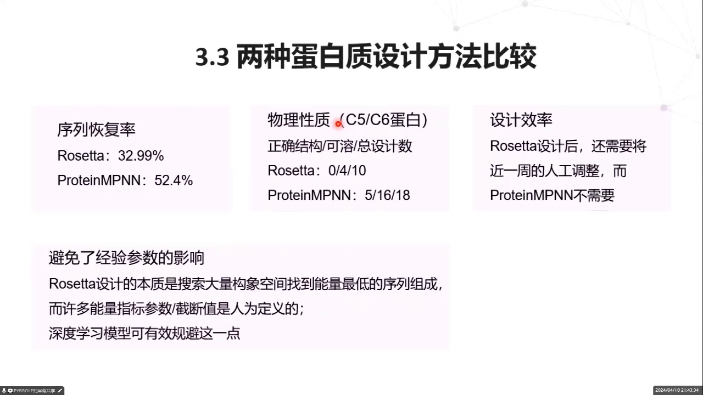 |
| 就是 MPNN 一个最大的优势，就是它避免了经验参数的影响。大家如果还记得我们刚刚说的，就是讲的一些柔性、能量打分函数。Rosetta 设计的本质是搜索大量构象空间，找到能量最低的序列组成，而许多能量指标的参数、截断值是人为定义的。 [【跳转到 153:54】](https://www.bilibili.com/video/BV1mkdwBoE6Z/?t=9234) |  |
| 大家如果还记得说，就是比如说范德华力哪里是截断，然后还有包括那种曲线的拟合，其实都是非常人为的，但是深度学习就可以有效规避这一点。然后另一个更为明显、更为关键的例子是说，我们在传统的 Rosetta 设计过程中，我们会定义一个蛋白——因为蛋白一般都是球状的嘛——它的疏水核心是哪些部分的残基， [【跳转到 154:19】](https://www.bilibili.com/video/BV1mkdwBoE6Z/?t=9259) |  |
| 然后它暴露在外面的是哪些残基。但是很多时候你很难界定这个残基它是在外面还是在疏水核心，这个就是非常需要人工的经验去判断。那么深度学习模型就可以有效地规避这一点，就是你不需要告诉他具体 cutoff 在哪、截断值在哪儿，他可以自己去学这个东西，虽然他也不会告诉你他是怎么学的。 [【跳转到 154:44】](https://www.bilibili.com/video/BV1mkdwBoE6Z/?t=9284) | 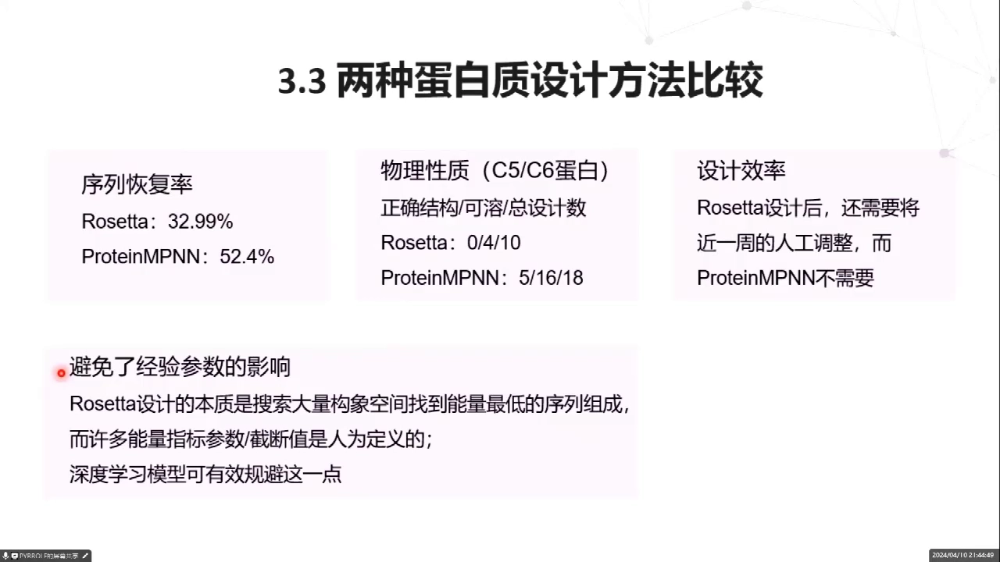 |
| 所以这也是算是深度学习的一个通病吧，也就是 MPNN 的一个最大的弱点，就是失去了物理可解释性。就是毕竟深度学习它们 hidden layer、隐藏的层太多了，它的可解释性以及泛化能力都不太好。然后我今天的课就到这了。 [【跳转到 155:09】](https://www.bilibili.com/video/BV1mkdwBoE6Z/?t=9309) | 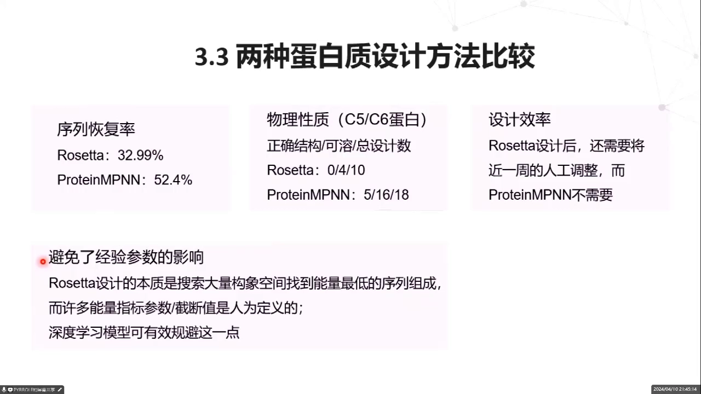 |
| 后面的话是给没有用过 Linux 系统的同学再来介绍一些基本的命令操作。然后如果你已经对这个非常熟了的话，其实可以提前下课了。然后同学们还有什么问题吗？关于我今天讲的内容。 [【跳转到 155:34】](https://www.bilibili.com/video/BV1mkdwBoE6Z/?t=9334) |  |
| 啊，怎么都沉默了，没有的话，好的好的，谢谢。然后如果没有其他问题的话， [【跳转到 155:59】](https://www.bilibili.com/video/BV1mkdwBoE6Z/?t=9359) | 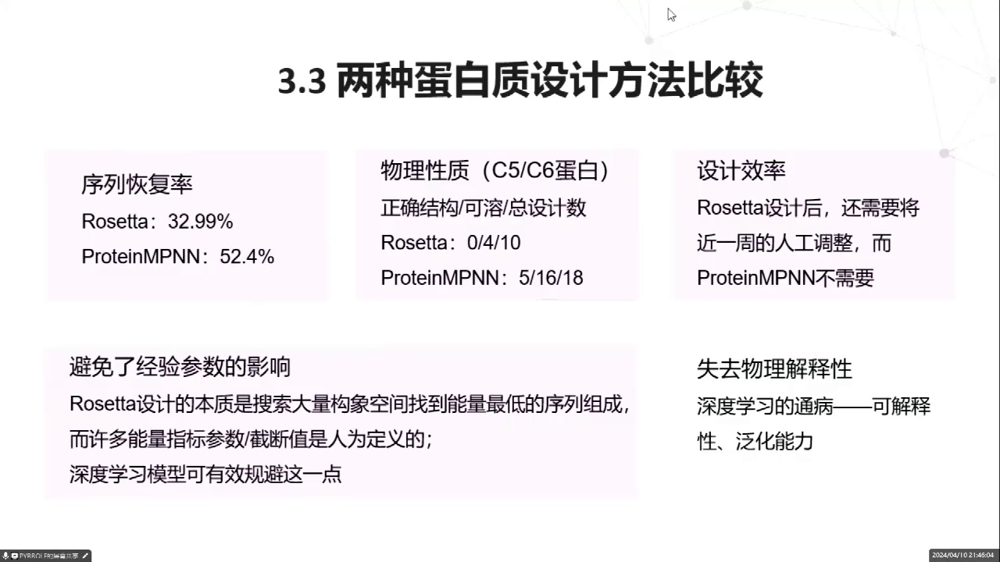 |
| 我们就现在打开这个 Ubuntu 子系统。 [【跳转到 156:24】](https://www.bilibili.com/video/BV1mkdwBoE6Z/?t=9384) |  |
| （此区间无字幕） [【跳转到 156:31】](https://www.bilibili.com/video/BV1mkdwBoE6Z/?t=9391) | 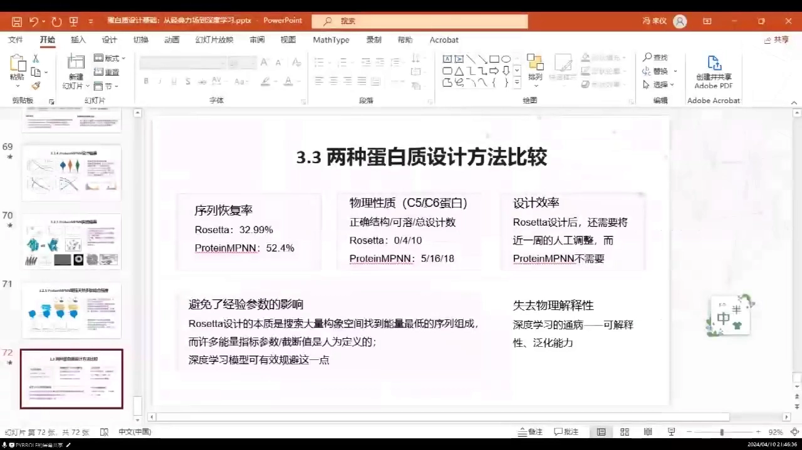 |
| （此区间无字幕） [【跳转到 156:36】](https://www.bilibili.com/video/BV1mkdwBoE6Z/?t=9396) | 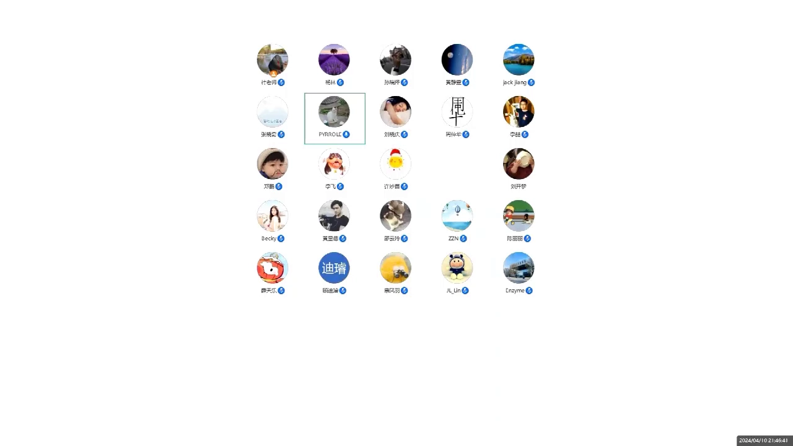 |
| （此区间无字幕） [【跳转到 157:01】](https://www.bilibili.com/video/BV1mkdwBoE6Z/?t=9421) | 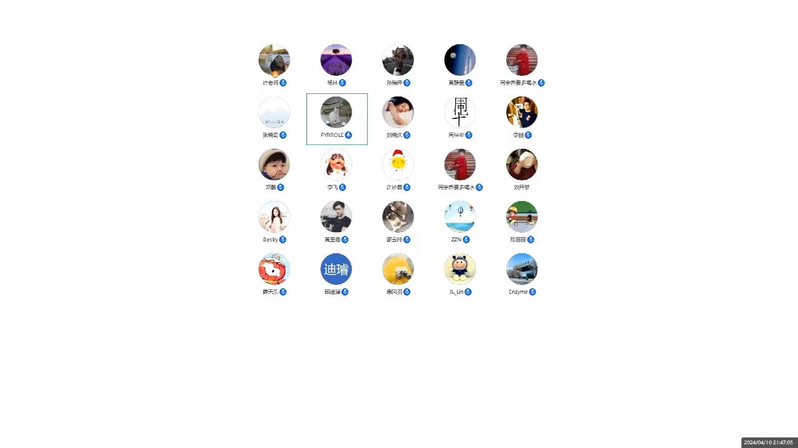 |
| （此区间无字幕） [【跳转到 157:12】](https://www.bilibili.com/video/BV1mkdwBoE6Z/?t=9432) | 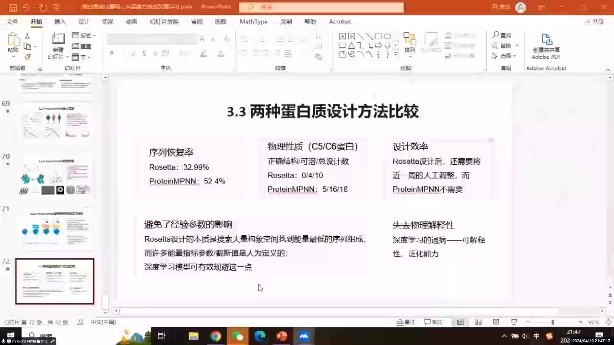 |
| （此区间无字幕） [【跳转到 157:21】](https://www.bilibili.com/video/BV1mkdwBoE6Z/?t=9441) | 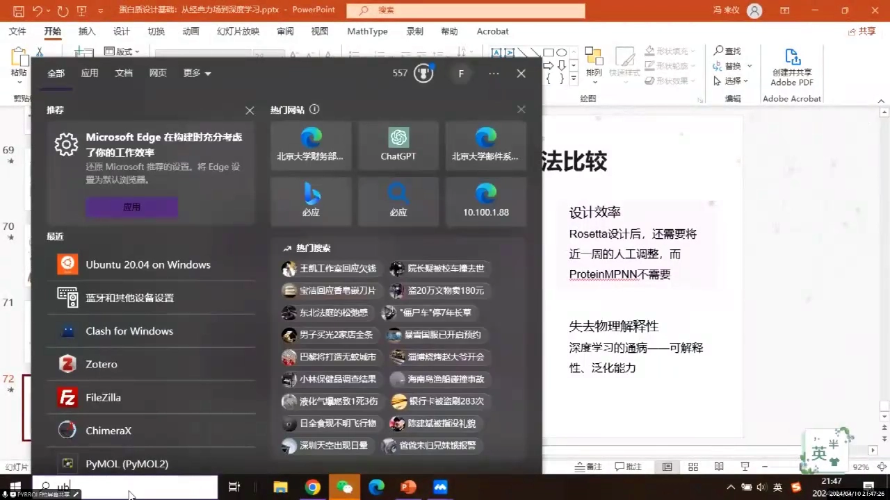 |
| （此区间无字幕） [【跳转到 157:26】](https://www.bilibili.com/video/BV1mkdwBoE6Z/?t=9446) | 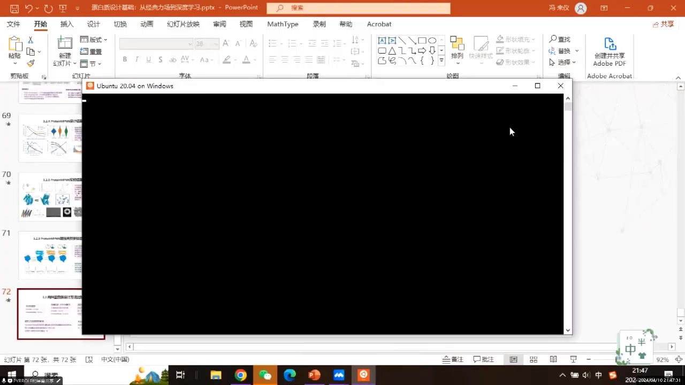 |
| 大家都已经打开了吗？如果打开的话扣个一。 [【跳转到 157:31】](https://www.bilibili.com/video/BV1mkdwBoE6Z/?t=9451) | 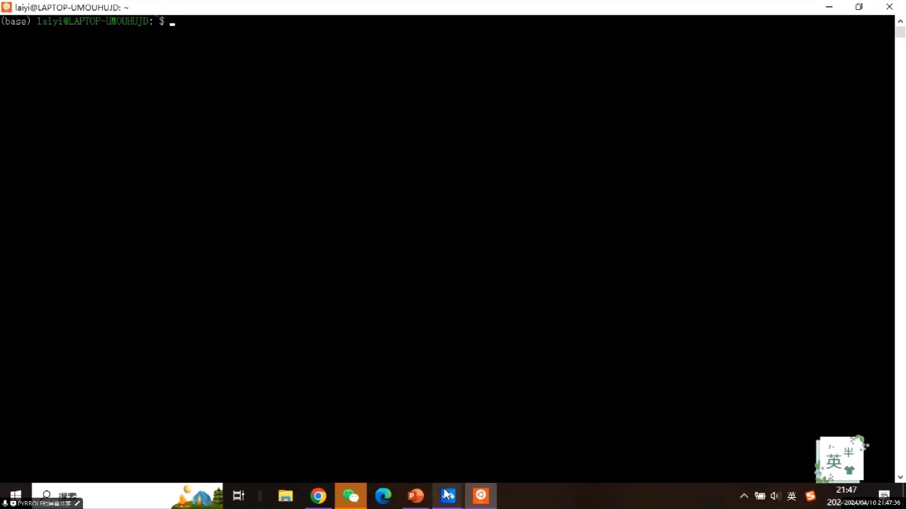 |
| 我们具体的代码就不带大家看了，那个就是你自己看就可以了，你不会就问问 ChatGPT——ChatGPT 比我懂一点——或者是国产的那个 Kimi Chat 也是挺好用的。 [【跳转到 157:56】](https://www.bilibili.com/video/BV1mkdwBoE6Z/?t=9476) | 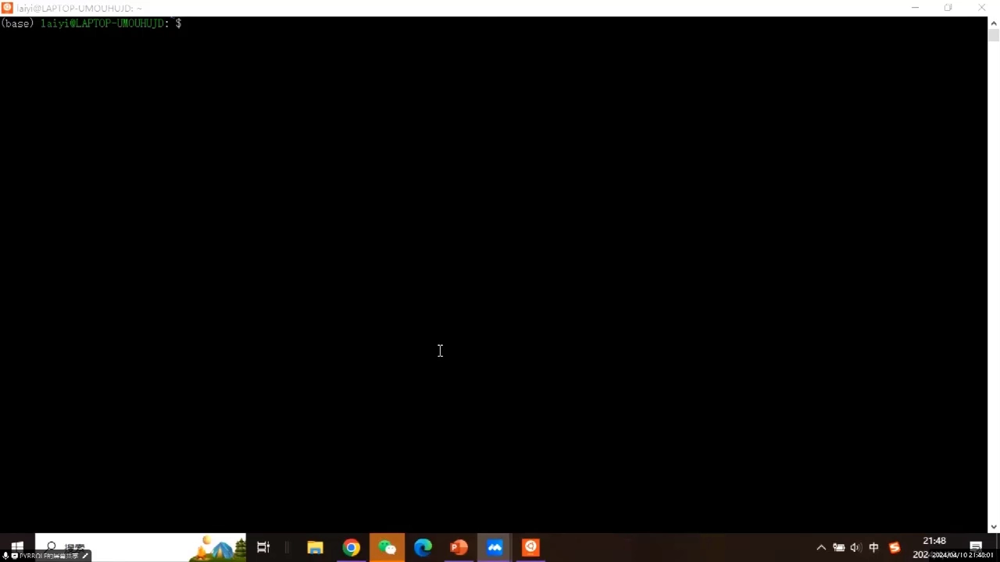 |
| 对，服务器也没问题，就是都是 Linux 系统就可以。然后我首先给大家说一下，就是我们如何查看我们当前的位置，pwd，然后下面返回的就是我们当前所在的位置。 [【跳转到 158:21】](https://www.bilibili.com/video/BV1mkdwBoE6Z/?t=9501) |  |
| 然后如果我们想要去到哪个文件夹，我们可以 cd，cd 意思就是 change directory，就是我们改变、我们要去哪个文件夹，把它复制一下。一般这种复制是你选中之后点一下右键；Ctrl+C、Ctrl+V 一般是不行的，点一下右键，然后在这里再点一下右键。 [【跳转到 158:46】](https://www.bilibili.com/video/BV1mkdwBoE6Z/?t=9526) | 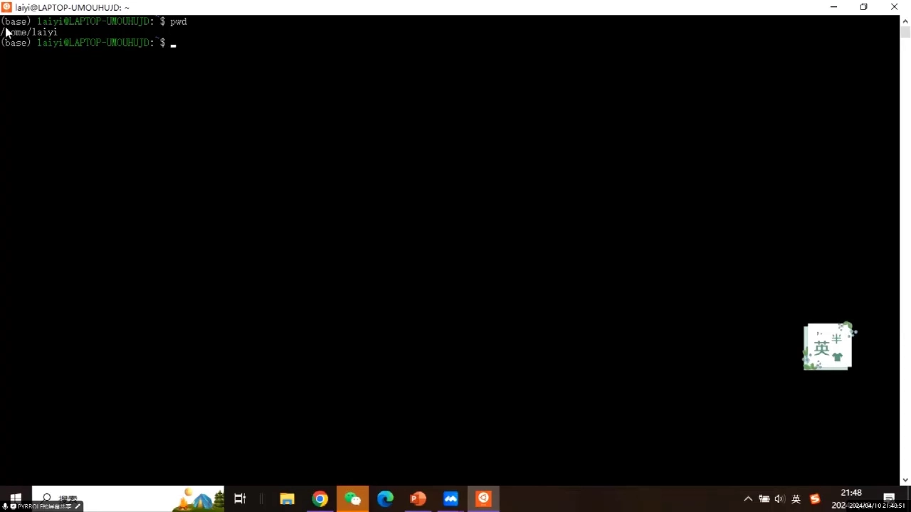 |
| OK，跟上了吗？大家一定要记住，这非常重要。Ubuntu 这个系统它 Ctrl+C、Ctrl+V 不能复制粘贴，不能用 Ctrl+C、Ctrl+V，需要用你的鼠标右键，就是至少我的电脑是这样的，不同电脑可能不一样，有的可能是左键就复制了。然后接下来我们 cd 空格，然后把我们 pwd 刚刚输出的地方给粘贴过来。 [【跳转到 159:11】](https://www.bilibili.com/video/BV1mkdwBoE6Z/?t=9551) | 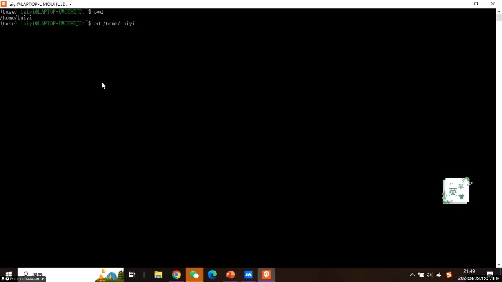 |
| 然后按一下 enter，然后我们还是在这个文件夹里，因为我们 change to 的就是我们当前的文件夹。然后下面呢，我们想看我们这个文件夹里有什么东西，我们就 ls，这样显示的话就是我们当前文件夹 [【跳转到 159:36】](https://www.bilibili.com/video/BV1mkdwBoE6Z/?t=9576) | 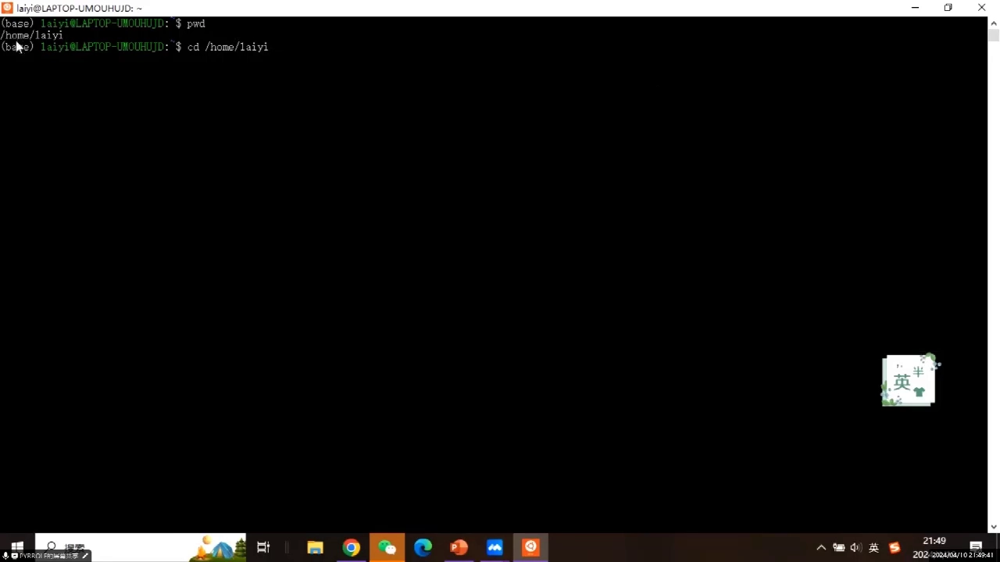 |
| 当前文件夹的东西。OK 吗？好，然后我再给大家说一下我们如何来编辑这个文本。首先 vim——我习惯用的是 vim，vim 就是编辑一个文本文件，然后打一个波浪线斜杠 .bashrc。 [【跳转到 160:01】](https://www.bilibili.com/video/BV1mkdwBoE6Z/?t=9601) | 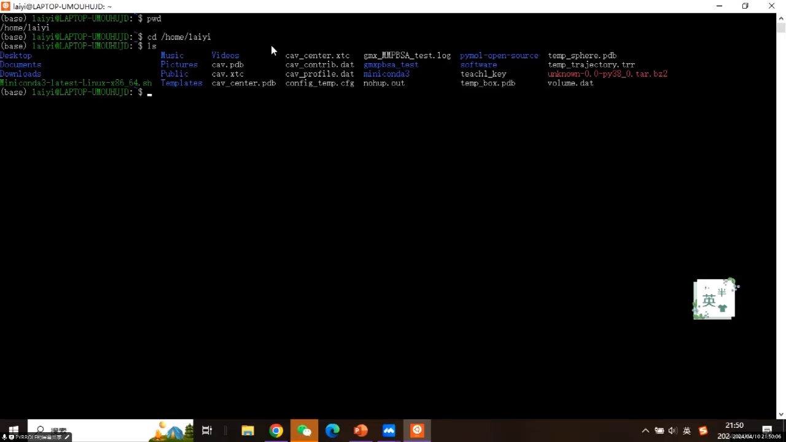 |
| 然后 .bashrc，b 前面有个点，OK 吗？然后我们按 enter，大家都进入这个界面了吗？有没跟上的在群里说一下啊。 [【跳转到 160:26】](https://www.bilibili.com/video/BV1mkdwBoE6Z/?t=9626) | 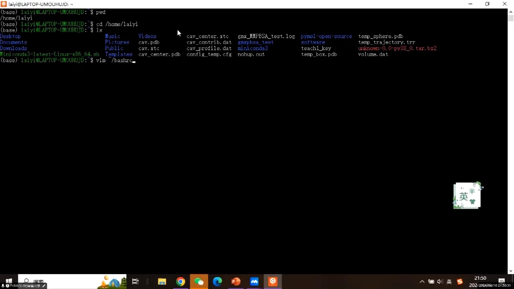 |
| 你这个是没有跟上还是跟上？再来一次啊。看清楚这个命令了吗？我把它发到群里。 [【跳转到 160:51】](https://www.bilibili.com/video/BV1mkdwBoE6Z/?t=9651) | 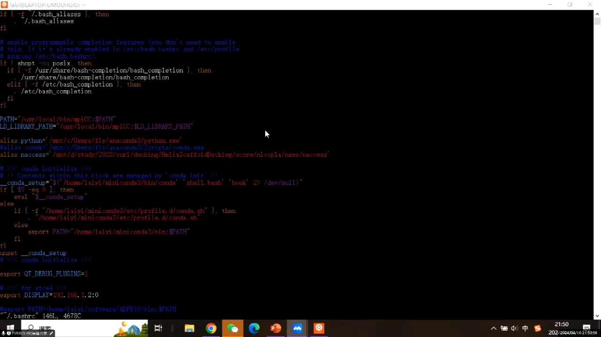 |
| （此区间无字幕） [【跳转到 161:16】](https://www.bilibili.com/video/BV1mkdwBoE6Z/?t=9676) | 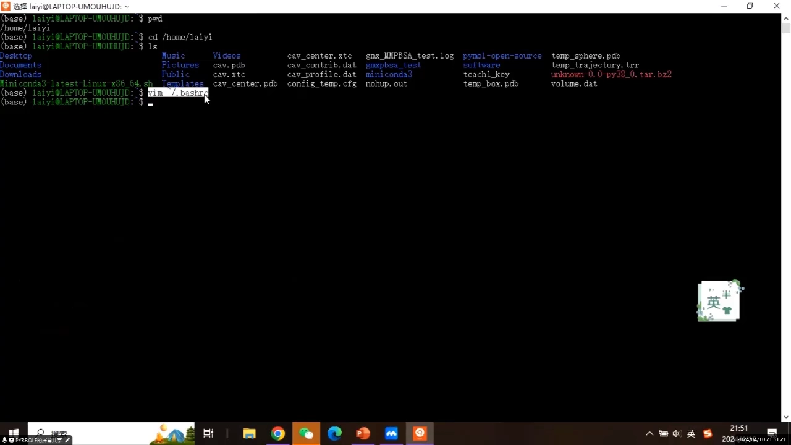 |
| 大家可以看一下群，我把文本编辑的那个地方发过去了。 [【跳转到 161:22】](https://www.bilibili.com/video/BV1mkdwBoE6Z/?t=9682) | 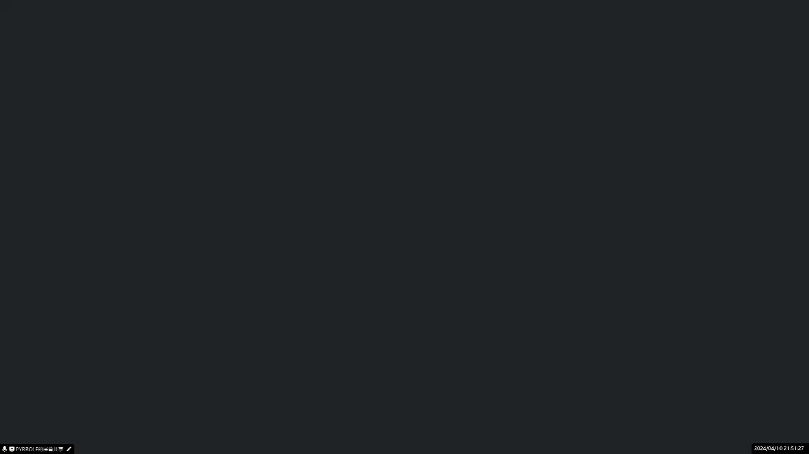 |
| （此区间无字幕） [【跳转到 161:47】](https://www.bilibili.com/video/BV1mkdwBoE6Z/?t=9707) | 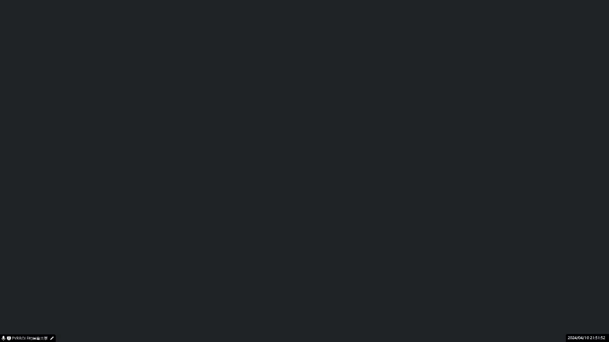 |
| 我们只是说想要编辑一下我们的环境变量文件，OK 吗？还有没跟上的吗？ [【跳转到 161:52】](https://www.bilibili.com/video/BV1mkdwBoE6Z/?t=9712) | 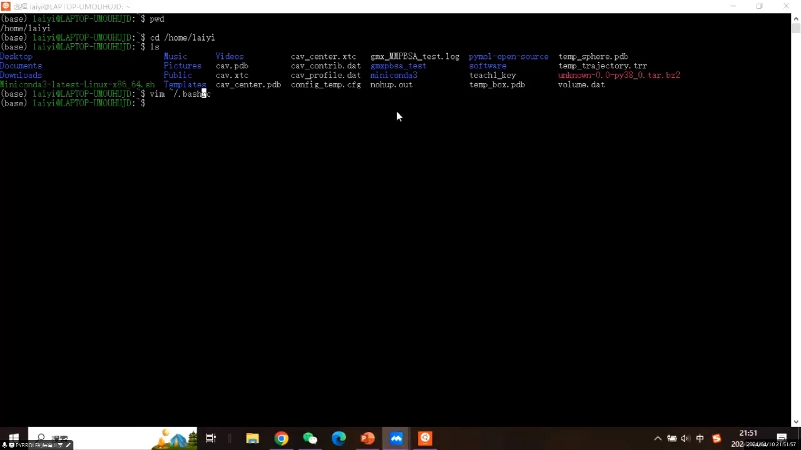 |
| 好的，我们进入这个（文件），我们可以看到这里就是存储了我们电脑里的各种环境变量。然后如果我们按 shift+G，就可以直接到达这个文件的最下方，然后按 gg 就是直接到文件的最上方。 [【跳转到 162:17】](https://www.bilibili.com/video/BV1mkdwBoE6Z/?t=9737) | 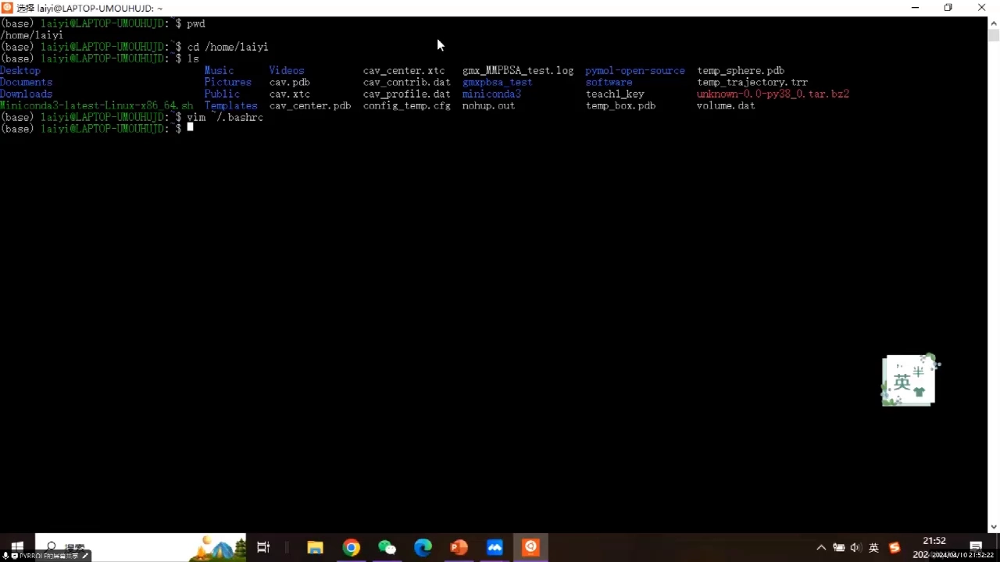 |
| shift+G 是到最下面，gg 是到最上面。然后现在我们 shift+G、shift+G 到最下面，然后我们现在只是可以查看模式，我们敲东西它是不能输入进去的。为此我们要在这个里面打开编辑模式，编辑模式按 I、按 I 键。 [【跳转到 162:42】](https://www.bilibili.com/video/BV1mkdwBoE6Z/?t=9762) | 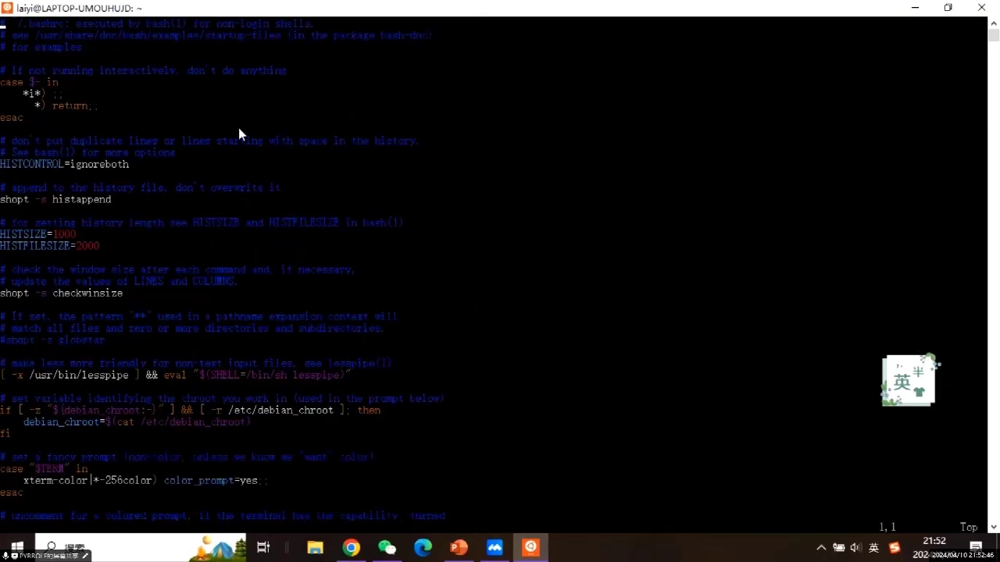 |
| 然后左下角会出现一个 insert，大家看到了吗？有一个 insert，然后我们把光标往右移，按一下 enter，我们就可以编辑这个文件了。这一步大家跟上了吗？ [【跳转到 163:07】](https://www.bilibili.com/video/BV1mkdwBoE6Z/?t=9787) | 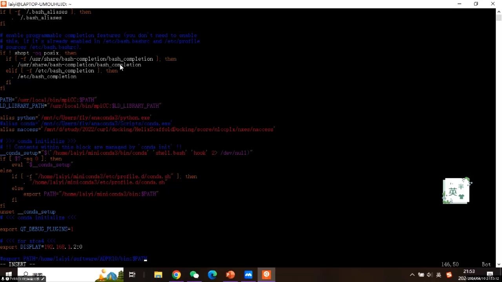 |
| 有没跟上的人吗？OK，那我继续了，我们可以随便敲一点东西。 [【跳转到 163:32】](https://www.bilibili.com/video/BV1mkdwBoE6Z/?t=9812) | 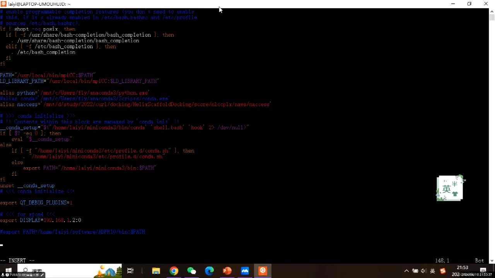 |
| 这种，对吧？然后这样就可以自由编辑了。然后一般我们在设置环境变量的时候，都是这样的语法，export，等于就是跟上面、我上面这一行是一样的。然后如果你想把它注释掉， [【跳转到 163:57】](https://www.bilibili.com/video/BV1mkdwBoE6Z/?t=9837) |  |
| 就前面打一个井号就可以了；不想把它注释掉，就把井号给删掉。然后关于 Rosetta 的环境变量设置，大家可以自己上网搜一下，然后一定要注意的就是，说网上给你的这个路径是人家自己的路径，这个路径不可以照抄。所谓路径就是这一部分。 [【跳转到 164:22】](https://www.bilibili.com/video/BV1mkdwBoE6Z/?t=9862) | 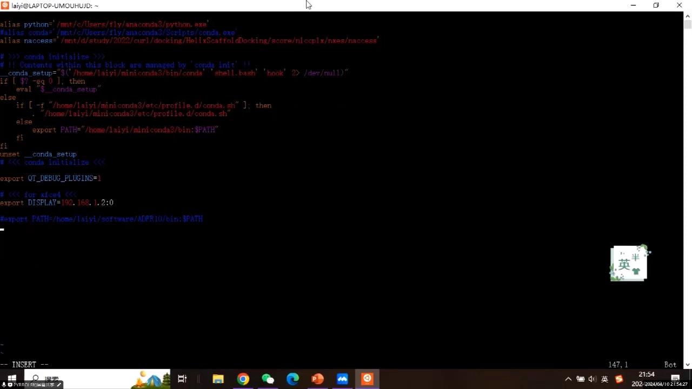 |
| 你要找到你自己的这个文件，或者说你 Rosetta 是在哪个地方，好吧，把这里的给替换成你自己的路径。对，然后接下来我们要退出这个文件。 [【跳转到 164:47】](https://www.bilibili.com/video/BV1mkdwBoE6Z/?t=9887) | 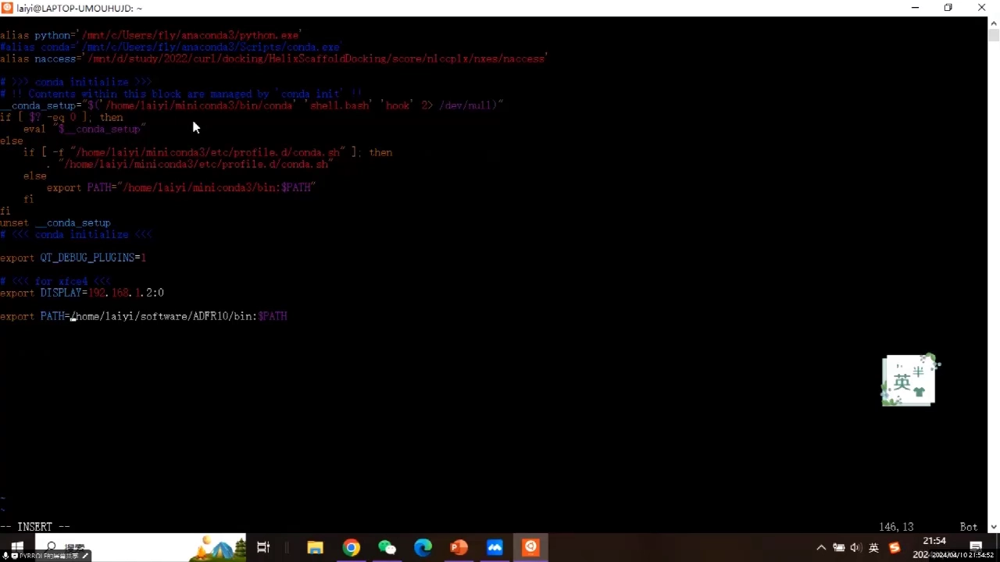 |
| 我们要退出编辑文件的话，先按一下 ESC，按完 ESC 之后，我们会发现左下角的 insert 消失了，现在呢我们就要退出这个编辑文件。那么我们在每次用 Word 或者用各种文件的时候，你在关闭的时候它会显示你保存不保存，对吧？ [【跳转到 165:12】](https://www.bilibili.com/video/BV1mkdwBoE6Z/?t=9912) |  |
| 然后那么 Linux 呢，它是这样的，它会有两种：就是当你在没有编辑这个文件的时候，你直接可以选退出；那么你在编辑了这个文件的时候，你要写明是你要更改它并退出，还是说不更改它退出。那么在采取这些命令之前，我们先要在按完 ESC 之后按一下冒号。 [【跳转到 165:37】](https://www.bilibili.com/video/BV1mkdwBoE6Z/?t=9937) | 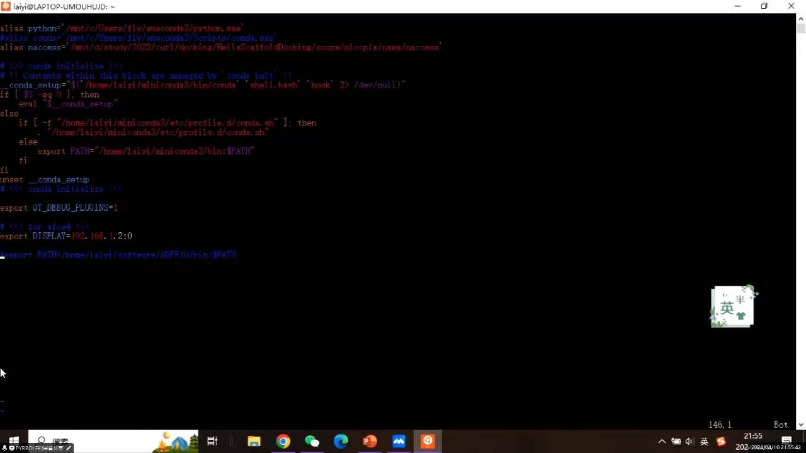 |
| 左下角有个冒号，光标在左下角，大家能看到吗？ [【跳转到 166:02】](https://www.bilibili.com/video/BV1mkdwBoE6Z/?t=9962) | 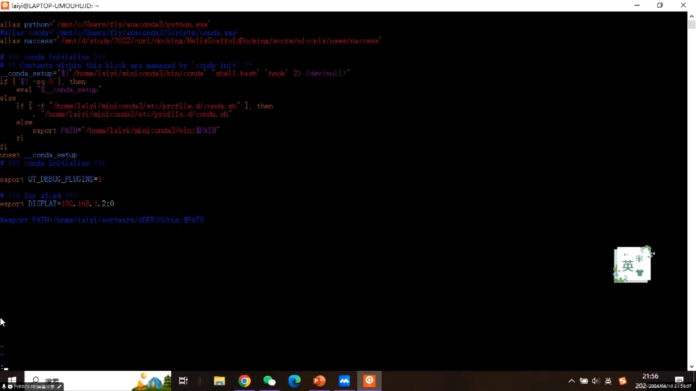 |
| （此区间无字幕） [【跳转到 166:07】](https://www.bilibili.com/video/BV1mkdwBoE6Z/?t=9967) | 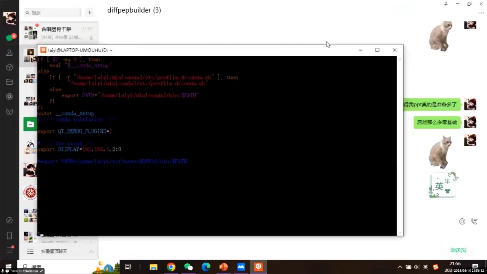 |
| 这里有个冒号，对吧？然后我们按 write and quit，就是 wq，就是 write and quit，对，然后再按 enter，我们就把我们的更改给保存了。 [【跳转到 166:12】](https://www.bilibili.com/video/BV1mkdwBoE6Z/?t=9972) | 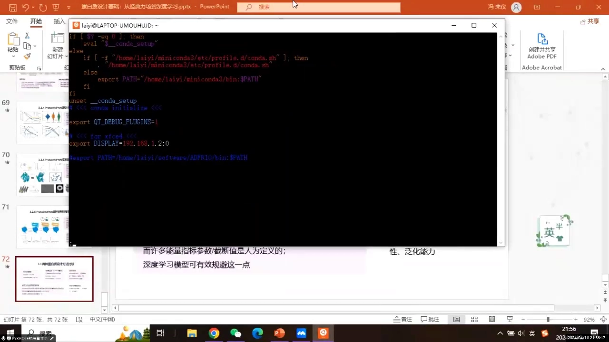 |
| （此区间无字幕） [【跳转到 166:37】](https://www.bilibili.com/video/BV1mkdwBoE6Z/?t=9997) | 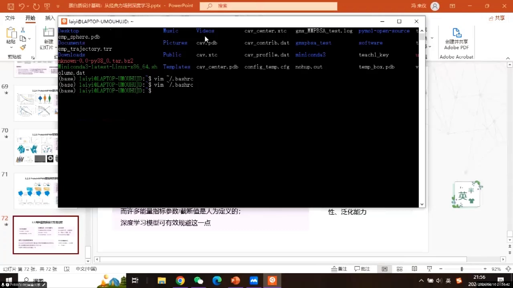 |
| 那么如果我们不想保存更改呢？比如说我在这打了个 11111，然后我不想更改它，那么我就按——还是按冒号，一定要记住，所有退出编辑文件先按 ESC，再按冒号，q，然后叹号，我就不更改它，这样我在编辑的时候我会发现刚打的 1、1 不见了。然后你像我现在没有做任何编辑，我想退出就还是按冒号，然后 q 再 enter。 [【跳转到 166:42】](https://www.bilibili.com/video/BV1mkdwBoE6Z/?t=10002) | 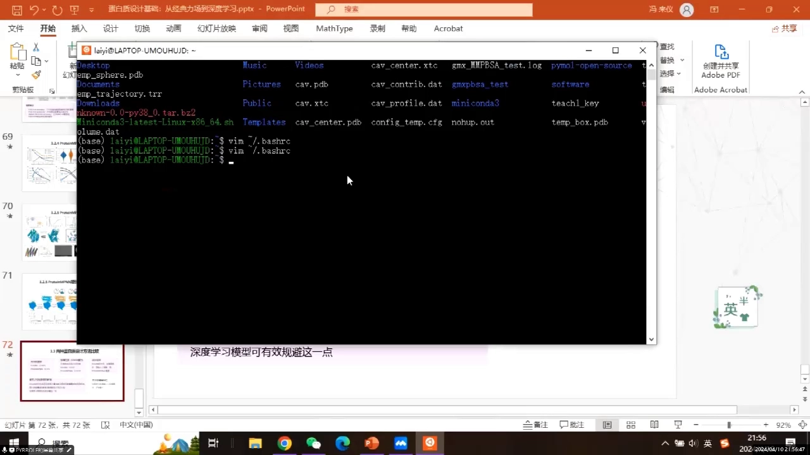 |
| 然后就出来了。那么我们在编辑了我们的环境变量之后，我们需要 source 它，它才会真正地实行、实行它的变化，大家可以理解为先是点确定，然后再点应用。那么是怎么做呢？source，然后还是同样的路径，source 然后波浪线斜杠 .bashrc，然后按 enter。 [【跳转到 167:07】](https://www.bilibili.com/video/BV1mkdwBoE6Z/?t=10027) | 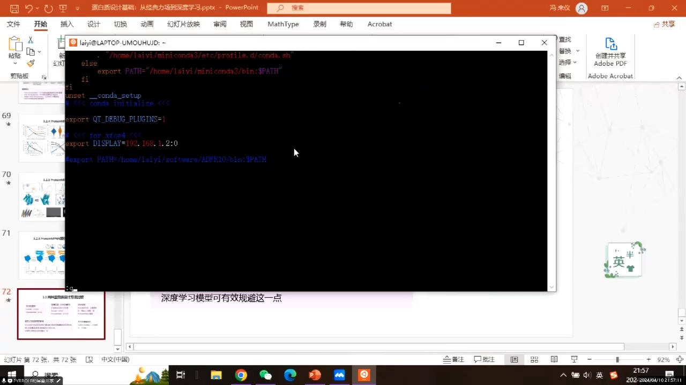 |
| 然后它会稍微停顿一会儿，再执行里面的命令，对，然后这样的环境变量就 OK 了。接下来还是我们就是用 Linux 系统非常常用的一个事情，就是我们如何跟 Windows 系统里面的文件共享起来呢？首先它 Linux 系统你的 home 是你的主目录，然后在 Linux 系统看来， [【跳转到 167:32】](https://www.bilibili.com/video/BV1mkdwBoE6Z/?t=10052) | 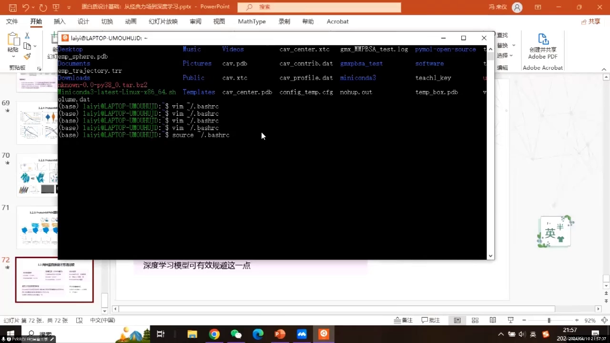 |
| 你 Windows 是一个寄宿的系统、是另一个系统，所以呢它会把它们挂靠在一个叫 mnt 的文件夹下。比如说我们想要看看我们 C 盘下面有什么，我们就 ls [【跳转到 167:57】](https://www.bilibili.com/video/BV1mkdwBoE6Z/?t=10077) | 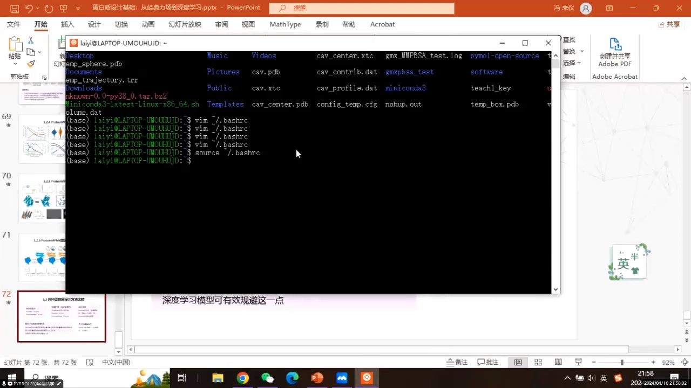 |
| （此区间无字幕） [【跳转到 168:11】](https://www.bilibili.com/video/BV1mkdwBoE6Z/?t=10091) | 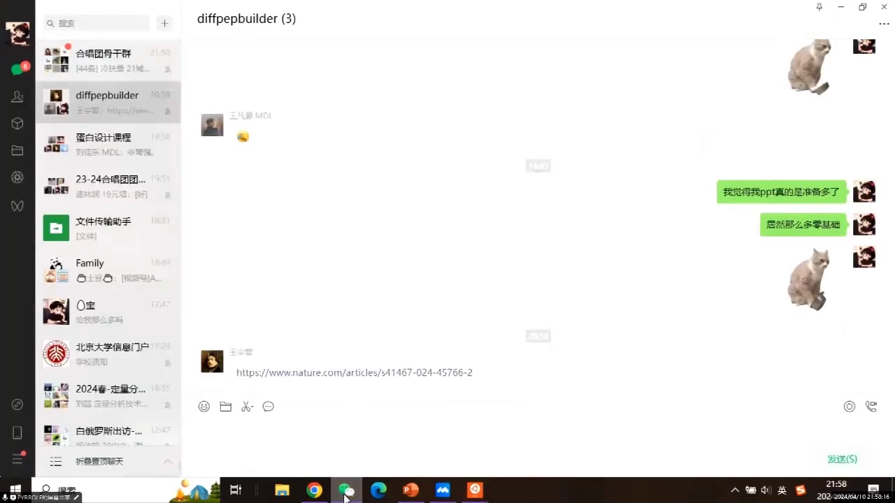 |
| 嗯嗯，我先回答群里同学的那个问题，大家也可以看一下，这个问题是经常出现的。它的这个 swp 就是 swap 的意思，也就是说他在你上一次没有保存退出了，然后他会把这个文——因为一些意外你并没有按照正常途径退出，他会把这个文件给保存下来。 [【跳转到 168:16】](https://www.bilibili.com/video/BV1mkdwBoE6Z/?t=10096) |  |
| 那么这种情况下呢，你可以直接删除文件，因为你自己的 .bashrc 并没有被改变，好吧。所以说你可以直接按 d，把你的 swp 文件直接删掉就可以了。接下来言归正传，说一下我们 Windows 系统是怎么共享 [【跳转到 168:41】](https://www.bilibili.com/video/BV1mkdwBoE6Z/?t=10121) |  |
| 我们 Windows 系统的这个文件啊，ls 的命令大家还记得吗？ls、ls 命令就是查看当前目录下、查看你的目录、你要看的目录下有什么东西，/mnt。然后呢我给大家教一个小技巧，就比如说你的文件名特别大、特别长的时候，你按 tab，它会自动把这个东西给补出来。 [【跳转到 169:06】](https://www.bilibili.com/video/BV1mkdwBoE6Z/?t=10146) | 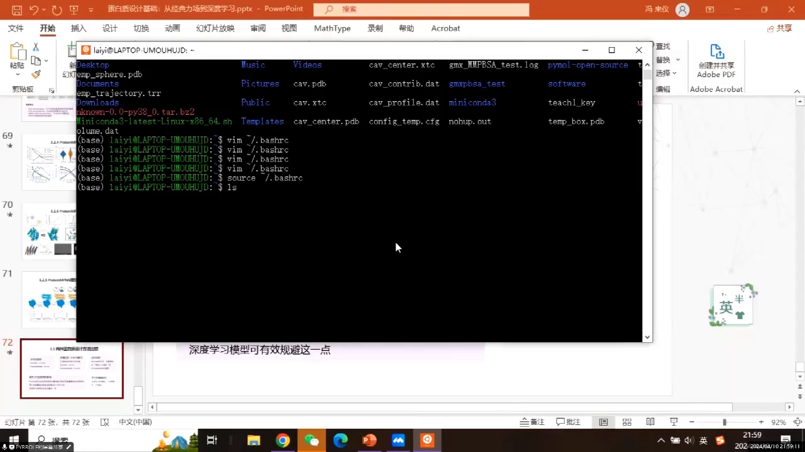 |
| OK 吧。然后你下 mnt，你不知道你有哪些盘，你就按两下 tab，你会发现你一个 C 盘、一个 D 盘，这个就是你 Windows 文件夹的磁盘。然后你按一下 C 再 tab，然后再 tab，它就会显示你所有的东西都有什么。 [【跳转到 169:31】](https://www.bilibili.com/video/BV1mkdwBoE6Z/?t=10171) | 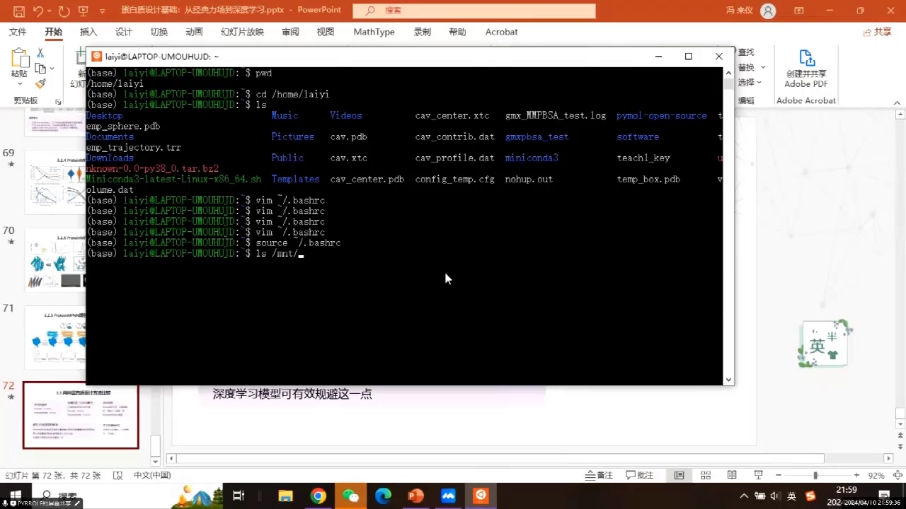 |
| OK 吗？像有的同学他下载 Rosetta 下载到了那个 Windows 磁盘、Windows 文件夹里面，你就可以用这个命令、用这种 mnt 的这个路径把它复制到这。那么具体的复制命令是什么呢？cp，如果你想复制一个文件夹，你就 -r，然后 /mnt/C，然后随便选一个文件夹，比如说我把这个 3Q47 [【跳转到 169:56】](https://www.bilibili.com/video/BV1mkdwBoE6Z/?t=10196) | 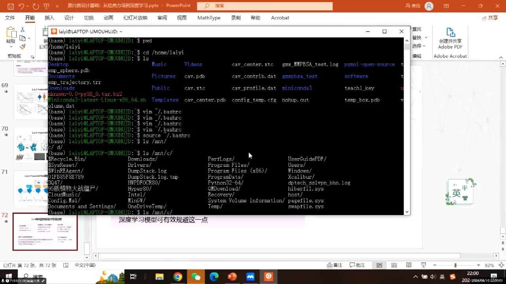 |
| 这个文件夹复制到我当前目录下，我就把这个文件夹打出来、打出来，然后呢 [【跳转到 170:21】](https://www.bilibili.com/video/BV1mkdwBoE6Z/?t=10221) | 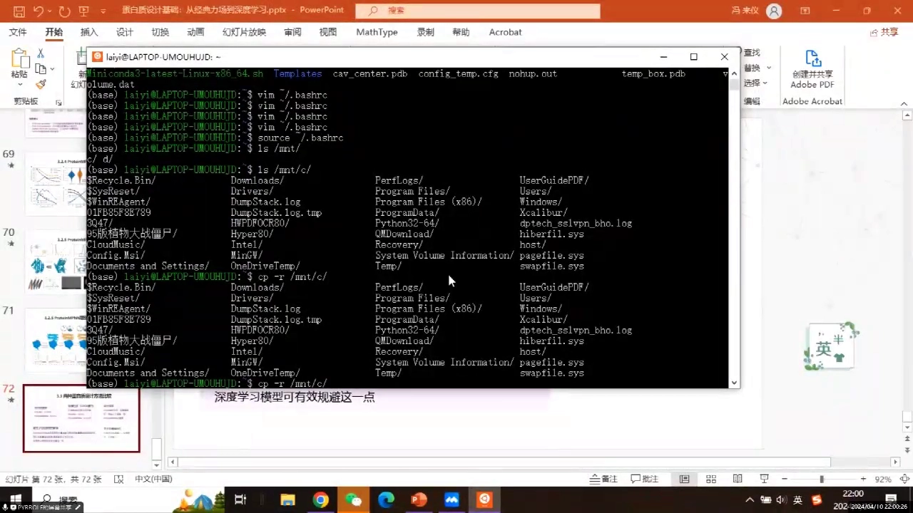 |
| 打出来，然后呢空格、点、点点，就是当前文件的意思。 [【跳转到 170:29】](https://www.bilibili.com/video/BV1mkdwBoE6Z/?t=10229) | 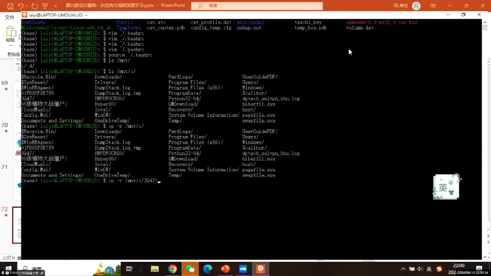 |
| 就是我把这个 3Q47 这个文件夹复制到我当前文件夹下，按 enter，它就在复制中，然后我 ls 当前文件夹，我就会看到 3Q47 就在这了。大家懂了吗？就是这个命令就是 cp。然后如果你想要复制一个 file，比如说你要复制那个 Rosetta 的那个 tgz file，你就 cp，然后直接 cp /mnt/C，然后选择一个，比如说我想——比如说是个 .log 文件， [【跳转到 170:34】](https://www.bilibili.com/video/BV1mkdwBoE6Z/?t=10234) | 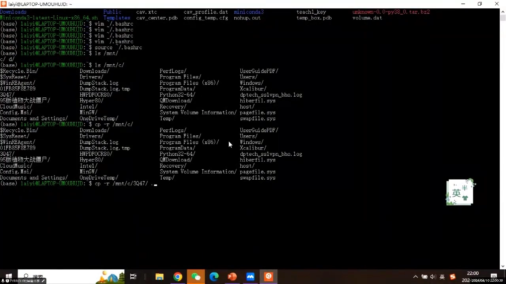 |
| 它是个文件，然后把它复制到这，哦。然后如果出现这种 permission denied，就说明这个文件它是一个需要比较高读取权限的，这个时候你就加一个 sudo、sudo，就是意思是我现在是管理员，然后你先输入一下密码。哦算了，这可能是 Windows 系统的文件，它复制不了，但是我们那个 Rosetta 肯定可以复制的。 [【跳转到 170:59】](https://www.bilibili.com/video/BV1mkdwBoE6Z/?t=10259) | 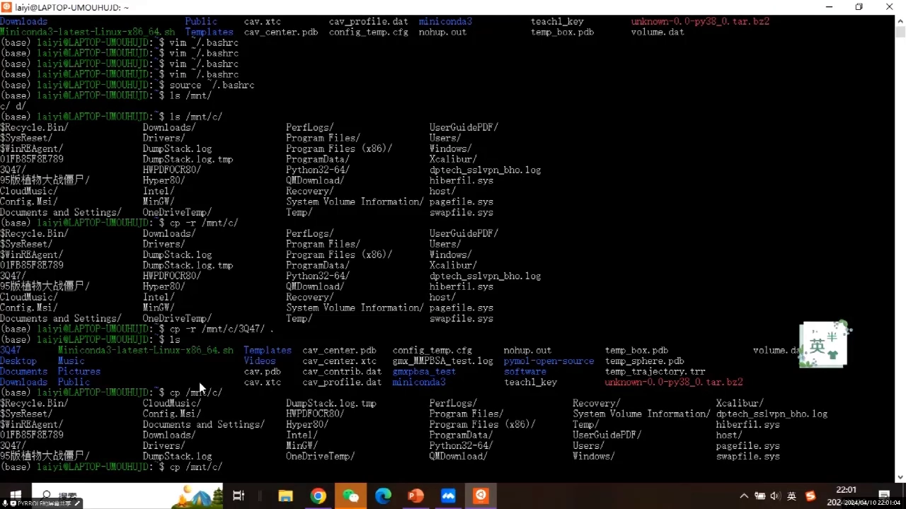 |
| 大家就差不多这样就可以了。然后我们想要删除什么东西，rm 空格 -rf 3Q47，enter，然后你再 ls 一下，它就没了。注意一下，这个东西是没有回收站、回收站的，所以任何的 rm -rf 操作一定要谨慎。好，然后其他的话暂时没有什么。 [【跳转到 171:24】](https://www.bilibili.com/video/BV1mkdwBoE6Z/?t=10284) | 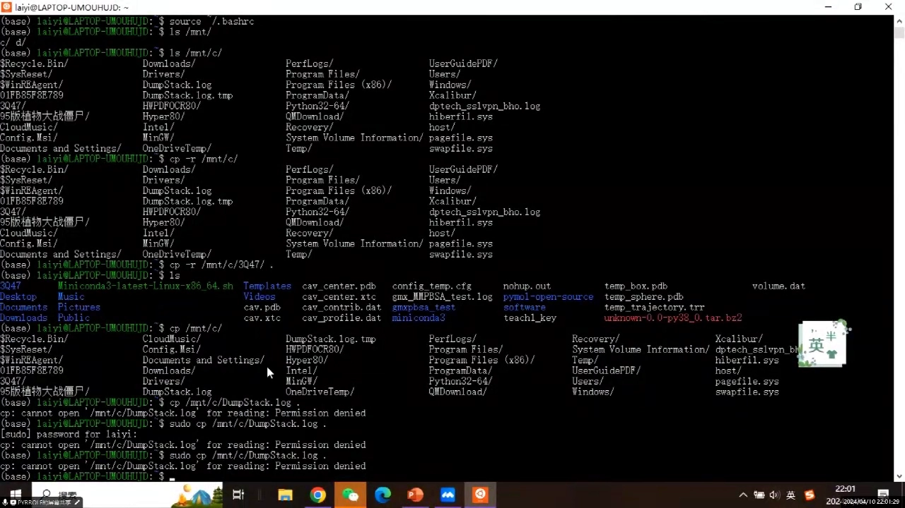 |
| 大家把这几个给记住就可以了，就至少你看过我操作过之后，你看网上的教程也清楚多了，好吧。然后我们今天的课就到这里，不保存就是冒号，然后 q 叹号。 [【跳转到 171:49】](https://www.bilibili.com/video/BV1mkdwBoE6Z/?t=10309) |  |
| （此区间无字幕） [【跳转到 172:14】](https://www.bilibili.com/video/BV1mkdwBoE6Z/?t=10334) | 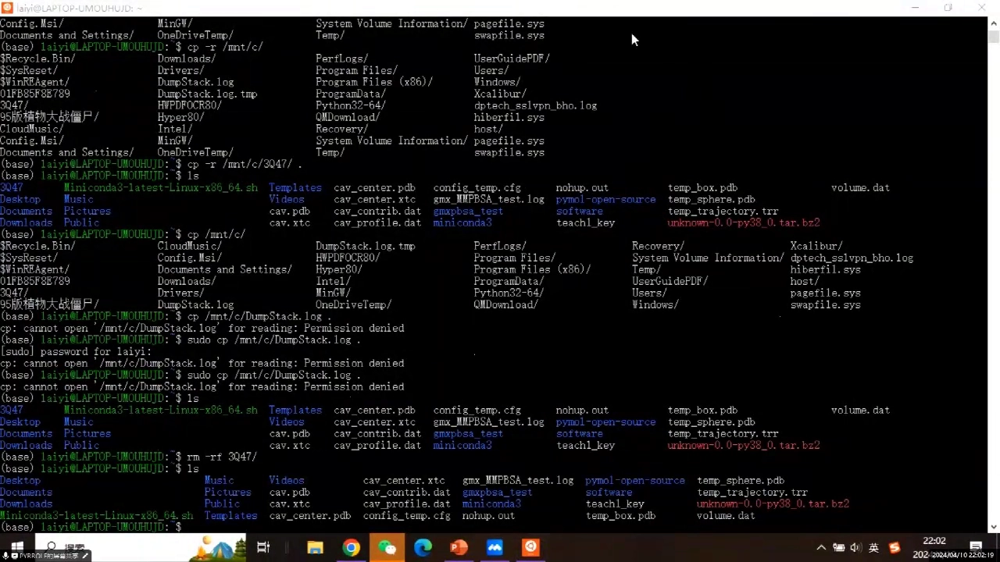 |